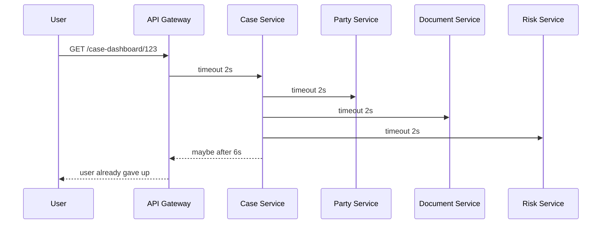
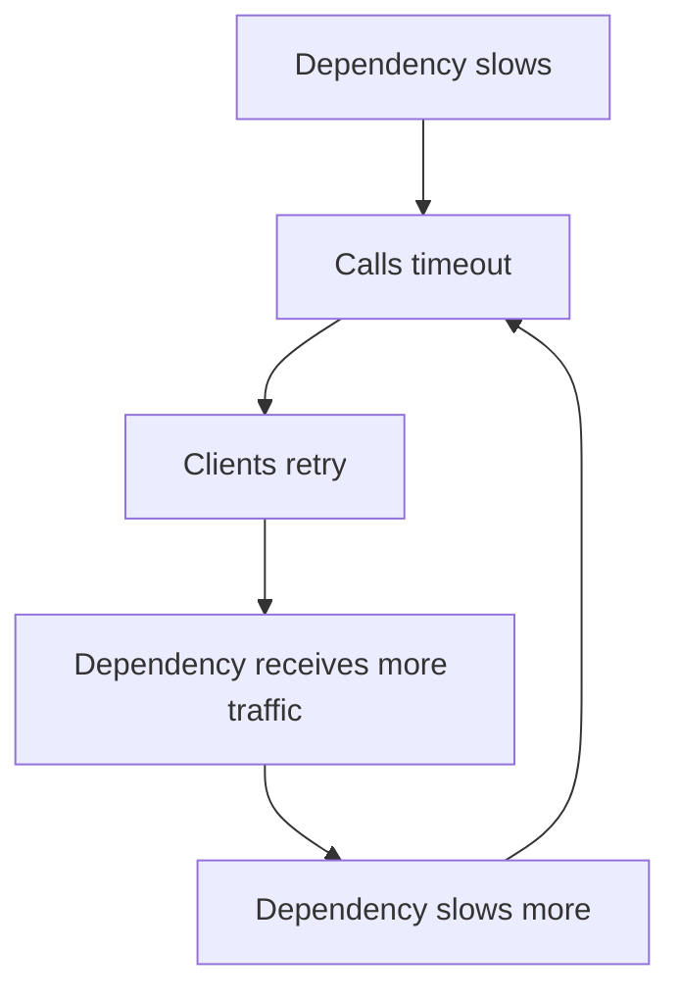
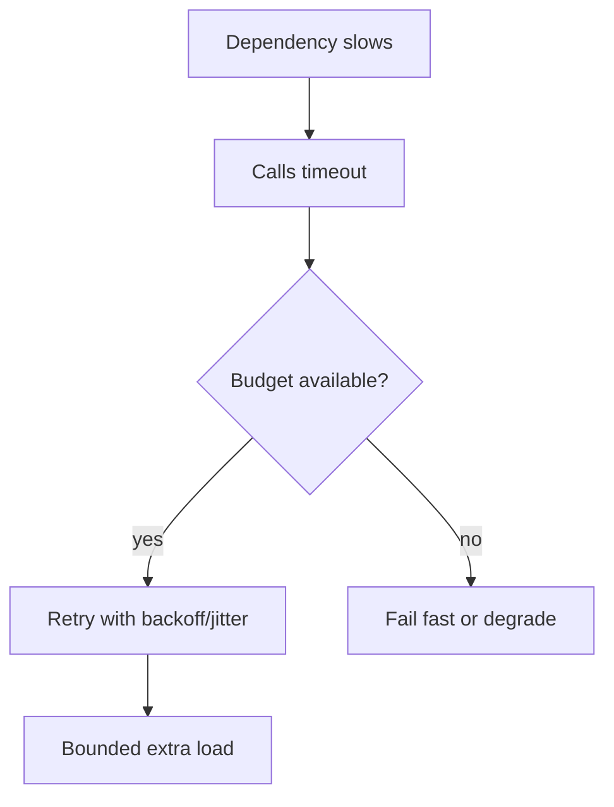
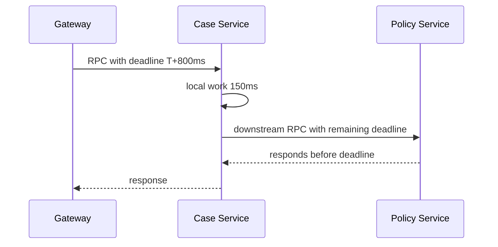
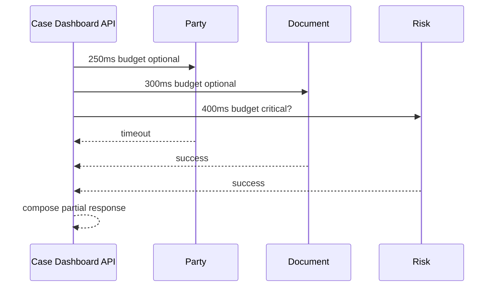

# Part 040 — Timeouts, Deadlines, and Budget Propagation

Timeout adalah salah satu setting paling kecil yang dampaknya paling besar.

Timeout yang salah bisa menyebabkan:

- thread pool habis,
- connection pool habis,
- user-facing latency meledak,
- retry storm,
- cascading failure,
- transaksi database terlalu lama,
- kerja sia-sia setelah caller sudah menyerah,
- false failure,
- broken user journey,
- hidden cost.

Timeout bukan angka acak di config.

Timeout adalah **runtime contract**.

Deadline adalah versi yang lebih kuat: bukan “tiap hop boleh menunggu X ms”, tetapi “seluruh operasi ini harus selesai sebelum waktu tertentu”.

Budget propagation adalah disiplin untuk membagi waktu yang tersisa ke dependency yang dipanggil service.

> Timeout menjawab: “berapa lama call ini boleh menunggu?”
>
> Deadline menjawab: “kapan seluruh pekerjaan ini sudah tidak berguna lagi?”
>
> Budget propagation menjawab: “berapa sisa waktu yang boleh dipakai oleh hop berikutnya?”

---

## 1. The Core Problem

Misalkan user-facing request punya target selesai di bawah 1 detik.

Naive service chain:



Every hop has a “reasonable” 2-second timeout. End-to-end result is unreasonable.

A distributed request does not care that each local timeout looked acceptable. The user experiences the sum, plus queueing, plus retries, plus serialization, plus network.

Correct mental model:

```text
end-to-end deadline = fixed budget
each hop spends from remaining budget
no hop may pretend it owns unlimited time
```

---

## 2. Timeout vs Deadline

### Timeout

A timeout is a relative duration.

Example:

```text
call Party Service, wait at most 300ms
```

Timeout is local to a particular operation.

### Deadline

A deadline is an absolute point in time.

Example:

```text
this request must finish before 2026-07-05T10:15:31.500Z
```

Deadline can be propagated across services.

Why deadline is better for distributed chains:

- avoids per-hop timeout explosion,
- lets downstream know remaining time,
- prevents work after caller has given up,
- allows cancellation,
- helps enforce user journey latency.

---

## 3. Budget Propagation

Budget propagation means carrying remaining time across service calls.

Example:

```text
Gateway receives request at T0
End-to-end deadline = T0 + 1000ms

Gateway spends 50ms
Case Service receives with 950ms remaining

Case Service spends 120ms loading local data
Remaining = 830ms

Case Service calls Party Service with max 250ms
Case Service calls Risk Service with max 400ms
Case Service reserves 100ms for response assembly
```

The caller should not give downstream the full original budget if it still needs time to finish its own work.

```mermaid
gantt
    title End-to-End Latency Budget
    dateFormat X
    axisFormat %Lms

    section Gateway
    auth/routing              :0, 50
    section Case Service
    local read                :50, 170
    party call                :170, 420
    risk call                 :170, 570
    compose response          :570, 700
    section Reserved
    safety margin             :700, 1000
```



Budget is not only technical. It reflects product expectation and SLO.

---

## 4. Why Default Timeouts Are Dangerous

Many HTTP clients, database clients, SDKs, and RPC libraries have defaults that are not aligned with your business operation.

Possible bad defaults:

- no timeout,
- very long timeout,
- connect timeout but no response/read timeout,
- socket timeout but no total operation timeout,
- retry hidden inside SDK,
- connection acquisition timeout not configured,
- request timeout longer than upstream gateway timeout,
- DB query timeout longer than API timeout.

If the API gateway times out at 2 seconds but your service keeps working for 30 seconds, you are burning resources for a request nobody will receive.

---

## 5. Timeout Types

Timeout is not one thing.

| Timeout | Meaning | Failure prevented |
|---|---|---|
| connect timeout | time to establish TCP connection | hanging connect |
| TLS handshake timeout | time to establish secure session | handshake stall |
| connection acquisition timeout | time waiting for pooled connection | pool starvation |
| request write timeout | time to send request body | stuck upload |
| response timeout | time waiting for first/complete response | slow dependency |
| read timeout | inactivity while reading | stalled stream |
| total operation timeout | total time for full call | per-call budget violation |
| database query timeout | max query execution time | long-running query |
| transaction timeout | max transaction lifetime | lock/resource retention |
| queue wait timeout | max time waiting before execution | stale work |
| workflow/activity timeout | max step duration | stuck process |

A production design should say which timeout is being configured.

---

## 6. Timeout Budget Should Follow Criticality

Not all operations deserve equal timeout.

### User-facing read

Usually short.

```text
case summary endpoint: 300ms to 1000ms target depending product
optional enrichment: 100ms to 300ms
```

### User-facing command

Can be slightly longer but must not block on deferrable side effects.

```text
submit case: local transaction only
notifications: async
search index: async
analytics: async
```

### Background job

Can be longer, but must have:

- batch chunk timeout,
- item timeout,
- retry budget,
- cancellation,
- checkpoint,
- backpressure.

### Workflow step

Can be long-running, but should use explicit durable timeout/timer, not a blocking thread.

---

## 7. Bad Timeout Design Patterns

### Pattern 1: Same timeout everywhere

```yaml
timeout: 30s
```

This says nothing about user journey, dependency criticality, or failure containment.

### Pattern 2: Downstream timeout longer than upstream deadline

```text
Gateway timeout: 1s
Case -> Party timeout: 5s
```

Waste.

### Pattern 3: Retry duration exceeds request budget

```text
request budget: 800ms
dependency timeout: 500ms
retry: 3 attempts
backoff: 200ms
```

Impossible budget.

### Pattern 4: DB transaction wraps remote timeout

```text
start transaction
call external service with 2s timeout
save
commit
```

The DB transaction is now hostage to the network.

### Pattern 5: Timeout without cancellation

Timeout at caller, but downstream keeps working.

This is common when cancellation is not propagated.

---

## 8. Timeouts and Retries Must Be Designed Together

Timeout and retry are inseparable.

Example:

```text
dependency timeout = 300ms
retry attempts = 2 retries
backoff = 100ms then 200ms
```

Worst-case time:

```text
attempt1 300ms
backoff1 100ms
attempt2 300ms
backoff2 200ms
attempt3 300ms
total = 1200ms
```

If end-to-end budget is 800ms, this retry policy cannot fit.

Formula:

```text
worst_case_time =
  sum(attempt_timeouts)
  + sum(backoffs)
  + local_processing_margin
  + response_margin
```

A retry policy that does not fit the deadline is a hidden availability bug.

---

## 9. Retry Budget

Retry budget limits how much extra load retries may add.

Without retry budget:



With retry budget:



Retry budget can be enforced:

- per request,
- per dependency,
- per client instance,
- per tenant,
- globally at gateway/service mesh.

---

## 10. Deadline Propagation Model

A practical propagation model:

1. edge sets request deadline,
2. service reads deadline from inbound header/context,
3. service computes remaining budget,
4. service reserves local finishing time,
5. service assigns per-dependency sub-budget,
6. service propagates deadline or timeout downstream,
7. downstream stops work if deadline expired,
8. telemetry records deadline and budget exhaustion.

Example inbound header:

```http
X-Request-Deadline: 2026-07-05T10:15:31.500Z
X-Request-Id: 01HZ...
```

Better in some ecosystems:

- W3C trace context for trace correlation,
- gRPC deadline context for RPC,
- service mesh timeout policy,
- application-level request context.

Do not put security-sensitive data in headers. Deadline is operational metadata.

---

## 11. Java Request Deadline Object

Framework-neutral sketch:

```java
import java.time.Clock;
import java.time.Duration;
import java.time.Instant;

public final class RequestDeadline {
    private final Instant deadline;
    private final Clock clock;

    private RequestDeadline(Instant deadline, Clock clock) {
        this.deadline = deadline;
        this.clock = clock;
    }

    public static RequestDeadline after(Duration duration, Clock clock) {
        return new RequestDeadline(clock.instant().plus(duration), clock);
    }

    public static RequestDeadline at(Instant deadline, Clock clock) {
        return new RequestDeadline(deadline, clock);
    }

    public Duration remaining() {
        Duration remaining = Duration.between(clock.instant(), deadline);
        return remaining.isNegative() ? Duration.ZERO : remaining;
    }

    public boolean expired() {
        return remaining().isZero();
    }

    public Duration allocate(Duration desired, Duration reserve) {
        Duration available = remaining().minus(reserve);

        if (available.isNegative() || available.isZero()) {
            return Duration.ZERO;
        }

        return desired.compareTo(available) <= 0 ? desired : available;
    }

    public Instant instant() {
        return deadline;
    }
}
```

Usage:

```java
Duration partyTimeout = deadline.allocate(
        Duration.ofMillis(300),
        Duration.ofMillis(150) // reserve for local finish
);

if (partyTimeout.isZero()) {
    throw new DeadlineExceededException("CASE_REQUEST_DEADLINE_EXCEEDED");
}

PartyProfile profile = partyClient.getProfile(partyId, partyTimeout);
```

The key is not the class. The key is the discipline: every dependency receives a bounded budget.

---

## 12. Timeout Policy by Dependency

Example config:

```yaml
service:
  request:
    default-deadline: 1000ms
    response-reserve: 100ms

dependencies:
  party-service:
    criticality: optional
    connect-timeout: 100ms
    response-timeout: 300ms
    max-attempts: 1
    fallback: omit-fragment

  policy-service:
    criticality: critical
    connect-timeout: 100ms
    response-timeout: 500ms
    max-attempts: 1
    fallback: fail-closed

  document-service:
    criticality: optional
    connect-timeout: 100ms
    response-timeout: 400ms
    max-attempts: 2
    backoff: 50ms
    fallback: return-metadata-only
```

This config should be validated at startup.

Invalid example:

```text
party-service response-timeout 1500ms
request default-deadline 1000ms
```

The service should fail fast at startup or emit a critical config warning.

---

## 13. Spring WebClient Timeout Model

With Spring WebClient backed by Reactor Netty, you commonly configure Reactor Netty `HttpClient`.

Example:

```java
import io.netty.channel.ChannelOption;
import java.time.Duration;
import org.springframework.http.client.reactive.ReactorClientHttpConnector;
import org.springframework.web.reactive.function.client.WebClient;
import reactor.netty.http.client.HttpClient;

public final class PartyClientFactory {
    public static WebClient partyWebClient(String baseUrl) {
        HttpClient httpClient = HttpClient.create()
                .option(ChannelOption.CONNECT_TIMEOUT_MILLIS, 100)
                .responseTimeout(Duration.ofMillis(300));

        return WebClient.builder()
                .baseUrl(baseUrl)
                .clientConnector(new ReactorClientHttpConnector(httpClient))
                .build();
    }
}
```

Per-request timeout can also be applied at the reactive pipeline level:

```java
public Mono<PartyProfile> getProfile(PartyId partyId, Duration budget) {
    return webClient.get()
            .uri("/parties/{id}/profile", partyId.value())
            .retrieve()
            .bodyToMono(PartyProfile.class)
            .timeout(budget);
}
```

Be careful: pipeline timeout and network timeout are not identical. Network-level timeout configures client IO behavior; pipeline timeout bounds the reactive operation. In production, be explicit about both when needed.

---

## 14. Java 11+ HttpClient Timeout

Java’s built-in `HttpClient` supports connection timeout and per-request timeout.

```java
import java.net.URI;
import java.net.http.HttpClient;
import java.net.http.HttpRequest;
import java.net.http.HttpResponse;
import java.time.Duration;

public final class PolicyHttpClient {
    private final HttpClient client = HttpClient.newBuilder()
            .connectTimeout(Duration.ofMillis(100))
            .build();

    public PolicyDecision evaluate(String payload, Duration budget) throws Exception {
        HttpRequest request = HttpRequest.newBuilder()
                .uri(URI.create("https://policy.internal/evaluate"))
                .timeout(budget)
                .header("Content-Type", "application/json")
                .POST(HttpRequest.BodyPublishers.ofString(payload))
                .build();

        HttpResponse<String> response =
                client.send(request, HttpResponse.BodyHandlers.ofString());

        if (response.statusCode() >= 500) {
            throw new DependencyUnavailableException("policy-service");
        }

        return PolicyDecisionParser.parse(response.body());
    }
}
```

Again, timeout must fit the request deadline and retry policy.

---

## 15. gRPC Deadlines in Java

gRPC has deadline support as a first-class concept.

Example client call:

```java
PolicyDecisionResponse response = policyBlockingStub
        .withDeadlineAfter(500, java.util.concurrent.TimeUnit.MILLISECONDS)
        .evaluate(request);
```

For async stub:

```java
PolicyServiceGrpc.PolicyServiceStub stubWithDeadline =
        policyStub.withDeadlineAfter(500, java.util.concurrent.TimeUnit.MILLISECONDS);

stubWithDeadline.evaluate(request, responseObserver);
```

gRPC deadline failure typically appears as `DEADLINE_EXCEEDED`.

```java
try {
    return policyBlockingStub
            .withDeadlineAfter(timeout.toMillis(), TimeUnit.MILLISECONDS)
            .evaluate(request);
} catch (StatusRuntimeException ex) {
    if (ex.getStatus().getCode() == Status.Code.DEADLINE_EXCEEDED) {
        throw new DependencyTimeoutException("policy-service", ex);
    }
    throw ex;
}
```

Important: downstream should stop work when deadline is exceeded. Deadline is not only for caller patience; it is also a cancellation signal.

---

## 16. Deadline Propagation with gRPC

gRPC Java can propagate deadlines through context when server code makes downstream gRPC calls.

Conceptually:



If B ignores deadline and creates a fresh 2-second timeout to C, then B violates the caller contract.

You want:

```text
downstream timeout <= remaining deadline - local reserve
```

---

## 17. Server-Side Request Timeout

Client timeout is not enough. Server should also protect itself.

Examples:

- server request timeout,
- max request body size,
- max header size,
- async request timeout,
- executor queue timeout,
- DB transaction timeout,
- endpoint-level concurrency limit,
- cancellation check in long-running operations.

For long-running business processes, do not keep HTTP request open forever. Use async command pattern:

```text
POST /case-reviews
202 Accepted
Location: /tasks/{taskId}
```

Then process via workflow/job/message.

---

## 18. Cancellation

Timeout without cancellation can still waste downstream resources.

Cancellation matters when:

- caller disconnects,
- deadline expires,
- request is no longer useful,
- parent workflow is cancelled,
- user cancels operation.

In Java:

- gRPC has cancellation/deadline semantics,
- reactive chains can cancel subscriptions,
- blocking JDBC queries may need query timeout,
- external API may not support cancellation,
- background workers need cooperative cancellation.

Design long-running code to check cancellation points.

```java
public void rebuildProjection(ProjectionJob job, CancellationToken token) {
    while (job.hasNextBatch()) {
        if (token.isCancelled()) {
            throw new JobCancelledException(job.id());
        }

        ProjectionBatch batch = job.nextBatch();
        projectionRepository.apply(batch);
        job.checkpoint();
    }
}
```

---

## 19. Database Timeout

Do not forget DB timeouts.

Database-related controls:

- connection acquisition timeout,
- query timeout,
- lock timeout,
- statement timeout,
- transaction timeout,
- connection max lifetime,
- idle timeout.

Example Spring transaction timeout:

```java
import org.springframework.transaction.annotation.Transactional;

@Transactional(timeout = 3)
public void submitCase(SubmitCaseCommand command) {
    // must complete DB transaction within 3 seconds
}
```

This does not replace query-level or database-level controls. It is one layer.

For PostgreSQL, teams often use `statement_timeout` and `lock_timeout` at session or transaction level. The exact setup belongs to database/platform standards, but architecture should require the control.

---

## 20. Queue Wait Timeout

Queues also need time budgets.

A request sitting in an executor queue for 900ms before running has already spent most of a 1s deadline.

For thread pools:

- bound queue size,
- measure queue age,
- reject stale work,
- prefer fail-fast over invisible latency,
- separate pools by workload criticality.

Pseudo-wrapper:

```java
public record TimedTask<T>(
        Instant enqueuedAt,
        Duration maxQueueAge,
        Callable<T> task
) {
    public T call(Clock clock) throws Exception {
        Duration age = Duration.between(enqueuedAt, clock.instant());

        if (age.compareTo(maxQueueAge) > 0) {
            throw new StaleWorkRejectedException("TASK_QUEUE_WAIT_EXCEEDED");
        }

        return task.call();
    }
}
```

Queue timeout is often missing in designs. That is why systems appear healthy while latency explodes.

---

## 21. Parallel Fan-Out Budget

API composition often calls multiple dependencies.

Naive fan-out:

```java
PartyProfile party = partyClient.get(...);
DocumentSummary docs = documentClient.get(...);
RiskScore risk = riskClient.get(...);
```

Sequential calls spend budget one by one.

Parallel fan-out:

```java
CompletableFuture<PartyProfile> party =
        partyClient.getAsync(partyId, Duration.ofMillis(250));

CompletableFuture<DocumentSummary> docs =
        documentClient.getAsync(caseId, Duration.ofMillis(300));

CompletableFuture<RiskScore> risk =
        riskClient.getAsync(caseId, Duration.ofMillis(400));
```

But parallel fan-out still needs:

- total deadline,
- bounded executor,
- cancellation,
- partial response policy,
- separate pools,
- dependency-specific timeout,
- completion margin.

Mermaid model:



---

## 22. Timeout and Idempotency

Timeout often triggers retry. Retry requires idempotency.

For GET-like reads, retry may be safe if:

- dependency overload is not worsened,
- retry budget exists,
- timeout is short,
- response staleness is acceptable.

For commands, retry is safe only if:

- idempotency key exists,
- request hash is validated,
- operation ID is stable,
- response replay exists,
- external side effects are deduplicated.

Bad:

```text
POST /payments
timeout
retry
duplicate charge
```

Better:

```text
POST /case-decisions
Idempotency-Key: case-123:decision-456:submit
timeout
retry with same key
server returns same result or current operation status
```

---

## 23. Timeout and Fallback

Fallback is not a timeout strategy unless the fallback is semantically valid.

Examples:

| Dependency | Timeout Behavior | Valid Fallback? |
|---|---|---|
| Party profile enrichment | omit party profile | yes |
| Policy engine for enforcement decision | approve by default | no |
| Feature flag for UI decoration | safe default | maybe |
| Exchange rate for financial transaction | use stale rate | only if business-approved |
| Audit outbox | ignore audit | no |
| Search index | delay indexing | yes |

Timeout fallback must be reviewed with business meaning.

---

## 24. Timeout Observability

Every dependency call should expose:

- dependency name,
- operation name,
- timeout configured,
- deadline remaining at call start,
- latency,
- result: success/error/timeout/cancelled,
- retry attempt count,
- fallback used,
- degraded response flag,
- correlation/trace ID.

Example log:

```json
{
  "event": "dependency_call_completed",
  "dependency": "party-service",
  "operation": "getPartyProfile",
  "timeoutMs": 300,
  "deadlineRemainingMsAtStart": 620,
  "latencyMs": 301,
  "result": "timeout",
  "fallback": "omit-fragment",
  "requestId": "01HZ...",
  "traceId": "..."
}
```

Metrics:

```text
dependency_latency_ms{dependency, operation, outcome}
dependency_timeout_total{dependency, operation}
dependency_deadline_exhausted_total{operation}
dependency_fallback_total{dependency, fallback}
dependency_retry_attempt_total{dependency, operation}
request_budget_remaining_ms{operation}
```

Without timeout telemetry, tuning is guesswork.

---

## 25. Timeout Testing

Timeout behavior must be tested.

### Unit test

```java
@Test
void allocatesDependencyBudgetFromRemainingDeadline() {
    Clock clock = Clock.fixed(Instant.parse("2026-07-05T10:00:00Z"), ZoneOffset.UTC);
    RequestDeadline deadline = RequestDeadline.after(Duration.ofMillis(500), clock);

    Duration allocated = deadline.allocate(Duration.ofMillis(400), Duration.ofMillis(150));

    assertThat(allocated).isEqualTo(Duration.ofMillis(350));
}
```

### Integration test with slow dependency

```java
@Test
void returnsPartialResponseWhenPartyServiceTimesOut() {
    partyService.stubProfileDelay(Duration.ofSeconds(2));

    CaseDashboard dashboard = api.getCaseDashboard("CASE-123");

    assertThat(dashboard.meta().partial()).isTrue();
    assertThat(dashboard.meta().missingFragments()).contains("partyProfile");
}
```

### Load test

Test what happens when dependency latency rises:

- p50 normal, p99 slow,
- 1% dependency timeout,
- 10% dependency timeout,
- dependency completely unavailable,
- retry enabled vs disabled,
- fan-out under partial dependency failure.

### Chaos/GameDay

Ask:

- do timeouts prevent thread exhaustion?
- do retries amplify load?
- do dashboards identify dependency-specific latency?
- does fallback preserve business correctness?
- does cancellation stop wasted work?
- does service recover after dependency returns?

---

## 26. Timeout Decision Record

For important operations, record timeout decisions.

Template:

```md
# ADR: Timeout and Deadline Policy for Case Dashboard API

## Context

The case dashboard composes local case state, party profile, document summary, and risk score.
The endpoint is user-facing and targets p95 under 800ms.

## Decision

- Edge deadline: 1000ms.
- Case local read budget: 150ms.
- Party profile timeout: 250ms, optional, fallback omit fragment.
- Document summary timeout: 300ms, optional, fallback return count unavailable.
- Risk score timeout: 400ms, critical for high-risk workflow, otherwise partial.
- Response assembly reserve: 100ms.
- No retries in request path for optional enrichment.
- Retry only for idempotent GET with max one retry if remaining budget permits.

## Consequences

- Dashboard may return partial response.
- UI must show missing fragments.
- Operators monitor dependency timeout and fallback count.
- Policy-sensitive workflow must not proceed if risk score unavailable.

## Fitness Functions

- Dependency timeout must be lower than endpoint deadline.
- No remote call inside DB transaction.
- p95 endpoint latency under 800ms under normal dependency latency.
- Under Party Service outage, endpoint remains available with partial=true.
```

---

## 27. Practical Timeout Defaults

Do not blindly copy these. Use them as starting points for thinking.

| Call Type | Starting Timeout |
|---|---:|
| same-cluster optional enrichment | 100–300ms |
| same-cluster critical read | 300–700ms |
| user-facing composition endpoint | 500–1500ms total |
| external vendor request path | usually avoid; if unavoidable, tight and isolated |
| background vendor sync | seconds/minutes with durable retry |
| DB OLTP query | tens to hundreds of ms target; hard cap by query class |
| workflow activity | explicit durable timeout based on business SLA |

A timeout that is “generous” during normal operation can become catastrophic during failure.

---

## 28. Common Timeout Smells

### Smell 1: Timeout config exists but nobody knows why

Every timeout should map to a latency objective, dependency role, or failure containment goal.

### Smell 2: Timeout longer than caller timeout

This creates invisible wasted work.

### Smell 3: Retry policy ignores total deadline

This creates impossible latency budgets.

### Smell 4: Timeout only at gateway

Internal services still wait forever.

### Smell 5: Timeout only at HTTP layer

DB, queue, executor, and transaction can still hang.

### Smell 6: Timeout returns generic 500

Timeout is dependency failure or deadline exhaustion. Classify it.

### Smell 7: Fallback hides legal/business failure

Fallback must be domain-approved.

### Smell 8: No deadline in async workflow

Async does not mean unbounded. Use durable timers and activity timeouts.

---

## 29. Architecture Review Checklist

### Deadline

- [ ] User-facing operation has end-to-end deadline.
- [ ] Deadline is propagated across service calls where possible.
- [ ] Service reserves local finishing time.
- [ ] Work stops or is cancelled when deadline expires.

### Timeout

- [ ] Connect, response/read, acquisition, DB, queue, and transaction timeouts are considered.
- [ ] Dependency timeout is lower than remaining request budget.
- [ ] Critical and optional dependencies have different policies.
- [ ] Remote calls inside DB transaction are avoided or explicitly justified.

### Retry

- [ ] Retry policy fits within budget.
- [ ] Retry has backoff and jitter.
- [ ] Retry is only used for retryable failure modes.
- [ ] Commands are idempotent before retry is allowed.
- [ ] Retry budget prevents load amplification.

### Fallback

- [ ] Fallback is business-valid.
- [ ] Degraded response is visible.
- [ ] Fail-closed cases are explicit.
- [ ] Fail-open cases are explicitly approved.

### Observability

- [ ] Timeout count is visible per dependency.
- [ ] Deadline exhaustion is visible per operation.
- [ ] Budget remaining is logged or measured.
- [ ] Fallback and partial response count are visible.
- [ ] Retry attempt count is visible.

---

## 30. Exercise

Design timeout policy for this operation:

```text
GET /cases/{caseId}/dashboard
```

It needs:

- case summary from local DB,
- party profile from Party Service,
- open task count from Workflow Service,
- document summary from Document Service,
- risk indicator from Risk Service.

Constraints:

```text
target p95: 800ms
hard edge timeout: 1200ms
party profile optional
document summary optional
risk indicator critical if case is in DECISION_PENDING
workflow count optional but useful
```

Produce:

1. end-to-end deadline,
2. local reserve,
3. per-dependency timeout,
4. retry policy,
5. fallback behavior,
6. partial response shape,
7. metrics,
8. failure response for critical risk timeout,
9. load test scenario,
10. ADR summary.

---

## 31. Summary

Timeouts are not magic constants. They are architecture.

A production Java microservice needs:

- end-to-end deadline,
- per-dependency timeout,
- remaining budget calculation,
- retry budget,
- fallback semantics,
- cancellation strategy,
- DB/queue/transaction timeout,
- timeout telemetry,
- business review of degraded behavior.

Bad systems wait too long.

Fragile systems retry blindly.

Mature systems spend their time budget intentionally.

---

## References

- gRPC Deadlines: https://grpc.io/docs/guides/deadlines/
- gRPC and Deadlines blog: https://grpc.io/blog/deadlines/
- Spring Framework WebClient Configuration — Timeouts: https://docs.spring.io/spring-framework/reference/web/webflux-webclient/client-builder.html
- Java HTTP Client API: https://docs.oracle.com/en/java/javase/21/docs/api/java.net.http/java/net/http/HttpClient.html
- Resilience4j TimeLimiter: https://resilience4j.readme.io/docs/timeout
- Google SRE Book — Addressing Cascading Failures: https://sre.google/sre-book/addressing-cascading-failures/
- Microsoft Azure Architecture Center — Retry pattern: https://learn.microsoft.com/en-us/azure/architecture/patterns/retry
- RFC 9110 — HTTP Semantics: https://www.rfc-editor.org/rfc/rfc9110.html
