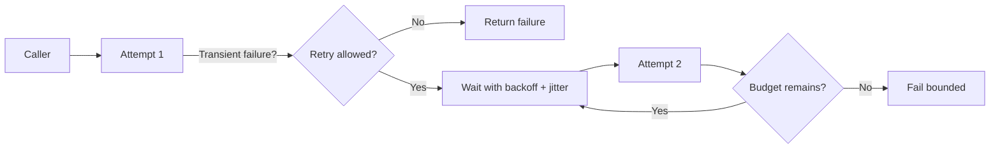
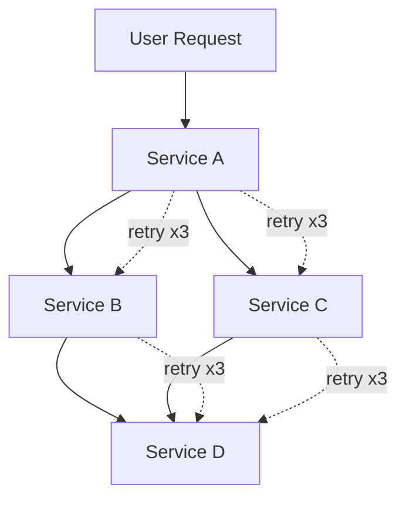
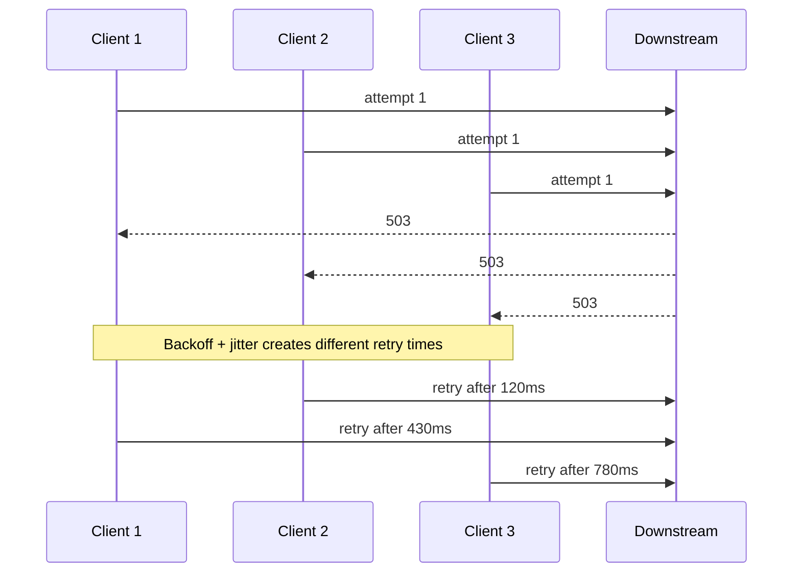
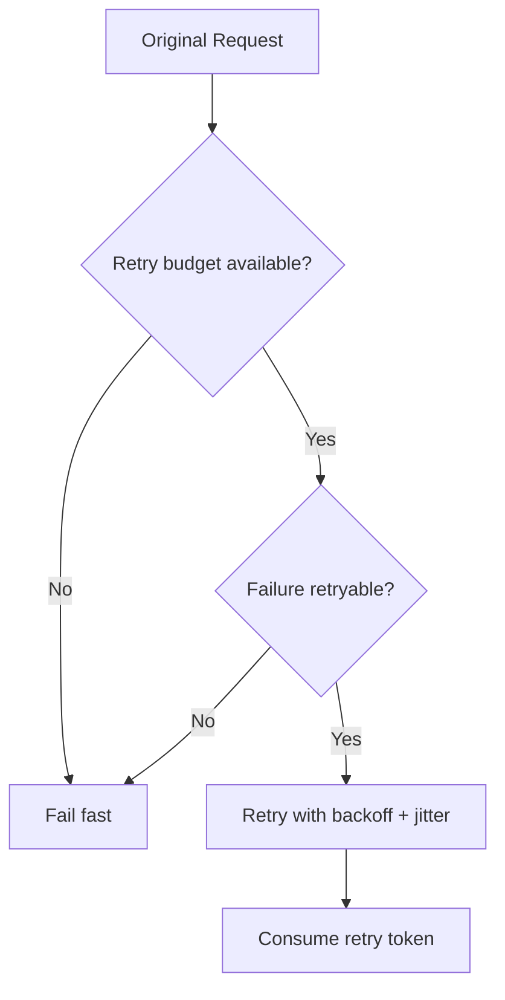
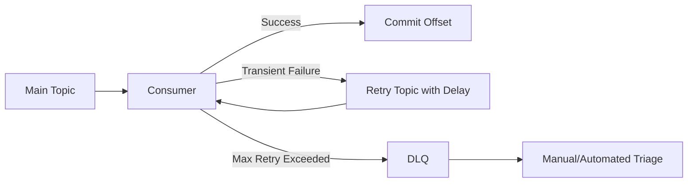

# Part 041 — Retries, Backoff, Jitter, and Retry Storms

Retry terlihat sederhana: request gagal, coba lagi.

Di sistem single-process, intuisi itu sering cukup. Di microservices, retry adalah **control loop yang bisa menambah traffic ketika sistem sedang lemah**. Retry yang salah bukan hanya gagal menyembuhkan error; ia bisa mempercepat cascading failure.

Part ini tidak membahas retry sebagai annotation. Kita akan membahas retry sebagai **load amplifier**, **semantic decision**, dan **runtime contract**.

Target setelah part ini:

1. bisa membedakan error yang layak di-retry dan yang tidak;
2. bisa mendesain retry policy berbasis idempotency, timeout, dan business semantics;
3. bisa menjelaskan mengapa backoff tanpa jitter masih bisa berbahaya;
4. bisa mencegah retry storm pada synchronous dan asynchronous flow;
5. bisa menulis retry logic Java yang production-grade, observable, bounded, dan aman.

---

## 1. Core Mental Model

Retry bukan fitur kenyamanan. Retry adalah **mekanisme optimisme terkontrol**.

Ia mengasumsikan:

> kegagalan pertama mungkin transient, dan mencoba lagi dalam batas tertentu lebih murah daripada mengembalikan kegagalan ke caller.

Masalahnya: asumsi itu tidak selalu benar.

Jika downstream sedang overload, retry menambah load.
Jika request tidak idempotent, retry bisa menggandakan side effect.
Jika timeout terlalu panjang, retry tidak pernah sempat terjadi sebelum user sudah pergi.
Jika semua client retry pada waktu yang sama, recovery downstream bisa tertunda.

Mental model yang benar:



Retry harus punya **empat pagar**:

| Pagar | Pertanyaan |
|---|---|
| Semantic safety | Apakah mengulang request aman secara bisnis? |
| Attempt bound | Berapa maksimum percobaan? |
| Time budget | Apakah masih ada waktu dalam deadline end-to-end? |
| Load discipline | Apakah retry tidak memperparah overload downstream? |

Tanpa empat pagar ini, retry bukan resilience. Ia hanya denial-of-service yang dilakukan oleh sistem sendiri.

---

## 2. Retry is a Load Multiplier

Misalkan satu request dari user memanggil tiga service downstream.

Setiap call diberi retry 3 kali.

Secara lokal, setiap developer merasa aman:

```text
maxAttempts = 3
```

Tapi secara sistem, call graph bisa berubah menjadi multiplier.



Jika D mulai lambat, B dan C retry. A juga bisa retry ke B dan C. Gateway mungkin retry ke A. Client mobile mungkin retry dari luar.

Retry local yang terlihat kecil dapat menjadi ledakan global.

Rumus sederhananya:

```text
worst_case_attempts = product(maxAttempts_per_layer)
```

Jika ada 4 layer dan masing-masing `maxAttempts=3`:

```text
3 x 3 x 3 x 3 = 81 attempts
```

Satu request user dapat berubah menjadi 81 upaya internal.

Inilah mengapa retry policy tidak boleh menjadi default tersembunyi di setiap library tanpa koordinasi arsitektur.

---

## 3. Retry Decision Matrix

Tidak semua error sama.

Retry harus diputuskan berdasarkan **jenis kegagalan**, **kemungkinan transient**, **idempotency**, dan **posisi dalam workflow**.

| Failure | Retry? | Reasoning |
|---|---:|---|
| TCP connection reset | Biasanya ya | Bisa transient network/server restart |
| DNS temporary failure | Ya, dengan batas | Bisa transient, tapi jangan loop lama |
| HTTP 408 | Ya, jika idempotent | Request timeout bisa transient |
| HTTP 429 | Ya, hanya dengan backoff dan `Retry-After` | Caller sedang dibatasi |
| HTTP 500 | Kadang | Bisa transient, bisa bug permanen |
| HTTP 502/503/504 | Biasanya ya | Gateway/downstream temporary unavailable |
| HTTP 400 | Tidak | Request salah; retry tidak memperbaiki payload |
| HTTP 401/403 | Tidak | Auth/permission problem |
| HTTP 404 | Biasanya tidak | Kecuali read-after-create dengan known consistency window |
| Validation error | Tidak | Business input invalid |
| Optimistic lock conflict | Ya, dengan re-read atau user conflict flow | Bukan blind retry command lama |
| Payment captured but response lost | Tidak blind retry | Butuh idempotency key dan reconciliation |

Rule yang lebih kuat:

> Retry hanya boleh dilakukan jika operasi punya **known outcome policy**.

Ada tiga outcome class:

| Outcome class | Meaning | Retry strategy |
|---|---|---|
| Known failure | Sistem yakin operasi tidak terjadi | Retry boleh jika transient |
| Known success | Sistem tahu operasi sudah terjadi | Jangan retry; return/replay success |
| Unknown outcome | Sistem tidak tahu apakah side effect terjadi | Retry hanya dengan idempotency key / query status / reconciliation |

Unknown outcome adalah kasus paling berbahaya.

Contoh:

```text
Service A mengirim command CapturePayment ke Payment Provider.
Provider berhasil capture.
Response timeout sebelum diterima A.
A retry tanpa idempotency key.
Provider capture dua kali.
```

Untuk command side-effectful, retry policy tidak bisa dipisahkan dari idempotency.

---

## 4. Retry Safe Operation Design

Operasi retry-safe biasanya memenuhi satu atau lebih kondisi berikut.

### 4.1 Natural Idempotency

Operasi yang hasil akhirnya sama meskipun dipanggil berkali-kali.

```http
PUT /cases/CASE-123/assignee
{
  "assigneeId": "investigator-7"
}
```

Jika assignee sudah `investigator-7`, hasil akhirnya sama.

### 4.2 Idempotency Key

Client mengirim key unik untuk command.

```http
POST /cases/CASE-123/escalations
Idempotency-Key: 3b2e6e9e-5d2a-4aa1-8f81-8d08ac8b33f0
```

Server menyimpan:

```text
idempotency_key
request_hash
status
response_payload
created_at
expires_at
```

Jika request sama datang lagi, server replay response lama.

### 4.3 Version Guard

Command hanya valid terhadap expected version.

```json
{
  "caseId": "CASE-123",
  "expectedVersion": 17,
  "decision": "ESCALATE"
}
```

Jika state sudah berubah, retry lama tidak diam-diam menimpa state baru.

### 4.4 External Operation Key

Untuk provider eksternal, selalu kirim business operation ID.

```json
{
  "externalOperationId": "case-escalation-CASE-123-v17",
  "amount": 100000
}
```

Kalau response hilang, caller bisa query status berdasarkan operation ID.

---

## 5. Backoff: Jangan Retry Terlalu Cepat

Retry langsung berbahaya karena semua client yang gagal akan mencoba lagi seketika.

Bad pattern:

```text
attempt 1 at t=0ms
attempt 2 at t=1ms
attempt 3 at t=2ms
```

Ini hampir sama dengan mengirim traffic tambahan saat downstream belum sempat pulih.

Backoff memberi jeda antar retry.

### 5.1 Fixed Backoff

```text
100ms, 100ms, 100ms
```

Mudah, tapi semua client tetap sinkron.

### 5.2 Exponential Backoff

```text
100ms, 200ms, 400ms, 800ms
```

Lebih baik, tetapi masih bisa sinkron jika semua client mulai pada waktu yang sama.

### 5.3 Capped Exponential Backoff

```text
100ms, 200ms, 400ms, 800ms, 1000ms, 1000ms
```

Membatasi delay maksimum.

### 5.4 Exponential Backoff with Jitter

```text
random(0, 100ms)
random(0, 200ms)
random(0, 400ms)
random(0, 800ms)
```

Jitter menyebarkan retry agar tidak terjadi synchronized wave.

---

## 6. Why Jitter Matters

Bayangkan 10.000 client menerima `503` pada waktu yang sama.

Tanpa jitter:

```text
t=0s      10.000 failures
t=1s      10.000 retries
t=2s      10.000 retries
t=4s      10.000 retries
```

Downstream tidak pernah mendapat ruang pemulihan.

Dengan jitter:

```text
t=0.0-1.0s    retries tersebar
t=1.0-2.0s    retries tersebar
t=2.0-4.0s    retries tersebar
```

Diagram:



Jitter bukan detail kecil. Ia adalah cara mencegah semua client bertindak sebagai satu gelombang traffic besar.

---

## 7. Backoff Algorithms in Java

### 7.1 Full Jitter

Formula umum:

```text
cap = min(maxDelay, baseDelay * 2^attempt)
delay = random(0, cap)
```

Contoh Java:

```java
import java.time.Duration;
import java.util.concurrent.ThreadLocalRandom;

public final class BackoffPolicy {
    private final Duration baseDelay;
    private final Duration maxDelay;

    public BackoffPolicy(Duration baseDelay, Duration maxDelay) {
        if (baseDelay.isNegative() || baseDelay.isZero()) {
            throw new IllegalArgumentException("baseDelay must be positive");
        }
        if (maxDelay.compareTo(baseDelay) < 0) {
            throw new IllegalArgumentException("maxDelay must be >= baseDelay");
        }
        this.baseDelay = baseDelay;
        this.maxDelay = maxDelay;
    }

    public Duration fullJitterDelay(int attemptNumber) {
        if (attemptNumber < 1) {
            throw new IllegalArgumentException("attemptNumber starts at 1");
        }

        long baseMillis = baseDelay.toMillis();
        long maxMillis = maxDelay.toMillis();

        long exponential;
        if (attemptNumber >= 30) {
            exponential = maxMillis;
        } else {
            exponential = baseMillis * (1L << (attemptNumber - 1));
        }

        long cap = Math.min(maxMillis, exponential);
        long delay = ThreadLocalRandom.current().nextLong(0, cap + 1);
        return Duration.ofMillis(delay);
    }
}
```

Gunakan ini untuk memahami konsep. Dalam production, biasanya policy diintegrasikan dengan library resilience, HTTP client, atau SDK yang sudah mendukung retry/backoff.

---

## 8. Retry Budget

Retry budget menjawab:

> dari total traffic, berapa banyak retry yang boleh dibuat sebelum retry dianggap memperburuk kondisi?

Tanpa budget, retry bisa tak terkendali.

Contoh policy:

```text
retry_attempts_per_minute <= 10% of original_requests_per_minute
```

Jika service menerima 10.000 request/minute, retry tambahan maksimum 1.000 attempt/minute.

Jika error melonjak dan retry attempt melebihi budget:

1. hentikan retry;
2. fail fast;
3. return degraded response jika tersedia;
4. biarkan downstream pulih.

Diagram:



Retry budget lebih penting daripada `maxAttempts` lokal karena ia membaca kondisi sistem secara agregat.

---

## 9. Layered Retry: Where Should Retry Live?

Retry dapat terjadi di banyak layer:

1. browser/mobile client;
2. API gateway;
3. service client;
4. SDK cloud provider;
5. database driver;
6. message broker;
7. job scheduler;
8. workflow engine.

Masalahnya bukan retry ada di banyak tempat. Masalahnya jika retry di banyak tempat **tidak dikoordinasikan**.

Architecture rule:

> Dalam satu request path synchronous, tentukan retry owner utama. Layer lain harus punya retry minimal atau disabled kecuali ada alasan eksplisit.

Contoh policy:

| Layer | Retry policy |
|---|---|
| Mobile client | Retry only network failure, low attempts, user-visible |
| Gateway | No retry untuk non-idempotent POST |
| Service A client to B | Retry 1-2 kali untuk safe/idempotent operation |
| SDK external payment | Retry hanya dengan idempotency key |
| DB driver | Retry connection acquisition only, not whole transaction blindly |

---

## 10. Java Implementation with Resilience4j Retry

Contoh konfigurasi Spring Boot style:

```yaml
resilience4j:
  retry:
    instances:
      caseReadClient:
        max-attempts: 3
        wait-duration: 100ms
        enable-exponential-backoff: true
        exponential-backoff-multiplier: 2
        enable-randomized-wait: true
        randomized-wait-factor: 0.5
        retry-exceptions:
          - java.io.IOException
          - java.net.SocketTimeoutException
        ignore-exceptions:
          - com.example.caseapi.BusinessValidationException
          - com.example.caseapi.AuthorizationException
```

Catatan desain:

1. `max-attempts: 3` berarti total attempt, bukan tambahan retry di beberapa library.
2. Jangan retry semua `Exception`.
3. Pisahkan config per dependency, bukan satu global retry untuk semua call.
4. Tambahkan timeout/deadline; retry tanpa timeout akan menggantung.
5. Tambahkan metric tag per downstream.

Programmatic style:

```java
import io.github.resilience4j.retry.Retry;
import io.github.resilience4j.retry.RetryConfig;

import java.io.IOException;
import java.time.Duration;
import java.util.function.Supplier;

public final class CaseLookupClient {
    private final RemoteCaseApi api;
    private final Retry retry;

    public CaseLookupClient(RemoteCaseApi api) {
        this.api = api;
        RetryConfig config = RetryConfig.custom()
                .maxAttempts(3)
                .waitDuration(Duration.ofMillis(100))
                .retryExceptions(IOException.class)
                .ignoreExceptions(BusinessValidationException.class)
                .build();

        this.retry = Retry.of("caseLookupClient", config);
    }

    public CaseSnapshot getCase(String caseId) {
        Supplier<CaseSnapshot> supplier = Retry.decorateSupplier(
                retry,
                () -> api.fetchCase(caseId)
        );
        return supplier.get();
    }
}
```

Untuk command, jangan hanya memakai annotation tanpa semantic guard.

Bad:

```java
@Retry(name = "default")
public EscalationResult escalate(EscalateCaseCommand command) {
    return remoteWorkflow.startEscalation(command);
}
```

Lebih aman:

```java
public EscalationResult escalate(EscalateCaseCommand command) {
    IdempotencyKey key = command.idempotencyKey();

    if (!command.hasExpectedVersion()) {
        throw new IllegalArgumentException("Command must carry expectedVersion");
    }

    return retryableWorkflowStart.start(
            key,
            command.expectedVersion(),
            command
    );
}
```

Retry-safe command bukan dihasilkan oleh `@Retry`. Ia dihasilkan oleh contract: idempotency key, expected version, operation identity, timeout, dan outcome reconciliation.

---

## 11. HTTP Retry Policy

Untuk REST/HTTP client, retry policy harus membaca method, status, dan idempotency.

| Method | Default retry? | Notes |
|---|---:|---|
| GET | Ya, jika safe | Perhatikan stale/cache semantics |
| HEAD | Ya | Safe |
| PUT | Ya, jika idempotent by design | Gunakan version guard bila stateful |
| DELETE | Kadang | Idempotent secara HTTP, tapi business side effect perlu dicek |
| POST | Tidak default | Boleh jika pakai idempotency key |
| PATCH | Tidak default | Partial update sering tidak idempotent |

Status handling:

```java
public boolean shouldRetry(HttpAttempt attempt) {
    if (!attempt.isWithinDeadline()) return false;
    if (!attempt.operation().isRetrySafe()) return false;

    int status = attempt.statusCode();

    if (status == 408 || status == 429) return true;
    if (status == 500 || status == 502 || status == 503 || status == 504) return true;

    return attempt.exception() instanceof java.io.IOException;
}
```

Honor `Retry-After` untuk `429` atau `503` jika diberikan, tetapi tetap batasi dengan deadline caller.

```text
actualDelay = min(retryAfter, remainingDeadline, maxRetryDelay)
```

---

## 12. Messaging Retry Is Different

Dalam messaging, retry bukan hanya “call again”. Ia mempengaruhi queue depth, consumer lag, ordering, dan poison message.

Ada tiga jenis retry:

| Type | Description | Use case |
|---|---|---|
| Immediate retry | Consumer mencoba lagi langsung | Transient local error singkat |
| Delayed retry | Message dikirim ke retry topic/queue dengan delay | Downstream temporary unavailable |
| Dead-letter | Message dipindah setelah batas retry | Poison message / permanent failure |

Flow:



Rules:

1. Jangan block partition terlalu lama untuk satu message bermasalah.
2. Jangan retry poison message selamanya.
3. Simpan error reason dan stack trace ringkas di DLQ metadata.
4. Buat re-drive tool dengan filter, bukan replay semua DLQ secara buta.
5. Consumer harus idempotent karena broker dapat mengirim duplicate.

---

## 13. Retry Storm Failure Modes

### 13.1 Synchronized Client Retry

Semua client retry pada interval yang sama.

Mitigation:

- jitter;
- token bucket retry budget;
- respect `Retry-After`;
- load shedding upstream.

### 13.2 Layered Retry Amplification

Gateway, service, SDK, dan DB driver semua retry.

Mitigation:

- single retry owner per path;
- global architecture policy;
- disable hidden retry where needed;
- trace retry attempt count.

### 13.3 Retry After Timeout But Work Still Running

Caller timeout, retry, downstream masih memproses attempt pertama.

Mitigation:

- idempotency key;
- cancellation propagation jika didukung;
- operation status query;
- shorter server-side work timeout.

### 13.4 Retry Non-Idempotent Command

Command menghasilkan side effect ganda.

Mitigation:

- no retry by default for unsafe command;
- idempotency store;
- expected version;
- external operation ID.

### 13.5 Retry During Overload

Downstream sudah overload, retry menambah beban.

Mitigation:

- circuit breaker;
- adaptive retry budget;
- rate limiter;
- fail fast;
- degraded mode.

---

## 14. Observability for Retry

Retry harus terlihat di telemetry.

Minimal metrics:

| Metric | Meaning |
|---|---|
| `retry.attempts.total` | Total retry attempt |
| `retry.exhausted.total` | Operasi gagal setelah retry habis |
| `retry.success_after_retry.total` | Berhasil setelah retry |
| `retry.skipped.not_retryable.total` | Tidak retry karena error tidak layak |
| `retry.skipped.budget_exhausted.total` | Tidak retry karena budget habis |
| `retry.delay.ms` | Delay distribusi |
| `downstream.status_code` | Status downstream |
| `operation.idempotent` | Apakah operation retry-safe |

Structured log contoh:

```json
{
  "event": "retry_attempt_scheduled",
  "service": "case-service",
  "dependency": "party-service",
  "operation": "getPartySnapshot",
  "attempt": 2,
  "maxAttempts": 3,
  "delayMs": 184,
  "reason": "HTTP_503",
  "correlationId": "corr-9b7"
}
```

Trace span attributes:

```text
retry.attempt = 2
retry.max_attempts = 3
retry.delay_ms = 184
downstream.service = party-service
error.retryable = true
```

Tanpa observability, retry policy hanya keyakinan. Dengan observability, retry policy menjadi control loop yang bisa dikalibrasi.

---

## 15. Retry Policy Template

Gunakan template ini untuk setiap dependency.

```yaml
dependency: party-service
operation: getPartySnapshot
interaction_type: synchronous-http
criticality: required-for-case-detail
semantic_safety:
  idempotent: true
  side_effect: false
time_budget:
  caller_deadline_ms: 800
  connect_timeout_ms: 100
  read_timeout_ms: 250
retry:
  max_attempts_total: 3
  backoff: exponential_full_jitter
  initial_delay_ms: 50
  max_delay_ms: 200
  retryable_status:
    - 408
    - 429
    - 502
    - 503
    - 504
  non_retryable_status:
    - 400
    - 401
    - 403
    - 404
budget:
  max_retry_ratio: 0.1
fallback:
  type: partial_response
  user_message: "Party details temporarily unavailable"
observability:
  emit_attempt_metric: true
  tag_dependency: true
  trace_attempts: true
owner: case-platform-team
```

---

## 16. Review Checklist

Sebelum mengaktifkan retry, tanyakan:

- Apakah operation idempotent secara teknis dan bisnis?
- Apakah ada idempotency key untuk command side-effectful?
- Apakah retry punya max attempts?
- Apakah retry punya deadline end-to-end?
- Apakah backoff memakai jitter?
- Apakah retry menghormati `429`, `503`, dan `Retry-After`?
- Apakah ada retry budget?
- Apakah layered retry sudah dipetakan?
- Apakah hidden retry di SDK/driver diketahui?
- Apakah retry attempt terlihat di metrics/logs/traces?
- Apakah ada fallback atau graceful failure?
- Apakah retry bisa dihentikan saat downstream overload?

---

## 17. Common Anti-Patterns

### Anti-pattern 1 — Global Retry for Everything

```yaml
retry:
  maxAttempts: 5
  retryAllExceptions: true
```

Ini buruk karena validation error, authorization error, dan business conflict ikut di-retry.

### Anti-pattern 2 — Retry POST Without Idempotency

```http
POST /payments/capture
```

Tanpa `Idempotency-Key`, caller tidak tahu apakah capture pertama sudah berhasil.

### Anti-pattern 3 — Timeout Longer Than User Deadline

```text
UI deadline: 2s
Service A timeout to B: 5s
Retry attempts: 3
```

Policy ini mustahil memenuhi user deadline.

### Anti-pattern 4 — Retry in Every Layer

```text
Client x3
Gateway x3
Service x3
SDK x3
```

Hasilnya adalah amplification, bukan resilience.

### Anti-pattern 5 — No Jitter

Backoff tanpa jitter masih bisa menghasilkan retry wave.

---

## 18. Mini Case Study: Case Detail Page

User membuka detail case.

`case-service` perlu data dari:

1. `party-service`;
2. `evidence-service`;
3. `decision-service`.

Tidak semua dependency punya criticality yang sama.

| Dependency | Criticality | Retry | Fallback |
|---|---|---|---|
| case DB | Required | Local DB retry minimal | Fail page |
| party-service | Required for party panel | 2 attempts with jitter | Show unavailable panel |
| evidence-service | Optional summary | 1 retry | Hide summary temporarily |
| decision-service | Required for active decision | 2 attempts | Show stale cached snapshot with warning |

Architecture insight:

> Retry policy harus mengikuti user journey dan business criticality, bukan disalin dari template global.

---

## 19. Exercises

1. Ambil satu endpoint di sistemmu yang melakukan fan-out ke 3 dependency. Hitung worst-case attempt jika tiap layer retry 3 kali.
2. Pilih satu command non-idempotent. Desain idempotency key dan outcome reconciliation-nya.
3. Buat retry policy YAML untuk dependency eksternal yang kadang mengembalikan 429.
4. Tambahkan metric dan log schema untuk retry attempt.
5. Tentukan layer mana yang menjadi retry owner untuk satu user journey penting.

---

## 20. Key Takeaways

- Retry adalah load multiplier, bukan solusi gratis.
- Retry hanya aman jika operasi retry-safe secara bisnis.
- Backoff mengurangi tekanan; jitter mencegah synchronized retry wave.
- Retry harus bounded oleh attempts, deadline, dan retry budget.
- Layered retry tanpa koordinasi dapat menciptakan retry storm.
- Command side-effectful butuh idempotency key, expected version, atau operation status query.
- Retry policy harus observable dan per-dependency.

Part berikutnya membahas **Circuit Breaker, Bulkhead, and Rate Limiter**: tiga guardrail utama untuk menghentikan kegagalan agar tidak menyebar ke seluruh topology service.

---

## Referensi

- AWS Builders' Library — *Timeouts, retries, and backoff with jitter*.
- Google SRE Book — *Addressing Cascading Failures*.
- Google SRE Book — *Production Services Best Practices*.
- RFC 9110 — HTTP Semantics.
- Resilience4j Documentation — Retry module and Spring Boot integration.
