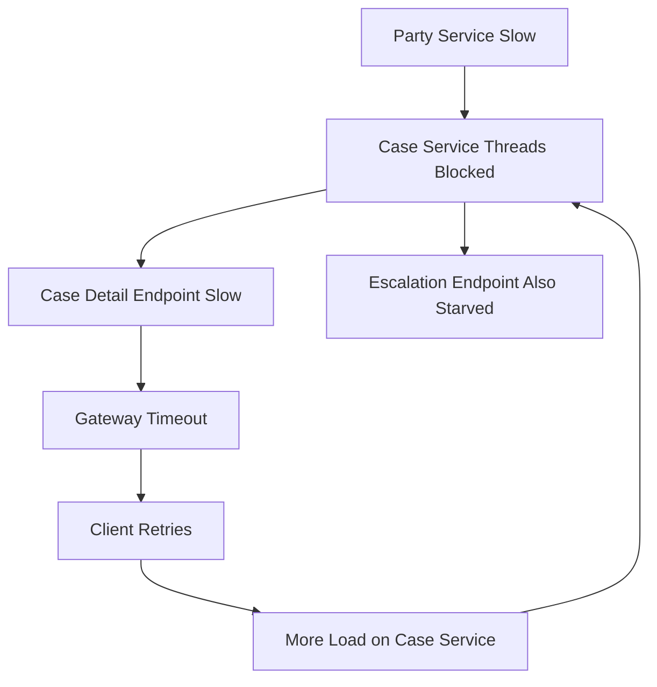
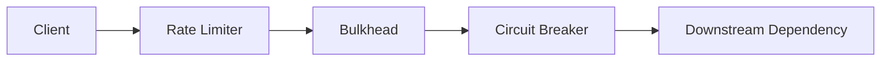
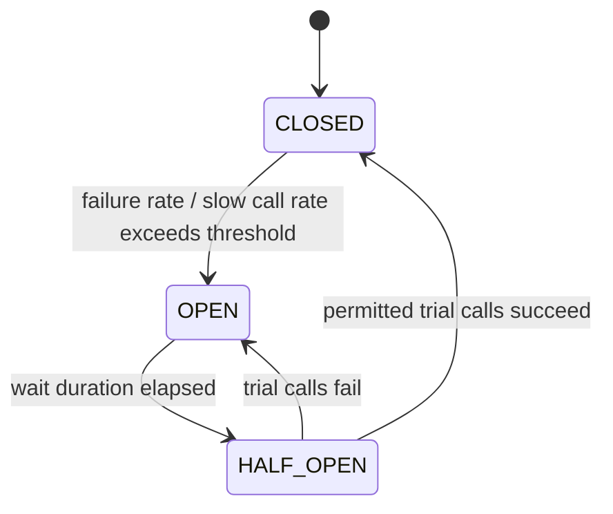
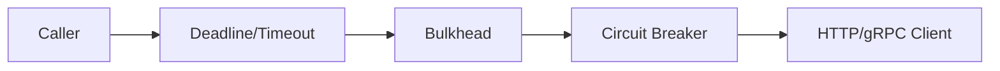
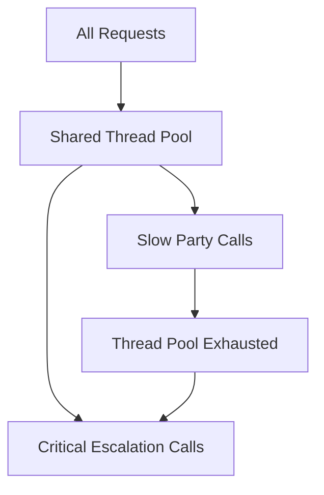
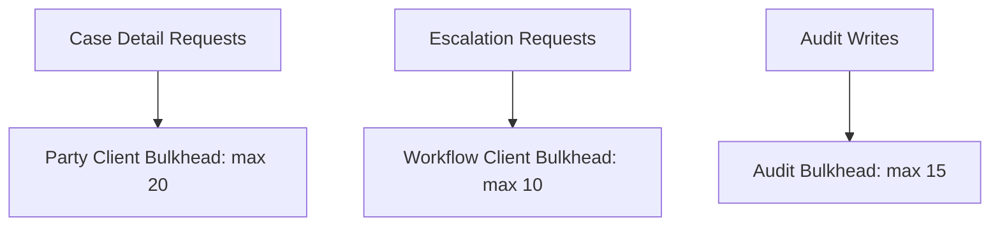
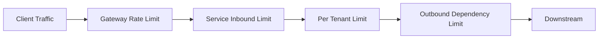
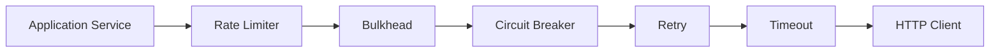

# Part 042 — Circuit Breaker, Bulkhead, and Rate Limiter

Pada part sebelumnya kita melihat retry sebagai load amplifier.

Sekarang kita masuk ke tiga guardrail utama agar satu dependency yang bermasalah tidak menjatuhkan service lain:

1. **Circuit Breaker** — berhenti memanggil dependency yang sedang gagal.
2. **Bulkhead** — batasi resource yang boleh dikonsumsi dependency tertentu.
3. **Rate Limiter** — batasi laju traffic agar tidak melewati kapasitas aman.

Ketiganya sering disebut bersama, tetapi fungsi mental model-nya berbeda.

| Pattern | Pertanyaan yang dijawab |
|---|---|
| Circuit breaker | “Apakah dependency ini sedang cukup sehat untuk dipanggil?” |
| Bulkhead | “Berapa banyak resource service ini boleh dipakai oleh dependency/path ini?” |
| Rate limiter | “Berapa cepat request boleh masuk/keluar?” |

Jangan jadikan resilience sebagai dekorasi annotation. Jadikan resilience sebagai bagian dari **architecture contract**.

---

## 1. Why These Patterns Exist

Microservices membuat service saling bergantung.

Jika satu dependency lambat, caller bisa ikut lambat.
Jika caller ikut lambat, thread pool penuh.
Jika thread pool penuh, endpoint lain ikut gagal.
Jika endpoint lain gagal, client retry.
Jika client retry, load naik.
Jika load naik, dependency makin gagal.

Diagram failure propagation:



Circuit breaker, bulkhead, dan rate limiter memutus loop ini di titik berbeda.



- Rate limiter mengendalikan volume.
- Bulkhead mengendalikan resource isolation.
- Circuit breaker mengendalikan health-based call permission.

---

## 2. Circuit Breaker Mental Model

Circuit breaker mirip pemutus listrik.

Jika failure rate melewati threshold, circuit dibuka. Caller tidak lagi mengirim request ke dependency untuk sementara. Setelah wait duration, circuit masuk half-open dan mengizinkan sedikit request percobaan. Jika sukses, circuit closed lagi. Jika gagal, circuit open lagi.

State machine:



State:

| State | Behavior |
|---|---|
| Closed | Request diteruskan, metrics dikumpulkan |
| Open | Request ditolak cepat tanpa memanggil downstream |
| Half-open | Beberapa request percobaan diizinkan |

Circuit breaker bukan untuk menyembunyikan bug. Ia untuk:

1. menghindari membuang resource pada dependency yang kemungkinan gagal;
2. memberi dependency waktu pulih;
3. melindungi caller dari thread/connection starvation;
4. mengurangi retry storm;
5. menghasilkan sinyal operasional bahwa dependency sedang tidak sehat.

---

## 3. What Circuit Breaker Should Measure

Circuit breaker biasanya mengukur:

1. failure rate;
2. slow call rate;
3. minimum number of calls;
4. sliding window;
5. permitted calls in half-open;
6. wait duration in open state.

Contoh policy:

```yaml
circuitBreaker:
  dependency: party-service
  operation: getPartySnapshot
  slidingWindowType: COUNT_BASED
  slidingWindowSize: 50
  minimumNumberOfCalls: 20
  failureRateThreshold: 50
  slowCallRateThreshold: 60
  slowCallDurationThreshold: 300ms
  waitDurationInOpenState: 5s
  permittedNumberOfCallsInHalfOpenState: 5
```

Reasoning:

- Jangan buka circuit berdasarkan 1-2 error saja.
- Failure rate butuh sample minimum.
- Slow call sama pentingnya dengan failed call karena slow call menghabiskan thread/connection.
- Half-open harus membatasi trial traffic agar dependency tidak langsung dihajar penuh.

---

## 4. Circuit Breaker Is Not a Timeout

Timeout menjawab:

> “Berapa lama satu attempt boleh menunggu?”

Circuit breaker menjawab:

> “Apakah kita sebaiknya mencoba dependency ini sekarang?”

Keduanya harus dipakai bersama.

Bad:

```text
Circuit breaker without timeout
```

Jika call menggantung lama, circuit breaker tidak cepat mendapat failure signal.

Bad juga:

```text
Timeout without circuit breaker
```

Caller tetap mencoba dependency yang sudah jelas gagal, berulang-ulang.

Better:



---

## 5. Resilience4j Circuit Breaker in Java

Spring Boot style:

```yaml
resilience4j:
  circuitbreaker:
    instances:
      partyService:
        sliding-window-type: count_based
        sliding-window-size: 50
        minimum-number-of-calls: 20
        failure-rate-threshold: 50
        slow-call-rate-threshold: 60
        slow-call-duration-threshold: 300ms
        wait-duration-in-open-state: 5s
        permitted-number-of-calls-in-half-open-state: 5
        automatic-transition-from-open-to-half-open-enabled: true
```

Programmatic style:

```java
import io.github.resilience4j.circuitbreaker.CircuitBreaker;
import io.github.resilience4j.circuitbreaker.CircuitBreakerConfig;

import java.time.Duration;
import java.util.function.Supplier;

public final class PartyClient {
    private final RemotePartyApi api;
    private final CircuitBreaker circuitBreaker;

    public PartyClient(RemotePartyApi api) {
        this.api = api;

        CircuitBreakerConfig config = CircuitBreakerConfig.custom()
                .slidingWindowSize(50)
                .minimumNumberOfCalls(20)
                .failureRateThreshold(50.0f)
                .slowCallRateThreshold(60.0f)
                .slowCallDurationThreshold(Duration.ofMillis(300))
                .waitDurationInOpenState(Duration.ofSeconds(5))
                .permittedNumberOfCallsInHalfOpenState(5)
                .recordException(this::isRecordableFailure)
                .build();

        this.circuitBreaker = CircuitBreaker.of("partyService", config);
    }

    public PartySnapshot getParty(String partyId) {
        Supplier<PartySnapshot> decorated = CircuitBreaker.decorateSupplier(
                circuitBreaker,
                () -> api.getParty(partyId)
        );

        return decorated.get();
    }

    private boolean isRecordableFailure(Throwable error) {
        return !(error instanceof BusinessValidationException)
                && !(error instanceof AuthorizationException);
    }
}
```

Important:

- Jangan record validation error sebagai dependency failure.
- Jangan ignore timeout error.
- Jangan jadikan fallback sebagai cara menyembunyikan semua failure.
- Expose circuit state ke metrics.

---

## 6. Circuit Breaker Fallback Semantics

Fallback bukan “return null”.

Fallback harus punya makna produk dan operasional.

| Scenario | Bad fallback | Better fallback |
|---|---|---|
| Party detail unavailable | return empty object | show panel unavailable |
| Evidence summary slow | block page | omit optional summary with warning |
| Decision status unavailable | assume no decision | show stale cached status with timestamp |
| Payment capture failure | pretend success | return pending/unknown outcome |

Fallback harus menjawab:

1. apakah response masih benar secara bisnis?
2. apakah user perlu tahu data partial/stale?
3. apakah action lanjutan harus dibatasi?
4. apakah audit trail mencatat degraded decision?

Contoh:

```java
public CaseDetailResponse getCaseDetail(String caseId) {
    CaseRecord caseRecord = caseRepository.getRequired(caseId);

    PartyPanel partyPanel;
    try {
        partyPanel = partyClient.getPartyPanel(caseRecord.partyId());
    } catch (DependencyUnavailableException ex) {
        partyPanel = PartyPanel.unavailable(
                "Party details temporarily unavailable",
                clock.instant()
        );
    }

    return CaseDetailResponse.of(caseRecord, partyPanel);
}
```

Fallback yang baik menjaga truthfulness. Ia tidak menciptakan data palsu.

---

## 7. Bulkhead Mental Model

Bulkhead berasal dari desain kapal: kompartemen dipisah agar kebocoran di satu area tidak menenggelamkan seluruh kapal.

Dalam microservices:

> Bulkhead membatasi berapa banyak resource yang boleh dikonsumsi oleh dependency, endpoint, tenant, atau workload tertentu.

Tanpa bulkhead:



Dengan bulkhead:



Jika `party-service` lambat, hanya bulkhead party yang penuh. Escalation path masih bisa berjalan.

---

## 8. Types of Bulkhead

### 8.1 Semaphore Bulkhead

Membatasi concurrency tanpa membuat thread pool baru.

Cocok untuk:

- non-blocking/reactive call;
- operasi singkat;
- membatasi concurrent access ke dependency.

Contoh:

```text
maxConcurrentCalls = 20
maxWaitDuration = 0ms
```

Jika 20 call sedang berjalan, call ke-21 ditolak cepat.

### 8.2 Thread Pool Bulkhead

Memisahkan execution ke thread pool khusus.

Cocok untuk:

- blocking IO;
- library lama yang tidak async;
- isolasi dari request thread pool utama.

Risiko:

- terlalu banyak thread pool membuat overhead;
- queue besar menyembunyikan overload;
- timeout harus tetap ada.

### 8.3 Connection Pool Bulkhead

DB/HTTP connection pool juga bulkhead.

Contoh:

```text
partyServiceHttpPool.maxConnections = 50
evidenceServiceHttpPool.maxConnections = 20
caseDbPool.maxConnections = 30
```

Jangan satu global connection pool untuk semua dependency penting.

---

## 9. Resilience4j Bulkhead in Java

Semaphore bulkhead config:

```yaml
resilience4j:
  bulkhead:
    instances:
      partyService:
        max-concurrent-calls: 20
        max-wait-duration: 0ms
```

Programmatic:

```java
import io.github.resilience4j.bulkhead.Bulkhead;
import io.github.resilience4j.bulkhead.BulkheadConfig;

import java.time.Duration;
import java.util.function.Supplier;

public final class PartyClientWithBulkhead {
    private final RemotePartyApi api;
    private final Bulkhead bulkhead;

    public PartyClientWithBulkhead(RemotePartyApi api) {
        this.api = api;

        BulkheadConfig config = BulkheadConfig.custom()
                .maxConcurrentCalls(20)
                .maxWaitDuration(Duration.ZERO)
                .build();

        this.bulkhead = Bulkhead.of("partyService", config);
    }

    public PartySnapshot getParty(String partyId) {
        Supplier<PartySnapshot> decorated = Bulkhead.decorateSupplier(
                bulkhead,
                () -> api.getParty(partyId)
        );
        return decorated.get();
    }
}
```

`maxWaitDuration=0` sering lebih aman untuk high-traffic services karena queueing internal bisa memperburuk latency tail. Jika request tidak bisa masuk bulkhead, fail fast atau return degraded response.

---

## 10. Bulkhead Sizing

Bulkhead size tidak boleh ditebak.

Gunakan input:

1. downstream latency p95/p99;
2. expected throughput;
3. caller deadline;
4. criticality endpoint;
5. resource limit service;
6. capacity downstream;
7. fallback availability.

Little's Law intuition:

```text
concurrency ≈ throughput × latency
```

Jika dependency butuh 100 request/second dan p95 latency 100ms:

```text
concurrency ≈ 100 * 0.1 = 10
```

Tambahkan headroom, misalnya 15-20. Jangan langsung 500.

Jika latency naik ke 1s:

```text
concurrency ≈ 100 * 1 = 100
```

Artinya latency downstream yang naik dapat menghabiskan concurrency jauh lebih besar. Bulkhead mencegah service caller ikut habis.

---

## 11. Rate Limiter Mental Model

Rate limiter membatasi laju traffic.

Ia menjawab:

> “Berapa banyak request per satuan waktu yang boleh melewati boundary ini?”

Boundary bisa berada di:

1. edge/gateway;
2. per service inbound;
3. per tenant;
4. per user/API key;
5. per downstream client outbound;
6. per expensive operation.

Diagram:



Rate limiting bukan hanya security. Ia adalah capacity control.

---

## 12. Token Bucket Intuition

Salah satu mental model umum adalah token bucket.

```text
bucket capacity = burst size
refill rate = allowed rate per second
request consumes token
if no token -> reject/wait
```

Contoh:

```text
limitForPeriod = 100
limitRefreshPeriod = 1s
timeoutDuration = 0ms
```

Artinya maksimal 100 permission per detik. Jika habis, request ditolak cepat.

---

## 13. Resilience4j Rate Limiter in Java

Config:

```yaml
resilience4j:
  ratelimiter:
    instances:
      expensiveSearch:
        limit-for-period: 100
        limit-refresh-period: 1s
        timeout-duration: 0ms
```

Programmatic:

```java
import io.github.resilience4j.ratelimiter.RateLimiter;
import io.github.resilience4j.ratelimiter.RateLimiterConfig;

import java.time.Duration;
import java.util.function.Supplier;

public final class ExpensiveSearchClient {
    private final SearchApi api;
    private final RateLimiter rateLimiter;

    public ExpensiveSearchClient(SearchApi api) {
        this.api = api;

        RateLimiterConfig config = RateLimiterConfig.custom()
                .limitForPeriod(100)
                .limitRefreshPeriod(Duration.ofSeconds(1))
                .timeoutDuration(Duration.ZERO)
                .build();

        this.rateLimiter = RateLimiter.of("expensiveSearch", config);
    }

    public SearchResult search(SearchQuery query) {
        Supplier<SearchResult> decorated = RateLimiter.decorateSupplier(
                rateLimiter,
                () -> api.search(query)
        );
        return decorated.get();
    }
}
```

Untuk inbound HTTP, rate limiter sering lebih cocok di gateway atau service mesh. Tapi application-level rate limiter tetap berguna untuk:

- per business operation;
- per tenant plan;
- per downstream protection;
- expensive command.

---

## 14. Pattern Composition

Pattern composition harus disengaja.

Contoh dependency call:



Namun urutan tidak universal. Yang penting adalah semantic-nya.

### 14.1 Retry and Circuit Breaker Order

Ada dua pilihan utama.

#### Option A — Circuit breaker sees each attempt

```text
Retry outside CircuitBreaker
```

Setiap retry attempt melewati circuit breaker dan dihitung sebagai call.

Kelebihan:

- circuit cepat melihat banyak failure;
- downstream cepat dilindungi.

Kekurangan:

- failure rate bisa naik cepat karena retry attempt dihitung berkali-kali.

#### Option B — Circuit breaker sees final outcome

```text
CircuitBreaker outside Retry
```

Circuit breaker melihat satu logical operation setelah retry selesai.

Kelebihan:

- circuit membaca user-visible outcome;
- tidak terlalu sensitif terhadap transient attempt failure.

Kekurangan:

- dependency tetap menerima retry meskipun sedang buruk;
- circuit lebih lambat open.

Architecture rule:

> Untuk melindungi downstream saat overload, lebih sering kita ingin circuit breaker dapat menghentikan attempt lebih awal. Untuk membaca user-visible reliability, expose metric terpisah untuk final outcome.

### 14.2 Bulkhead Before Retry

Jika retry terjadi sebelum bulkhead, retry bisa menumpuk dan mengambil resource.

Biasanya kita ingin setiap attempt harus mendapatkan bulkhead permission.

### 14.3 Rate Limiter Before Expensive Work

Rate limiter harus berada sebelum operasi mahal.

Jika rate limiter setelah DB query, ia terlambat.

---

## 15. Combined Resilience Policy Example

```yaml
resilience4j:
  timelimiter:
    instances:
      partyService:
        timeout-duration: 300ms
        cancel-running-future: true

  bulkhead:
    instances:
      partyService:
        max-concurrent-calls: 20
        max-wait-duration: 0ms

  circuitbreaker:
    instances:
      partyService:
        sliding-window-type: count_based
        sliding-window-size: 50
        minimum-number-of-calls: 20
        failure-rate-threshold: 50
        slow-call-rate-threshold: 60
        slow-call-duration-threshold: 250ms
        wait-duration-in-open-state: 5s
        permitted-number-of-calls-in-half-open-state: 5

  retry:
    instances:
      partyService:
        max-attempts: 2
        wait-duration: 50ms
        enable-exponential-backoff: true
        exponential-backoff-multiplier: 2
        enable-randomized-wait: true
        randomized-wait-factor: 0.5

  ratelimiter:
    instances:
      partyServiceOutbound:
        limit-for-period: 500
        limit-refresh-period: 1s
        timeout-duration: 0ms
```

Important:

- Timeout harus lebih kecil dari caller deadline.
- Retry attempts harus muat dalam time budget.
- Bulkhead harus lebih kecil dari resource pool global.
- Circuit breaker threshold harus punya minimum sample.
- Rate limiter harus mengikuti kapasitas downstream dan fairness antar tenant.

---

## 16. Business-Aware Resilience

Tidak semua endpoint harus punya resilience behavior yang sama.

### Case Detail Page

- Bisa degraded partial response.
- Optional panels boleh unavailable.
- Retry pendek boleh.
- Circuit open bisa show stale/partial data.

### Escalation Command

- Tidak boleh pura-pura sukses.
- Retry harus idempotent.
- Unknown outcome harus menjadi `PENDING_CONFIRMATION` atau workflow state.
- Circuit open harus menghentikan command atau enqueue durable workflow, bukan return fake success.

### Audit Write

- Tidak boleh silently dropped.
- Jika async, butuh durable buffer/outbox.
- Rate limiting inbound audit event bisa berbahaya jika menghilangkan evidence.
- Lebih baik backpressure atau degraded mode yang eksplisit.

Architecture insight:

> Resilience pattern harus mengikuti business semantics. Pattern yang sama bisa benar untuk query, tapi salah untuk command.

---

## 17. Observability

Minimal metrics untuk circuit breaker:

| Metric | Meaning |
|---|---|
| `circuitbreaker.state` | closed/open/half-open |
| `circuitbreaker.calls` | successful/failed/slow/not_permitted |
| `circuitbreaker.failure.rate` | failure percentage |
| `circuitbreaker.slow.call.rate` | slow percentage |

Minimal metrics untuk bulkhead:

| Metric | Meaning |
|---|---|
| `bulkhead.available.concurrent.calls` | remaining capacity |
| `bulkhead.max.allowed.concurrent.calls` | configured capacity |
| `bulkhead.calls.rejected` | fail fast due to saturation |

Minimal metrics untuk rate limiter:

| Metric | Meaning |
|---|---|
| `ratelimiter.available.permissions` | remaining tokens/permissions |
| `ratelimiter.waiting.threads` | blocked callers |
| `ratelimiter.calls.rejected` | denied by limit |

Structured log example:

```json
{
  "event": "dependency_call_rejected",
  "service": "case-service",
  "dependency": "party-service",
  "operation": "getPartySnapshot",
  "reason": "CIRCUIT_BREAKER_OPEN",
  "fallback": "PARTIAL_RESPONSE",
  "correlationId": "corr-82a"
}
```

Trace attributes:

```text
resilience.circuit.state = open
resilience.bulkhead.rejected = true
resilience.rate_limiter.rejected = false
downstream.service = party-service
fallback.type = partial_response
```

---

## 18. Alerting

Alert bukan hanya saat circuit open.

Circuit open bisa berarti sistem bekerja benar: ia sedang melindungi diri.

Alert yang lebih berguna:

1. circuit open lama pada dependency critical;
2. bulkhead rejection rate tinggi pada critical path;
3. rate limiter rejection tinggi untuk tenant penting;
4. fallback ratio tinggi pada user journey utama;
5. slow call rate naik sebelum failure rate naik;
6. retry exhausted setelah circuit half-open;
7. degraded response melewati SLO.

Contoh burn-style thinking:

```text
If case-detail degraded_response_ratio > 5% for 10 minutes, page owning team.
If party-service circuit open but case-detail SLO still healthy, create ticket, not page.
```

---

## 19. Failure Modes and Bad Configurations

### 19.1 Circuit Breaker Too Sensitive

```text
minimumNumberOfCalls = 1
failureRateThreshold = 50%
```

Satu error membuka circuit. Ini noisy.

### 19.2 Circuit Breaker Too Slow

```text
slidingWindowSize = 10000
minimumNumberOfCalls = 5000
```

Circuit baru bereaksi setelah kerusakan luas.

### 19.3 Bulkhead Queue Too Large

Queue besar membuat latency meledak dan memberi ilusi sistem masih menerima traffic.

Prefer fail fast untuk request yang tidak bisa selesai dalam deadline.

### 19.4 Rate Limiter Without Fairness

Global limit bisa membuat satu tenant besar menghabiskan semua capacity.

Gunakan per-tenant/per-principal limit jika fairness penting.

### 19.5 Fallback That Lies

Fallback yang mengembalikan default palsu merusak data dan keputusan bisnis.

```java
return DecisionStatus.NO_ACTIVE_DECISION; // dangerous if dependency unavailable
```

Lebih baik:

```java
return DecisionStatusSnapshot.unavailable(lastKnownTimestamp);
```

---

## 20. Architecture Decision Template

```yaml
dependency: party-service
consumer: case-service
operation: getPartySnapshot
business_path:
  - case-detail-page
criticality: required-for-complete-view-but-degradable
resilience_policy:
  timeout_ms: 300
  retry:
    max_attempts_total: 2
    backoff: exponential_jitter
  circuit_breaker:
    sliding_window_size: 50
    minimum_calls: 20
    failure_rate_threshold: 50
    slow_call_threshold_ms: 250
    slow_call_rate_threshold: 60
    open_state_wait: 5s
    half_open_calls: 5
  bulkhead:
    type: semaphore
    max_concurrent_calls: 20
    max_wait: 0ms
  rate_limiter:
    outbound_limit_per_second: 500
fallback:
  type: partial_response
  user_visible: true
  audit_required: false
observability:
  metrics_required:
    - circuit_state
    - bulkhead_rejected
    - rate_limited
    - fallback_ratio
review:
  owner: case-platform-team
  revisit_when:
    - dependency_latency_p99_changes
    - traffic_doubles
    - downstream_capacity_changes
```

---

## 21. Design Heuristics

Use these defaults as starting heuristics, not universal truth.

| Situation | Better default |
|---|---|
| Optional query dependency | short timeout, small retry, circuit breaker, partial fallback |
| Critical command dependency | idempotency, no blind fallback, durable workflow or pending state |
| Expensive search | rate limiter, cache, bounded pagination |
| Slow external provider | bulkhead, circuit breaker, long-running workflow, reconciliation |
| High traffic endpoint | fail fast, no internal queue growth, strict retry budget |
| Per-tenant SaaS | tenant-aware rate limiter and bulkhead |

---

## 22. Testing Resilience Patterns

Do not only unit test happy path.

Test cases:

1. dependency returns 503 repeatedly → circuit opens;
2. circuit open → call not sent to downstream;
3. half-open success → circuit closes;
4. half-open failure → circuit reopens;
5. bulkhead full → request rejected quickly;
6. rate limit exceeded → returns expected status/error;
7. fallback response is truthful;
8. retry does not exceed deadline;
9. command fallback does not fake success;
10. metrics emitted with dependency tags.

Example pseudo-test:

```java
@Test
void shouldReturnPartialResponseWhenPartyCircuitIsOpen() {
    partyServiceStub.forceFailures(30);

    for (int i = 0; i < 30; i++) {
        ignoreFailure(() -> caseDetailService.getCaseDetail("CASE-123"));
    }

    CaseDetailResponse response = caseDetailService.getCaseDetail("CASE-123");

    assertThat(response.partyPanel().status()).isEqualTo(PanelStatus.UNAVAILABLE);
    assertThat(response.partyPanel().message()).contains("temporarily unavailable");
    assertThat(partyServiceStub.callsAfterCircuitOpened()).isZero();
}
```

---

## 23. Exercises

1. Pilih satu dependency service yang critical. Buat circuit breaker policy beserta reasoning threshold-nya.
2. Hitung bulkhead size awal menggunakan throughput dan latency dependency.
3. Tentukan endpoint mana yang perlu per-tenant rate limiting.
4. Desain fallback untuk satu query endpoint dan satu command endpoint. Pastikan command tidak fake success.
5. Buat alert rule untuk fallback ratio dan bulkhead rejection.
6. Gambarkan pattern composition untuk satu outbound client di sistemmu.

---

## 24. Key Takeaways

- Circuit breaker menghentikan call ke dependency yang sedang buruk.
- Bulkhead membatasi resource agar satu dependency/path tidak menghabiskan semua kapasitas.
- Rate limiter membatasi laju traffic agar sistem tetap dalam capacity envelope.
- Timeout, retry, circuit breaker, bulkhead, dan rate limiter harus didesain bersama.
- Fallback harus truthful secara bisnis.
- Pattern composition harus eksplisit karena urutan mengubah behavior.
- Resilience policy harus observable, per-dependency, dan direview saat traffic/latency berubah.

Part berikutnya membahas **Load Shedding and Graceful Degradation**: bagaimana service menolak sebagian traffic secara sengaja agar sistem inti tetap hidup.

---

## Referensi

- Resilience4j Documentation — CircuitBreaker, Bulkhead, RateLimiter, Retry, and Spring Boot integration.
- Google SRE Book — *Addressing Cascading Failures*.
- Google SRE Book — *Production Services Best Practices*.
- AWS Builders' Library — *Timeouts, retries, and backoff with jitter*.
