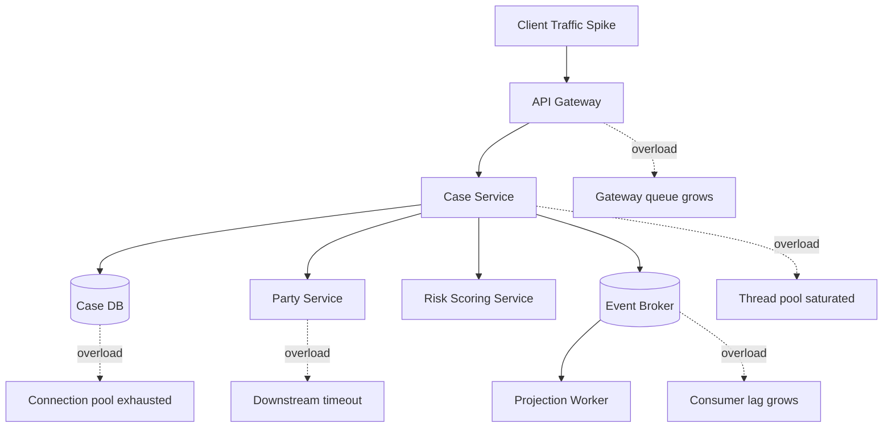
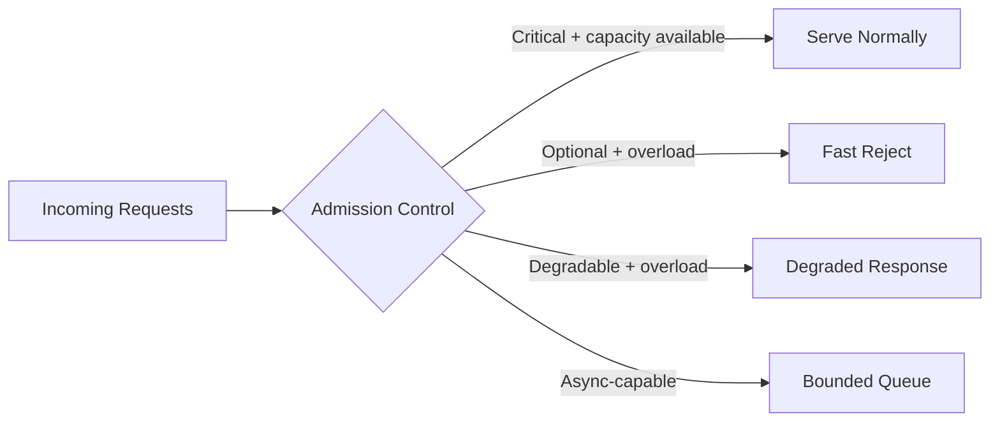
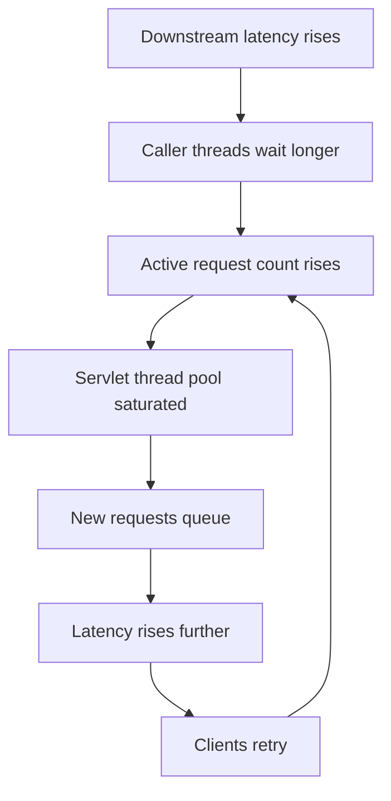
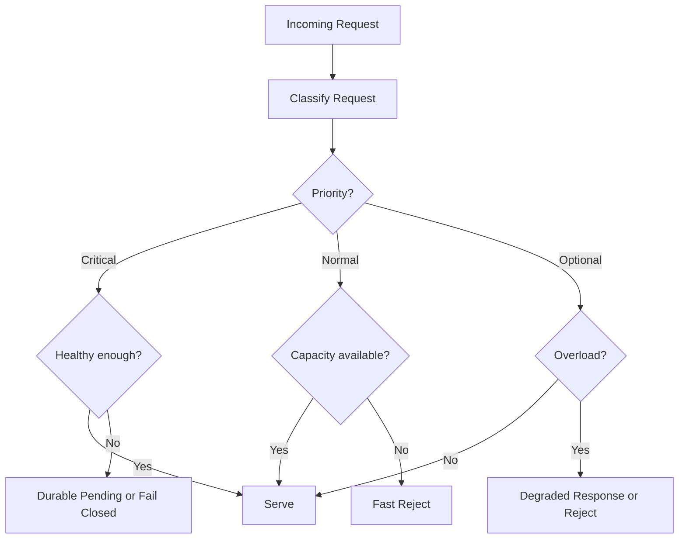
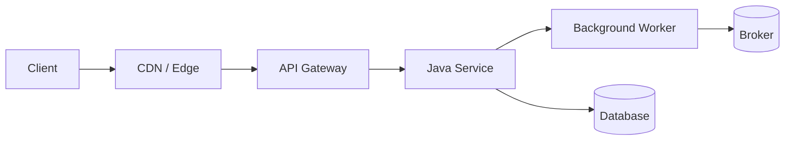
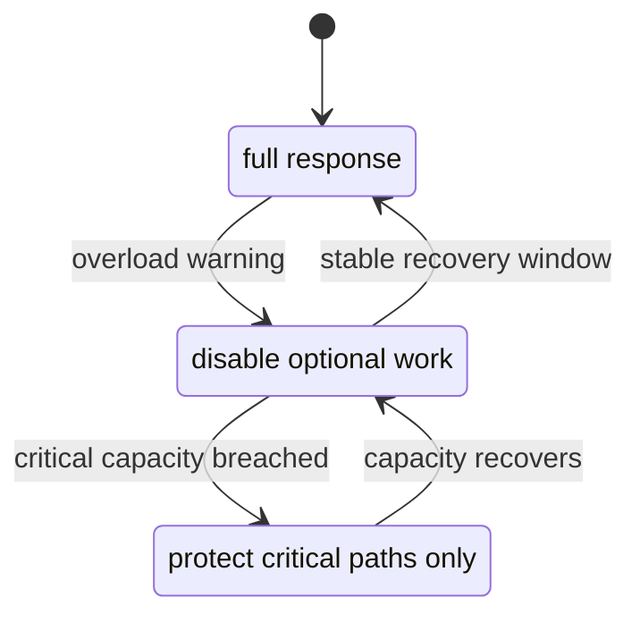
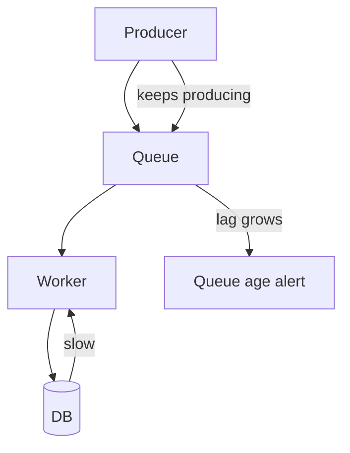
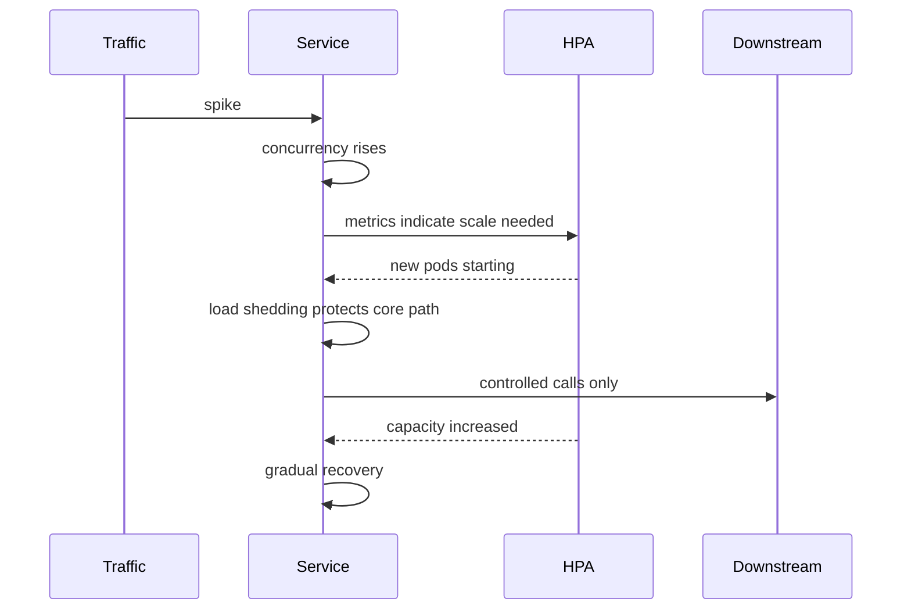

# Part 043 — Load Shedding and Graceful Degradation

Pada part sebelumnya kita membahas circuit breaker, bulkhead, dan rate limiter.

Sekarang kita masuk ke dua strategi yang sering terasa tidak nyaman secara psikologis bagi engineer: **menolak sebagian traffic** dan **menurunkan kualitas response secara sengaja**.

Ini bukan tanda sistem lemah. Ini tanda sistem tahu batasnya.

Sistem production yang sehat tidak selalu menjawab semua request dengan kualitas penuh. Sistem production yang sehat tahu kapan harus:

1. menerima request;
2. menolak cepat;
3. mengembalikan response parsial;
4. menunda pekerjaan;
5. memprioritaskan traffic penting;
6. melindungi jalur bisnis inti.

Jika sistem tidak punya kebijakan eksplisit untuk overload, maka kebijakan implisitnya adalah: **biarkan semua request masuk sampai semuanya runtuh**.

Itu bukan reliability. Itu gambling.

---

## 1. Mental Model

Load shedding menjawab:

> “Request mana yang harus ditolak agar sistem inti tetap hidup?”

Graceful degradation menjawab:

> “Kualitas apa yang boleh diturunkan agar fungsi utama tetap tersedia?”

Keduanya saling melengkapi.

| Strategi | Inti keputusan | Contoh |
|---|---|---|
| Load shedding | Tolak sebagian work | Reject search ketika CPU tinggi |
| Graceful degradation | Turunkan kualitas response | Tampilkan case detail tanpa recommendation panel |
| Rate limiting | Batasi laju sebelum overload | Maksimal 50 request/menit per tenant |
| Circuit breaker | Hindari dependency yang sedang gagal | Jangan panggil Party Service ketika error rate tinggi |
| Bulkhead | Isolasi resource per path/dependency | Escalation worker pool terpisah dari report worker pool |

Load shedding tidak sama dengan rate limiting.

Rate limiting biasanya berbasis policy statis atau semi-dinamis: per user, per tenant, per API key, per endpoint.

Load shedding berbasis kondisi sistem saat ini: CPU, heap, thread pool, queue depth, DB pool, downstream health, event lag, latency percentile, atau error budget.

---

## 2. Why Overload Must Be Designed Explicitly

Sistem microservices punya banyak titik overload:



Tanpa kebijakan overload:

1. request tetap diterima;
2. thread menunggu dependency;
3. connection pool habis;
4. queue bertambah;
5. latency naik;
6. client timeout;
7. client retry;
8. traffic efektif naik;
9. service semakin lambat;
10. health check mulai gagal;
11. orchestrator restart instance;
12. kapasitas efektif turun;
13. cascading failure terjadi.

Load shedding memotong siklus ini sebelum resource kritis habis.



Admission control adalah inti dari load shedding.

Sebelum request masuk ke jalur kerja mahal, service harus bertanya:

- Apakah request ini penting?
- Apakah kapasitas masih tersedia?
- Apakah dependency yang diperlukan sehat?
- Apakah request ini bisa ditunda?
- Apakah response parsial masih berguna?
- Apakah menerima request ini akan membahayakan request yang lebih penting?

---

## 3. Failure Mode: “Helpful” Service That Kills Itself

Service sering runtuh bukan karena ia tidak mau melayani, tetapi karena ia terlalu mau melayani.

Contoh:

- endpoint pencarian menerima query mahal tanpa limit;
- worker terus mengambil message meski DB lambat;
- API gateway terus meneruskan traffic ke service yang sudah saturated;
- service tetap memanggil recommendation service untuk panel opsional ketika dependency sedang timeout;
- semua tenant mendapat treatment sama meski satu tenant menghasilkan spike tidak normal;
- internal retry membuat traffic tiga kali lipat saat dependency lambat.

Service seperti ini “baik hati” di level request individual, tetapi merusak sistem di level aggregate.

Top 1% engineer tidak hanya bertanya:

> “Bagaimana request ini berhasil?”

Mereka juga bertanya:

> “Kapan request ini harus ditolak?”

---

## 4. Load Shedding vs Graceful Degradation

Keduanya berbeda.

### Load Shedding

Load shedding mengurangi jumlah work yang masuk.

Contoh:

```http
HTTP/1.1 503 Service Unavailable
Retry-After: 15
Content-Type: application/problem+json

{
  "type": "https://example.com/problems/service-overloaded",
  "title": "Service temporarily overloaded",
  "status": 503,
  "detail": "The case search service is temporarily overloaded. Please retry later.",
  "retryable": true
}
```

Load shedding cocok ketika:

- request tidak bisa diselesaikan aman;
- menerima request akan memperburuk overload;
- resource kritis hampir habis;
- downstream dependency sedang tidak sehat;
- request bukan prioritas tertinggi;
- lebih baik gagal cepat daripada timeout lambat.

### Graceful Degradation

Graceful degradation tetap melayani, tetapi dengan kualitas lebih rendah.

Contoh response detail case:

```json
{
  "caseId": "CASE-2026-00017",
  "status": "UNDER_REVIEW",
  "summary": {
    "subject": "Potential reporting violation",
    "priority": "HIGH"
  },
  "party": {
    "status": "UNAVAILABLE",
    "message": "Party profile is temporarily unavailable"
  },
  "riskScore": {
    "status": "STALE",
    "score": 72,
    "lastUpdatedAt": "2026-07-05T09:12:30+07:00"
  }
}
```

Graceful degradation cocok ketika:

- core response masih berguna;
- missing data bukan invariant wajib;
- user bisa melanjutkan sebagian workflow;
- response bisa menandai bagian yang stale/unavailable;
- fallback tidak menipu user;
- audit trail tetap benar.

---

## 5. The Most Important Rule

Jangan degrade command yang mengubah state dengan fake success.

Query boleh lebih sering degrade.
Command harus jauh lebih hati-hati.

| Operation | Degradation yang aman? | Catatan |
|---|---:|---|
| View case detail | Ya | Bisa partial/stale |
| Search cases | Ya | Bisa limit result atau reject |
| Submit escalation | Tergantung | Bisa accepted-pending jika durable |
| Approve enforcement action | Sangat hati-hati | Jangan fake approval |
| Publish audit event | Tidak boleh hilang | Harus durable/retry/reconcile |
| Send notification | Bisa pending | Jangan klaim terkirim jika belum |

Untuk command, pilihan aman biasanya:

1. reject cepat;
2. accept as pending secara durable;
3. enqueue dengan bounded capacity;
4. require manual retry;
5. route ke workflow state `PENDING_DEPENDENCY`;
6. return `202 Accepted` hanya jika work sudah tercatat durable.

Bad example:

```java
public ApprovalResponse approve(String caseId) {
    try {
        policyClient.validateApproval(caseId);
        repository.markApproved(caseId);
        return ApprovalResponse.success();
    } catch (TimeoutException ex) {
        // Dangerous: user sees approval even though policy validation did not happen.
        return ApprovalResponse.success();
    }
}
```

Better:

```java
public ApprovalResponse approve(String caseId, String idempotencyKey) {
    ApprovalCommand command = ApprovalCommand.requested(caseId, idempotencyKey);

    ApprovalAttempt attempt = approvalWorkflow.start(command);

    return switch (attempt.status()) {
        case APPROVED -> ApprovalResponse.approved(attempt.approvalId());
        case PENDING_POLICY_CHECK -> ApprovalResponse.pending(
            attempt.approvalId(),
            "Approval request is recorded and waiting for policy validation"
        );
        case REJECTED -> ApprovalResponse.rejected(attempt.reason());
    };
}
```

`PENDING` adalah state bisnis yang jujur. Fake success adalah bug audit.

---

## 6. Overload Signals

Load shedding harus berbasis sinyal.

Sinyal yang umum:

| Signal | Makna |
|---|---|
| CPU utilization | Compute mendekati saturasi |
| JVM heap usage / GC pause | Memory pressure |
| Request concurrency | Terlalu banyak request aktif |
| Thread pool active count | Worker hampir habis |
| Queue depth | Backlog bertambah |
| Queue age | Work lama tidak diproses |
| DB pool utilization | DB access bottleneck |
| Downstream latency p95/p99 | Dependency lambat |
| Error rate | Dependency/service tidak sehat |
| Consumer lag | Async consumer tertinggal |
| SLO burn rate | User-visible reliability memburuk |

Jangan hanya pakai CPU.

Banyak service Java runtuh saat CPU tidak tinggi, tetapi thread pool atau connection pool habis karena menunggu I/O.

Contoh:



CPU bisa terlihat normal karena thread sedang blocked.

Karena itu admission control perlu membaca resource yang benar.

---

## 7. Admission Control Design

Admission control adalah gate sebelum work mahal.



Admission decision minimal harus mempertimbangkan:

1. operation class;
2. tenant/user priority;
3. current system capacity;
4. required dependency health;
5. idempotency/retry safety;
6. fallback availability;
7. audit/security requirement.

### Operation Class

| Class | Example | Default overload behavior |
|---|---|---|
| Critical command | Approve case, submit enforcement action | Fail closed or durable pending |
| Critical query | View assigned case | Partial response if safe |
| Normal query | Search/filter cases | Limit, degrade, or reject |
| Optional enrichment | Risk recommendation, similar case suggestions | Skip/degrade |
| Background work | Rebuild projection, export report | Slow down or pause |
| Bulk/expensive work | Large CSV export | Queue with quota or reject |

### Tenant Priority

Dalam enterprise system, tidak semua traffic setara.

Contoh priority:

- regulator internal emergency operation;
- public portal normal request;
- scheduled analytics export;
- integration partner batch job;
- admin dashboard widget;
- retry from stale client.

Priority bukan berarti “customer besar selalu menang”. Priority harus mengikuti business criticality, fairness, contract, dan compliance.

---

## 8. Java Admission Controller Example

Contoh framework-neutral:

```java
public interface AdmissionController {
    AdmissionDecision evaluate(AdmissionRequest request);
}

public record AdmissionRequest(
    String operation,
    String tenantId,
    OperationClass operationClass,
    boolean idempotent,
    Set<String> requiredDependencies
) {}

public sealed interface AdmissionDecision {
    record Accept() implements AdmissionDecision {}
    record Reject(int status, String reason, Duration retryAfter) implements AdmissionDecision {}
    record Degrade(Set<String> disabledFeatures, String reason) implements AdmissionDecision {}
    record Queue(Duration expectedDelay) implements AdmissionDecision {}
}
```

Implementation sederhana:

```java
public final class CapacityAwareAdmissionController implements AdmissionController {
    private final RuntimeCapacity capacity;
    private final DependencyHealth dependencies;
    private final PriorityPolicy priorityPolicy;

    public AdmissionDecision evaluate(AdmissionRequest request) {
        Priority priority = priorityPolicy.priorityOf(request.tenantId(), request.operation());

        if (capacity.isSeverelyOverloaded()) {
            if (request.operationClass() == OperationClass.OPTIONAL_QUERY) {
                return new AdmissionDecision.Reject(
                    503,
                    "service_overloaded",
                    Duration.ofSeconds(15)
                );
            }

            if (request.operationClass() == OperationClass.CRITICAL_QUERY) {
                return new AdmissionDecision.Degrade(
                    Set.of("recommendations", "auditTimelinePreview"),
                    "serving_minimal_case_view"
                );
            }

            if (request.operationClass() == OperationClass.CRITICAL_COMMAND) {
                return request.idempotent()
                    ? new AdmissionDecision.Queue(Duration.ofMinutes(2))
                    : new AdmissionDecision.Reject(503, "cannot_safely_queue_non_idempotent_command", Duration.ofSeconds(10));
            }
        }

        for (String dependency : request.requiredDependencies()) {
            if (!dependencies.isHealthy(dependency)) {
                return decisionForDependencyFailure(request, dependency);
            }
        }

        return new AdmissionDecision.Accept();
    }

    private AdmissionDecision decisionForDependencyFailure(AdmissionRequest request, String dependency) {
        if (request.operationClass() == OperationClass.OPTIONAL_QUERY) {
            return new AdmissionDecision.Degrade(Set.of(dependency), "dependency_unavailable");
        }
        if (request.operationClass() == OperationClass.CRITICAL_COMMAND) {
            return new AdmissionDecision.Reject(503, "required_dependency_unavailable", Duration.ofSeconds(20));
        }
        return new AdmissionDecision.Reject(503, "dependency_unavailable", Duration.ofSeconds(20));
    }
}
```

Catatan penting:

- Admission controller tidak boleh menjadi tempat business rule detail.
- Ia hanya memutuskan apakah request boleh masuk ke jalur eksekusi tertentu.
- Keputusan harus observable.
- Keputusan harus bisa direview oleh product/security/SRE.

---

## 9. Where to Shed Load

Load shedding bisa terjadi di banyak lapisan.



| Layer | Bisa melakukan apa? | Risiko |
|---|---|---|
| CDN/edge | Block abusive traffic, cache static-ish response | Tidak tahu domain context |
| API gateway | Rate limit, quota, coarse priority | Bisa menjadi god gateway |
| Service ingress | Operation-aware shedding | Butuh telemetry lokal |
| Application service | Business-aware pending/degrade | Terlambat jika work mahal sudah dimulai |
| Worker | Pause/slow consume | Lag bertambah |
| DB/client pool | Reject ketika pool penuh | Gejala, bukan akar masalah |

Prinsip praktis:

- Shed sedini mungkin untuk traffic yang jelas tidak boleh masuk.
- Shed di service untuk keputusan yang butuh context domain.
- Jangan menunggu DB pool penuh baru menolak.
- Jangan memasukkan semua request ke queue “untuk nanti”. Queue tanpa batas adalah overload yang disembunyikan.

---

## 10. Fast Reject Is Better Than Slow Timeout

Slow timeout mahal.

Ia menghabiskan:

- thread;
- connection;
- memory;
- retry budget;
- user patience;
- observability capacity;
- downstream capacity.

Fast reject memberi sinyal jelas:

- kepada client;
- kepada gateway;
- kepada autoscaler;
- kepada operator;
- kepada alerting system.

Contoh response overload yang baik:

```http
HTTP/1.1 503 Service Unavailable
Retry-After: 10
Content-Type: application/problem+json
X-Request-Class: normal-query
X-Degraded: false
```

Body:

```json
{
  "type": "https://reg.example.com/problems/service-overloaded",
  "title": "Service temporarily overloaded",
  "status": 503,
  "detail": "Case search is temporarily overloaded. Retry after the suggested delay.",
  "retryable": true,
  "retryAfterSeconds": 10,
  "correlationId": "01J1M7SBJ9ZPQ5K7WZ3Z"
}
```

Jangan return `500` untuk intentional load shedding.

`500` menyatakan bug/unexpected server error. Overload yang disengaja lebih tepat sebagai `503 Service Unavailable`, kadang `429 Too Many Requests` untuk quota/rate-limit case.

---

## 11. Graceful Degradation Contract

Graceful degradation harus eksplisit dalam kontrak response.

Bad:

```json
{
  "caseId": "CASE-1",
  "riskScore": null
}
```

Consumer tidak tahu apakah `riskScore` null karena:

- memang tidak ada;
- user tidak punya akses;
- service sedang gagal;
- risk score belum dihitung;
- data dihapus karena privacy;
- bug mapping.

Better:

```json
{
  "caseId": "CASE-1",
  "riskScore": {
    "availability": "UNAVAILABLE",
    "reason": "DEPENDENCY_UNAVAILABLE",
    "retryable": true
  }
}
```

Atau untuk stale data:

```json
{
  "caseId": "CASE-1",
  "riskScore": {
    "availability": "STALE",
    "value": 81,
    "asOf": "2026-07-05T08:30:00+07:00",
    "stalenessSeconds": 912
  }
}
```

Response parsial harus menjawab:

1. bagian apa yang tersedia;
2. bagian apa yang tidak tersedia;
3. apakah data stale;
4. kapan data terakhir diperbarui;
5. apakah user boleh retry;
6. apakah proses utama berhasil atau hanya tampilan yang degrade.

---

## 12. Degradation Modes

Graceful degradation bukan satu pola. Ada beberapa mode.

| Mode | Contoh | Cocok untuk |
|---|---|---|
| Omit optional panel | Hilangkan recommendation widget | UI/dashboard |
| Return stale cache | Risk score lama dengan `asOf` | Query yang toleran staleness |
| Reduce precision | Count approximate, bukan exact | Search/report preview |
| Reduce page size | Batasi result 100 menjadi 20 | Search saat overload |
| Disable expensive sorting | Sort default saja | Query mahal |
| Disable enrichment | Tidak panggil external profile | Detail view |
| Async accepted | Terima command sebagai pending | Durable workflow |
| Read-only mode | Blok command, izinkan query | Incident/maintenance |
| Regional fallback | Serve dari region lain dengan staleness | Multi-region |

Setiap mode butuh kontrak.

Jangan degrade diam-diam.

---

## 13. Priority-Based Degradation

Contoh regulatory case-management:

| Capability | Normal mode | Degraded mode | Severe overload |
|---|---|---|---|
| Case detail | Full view + party + risk + timeline | Core case + stale risk | Core case only |
| Case search | Full filters + sort + facets | Basic filters, no facets | Reject normal search |
| Evidence upload | Virus scan + metadata + preview | Upload pending scan | Reject if storage unsafe |
| Escalation submit | Validate all policies sync | Durable pending validation | Fail closed if cannot record |
| Audit export | Generate immediately | Queue export | Pause export |
| Recommendation | Real-time suggestion | Cached suggestion | Disabled |

Diagram:



State harus punya hysteresis.

Tanpa hysteresis, sistem bisa flapping:

- normal → degraded → normal → degraded;
- cache invalidation chaos;
- operator bingung;
- client behavior tidak stabil.

Gunakan recovery window, misalnya:

- masuk degraded jika p95 > 800 ms selama 2 menit;
- kembali normal hanya jika p95 < 500 ms selama 10 menit.

---

## 14. Hysteresis and Recovery

Masuk mode overload harus cepat. Keluar mode overload harus hati-hati.

Contoh:

```java
public final class OverloadModeDetector {
    private Mode current = Mode.NORMAL;
    private Instant degradedSince;
    private Instant healthySince;

    public Mode evaluate(RuntimeSignals s, Instant now) {
        if (s.dbPoolUtilization() > 0.90 || s.requestP99Millis() > 2_000) {
            current = Mode.SEVERE;
            healthySince = null;
            return current;
        }

        if (s.requestP95Millis() > 800 || s.activeRequests() > s.maxSafeConcurrency()) {
            if (current == Mode.NORMAL) {
                degradedSince = now;
            }
            current = Mode.DEGRADED;
            healthySince = null;
            return current;
        }

        if (current != Mode.NORMAL) {
            if (healthySince == null) {
                healthySince = now;
            }
            if (Duration.between(healthySince, now).compareTo(Duration.ofMinutes(10)) >= 0) {
                current = Mode.NORMAL;
            }
        }

        return current;
    }
}
```

Recovery lebih berbahaya daripada terlihat.

Ketika service kembali sehat, client yang retry, queue backlog, autoscaler, dan cron job bisa menyerbu bersamaan. Karena itu keluar dari degraded mode harus bertahap.

---

## 15. Queue Is Not a Universal Solution

Queue sering dipakai untuk “mengatasi” overload. Padahal queue hanya memindahkan overload dari waktu sekarang ke waktu nanti.

Queue sehat jika:

- bounded;
- work idempotent;
- worker bisa mengontrol consume rate;
- queue age dimonitor;
- ada DLQ;
- ada expiry/deadline;
- ada priority;
- ada cancellation;
- backlog recovery capacity cukup.

Queue berbahaya jika:

- unbounded;
- tidak ada TTL;
- user mengira work sudah selesai;
- producer lebih cepat dari consumer secara permanen;
- message tidak idempotent;
- retry poison message tanpa batas;
- backlog tidak punya owner.



Load shedding untuk async system sering berarti:

- pause consumer;
- reject producer;
- reduce producer rate;
- move low-priority message to delayed queue;
- drop recomputable work;
- expire stale command;
- split priority queues.

---

## 16. Background Worker Load Shedding

API service bukan satu-satunya tempat overload.

Worker juga perlu admission control.

Contoh event projection worker:

```java
public final class ProjectionWorker {
    private final ProjectionLagMonitor lag;
    private final DatabaseHealth db;
    private final ProjectionHandler handler;

    public void onMessage(ProjectionMessage message) {
        if (!db.canAcceptProjectionWrites()) {
            throw new TemporaryBackpressureException("projection_db_saturated");
        }

        if (message.isLowPriority() && lag.isSeverelyBehind()) {
            // For recomputable projection refresh, skip or delay may be valid.
            throw new DelayMessageException(Duration.ofMinutes(5));
        }

        handler.apply(message);
    }
}
```

Untuk event yang wajib audit, jangan drop.

Untuk work yang recomputable, drop/merge/delay bisa sah.

| Work type | Drop allowed? | Better strategy |
|---|---:|---|
| Audit event | Tidak | Durable retry + alert |
| Case status projection | Tidak biasanya | Retry + rebuildable projection |
| Search index refresh | Kadang | Coalesce/rebuild |
| Notification email | Tergantung | Retry, pending, user-visible status |
| Recommendation refresh | Ya jika recomputable | Drop stale refresh |
| Analytics pre-aggregation | Kadang | Delay/batch |

---

## 17. Load Shedding for Expensive Queries

Search/report endpoint sering menjadi sumber overload.

Masalah umum:

- pagination tanpa limit;
- filter bebas tanpa index;
- sort mahal;
- wildcard query;
- export besar synchronous;
- aggregate count exact;
- join lintas read model;
- tenant besar memakai query yang sama dengan tenant kecil.

Mitigasi:

1. hard limit page size;
2. cursor pagination;
3. require indexed filter;
4. cap date range;
5. async export;
6. approximate count;
7. disable facets under load;
8. per-tenant query budget;
9. cost-based admission control.

Contoh query cost estimator:

```java
public record QueryCost(
    int score,
    List<String> reasons
) {
    boolean tooExpensive() {
        return score >= 100;
    }
}

public final class CaseSearchCostEstimator {
    public QueryCost estimate(CaseSearchRequest request) {
        int score = 0;
        List<String> reasons = new ArrayList<>();

        if (request.pageSize() > 100) {
            score += 40;
            reasons.add("large_page_size");
        }
        if (request.dateRangeDays() > 365) {
            score += 30;
            reasons.add("large_date_range");
        }
        if (request.hasWildcardTextSearch()) {
            score += 40;
            reasons.add("wildcard_text_search");
        }
        if (request.sortBy().isExpensive()) {
            score += 25;
            reasons.add("expensive_sort");
        }

        return new QueryCost(score, reasons);
    }
}
```

Controller boundary:

```java
@GetMapping("/cases")
public ResponseEntity<?> search(CaseSearchRequest request) {
    QueryCost cost = estimator.estimate(request);

    if (overload.isDegraded() && cost.tooExpensive()) {
        return ResponseEntity.status(503)
            .header("Retry-After", "30")
            .body(problem("query_too_expensive_during_overload", cost.reasons()));
    }

    return ResponseEntity.ok(searchService.search(request));
}
```

---

## 18. Load Shedding and Autoscaling

Load shedding bukan pengganti autoscaling.

Autoscaling menambah kapasitas. Load shedding melindungi kapasitas yang ada.

Keduanya perlu bekerja bersama.

Masalah autoscaling:

- scale out butuh waktu;
- startup Java service bisa memerlukan warmup;
- DB/downstream mungkin tidak ikut scale;
- traffic spike bisa lebih cepat dari autoscaler;
- autoscaler yang membaca CPU bisa gagal melihat thread starvation;
- scale out saat dependency lambat bisa memperparah dependency.

Load shedding harus aktif sebelum autoscaling selesai.



Jangan anggap “nanti HPA yang menyelesaikan”. HPA bukan admission controller.

---

## 19. Load Shedding and Kubernetes Health Checks

Kesalahan umum:

- overload sedikit → liveness check gagal;
- kubelet restart pod;
- pod kehilangan warm cache;
- traffic pindah ke pod lain;
- pod lain overload;
- cascading restart.

Liveness bukan overload signal.

Liveness harus menjawab:

> “Process ini mati/hang irrecoverably?”

Readiness harus menjawab:

> “Pod ini boleh menerima traffic baru?”

Load shedding dapat mempengaruhi readiness, tetapi hati-hati.

Jika semua pod mengubah readiness menjadi false bersamaan, service bisa kehilangan semua endpoint.

Lebih baik:

- readiness false untuk kondisi tidak bisa melayani traffic sama sekali;
- load shedding di application layer untuk prioritas/operation-aware behavior;
- graceful degradation untuk optional path;
- liveness tetap stabil kecuali process benar-benar tidak recoverable.

---

## 20. Degraded Response in Java API Layer

Contoh detail case dengan optional panels.

```java
public record CaseDetailResponse(
    String caseId,
    String status,
    Panel<PartySummary> party,
    Panel<RiskScore> risk,
    Panel<List<TimelineEntry>> timeline
) {}

public record Panel<T>(
    Availability availability,
    T value,
    String reason,
    Instant asOf
) {
    public static <T> Panel<T> available(T value) {
        return new Panel<>(Availability.AVAILABLE, value, null, Instant.now());
    }

    public static <T> Panel<T> unavailable(String reason) {
        return new Panel<>(Availability.UNAVAILABLE, null, reason, null);
    }

    public static <T> Panel<T> stale(T value, Instant asOf, String reason) {
        return new Panel<>(Availability.STALE, value, reason, asOf);
    }
}
```

Composition service:

```java
public CaseDetailResponse getCaseDetail(String caseId) {
    CaseRecord core = caseRepository.getRequired(caseId);

    Panel<PartySummary> party = panel("party", () -> partyClient.getSummary(core.partyId()));
    Panel<RiskScore> risk = panel("risk", () -> riskClient.getScore(caseId));
    Panel<List<TimelineEntry>> timeline = panel("timeline", () -> timelineClient.getRecent(caseId));

    return new CaseDetailResponse(core.id(), core.status(), party, risk, timeline);
}

private <T> Panel<T> panel(String name, Supplier<T> supplier) {
    if (overload.isOptionalFeatureDisabled(name)) {
        return Panel.unavailable("disabled_due_to_overload");
    }

    try {
        return Panel.available(supplier.get());
    } catch (CircuitBreakerOpenException ex) {
        return Panel.unavailable("dependency_circuit_open");
    } catch (TimeoutException ex) {
        return cache.findFreshEnough(name)
            .map(cached -> Panel.stale((T) cached.value(), cached.asOf(), "dependency_timeout"))
            .orElseGet(() -> Panel.unavailable("dependency_timeout"));
    }
}
```

Catatan:

- Jangan swallow exception tanpa menandai response.
- Jangan return stale data tanpa `asOf`.
- Jangan menggunakan fallback yang melanggar authorization.
- Jangan cache data sensitif tanpa policy.

---

## 21. Safe Degradation Requires Data Classification

Tidak semua data boleh dijadikan fallback cache.

Pertanyaan:

- Apakah data mengandung PII?
- Apakah user authorization bisa berubah cepat?
- Apakah data boleh stale secara hukum/proses?
- Apakah stale data bisa menyebabkan keputusan salah?
- Apakah response harus menyebut `asOf`?
- Apakah data fallback harus tenant-scoped?

Contoh:

| Data | Stale fallback? | Reasoning |
|---|---:|---|
| Case title | Mungkin | Jika bukan sensitive update cepat |
| Current enforcement decision | Hati-hati | Bisa menyebabkan aksi salah |
| Risk score | Bisa jika diberi `asOf` | Tergantung workflow |
| Party address | Hati-hati | PII dan bisa berubah |
| Audit trail | Jangan palsukan | Harus akurat |
| Recommendation | Ya | Optional enrichment |

Graceful degradation tanpa privacy model bisa menjadi data leak.

---

## 22. Load Shedding Metrics

Metrics minimal:

```text
http_server_requests_total{operation="case_search", outcome="shed"}
admission_decisions_total{operation="case_search", decision="reject", reason="overload"}
admission_decisions_total{operation="case_detail", decision="degrade", feature="risk"}
degraded_responses_total{feature="party", reason="circuit_open"}
request_priority_total{priority="critical"}
queue_rejections_total{queue="audit-export", reason="full"}
```

Jangan hanya memonitor error rate.

Load shedding yang bekerja dengan benar akan meningkatkan jumlah reject/degraded response. Itu bukan selalu insiden; itu bisa berarti sistem sedang melindungi diri.

Alert yang lebih baik:

- shed rate > threshold selama 10 menit;
- degraded critical response > threshold;
- all pods in severe mode;
- queue age melewati SLA;
- retry-after ignored by clients;
- load shed pada critical command;
- fallback cache age melewati batas aman.

Dashboard harus menampilkan:

1. normal vs degraded vs rejected;
2. per operation;
3. per tenant/priority;
4. per dependency reason;
5. capacity signal yang memicu keputusan;
6. business impact.

---

## 23. Client Contract

Load shedding tidak selesai di server.

Client harus tahu apa yang harus dilakukan.

Untuk `503`:

- respect `Retry-After`;
- gunakan backoff + jitter;
- jangan retry non-idempotent command tanpa idempotency key;
- tampilkan pesan yang jujur;
- jangan retry infinitely;
- jangan semua client retry di detik yang sama.

Untuk degraded response:

- UI harus bisa menampilkan partial state;
- jangan crash karena field unavailable;
- jangan menganggap `null` sebagai empty;
- tampilkan stale marker jika perlu;
- jangan melakukan action berbahaya dari stale data.

Client yang buruk bisa mengalahkan load shedding server.

---

## 24. Design Checklist

Sebelum production, jawab:

1. Operation mana yang critical, normal, optional, background, expensive?
2. Apa overload signal utama untuk service ini?
3. Di mana admission control dilakukan?
4. Apa yang terjadi jika DB pool 90% penuh?
5. Apa yang terjadi jika downstream p99 naik 10x?
6. Apa yang terjadi jika queue age melewati SLA?
7. Endpoint mana yang boleh partial response?
8. Endpoint mana yang harus fail closed?
9. Command mana yang boleh `202 Accepted`?
10. Apakah accepted command sudah durable?
11. Apakah response degraded eksplisit?
12. Apakah stale data punya `asOf`?
13. Apakah fallback cache tenant-safe dan authorization-safe?
14. Apakah shed/degrade metrics tersedia?
15. Apakah client menghormati `Retry-After`?
16. Apakah recovery mode punya hysteresis?
17. Apakah load shedding diuji dalam load test?
18. Apakah operator punya runbook overload?

---

## 25. Common Anti-Patterns

### Anti-Pattern 1 — Infinite Queue

“Jangan reject, masukkan saja ke queue.”

Ini hanya benar jika queue bounded, work punya deadline, dan consumer capacity cukup.

### Anti-Pattern 2 — Silent Degradation

Service return data sebagian tanpa metadata.

Consumer membuat keputusan salah karena tidak tahu response tidak lengkap.

### Anti-Pattern 3 — Fake Success

Command dianggap sukses padahal dependency wajib gagal.

Ini buruk untuk audit, compliance, dan user trust.

### Anti-Pattern 4 — Liveness as Overload Control

Membuat liveness gagal saat overload.

Akibatnya orchestrator restart pod dan memperburuk kapasitas.

### Anti-Pattern 5 — Equal Treatment for Unequal Work

Search mahal dan approval critical memakai pool/priority yang sama.

Saat search spike, approval ikut gagal.

### Anti-Pattern 6 — Fallback Without Security Review

Mengambil stale cached data tanpa mengecek authorization/tenant.

Fallback berubah menjadi data leak.

### Anti-Pattern 7 — Degrade Everything

Semua error diubah menjadi fallback.

Bug tersembunyi, user tertipu, audit rusak.

---

## 26. Architecture Review Card

Gunakan card ini saat review service.

```yaml
service: case-service
operation: GET /cases/{caseId}
operationClass: critical-query
normalBehavior:
  includes:
    - core case
    - party summary
    - risk score
    - recent timeline
overloadBehavior:
  degradedMode:
    disable:
      - recommendations
      - full timeline
    allowStale:
      riskScoreMaxAge: PT30M
  severeMode:
    includeOnly:
      - core case
      - current status
requiredDependencies:
  - case-db
optionalDependencies:
  - party-service
  - risk-service
  - timeline-service
admissionSignals:
  - activeRequests
  - dbPoolUtilization
  - dependencyCircuitState
responseContract:
  partialResponseExplicit: true
  staleDataIncludesAsOf: true
metrics:
  - admission_decisions_total
  - degraded_responses_total
  - dependency_panel_availability_total
clientContract:
  retryAfterRespected: true
  partialUiSupported: true
riskReview:
  privacyReviewed: true
  auditReviewed: true
```

---

## 27. Exercises

1. Ambil satu endpoint detail view. Pecah response-nya menjadi core section dan optional section.
2. Tentukan degraded response untuk setiap optional section.
3. Ambil satu command penting. Tentukan apakah overload behavior-nya reject, pending, atau fail closed.
4. Buat admission decision matrix untuk 5 operation di sistemmu.
5. Tentukan signal mana yang memicu degraded mode dan severe mode.
6. Desain response `503` dengan `Retry-After` dan problem detail.
7. Buat metric list untuk load shedding dan graceful degradation.
8. Buat runbook singkat untuk “service in degraded mode”.

---

## 28. Key Takeaways

- Load shedding adalah keputusan sadar untuk menolak work agar sistem inti tetap hidup.
- Graceful degradation adalah keputusan sadar untuk menurunkan kualitas response tanpa menipu consumer.
- Fast reject lebih baik daripada slow timeout saat overload.
- Command tidak boleh fake success; gunakan reject, durable pending, atau fail closed.
- Queue bukan solusi universal; queue harus bounded dan observable.
- Degraded response harus eksplisit, termasuk stale marker dan `asOf` jika perlu.
- Load shedding harus berbasis operation class, priority, capacity, dependency health, dan safety.
- Recovery dari overload harus punya hysteresis agar tidak flapping.

Part berikutnya membahas **Backpressure in Synchronous and Async Systems**: bagaimana producer, consumer, API, worker, dan dependency mengatur laju kerja agar sistem tidak hanya menolak saat terlambat, tetapi mengendalikan flow sejak awal.

---

## Referensi

- Google SRE Book — *Handling Overload*.
- Google SRE Book — *Addressing Cascading Failures*.
- AWS Builders' Library — *Timeouts, retries, and backoff with jitter*.
- RFC 9110 — HTTP Semantics, especially status code semantics for 503 and Retry-After behavior.
- RFC 9457 — Problem Details for HTTP APIs.
