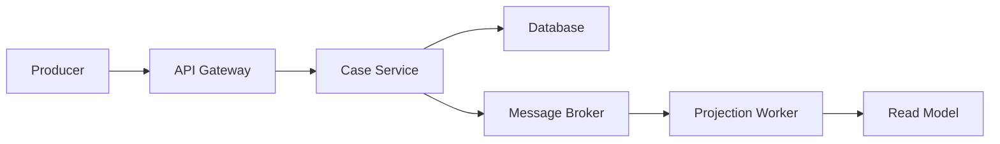
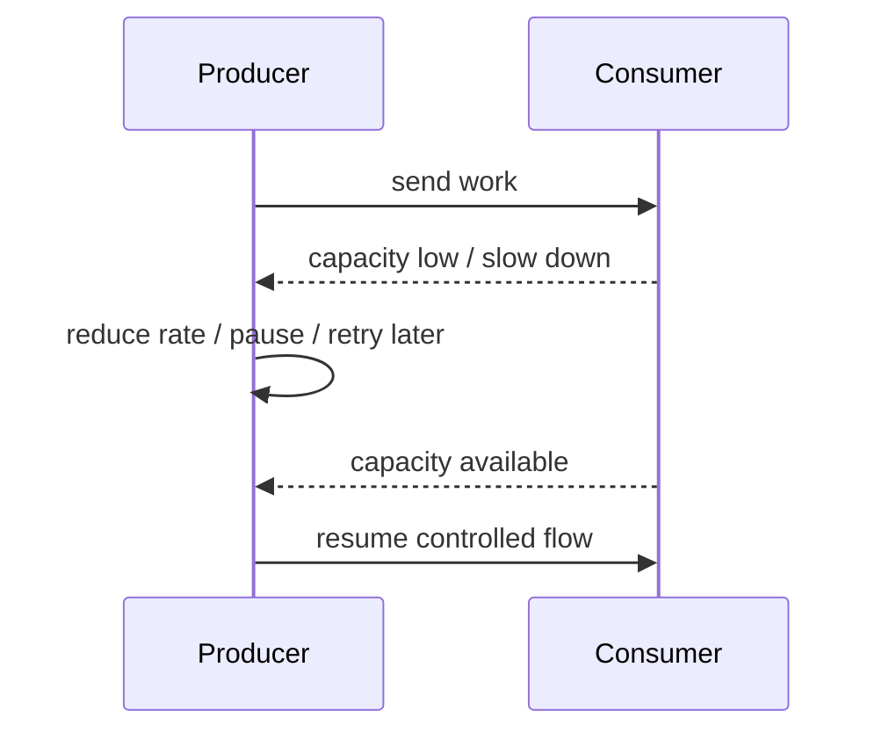
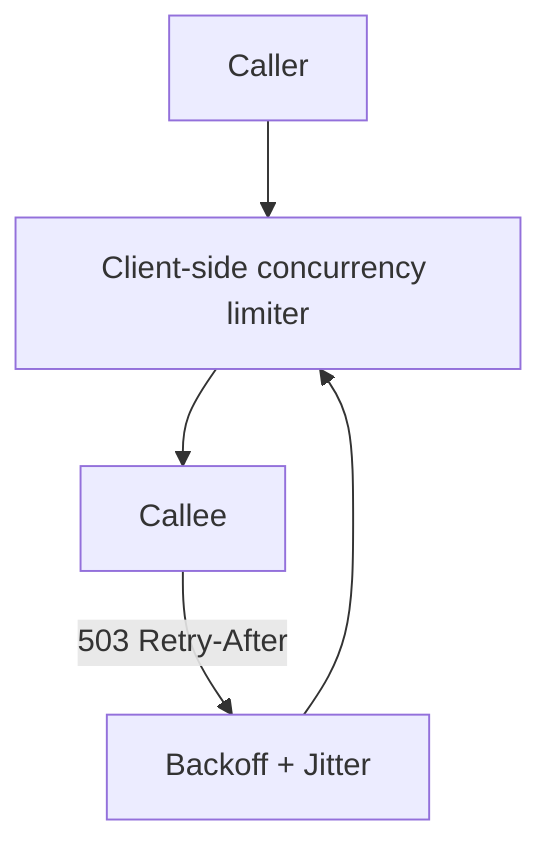
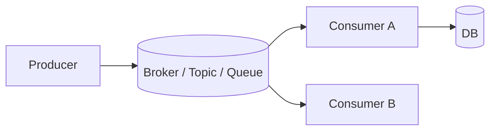
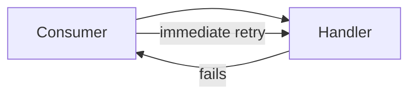
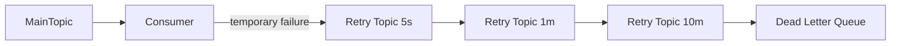
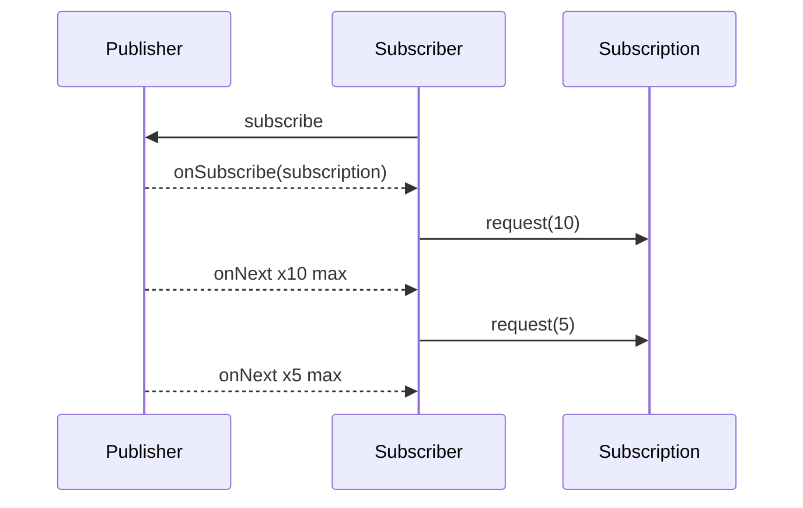
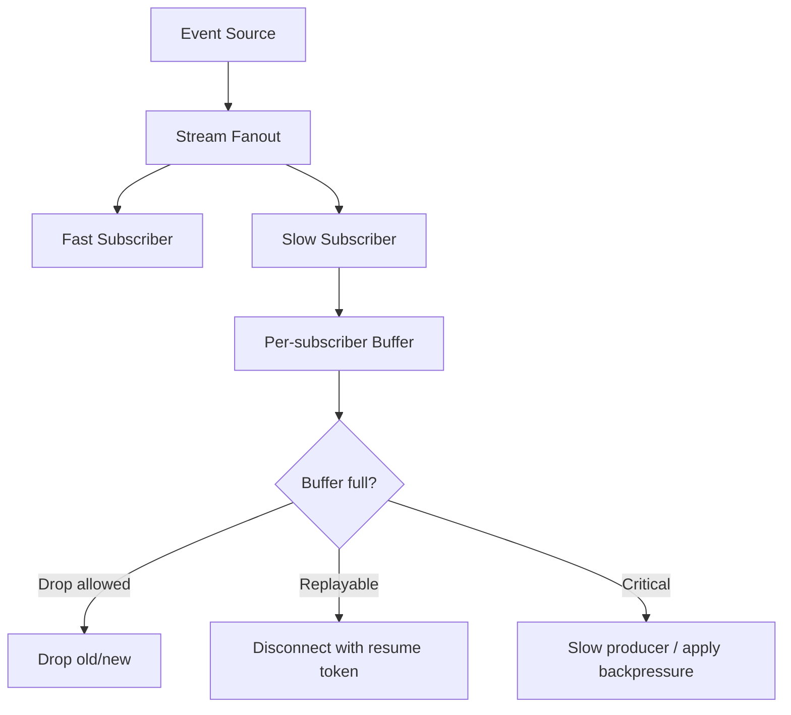
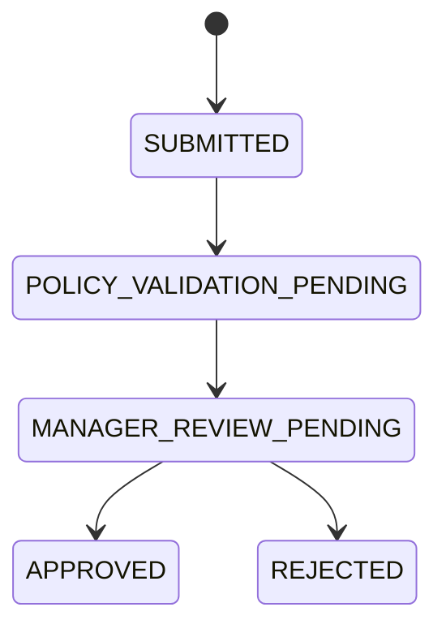
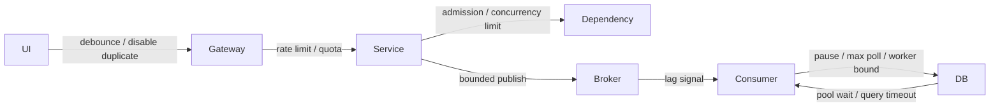

# Part 044 — Backpressure in Synchronous and Async Systems

Pada part sebelumnya kita membahas load shedding dan graceful degradation.

Load shedding bertanya:

> “Kapan kita harus menolak work?”

Backpressure bertanya:

> “Bagaimana downstream memberi sinyal ke upstream agar upstream tidak mengirim work lebih cepat dari kapasitas konsumsi?”

Ini perbedaan penting.

Load shedding sering terlihat sebagai aksi saat overload sudah dekat atau sudah terjadi.

Backpressure adalah flow-control discipline agar overload tidak terjadi secara liar.

Jika producer lebih cepat daripada consumer, hanya ada beberapa kemungkinan:

1. producer diperlambat;
2. work dibuffer;
3. work ditolak;
4. work digabung/coalesced;
5. work didrop jika aman;
6. sistem runtuh.

Backpressure membuat pilihan itu eksplisit.

---

## 1. Mental Model

Bayangkan sistem sebagai pipa.



Jika `Projection Worker` hanya bisa memproses 500 event/detik, tetapi broker menerima 5.000 event/detik, maka gap 4.500 event/detik harus muncul di suatu tempat.

Gap itu bisa muncul sebagai:

- broker lag;
- memory buffer;
- queue depth;
- disk usage;
- delayed user-visible read model;
- timeout;
- retry storm;
- dropped data;
- service crash.

Backpressure adalah mekanisme agar gap ini dikelola sebagai design decision, bukan surprise incident.

---

## 2. Backpressure vs Buffering vs Load Shedding

| Concept | Meaning | Risk |
|---|---|---|
| Backpressure | Consumer memberi sinyal agar producer melambat | Producer harus menghormati sinyal |
| Buffering | Work ditahan sementara | Buffer bisa menjadi unbounded overload |
| Load shedding | Work ditolak/didrop sengaja | Bisa berdampak ke user/business |
| Rate limiting | Laju work dibatasi policy | Limit bisa salah jika tidak adaptif |
| Bulkhead | Resource diisolasi | Salah sizing bisa underutilized atau tetap overload |

Buffer bukan backpressure.

Queue yang bertambah diam-diam bukan backpressure. Itu hanya backlog.

Backpressure butuh sinyal dan respons.



Jika producer mengabaikan sinyal, backpressure gagal.

---

## 3. The Core Equation

Sistem stabil jika rata-rata arrival rate lebih kecil atau sama dengan service rate.

```text
arrival_rate <= processing_capacity
```

Jika:

```text
arrival_rate > processing_capacity
```

maka backlog tumbuh.

Backlog growth:

```text
backlog_growth_per_second = arrival_rate - processing_capacity
```

Contoh:

```text
incoming events:      2,000 / second
worker capacity:        800 / second
backlog growth:       1,200 / second
backlog after 10 min: 720,000 events
```

Jika event punya SLA 5 menit, sistem sudah gagal jauh sebelum broker penuh.

Karena itu monitor queue depth saja tidak cukup. Monitor **queue age**.

| Metric | What it tells you |
|---|---|
| Queue depth | Berapa banyak work menunggu |
| Queue age | Work tertua sudah menunggu berapa lama |
| Consumer lag | Seberapa jauh consumer tertinggal dari producer |
| Processing rate | Consumer throughput |
| Arrival rate | Producer throughput |
| Retry rate | Amplifikasi akibat failure |
| DLQ rate | Work yang tidak bisa diproses |

Queue depth 10.000 bisa sehat jika consumer memproses 50.000/detik.

Queue depth 500 bisa buruk jika consumer hanya memproses 1/menit dan SLA 2 menit.

---

## 4. Synchronous Backpressure

Dalam synchronous HTTP/RPC, backpressure tidak selalu eksplisit seperti Reactive Streams. Biasanya muncul sebagai:

- `429 Too Many Requests`;
- `503 Service Unavailable`;
- `Retry-After` header;
- connection pool limit;
- concurrency limit;
- HTTP/2 flow control;
- circuit breaker open;
- timeout/deadline;
- client-side throttling.

Synchronous backpressure harus menjawab:

> “Bagaimana caller tahu bahwa callee tidak siap menerima lebih banyak work?”

Bad behavior:

- callee lambat sampai caller timeout;
- caller retry agresif;
- callee semakin overload;
- caller membuka lebih banyak connection;
- thread pool habis.

Better behavior:

- callee menolak cepat;
- caller menghormati `Retry-After`;
- caller memakai backoff + jitter;
- caller punya retry budget;
- caller membatasi concurrency per dependency;
- caller berhenti sementara ketika circuit open.



---

## 5. Client-Side Concurrency Limit

Salah satu backpressure paling efektif untuk synchronous service adalah membatasi jumlah in-flight request ke dependency.

Tanpa limit:

```text
traffic spike -> caller opens many requests -> dependency saturates -> timeouts -> retries -> worse
```

Dengan limit:

```text
traffic spike -> caller allows only N in-flight calls -> excess waits briefly or fails fast -> dependency protected
```

Contoh semaphore-based limiter:

```java
public final class DependencyConcurrencyLimiter {
    private final Semaphore permits;
    private final Duration maxWait;

    public DependencyConcurrencyLimiter(int maxInFlight, Duration maxWait) {
        this.permits = new Semaphore(maxInFlight);
        this.maxWait = maxWait;
    }

    public <T> T call(Supplier<T> action) {
        boolean acquired;
        try {
            acquired = permits.tryAcquire(maxWait.toMillis(), TimeUnit.MILLISECONDS);
        } catch (InterruptedException e) {
            Thread.currentThread().interrupt();
            throw new RejectedExecutionException("interrupted_waiting_for_dependency_permit", e);
        }

        if (!acquired) {
            throw new RejectedExecutionException("dependency_concurrency_limit_exceeded");
        }

        try {
            return action.get();
        } finally {
            permits.release();
        }
    }
}
```

Important:

- max wait harus pendek;
- jangan membuat antrian internal panjang;
- limit harus per dependency atau per operation;
- metric `permits_available` dan `rejected_total` harus ada;
- gunakan deadline end-to-end.

---

## 6. Adaptive Concurrency

Static concurrency limit kadang cukup. Namun sistem dengan latency berubah-ubah bisa butuh adaptive limit.

Mental model:

- jika latency naik dan error naik, turunkan concurrency;
- jika latency stabil dan queue rendah, naikkan sedikit;
- jangan naik cepat;
- jangan turun tanpa hysteresis;
- jaga minimum concurrency untuk availability.

Simplified pseudo-algorithm:

```java
public final class AdaptiveLimit {
    private int limit;
    private final int min;
    private final int max;

    public void onWindow(MetricsWindow w) {
        if (w.p95LatencyMillis() > w.baselineP95Millis() * 2 || w.errorRate() > 0.05) {
            limit = Math.max(min, (int) (limit * 0.8));
            return;
        }

        if (w.p95LatencyMillis() < w.baselineP95Millis() * 1.2 && w.rejectionRate() == 0) {
            limit = Math.min(max, limit + 1);
        }
    }

    public int currentLimit() {
        return limit;
    }
}
```

Ini bukan rekomendasi implementasi final, tetapi mental model.

Adaptive control harus diuji hati-hati karena control loop yang buruk bisa membuat oscillation.

---

## 7. Thread Pool Backpressure

Java service sering memakai thread pool.

Thread pool punya tiga elemen:

1. jumlah worker;
2. queue;
3. rejection policy.

Kesalahan umum:

```java
Executors.newFixedThreadPool(100);
```

Masalahnya: factory ini memakai unbounded queue pada banyak kasus umum. Work bisa menumpuk sampai memory pressure.

Lebih eksplisit:

```java
ThreadPoolExecutor executor = new ThreadPoolExecutor(
    32,
    32,
    0L,
    TimeUnit.MILLISECONDS,
    new ArrayBlockingQueue<>(500),
    new ThreadPoolExecutor.AbortPolicy()
);
```

Sekarang ada batas:

- 32 active workers;
- 500 queued tasks;
- setelah penuh, reject.

Rejection bukan bug. Rejection adalah sinyal backpressure.

Tapi rejection harus diterjemahkan ke response yang benar:

```java
try {
    executor.execute(task);
} catch (RejectedExecutionException ex) {
    throw new ServiceOverloadedException("worker_pool_full", ex);
}
```

Lalu API layer mengubahnya menjadi `503` atau domain-specific pending/reject.

---

## 8. Queue Size Is a Latency Decision

Queue besar terlihat aman, tetapi menaikkan latency.

Jika worker memproses 100 task/detik dan queue berisi 10.000 task, maka work paling belakang menunggu sekitar 100 detik sebelum diproses.

```text
queue_wait_seconds = queue_depth / processing_rate
```

Jika SLA task 10 detik, queue 10.000 jelas tidak masuk akal.

Sizing queue harus berdasarkan latency budget:

```text
max_queue_depth = processing_rate * max_queue_wait_seconds
```

Contoh:

```text
processing_rate = 200 tasks/sec
max_queue_wait = 5 sec
max_queue_depth = 1,000 tasks
```

Bukan:

> “Kita kasih queue 100.000 supaya aman.”

Itu bukan aman. Itu delay bomb.

---

## 9. Async Messaging Backpressure

Dalam messaging, backpressure muncul sebagai kontrol terhadap producer, broker, dan consumer.



Control points:

| Point | Control |
|---|---|
| Producer | rate limit, batching, quota, async send callback |
| Broker | retention, partition, queue limit, consumer lag visibility |
| Consumer | max poll records, prefetch, concurrency, pause/resume |
| Worker pool | bounded queue, rejection |
| DB | connection pool, write batch, transaction size |
| Retry path | retry topic, delay, DLQ |

Backpressure di messaging bukan hanya “consumer lambat”.

Pertanyaan design:

1. Apakah producer bisa diperlambat?
2. Apakah message punya deadline?
3. Apakah message boleh digabung?
4. Apakah consumer boleh pause partition/queue?
5. Apakah retry punya delay?
6. Apakah poison message memblokir partition?
7. Apakah backlog recovery punya kapasitas?

---

## 10. Consumer Lag Is Not Enough

Consumer lag penting, tapi belum cukup.

Lag tinggi bisa berarti:

- spike sementara;
- consumer down;
- poison message;
- DB lambat;
- concurrency terlalu kecil;
- partition skew;
- producer bug;
- schema incompatibility;
- external dependency timeout.

Tambahkan metrics:

```text
consumer_lag{topic,consumer_group,partition}
oldest_message_age_seconds{topic,consumer_group}
consumer_processing_duration_seconds{handler}
consumer_success_total{handler}
consumer_failure_total{handler,reason}
consumer_retry_total{handler,reason}
consumer_dlq_total{handler,reason}
consumer_pause_total{reason}
consumer_active_workers{handler}
consumer_worker_queue_depth{handler}
```

`oldest_message_age_seconds` sering lebih user-relevant daripada raw lag.

---

## 11. Pause/Resume Consumer

Async consumer harus bisa memperlambat diri.

Pseudo-code:

```java
public final class BackpressureAwareConsumer {
    private final DatabasePressure dbPressure;
    private final BrokerConsumer consumer;
    private final MessageHandler handler;

    public void pollLoop() {
        while (true) {
            if (dbPressure.isWriteSaturated()) {
                consumer.pause();
                sleep(Duration.ofSeconds(2));
                continue;
            }

            consumer.resume();

            List<Message> messages = consumer.poll(Duration.ofMillis(500));
            for (Message message : messages) {
                handler.handle(message);
            }
        }
    }
}
```

Production implementation harus memperhatikan:

- heartbeat/session timeout;
- max poll interval;
- partition assignment;
- offset commit timing;
- idempotency;
- poison message;
- retry topic;
- DLQ;
- shutdown behavior.

Tetapi mental modelnya tetap: consumer tidak boleh terus menarik work jika downstream-nya saturated.

---

## 12. Retry Path Backpressure

Retry tanpa backpressure adalah retry storm.

Bad:



Better:



Retry path harus punya:

- delay;
- max attempts;
- classification temporary/permanent;
- idempotency;
- jitter;
- DLQ;
- alert;
- replay tool;
- per-error metrics.

Jangan langsung retry message gagal dalam tight loop. Itu menghabiskan consumer capacity dan membuat message sehat ikut tertunda.

---

## 13. Coalescing and Compaction

Tidak semua work perlu diproses satu per satu.

Contoh:

- `CaseSearchIndexRefreshRequested(caseId)` terjadi 20 kali dalam 1 menit;
- cukup refresh index sekali untuk case tersebut;
- message lama bisa digabung/dilewati.

Coalescing cocok untuk:

| Work | Coalescing possible? |
|---|---:|
| Search index refresh | Ya |
| Projection rebuild request | Ya |
| Cache invalidation | Ya |
| Recommendation refresh | Ya |
| Audit event append | Tidak |
| Payment/approval command | Tidak |
| Evidence uploaded event | Biasanya tidak |

Example coalescing buffer:

```java
public final class CoalescingRefreshScheduler {
    private final Set<String> pendingCaseIds = ConcurrentHashMap.newKeySet();
    private final RefreshWorker worker;

    public void requestRefresh(String caseId) {
        pendingCaseIds.add(caseId);
    }

    @Scheduled(fixedDelayString = "PT5S")
    public void flush() {
        List<String> batch = pendingCaseIds.stream().limit(1_000).toList();
        pendingCaseIds.removeAll(batch);
        worker.refreshCases(batch);
    }
}
```

Coalescing adalah bentuk backpressure karena mengurangi work downstream tanpa kehilangan outcome penting.

---

## 14. Reactive Streams Backpressure

Reactive Streams mendefinisikan standar untuk asynchronous stream processing dengan non-blocking backpressure.

Core interface mental model:

```java
public interface Publisher<T> {
    void subscribe(Subscriber<? super T> subscriber);
}

public interface Subscriber<T> {
    void onSubscribe(Subscription subscription);
    void onNext(T item);
    void onError(Throwable throwable);
    void onComplete();
}

public interface Subscription {
    void request(long n);
    void cancel();
}
```

Kunci backpressure ada di:

```java
subscription.request(n)
```

Subscriber tidak hanya menerima data. Subscriber menyatakan berapa banyak item yang siap diterima.



Ini berbeda dari push tanpa batas.

---

## 15. Spring WebFlux and Backpressure

Spring WebFlux adalah reactive web framework di Spring stack. Ia non-blocking dan mendukung Reactive Streams backpressure.

Namun, jangan salah paham.

Menggunakan WebFlux tidak otomatis membuat seluruh sistem tahan overload.

Backpressure hanya efektif sepanjang chain menghormati flow control.

Jika pipeline reactive berakhir ke blocking JDBC call di scheduler yang tidak dibatasi, overload tetap bisa terjadi.

Bad:

```java
@GetMapping("/cases/{id}")
public Mono<CaseDetail> get(@PathVariable String id) {
    return Mono.fromCallable(() -> blockingJdbcRepository.findDetail(id));
}
```

Lebih baik jika memang harus blocking:

```java
private final Scheduler jdbcScheduler = Schedulers.newBoundedElastic(
    32,
    1_000,
    "case-jdbc"
);

@GetMapping("/cases/{id}")
public Mono<CaseDetail> get(@PathVariable String id) {
    return Mono.fromCallable(() -> blockingJdbcRepository.findDetail(id))
        .subscribeOn(jdbcScheduler)
        .timeout(Duration.ofMillis(300));
}
```

Tetap perlu:

- bounded scheduler;
- timeout;
- concurrency limit;
- connection pool limit;
- load shedding;
- metrics;
- fallback/degraded response if safe.

Reactive bukan magic. Reactive hanya memberi alat flow control yang lebih eksplisit.

---

## 16. Backpressure in Streaming APIs

Streaming API punya risiko khusus.

Contoh:

- server-sent events;
- WebSocket;
- gRPC streaming;
- file export stream;
- audit event stream;
- live dashboard.

Jika client lambat membaca stream, server bisa menumpuk buffer.

Pertanyaan:

1. Berapa maksimum connection duration?
2. Berapa maksimum in-flight items per subscriber?
3. Apakah slow subscriber diputus?
4. Apakah data boleh dilewati?
5. Apakah stream replayable?
6. Apakah ada heartbeat?
7. Apakah ada per-tenant stream quota?
8. Apakah consumer harus ack?

Streaming design:



Per-subscriber buffer harus bounded.

---

## 17. Database Backpressure

Database sering menjadi bottleneck shared.

Backpressure ke database meliputi:

- connection pool max size;
- connection acquisition timeout;
- statement timeout;
- transaction timeout;
- batch size;
- query cost limit;
- write concurrency limit;
- circuit breaker for optional read dependency;
- reject expensive query under load.

Connection pool adalah bulkhead sekaligus backpressure signal.

Bad:

- pool besar agar “tidak kehabisan connection”;
- query lambat tetap menahan connection;
- caller menunggu connection terlalu lama;
- request timeout tapi query masih jalan;
- DB makin berat.

Better:

- pool sized sesuai DB capacity;
- acquisition timeout pendek;
- statement timeout lebih pendek dari request deadline;
- expensive query ditolak sebelum DB;
- worker write batch dibatasi;
- metric pool utilization dan wait time.

Example config idea:

```yaml
case-db:
  pool:
    max-size: 32
    connection-timeout: 200ms
  query:
    statement-timeout: 500ms
  admission:
    reject-search-when-pool-utilization-above: 0.85
```

---

## 18. Backpressure in Workflow Systems

Long-running workflow juga butuh backpressure.

Contoh escalation workflow:



Jika manager review backlog tinggi, sistem harus:

- membatasi submission baru?
- memprioritaskan high-risk case?
- memperlihatkan expected delay?
- auto-route ke team lain?
- pause low-priority escalation?
- alert capacity owner?

Backpressure di workflow bukan hanya technical. Ia bisa berupa operational policy.

```yaml
workflow: enforcement-escalation
bottleneck: manager-review
signals:
  - pendingTasksByQueue
  - oldestTaskAge
  - slaBreachForecast
policies:
  highRisk:
    admission: accept
    priority: high
  normal:
    admission: accept_pending
    message: "Review queue is currently delayed"
  lowPriority:
    admission: delayed
    delay: PT2H
```

Ini penting untuk regulatory systems karena backlog bisa memiliki konsekuensi hukum/SLA.

---

## 19. Backpressure and User Experience

Backpressure bukan hanya internal.

User experience harus mencerminkan capacity.

Contoh:

- disable “Export 1M rows” saat sistem degraded;
- tampilkan “export queued” dengan posisi/status;
- batasi filter mahal di UI;
- tampilkan stale marker;
- tampilkan expected delay untuk workflow;
- gunakan optimistic UI hanya untuk command yang benar-benar durable;
- jangan membuat user spam tombol retry.

UI yang tidak backpressure-aware bisa menjadi load generator.

Bad UI:

- auto-refresh setiap 2 detik untuk semua user;
- retry tanpa jitter;
- tombol submit bisa diklik berkali-kali;
- search on every keystroke tanpa debounce;
- export synchronous;
- dashboard memuat 20 panel mahal sekaligus.

Better UI:

- debounce search;
- disable duplicate submit;
- respect retry-after;
- lazy-load optional panels;
- cancel stale request;
- show partial state;
- offer async export.

---

## 20. Backpressure and Cancellation

Cancellation adalah bagian penting dari backpressure.

Jika user membatalkan request atau client disconnect, server seharusnya berhenti melakukan work yang tidak lagi diperlukan.

Masalah:

- client timeout;
- server tetap memproses query mahal;
- result dibuang;
- resource tetap habis;
- retry request baru datang;
- duplicate load.

Synchronous Java stack tidak selalu mudah membatalkan work yang sudah masuk DB/remote call, tetapi design tetap harus mencoba:

- deadline propagation;
- cancellable future;
- HTTP client cancellation;
- DB statement timeout;
- workflow cancellation;
- message cancellation/expiry;
- request context propagation.

Pseudo-code:

```java
public CaseSearchResult search(CaseSearchCommand command, Deadline deadline) {
    if (deadline.remaining().compareTo(Duration.ofMillis(100)) < 0) {
        throw new DeadlineExceededException();
    }

    QueryOptions options = QueryOptions.withTimeout(deadline.remaining().minusMillis(50));
    return repository.search(command, options);
}
```

Deadline adalah backpressure terhadap work yang tidak lagi berguna.

---

## 21. Designing Bounded Buffers

Setiap buffer harus punya policy.

| Question | Required answer |
|---|---|
| Maximum size? | Hard limit |
| Maximum age? | TTL/deadline |
| Overflow behavior? | Reject, drop old, drop new, block short, spill to disk |
| Priority? | Critical before optional |
| Ownership? | Team/on-call responsible |
| Metric? | Depth, age, rejection, drop |
| Replay? | How to recover |
| Audit impact? | Whether dropping is allowed |

Overflow policies:

| Policy | Use when |
|---|---|
| Reject new | Request can retry later |
| Drop oldest | Latest state matters more than history |
| Drop newest | Current backlog must finish first |
| Coalesce | Multiple events produce same outcome |
| Block briefly | Caller has short deadline and bounded wait |
| Spill to durable queue | Work must not be lost and can wait |
| Fail closed | Safety/compliance requires refusal |

Never create buffer without deciding overflow behavior.

---

## 22. Architecture Pattern: Backpressure Chain

Backpressure must be end-to-end.



Each layer should either:

1. slow producer;
2. reject work;
3. bound queue;
4. degrade safely;
5. expose pressure signal.

If one layer hides pressure with infinite queue, the chain breaks.

---

## 23. Testing Backpressure

Backpressure cannot be validated by unit tests only.

Test scenarios:

1. downstream latency increases 10x;
2. DB connection pool is exhausted;
3. worker pool queue fills;
4. broker consumer lag grows;
5. poison message appears;
6. retry topic receives spike;
7. slow streaming subscriber connects;
8. client disconnects mid-request;
9. UI sends duplicate command;
10. producer exceeds contracted rate.

Expected assertions:

- service rejects quickly;
- queue does not grow unbounded;
- oldest message age is bounded or alert fires;
- retry is delayed, not immediate tight loop;
- critical path remains available;
- optional work slows/drops first;
- metrics show pressure;
- no fake success;
- recovery does not cause traffic surge.

Pseudo-test:

```java
@Test
void shouldRejectWhenWorkerQueueIsFull() {
    WorkerPool pool = new WorkerPool(2, 10);

    pool.blockWorkers();
    pool.fillQueue();

    ServiceOverloadedException ex = assertThrows(
        ServiceOverloadedException.class,
        () -> pool.submit(new ExportReportJob("TENANT-1"))
    );

    assertThat(ex.reason()).isEqualTo("worker_queue_full");
    assertThat(metrics.counter("worker_rejections_total").count()).isEqualTo(1);
}
```

---

## 24. Runbook: Backpressure Incident

When queue age or pressure alert fires:

1. Identify pressure point: API, worker, broker, DB, downstream, UI.
2. Compare arrival rate vs processing rate.
3. Check oldest message age, not just queue depth.
4. Check retry rate and DLQ rate.
5. Check whether producer spike is legitimate or bug.
6. Check whether consumer is blocked by DB/dependency.
7. Pause low-priority producers if possible.
8. Disable optional work or expensive queries.
9. Increase consumers only if downstream capacity allows it.
10. Avoid increasing concurrency into saturated DB.
11. Drain backlog gradually.
12. Keep degraded mode until recovery window is stable.
13. After incident, adjust admission, queue bounds, retry delay, and dashboards.

Do not blindly scale consumers.

If DB is bottleneck, more consumers can make the incident worse.

---

## 25. Common Anti-Patterns

### Anti-Pattern 1 — Unbounded Queue

Queue hides overload until memory or SLA explodes.

### Anti-Pattern 2 — Immediate Retry Loop

Temporary failure turns into self-DDoS.

### Anti-Pattern 3 — Ignoring Client Disconnect

Server keeps doing expensive work for a result nobody will read.

### Anti-Pattern 4 — Scaling Consumers Into a Saturated DB

More workers increase DB pressure and reduce throughput.

### Anti-Pattern 5 — Reactive Without Bounded Blocking

WebFlux endpoint calls blocking repository without bounded scheduler.

### Anti-Pattern 6 — Monitoring Lag But Not Age

Lag count misses user-visible delay.

### Anti-Pattern 7 — One Queue for All Priorities

Low-priority work delays critical work.

### Anti-Pattern 8 — Producer Has No Contract

Any producer can send unlimited work. Consumer becomes the victim.

---

## 26. Backpressure Design Card

```yaml
flow: case-events-to-search-index
producer:
  service: case-service
  eventTypes:
    - CaseOpened
    - CaseUpdated
    - CaseClosed
  maxExpectedRate: 500/s
  burstLimit: 2000/s for 60s
broker:
  topic: case-events
  partitions: 24
consumer:
  service: search-projection-service
  maxPollRecords: 200
  workerConcurrency: 16
  workerQueueSize: 1000
  processingDeadline: PT5S
backpressureSignals:
  - consumerLag
  - oldestMessageAge
  - workerQueueDepth
  - dbPoolUtilization
  - indexWriteLatencyP95
policies:
  dbPoolUtilizationAbove85Percent:
    action: pause-consumer
    duration: PT5S
  workerQueueFull:
    action: stop-polling
  oldestMessageAgeAbove5Minutes:
    action: alert
  lowPriorityReindexRequest:
    action: coalesce
retry:
  temporaryFailure:
    path: delayed-retry-topic
    maxAttempts: 5
  permanentFailure:
    path: dlq
observability:
  requiredMetrics:
    - oldest_message_age_seconds
    - consumer_lag
    - processing_rate
    - arrival_rate
    - retry_total
    - dlq_total
ownership:
  producerOwner: case-platform-team
  consumerOwner: search-platform-team
  escalation: reliability-oncall
```

---

## 27. Exercises

1. Pilih satu async flow. Hitung arrival rate, processing rate, dan backlog growth saat spike.
2. Tentukan max queue depth berdasarkan latency/SLA, bukan feeling.
3. Desain overflow policy untuk satu queue.
4. Tentukan work mana yang boleh coalesce/drop dan mana yang tidak boleh.
5. Buat client-side concurrency limit untuk satu dependency service.
6. Desain retry topic policy dengan delay dan DLQ.
7. Tambahkan `oldest_message_age_seconds` ke dashboard.
8. Review UI flow: cari bagian yang bisa menjadi producer tidak terkendali.

---

## 28. Key Takeaways

- Backpressure adalah flow-control discipline agar producer tidak menghancurkan consumer.
- Buffering bukan backpressure jika producer tidak melambat atau overflow tidak jelas.
- Queue harus bounded berdasarkan latency budget dan SLA.
- Synchronous backpressure muncul melalui concurrency limit, fast reject, `Retry-After`, deadline, dan client throttling.
- Async backpressure muncul melalui producer quota, broker lag, consumer pause/resume, bounded worker pool, retry delay, dan DLQ.
- Reactive Streams memberi model formal untuk non-blocking backpressure melalui `Subscription.request(n)`.
- WebFlux mendukung backpressure, tetapi blocking dependency tetap harus dibatasi.
- Monitor queue age, processing rate, arrival rate, retry rate, dan DLQ, bukan hanya queue depth.
- Scaling consumers tanpa memahami bottleneck bisa memperburuk incident.

Part berikutnya membahas **Cascading Failure Prevention**: bagaimana semua mekanisme resilience yang sudah kita bahas disusun menjadi strategi sistemik agar kegagalan tidak menyebar dari satu dependency ke seluruh platform.

---

## Referensi

- Reactive Streams — Specification for asynchronous stream processing with non-blocking backpressure.
- Spring Framework Documentation — Spring WebFlux is non-blocking and supports Reactive Streams back pressure.
- Google SRE Book — *Handling Overload* and *Addressing Cascading Failures*.
- AWS Builders' Library — *Timeouts, retries, and backoff with jitter*.
- Java Platform — `java.util.concurrent` primitives such as `ThreadPoolExecutor`, `Semaphore`, and bounded queues.
