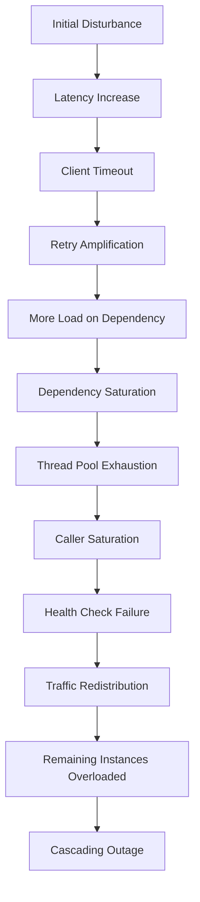
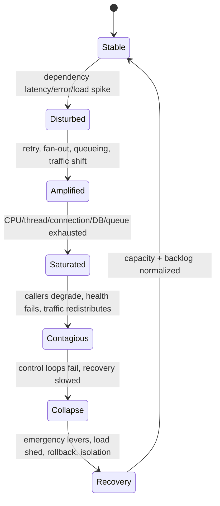
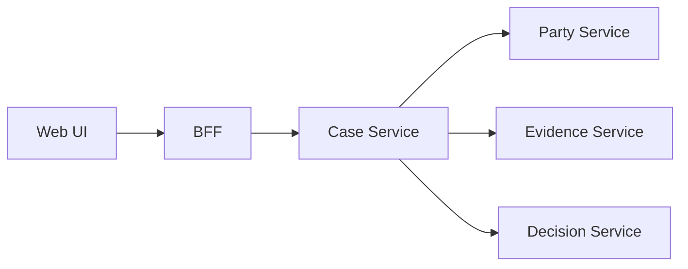
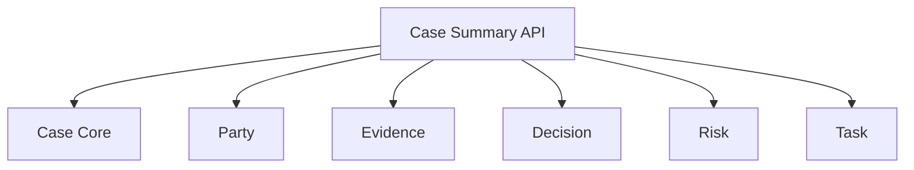
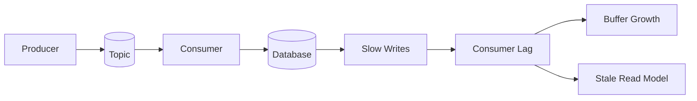
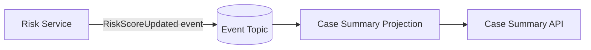
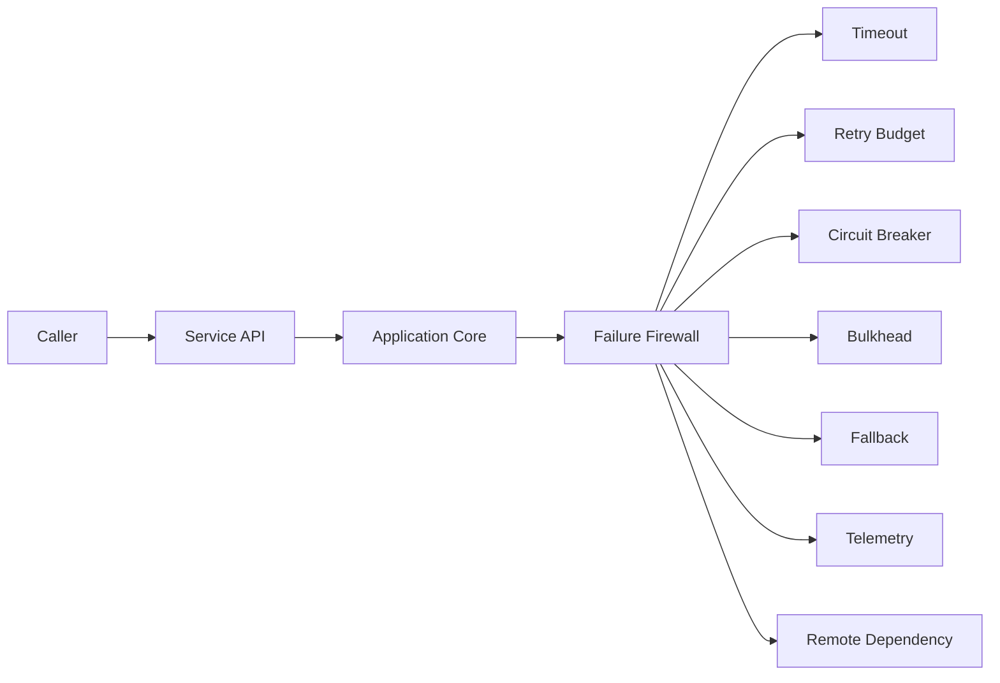
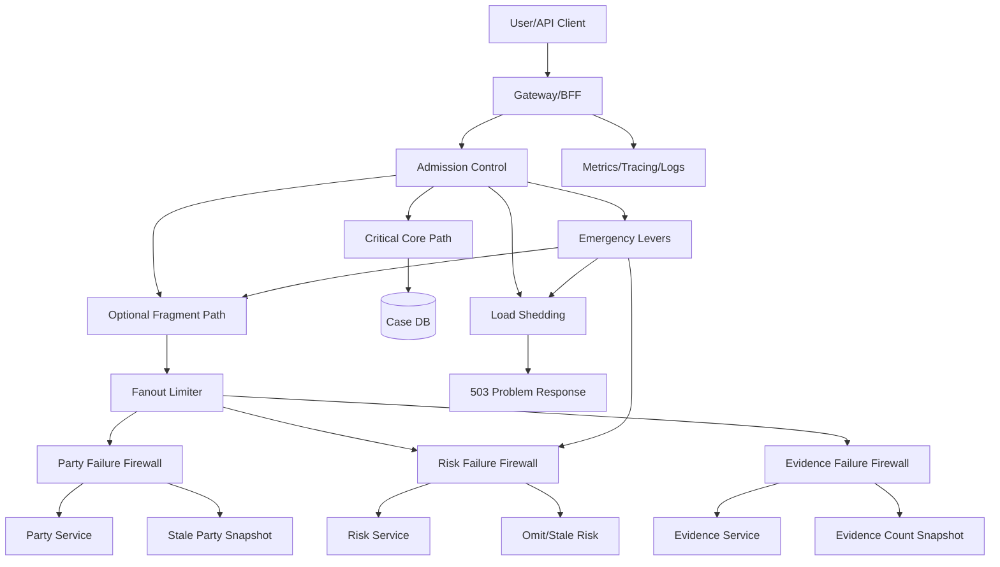

# Part 045 — Cascading Failure Prevention

Microservice architecture tidak gagal hanya karena satu service mati.
Ia gagal besar ketika satu gangguan kecil berubah menjadi **failure propagation graph**.

Satu dependency lambat.
Thread pool frontend penuh.
Client melakukan retry.
Queue menumpuk.
Autoscaling terlambat.
Health check salah membaca keadaan.
Load balancer mengirim traffic ke instance yang hampir mati.
Service lain ikut timeout.
Operator mencoba restart.
Cold start memperburuk keadaan.
Dalam beberapa menit, sistem yang tadinya hanya punya satu dependency degraded berubah menjadi outage lintas domain.

Itulah cascading failure.

Tujuan part ini bukan menghafal pattern seperti circuit breaker, retry, atau bulkhead.
Kita sudah membahas mekanisme itu di part sebelumnya.
Tujuan part ini adalah membangun **failure propagation mental model**: bagaimana failure menyebar, bagaimana mendesain boundary agar failure berhenti, dan bagaimana membuat sistem punya emergency lever ketika normal control loop tidak cukup cepat.

> Cascading failure prevention adalah seni membuat sistem tetap kehilangan sebagian kemampuan tanpa kehilangan kendali atas seluruh sistem.

---

## 1. Core Mental Model

Cascading failure terjadi ketika **failure output dari satu komponen menjadi failure input bagi komponen lain**.

Dalam sistem microservices, failure tidak hanya berupa error.
Failure bisa berbentuk:

- latency meningkat,
- request menggantung,
- queue menumpuk,
- retry bertambah,
- CPU habis,
- connection pool penuh,
- consumer lag naik,
- cache miss meningkat,
- GC pause membesar,
- lock contention meningkat,
- thread starvation,
- database saturation,
- memory pressure,
- disk I/O saturation,
- control plane lambat,
- autoscaler terlambat,
- operator action yang memperbesar churn.

Jadi cascading failure bukan sekadar `Service A down -> Service B down`.
Model yang lebih benar:



Perhatikan: banyak step di atas adalah **mekanisme normal yang bekerja terlalu banyak atau terlalu lambat**.
Retry itu baik sampai ia menjadi amplification.
Autoscaling itu baik sampai ia terlambat.
Health check itu baik sampai ia membunuh instance yang masih bisa melayani degraded response.
Queue itu baik sampai ia menyembunyikan overload.

Top 1% engineer tidak bertanya: “Apa pattern resilience yang kita pakai?”
Ia bertanya: “Kalau dependency ini lambat 10x selama 7 menit, apa propagasi konkretnya?”

---

## 2. Anatomy of a Cascade

Kita pecah cascading failure menjadi beberapa fase.



### 2.1 Stable

Sistem berjalan normal.
Latency, throughput, saturation, and error rate berada dalam envelope yang diketahui.

Contoh service `case-review-service`:

- P95 latency: 180 ms
- P99 latency: 450 ms
- CPU: 45%
- DB pool usage: 35%
- dependency `party-profile-service`: P95 80 ms
- queue lag: < 5 seconds

### 2.2 Disturbed

Gangguan awal muncul.
Misalnya `party-profile-service` latency naik dari 80 ms ke 3 detik.

Pada fase ini sistem belum collapse.
Yang berubah adalah **shape of demand** dan **resource holding time**.

Sebelumnya 100 request/second dengan latency 100 ms hanya butuh sekitar 10 concurrent in-flight request.
Jika latency naik menjadi 3 detik, 100 request/second butuh sekitar 300 concurrent in-flight request.

Ini hukum sederhana:

```text
concurrency ≈ throughput × latency
```

Ketika latency naik, concurrency naik walaupun traffic tidak naik.
Inilah penyebab banyak cascading failure: bukan request count yang melonjak, tetapi request menahan resource terlalu lama.

### 2.3 Amplified

Client mulai timeout dan retry.
Fan-out aggregator mengulangi beberapa dependency call.
Queue menerima lebih banyak work.
Load balancer mengirim ulang traffic.

Amplification ratio muncul:

```text
effective_load = original_load × attempts_per_request × fanout_width
```

Jika original load 1.000 rps, tiap request fan-out ke 4 dependency, dan retry rata-rata 2 kali:

```text
effective_dependency_calls = 1.000 × 4 × 2 = 8.000 calls/second
```

Sistem kelihatan menerima 1.000 rps, tetapi dependency menerima 8.000 call/s.

### 2.4 Saturated

Resource mulai habis:

- web thread pool penuh,
- event loop blocked,
- DB connection pool exhausted,
- HTTP client connection pool penuh,
- Kafka consumer lag naik,
- executor queue panjang,
- heap membesar karena request body tertahan,
- GC pause naik,
- instance tidak merespons health probe.

Saturation adalah titik berbahaya karena latency biasanya naik nonlinear.
Sebelum 70% utilization, sistem terlihat sehat.
Setelah 90%, sedikit tambahan load bisa menaikkan latency berkali-kali lipat.

### 2.5 Contagious

Service yang awalnya hanya menjadi caller sekarang menjadi sumber failure bagi caller-nya.
Health check mulai fail.
Load balancer mengeluarkan instance.
Traffic berpindah ke instance tersisa.
Instance tersisa menerima lebih banyak load dan ikut fail.

### 2.6 Collapse

Control loop yang biasanya membantu justru memperburuk:

- autoscaler menambah pod, tetapi cold start lambat,
- readiness probe flapping,
- deployment rollback menciptakan churn,
- cache invalidation memperbesar DB load,
- operator restart massal menghilangkan warm cache,
- retry storm terus menekan dependency.

### 2.7 Recovery

Recovery bukan sekadar “service hidup lagi”.
Recovery berarti:

- incoming load terkendali,
- backlog turun,
- retry storm berhenti,
- error budget stabil,
- dependency kembali di bawah saturation,
- traffic normalisasi tanpa traffic surge baru,
- data reconciliation selesai jika ada async backlog.

---

## 3. The Hidden Propagation Channels

Cascading failure menyebar melalui channel yang sering tidak terlihat di diagram arsitektur.

### 3.1 Synchronous Call Chain



Jika `Decision Service` lambat, `Case Service` ikut menahan thread.
Jika `Case Service` lambat, BFF ikut menahan request.
Jika BFF lambat, browser/user melakukan refresh.
Refresh menambah request.

### 3.2 Fan-Out Amplification

Aggregator yang memanggil banyak dependency bisa menjadi amplifier.



Jika satu page load memanggil enam service, 1.000 page load menjadi 6.000 backend calls sebelum retry.

### 3.3 Queue Backlog

Async tidak menghapus failure.
Async mengubah failure menjadi backlog.



Jika consumer lambat, producer mungkin tetap sukses.
User merasa command diterima, tetapi read model stale.
Jika retry consumer agresif, dependency makin tertekan.

### 3.4 Shared Resource Contention

Walau service berbeda, mereka mungkin berbagi:

- database cluster,
- cache cluster,
- message broker,
- node pool,
- NAT gateway,
- DNS resolver,
- ingress controller,
- identity provider,
- object storage,
- observability backend,
- cloud quota.

Ini menciptakan hidden coupling.
Service boundary terlihat terpisah, tetapi runtime boundary tidak terpisah.

### 3.5 Control Plane Coupling

Kubernetes, service mesh, autoscaler, secret manager, and config system bisa menjadi bagian dari cascade.

Contoh:

- pod restart massal,
- sidecar tidak siap,
- certificate rotation gagal,
- DNS latency naik,
- config reload menciptakan connection storm,
- service mesh retry policy menambah retry layer di atas application retry.

---

## 4. Cascading Failure Equation

Untuk architecture review, gunakan model sederhana ini:

```text
cascade_risk = propagation_paths × amplification_factor × saturation_sensitivity × recovery_difficulty
```

### 4.1 Propagation Paths

Berapa banyak jalur failure bisa menyebar?

- synchronous call chain,
- async event chain,
- shared database,
- shared cache,
- shared thread pool,
- shared cluster/node pool,
- shared operational control,
- shared deployment batch.

### 4.2 Amplification Factor

Seberapa besar gangguan diperbesar?

- retry count,
- fan-out width,
- polling frequency,
- cache miss multiplier,
- queue replay rate,
- autoscaler traffic redistribution,
- user refresh behavior.

### 4.3 Saturation Sensitivity

Seberapa cepat service collapse setelah resource mendekati limit?

- unbounded queue,
- no timeout,
- blocking I/O,
- large request body,
- large response body,
- lock contention,
- DB pool exhaustion,
- slow GC.

### 4.4 Recovery Difficulty

Seberapa sulit kembali normal?

- backlog besar,
- retry storm masih aktif,
- cache cold,
- migrations half-applied,
- workflow state inconsistent,
- DLQ menumpuk,
- external side effects unknown,
- missing runbook.

---

## 5. Example: Regulatory Case Summary Cascade

Bayangkan endpoint:

```http
GET /cases/{caseId}/summary
```

Endpoint ini menampilkan:

- case detail,
- parties,
- allegations,
- evidence count,
- latest decision,
- risk score,
- active tasks,
- SLA clock.

Implementasi awal:

```java
public CaseSummary getSummary(String caseId) {
    CaseRecord caseRecord = caseClient.getCase(caseId);
    List<Party> parties = partyClient.getParties(caseId);
    List<Allegation> allegations = allegationClient.getAllegations(caseId);
    EvidenceSummary evidence = evidenceClient.getEvidenceSummary(caseId);
    Decision latestDecision = decisionClient.getLatestDecision(caseId);
    RiskScore risk = riskClient.getRisk(caseId);
    List<Task> tasks = taskClient.getActiveTasks(caseId);

    return CaseSummary.combine(
        caseRecord,
        parties,
        allegations,
        evidence,
        latestDecision,
        risk,
        tasks
    );
}
```

Masalahnya bukan Java code-nya.
Masalahnya adalah endpoint ini punya **fan-out 7**.

Jika timeout tiap dependency 2 detik dan semua dipanggil sequential, worst-case latency bisa 14 detik.
Jika parallel tetapi memakai shared executor kecil, dependency lambat bisa menghabiskan worker.
Jika tiap client retry 2 kali, maksimal call menjadi 21 call per summary request.

### 5.1 Better Failure-Aware Design

Pisahkan fragment berdasarkan criticality.

```text
Critical:
- case core
- current lifecycle state
- active compliance restriction

Important but degradable:
- evidence count
- latest decision summary
- active tasks

Optional:
- risk score
- recommendation
- related cases
```

Lalu desain response:

```json
{
  "caseId": "CASE-2026-000123",
  "status": "UNDER_REVIEW",
  "parties": [ ... ],
  "evidenceSummary": {
    "available": false,
    "reason": "TEMPORARILY_UNAVAILABLE",
    "lastKnownValue": {
      "totalEvidence": 31,
      "asOf": "2026-07-05T07:31:00Z"
    }
  },
  "riskScore": {
    "available": false,
    "reason": "DEGRADED"
  },
  "_meta": {
    "partial": true,
    "degradedFragments": ["evidenceSummary", "riskScore"]
  }
}
```

Ini bukan sekadar graceful degradation.
Ini adalah **cascade containment contract**.

---

## 6. Prevention Layer 1 — Remove Unnecessary Propagation Paths

Pencegahan terbaik adalah membuat failure tidak punya jalur menyebar.

### 6.1 Turn Runtime Dependency into Data Dependency

Jika `Case Summary` perlu risk score untuk display, mungkin tidak perlu synchronous call ke `Risk Service`.
Risk score bisa diproyeksikan sebagai read model.



Trade-off:

- latency lebih stabil,
- UI bisa tetap tampil saat Risk Service down,
- data bisa stale,
- perlu staleness contract.

### 6.2 Use Reference Snapshot for Non-Critical Data

Untuk data yang jarang berubah atau tidak kritikal secara real-time:

- party display name,
- risk band terakhir,
- evidence count terakhir,
- officer name,
- regulatory category label.

Simpan snapshot dengan `asOf`.

```java
public record RiskSnapshot(
    String caseId,
    String riskBand,
    Instant calculatedAt,
    boolean stale
) {}
```

Jangan menyebut snapshot sebagai source of truth.
Snapshot adalah **read convenience with freshness metadata**.

### 6.3 Avoid Synchronous Call in Write Path

Write path lebih berbahaya daripada read path karena bisa meninggalkan side effect setengah jalan.

Buruk:

```java
@Transactional
public void escalateCase(EscalateCaseCommand command) {
    CaseRecord c = repository.find(command.caseId());
    c.escalate(command.reason());

    notificationClient.sendEscalationNotice(c); // remote call inside transaction
    auditClient.record(c);                      // remote call inside transaction

    repository.save(c);
}
```

Lebih aman:

```java
@Transactional
public void escalateCase(EscalateCaseCommand command) {
    CaseRecord c = repository.getForUpdate(command.caseId());
    c.escalate(command.reason(), command.actorId());

    repository.save(c);
    outbox.add(CaseEscalatedEvent.from(c));
}
```

Notification dan audit diproses melalui outbox/consumer dengan idempotency.

---

## 7. Prevention Layer 2 — Bound Amplification

Jika propagation path tetap ada, batasi amplification.

### 7.1 Retry Budget per Request

Setiap incoming request punya budget retry total, bukan tiap layer bebas retry.

```text
User request budget:
- total deadline: 1.500 ms
- max downstream attempts across all clients: 2
- no retry for non-idempotent commands without idempotency key
- retry only on classified transient errors
```

Kirim context:

```http
X-Request-Deadline: 2026-07-05T10:31:20.500Z
X-Retry-Budget-Remaining: 1
X-Correlation-Id: 9d4c...
```

Dalam Java:

```java
public final class RequestBudget {
    private final Instant deadline;
    private final AtomicInteger remainingRetries;

    public Duration remainingTime(Clock clock) {
        Duration remaining = Duration.between(clock.instant(), deadline);
        return remaining.isNegative() ? Duration.ZERO : remaining;
    }

    public boolean tryConsumeRetry() {
        while (true) {
            int current = remainingRetries.get();
            if (current <= 0) return false;
            if (remainingRetries.compareAndSet(current, current - 1)) return true;
        }
    }
}
```

### 7.2 Fan-Out Limit

Aggregator tidak boleh memanggil dependency tanpa batas.

```java
public final class FanoutLimiter {
    private final Semaphore permits;

    public FanoutLimiter(int maxConcurrentFragments) {
        this.permits = new Semaphore(maxConcurrentFragments);
    }

    public <T> T execute(Supplier<T> call, Supplier<T> fallback) {
        if (!permits.tryAcquire()) {
            return fallback.get();
        }
        try {
            return call.get();
        } finally {
            permits.release();
        }
    }
}
```

### 7.3 Polling Throttle

Polling dashboard sering menjadi hidden amplifier.

Buruk:

```text
1.000 users × 6 widgets × refresh every 2 seconds = 3.000 rps
```

Lebih baik:

- conditional request,
- server-side cache,
- push update untuk event penting,
- per-user refresh limit,
- shared materialized view,
- stale-while-revalidate.

### 7.4 Cache Miss Protection

Cache bisa mencegah cascade, tetapi cache miss storm bisa memperburuk DB overload.

Gunakan:

- request coalescing,
- negative cache,
- jittered TTL,
- stale-if-error,
- per-key single flight,
- cache warmup untuk critical key.

Contoh per-key single flight sederhana:

```java
public final class SingleFlightCache<K, V> {
    private final ConcurrentHashMap<K, CompletableFuture<V>> inFlight = new ConcurrentHashMap<>();

    public CompletableFuture<V> loadOnce(K key, Supplier<CompletableFuture<V>> loader) {
        return inFlight.computeIfAbsent(key, ignored ->
            loader.get().whenComplete((v, t) -> inFlight.remove(key))
        );
    }
}
```

---

## 8. Prevention Layer 3 — Isolate Saturation Domains

Jika satu dependency lambat, ia tidak boleh menghabiskan resource service secara global.

### 8.1 Separate Connection Pools per Dependency

Buruk:

```text
All downstream HTTP calls share same connection pool
```

Jika `Risk Service` lambat, `Party Service` call ikut antre.

Lebih baik:

```text
risk-client-pool: max 20
party-client-pool: max 40
evidence-client-pool: max 30
```

### 8.2 Separate Executors per Work Class

Pisahkan critical request dari background work.

```text
critical-api-executor
report-export-executor
notification-executor
projection-rebuild-executor
```

Jika report export penuh, case submission tidak boleh ikut lambat.

### 8.3 Separate Queues by Priority

Jangan campur:

- user-visible commands,
- internal projections,
- bulk imports,
- reconciliation jobs,
- email notifications.

Queue yang berbeda memungkinkan:

- rate berbeda,
- DLQ berbeda,
- retry policy berbeda,
- backlog visibility berbeda,
- emergency drain berbeda.

### 8.4 Separate Database Pools for Read/Write

Jika read query mahal menghabiskan pool, write command bisa gagal.

```text
write-pool: small, protected, low timeout
read-pool: larger, bounded, query timeout
reporting-pool: separate or different replica
```

### 8.5 Avoid Shared Global Locks

Global lock adalah cascade trigger.

Contoh smell:

```java
synchronized void refreshAllCaseRules() { ... }
```

Jika refresh lambat, semua request yang butuh rules block.

Lebih baik:

- immutable config snapshot,
- atomic reference swap,
- versioned rule set,
- background refresh,
- stale-if-refresh-fails.

```java
public final class RuleSetProvider {
    private final AtomicReference<RuleSet> current = new AtomicReference<>(RuleSet.empty());

    public RuleSet current() {
        return current.get();
    }

    public void replace(RuleSet next) {
        current.set(next);
    }
}
```

---

## 9. Prevention Layer 4 — Design for Partial Availability

Sistem yang hanya punya dua mode, normal atau down, mudah collapse.
Sistem production-grade punya beberapa mode.

```text
NORMAL
DEGRADED_OPTIONAL_FEATURES
READ_ONLY
WRITE_LIMITED
ADMIN_ONLY
EMERGENCY_SHED_NON_CRITICAL
```

### 9.1 Feature Criticality Table

| Capability | Criticality | Failure Behavior | User Contract |
|---|---:|---|---|
| Submit enforcement case | Critical | fail-closed if validation unavailable | user must know submission not accepted |
| View case core | Critical | serve from primary/read replica | must show authoritative state |
| View recommendation | Optional | omit fragment | show degraded indicator |
| Export report | Deferrable | queue or reject | user can retry later |
| Send notification | Important async | retry/DLQ | user action should not block |
| Refresh risk score | Important async | stale-if-error | show `asOf` |

### 9.2 Degraded Response Must Be Explicit

Do not silently hide missing data.

```java
public sealed interface FragmentResult<T> {
    record Available<T>(T value) implements FragmentResult<T> {}
    record Stale<T>(T value, Instant asOf, String reason) implements FragmentResult<T> {}
    record Unavailable<T>(String reason) implements FragmentResult<T> {}
}
```

### 9.3 Read-Only Mode

For some domains, read-only mode is better than total outage.

Example trigger:

- database primary degraded,
- dependency for write validation unavailable,
- regulatory rule engine unavailable,
- outbox backlog above threshold.

Contract:

```http
POST /cases
HTTP/1.1 503 Service Unavailable
Retry-After: 120
Content-Type: application/problem+json

{
  "type": "https://errors.example.com/read-only-mode",
  "title": "Case submission temporarily unavailable",
  "detail": "The service is currently in read-only mode to protect data integrity.",
  "retryable": true,
  "mode": "READ_ONLY"
}
```

---

## 10. Prevention Layer 5 — Emergency Levers

Emergency lever adalah mekanisme yang sudah diuji untuk mengubah behavior sistem ketika normal path gagal.

Emergency lever bukan improvisasi manual di tengah incident.
Ia harus:

- pre-built,
- observable,
- reversible,
- access-controlled,
- tested,
- documented,
- safe by default.

### 10.1 Types of Emergency Levers

| Lever | Purpose | Example |
|---|---|---|
| Kill switch | Disable risky feature | disable recommendation engine |
| Traffic shed | Reduce non-critical traffic | reject report exports |
| Dependency bypass | Use stale/cache/skip dependency | skip risk enrichment |
| Rate clamp | Lower allowed throughput | max 100 case searches/s |
| Queue pause | Stop consuming damaging workload | pause bulk import consumer |
| Read-only mode | Protect data integrity | reject writes temporarily |
| Fallback config | Switch to safe rule set | use last known good policy |
| Circuit force-open | Stop hitting dependency | block calls to unstable service |
| Priority mode | Serve only critical users/tasks | enforcement submission only |

### 10.2 Emergency Lever Config Model

```yaml
emergency:
  mode: NORMAL
  levers:
    disable-risk-score:
      enabled: false
      owner: platform-reliability
      expiresAt: null
      reason: null
    reject-report-export:
      enabled: false
      statusCode: 503
      retryAfterSeconds: 300
    read-only-mode:
      enabled: false
      allowedReadEndpoints:
        - GET /cases/{id}
        - GET /cases/{id}/summary
```

### 10.3 Java Emergency Lever Guard

```java
public final class EmergencyLevers {
    private final EmergencyConfig config;

    public boolean isEnabled(String leverName) {
        return config.levers().getOrDefault(leverName, Lever.disabled()).enabled();
    }

    public void rejectIfEnabled(String leverName, Supplier<RuntimeException> exception) {
        if (isEnabled(leverName)) {
            throw exception.get();
        }
    }
}
```

Usage:

```java
public ReportExportId requestExport(RequestReportExportCommand command) {
    emergencyLevers.rejectIfEnabled(
        "reject-report-export",
        () -> new ServiceUnavailableException("Report export temporarily disabled")
    );

    return exportService.request(command);
}
```

### 10.4 Lever Expiry

Every emergency lever must have an expiry or review time.
Otherwise the system silently normalizes degraded behavior.

```java
public record Lever(
    boolean enabled,
    String reason,
    String enabledBy,
    Instant enabledAt,
    Instant expiresAt
) {
    public boolean expired(Clock clock) {
        return expiresAt != null && clock.instant().isAfter(expiresAt);
    }
}
```

---

## 11. Prevention Layer 6 — Health Check Discipline

Health checks can cause cascade when they are too strict.

### 11.1 Liveness Is Not Readiness

- **Liveness**: should the process be restarted?
- **Readiness**: should this instance receive traffic?
- **Startup**: is the process still starting?

Bad liveness:

```text
liveness fails when dependency is down
```

If dependency down causes every pod to restart, recovery gets worse.

Better:

```text
liveness checks local process health only
readiness checks ability to serve critical traffic
business health exposes degraded status separately
```

### 11.2 Dependency Health Classification

| Dependency | Liveness? | Readiness? | Business Health? |
|---|---:|---:|---:|
| own JVM/event loop | yes | yes | yes |
| own database for writes | no | maybe | yes |
| optional recommendation service | no | no | yes/degraded |
| audit outbox backlog | no | maybe | yes |
| identity provider | no | maybe | yes |

### 11.3 Avoid Probe Flapping

Use thresholds and hysteresis.

```yaml
readinessProbe:
  httpGet:
    path: /actuator/health/readiness
    port: 8080
  periodSeconds: 5
  failureThreshold: 3
  successThreshold: 2
```

But config alone is not enough.
Your health endpoint semantics must be correct.

---

## 12. Prevention Layer 7 — Static Stability

Static stability means the system can keep serving critical function during dependency failure **without requiring immediate control-plane action**.

Bad:

```text
When one AZ fails, system must immediately scale in another AZ to survive.
```

Better:

```text
Remaining capacity already has enough headroom for critical traffic.
```

In microservices:

- don't rely solely on autoscaling to survive sudden dependency latency,
- keep enough connection/thread/CPU headroom,
- design degraded mode that reduces work without new deploy,
- avoid massive cache cold-start dependency,
- pre-warm critical read models,
- keep emergency levers ready.

### 12.1 Capacity Headroom Rule of Thumb

For critical service:

```text
normal utilization target <= 60-70%
critical dependency pool should saturate before global server thread pool
non-critical workload must be shed before critical workload queues
```

### 12.2 Bimodal Behavior Smell

Bimodal behavior means service behaves differently under normal and failure mode in a way that was not tested.

Examples:

- normally uses cache; on cache failure all traffic hits DB,
- normally async; on queue failure switches to sync call,
- normally validates locally; on config failure calls remote rule service,
- normally read from replica; on replica failure all reads hit primary.

These look like fallback, but may create larger failure.

---

## 13. Dependency Criticality Matrix

Use this matrix in architecture review.

| Dependency | Criticality | Call Type | Timeout | Retry | Fallback | Isolation | Failure Mode |
|---|---|---|---:|---:|---|---|---|
| Case DB | Critical | local DB | 300ms query | no blind retry | fail request | write pool | fail-closed |
| Party Service | Important | HTTP | 250ms | 1 safe retry | stale snapshot | dedicated pool | partial response |
| Risk Service | Optional | HTTP/event projection | 150ms | no sync retry | omit fragment | circuit breaker | degraded |
| Audit Outbox | Critical async | local table | local tx | n/a | block write if full | DB partition | fail-closed |
| Notification | Deferrable | queue | n/a | async retry | DLQ | queue partition | eventual |
| Report Export | Non-critical | async job | n/a | retry later | reject under load | separate queue | shed |

Review questions:

1. Can this dependency failure consume global resources?
2. Does this dependency have a dedicated timeout?
3. Does retry happen in more than one layer?
4. Is fallback cheaper than the failed path?
5. Can fallback produce unsafe business result?
6. Is failure visible to user/operator?
7. Can we disable this dependency during incident?
8. Is there a bounded queue between producer and consumer?
9. Can backlog recovery overload downstream?
10. Does recovery require manual data repair?

---

## 14. Cascading Failure Smells

### 14.1 No Timeout Smell

Any remote call without timeout is a potential resource leak.

### 14.2 Retry Everywhere Smell

If gateway, service mesh, HTTP client, and application all retry, you have hidden multiplication.

### 14.3 Optional Dependency in Critical Path Smell

If optional dependency down makes critical endpoint unavailable, your critical path is wrong.

### 14.4 Shared Executor Smell

Critical and non-critical work sharing one executor means non-critical traffic can starve critical traffic.

### 14.5 Unbounded Queue Smell

Unbounded queue transforms overload into memory failure and long tail latency.

### 14.6 Health Check Coupled to Dependency Smell

If optional dependency failure restarts pods, health semantics are wrong.

### 14.7 Fallback More Expensive Than Primary Smell

Example: cache failure causes every request to hit DB.

### 14.8 Cold Restart Storm Smell

Restarting all pods clears cache, drops connections, and amplifies startup traffic.

### 14.9 Dashboard Polling Storm Smell

Monitoring or UI refresh generates more load exactly when system is degraded.

### 14.10 Single Giant Aggregator Smell

One endpoint fan-outs to many dependencies without priority, budget, or partial response contract.

---

## 15. Architecture Pattern: Failure Firewall

A failure firewall is a boundary that transforms uncontrolled dependency failure into controlled local behavior.



Failure firewall responsibilities:

- enforce deadline,
- classify errors,
- prevent uncontrolled retries,
- isolate resource use,
- decide fallback/degradation,
- emit telemetry,
- preserve domain semantics.

### 15.1 Java Failure Firewall Example

```java
public final class PartyProfileGateway {
    private final PartyProfileClient client;
    private final PartySnapshotRepository snapshots;
    private final RequestBudget budget;
    private final CircuitBreaker circuitBreaker;
    private final Semaphore bulkhead;

    public PartyProfileResult getProfile(PartyId partyId) {
        if (!bulkhead.tryAcquire()) {
            return staleOrUnavailable(partyId, "bulkhead_full");
        }

        try {
            Duration timeout = budget.remainingTime(Clock.systemUTC()).min(Duration.ofMillis(250));

            Supplier<PartyProfileResult> call = CircuitBreaker.decorateSupplier(
                circuitBreaker,
                () -> PartyProfileResult.available(client.getProfile(partyId, timeout))
            );

            return call.get();
        } catch (DependencyTimeoutException ex) {
            return staleOrUnavailable(partyId, "timeout");
        } catch (CallNotPermittedException ex) {
            return staleOrUnavailable(partyId, "circuit_open");
        } finally {
            bulkhead.release();
        }
    }

    private PartyProfileResult staleOrUnavailable(PartyId partyId, String reason) {
        return snapshots.findLatest(partyId)
            .map(snapshot -> PartyProfileResult.stale(snapshot, reason))
            .orElseGet(() -> PartyProfileResult.unavailable(reason));
    }
}
```

Important: this code is not “the architecture”.
The architecture is the policy:

- Party profile is important but not always critical.
- If live call fails, stale profile is acceptable with `asOf`.
- Bulkhead full returns degraded result rather than blocking global worker.
- Timeout is bounded by caller deadline.
- Circuit open is visible as degraded fragment.

---

## 16. Observability for Cascade Prevention

You cannot prevent cascade if you cannot see propagation.

### 16.1 Required Metrics

Per service:

- request rate by endpoint,
- error rate by endpoint and error class,
- latency P50/P95/P99,
- in-flight requests,
- thread pool active/queued/rejected,
- HTTP client pool active/pending,
- DB pool active/pending/timeout,
- circuit breaker state,
- retry attempts,
- timeout count,
- fallback/degraded response count,
- queue depth,
- consumer lag,
- DLQ count,
- cache hit/miss,
- bulkhead rejection,
- rate limiter rejection,
- health probe failure.

### 16.2 Propagation Dashboard

A good incident dashboard answers:

1. Where did saturation start?
2. Which dependency became slow first?
3. Which retry policy amplified traffic?
4. Which endpoint has highest fan-out?
5. Which queue is growing fastest?
6. Which fallback/degraded mode is active?
7. Which emergency lever is enabled?
8. Is recovery reducing or increasing backlog?

### 16.3 Trace Tags

Add tags/attributes:

```text
service.name
endpoint
correlation_id
dependency.name
dependency.criticality
deadline.remaining_ms
retry.attempt
fallback.used
degraded.fragment
circuit.state
bulkhead.outcome
queue.lag
```

---

## 17. Recovery Design

Stopping the cascade is only half the problem.
Recovery can trigger another cascade.

### 17.1 Backlog Drain Control

After outage, consumers may process backlog too fast and overload DB/dependency.

Use:

- controlled consumer concurrency,
- rate-limited replay,
- priority order,
- batch size cap,
- downstream saturation feedback,
- pause/resume lever.

```java
public final class AdaptiveConsumerLimiter {
    private final AtomicInteger maxConcurrent = new AtomicInteger(4);

    public void onDownstreamSaturated() {
        maxConcurrent.updateAndGet(v -> Math.max(1, v / 2));
    }

    public void onStableWindow() {
        maxConcurrent.updateAndGet(v -> Math.min(32, v + 1));
    }
}
```

### 17.2 Cache Warmup Discipline

After restart, do not let every request repopulate cache independently.

- warm critical keys gradually,
- coalesce loads,
- use jitter,
- keep stale cache if safe,
- avoid cache flush during incident unless necessary.

### 17.3 Reconciliation

If async processing was delayed or failed:

- compare source-of-truth vs projection,
- replay missing events,
- re-drive DLQ safely,
- mark data freshness,
- audit repair actions.

### 17.4 Avoid Restart-as-First-Response

Restart is sometimes necessary, but dangerous when:

- dependency is still down,
- cache is warm,
- backlog is high,
- pod startup is expensive,
- connection storm likely,
- health check semantics are wrong.

Prefer first:

1. shed non-critical traffic,
2. open circuit to bad dependency,
3. reduce consumer concurrency,
4. enable stale fallback,
5. clamp retries,
6. pause batch jobs,
7. then restart targeted components if needed.

---

## 18. Design Review Checklist

Use this before approving any service that participates in critical user journey.

### 18.1 Dependency and Fan-Out

- [ ] Does every endpoint list its downstream dependencies?
- [ ] Is fan-out width known?
- [ ] Are dependencies classified as critical/important/optional?
- [ ] Is there a partial response contract?
- [ ] Are optional dependencies removed from critical path?

### 18.2 Timeout and Retry

- [ ] Does every remote call have timeout?
- [ ] Is there end-to-end deadline propagation?
- [ ] Is retry bounded by request budget?
- [ ] Are retryable errors explicitly classified?
- [ ] Are non-idempotent commands protected by idempotency key?

### 18.3 Isolation

- [ ] Are HTTP pools per dependency?
- [ ] Are executors separated by workload class?
- [ ] Are queues bounded?
- [ ] Can non-critical workload be shed?
- [ ] Can slow dependency exhaust global worker?

### 18.4 Degradation

- [ ] Is degraded behavior explicit in API response?
- [ ] Is stale data marked with `asOf`?
- [ ] Is fallback cheaper than primary path?
- [ ] Is fallback safe for business/compliance?
- [ ] Is read-only mode defined if needed?

### 18.5 Health and Recovery

- [ ] Is liveness local-process only?
- [ ] Does readiness reflect critical serving ability?
- [ ] Are health probes protected from flapping?
- [ ] Is backlog drain controlled?
- [ ] Is restart storm risk understood?

### 18.6 Emergency Operations

- [ ] Are emergency levers available?
- [ ] Are levers audited?
- [ ] Can levers expire?
- [ ] Are runbooks linked?
- [ ] Has lever behavior been tested?

---

## 19. Mermaid: Cascade Containment Architecture



This is the design principle:

- critical path is narrow,
- optional path is isolated,
- fallback is explicit,
- overload can be rejected early,
- levers can change behavior without deploy,
- telemetry sees degradation as first-class signal.

---

## 20. Practical Exercise

Ambil satu endpoint production yang penting.
Buat `Cascade Risk Card`.

```yaml
endpoint: GET /cases/{caseId}/summary
criticality: high
fanout:
  count: 7
  dependencies:
    - case-db
    - party-service
    - evidence-service
    - decision-service
    - risk-service
    - task-service
    - sla-service
retry:
  application: true
  serviceMesh: unknown
  gateway: unknown
timeout:
  endToEndMs: 1500
  perDependencyMs:
    party-service: 250
    risk-service: 150
fallback:
  party-service: stale_snapshot
  risk-service: omit_fragment
  evidence-service: stale_count
isolation:
  dependencyPools: true
  workloadExecutors: partial
emergencyLevers:
  - disable-risk-fragment
  - reject-report-export
  - read-only-mode
unknowns:
  - service mesh retry policy
  - max browser refresh behavior
  - cache miss amplification factor
reviewActions:
  - verify retry layers
  - add degraded fragment metrics
  - add fanout limiter
  - create runbook for risk-service outage
```

If you cannot fill this card, the architecture is not yet observable enough to be trusted.

---

## 21. Final Mental Model

Cascading failure prevention is not one pattern.
It is a stack of constraints:

```text
reduce propagation paths
bound amplification
isolate saturation domains
design partial availability
prepare emergency levers
make health checks semantically correct
ensure static stability
observe propagation
control recovery
```

A resilient Java microservice does not merely catch exceptions.
It controls how much failure it can import from dependencies and how much failure it exports to callers.

The mature question is not:

> “Will this service fail?”

The mature question is:

> “When this service or dependency fails, what is the maximum damage it is allowed to cause?”

That maximum damage is your **blast radius contract**.
If it is not designed explicitly, production will define it for you.

---

## References

- Google SRE Book — Addressing Cascading Failures: https://sre.google/sre-book/addressing-cascading-failures/
- Google SRE Book — Handling Overload: https://sre.google/sre-book/handling-overload/
- AWS Well-Architected Reliability Pillar — Emergency Levers: https://docs.aws.amazon.com/wellarchitected/latest/reliability-pillar/rel_mitigate_interaction_failure_emergency_levers.html
- AWS Well-Architected Framework — Static Stability: https://docs.aws.amazon.com/wellarchitected/latest/framework/rel_withstand_component_failures_static_stability.html
- Kubernetes Documentation — Probes: https://kubernetes.io/docs/concepts/configuration/liveness-readiness-startup-probes/
