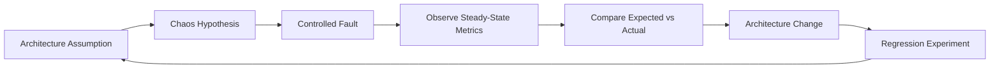
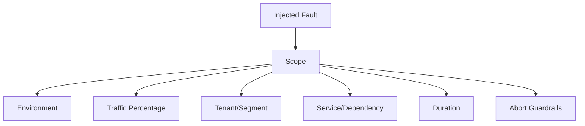
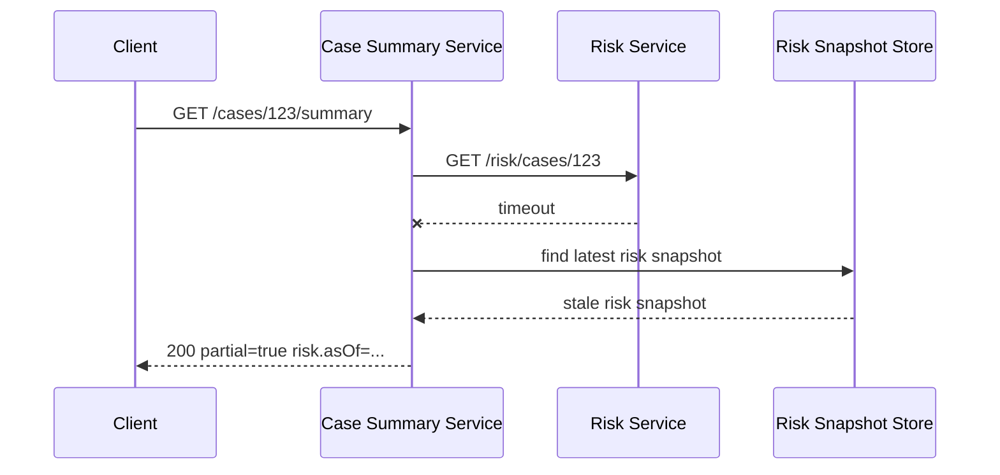
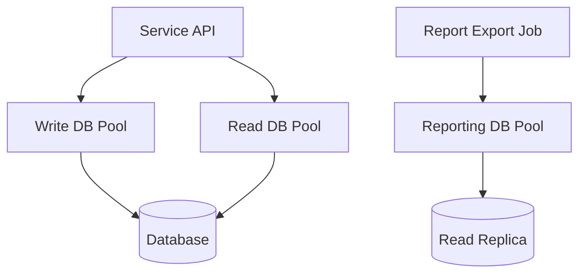
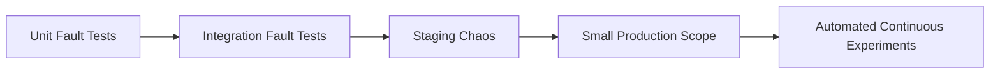
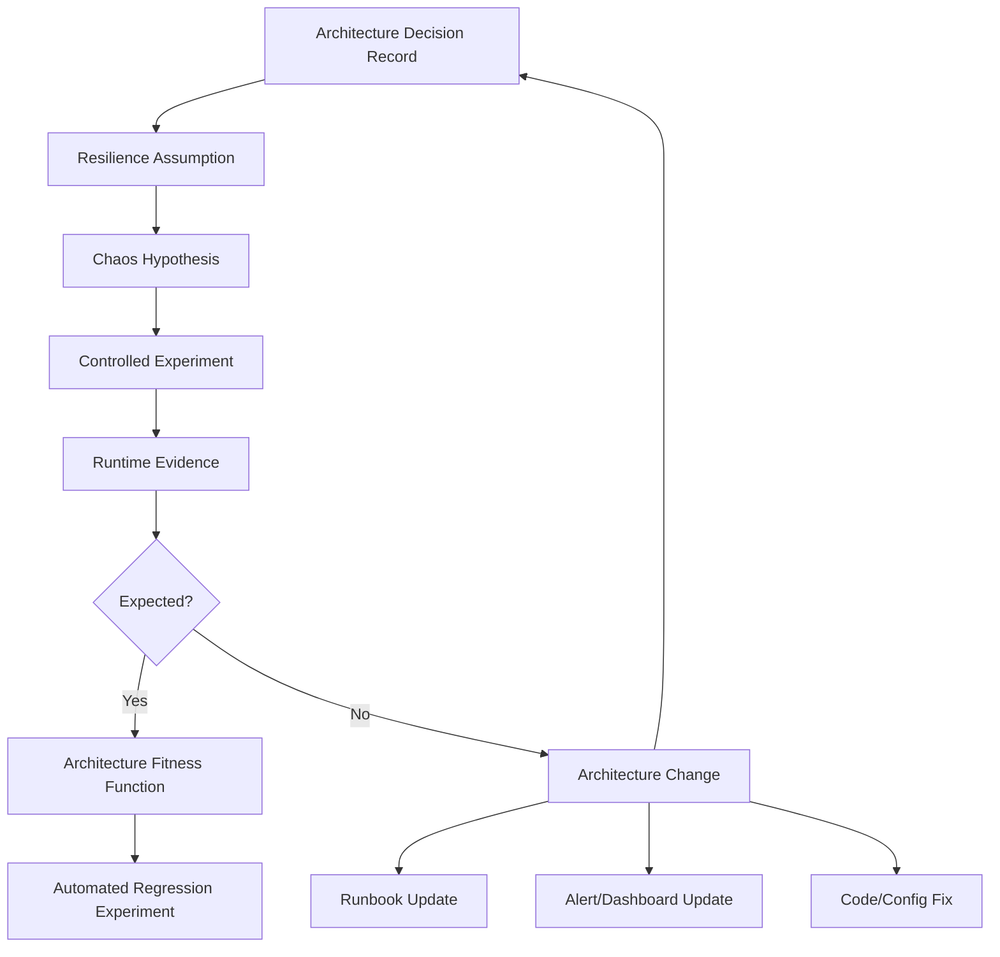

# Part 046 — Chaos Thinking for Architects

Chaos engineering sering disalahpahami sebagai “mematikan server secara random”.
Itu bukan chaos engineering.
Itu hanya membuat kebisingan.

Untuk architect, chaos thinking adalah cara memvalidasi asumsi desain:

- Apakah timeout benar-benar mencegah thread exhaustion?
- Apakah circuit breaker benar-benar membuka sebelum dependency collapse?
- Apakah fallback aman secara bisnis?
- Apakah degraded response terlihat oleh user dan operator?
- Apakah queue backlog bisa pulih tanpa merusak database?
- Apakah runbook bisa digunakan saat tekanan incident nyata?
- Apakah dependency optional benar-benar optional?

Chaos thinking bukan tujuan akhir.
Tujuannya adalah **confidence**.
Confidence bahwa sistem bisa kehilangan sebagian komponen tanpa kehilangan kendali.

> Chaos experiment adalah architecture review yang dieksekusi terhadap sistem nyata atau production-like, bukan sekadar dibahas di whiteboard.

---

## 1. Mental Model: From Assumption to Evidence

Setiap desain resilience mengandung asumsi.

Contoh:

```text
Assumption:
If Risk Service is unavailable, Case Summary API will still respond within 800 ms using stale risk snapshot.
```

Chaos thinking mengubah asumsi menjadi hipotesis yang bisa diuji.

```text
Hypothesis:
When Risk Service returns 500 for 10 minutes at 30% normal traffic,
Case Summary API will maintain P95 latency < 800 ms,
error rate < 1%,
and degraded risk fragment count will increase while critical case fields remain available.
```

Perhatikan detailnya:

- fault jelas,
- durasi jelas,
- traffic level jelas,
- expected behavior jelas,
- metrics jelas,
- user/business impact jelas.

Tanpa hipotesis, chaos experiment hanya “breaking things”.
Dengan hipotesis, chaos experiment menjadi scientific feedback loop.



---

## 2. Chaos Engineering Is Not Randomness

Kata “chaos” menyesatkan.
Praktiknya justru disiplin:

1. Define steady state.
2. Form hypothesis.
3. Choose fault.
4. Limit blast radius.
5. Run experiment.
6. Observe behavior.
7. Stop if guardrail violated.
8. Fix architecture.
9. Re-run experiment.
10. Automate regression if valuable.

Kita tidak sedang mencari sensasi.
Kita sedang mencari mismatch antara **architecture diagram** dan **runtime behavior**.

---

## 3. Steady State Before Fault

Sebelum menginjeksikan fault, tentukan steady state.

Steady state bukan “semua pod running”.
Steady state adalah kondisi bisnis dan sistem yang dianggap sehat.

### 3.1 Technical Steady State

Contoh untuk `case-summary-service`:

```yaml
steadyState:
  technical:
    p95LatencyMs: "< 800"
    p99LatencyMs: "< 1500"
    errorRate: "< 1%"
    cpuUtilization: "< 70%"
    dbPoolPending: "= 0"
    httpClientPending: "< 10"
    threadPoolQueueDepth: "< 50"
    circuitBreakerOpenRate: "expected only for injected dependency"
```

### 3.2 Business Steady State

```yaml
steadyState:
  business:
    caseSummaryAvailability: ">= 99.9%"
    criticalCaseFieldsAvailable: "true"
    staleFragmentsMarked: "true"
    unsafeCaseSubmissionAccepted: "false"
    auditEventLoss: "0"
```

### 3.3 Human/Operational Steady State

```yaml
steadyState:
  operational:
    alerts: "only expected alerts fire"
    runbookLinked: "true"
    oncallCanIdentifyInjectedFault: "within 5 minutes"
    dashboardShowsDegradedFragments: "true"
```

Top engineer selalu memasukkan business steady state.
Kalau hanya technical metric, sistem bisa “hijau” tetapi business salah.

---

## 4. Blast Radius Is an Architecture Constraint

Chaos experiment harus punya blast radius.
Blast radius menjawab:

- siapa yang terdampak,
- service mana yang terdampak,
- berapa traffic yang terdampak,
- berapa lama eksperimen berjalan,
- kondisi apa yang menghentikan eksperimen,
- siapa yang boleh menjalankan,
- bagaimana rollback/stop dilakukan.



### 4.1 Blast Radius Card

```yaml
experiment: risk-service-timeout-case-summary
scope:
  environment: staging
  trafficPercentage: 30
  tenants:
    - synthetic-regulatory-tenant
  affectedServices:
    - case-summary-service
    - risk-service
  fault:
    type: dependency-timeout
    dependency: risk-service
    latencyMs: 5000
    durationMinutes: 10
guardrails:
  abortIf:
    caseSummaryErrorRate: "> 2% for 2 minutes"
    p95LatencyMs: "> 1200 for 3 minutes"
    dbCpu: "> 80%"
    queueLagSeconds: "> 300"
    auditEventLoss: "> 0"
rollback:
  method: disable fault injection rule
  owner: platform-reliability
approvals:
  - service-owner
  - sre-oncall
```

This card is not bureaucracy.
It prevents experiments from becoming incidents.

---

## 5. Failure Hypothesis Template

Use this format.

```text
Given <steady state>,
when <fault> is injected into <scope>,
then <user-visible behavior> should remain within <SLO/SLA/contract>,
and <system signals> should show <expected resilience behavior>,
without <unsafe business consequence>.
```

Example:

```text
Given Case Summary API is serving normal synthetic traffic,
when Risk Service latency is increased to 5 seconds for 10 minutes for 30% of traffic,
then Case Summary API should respond within P95 < 800 ms using stale risk snapshot,
and circuit breaker open count plus degraded_fragment_count should increase,
without increasing case summary 5xx rate above 1% or losing audit events.
```

Bad hypothesis:

```text
Kill Risk Service and see what happens.
```

That is not an experiment.
That is gambling.

---

## 6. Experiment Taxonomy for Microservices

### 6.1 Dependency Faults

- HTTP 500 from dependency,
- dependency timeout,
- slow response,
- malformed response,
- partial response,
- connection refused,
- TLS handshake failure,
- DNS resolution delay,
- service discovery stale endpoint.

### 6.2 Resource Faults

- CPU pressure,
- memory pressure,
- GC pause,
- thread pool exhaustion,
- DB connection pool exhaustion,
- disk I/O saturation,
- network bandwidth throttling.

### 6.3 Data Faults

- stale read model,
- missing event,
- duplicate event,
- out-of-order event,
- poisoned message,
- projection rebuild lag,
- schema-compatible but semantically unexpected payload.

### 6.4 Control Plane Faults

- pod restart,
- node drain,
- delayed deployment rollout,
- service mesh policy change,
- secret rotation failure,
- config refresh failure,
- DNS outage simulation.

### 6.5 Human/Operational Faults

- runbook missing step,
- alert routes to wrong team,
- dashboard lacks dependency metric,
- emergency lever not documented,
- operator lacks permission,
- rollback procedure too slow.

Architect-level chaos includes human and process failure.
Production systems fail through socio-technical seams, not just code paths.

---

## 7. Java Microservice Chaos Targets

### 7.1 HTTP Client Layer

Faults:

- timeout,
- 503,
- slow response,
- connection reset,
- invalid JSON,
- large payload,
- retry-after response.

Things to verify:

- timeout is enforced,
- retry count is bounded,
- circuit breaker opens,
- fallback response is explicit,
- bulkhead rejection does not kill request thread,
- metrics show dependency and reason.

### 7.2 Database Layer

Faults:

- slow query,
- connection pool exhaustion,
- deadlock,
- lock timeout,
- primary failover,
- replica lag,
- transaction commit unknown outcome.

Things to verify:

- query timeout,
- pool timeout,
- write path fail-closed,
- no remote call inside transaction,
- idempotency handles unknown outcome,
- audit/outbox behavior remains correct.

### 7.3 Messaging Layer

Faults:

- duplicate message,
- out-of-order message,
- poison message,
- broker unavailable,
- consumer lag,
- DLQ overflow,
- slow downstream from consumer.

Things to verify:

- inbox deduplication,
- version guard,
- retry backoff,
- DLQ with reason,
- replay does not overload dependency,
- projection staleness is visible.

### 7.4 JVM Runtime

Faults:

- heap pressure,
- GC pause,
- blocked threads,
- event loop blocking,
- CPU throttling,
- classloader/startup slowness.

Things to verify:

- service sheds load before death,
- liveness does not restart unnecessarily,
- readiness changes correctly,
- metrics capture saturation,
- shutdown is graceful.

---

## 8. Example Experiment 1 — Optional Dependency Timeout

### 8.1 Context

`case-summary-service` calls `risk-service` to show risk band.
Risk band is helpful but not critical for viewing case core.
System design claims stale risk snapshot should be used if live risk is unavailable.

### 8.2 Hypothesis

```text
When risk-service times out for 10 minutes,
case-summary-service should keep P95 latency below 800 ms,
return HTTP 200 with risk fragment marked stale/unavailable,
and not increase global thread pool queue depth above 50.
```

### 8.3 Expected Flow



### 8.4 Java Test Harness Idea

For local/integration testing, you can simulate dependency behavior using a fake adapter.

```java
public final class FaultInjectingRiskClient implements RiskClient {
    private final RiskClient delegate;
    private final FaultModeProvider faultModeProvider;

    @Override
    public RiskScore getRisk(CaseId caseId, Duration timeout) {
        FaultMode mode = faultModeProvider.current("risk-service");

        if (mode == FaultMode.TIMEOUT) {
            sleep(timeout.plusMillis(100));
            throw new DependencyTimeoutException("risk-service timed out");
        }

        if (mode == FaultMode.HTTP_500) {
            throw new DependencyUnavailableException("risk-service returned 500");
        }

        return delegate.getRisk(caseId, timeout);
    }

    private void sleep(Duration duration) {
        try {
            Thread.sleep(duration.toMillis());
        } catch (InterruptedException e) {
            Thread.currentThread().interrupt();
            throw new RuntimeException(e);
        }
    }
}
```

Do not ship random fault injection in production without access control and guardrails.
For production-like experiments, prefer controlled platform tooling or service mesh fault injection where available.

### 8.5 Success Criteria

```yaml
success:
  caseSummaryP95Ms: "< 800"
  caseSummary5xxRate: "< 1%"
  degradedRiskFragmentRate: "> 80% for affected traffic"
  globalThreadPoolQueueDepth: "< 50"
  circuitBreakerState: "open or half-open as expected"
  auditEventLoss: "0"
```

### 8.6 Possible Findings

- fallback path calls database without timeout,
- stale snapshot table has no index,
- degraded fragment not visible in metrics,
- circuit breaker opens too late,
- retry consumes entire request deadline,
- frontend treats partial response as error,
- API contract does not document partial response.

Each finding is an architecture improvement item.

---

## 9. Example Experiment 2 — Duplicate Event Delivery

### 9.1 Context

`case-service` publishes `CaseEscalated`.
`task-service` consumes it and creates escalation task.
System claims inbox deduplication prevents duplicate tasks.

### 9.2 Hypothesis

```text
When the same CaseEscalated event is delivered five times,
task-service should create exactly one escalation task,
record duplicate deliveries as deduplicated,
and preserve idempotent processing latency below 200 ms.
```

### 9.3 Event

```json
{
  "eventId": "evt-001",
  "eventType": "CaseEscalated",
  "aggregateId": "CASE-123",
  "aggregateVersion": 14,
  "occurredAt": "2026-07-05T08:00:00Z",
  "payload": {
    "caseId": "CASE-123",
    "escalationLevel": "SENIOR_REVIEW"
  }
}
```

### 9.4 Consumer Guard

```java
@Transactional
public void handle(IntegrationEvent<CaseEscalated> event) {
    if (inbox.alreadyProcessed(event.eventId())) {
        metrics.increment("event.duplicate", "type", event.type());
        return;
    }

    TaskId taskId = taskService.createEscalationTask(
        event.payload().caseId(),
        event.payload().escalationLevel()
    );

    inbox.markProcessed(event.eventId(), taskId.value());
}
```

### 9.5 Success Criteria

```yaml
success:
  tasksCreated: 1
  duplicateEventsDetected: 4
  handler5xx: 0
  inboxUniqueConstraintViolationHandled: true
  auditTrailShowsDeduplication: true
```

### 9.6 Architecture Lesson

Messaging systems often deliver at-least-once.
The architecture must make duplicate delivery harmless.
This is not a Kafka/RabbitMQ problem.
It is a business-side-effect design problem.

---

## 10. Example Experiment 3 — Projection Lag

### 10.1 Context

`case-summary-read-model` is built from events.
UI depends on it for fast summary page.
System claims staleness is visible and bounded.

### 10.2 Hypothesis

```text
When projection consumer is paused for 15 minutes,
case summary API should expose projection lag and asOf timestamp,
case write path should remain available,
and alert should fire when lag exceeds 5 minutes.
```

### 10.3 Expected Response

```json
{
  "caseId": "CASE-123",
  "status": "UNDER_REVIEW",
  "_freshness": {
    "projectionAsOf": "2026-07-05T08:11:00Z",
    "lagSeconds": 900,
    "stale": true
  }
}
```

### 10.4 Findings to Look For

- UI does not render stale indicator,
- alert threshold too high,
- projection lag metric not partitioned by topic,
- write path incorrectly waits for projection update,
- support team cannot explain stale read model to user,
- compliance report uses stale operational read model incorrectly.

---

## 11. Example Experiment 4 — Database Connection Pool Exhaustion

### 11.1 Hypothesis

```text
When reporting queries consume all reporting DB connections,
case submission write path should remain available because write pool is isolated,
and report export requests should be rejected or queued without blocking critical writes.
```

### 11.2 Design Under Test



### 11.3 Success Criteria

```yaml
success:
  caseSubmissionErrorRate: "< 1%"
  reportExportRejectedOrQueued: true
  writePoolPending: "= 0"
  reportPoolPending: "> 0 allowed"
  alertIncludesPoolName: true
```

### 11.4 Architecture Lesson

If all workloads share one DB pool, non-critical reporting can take down critical writes.
Chaos reveals whether “priority” exists only in documentation or in resource isolation.

---

## 12. Chaos Experiment Design Document

Use this template for every serious experiment.

```yaml
experimentId: case-summary-risk-timeout-001
owner: case-platform-team
reviewers:
  - sre
  - security
  - domain-owner
systemUnderTest:
  services:
    - case-summary-service
    - risk-service
  userJourney: view case summary
assumption:
  description: risk-service is optional for case summary
hypothesis:
  given: normal synthetic traffic at 30% production-like load
  when: risk-service latency is 5000ms for 10 minutes
  then:
    - case summary P95 latency remains < 800ms
    - API returns 200 with degraded risk fragment
    - global thread pool queue remains < 50
    - no audit event loss
steadyState:
  metrics:
    - http.server.requests.p95
    - http.server.errors.rate
    - dependency.risk.latency
    - degraded.fragment.count
    - circuit.breaker.state
    - executor.queue.depth
blastRadius:
  environment: staging
  traffic: synthetic only
  tenant: synthetic-regulatory-tenant
  duration: 10m
guardrails:
  abortIf:
    - p95LatencyMs > 1200 for 3m
    - errorRate > 2% for 2m
    - dbCpu > 80%
execution:
  faultInjectionMethod: service-mesh-latency-rule
  startCommand: apply risk-service-delay.yaml
  stopCommand: delete risk-service-delay.yaml
observability:
  dashboard: case-summary-resilience
  traceQuery: dependency.name="risk-service"
runbook:
  link: runbooks/case-summary-risk-degradation.md
postExperiment:
  compareExpectedActual: true
  createArchitectureIssues: true
  updateRunbook: true
  decideAutomation: true
```

---

## 13. Safe Execution Protocol

### 13.1 Before Experiment

- [ ] Hypothesis reviewed.
- [ ] Blast radius defined.
- [ ] Guardrails defined.
- [ ] Stop mechanism tested.
- [ ] Dashboard ready.
- [ ] On-call aware if shared environment.
- [ ] Synthetic traffic identifiable.
- [ ] No unrelated deployment in progress.
- [ ] Rollback/disable path verified.
- [ ] Business owner understands possible user-visible behavior.

### 13.2 During Experiment

- [ ] Start from smallest scope.
- [ ] Watch guardrails continuously.
- [ ] Record timestamps.
- [ ] Verify expected signals appear.
- [ ] Avoid changing many variables at once.
- [ ] Abort if guardrail breached.

### 13.3 After Experiment

- [ ] Remove fault.
- [ ] Verify steady state restored.
- [ ] Capture actual behavior.
- [ ] Identify surprises.
- [ ] Create fix items.
- [ ] Update architecture docs.
- [ ] Update runbooks.
- [ ] Decide whether to automate regression.

---

## 14. What Architects Should Look For

During chaos experiment, don't just ask “did the service survive?”
Ask deeper questions.

### 14.1 Contract Mismatch

- API returns 500 where contract promised degraded fragment.
- UI treats partial response as failure.
- Consumer assumes event order that broker does not guarantee.
- Retry policy assumes idempotency that command does not implement.

### 14.2 Resource Coupling

- Optional dependency consumes global thread pool.
- Reporting consumes write DB pool.
- Projection rebuild starves live consumer.
- Batch import saturates shared cache.

### 14.3 Observability Gap

- Alert fires but does not identify dependency.
- Trace lacks retry attempt count.
- Dashboard shows error but not saturation.
- Logs lack correlation ID.
- Degraded mode invisible.

### 14.4 Recovery Gap

- Backlog drains too fast.
- DLQ replay creates duplicates.
- Circuit breaker remains open too long.
- Cache warmup overloads DB.
- Runbook tells operator to restart everything.

### 14.5 Governance Gap

- No owner for dependency.
- No approval path for emergency lever.
- No deprecation owner for fallback.
- No SLO for user journey.
- No evidence trail for compliance-sensitive workflow.

---

## 15. Fault Injection Locations

Where should fault injection live?
Depends on what you want to test.

| Location | Tests | Risk |
|---|---|---|
| Unit test fake adapter | business fallback logic | low realism |
| Integration test mock server | client timeout/retry/error mapping | medium realism |
| Testcontainer/network proxy | network behavior | medium |
| Service mesh fault rule | runtime dependency behavior | higher |
| Kubernetes pod kill/node drain | platform resilience | higher |
| Broker fault/replay | messaging behavior | medium-high |
| Production small-scope experiment | real behavior | highest, needs guardrails |

Do not jump to production chaos before lower-level experiments have proven basic behavior.

Maturity progression:



---

## 16. Chaos Testing in Java: Practical Patterns

### 16.1 Adapter-Level Fault Toggle

Useful for local/integration tests.

```java
public interface FaultModeProvider {
    FaultMode current(String dependencyName);
}

public enum FaultMode {
    NONE,
    TIMEOUT,
    HTTP_500,
    MALFORMED_RESPONSE,
    SLOW_RESPONSE,
    CONNECTION_RESET
}
```

### 16.2 Dependency Client Test

```java
@Test
void usesStaleSnapshotWhenRiskServiceTimesOut() {
    faultModeProvider.set("risk-service", FaultMode.TIMEOUT);

    CaseSummary summary = api.getCaseSummary(CaseId.of("CASE-123"));

    assertThat(summary.risk().status()).isEqualTo(FragmentStatus.STALE);
    assertThat(summary.partial()).isTrue();
    assertThat(metrics.counter("fragment.degraded", "fragment", "risk").count()).isEqualTo(1.0);
}
```

### 16.3 Duplicate Event Test

```java
@Test
void duplicateCaseEscalatedEventCreatesOnlyOneTask() {
    IntegrationEvent<CaseEscalated> event = fixture.caseEscalated("evt-001", "CASE-123", 14);

    consumer.handle(event);
    consumer.handle(event);
    consumer.handle(event);

    assertThat(taskRepository.findEscalationTasks("CASE-123")).hasSize(1);
    assertThat(inboxRepository.isProcessed("evt-001")).isTrue();
}
```

### 16.4 Out-of-Order Event Test

```java
@Test
void olderProjectionEventDoesNotOverwriteNewerState() {
    projection.apply(eventVersion(15, "ESCALATED"));
    projection.apply(eventVersion(14, "UNDER_REVIEW"));

    CaseProjection state = projection.find("CASE-123");

    assertThat(state.version()).isEqualTo(15);
    assertThat(state.status()).isEqualTo("ESCALATED");
}
```

### 16.5 Slow Database Test

Use query timeout and pool timeout tests.
Pseudo example:

```java
@Test
void writeCommandFailsFastWhenDatabaseLockIsHeld() {
    database.holdLock("case", "CASE-123", Duration.ofSeconds(5));

    assertThatThrownBy(() -> service.escalateCase(command))
        .isInstanceOf(DatabaseTimeoutException.class);

    assertThat(outbox.eventsFor("CASE-123")).isEmpty();
}
```

The key is not the framework.
The key is making failure a normal test input.

---

## 17. Chaos Results Should Change Architecture

An experiment that produces no decision is theater.

Each result should map to one of:

- accept risk,
- fix implementation,
- change architecture,
- change SLO,
- change runbook,
- add alert,
- add emergency lever,
- change dependency criticality,
- change service boundary,
- automate regression.

### 17.1 Post-Experiment Review

```yaml
result:
  expectedBehaviorMet: false
  surprises:
    - Risk fallback called DB without query timeout.
    - Frontend displayed generic error on partial response.
    - Alert fired for case-summary but not risk-service.
rootCauses:
  - fallback path not included in load test
  - API partial response contract undocumented
  - dependency metric missing criticality tag
architectureChanges:
  - add query timeout to snapshot repository
  - update API contract for partial fragments
  - tag dependency metrics with dependency.criticality
  - add chaos regression test for risk timeout
riskDecision:
  status: mitigation-required
  owner: case-platform-team
  dueDate: 2026-07-19
```

---

## 18. Chaos and SLOs

Chaos experiments should be evaluated against SLOs or explicit user journey contracts.

Bad:

```text
Service survived pod kill.
```

Better:

```text
During pod kill, Case Submission SLO stayed within 99.9% availability and P95 < 700 ms for synthetic traffic.
```

### 18.1 Experiment-to-SLO Mapping

| Experiment | SLO/User Journey | Expected Result |
|---|---|---|
| risk-service timeout | case summary view | partial response, P95 within target |
| duplicate event | case escalation task creation | exactly one task |
| projection pause | case summary freshness | stale indicator and alert |
| DB pool exhaustion | case submission | critical writes protected |
| pod kill | service availability | no user-visible error beyond budget |
| queue backlog replay | decision projection | controlled catch-up without DB overload |

If an experiment does not map to user/business impact, its priority is questionable.

---

## 19. Chaos in Regulated Domains

In regulatory or enforcement systems, chaos thinking must respect defensibility.

You are not only protecting uptime.
You are protecting:

- audit trail integrity,
- decision reconstruction,
- evidence chain,
- case lifecycle correctness,
- SLA clock correctness,
- user authorization correctness,
- data privacy,
- non-repudiation,
- operator accountability.

### 19.1 Unsafe Chaos Targets

Be careful with experiments that can:

- create real external notifications,
- modify real legal case state,
- corrupt evidence metadata,
- trigger actual enforcement workflow,
- send messages to external agencies,
- expose PII in logs,
- produce irreversible side effects.

Use synthetic tenants, shadow mode, or pre-production unless production guardrails are exceptionally strong.

### 19.2 Audit-Safe Experiment Metadata

Every experiment should produce audit metadata:

```json
{
  "experimentId": "case-summary-risk-timeout-001",
  "startedAt": "2026-07-05T09:00:00Z",
  "endedAt": "2026-07-05T09:10:00Z",
  "initiatedBy": "platform-reliability",
  "approvedBy": ["case-owner", "sre-oncall"],
  "scope": {
    "environment": "staging",
    "tenant": "synthetic-regulatory-tenant"
  },
  "fault": {
    "type": "latency",
    "target": "risk-service",
    "latencyMs": 5000
  },
  "guardrailsBreached": false
}
```

---

## 20. GameDay vs Chaos Automation

### 20.1 GameDay

GameDay is a human-centered resilience exercise.
It tests:

- detection,
- diagnosis,
- communication,
- decision-making,
- runbook quality,
- escalation path,
- emergency lever usage.

GameDay is useful when:

- new architecture is launched,
- team ownership changed,
- critical dependency changed,
- major incident happened,
- runbook has never been tested.

### 20.2 Automated Chaos

Automated chaos is useful when:

- fault is well understood,
- blast radius is small,
- guardrails are automated,
- rollback is automatic,
- experiment gives high-value regression signal.

Do not automate an experiment you do not understand manually.

---

## 21. Chaos Maturity Model

### Level 0 — Hope

- No failure tests.
- Resilience exists only in design doc.
- Incident is first real test.

### Level 1 — Manual Failure Tests

- Local/integration tests for timeout/retry/fallback.
- Some duplicate event tests.
- No system-level validation.

### Level 2 — Staging GameDays

- Planned experiments in staging.
- Dashboards and runbooks tested.
- Findings create engineering tasks.

### Level 3 — Production-Like Controlled Experiments

- Synthetic traffic.
- Small blast radius.
- Guardrails.
- Service owners participate.

### Level 4 — Continuous Resilience Verification

- Automated experiments for known failure modes.
- Regression checks in delivery pipeline or scheduled windows.
- SLO-aware abort.
- Architecture docs updated from evidence.

### Level 5 — Resilience as Architecture Fitness Function

- Failure behavior is treated as a release criterion.
- Service catalog includes resilience posture.
- Critical user journeys have regular chaos validation.
- Incident learnings become experiments.

---

## 22. Anti-Patterns

### 22.1 Random Destruction

Killing random pods without hypothesis teaches little and creates distrust.

### 22.2 No Blast Radius

If you cannot describe impact scope, do not run the experiment.

### 22.3 No Guardrail

Experiment must have abort criteria.

### 22.4 No Business Metric

Technical survival without business correctness is not enough.

### 22.5 Testing Only Happy Fallback

Fallback path can be slower or more dangerous than primary path.
Test fallback under load.

### 22.6 Chaos Without Ownership

If no team owns the result, experiment becomes theater.

### 22.7 Production First

Do not start with production failure injection before lower environments prove basic behavior.

### 22.8 Tool-Driven Chaos

Buying a chaos tool does not create chaos engineering.
The discipline is hypothesis, blast radius, observation, and architecture change.

---

## 23. Architect's Chaos Review Checklist

Before experiment:

- [ ] What architecture assumption are we testing?
- [ ] What user journey or business capability is involved?
- [ ] What is the steady state?
- [ ] What is the exact fault?
- [ ] What is the expected behavior?
- [ ] What is the blast radius?
- [ ] What guardrails stop the experiment?
- [ ] How do we stop the fault?
- [ ] What dashboard proves the behavior?
- [ ] What runbook will be exercised?
- [ ] Who owns the result?

During experiment:

- [ ] Did detection happen?
- [ ] Did fallback activate?
- [ ] Did saturation stay bounded?
- [ ] Did retry stay bounded?
- [ ] Did user-visible contract hold?
- [ ] Did alerts route correctly?
- [ ] Did the team diagnose with available telemetry?

After experiment:

- [ ] What surprised us?
- [ ] Which assumptions were false?
- [ ] Which design changed?
- [ ] Which runbook changed?
- [ ] Which alert changed?
- [ ] Which test becomes automated regression?
- [ ] Was residual risk accepted or mitigated?

---

## 24. Mermaid: Chaos Feedback Loop in Architecture Governance



Chaos thinking closes the loop between design-time intent and runtime truth.

---

## 25. Final Mental Model

Chaos engineering is not about proving your system is unbreakable.
That is impossible.

It is about proving that when something breaks:

- failure is detected,
- blast radius is bounded,
- critical user journeys remain within contract,
- unsafe business actions are prevented,
- operators have useful signals,
- emergency levers work,
- recovery does not trigger a second failure,
- architecture learns from evidence.

For architects, the most valuable output of chaos is not the experiment report.
It is a better system model.

A mature architecture says:

```text
We know how this system fails.
We know how failure is contained.
We know which user journeys degrade.
We know which signals prove it.
We know which levers recover it.
We have tested the claim.
```

That is the difference between resilience as marketing and resilience as engineering.

---

## References

- Principles of Chaos Engineering: https://principlesofchaos.org/
- Microsoft Azure Chaos Studio — Chaos Engineering Overview: https://learn.microsoft.com/en-us/azure/chaos-studio/chaos-studio-chaos-engineering-overview
- Microsoft Azure Blog — Advancing Resilience Through Chaos Engineering and Fault Injection: https://azure.microsoft.com/en-us/blog/advancing-resilience-through-chaos-engineering-and-fault-injection/
- Google SRE Book — Addressing Cascading Failures: https://sre.google/sre-book/addressing-cascading-failures/
- AWS Well-Architected Reliability Pillar: https://docs.aws.amazon.com/wellarchitected/latest/reliability-pillar/welcome.html
