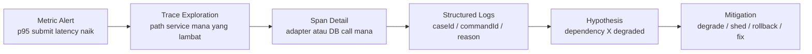
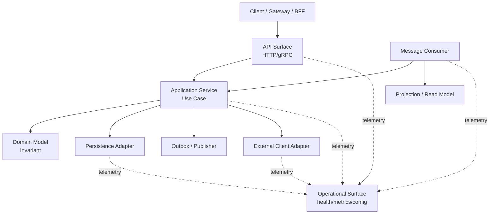
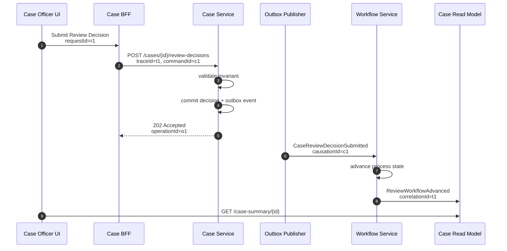
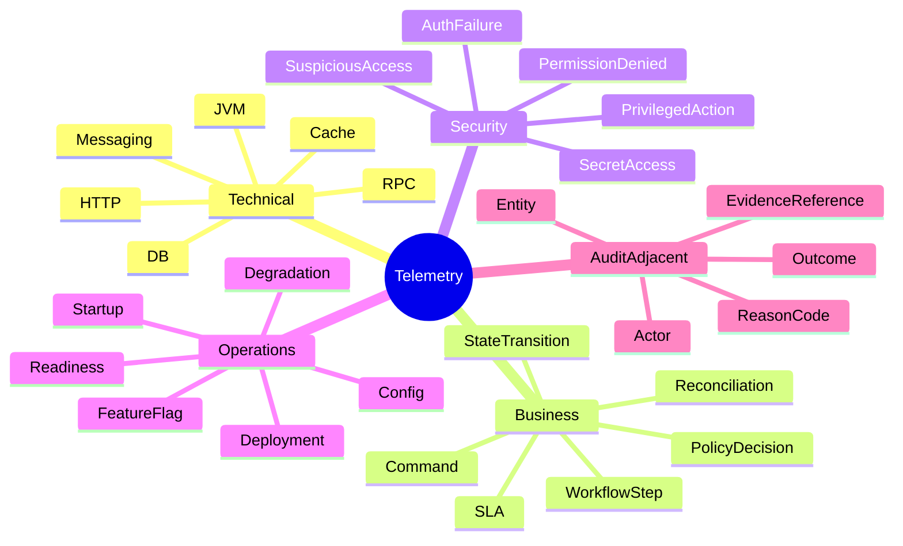
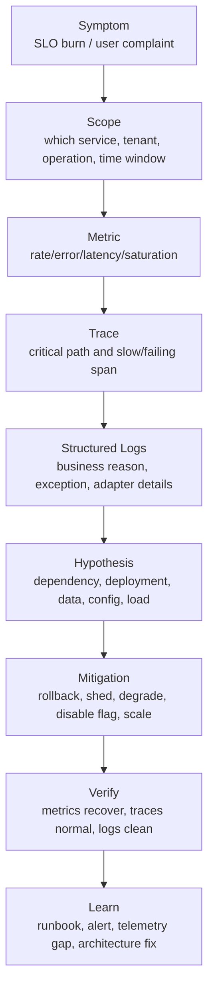
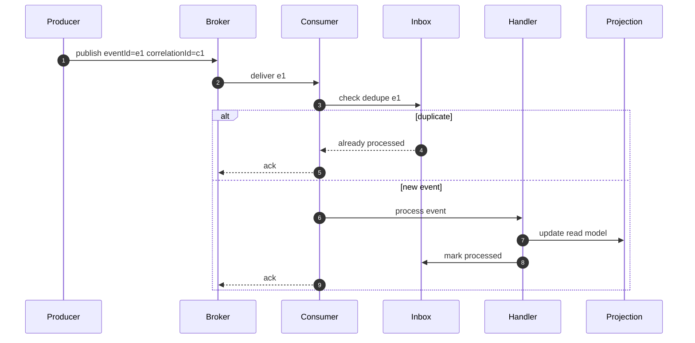

# Part 047 — Observability Mental Model

> Microservice yang tidak bisa diamati adalah microservice yang tidak bisa dipercaya.
>
> Di sistem monolith, debugger, stack trace, dan database query kadang masih cukup untuk memahami masalah. Di microservices, satu user action bisa melewati gateway, BFF, service domain, workflow, queue, projection, cache, third-party adapter, dan background worker. Kalau telemetry tidak dirancang dari awal, incident response berubah menjadi arkeologi: mencari jejak yang kebetulan masih tersisa.

Part ini membangun mental model observability sebelum kita masuk ke structured logging, metrics, tracing, health checks, alerting, runbook, dan production debugging.

Kita tidak akan mulai dari “install tool X”. Tool bisa diganti. Mental model yang benar lebih tahan lama.

---

## 1. Core Problem

Microservices memecah sistem menjadi banyak runtime process. Pemecahan ini memberi independent deployment dan ownership, tetapi juga menghilangkan satu hal yang sebelumnya murah: **local visibility**.

Di distributed system, ketika user berkata:

> “Saya klik submit, tetapi case tidak berubah status.”

Pertanyaannya bukan hanya:

- controller mana yang error?
- method mana yang throw exception?
- SQL mana yang gagal?

Pertanyaannya menjadi:

- request masuk ke service mana?
- command diterima atau ditolak?
- transaction commit atau rollback?
- event outbox terbentuk atau tidak?
- publisher mengirim event atau tidak?
- consumer menerima event atau tidak?
- projection tertinggal atau gagal update?
- workflow sedang menunggu timer/manual action?
- response yang dilihat user berasal dari source of truth atau read model stale?
- apakah failure terjadi di synchronous path, asynchronous path, atau observation path?

Tanpa observability, kamu tidak punya jawaban. Kamu hanya punya dugaan.

---

## 2. Observability vs Monitoring

Monitoring menjawab:

> “Apakah sesuatu yang sudah kita tahu penting sedang rusak?”

Observability menjawab:

> “Apa yang sedang terjadi di dalam sistem, termasuk kondisi yang belum kita prediksi sebelumnya?”

Monitoring biasanya berbasis known failure mode:

- CPU tinggi
- pod restart
- HTTP 5xx naik
- queue lag tinggi
- DB connection pool habis

Observability membantu investigasi unknown failure mode:

- hanya tenant tertentu yang gagal
- hanya command tertentu yang lambat
- hanya workflow state tertentu yang stuck
- hanya request dengan payload tertentu yang memicu retry storm
- hanya dependency tertentu yang menyebabkan tail latency
- hanya consumer tertentu yang membuat projection stale

Perbedaannya bukan tool. Perbedaannya adalah **kemampuan bertanya**.

---

## 3. Three Signals: Logs, Metrics, Traces

Observability modern biasanya dibangun dari tiga sinyal utama:

| Signal | Menjawab | Bentuk | Kekuatan | Risiko |
|---|---|---|---|---|
| Logs | Apa yang terjadi pada satu event tertentu? | record diskrit | detail tinggi | noisy, mahal, sulit aggregate |
| Metrics | Seberapa sering/seberapa besar/seberapa lambat? | time series | alerting, trend, SLO | kehilangan detail individual |
| Traces | Request melewati apa saja? | graph/span | cross-service diagnosis | sampling, overhead, instrumentation gap |

Mental modelnya:

- **metric** memberi tahu ada gejala
- **trace** menunjukkan jalur gejala
- **log** menjelaskan event detail di titik tertentu

Jangan perlakukan ketiganya sebagai silo.



Observability yang matang membuat perpindahan dari metric ke trace ke log terasa natural.

---

## 4. Observability Is a Contract, Not a Decoration

Telemetry bukan `println` yang ditambahkan ketika debugging.

Telemetry adalah kontrak antara service dan operator:

> “Ketika service ini menjalankan business capability, ia akan meninggalkan jejak yang cukup untuk membuktikan apa yang terjadi, kapan, oleh siapa, terhadap entity apa, dengan outcome apa, dan dalam dependency context apa.”

Dalam microservices production-grade, service contract tidak hanya terdiri dari:

- REST API
- event schema
- database schema
- authorization rule

Tetapi juga:

- log schema
- metric naming
- trace span conventions
- health check semantics
- audit event semantics
- correlation strategy
- error taxonomy
- redaction rule
- alert ownership

Jika service tidak mendefinisikan observability contract, incident response bergantung pada kebiasaan developer individual. Itu tidak scalable.

---

## 5. Observability Surfaces of a Java Microservice

Satu Java microservice setidaknya punya beberapa surface yang perlu diamati.



Setiap surface butuh observability berbeda.

### API Surface

Harus terlihat:

- route
- method
- status code
- latency
- request size
- response size
- principal/tenant context secara aman
- correlation ID
- idempotency key
- validation failure reason
- rate limiting outcome

### Application Service Surface

Harus terlihat:

- command name
- command ID
- aggregate/entity ID
- business outcome
- rejection reason
- transaction outcome
- outbox event count
- important decision point

### Domain Surface

Biasanya tidak perlu log terlalu banyak, tetapi perlu sinyal untuk:

- invariant violation
- illegal state transition
- policy decision
- domain event emitted

### Persistence Surface

Harus terlihat:

- query latency
- connection pool saturation
- optimistic lock conflict
- deadlock/retry
- rows affected untuk command penting
- migration/version mismatch

### Integration Adapter Surface

Harus terlihat:

- dependency name
- operation name
- timeout
- retry count
- circuit breaker state
- fallback/degraded outcome
- upstream status mapping

### Messaging Surface

Harus terlihat:

- topic/queue
- consumer group
- message ID
- event type
- event version
- lag
- processing time
- retry attempt
- DLQ movement
- dedupe decision

### Operational Surface

Harus terlihat:

- build/version
- config profile
- readiness/liveness state
- JVM memory/GC/thread
- endpoint exposure
- dependency health
- feature flag state

---

## 6. The Golden Rule: Preserve Causality

Observability harus menjaga hubungan sebab-akibat.

Sistem distributed kehilangan natural call stack. Trace dan correlation ID menggantikan call stack tersebut.

Untuk setiap unit kerja penting, kita perlu mempertahankan:

- **request identity**: request ini yang mana?
- **business identity**: command/case/order/entity apa?
- **causal identity**: event/command ini berasal dari aksi apa?
- **actor identity**: siapa atau sistem apa yang memulai?
- **tenant identity**: konteks tenant/organization mana?
- **operation identity**: use case apa yang sedang dijalankan?
- **outcome identity**: berhasil, ditolak, degraded, timeout, atau unknown?

Contoh causal chain:



Kalau semua langkah punya `traceId`, `commandId`, `caseId`, dan `causationId`, debugging bisa dilakukan sebagai graph.

Kalau tidak, debugging menjadi pencarian text bebas di log aggregator.

---

## 7. Correlation, Causation, and Business Keys

Banyak tim hanya punya satu `correlationId`. Itu awal yang baik, tetapi tidak cukup.

| Identifier | Fungsi | Contoh |
|---|---|---|
| `traceId` | Menghubungkan spans dalam distributed trace | `4bf92f3577b34da6a3ce929d0e0e4736` |
| `spanId` | Unit operasi di dalam trace | `00f067aa0ba902b7` |
| `requestId` | Request individual dari edge | `req-20260705-abc` |
| `commandId` | Command business yang harus idempotent | `cmd-71d9` |
| `eventId` | Event individual | `evt-99ab` |
| `correlationId` | Menghubungkan proses bisnis lintas async hop | `corr-case-123-review-7` |
| `causationId` | Menunjukkan event/command pemicu | `cmd-71d9` |
| `caseId` | Business entity | `CASE-2026-00017` |
| `tenantId` | Isolation/business context | `tenant-gov-id` |

Minimal production-grade:

- `traceId` untuk technical request chain
- `correlationId` untuk business process chain
- `commandId`/`eventId` untuk idempotency dan audit
- domain key seperti `caseId`, `partyId`, `decisionId` untuk diagnosis bisnis

Jangan jadikan semua ID sama. Mereka punya meaning berbeda.

---

## 8. Observability by Design in Use Case Flow

Lihat contoh application service berikut.

```java
public final class SubmitReviewDecisionHandler {
    private final CaseRepository caseRepository;
    private final ReviewPolicy reviewPolicy;
    private final Outbox outbox;
    private final BusinessTelemetry telemetry;

    @Transactional
    public SubmitReviewDecisionResult handle(SubmitReviewDecisionCommand command) {
        telemetry.commandStarted("SubmitReviewDecision", Map.of(
            "commandId", command.commandId(),
            "caseId", command.caseId(),
            "tenantId", command.tenantId()
        ));

        CaseFile caseFile = caseRepository.getForUpdate(command.caseId())
            .orElseThrow(() -> new CaseNotFound(command.caseId()));

        ReviewDecision decision = reviewPolicy.evaluate(caseFile, command);

        if (decision.isRejected()) {
            telemetry.businessRejected("SubmitReviewDecision", Map.of(
                "caseId", command.caseId(),
                "reason", decision.reasonCode()
            ));
            return SubmitReviewDecisionResult.rejected(decision.reasonCode());
        }

        DomainEvent event = caseFile.submitReviewDecision(command.reviewerId(), decision);
        caseRepository.save(caseFile);
        outbox.append(event);

        telemetry.commandSucceeded("SubmitReviewDecision", Map.of(
            "caseId", command.caseId(),
            "decisionId", decision.id(),
            "eventType", event.type()
        ));

        return SubmitReviewDecisionResult.accepted(decision.id());
    }
}
```

Poin penting:

1. Telemetry tidak menggantikan audit log.
2. Telemetry tidak boleh membocorkan data sensitif.
3. Telemetry merekam **business outcome**, bukan sekadar “method entered”.
4. Telemetry dibuat di boundary use case, bukan tersebar random di semua method kecil.
5. Telemetry harus bisa diuji sebagai bagian dari expected behavior.

---

## 9. What Good Observability Lets You Ask

Observability yang baik membuat kamu bisa bertanya seperti ini:

### API Questions

- endpoint mana yang paling lambat pada p99?
- apakah latency naik karena service sendiri atau dependency?
- status 409 naik karena conflict bisnis atau bug concurrency?
- berapa banyak request ditolak karena rate limit?
- tenant mana yang mengalami error terbanyak?

### Business Questions

- berapa banyak case yang stuck di `UNDER_REVIEW` lebih dari 48 jam?
- decision mana yang rejected karena policy rule tertentu?
- berapa banyak escalation yang terlambat karena workflow timer gagal?
- berapa banyak command duplicate yang didedupe?
- berapa banyak event lama yang diabaikan karena version guard?

### Reliability Questions

- dependency mana yang paling sering timeout?
- circuit breaker mana yang sering half-open?
- retry attempt rata-rata per operation?
- apakah fallback response meningkat?
- apakah queue lag menyebabkan stale read model?

### Governance Questions

- service mana yang tidak punya owner?
- service mana yang tidak expose readiness correctly?
- event mana yang tidak punya consumer lag metric?
- endpoint mana yang tidak punya SLO?
- log mana yang mengandung field sensitif?

Kalau observability tidak mendukung pertanyaan ini, ia belum cukup untuk microservices production-grade.

---

## 10. Telemetry Taxonomy

Agar telemetry tidak kacau, gunakan taxonomy.



Jangan campur semua menjadi satu log bebas. Beri kategori.

---

## 11. Logs, Metrics, Traces: When to Use What

### Use Logs When

Gunakan log untuk:

- event unik yang perlu dibaca manusia
- rejection reason
- exception detail
- business decision summary
- audit-adjacent diagnostic record
- integration response mapping
- unexpected state

Jangan gunakan log untuk:

- high-cardinality metric substitute
- setiap method enter/exit
- data dump payload besar
- PII tanpa redaction
- noisy success log di hot path

### Use Metrics When

Gunakan metric untuk:

- rate
- latency
- error ratio
- saturation
- queue depth
- consumer lag
- retry count
- circuit breaker state
- business SLA count

Jangan gunakan metric untuk:

- ID unik seperti `caseId` sebagai label
- payload-specific detail
- informasi yang terlalu jarang untuk time series

### Use Traces When

Gunakan trace untuk:

- cross-service request path
- fan-out diagnosis
- dependency latency
- async propagation
- identifying slow span
- seeing where timeout budget is spent

Jangan gunakan trace untuk:

- menyimpan full business data
- mengganti audit trail
- mengganti metrics alerting
- semua debug detail tanpa sampling strategy

---

## 12. A Practical Diagnosis Workflow

Ketika incident terjadi, alur investigasi yang sehat:



Key discipline:

- jangan lompat dari alert langsung ke code patch
- jangan debugging hanya dari log tanpa metric context
- jangan melihat trace satu request dan menganggap itu representatif
- jangan hanya memperbaiki symptom tanpa menutup telemetry gap

---

## 13. Observability and SLO

Observability harus mendukung SLO.

Kalau service punya SLO:

> `99.9% SubmitReviewDecision command accepted/rejected with definitive outcome within 800ms over 30 days.`

Maka telemetry harus menyediakan:

- total command count
- successful definitive outcome count
- business rejection count
- technical failure count
- timeout count
- unknown outcome count
- latency distribution
- dependency contribution
- degraded outcome count

SLO yang tidak bisa dihitung bukan SLO. Itu aspirasi.

---

## 14. Business Observability

Microservices enterprise sering gagal karena telemetry hanya technical.

Contoh technical metric:

```text
http_server_requests_seconds_count{status="200",uri="/review-decisions"} 123
```

Itu berguna, tetapi tidak menjawab:

- keputusan diterima atau ditolak?
- alasan business rejection apa?
- berapa case yang masuk escalation?
- berapa workflow yang stuck?
- apakah SLA review terancam?

Tambahkan business metric:

```text
case_review_decision_total{outcome="accepted",reason="valid"} 91
case_review_decision_total{outcome="rejected",reason="missing_evidence"} 13
case_review_decision_total{outcome="rejected",reason="case_closed"} 2
case_review_workflow_stuck_total{state="awaiting_supervisor",age_bucket="48h"} 7
```

Namun hati-hati:

- jangan label dengan `caseId`
- jangan label dengan user email
- jangan label dengan free text reason
- gunakan bounded enum/reason code

Business observability membuat sistem bisa diawasi sebagai **business machine**, bukan hanya process Linux/JVM.

---

## 15. Observability and Audit Are Related but Not the Same

Di domain regulasi, ini sangat penting.

| Aspect | Observability | Audit Trail |
|---|---|---|
| Tujuan | diagnosis operasional | pembuktian historis/defensible evidence |
| Retention | relatif pendek/menengah | panjang sesuai policy/regulasi |
| Mutability | bisa di-sample/aggregate | immutable/append-only |
| Detail | cukup untuk debugging | cukup untuk rekonstruksi keputusan |
| Audience | engineer/SRE | auditor/compliance/legal/business |
| Privacy | redacted | controlled access, evidence-grade |

Jangan menyimpan audit evidence hanya di log. Log bisa dipotong, di-sample, dihapus, atau berubah format.

Tetapi observability harus punya pointer ke audit entity:

```json
{
  "event": "case.review_decision.accepted",
  "caseId": "CASE-2026-00017",
  "decisionId": "DEC-991",
  "auditEventId": "AUD-20260705-778",
  "traceId": "4bf92f...",
  "outcome": "accepted"
}
```

Ini membuat incident debugging dan audit reconstruction saling membantu tanpa mencampur storage semantics.

---

## 16. Observability Placement in Java Code

Jangan taruh telemetry sembarangan.

### Good Placement

- HTTP filter/interceptor untuk request context
- gRPC interceptor untuk metadata propagation
- application service untuk business outcome
- adapter untuk dependency call
- repository adapter untuk DB operation metric
- message listener wrapper untuk event processing lifecycle
- workflow step executor untuk state transition
- exception handler untuk error taxonomy

### Bad Placement

- semua private method log enter/exit
- domain entity melakukan logging langsung ke framework logger
- mapper log payload penuh
- repository log semua SQL result
- controller menangani semua business telemetry
- global exception handler menyamakan semua error menjadi 500

Rule sederhana:

> Telemetry belongs at architectural boundaries.

Boundary adalah tempat meaning berubah:

- HTTP menjadi command
- command menjadi domain transition
- domain transition menjadi outbox event
- event menjadi projection update
- external error menjadi internal error taxonomy

---

## 17. Java Implementation Building Blocks

### Request Context

```java
public record RequestContext(
    String traceId,
    String requestId,
    String correlationId,
    String tenantId,
    String principalId
) {}
```

### Business Telemetry Port

```java
public interface BusinessTelemetry {
    void commandStarted(String commandName, Map<String, ?> attributes);
    void commandSucceeded(String commandName, Map<String, ?> attributes);
    void commandRejected(String commandName, Map<String, ?> attributes);
    void commandFailed(String commandName, Throwable error, Map<String, ?> attributes);
    void stateTransition(String aggregateType, String from, String to, Map<String, ?> attributes);
}
```

### Adapter-Level Dependency Telemetry

```java
public interface DependencyTelemetry {
    <T> T observeCall(
        String dependency,
        String operation,
        Map<String, ?> attributes,
        Supplier<T> call
    );
}
```

### Why Use Ports?

Karena domain/application code tidak perlu tahu apakah telemetry dikirim ke:

- OpenTelemetry
- Micrometer
- Prometheus
- Datadog
- Elastic
- CloudWatch
- internal platform SDK

Service code mengirim meaning. Adapter mengirim format.

---

## 18. Trace Span Design

Trace bukan otomatis bagus hanya karena auto-instrumentation aktif.

Span harus punya semantic meaning.

Contoh trace untuk command:

```text
POST /cases/{caseId}/review-decisions
 ├─ SubmitReviewDecisionHandler.handle
 │   ├─ CaseRepository.getForUpdate
 │   │   └─ postgres SELECT case_file
 │   ├─ ReviewPolicy.evaluate
 │   ├─ CaseRepository.save
 │   │   └─ postgres UPDATE case_file
 │   └─ Outbox.append
 │       └─ postgres INSERT outbox_event
 └─ HTTP 202
```

Span attribute yang sehat:

```text
service.name=case-service
operation.name=SubmitReviewDecision
case.id=CASE-2026-00017
command.id=cmd-71d9
tenant.id=tenant-gov-id
outcome=accepted
```

Jangan taruh:

```text
citizen.national_id=...
full_payload=...
review_notes=...
```

Trace harus cukup untuk diagnosis, bukan menjadi data lake sensitif liar.

---

## 19. Metrics Design: Low Cardinality, High Signal

Metric bagus punya:

- name stabil
- label terbatas
- meaning jelas
- owner jelas
- alerting use case

Contoh:

```text
case_command_total{command="SubmitReviewDecision",outcome="accepted"}
case_command_total{command="SubmitReviewDecision",outcome="business_rejected",reason="missing_evidence"}
case_command_duration_seconds{command="SubmitReviewDecision"}
case_outbox_pending_events{event_type="CaseReviewDecisionSubmitted"}
case_projection_lag_seconds{projection="case_summary"}
```

Metric buruk:

```text
case_command_total{caseId="CASE-2026-00017"}
case_command_total{reason="The submitted evidence package is missing..."}
http_requests_total{userEmail="alice@example.com"}
```

Kenapa buruk?

- cardinality meledak
- biaya naik
- query lambat
- privacy risk
- alerting tidak stabil

---

## 20. Logging Design: Narrative, Not Noise

Log yang baik adalah narasi singkat dari event penting.

Contoh log buruk:

```text
Entering method submitReviewDecision
Loaded case
Saving case
Done
```

Contoh log lebih baik:

```json
{
  "timestamp": "2026-07-05T09:15:01.123Z",
  "level": "INFO",
  "service": "case-service",
  "event": "case.review_decision.accepted",
  "traceId": "4bf92f...",
  "correlationId": "corr-case-123-review-7",
  "commandId": "cmd-71d9",
  "caseId": "CASE-2026-00017",
  "tenantId": "tenant-gov-id",
  "actorType": "user",
  "actorId": "usr-839",
  "outcome": "accepted",
  "decisionId": "DEC-991",
  "durationMs": 143
}
```

Ini bukan banyak kata. Ini struktur yang bisa dicari.

---

## 21. Telemetry Event Severity

Jangan semua success jadi INFO dan semua error jadi ERROR tanpa aturan.

| Level | Meaning | Example |
|---|---|---|
| `DEBUG` | diagnostic detail sementara/low-level | SQL parameter sanitized in dev |
| `INFO` | meaningful lifecycle/business event | command accepted, service started |
| `WARN` | unexpected but handled/degraded | retry exhausted but fallback used |
| `ERROR` | operation failed requiring attention | command failed technical error |
| `FATAL` | process cannot continue | startup config invalid |

Business rejection bukan selalu error.

Contoh:

- `case closed` → mungkin INFO atau business metric rejected
- `missing evidence` → INFO jika expected path
- `DB down` → ERROR
- `dependency timeout with fallback` → WARN
- `dependency timeout without fallback` → ERROR

Severity harus membantu operator, bukan menakuti dashboard.

---

## 22. Observability for Async Processing

Async path lebih sulit karena request sudah selesai sebelum pekerjaan utama selesai.

Untuk setiap event consumer, rekam:

- `eventId`
- `eventType`
- `eventVersion`
- `correlationId`
- `causationId`
- `producerService`
- `consumerService`
- `consumerGroup`
- `attempt`
- `processingDurationMs`
- `outcome`
- `dedupeDecision`
- `offset`/`partition` jika Kafka

Flow:



Observability harus bisa membedakan:

- event belum diterima
- event diterima tapi duplicate
- event diproses sukses
- event gagal transient
- event masuk DLQ
- event stale dan diabaikan
- projection berhasil tapi lag tinggi

---

## 23. Observability for Workflow and State Machine

Microservices enterprise sering punya long-running process.

Jangan hanya log API call. Log state transition.

```json
{
  "event": "workflow.state_transition",
  "workflowType": "EnforcementCaseReview",
  "workflowInstanceId": "wf-123",
  "caseId": "CASE-2026-00017",
  "fromState": "EVIDENCE_SUBMITTED",
  "toState": "UNDER_SUPERVISOR_REVIEW",
  "trigger": "ReviewDecisionSubmitted",
  "causationId": "evt-99ab",
  "slaDueAt": "2026-07-07T17:00:00Z",
  "traceId": "4bf92f..."
}
```

Metric:

```text
workflow_transition_total{workflow="EnforcementCaseReview",from="EVIDENCE_SUBMITTED",to="UNDER_SUPERVISOR_REVIEW"}
workflow_state_age_seconds{workflow="EnforcementCaseReview",state="UNDER_SUPERVISOR_REVIEW"}
workflow_timer_missed_total{workflow="EnforcementCaseReview"}
```

Untuk domain seperti enforcement lifecycle, state visibility adalah observability inti.

---

## 24. Observability Failure Modes

### 1. Log Everything

Akibat:

- biaya membengkak
- signal tenggelam
- PII bocor
- log search lambat
- engineer tidak percaya log

### 2. Metrics Without Meaning

Akibat:

- dashboard cantik tapi tidak actionable
- alert fatigue
- tidak tahu command/business outcome

### 3. Trace Without Context

Akibat:

- trace menunjukkan service path tetapi tidak tahu case/command/outcome
- sulit mapping ke business incident

### 4. No Async Correlation

Akibat:

- request sukses 202 tetapi backend gagal diam-diam
- event chain tidak bisa direkonstruksi

### 5. High-Cardinality Explosion

Akibat:

- observability platform mahal/lambat
- metric ingestion drop
- alert tidak stabil

### 6. Telemetry Lies

Akibat:

- health check hijau tetapi service tidak bisa melayani traffic
- log “success” sebelum transaction commit
- metric success naik padahal response degraded tidak dicatat

Telemetry yang salah lebih berbahaya daripada telemetry yang kurang, karena memberi confidence palsu.

---

## 25. Observability Architecture Review Checklist

Gunakan checklist ini saat review service baru.

### Request/Trace Context

- [ ] Service menerima dan meneruskan trace context.
- [ ] Service punya request ID/correlation ID strategy.
- [ ] Async message membawa correlation/causation ID.
- [ ] Business command punya command ID.

### Logs

- [ ] Logs structured dan machine-readable.
- [ ] Logs punya stable `event` name.
- [ ] Logs punya `service`, `environment`, `version`.
- [ ] Logs tidak menyimpan PII/raw secret/full payload.
- [ ] Business rejection reason pakai bounded code.

### Metrics

- [ ] Service punya RED metrics untuk API.
- [ ] Service punya dependency metrics.
- [ ] Service punya queue/consumer metrics jika async.
- [ ] Service punya business metrics untuk command penting.
- [ ] Metric label cardinality dikontrol.

### Traces

- [ ] Entry endpoint menghasilkan span.
- [ ] Dependency call menghasilkan child span.
- [ ] Application use case punya meaningful span.
- [ ] Trace attributes tidak mengandung sensitive data.
- [ ] Sampling strategy tidak menghilangkan error penting.

### Operations

- [ ] Readiness/liveness/startup checks punya semantics benar.
- [ ] Build/version/config visible.
- [ ] Feature flag state bisa diamati.
- [ ] Degraded mode dicatat sebagai outcome.

### Incident Response

- [ ] Ada dashboard per service.
- [ ] Ada runbook untuk alert utama.
- [ ] Alert punya owner.
- [ ] Known failure modes punya telemetry.
- [ ] Telemetry gap dicatat sebagai post-incident action.

---

## 26. Minimal Observability Standard for Java Microservices

Untuk service production-grade, minimal:

1. **Structured JSON logs**
   - stable fields
   - trace/correlation IDs
   - event name
   - sanitized data

2. **Metrics**
   - HTTP/gRPC RED
   - JVM/runtime
   - DB/connection pool
   - external dependency
   - business command outcome
   - queue lag if async

3. **Distributed tracing**
   - W3C trace context/OpenTelemetry-compatible
   - propagation through HTTP/gRPC/messaging
   - meaningful span naming

4. **Health checks**
   - liveness for process health
   - readiness for traffic acceptance
   - startup for slow boot

5. **Version/config visibility**
   - service name
   - build version
   - git commit
   - environment
   - critical feature flags

6. **Security/privacy discipline**
   - redaction
   - no secrets
   - no raw PII
   - log injection protection

---

## 27. Observability Design Template

Tambahkan section ini di design doc service.

```md
## Observability Contract

### Critical Operations
- SubmitReviewDecision
- EscalateCase
- ReopenCase

### Trace Context
- Incoming: W3C traceparent, correlationId, requestId
- Outgoing: propagated to HTTP/gRPC/event metadata

### Logs
- case.review_decision.accepted
- case.review_decision.rejected
- case.review_decision.failed
- case.state_transition

### Metrics
- case_command_total{command,outcome,reason}
- case_command_duration_seconds{command}
- case_outbox_pending_events{event_type}
- case_dependency_duration_seconds{dependency,operation,outcome}

### Traces
- HTTP endpoint span
- application command span
- repository span
- outbox append span
- external dependency span

### Redaction
- No full review notes in logs/traces
- No national ID
- No raw evidence content
- Actor ID allowed, actor email not allowed

### Dashboards
- API health
- Command outcomes
- Dependency health
- Outbox/publisher health
- Workflow SLA health

### Alerts
- SLO burn for SubmitReviewDecision
- Outbox lag > 5 min
- dependency timeout ratio > 5%
- workflow stuck > threshold
```

---

## 28. Mental Model Summary

Observability bukan “kita punya Grafana”.

Observability berarti:

- sistem meninggalkan jejak yang benar
- jejak itu menjaga causality
- jejak itu punya business meaning
- jejak itu aman dari privacy/security leak
- jejak itu cukup untuk diagnosis tanpa redeploy
- jejak itu mendukung SLO dan incident response
- jejak itu menjadi bagian dari service contract

Dalam microservices, kita kehilangan single-process call stack. Observability adalah cara kita membangun kembali call stack itu sebagai graph lintas service, event, workflow, dan dependency.

Kalau desain service tidak bisa menjawab “apa yang terjadi?” dalam kondisi produksi, desainnya belum selesai.

---

## 29. Exercises

### Exercise 1 — Define Telemetry for a Command

Ambil command:

```text
EscalateCaseToSupervisor
```

Tentukan:

- log event names
- metrics
- trace spans
- correlation IDs
- sensitive fields yang tidak boleh dicatat
- business rejection reason code

### Exercise 2 — Diagnose Missing Projection Update

Scenario:

```text
User submits review decision.
API returns 202.
Case summary still shows old state after 10 minutes.
```

Rancang diagnosis path:

- metric apa yang dilihat pertama?
- trace apa yang dicari?
- log field apa yang diperlukan?
- event metadata apa yang harus ada?
- dashboard apa yang harus menunjukkan lag?

### Exercise 3 — Observability Gap Review

Untuk service yang pernah kamu bangun, jawab:

- apakah setiap important command punya business outcome metric?
- apakah async event punya causation ID?
- apakah log bisa dicari by business entity ID?
- apakah trace bisa menghubungkan HTTP request ke outbox event?
- apakah ada sensitive data di logs?

---

## 30. Key Takeaways

- Monitoring memberi tahu known symptoms; observability membantu memahami unknown behavior.
- Logs, metrics, dan traces harus saling terhubung, bukan tiga silo.
- Telemetry adalah service contract, bukan debugging decoration.
- Correlation menjaga causality di distributed system.
- Business observability sama pentingnya dengan technical observability.
- Audit trail dan observability berhubungan, tetapi tidak sama.
- Telemetry terbaik ditempatkan di architectural boundaries.
- Observability yang buruk bisa berbohong dan memperburuk incident response.
- Production-grade microservice harus bisa menjelaskan dirinya sendiri saat gagal.

