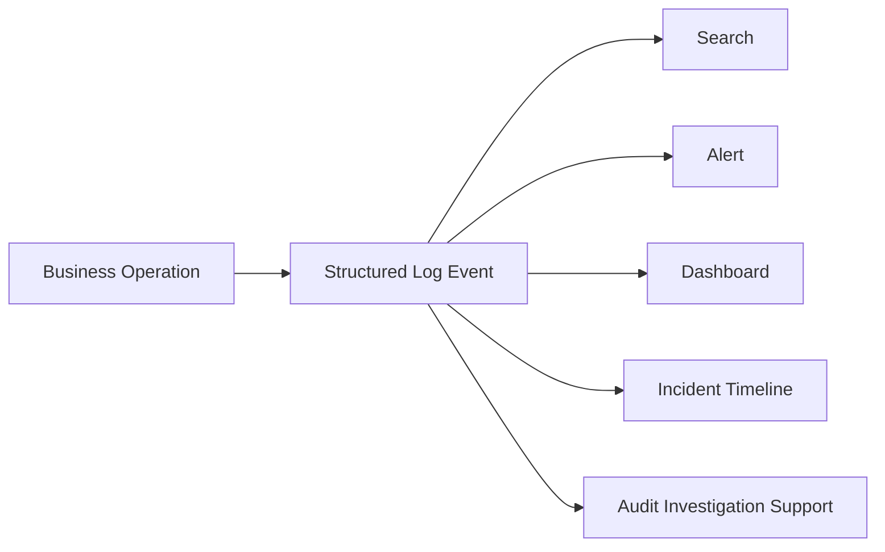
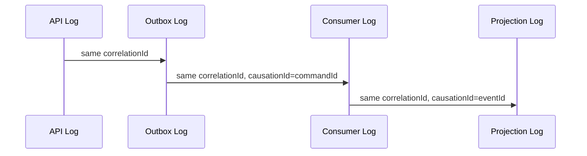
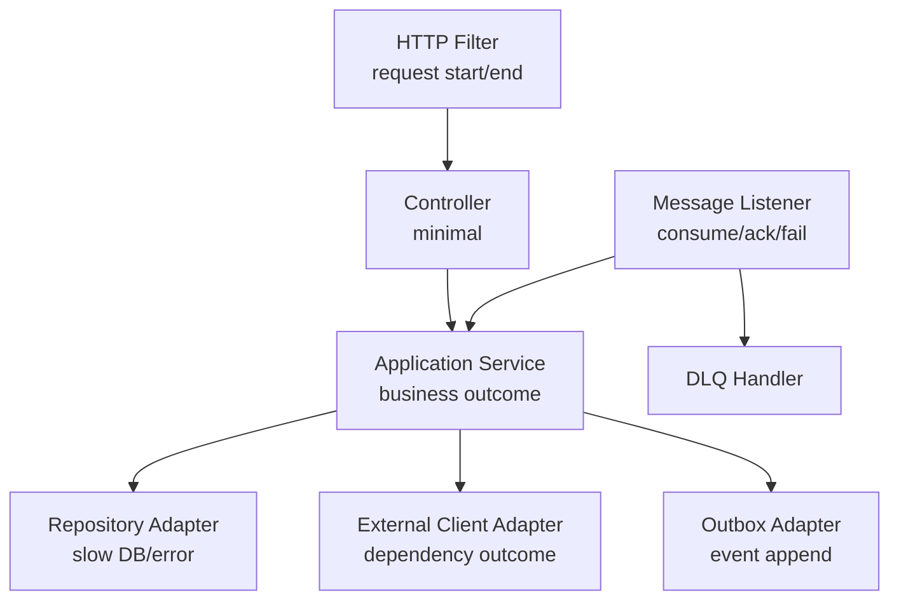
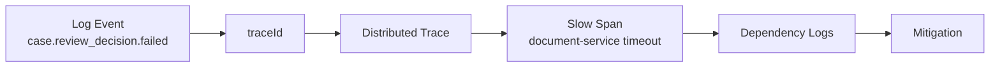

# Part 048 — Structured Logging in Java Microservices

> Log bukan tempat sampah text. Log adalah event stream operasional.
>
> Kalau log tidak punya struktur, tidak punya event name, tidak punya correlation ID, tidak punya boundary semantics, dan tidak punya redaction rule, maka log hanya berguna ketika sistem kecil. Begitu sistem menjadi distributed, log text bebas akan berubah menjadi noise mahal.

Part ini membahas structured logging untuk Java microservices production-grade.

Kita akan fokus pada:

- log sebagai event operasional
- schema log yang stabil
- correlation ID dan MDC
- JSON logging
- event naming
- redaction dan privacy
- security logging
- async/messaging logging
- exception logging
- performance dan cost
- checklist review

---

## 1. Why Structured Logging Exists

Di sistem kecil, log seperti ini masih bisa dibaca:

```text
2026-07-05 10:15:01 INFO Case submitted by user alice for case CASE-123
```

Di microservices, log seperti itu cepat gagal karena:

- sulit query field tertentu
- sulit aggregate per outcome
- sulit join dengan trace
- sulit redaction otomatis
- sulit membedakan event type
- sulit membuat alert berbasis event
- sulit memvalidasi log contract

Structured logging mengubah log menjadi record dengan field eksplisit:

```json
{
  "timestamp": "2026-07-05T10:15:01.123Z",
  "level": "INFO",
  "service": "case-service",
  "environment": "prod-id",
  "version": "1.42.7",
  "event": "case.submission.accepted",
  "traceId": "4bf92f3577b34da6a3ce929d0e0e4736",
  "correlationId": "corr-case-123-submit",
  "requestId": "req-7781",
  "tenantId": "tenant-gov-id",
  "actorType": "user",
  "actorId": "usr-839",
  "caseId": "CASE-123",
  "outcome": "accepted",
  "durationMs": 87
}
```

Sekarang log bisa ditanya:

```text
event = case.submission.accepted AND tenantId = tenant-gov-id AND durationMs > 500
```

Itu perbedaan fundamental.

---

## 2. Log as Operational Event Stream

Jangan melihat log sebagai kalimat. Lihat log sebagai event.

Setiap log record harus menjawab:

- event apa yang terjadi?
- service mana yang mengeluarkan event?
- operasi apa?
- entity apa yang terkena dampak?
- actor/context apa?
- outcome apa?
- apakah event ini normal, degraded, rejected, atau failed?
- bagaimana event ini terkait dengan trace/request/business process?



Structured log bukan pengganti audit trail, tetapi sering menjadi jembatan antara incident diagnosis dan audit investigation.

---

## 3. Log Levels Are Not Enough

Log level hanya severity. Ia bukan event type.

```text
INFO Submit review decision success
INFO Escalate case success
INFO Outbox event published
INFO Projection updated
```

Semua `INFO`, tetapi meaning berbeda.

Gunakan field `event`.

```json
{"level":"INFO","event":"case.review_decision.accepted"}
{"level":"INFO","event":"case.escalation.requested"}
{"level":"INFO","event":"outbox.event.published"}
{"level":"INFO","event":"projection.case_summary.updated"}
```

`level` menjawab “seberapa serius”.

`event` menjawab “apa yang terjadi”.

Keduanya perlu.

---

## 4. Standard Log Schema

Minimal schema untuk Java microservice:

```json
{
  "timestamp": "2026-07-05T10:15:01.123Z",
  "level": "INFO",
  "logger": "id.gov.case.SubmitReviewDecisionHandler",
  "thread": "http-nio-8080-exec-7",
  "service": "case-service",
  "environment": "prod-id",
  "version": "1.42.7",
  "event": "case.review_decision.accepted",
  "traceId": "...",
  "spanId": "...",
  "requestId": "...",
  "correlationId": "...",
  "tenantId": "...",
  "actorType": "user",
  "actorId": "...",
  "operation": "SubmitReviewDecision",
  "entityType": "CaseFile",
  "entityId": "CASE-2026-00017",
  "outcome": "accepted",
  "reasonCode": null,
  "durationMs": 143,
  "message": "Review decision accepted"
}
```

Field taxonomy:

| Category | Fields |
|---|---|
| Runtime | `timestamp`, `level`, `logger`, `thread`, `service`, `environment`, `version` |
| Trace | `traceId`, `spanId`, `requestId`, `correlationId`, `causationId` |
| Security Context | `tenantId`, `actorType`, `actorId`, `clientId` |
| Operation | `event`, `operation`, `outcome`, `reasonCode`, `durationMs` |
| Domain | `entityType`, `entityId`, domain-specific safe IDs |
| Error | `error.type`, `error.message`, `error.code`, `exception.stacktrace` |
| Dependency | `dependency.name`, `dependency.operation`, `dependency.status`, `retryAttempt` |

Jangan semua service membuat schema sendiri. Buat platform logging contract.

---

## 5. Stable Event Naming

Gunakan naming convention yang stabil.

Format praktis:

```text
<domain>.<entity_or_capability>.<action>.<outcome>
```

Contoh:

```text
case.review_decision.accepted
case.review_decision.rejected
case.review_decision.failed
case.escalation.requested
case.escalation.cancelled
workflow.state_transition.completed
outbox.event.published
projection.case_summary.updated
dependency.document_service.timeout
security.permission.denied
```

Rules:

- gunakan lowercase
- gunakan dot-separated
- hindari tense yang ambigu
- hindari free text
- stabilkan nama event sebagai contract
- jangan mengganti event name tanpa migrasi query/dashboard

Event name adalah API untuk operator.

---

## 6. Outcome Taxonomy

Gunakan `outcome` standar.

| Outcome | Meaning |
|---|---|
| `accepted` | command diterima dan side effect dibuat |
| `rejected` | business rule menolak secara expected |
| `failed` | technical failure |
| `timeout` | operasi melewati deadline |
| `cancelled` | operasi dibatalkan |
| `duplicate` | request/event duplicate didedupe |
| `ignored` | event/request valid tetapi tidak relevan/stale |
| `degraded` | operasi berhasil dengan kualitas lebih rendah |
| `unknown` | outcome tidak diketahui dan perlu reconciliation |

Contoh:

```json
{
  "event": "case.review_decision.rejected",
  "operation": "SubmitReviewDecision",
  "outcome": "rejected",
  "reasonCode": "CASE_ALREADY_CLOSED"
}
```

Jangan menaruh business rejection sebagai ERROR.

Business rejection adalah outcome normal jika memang expected path.

---

## 7. Correlation Fields

Structured log tanpa correlation field tetap sulit dipakai.

Minimal:

```json
{
  "traceId": "4bf92f3577b34da6a3ce929d0e0e4736",
  "spanId": "00f067aa0ba902b7",
  "requestId": "req-20260705-7781",
  "correlationId": "corr-case-123-review-7"
}
```

Untuk async:

```json
{
  "eventId": "evt-99ab",
  "correlationId": "corr-case-123-review-7",
  "causationId": "cmd-71d9",
  "producerService": "case-service",
  "consumerService": "workflow-service"
}
```

Correlation membuat log menjadi timeline.



---

## 8. Java Logging Stack

Di Java, kamu biasanya bertemu:

- SLF4J sebagai facade
- Logback atau Log4j2 sebagai implementation
- JUL bridge untuk library lama
- JSON encoder/layout
- MDC/ThreadContext untuk contextual fields
- OpenTelemetry context bridge untuk trace IDs

Common stack:

```text
Application Code
    ↓ SLF4J API
Logging Implementation
    ↓ Logback / Log4j2
JSON Encoder/Layout
    ↓ stdout
Container Runtime
    ↓ log collector/agent
Observability Backend
```

Di container/Kubernetes, praktik umum adalah log ke stdout/stderr dalam JSON, lalu collector mengambilnya. Jangan membuat setiap service menulis file log sendiri kecuali ada requirement spesifik.

---

## 9. MDC: Context Without Passing Every Field

MDC atau Mapped Diagnostic Context menyimpan contextual fields per thread sehingga logger bisa menambahkan field otomatis.

Contoh filter HTTP sederhana:

```java
@Component
public final class RequestContextLoggingFilter extends OncePerRequestFilter {

    @Override
    protected void doFilterInternal(
        HttpServletRequest request,
        HttpServletResponse response,
        FilterChain filterChain
    ) throws ServletException, IOException {

        String requestId = Optional.ofNullable(request.getHeader("X-Request-Id"))
            .filter(id -> !id.isBlank())
            .orElse(UUID.randomUUID().toString());

        String correlationId = Optional.ofNullable(request.getHeader("X-Correlation-Id"))
            .filter(id -> !id.isBlank())
            .orElse(requestId);

        try {
            MDC.put("requestId", requestId);
            MDC.put("correlationId", correlationId);
            MDC.put("http.method", request.getMethod());
            MDC.put("http.route", request.getRequestURI());

            response.setHeader("X-Request-Id", requestId);
            response.setHeader("X-Correlation-Id", correlationId);

            filterChain.doFilter(request, response);
        } finally {
            MDC.clear();
        }
    }
}
```

Poin penting:

- selalu `MDC.clear()` di `finally`
- jangan simpan payload besar
- jangan simpan sensitive data
- hati-hati dengan async/thread switch

---

## 10. MDC and Async Boundary Problem

MDC berbasis thread. Di async/reactive code, context bisa hilang.

Problem:

```java
MDC.put("correlationId", "corr-123");
CompletableFuture.runAsync(() -> {
    log.info("Processing async work"); // correlationId may be missing
});
```

Solusi konseptual:

- capture context sebelum pindah thread
- restore context di worker
- gunakan framework context propagation
- untuk Reactor/WebFlux, gunakan Reactor context atau bridge yang benar
- untuk messaging, ambil context dari message headers

Contoh wrapper sederhana:

```java
public final class MdcAwareExecutor implements Executor {
    private final Executor delegate;

    public MdcAwareExecutor(Executor delegate) {
        this.delegate = delegate;
    }

    @Override
    public void execute(Runnable command) {
        Map<String, String> contextMap = MDC.getCopyOfContextMap();
        delegate.execute(() -> {
            Map<String, String> previous = MDC.getCopyOfContextMap();
            try {
                if (contextMap != null) MDC.setContextMap(contextMap);
                else MDC.clear();
                command.run();
            } finally {
                if (previous != null) MDC.setContextMap(previous);
                else MDC.clear();
            }
        });
    }
}
```

Ini contoh mental model, bukan rekomendasi final untuk semua stack. Platform modern bisa menyediakan context propagation bawaan.

---

## 11. JSON Logging in Spring Boot

Spring Boot modern mendukung structured logging secara langsung untuk beberapa format JSON umum seperti ECS, GELF, dan Logstash.

Contoh konfigurasi konseptual:

```properties
logging.structured.format.console=ecs
spring.application.name=case-service
```

Jika menggunakan Logback encoder custom, biasanya konfigurasi mirip:

```xml
<configuration>
  <appender name="STDOUT" class="ch.qos.logback.core.ConsoleAppender">
    <encoder class="net.logstash.logback.encoder.LogstashEncoder">
      <customFields>{"service":"case-service","environment":"prod-id"}</customFields>
    </encoder>
  </appender>

  <root level="INFO">
    <appender-ref ref="STDOUT" />
  </root>
</configuration>
```

Prinsipnya:

- output JSON satu record per line
- timestamp ISO-8601/UTC
- include service/environment/version
- include MDC fields
- include exception structured
- stdout untuk container

---

## 12. Logging at Architectural Boundaries

Tempat log yang baik:



### HTTP Boundary

Log:

- request accepted/finished
- status
- duration
- route
- request/correlation ID

Jangan log:

- full body
- authorization header
- cookie
- file content

### Application Boundary

Log:

- command started/succeeded/rejected/failed
- business reason code
- important state transition

Jangan log:

- setiap private method
- entire aggregate snapshot

### Adapter Boundary

Log:

- dependency timeout/error
- mapped status
- retry exhausted
- fallback/degraded outcome

Jangan log:

- raw external payload jika sensitif
- token/API key

### Messaging Boundary

Log:

- event consumed
- duplicate ignored
- processing succeeded
- processing failed
- DLQ movement

Jangan log:

- full event payload jika mengandung PII

---

## 13. Request Logging: Start and End

Satu request sebaiknya punya summary log di akhir.

```java
@Component
public final class HttpAccessLogFilter extends OncePerRequestFilter {
    private static final Logger log = LoggerFactory.getLogger(HttpAccessLogFilter.class);

    @Override
    protected void doFilterInternal(
        HttpServletRequest request,
        HttpServletResponse response,
        FilterChain filterChain
    ) throws ServletException, IOException {

        long startNanos = System.nanoTime();
        try {
            filterChain.doFilter(request, response);
        } finally {
            long durationMs = TimeUnit.NANOSECONDS.toMillis(System.nanoTime() - startNanos);

            log.info("http.request.completed method={} uri={} status={} durationMs={}",
                request.getMethod(),
                routeTemplateOrPath(request),
                response.getStatus(),
                durationMs
            );
        }
    }

    private String routeTemplateOrPath(HttpServletRequest request) {
        Object pattern = request.getAttribute(
            "org.springframework.web.servlet.HandlerMapping.bestMatchingPattern"
        );
        return pattern != null ? pattern.toString() : request.getRequestURI();
    }
}
```

Gunakan route template, bukan raw path, agar cardinality tidak meledak.

Lebih baik:

```text
/cases/{caseId}/review-decisions
```

Daripada:

```text
/cases/CASE-2026-00017/review-decisions
```

---

## 14. Business Event Logging

Gunakan helper agar konsisten.

```java
public final class BusinessLogger {
    private static final Logger log = LoggerFactory.getLogger("business-events");

    public void commandAccepted(
        String operation,
        String entityType,
        String entityId,
        Map<String, ?> attributes
    ) {
        log.info("business.command.accepted operation={} entityType={} entityId={} outcome={} attributes={}",
            operation,
            entityType,
            entityId,
            "accepted",
            sanitize(attributes)
        );
    }

    public void commandRejected(
        String operation,
        String entityType,
        String entityId,
        String reasonCode
    ) {
        log.info("business.command.rejected operation={} entityType={} entityId={} outcome={} reasonCode={}",
            operation,
            entityType,
            entityId,
            "rejected",
            reasonCode
        );
    }
}
```

Dalam production, lebih baik gunakan structured arguments/JSON encoder yang benar daripada menaruh `Map.toString()` sebagai string. Contoh ini menunjukkan placement dan semantics.

---

## 15. Exception Logging

Exception logging sering rusak karena dua hal:

1. log exception berkali-kali di banyak layer
2. log exception tanpa context

Rule:

> Tangkap dan log exception di boundary yang bisa memberi context meaningful.

Contoh global exception handler:

```java
@RestControllerAdvice
public final class ApiExceptionHandler {
    private static final Logger log = LoggerFactory.getLogger(ApiExceptionHandler.class);

    @ExceptionHandler(BusinessRuleViolation.class)
    ResponseEntity<ProblemDetail> handleBusinessRule(BusinessRuleViolation ex) {
        log.info("api.request.rejected outcome=rejected reasonCode={} operation={}",
            ex.reasonCode(),
            ex.operation()
        );

        ProblemDetail problem = ProblemDetail.forStatus(HttpStatus.CONFLICT);
        problem.setTitle("Business rule violation");
        problem.setDetail("The requested operation cannot be completed in the current state.");
        problem.setProperty("reasonCode", ex.reasonCode());
        return ResponseEntity.status(HttpStatus.CONFLICT).body(problem);
    }

    @ExceptionHandler(Exception.class)
    ResponseEntity<ProblemDetail> handleUnexpected(Exception ex) {
        log.error("api.request.failed outcome=failed errorType={}",
            ex.getClass().getName(),
            ex
        );

        ProblemDetail problem = ProblemDetail.forStatus(HttpStatus.INTERNAL_SERVER_ERROR);
        problem.setTitle("Internal server error");
        problem.setDetail("The request could not be completed.");
        return ResponseEntity.status(HttpStatus.INTERNAL_SERVER_ERROR).body(problem);
    }
}
```

Jangan:

```java
try {
    service.doWork();
} catch (Exception e) {
    log.error("Error", e);
    throw e;
}
```

Kecuali kamu menambahkan context atau mengubah outcome. Kalau tidak, kamu hanya menduplikasi stacktrace.

---

## 16. Logging External Dependency Calls

External dependency failure harus visible.

```java
public final class DocumentServiceClient {
    private static final Logger log = LoggerFactory.getLogger(DocumentServiceClient.class);
    private final WebClient webClient;

    public DocumentMetadata getMetadata(String documentId) {
        long start = System.nanoTime();
        try {
            DocumentMetadata result = webClient.get()
                .uri("/documents/{id}/metadata", documentId)
                .retrieve()
                .bodyToMono(DocumentMetadata.class)
                .timeout(Duration.ofMillis(300))
                .block();

            log.info("dependency.call.completed dependency=document-service operation=GetDocumentMetadata outcome=success durationMs={}",
                elapsedMs(start)
            );
            return result;
        } catch (TimeoutException ex) {
            log.warn("dependency.call.timeout dependency=document-service operation=GetDocumentMetadata outcome=timeout durationMs={}",
                elapsedMs(start),
                ex
            );
            throw new DependencyTimeout("document-service", ex);
        } catch (WebClientResponseException ex) {
            log.warn("dependency.call.failed dependency=document-service operation=GetDocumentMetadata outcome=failed status={} durationMs={}",
                ex.getStatusCode().value(),
                elapsedMs(start),
                ex
            );
            throw mapDependencyError(ex);
        }
    }

    private long elapsedMs(long startNanos) {
        return TimeUnit.NANOSECONDS.toMillis(System.nanoTime() - startNanos);
    }
}
```

Catatan:

- jangan log `documentId` jika sensitif, atau hash/tokenize sesuai policy
- dependency log harus punya dependency name dan operation
- log timeout/retry/fallback di adapter boundary

---

## 17. Logging Async Consumer

Consumer log harus mencakup lifecycle message.

```java
public final class CaseEventConsumer {
    private static final Logger log = LoggerFactory.getLogger(CaseEventConsumer.class);
    private final Inbox inbox;
    private final CaseProjectionHandler handler;

    public void onMessage(CaseEventEnvelope envelope) {
        try (MdcScope ignored = MdcScope.fromEnvelope(envelope)) {
            log.info("message.consume.started eventType={} eventId={} eventVersion={} producerService={}",
                envelope.eventType(),
                envelope.eventId(),
                envelope.eventVersion(),
                envelope.producerService()
            );

            if (inbox.alreadyProcessed(envelope.eventId())) {
                log.info("message.consume.duplicate eventType={} eventId={} outcome=duplicate",
                    envelope.eventType(),
                    envelope.eventId()
                );
                return;
            }

            handler.handle(envelope);
            inbox.markProcessed(envelope.eventId());

            log.info("message.consume.completed eventType={} eventId={} outcome=success",
                envelope.eventType(),
                envelope.eventId()
            );
        } catch (Exception ex) {
            log.error("message.consume.failed eventType={} eventId={} outcome=failed",
                envelope.eventType(),
                envelope.eventId(),
                ex
            );
            throw ex;
        }
    }
}
```

Untuk Kafka, tambahkan jika aman:

- topic
- partition
- offset
- consumer group
- retry attempt

---

## 18. Redaction and Sensitive Data

Logging paling berbahaya ketika terlalu mudah.

Jangan pernah log:

- password
- API key
- bearer token
- session cookie
- private key
- full authorization header
- national ID / NIK / SSN
- raw medical/legal sensitive record
- raw evidence content
- payment card data
- full address jika tidak perlu
- free-form user notes yang bisa mengandung PII

Gunakan safe domain IDs:

```json
{
  "caseId": "CASE-2026-00017",
  "decisionId": "DEC-991",
  "actorId": "usr-839"
}
```

Bukan:

```json
{
  "citizenName": "...",
  "nationalId": "...",
  "fullReviewNotes": "..."
}
```

### Redaction Strategy

```java
public final class LogSanitizer {
    private static final Set<String> BLOCKED_KEYS = Set.of(
        "password", "token", "authorization", "cookie", "secret", "nationalId"
    );

    public Map<String, Object> sanitize(Map<String, ?> input) {
        Map<String, Object> out = new LinkedHashMap<>();
        input.forEach((key, value) -> {
            if (BLOCKED_KEYS.contains(key.toLowerCase(Locale.ROOT))) {
                out.put(key, "[REDACTED]");
            } else {
                out.put(key, value);
            }
        });
        return out;
    }
}
```

Real system butuh policy lebih matang:

- classification metadata
- allowlist, bukan hanya blocklist
- serialization guard
- automated scanning
- CI test untuk log leak
- review saat menambah field baru

---

## 19. Log Injection Defense

Log injection terjadi ketika input user mengandung newline/control character sehingga memalsukan record log.

Contoh input jahat:

```text
CASE-123\n{"level":"INFO","event":"security.login.success","actorId":"admin"}
```

Defense:

- structured JSON encoder, bukan string concatenation manual
- escape control character
- limit length
- sanitize untrusted field
- jangan log raw header/body

Jangan:

```java
log.info("User supplied case id: " + request.caseId());
```

Lebih baik:

```java
log.info("case.lookup.requested caseId={}", SafeLog.value(request.caseId()));
```

Dengan `SafeLog.value()` melakukan validation/length cap/escaping jika diperlukan.

---

## 20. Security Logging

Security event perlu log khusus.

Contoh event:

- login failure
- permission denied
- token validation failure
- tenant boundary violation
- suspicious object access
- privilege escalation attempt
- secret access/rotation
- admin action
- mass export
- policy override

Schema:

```json
{
  "event": "security.permission.denied",
  "level": "WARN",
  "service": "case-service",
  "tenantId": "tenant-gov-id",
  "actorType": "user",
  "actorId": "usr-839",
  "operation": "SubmitReviewDecision",
  "entityType": "CaseFile",
  "entityId": "CASE-2026-00017",
  "reasonCode": "MISSING_CASE_REVIEW_PERMISSION",
  "sourceIpHash": "iphash-abc",
  "traceId": "4bf92f..."
}
```

Catatan:

- jangan log token
- IP mungkin perlu hashing/anonymization sesuai privacy policy
- actor email biasanya tidak perlu
- security logs perlu retention dan access control berbeda

---

## 21. Log Sampling

Tidak semua log harus disimpan penuh.

Tetapi sampling harus hati-hati.

Boleh sampling:

- high-volume success access logs
- repetitive dependency success logs
- low-value debug events

Jangan sampling sembarangan:

- ERROR logs
- security events
- audit-adjacent business decisions
- unknown outcome
- DLQ movement
- reconciliation failure
- privacy/security violations

Strategy:

```text
success hot path: sampled
business rejection: full or bounded by policy
technical error: full
security event: full
rare state transition: full
debug detail: disabled by default
```

---

## 22. Log Cost and Cardinality

Structured logging bisa mahal jika tidak disiplin.

Cost driver:

- log volume
- payload size
- high-cardinality fields indexed
- retention duration
- duplicate stacktrace
- noisy success logs
- debug enabled in prod

Practical rules:

- log one summary per request, not 20
- log one summary per command outcome
- log dependency errors, not every success in hot path unless sampled
- keep field values bounded
- avoid raw payload
- use metrics for rates, logs for details
- define retention by category

Example:

| Log Category | Retention | Indexed Fields |
|---|---:|---|
| access logs | 7-14 days | service, route, status, traceId |
| business outcome | 30-90 days | event, operation, entityId, outcome |
| security logs | policy-based | actorId, tenantId, event, reasonCode |
| debug logs | hours-days | traceId only |
| audit trail | separate store | not ordinary log retention |

---

## 23. Logging and Trace Integration

Logs should include trace IDs.

When using OpenTelemetry, trace context can be injected into log records. That enables navigation:

```text
log record -> trace -> related spans -> related logs
```

Ideal flow:



If logs do not include trace IDs, engineer must approximate by timestamp and service name. That is fragile.

---

## 24. Logging and Metrics Integration

Not every log needs a metric, but important event types often should increment a metric.

Example:

```java
businessLogger.commandRejected("SubmitReviewDecision", "CaseFile", caseId, reasonCode);
metrics.counter("case_command_total",
    Tags.of(
        "command", "SubmitReviewDecision",
        "outcome", "rejected",
        "reason", reasonCode
    )
).increment();
```

Log gives details.

Metric gives rate/trend.

Do not query logs to calculate every critical metric at incident time if the metric should have existed already.

---

## 25. Logging State Transitions

For workflow/domain lifecycle, state transition logs are high value.

```java
public void logStateTransition(
    String aggregateType,
    String aggregateId,
    String from,
    String to,
    String trigger,
    String reasonCode
) {
    log.info("domain.state_transition aggregateType={} aggregateId={} fromState={} toState={} trigger={} reasonCode={}",
        aggregateType,
        aggregateId,
        from,
        to,
        trigger,
        reasonCode
    );
}
```

Structured JSON output:

```json
{
  "event": "domain.state_transition",
  "aggregateType": "CaseFile",
  "aggregateId": "CASE-2026-00017",
  "fromState": "EVIDENCE_SUBMITTED",
  "toState": "UNDER_REVIEW",
  "trigger": "SubmitForReview",
  "reasonCode": "VALID_EVIDENCE_PACKAGE"
}
```

State transition logs membantu:

- incident timeline
- stuck workflow diagnosis
- SLA analysis
- audit investigation support
- regression detection

Tetapi audit-grade event tetap sebaiknya disimpan di audit/event store yang sesuai.

---

## 26. Logging Idempotency

Idempotency harus observable.

```json
{
  "event": "command.idempotency.duplicate_detected",
  "operation": "SubmitReviewDecision",
  "commandId": "cmd-71d9",
  "requestHashMatched": true,
  "outcome": "duplicate",
  "replayedResponse": true
}
```

Useful fields:

- commandId/idempotencyKey
- request hash matched/tidak
- original outcome
- replayed response
- conflict reason

Jika duplicate tidak terlihat, retry behavior sulit dibedakan dari double submission bug.

---

## 27. Logging Unknown Outcome

Unknown outcome adalah kondisi penting.

Contoh:

- request ke payment provider timeout setelah provider mungkin memproses transaksi
- command ke external registry timeout setelah registry mungkin menerima update
- DB commit sukses tetapi response ke caller gagal

Log harus eksplisit:

```json
{
  "event": "dependency.call.unknown_outcome",
  "level": "ERROR",
  "dependency": "external-registry",
  "operation": "RegisterEnforcementDecision",
  "externalRequestId": "ext-7721",
  "outcome": "unknown",
  "reconciliationRequired": true
}
```

Unknown outcome bukan sekadar timeout. Ia adalah state bisnis yang membutuhkan reconciliation.

---

## 28. Logging Configuration and Startup

Startup log sering diremehkan.

Service harus mencatat:

- service name
- version
- git commit/build id
- environment
- active profile
- critical config summary
- enabled feature flags
- dependency endpoint names, bukan secret values
- migration version

Contoh:

```json
{
  "event": "service.startup.completed",
  "service": "case-service",
  "version": "1.42.7",
  "gitCommit": "a1b2c3d",
  "environment": "prod-id",
  "profiles": ["prod"],
  "databaseMigrationVersion": "2026070501",
  "featureFlags": {
    "newEscalationPolicy": true
  }
}
```

Jangan log:

- database password
- token
- secret key
- full connection string jika mengandung credential

---

## 29. Logging Degraded Mode

Degradation harus terlihat.

```json
{
  "event": "case.summary.degraded_response",
  "level": "WARN",
  "operation": "GetCaseSummary",
  "outcome": "degraded",
  "degradationReason": "DOCUMENT_SERVICE_TIMEOUT",
  "missingFragment": "latestDocumentMetadata",
  "servedFromCache": true,
  "cacheAgeSeconds": 42
}
```

Kalau degraded response dicatat sebagai success biasa, SLO dan user experience akan berbohong.

---

## 30. Testing Logging Behavior

Logging contract bisa dites.

Tes tidak perlu mengecek semua text, tetapi bisa mengecek event penting.

```java
@Test
void logsBusinessRejectionWithReasonCode() {
    SubmitReviewDecisionCommand command = commandForClosedCase();

    handler.handle(command);

    assertThat(logEvents)
        .anySatisfy(event -> {
            assertThat(event.field("event")).isEqualTo("case.review_decision.rejected");
            assertThat(event.field("reasonCode")).isEqualTo("CASE_ALREADY_CLOSED");
            assertThat(event.field("caseId")).isEqualTo(command.caseId());
        });
}
```

Test cases:

- success command emits expected event
- business rejection logs reason code
- technical failure logs error type
- duplicate command logs duplicate outcome
- sensitive field is redacted
- async consumer preserves correlation ID

---

## 31. Common Anti-Patterns

### 1. String-Only Logs

```text
Case submitted successfully
```

Tidak ada field. Tidak bisa di-query dengan baik.

### 2. Payload Dumping

```java
log.info("Request body: {}", request);
```

Berisiko PII/security leak.

### 3. Double Exception Logging

Exception sama dilog di repository, service, controller, dan filter.

Akibat:

- noise
- false incident magnitude
- biaya tinggi

### 4. Missing Correlation

Log bagus tapi tidak bisa dikaitkan antar service.

### 5. Dynamic Event Name

```text
case.CASE-123.accepted
```

Event name jadi high cardinality dan tidak stabil.

### 6. Business Rejection as ERROR

Expected rejection memenuhi log ERROR, alert noise.

### 7. Secret in Startup Log

Config dump mencetak credential.

### 8. Framework Leakage

Domain object memanggil logger framework langsung dan mencampur concern.

### 9. Log-Driven Metrics Only

Semua metric dihitung dari logs secara ad-hoc. Saat incident, query lambat dan tidak reliable.

### 10. No Retention Policy

Log disimpan terlalu lama tanpa alasan, atau terlalu cepat hilang saat dibutuhkan.

---

## 32. Production Logging Checklist

### Schema

- [ ] Semua log JSON/machine-readable.
- [ ] Ada stable `event` field.
- [ ] Ada `service`, `environment`, `version`.
- [ ] Ada `traceId` dan `spanId` jika tersedia.
- [ ] Ada `requestId`/`correlationId`.
- [ ] Ada `operation`, `outcome`, `reasonCode` untuk business event.

### Context

- [ ] HTTP request context masuk MDC.
- [ ] Async/thread context tidak hilang.
- [ ] Messaging header membawa correlation/causation ID.
- [ ] Logs bisa dicari by safe business ID.

### Security/Privacy

- [ ] Authorization header tidak pernah dilog.
- [ ] Token/secret/password direduksi.
- [ ] PII tidak dilog tanpa policy eksplisit.
- [ ] Free-text user input tidak dilog mentah.
- [ ] Log injection dicegah.

### Severity

- [ ] Business rejection bukan ERROR.
- [ ] Technical failure diberi ERROR.
- [ ] Degraded fallback diberi WARN atau explicit outcome.
- [ ] Security denied/suspicious event sesuai severity policy.

### Volume/Cost

- [ ] Hot-path success log tidak noisy.
- [ ] Debug off di production by default.
- [ ] Stacktrace tidak duplicate.
- [ ] Retention per category jelas.
- [ ] Indexed fields dikontrol.

### Operations

- [ ] Startup log mencatat version/config summary aman.
- [ ] Dependency failure logs punya dependency/operation/outcome.
- [ ] Consumer logs punya eventId/eventType/attempt/outcome.
- [ ] Unknown outcome logs memicu reconciliation path.
- [ ] Degraded mode logs terlihat di dashboard/alert.

---

## 33. Suggested Log Events for Case Management Service

| Event | Level | When |
|---|---|---|
| `service.startup.completed` | INFO | service ready/startup completed |
| `http.request.completed` | INFO | setiap request selesai, bisa sampled |
| `case.review_decision.accepted` | INFO | review decision diterima |
| `case.review_decision.rejected` | INFO | business rejection |
| `case.review_decision.failed` | ERROR | technical failure |
| `case.state_transition` | INFO | state berubah |
| `command.idempotency.duplicate_detected` | INFO | duplicate request didedupe |
| `outbox.event.appended` | INFO | event masuk outbox |
| `outbox.event.published` | INFO | event berhasil publish |
| `message.consume.started` | DEBUG/INFO | consumer mulai memproses |
| `message.consume.completed` | INFO | consumer sukses |
| `message.consume.duplicate` | INFO | duplicate event diabaikan |
| `message.consume.failed` | ERROR | consumer gagal |
| `message.dlq.moved` | ERROR | event masuk DLQ |
| `dependency.call.timeout` | WARN/ERROR | dependency timeout |
| `dependency.call.unknown_outcome` | ERROR | outcome tidak diketahui |
| `security.permission.denied` | WARN | akses ditolak |
| `response.degraded` | WARN | response degraded |

---

## 34. A Minimal Logging Policy

Gunakan policy ini sebagai baseline.

```md
# Logging Policy

## Format
All production logs must be structured JSON written to stdout.

## Required Fields
- timestamp
- level
- service
- environment
- version
- event
- traceId if available
- correlationId/requestId if available
- operation if applicable
- outcome if applicable

## Prohibited Fields
- password
- token
- secret
- authorization header
- cookie
- private key
- raw PII
- raw evidence content
- full request/response body by default

## Event Naming
Use `<domain>.<capability>.<action>.<outcome>` or approved platform event names.

## Severity
Business rejection is not an error unless caused by system malfunction.

## Retention
Access logs, business logs, security logs, and debug logs use separate retention policies.

## Review
New log fields touching user, tenant, legal, financial, security, or sensitive domain data require review.
```

---

## 35. Mental Model Summary

Structured logging adalah disiplin membuat log menjadi event stream yang bisa dipakai oleh manusia dan mesin.

Log yang baik:

- punya event name stabil
- punya schema konsisten
- punya correlation context
- punya outcome yang jelas
- punya domain context aman
- punya error taxonomy
- punya redaction policy
- tidak noisy
- bisa dihubungkan ke metrics dan traces
- bisa dipakai saat incident tanpa menebak

Log yang buruk:

- hanya text
- tidak punya correlation
- membocorkan data
- terlalu banyak
- menandai expected rejection sebagai error
- tidak bisa dibedakan event type-nya
- tidak bisa dipakai untuk timeline

Dalam Java microservices, structured logging bukan fitur tambahan. Ia adalah bagian dari architecture contract.

---

## 36. Exercises

### Exercise 1 — Design a Log Schema

Untuk command:

```text
ReopenCase
```

Tentukan structured log schema untuk:

- success
- business rejection
- technical failure
- duplicate command
- degraded dependency path

### Exercise 2 — Identify Sensitive Fields

Payload:

```json
{
  "caseId": "CASE-2026-00017",
  "citizenName": "...",
  "nationalId": "...",
  "reviewNotes": "...",
  "decisionId": "DEC-991",
  "actorId": "usr-839"
}
```

Tentukan field mana yang boleh masuk log, mana yang harus direduksi, dan mana yang harus disimpan hanya di audit/evidence store.

### Exercise 3 — Async Correlation

Rancang header metadata untuk event:

```text
CaseReviewDecisionSubmitted
```

Harus mencakup:

- eventId
- eventType
- eventVersion
- correlationId
- causationId
- trace context
- producer service
- tenant context

### Exercise 4 — Production Log Review

Ambil satu service yang pernah kamu bangun. Jawab:

- apakah log-nya JSON?
- apakah ada event name stabil?
- apakah correlation ID selalu ada?
- apakah exception dilog berulang?
- apakah business rejection jadi ERROR?
- apakah ada raw payload/PII?
- apakah log bisa menjawab incident timeline?

---

## 37. Key Takeaways

- Structured logging mengubah log dari text menjadi event stream operasional.
- `level` bukan pengganti `event`.
- Log schema adalah contract lintas service dan platform.
- Correlation ID, trace ID, command ID, event ID, dan business ID punya fungsi berbeda.
- MDC membantu context propagation, tetapi perlu perhatian di async/reactive boundary.
- Jangan log raw payload, secret, token, atau PII tanpa policy eksplisit.
- Business rejection bukan technical error.
- Unknown outcome harus terlihat dan memicu reconciliation.
- Logging harus ditempatkan di architectural boundary, bukan disebar random.
- Production-grade logging harus bisa diuji, direview, dan dikontrol biayanya.

