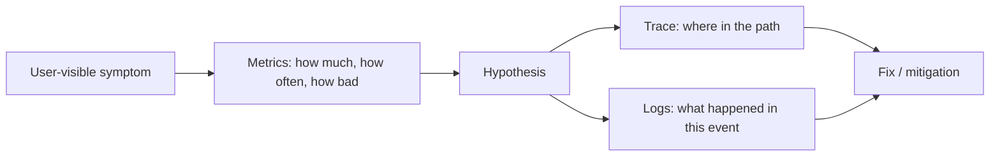
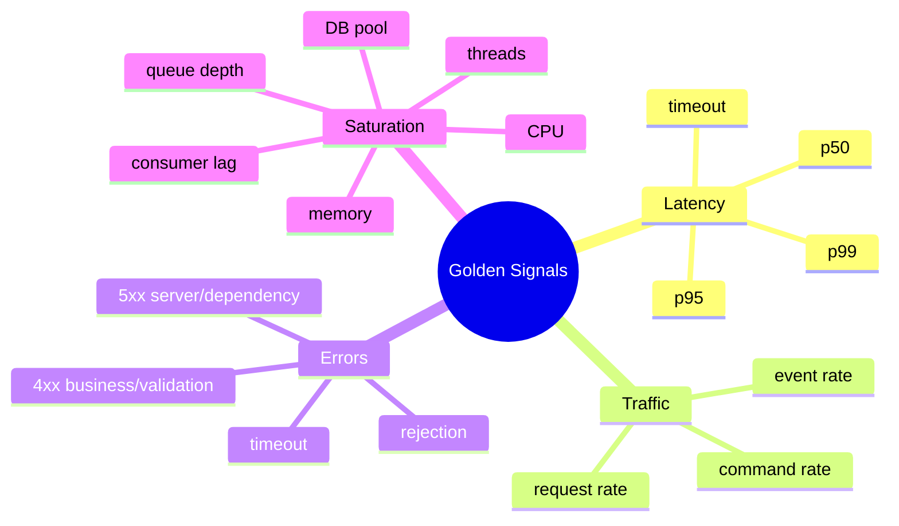
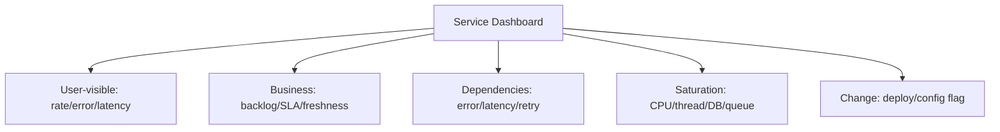
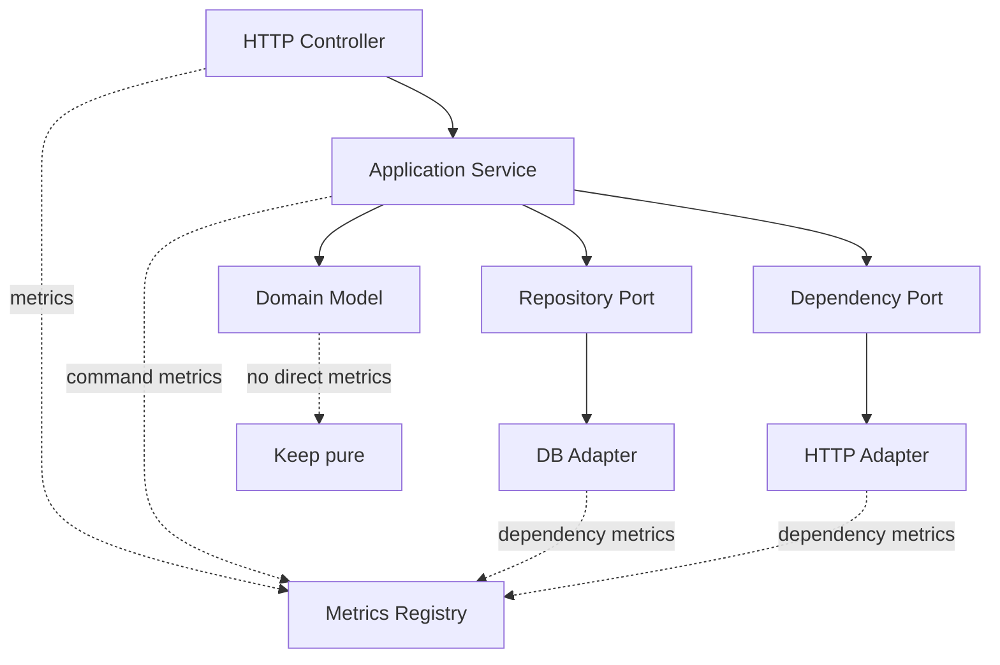

# Part 049 — Metrics That Matter

> Metrics bukan angka sebanyak mungkin.
>
> Metrics adalah bahasa ringkas untuk menjawab: service sehat atau tidak, user terdampak atau tidak, dependency mana yang rusak, kapasitas habis atau tidak, dan apakah sistem sedang menuju incident.

Part sebelumnya membahas structured logging. Log berguna untuk menjelaskan **kejadian individual**. Metrics berguna untuk melihat **pola agregat**.

Di microservices, metrics yang buruk akan membuat tim tahu terlalu lambat. Metrics yang terlalu banyak akan membuat tim tidak tahu apa-apa karena semua terlihat penting.

Part ini membahas cara memilih, mendesain, menginstrumentasi, dan memakai metrics untuk Java microservices production-grade.

Kita akan fokus pada:

- mental model metrics sebagai signal, bukan dekorasi dashboard
- golden signals
- RED method
- USE method
- business metrics
- latency percentile dan histogram
- saturation dan queue metrics
- dependency metrics
- async/messaging metrics
- JVM metrics
- cardinality discipline
- SLO-oriented metrics
- dashboard dan alerting yang tidak noisy
- Java instrumentation dengan Micrometer/OpenTelemetry-style API
- checklist review

---

## 1. Core Mental Model

Metrics menjawab pertanyaan agregat.

Contoh:

- berapa banyak request masuk per detik?
- berapa persen request gagal?
- berapa latency p95/p99?
- apakah thread pool mulai penuh?
- apakah queue menumpuk?
- apakah consumer tertinggal?
- apakah dependency downstream lambat?
- apakah command bisnis gagal meningkat?
- apakah SLO sedang terbakar?

Metrics tidak menjawab dengan baik:

- apa isi request tertentu?
- user mana yang terkena?
- urutan event satu kasus tertentu?
- kenapa satu trace lambat?

Itu tugas log dan trace.



Prinsipnya:

> Metrics memberi tahu **bahwa ada masalah** dan **seberapa besar masalahnya**. Trace/log membantu membuktikan **di mana** dan **mengapa**.

---

## 2. Metrics yang Matter Harus Punya Consumer

Sebelum membuat metric, tanya:

1. Siapa yang memakai metric ini?
2. Keputusan apa yang dibuat dari metric ini?
3. Apakah metric ini untuk alert, dashboard, capacity planning, debugging, audit, atau product insight?
4. Apa threshold atau pola abnormalnya?
5. Apa aksi ketika metric berubah?

Kalau tidak ada aksi, metric kemungkinan hanya noise.

### 2.1 Metric tanpa decision adalah vanity metric

Contoh metric lemah:

```text
case_service_total_objects_loaded
```

Masalah:

- tidak jelas normalnya berapa
- tidak jelas apakah user terdampak
- tidak jelas siapa owner
- tidak jelas dipakai untuk apa

Metric lebih berguna:

```text
case_command_duration_seconds
case_command_total{command="submit_case", outcome="success|validation_error|conflict|dependency_error|server_error"}
case_submission_backlog_count
case_submission_slo_burn_rate
```

Kenapa lebih baik:

- terkait use case
- punya outcome
- bisa dibuat SLO
- bisa memandu incident response
- bisa dilihat per command bisnis

---

## 3. Golden Signals

Untuk service user-facing, empat signal paling penting:

1. **Latency** — seberapa lama request/proses selesai.
2. **Traffic** — seberapa banyak demand masuk.
3. **Errors** — seberapa banyak request/proses gagal.
4. **Saturation** — seberapa dekat sistem ke batas kapasitas.



Gunakan ini sebagai baseline untuk semua service.

### 3.1 Latency

Latency harus dibaca sebagai distribusi, bukan rata-rata.

Average latency menyembunyikan tail latency.

Contoh:

```text
100 request:
- 95 request selesai 80 ms
- 5 request selesai 5 detik

Average mungkin terlihat masih lumayan.
User yang terkena 5 request lambat tetap mengalami masalah serius.
```

Yang perlu dipantau:

- p50: pengalaman umum
- p90/p95: pengalaman buruk yang mulai banyak
- p99/p99.9: tail latency dan outlier operasional
- timeout count: request yang melewati batas useful
- queue wait time: waktu sebelum request benar-benar diproses

### 3.2 Traffic

Traffic bukan hanya HTTP request per second.

Untuk microservices, traffic bisa berupa:

- request rate
- command rate
- query rate
- event consume rate
- event publish rate
- workflow transition rate
- scheduled job execution rate
- DB transaction rate
- external dependency call rate

Traffic menjawab: demand naik atau turun?

### 3.3 Errors

Error harus diklasifikasi.

Jangan hanya punya:

```text
http_server_errors_total
```

Lebih baik:

```text
case_command_total{command="submit_case", outcome="success"}
case_command_total{command="submit_case", outcome="validation_error"}
case_command_total{command="submit_case", outcome="conflict"}
case_command_total{command="submit_case", outcome="dependency_timeout"}
case_command_total{command="submit_case", outcome="server_error"}
```

Kenapa?

Karena `validation_error` bukan incident yang sama dengan `dependency_timeout`.

### 3.4 Saturation

Saturation adalah signal sebelum user-visible failure.

Contoh saturation:

- CPU mendekati limit
- heap pressure naik
- GC pause meningkat
- thread pool queue penuh
- DB connection pool hampir habis
- HTTP client connection pool penuh
- Kafka consumer lag naik
- executor rejection naik
- rate limiter rejection naik
- queue age meningkat

Saturation sering lebih berguna untuk mitigasi dini daripada error rate.

---

## 4. RED Method untuk Service

RED cocok untuk request/operation oriented service:

- **Rate** — jumlah request/operation per second
- **Errors** — jumlah/rasio error
- **Duration** — durasi request/operation

Untuk Java microservice, RED harus diterapkan pada beberapa surface:

1. inbound HTTP/RPC
2. application command/query
3. outbound dependency
4. message consumer
5. scheduled job
6. workflow step

```mermaid
flowchart TD
  Client --> API["Inbound API RED"]
  API --> App["Command/Query RED"]
  App --> DB["DB dependency RED"]
  App --> External["External dependency RED"]
  App --> Broker["Message publish RED"]
  Broker --> Consumer["Message consume RED"]
```



### 4.1 Inbound API RED

Minimal:

```text
http.server.requests.count
http.server.requests.duration
http.server.requests.errors
```

Dimensi aman:

```text
method
route/template
status_class
exception_group
service
```

Hindari:

```text
uri="/cases/CASE-123456"
user_id="..."
case_id="..."
raw_error_message="..."
```

Itu cardinality bomb.

### 4.2 Application command RED

Inbound HTTP tidak cukup. Service bisa punya banyak endpoint yang memanggil use case sama, atau satu endpoint yang menjalankan command bisnis berbeda.

Tambahkan metric di application layer:

```text
application.command.duration{command="submit_case", outcome="success"}
application.command.total{command="submit_case", outcome="conflict"}
```

Ini lebih dekat ke business behavior.

### 4.3 Outbound dependency RED

Setiap dependency penting harus punya metric:

```text
dependency.client.duration{dependency="party-service", operation="get-party", outcome="success"}
dependency.client.total{dependency="party-service", operation="get-party", outcome="timeout"}
```

Manfaat:

- membedakan service sendiri lambat vs dependency lambat
- melihat downstream error rate
- mengukur retry amplification
- menilai dependency SLO

### 4.4 Message consumer RED

Untuk async system:

```text
message.consumer.duration{topic="case-events", handler="CaseSubmittedHandler", outcome="success"}
message.consumer.total{topic="case-events", handler="CaseSubmittedHandler", outcome="retryable_error"}
message.consumer.lag{topic="case-events", consumer_group="risk-projection"}
message.consumer.oldest_message_age_seconds{topic="case-events", consumer_group="risk-projection"}
```

Lag saja tidak cukup. Oldest message age sering lebih dekat ke user impact.

---

## 5. USE Method untuk Resource

USE cocok untuk resource:

- **Utilization** — seberapa sibuk resource
- **Saturation** — seberapa banyak kerja menunggu resource
- **Errors** — error dari resource

Gunakan USE untuk:

- CPU
- memory
- disk
- network
- JVM thread pool
- DB connection pool
- HTTP connection pool
- message consumer executor
- queue
- object store client

Contoh DB pool:

```text
db.pool.active_connections
db.pool.idle_connections
db.pool.pending_threads
db.pool.timeout_total
```

Interpretasi:

- active tinggi, pending tinggi, timeout naik → pool saturation
- active rendah, query latency tinggi → DB/server/network problem, bukan pool exhaustion
- pending naik saat dependency lambat → downstream latency menghabiskan thread

---

## 6. Metric Taxonomy untuk Java Microservice

Service production-grade minimal punya metric kategori berikut.

### 6.1 API metrics

```text
http_server_request_duration_seconds
http_server_requests_total
http_server_request_size_bytes
http_server_response_size_bytes
http_server_active_requests
```

Dimensi:

- route
- method
- status class
- outcome

### 6.2 Application use-case metrics

```text
application_command_total
application_command_duration_seconds
application_query_total
application_query_duration_seconds
business_rule_evaluation_total
```

Dimensi:

- command/query name
- outcome
- rule group jika cardinality stabil

### 6.3 Dependency metrics

```text
http_client_request_duration_seconds
http_client_requests_total
grpc_client_duration_seconds
db_query_duration_seconds
external_call_timeout_total
external_call_retry_total
```

Dimensi:

- dependency name
- operation name
- outcome
- status class

### 6.4 Messaging metrics

```text
message_published_total
message_publish_duration_seconds
message_consumed_total
message_consume_duration_seconds
message_retry_total
message_dead_letter_total
message_lag
message_oldest_age_seconds
```

Dimensi:

- broker
- topic/queue
- consumer group
- event type
- handler
- outcome

### 6.5 Reliability control metrics

```text
circuit_breaker_state
circuit_breaker_calls_total
rate_limiter_rejected_total
bulkhead_rejected_total
retry_attempts_total
fallback_total
load_shed_total
```

Dimensi:

- protected dependency
- policy name
- outcome

### 6.6 JVM/runtime metrics

```text
jvm_memory_used_bytes
jvm_gc_pause_seconds
jvm_threads_live
process_cpu_usage
system_cpu_usage
executor_active_threads
executor_queue_size
executor_completed_tasks_total
```

JVM metrics bukan tujuan akhir. Ia dipakai untuk menjelaskan saturation dan performance symptoms.

### 6.7 Business metrics

```text
case_submitted_total
case_escalated_total
case_decision_completed_total
case_sla_breach_total
case_pending_review_count
case_oldest_pending_review_age_seconds
```

Business metrics membantu menjawab:

- apakah sistem memenuhi outcome bisnis?
- apakah backlog operasional naik?
- apakah SLA bisnis terancam?
- apakah workflow macet walau HTTP 200 terlihat sehat?

---

## 7. Latency: Jangan Percaya Average

Latency harus direkam sebagai histogram/timer, bukan hanya sum/count average.

### 7.1 Mean hides pain

Jika 99 request cepat dan 1 request sangat lambat, average terlihat normal. Tetapi p99 menunjukkan pain.

### 7.2 Percentile yang perlu dilihat

- p50: baseline umum
- p90: mulai terlihat degradation
- p95: pengalaman buruk signifikan
- p99: tail latency, incident diagnosis
- max: berguna untuk debugging, tetapi noisy untuk alert

### 7.3 Alert pada percentile harus hati-hati

p99 alert pada traffic rendah bisa noisy.

Lebih baik gabungkan:

```text
p95 latency > threshold
AND request rate > minimum traffic
AND duration > window tertentu
```

atau pakai SLO burn rate.

### 7.4 Bucket histogram harus sesuai SLO

Jika SLO endpoint adalah 300 ms, bucket histogram harus punya bucket sekitar:

```text
50ms, 100ms, 200ms, 300ms, 500ms, 1s, 2s, 5s
```

Bucket yang buruk membuat SLO sulit dihitung.

---

## 8. Error Metrics: Outcome Lebih Baik daripada Exception Name

Exception class terlalu teknis untuk metric utama.

Buruk:

```text
errors_total{exception="NullPointerException"}
```

Lebih baik:

```text
case_command_total{command="approve_case", outcome="business_rejected"}
case_command_total{command="approve_case", outcome="conflict"}
case_command_total{command="approve_case", outcome="dependency_timeout"}
case_command_total{command="approve_case", outcome="server_error"}
```

Exception detail tetap masuk log/trace.

Metric outcome harus stabil.

### 8.1 Error taxonomy praktis

Gunakan taxonomy seperti:

| Outcome | Meaning | Alert? |
|---|---|---:|
| `success` | selesai sesuai kontrak | no |
| `validation_error` | input tidak valid | usually no |
| `business_rejected` | rule bisnis menolak | no, kecuali spike |
| `conflict` | version/state conflict | depends |
| `not_found` | resource tidak ditemukan | depends |
| `dependency_timeout` | dependency tidak merespons tepat waktu | yes jika spike |
| `dependency_error` | dependency gagal | yes |
| `rate_limited` | sengaja ditolak karena policy | maybe |
| `load_shed` | sengaja ditolak karena overload | yes |
| `server_error` | bug/unexpected failure | yes |

---

## 9. Saturation Metrics: Signal Sebelum Error

Saturation adalah salah satu signal paling sering diabaikan.

Service bisa masih return 200, tetapi sudah menuju collapse.

Contoh:

```text
http_server_active_requests naik
executor_queue_size naik
db_pool_pending_threads naik
http_client_pool_pending_acquire naik
message_oldest_age_seconds naik
```

Ini tanda bottleneck.

### 9.1 Queue size tidak cukup

Queue size 10 mungkin aman jika processing time 5 ms, tapi bahaya jika processing time 30 detik.

Tambahkan:

```text
queue_depth
oldest_item_age_seconds
enqueue_rate
dequeue_rate
processing_duration
```

### 9.2 Consumer lag tidak cukup

Consumer lag 10.000 mungkin aman jika throughput 20.000/s. Lag 100 bisa bahaya jika tiap message butuh 5 menit.

Tambahkan:

```text
consumer_lag
oldest_unprocessed_message_age_seconds
consume_rate
handler_duration
handler_error_rate
```

---

## 10. Business Metrics: Microservice Tidak Sehat Hanya Karena HTTP 200

Microservices sering terlihat sehat secara technical tetapi gagal secara bisnis.

Contoh:

- endpoint health check hijau
- CPU normal
- HTTP 200 normal
- tetapi case escalation tidak berjalan
- pending review menumpuk
- SLA breach naik
- projection audit tertinggal

Tambahkan business metrics.

### 10.1 Regulatory case-management example

```text
case_intake_created_total
case_intake_rejected_total
case_escalation_started_total
case_escalation_completed_total
case_escalation_failed_total
case_pending_reviewer_assignment_count
case_oldest_pending_reviewer_assignment_age_seconds
case_sla_breach_total
case_decision_reversal_total
```

Business metrics harus punya owner bisnis/operasional, bukan hanya platform team.

### 10.2 Business metric bukan analytics bebas

Jangan menjadikan metrics backend sebagai data warehouse.

Metrics untuk operations harus:

- bounded cardinality
- near-real-time
- operationally actionable
- small enough untuk monitoring system

Untuk analitik mendalam, gunakan analytics/reporting pipeline.

---

## 11. Cardinality Discipline

Cardinality adalah jumlah kombinasi label/attribute.

Metrics system bisa runtuh karena label tak terbatas.

Buruk:

```text
http_requests_total{user_id="u-123", case_id="CASE-999", request_id="..."}
```

Masalah:

- time series meledak
- storage cost naik
- query lambat
- dashboard rusak
- collector/back-end overload

### 11.1 Label yang aman

Umumnya aman:

```text
service
operation
route_template
method
status_class
outcome
dependency
environment
region
```

### 11.2 Label yang bahaya

Umumnya bahaya:

```text
user_id
case_id
email
ip_address
request_id
trace_id
exception_message
raw_uri
account_id
tenant_id dengan ribuan/jutaan tenant
```

Tenant kadang dibutuhkan, tetapi harus diputuskan eksplisit. Untuk banyak tenant, gunakan tier/segment atau top-N sampling, bukan label langsung.

### 11.3 Cardinality budget

Setiap metric harus punya cardinality budget.

Contoh:

```yaml
metric: application_command_total
allowed_labels:
  command: max 40
  outcome: max 10
  service: max 1 per service
  region: max 5
forbidden_labels:
  - user_id
  - case_id
  - request_id
  - raw_exception_message
estimated_series: 40 * 10 * 5 = 2000
owner: case-platform
```

---

## 12. Metrics Naming

Metric name harus stabil dan bermakna.

Gunakan pola:

```text
<domain>_<operation>_<measurement>_<unit>
```

Contoh:

```text
case_command_duration_seconds
case_command_total
case_pending_review_count
case_oldest_pending_review_age_seconds
```

### 12.1 Unit harus eksplisit

Buruk:

```text
request_latency
```

Baik:

```text
request_duration_seconds
```

### 12.2 Counter, gauge, histogram

Gunakan tipe yang benar:

| Type | Dipakai untuk | Contoh |
|---|---|---|
| Counter | nilai naik terus | `requests_total`, `errors_total` |
| Gauge | nilai naik/turun | `queue_depth`, `active_threads` |
| Histogram/Timer | distribusi durasi/ukuran | `request_duration_seconds` |

Jangan pakai gauge untuk menghitung total error. Jangan pakai counter untuk current backlog.

---

## 13. SLO-Oriented Metrics

Metrics terbaik untuk alerting adalah metrics yang terkait SLO.

SLO menghubungkan signal technical dengan user expectation.

Contoh SLI:

```text
availability = successful requests / valid requests
latency = requests under 300ms / valid requests
freshness = projections updated within 60s / expected projections
workflow timeliness = escalations completed within SLA / started escalations
```

### 13.1 Error budget

Jika SLO 99.9%, error budget adalah 0.1%.

Alerting bisa memakai burn rate:

```text
berapa cepat error budget habis?
```

Ini lebih baik daripada alert setiap ada 5xx kecil.

### 13.2 SLO bukan hanya HTTP

Untuk microservices, SLO bisa berupa:

- command success latency
- query freshness
- event publication delay
- consumer processing delay
- workflow completion timeliness
- projection consistency lag

Contoh regulatory service:

```text
99% case escalation commands accepted or rejected with clear reason within 500ms.
99.5% escalation workflow transitions visible in audit projection within 60 seconds.
99% assigned-reviewer backlog items processed within 4 business hours.
```

---

## 14. Dashboard Design

Dashboard harus membantu diagnosis, bukan memamerkan semua graph.

### 14.1 Service overview dashboard

Minimal:

1. request/command rate
2. success/error outcome ratio
3. latency p50/p95/p99
4. saturation
5. dependency latency/error
6. business backlog/freshness
7. deployment marker
8. SLO burn rate



### 14.2 Dashboard flow

Dashboard harus menjawab berurutan:

1. Apakah user terdampak?
2. Dampaknya pada use case apa?
3. Mulai kapan?
4. Apakah terkait deploy/config change?
5. Apakah service sendiri saturated?
6. Apakah dependency bermasalah?
7. Apakah backlog/lag meningkat?
8. Apa mitigasi paling aman?

---

## 15. Alerting Metrics

Alert harus membangunkan manusia hanya untuk masalah yang butuh aksi manusia segera.

Buruk:

```text
CPU > 80% selama 5 menit
```

Kenapa buruk?

- CPU tinggi bisa normal
- tidak selalu user impact
- bisa auto-scale
- bisa noisy

Lebih baik:

```text
SLO burn rate tinggi
AND request rate cukup
AND error/latency berdampak pada user
```

### 15.1 Page vs ticket

| Signal | Action |
|---|---|
| SLO burn cepat | page |
| dependency timeout spike user-facing | page |
| backlog growing near SLA breach | page/ticket tergantung urgency |
| slow memory leak over days | ticket |
| cardinality warning | ticket |
| one failed scheduled job with auto-retry | no page, maybe notification |

### 15.2 Alert harus punya runbook

Alert tanpa runbook adalah transfer anxiety.

Runbook minimal:

```md
## Alert
Case escalation SLO burn rate high

## Meaning
Escalation workflow is failing or too slow and may violate case handling SLA.

## Check first
- application_command_total{command="start_escalation"}
- workflow_transition_duration_seconds
- dependency_client_duration_seconds{dependency="party-service"}
- message_oldest_age_seconds{topic="case-events"}

## Mitigation
- enable degraded read model if projection lag only
- pause non-critical batch work
- increase consumer replicas if lag-bound and DB healthy
- disable optional enrichment dependency if timeout-bound

## Escalate
- case-platform owner
- party-service owner if dependency errors dominate
```

---

## 16. Java Instrumentation Mental Model

Instrumentation should live at boundaries.

Instrument:

- inbound adapter
- application command/query boundary
- outbound client adapter
- message producer/consumer
- scheduled job boundary
- workflow transition boundary
- resilience control boundary

Do not scatter metrics randomly inside domain objects.

Domain should not know monitoring library.



---

## 17. Java Example: Command Metrics Wrapper

Gunakan decorator/wrapper agar metric konsisten.

```java
public enum CommandOutcome {
    SUCCESS,
    VALIDATION_ERROR,
    BUSINESS_REJECTED,
    CONFLICT,
    DEPENDENCY_TIMEOUT,
    DEPENDENCY_ERROR,
    SERVER_ERROR
}
```

```java
public final class CommandMetrics {

    private final MeterRegistry registry;

    public CommandMetrics(MeterRegistry registry) {
        this.registry = registry;
    }

    public <T> T record(String commandName, Supplier<T> operation) {
        Timer.Sample sample = Timer.start(registry);
        CommandOutcome outcome = CommandOutcome.SUCCESS;

        try {
            return operation.get();
        } catch (ValidationException e) {
            outcome = CommandOutcome.VALIDATION_ERROR;
            throw e;
        } catch (BusinessRejectedException e) {
            outcome = CommandOutcome.BUSINESS_REJECTED;
            throw e;
        } catch (OptimisticLockingFailureException e) {
            outcome = CommandOutcome.CONFLICT;
            throw e;
        } catch (DependencyTimeoutException e) {
            outcome = CommandOutcome.DEPENDENCY_TIMEOUT;
            throw e;
        } catch (DependencyException e) {
            outcome = CommandOutcome.DEPENDENCY_ERROR;
            throw e;
        } catch (RuntimeException e) {
            outcome = CommandOutcome.SERVER_ERROR;
            throw e;
        } finally {
            Tags tags = Tags.of(
                "command", commandName,
                "outcome", outcome.name().toLowerCase(Locale.ROOT)
            );

            sample.stop(Timer.builder("application.command.duration")
                .description("Duration of application command execution")
                .tags(tags)
                .publishPercentileHistogram()
                .register(registry));

            Counter.builder("application.command.total")
                .description("Total application command executions")
                .tags(tags)
                .register(registry)
                .increment();
        }
    }
}
```

Usage:

```java
@Service
public class CaseSubmissionEndpoint {

    private final CommandMetrics commandMetrics;
    private final SubmitCaseUseCase submitCaseUseCase;

    public CaseSubmissionEndpoint(
        CommandMetrics commandMetrics,
        SubmitCaseUseCase submitCaseUseCase
    ) {
        this.commandMetrics = commandMetrics;
        this.submitCaseUseCase = submitCaseUseCase;
    }

    public SubmitCaseResponse submit(SubmitCaseRequest request) {
        return commandMetrics.record("submit_case", () ->
            submitCaseUseCase.submit(request.toCommand())
        );
    }
}
```

Catatan:

- command name bounded
- outcome bounded
- no case ID as label
- exception detail tetap di log/trace
- Timer dipakai untuk latency
- Counter dipakai untuk total

---

## 18. Java Example: Dependency Client Metrics

Outbound adapter harus mencatat latency dan outcome dependency.

```java
public final class PartyServiceClientAdapter implements PartyLookupPort {

    private final WebClient webClient;
    private final MeterRegistry registry;

    public PartyServiceClientAdapter(WebClient webClient, MeterRegistry registry) {
        this.webClient = webClient;
        this.registry = registry;
    }

    @Override
    public PartySnapshot getParty(PartyId partyId) {
        Timer.Sample sample = Timer.start(registry);
        String outcome = "success";

        try {
            return webClient.get()
                .uri("/internal/parties/{partyId}", partyId.value())
                .retrieve()
                .bodyToMono(PartySnapshotDto.class)
                .timeout(Duration.ofMillis(250))
                .map(PartySnapshotDto::toDomain)
                .block();
        } catch (TimeoutException e) {
            outcome = "timeout";
            throw new DependencyTimeoutException("party-service", e);
        } catch (WebClientResponseException e) {
            outcome = "http_" + e.getStatusCode().value() / 100 + "xx";
            throw new DependencyException("party-service", e);
        } catch (RuntimeException e) {
            outcome = "client_error";
            throw e;
        } finally {
            sample.stop(Timer.builder("dependency.client.duration")
                .tags(
                    "dependency", "party-service",
                    "operation", "get_party",
                    "outcome", outcome
                )
                .publishPercentileHistogram()
                .register(registry));

            Counter.builder("dependency.client.total")
                .tags(
                    "dependency", "party-service",
                    "operation", "get_party",
                    "outcome", outcome
                )
                .register(registry)
                .increment();
        }
    }
}
```

Important:

- label `partyId` tidak dipakai
- URI template, bukan raw URI
- dependency name stabil
- operation name stabil
- timeout masuk outcome sendiri

---

## 19. Async/Messaging Metrics

Message consumer membutuhkan metric khusus.

```java
public final class CaseSubmittedHandler {

    private final MeterRegistry registry;
    private final RiskProjectionUpdater updater;

    public void handle(CaseSubmittedEvent event) {
        Timer.Sample sample = Timer.start(registry);
        String outcome = "success";

        try {
            updater.apply(event);
        } catch (DuplicateEventException e) {
            outcome = "duplicate";
        } catch (TransientDependencyException e) {
            outcome = "retryable_error";
            throw e;
        } catch (RuntimeException e) {
            outcome = "fatal_error";
            throw e;
        } finally {
            Tags tags = Tags.of(
                "topic", "case-events",
                "event_type", "case_submitted",
                "handler", "risk_projection_updater",
                "outcome", outcome
            );

            sample.stop(Timer.builder("message.consumer.duration")
                .tags(tags)
                .publishPercentileHistogram()
                .register(registry));

            Counter.builder("message.consumer.total")
                .tags(tags)
                .register(registry)
                .increment();
        }
    }
}
```

Tambahkan dari broker/consumer framework:

```text
consumer_lag
oldest_unprocessed_message_age_seconds
rebalance_count
commit_failure_total
poll_duration_seconds
```

### 19.1 Consumer success bukan berarti freshness sehat

Consumer bisa sukses tetapi lambat.

Tambahkan freshness:

```text
projection_freshness_lag_seconds{projection="case_risk_summary"}
projection_rebuild_lag_seconds{projection="case_risk_summary"}
```

---

## 20. Metrics untuk Workflow dan State Machine

Workflow membutuhkan metric transisi, bukan hanya endpoint.

Contoh:

```text
workflow_transition_total{workflow="case_escalation", from="draft", to="submitted", outcome="success"}
workflow_transition_duration_seconds{workflow="case_escalation", transition="assign_reviewer"}
workflow_instance_age_seconds{workflow="case_escalation", state="waiting_for_review"}
workflow_sla_breach_total{workflow="case_escalation", state="waiting_for_review"}
workflow_timer_fired_total{workflow="case_escalation", timer="review_due"}
```

Untuk regulatory system, ini jauh lebih penting daripada sekadar `POST /cases` latency.

### 20.1 State age is often the critical metric

Metric paling kuat untuk lifecycle system:

```text
oldest_item_age_seconds
```

Contoh:

```text
oldest_case_waiting_for_reviewer_assignment_age_seconds
oldest_case_waiting_for_legal_review_age_seconds
oldest_escalation_waiting_for_decision_age_seconds
```

Kenapa?

Karena backlog count tanpa umur tidak menunjukkan SLA risk.

---

## 21. Metrics dan Privacy

Metrics juga bisa membocorkan data.

Jangan gunakan label:

- name
- email
- phone
- address
- national ID
- case ID
- party ID
- free-text reason
- raw error
- raw URI
- authorization scope yang terlalu detail jika sensitive

Gunakan classification:

```text
tenant_tier="enterprise"
case_type="enforcement"
risk_bucket="high"
status_class="4xx"
```

Pastikan classification bounded dan tidak re-identifiable.

---

## 22. Metrics dan Deployment Change

Tambahkan deployment metadata.

Metric query saat incident harus bisa menjawab:

- apakah mulai setelah deploy?
- versi mana yang bermasalah?
- region mana?
- config profile mana?
- feature flag mana?

Labels umum:

```text
service
version
environment
region
zone
```

Hati-hati feature flag sebagai label jika banyak kombinasi. Lebih aman buat event/deployment marker atau structured log untuk flag change.

---

## 23. Metrics Smells

### 23.1 Everything dashboard

Dashboard berisi 80 graph, tidak ada urutan diagnosis.

Fix:

- pisahkan overview, dependency, JVM, business, deep dive
- mulai dari user impact
- gunakan drill-down

### 23.2 High-cardinality labels

Metric pakai user ID/case ID.

Fix:

- pindahkan ID ke logs/traces
- metrics pakai bounded classification

### 23.3 Technical-only metrics

Semua metric tentang CPU/JVM, tidak ada command bisnis.

Fix:

- tambahkan application command/query metrics
- tambahkan workflow/backlog/freshness metrics

### 23.4 No outcome taxonomy

Semua failure masuk `error`.

Fix:

- gunakan stable outcome taxonomy
- pisahkan validation/business/dependency/server/load-shed

### 23.5 Average latency

Dashboard hanya menampilkan avg.

Fix:

- gunakan histogram/timer
- tampilkan p50/p95/p99 dan SLO bucket

### 23.6 Alert on cause, not symptom

Alert CPU 80%, memory 70%, thread 60%.

Fix:

- alert pada user impact/SLO burn
- gunakan saturation untuk diagnosis atau pre-incident ticket

### 23.7 Metric no owner

Tidak jelas siapa merawat metric.

Fix:

- tambahkan owner di service catalog
- masukkan metric ke review checklist

---

## 24. Metrics Design Template

Gunakan template ini sebelum menambah metric baru.

```yaml
name: case_command_duration_seconds
type: histogram
unit: seconds
owner: case-service-team
purpose: Measure command latency for SLO and incident diagnosis
surface: application-command
labels:
  command:
    allowed_values_source: enum in code
    max_cardinality: 40
  outcome:
    allowed_values:
      - success
      - validation_error
      - business_rejected
      - conflict
      - dependency_timeout
      - dependency_error
      - load_shed
      - server_error
    max_cardinality: 8
forbidden_labels:
  - case_id
  - user_id
  - request_id
  - exception_message
alert_usage:
  - SLO burn rate for submit_case and approve_case
runbook: runbooks/case-command-latency.md
retention: 30d high resolution, 13mo downsampled
```

---

## 25. Service Metrics Minimum Viable Set

Untuk service baru, minimal:

```text
# inbound
http_server_request_duration_seconds
http_server_requests_total
http_server_active_requests

# application
application_command_duration_seconds
application_command_total
application_query_duration_seconds
application_query_total

# dependency
dependency_client_duration_seconds
dependency_client_total
retry_attempt_total
circuit_breaker_state
rate_limiter_rejected_total

# async if applicable
message_published_total
message_consumer_duration_seconds
message_consumer_total
message_consumer_lag
message_oldest_age_seconds

# saturation
executor_active_threads
executor_queue_size
db_pool_active_connections
db_pool_pending_threads
jvm_gc_pause_seconds
process_cpu_usage

# business/workflow
business_operation_total
business_backlog_count
business_oldest_backlog_age_seconds
slo_burn_rate
```

---

## 26. Architecture Review Checklist

Gunakan pertanyaan ini saat review service.

### 26.1 Signal coverage

- Apakah service punya latency, traffic, errors, saturation?
- Apakah inbound dan outbound sama-sama diukur?
- Apakah command/query bisnis punya metrics?
- Apakah async consumer punya lag dan oldest age?
- Apakah workflow punya transition dan state-age metrics?

### 26.2 Metric quality

- Apakah metric punya owner?
- Apakah metric punya purpose?
- Apakah unit eksplisit?
- Apakah labels bounded?
- Apakah outcome taxonomy stabil?
- Apakah ID/request-specific value dilarang sebagai label?

### 26.3 SLO readiness

- Apakah SLI bisa dihitung dari metrics?
- Apakah bucket histogram sesuai target SLO?
- Apakah burn rate bisa dihitung?
- Apakah dashboard menunjukkan error budget?

### 26.4 Operational use

- Apakah alert punya runbook?
- Apakah dashboard membantu diagnosis berurutan?
- Apakah deployment/config change terlihat?
- Apakah dependency issue bisa dibedakan dari local issue?

### 26.5 Cost and safety

- Apakah cardinality budget dihitung?
- Apakah sensitive data tidak masuk label?
- Apakah retention/downsampling direncanakan?
- Apakah metrics backend tidak menjadi bottleneck?

---

## 27. Mini Exercise

Ambil satu service, misalnya `case-service`.

Desain metrics untuk:

1. `submit_case` command
2. `approve_case` command
3. dependency ke `party-service`
4. event publish `case-submitted`
5. consumer `evidence-attached`
6. backlog `waiting_for_review`
7. projection freshness `case-summary-read-model`
8. SLO availability dan latency

Untuk setiap metric, tulis:

- name
- type
- unit
- labels
- forbidden labels
- owner
- action ketika abnormal

Jika kamu tidak bisa menentukan action, metric itu belum layak menjadi production metric.

---

## 28. Summary

Metrics yang matter bukan metrics yang paling banyak.

Metrics yang matter adalah metrics yang:

- punya owner
- punya purpose
- membantu keputusan operasional
- terkait user/business outcome
- punya cardinality terkendali
- bisa dipakai untuk SLO
- bisa mengarahkan diagnosis
- aman dari kebocoran data
- tidak membuat dashboard noisy

Untuk Java microservices, instrumentation yang kuat biasanya ada di boundary:

- inbound API
- application command/query
- dependency adapter
- message handler
- workflow transition
- resource pool
- resilience control

Prinsip akhirnya:

> Metrics harus membuat sistem bisa dibaca dari luar. Kalau metric tidak membantu manusia atau automation mengambil keputusan, metric itu kemungkinan hanya noise yang mahal.

---

## References

- Google SRE Book — Monitoring Distributed Systems: https://sre.google/sre-book/monitoring-distributed-systems/
- OpenTelemetry Documentation: https://opentelemetry.io/docs/
- OpenTelemetry Java: https://opentelemetry.io/docs/languages/java/
- Grafana — The RED Method: https://grafana.com/blog/2018/08/02/the-red-method-how-to-instrument-your-services/
- Brendan Gregg — USE Method: https://www.brendangregg.com/usemethod.html
- Micrometer Documentation: https://docs.micrometer.io/
- Prometheus Documentation — Metric Types: https://prometheus.io/docs/concepts/metric_types/
