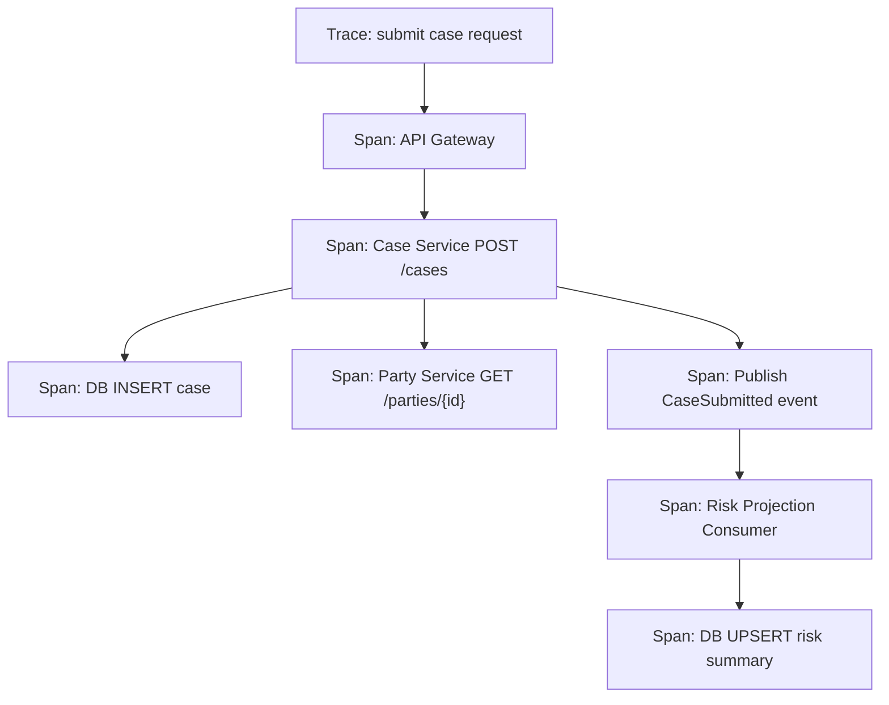
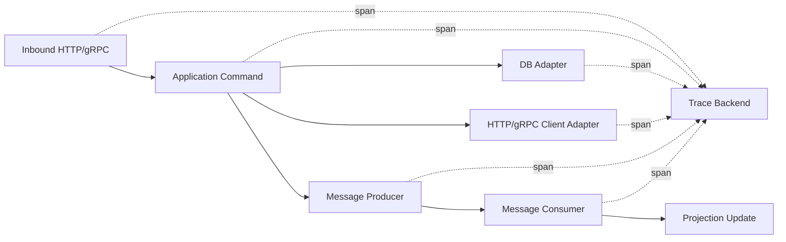
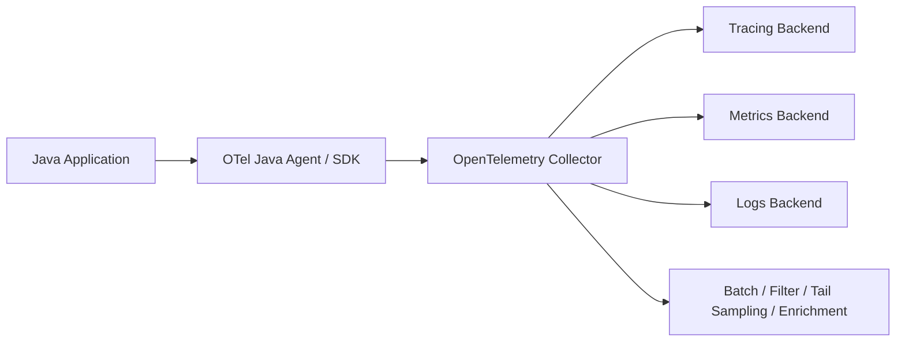
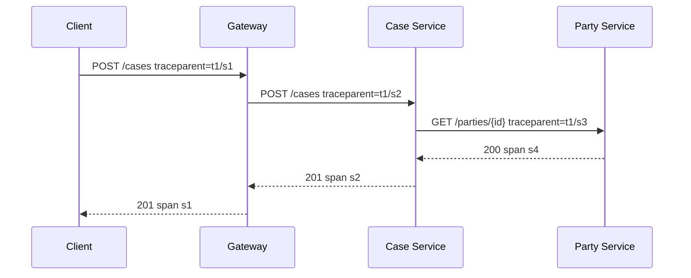
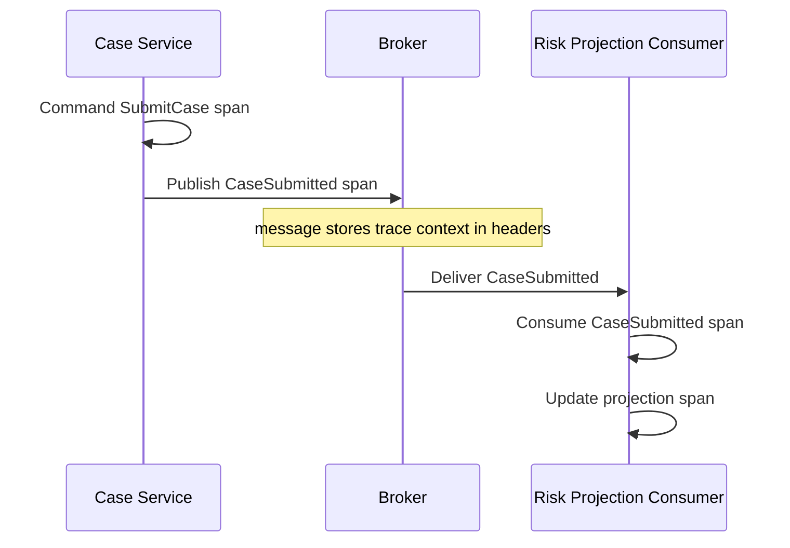
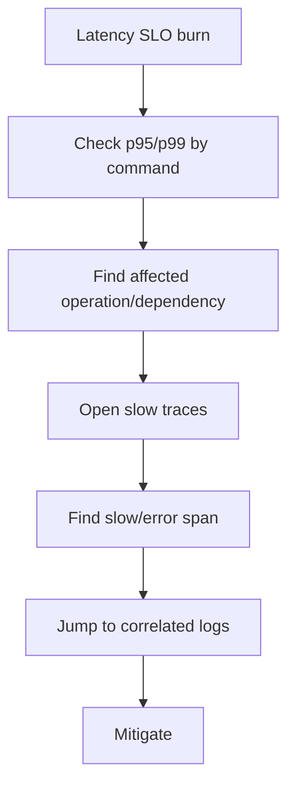
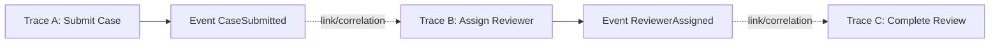
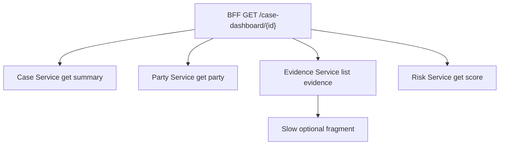
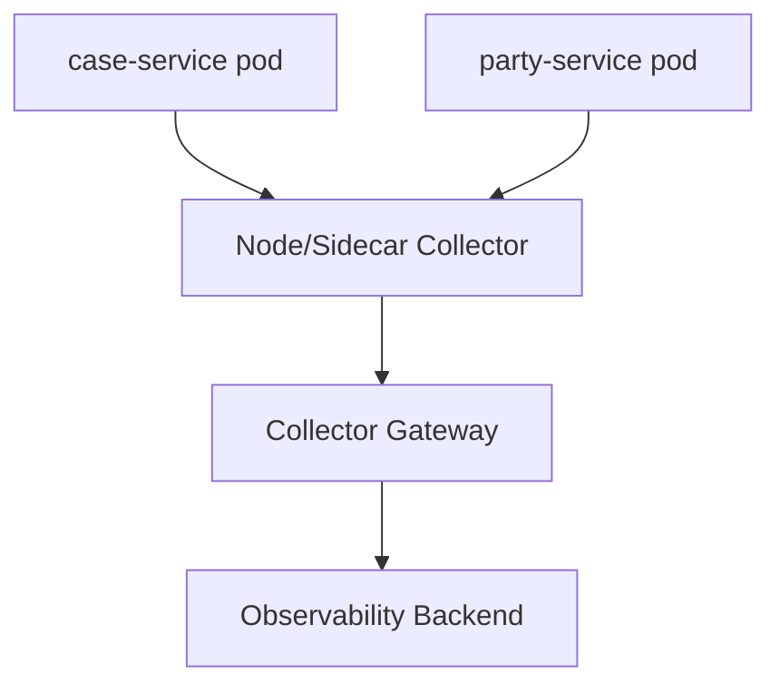

# Part 050 — Distributed Tracing with OpenTelemetry

> Metrics mengatakan service lambat.
>
> Logs mengatakan event tertentu gagal.
>
> Trace menunjukkan perjalanan request melewati service, dependency, queue, database, retry, dan fallback.

Distributed tracing adalah cara membaca **causal path** dalam sistem yang tersebar.

Di microservices, satu user action bisa melewati:

- API gateway
- BFF
- case service
- party service
- evidence service
- risk service
- database
- message broker
- projection consumer
- workflow engine
- external system

Tanpa trace, debugging sering berubah menjadi tanya-jawab manual antar tim.

Part ini membahas distributed tracing dengan OpenTelemetry untuk Java microservices production-grade.

Kita akan fokus pada:

- mental model trace/span
- context propagation
- trace ID, span ID, parent-child relation
- span naming
- attributes/events/status
- semantic conventions
- OpenTelemetry Java agent vs manual instrumentation
- propagation di HTTP, gRPC, messaging, dan async execution
- baggage dan privacy risk
- sampling
- OpenTelemetry Collector
- trace/log/metric correlation
- trace-driven debugging
- production checklist

---

## 1. Core Mental Model

Trace adalah representasi perjalanan satu operation end-to-end.

Span adalah unit kerja dalam trace.



Trace menjawab:

- service mana yang dilalui?
- span mana yang paling lambat?
- dependency mana yang error?
- retry terjadi di mana?
- apakah context hilang saat async?
- apakah latency berasal dari queue wait, DB, downstream, atau application logic?

---

## 2. Trace Bukan Log Panjang

Trace tidak menggantikan log.

Trace buruk:

```text
span event: entered method A
span event: entered method B
span event: value x = ...
span event: debug debug debug
```

Trace yang baik:

- span pada boundary penting
- attribute stabil
- event hanya untuk kejadian penting
- error ditandai jelas
- tidak membawa sensitive payload
- tidak membuat cardinality meledak

Trace adalah peta perjalanan, bukan dump internal.

---

## 3. Trace, Span, Context

### 3.1 Trace ID

Trace ID mengidentifikasi satu perjalanan end-to-end.

Satu trace bisa punya banyak span.

### 3.2 Span ID

Span ID mengidentifikasi satu unit kerja.

Span punya parent span kecuali root span.

### 3.3 Context

Context membawa trace state antar proses/thread.

Tanpa context propagation, trace terputus.

Contoh:

```text
Client request
  trace_id=abc
  span_id=001

Case service creates child span
  trace_id=abc
  span_id=002
  parent=001

Party service creates child span
  trace_id=abc
  span_id=003
  parent=002
```

### 3.4 Propagation

Propagation menyisipkan dan mengambil trace context dari carrier seperti:

- HTTP headers
- gRPC metadata
- messaging headers
- task context
- workflow context

Jika service tidak propagate context, tracing backend melihat beberapa trace terpisah.

---

## 4. Trace Model untuk Java Microservices

Instrumentation sebaiknya berada pada boundary.



Jangan instrument semua method.

Instrument:

- inbound request
- application command/query
- DB operation
- external call
- message publish
- message consume
- workflow transition
- scheduled job
- expensive computation
- retry/fallback boundary jika penting

---

## 5. Span Naming

Span name harus stabil dan low-cardinality.

Buruk:

```text
GET /cases/CASE-2026-000000123
Approve case CASE-2026-000000123 by user john@example.com
```

Baik:

```text
HTTP POST /cases
Command SubmitCase
HTTP GET party-service /internal/parties/{partyId}
DB case.insert
Publish case-submitted
Consume case-submitted risk-projection
Workflow case-escalation.assign-reviewer
```

### 5.1 Span name rule

Gunakan pola:

```text
<kind> <operation-template>
```

Contoh:

```text
HTTP POST /cases
Command SubmitCase
Query GetCaseSummary
DB case.findById
HTTP GET party-service /internal/parties/{partyId}
gRPC PartyService/GetParty
Kafka publish case-events CaseSubmitted
Kafka consume case-events CaseSubmitted
Workflow CaseEscalation/AssignReviewer
```

---

## 6. Span Attributes

Attributes memberi metadata terstruktur.

Gunakan attributes stabil dan bounded.

Contoh:

```text
service.name=case-service
deployment.environment=prod
http.request.method=POST
url.template=/cases
http.response.status_code=201
application.command=submit_case
application.outcome=success
dependency.name=party-service
messaging.destination.name=case-events
messaging.operation=publish
```

Hindari:

```text
case.id=CASE-123
user.email=john@example.com
request.body={...}
exception.message=<raw dynamic message>
```

Trace attributes punya risiko privacy dan cardinality seperti metrics.

---

## 7. Span Events

Span event adalah kejadian penting di dalam span.

Gunakan untuk:

- retry attempt
- fallback selected
- circuit breaker open
- validation failed category
- compensation started
- external decision received
- workflow timer fired

Contoh:

```java
span.addEvent("retry.attempt", Attributes.of(
    AttributeKey.longKey("retry.attempt_number"), 2L,
    AttributeKey.stringKey("retry.reason"), "dependency_timeout"
));
```

Jangan gunakan span event untuk debug log line-by-line.

---

## 8. Span Status dan Error

Set error status hanya untuk operation yang gagal menurut kontrak operation itu.

Contoh:

- validation error user input mungkin bukan span `ERROR` untuk service health, tetapi attribute `application.outcome=validation_error`
- dependency timeout adalah `ERROR`
- fallback berhasil mungkin root span `OK`, tetapi dependency span `ERROR` dan event `fallback.selected`

```java
try {
    return operation.execute();
} catch (DependencyTimeoutException e) {
    span.recordException(e);
    span.setStatus(StatusCode.ERROR, "dependency_timeout");
    throw e;
}
```

Jangan menandai semua 4xx sebagai technical error tanpa berpikir.

---

## 9. OpenTelemetry Architecture

OpenTelemetry menyediakan API, SDK, instrumentation, semantic conventions, dan collector untuk telemetry vendor-neutral.



### 9.1 Application

Application menghasilkan telemetry.

### 9.2 Agent/SDK

Agent auto-instrumentation bisa menangkap HTTP, JDBC, gRPC, messaging, dan framework umum.

Manual instrumentation dipakai untuk domain/application spans.

### 9.3 Collector

Collector menerima, memproses, dan mengekspor telemetry.

Manfaat collector:

- vendor decoupling
- batching
- retry export
- tail sampling
- filtering
- enrichment resource attributes
- central policy

### 9.4 Backend

Backend menyimpan dan menampilkan traces.

Contoh kategori:

- Jaeger/Tempo-style tracing backend
- vendor observability backend
- APM platform

Seri ini tidak mengunci ke vendor.

---

## 10. Java Agent vs Manual Instrumentation

### 10.1 Java Agent

Kelebihan:

- cepat dipasang
- minim code change
- coverage framework luas
- cocok baseline tracing
- bisa dipakai untuk HTTP/JDBC/messaging umum

Kekurangan:

- tidak tahu business command
- span name domain mungkin kurang bermakna
- bisa terlalu banyak span jika tidak dikonfigurasi
- tidak menggantikan domain instrumentation

### 10.2 Manual instrumentation

Kelebihan:

- bisa menamai command bisnis
- bisa menambah outcome taxonomy
- bisa instrument workflow transition
- bisa menandai fallback/compensation
- lebih dekat ke mental model sistem

Kekurangan:

- butuh discipline
- raw API bisa bocor ke domain jika tidak hati-hati
- risiko inconsistent naming

### 10.3 Rule praktis

Gunakan agent untuk platform/framework spans.

Gunakan manual instrumentation untuk application/business spans.

---

## 11. OpenTelemetry Java Basic Manual Span

Contoh sederhana.

```java
import io.opentelemetry.api.GlobalOpenTelemetry;
import io.opentelemetry.api.trace.Span;
import io.opentelemetry.api.trace.StatusCode;
import io.opentelemetry.api.trace.Tracer;
import io.opentelemetry.context.Scope;

public final class SubmitCaseUseCase {

    private static final Tracer tracer = GlobalOpenTelemetry
        .getTracer("case-service.application");

    public SubmitCaseResult submit(SubmitCaseCommand command) {
        Span span = tracer.spanBuilder("Command SubmitCase")
            .setAttribute("application.command", "submit_case")
            .startSpan();

        try (Scope scope = span.makeCurrent()) {
            SubmitCaseResult result = doSubmit(command);

            span.setAttribute("application.outcome", "success");
            return result;
        } catch (BusinessRejectedException e) {
            span.setAttribute("application.outcome", "business_rejected");
            throw e;
        } catch (DependencyTimeoutException e) {
            span.setAttribute("application.outcome", "dependency_timeout");
            span.recordException(e);
            span.setStatus(StatusCode.ERROR, "dependency_timeout");
            throw e;
        } catch (RuntimeException e) {
            span.setAttribute("application.outcome", "server_error");
            span.recordException(e);
            span.setStatus(StatusCode.ERROR, "server_error");
            throw e;
        } finally {
            span.end();
        }
    }

    private SubmitCaseResult doSubmit(SubmitCaseCommand command) {
        // application logic
        throw new UnsupportedOperationException("example");
    }
}
```

Problem: code use case sekarang tahu OpenTelemetry.

Untuk codebase besar, lebih baik pakai wrapper/decorator.

---

## 12. Better Pattern: Tracing Decorator

Buat tracing boundary di application layer, bukan di domain.

```java
public final class TraceRunner {

    private final Tracer tracer;

    public TraceRunner(Tracer tracer) {
        this.tracer = tracer;
    }

    public <T> T runCommand(String commandName, Supplier<T> operation) {
        Span span = tracer.spanBuilder("Command " + commandName)
            .setAttribute("application.command", toSnake(commandName))
            .startSpan();

        try (Scope ignored = span.makeCurrent()) {
            T result = operation.get();
            span.setAttribute("application.outcome", "success");
            return result;
        } catch (BusinessRejectedException e) {
            span.setAttribute("application.outcome", "business_rejected");
            throw e;
        } catch (DependencyTimeoutException e) {
            span.setAttribute("application.outcome", "dependency_timeout");
            span.recordException(e);
            span.setStatus(StatusCode.ERROR, "dependency_timeout");
            throw e;
        } catch (RuntimeException e) {
            span.setAttribute("application.outcome", "server_error");
            span.recordException(e);
            span.setStatus(StatusCode.ERROR, "server_error");
            throw e;
        } finally {
            span.end();
        }
    }

    private String toSnake(String commandName) {
        return commandName
            .replaceAll("([a-z])([A-Z])", "$1_$2")
            .toLowerCase(Locale.ROOT);
    }
}
```

Usage:

```java
public SubmitCaseResponse submit(SubmitCaseRequest request) {
    return traceRunner.runCommand("SubmitCase", () ->
        submitCaseUseCase.submit(request.toCommand())
    );
}
```

---

## 13. Context Propagation in HTTP

HTTP propagation biasanya memakai headers.

Common standard:

```text
traceparent: 00-<trace-id>-<span-id>-<flags>
tracestate: ...
```

Aplikasi tidak perlu mengelola header ini manual jika framework instrumentation aktif.

Yang perlu diperhatikan architect:

- gateway tidak boleh membuang trace headers
- internal HTTP client harus inject context
- service receiving request harus extract context
- outgoing request harus child span dari current span
- reverse proxy/service mesh harus dikonfigurasi agar tidak menghilangkan context



---

## 14. Context Propagation in gRPC

gRPC propagation menggunakan metadata.

Dengan instrumentation yang tepat:

- client interceptor inject context
- server interceptor extract context
- deadline juga bisa ikut menjadi bagian diagnosis

Span name sebaiknya stabil:

```text
gRPC PartyService/GetParty
```

Attributes:

```text
rpc.system=grpc
rpc.service=PartyService
rpc.method=GetParty
rpc.grpc.status_code=OK
```

---

## 15. Context Propagation in Messaging

Messaging lebih sulit daripada HTTP karena producer dan consumer tidak berada dalam satu synchronous call.

Ada dua model:

1. producer span adalah parent consumer span
2. producer span linked ke consumer span

Secara konseptual:



Header message harus membawa trace context.

Perhatikan:

- broker delay harus terlihat jika mungkin
- consumer processing harus punya span sendiri
- retry/DLQ harus punya event/attribute
- jangan pakai payload sensitive sebagai attribute
- message key/id boleh dipakai di log, tapi hati-hati di trace attributes

---

## 16. Async Execution and Thread Hops

Java async code bisa memutus context.

Contoh risiko:

```java
CompletableFuture.supplyAsync(() -> service.call());
```

Jika executor tidak context-aware, child work kehilangan current span.

Solusi:

- gunakan instrumentation executor dari agent jika tersedia
- wrap executor dengan context propagation
- capture context sebelum thread hop
- hindari manual async tanpa observability plan

Pseudo-pattern:

```java
Context context = Context.current();
CompletableFuture.supplyAsync(() -> {
    try (Scope ignored = context.makeCurrent()) {
        return service.call();
    }
}, executor);
```

Untuk Reactor/WebFlux, context propagation punya model tersendiri. Jangan asumsikan ThreadLocal selalu aman.

---

## 17. Baggage: Use Sparingly

Baggage membawa key-value context lintas service.

Contoh penggunaan yang mungkin:

```text
business.flow=case_escalation
traffic.class=interactive
tenant.tier=regulated_enterprise
```

Tapi baggage berbahaya karena ikut melintasi boundary dan bisa terlihat di headers.

Jangan taruh:

- user email
- case ID
- party ID
- token
- role detail sensitive
- free text
- personal data

Prinsip:

> Baggage hanya untuk low-cardinality, non-sensitive routing/diagnostic hints yang benar-benar dibutuhkan lintas service.

---

## 18. Sampling

Tracing semua request di traffic besar bisa mahal.

Sampling memilih trace mana yang disimpan.

### 18.1 Head-based sampling

Keputusan sampling dibuat di awal trace.

Kelebihan:

- murah
- sederhana
- mengurangi data lebih awal

Kekurangan:

- bisa melewatkan error/slow trace yang baru diketahui di akhir

### 18.2 Tail-based sampling

Keputusan sampling dibuat setelah trace selesai atau cukup terlihat.

Kelebihan:

- bisa simpan trace error/slow/outlier
- lebih berguna untuk diagnosis

Kekurangan:

- butuh collector/backend lebih kuat
- semua span perlu dikirim dulu ke decision point
- lebih kompleks

### 18.3 Sampling policy praktis

Simpan:

- semua error traces
- semua traces dengan latency di atas threshold
- sebagian kecil success traces
- traces untuk critical workflow
- traces dari canary release
- traces dengan rare outcome

Hindari:

- sampling acak murni untuk semua kasus critical
- membuang semua trace sukses sampai tidak punya baseline
- inconsistent sampling antar service

---

## 19. Trace and Metrics Correlation

Metrics menunjukkan spike.

Trace memberi contoh konkret.

Workflow diagnosis:



Contoh:

1. alert: `submit_case` p95 > 500 ms
2. dashboard: `party-service get_party` dependency p95 naik
3. trace: slow span ada di `HTTP GET party-service /internal/parties/{partyId}`
4. logs: downstream timeout after retry
5. mitigation: disable optional enrichment atau apply fallback

---

## 20. Trace and Logs Correlation

Structured logs harus membawa trace ID dan span ID.

Contoh log:

```json
{
  "timestamp": "2026-07-05T09:10:11.123Z",
  "level": "WARN",
  "service.name": "case-service",
  "trace_id": "4bf92f3577b34da6a3ce929d0e0e4736",
  "span_id": "00f067aa0ba902b7",
  "event.name": "dependency.timeout",
  "dependency.name": "party-service",
  "operation": "get_party",
  "timeout.ms": 250
}
```

Manfaat:

- dari trace bisa buka logs span terkait
- dari log bisa buka trace penuh
- debugging tidak perlu grep manual antar service

---

## 21. Trace Design for Workflow

Workflow trace tidak selalu satu synchronous request.

Long-running workflow bisa berlangsung menit, jam, hari.

Jangan memaksa satu trace hidup selama hari-hari.

Lebih baik:

- trace per command/transition
- workflow instance ID di log/audit, bukan high-cardinality metric label
- span link antar transition jika backend mendukung
- consistent business correlation ID di logs/audit
- read model untuk workflow timeline



Trace untuk long-running process adalah rangkaian related traces, bukan selalu satu trace raksasa.

---

## 22. Trace Design for Saga

Saga membutuhkan visibility khusus.

Span penting:

```text
Saga Start CaseEscalation
Saga Step ReserveReviewer
Saga Step NotifySupervisor
Saga Step UpdateCaseStatus
Saga Compensation ReleaseReviewer
Saga End CaseEscalation
```

Attributes:

```text
saga.name=case_escalation
saga.step=reserve_reviewer
saga.outcome=compensated
saga.retry_attempt=2
```

Hati-hati dengan `saga.instance_id` sebagai attribute jika sangat high-cardinality. Bisa lebih aman di logs/audit.

### 22.1 Saga failure visibility

Saat saga gagal, trace harus menunjukkan:

- step gagal
- retry count
- timeout/deadline
- compensation dijalankan atau tidak
- final state
- dependency yang menyebabkan gagal

---

## 23. Trace Design for API Composition

Aggregator/BFF trace harus menunjukkan fan-out.



Trace membantu menjawab:

- fragment mana lambat?
- apakah fan-out parallel atau serial?
- optional fragment gagal tetapi response tetap sukses?
- berapa latency budget per dependency?

Attributes:

```text
composition.fragment=evidence_summary
composition.fragment.required=false
composition.fragment.outcome=timeout_fallback
```

---

## 24. Trace Design for Resilience Patterns

Resilience behavior harus terlihat.

Span events:

```text
retry.attempt
retry.exhausted
circuit_breaker.open
fallback.selected
rate_limiter.rejected
bulkhead.rejected
load_shed
```

Contoh:

```java
Span.current().addEvent("fallback.selected", Attributes.of(
    AttributeKey.stringKey("fallback.reason"), "party_service_timeout",
    AttributeKey.stringKey("fallback.type"), "cached_snapshot"
));
```

Jika resilience pattern tidak terlihat di trace, incident analysis akan salah membaca fallback sebagai success biasa.

---

## 25. Trace Privacy and Security

Trace data sering lebih sensitif daripada disadari.

Jangan record:

- request body
- response body
- authorization token
- cookie
- password
- secret
- personal data
- case narrative
- evidence text
- raw address
- email/phone/national ID

Gunakan classification:

```text
case.type=enforcement
traffic.class=interactive
result.category=business_rejected
risk.bucket=high
```

### 25.1 Attribute review

Setiap custom attribute harus lulus:

1. Apakah low-cardinality?
2. Apakah non-sensitive?
3. Apakah berguna untuk diagnosis?
4. Apakah ada owner?
5. Apakah retention trace sesuai data classification?

---

## 26. OpenTelemetry Collector Design

Collector adalah komponen arsitektur, bukan detail ops kecil.

### 26.1 Deployment mode

Common modes:

- agent/sidecar per node/pod
- gateway collector per cluster/region
- hybrid agent + gateway



### 26.2 Collector responsibilities

- receive OTLP
- batch telemetry
- enrich resource attributes
- filter sensitive/noisy data
- tail sample traces
- retry export
- route telemetry to backend

### 26.3 Failure mode

Telemetry pipeline must not take down business service.

Rules:

- exporter timeout bounded
- queue bounded
- drop telemetry before blocking app indefinitely
- alert on telemetry loss separately
- do not make request path depend on telemetry backend availability

---

## 27. Local Development and Testing

Tracing should be testable locally.

Local stack idea:

```text
Java service -> OTel Collector -> local tracing backend
```

Developer should be able to:

- send one request
- see full trace
- verify span names
- verify attributes
- verify context propagation
- verify logs include trace ID

### 27.1 Trace contract tests

For critical flows, assert that instrumentation exists.

Example checks:

- command span created
- dependency span exists
- outcome attribute set
- error recorded on failure
- message headers contain context

Do not over-test exact internal spans if auto-instrumentation may change.

---

## 28. Trace-Driven Debugging Example

Incident:

```text
Users report Submit Case is slow.
SLO burn rate high for submit_case latency.
```

### Step 1: Metrics

Find:

```text
application.command.duration{command="submit_case"} p95 high
http.server.requests p95 high only for POST /cases
CPU normal
DB pool normal
```

### Step 2: Open slow traces

Trace shows:

```text
Command SubmitCase: 1.8s
  DB case.insert: 40ms
  HTTP party-service get_party: 1.5s
    retry attempt 1: timeout 250ms
    retry attempt 2: timeout 250ms
    retry attempt 3: timeout 250ms
  Publish CaseSubmitted: 20ms
```

### Step 3: Interpret

Problem is not case-service DB.

Problem is party-service dependency + retry policy making latency worse.

### Step 4: Mitigate

Options:

- disable optional party enrichment
- reduce retry attempts
- use cached party snapshot
- load shed non-critical enrichment
- coordinate with party-service owner

### Step 5: Validate

Metrics after mitigation:

```text
submit_case p95 down
party-service timeout still high
fallback.selected count up
business success unaffected
```

Trace proves mitigation path.

---

## 29. Common Trace Smells

### 29.1 Broken trace

Each service shows separate trace.

Cause:

- propagation headers dropped
- client not instrumented
- async thread lost context
- message headers not propagated

Fix:

- verify context extraction/injection
- check gateway/proxy config
- instrument client/server/messaging

### 29.2 Too many spans

Trace has hundreds of internal method spans.

Cause:

- over-instrumentation
- framework noise
- auto instrumentation too broad

Fix:

- focus on boundaries
- filter noisy instrumentation
- rename high-value spans

### 29.3 No business meaning

Trace only shows HTTP/JDBC spans.

Cause:

- agent only, no manual instrumentation

Fix:

- add command/query spans
- add workflow/saga spans
- add outcome attributes

### 29.4 Sensitive data in attributes

Trace contains user email/case narrative/raw body.

Cause:

- careless attribute capture
- auto capture headers/body

Fix:

- disable body capture
- sanitize headers
- review custom attributes
- add collector filtering if necessary

### 29.5 High-cardinality span names

Span names contain IDs.

Cause:

- raw URI used instead of route template

Fix:

- use route templates
- move IDs to logs if needed and allowed

### 29.6 Sampling hides incidents

Only success traces visible; error traces missing.

Cause:

- naive head sampling

Fix:

- tail sample errors/slow traces
- increase sampling for critical flows
- sample canary traffic separately

---

## 30. Architecture Review Checklist

### 30.1 Propagation

- Does HTTP propagation work through gateway/proxy?
- Does gRPC propagation work through interceptors?
- Does messaging propagation copy trace context to headers?
- Does async executor preserve context?
- Does reactive code preserve context?

### 30.2 Span design

- Are span names stable and low-cardinality?
- Are business command/query spans present?
- Are dependency spans present?
- Are workflow/saga transition spans present?
- Are resilience events visible?

### 30.3 Attributes

- Are attributes useful for diagnosis?
- Are labels/attributes bounded?
- Is sensitive data excluded?
- Are outcome attributes standardized?
- Are semantic conventions followed where possible?

### 30.4 Sampling

- Are errors sampled?
- Are slow traces sampled?
- Are critical workflow traces sampled sufficiently?
- Is sampling consistent across services?
- Is sampling cost understood?

### 30.5 Correlation

- Do logs include trace ID and span ID?
- Can dashboard link from metric spike to traces?
- Can trace link to logs?
- Can incident responders follow service dependency path?

### 30.6 Collector

- Is collector highly available enough?
- Are exporter timeouts bounded?
- Is telemetry queue bounded?
- Is data filtered/enriched centrally?
- Is telemetry loss monitored?

---

## 31. Mini Exercise

Instrument a `SubmitCase` flow.

Flow:

1. `POST /cases`
2. `Command SubmitCase`
3. DB insert case
4. call `party-service`
5. publish `CaseSubmitted`
6. consume event in risk projection
7. update read model

Design:

- span names
- attributes
- events
- error status rule
- propagation headers
- sampling rule
- privacy rule
- log correlation fields

Then answer:

1. If `party-service` times out, where does the error show?
2. If message consumer is delayed 10 minutes, where does the delay show?
3. If fallback is selected, how does trace reveal it?
4. If trace breaks between producer and consumer, what config do you check?
5. Which fields must never become trace attributes?

---

## 32. Summary

Distributed tracing is not about drawing pretty waterfalls.

Tracing is a production debugging instrument for causal paths.

A good tracing design:

- preserves context across service boundaries
- uses stable low-cardinality span names
- instruments business operations, not only framework calls
- records dependency and resilience behavior
- links with metrics and logs
- handles async and messaging explicitly
- samples intelligently
- protects sensitive data
- keeps telemetry pipeline decoupled from business availability

OpenTelemetry gives a vendor-neutral way to generate, collect, process, and export traces, metrics, and logs. But OpenTelemetry does not decide what your domain operation means. That is architecture work.

Prinsip akhirnya:

> Trace harus membuat satu user action bisa dibaca sebagai cerita kausal lintas service. Kalau trace tidak membantu menemukan penyebab latency, failure, retry, fallback, atau broken propagation, tracing hanya menjadi biaya tambahan.

---

## References

- OpenTelemetry Documentation: https://opentelemetry.io/docs/
- OpenTelemetry Java: https://opentelemetry.io/docs/languages/java/
- OpenTelemetry Traces: https://opentelemetry.io/docs/concepts/signals/traces/
- OpenTelemetry Context Propagation: https://opentelemetry.io/docs/concepts/context-propagation/
- OpenTelemetry Propagators API: https://opentelemetry.io/docs/specs/otel/context/api-propagators/
- OpenTelemetry Baggage: https://opentelemetry.io/docs/concepts/signals/baggage/
- OpenTelemetry Collector: https://opentelemetry.io/docs/collector/
- W3C Trace Context: https://www.w3.org/TR/trace-context/
