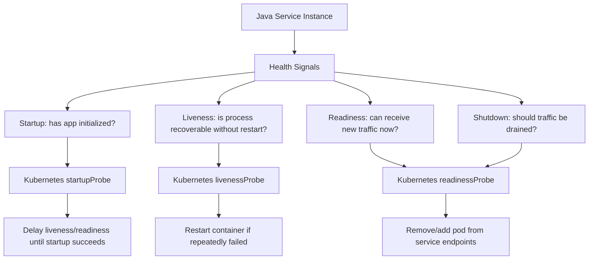
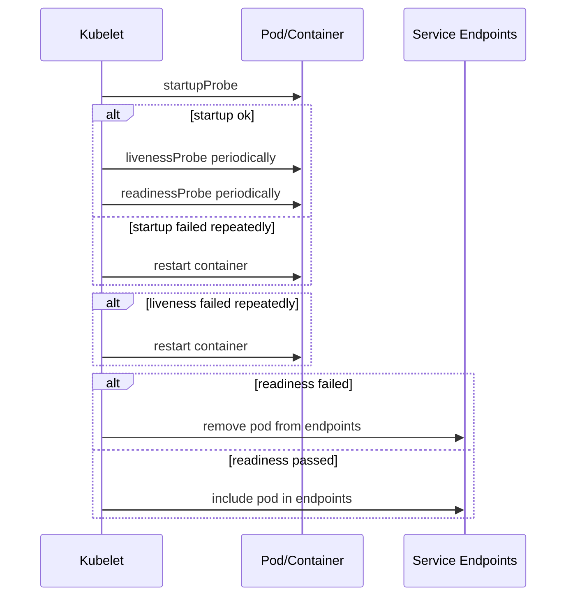
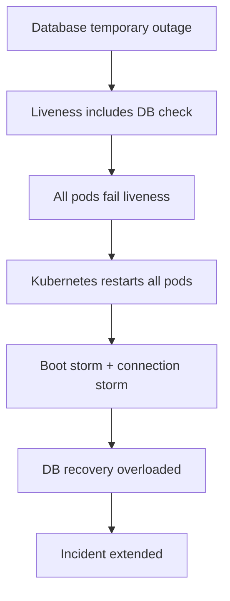
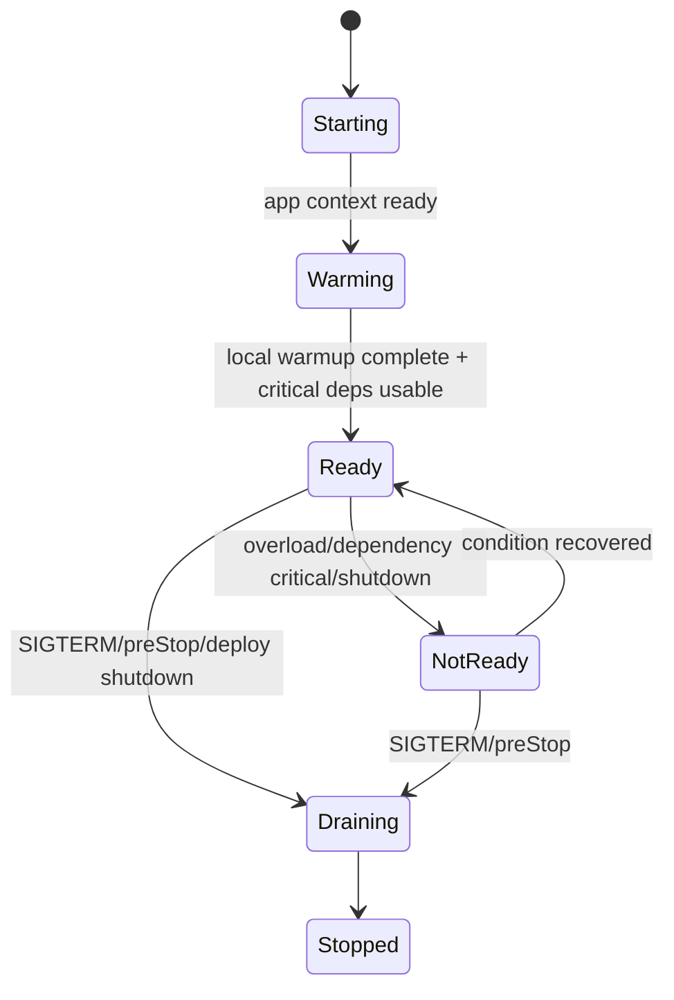
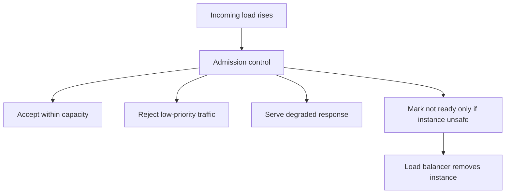
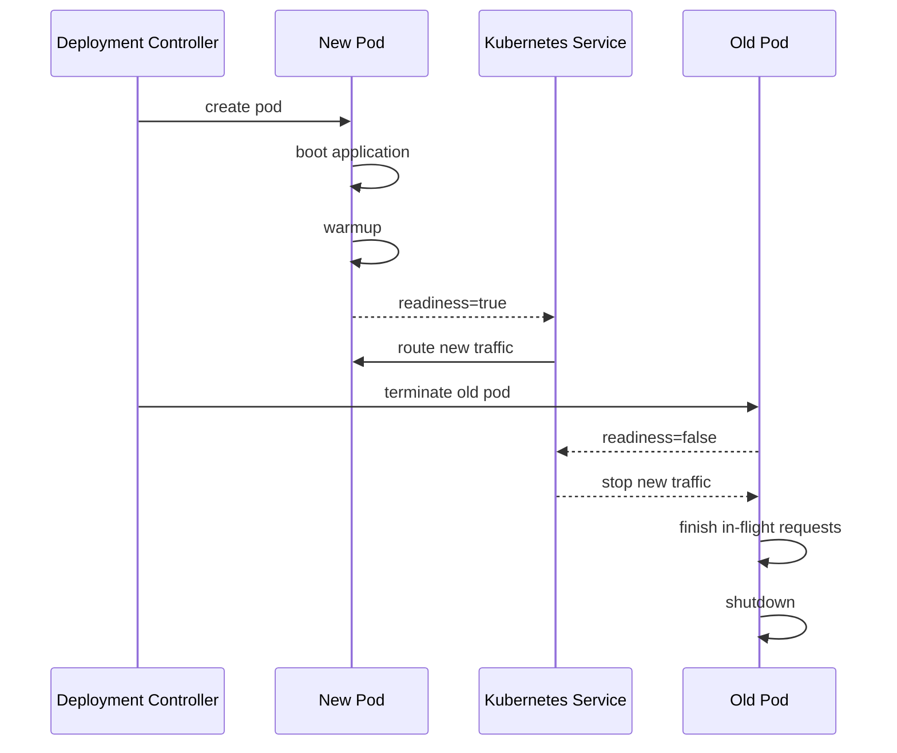
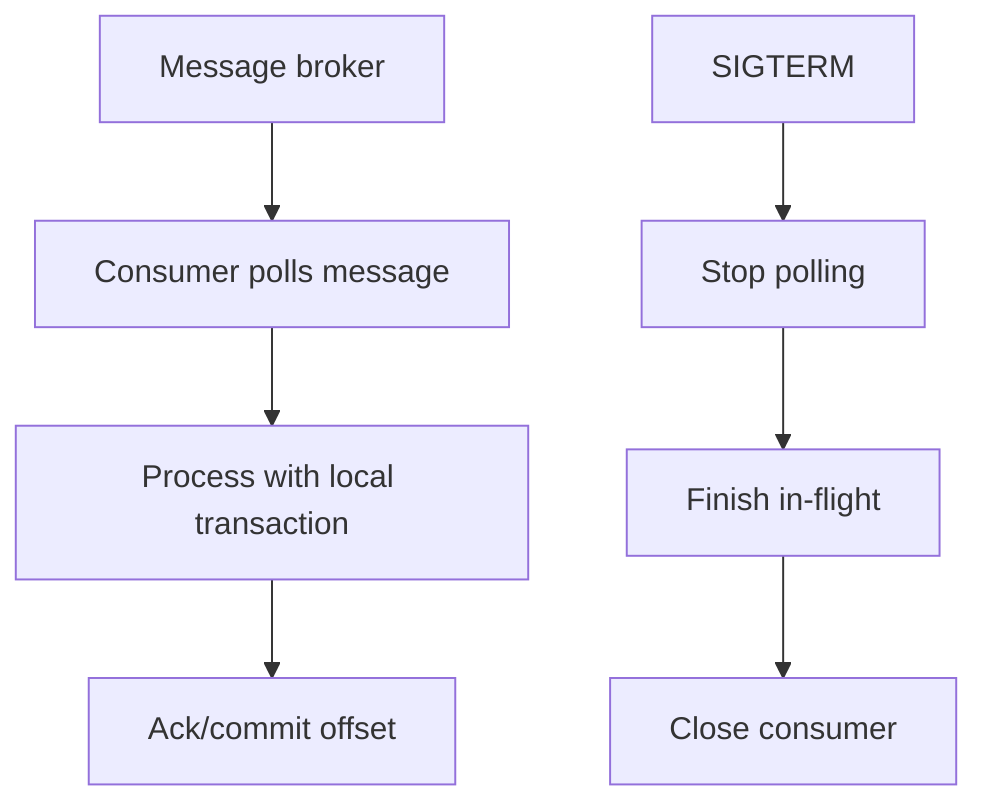

# Part 051 — Health Checks, Readiness, and Liveness

Health check yang buruk bisa lebih berbahaya daripada tidak punya health check.

Banyak tim membuat endpoint `/health`, mengembalikan `200 OK`, lalu menganggap service sudah production-ready. Itu terlalu dangkal. Di microservices, health endpoint adalah **kontrak antara aplikasi, orchestrator, load balancer, platform, dan operator manusia**.

Kontrak ini menjawab pertanyaan yang berbeda:

- apakah proses sudah mulai dengan benar?
- apakah proses masih hidup?
- apakah instance ini boleh menerima traffic baru?
- apakah instance ini harus dikeluarkan dari load balancer?
- apakah restart akan memperbaiki kondisi buruk?
- apakah dependency failure harus membuat instance dianggap unhealthy?
- apakah service sedang shutdown dan perlu drain traffic?

Pertanyaan-pertanyaan itu tidak boleh dijawab oleh satu boolean mentah.

Part ini membahas health checks untuk Java microservices dengan fokus production-grade:

- perbedaan startup, liveness, readiness, dan shutdown state
- shallow check vs deep check
- dependency classification
- health endpoint di Spring Boot Actuator
- Kubernetes probe semantics
- readiness saat startup, warmup, dependency outage, overload, dan shutdown
- liveness yang tidak menyebabkan restart storm
- custom Java health indicator
- graceful shutdown dan traffic draining
- failure mode health check
- checklist architecture review

---

## 1. Core Mental Model

Health check bukan observability dashboard.

Health check adalah **control signal**.

Control signal berarti hasilnya bisa memicu aksi otomatis:

- Kubernetes menghentikan traffic ke pod
- Kubernetes me-restart container
- load balancer mengeluarkan instance dari endpoint pool
- autoscaler membaca kondisi indirectly dari traffic flow
- deployment controller menahan rollout
- operator memutuskan apakah insiden sedang terjadi

Karena health check bisa memicu aksi, maka health check harus didesain seperti API yang punya semantics jelas.



Mental model paling penting:

> **Liveness menjawab: restart perlu atau tidak.**
>
> **Readiness menjawab: instance ini boleh menerima traffic atau tidak.**
>
> **Startup menjawab: aplikasi sudah cukup booted untuk mulai dipantau atau belum.**

Jangan mencampur ketiganya.

---

## 2. Why One `/health` Endpoint Is Not Enough

Endpoint tunggal seperti ini tampak sederhana:

```http
GET /health
200 OK

{ "status": "UP" }
```

Masalahnya: `UP` untuk siapa?

Untuk user?
Untuk Kubernetes?
Untuk load balancer?
Untuk deployment controller?
Untuk engineer on-call?
Untuk dependency owner?

Contoh kegagalan:

| Kondisi | Harus Restart? | Harus Terima Traffic? | `/health` tunggal bisa salah? |
|---|---:|---:|---:|
| DB sementara down | Tidak selalu | Mungkin tidak | Ya |
| Thread pool saturated | Tidak selalu | Tidak | Ya |
| App deadlock | Ya | Tidak | Ya |
| Cache belum warm | Tidak | Belum | Ya |
| Service sedang shutdown | Tidak | Tidak | Ya |
| Optional dependency down | Tidak | Mungkin ya dengan degraded mode | Ya |
| Schema migration belum selesai | Tidak | Belum | Ya |

Satu endpoint tidak cukup karena aksi otomatisnya berbeda.

Jika liveness gagal, orchestrator bisa restart container.

Jika readiness gagal, orchestrator hanya menghentikan traffic baru.

Jika startup gagal terlalu lama, orchestrator menganggap container gagal boot.

---

## 3. Kubernetes Probe Semantics

Dalam Kubernetes, probe dilakukan oleh kubelet secara periodik. Hasil probe bisa memicu aksi berbeda.



Probe dapat berupa:

- HTTP probe
- TCP probe
- gRPC probe
- exec probe

Untuk Java microservices, HTTP probe paling umum karena Spring Boot Actuator, Jakarta/MicroProfile Health, dan service mesh/load balancer mudah mengonsumsinya.

Tetapi jangan lupa: HTTP probe tetap hanya sinyal. Ia tidak otomatis benar hanya karena berbentuk HTTP.

---

## 4. Startup Probe

Startup probe menjawab:

> Apakah aplikasi sudah selesai bootstrapping sehingga liveness/readiness boleh mulai dinilai?

Startup probe cocok untuk service yang butuh waktu start karena:

- JVM warmup
- classpath scanning
- Spring context initialization
- JIT warmup awal
- migration check
- configuration validation
- cache/load metadata
- service discovery registration
- TLS/material credential loading

Tanpa startup probe, liveness probe bisa mulai terlalu cepat dan membunuh container yang sebenarnya masih booting.

### 4.1 What Startup Should Check

Startup check sebaiknya menjawab hal minimal:

- process hidup
- application context berhasil dibuat
- konfigurasi wajib valid
- port management siap menjawab
- komponen critical local berhasil initialized

Startup check tidak harus memastikan seluruh dunia luar sehat.

Bad startup check:

```text
Startup fails because optional notification provider is down.
```

Better startup check:

```text
Startup succeeds if service can initialize its own runtime and required local components.
Readiness decides whether service can accept traffic.
```

### 4.2 Example Kubernetes Startup Probe

```yaml
startupProbe:
  httpGet:
    path: /actuator/health/liveness
    port: management
  failureThreshold: 30
  periodSeconds: 5
  timeoutSeconds: 2
```

Interpretasi:

- kubelet memberi waktu sekitar `30 * 5 = 150` detik
- sebelum startup sukses, liveness/readiness belum dijalankan seperti biasa
- setelah startup sukses, liveness mengambil alih

Jangan gunakan `initialDelaySeconds` sebagai satu-satunya solusi startup lambat. Delay statis sering salah: terlalu pendek menyebabkan restart loop; terlalu panjang memperlambat recovery.

---

## 5. Liveness Probe

Liveness menjawab:

> Apakah proses masih hidup, atau sudah berada dalam kondisi yang restart container kemungkinan memperbaikinya?

Liveness bukan dependency checker.

Liveness bukan database checker.

Liveness bukan “apakah service bisa melayani semua fitur”.

Liveness adalah sinyal untuk **restart**.

### 5.1 Good Liveness Conditions

Liveness boleh gagal untuk kondisi seperti:

- application main loop stuck
- HTTP server tidak bisa menjawab sama sekali
- JVM dalam kondisi tidak recoverable
- fatal internal invariant rusak
- deadlock fatal yang terdeteksi watchdog
- application context corrupted
- service masuk panic mode karena local resource irrecoverable

### 5.2 Bad Liveness Conditions

Liveness sebaiknya tidak gagal hanya karena:

- database down sementara
- downstream service down
- message broker unreachable sesaat
- external API timeout
- cache provider down
- rate limiter backend down
- circuit breaker open

Mengapa?

Karena restart instance tidak memperbaiki dependency outage.

Lebih buruk lagi, jika semua pod gagal liveness karena DB down, Kubernetes akan me-restart semua pod. Ketika DB pulih, semua pod boot bersamaan, melakukan reconnect bersamaan, menjalankan warmup bersamaan, lalu membebani dependency yang baru pulih.

Itu restart storm.



### 5.3 Liveness Rule

Gunakan aturan ini:

> **Jika restart container tidak mungkin memperbaiki penyebabnya, jangan jadikan penyebab itu liveness failure.**

---

## 6. Readiness Probe

Readiness menjawab:

> Apakah instance ini boleh menerima traffic baru sekarang?

Readiness boleh berubah sepanjang hidup proses.

Service bisa live tetapi tidak ready.

Contoh:

- baru boot, cache belum warm
- sedang overload
- connection pool habis
- DB critical unreachable
- dependency mandatory unreachable
- sedang shutdown/draining
- instance sedang melakukan maintenance local
- migration compatibility belum siap

Readiness failure tidak berarti container rusak. Itu berarti instance minta dikeluarkan sementara dari traffic pool.

### 6.1 Readiness State Machine



### 6.2 Readiness Should Include Critical Serving Preconditions

Readiness boleh mengecek dependency jika dependency tersebut **wajib untuk melayani traffic utama**.

Contoh Case Service:

| Dependency | Critical for Readiness? | Reason |
|---|---:|---|
| PostgreSQL primary | Ya | Cannot accept command without persistence |
| Kafka producer/outbox publisher | Tidak selalu | Command can persist outbox and publisher can recover |
| Risk scoring service | Tergantung | If synchronous required before accepting case, yes; if async risk enrichment, no |
| Notification service | Biasanya tidak | Can degrade notification |
| Audit writer | Mungkin ya | In regulatory domain, command without audit may be invalid |
| Redis cache | Tergantung | If cache-aside optional, no; if session/state critical, yes |

Readiness harus mengikuti business semantics, bukan hanya technical dependency list.

---

## 7. Dependency Health Classification

Jangan membuat health check dengan mental model “semua dependency harus UP”.

Buat dependency classification.

| Class | Meaning | Liveness | Readiness | User Behavior |
|---|---|---:|---:|---|
| Local fatal | Local runtime corrupted | Fail | Fail | Restart |
| Critical write dependency | Required for accepting commands | Pass | Fail | Stop new command traffic |
| Critical read dependency | Required for main read path | Pass | Maybe fail | Stop or degrade reads |
| Optional dependency | Feature can degrade | Pass | Pass | Return partial/degraded response |
| Async dependency | Can buffer/retry | Pass | Usually pass | Accept, process later |
| Audit/compliance dependency | Required for defensibility | Pass | Often fail | Reject command safely |

Dalam regulatory case-management, audit dependency bisa lebih critical daripada notification dependency.

Command seperti `ApproveEnforcementAction` mungkin tidak boleh diterima jika audit trail tidak bisa dicatat. Sebaliknya, command `SubmitCase` mungkin tetap bisa diterima jika email notification down, selama event/outbox tercatat untuk retry.

---

## 8. Shallow Check vs Deep Check

Health check punya dua level:

### 8.1 Shallow Check

Shallow check memeriksa local process:

- HTTP server responsive
- app context initialized
- thread/event loop tidak macet total
- memory masih dalam batas aman
- internal fatal flag tidak aktif

Cocok untuk liveness.

### 8.2 Deep Check

Deep check memeriksa kemampuan melayani request nyata:

- DB connection valid
- schema compatible
- queue producer available
- critical dependency reachable
- cache warm enough
- application not overloaded

Cocok untuk readiness, bukan liveness.

### 8.3 Diagnostic Check

Selain control probe, kadang kita butuh diagnostic health endpoint untuk manusia:

```http
GET /actuator/health
```

Endpoint ini boleh lebih detail, tetapi jangan otomatis dipakai sebagai liveness.

Bedakan:

- `/health/liveness`: control signal restart
- `/health/readiness`: control signal routing traffic
- `/health`: diagnostic aggregate
- `/internal/diagnostics/dependencies`: manual/operator-only detail

---

## 9. Spring Boot Actuator Health Model

Di Spring Boot, Actuator menyediakan health endpoint dan konsep health groups. Spring Boot juga punya `ApplicationAvailability` untuk merepresentasikan liveness dan readiness state.

Secara umum endpoint probe dapat diekspos seperti:

```text
/actuator/health/liveness
/actuator/health/readiness
```

Konfigurasi umum:

```yaml
management:
  endpoints:
    web:
      exposure:
        include: health,info,prometheus
  endpoint:
    health:
      probes:
        enabled: true
      show-details: never
  health:
    livenessstate:
      enabled: true
    readinessstate:
      enabled: true
```

Untuk Kubernetes deployment:

```yaml
apiVersion: apps/v1
kind: Deployment
metadata:
  name: case-service
spec:
  replicas: 3
  selector:
    matchLabels:
      app: case-service
  template:
    metadata:
      labels:
        app: case-service
    spec:
      containers:
        - name: case-service
          image: registry.example.com/case-service:1.42.0
          ports:
            - name: http
              containerPort: 8080
            - name: management
              containerPort: 8081
          startupProbe:
            httpGet:
              path: /actuator/health/liveness
              port: management
            periodSeconds: 5
            timeoutSeconds: 2
            failureThreshold: 30
          livenessProbe:
            httpGet:
              path: /actuator/health/liveness
              port: management
            periodSeconds: 10
            timeoutSeconds: 2
            failureThreshold: 3
          readinessProbe:
            httpGet:
              path: /actuator/health/readiness
              port: management
            periodSeconds: 5
            timeoutSeconds: 2
            failureThreshold: 2
```

Gunakan management port terpisah jika organisasi membutuhkannya untuk network policy, security, atau traffic isolation.

---

## 10. Custom Readiness Indicator in Java

Readiness sering perlu custom logic.

Contoh: Case Service hanya ready jika:

- DB bisa dipakai untuk command transaction
- schema version compatible
- service tidak dalam overload mode
- service tidak sedang draining
- audit sink tersedia jika command policy mengharuskan audit synchronously

```java
package com.acme.caseapp.infrastructure.health;

import org.springframework.boot.actuate.health.Health;
import org.springframework.boot.actuate.health.HealthIndicator;
import org.springframework.stereotype.Component;

@Component("caseReadiness")
public final class CaseReadinessHealthIndicator implements HealthIndicator {

    private final DatabaseCapabilityProbe database;
    private final SchemaCompatibilityProbe schema;
    private final OverloadGuard overloadGuard;
    private final ShutdownDrainer shutdownDrainer;
    private final AuditCapabilityProbe audit;

    public CaseReadinessHealthIndicator(
            DatabaseCapabilityProbe database,
            SchemaCompatibilityProbe schema,
            OverloadGuard overloadGuard,
            ShutdownDrainer shutdownDrainer,
            AuditCapabilityProbe audit
    ) {
        this.database = database;
        this.schema = schema;
        this.overloadGuard = overloadGuard;
        this.shutdownDrainer = shutdownDrainer;
        this.audit = audit;
    }

    @Override
    public Health health() {
        Health.Builder builder = Health.up();

        if (shutdownDrainer.isDraining()) {
            return Health.down()
                    .withDetail("reason", "draining")
                    .build();
        }

        if (overloadGuard.isRejectingNewTraffic()) {
            return Health.down()
                    .withDetail("reason", "overloaded")
                    .withDetail("queueDepth", overloadGuard.queueDepth())
                    .withDetail("inFlight", overloadGuard.inFlightRequests())
                    .build();
        }

        CapabilityStatus dbStatus = database.check();
        if (!dbStatus.usable()) {
            return Health.down()
                    .withDetail("reason", "database_not_usable")
                    .withDetail("category", dbStatus.category())
                    .build();
        }

        CapabilityStatus schemaStatus = schema.check();
        if (!schemaStatus.usable()) {
            return Health.down()
                    .withDetail("reason", "schema_incompatible")
                    .withDetail("expected", schemaStatus.expected())
                    .withDetail("actual", schemaStatus.actual())
                    .build();
        }

        CapabilityStatus auditStatus = audit.check();
        if (!auditStatus.usable()) {
            return Health.down()
                    .withDetail("reason", "audit_sink_not_usable")
                    .withDetail("policy", "commands_require_audit")
                    .build();
        }

        return builder
                .withDetail("serving", true)
                .withDetail("mode", "normal")
                .build();
    }
}
```

Catatan penting:

- jangan masukkan detail rahasia
- jangan expose host/credential/internal URI
- jangan membuat health check melakukan query mahal
- jangan membuat health check menulis data
- jangan membuat health check mengunci resource utama

---

## 11. Grouping Health Indicators

Tidak semua `HealthIndicator` harus masuk readiness.

Misalnya ada indicator:

- `db`
- `redis`
- `auditSink`
- `notificationProvider`
- `caseReadiness`
- `livenessState`
- `readinessState`

Konfigurasi health group bisa seperti:

```yaml
management:
  endpoint:
    health:
      group:
        liveness:
          include: livenessState
        readiness:
          include: readinessState,caseReadiness
        diagnostics:
          include: db,redis,auditSink,notificationProvider,caseReadiness
          show-details: when_authorized
```

Ini membuat control probe tetap sederhana, sementara diagnostic endpoint tetap kaya informasi.

---

## 12. Readiness and Overload

Readiness tidak hanya tentang dependency.

Readiness juga bisa menjadi sinyal overload.

Contoh overload conditions:

- request concurrency melewati batas aman
- queue depth terlalu tinggi
- connection pool exhausted
- CPU throttling parah
- GC pause berlebihan
- event loop blocked
- broker lag tidak terkendali
- thread pool rejection meningkat

Tetapi hati-hati: membuat readiness gagal karena overload bisa menggeser traffic ke pod lain. Jika semua pod overload dan semua gagal readiness, traffic bisa tidak punya endpoint.

Strategi yang lebih aman:

1. lakukan local admission control terlebih dahulu
2. return `429 Too Many Requests` atau `503 Service Unavailable` dengan `Retry-After` untuk traffic non-critical
3. gunakan readiness fail hanya untuk kondisi instance tidak lagi aman menerima traffic
4. gunakan priority traffic agar health endpoint dan critical command tetap bisa dijawab
5. gunakan autoscaling berdasarkan saturation metrics, bukan health failure saja



Readiness adalah alat routing, bukan pengganti load shedding.

---

## 13. Readiness During Deployment

Rolling deployment bergantung pada readiness.

Deployment yang sehat:

1. pod baru dibuat
2. container start
3. startup probe sukses
4. readiness masih false selama warmup
5. cache/connection/schema compatibility siap
6. readiness true
7. Kubernetes memasukkan pod ke endpoint
8. traffic mulai masuk
9. pod lama menerima SIGTERM
10. pod lama menjadi not ready
11. traffic drain
12. pod lama shutdown setelah in-flight selesai



Jika readiness terlalu cepat true, pod menerima traffic sebelum siap.

Jika readiness terlalu ketat, rollout tertahan walau service sebenarnya bisa melayani.

---

## 14. Graceful Shutdown and Draining

Shutdown yang buruk menyebabkan error saat deployment.

Masalah umum:

- Kubernetes mengirim SIGTERM
- aplikasi masih dianggap ready
- load balancer masih mengirim request
- process mulai menutup connection pool
- request baru gagal
- user melihat 5xx selama rolling deployment

Shutdown yang benar:

1. receive SIGTERM
2. publish readiness false
3. stop accepting new requests
4. allow in-flight requests to finish
5. flush outbox/logs/metrics if needed
6. close clients/resources
7. exit within grace period

Spring Boot configuration:

```yaml
server:
  shutdown: graceful

spring:
  lifecycle:
    timeout-per-shutdown-phase: 30s
```

Kubernetes configuration:

```yaml
terminationGracePeriodSeconds: 45
lifecycle:
  preStop:
    exec:
      command: ["/bin/sh", "-c", "sleep 10"]
```

`preStop sleep` bukan solusi elegan, tetapi kadang dipakai untuk memberi waktu load balancer menghapus endpoint. Lebih baik jika platform/load balancer memahami readiness cepat, tetapi realitas infrastruktur sering punya propagation delay.

---

## 15. Application Availability Events

Dalam Spring Boot, readiness/liveness bisa dikelola lewat application availability.

Contoh menandai service not ready saat draining:

```java
package com.acme.caseapp.infrastructure.lifecycle;

import org.springframework.boot.availability.AvailabilityChangeEvent;
import org.springframework.boot.availability.ReadinessState;
import org.springframework.context.ApplicationEventPublisher;
import org.springframework.context.SmartLifecycle;
import org.springframework.stereotype.Component;

@Component
public final class ReadinessDrainer implements SmartLifecycle {

    private final ApplicationEventPublisher publisher;
    private volatile boolean running;

    public ReadinessDrainer(ApplicationEventPublisher publisher) {
        this.publisher = publisher;
    }

    @Override
    public void start() {
        running = true;
        AvailabilityChangeEvent.publish(
                publisher,
                this,
                ReadinessState.ACCEPTING_TRAFFIC
        );
    }

    @Override
    public void stop() {
        AvailabilityChangeEvent.publish(
                publisher,
                this,
                ReadinessState.REFUSING_TRAFFIC
        );
        running = false;
    }

    @Override
    public boolean isRunning() {
        return running;
    }
}
```

Dalam implementasi nyata, shutdown phase harus diatur hati-hati agar readiness berubah sebelum server menutup koneksi.

---

## 16. Health Check Cost and Isolation

Health endpoint harus murah.

Jika health endpoint mahal, health check bisa menjadi sumber load.

Misalnya:

- 100 pod
- readiness period 5 detik
- tiap check melakukan 3 query DB

Maka platform menghasilkan:

```text
100 pods * 12 checks/minute * 3 queries = 3,600 DB queries/minute
```

Itu hanya dari health checks.

Aturan:

- cache hasil dependency probe beberapa detik jika perlu
- gunakan timeout pendek
- gunakan dedicated lightweight query jika harus DB check
- jangan scan table
- jangan call chain dependency panjang
- jangan call dependency optional
- jangan melakukan expensive cryptographic operation tiap probe
- jangan membuat health endpoint antre di thread pool yang sama dengan request berat jika bisa dihindari

Contoh cached probe:

```java
public final class CachedCapabilityProbe {

    private final CapabilityProbe delegate;
    private final Duration ttl;
    private volatile Instant expiresAt = Instant.EPOCH;
    private volatile CapabilityStatus cached = CapabilityStatus.unknown();

    public CachedCapabilityProbe(CapabilityProbe delegate, Duration ttl) {
        this.delegate = delegate;
        this.ttl = ttl;
    }

    public CapabilityStatus check() {
        Instant now = Instant.now();
        if (now.isBefore(expiresAt)) {
            return cached;
        }

        CapabilityStatus next = delegate.checkWithTimeout(Duration.ofMillis(200));
        cached = next;
        expiresAt = now.plus(ttl);
        return next;
    }
}
```

---

## 17. Health Endpoint Security

Health endpoints sering kelihatan tidak sensitif. Itu salah.

Health endpoint bisa membocorkan:

- database product/version
- internal hostnames
- dependency names
- region/zone
- queue names
- tenant metadata
- failure mode detail
- security provider availability
- internal architecture topology

Public health endpoint sebaiknya minimal.

```json
{
  "status": "UP"
}
```

Diagnostic endpoint bisa detail, tetapi harus dibatasi:

- auth required
- internal network only
- no secrets
- no raw exception message dari dependency
- no tenant/user data
- no credential/URL leak

---

## 18. Health and Multi-Tenancy

Dalam multi-tenant service, readiness global bisa terlalu kasar.

Contoh:

- tenant A database shard down
- tenant B sehat
- tenant C terkena throttling

Apakah service harus not ready global?

Tergantung.

Jika routing bisa tenant-aware, health bisa diekspresikan per shard/tenant group di diagnostic endpoint. Tetapi Kubernetes readiness biasanya global per pod.

Strategy:

- gunakan global readiness hanya untuk instance-level capacity
- gunakan tenant/shard health untuk routing layer atau application-level rejection
- return tenant-specific degraded/error response
- alert berdasarkan impacted tenant/user journey
- jangan mematikan semua traffic hanya karena satu tenant shard bermasalah

---

## 19. Health and Async Consumers

Consumer service tidak selalu menerima HTTP traffic. Tapi readiness tetap relevan.

Untuk message consumer, readiness bisa mengontrol:

- apakah consumer boleh menerima/poll message
- apakah consumer group membership aktif
- apakah partition assignment aman
- apakah backlog processing boleh berjalan

Kondisi not ready:

- DB unavailable untuk commit processed message
- schema incompatible
- idempotency store unavailable
- downstream critical dependency unavailable
- service sedang draining

Consumer shutdown harus:

1. stop polling new messages
2. finish in-flight message if safe
3. commit offset/ack only after durable side effect
4. release partition/consumer membership
5. exit



---

## 20. Health Check Smells

### Smell 1 — Liveness Calls Database

Restarting app will not fix DB outage.

Move DB check to readiness or diagnostic endpoint.

### Smell 2 — Readiness Always Returns UP

Then rolling deployment and traffic draining lose protection.

Readiness must represent serving capability.

### Smell 3 — Health Check Is Too Expensive

Health probe becomes production load generator.

Make it cheap, cached, bounded, and timeout-protected.

### Smell 4 — Optional Dependency Makes Service Not Ready

Notification provider down should not necessarily remove Case Service from traffic.

Classify dependencies by serving criticality.

### Smell 5 — Health Endpoint Leaks Internals

Do not expose stack traces, hostnames, credentials, SQL error details, or tenant identifiers.

### Smell 6 — Readiness Fails for Every Minor Error

Flapping readiness causes unstable endpoint pool.

Use thresholds, hysteresis, and stable state transitions.

### Smell 7 — Probe Timeout Longer Than Probe Period

This causes probe pile-up and false failures.

Timeout should be short and realistic.

### Smell 8 — Health Checks Share Saturated Worker Pool

If management endpoint cannot respond because all request threads are busy, you cannot distinguish overload from dead process.

Consider separate management port/thread isolation where needed.

---

## 21. Readiness Hysteresis

Readiness should not flap.

Flapping example:

```text
10:00:00 DB probe fails once -> readiness false
10:00:05 DB probe succeeds -> readiness true
10:00:10 DB probe fails once -> readiness false
```

This creates endpoint churn.

Better:

- fail after N consecutive failures
- recover after M consecutive successes
- keep minimal unhealthy duration
- use cached result with short TTL
- separate dependency health from readiness decision

Example:

```java
public final class HysteresisGate {
    private final int failuresToClose;
    private final int successesToOpen;
    private int failures;
    private int successes;
    private boolean open = true;

    public synchronized boolean record(boolean success) {
        if (success) {
            successes++;
            failures = 0;
            if (!open && successes >= successesToOpen) {
                open = true;
            }
        } else {
            failures++;
            successes = 0;
            if (open && failures >= failuresToClose) {
                open = false;
            }
        }
        return open;
    }
}
```

---

## 22. Health Check Design Card

Sebelum membuat health endpoint, isi card ini.

```yaml
service: case-service
probe_policy:
  startup:
    purpose: confirm application initialized
    includes:
      - application_context_started
      - configuration_valid
      - management_server_ready
    excludes:
      - downstream_services
      - optional_dependencies
  liveness:
    purpose: decide whether restart may help
    includes:
      - liveness_state
      - fatal_local_runtime_flag
    excludes:
      - database
      - external_http_dependencies
      - message_broker
  readiness:
    purpose: decide whether to route new traffic
    includes:
      - readiness_state
      - database_write_capability
      - schema_compatibility
      - overload_guard
      - draining_state
    excludes:
      - notification_provider
      - analytics_exporter
  diagnostics:
    purpose: human/operator detail
    access: internal_authenticated
    includes:
      - database
      - message_broker
      - notification_provider
      - audit_sink
      - cache
```

---

## 23. Probe Timing Decision

Probe timing bukan default copy-paste.

| Parameter | Meaning | Risk if Wrong |
|---|---|---|
| `periodSeconds` | How often probe runs | Too frequent adds load; too slow delays detection |
| `timeoutSeconds` | How long kubelet waits | Too short false negative; too long pile-up |
| `failureThreshold` | Failures before action | Too low flapping; too high slow reaction |
| `successThreshold` | Successes before ready | Too low premature routing; too high slow recovery |
| `startupProbe.failureThreshold` | Startup grace | Too low restart loop; too high slow failure detection |

Example reasoning:

```text
Service boot p95: 45s
Service boot p99: 90s
Worst normal boot under cold node: 120s
Startup period: 5s
Startup failureThreshold: 30
Allowed startup window: 150s
```

For readiness:

```text
periodSeconds: 5
failureThreshold: 2
Detection time: about 10s
```

For liveness:

```text
periodSeconds: 10
failureThreshold: 3
Detection time: about 30s
```

Liveness should usually be slower and more conservative than readiness.

---

## 24. Architecture Review Checklist

Gunakan checklist ini saat review service.

### Semantics

- [ ] Startup, liveness, readiness, diagnostics dipisahkan.
- [ ] Liveness hanya gagal untuk kondisi restart-worthy.
- [ ] Readiness merepresentasikan kemampuan menerima traffic baru.
- [ ] Shutdown/draining membuat readiness false.
- [ ] Optional dependency tidak menjatuhkan readiness global.
- [ ] Audit/compliance dependency diklasifikasikan secara eksplisit.

### Failure Safety

- [ ] Health check tidak menyebabkan dependency overload.
- [ ] Probe punya timeout pendek.
- [ ] Health result punya hysteresis atau threshold bila diperlukan.
- [ ] Liveness tidak menyebabkan restart storm saat dependency outage.
- [ ] Readiness tidak flapping pada minor transient failure.
- [ ] Probe tetap bisa menjawab saat service overload.

### Operations

- [ ] Kubernetes probe timing berdasarkan startup/latency real.
- [ ] Rolling deployment diuji dengan readiness.
- [ ] Graceful shutdown diuji dengan in-flight request.
- [ ] Runbook menjelaskan arti setiap failure.
- [ ] Health check metrics dicatat.
- [ ] Diagnostic endpoint aman dan tidak membocorkan data sensitif.

### Java Implementation

- [ ] Health indicator tidak berisi business transaction.
- [ ] Health indicator tidak melakukan write.
- [ ] Health indicator tidak memanggil dependency chain panjang.
- [ ] Health group dikonfigurasi eksplisit.
- [ ] Management endpoint exposure dibatasi.
- [ ] Test mencakup startup, dependency outage, overload, shutdown.

---

## 25. Exercises

### Exercise 1 — Classify Dependencies

Untuk service berikut:

```text
Enforcement Decision Service
Dependencies:
- PostgreSQL
- Audit Ledger Service
- Notification Service
- Risk Scoring Service
- Document Rendering Service
- Kafka Broker
- Redis Cache
```

Klasifikasikan tiap dependency:

- liveness?
- readiness?
- diagnostic only?
- optional/degraded?
- critical compliance dependency?

Jelaskan mengapa.

### Exercise 2 — Design Probe Policy

Buat `probe_policy.yaml` untuk service yang:

- menerima command `ApproveAction`
- harus mencatat audit sebelum success response
- bisa mengirim notification async
- bisa menghitung risk async
- tidak boleh menerima command saat DB schema incompatible

### Exercise 3 — Failure Mode Review

Apa yang terjadi jika:

- DB down 5 menit
- Kafka down 10 menit
- Notification provider down 1 jam
- CPU throttling 80%
- readiness endpoint timeout karena thread pool penuh
- pod menerima SIGTERM saat ada request 25 detik

Untuk tiap kasus, jawab:

- apakah liveness fail?
- apakah readiness fail?
- apakah user menerima degraded response?
- apakah restart membantu?

---

## 26. Key Takeaways

- Health check adalah **control signal**, bukan sekadar status page.
- Liveness menjawab apakah restart container masuk akal.
- Readiness menjawab apakah instance boleh menerima traffic baru.
- Startup probe melindungi service lambat start dari restart prematur.
- Dependency outage tidak otomatis berarti liveness failure.
- Readiness harus mencerminkan serving capability, overload, warmup, dan shutdown/draining.
- Health check yang terlalu dalam bisa memperpanjang insiden.
- Health endpoint harus murah, bounded, aman, dan punya semantics eksplisit.
- Dalam microservices production-grade, health design adalah bagian dari architecture design.

---

## 27. Further Reading

- Kubernetes Documentation — Liveness, Readiness, and Startup Probes
- Kubernetes Documentation — Configure Liveness, Readiness and Startup Probes
- Spring Boot Reference — Actuator Health and Kubernetes Probes
- Spring Blog — Liveness and Readiness Probes with Spring Boot
- Google SRE Book — Addressing Cascading Failures
- Google SRE Book — Handling Overload
