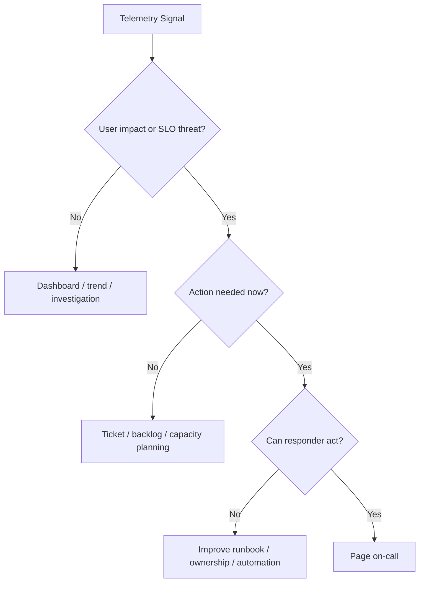
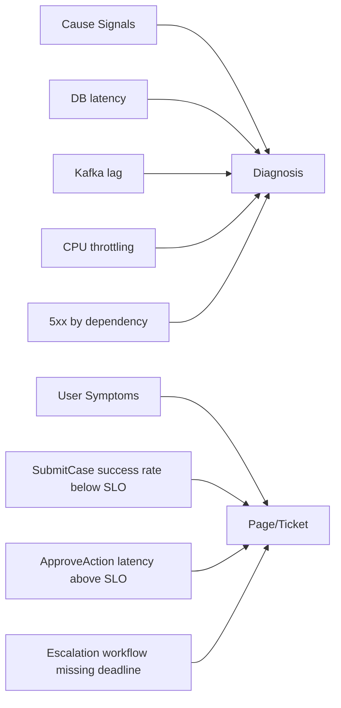
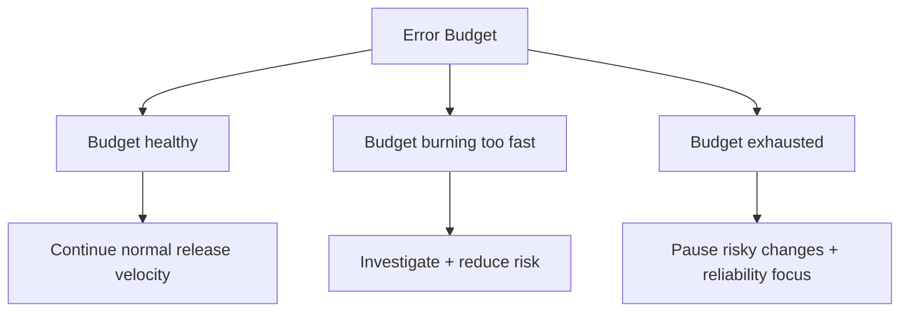
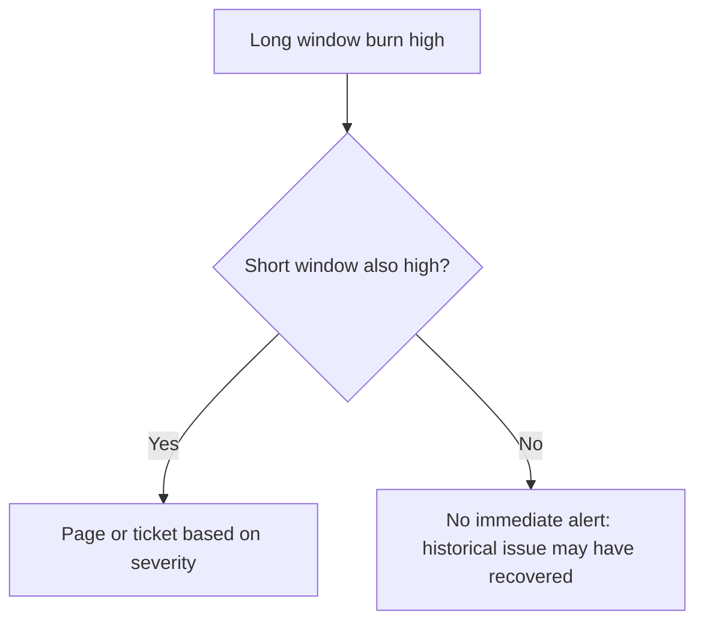
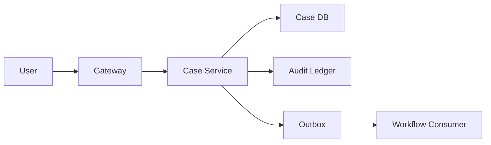

# Part 052 — Alerting and SLO Design

Alert yang buruk membuat tim lelah.

Alert yang baik membuat tim bertindak tepat waktu pada masalah yang benar.

Di microservices, jumlah metric, log, trace, dashboard, dan dependency sangat besar. Jika setiap metric abnormal menjadi alert, engineer akan tenggelam dalam noise. Jika alert terlalu sedikit, user terkena dampak lama sebelum tim sadar.

SLO design adalah cara menghubungkan observability dengan realitas user.

Part ini membahas:

- symptom-based alerting
- SLI, SLO, SLA, dan error budget
- user journey sebagai dasar reliability target
- good event/bad event model
- availability, latency, freshness, correctness, durability SLI
- burn-rate alerting
- multi-window multi-burn-rate alert
- low traffic service problem
- page vs ticket vs dashboard
- runbook-linked alerts
- Java/Micrometer metric shape
- alert anti-pattern
- SLO review checklist

---

## 1. Core Mental Model

Alert bukan notifikasi bahwa metric bergerak.

Alert adalah **permintaan interupsi manusia**.

Jika alert membangunkan engineer pukul 03:00, alert harus memenuhi tiga syarat:

1. user atau business outcome sedang terancam
2. aksi manusia dibutuhkan sekarang
3. alert menjelaskan cukup context untuk mulai diagnosis

Jika salah satu tidak terpenuhi, kemungkinan itu bukan page. Mungkin hanya ticket, dashboard panel, log event, atau report.



Alerting design bukan dimulai dari PromQL.

Alerting design dimulai dari user journey.

---

## 2. Symptom-Based Alerting

Microservices punya banyak causes:

- DB slow
- cache miss tinggi
- Kafka lag
- CPU throttling
- GC pause
- external API timeout
- deployment bug
- thread pool saturated
- connection pool exhausted
- bad config rollout

Tetapi user merasakan symptoms:

- tidak bisa submit case
- keputusan enforcement gagal dibuat
- dashboard case tidak terbuka
- evidence upload gagal
- notification terlambat
- workflow stuck
- SLA eskalasi terlewat

Alert yang baik biasanya alert pada symptom, bukan semua cause.

Cause metrics tetap penting untuk diagnosis, tetapi tidak semuanya harus page.



Rule:

> Page on symptoms. Diagnose with causes.

---

## 3. SLI, SLO, SLA, Error Budget

Empat istilah ini sering dicampur.

### 3.1 SLI — Service Level Indicator

SLI adalah ukuran kuantitatif dari service behavior.

Contoh:

```text
percentage of SubmitCase requests that complete successfully within 1 second
```

SLI harus bisa dihitung dari telemetry.

### 3.2 SLO — Service Level Objective

SLO adalah target untuk SLI dalam periode tertentu.

Contoh:

```text
99.9% of SubmitCase requests complete successfully within 1 second over 30 days
```

SLO adalah internal reliability target.

### 3.3 SLA — Service Level Agreement

SLA adalah kontrak eksternal, biasanya punya konsekuensi bisnis/legal/financial.

Tidak semua SLO harus menjadi SLA.

### 3.4 Error Budget

Error budget adalah ruang gagal yang diizinkan oleh SLO.

Jika SLO availability 99.9%, budget error adalah 0.1%.

Jika periode 30 hari, maka budget waktu equivalent kasar:

```text
30 days * 24 hours * 60 minutes = 43,200 minutes
0.1% error budget = 43.2 minutes
```

Tetapi untuk request-based SLO, budget dihitung dari event, bukan menit.

---

## 4. User Journey First

Jangan mulai dengan “service ini punya SLO 99.99%”.

Mulai dari user journey.

Contoh regulatory case-management:

| Journey | User | Business Meaning | Reliability Target Candidate |
|---|---|---|---|
| Submit case | Investigator | Case enters enforcement lifecycle | High availability + bounded latency |
| Approve enforcement action | Supervisor | Legally significant decision | High correctness + audit durability |
| Upload evidence | Investigator | Evidence attached to case | High durability + resumability |
| View case dashboard | Case officer | Operational visibility | High read availability, moderate freshness |
| Trigger escalation | System/workflow | SLA enforcement | High deadline correctness |
| Send notification | System | Informational side effect | Lower availability, retry acceptable |

Not all journeys deserve the same SLO.

Top engineers do not blindly maximize reliability. They align reliability with cost, risk, user expectation, and business value.

---

## 5. Good Events and Bad Events

SLI harus didefinisikan sebagai event classification.

Contoh SubmitCase:

```yaml
sli: submit_case_success
window: 30d
population: all POST /cases commands from authenticated users
 good_event:
  - response_status in [201]
  - response_time <= 1000ms
  - audit_record_committed == true
 bad_event:
  - response_status in [500, 502, 503, 504]
  - response_status == 409 due to internal version bug
  - timeout observed by gateway
  - response_time > 1000ms
 excluded_event:
  - 400 validation error
  - 401 unauthenticated
  - 403 unauthorized
  - 409 valid business conflict
```

Perhatikan: tidak semua non-2xx adalah bad event.

`400` karena validasi user bukan reliability failure.

`403` karena user tidak punya izin bukan reliability failure.

`409` business conflict bisa menjadi expected domain behavior.

Tetapi `409` karena duplicate idempotency race bug bisa menjadi reliability failure.

SLI harus mencerminkan user journey dan domain semantics.

---

## 6. Common SLI Types

### 6.1 Availability SLI

```text
good requests / total valid requests
```

Useful untuk request-response service.

### 6.2 Latency SLI

```text
requests completed under threshold / total valid requests
```

Jangan hanya alert pada average latency. Gunakan percentile atau threshold-based event.

### 6.3 Quality SLI

```text
correct responses / total responses
```

Contoh:

- risk score generated using valid policy version
- case status matches workflow state
- no duplicate active escalation

Quality SLI sulit, tetapi penting untuk regulatory systems.

### 6.4 Freshness SLI

```text
read model updated within X seconds / total update events
```

Contoh:

```text
99% of CaseDashboard projections reflect committed CaseUpdated events within 60 seconds
```

### 6.5 Durability SLI

```text
durable writes / acknowledged writes
```

Contoh:

- evidence metadata committed
- audit record persisted
- outbox record persisted before response

### 6.6 Workflow Deadline SLI

```text
workflow steps completed before deadline / workflow steps requiring deadline
```

Contoh:

```text
99.5% of mandatory escalation reviews are created before SLA deadline
```

This is often more important than raw HTTP uptime in case-management systems.

---

## 7. Request-Based vs Time-Based SLO

### Request-Based SLO

Good for high-traffic services:

```text
99.9% of valid requests are successful over 30 days
```

### Time-Based SLO

Good for services where availability is checked periodically:

```text
service is available for 99.9% of minutes over 30 days
```

### Event-Based SLO

Good for async/workflow systems:

```text
99% of CaseSubmitted events are projected to dashboard within 60 seconds
```

For microservices, event-based SLO often matters because many user outcomes are asynchronous.

---

## 8. Error Budget as Decision Tool

Error budget is not only for alerting.

It helps decide:

- can we release faster?
- should we pause risky deployment?
- should reliability work take priority?
- should we reduce feature rollout speed?
- is current reliability higher than needed and too expensive?



Error budget makes reliability a trade-off, not a slogan.

---

## 9. Burn Rate

Burn rate measures how fast the service consumes its error budget.

Formula:

```text
burn_rate = observed_error_rate / budgeted_error_rate
```

If SLO is 99.9%, budgeted error rate is 0.1%.

If observed error rate is 1%, burn rate is:

```text
1.0% / 0.1% = 10
```

Meaning: the service is consuming error budget 10 times faster than allowed.

Time to budget exhaustion:

```text
SLO_period / burn_rate
```

For a 30-day window:

```text
30 days / 10 = 3 days
```

A burn rate of 10 means if the condition continues, the monthly budget is gone in roughly 3 days.

---

## 10. Why Burn Rate Alerting Beats Raw Error Alerting

Raw error alert:

```text
error_rate > 1% for 5 minutes
```

Problems:

- does not account for SLO target
- too sensitive for low-impact services
- too weak for high-reliability services
- ignores error budget
- can page on tiny traffic
- can miss slow budget drain

Burn-rate alert:

```text
error budget is being consumed too fast
```

This connects alert to reliability promise.

---

## 11. Multi-Window Multi-Burn-Rate Alerting

Single-window alert has trade-offs:

- short window catches fast incidents but noisy
- long window stable but slow to detect

Multi-window multi-burn-rate combines both.

Example policy for 30-day SLO:

| Severity | Long Window | Short Window | Burn Rate | Meaning |
|---|---:|---:|---:|---|
| Page | 1h | 5m | 14.4x | Fast budget burn, current issue |
| Page | 6h | 30m | 6x | Sustained serious burn |
| Ticket | 1d | 2h | 3x | Slower but meaningful burn |
| Ticket | 3d | 6h | 1x | Budget trending badly |

The long window confirms impact. The short window confirms it is still happening.



---

## 12. PromQL Shape for Availability Burn Rate

Example input metrics:

```text
http_server_requests_seconds_count{service="case-service", route="POST /cases", status="201"}
http_server_requests_seconds_count{service="case-service", route="POST /cases", status="5xx"}
```

A simplified bad event ratio:

```promql
sum(rate(http_server_requests_seconds_count{
  service="case-service",
  route="POST /cases",
  status=~"5.."
}[5m]))
/
sum(rate(http_server_requests_seconds_count{
  service="case-service",
  route="POST /cases"
}[5m]))
```

Burn rate for 99.9% SLO:

```promql
(
  sum(rate(http_server_requests_seconds_count{service="case-service", route="POST /cases", status=~"5.."}[5m]))
  /
  sum(rate(http_server_requests_seconds_count{service="case-service", route="POST /cases"}[5m]))
)
/ 0.001
```

In real systems, you need:

- exclude expected client errors
- include gateway-observed timeouts
- include dependency response mapping
- handle zero traffic
- use recording rules
- align route labels to stable cardinality

---

## 13. Latency SLO Using Histogram Buckets

Latency SLO:

```text
99% of SubmitCase requests complete within 1 second
```

This can be counted as good events:

```promql
sum(rate(http_server_requests_seconds_bucket{
  service="case-service",
  route="POST /cases",
  le="1.0"
}[5m]))
/
sum(rate(http_server_requests_seconds_count{
  service="case-service",
  route="POST /cases"
}[5m]))
```

This differs from alerting on p99.

Percentile is useful for dashboard. But for SLO, event ratio often gives clearer budget accounting:

```text
Good: request <= threshold
Bad: request > threshold
```

---

## 14. Async SLO Example

For event-driven projection:

```yaml
slo: case_dashboard_freshness
objective: 99% of CaseUpdated events visible in dashboard within 60 seconds over 30 days
sli:
  good_event: projection_lag_seconds <= 60
  bad_event: projection_lag_seconds > 60
measurement:
  source_event_time: event.occurred_at
  projection_time: read_model.updated_at
  correlation_key: case_id + event_id
```

Prometheus metric shape:

```text
case_projection_freshness_seconds_bucket{projection="case-dashboard", le="60"}
case_projection_freshness_seconds_count{projection="case-dashboard"}
```

This is better than alerting only on Kafka consumer lag, because consumer lag is a cause signal. User cares whether dashboard is fresh enough.

---

## 15. Workflow SLO Example

For enforcement escalation:

```yaml
slo: mandatory_escalation_deadline
objective: 99.5% of mandatory escalation tasks are created before SLA deadline over 30 days
population:
  - cases requiring mandatory escalation
bad_event:
  - escalation task created after deadline
  - escalation task missing after deadline
  - duplicate escalation task causing ambiguous owner
excluded_event:
  - case cancelled before escalation requirement
  - policy explicitly waived escalation
```

This SLO requires domain instrumentation, not only HTTP metrics.

Java services in regulatory systems must emit business events/metrics around lifecycle correctness:

```java
escalationMetrics.recordDeadlineOutcome(
        EscalationDeadlineOutcome.builder()
                .caseId(command.caseId())
                .policyVersion(policy.version())
                .deadline(deadline)
                .completedAt(clock.instant())
                .outcome(outcome)
                .build()
);
```

Do not put high-cardinality IDs like `caseId` as Prometheus labels. Put them in logs/traces/audit events, not metric labels.

---

## 16. Java Metric Instrumentation Pattern

Example with Micrometer-style abstraction:

```java
package com.acme.caseapp.infrastructure.metrics;

import io.micrometer.core.instrument.Counter;
import io.micrometer.core.instrument.MeterRegistry;
import io.micrometer.core.instrument.Timer;
import org.springframework.stereotype.Component;

import java.time.Duration;

@Component
public final class CaseCommandMetrics {

    private final MeterRegistry registry;

    public CaseCommandMetrics(MeterRegistry registry) {
        this.registry = registry;
    }

    public void recordSubmitCase(Duration latency, SubmitCaseOutcome outcome) {
        Timer.builder("case.command.latency")
                .tag("command", "submit_case")
                .tag("outcome", outcome.sloOutcome()) // good, bad, excluded
                .publishPercentileHistogram()
                .register(registry)
                .record(latency);

        Counter.builder("case.command.events")
                .tag("command", "submit_case")
                .tag("slo_outcome", outcome.sloOutcome())
                .tag("failure_class", outcome.failureClass())
                .register(registry)
                .increment();
    }
}
```

Metric label rules:

Good labels:

- service
- route template
- command type
- outcome class
- dependency name from bounded enum
- failure class from bounded enum
- region/zone from bounded enum

Bad labels:

- user ID
- tenant ID if unbounded/high-cardinality
- case ID
- request ID
- exception message
- raw URL path with IDs
- SQL statement
- external error message

High-cardinality context belongs in trace/log, not metrics.

---

## 17. Alert Severity Model

Not every SLO burn deserves page.

| Severity | Channel | When | Expected Action |
|---|---|---|---|
| Page | On-call interrupt | User impact now, fast burn, action needed | Mitigate immediately |
| Ticket | Work queue | Slow burn, non-immediate reliability risk | Fix during business hours |
| Dashboard | Passive | Diagnostic/capacity trend | Observe/investigate |
| Report | Periodic review | SLO trend, budget policy | Architecture/product decision |

Question before creating page alert:

> What should the responder do in the next 15 minutes?

If no one can answer, do not page yet.

---

## 18. Alert Payload Design

A useful alert includes:

- what user journey is affected
- which SLO is burning
- burn rate and time window
- current impact estimate
- service owner
- severity
- dashboard link
- runbook link
- likely recent changes
- dependency context
- first diagnostic queries
- rollback/mitigation options

Example alert:

```yaml
alert: CaseSubmitSLOFastBurn
severity: page
service: case-service
journey: submit-case
slo: 99.9% successful SubmitCase within 1s over 30d
condition: 1h burn_rate > 14.4 and 5m burn_rate > 14.4
impact: SubmitCase error budget burning fast
runbook: runbooks/case-service/submit-case-fast-burn.md
dashboards:
  - case-service-slo
  - case-command-path
  - dependency-health
diagnostics:
  - check 5xx by failure_class
  - check latency histogram by dependency
  - check DB pool saturation
  - check recent deployment/change event
```

---

## 19. Runbook-Linked Alerts

An alert without runbook is an incomplete production feature.

Runbook structure:

```md
# CaseSubmitSLOFastBurn Runbook

## Meaning
SubmitCase SLO error budget is burning faster than allowed.

## User Impact
Investigators may fail to submit new cases or experience latency above 1s.

## First Checks
1. Check current error ratio and latency SLI.
2. Check recent deployment/change events.
3. Check failure_class breakdown.
4. Check database pool saturation.
5. Check audit sink availability.
6. Check gateway timeout rate.

## Mitigation
- Roll back latest deployment if correlated.
- Enable degraded mode for optional enrichment.
- Reduce non-critical traffic if overload.
- Increase capacity only if saturation confirmed.
- Disable risky feature flag if rollout correlated.

## Escalation
- Case Service owner
- Database platform owner
- Audit Ledger owner

## Non-Actions
- Do not restart all pods unless liveness failure confirms local corruption.
- Do not disable audit requirement without incident commander approval.
```

Good runbook prevents random hero debugging.

---

## 20. Low Traffic Services

Low traffic creates statistical problems.

If a service gets 5 requests/hour, one failure creates 20% error rate. A raw error-rate alert becomes noisy.

Strategies:

- alert on absolute failures plus ratio
- use longer windows
- group by user journey rather than individual endpoint
- use synthetic checks for critical low-traffic paths
- use workflow deadline SLO instead of request availability only
- page only if impact is real and actionable

Example:

```text
Alert if:
- bad_events >= 5 over 1h
- and burn_rate threshold exceeded
```

For some low-traffic internal services, ticket alert is better than page.

---

## 21. Multi-Service SLO Ownership

User journey often crosses multiple services.

Example SubmitCase:



Who owns the SLO?

Options:

1. Edge/API team owns journey SLO
2. Core service owner owns command SLO
3. Platform/SRE owns aggregate SLO
4. Product-aligned team owns end-to-end SLO

Best practice: ownership follows user journey and authority.

For `SubmitCase`, Case Service team likely owns the command SLO, but dependency owners must own supporting SLOs.

Create dependency SLO map:

```yaml
journey: submit-case
owner: case-service-team
slo: 99.9% successful command within 1s
critical_dependencies:
  - name: case-db
    owner: database-platform-team
    required_capability: commit case transaction
  - name: audit-ledger
    owner: audit-platform-team
    required_capability: append audit record
supporting_indicators:
  - db_pool_saturation
  - audit_append_latency
  - gateway_timeout_rate
```

---

## 22. Alerting and Deployment Events

Many incidents correlate with change.

Every alert dashboard should show:

- deployment timestamp
- version/build SHA
- config change
- feature flag rollout
- scaling event
- schema migration
- dependency incident
- infrastructure node/zone event

In Java service, expose build info:

```yaml
management:
  info:
    git:
      mode: full
  endpoints:
    web:
      exposure:
        include: health,info,prometheus
```

Metric/trace attributes should include bounded deployment metadata:

```text
service.name=case-service
service.version=1.42.0
deployment.environment=prod
cloud.region=ap-southeast-3
```

Do not include secrets or dynamic high-cardinality build metadata in labels uncontrolled.

---

## 23. Alert Anti-Patterns

### Anti-Pattern 1 — CPU Page

CPU high is not always user impact.

Use CPU as diagnostic or capacity alert unless it directly threatens SLO.

### Anti-Pattern 2 — Every 5xx Pages

A few 5xx during deployment may be inside budget.

Alert on budget burn, not isolated failures.

### Anti-Pattern 3 — Average Latency Alert

Average hides tail pain.

Use threshold-based SLI, percentiles, or histogram buckets.

### Anti-Pattern 4 — Cause-Only Alerts

`KafkaLagHigh` may be useful, but user impact may be zero if backlog is within freshness SLO.

Alert on freshness/deadline SLO. Diagnose with lag.

### Anti-Pattern 5 — Alert Without Owner

If no team owns it, no one can fix it reliably.

### Anti-Pattern 6 — Alert Without Runbook

This turns on-call into archaeology.

### Anti-Pattern 7 — Static Threshold Copied Across Services

`error_rate > 1%` means different things for 99%, 99.9%, and 99.99% services.

### Anti-Pattern 8 — Alerting on Expected Business Rejections

Validation errors, authorization denial, and expected business conflict should not burn reliability budget.

### Anti-Pattern 9 — No Alert Review

Old alerts become noise after architecture changes.

Alert rules need lifecycle management.

---

## 24. SLO Document Template

```yaml
slo:
  name: submit_case_command
  owner: case-service-team
  user_journey: submit-case
  description: >
    Investigators can submit a new enforcement case and receive durable acknowledgement.
  window: 30d
  objective: 99.9
  sli:
    type: request_based
    total_events: valid SubmitCase command attempts observed at gateway or service boundary
    good_events:
      - response_status == 201
      - latency_ms <= 1000
      - audit_record_committed == true
      - case_record_committed == true
    bad_events:
      - response_status in [500, 502, 503, 504]
      - timeout_observed == true
      - latency_ms > 1000
      - audit_commit_failed_after_ack == true
    excluded_events:
      - validation_error
      - unauthenticated
      - unauthorized
      - valid_business_conflict
  error_budget_policy:
    if_budget_healthy:
      - normal release velocity
    if_fast_burn:
      - page on-call
      - mitigate user impact
    if_budget_exhausted:
      - freeze risky releases
      - prioritize reliability work
  alerts:
    page:
      - long_window: 1h
        short_window: 5m
        burn_rate: 14.4
      - long_window: 6h
        short_window: 30m
        burn_rate: 6
    ticket:
      - long_window: 1d
        short_window: 2h
        burn_rate: 3
      - long_window: 3d
        short_window: 6h
        burn_rate: 1
  runbook: runbooks/case-service/submit-case-slo.md
```

---

## 25. SLO Review Questions

### User and Business Fit

- [ ] Which user journey does this SLO protect?
- [ ] Is this journey critical enough for this objective?
- [ ] What user pain happens when SLO is violated?
- [ ] Is SLO too strict for actual business need?
- [ ] Is SLO too loose for regulatory/business risk?

### Measurement

- [ ] Can we measure good/bad/total events reliably?
- [ ] Are expected client/business errors excluded?
- [ ] Are gateway-observed failures included?
- [ ] Are async outcomes measured beyond HTTP success?
- [ ] Is metric label cardinality controlled?

### Alerting

- [ ] Does page alert represent current user impact or fast budget burn?
- [ ] Does ticket alert represent slower reliability risk?
- [ ] Is low-traffic behavior handled?
- [ ] Is there a runbook?
- [ ] Is there a clear owner?
- [ ] Is the alert actionable within minutes?

### Operations

- [ ] Is error budget policy agreed with product/engineering?
- [ ] Are deployments visible on dashboard?
- [ ] Is dependency ownership documented?
- [ ] Is SLO reviewed after incidents?
- [ ] Is SLO reviewed when architecture changes?

---

## 26. Case Study: Designing SLOs for Case Service

Assume Case Service owns commands and read APIs for enforcement cases.

### 26.1 Candidate SLOs

| SLO | Type | Objective | Why |
|---|---|---:|---|
| SubmitCase command | Request-based | 99.9% within 1s | Core intake journey |
| ApproveAction command | Request-based + correctness | 99.95% successful audited decision | Legally significant |
| CaseDashboard freshness | Event-based freshness | 99% within 60s | Operational visibility |
| EvidenceAttached projection | Event-based | 99% within 2m | Investigation continuity |
| Escalation task deadline | Workflow/event-based | 99.5% before deadline | SLA/regulatory risk |

### 26.2 Non-SLO Metrics

Useful diagnostics but not primary page alerts:

- DB CPU
- DB connection pool usage
- Kafka consumer lag
- cache hit rate
- JVM heap usage
- GC pause
- thread pool queue size
- dependency latency

These should appear on dashboards and may create tickets/capacity alerts, but user-journey SLOs should drive page alerts.

---

## 27. Alert Rule Design Example

For `SubmitCase`:

```text
SLO: 99.9%
Budget: 0.1%
Window: 30 days
```

Define bad events:

```promql
submit_case_bad_events:rate5m
```

Define total events:

```promql
submit_case_total_events:rate5m
```

Bad event ratio:

```promql
submit_case_bad_events:rate5m / submit_case_total_events:rate5m
```

Burn rate:

```promql
(submit_case_bad_events:rate5m / submit_case_total_events:rate5m) / 0.001
```

Page alert shape:

```yaml
alert: SubmitCaseFastBurn
expr: |
  (
    submit_case_error_budget_burn_rate:1h > 14.4
    and
    submit_case_error_budget_burn_rate:5m > 14.4
  )
for: 2m
labels:
  severity: page
  service: case-service
  journey: submit-case
annotations:
  summary: SubmitCase SLO is burning error budget fast
  runbook: runbooks/case-service/submit-case-fast-burn.md
```

This is simplified. Production rules should use recording rules, handle zero traffic, define exact event classification, and include dashboard/runbook links.

---

## 28. How SLOs Change Architecture

SLOs are not only monitoring artifacts.

They influence architecture decisions.

Example:

If `ApproveAction` needs 99.95% audited success, then architecture may require:

- audit ledger as critical dependency
- local transaction with audit intent/outbox
- idempotency key
- strict retry semantics
- no optional enrichment in synchronous path
- fallback disabled for legally significant decision
- stronger operational alerting
- manual remediation path

If `NotificationSent` SLO is lower, architecture may allow:

- async retry
- delayed delivery
- DLQ remediation
- degraded response
- no user-blocking failure

Reliability target determines collaboration pattern.

---

## 29. Exercises

### Exercise 1 — Define Good/Bad Events

For `ApproveEnforcementAction`, define:

- total events
- good events
- bad events
- excluded events
- latency threshold
- correctness requirement
- audit requirement

Be precise.

### Exercise 2 — Choose Alert Severity

Classify these as page, ticket, dashboard, or report:

1. SubmitCase bad event burn rate 20x for 10 minutes
2. Notification provider down for 1 hour, retry queue healthy
3. Kafka lag high, dashboard freshness still within SLO
4. Escalation task deadline miss rate exceeds SLO
5. DB CPU 85% for 30 minutes, no user impact
6. p99 latency high for one internal admin endpoint with low usage

### Exercise 3 — Design an Async Freshness SLO

Create SLO for:

```text
CaseSubmitted event appears in CaseDashboard read model.
```

Include:

- event timestamp source
- projection timestamp source
- good/bad threshold
- measurement metric
- low-traffic behavior
- alert severity

### Exercise 4 — Error Budget Policy

For a service with 99.9% SLO over 30 days, define policy for:

- budget remaining > 75%
- budget remaining 25–75%
- budget remaining < 25%
- budget exhausted

What happens to releases, feature flags, and reliability work?

---

## 30. Key Takeaways

- Alerting is a human interruption system; page only when user impact or SLO threat requires action now.
- SLO design starts from user journey, not from infrastructure metric.
- SLI must define good, bad, total, and excluded events precisely.
- Error budget turns reliability into a measurable trade-off.
- Burn-rate alerting connects alerts to error budget consumption.
- Multi-window multi-burn-rate alerts balance fast detection and noise control.
- Cause metrics are essential for diagnosis, but symptom/SLO alerts should drive pages.
- Async and workflow systems need freshness, deadline, quality, and correctness SLOs—not only HTTP availability.
- Every alert needs owner, runbook, dashboard, and expected action.
- In top-tier engineering teams, SLOs are architecture inputs, not monitoring afterthoughts.

---

## 31. Further Reading

- Google SRE Workbook — Alerting on SLOs
- Google SRE Workbook — Implementing SLOs
- Google Cloud Observability — Alerting on your burn rate
- Google SRE Book — Monitoring Distributed Systems
- OpenTelemetry Documentation — Metrics
- Micrometer Documentation — Concepts and Meters
- Prometheus Documentation — Alerting Rules and Histograms
