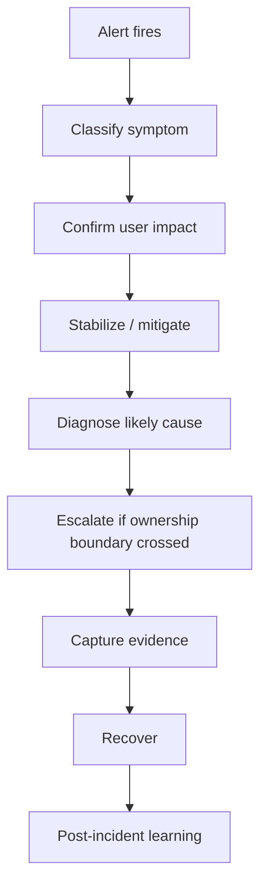
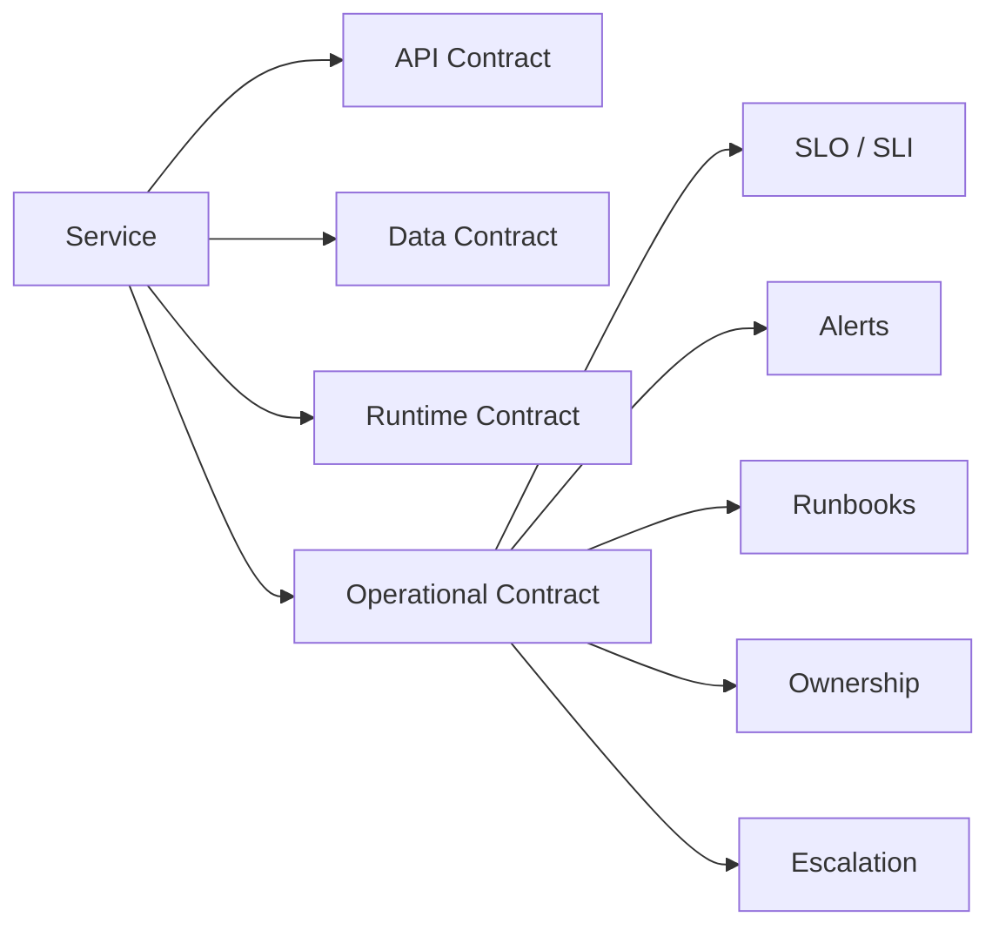
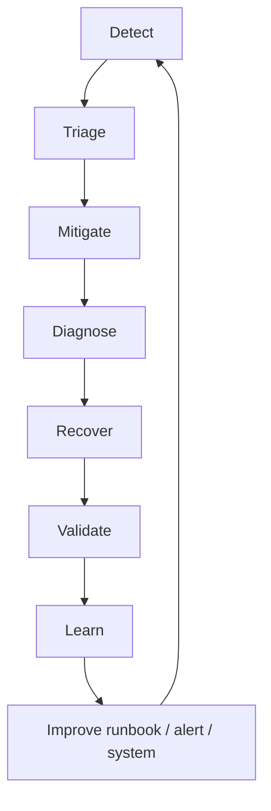
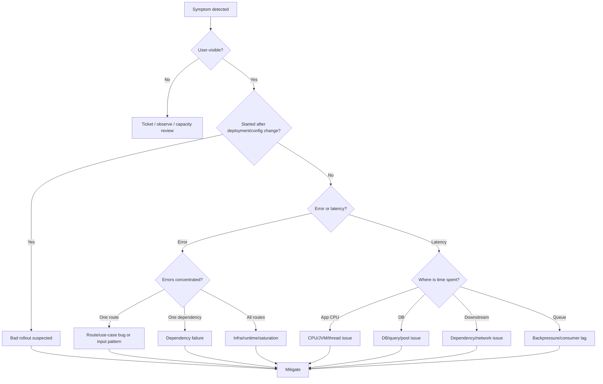
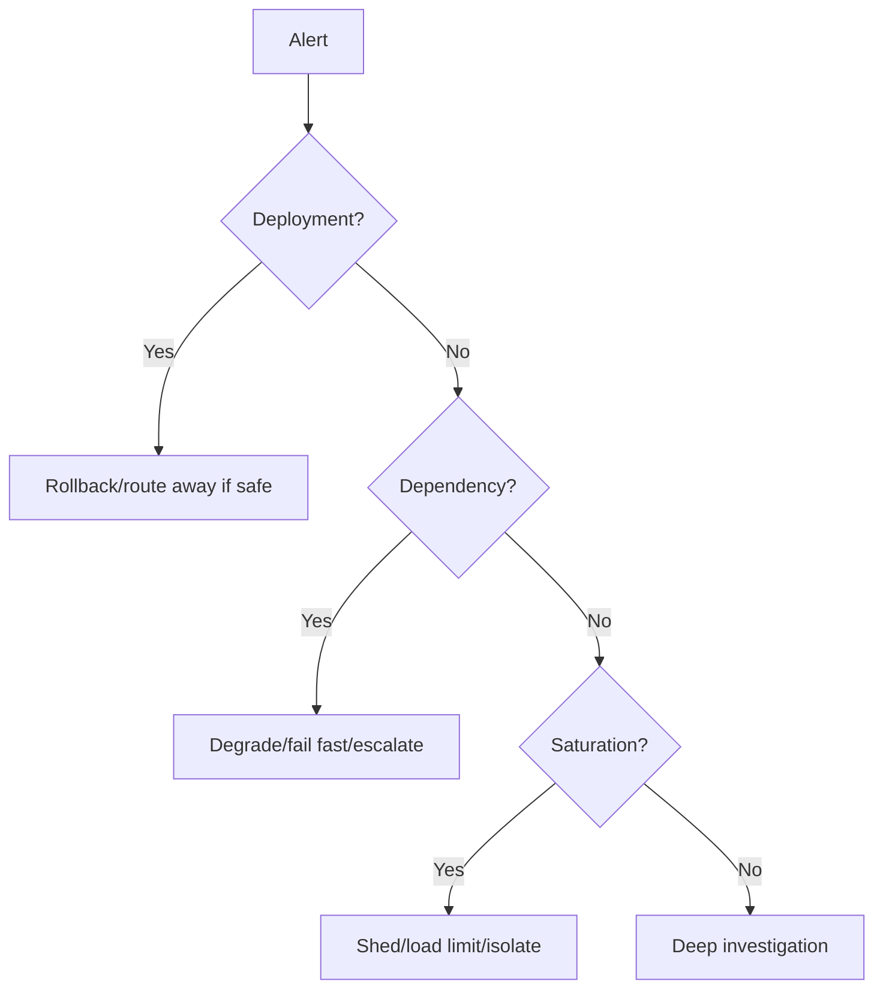

# Part 053 — Runbooks and Operational Playbooks

Runbook adalah jembatan antara telemetry dan tindakan.

Dashboard memberi sinyal.

Alert memanggil manusia.

Runbook menjawab: **apa yang harus dilakukan manusia itu sekarang?**

Di sistem microservices, engineer bisa melihat ratusan metric, puluhan log stream, dan ribuan span. Tanpa runbook, incident response mudah berubah menjadi eksplorasi liar: buka dashboard, klik trace, cari log, tanya Slack, restart service, lalu berharap masalah hilang.

Itu bukan operasi production-grade.

Operasi yang matang punya playbook yang membuat respons incident menjadi:

- cepat
- konsisten
- aman
- bisa diaudit
- bisa dilatih
- bisa diperbaiki setelah incident

Part ini membahas:

- perbedaan runbook, playbook, SOP, checklist, dan diagnostic tree
- struktur runbook yang bisa dipakai saat tekanan tinggi
- runbook-linked alert
- diagnosis tree untuk Java microservices
- known bad states catalog
- mitigation vs remediation
- escalation path
- evidence capture
- operational command safety
- runbook untuk HTTP API, async consumer, database, dependency, dan workflow
- executable runbook dan automation boundary
- runbook review checklist

---

## 1. Core Mental Model

Runbook bukan dokumentasi panjang.

Runbook adalah **decision support system untuk kondisi buruk**.

Ketika incident terjadi, cognitive bandwidth engineer turun. Orang yang biasanya sangat tajam bisa melewatkan langkah dasar: cek deployment terakhir, cek scope impact, cek apakah alarm duplicate, cek dependency, cek saturation, cek apakah restart aman.

Runbook yang baik mengurangi beban mental.



Perhatikan urutannya.

Runbook tidak dimulai dengan root cause.

Runbook dimulai dengan **stabilization**.

Dalam incident, pertanyaan pertama bukan:

> Kenapa ini terjadi?

Pertanyaan pertama adalah:

> Bagaimana kita membatasi dampak sekarang tanpa membuat keadaan lebih buruk?

Root cause boleh menunggu. User impact tidak selalu boleh menunggu.

---

## 2. Runbook vs Playbook vs SOP vs Checklist

Istilah ini sering dicampur. Untuk engineering organisasi besar, pemisahan ini berguna.

| Artifact | Tujuan | Contoh |
|---|---|---|
| Checklist | memastikan langkah tidak lupa | pre-deploy checklist, incident handoff checklist |
| SOP | prosedur rutin yang standar | rotate secret, drain pod, scale consumer |
| Runbook | panduan tindakan untuk alert/symptom tertentu | `Case API high 5xx`, `Kafka lag increasing` |
| Playbook | strategi respons untuk kelas incident | `regional dependency outage`, `database saturation`, `bad deployment` |
| Diagnostic tree | decision tree untuk mempersempit cause | latency berasal dari DB, downstream, queue, JVM, atau network |

Runbook biasanya lebih spesifik daripada playbook.

Playbook menjawab:

> Untuk kelas masalah ini, strategi kita apa?

Runbook menjawab:

> Alert ini berbunyi. Langkah pertama, kedua, ketiga apa?

---

## 3. Runbook Is Part of the Service Contract

Service production-grade tidak hanya punya API contract.

Ia juga punya **operational contract**.

Operational contract menjawab:

- apa SLO service ini?
- apa alert yang valid?
- siapa owner-nya?
- apa dashboard utama?
- apa dependency kritikal?
- apa safe mitigation?
- apa rollback path?
- apa known bad state?
- kapan harus escalate?
- evidence apa yang harus disimpan?

Runbook adalah manifestasi operational contract.

Jika service punya alert tapi tidak punya runbook, alert itu belum production-ready.



---

## 4. Anatomy of a Good Runbook

Runbook bagus harus bisa dipakai oleh engineer yang:

- sedang mengantuk
- belum hafal semua service
- tidak ikut menulis kode awal
- sedang menangani incident lintas tim
- butuh membuat keputusan cepat

Struktur minimal:

```md
# Runbook: <Alert/Symptom Name>

## Purpose
Apa masalah yang dicakup runbook ini.

## Severity Guidance
Kapan SEV1/SEV2/SEV3.

## Immediate Safety Notes
Hal yang tidak boleh dilakukan sembarangan.

## Confirm Impact
Cara mengonfirmasi apakah user/business terkena dampak.

## Fast Mitigation
Langkah aman untuk mengurangi dampak.

## Diagnosis Tree
Urutan investigasi berbasis telemetry.

## Known Bad States
Kondisi buruk yang pernah terjadi atau diperkirakan.

## Escalation
Kapan dan ke siapa eskalasi.

## Recovery Validation
Bagaimana memastikan sistem pulih.

## Evidence to Capture
Log, trace, metric, config, deployment, command, timeline.

## Post-Incident Follow-up
Item yang harus dibuat setelah incident.
```

Runbook bukan essay.

Runbook harus **actionable**.

Kalimat seperti ini buruk:

> Check the logs and investigate.

Kalimat seperti ini lebih baik:

> Open dashboard `case-api / server errors`. Filter by `route`, `status`, `exception_class`, and `deployment_version`. If error rate is concentrated in one route and one version, jump to “Bad Deployment Suspected”. If error rate is across all routes and dependency latency is high, jump to “Dependency Saturation Suspected”.

---

## 5. Alert-Linked Runbook

Alert tanpa runbook membuat on-call memulai dari nol.

Alert yang baik langsung membawa context:

- service
- environment
- region
- symptom
- SLO affected
- dashboard link
- trace search link
- log query link
- runbook link
- owner
- escalation channel

Contoh alert annotation:

```yaml
alert: CaseApiHighErrorRate
expr: |
  sum(rate(http_server_requests_seconds_count{
    service="case-api",
    status=~"5.."
  }[5m]))
  /
  sum(rate(http_server_requests_seconds_count{
    service="case-api"
  }[5m])) > 0.02
for: 10m
labels:
  severity: page
  service: case-api
  team: case-platform
annotations:
  summary: "case-api 5xx rate above SLO threshold"
  impact: "Users may fail to submit or update cases"
  dashboard: "https://observability.example/d/case-api"
  traces: "https://tracing.example/search?service=case-api&error=true"
  runbook: "https://runbooks.example/case-api/high-5xx"
  escalation: "#inc-case-platform"
```

Runbook harus tahu alert ini berasal dari symptom apa.

Jika alert berbasis SLO, runbook harus menghubungkan telemetry dengan user journey.

---

## 6. Incident Response Loop

Runbook tidak berdiri sendiri. Ia hidup dalam incident response loop.



Setiap incident harus memperbaiki minimal satu dari ini:

- alert
- dashboard
- trace/log instrumentation
- mitigation lever
- runbook
- architecture constraint
- test/fault injection
- deployment safety

Jika incident selesai tapi runbook tidak berubah, organisasi mungkin kehilangan pembelajaran.

---

## 7. Roles During Incident

Untuk incident besar, jangan biarkan satu orang melakukan semuanya.

Minimal role:

| Role | Responsibility |
|---|---|
| Incident commander | menjaga koordinasi, prioritas, keputusan |
| Tech lead / investigator | mendiagnosis dan memilih mitigation teknis |
| Scribe | mencatat timeline, command, decision, evidence |
| Communication lead | update stakeholder/customer/internal channel |
| Service owner | memberi domain/system knowledge |

Untuk incident kecil, satu orang bisa memegang beberapa role. Tetapi runbook tetap harus menjelaskan kapan incident butuh role split.

Tanda perlu role split:

- user impact luas
- banyak service/team terlibat
- ada customer/regulator-facing impact
- mitigation berisiko tinggi
- perlu komunikasi eksternal
- incident berlangsung lama

---

## 8. Severity Guidance

Runbook harus membantu menentukan severity.

Severity bukan “seberapa panik tim”. Severity adalah kombinasi:

- breadth of impact
- depth of impact
- business criticality
- duration
- regulatory/customer obligation
- workaround availability

Contoh severity untuk regulatory case-management:

| Severity | Condition |
|---|---|
| SEV1 | Semua user tidak bisa submit atau process enforcement case di production |
| SEV1 | Decision issuance salah secara sistemik atau audit trail hilang |
| SEV2 | Sebagian besar case processing gagal, workaround terbatas |
| SEV2 | SLA escalation terlambat secara luas |
| SEV3 | Satu capability lambat/gagal dengan workaround manual |
| SEV4 | Degradasi minor tanpa user-visible impact |

Runbook harus memberi guidance, bukan mengganti judgment.

---

## 9. Mitigation vs Remediation

Ini perbedaan penting.

**Mitigation** mengurangi dampak sekarang.

**Remediation** memperbaiki penyebab.

Contoh:

| Symptom | Mitigation | Remediation |
|---|---|---|
| 5xx setelah deploy | rollback/canary abort | fix bug dan tambah test |
| DB saturation | reduce traffic, shed noncritical query | optimize query/index/schema |
| Kafka lag | scale consumer, pause low-priority producer | fix slow handler/idempotency issue |
| Downstream timeout | degrade feature, open circuit | improve dependency reliability/contract |
| Memory leak | restart instances safely | fix leak and heap test |

Runbook harus mengutamakan mitigation aman sebelum root cause.

Namun mitigation juga punya risiko. Restart service tanpa memahami queue backlog bisa memperburuk lag. Scale consumer tanpa melihat DB saturation bisa memperberat database. Rollback tanpa memahami schema migration bisa merusak compatibility.

---

## 10. Safe Mitigation Rules

Mitigation aman harus memenuhi syarat:

1. reversible
2. bounded blast radius
3. tidak melanggar data integrity
4. tidak menyembunyikan audit evidence
5. bisa diverifikasi
6. punya owner jelas
7. punya timeout atau rollback plan

Contoh runbook note:

```md
## Immediate Safety Notes

Do not:
- restart all pods at once
- purge queues without approval from service owner
- disable audit event publishing
- manually update case state in DB unless emergency data-fix procedure is approved
- increase retry count during downstream outage

Safe first actions:
- confirm deployment version
- compare impacted routes
- reduce traffic to bad version
- enable degraded read-only mode for noncritical dashboard widgets
- scale read-side instances only if DB saturation is below threshold
```

Di regulated systems, “cepat” tidak boleh berarti “menghapus bukti”.

---

## 11. Diagnosis Tree: The Shape

Diagnosis tree mencegah investigasi acak.

Untuk microservices, tree dasar bisa seperti ini:



Tree ini harus disesuaikan per service.

Service command-heavy berbeda dengan query-heavy. HTTP API berbeda dengan async worker. Workflow coordinator berbeda dengan event projector.

---

## 12. Known Bad States Catalog

Known bad state adalah kondisi yang:

- pernah menyebabkan incident
- secara teori sangat mungkin terjadi
- punya signature telemetry yang jelas
- punya mitigation yang diketahui

Catalog ini mengubah pengalaman individual menjadi pengetahuan organisasi.

Template:

```md
## Known Bad State: <Name>

### Signature
- metric:
- log pattern:
- trace pattern:
- user symptom:

### Likely Causes
- cause 1
- cause 2

### Immediate Mitigation
- step 1
- step 2

### Unsafe Actions
- do not ...

### Validation
- metric returns to ...
- error stops ...

### Permanent Fix Ideas
- ...
```

Contoh:

```md
## Known Bad State: Kafka Consumer Lag Caused by DB Pool Saturation

### Signature
- `kafka_consumer_records_lag_max` rising for `case-events`
- `hikaricp_connections_pending` > 0
- DB CPU > 80%
- consumer handler trace shows most time in `CaseProjectionRepository.upsert`
- no increase in handler exception rate

### Likely Causes
- projection upsert query regressed
- new event version triggers expensive enrichment
- DB pool too small relative to consumer concurrency
- read model index missing after migration

### Immediate Mitigation
1. Do not simply scale consumers.
2. Reduce consumer concurrency by 50% if DB is saturated.
3. Pause noncritical projection consumers if available.
4. If caused by latest deployment, rollback projector version.
5. If lag threatens SLA, escalate to data platform/database owner.

### Unsafe Actions
- do not purge topic
- do not increase retry count
- do not scale consumers while DB pending connections are high

### Validation
- DB pending connections returns to 0
- lag stops increasing
- oldest unprocessed event age decreases
- projection freshness SLI recovers
```

Known bad states are not blame records.

They are memory systems.

---

## 13. Runbook for High 5xx in Java HTTP Service

A practical runbook must be specific enough.

Example:

```md
# Runbook: case-api high 5xx

## Purpose
Use when `case-api` 5xx rate threatens SLO for submit/update/read case user journeys.

## Confirm Impact
1. Open SLO dashboard `case-api / user journeys`.
2. Check whether failures affect:
   - `POST /cases`
   - `PATCH /cases/{id}`
   - `POST /cases/{id}/submit`
   - `GET /cases/{id}`
3. Check if error budget burn is active.
4. Check support/customer/regulatory-facing channel for reports.

## Fast Mitigation
If error rate started after deployment:
- stop rollout
- route traffic away from new version
- rollback if schema/config compatible

If error rate caused by dependency timeout:
- open circuit for optional dependency
- enable degraded mode if available
- fail fast instead of waiting full timeout

If error rate caused by DB saturation:
- shed noncritical reads
- reduce expensive query traffic
- disable optional dashboard widgets
- do not scale API if DB is already saturated

## Diagnosis
1. Group 5xx by route.
2. Group by exception class.
3. Group by deployment version.
4. Check dependency spans.
5. Check DB pool metrics.
6. Check JVM/thread metrics.
7. Check config changes.

## Escalation
Escalate to:
- case-platform owner if route-specific
- database owner if DB saturation
- identity/platform if auth dependency
- workflow team if submit triggers workflow failures

## Recovery Validation
- 5xx rate below threshold for 15 minutes
- successful submit/update synthetic checks pass
- no growing async backlog caused by failed command side effects
```

---

## 14. Java/Spring Metrics Needed by the Runbook

Runbook depends on telemetry shape. If telemetry is missing, runbook becomes vague.

For HTTP service:

- request count by route/method/status
- latency histogram by route/method/status
- exception class count
- dependency latency/error by target
- DB pool active/idle/pending
- thread pool active/queued/rejected
- JVM heap/nonheap/GC pause
- CPU/process load
- deployment version/build SHA
- feature flag state
- idempotency duplicate/replay count
- outbox pending age

Example Micrometer custom counter:

```java
package com.example.caseapi.observability;

import io.micrometer.core.instrument.Counter;
import io.micrometer.core.instrument.MeterRegistry;

public final class CaseCommandMetrics {
    private final Counter caseSubmitRejected;
    private final Counter caseSubmitAccepted;

    public CaseCommandMetrics(MeterRegistry registry) {
        this.caseSubmitRejected = Counter.builder("case_command_rejected_total")
                .tag("command", "submit_case")
                .description("Total rejected SubmitCase commands by business validation or safety gate")
                .register(registry);

        this.caseSubmitAccepted = Counter.builder("case_command_accepted_total")
                .tag("command", "submit_case")
                .description("Total accepted SubmitCase commands")
                .register(registry);
    }

    public void rejected(String reason) {
        // Do not create unbounded tags from raw validation messages.
        // Prefer stable reason taxonomy.
        caseSubmitRejected.increment();
    }

    public void accepted() {
        caseSubmitAccepted.increment();
    }
}
```

This example intentionally avoids dynamic tag value for `reason`. A real implementation might use a controlled enum tag such as `reason="invalid_state"`, but must avoid arbitrary high-cardinality labels.

---

## 15. Runbook for Latency Degradation

Latency incident needs different thinking from error incident.

A request can succeed but violate user experience or SLA.

```md
# Runbook: case-api high latency

## Confirm Impact
- Is p95/p99 above SLO or only average latency?
- Which route/user journey is affected?
- Is latency correlated with traffic increase?
- Is latency correlated with deployment or config change?

## First Split
- server processing time high?
- downstream span high?
- DB span high?
- queue wait high?
- client/network high?

## Common Signatures

### DB pool saturation
- `hikaricp_connections_pending` > 0
- request latency rises across DB-heavy routes
- DB spans dominate trace

Mitigation:
- shed noncritical reads
- disable expensive filters/sorts
- reduce consumer concurrency if consumers share DB
- rollback query-changing deployment

### Thread pool saturation
- executor queue grows
- active threads at max
- rejected tasks increase
- CPU may or may not be high

Mitigation:
- reduce ingress concurrency
- shed low-priority traffic
- avoid increasing thread pool without checking DB/downstream saturation

### Downstream latency
- trace shows dependency span dominates
- local CPU/DB normal
- circuit breaker slow-call rate high

Mitigation:
- fail fast
- use cached/stale value if allowed
- disable optional enrichment
- escalate to dependency owner
```

Latency debugging must avoid one trap: increasing capacity at the wrong layer.

If DB is saturated, adding API pods can increase pressure and worsen latency.

---

## 16. Runbook for Kafka/Event Consumer Lag

Async systems fail quietly. User-facing API may look healthy while business process is falling behind.

```md
# Runbook: case-event-projector lag increasing

## Confirm Impact
- Which topic/consumer group?
- Is lag increasing or stable?
- What is oldest unprocessed event age?
- Which read model/user journey depends on this projector?
- Is freshness SLO violated?

## Diagnosis Tree
1. Check consumer error rate.
2. Check handler latency.
3. Check DLQ count.
4. Check DB pool and query latency.
5. Check poison message signature.
6. Check deployment version.
7. Check upstream event volume spike.

## Mitigation
If handler failing on specific event:
- isolate poison message according to DLQ policy
- do not skip silently
- record event id and reason

If handler slow due to DB:
- reduce concurrency if DB saturated
- scale consumers only if DB has headroom
- pause low-priority projections

If upstream spike:
- calculate catch-up time
- increase partitions/consumer only if architecture supports it
- adjust producer rate if possible

## Recovery Validation
- lag trend negative
- oldest unprocessed event age decreasing
- projection watermark advances
- read model freshness SLO recovered
```

The key metric is often not raw lag count. It is **oldest unprocessed event age**.

A lag of 10,000 events may be harmless if events are tiny and catch-up is fast. A lag of 50 events may be severe if they block legal escalation SLA.

---

## 17. Runbook for Workflow Stuck

Long-running workflow requires lifecycle observability.

```md
# Runbook: enforcement workflow stuck

## Confirm Impact
- Which workflow type?
- How many instances stuck?
- Which state?
- How long in state?
- Is SLA/escalation deadline affected?
- Is this newly created or existing workflow version?

## Diagnosis
1. Group stuck instances by state.
2. Check timer jobs due but not executed.
3. Check external command/reply correlation.
4. Check worker availability.
5. Check workflow version/deployment.
6. Check failed task/event history.
7. Check if downstream dependency is rejecting commands.

## Mitigation
- restart worker only if job executor/worker is unhealthy
- pause new workflow starts if stuck state causes duplicate external commands
- replay/retry failed activity according to idempotency guarantees
- manually advance state only through approved operational command

## Unsafe Actions
- do not edit workflow DB directly
- do not replay non-idempotent external command without idempotency key
- do not delete workflow history

## Recovery Validation
- due timers are being consumed
- stuck state count decreases
- no duplicate decision/action emitted
- audit trail remains complete
```

Workflow incidents are dangerous because retrying can duplicate business side effects.

A runbook must know which activities are idempotent and which require manual approval.

---

## 18. Operational Commands as Code

Many mitigation steps become repeated commands:

- pause consumer
- resume consumer
- reduce concurrency
- enable degraded mode
- disable noncritical enrichment
- route away from version
- trigger projection rebuild
- replay DLQ event
- mark workflow for manual review

These commands should not be random shell snippets buried in Slack.

They should be operational APIs or controlled scripts with:

- authentication
- authorization
- audit logging
- dry-run mode
- idempotency
- input validation
- blast radius limit
- rollback path

Example operational command model:

```java
package com.example.caseops;

import java.time.Instant;
import java.util.UUID;

public record OperationalCommand(
        UUID commandId,
        String commandType,
        String targetService,
        String targetScope,
        String requestedBy,
        String reason,
        Instant requestedAt,
        boolean dryRun
) {}
```

Example safety gate:

```java
package com.example.caseops;

public final class OperationalSafetyGate {

    public void validate(OperationalCommand command) {
        if (command.reason() == null || command.reason().isBlank()) {
            throw new IllegalArgumentException("Operational command requires reason");
        }

        if (command.targetScope().equals("all-regions") && !isEmergencyApproved(command)) {
            throw new IllegalStateException("All-region operation requires emergency approval");
        }
    }

    private boolean isEmergencyApproved(OperationalCommand command) {
        // In production, check incident id, role, approval workflow, and audit policy.
        return command.reason().contains("INC-");
    }
}
```

Manual operations are part of the system.

If they bypass audit, they are hidden architecture.

---

## 19. Runbook Evidence Capture

During incident, capture evidence before it disappears.

Evidence types:

- alert start time and condition
- impacted service, route, region, tenant
- deployment version/build SHA
- config/feature flag state
- dashboard snapshots
- trace IDs
- representative log lines
- command executed
- mitigation timestamp
- owner decision
- user/business impact estimate
- recovery timestamp

Template:

```md
## Evidence Log

Incident ID: INC-2026-xxxx
Service: case-api
Environment: prod
Region: ap-southeast-1
Started: 2026-07-05T02:14:00+07:00
Detected by: SLO burn-rate alert
Impacted journey: Submit Case

### Timeline
- 02:14 alert fired: case-api high 5xx
- 02:16 impact confirmed: POST /cases/{id}/submit failing 7%
- 02:19 deployment v2026.07.05.3 identified as likely cause
- 02:22 rollout stopped
- 02:24 traffic shifted away from bad version
- 02:31 5xx back below SLO threshold

### Evidence
- dashboard link:
- trace IDs:
- log query:
- deployment diff:
- config diff:

### Decisions
- rollback chosen over feature flag because failure occurs before flag evaluation
- no manual DB change performed
```

For regulated environments, this is not bureaucracy. It is defensibility.

---

## 20. Escalation Path

Runbook must define escalation by boundary.

Escalation is not failure. It is correct ownership routing.

| Condition | Escalate To |
|---|---|
| unknown data integrity risk | service/domain owner + incident commander |
| database saturation beyond service pool | database/platform owner |
| dependency SLO breach | dependency owner |
| auth/token/mTLS failure | identity/platform owner |
| workflow duplicate side effect risk | workflow owner + domain owner |
| audit trail inconsistency | compliance/audit owner + domain owner |
| customer/regulator impact | incident commander + communication lead |

Bad escalation:

> Anyone know why prod is broken?

Good escalation:

> `case-api` submit journey SEV2. 5xx concentrated on `SubmitCaseHandler` in version `2026.07.05.3`. DB and downstream normal. Suspect null policy mapping introduced in latest deploy. Traffic shifted to previous version; error rate recovering. Need case-platform owner to confirm rollback safety for command schema change.

---

## 21. Runbook as Executable Knowledge

Runbooks often decay because they are separate from the system.

Better maturity levels:

| Level | Description |
|---|---|
| 0 | no runbook |
| 1 | static markdown with manual steps |
| 2 | linked to alerts and dashboards |
| 3 | contains copy-paste-safe queries and commands |
| 4 | has guarded automation for safe actions |
| 5 | continuously tested by drills or synthetic incidents |

Executable runbook does not mean fully automated incident response.

It means repeated, safe, bounded operations are codified.

Examples:

- generate incident context bundle
- find latest deployment for impacted service
- compare error by version
- list top exception classes
- check dependency health
- pause/resume consumer with audit
- flip degraded mode with expiration
- open incident channel with template

---

## 22. Example Incident Context Bundle

A simple Java service can expose an internal diagnostic endpoint, but be careful with security.

Better: build a protected admin command or observability query bundle.

Example model:

```java
package com.example.caseapi.diagnostics;

import java.time.Instant;
import java.util.List;
import java.util.Map;

public record IncidentContextBundle(
        String service,
        String environment,
        String region,
        String version,
        Instant generatedAt,
        Map<String, String> featureFlags,
        List<String> recentDeployments,
        List<String> topErrorClasses,
        Map<String, Double> dependencyP95Millis,
        Map<String, Long> queueOldestAgeSeconds
) {}
```

The goal is not to dump secrets or sensitive data.

The goal is to shorten the first 10 minutes of diagnosis.

---

## 23. Runbook Drift

Runbook drift happens when:

- service changed but runbook did not
- metric names changed
- dashboard moved
- owner changed
- mitigation no longer safe
- dependency topology changed
- feature flag removed
- alert threshold changed
- deployment process changed

Drift turns runbook into false confidence.

Prevention:

- runbook review as part of service readiness
- link runbook to service catalog
- test runbook in GameDay
- require runbook update after incident
- validate links automatically
- store metric/query snippets as code where possible
- include runbook in architecture review

---

## 24. Runbook Versioning

Runbook should be versioned with service or service catalog.

Useful metadata:

```yaml
runbook:
  id: case-api-high-5xx
  service: case-api
  owner: case-platform
  version: 2026.07.05
  appliesTo:
    environments: [prod, staging]
    regions: [ap-southeast-1, ap-southeast-3]
  alerts:
    - CaseApiHighErrorRate
    - CaseSubmitSloBurn
  lastReviewed: 2026-07-05
  reviewers:
    - case-platform-tech-lead
    - sre-oncall-representative
  maturity: 3
```

Runbook metadata makes it discoverable and auditable.

---

## 25. Runbook for Degraded Mode

Degraded mode must be designed before incident.

Example:

```md
# Runbook: Enable case dashboard degraded mode

## Purpose
Use when case dashboard read model or enrichment dependency is slow/unavailable, but core case command path remains healthy.

## Effect
- hides noncritical enrichment panels
- serves stale summary up to 15 minutes
- disables expensive filter facets
- keeps submit/update commands enabled

## Preconditions
- command API error rate below threshold
- audit read model available
- stale data warning banner enabled

## Command
opsctl feature set case-dashboard degraded-mode=true --ttl 2h --reason INC-xxxx

## Validation
- dashboard p95 below 1.5s
- no increase in command API errors
- user banner visible
- freshness metric clearly displayed

## Exit Criteria
- enrichment dependency recovered for 30 minutes
- projection freshness under 2 minutes
- no active burn-rate alert
```

Important: degraded mode must have TTL or explicit owner. Otherwise temporary mitigation becomes permanent architecture.

---

## 26. Runbook for Data Repair

Data repair is high risk.

Never treat manual DB update as normal runbook unless organization has mature approval and audit process.

A safer pattern:

1. identify inconsistent records
2. classify impact
3. generate repair proposal
4. dry-run validation
5. approval
6. execute through domain command
7. emit audit event
8. verify read model and downstream effects

Example repair proposal:

```java
package com.example.caseops.repair;

import java.util.List;
import java.util.UUID;

public record RepairProposal(
        UUID proposalId,
        String incidentId,
        String repairType,
        List<String> affectedCaseIds,
        String reason,
        boolean requiresApproval,
        List<String> expectedDomainEvents
) {}
```

Data repair should preserve domain semantics. Direct SQL may fix one table while breaking invariants, projections, audit, and downstream read models.

---

## 27. Runbook Testing

A runbook that has never been used or tested is a hypothesis.

Ways to test:

- tabletop exercise
- GameDay
- staging fault injection
- synthetic alert drill
- broken dashboard link check
- dry-run operational command
- new hire on-call simulation
- post-incident replay

Runbook test questions:

- Could someone unfamiliar with the service follow this?
- Are dashboard links valid?
- Are metric names still valid?
- Are commands safe to copy?
- Are unsafe actions explicit?
- Are mitigation steps reversible?
- Are escalation contacts current?
- Does recovery validation include user-facing symptom?

---

## 28. Anti-Patterns

### 28.1 “Check the logs” Runbook

This is not a runbook. It is an admission that diagnosis knowledge is not encoded.

Better:

- exact log query
- expected fields
- exception classes to group by
- correlation ID usage
- next decision based on result

### 28.2 Restart-First Culture

Restart can be useful, but as reflex it hides root cause and can worsen load.

Before restart:

- is there a memory leak?
- is queue backlog safe?
- will restart trigger stampede?
- are readiness/draining configured?
- will in-flight commands duplicate?
- is evidence captured?

### 28.3 Runbook Without Owner

No owner means no maintenance.

Every runbook needs owner and review date.

### 28.4 Dashboard-Only Runbook

Dashboard shows state. Runbook must explain action.

### 28.5 Unsafe Copy-Paste Command

Commands should include environment guard, dry-run, target scope, and reason.

Bad:

```bash
kubectl delete pod -l app=case-api
```

Better:

```bash
opsctl rollout restart case-api \
  --env prod \
  --region ap-southeast-1 \
  --max-unavailable 1 \
  --reason INC-2026-1234 \
  --dry-run
```

---

## 29. Architecture Review Questions

When reviewing a new Java microservice, ask:

1. What user journey alerts page humans?
2. Does each page alert link to a runbook?
3. Does the runbook include fast mitigation?
4. Are unsafe actions explicitly listed?
5. Does the service expose enough telemetry for the runbook?
6. Are operational commands audited?
7. Are data repair steps domain-safe?
8. Is degraded mode designed?
9. Are known bad states documented?
10. Is escalation by ownership boundary clear?
11. Can a new on-call follow this at 03:00?
12. Was runbook tested?

If answer is mostly no, the service is not operationally ready.

---

## 30. Minimal Runbook Template for This Series

Use this as baseline for each service.

````md
# Runbook: <Service> / <Symptom>

## Summary
- Service:
- Owner:
- Environment:
- Alert:
- SLO/User journey:

## Immediate Safety Notes
Do not:
- ...

Safe first actions:
- ...

## Confirm Impact
1. ...
2. ...

## Fast Mitigation
If deployment-related:
- ...

If dependency-related:
- ...

If saturation-related:
- ...

## Diagnosis Tree


## Known Bad States
- ...

## Escalation
- ...

## Recovery Validation
- ...

## Evidence to Capture
- ...

## Follow-up
- ...
````

---

## 31. Final Mental Model

Runbook adalah kode sosial-operasional.

Ia tidak mengeksekusi request, tetapi mengeksekusi organisasi saat sistem gagal.

Engineer top-level tidak hanya bisa mendesain service yang berjalan di happy path. Mereka mendesain service yang bisa:

- gagal dengan jelas
- didiagnosis cepat
- dimitigasi aman
- diekskalasi tepat
- dipulihkan terukur
- dipelajari setelah incident

Tanpa runbook, observability berhenti sebagai data.

Dengan runbook, observability menjadi tindakan.

---

## 32. Practical Exercise

Ambil satu service yang kamu punya atau bayangkan `case-api`.

Buat runbook untuk salah satu alert:

- high 5xx
- p99 latency high
- DB pool saturation
- Kafka lag increasing
- workflow stuck
- outbox pending age high

Wajib mencakup:

1. confirm impact
2. immediate safety notes
3. fast mitigation
4. diagnosis tree
5. known bad states
6. escalation path
7. recovery validation
8. evidence capture

Kemudian tanya:

> Apakah engineer baru bisa mengikuti ini tanpa bertanya ke pembuat service?

Jika tidak, runbook belum cukup baik.
