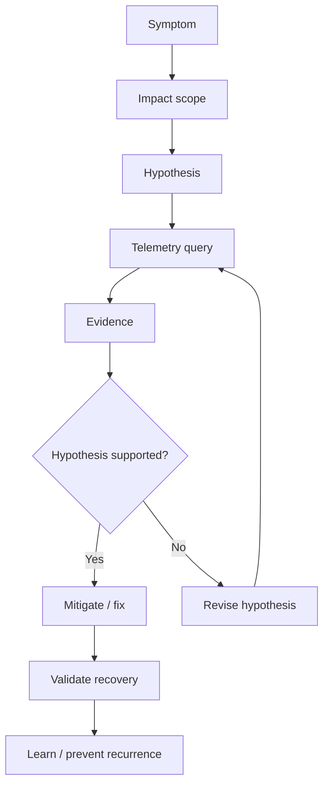
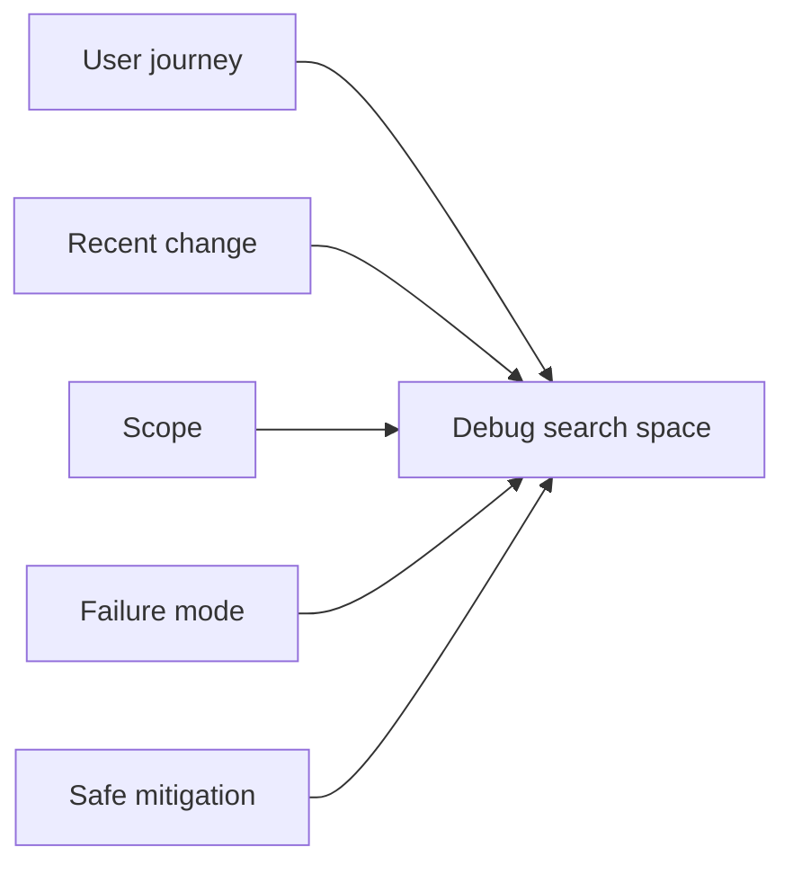
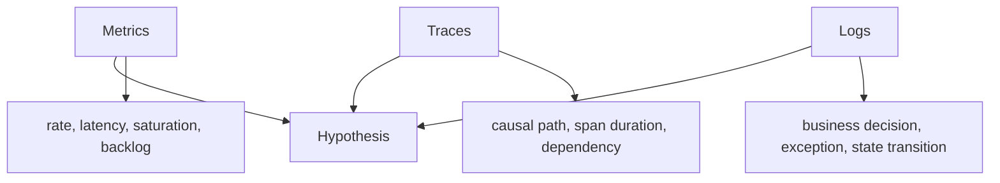
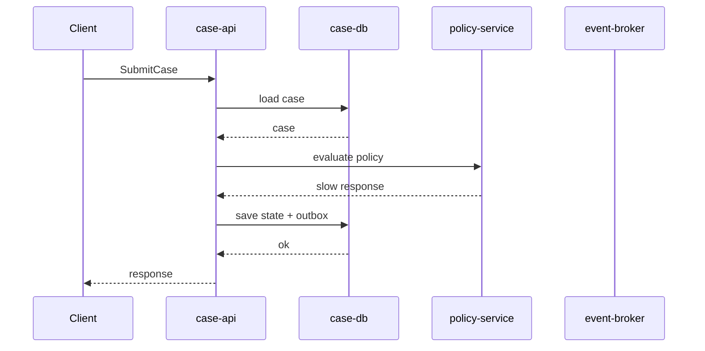
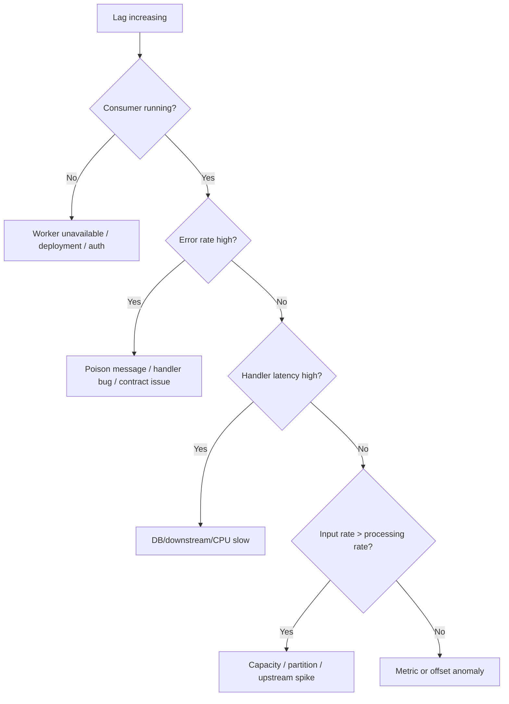
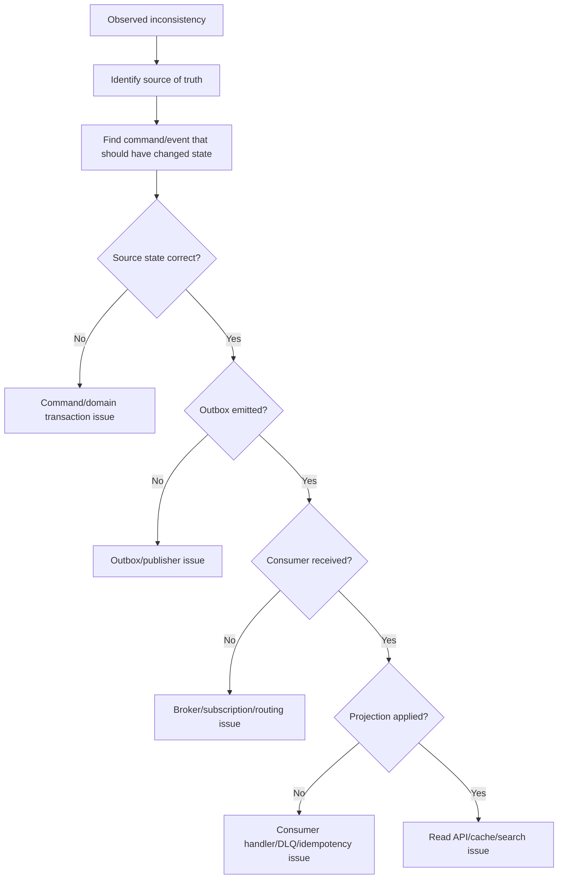
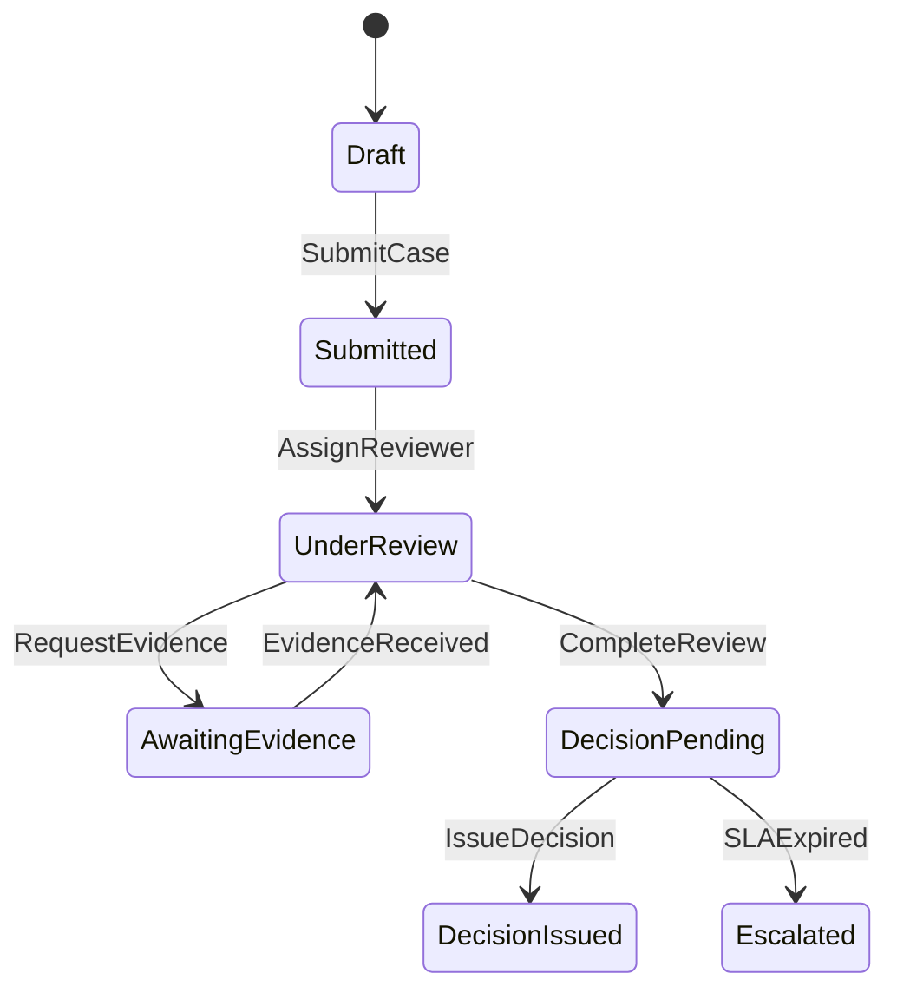
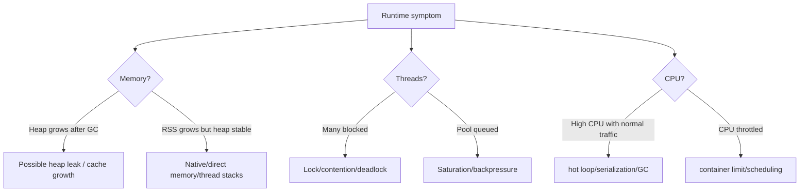
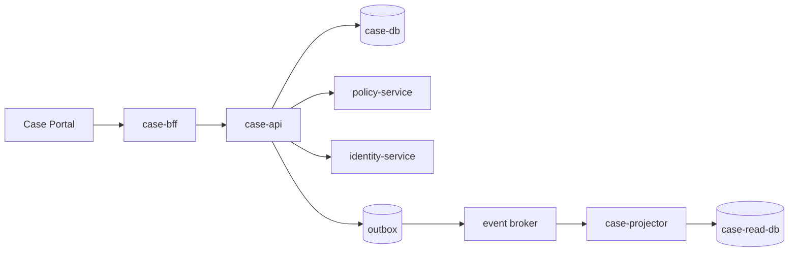
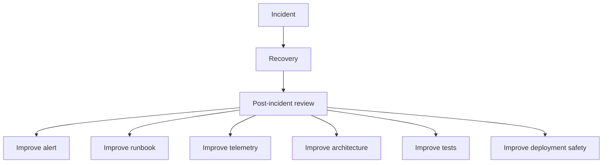

# Part 054 — Production Debugging Without Guessing

Production debugging bukan seni menebak.

Production debugging adalah proses mengubah symptom menjadi hipotesis, lalu menguji hipotesis dengan telemetry dan perubahan yang aman.

Di microservices, tebakan terasa menggoda karena sistem terlalu besar:

- banyak service
- banyak dependency
- banyak deployment
- banyak retry
- banyak queue
- banyak log
- banyak dashboard
- banyak tim

Engineer yang belum matang biasanya melakukan ini:

1. melihat alert
2. membuka dashboard acak
3. mencari log error
4. restart service
5. menunggu apakah membaik

Kadang berhasil. Tetapi itu bukan debugging. Itu trial-and-error di production.

Part ini membahas:

- debugging sebagai hypothesis loop
- symptom, signal, cause, dan mitigation
- trace-log-metric triangulation
- dependency graph diagnosis
- debugging latency
- debugging error rate
- debugging backlog/lag
- debugging data inconsistency
- debugging workflow stuck
- debugging deployment regression
- debugging JVM/runtime behavior
- avoiding false correlation
- incident timeline
- learning loop

---

## 1. Core Mental Model

Production debugging dimulai dari symptom.

Bukan dari log.

Bukan dari stack trace.

Bukan dari service yang paling sering disalahkan.



A good debugger does not ask:

> What can I click next?

A good debugger asks:

> What hypothesis am I testing, and what evidence would falsify it?

---

## 2. Vocabulary: Symptom, Signal, Cause, Mitigation

Keep these separate.

| Term | Meaning | Example |
|---|---|---|
| Symptom | user/system-visible bad outcome | submit case fails |
| Signal | telemetry indicating behavior | 5xx rate, trace span, log event |
| Cause | reason behavior changed | null mapping in new deploy |
| Mitigation | action reducing impact | rollback bad version |
| Remediation | long-term fix | add contract test and validation |

Common mistake: treating a signal as the cause.

Example:

> CPU is high, so CPU is the root cause.

Maybe CPU is high because retry storm increased traffic. Maybe retry storm happened because dependency latency increased. Maybe dependency latency increased because connection pool was exhausted. Maybe pool was exhausted because a new route forgot pagination.

Signal is evidence, not conclusion.

---

## 3. The First Five Questions

When alert fires, ask these before deep debugging:

1. What user journey or business process is affected?
2. What changed recently?
3. Is the impact localized or broad?
4. Is the system failing fast, failing slow, or silently falling behind?
5. What is the safest mitigation while diagnosis continues?

These questions create a search space.



Without scope, every service looks suspicious.

---

## 4. Impact Scope Matrix

Scope tells you where to look.

| Scope | Likely Class |
|---|---|
| one route | application bug, input pattern, validation, route dependency |
| all routes in one service | runtime saturation, config, deployment, common dependency |
| one tenant | tenant config, data shape, quota, authorization policy |
| one region | regional infra/dependency/network |
| one version | bad deployment |
| one dependency path | downstream issue, client timeout, contract change |
| async only | consumer, broker, projection, outbox, workflow |
| read side only | projection/read model/cache/search index |
| write side only | command validation, transaction, DB write, workflow start |

The strongest early debugging move is to reduce the problem space.

---

## 5. Trace-Log-Metric Triangulation

Metrics tell you **how much** and **when**.

Traces tell you **where time/errors flow**.

Logs tell you **what happened at decision points**.

None is enough alone.



Example:

- Metric: p99 latency for `SubmitCase` jumped from 800ms to 7s.
- Trace: 6.5s spent waiting on `PolicyService.evaluate`.
- Log: policy client timed out with `deadline_exceeded`, fallback disabled for enforcement cases.

Now you have a hypothesis:

> Submit latency is caused by policy dependency timeout path, and enforcement cases cannot degrade because fallback is intentionally disabled.

That is different from:

> case-api is slow.

---

## 6. Do Not Start With Logs

Logs are high-detail and low-shape.

If you start with logs, you often search for words matching fear:

- error
- exception
- timeout
- failed
- null

This can mislead. Every busy distributed system has background errors.

Start with shape:

- which route?
- which status?
- which version?
- which tenant?
- which dependency?
- which percentile?
- which queue?
- which state?

Then use logs to explain a narrowed slice.

Bad query:

```text
error case-api prod
```

Better query:

```text
service=case-api
route=POST /cases/{caseId}/submit
version=2026.07.05.3
status=500
trace_id exists
time between alert_start and alert_start+15m
| group by exception_class, policy_code, tenant_tier
```

---

## 7. Debugging High Error Rate

High error rate debugging starts with classification.

```mermaid
flowchart TD
  A["High error rate"] --> B{"HTTP status class?"}
  B -- "4xx" --> C["Client/input/auth/rate-limit?"]
  B -- "5xx" --> D["Server/dependency/runtime?"}
  B -- "timeout" --> E["Slow failure / missing deadline?"}

  D --> F{"Concentrated by route?"}
  F -- Yes --> G["Route-specific code or dependency"]
  F -- No --> H{"Concentrated by version?"}
  H -- Yes --> I["Deployment regression"]
  H -- No --> J{"Concentrated by dependency?"}
  J -- Yes --> K["Dependency failure"]
  J -- No --> L["Runtime/platform/common config"]
```

For 5xx:

- group by route
- group by exception class
- group by version
- group by instance/pod
- group by region
- group by tenant
- inspect representative traces
- compare with deployment/config timeline

For 4xx:

Do not ignore. A 4xx spike can indicate:

- bad frontend rollout
- auth token issue
- contract mismatch
- validation policy change
- customer integration breakage
- rate limit too aggressive
- tenant config error

4xx is not always “client fault” operationally.

---

## 8. Error Taxonomy in Java Service

Java service should classify errors into stable categories.

Example:

```java
package com.example.caseapi.errors;

public enum ErrorCategory {
    VALIDATION,
    AUTHORIZATION,
    CONFLICT,
    NOT_FOUND,
    DEPENDENCY_TIMEOUT,
    DEPENDENCY_REJECTED,
    DEPENDENCY_BAD_RESPONSE,
    DATABASE_TIMEOUT,
    DATABASE_CONFLICT,
    RUNTIME_BUG,
    CONFIGURATION,
    OVERLOAD,
    UNKNOWN
}
```

HTTP exception handler can emit structured problem response and metrics.

```java
package com.example.caseapi.api;

import com.example.caseapi.errors.ErrorCategory;
import io.micrometer.core.instrument.MeterRegistry;
import org.springframework.http.HttpStatus;
import org.springframework.http.ProblemDetail;
import org.springframework.web.bind.annotation.ExceptionHandler;
import org.springframework.web.bind.annotation.RestControllerAdvice;

import java.net.URI;

@RestControllerAdvice
public final class ApiExceptionHandler {
    private final MeterRegistry meterRegistry;

    public ApiExceptionHandler(MeterRegistry meterRegistry) {
        this.meterRegistry = meterRegistry;
    }

    @ExceptionHandler(DependencyTimeoutException.class)
    public ProblemDetail dependencyTimeout(DependencyTimeoutException ex) {
        meterRegistry.counter(
                "api_errors_total",
                "category", ErrorCategory.DEPENDENCY_TIMEOUT.name(),
                "dependency", ex.dependencyName()
        ).increment();

        ProblemDetail problem = ProblemDetail.forStatus(HttpStatus.GATEWAY_TIMEOUT);
        problem.setType(URI.create("https://errors.example/dependency-timeout"));
        problem.setTitle("Dependency timeout");
        problem.setDetail("A required dependency did not respond within the deadline.");
        problem.setProperty("category", ErrorCategory.DEPENDENCY_TIMEOUT.name());
        problem.setProperty("dependency", ex.dependencyName());
        return problem;
    }
}
```

The point is not the specific code.

The point is stable diagnosis vocabulary.

If every failure is `RuntimeException`, debugging becomes archaeology.

---

## 9. Debugging Latency

Latency debugging is about finding where time is spent.

Break down:

- ingress queue time
- application processing
- lock/contention time
- DB time
- downstream call time
- serialization/deserialization
- network time
- thread pool wait
- GC pause
- retry time
- timeout wait



If trace shows `Policy` span dominates, optimize local code later.

Do not tune JVM before looking at trace.

### Latency Questions

1. Did traffic increase?
2. Did latency increase at all percentiles or only tail?
3. Is p50 normal but p99 high?
4. Is latency route-specific?
5. Is latency version-specific?
6. Is time spent in DB, dependency, queue, or CPU?
7. Are retries increasing total time?
8. Are timeouts too long relative to user deadline?
9. Is thread pool queuing before work begins?
10. Is GC pause correlated with latency spikes?

p50 high means broad slowness.

p99 high means tail risk: contention, queueing, retries, noisy neighbor, slow dependency, GC, or lock.

---

## 10. The Queueing Trap

When utilization approaches capacity, latency can rise sharply before errors increase.

Symptoms:

- p99 latency grows
- thread/executor queue grows
- DB connection pending grows
- request count may be normal
- CPU may be below 100%
- error rate may still be low

This is why “CPU looks fine” is not enough.

A service can be saturated on:

- DB pool
- HTTP client connection pool
- executor queue
- Kafka partition ordering
- lock contention
- downstream quota
- disk IO
- external API concurrency limit

Debug saturation by resource, not by average CPU.

---

## 11. Debugging Backlog and Lag

For async systems, backlog debugging needs time-based thinking.

Key metrics:

- lag count
- oldest unprocessed message age
- consumer throughput
- handler latency
- handler error rate
- retry count
- DLQ count
- partition skew
- DB dependency latency
- projection watermark



Do not ask only:

> How much lag?

Ask:

> At current throughput, when will it catch up?

Catch-up estimate:

```text
catch_up_seconds = current_lag / max(consumer_rate - producer_rate, small_positive_value)
```

If producer rate is higher than consumer rate, backlog will not catch up without reducing input or increasing safe capacity.

---

## 12. Debugging Data Inconsistency

Data inconsistency in microservices usually appears as:

- command succeeded but read model stale
- read model has incorrect projection
- duplicate event applied
- out-of-order event overwrote newer state
- integration event missing
- outbox stuck
- downstream consumer skipped message
- manual repair bypassed domain event

Debug path:



The first rule: identify source of truth.

Do not debug stale projection as if it were authoritative domain state.

---

## 13. Data Debugging Checklist

For a case ID:

1. What service owns the authoritative state?
2. What command changed the state?
3. What transaction committed?
4. What outbox event was written?
5. Was event published?
6. Was event consumed?
7. Was event deduplicated incorrectly?
8. Was event applied out of order?
9. Was projection version advanced?
10. Is API reading from projection, cache, search index, or source?
11. Is there a reconciliation job?
12. Is audit trail complete?

Never patch the projection first unless you know why it diverged.

Otherwise you fix the symptom while leaving the divergence mechanism alive.

---

## 14. Debugging Workflow Stuck

Workflow stuck is a lifecycle problem.

Ask:

- stuck in which state?
- waiting for timer, message, human task, external reply, or worker?
- how many instances?
- one version or all versions?
- one tenant/case type?
- any recent deployment/config change?
- any command emitted but no reply?
- any duplicate correlation key?



If many workflows stuck in `DecisionPending`, do not inspect random logs first.

Classify:

- timer not firing?
- decision worker down?
- decision service rejecting command?
- policy service timeout?
- human approval not completed?
- version migration bug?
- correlation mismatch?

Workflow debugging must preserve audit trail. Do not manually mutate state without operational command and evidence capture.

---

## 15. Debugging Deployment Regression

Deployment regression is likely when symptom correlates with version.

Evidence:

- failures concentrated on new version
- canary users affected first
- deployment timestamp aligns with metric change
- rollback or traffic shift improves symptom
- old version still healthy under same traffic

But beware false correlation. Deployments happen often.

Debug with version dimension:

```text
Group by:
- service.version
- route
- exception_class
- dependency
- tenant_type
- region
```

Example pattern:

| Version | Request Rate | 5xx Rate | p95 |
|---|---:|---:|---:|
| 2026.07.05.2 | 500 rps | 0.1% | 420ms |
| 2026.07.05.3 | 50 rps | 9.8% | 6.1s |

Strong signal.

Mitigation likely:

- stop rollout
- shift traffic away
- rollback if compatible
- disable feature flag if isolated

But check:

- schema migration compatibility
- message contract compatibility
- config compatibility
- workflow version compatibility
- data written by new version

Rollback is not always free.

---

## 16. Debugging Configuration Regression

Config changes can be more dangerous than code changes because they bypass normal deployment visibility.

Symptoms:

- all pods affected at once
- no new build version
- behavior changed after config reload
- dependency endpoint changed
- timeout/retry/concurrency changed
- feature flag affected specific tenants

Debug config with an effective config snapshot.

Service should expose safe effective config metadata:

```java
package com.example.caseapi.config;

import java.time.Instant;
import java.util.Map;

public record EffectiveConfigReport(
        String service,
        String version,
        Instant generatedAt,
        Map<String, String> nonSecretConfig,
        Map<String, Boolean> featureFlags,
        Map<String, String> configSources
) {}
```

Never expose secrets.

Expose enough to debug:

- timeout values
- retry policy name
- endpoint identity, not secret credential
- feature flag state
- pool sizes
- degraded mode state
- circuit breaker config

---

## 17. Debugging JVM/Runtime Issues

Java runtime symptoms:

- high GC pause
- heap pressure
- native memory pressure
- thread exhaustion
- deadlock
- connection leak
- classloader/metaspace growth
- CPU hot loop
- blocked threads
- excessive allocation

Useful signals:

- heap used after GC
- GC pause histogram
- allocation rate
- thread count by state
- executor queue depth
- connection pool active/pending
- process CPU
- container CPU throttling
- RSS vs heap
- file descriptor count

Decision tree:



Do not immediately increase memory.

Increasing memory may delay failure and increase GC pause. First understand whether pressure is leak, load, cache, or transient spike.

---

## 18. Thread Dump Discipline

Thread dumps can be powerful, but must be interpreted with context.

Look for:

- many threads blocked on same lock
- many threads waiting for DB pool
- many threads waiting on HTTP client
- executor queue growth
- deadlock indicators
- request threads stuck beyond deadline
- common stack frame across many busy threads

Bad conclusion:

> Many threads are waiting, so the JVM is broken.

Better conclusion:

> 180 request threads are waiting on `HikariPool.getConnection`, while DB pending connections are high and query p99 increased after deployment. Hypothesis: DB pool exhaustion caused by slow query or insufficient pool relative to new traffic/concurrency.

Thread dump is evidence. It must be tied to metrics and traces.

---

## 19. Debugging Dependency Failure

Dependency failure can look like your service failure.

Classify dependency:

- required vs optional
- read vs write
- idempotent vs non-idempotent
- local region vs cross-region
- internal vs external
- degraded fallback available or not

Questions:

1. Is dependency error/latency visible in trace?
2. Is dependency failing for all callers or only us?
3. Did our traffic/retry pattern overload it?
4. Did dependency contract change?
5. Did auth/mTLS/token fail?
6. Are timeouts/deadlines aligned?
7. Are retries causing amplification?
8. Is circuit breaker open?
9. Is fallback safe for this user journey?

Dependency debugging is shared responsibility.

Do not only say “dependency is down”. Ask whether your client behavior is making it worse.

---

## 20. Avoiding False Correlation

Production systems have many simultaneous events.

False correlations:

- deploy happened near incident, but traffic spike caused saturation
- CPU high, but caused by retry storm
- DB slow, but caused by API fan-out change
- cache miss high, but caused by key format change
- Kafka lag high, but caused by downstream DB saturation
- one error log appears frequently, but is benign background noise

How to reduce false correlation:

- compare before/after
- compare impacted/unimpacted route
- compare impacted/unimpacted version
- compare impacted/unimpacted region
- compare impacted/unimpacted tenant
- compare dependency callers
- verify mitigation effect
- check timeline precisely

A hypothesis is stronger when it explains:

- why this symptom
- why now
- why this scope
- why this magnitude
- why this mitigation worked

---

## 21. The Timeline Is a Debugging Tool

Incident timeline is not admin paperwork.

It is causal analysis.

Example:

```md
02:00 deploy case-api v2026.07.05.3 started canary 5%
02:04 p99 submit latency increased on v2026.07.05.3 only
02:06 policy-service call volume doubled from case-api
02:08 policy-service p95 increased
02:09 case-api retries increased from 0.2/s to 80/s
02:10 SLO burn alert fired
02:12 canary halted
02:15 traffic shifted away from v2026.07.05.3
02:21 retry volume normalized
02:25 p99 recovered
```

This timeline suggests:

- new version changed policy call behavior
- retry amplification may have worsened dependency latency
- canary halt/traffic shift mitigated

Without timeline, people argue from memory.

---

## 22. Debugging by Differential Diagnosis

Borrow from medicine: compare similar things.

| Compare | Question |
|---|---|
| old version vs new version | deployment regression? |
| region A vs region B | regional infra/dependency? |
| route A vs route B | endpoint-specific code/dependency? |
| tenant A vs tenant B | tenant config/data shape/quota? |
| p50 vs p99 | broad slowness or tail issue? |
| read path vs write path | projection/cache vs command transaction? |
| sync path vs async path | API or background processor? |
| dependency callers | dependency global or client-specific? |

Differential debugging narrows cause faster than full-system browsing.

---

## 23. Debugging With Dependency Graph

Every service should have a dependency graph.

Logical graph:



Runtime graph adds:

- version
- region
- traffic rate
- error rate
- latency
- saturation
- retry rate
- circuit breaker state

During debugging, annotate the graph.

```text
case-bff -> case-api: normal
case-api -> case-db: p95 normal, pool normal
case-api -> policy-service: p95 8s, timeout 9s, retry rate high
case-api -> identity-service: normal
case-projector: lag normal
```

The annotated graph becomes your live mental model.

---

## 24. Representative Trace Selection

Do not inspect random traces.

Select representative traces by class:

- failed request trace
- slow successful trace
- normal successful trace
- old version trace
- new version trace
- impacted tenant trace
- unimpacted tenant trace

Compare structure:

- same spans?
- new span added?
- span duration changed?
- retry spans repeated?
- DB query count changed?
- fan-out increased?
- serialization span high?
- missing propagation?

Trace debugging is comparative.

Single trace tells a story. Paired traces explain what changed.

---

## 25. Production Debugging Queries

Keep reusable query patterns.

### Error by Route and Version

```text
service = "case-api"
status >= 500
time >= alert_start
| group by route, version, exception_class
| sort count desc
```

### Latency by Dependency

```text
trace.service = "case-api"
route = "POST /cases/{caseId}/submit"
time >= alert_start
| group spans by dependency_service
| percentile duration_ms p50,p95,p99
```

### Deployment Correlation

```text
service = "case-api"
time between alert_start-2h and alert_start+1h
| show deployments, config_changes, feature_flag_changes, error_rate, p99_latency
```

### Queue Catch-up

```text
consumer_group = "case-projector"
topic = "case-events"
| show lag, oldest_event_age, consume_rate, produce_rate, handler_latency_p95, error_rate
```

### Tenant Isolation

```text
service = "case-api"
route = "POST /cases/{caseId}/submit"
time >= alert_start
| group by tenant_id_hash, tenant_tier, status
| sort error_rate desc
```

Use tenant hash or controlled tenant ID representation to avoid leaking sensitive information.

---

## 26. Java Instrumentation for Debuggability

Production debugging quality is decided before incident.

Your Java code should emit stable, low-cardinality diagnostic fields.

Example command handling log:

```java
package com.example.caseapi.application;

import org.slf4j.Logger;
import org.slf4j.LoggerFactory;

public final class SubmitCaseHandler {
    private static final Logger log = LoggerFactory.getLogger(SubmitCaseHandler.class);

    public SubmitCaseResult handle(SubmitCaseCommand command) {
        log.info("case_command_started command=submit_case case_id={} actor_type={} expected_version={}",
                command.caseId(),
                command.actorType(),
                command.expectedVersion());

        try {
            SubmitCaseResult result = doHandle(command);

            log.info("case_command_completed command=submit_case case_id={} new_state={} emitted_events={}",
                    command.caseId(),
                    result.newState(),
                    result.emittedEventTypes());

            return result;
        } catch (BusinessRuleViolation ex) {
            log.warn("case_command_rejected command=submit_case case_id={} reason={} current_state={}",
                    command.caseId(),
                    ex.reasonCode(),
                    ex.currentState());
            throw ex;
        }
    }

    private SubmitCaseResult doHandle(SubmitCaseCommand command) {
        // application orchestration omitted
        throw new UnsupportedOperationException("example");
    }
}
```

Structured logging format should be JSON in production. This snippet uses message placeholders only for readability.

Avoid logging raw PII, request bodies, tokens, or documents.

---

## 27. Debuggable Error Responses

User-facing error response should not leak internals, but it should include correlation.

Example:

```json
{
  "type": "https://errors.example/dependency-timeout",
  "title": "Temporary service issue",
  "status": 504,
  "detail": "The request could not be completed right now.",
  "instance": "/cases/C-123/submission-attempts/REQ-456",
  "correlationId": "01J2ABCDEF...",
  "errorCategory": "DEPENDENCY_TIMEOUT"
}
```

The user does not need stack trace.

The support/on-call team needs correlation ID and stable category.

---

## 28. Debugging Without Production Shell Access

Mature systems reduce the need to SSH into production.

Prefer:

- telemetry
- controlled admin APIs
- read-only diagnostic bundles
- audited operational commands
- service catalog metadata
- deployment history
- config snapshot
- trace/log/metric correlation

Shell access is powerful but risky:

- inconsistent manual steps
- weak audit trail
- easy secret exposure
- accidental destructive commands
- knowledge trapped in individuals

If debugging requires shell access every time, architecture is missing operational surfaces.

---

## 29. When to Mitigate Before Root Cause

Mitigate first when:

- user impact is active
- error budget burn is high
- data loss or duplicate side effect risk is increasing
- queue backlog threatens SLA
- dependency overload may cascade
- regulatory deadline may be missed

Continue diagnosis after stabilization.

But do not choose unsafe mitigation.

Example:

- Do rollback if version-specific and compatible.
- Do not rollback if new version performed irreversible schema/data migration and old version cannot handle new data.
- Do degrade optional feature if business allows stale/partial data.
- Do not degrade audit/event publishing if it breaks evidence chain.

---

## 30. The Debugging Notebook

During incident, maintain a live notebook:

```md
## Current Symptom
Submit case p99 high and 5xx above SLO.

## Impact Scope
- prod only
- ap-southeast-1 only
- route: POST /cases/{id}/submit
- version: 2026.07.05.3 mostly

## Hypotheses
H1: deployment regression in policy mapping
H2: policy-service outage independent of case-api
H3: DB saturation causing timeout

## Evidence
- DB pool normal: H3 weakened
- policy span dominates trace: H1/H2 strengthened
- old version normal calling same policy-service: H1 strengthened

## Mitigation
Traffic shifted away from v2026.07.05.3 at 02:15.

## Next Test
Compare request payload shape and policy calls between v2026.07.05.2 and v2026.07.05.3.
```

This avoids team memory drift.

---

## 31. Anti-Patterns

### 31.1 Restart as Debugging

Restart is mitigation at best, not explanation.

If restart helps, ask:

- memory leak?
- connection leak?
- stale DNS?
- stuck thread pool?
- bad cache state?
- deadlock?

### 31.2 Dashboard Wandering

Opening dashboard after dashboard without hypothesis wastes time.

Every dashboard view should answer a question.

### 31.3 Root Cause Too Early

Declaring root cause before evidence creates anchoring bias.

Say:

> Current leading hypothesis is...

not:

> The root cause is...

until confirmed.

### 31.4 Ignoring Successful Slow Requests

For latency issues, successful requests may contain the strongest evidence.

### 31.5 Treating Dependency Failure as External Blame

Your timeout, retry, and circuit breaker policy is part of the failure.

### 31.6 Debugging Projection as Source of Truth

Read model inconsistency must be traced back to authoritative state and event path.

### 31.7 No Evidence Capture Before Mitigation

Mitigation can erase evidence. Capture enough before rollback/restart if safe.

---

## 32. Post-Incident Learning Loop

Production debugging ends with learning, not recovery.

After incident:

- what signal detected it?
- did alert fire early enough?
- did runbook work?
- what telemetry was missing?
- what hypothesis was wrong?
- what mitigation worked?
- what made diagnosis slow?
- what architectural constraint would prevent recurrence?
- what test would catch it earlier?
- what automation would reduce toil?



Avoid postmortems that only produce “be more careful”.

Good action items change the system.

---

## 33. Production Debugging Readiness Checklist

A Java microservice is easier to debug when it has:

- stable route names in metrics
- deployment version in telemetry
- correlation/trace ID in logs and error responses
- dependency span attributes
- controlled error category taxonomy
- business command logs
- state transition logs
- outbox/inbox IDs
- projection watermark metric
- queue oldest age metric
- DB pool metrics
- client connection pool metrics
- JVM runtime metrics
- effective config report
- feature flag state visibility
- operational command audit
- runbook-linked alerts
- service catalog ownership

If these are missing, production debugging becomes guesswork.

---

## 34. Architecture Review Questions

Ask before approving service for production:

1. Can we identify impacted route/user journey in under two minutes?
2. Can we compare old vs new version behavior?
3. Can we tell whether latency is DB, dependency, queue, CPU, or lock?
4. Can we trace a command to its outbox event?
5. Can we trace an event to projection update?
6. Can we tell whether config changed?
7. Can we safely mitigate without shell access?
8. Can support provide a correlation ID?
9. Can we debug one tenant without exposing PII?
10. Can we reconstruct incident timeline?
11. Can we distinguish source-of-truth state from read model state?
12. Can we validate recovery with user-facing SLI?

These questions are architecture questions, not only observability questions.

---

## 35. Final Mental Model

Production debugging is disciplined inference under pressure.

The strongest engineers do not merely know tools. They know how to reason through distributed failure:

- define symptom
- reduce scope
- form hypothesis
- test with telemetry
- mitigate safely
- validate recovery
- preserve evidence
- improve the system

A microservice architecture is production-grade only when it can be understood during failure.

If it only makes sense in design diagrams, it is not yet operational architecture.

---

## 36. Practical Exercise

Take this incident:

> Users report that submitting enforcement cases is slow. SLO burn-rate alert fires for `SubmitCase`. Error rate is still low, but p99 latency is 12 seconds. A new version of `case-api` was deployed 20 minutes ago. Kafka lag is normal. DB CPU is normal. Traces show repeated calls to `policy-service`.

Write a debugging notebook:

1. current symptom
2. impact scope
3. first three hypotheses
4. telemetry queries to test each hypothesis
5. safest mitigation
6. recovery validation
7. evidence to capture
8. likely follow-up actions

Then answer:

> What evidence would convince you this is a case-api regression rather than a policy-service outage?

That question is the heart of production debugging.
