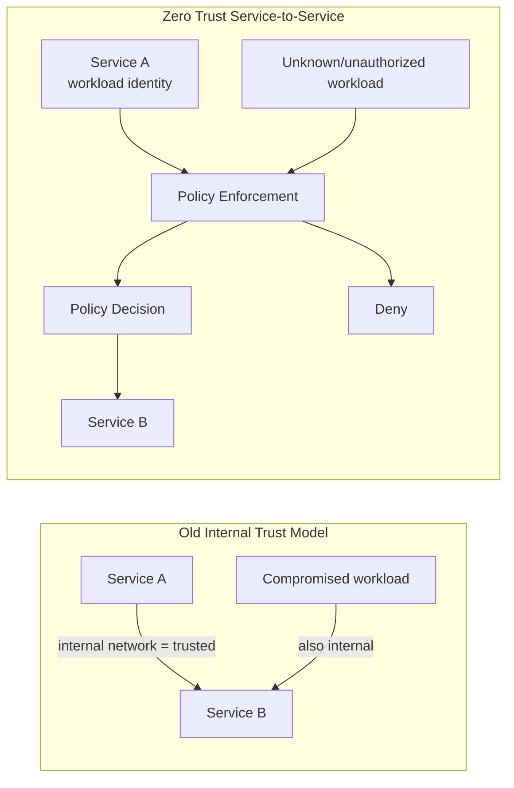
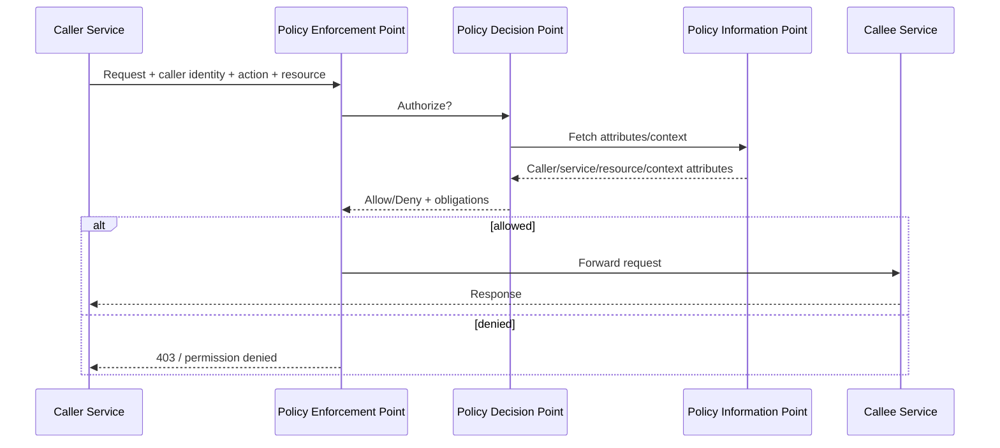
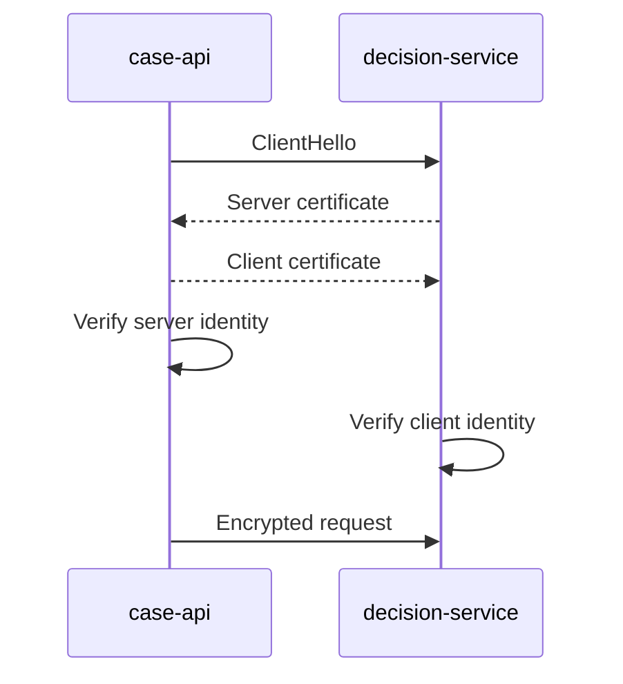
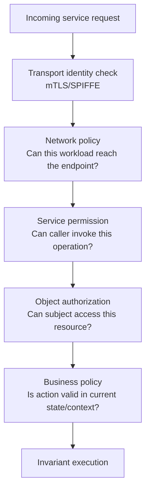
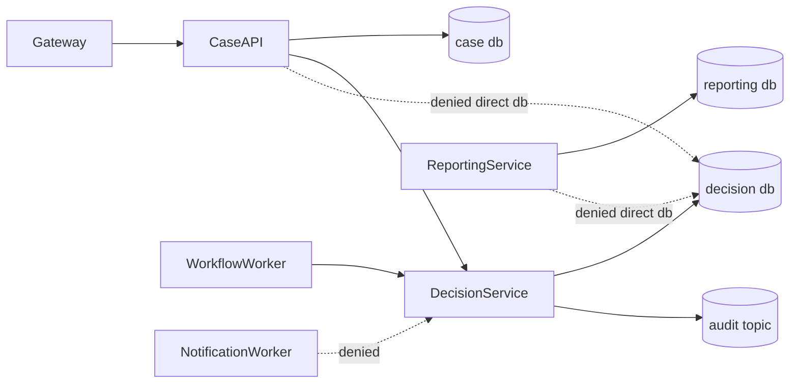
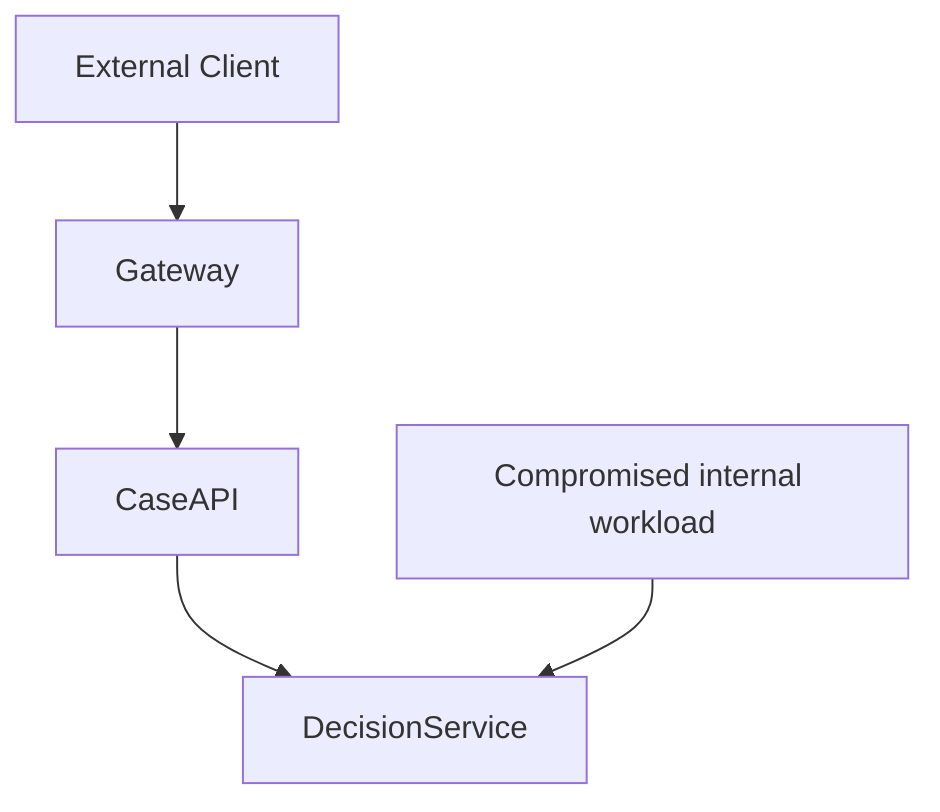
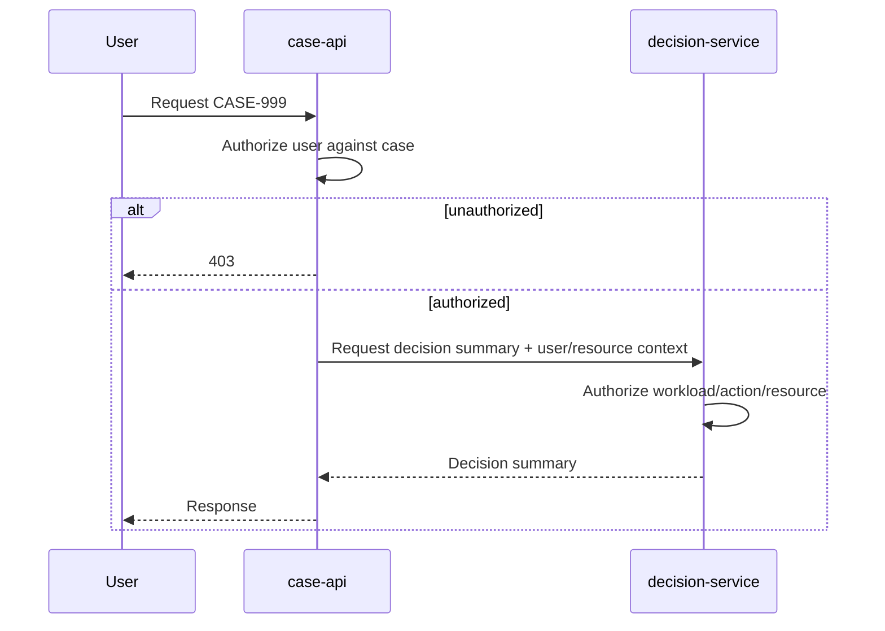
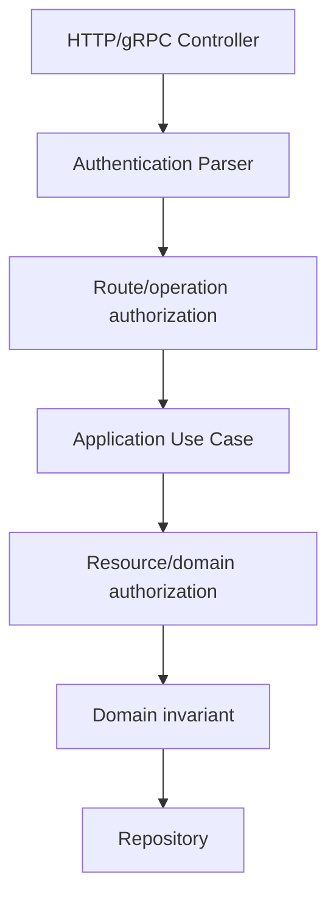
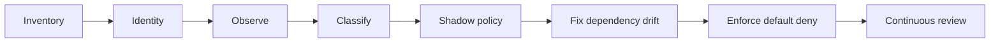

# Part 055 — Zero Trust Service-to-Service Architecture

Zero trust bukan slogan.

Zero trust adalah keputusan arsitektur bahwa lokasi jaringan tidak boleh menjadi sumber kepercayaan.

Di microservices, asumsi lama biasanya seperti ini:

> Kalau request datang dari internal network, berarti aman.

Asumsi itu gagal di sistem modern.

Kenapa?

Karena service berjalan di banyak pod, node, cluster, region, pipeline, sidecar, job, worker, dan environment. Deployment berubah cepat. Credential bisa bocor. Pod bisa disusupi. Internal API bisa dipanggil oleh service yang salah. Debug endpoint bisa terbuka. Network path bisa berubah. Jika keamanan hanya bergantung pada “ini traffic internal”, maka satu breach bisa berubah menjadi lateral movement.

Zero trust service-to-service berarti:

1. setiap workload punya identity yang bisa diverifikasi
2. setiap request dievaluasi berdasarkan identity, action, resource, context, dan policy
3. transport security tidak dianggap cukup untuk business authorization
4. network segmentation mengurangi blast radius, bukan menjadi satu-satunya kontrol
5. observability dan audit membuktikan siapa memanggil apa, kapan, dan untuk tujuan apa

Part ini membahas zero trust untuk **komunikasi antar service**, bukan login user, OAuth tutorial, atau authorization domain secara mendalam. Authentication/authorization user sudah punya seri tersendiri. Di sini kita fokus pada keputusan arsitektur microservices.

---

## 1. Core Mental Model

Zero trust dalam microservices adalah perubahan dari **network trust** ke **workload identity + policy trust**.



The question changes.

Old model:

> Is the caller inside the network?

Zero trust model:

> Who is the caller, what is it allowed to do, on which resource, under which context, and can we prove it?

For Java microservices, this affects:

- HTTP clients
- gRPC clients
- messaging consumers
- batch jobs
- scheduled workers
- database access
- cache access
- admin endpoints
- service mesh configuration
- Kubernetes network policy
- audit logs
- incident response

---

## 2. What Zero Trust Is Not

Zero trust is not:

- “use JWT everywhere”
- “put everything behind API Gateway”
- “enable mTLS and call it done”
- “install service mesh and forget application security”
- “block all network access until developers suffer”
- “replace domain authorization with infrastructure authorization”
- “encrypt internal traffic only”

mTLS answers:

> Can I cryptographically verify the peer identity and protect transport?

It does not answer:

> Is this caller allowed to approve this enforcement decision?

Service mesh answers:

> Can the platform enforce transport and routing policy?

It does not fully answer:

> Does this request satisfy business-level policy?

Zero trust requires layered decisions.

---

## 3. Service-to-Service Threat Model

A useful architecture starts with threat paths.

In microservices, common service-to-service threats include:

| Threat | Example | Architectural Control |
|---|---|---|
| Service impersonation | Fake service calls `decision-service` | Workload identity, mTLS, SPIFFE/SVID |
| Lateral movement | Compromised pod calls internal admin APIs | Network policy, service authz, least privilege |
| Credential leakage | Static service token copied from config | Short-lived credentials, rotation, secret manager |
| Confused deputy | Service A tricks Service B to access resource | Caller context propagation, resource authorization |
| Over-permissive service account | One service account used by many workloads | Per-service identity, scoped RBAC |
| Missing object authorization | Caller can access another tenant/case | Object-level authorization in callee |
| Internal debug endpoint exposure | `/actuator/env` exposed internally | Endpoint hardening, network policy, auth |
| Replay/duplicate command | Retried privileged command executes twice | Idempotency, nonce, command identity |
| Message forgery | Unauthorized producer emits domain event | Producer identity, topic ACL, event signature/policy |
| Policy drift | Mesh allows calls app no longer expects | Policy-as-code, contract review, drift detection |

A strong design does not ask “which tool do we install?” first.

It asks:

> Which path can an attacker or faulty workload use to cross a boundary it should not cross?

---

## 4. The Zero Trust Control Plane Model

A zero-trust model usually separates three concerns:

1. **Policy Enforcement Point** — where access is blocked or allowed
2. **Policy Decision Point** — where decision is evaluated
3. **Policy Information Point** — where attributes/context come from



In microservices, PEP can live in several places:

| PEP Location | Good For | Weakness |
|---|---|---|
| API Gateway | edge user traffic | insufficient for east-west traffic |
| Service mesh sidecar | mTLS, service identity, coarse routing authz | weak business context |
| Application middleware | route/action/resource policy | needs consistent implementation |
| Domain/application service | object and business invariant authorization | cannot replace transport security |
| Message broker ACL | producer/consumer/topic policy | weak payload-level authorization |
| Database permission | final data access guard | too low-level for business intent |

The mature architecture uses multiple PEPs, but each PEP owns the right level of decision.

---

## 5. Workload Identity

User identity is not enough.

A service call has at least two identities:

1. **end-user identity** — the human or external client who initiated the action
2. **workload identity** — the service/job/worker that is calling another service

For example:

```text
User: investigator-123
Caller workload: case-api
Callee workload: decision-service
Action: proposeDecision
Resource: case:CASE-2026-001
Tenant: regulator-id
```

The callee needs to reason about both:

- Is `case-api` allowed to call `decision-service.proposeDecision`?
- Is `investigator-123` allowed to propose a decision for `CASE-2026-001`?
- Is this request inside the correct tenant and jurisdiction?
- Is the case in a state that allows proposal?
- Is there a conflict-of-interest constraint?

Workload identity protects service-to-service trust.

User identity protects user action authorization.

Domain state protects business invariants.

---

## 6. SPIFFE-Style Identity

A workload identity should be:

- unique
- cryptographically verifiable
- short-lived
- automatically rotated
- bound to runtime attestation
- independent from IP address
- independent from mutable pod name
- usable across heterogeneous platforms

A SPIFFE-style identity looks like this:

```text
spiffe://regulator.example/ns/enforcement/sa/case-api
spiffe://regulator.example/ns/enforcement/sa/decision-service
spiffe://regulator.example/ns/reporting/sa/audit-projector
```

The important part is not the string format itself.

The important part is that service identity becomes explicit and policy-addressable.

Bad identity model:

```text
Caller is 10.8.14.91
```

Better identity model:

```text
Caller is workload case-api in namespace enforcement, attested by cluster identity control plane.
```

---

## 7. mTLS as Transport Identity

mTLS gives two properties:

1. encrypted transport
2. mutual peer authentication

In regular TLS, the client verifies the server.

In mTLS, both sides verify each other.



This is useful because service B can know:

> The caller is not merely “some pod on the network”; it is a cryptographically authenticated workload.

But do not overstate mTLS.

mTLS does not automatically enforce:

- object authorization
- tenant isolation
- business policy
- endpoint-specific permissions
- rate limiting
- payload validation
- audit completeness
- data minimization

mTLS says “who is talking”.

Authorization says “what may they do”.

---

## 8. Service-to-Service Authorization Layers

A strong architecture has layered authorization.



Example authorization matrix:

| Caller | Endpoint | Service Permission | Object Policy | Business Policy |
|---|---|---|---|---|
| `case-api` | `POST /decision-proposals` | allowed | user must be assigned investigator | case must be `UNDER_REVIEW` |
| `audit-projector` | `GET /decisions/{id}` | allowed read-only | system read by event reference | decision must not be sealed |
| `notification-worker` | `POST /decisions/{id}/notify` | denied | n/a | n/a |
| `reporting-service` | `GET /case-summary/{id}` | allowed | tenant/jurisdiction scoped | redacted view only |

This table is more valuable than a vague statement like:

> Internal services authenticate each other.

---

## 9. Network Policy Is Blast-Radius Control

Kubernetes NetworkPolicy can limit which pods can communicate.

This is valuable, but it is not full authorization.

Network policy can express:

> `case-api` pods may connect to `decision-service` pods on port 8080.

It usually cannot express:

> `case-api` may call `POST /decision-proposals` only for cases assigned to the current investigator.

So network policy is a **coarse boundary**.

It reduces lateral movement.

It should be paired with application/service authorization.

Example conceptual policy:

```yaml
apiVersion: networking.k8s.io/v1
kind: NetworkPolicy
metadata:
  name: decision-service-ingress
  namespace: enforcement
spec:
  podSelector:
    matchLabels:
      app: decision-service
  policyTypes:
    - Ingress
  ingress:
    - from:
        - podSelector:
            matchLabels:
              app: case-api
        - podSelector:
            matchLabels:
              app: workflow-worker
      ports:
        - protocol: TCP
          port: 8080
```

This is not the final policy you blindly paste.

It is the architecture idea:

> default deny, then explicitly permit expected paths.

---

## 10. Default Deny Service Topology

A secure microservice topology starts from denied traffic.



Allowed paths are intentional.

Denied paths are not accidents.

Architecture review should ask:

1. Which service can call which service?
2. Which service can publish to which topic?
3. Which service can consume from which topic?
4. Which service can access which database?
5. Which admin endpoint is reachable from where?
6. Which emergency tool can bypass normal paths?
7. Who owns the exception list?
8. How do we detect drift?

---

## 11. API Gateway Is Not Enough

API Gateway is often necessary.

It is not sufficient.

A gateway is good for:

- external authentication
- coarse rate limiting
- request normalization
- routing
- edge logging
- WAF-style controls
- client-specific aggregation
- token validation

But many attacks and mistakes happen after the gateway:

- compromised internal workload calls service directly
- service has broader permission than expected
- worker consumes unauthorized messages
- admin endpoint reachable inside cluster
- sidecar policy allows unexpected path
- internal API lacks object-level authorization
- debug headers are trusted internally



If `DecisionService` trusts every internal caller because “gateway already checked auth”, then zero trust is missing.

Every sensitive callee must enforce its own security boundary.

---

## 12. Service Mesh: Useful, But Not Magic

A service mesh can help with:

- mTLS
- identity
- traffic policy
- service-to-service authorization
- retries/timeouts
- telemetry
- traffic splitting
- certificate rotation

But a mesh should not own domain authorization.

A mesh can express:

```text
case-api may call decision-service on POST /decision-proposals
```

The application must still decide:

```text
investigator-123 may propose decision for CASE-2026-001 only if assigned and case is under review
```

Dangerous mesh anti-pattern:

> All internal service-to-service traffic allowed because we enabled mTLS.

Correct model:

> mTLS gives identity. Policy gives least privilege. Application/domain code enforces business constraints.

---

## 13. Java Request Context Model

A Java service should make security context explicit.

Bad style:

```java
public DecisionProposal propose(String caseId, ProposalRequest request) {
    // implicitly trust caller and user from somewhere
}
```

Better style:

```java
public record CallerContext(
    String workloadId,
    String serviceName,
    String userId,
    String tenantId,
    Set<String> scopes,
    String correlationId
) {}

public record ProposeDecisionCommand(
    CaseId caseId,
    DecisionText decisionText,
    CallerContext caller,
    ExpectedVersion expectedVersion,
    IdempotencyKey idempotencyKey
) {}
```

Application service:

```java
public final class ProposeDecisionUseCase {
    private final CaseRepository cases;
    private final DecisionPolicy decisionPolicy;
    private final Outbox outbox;

    public DecisionProposalId handle(ProposeDecisionCommand command) {
        CaseRecord caseRecord = cases.get(command.caseId());

        decisionPolicy.assertMayProposeDecision(
            command.caller(),
            caseRecord
        );

        DecisionProposal proposal = caseRecord.proposeDecision(
            command.decisionText(),
            command.expectedVersion()
        );

        cases.save(caseRecord);
        outbox.append(proposal.toIntegrationEvent(command.caller()));

        return proposal.id();
    }
}
```

Notice the sequence:

1. parse caller context
2. load resource
3. authorize against resource and business state
4. execute invariant
5. save state
6. emit auditable event

Security is not a filter only.

Security is part of the use case.

---

## 14. Propagating User Context Without Trusting It Blindly

Service-to-service calls often propagate user context.

Example headers:

```text
Authorization: Bearer <token>
X-Correlation-Id: 7d7a...
X-Request-Id: 31bc...
X-Tenant-Id: regulator-a
```

Risk:

- internal caller forges `X-User-Id`
- service trusts tenant header without validation
- token audience is wrong
- token is too broad
- token is forwarded to service that should not see it
- PII leaks into logs

Safer model:

| Context | Trust Rule |
|---|---|
| Workload identity | from mTLS/SPIFFE/mesh, not arbitrary header |
| User identity | from verified token or trusted token exchange |
| Tenant | derived from token/resource, not only header |
| Correlation ID | accepted but sanitized/generated if missing |
| Request ID | generated per hop |
| Authorization decision | evaluated locally by callee for protected resource |

Do not let convenience headers become security authorities.

---

## 15. Token Relay vs Token Exchange

There are two common models for carrying user identity:

### Token Relay

Service A forwards the original user token to Service B.

Pros:

- simple
- user identity preserved
- downstream can evaluate user claims

Cons:

- token audience may be wrong
- downstream gets broader claims than needed
- token may leak
- hard to constrain delegation
- service may act as confused deputy

### Token Exchange / Downscoped Token

Service A exchanges user token for a token scoped to Service B/action.

Pros:

- better least privilege
- clear audience
- narrower claims
- better audit

Cons:

- more infrastructure
- latency/availability dependency
- harder local development
- requires careful caching/expiry behavior

Decision rule:

> For sensitive cross-service actions, prefer explicit delegation or token exchange over blind token relay.

---

## 16. Confused Deputy Problem

A confused deputy occurs when one component with authority is tricked into using that authority on behalf of an unauthorized caller.

Example:

```text
User calls case-api:
  GET /cases/CASE-999/decision-summary

case-api calls decision-service:
  GET /decisions/by-case/CASE-999

Decision-service trusts case-api because it is internal.
```

If `case-api` fails to authorize `CASE-999`, and `decision-service` only checks workload identity, unauthorized data can leak.

Defense:

1. case-api must authorize user-to-case access
2. decision-service must authorize service-to-action access
3. decision-service should verify resource scope if it exposes sensitive data
4. audit must record user and workload
5. tokens should be audience/scoped



---

## 17. Service Permission Model

Service permission should be explicit.

Not:

```text
all services in namespace enforcement can call each other
```

Better:

```yaml
servicePermissions:
  - caller: spiffe://regulator.example/ns/enforcement/sa/case-api
    callee: decision-service
    operations:
      - decision.proposal.create
      - decision.summary.read
    conditions:
      tenantMode: same-tenant
      environment: production

  - caller: spiffe://regulator.example/ns/enforcement/sa/workflow-worker
    callee: decision-service
    operations:
      - decision.proposal.timeout
      - decision.approval.escalate
```

This model can be enforced by:

- service mesh authorization policy
- gateway policy
- application middleware
- OPA/authorization service
- internal library
- contract tests

The exact tool is secondary.

The explicit permission model is primary.

---

## 18. Endpoint Sensitivity Classification

Not every endpoint has the same risk.

Classify endpoints by sensitivity.

| Class | Example | Required Controls |
|---|---|---|
| Public read | public metadata | edge auth maybe none, rate limit |
| User read | case summary | user auth, object auth, tenant auth |
| Sensitive read | evidence metadata, decision rationale | strong object auth, audit, redaction |
| State change | propose decision | idempotency, auth, audit, invariant |
| Privileged state change | approve sanction | step-up, dual control, audit evidence |
| Admin operation | reindex, repair, replay | break-glass, approval, strong audit |
| Internal callback | workflow timeout | workload auth, replay protection |

This classification drives controls.

A generic “secured endpoint” label is not enough.

---

## 19. Message-Based Zero Trust

Zero trust also applies to messaging.

For event-driven systems, ask:

1. Who may publish to this topic?
2. Who may consume from this topic?
3. Who owns the event schema?
4. Is payload sensitive?
5. Can a consumer trust the producer identity?
6. How are poison/fake/replayed messages detected?
7. How do we audit event handling?
8. Can a compromised producer trigger unauthorized business action?

Example event envelope:

```json
{
  "eventId": "evt-2026-000182",
  "eventType": "DecisionProposalCreated",
  "producer": "spiffe://regulator.example/ns/enforcement/sa/decision-service",
  "tenantId": "regulator-a",
  "subject": {
    "userId": "investigator-123",
    "workloadId": "case-api"
  },
  "resource": {
    "caseId": "CASE-2026-001",
    "proposalId": "DP-001"
  },
  "occurredAt": "2026-07-05T10:15:30Z",
  "schemaVersion": 1,
  "traceId": "7d7a..."
}
```

Consumers should not blindly trust event payload if the event triggers sensitive action.

They should verify:

- topic/source identity
- event type allowed from producer
- schema version
- tenant/resource consistency
- idempotency
- ordering/version
- authorization if the action crosses resource boundary

---

## 20. Database and Secret Boundaries

Zero trust requires database access to be scoped.

Bad model:

```text
All services use the same DB user.
```

Better model:

```text
case-api uses case_service_rw against case database.
decision-service uses decision_service_rw against decision database.
reporting-service uses reporting_service_ro against reporting database.
```

Credential rules:

- no shared DB credentials across services
- no static secrets in repository
- no credentials in logs
- no broad admin credentials in app runtime
- short-lived credentials where possible
- rotation tested in staging and production
- emergency credentials audited
- least privilege per service

Even if application authorization has a bug, database isolation should reduce blast radius.

Defense-in-depth means one broken control should not give full system authority.

---

## 21. Admin Endpoint Security

Java microservices often expose operational endpoints:

- `/actuator/health`
- `/actuator/metrics`
- `/actuator/prometheus`
- `/actuator/env`
- `/actuator/loggers`
- `/actuator/threaddump`
- `/actuator/heapdump`
- custom repair endpoints
- replay endpoints
- migration endpoints

Zero trust rule:

> Operational endpoints are production APIs with security impact.

Controls:

| Endpoint | Risk | Recommended Control |
|---|---|---|
| health/readiness | low to medium | separate public shallow vs private deep |
| metrics | medium | restrict network, avoid sensitive labels |
| env/config | high | disable or strongly restrict |
| heapdump | critical | disable in production unless controlled |
| loggers mutation | high | authenticated admin, audit |
| replay/repair | critical | break-glass, approval, idempotency, audit |

Do not expose internal operational endpoints just because “only internal users can reach them”.

---

## 22. Tenant-Aware Zero Trust

In multi-tenant systems, service identity is not enough.

Example:

```text
reporting-service is allowed to call case-summary-service.
```

That does not mean:

```text
reporting-service may read every tenant's case summary for every request.
```

Tenant-aware checks must happen at:

- API boundary
- application service
- query/read model
- cache key
- event envelope
- log attributes
- metric labels with cardinality discipline
- audit record

Bad cache key:

```text
case-summary:CASE-001
```

Better cache key:

```text
tenant:regulator-a:case-summary:CASE-001
```

Tenant bugs often bypass network and mTLS controls because the caller is legitimate but the resource scope is wrong.

---

## 23. Authorization Must Be Close to the Resource

A common weak design:

```text
Gateway authorizes request.
Downstream services trust gateway.
```

This works only for simple systems.

In microservices, resource semantics often live downstream.

The service owning the resource is usually the best place to enforce resource authorization.

Why?

Because it knows:

- current resource state
- ownership
- assignment
- tenant
- jurisdiction
- lifecycle state
- sealed/restricted flags
- escalation status
- conflict conditions
- privacy classification

```java
public final class CaseAccessPolicy {
    public void assertCanView(CallerContext caller, CaseRecord caseRecord) {
        if (!caseRecord.tenantId().equals(caller.tenantId())) {
            throw AccessDenied.crossTenantAccess();
        }

        if (caseRecord.isSealed() && !caller.scopes().contains("case.sealed.read")) {
            throw AccessDenied.sealedCase();
        }

        if (!caseRecord.isAssignedTo(caller.userId()) && !caller.scopes().contains("case.supervisor.read")) {
            throw AccessDenied.notAssigned();
        }
    }
}
```

This policy cannot be fully encoded at the gateway without duplicating domain truth.

---

## 24. Policy-as-Code vs Policy-in-Code

There is no universal answer.

### Policy-in-Code

Good for:

- domain invariants
- strongly typed domain state
- complex business rules
- code review with feature change
- low latency local decision

Bad for:

- cross-service platform policy
- organization-wide control
- dynamic access rules
- audit by security team

### Policy-as-Code

Good for:

- service-to-service allowlist
- environment constraints
- tenant isolation rules
- central governance
- testable policy bundles
- OPA-style decisions

Bad for:

- rules requiring rich domain behavior
- over-centralized policy bottleneck
- difficult local debugging
- policy/data drift

Mature design uses both.

Example split:

| Rule | Location |
|---|---|
| `case-api` may call `decision-service` | mesh/OPA/platform policy |
| investigator may propose decision only for assigned case | domain/application policy |
| sealed case requires supervisor role | domain/application policy |
| admin endpoint reachable only from ops namespace | network/platform policy |
| no service may call another service's database | network/IAM policy |

---

## 25. Java Security Boundary Placement

A service should have multiple enforcement layers.



Controller layer:

- validate token/caller context
- reject missing identity
- map identity into typed context
- enforce coarse route permission
- never trust arbitrary identity headers

Application layer:

- load resource
- check object authorization
- enforce idempotency
- coordinate transaction
- emit audit event

Domain layer:

- enforce invariant
- reject invalid state transition
- preserve business consistency

Infrastructure:

- use scoped credentials
- apply timeout/retry limits
- log dependency caller identity

---

## 26. Avoiding Security Context Leakage

Security context is dangerous if it is global mutable state.

Common Java risk:

- ThreadLocal context leaks across reused threads
- async code loses context
- Reactor context not propagated
- scheduled job inherits stale context
- logging MDC not cleared
- test suite passes because context is accidentally shared

Safer discipline:

- pass `CallerContext` explicitly into use cases
- keep framework security context at edge
- clear MDC after request
- instrument async propagation deliberately
- create system context explicitly for jobs/workers
- test no-context and wrong-context cases

Bad:

```java
String tenant = SecurityContext.getCurrentTenant();
```

Better:

```java
public DecisionProposalId handle(ProposeDecisionCommand command) {
    CallerContext caller = command.caller();
    // explicit, testable, auditable
}
```

Framework context is fine at the boundary.

Domain/application code should not become untestable because authorization lives in static globals.

---

## 27. System Actors and Scheduled Jobs

Not every action comes from a human.

Examples:

- workflow timeout escalates overdue case
- nightly reconciliation job repairs read model
- audit projector consumes events
- retention job archives old data
- notification worker sends deadline reminder

These need explicit system actor identity.

```java
public record SystemActor(
    String workloadId,
    String jobName,
    String reason,
    String runId
) {}
```

Do not use fake user IDs like:

```text
userId = "system"
```

That collapses audit semantics.

Better audit:

```json
{
  "actorType": "SYSTEM_WORKLOAD",
  "workloadId": "spiffe://regulator.example/ns/enforcement/sa/workflow-worker",
  "jobName": "case-escalation-timeout",
  "runId": "run-2026-07-05-01",
  "reason": "SLA_TIMEOUT"
}
```

System actors need least privilege too.

A workflow worker should not have broad admin authority just because it is “system”.

---

## 28. Break-Glass Access

Production systems need emergency paths.

But emergency access must be designed, not improvised.

Break-glass controls:

- explicit role
- time-bound access
- approval workflow
- reason required
- strong audit
- command log
- read-only by default
- dual control for destructive actions
- automatic revocation
- post-use review

Emergency tool anti-pattern:

```text
kubectl exec into pod, run SQL manually, no audit record.
```

Better:

```text
approved operational command -> audited service endpoint -> idempotent repair operation -> evidence record -> runbook-linked ticket
```

Zero trust does not mean nobody can fix production.

It means emergency authority is explicit, constrained, and reviewable.

---

## 29. Observability for Zero Trust

You cannot defend what you cannot see.

Security-relevant telemetry:

- caller workload identity
- callee service
- operation name
- resource type and sanitized ID
- tenant ID
- authorization decision
- deny reason category
- policy version
- token audience/client ID
- mTLS peer identity
- source namespace
- request correlation ID
- admin operation reason
- break-glass session ID

Example structured log:

```json
{
  "event.name": "service_authorization_decision",
  "service.name": "decision-service",
  "operation": "decision.proposal.create",
  "caller.workload_id": "spiffe://regulator.example/ns/enforcement/sa/case-api",
  "subject.user_id": "investigator-123",
  "tenant.id": "regulator-a",
  "resource.type": "case",
  "resource.id_hash": "sha256:...",
  "decision": "DENY",
  "deny.reason": "CASE_NOT_ASSIGNED",
  "policy.version": "decision-policy-2026-07-01",
  "trace.id": "7d7a..."
}
```

Do not log sensitive payload merely for security.

Log decision evidence, not secrets.

---

## 30. Deny Decisions Are Signals

Authorization denies should not disappear.

But they should not always page humans either.

Classify deny signals:

| Deny Type | Example | Response |
|---|---|---|
| Expected user deny | user opens unassigned case | normal audit, no alert |
| Suspicious user deny burst | many object IDs attempted | security signal |
| Unexpected service deny | service tries unapproved endpoint | platform/team alert |
| Cross-tenant deny | tenant mismatch | security signal |
| Admin deny | failed break-glass/admin access | high-severity security signal |
| Policy drift deny | new deployment lacks permission | deployment/runbook signal |

A mature system uses denies to discover:

- attempted abuse
- broken clients
- missing policy rollout
- accidental dependency
- service topology drift
- tenant isolation bugs

---

## 31. Local Development Without Destroying Security

Developers often disable security locally.

That creates two risks:

1. local code paths differ from production
2. authorization bugs are discovered late

Better local model:

- use local fake identity provider
- use explicit test workload identity
- use fixed test tenants
- run policy engine locally if possible
- provide golden test tokens/certs
- never bypass resource authorization
- allow opt-in simplified transport only
- contract test service permissions

Local mode should simplify infrastructure, not erase security semantics.

Example local caller:

```yaml
security:
  local-mode: true
  workload-id: spiffe://local/ns/dev/sa/case-api
  allowed-test-users:
    - investigator-123
    - supervisor-456
```

The app still sees a real `CallerContext`.

---

## 32. Test Strategy

Zero trust needs tests at multiple levels.

### Unit Tests

- policy allows valid caller/action/resource
- policy denies wrong tenant
- policy denies wrong state
- policy denies missing assignment
- system actor has limited permissions
- audit event includes correct actor

### Integration Tests

- service rejects missing token/cert
- service rejects wrong audience
- service rejects unauthorized workload
- controller maps identity correctly
- object authorization works with real repository

### Contract Tests

- service permission matrix matches expected operations
- gateway/mesh policy permits documented paths
- undocumented service call fails

### Runtime Tests

- denied call produces security telemetry
- credential rotation does not break service
- cert expiry is alerted before failure
- break-glass path records evidence

---

## 33. Failure Modes

Zero trust can fail in two directions.

### Fail Open

The service allows traffic it should deny.

Examples:

- missing policy defaults to allow
- identity parser accepts unsigned token
- internal caller headers trusted
- network policy disabled by CNI mismatch
- service account shared across workloads
- wildcard mesh authorization

Fail open is dangerous.

### Fail Closed

The service denies valid traffic.

Examples:

- certificate rotation failure
- policy bundle stale
- identity provider outage
- token clock skew
- mesh sidecar misconfigured
- namespace label changed

Fail closed protects security but can cause outage.

Architecture must decide fail behavior explicitly.

For high-risk action:

> fail closed.

For low-risk read with cached data:

> fail closed for sensitive data, maybe degrade for public data.

For emergency operation:

> fail closed unless break-glass path is available and audited.

---

## 34. Rollout Strategy

Do not switch a large estate to strict zero trust overnight.

Pragmatic rollout:

1. inventory service-to-service calls
2. create service catalog identity per workload
3. observe actual call graph
4. classify sensitive endpoints
5. implement mTLS/workload identity
6. run policy in shadow/audit mode
7. fix undocumented dependencies
8. enforce default deny for high-risk services
9. expand enforcement service-by-service
10. add drift detection and ownership review



Shadow mode is important.

It reveals calls teams forgot to document.

But shadow mode must have an end date. Otherwise it becomes security theater.

---

## 35. Architecture Decision Record Template

```md
# ADR: Service-to-Service Zero Trust Model for Decision Service

## Context
Decision Service owns decision proposals, approval workflow state, and decision rationale.
It exposes sensitive endpoints used by case-api, workflow-worker, audit-projector, and reporting-service.

## Decision
We will enforce workload identity via mTLS/SPIFFE-style identities.
Decision Service will default-deny all service callers and allow only documented operations.
Object-level and business authorization remain inside Decision Service application/domain layer.

## Allowed Callers
- case-api: create proposal, read proposal summary
- workflow-worker: timeout proposal, escalate overdue decision
- audit-projector: consume emitted events only, no HTTP write endpoint
- reporting-service: read redacted decision summary

## Denied Paths
- notification-worker cannot call Decision Service write endpoints
- reporting-service cannot access Decision DB
- any service outside enforcement/reporting namespaces denied by default

## Consequences
- service catalog must maintain permission matrix
- local development needs test workload identity
- policy drift becomes deployment risk
- deny telemetry becomes required signal

## Fitness Functions
- undocumented service call fails in staging
- all sensitive endpoints log authorization decision
- mesh/network policy matches service catalog
- credential/cert rotation tested monthly
```

---

## 36. Review Checklist

Before approving a Java microservice for zero-trust production:

1. Does the service have a stable workload identity?
2. Are service-to-service callers explicitly allowlisted?
3. Is mTLS enabled or equivalent peer authentication enforced?
4. Are internal headers treated as untrusted unless produced by trusted infrastructure?
5. Does the service enforce object-level authorization close to resource ownership?
6. Are tenant boundaries checked at API, query, cache, event, and audit layers?
7. Are admin/actuator endpoints restricted?
8. Are database credentials scoped per service?
9. Are messaging producers/consumers authorized?
10. Are system actors explicit and auditable?
11. Is break-glass access time-bound and logged?
12. Are deny decisions observable?
13. Is policy drift detectable?
14. Does local development preserve security semantics?
15. Is fail-open vs fail-closed behavior explicit?

---

## 37. Final Mental Model

Zero trust for microservices is not “trust nobody” in a vague sense.

It is this:

> Every service call must carry verifiable identity, pass explicit policy, preserve resource-level authorization, and leave evidence.

The strongest systems do not rely on one giant security layer.

They combine:

- workload identity
- mTLS
- network segmentation
- service permission
- object authorization
- domain invariants
- secret isolation
- admin endpoint control
- telemetry
- auditability

A service is not safe because it runs inside the cluster.

A service is safe when every meaningful boundary is explicit, enforced, observable, and reviewable.

---

## 38. Practical Exercise

Design zero-trust controls for this scenario:

> `case-api` submits a decision proposal to `decision-service`. `workflow-worker` later escalates overdue proposals. `reporting-service` reads redacted decision summaries. `notification-worker` sends email reminders but should never mutate decision state.

Create:

1. workload identity list
2. service permission matrix
3. network allowlist
4. sensitive endpoint classification
5. object authorization rule
6. system actor model
7. deny telemetry schema
8. break-glass rule
9. local development identity setup
10. rollout plan from shadow mode to enforcement

Then answer:

> If `notification-worker` is compromised, which controls prevent it from approving a decision?

That answer reveals whether zero trust is only a diagram, or a real architecture.
