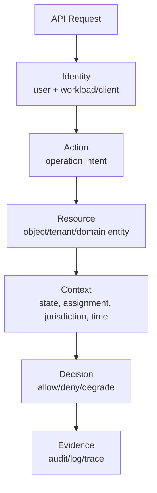
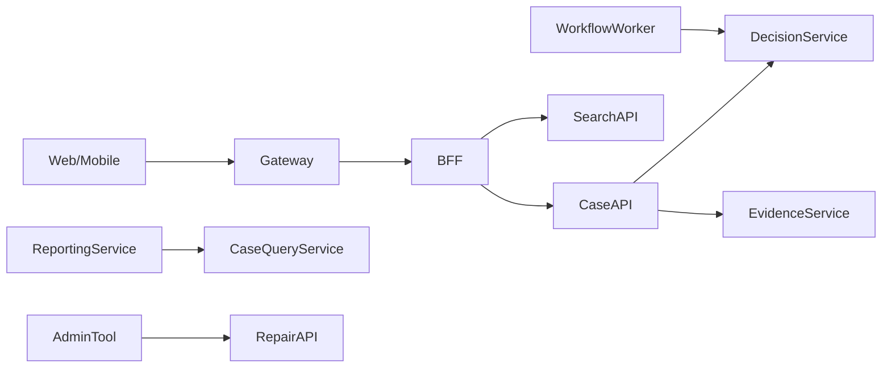
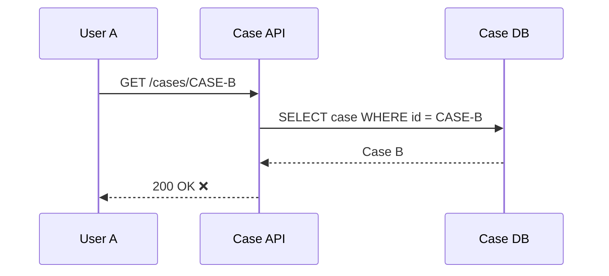
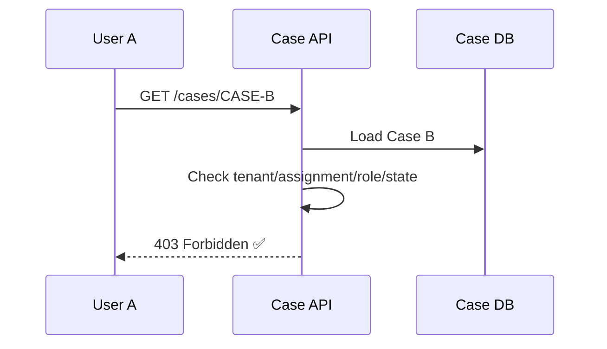
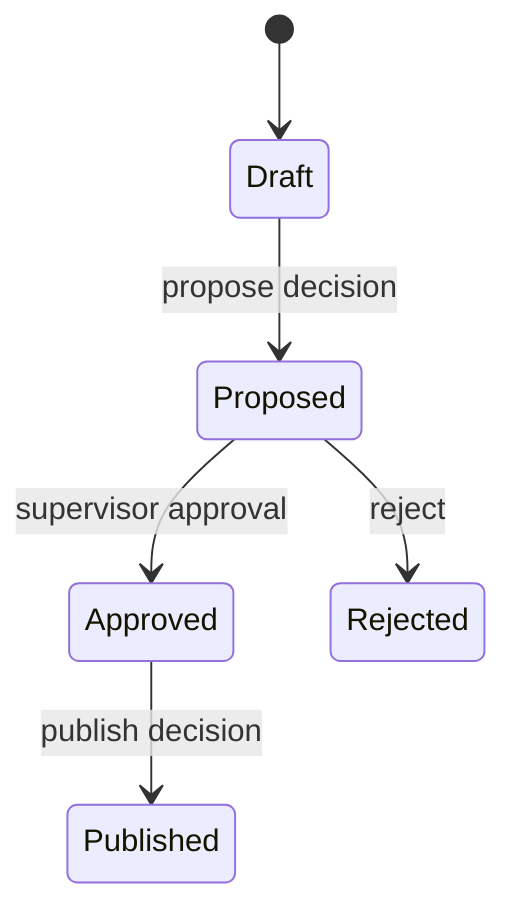
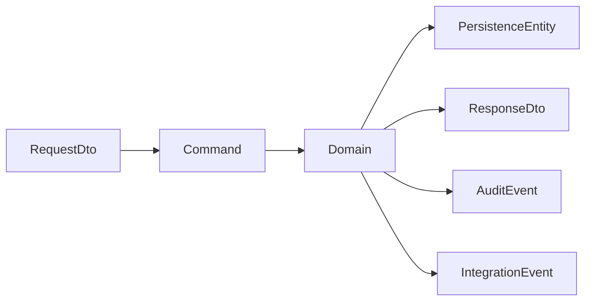
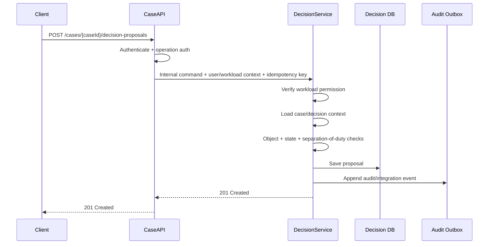

# Part 056 — API Security Risk Model for Microservices

API security in microservices is not mainly about adding an authentication filter.

The hardest API security bugs are usually semantic:

- user can access another user's object
- service can invoke an operation it should not call
- caller can update fields that should be server-controlled
- endpoint returns too much data
- query endpoint leaks cross-tenant records
- workflow action is valid for one role but exposed to another
- internal API trusts object IDs from caller
- async callback accepts forged event payload
- rate limit protects edge but not internal expensive operation

In microservices, every API is a boundary.

That boundary may be:

- external client to edge service
- frontend BFF to backend service
- service to service
- worker to service
- event consumer to projection
- admin tool to production service
- reporting service to query model

This part builds a practical API security risk model for Java microservices, using OWASP API Security categories as an anchor, but translating them into architecture and implementation decisions.

---

## 1. Core Mental Model

Secure API design answers six questions for every operation:

1. **Who** is calling?
2. **Through which workload/client**?
3. **What action** are they trying to perform?
4. **On which resource/object**?
5. **Under which state/context**?
6. **What evidence** proves the decision was correct?



If any of these are vague, security relies on luck.

---

## 2. API Security Is Not Just Authentication

Authentication proves identity.

Authorization decides permission.

Validation protects input shape.

Business invariant protects domain correctness.

Rate limiting protects capacity.

Audit proves what happened.

These are different controls.

| Control | Question Answered |
|---|---|
| Authentication | Who is the caller? |
| Workload identity | Which service/client is making the call? |
| Operation authorization | May this caller invoke this endpoint? |
| Object authorization | May this caller access this specific object? |
| Field authorization | May this caller read/write this specific field? |
| State authorization | Is this action valid in this lifecycle state? |
| Validation | Is request shape/value acceptable? |
| Invariant | Does this preserve business correctness? |
| Rate limit/quota | Is this caller exceeding allowed usage? |
| Audit | Can we reconstruct the decision/action? |

A secure API composes these controls deliberately.

---

## 3. The Microservices API Attack Surface

API attack surface grows with service decomposition.

Not because microservices are inherently insecure, but because there are more boundaries:

- more endpoints
- more object IDs
- more service callers
- more message payloads
- more identities
- more admin operations
- more read models
- more caches
- more integration paths
- more partial failures



Every arrow needs a security story.

If architecture documentation only says “authenticated”, it is not enough.

---

## 4. Risk-First API Review

Do not start API review with controllers.

Start with risk.

For each endpoint, create a risk card:

```yaml
operation: decision.proposal.create
route: POST /cases/{caseId}/decision-proposals
callerTypes:
  - investigator-user-via-case-api
  - supervisor-user-via-case-api
resource:
  type: case
  idSource: path.caseId
sensitivity: privileged-state-change
stateRules:
  - case.status must be UNDER_REVIEW
  - case must not be SEALED unless caller has sealed-case permission
authorization:
  objectRule: caller must be assigned investigator or supervisor
  tenantRule: caller tenant must match case tenant
  workloadRule: only case-api may invoke decision-service internal command
inputRisks:
  - mass assignment
  - malicious text payload
  - duplicate command
outputRisks:
  - decision rationale leakage
rateLimit:
  scope: tenant + user + operation
observability:
  audit: required
  trace: required
  denyLog: required
```

This forces security to be concrete.

---

## 5. API1: Broken Object Level Authorization

Broken Object Level Authorization is the risk where an API uses an object identifier but fails to verify that the caller may access that specific object.

Typical attack:

```http
GET /cases/CASE-1001
Authorization: Bearer user-A-token
```

Then attacker changes ID:

```http
GET /cases/CASE-1002
Authorization: Bearer user-A-token
```

If `CASE-1002` belongs to another investigator/tenant and the service returns it, the API has an object authorization bug.

BOLA is not defeated by UUIDs.

UUIDs make guessing harder, not authorization correct.



Correct sequence:



---

## 6. BOLA Defense Pattern in Java

Do not authorize only before loading resource if the authorization needs resource state.

Bad:

```java
@GetMapping("/cases/{caseId}")
public CaseDto getCase(@PathVariable String caseId) {
    auth.requireRole("INVESTIGATOR");
    return caseRepository.findDto(caseId);
}
```

This checks role but not object access.

Better:

```java
@GetMapping("/cases/{caseId}")
public CaseDto getCase(
    @PathVariable String caseId,
    CallerContext caller
) {
    CaseRecord record = caseRepository.get(new CaseId(caseId));
    caseAccessPolicy.assertCanView(caller, record);
    return caseMapper.toDto(record, caller.viewPolicy());
}
```

For query endpoints, avoid fetching unauthorized rows then filtering too late if the dataset is large or sensitive.

Use policy-aware query predicates.

```java
public Page<CaseSummary> searchCases(CaseSearchQuery query, CallerContext caller) {
    CaseVisibilityScope scope = caseAccessPolicy.visibilityScopeFor(caller);
    return caseReadRepository.search(query, scope);
}
```

Object authorization must exist for:

- `GET /resource/{id}`
- `PUT /resource/{id}`
- `PATCH /resource/{id}`
- `DELETE /resource/{id}`
- command endpoints using IDs
- nested endpoints
- batch endpoints
- export endpoints
- async command callbacks
- GraphQL/global ID resolvers
- message consumers referencing resource IDs

---

## 7. Object Authorization Matrix

For sensitive APIs, define object authorization explicitly.

| Operation | Resource | Required Object Rule |
|---|---|---|
| view case | `Case` | same tenant and assigned or supervisor |
| update case allegation | `Case + Allegation` | same tenant, assigned, case editable |
| submit evidence | `Case` | same tenant, contributor allowed, case open |
| view decision rationale | `Decision` | same tenant, role has rationale read permission |
| approve decision | `DecisionProposal` | same tenant, supervisor, no conflict, state proposed |
| export case bundle | `Case` | export permission, privacy clearance, audit reason |

This matrix should be reviewed before implementation.

Do not bury it in controller annotations.

---

## 8. API2: Broken Authentication

Broken authentication includes:

- accepting unsigned/weak tokens
- wrong token audience
- missing expiry validation
- accepting tokens from wrong issuer
- trusting headers from clients
- weak service API keys
- long-lived credentials
- broken session invalidation
- lack of replay protection
- inconsistent auth across services

In microservices, authentication often fails at boundaries between systems.

Bad assumptions:

```text
Gateway already authenticated this request.
Internal services do not need to verify anything.
```

Better:

- edge validates external identity
- internal calls use workload identity
- downstream validates relevant token/audience/context
- headers from untrusted clients are stripped/recreated at edge
- services reject missing/ambiguous identity
- auth failure has clear metrics

For Java services, avoid writing custom JWT parsers unless necessary. Use well-maintained libraries/framework integration and validate issuer, audience, expiry, signature, and algorithm.

---

## 9. API3: Broken Object Property Level Authorization

This is about fields/properties.

Two major forms:

1. unauthorized field read
2. unauthorized field write

### Unauthorized Field Read

Example response leaks internal field:

```json
{
  "caseId": "CASE-001",
  "summary": "...",
  "internalRiskScore": 93,
  "whistleblowerIdentity": "...",
  "decisionDraftNotes": "..."
}
```

### Unauthorized Field Write / Mass Assignment

Client sends:

```json
{
  "title": "Updated title",
  "status": "APPROVED",
  "assignedSupervisorId": "attacker",
  "tenantId": "other-tenant"
}
```

If the service binds this directly into entity, security is broken.

Bad:

```java
@PatchMapping("/cases/{id}")
public CaseDto patch(@PathVariable String id, @RequestBody CaseEntity entity) {
    entity.setId(id);
    return mapper.toDto(repository.save(entity));
}
```

Better:

```java
public record UpdateCaseDetailsRequest(
    String title,
    String summary,
    List<String> tags
) {}
```

Use command-specific DTOs.

Do not expose persistence entity as request model.

---

## 10. Field-Level Security Pattern

Separate read views by audience.

```java
public final class CaseDtoMapper {
    public CaseDto toDto(CaseRecord record, CaseViewPolicy policy) {
        return new CaseDto(
            record.id().value(),
            record.publicSummary(),
            policy.canViewRiskScore() ? record.riskScore().value() : null,
            policy.canViewSealedReason() ? record.sealedReason().orElse(null) : null,
            policy.canViewInternalNotes() ? record.internalNotes() : null
        );
    }
}
```

For highly sensitive fields, prefer explicit DTO types:

```java
public record PublicCaseSummaryDto(...) {}
public record InvestigatorCaseDto(...) {}
public record SupervisorCaseDto(...) {}
public record AuditCaseDto(...) {}
```

Do not rely on `@JsonIgnore` alone for complex security decisions.

Serialization annotations are not a security model.

---

## 11. API4: Unrestricted Resource Consumption

APIs can be abused by consuming expensive resources:

- large page size
- complex filters
- expensive search
- large exports
- repeated uploads
- unbounded JSON payload
- deep nested request body
- long-running workflow trigger
- expensive report generation
- large batch command
- high-cardinality metric labels from input

Microservices amplify this because one API call may fan out to many services.

Example:

```http
GET /case-search?query=*&pageSize=100000&includeEvidence=true&includeDecision=true
```

Defense:

- max page size
- timeout/deadline
- rate limit by user/tenant/operation
- request body size limit
- complexity limit
- async export with quota
- caching for safe reads
- backpressure
- bounded fan-out
- per-tenant concurrency limit
- cost-aware endpoint classification

---

## 12. API5: Broken Function Level Authorization

Broken Function Level Authorization means caller can invoke a function/operation they should not.

Example:

```http
POST /cases/CASE-001/approve-decision
Authorization: Bearer investigator-token
```

If investigator role can call supervisor operation, function-level authorization is broken.

BFLA differs from BOLA:

- BOLA: can caller access this object?
- BFLA: can caller perform this operation?

You usually need both.

```java
decisionOperationPolicy.assertMayApprove(caller);
DecisionProposal proposal = proposals.get(id);
decisionObjectPolicy.assertMayApproveProposal(caller, proposal);
proposal.approve(caller.userId(), command.expectedVersion());
```

Route-level role annotations are useful but insufficient for complex object/state rules.

---

## 13. Operation Intent Beats CRUD Permission

CRUD permissions are too coarse for real domains.

Bad permission model:

```text
case.write
```

This could mean:

- edit summary
- assign investigator
- submit for review
- approve decision
- seal case
- reopen case
- delete evidence
- export bundle

Better permission model:

```text
case.summary.update
case.assignment.change
case.review.submit
decision.proposal.create
decision.proposal.approve
case.seal.apply
case.bundle.export
```

Task-oriented permissions map better to business risk.

---

## 14. API6: Unrestricted Access to Sensitive Business Flows

A business flow is a sequence of operations with business consequence.

Examples:

- password reset
- account recovery
- evidence submission
- decision approval
- case closure
- enforcement escalation
- sanction publication
- export of regulated data

Risk appears when APIs expose individual steps without protecting the whole flow.

Example flow:



Security questions:

1. Who can initiate the flow?
2. Who can transition each state?
3. Are there separation-of-duty rules?
4. Is dual control needed?
5. Can the same user propose and approve?
6. Can state transition be replayed?
7. Is reason/evidence required?
8. Is flow auditable end-to-end?

Business flow security belongs in application/domain logic, not only routes.

---

## 15. State Machine Authorization

State transition must check both authorization and invariant.

```java
public void approve(CallerContext caller, ApprovalReason reason, ExpectedVersion expectedVersion) {
    if (!status.equals(Status.PROPOSED)) {
        throw new InvalidStateTransition("Only proposed decision can be approved");
    }

    if (proposedBy.equals(caller.userId())) {
        throw new SeparationOfDutyViolation("Proposer cannot approve own decision");
    }

    if (!caller.scopes().contains("decision.proposal.approve")) {
        throw AccessDenied.missingPermission("decision.proposal.approve");
    }

    this.status = Status.APPROVED;
    this.approvedBy = caller.userId();
    this.approvalReason = reason;
}
```

The API should not be able to bypass this by directly setting `status`.

---

## 16. API7: Server Side Request Forgery

SSRF occurs when an API accepts a URL/address and server-side code fetches it without proper restrictions.

Microservices risk:

```http
POST /evidence/import-from-url
{
  "url": "http://internal-metadata-service/latest/secrets"
}
```

Or:

```http
POST /webhook/test
{
  "targetUrl": "http://decision-service/admin/replay"
}
```

Defense:

- do not allow arbitrary internal URLs
- allowlist domains/schemes
- block private IP ranges/link-local/metadata endpoints
- resolve DNS safely and re-check after resolution
- limit redirects
- use egress proxy
- set timeout and size limits
- log destination category
- separate fetcher service with minimal permissions

Java anti-pattern:

```java
URL url = URI.create(request.url()).toURL();
try (InputStream in = url.openStream()) {
    return in.readAllBytes();
}
```

This is not safe for untrusted URLs.

---

## 17. API8: Security Misconfiguration

Common API misconfiguration in Java microservices:

- actuator endpoints exposed
- debug stack traces returned
- CORS too broad
- permissive internal gateway routes
- default credentials
- missing TLS/mTLS
- missing security headers
- overbroad service account
- wildcard mesh policy
- disabled certificate validation
- test endpoint deployed to production
- OpenAPI docs expose internal endpoints without access control
- verbose error leaks implementation details

Misconfiguration is architecture when it is systematic.

Create secure defaults in service templates.

Do not rely on every team remembering every setting.

---

## 18. API9: Improper Inventory Management

You cannot secure APIs you do not know exist.

Microservices create inventory drift:

- old version still deployed
- internal endpoint undocumented
- admin endpoint forgotten
- async callback unowned
- experimental route left enabled
- service not in catalog
- OpenAPI spec not updated
- dependency calls undocumented
- deprecated endpoint still used by hidden consumer

Minimum API inventory:

```yaml
service: decision-service
owner: enforcement-platform-team
endpoints:
  - operation: decision.proposal.create
    method: POST
    route: /decision-proposals
    exposure: internal
    sensitivity: privileged-state-change
    authn: workload + user
    authz: service + object + state
    deprecated: false
  - operation: decision.summary.read
    method: GET
    route: /decisions/{id}/summary
    exposure: internal
    sensitivity: sensitive-read
    authn: workload + user
    authz: service + object + field
    deprecated: false
```

Inventory should be generated and verified, not hand-maintained only.

---

## 19. API10: Unsafe Consumption of APIs

A service consuming another API can be insecure too.

Examples:

- trusts upstream payload without validation
- assumes downstream response schema is always correct
- deserializes polymorphic JSON unsafely
- accepts callback/event from untrusted source
- trusts `tenantId` from remote service
- fails open when dependency auth fails
- logs sensitive downstream response
- uses response data for authorization without verifying source

Consumer-side controls:

- validate response contract
- validate event producer identity
- bound response size
- handle malformed payload
- sanitize remote error messages
- enforce timeout/deadline
- do not propagate secrets to downstream
- map downstream data into local semantic model
- do not let remote service own your authorization silently

API security is bidirectional.

The provider must defend itself.

The consumer must not ingest unsafe input.

---

## 20. Multi-Tenant API Risk Model

Tenant isolation bugs are often API security bugs.

Risk cases:

- tenant ID taken from request body
- tenant ID in URL but not matched with token
- cache key missing tenant
- search endpoint not tenant-filtered
- export job runs across tenants
- event consumer projects into wrong tenant
- admin user scope too broad
- reporting service aggregates without partition control

Tenant rule:

> Tenant context must be derived, verified, propagated, and enforced. It must not merely be accepted from caller input.

Bad:

```java
String tenantId = request.getTenantId();
repository.findCases(tenantId);
```

Better:

```java
TenantId tenantId = caller.tenantId();
CaseSearchScope scope = accessPolicy.searchScopeFor(caller);
repository.findCases(scope, query);
```

For admin cross-tenant access, require explicit reason and audit.

---

## 21. Internal APIs Are Still APIs

Internal APIs often have weaker security because teams assume internal traffic is trusted.

This creates high-impact bugs:

- internal endpoint can mutate privileged state
- worker endpoint accepts forged callbacks
- service-to-service route skips object authorization
- internal API returns full object graph
- internal endpoint lacks rate limiting
- internal batch API allows huge payload

Rule:

> Internal changes exposure, not correctness requirements.

Internal APIs may use different auth mechanisms, but they still need:

- authentication
- authorization
- validation
- rate/size limits
- audit for sensitive action
- compatibility contract
- inventory
- ownership

---

## 22. Error Response Security

Error responses leak information when careless.

Bad:

```json
{
  "error": "Case CASE-999 exists but belongs to tenant regulator-b"
}
```

Better external response:

```json
{
  "type": "https://errors.example.com/access-denied",
  "title": "Access denied",
  "status": 403,
  "traceId": "7d7a..."
}
```

Internal log can store sanitized evidence:

```json
{
  "event.name": "access_denied",
  "reason": "TENANT_MISMATCH",
  "resource.type": "case",
  "resource.id_hash": "sha256:...",
  "caller.user_id": "investigator-123",
  "tenant.id": "regulator-a",
  "trace.id": "7d7a..."
}
```

Do not reveal:

- whether sensitive object exists
- other tenant IDs
- internal class names
- SQL errors
- policy internals
- stack traces
- secret/config values

---

## 23. Input Validation and Domain Validation

Input validation checks shape.

Domain validation checks meaning.

Example request:

```json
{
  "decisionText": "...",
  "effectiveDate": "2026-07-05",
  "severity": "HIGH"
}
```

Input validation:

- `decisionText` not blank
- length <= max
- `effectiveDate` valid date
- `severity` enum value

Domain validation:

- case is in correct state
- caller may propose high severity
- effective date is allowed by regulation
- decision does not violate escalation rule
- required evidence exists

Both are needed.

Do not confuse Bean Validation with domain safety.

```java
public record ProposeDecisionRequest(
    @NotBlank @Size(max = 8000) String decisionText,
    @NotNull LocalDate effectiveDate,
    @NotNull Severity severity
) {}
```

This is only the first gate.

---

## 24. Safe Partial Update

`PATCH` endpoints often create mass assignment bugs.

Bad generic patch:

```json
[
  { "op": "replace", "path": "/status", "value": "APPROVED" },
  { "op": "replace", "path": "/tenantId", "value": "regulator-b" }
]
```

If generic patch applies to entity directly, client can mutate protected fields.

Safer patterns:

### Command-Specific Patch

```java
public record UpdateCaseSummaryRequest(
    String summary,
    List<String> tags
) {}
```

### Allowlisted JSON Patch Paths

```java
Set<String> allowedPaths = Set.of("/summary", "/tags");
```

### Domain Method

```java
caseRecord.updateSummary(caller, newSummary);
```

The API should expose intended operations, not raw object mutation power.

---

## 25. Batch Endpoint Risk

Batch endpoints are useful but dangerous.

Example:

```http
POST /cases/batch-status
{
  "caseIds": ["CASE-1", "CASE-2", "CASE-3"]
}
```

Risks:

- BOLA across many IDs
- partial authorization leakage
- huge payload DoS
- response reveals which IDs exist
- one unauthorized item fails entire batch unpredictably
- audit becomes weak

Defense:

- max batch size
- per-item authorization
- per-item result with safe error
- no existence leak across tenant
- audit per sensitive item or batch with item hashes
- idempotency for batch commands
- async job for large batch

Example response:

```json
{
  "results": [
    { "clientRef": "1", "status": "OK" },
    { "clientRef": "2", "status": "NOT_ACCESSIBLE" }
  ]
}
```

Avoid returning “belongs to another tenant”.

---

## 26. Search and Filtering Risk

Search APIs are common sources of data leakage.

Bad:

```java
return repository.search(query);
```

Better:

```java
SearchScope scope = accessPolicy.searchScopeFor(caller);
return repository.search(query, scope);
```

Search must enforce:

- tenant scope
- user visibility
- role-based fields
- sealed/restricted records
- pagination limit
- sort allowlist
- filter allowlist
- no raw SQL/filter expressions from caller
- result redaction
- stable ordering

Search endpoint review questions:

1. Can caller search by another tenant's ID?
2. Can caller infer existence from result count?
3. Can caller sort/filter by sensitive hidden field?
4. Can caller request unlimited page size?
5. Can caller use wildcard to dump data?
6. Does search index lag create stale authorization?
7. Does index contain fields no longer allowed to expose?

---

## 27. Export API Risk

Export endpoints are high-risk even if read-only.

They often bypass normal UI constraints and move large amounts of data.

Controls:

- explicit export permission
- reason required
- asynchronous job
- quota
- row/size limit
- data classification
- redaction profile
- watermark/time range
- audit record
- secure download URL expiry
- tenant isolation
- approval for sensitive export

Export anti-pattern:

```http
GET /cases/export?tenant=all
```

Export is not just a bigger GET.

It is often a regulated data disclosure action.

---

## 28. Webhook and Callback Risk

Webhook/callback APIs are exposed to other systems.

Risks:

- forged callback
- replayed callback
- wrong tenant/resource mapping
- oversized payload
- signature not checked
- timestamp ignored
- idempotency missing
- remote system sends state transition out of order

Controls:

- signature verification
- timestamp tolerance
- replay cache
- event ID idempotency
- source allowlist
- payload schema validation
- state transition validation
- audit
- dead-letter handling

Example:

```java
public void handleCallback(CallbackRequest request, Signature signature) {
    signatureVerifier.verify(request.rawBody(), signature);
    replayGuard.rejectIfSeen(request.eventId());
    callbackPolicy.assertKnownSource(request.sourceSystem());
    workflow.applyExternalResult(request.toDomainEvent());
}
```

Never let callback payload directly mutate domain state.

---

## 29. API Rate Limiting by Risk

Rate limiting is not one number.

Different operations need different limits.

| Operation | Limit Scope | Why |
|---|---|---|
| login/token | IP + account + client | brute force |
| case search | user + tenant | data scraping, cost |
| evidence upload | user + tenant + size | storage/cost |
| export bundle | user + tenant + day | data exfiltration |
| propose decision | user + case | duplicate command |
| approve decision | user + role + case | privileged action |
| webhook callback | source + event ID | replay/flood |
| internal fan-out | caller service + operation | dependency overload |

Also remember Part 041 and 043:

- retry can amplify attack/load
- load shedding protects survival
- rate limit should be observable
- rejected requests should not trigger expensive work

---

## 30. API Security Observability

Security controls must emit useful evidence.

Minimum API security signals:

- auth success/failure count
- authorization deny count by reason category
- operation sensitivity
- tenant mismatch count
- BOLA-like access denied pattern
- mass-assignment rejection count
- invalid token audience count
- rate-limit rejection count
- suspicious batch/search/export pattern
- admin operation count
- webhook signature failure count
- SSRF blocked destination count

Example metric names:

```text
api_authentication_failures_total{service,reason}
api_authorization_denies_total{service,operation,reason}
api_rate_limited_total{service,operation,scope}
api_sensitive_export_started_total{service,tenant_classification}
api_webhook_signature_failures_total{service,source}
```

Control cardinality.

Do not put raw user IDs or resource IDs in metric labels.

---

## 31. Secure API Logging

For sensitive API decisions, log:

- operation name
- caller user/workload/client
- tenant
- resource type
- hashed resource ID if needed
- decision allow/deny
- reason category
- policy version
- correlation/trace ID
- request size category
- response status
- duration

Do not log:

- bearer tokens
- passwords/secrets
- full PII payload
- unredacted evidence details
- raw large request body
- private keys
- internal stack trace in response

API logs should support investigation without becoming a breach database.

---

## 32. Secure DTO and Mapping Discipline

Use different models for:

- request DTO
- response DTO
- domain model
- persistence entity
- external integration payload
- audit event
- internal event



Mapping is not boilerplate only.

Mapping is a security boundary.

It decides:

- which input fields are accepted
- which output fields are exposed
- which domain fields are server-controlled
- which sensitive fields are redacted
- which tenant/resource fields are derived

Do not remove mapping discipline in the name of “less code” for sensitive APIs.

---

## 33. API Contract Security Annotations

OpenAPI or similar contracts can document security expectations.

For each operation, document:

- auth scheme
- required scopes/permissions
- resource ID source
- object authorization rule summary
- idempotency requirement
- rate limit class
- sensitivity classification
- audit requirement
- deprecated/replacement endpoint

Example:

```yaml
x-security-classification: privileged-state-change
x-object-authorization:
  resource: Case
  idFrom: path.caseId
  rule: assigned investigator or supervisor in same tenant
x-idempotency: required
x-audit: required
x-rate-limit-class: privileged-command
```

This does not enforce security by itself.

But it makes missing security visible in design review and tooling.

---

## 34. Java Controller Review Checklist

For every controller method:

1. Does it use a command-specific request DTO?
2. Does it avoid binding directly to JPA/entity/domain object?
3. Are server-controlled fields absent from request DTO?
4. Is caller context explicit?
5. Is tenant derived from authenticated context/resource, not raw body?
6. Does endpoint enforce operation-level authorization?
7. Does use case enforce object-level authorization?
8. Are lifecycle/state rules enforced in domain/application layer?
9. Is input bounded by size/page/complexity?
10. Are error responses non-leaky?
11. Is sensitive output redacted by view policy?
12. Is idempotency required for retryable state change?
13. Is audit required for privileged actions?
14. Are metrics/logs safe and useful?
15. Is the endpoint in API inventory/catalog?

---

## 35. Threat Modeling Walkthrough

Endpoint:

```http
POST /cases/{caseId}/decision-proposals
```

Threats:

| Threat | Example | Control |
|---|---|---|
| BOLA | propose for unassigned case | load case, object auth |
| BFLA | investigator calls supervisor-only route | operation permission |
| Mass assignment | request sets status=APPROVED | command DTO allowlist |
| Duplicate command | retry creates two proposals | idempotency key |
| State bypass | propose after case closed | domain state machine |
| Cross-tenant | path ID belongs to another tenant | tenant check from resource |
| Excessive payload | huge rationale text | size limit |
| Sensitive log leak | rationale logged | redaction |
| Confused deputy | case-api calls on behalf of unauthorized user | downstream resource auth or scoped delegation |
| Audit gap | no record of proposal | audit event/outbox |

Secure flow:



---

## 36. API Security Architecture Review Template

```md
# API Security Review: Decision Proposal API

## Operation
POST /cases/{caseId}/decision-proposals

## Sensitivity
Privileged state-changing business operation.

## Caller Types
- Investigator via case-api
- Supervisor via case-api
- No direct external caller to decision-service

## Identity
- user identity required
- workload identity required for internal call
- tenant derived from authenticated context and verified against case

## Authorization
- operation permission: decision.proposal.create
- object authorization: assigned investigator or supervisor in same tenant
- state rule: case must be UNDER_REVIEW
- separation rule: proposer cannot later approve own proposal

## Input Controls
- command-specific DTO
- max rationale length
- no status/tenant/assignee fields accepted
- idempotency key required

## Output Controls
- response returns proposal ID and status only
- rationale not echoed in response for unauthorized views

## Abuse Controls
- per-user and per-case rate limit
- retry-safe idempotency
- duplicate proposal guard

## Observability
- audit event required
- authorization deny logs required
- trace required
- metrics for deny, duplicate, validation failure

## Failure Behavior
- authz dependency failure: fail closed
- audit outbox failure: fail transaction
- duplicate idempotency key: replay original response
```

---

## 37. Common Anti-Patterns

### Anti-Pattern: Role-Only Authorization

```java
@PreAuthorize("hasRole('INVESTIGATOR')")
@GetMapping("/cases/{id}")
```

Role is not object authorization.

### Anti-Pattern: Entity as Request Body

```java
public CaseEntity update(@RequestBody CaseEntity entity)
```

This invites mass assignment.

### Anti-Pattern: Trusting Tenant from Request Body

```json
{ "tenantId": "tenant-a" }
```

Tenant must be derived and verified.

### Anti-Pattern: Internal Means Safe

```text
No auth needed; this endpoint is internal.
```

Internal APIs are still attack surface.

### Anti-Pattern: Filter Authorization Only

```text
Security filter allows route, domain code mutates state freely.
```

Sensitive business actions need domain/application policy.

### Anti-Pattern: Obscure IDs as Authorization

```text
We use UUIDs, so users cannot guess IDs.
```

Unpredictability is not permission.

---

## 38. Final Mental Model

API security is resource-aware, operation-aware, state-aware, and evidence-producing.

For Java microservices, the secure design rule is:

> Authenticate at the edge, authorize at the operation, authorize again at the object/resource, enforce invariant in the domain, and emit evidence.

A secure API is not one with many annotations.

A secure API is one where every sensitive operation has a clear answer to:

- who can call it
- which resource it affects
- which fields can be read/written
- which state transitions are legal
- how abuse is bounded
- how decisions are audited
- how failure behaves

If the answer is “the gateway handles it”, the design is probably incomplete.

---

## 39. Practical Exercise

Take this API set:

```text
GET    /cases/{caseId}
PATCH  /cases/{caseId}
POST   /cases/{caseId}/evidence
POST   /cases/{caseId}/decision-proposals
POST   /decision-proposals/{proposalId}/approve
GET    /cases/search
POST   /cases/export
POST   /webhooks/external-evidence-status
```

For each endpoint, write:

1. sensitivity class
2. caller types
3. object authorization rule
4. field-level read/write risk
5. business flow/state rule
6. input size/complexity limit
7. rate limit class
8. audit requirement
9. likely OWASP API risk
10. safest failure behavior

Then answer:

> Which endpoint is the highest risk, and why?

If your answer is based only on HTTP method, you are missing the architecture.

Risk comes from business consequence, data sensitivity, authorization complexity, and abuse potential.
