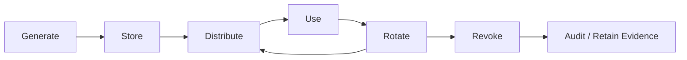
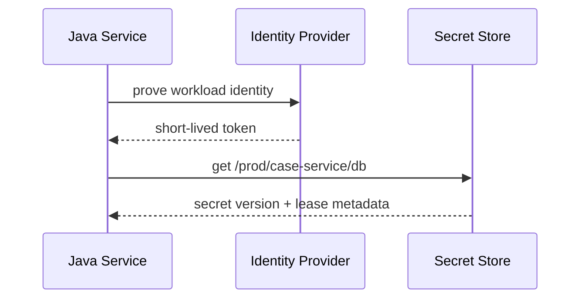
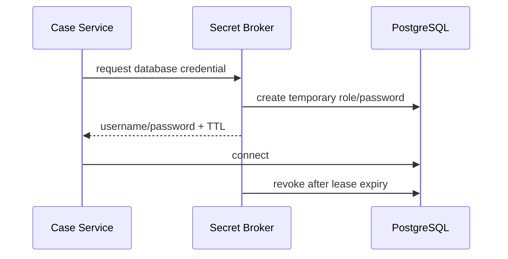
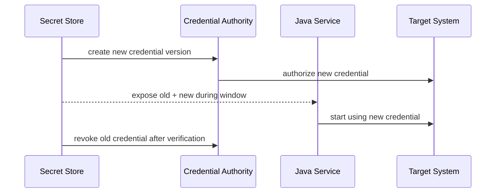
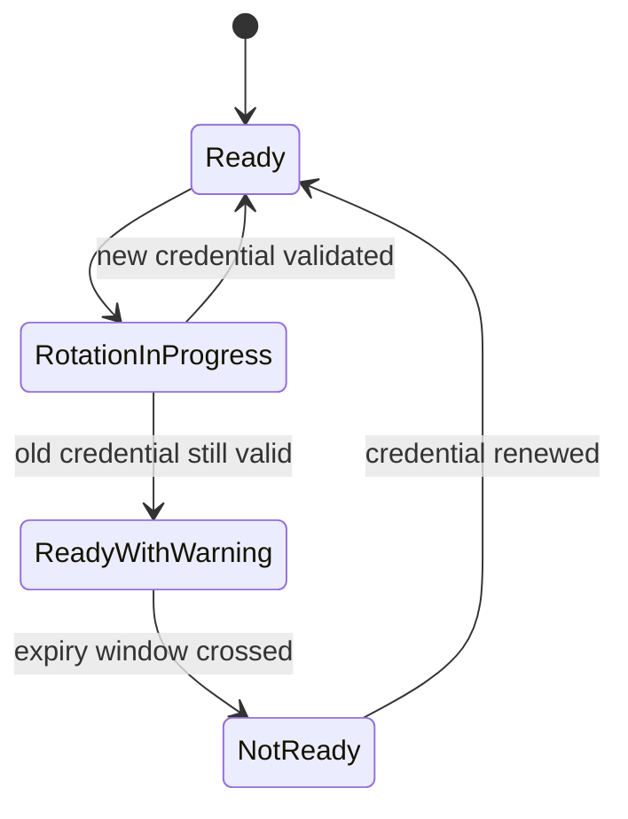
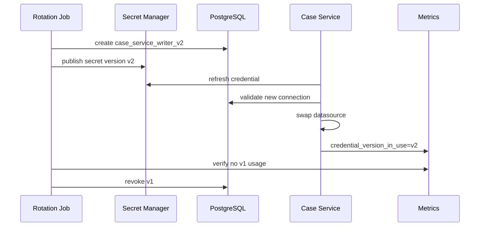

# Part 057 — Secret Management and Credential Rotation

A secret is not just a string you hide from Git.

In a microservice architecture, a secret is a **runtime authority token**. It lets a workload act on a database, message broker, identity provider, signing system, third-party API, object storage bucket, or another service. If the secret leaks, the attacker does not merely know something. They can **do something**.

That is why secret management must be designed as part of architecture, not patched in as infrastructure glue.

A mature Java microservice must answer:

- where secrets are created
- who can read them
- how they are injected
- how they are rotated
- how clients survive rotation
- how leaks are detected
- how access is audited
- how stale credentials are killed
- how emergency rotation happens under incident pressure

This part focuses on secret lifecycle and rotation-safe service design.

It does not repeat basic authentication/authorization material. The question here is narrower and more operational:

> How does a Java microservice safely obtain, use, refresh, rotate, and retire credentials without leaking them or causing downtime?

---

## 1. Core Mental Model

A secret has a lifecycle.



Most production failures happen because teams treat only one lifecycle step seriously.

Examples:

- generate strong password, then paste it into Slack
- use Vault, but mount long-lived static secrets into environment variables
- rotate database password, but old connection pools keep failing
- use Kubernetes Secret, but give all namespaces broad read permission
- rotate signing key, but consumers do not support multiple key IDs
- store API keys centrally, but log them in request exceptions

The invariant is simple:

> A secret is safe only if every phase of its lifecycle is safe.

---

## 2. What Counts as a Secret?

Do not restrict the definition to passwords.

Common microservice secrets:

| Secret Type | Example | Failure Impact |
|---|---|---|
| Database credential | PostgreSQL username/password | Data read/write compromise |
| Broker credential | Kafka SASL password, RabbitMQ password | Event injection or consumption |
| API key | Payment provider key | Unauthorized third-party calls |
| OAuth client secret | Client credential flow | Token minting abuse |
| Signing key | JWT private key | Token forgery |
| Encryption key | Field/data encryption key | Data disclosure |
| TLS private key | Service certificate private key | Impersonation / traffic decryption |
| Webhook secret | HMAC verification key | Forged callbacks |
| Cloud credential | IAM access key | Cloud resource compromise |
| SSH key | Deployment/admin access | Infrastructure compromise |
| Service account token | Kubernetes/cloud workload token | Workload impersonation |

A good architecture classifies secrets by **authority**.

Ask:

- What can this secret access?
- Is the access read-only or write-capable?
- Is the scope per service, per tenant, per environment, or global?
- Can it mint other credentials?
- Can it decrypt stored data?
- Can it impersonate users or workloads?
- Is compromise detectable?
- Is emergency revocation possible?

A secret that can mint tokens or decrypt data is more dangerous than a single-purpose read-only credential.

---

## 3. Secret Management Is Not Configuration Management

Configuration answers:

> How should this service behave?

Secret management answers:

> What authority is this service allowed to exercise?

They overlap operationally, but they should not be treated equally.

Bad pattern:

```yaml
payment:
  provider: stripe
  timeoutMs: 1500
  apiKey: sk_live_xxx
```

Better pattern:

```yaml
payment:
  provider: stripe
  timeoutMs: 1500
  apiKeySecretRef: /prod/payments/stripe/api-key
```

The service does not need the secret value in its static configuration. It needs a **reference** and a **runtime identity** that is allowed to resolve that reference.

---

## 4. Secret Storage Model

A secret store should provide at least:

- encryption at rest
- fine-grained access control
- audit trail
- versioning
- rotation support
- revocation support
- workload identity integration
- short-lived credential support where possible

Common store categories:

| Category | Examples | Strength | Risk |
|---|---|---|---|
| Kubernetes Secret | Native Kubernetes Secret | Easy pod integration | Not a full secret-management system by itself |
| Cloud secret manager | AWS Secrets Manager, Azure Key Vault, Google Secret Manager | Managed rotation/audit integration | Cloud coupling |
| Vault-like system | HashiCorp Vault, OpenBao | Dynamic secrets, policies, leases | Operational complexity |
| KMS/HSM | AWS KMS, Azure Key Vault keys, Cloud KMS, HSM | Strong key control | Not always meant for arbitrary app secrets |
| External Secrets Operator | Sync external secret into cluster | Better source-of-truth separation | Sync lag and RBAC complexity |

The important decision is not “which tool is best”.

The important decision is:

> Does the system minimize long-lived, broadly scoped, copy-pasted secrets?

---

## 5. Runtime Secret Delivery Patterns

There are four common patterns.

### 5.1 Environment Variable Injection

```bash
DB_PASSWORD=...
```

Simple, but dangerous if overused.

Risks:

- visible in process environment depending on platform/debug access
- easy to accidentally dump
- static until process restart
- hard to rotate without rollout
- often mixed with normal config

Use only for low-frequency static bootstrap secrets, and prefer references over values when possible.

### 5.2 File Mount

Kubernetes and secret agents often mount secrets as files.

```text
/var/run/secrets/app/db/password
/var/run/secrets/app/payment/api-key
```

Benefits:

- can be watched for file updates
- avoids environment dump risk
- easier to separate from normal config
- compatible with sidecar/agent-based delivery

Risks:

- file permissions must be correct
- process may not reload value
- secret can still leak through logs/core dumps/debug shells

### 5.3 Runtime Fetch

The service fetches secrets from a secret manager using workload identity.



Benefits:

- no secret value in deployment manifest
- access audit is centralized
- leases and refresh are possible
- per-service policy is clearer

Risks:

- startup depends on secret manager availability
- client must handle refresh/failure
- bootstrap identity becomes critical

### 5.4 Dynamic Credential Issuance

Instead of storing a static database password, the secret system issues short-lived credentials.



This is usually stronger than rotating static secrets because compromise window is bounded.

Costs:

- more operational complexity
- lease renewal required
- connection pools must handle credential expiry
- database/user provisioning strategy must be reliable

---

## 6. Workload Identity Before Secret Retrieval

A service should not authenticate to a secret store using another long-lived secret.

Bad pattern:

```text
Pod has VAULT_TOKEN as environment variable.
VAULT_TOKEN allows reading many secrets.
```

Better pattern:

```text
Pod proves Kubernetes/cloud workload identity.
Secret store issues short-lived access token scoped to that workload.
```

The architecture should establish:

- service identity
- namespace/environment identity
- cluster identity
- deployment identity
- least-privilege secret policy

Example policy intent:

```text
case-service in production may read:
  /prod/case-service/db/primary
  /prod/case-service/kafka/producer
  /prod/shared/otel/exporter

case-service may not read:
  /prod/payments/*
  /prod/admin/*
  /staging/*
```

Never give a service broad “read all secrets in environment” access.

---

## 7. Java Secret Provider Boundary

Do not scatter secret lookup across controllers, repositories, clients, and configuration classes.

Create a boundary.

```java
public interface SecretProvider {
    SecretValue getSecret(SecretRef ref);
}

public record SecretRef(String path, String purpose) {}

public record SecretValue(
        String value,
        String version,
        Instant fetchedAt,
        Optional<Instant> expiresAt
) {
    @Override
    public String toString() {
        return "SecretValue{version='%s', fetchedAt=%s, expiresAt=%s}"
                .formatted(version, fetchedAt, expiresAt);
    }
}
```

Important detail: `toString()` must never return the secret value.

A runtime implementation may call Vault/cloud secret manager/Kubernetes file mount.

```java
public final class CachingSecretProvider implements SecretProvider {
    private final SecretClient client;
    private final Duration maxAge;
    private final ConcurrentHashMap<SecretRef, CachedSecret> cache = new ConcurrentHashMap<>();

    public CachingSecretProvider(SecretClient client, Duration maxAge) {
        this.client = Objects.requireNonNull(client);
        this.maxAge = Objects.requireNonNull(maxAge);
    }

    @Override
    public SecretValue getSecret(SecretRef ref) {
        CachedSecret existing = cache.get(ref);
        if (existing != null && !existing.isExpired(maxAge)) {
            return existing.value();
        }

        SecretValue fresh = client.fetch(ref);
        cache.put(ref, new CachedSecret(fresh, Instant.now()));
        return fresh;
    }

    public void invalidate(SecretRef ref) {
        cache.remove(ref);
    }

    private record CachedSecret(SecretValue value, Instant cachedAt) {
        boolean isExpired(Duration maxAge) {
            return cachedAt.plus(maxAge).isBefore(Instant.now());
        }
    }
}
```

This boundary gives you:

- redaction control
- metrics
- fallback policy
- testing seam
- cache policy
- refresh policy
- central audit tagging

---

## 8. Do Not Log Secrets

This sounds obvious until you inspect production logs.

Common leak paths:

- exception messages with full JDBC URL
- HTTP client debug logs with headers
- config dump endpoint
- startup banner showing resolved properties
- request/response logging interceptor
- failed authentication logs
- thread dump containing command-line args
- heap dump uploaded to ticket
- support script printing environment variables

Minimum Java controls:

```java
public final class SecretRedactor {
    private static final List<Pattern> PATTERNS = List.of(
            Pattern.compile("(?i)(password=)[^&\\s]+"),
            Pattern.compile("(?i)(api[_-]?key=)[^&\\s]+"),
            Pattern.compile("(?i)(authorization:\\s*bearer\\s+)[A-Za-z0-9._~+/-]+=*")
    );

    public String redact(String input) {
        if (input == null) return null;
        String result = input;
        for (Pattern pattern : PATTERNS) {
            result = pattern.matcher(result).replaceAll("$1[REDACTED]");
        }
        return result;
    }
}
```

Redaction is a last line of defense, not the primary control.

Better:

- avoid constructing strings containing secrets
- do not put secrets in URLs
- avoid logging full headers
- never expose resolved config values wholesale
- sanitize exception messages from drivers/clients

---

## 9. Rotation Is a Protocol, Not a Cron Job

Rotating a credential means changing both sides safely:



A safe rotation protocol needs:

1. create new credential
2. activate new credential
3. distribute new credential
4. switch clients
5. verify usage
6. revoke old credential
7. monitor failures

The overlap window is intentional.

Without overlap, rotation becomes downtime.

---

## 10. Rotation Strategy by Secret Type

### 10.1 Database Password Rotation

Naive rotation breaks existing connection pools.

Safer design:

- create new DB role/password or update password with overlap if supported
- publish new secret version
- refresh connection pool
- drain old connections
- verify new connections use new credential
- revoke old credential after max connection lifetime expires

For HikariCP-style pools, design around:

- `maxLifetime`
- `idleTimeout`
- connection validation
- pool restart/rebuild
- application readiness during pool refresh

Framework-neutral rotation hook:

```java
public interface RotatableResource {
    String name();
    RotationResult reloadCredentials();
}

public record RotationResult(boolean success, String version, String message) {}
```

A DB adapter can rebuild its data source:

```java
public final class RotatingDataSource implements RotatableResource {
    private final AtomicReference<DataSource> current = new AtomicReference<>();
    private final DatabaseCredentialProvider credentials;
    private final DataSourceFactory factory;

    @Override
    public String name() {
        return "primary-database";
    }

    @Override
    public RotationResult reloadCredentials() {
        DatabaseCredential credential = credentials.current();
        DataSource replacement = factory.create(credential);

        validate(replacement);
        DataSource previous = current.getAndSet(replacement);
        closeGracefully(previous);

        return new RotationResult(true, credential.version(), "data source replaced");
    }

    public Connection getConnection() throws SQLException {
        return current.get().getConnection();
    }

    private void validate(DataSource ds) {
        try (Connection c = ds.getConnection()) {
            if (!c.isValid(2)) {
                throw new IllegalStateException("replacement datasource is invalid");
            }
        } catch (SQLException e) {
            throw new IllegalStateException("cannot validate replacement datasource", e);
        }
    }

    private void closeGracefully(DataSource ds) {
        if (ds instanceof AutoCloseable closeable) {
            try {
                closeable.close();
            } catch (Exception ignored) {
                // log metadata only, not credentials
            }
        }
    }
}
```

Key idea:

> Rotation must be testable without restarting the entire service.

Restart-only rotation may be acceptable for some systems, but it must be explicit.

### 10.2 API Key Rotation

API providers commonly allow two active keys.

Safe protocol:

1. create secondary key
2. deploy consumers to use key version B
3. verify traffic with version B
4. revoke key version A
5. monitor provider 401/403 errors

Application model:

```java
public record ApiCredential(String value, String version) {}

public final class PaymentClient {
    private final ApiCredentialProvider credentialProvider;
    private final HttpClient httpClient;

    public PaymentResponse charge(PaymentCommand command) {
        ApiCredential credential = credentialProvider.current();

        HttpRequest request = HttpRequest.newBuilder()
                .uri(URI.create("https://payment.example.com/charges"))
                .header("Authorization", "Bearer " + credential.value())
                .header("X-Credential-Version", credential.version())
                .POST(toBody(command))
                .build();

        return execute(request);
    }
}
```

The header `X-Credential-Version` should only be used if safe and not exposing sensitive internal version metadata to untrusted parties. In internal calls, it can help diagnostics.

### 10.3 Signing Key Rotation

Signing keys require a different model.

Consumers need to verify tokens signed by old and new keys during an overlap window.

Use key IDs.

```json
{
  "alg": "RS256",
  "kid": "case-service-2026-07"
}
```

Rotation protocol:

1. publish new public key to JWKS
2. start signing with new private key
3. keep old public key available until all old tokens expire
4. remove old public key after maximum token lifetime + cache margin
5. revoke immediately only during compromise

Invariant:

> Never remove a verification key before every valid token signed by it has expired.

### 10.4 TLS Certificate Rotation

Certificate rotation touches runtime networking.

Important concerns:

- server certificate reload
- client trust bundle reload
- mTLS client cert rotation
- connection reuse
- DNS/load balancer behavior
- certificate expiration alerting

For Java services, check whether the HTTP server/client supports dynamic certificate reload. If not, rotation may require rolling restart.

Minimum rule:

> Certificate expiration must be monitored as an SLO-adjacent risk, not discovered by outage.

### 10.5 Webhook Secret Rotation

Webhook HMAC secrets require accepting multiple versions during overlap.

```java
public final class WebhookVerifier {
    private final List<WebhookSecret> activeSecrets;

    public VerificationResult verify(byte[] body, String signature) {
        for (WebhookSecret secret : activeSecrets) {
            if (constantTimeEquals(hmac(body, secret.value()), signature)) {
                return VerificationResult.valid(secret.version());
            }
        }
        return VerificationResult.invalid();
    }
}
```

Use constant-time comparison for signature verification.

---

## 11. Lease-Based Credentials

Short-lived credentials have different failure modes.

A lease contains:

- issued credential
- TTL
- renewal policy
- revocation policy
- max lifetime

```java
public record LeasedCredential(
        String username,
        String password,
        Instant issuedAt,
        Instant expiresAt,
        String leaseId
) {
    public boolean shouldRenew(Clock clock, Duration safetyWindow) {
        return Instant.now(clock).plus(safetyWindow).isAfter(expiresAt);
    }
}
```

A credential manager refreshes before expiry.

```java
public final class LeaseRenewalLoop {
    private final ScheduledExecutorService scheduler;
    private final LeasedCredentialProvider provider;
    private final Duration safetyWindow;

    public void start() {
        scheduler.scheduleWithFixedDelay(this::renewIfNeeded, 30, 30, TimeUnit.SECONDS);
    }

    private void renewIfNeeded() {
        try {
            provider.renewIfExpiringWithin(safetyWindow);
        } catch (Exception e) {
            // alert if repeated; do not log secret values
        }
    }
}
```

Critical rule:

> A service using lease-based secrets must have explicit behavior for renewal failure.

Options:

- keep using existing credential until it expires
- mark readiness false before expiry
- fail closed if operation is security-sensitive
- degrade only non-critical features
- trigger controlled restart

Do not let credentials expire silently while traffic continues.

---

## 12. Kubernetes Secrets Are Not Enough by Themselves

Kubernetes Secret is useful, but it is not a complete security architecture.

You still need:

- etcd encryption at rest
- strict RBAC
- namespace isolation
- secret update/rotation process
- secret access audit
- pod/service account least privilege
- avoid mounting unrelated secrets
- avoid reading secrets via overly broad controllers
- prevent accidental log/config dumps

Bad Kubernetes pattern:

```yaml
volumes:
  - name: all-secrets
    secret:
      secretName: prod-all-service-secrets
```

Better pattern:

```yaml
volumes:
  - name: case-service-db-secret
    secret:
      secretName: case-service-db
      items:
        - key: username
          path: db_username
        - key: password
          path: db_password
```

Even better in many production environments:

```text
External secret manager → scoped sync/controller/CSI driver → pod-specific mounted secret
```

But the architecture must still define rotation and reload behavior.

---

## 13. CI/CD Secret Discipline

CI/CD systems are high-risk because they touch many systems.

Rules:

- never store production secrets in repository variables visible to broad maintainers
- prefer short-lived OIDC federation to cloud providers
- separate build-time identity from deploy-time identity
- restrict who can trigger workflows that access production credentials
- do not print environment variables in logs
- scan commits and artifacts for secrets
- revoke leaked CI secrets immediately
- do not bake secrets into container images
- sign artifacts separately from deployment credentials

Bad pattern:

```dockerfile
ARG PRIVATE_TOKEN
RUN curl -H "Authorization: Bearer ${PRIVATE_TOKEN}" ...
```

Even if the final image does not show the file, secrets can leak through build cache, layer history, or logs.

Better:

- use build secret mount mechanisms
- fetch private dependencies using short-lived token
- avoid storing token in image layers
- separate artifact build from runtime secret injection

---

## 14. Secret Scoping Model

Every secret needs scope.

Scope dimensions:

| Dimension | Good Scope | Bad Scope |
|---|---|---|
| Environment | prod only | shared prod/staging |
| Service | one service | all backend services |
| Tenant | one tenant/key ring | all tenants |
| Operation | read-only if possible | admin/root |
| Time | short-lived/rotated | never expires |
| Region | region-specific where needed | global everywhere |
| Data class | specific bucket/schema/topic | all data |

A secret should be named by purpose, not by technology only.

Bad:

```text
/prod/password1
/prod/db
/prod/token
```

Better:

```text
/prod/case-service/postgres/primary-writer
/prod/case-service/kafka/case-events-producer
/prod/case-service/webhook/court-filing-hmac
/prod/decision-service/jwt-signing/2026-07
```

Good names make incident response faster.

---

## 15. Rotation Windows and Dual Credential Support

Many production systems must support two credential versions temporarily.


Design questions:

- Can the target accept two credentials at once?
- Can the client choose credential version?
- Can the server report which version was used?
- Can old credential usage be measured?
- What is the maximum overlap duration?
- What happens if rollback is needed?

For APIs and signing keys, dual support is usually necessary.

For database credentials, dual support may require separate roles/users.

---

## 16. Observability for Secrets

Never emit secret values.

Do emit secret lifecycle metadata.

Useful metrics:

```text
secret_fetch_success_total{service, secret_ref, version}
secret_fetch_failure_total{service, secret_ref, reason}
secret_cache_age_seconds{service, secret_ref}
secret_rotation_success_total{service, resource}
secret_rotation_failure_total{service, resource, reason}
credential_expiry_seconds{service, resource}
credential_version_in_use{service, resource, version}
```

Useful logs:

```json
{
  "event": "credential.rotation.completed",
  "service": "case-service",
  "resource": "primary-database",
  "newVersion": "v17",
  "oldVersionDrained": true,
  "durationMs": 842,
  "traceId": "..."
}
```

Never log:

- secret value
- full token
- full private key
- full connection string containing password
- decrypted data key
- authorization header

---

## 17. Secret Access Audit

An audit record should answer:

- which workload accessed which secret reference
- when
- from which environment/namespace/cluster
- under which identity
- which secret version was returned
- whether access was allowed or denied
- whether access was interactive or automated

Example audit questions:

- Why did `reporting-service` read `payment-service` secret?
- Did any staging workload read production secret?
- Which services still used old database credential after rotation?
- Was a leaked API key used after revocation?
- Who granted the policy allowing this secret read?

Secret management without audit is blind trust.

---

## 18. Incident Response for Secret Leakage

When a secret leaks, do not merely remove it from Git/logs.

Assume compromise.

Minimum response:

1. identify secret type and authority
2. revoke or disable leaked version
3. rotate to new credential
4. search logs/artifacts/images/tickets for copies
5. inspect usage audit for suspicious access
6. identify affected systems/data
7. update detection/scanning rules
8. document evidence and timeline
9. fix root cause

Leak response differs by secret type.

| Secret | Immediate Action |
|---|---|
| API key | revoke key, issue new key, inspect provider logs |
| DB password | disable role/password, rotate, inspect query/audit logs |
| Signing private key | publish new key, revoke old, invalidate tokens if needed |
| TLS private key | issue new cert, revoke old cert where supported |
| Cloud credential | disable key, inspect cloud audit logs, rotate dependent resources |

For high-authority secrets, emergency rotation may break service. This is why rotation should be practiced before an incident.

---

## 19. Secret Scanning Is Detection, Not Prevention

Secret scanning helps find leaks in:

- Git commits
- pull requests
- CI logs
- container images
- artifact repositories
- tickets/wiki pages
- chat exports
- object storage

But scanning is probabilistic.

It will miss:

- custom tokens
- encoded secrets
- partial values
- screenshots
- private dumps
- unusual formats

Architecture should reduce leaked secret value usefulness:

- short TTL
- scope narrowly
- rotate regularly
- require workload identity
- monitor use
- support revocation

---

## 20. Startup Behavior

At startup, a Java service should validate secret availability intentionally.

For required secrets:

- fail fast if missing
- fail fast if malformed
- fail fast if unauthorized
- do not become ready until acquired

For optional/degraded features:

- start with feature disabled
- mark feature status separately
- expose operational signal

Example startup validation:

```java
public final class SecretStartupValidator {
    private final List<SecretRef> requiredSecrets;
    private final SecretProvider provider;

    public void validate() {
        for (SecretRef ref : requiredSecrets) {
            SecretValue value = provider.getSecret(ref);
            if (value.value() == null || value.value().isBlank()) {
                throw new IllegalStateException("required secret is empty: " + ref.path());
            }
        }
    }
}
```

Be careful: even `ref.path()` may reveal sensitive architecture details if logs are broadly visible. In highly sensitive environments, log purpose/category instead.

---

## 21. Readiness During Rotation

Rotation should affect readiness only when the service cannot safely serve traffic.

For example:

- if database credential reload fails and old credential still works, keep ready but alert
- if credential expires in 2 minutes and renewal fails, mark not ready before expiry
- if signing key rotation fails but current key remains valid, keep ready but alert
- if secret store is down but cached secrets are valid, keep ready until safety window

A simple state model:



Readiness should represent ability to serve safely, not whether every dependency is perfect.

---

## 22. Common Anti-Patterns

### 22.1 Shared Secret Across Services

If ten services use the same DB/API credential, you cannot attribute abuse.

Use per-service credentials.

### 22.2 Global Production Admin Credential

If an app uses admin/root access, every app bug becomes infrastructure compromise.

Use least privilege.

### 22.3 Restart-Only Rotation Without Stated RTO

If rotation requires restart, define:

- who triggers restart
- rollout order
- expected duration
- rollback plan
- readiness behavior

### 22.4 Secret in Container Image

An image is replicated, cached, scanned, and retained.

Runtime secret injection exists to avoid this.

### 22.5 Logging Resolved Configuration

Printing all properties is convenient until it prints a token.

Default deny for secret-like keys.

### 22.6 One Secret Store Policy Per Environment

“All prod services can read all prod secrets” is not least privilege.

### 22.7 Rotation Without Consumer Compatibility

Creating a new secret is easy. Making every client use it safely is the actual design.

---

## 23. Architecture Review Checklist

For every service, answer:

- What secrets does it use?
- What authority does each secret grant?
- Where is each secret stored?
- How is access controlled?
- What runtime identity retrieves it?
- Is the secret static or dynamic?
- Is it scoped per service/environment/tenant?
- How is it rotated?
- Does the service support reload without downtime?
- Is old credential overlap supported?
- How is old credential usage measured?
- How is expiration monitored?
- How are values redacted from logs/errors/config dumps?
- What happens if the secret store is unavailable?
- What is the emergency revocation procedure?
- Which audit logs prove access history?

If the answer to rotation is “we redeploy and hope”, the design is not production-grade yet.

---

## 24. Mini Case Study: Case Service Database Credential

Context:

- `case-service` owns case lifecycle data
- PostgreSQL stores authoritative case records
- service runs on Kubernetes
- database password must rotate every 30 days
- emergency rotation must complete under 30 minutes

### 24.1 Bad Design

```text
DB_PASSWORD stored as Kubernetes Secret
Injected as env var
HikariCP uses it at startup
Rotation requires pod restart
No metric for old credential usage
All services use same db_user
```

Failure mode:

- one service leak compromises shared DB user
- rotation causes connection failures during rollout
- no attribution
- no emergency confidence

### 24.2 Better Design

```text
Secret manager owns credential
case-service has workload identity
case-service reads only /prod/case-service/postgres/writer
Database role is per service
Credential has version
DataSource can be rebuilt
Old credential remains valid during rotation window
Metrics expose credential version in use
Old role/password revoked after verification
```

### 24.3 Rotation Flow



This design is not fancy. It is simply explicit.

---

## 25. Design Heuristics

Use these heuristics when making decisions:

1. Prefer workload identity over bootstrap shared secrets.
2. Prefer short-lived credentials over long-lived static credentials.
3. Prefer per-service credentials over shared credentials.
4. Prefer dual-version rotation over flag-day replacement.
5. Prefer metadata logging over value logging.
6. Prefer runtime references over static secret values.
7. Prefer revocation capability over manual deletion.
8. Prefer auditable access over tribal knowledge.
9. Prefer reloadable clients for high-availability systems.
10. Prefer practicing rotation before incidents.

---

## 26. Exercises

### Exercise 1 — Secret Inventory

For one existing service, create this table:

| Secret | Authority | Scope | Store | Rotation | Owner | Expiry Signal |
|---|---|---|---|---|---|---|
| DB writer password | write case DB | service/env | secret manager | 30 days | platform/db | metric |

Then identify the most dangerous secret.

### Exercise 2 — Rotation Protocol

Pick one secret and define:

- new credential creation
- overlap window
- client switch behavior
- old credential revocation
- rollback behavior
- audit evidence

### Exercise 3 — Leak Response

Assume the secret appears in CI logs.

Write the incident timeline and remediation steps.

---

## 27. Summary

Secret management is not solved by hiding strings.

A production-grade Java microservice needs:

- scoped authority
- workload identity
- safe runtime delivery
- redaction
- reloadable clients
- dual-version rotation where needed
- audit trail
- expiration monitoring
- incident response

The mature question is not:

> Where do we store secrets?

The mature question is:

> Can we rotate, revoke, audit, and recover without downtime or guessing?

If the answer is yes, the service is much closer to production-grade security.

---

## References

- NIST SP 800-57 Part 1 Revision 5 — Recommendation for Key Management
- OWASP Secrets Management Cheat Sheet
- Kubernetes Documentation — Secrets
- Kubernetes Documentation — Distribute Credentials Securely Using Secrets
- CNCF / cloud-native secret-management patterns
