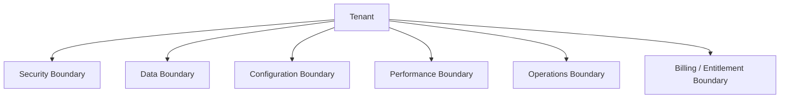
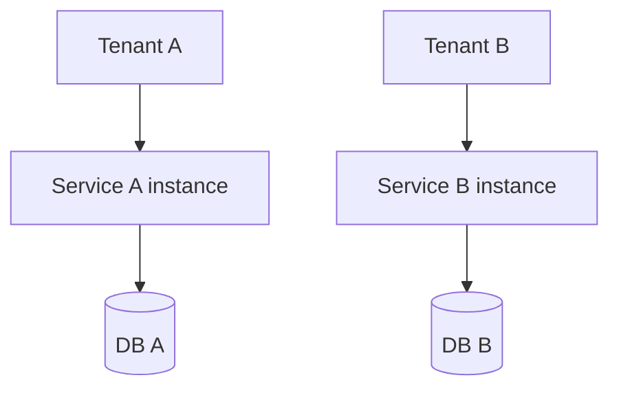
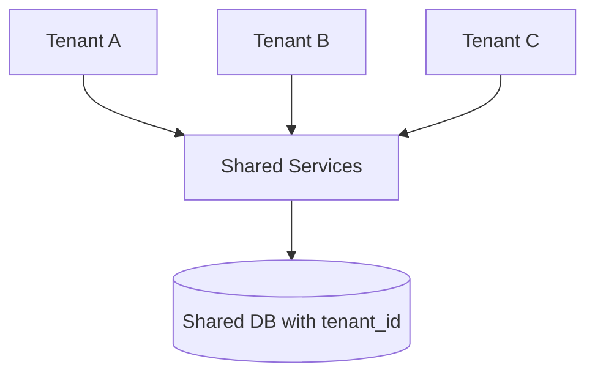
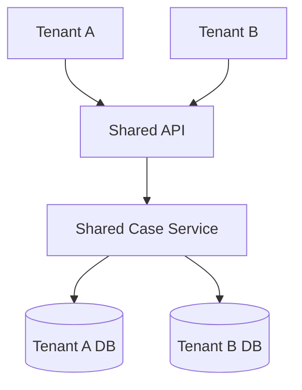
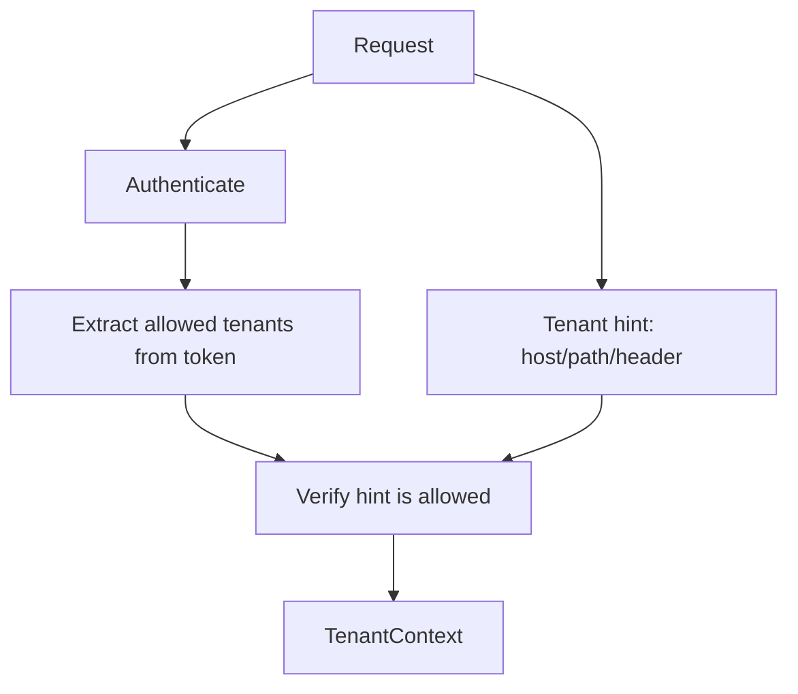
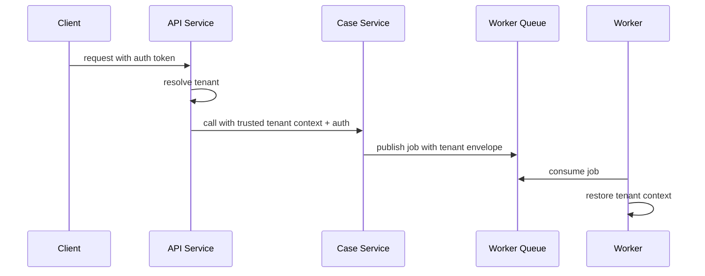
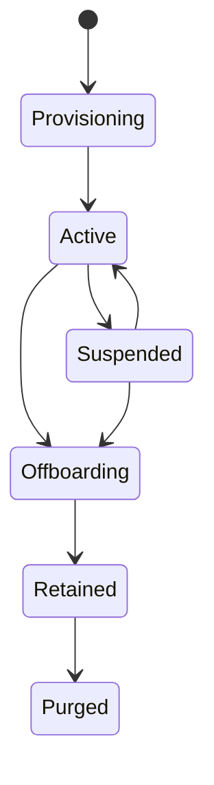
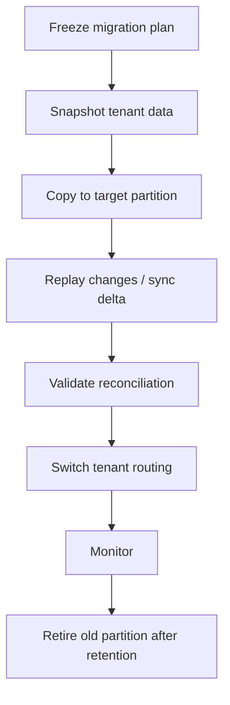
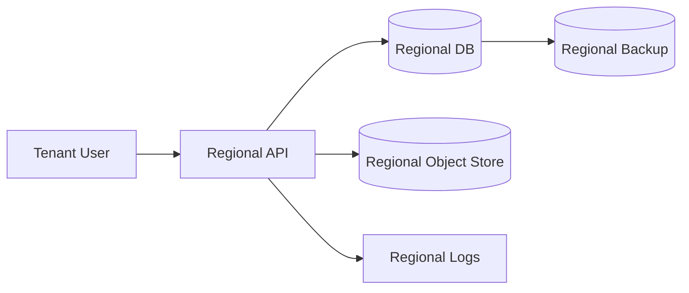

# Part 058 — Multitenancy in Java Microservices

Multitenancy is not “add `tenant_id` to every table”.

That is only one implementation technique.

Multitenancy is an architectural promise:

> Multiple tenants can use the same product/platform while their data, behavior, performance, security, compliance posture, and operational controls remain correctly isolated according to the product contract.

The hard part is not making tenant data fit into a shared schema.

The hard part is preventing these failures:

- tenant A reads tenant B data
- tenant A consumes all worker capacity
- tenant A receives tenant B webhook
- tenant A configuration changes tenant B behavior
- cache key omits tenant ID
- background job processes cross-tenant records
- support admin acts without tenant-scoped audit
- search index leaks another tenant's document
- metrics cannot identify noisy tenant
- migration breaks one tenant while all tenants share deployment

This part builds a practical model for multitenant Java microservices.

---

## 1. Core Mental Model

A tenant is a **security, billing, configuration, data, and operations boundary**.

Not every system uses all five equally, but a serious SaaS/multitenant platform must reason about each.



If you only model tenant as a column, you will miss most failure modes.

---

## 2. Define Tenant Precisely

A tenant may represent:

- customer organization
- business unit
- legal entity
- jurisdiction
- environment partition
- reseller account
- agency/department
- regulated operating entity
- data residency unit

Do not assume tenant equals company.

In regulatory systems, a “tenant” could be:

- agency
- regulator
- jurisdiction
- enforcement program
- delegated authority group
- external partner organization

The definition matters because it determines:

- who can see data
- who owns configuration
- who pays
- who gets isolated capacity
- who receives audit reports
- where data can reside
- which policy applies

A bad tenant definition creates years of expensive rework.

---

## 3. Tenant Isolation Axes

Tenant isolation is multidimensional.

| Axis | Question |
|---|---|
| Identity isolation | Can identities from tenant A act in tenant B? |
| Data isolation | Can records leak across tenant boundary? |
| Compute isolation | Can tenant A overload tenant B? |
| Network isolation | Can tenant workloads/resources communicate improperly? |
| Configuration isolation | Can tenant A settings affect tenant B? |
| Cache isolation | Can tenant A read cached tenant B response? |
| Message isolation | Can tenant A consume tenant B events/jobs? |
| Observability isolation | Can metrics/logs/traces be filtered by tenant? |
| Operations isolation | Can support/admin actions be tenant-scoped and audited? |
| Compliance isolation | Can tenant-specific legal/regulatory constraints be enforced? |

Architecture review should ask about all axes, not just database layout.

---

## 4. Multitenancy Models

There are three broad deployment/data models.

### 4.1 Silo Model

Each tenant has dedicated resources.



Strengths:

- strong isolation
- easier per-tenant compliance
- simpler noisy-neighbor control
- easier tenant-specific backup/restore

Costs:

- higher infrastructure cost
- more operational overhead
- harder fleet management
- slower provisioning if not automated

Good for:

- high-value enterprise tenants
- strict data residency
- regulated tenants
- tenants requiring custom controls

### 4.2 Pool Model

Tenants share infrastructure and data storage.



Strengths:

- cost efficiency
- easier feature rollout
- high resource utilization
- simpler common operations

Risks:

- data leakage if tenant predicate is missed
- noisy neighbor
- harder tenant-specific recovery
- harder compliance evidence

Good for:

- large number of similar tenants
- low-to-mid isolation requirements
- product-led SaaS at scale

### 4.3 Bridge Model

Some layers are shared, some are tenant-dedicated.



Examples:

- shared app, database per tenant
- shared control plane, dedicated data plane
- shared API edge, dedicated worker pool
- shared metadata, dedicated document store
- pooled small tenants, siloed enterprise tenants

Bridge is often the pragmatic enterprise SaaS model.

---

## 5. Tenant Context

Every request must have tenant context.

Tenant context should be explicit and immutable for the request.

```java
public record TenantContext(
        TenantId tenantId,
        String source,
        Optional<String> jurisdiction,
        Optional<String> plan,
        boolean supportImpersonation
) {}

public record TenantId(String value) {
    public TenantId {
        if (value == null || value.isBlank()) {
            throw new IllegalArgumentException("tenant id is required");
        }
    }
}
```

Do not pass tenant as raw `String` everywhere.

Use a type.

Tenant context should be created once near the boundary:

- API gateway / BFF
- service entry controller
- message consumer
- scheduled job dispatcher
- admin/support action handler

Then propagated explicitly or through controlled request context.

---

## 6. Tenant Resolution

Tenant resolution is security-sensitive.

Possible sources:

- authenticated token claim
- mTLS client identity
- request hostname/subdomain
- path segment
- explicit header from trusted gateway
- message envelope
- job metadata
- admin-selected tenant with audit

Do not blindly trust user-supplied tenant headers.

Bad:

```http
GET /cases/123
X-Tenant-Id: tenant-b
Authorization: Bearer token-for-tenant-a
```

If the service trusts `X-Tenant-Id`, tenant A may access tenant B.

Better model:



Tenant resolution should verify:

- caller is authenticated
- tenant hint is from trusted boundary or matches route
- caller is allowed in tenant
- requested operation is allowed for tenant
- tenant is active and not suspended

---

## 7. Java Tenant Filter

For HTTP APIs, create tenant context at the edge of the service.

```java
public final class TenantContextFilter extends OncePerRequestFilter {
    private final TenantResolver tenantResolver;
    private final TenantContextHolder holder;

    public TenantContextFilter(TenantResolver tenantResolver, TenantContextHolder holder) {
        this.tenantResolver = tenantResolver;
        this.holder = holder;
    }

    @Override
    protected void doFilterInternal(
            HttpServletRequest request,
            HttpServletResponse response,
            FilterChain chain
    ) throws ServletException, IOException {
        TenantContext context = tenantResolver.resolve(request);

        try {
            holder.set(context);
            chain.doFilter(request, response);
        } finally {
            holder.clear();
        }
    }
}
```

The `finally` block matters.

Thread reuse can leak context between requests if cleanup is missing.

For reactive systems, avoid naive `ThreadLocal`. Use Reactor context or explicit parameters.

---

## 8. Tenant Context Propagation

Tenant context must propagate across boundaries.



Propagation rules:

- external headers are untrusted
- internal tenant headers must be authenticated by service identity
- messages must carry tenant metadata in envelope
- scheduled jobs must be tenant-scoped deliberately
- support/admin jobs must include actor and reason
- observability must include tenant-safe identifiers

Do not rely on hidden global context for async jobs.

---

## 9. Data Isolation Patterns

### 9.1 Database Per Tenant

```text
tenant_a_case_db
tenant_b_case_db
tenant_c_case_db
```

Strengths:

- strong isolation
- easier backup/restore per tenant
- easier per-tenant encryption key
- easier data residency

Costs:

- operational complexity
- schema migration fleet problem
- connection pool explosion
- resource fragmentation

Java implication:

```java
public interface TenantDataSourceResolver {
    DataSource resolve(TenantId tenantId);
}
```

Be careful with pools. One pool per tenant does not scale if there are thousands of tenants.

### 9.2 Schema Per Tenant

```text
case_db.tenant_a.cases
case_db.tenant_b.cases
```

Strengths:

- moderate isolation
- shared database instance
- tenant-specific schema operations possible

Risks:

- search path bugs
- migration complexity
- connection/session state leak
- still shared physical resources

If using schema switching, reset session state aggressively.

### 9.3 Shared Table With Tenant ID

```sql
CREATE TABLE cases (
  tenant_id text NOT NULL,
  case_id uuid NOT NULL,
  status text NOT NULL,
  created_at timestamptz NOT NULL,
  PRIMARY KEY (tenant_id, case_id)
);
```

Strengths:

- cost-efficient
- easier aggregate queries
- simpler fleet operations

Risks:

- one missing predicate leaks data
- indexes must include tenant
- tenant-specific backup/restore is harder
- noisy neighbor is more likely

This model demands rigorous enforcement.

---

## 10. Tenant Predicate Enforcement

Do not depend on every developer remembering `WHERE tenant_id = ?`.

Bad:

```java
@Query("select c from CaseEntity c where c.caseId = :caseId")
Optional<CaseEntity> findByCaseId(UUID caseId);
```

Better:

```java
@Query("""
       select c
       from CaseEntity c
       where c.tenantId = :tenantId
         and c.caseId = :caseId
       """)
Optional<CaseEntity> findByTenantIdAndCaseId(TenantId tenantId, UUID caseId);
```

Even better: repository API requires tenant context.

```java
public interface CaseRepository {
    Optional<Case> findById(TenantContext tenant, CaseId caseId);
    void save(TenantContext tenant, Case aggregate);
}
```

The implementation cannot query without tenant.

```java
public final class JdbcCaseRepository implements CaseRepository {
    private final JdbcTemplate jdbc;

    @Override
    public Optional<Case> findById(TenantContext tenant, CaseId caseId) {
        return jdbc.query("""
                select tenant_id, case_id, status, version
                from cases
                where tenant_id = ? and case_id = ?
                """,
                mapper(),
                tenant.tenantId().value(),
                caseId.value()
        ).stream().findFirst();
    }
}
```

Make the wrong query hard to write.

---

## 11. Database-Level Defense

Application checks are necessary but not always sufficient.

Possible DB-level controls:

- composite primary keys including tenant ID
- foreign keys including tenant ID
- row-level security
- views scoped by tenant context
- database roles per service/tenant
- separate schemas/databases
- per-tenant encryption keys

Example composite key discipline:

```sql
CREATE TABLE case_evidence (
  tenant_id text NOT NULL,
  evidence_id uuid NOT NULL,
  case_id uuid NOT NULL,
  created_at timestamptz NOT NULL,
  PRIMARY KEY (tenant_id, evidence_id),
  FOREIGN KEY (tenant_id, case_id)
    REFERENCES cases (tenant_id, case_id)
);
```

This prevents evidence from tenant A referencing case from tenant B.

A database schema should encode tenant invariants where practical.

---

## 12. Tenant-Aware Domain Model

Do not make tenant merely an infrastructure concern.

If business rules differ by tenant/jurisdiction/plan, the application layer needs tenant context.

```java
public final class CaseApplicationService {
    private final CaseRepository cases;
    private final TenantPolicyProvider policies;

    public CaseId openCase(TenantContext tenant, OpenCaseCommand command) {
        TenantPolicy policy = policies.forTenant(tenant.tenantId());

        Case opened = Case.open(
                tenant.tenantId(),
                command.subject(),
                command.allegation(),
                policy.caseNumberingRule()
        );

        cases.save(tenant, opened);
        return opened.id();
    }
}
```

The domain aggregate may carry `tenantId` if tenant is part of identity/invariant.

```java
public final class Case {
    private final TenantId tenantId;
    private final CaseId caseId;
    private CaseStatus status;

    public void assignTo(Investigator investigator) {
        if (!investigator.canWorkFor(tenantId)) {
            throw new DomainRuleViolation("investigator is not allowed for tenant");
        }
        // assign
    }
}
```

Avoid domain logic that is unaware of tenant where tenant affects policy.

---

## 13. Tenant-Aware Cache

Cache leakage is one of the most common multitenancy bugs.

Bad:

```java
@Cacheable(cacheNames = "case-summary", key = "#caseId")
public CaseSummary getSummary(UUID caseId) { ... }
```

If two tenants can have the same `caseId`, this leaks.

Better:

```java
@Cacheable(cacheNames = "case-summary", key = "#tenant.tenantId.value + ':' + #caseId")
public CaseSummary getSummary(TenantContext tenant, UUID caseId) { ... }
```

For distributed caches, include tenant in:

- key prefix
- eviction scope
- metrics tag if cardinality is controlled
- quota accounting
- encryption context where supported

Cache review checklist:

- Is tenant in every key?
- Is cache invalidation tenant-scoped?
- Can support evict one tenant?
- Can one tenant fill the cache?
- Are cached values tenant-safe?
- Are negative cache entries tenant-scoped?

---

## 14. Tenant-Aware Messaging

Every message must carry tenant metadata.

```json
{
  "eventId": "01J...",
  "tenantId": "regulator-id",
  "eventType": "CaseEscalated",
  "occurredAt": "2026-07-05T10:15:30Z",
  "producer": "case-service",
  "payload": {
    "caseId": "...",
    "newEscalationLevel": "ENFORCEMENT_BOARD"
  }
}
```

Consumer rule:

> Restore tenant context before processing payload.

```java
public final class TenantAwareMessageHandler {
    private final TenantRegistry tenants;
    private final CaseEventHandler delegate;

    public void handle(EventEnvelope envelope) {
        TenantContext tenant = tenants.activeTenant(envelope.tenantId())
                .orElseThrow(() -> new InvalidTenantException(envelope.tenantId()));

        delegate.handle(tenant, envelope.payload());
    }
}
```

Message isolation strategies:

| Strategy | Use When | Trade-Off |
|---|---|---|
| Shared topic with tenant envelope | many tenants, similar traffic | consumer must enforce tenant |
| Topic per tenant | stronger isolation, few tenants | topic explosion |
| Partition by tenant | ordering per tenant | hot tenant can create hot partition |
| Queue per tenant | per-tenant throttling | operational overhead |
| Dedicated consumer pool | enterprise/noisy tenant | cost |

---

## 15. Tenant-Aware Search Indexes

Search leaks are severe because indexes often denormalize many fields.

Rules:

- every document includes tenant ID
- every query adds tenant filter
- index aliases may be tenant-scoped
- support/admin queries are explicitly audited
- reindex jobs are tenant-scoped or safely partitioned
- document IDs include tenant or are globally unique

Bad query:

```json
{
  "query": {
    "match": { "subject": "acme" }
  }
}
```

Better:

```json
{
  "query": {
    "bool": {
      "filter": [
        { "term": { "tenantId": "regulator-id" } }
      ],
      "must": [
        { "match": { "subject": "acme" } }
      ]
    }
  }
}
```

Application code should make tenant filter automatic.

---

## 16. Tenant Configuration

Tenant configuration often becomes a hidden distributed system.

Examples:

- enabled modules
- escalation SLA
- allowed case categories
- retention period
- notification templates
- jurisdiction policy
- integration endpoint
- rate limits
- data residency
- support access policy

Configuration needs:

- schema validation
- versioning
- audit history
- rollout control
- effective config view
- safe defaults
- tenant-specific override precedence
- test fixtures

Example config model:

```java
public record TenantRuntimeConfig(
        TenantId tenantId,
        Duration escalationSla,
        Set<CaseCategory> allowedCategories,
        RetentionPolicy retentionPolicy,
        RateLimitPolicy rateLimitPolicy,
        int version
) {}
```

Config changes can be as dangerous as code changes.

A tenant-specific policy change should be auditable and reversible.

---

## 17. Entitlements and Plan Boundaries

Tenant plan controls what a tenant is allowed to do.

Examples:

- max users
- max active cases
- advanced workflow enabled
- API access enabled
- webhook volume
- data export allowed
- retention tier
- dedicated capacity

Do not scatter plan checks across controllers.

```java
public interface EntitlementService {
    void require(TenantContext tenant, Entitlement entitlement);
}

public enum Entitlement {
    OPEN_CASE,
    BULK_EXPORT,
    ADVANCED_ESCALATION,
    WEBHOOK_INTEGRATION
}
```

Use entitlements as policy decisions, not UI-only toggles.

---

## 18. Noisy Neighbor Control

In pooled systems, one tenant can harm others.

Control surfaces:

- per-tenant rate limits
- per-tenant concurrency limits
- per-tenant queue limits
- per-tenant worker fairness
- per-tenant storage quotas
- per-tenant export throttling
- per-tenant cache quota
- per-tenant circuit breakers for integrations

Example concurrency limiter:

```java
public final class TenantConcurrencyLimiter {
    private final ConcurrentHashMap<TenantId, Semaphore> limits = new ConcurrentHashMap<>();
    private final TenantLimitPolicy policy;

    public <T> T execute(TenantContext tenant, Supplier<T> action) {
        Semaphore semaphore = limits.computeIfAbsent(
                tenant.tenantId(),
                id -> new Semaphore(policy.maxConcurrentRequests(id))
        );

        if (!semaphore.tryAcquire()) {
            throw new TooManyRequestsException("tenant concurrency limit exceeded");
        }

        try {
            return action.get();
        } finally {
            semaphore.release();
        }
    }
}
```

This is not enough by itself, but it illustrates the boundary.

Noisy neighbor control must exist at multiple layers:

- gateway
- service
- worker queue
- database
- cache
- search
- third-party integration

---

## 19. Tenant-Aware Observability

You need tenant-aware visibility, but tenant labels can explode metric cardinality.

Use tenant tags carefully.

Good metrics:

```text
requests_total{service, route, status, tenant_tier}
requests_total{service, route, status, tenant_id}  # only if bounded/top tenants
queue_depth{service, tenant_id}                    # maybe only for enterprise tenants
rate_limited_total{service, tenant_id, reason}
```

Avoid unbounded tenant IDs on every high-volume metric if you have many tenants.

Alternatives:

- tag by tenant tier/plan
- expose top-N noisy tenants via logs/events
- emit tenant-specific metrics only for enterprise tenants
- use exemplars/traces for tenant-specific diagnosis
- maintain operational tenant dashboards outside metrics cardinality hot path

Logs and traces can include tenant ID if policy allows.

Security concern:

> Tenant ID itself may be sensitive in some environments.

Use stable internal tenant IDs rather than customer names in telemetry.

---

## 20. Tenant Lifecycle

A tenant has lifecycle states.



Lifecycle operations:

- provision tenant
- configure policies
- create data partition/resources
- activate integrations
- suspend tenant
- migrate tenant
- export tenant data
- retain tenant data
- purge tenant data
- restore tenant backup

Each operation needs audit.

Do not model tenant as a row with only `active = true`.

---

## 21. Tenant Provisioning

Provisioning may create:

- tenant registry entry
- identity provider tenant/group mapping
- database/schema/partition
- encryption key
- configuration baseline
- rate limit policy
- message topic/queue/partition
- search index/alias
- object storage prefix/bucket
- observability dashboard
- support access policy

Provisioning should be idempotent.

```java
public final class TenantProvisioningWorkflow {
    public void provision(TenantId tenantId) {
        registry.ensureTenantRecord(tenantId);
        keys.ensureTenantKey(tenantId);
        database.ensureTenantPartition(tenantId);
        config.ensureDefaultConfig(tenantId);
        limits.ensureDefaultLimits(tenantId);
        search.ensureTenantIndexAlias(tenantId);
        audit.recordTenantProvisioned(tenantId);
    }
}
```

Each `ensure...` operation should be retry-safe.

---

## 22. Tenant Migration

Tenant migration is common:

- pooled tenant becomes enterprise silo
- tenant changes region
- tenant moves from shared DB to dedicated DB
- tenant merges with another tenant
- tenant splits into multiple legal entities
- tenant upgrades plan requiring dedicated capacity

Migration requires:

- data copy
- traffic routing change
- dual-read/dual-write avoidance strategy
- reconciliation
- rollback point
- audit trail
- downtime contract

High-level flow:



The hardest part is not copying data. It is preserving correctness during writes.

---

## 23. Tenant-Aware Authorization

Multitenancy and authorization are inseparable.

Authorization should check:

- actor belongs to tenant
- actor has role/permission in tenant
- workload is allowed to act for tenant
- object belongs to tenant
- operation is valid under tenant policy
- support/admin override is allowed and audited

Example:

```java
public final class CaseAccessPolicy {
    public void requireCanView(TenantContext tenant, Actor actor, Case caze) {
        if (!caze.tenantId().equals(tenant.tenantId())) {
            throw new AccessDeniedException("case does not belong to tenant");
        }
        if (!actor.hasPermission(tenant.tenantId(), "case:view")) {
            throw new AccessDeniedException("missing case:view permission");
        }
    }
}
```

Never authorize only by object ID.

Authorize by tenant + object + action + state.

---

## 24. Tenant-Aware Audit

Audit records must include tenant context.

```json
{
  "event": "case.assignment.changed",
  "tenantId": "regulator-id",
  "actorId": "user-123",
  "actorTenantRole": "senior-investigator",
  "caseId": "case-456",
  "oldAssignee": "user-111",
  "newAssignee": "user-222",
  "reason": "capacity-rebalance",
  "occurredAt": "2026-07-05T12:30:00Z"
}
```

For support/admin actions, add:

- support actor ID
- customer approval/reference
- break-glass flag
- reason
- expiration window
- ticket ID

Multitenant audit must prove not only what happened, but **under which tenant authority** it happened.

---

## 25. Data Residency and Regional Isolation

Some tenants require data to stay in a region or jurisdiction.

This affects:

- API routing
- database location
- object storage bucket
- search index
- backup location
- logs/traces
- analytics pipeline
- support access
- disaster recovery

Data residency is not satisfied if the primary database is regional but logs are global.

Data flow diagram must include telemetry and backups.



If traces/logs leave the region with PII, the design may violate the tenant contract.

---

## 26. Testing Multitenancy

Multitenancy needs specific tests.

### 26.1 Tenant Isolation Unit Test

```java
@Test
void cannotLoadCaseFromAnotherTenant() {
    TenantContext tenantA = tenant("A");
    TenantContext tenantB = tenant("B");

    CaseId id = cases.save(tenantA, sampleCase()).id();

    assertThat(cases.findById(tenantB, id)).isEmpty();
}
```

### 26.2 Cache Isolation Test

```java
@Test
void cacheKeyIncludesTenant() {
    CaseId sameId = new CaseId(UUID.fromString("00000000-0000-0000-0000-000000000001"));

    service.save(tenant("A"), caseWithId(sameId, "A-title"));
    service.save(tenant("B"), caseWithId(sameId, "B-title"));

    assertThat(service.summary(tenant("A"), sameId).title()).isEqualTo("A-title");
    assertThat(service.summary(tenant("B"), sameId).title()).isEqualTo("B-title");
}
```

### 26.3 Message Isolation Test

```java
@Test
void consumerRestoresTenantContextFromEnvelope() {
    EventEnvelope event = EventEnvelope.forTenant("tenant-a", payload);

    handler.handle(event);

    assertThat(audit.lastEvent().tenantId()).isEqualTo(new TenantId("tenant-a"));
}
```

### 26.4 Negative Authorization Test

Every resource endpoint should have a cross-tenant access test.

```text
Given token for tenant A
When requesting resource owned by tenant B
Then response is 404 or 403 according to API policy
And no tenant B data appears in body/log/audit leakage
```

---

## 27. Operational Playbooks

Multitenant systems need tenant-specific operations.

Playbooks:

- suspend tenant
- unsuspend tenant
- throttle tenant
- isolate noisy tenant
- rotate tenant-specific key
- export tenant data
- purge tenant data
- migrate tenant region
- restore tenant backup
- investigate tenant data access complaint
- disable tenant integration

Each playbook should specify:

- authorization required
- commands/tools
- audit evidence
- customer impact
- rollback
- verification

---

## 28. Common Anti-Patterns

### 28.1 Tenant ID as Optional Parameter

If tenant is optional, someone will omit it.

Make tenant required at boundaries.

### 28.2 Trusting Client-Supplied Tenant Header

Only trusted infrastructure should assert tenant context, and services should verify it against identity.

### 28.3 Cache Key Without Tenant

This is a classic data leak.

### 28.4 Global Background Job

A job that processes all tenants without tenant-scoped checkpointing is hard to control and recover.

### 28.5 Shared Admin Role Across Tenants

Support tooling must be tenant-scoped and audited.

### 28.6 Tenant-Agnostic Metrics

If you cannot identify a noisy tenant, all tenants suffer.

### 28.7 Tenant-Specific Custom Code

Custom code per tenant destroys maintainability.

Prefer configuration, policy, workflow definitions, and extension points.

### 28.8 Assuming Pooled Means Weak Isolation

Pooled systems can be safe if enforcement is rigorous.

But the burden of proof is higher.

---

## 29. Architecture Decision Matrix

Use this when choosing an isolation model.

| Requirement | Pool | Bridge | Silo |
|---|---:|---:|---:|
| Low cost | High | Medium | Low |
| Strong data isolation | Medium | High | Very High |
| Easy per-tenant backup | Low | Medium/High | High |
| Many small tenants | High | Medium | Low |
| Enterprise tenant controls | Low/Medium | High | High |
| Data residency | Medium | High | High |
| Operational simplicity | Medium | Medium | Low |
| Noisy-neighbor protection | Medium | High | High |
| Tenant-specific customization | Medium | High | High |

There is no universally correct answer.

The correct architecture is the one whose isolation guarantees match the product, compliance, and cost model.

---

## 30. Mini Case Study: Regulatory Case Platform

Assume a SaaS platform serves multiple regulators.

Tenants:

- national regulator
- regional regulator
- delegated enforcement agency

Requirements:

- strict data separation by agency
- some agencies require regional residency
- shared product features
- agency-specific escalation rules
- tenant-specific reporting
- support access must be audited
- large agencies can produce heavy document ingestion load

### 30.1 Suggested Model

Use bridge model:

```text
Shared control plane:
  - tenant registry
  - identity mapping
  - service catalog
  - product feature flags

Shared application services for standard tenants:
  - case-service
  - evidence-service
  - decision-service

Dedicated data partitions for regulated/high-volume tenants:
  - database/schema per enterprise tenant or region
  - object storage prefix/bucket per tenant
  - tenant-specific encryption key

Tenant-aware shared workers:
  - fair scheduling
  - tenant quota
  - dedicated queue for high-volume tenants
```

### 30.2 Case Service Rules

- every case ID belongs to exactly one tenant
- every query includes tenant context
- case number generation is tenant-specific
- escalation SLA is tenant-specific
- audit event includes tenant ID and actor authority
- support action requires tenant-scoped approval

### 30.3 Failure Example

A bulk export job forgets tenant filter.

Bad job:

```sql
select * from cases where status = 'CLOSED';
```

Correct job:

```sql
select *
from cases
where tenant_id = ?
  and status = 'CLOSED';
```

Better architecture:

- job is created per tenant
- job envelope contains tenant ID
- repository requires tenant context
- export worker uses tenant-scoped authorization
- audit records export parameters
- object storage path includes tenant ID
- export URL is scoped and expires

---

## 31. Review Checklist

For each service:

- What is the tenant definition?
- How is tenant resolved?
- Can client spoof tenant ID?
- Is tenant context required at API/message/job boundaries?
- Is tenant context propagated to downstream calls?
- Does every repository require tenant context?
- Do DB keys/constraints encode tenant isolation?
- Are cache keys tenant-scoped?
- Are search queries tenant-filtered?
- Are events tenant-enveloped?
- Can one tenant overload the service?
- Are quotas/rate limits tenant-aware?
- Are logs/traces/metrics tenant-aware without unsafe cardinality?
- Is support/admin access tenant-scoped and audited?
- Is tenant config versioned and auditable?
- Can tenant be suspended?
- Can tenant be exported/purged/restored?
- What is the tenant migration strategy?
- Does data residency include telemetry/backups?

---

## 32. Summary

Multitenancy is an architecture problem, not a database column.

A production-grade Java microservice must treat tenant as:

- identity boundary
- data boundary
- policy boundary
- operational boundary
- performance boundary
- audit boundary

The core invariants are:

1. tenant context is established by trusted resolution
2. tenant context is required at every service boundary
3. data access cannot happen without tenant scope
4. cache/message/search/background jobs preserve tenant isolation
5. noisy tenants cannot harm everyone silently
6. tenant operations are auditable
7. the chosen isolation model matches business and compliance risk

A good multitenant architecture makes the safe path easy and the unsafe path difficult.

That is the level required for serious enterprise microservices.

---

## References

- AWS SaaS Architecture Fundamentals — Multi-Tenancy
- AWS SaaS Tenant Isolation Strategies
- OWASP API Security Top 10
- Kubernetes Multi-tenancy and Namespace/Network isolation concepts
- PostgreSQL Row Level Security documentation
