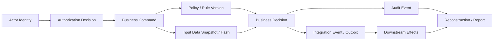
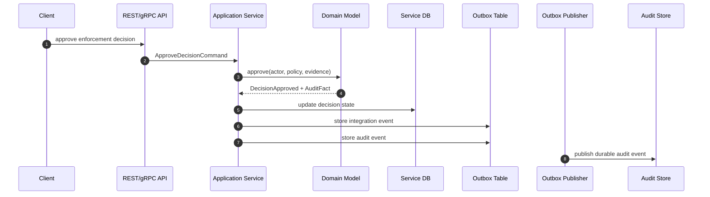
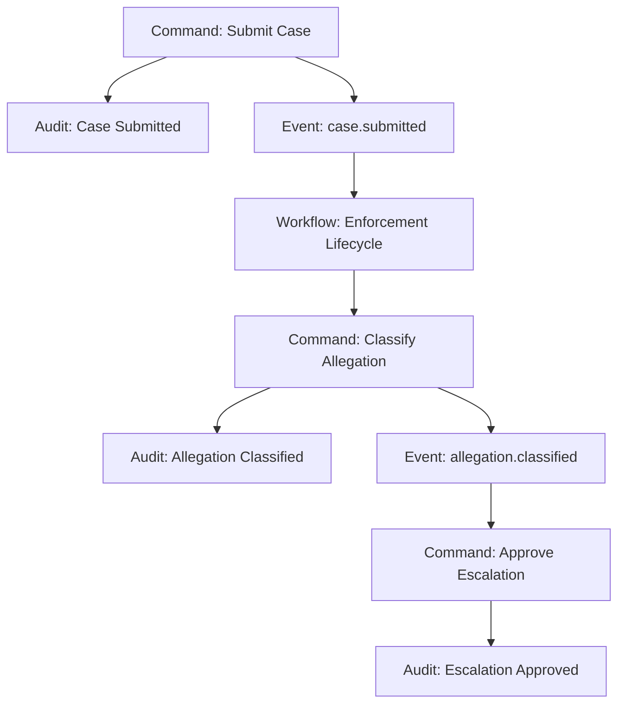
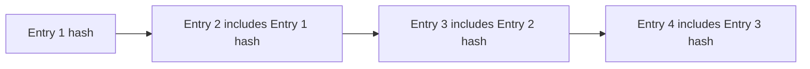

# Part 059 — Auditability and Regulatory Defensibility

## 1. Core idea

Auditability is the ability to reconstruct **what happened, who caused it, why the system allowed it, what data was used, what policy was applied, and what downstream effects followed**.

Regulatory defensibility is stronger than auditability. It means the system can defend a decision under scrutiny from a regulator, auditor, court, customer, internal risk team, or incident review board. It is not enough to say:

> “The service called the endpoint successfully.”

A defensible system can answer:

> “On this date, actor `A` performed action `X` on case `C`; the system evaluated policy version `P`, used evidence snapshot `E`, produced decision `D`, emitted event `Y`, notified downstream service `Z`, and all of this can be independently verified from append-only records.”

In microservices, this is harder than in a monolith because the truth is distributed across services, databases, queues, caches, workflow engines, identity providers, API gateways, and observability tools.

The lesson: **auditability must be designed as a first-class architecture capability, not patched in with logs.**

---

## 2. Audit log is not application log

A common mistake is treating audit as “structured logging with more fields”. That is not enough.

| Signal | Primary user | Purpose | Retention | Trust level |
|---|---:|---|---:|---|
| Debug log | Engineer | Diagnose implementation behavior | Short | Low to medium |
| Operational log | SRE/platform | Diagnose runtime behavior | Short/medium | Medium |
| Security log | Security team | Detect abuse, access, threat behavior | Medium/long | High |
| Audit event | Auditor/business/risk | Reconstruct business-relevant action | Long | High |
| Decision record | Regulator/business owner | Explain why a decision happened | Long | Very high |
| Evidence record | Legal/compliance/system owner | Prove input/output chain | Long/controlled | Very high |

Debug logs describe **implementation behavior**.

Audit events describe **business-relevant behavior**.

Decision records describe **reasoning and policy application**.

Evidence records preserve **proof of facts, snapshots, versions, and links**.

OWASP's logging guidance explicitly warns that logs can contain sensitive data and must be protected from tampering, unauthorized access, modification, and deletion. NIST SP 800-92 also frames log management as an enterprise discipline, not a casual developer convenience.

---

## 3. Mental model: the evidence chain

Think of every regulated action as a chain of evidence:



The important question is not “did we log something?”

The important question is:

> Can a reviewer reconstruct the end-to-end business event without relying on tribal knowledge, ad-hoc database queries, or developer interpretation?

A defensible evidence chain has these properties:

1. **Completeness** — all material business steps are recorded.
2. **Causality** — the relationship between action, decision, and effect is explicit.
3. **Attribution** — human/system actor is known.
4. **Authority** — policy/rule/source of truth is known.
5. **Integrity** — records cannot be silently altered.
6. **Retention** — records survive long enough for review obligations.
7. **Privacy discipline** — audit does not become a permanent sensitive-data landfill.
8. **Reconstructability** — future teams can understand old records even after services evolve.

---

## 4. The auditability invariant

A Java microservice that participates in regulated behavior should satisfy this invariant:

> Every material business action must produce a durable, queryable, access-controlled, semantically stable audit record that can be correlated with the command, actor, subject, policy, decision, and emitted side effects.

Break this invariant and the service may still be technically correct, but operationally indefensible.

### 4.1 Material business action

Not every method call is auditable. A material business action is an action that changes, determines, exposes, escalates, approves, rejects, suppresses, transfers, exports, or deletes something meaningful.

Examples:

- Case created
- Case assigned
- Evidence attached
- Evidence viewed
- Allegation classified
- Enforcement decision proposed
- Enforcement decision approved
- Deadline extended
- Risk score overridden
- Notice generated
- Appeal submitted
- Record exported
- Sensitive field disclosed
- Retention hold applied
- Case closed

### 4.2 Non-material implementation event

These usually belong in logs/metrics/traces, not audit:

- HTTP client retry attempt
- Cache miss
- SQL query duration
- Thread pool saturation
- Serialization failure
- Connection pool timeout
- Feature flag lookup

Some implementation events become audit-relevant if they affect a business decision. For example, “risk provider unavailable” may be audit-relevant if the system proceeds with degraded policy.

---

## 5. Audit event design

An audit event should be designed as a domain-level record, not a random log message.

A good audit event answers:

- What happened?
- Who initiated it?
- On whose behalf?
- Against what resource/entity?
- Under what tenant/jurisdiction?
- When did it happen according to system time?
- When was the business-effective time?
- What command/request caused it?
- What policy/rule/version was applied?
- What decision/result occurred?
- What changed?
- What downstream events were emitted?
- What trace/correlation can be used to inspect runtime behavior?

### 5.1 Baseline audit event schema

```java
package com.acme.caseaudit.domain;

import java.time.Instant;
import java.util.Map;
import java.util.UUID;

public record AuditEvent(
    UUID auditEventId,
    String auditEventType,
    String auditSchemaVersion,

    Instant occurredAt,
    Instant recordedAt,
    String effectiveBusinessDate,

    ActorRef actor,
    SubjectRef subject,
    ResourceRef resource,

    String tenantId,
    String jurisdiction,
    String commandId,
    String causationId,
    String correlationId,
    String traceId,

    DecisionRef decision,
    PolicyRef policy,
    ChangeSummary changeSummary,
    Map<String, String> evidenceRefs,
    Map<String, String> emittedEvents,

    String outcome,
    String reasonCode,
    String sensitivityClass
) {}

public record ActorRef(
    String actorType,        // USER, SERVICE, SYSTEM, BATCH, SUPPORT_OPERATOR
    String actorId,
    String delegatedBy,
    String authenticationMethod,
    String assuranceLevel
) {}

public record SubjectRef(
    String subjectType,      // CASE, PARTY, ORGANIZATION, USER, TENANT
    String subjectId
) {}

public record ResourceRef(
    String resourceType,
    String resourceId,
    String resourceVersion
) {}

public record DecisionRef(
    String decisionId,
    String decisionType,
    String decisionVersion,
    String decisionStatus
) {}

public record PolicyRef(
    String policyId,
    String policyVersion,
    String ruleSetVersion,
    String authorizationPolicyVersion
) {}

public record ChangeSummary(
    String changeType,       // CREATED, UPDATED, APPROVED, REJECTED, VIEWED, EXPORTED
    Map<String, String> beforeHashes,
    Map<String, String> afterHashes,
    Map<String, Object> safeDiff
) {}
```

### 5.2 Why not store full before/after data?

A naive audit design stores every full object before and after every change.

That creates problems:

- Personal data becomes duplicated permanently.
- Secret values may accidentally be retained.
- Audit store becomes a shadow database.
- Right-to-delete/retention rules become hard.
- Schema evolution becomes painful.
- Auditors see too much irrelevant data.

A better model stores:

- Stable identifiers
- Business action name
- Actor identity
- Policy/decision references
- Safe summary
- Hashes of important values
- Evidence references
- Optional encrypted snapshot only when legally/operationally required

Do not confuse **auditability** with **data hoarding**.

---

## 6. Audit event vs domain event vs integration event

These three are related but not identical.

| Type | Audience | Primary question | Example |
|---|---|---|---|
| Domain event | Same bounded context | What happened in the domain? | `CaseEscalated` |
| Integration event | Other services | What should other systems know? | `case.escalated.v2` |
| Audit event | Auditor/risk/compliance | What must be defensibly reconstructed? | `CASE_ESCALATION_APPROVED` |

One domain event may produce one or more audit events.

One audit event may reference multiple domain/integration events.

Do not expose internal audit records as integration events unless you explicitly intend downstream systems to depend on audit semantics.

---

## 7. Where to emit audit events

Audit events should be emitted at the **business action boundary**, not inside random infrastructure code.

Good places:

- Application service after successful domain state transition
- Domain service when a business decision is made
- Workflow step when process state changes
- Authorization boundary for sensitive access/disclosure
- Export/download boundary
- Support/admin operation boundary

Bad places:

- Repository save method
- ORM entity lifecycle callback
- Generic HTTP filter only
- Database trigger only
- Logging interceptor only

Database triggers can be useful as defense-in-depth for low-level mutation tracking, but they usually cannot capture full business causality: actor, command, policy, reason, workflow step, and semantic result.

### 7.1 Recommended flow



The audit event is created in the same local transaction as the business state change by using an outbox table. This avoids the dual-write problem:

- State changed but audit missing
- Audit written but state not changed

For regulated actions, missing audit is usually not an acceptable “best effort” behavior.

---

## 8. Audit outbox pattern

A simple audit port:

```java
public interface AuditRecorder {
    void record(AuditEvent event);
}
```

A transactional implementation may write to a local outbox table:

```java
@Component
public class OutboxAuditRecorder implements AuditRecorder {
    private final AuditOutboxRepository repository;
    private final ObjectMapper objectMapper;

    public OutboxAuditRecorder(AuditOutboxRepository repository, ObjectMapper objectMapper) {
        this.repository = repository;
        this.objectMapper = objectMapper;
    }

    @Override
    public void record(AuditEvent event) {
        try {
            repository.insert(new AuditOutboxRow(
                event.auditEventId(),
                event.auditEventType(),
                event.occurredAt(),
                objectMapper.writeValueAsString(event),
                "PENDING"
            ));
        } catch (JsonProcessingException e) {
            throw new AuditSerializationException("Cannot serialize audit event", e);
        }
    }
}
```

The application service coordinates state and audit within a local transaction:

```java
@Service
public class ApproveDecisionUseCase {
    private final DecisionRepository decisions;
    private final PolicyCatalog policies;
    private final AuditRecorder auditRecorder;
    private final IntegrationEventRecorder integrationEvents;

    @Transactional
    public ApproveDecisionResult handle(ApproveDecisionCommand command) {
        Decision decision = decisions.getForUpdate(command.decisionId());
        PolicySnapshot policy = policies.snapshotFor("ENFORCEMENT_APPROVAL");

        DecisionApproved approved = decision.approve(
            command.actor(),
            command.reason(),
            policy
        );

        decisions.save(decision);
        integrationEvents.record(approved.toIntegrationEvent(command));
        auditRecorder.record(approved.toAuditEvent(command, policy));

        return new ApproveDecisionResult(decision.id(), decision.version());
    }
}
```

The core rule:

> If the state transition commits, the audit fact must commit too.

---

## 9. Decision records: auditability of reasoning

Some systems only need to prove that an action happened.

Regulated systems often need to prove **why** it happened.

For example:

- Why was a case escalated?
- Why was a claim rejected?
- Why was access granted?
- Why did a risk score change?
- Why was enforcement action recommended?
- Why was a deadline extended?

This requires a **decision record**, not just an audit event.

### 9.1 Decision record schema

```java
public record DecisionRecord(
    String decisionId,
    String decisionType,
    String decisionSchemaVersion,
    Instant decidedAt,

    String subjectType,
    String subjectId,
    String tenantId,
    String jurisdiction,

    String policyId,
    String policyVersion,
    String ruleSetVersion,
    String modelVersion,

    Map<String, String> inputEvidenceRefs,
    Map<String, String> inputEvidenceHashes,
    Map<String, Object> safeInputSummary,

    String outcome,
    List<String> reasonCodes,
    List<String> humanReadableReasons,
    List<String> obligations,
    String decidedByActorId,
    String reviewedByActorId,

    String traceId,
    String correlationId
) {}
```

### 9.2 Reason codes over prose

Free-text explanations are useful for humans but weak for analytics and audit.

Use stable reason codes:

```text
CASE_RISK_SCORE_ABOVE_THRESHOLD
MANDATORY_DOCUMENT_MISSING
PRIOR_VIOLATION_WITHIN_LOOKBACK_PERIOD
MANUAL_SUPERVISOR_OVERRIDE
POLICY_EXCEPTION_GRANTED
```

Then map reason codes to localized/human-readable text outside the decision record.

### 9.3 Capture policy version

A decision without policy version is only half defensible.

Imagine reviewing a case two years later. The current policy may not be the policy used at the time.

Store:

- Policy ID
- Policy version
- Rule set version
- Model version, if ML/scoring is used
- Feature flag state, if behavior was conditional
- Jurisdiction/regulatory version, if relevant
- Effective date of policy

---

## 10. Identity attribution

Audit records must distinguish actor types.

```text
USER               A real authenticated human
SERVICE            A workload acting under service identity
SYSTEM             Internal automated system actor
BATCH              Scheduled/bulk processor
SUPPORT_OPERATOR   Privileged support/admin actor
DELEGATED_USER     User acting on behalf of another party
EXTERNAL_PARTNER   Federated/external system actor
```

Do not store only `createdBy`.

A strong actor record includes:

- Actor ID
- Actor type
- Authenticated principal
- Delegated authority
- Tenant
- Organization
- Role/permission snapshot or reference
- Authentication method
- Session ID or token ID reference
- Support access ticket/change request ID

For service-to-service calls, actor attribution should preserve both:

1. The **original business initiator**
2. The **current technical caller**

Example:

```json
{
  "actor": {
    "actorType": "USER",
    "actorId": "user-9281",
    "delegatedBy": null,
    "authenticationMethod": "OIDC_MFA"
  },
  "technicalCaller": {
    "workloadId": "spiffe://prod/ns/case-management/sa/case-api",
    "service": "case-api"
  }
}
```

---

## 11. Causality in distributed audit trails

A trace ID is not enough.

Trace IDs are operational. They help engineers debug runtime call chains.

Audit requires business causality.

Use multiple IDs:

| ID | Meaning |
|---|---|
| `traceId` | Runtime distributed trace |
| `correlationId` | End-to-end user journey/request family |
| `causationId` | Immediate event/command that caused this action |
| `commandId` | Client/application command identity |
| `workflowInstanceId` | Long-running business process identity |
| `auditEventId` | Unique audit record identity |
| `decisionId` | Business decision identity |

### 11.1 Causality graph



A reviewer should be able to move from any node to its cause and effects.

---

## 12. Tamper resistance

Audit data is only useful if people trust it.

Common controls:

1. **Append-only storage** — no in-place update of audit records.
2. **Separation of duties** — application operators cannot silently rewrite audit records.
3. **Hash chaining** — each record includes hash of previous record or batch.
4. **Digital signatures** — record/batch signed by trusted key.
5. **Immutable/WORM storage** — storage-level retention lock for high-value evidence.
6. **Access logging on audit store** — audit access is itself audited.
7. **Encryption at rest and in transit** — especially when audit contains personal/sensitive data.
8. **Retention policy** — retention is explicit, not accidental.
9. **Legal hold** — prevent deletion when investigation requires preservation.
10. **Integrity verification job** — periodically verify hash chain/signature.

### 12.1 Simple hash-chain model

```java
public record AuditLedgerEntry(
    long sequence,
    UUID auditEventId,
    String canonicalPayloadHash,
    String previousEntryHash,
    String entryHash,
    Instant recordedAt
) {}
```

The hash should be computed over a canonical representation. If JSON field order or whitespace changes the hash, future verification will be fragile.



Hash chaining does not prevent deletion by itself. It makes deletion or modification detectable when combined with secure storage and independent verification.

---

## 13. Time, ordering, and clocks

Distributed systems do not have a perfect global clock.

Audit records should capture multiple time concepts:

| Field | Meaning |
|---|---|
| `occurredAt` | When service believes the business action occurred |
| `recordedAt` | When audit event was persisted/accepted |
| `effectiveBusinessDate` | Business-effective date, may differ from system time |
| `sourceEventTime` | Time from upstream event, if applicable |
| `processingStartedAt` | Useful for long-running workflow steps |
| `processingCompletedAt` | Useful for SLA reconstruction |

Do not rely on sequence numbers across independent services unless you have an explicit ledger/ordering mechanism.

For cross-service reconstruction, use:

- Causation links
- Correlation IDs
- Workflow IDs
- Event offsets
- Version numbers
- Recorded timestamps
- Watermarks

---

## 14. Audit access model

Audit data is sensitive.

It may reveal:

- Personal data
- Investigation strategy
- Internal policy rules
- Security events
- Privileged admin behavior
- Regulatory weaknesses
- Customer/tenant relationships

A production audit system needs:

- Dedicated read permissions
- Tenant/jurisdiction isolation
- Purpose-based access
- Break-glass process
- Export approval
- Redaction by role
- Query audit trail
- Immutable access logs

Never assume “audit data is safe because it is internal”.

---

## 15. Retention, legal hold, and deletion tension

Auditability and privacy can conflict.

Audit wants records retained.

Privacy wants minimization and deletion when no longer needed.

The architecture must support both through classification:

| Data category | Audit handling |
|---|---|
| Stable IDs | Usually retained |
| Policy versions | Retained |
| Reason codes | Retained |
| Hashes | Retained |
| Full personal snapshots | Avoid unless required |
| Secrets/tokens | Never retain |
| Sensitive evidence contents | Store by reference, not inline |
| Export payloads | Strongly controlled, short retention unless required |

Legal hold must override ordinary deletion until the hold is released.

But legal hold should be explicit, auditable, scoped, and reviewable.

---

## 16. Failure modes

### 16.1 Business state changed but audit missing

This is the most dangerous failure.

Causes:

- Audit written after transaction commit
- Audit service unavailable
- Fire-and-forget audit call
- Log-only audit
- Async publisher failure without outbox

Defense:

- Audit outbox in same transaction
- Publisher retries
- DLQ with alert
- Reconciliation job
- Audit completeness SLO

### 16.2 Audit written but business state not changed

Causes:

- Audit emitted before transaction commit
- Event published before DB commit
- Async race

Defense:

- Emit from committed outbox
- Include business aggregate version
- Reconcile audit with source of truth

### 16.3 Audit has actor but not authorization result

This weakens defensibility.

A record saying “Alice viewed evidence” is incomplete if it cannot show whether Alice was allowed to view it and under what policy.

Defense:

- Store authorization policy reference
- Store permission/scope result summary
- Store delegated authority/ticket when relevant

### 16.4 Audit record contains too much sensitive data

Causes:

- Logging DTOs directly
- Full before/after snapshots
- Stack traces with payload
- DLQ storing raw command

Defense:

- Redaction library
- Sensitive field annotation
- Audit schema review
- Data classification
- Automated scanning

### 16.5 Audit schema evolves without compatibility

Causes:

- Renamed event fields
- Removed reason codes
- Changed semantic meaning
- No schema version

Defense:

- Version audit schema
- Preserve semantic meaning
- Additive evolution
- Migration/replay plan

---

## 17. Audit completeness metrics

Auditability should be measurable.

Useful metrics:

```text
business_actions_total{action="decision.approved"}
audit_events_written_total{type="DECISION_APPROVED"}
audit_outbox_pending_total
audit_outbox_oldest_age_seconds
audit_publish_failures_total
audit_reconciliation_mismatches_total
audit_integrity_verification_failures_total
audit_query_access_total{purpose="investigation"}
```

Key SLO example:

> 99.99% of material business actions produce a durable audit record within 60 seconds.

For high-risk systems, the target may need to be stricter, or the action may need to fail closed when audit cannot be committed locally.

---

## 18. Reconstructability drill

A practical architecture test:

> Pick one important decision from production-like data and reconstruct it without asking the original engineers.

You should be able to answer:

1. Who initiated the action?
2. Was the actor authenticated?
3. Was the actor authorized?
4. What command/request was submitted?
5. What entity version was affected?
6. What policy version was used?
7. What evidence/input was considered?
8. What outcome was produced?
9. What reason codes explain the outcome?
10. What downstream events were emitted?
11. Which services consumed the event?
12. Were there retries/failures/compensations?
13. Was a notification/export generated?
14. Can the record be trusted not to have been silently altered?

If this takes days of manual queries, the architecture is not audit-ready.

---

## 19. Java design pattern: audit fact from domain transition

Avoid letting the controller invent audit semantics.

The domain transition should expose the audit fact:

```java
public final class EnforcementDecision {
    private DecisionStatus status;
    private long version;

    public DecisionApproved approve(Actor actor, ApprovalReason reason, PolicySnapshot policy) {
        if (status != DecisionStatus.PENDING_REVIEW) {
            throw new InvalidDecisionState("Only pending decisions can be approved");
        }

        this.status = DecisionStatus.APPROVED;
        this.version++;

        return new DecisionApproved(
            this.id,
            this.version,
            actor.toRef(),
            reason.code(),
            policy.toRef(),
            Instant.now()
        );
    }
}
```

Then convert to audit event in application/service boundary:

```java
public AuditEvent toAuditEvent(ApproveDecisionCommand command, PolicySnapshot policy) {
    return new AuditEvent(
        UUID.randomUUID(),
        "ENFORCEMENT_DECISION_APPROVED",
        "1.0",
        occurredAt,
        Instant.now(),
        command.businessDate(),
        actorRef,
        new SubjectRef("CASE", command.caseId().value()),
        new ResourceRef("ENFORCEMENT_DECISION", decisionId.value(), String.valueOf(version)),
        command.tenantId(),
        command.jurisdiction(),
        command.commandId(),
        command.causationId(),
        command.correlationId(),
        command.traceId(),
        new DecisionRef(decisionId.value(), "ENFORCEMENT", String.valueOf(version), "APPROVED"),
        policy.toRef(),
        ChangeSummary.approved("status", "PENDING_REVIEW", "APPROVED"),
        command.evidenceRefs(),
        Map.of("integrationEvent", "enforcement.decision.approved.v1"),
        "SUCCESS",
        reasonCode,
        "RESTRICTED"
    );
}
```

This preserves domain meaning without forcing the domain model to know about storage, JSON, Kafka, or audit infrastructure.

---

## 20. Audit schema review checklist

For every audit event type, review:

- Is the event business-relevant?
- Is the event name stable and semantic?
- Does it identify actor, subject, resource, tenant, and jurisdiction?
- Does it include command/correlation/causation IDs?
- Does it include policy/rule/model version when a decision is made?
- Does it include reason codes for decisions?
- Does it avoid secrets and unnecessary PII?
- Does it include safe change summary?
- Does it reference evidence instead of copying sensitive evidence?
- Is the schema versioned?
- Is it emitted transactionally with the state change?
- Is retention defined?
- Is access controlled?
- Can it be reconstructed by someone outside the feature team?

---

## 21. Architecture review questions

Ask these before approving a regulated Java microservice design:

1. What actions are material enough to audit?
2. Which service owns each audit event?
3. Is audit emission local-transactional or best-effort?
4. What happens if audit storage is unavailable?
5. What is the retention class of each audit event?
6. What PII appears in audit payload?
7. How are audit records protected from tampering?
8. How are policy versions captured?
9. Can a decision be reconstructed after policy changes?
10. How are support/admin actions audited?
11. Can audit data be queried by tenant/jurisdiction?
12. Are audit queries themselves audited?
13. How is legal hold represented?
14. How is audit schema compatibility maintained?
15. How will we test audit completeness?

---

## 22. Common anti-patterns

### Anti-pattern: “audit equals log.info”

Logs are not durable, stable, complete, or business-semantic enough by default.

### Anti-pattern: generic entity history table

`entity_name`, `entity_id`, `old_value`, `new_value` does not explain business intent, actor, policy, reason, workflow, or downstream effect.

### Anti-pattern: audit inside database trigger only

Triggers can see row changes, not the full business context.

### Anti-pattern: audit service as synchronous dependency for every command

If the audit service is remote and required synchronously, it becomes a global availability dependency. Prefer local outbox plus reliable publication.

### Anti-pattern: storing everything forever

This may look safe, but it creates privacy, cost, breach, and legal risk.

### Anti-pattern: mutable audit records

Corrections should be new audit records, not updates that erase history.

---

## 23. Minimal production checklist

A production-grade regulated microservice should have:

- Material action catalog
- Audit event schema per action
- Decision record schema where reasoning matters
- Local transactional audit outbox
- Publisher retry + DLQ + reconciliation
- Audit completeness metrics
- Access-controlled audit store
- Tamper-evidence/integrity strategy
- Retention and legal hold policy
- PII minimization/redaction
- Schema versioning
- Reconstruction drill
- Audit runbook
- Audit ADR

---

## 24. Practical exercise

Take one command from your domain, for example:

```text
ApproveEnforcementDecision
```

Create:

1. Material action card
2. Audit event schema
3. Decision record schema
4. Outbox table design
5. Reconstructability query path
6. Failure-mode table
7. Retention/privacy classification
8. ADR explaining whether the command fails closed if audit cannot be recorded

If the action cannot be reconstructed from these artifacts, the service is not audit-ready.

---

## 25. References

- OWASP Logging Cheat Sheet — https://cheatsheetseries.owasp.org/cheatsheets/Logging_Cheat_Sheet.html
- OWASP Logging Vocabulary Cheat Sheet — https://cheatsheetseries.owasp.org/cheatsheets/Logging_Vocabulary_Cheat_Sheet.html
- NIST SP 800-92 Guide to Computer Security Log Management — https://csrc.nist.gov/pubs/sp/800/92/final
- OWASP Top 10 A09 Security Logging and Monitoring Failures — https://owasp.org/Top10/2021/A09_2021-Security_Logging_and_Monitoring_Failures/
- Google SRE Incident Management Guide — https://sre.google/resources/practices-and-processes/incident-management-guide/

---

## 26. Key takeaways

- Audit is not logging.
- Auditability is reconstructability.
- Regulatory defensibility requires evidence chain, policy version, actor identity, causality, and tamper resistance.
- Emit audit records at business action boundaries.
- Use local transactional outbox for material actions.
- Store enough to defend the decision, but not so much that audit becomes a privacy liability.
- A top-tier engineer designs auditability before production, not after the first regulatory question.

