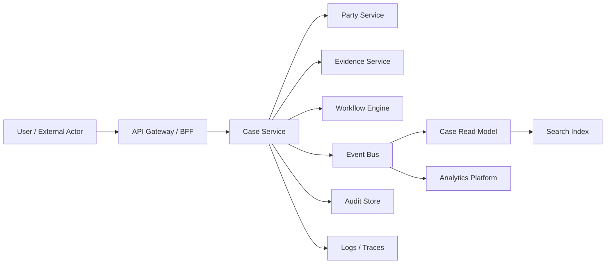
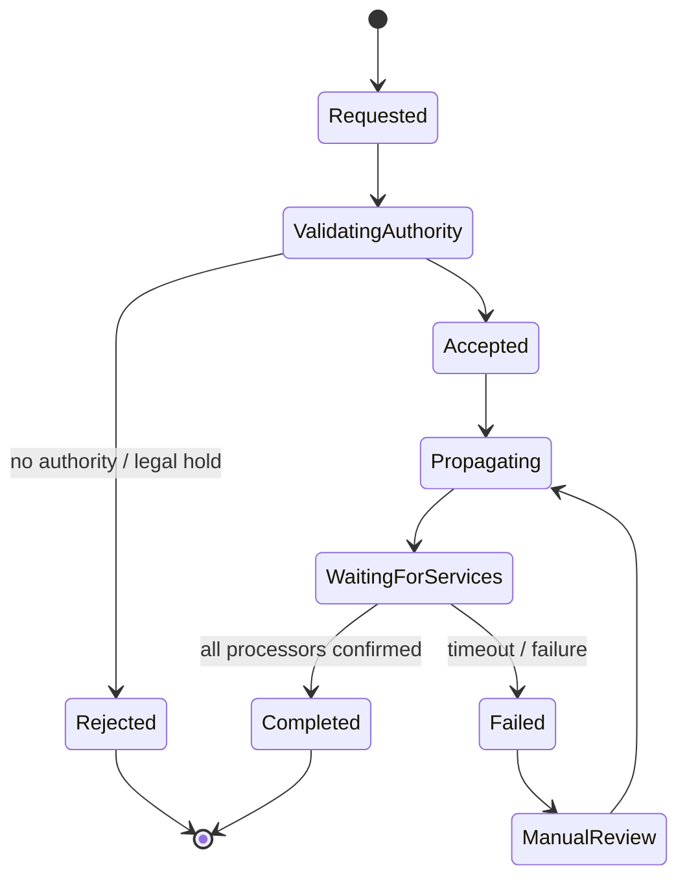

# Part 060 — Data Privacy and Sensitive Data Flow

## 1. Core idea

In a microservices system, sensitive data does not stay in one place.

It moves through:

- APIs
- events
- queues
- logs
- traces
- metrics
- caches
- read models
- search indexes
- object storage
- workflow variables
- dead-letter queues
- batch exports
- admin tools
- backups
- analytics pipelines

A service may “own” data, but once it emits the wrong field into an event or log, many other systems become accidental processors of that data.

Privacy architecture is therefore not only about encryption or access control.

It is about **controlling data flow**.

The core rule:

> Sensitive data should move only when there is a clear purpose, explicit authority, minimal payload, bounded retention, observable access, and a defined deletion/redaction strategy.

---

## 2. Privacy is an architecture constraint, not a legal afterthought

Engineers often treat privacy as a checklist handled by legal/compliance.

That fails in microservices because privacy is implemented through technical choices:

- Which service owns personal data?
- Which event payload includes personal data?
- Which read model duplicates personal data?
- Which log field exposes a name, email, phone number, token, or case detail?
- Which team can query which data?
- Which cache retains sensitive payloads?
- Which backup contains deleted user data?
- Which workflow variable stores evidence content?
- Which service exports CSV files?

Legal may define obligations. Architecture determines whether the system can actually satisfy them.

GDPR Article 5 describes principles such as lawfulness/fairness/transparency, purpose limitation, data minimisation, accuracy, storage limitation, and integrity/confidentiality. NIST Privacy Framework is designed to help organizations identify and manage privacy risk. OWASP logging guidance also warns not to log sensitive data unnecessarily.

The engineering translation is simple:

> Every data field needs an owner, purpose, classification, propagation rule, retention rule, and protection rule.

---

## 3. Sensitive data is broader than PII

PII is important, but privacy-sensitive data includes more than name/email/address.

| Category | Examples | Risk |
|---|---|---|
| Direct identifiers | Name, email, phone, national ID, passport | Re-identification |
| Indirect identifiers | Date of birth, location, employer, device ID | Linkability |
| Sensitive attributes | Health, finance, biometrics, religion, political affiliation | Harm/discrimination |
| Case/regulatory data | Allegation, evidence, enforcement status | Legal/reputational harm |
| Security data | Session token, API key, password reset token | Account compromise |
| Operational secrets | DB password, signing key, webhook secret | System compromise |
| Behavioral data | Access history, risk score, model signal | Surveillance/profiling |
| Tenant data | Tenant ID, contract tier, internal segmentation | Commercial exposure |

Do not build privacy rules around a narrow definition of PII only.

---

## 4. Data classification model

A practical classification model for microservices:

```text
PUBLIC
  Safe to disclose publicly.

INTERNAL
  Internal business data. Not public, but not highly sensitive.

CONFIDENTIAL
  Business-sensitive or customer-sensitive data. Access controlled.

RESTRICTED
  High-impact personal, regulatory, financial, security, legal, or secret data.

SECRET
  Credentials, tokens, private keys, signing keys, passwords.
```

Classification should attach to fields, not just databases.

Example:

```yaml
resource: EnforcementCase
fields:
  caseId:
    classification: INTERNAL
    owner: case-service
    retention: case_retention
  partyName:
    classification: RESTRICTED
    owner: party-service
    retention: party_retention
    propagation: reference_only
  allegationSummary:
    classification: RESTRICTED
    owner: allegation-service
    retention: enforcement_retention
    propagation: restricted_event_only
  riskScore:
    classification: CONFIDENTIAL
    owner: risk-service
    propagation: reason_code_only
  accessToken:
    classification: SECRET
    propagation: never
```

The classification must drive API design, event design, logging, tracing, caching, analytics, and retention.

---

## 5. Data-flow map

You cannot protect what you cannot see.

Create a data-flow map for every sensitive field class.



For each edge, ask:

- What fields move?
- Why do they move?
- Who approved this purpose?
- Is the receiver allowed to store them?
- How long are they retained?
- Are they encrypted?
- Are they logged?
- Are they indexed?
- Can they be deleted or redacted?
- Is the transfer observable?

A data-flow diagram without field classification is just a network diagram.

---

## 6. Data minimization

Data minimization means a service should receive and retain only the data it needs for a defined purpose.

It is one of the most important privacy principles because it reduces breach impact, compliance scope, cognitive load, and accidental coupling.

### 6.1 Bad command design

```json
{
  "caseId": "case-123",
  "party": {
    "partyId": "party-456",
    "name": "Jane Doe",
    "email": "jane@example.com",
    "phone": "+62...",
    "dateOfBirth": "1990-01-01",
    "nationalId": "...",
    "address": "..."
  },
  "reason": "ESCALATE"
}
```

If the escalation service only needs `partyId` and risk category, this payload is over-collected.

### 6.2 Better command design

```json
{
  "caseId": "case-123",
  "partyRef": "party-456",
  "riskCategory": "HIGH",
  "reason": "ESCALATE"
}
```

Even better, if the service can fetch authorized data from the owning service when required, pass references and reason codes rather than copying sensitive fields.

### 6.3 Java DTO discipline

Avoid reusing rich internal DTOs at API boundaries.

```java
public record EscalateCaseRequest(
    String caseId,
    String partyId,
    String escalationReason,
    String expectedCaseVersion,
    String idempotencyKey
) {}
```

Do not accept `PartyDto` “just in case”.

A DTO should express the minimum command payload needed for the use case.

---

## 7. Purpose limitation as a service contract

A service should not process data merely because it can access it.

Every sensitive-data flow should have a purpose label:

```yaml
flow: case-service -> notification-service
fields:
  - partyId
  - notificationTemplateId
  - communicationChannel
purpose: notify_party_about_case_deadline
legal_basis_or_authority: internal_policy:data-processing-notification-v3
retention: 30_days
receiver_storage: transient_only
```

Purpose labels help answer:

- Why does this service receive this data?
- Can the data be reused for analytics?
- Can the data be stored permanently?
- Can the data be joined with another dataset?
- Can the data be exported?

In regulated systems, “we already had the data” is not a sufficient purpose.

---

## 8. Privacy-aware event design

Events are one of the easiest ways to accidentally spread sensitive data.

### 8.1 Bad event

```json
{
  "eventType": "case.created",
  "caseId": "case-123",
  "partyName": "Jane Doe",
  "email": "jane@example.com",
  "phone": "+62...",
  "allegationText": "...",
  "evidenceSummary": "..."
}
```

This event makes every consumer a processor of sensitive party and allegation data.

### 8.2 Better event

```json
{
  "eventType": "case.created",
  "eventVersion": "2.0",
  "caseId": "case-123",
  "partyRef": "party-456",
  "classification": "RESTRICTED",
  "jurisdiction": "ID",
  "occurredAt": "2026-07-05T10:15:30Z"
}
```

Consumers that truly need party details can request them from the owning service under explicit authorization and purpose.

### 8.3 When event-carried state is justified

Event-carried state transfer is useful for decoupling, but dangerous for privacy.

Use it when:

- The data is not highly sensitive, or
- The receiver has a legitimate stable need, and
- Retention is defined, and
- Consumers are known/controlled, and
- Payload classification is explicit, and
- Deletion/redaction strategy exists.

Avoid it when:

- The field is a secret.
- The field is highly sensitive and rarely needed.
- The event is broadly subscribed.
- Consumer list is unknown.
- The field may need deletion/correction.
- The event bus retains payloads long-term.

---

## 9. Sensitive data in observability

Logs, traces, and metrics are frequent privacy leaks.

### 9.1 Logs

Never log:

- Passwords
- Access tokens
- Refresh tokens
- Session IDs
- API keys
- Private keys
- Full national IDs
- Payment card data
- Full evidence content
- Large personal payloads

Be careful with:

- Email addresses
- Phone numbers
- Names
- Addresses
- Dates of birth
- IP addresses
- User agents
- Case descriptions
- Error messages containing payload snippets

### 9.2 Traces

Trace attributes are often indexed and searchable.

Bad:

```java
span.setAttribute("party.email", request.email());
span.setAttribute("evidence.text", evidence.text());
```

Better:

```java
span.setAttribute("case.id", caseId.value());
span.setAttribute("party.ref", partyId.value());
span.setAttribute("evidence.count", evidenceCount);
span.setAttribute("data.classification", "RESTRICTED");
```

### 9.3 Metrics

Metrics labels must have low cardinality and must not expose personal data.

Bad:

```text
case_submitted_total{email="jane@example.com"}
```

Better:

```text
case_submitted_total{tenant="public-sector", jurisdiction="ID", channel="portal"}
```

Even labels like `caseId` or `userId` are usually dangerous because they explode cardinality and expose identifiers in monitoring systems.

---

## 10. Redaction as code

Do not rely on every developer remembering what to redact.

Build redaction into shared infrastructure.

### 10.1 Sensitive annotation

```java
@Retention(RetentionPolicy.RUNTIME)
@Target({ElementType.FIELD, ElementType.RECORD_COMPONENT})
public @interface Sensitive {
    Sensitivity value();
}

public enum Sensitivity {
    PII,
    RESTRICTED,
    SECRET
}
```

Example DTO:

```java
public record PartyProfile(
    String partyId,
    @Sensitive(Sensitivity.PII) String fullName,
    @Sensitive(Sensitivity.PII) String email,
    @Sensitive(Sensitivity.RESTRICTED) String nationalId,
    @Sensitive(Sensitivity.SECRET) String resetToken
) {}
```

### 10.2 Safe logging wrapper

```java
public final class SafeLog {
    private final Redactor redactor;

    public SafeLog(Redactor redactor) {
        this.redactor = redactor;
    }

    public Object field(String name, Object value) {
        return redactor.redact(name, value);
    }
}
```

Usage:

```java
log.info("party lookup failed partyId={} reason={}",
    safeLog.field("partyId", partyId),
    reasonCode
);
```

Do not serialize full request bodies into logs unless a strict allowlist controls fields.

---

## 11. Allowlist beats denylist

A denylist says:

> “Log everything except fields named password, token, secret.”

This fails when new sensitive fields appear:

- `credential`
- `apiKey`
- `authorizationCode`
- `nationalId`
- `documentText`
- `evidenceContent`

An allowlist says:

> “Only these approved fields may enter logs/traces/events.”

For sensitive systems, prefer allowlists at boundaries:

```yaml
loggable_fields:
  EscalateCaseRequest:
    - caseId
    - escalationReason
    - expectedCaseVersion
```

---

## 12. Tokenization, pseudonymization, and encryption

These mechanisms solve different problems.

| Mechanism | What it does | Main use |
|---|---|---|
| Encryption | Makes data unreadable without key | Protect storage/transport |
| Hashing | One-way digest | Integrity, matching when salt/strategy is safe |
| Tokenization | Replaces sensitive value with token | Reduce exposure in downstream systems |
| Pseudonymization | Replaces direct identity with pseudonym | Reduce linkability, still reversible/relatable under controls |
| Anonymization | Removes ability to identify individual | Analytics/public sharing, hard to guarantee |
| Redaction | Removes/masks data from output | Logs, UI, exports, support tooling |

Encryption is not minimization.

Encrypted personal data is still personal/sensitive data if the organization can decrypt or link it.

---

## 13. Field-level access control

A user may be allowed to view a case but not every field in the case.

Example:

```json
{
  "caseId": "case-123",
  "status": "UNDER_REVIEW",
  "party": {
    "partyId": "party-456",
    "displayName": "Jane D.",
    "nationalId": "REDACTED"
  }
}
```

Field-level access should be based on:

- Role/permission
- Purpose
- Case assignment
- Tenant
- Jurisdiction
- Sensitivity level
- Break-glass status
- Data subject relationship
- Time-bound authorization

### 13.1 Java field projection model

```java
public record CaseViewPolicy(
    boolean canSeePartyName,
    boolean canSeeNationalId,
    boolean canSeeEvidenceSummary,
    boolean canSeeInternalNotes
) {}

public CaseResponse toResponse(CaseAggregate aggregate, CaseViewPolicy policy) {
    return new CaseResponse(
        aggregate.id().value(),
        aggregate.status().name(),
        policy.canSeePartyName() ? aggregate.partyName() : "REDACTED",
        policy.canSeeNationalId() ? aggregate.nationalId() : "REDACTED",
        policy.canSeeEvidenceSummary() ? aggregate.evidenceSummary() : null,
        policy.canSeeInternalNotes() ? aggregate.internalNotes() : null
    );
}
```

Do not rely on frontend hiding alone. Redaction must happen server-side.

---

## 14. Sensitive data in workflow engines

Workflow variables are often overlooked.

A workflow engine may persist variables for a long time. If you store full personal/evidence data as workflow variables, the workflow database becomes another sensitive data store.

Prefer:

```json
{
  "caseId": "case-123",
  "partyRef": "party-456",
  "evidenceBundleRef": "evidence-bundle-789",
  "riskCategory": "HIGH"
}
```

Avoid:

```json
{
  "partyName": "Jane Doe",
  "nationalId": "...",
  "evidenceText": "full evidence content..."
}
```

Workflow should hold references and state, not unnecessary sensitive payloads.

---

## 15. Sensitive data in DLQ and retry systems

Dead-letter queues are production graveyards for bad payloads.

They often retain:

- Raw command payloads
- Raw event payloads
- Error stack traces
- Failed export data
- Third-party responses
- Authentication headers

A DLQ must have:

- Retention limit
- Access control
- Redaction/field minimization
- Replay authorization
- Replay audit trail
- Poison payload quarantine
- Deletion policy

Do not let DLQ become an ungoverned long-term data lake.

---

## 16. Caches, search indexes, and read models

Duplication is normal in microservices, but every duplicate copy increases privacy scope.

For every cache/read model/search index, define:

- Source owner
- Fields copied
- Purpose
- Refresh mechanism
- Staleness tolerance
- Retention/TTL
- Deletion/redaction propagation
- Encryption
- Access control
- Rebuild process
- Breach impact

### 16.1 Search index danger

Search indexes often tokenize and replicate sensitive text.

If evidence content, notes, allegations, or names are indexed, deletion/redaction must handle:

- Primary database
- Search index
- Cache
- Snapshots
- Backups
- Analytics copy
- Export history

Search is not a harmless performance optimization. It is a data-processing system.

---

## 17. Deletion, correction, and retention in distributed systems

Microservices make deletion hard because copies exist everywhere.

A privacy-aware deletion flow should be modeled as a workflow:



Deletion is not always physical deletion. Depending on legal/business context, the operation may be:

- Delete
- Redact
- Anonymize
- Pseudonymize
- Suppress from view
- Mark as legally retained
- Stop processing
- Remove from search/export

The service must know which one applies.

---

## 18. Privacy event pattern

Privacy operations should themselves produce events.

Examples:

```text
personal-data.redaction-requested.v1
personal-data.redacted.v1
personal-data.deletion-requested.v1
personal-data.deletion-confirmed.v1
personal-data.legal-hold-applied.v1
personal-data.processing-restricted.v1
```

Payload should avoid including the sensitive data itself:

```json
{
  "eventType": "personal-data.redaction-requested.v1",
  "requestId": "privacy-request-123",
  "subjectRef": "party-456",
  "scope": "CASE_READ_MODELS",
  "reason": "RETENTION_EXPIRED",
  "requestedAt": "2026-07-05T10:15:30Z"
}
```

Each service receiving the event should reply or publish confirmation:

```json
{
  "eventType": "personal-data.redaction-confirmed.v1",
  "requestId": "privacy-request-123",
  "service": "case-read-model-service",
  "resourceType": "CASE_SEARCH_INDEX",
  "status": "COMPLETED",
  "completedAt": "2026-07-05T10:16:11Z"
}
```

---

## 19. Data owner vs data processor service

In microservices, distinguish:

| Role | Meaning |
|---|---|
| Data owner service | Authoritative owner of field/entity |
| Processor service | Receives/uses data for a purpose |
| Projector service | Maintains read model from owner events |
| Exporter service | Produces external data extracts |
| Audit service | Records material actions/evidence |
| Analytics service | Processes data for aggregate insights |

A processor does not automatically become owner.

Example:

- Party Service owns `partyName`, `nationalId`, `dateOfBirth`.
- Case Service references `partyId` and may keep a display snapshot if approved.
- Notification Service temporarily processes email/phone for delivery.
- Search Service indexes allowed display fields only.
- Audit Store stores reason codes and references, not full party profile unless required.

---

## 20. Privacy-aware service catalog extension

Add data-flow metadata to service catalog:

```yaml
service: case-service
ownerTeam: enforcement-platform
sensitivity: restricted
personalData:
  owns:
    - caseId
    - caseStatus
    - assignedOfficerId
  references:
    - partyId
    - evidenceBundleId
  storesSnapshots:
    - field: partyDisplayName
      source: party-service
      purpose: case_listing_display
      retention: until_case_closure_plus_policy
      redaction: supported
  emits:
    - event: case.created.v2
      classification: restricted
      piiFields: []
      references:
        - partyId
  logs:
    strategy: allowlist
    piiAllowed: false
  retention:
    policy: enforcement_case_retention_v4
  deletion:
    mode: legal_hold_aware_redaction
```

This makes privacy visible during architecture review.

---

## 21. Java pattern: typed sensitive value

A useful technique is to avoid plain `String` for sensitive values.

```java
public record EmailAddress(String value) implements SensitiveValue {
    @Override
    public String redacted() {
        int at = value.indexOf('@');
        if (at <= 1) return "REDACTED";
        return value.charAt(0) + "***" + value.substring(at);
    }
}

public interface SensitiveValue {
    String redacted();
}
```

Then logging code can recognize sensitive types:

```java
public String safe(Object value) {
    if (value instanceof SensitiveValue sensitive) {
        return sensitive.redacted();
    }
    return String.valueOf(value);
}
```

This does not solve every privacy problem, but it makes unsafe handling more visible.

---

## 22. Java pattern: outbound data policy

Before sending data to another service, apply a policy:

```java
public interface DataDisclosurePolicy {
    DisclosureDecision decide(DisclosureRequest request);
}

public record DisclosureRequest(
    String sourceService,
    String targetService,
    String purpose,
    String tenantId,
    String jurisdiction,
    Set<String> requestedFields,
    String actorId
) {}

public record DisclosureDecision(
    boolean allowed,
    Set<String> allowedFields,
    String policyVersion,
    String reasonCode
) {}
```

Usage:

```java
DisclosureDecision decision = disclosurePolicy.decide(new DisclosureRequest(
    "case-service",
    "notification-service",
    "notify_party_about_deadline",
    tenantId,
    jurisdiction,
    Set.of("partyId", "email", "deadlineDate"),
    actorId
));

if (!decision.allowed()) {
    throw new DataDisclosureDenied(decision.reasonCode());
}

NotificationPayload payload = payloadFactory.create(caseData, decision.allowedFields());
```

This pattern makes data disclosure reviewable and auditable.

---

## 23. Data privacy testing

Privacy controls should be tested like business rules.

### 23.1 Unit tests

- Redaction function masks expected fields.
- Sensitive value `toString()` does not leak raw value.
- DTO mapper excludes restricted fields.
- Event factory excludes PII.
- Field-level policy hides unauthorized fields.

### 23.2 Contract tests

- API response schema does not expose forbidden fields.
- Event payload schema contains classification metadata.
- Consumer contract does not depend on restricted fields.

### 23.3 Integration tests

- Logs do not contain known secret/test PII markers.
- Trace attributes do not contain raw payload.
- DLQ payload is redacted/minimized.
- Delete/redact workflow reaches all processors.

### 23.4 Production guardrails

- Secret scanning on logs/events.
- DLP scanning on object storage/export.
- Canary markers for synthetic sensitive values.
- Audit alert for unexpected field disclosure.

---

## 24. Privacy failure modes

### 24.1 Event payload leaks personal data

Root cause:

- Event designed as convenience DTO.
- Unknown future consumers.
- No classification review.

Defense:

- Reference-first event design.
- Event schema review.
- Sensitive-field scanner.
- Consumer allowlist.

### 24.2 Logs leak request body

Root cause:

- Generic request logging filter.
- Exception handler includes payload.
- Debug logs left enabled.

Defense:

- Allowlist logging.
- Redaction middleware.
- Log review tests.
- Runtime log sampling without payload.

### 24.3 Read model retains deleted data

Root cause:

- Projection only handles create/update.
- Delete/redact event missing.
- Rebuild uses old snapshots.

Defense:

- Redaction event type.
- Projection deletion handler.
- Rebuild from privacy-filtered source.
- Reconciliation job.

### 24.4 Analytics copy becomes uncontrolled processor

Root cause:

- CDC sends all tables.
- No field minimization.
- Analysts get raw personal data.

Defense:

- Data product contract.
- Field-level masking.
- Purpose-limited analytics view.
- Access review.
- Aggregation/anonymization where appropriate.

### 24.5 Support tool exposes too much

Root cause:

- Admin UI bypasses product authorization.
- Support role has broad DB access.
- Break-glass not audited.

Defense:

- Purpose-based support access.
- Time-limited elevation.
- Field-level redaction.
- Access audit.
- Approval/ticket linkage.

---

## 25. Privacy architecture review checklist

For every service, ask:

1. What personal/sensitive fields does it own?
2. What personal/sensitive fields does it reference?
3. What personal/sensitive fields does it duplicate?
4. Why does it need each field?
5. What purpose label applies to each data flow?
6. Which APIs expose sensitive fields?
7. Which events carry sensitive fields?
8. Which logs/traces/metrics may contain sensitive fields?
9. Which caches/read models/search indexes duplicate sensitive fields?
10. What is the retention policy?
11. How is deletion/redaction propagated?
12. How are backups handled?
13. How are DLQs handled?
14. How is tenant/jurisdiction isolation enforced?
15. How are exports controlled?
16. How is support/admin access constrained?
17. How are data disclosures audited?
18. How is schema evolution reviewed for new sensitive fields?
19. What automated tests prevent leaks?
20. What incident response exists for privacy leakage?

---

## 26. Privacy ADR template

```mdx
# ADR: Sensitive Data Flow for <Feature>

## Context

Describe the feature, data subjects, data classes, tenant/jurisdiction constraints, and processing purpose.

## Sensitive fields

| Field | Owner service | Classification | Purpose | Retention |
|---|---|---|---|---|

## Decision

Describe which fields move, to which services, through which APIs/events, and why.

## Data minimization

Describe fields intentionally excluded.

## Protection

Describe encryption, tokenization, redaction, field-level access, and logging controls.

## Retention and deletion

Describe TTL, redaction, legal hold, deletion propagation, and backup implications.

## Auditability

Describe disclosure audit event, access logging, and reconstruction path.

## Alternatives rejected

Describe why broader payloads, raw event-carried state, or shared database access were rejected.

## Consequences

Describe operational cost, coupling, query limitations, and review obligations.
```

---

## 27. Minimal production checklist

A privacy-aware Java microservice should have:

- Field-level data classification
- Data owner/processor map
- Purpose labels for sensitive flows
- API response minimization
- Event payload minimization
- Log/trace/metric redaction
- Sensitive value handling in Java code
- Field-level authorization where needed
- Retention policy
- Deletion/redaction workflow
- DLQ retention/access control
- Search/read-model privacy controls
- Export controls
- Support/admin access audit
- Automated privacy leak tests
- Privacy ADR for material flows

---

## 28. Practical exercise

Pick one sensitive field, for example:

```text
party.nationalId
```

Trace it through the system:

1. Which service owns it?
2. Which APIs accept it?
3. Which APIs return it?
4. Which events include it?
5. Which logs could contain it?
6. Which traces could contain it?
7. Which read models duplicate it?
8. Which search indexes include it?
9. Which exports include it?
10. Which backups retain it?
11. Which teams can access it?
12. What is the retention period?
13. How is it deleted/redacted?
14. What audit event records its disclosure?

If you cannot answer these questions, the data is not under architectural control.

---

## 29. References

- GDPR Article 5 — https://gdpr-info.eu/art-5-gdpr/
- NIST Privacy Framework — https://www.nist.gov/privacy-framework
- OWASP Logging Cheat Sheet — https://cheatsheetseries.owasp.org/cheatsheets/Logging_Cheat_Sheet.html
- OWASP Secrets Management Cheat Sheet — https://cheatsheetseries.owasp.org/cheatsheets/Secrets_Management_Cheat_Sheet.html
- Microsoft Privacy by Design principles — https://www.microsoft.com/en-us/trust-center/privacy/privacy-by-design
- Kubernetes Secrets — https://kubernetes.io/docs/concepts/configuration/secret/

---

## 30. Key takeaways

- Privacy in microservices is a data-flow problem.
- Sensitive data includes more than obvious PII.
- Classification must attach to fields and payloads, not just databases.
- Reference-first event design reduces uncontrolled data propagation.
- Logs, traces, metrics, DLQs, caches, search indexes, and workflow variables are common leakage points.
- Encryption is not a substitute for minimization.
- Deletion/redaction must be modeled as a distributed workflow.
- A top-tier engineer designs privacy as an architectural invariant, not as a late-stage compliance patch.

