# Part 061 — Runtime Topology of Java Microservices

## 1. Core idea

A microservice architecture is not only a set of logical services.

In production, every service becomes a runtime topology:

- container images
- JVM processes
- pods
- replicas
- nodes
- namespaces
- clusters
- zones
- regions
- gateways
- sidecars
- service mesh proxies
- queues
- databases
- caches
- DNS names
- load balancers
- autoscalers
- probes
- identity documents
- telemetry streams

The diagram in an architecture document may show:

```txt
Case Service -> Decision Service -> Notification Service
```

Runtime reality looks more like this:

```txt
client
  -> CDN / WAF / LB
  -> ingress / gateway
  -> auth / policy layer
  -> service mesh proxy
  -> pod replica A/B/C
  -> JVM thread pool
  -> connection pool
  -> dependency proxy
  -> dependency pod replica
  -> broker partition / database primary / cache shard
```

The core rule:

> A service boundary is logical. A runtime topology is physical, operational, and failure-prone.

A top engineer does not stop at “we have a Case Service.”

They ask:

- How many instances exist?
- Where are they placed?
- How are they discovered?
- How is traffic routed?
- What happens when one instance dies?
- What happens when one node dies?
- What happens when one zone degrades?
- What happens when a dependency is slow?
- What happens during deployment?
- What happens during shutdown?
- Where does the JVM spend memory?
- Where does backpressure appear?
- Which topology element owns retry, timeout, auth, telemetry, and policy?

Microservices design is incomplete until the runtime topology is explicit.

---

## 2. Logical architecture vs runtime topology

Logical architecture answers:

> What are the responsibilities and relationships between services?

Runtime topology answers:

> How does the system actually execute, route traffic, fail, scale, restart, and recover?

They are related, but not identical.

A logical service can have many runtime forms.

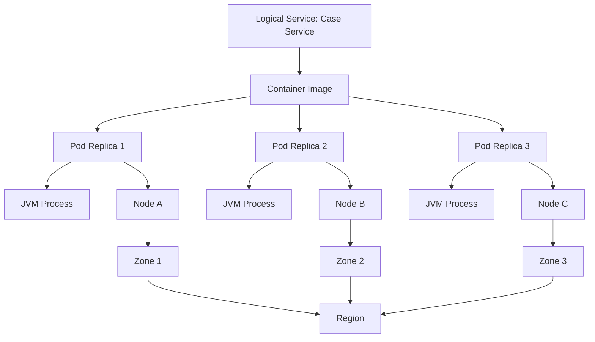

This mapping matters.

If all replicas of a “high availability” service run on one node, the logical architecture is misleading.

If all pods depend on one database connection pool with insufficient max connections, horizontal scaling may increase failure.

If a service has five replicas but each replica opens 100 database connections, scaling to 50 replicas creates 5,000 possible connections.

If a service is deployed across zones but its database, cache, or queue is single-zone, zone-level availability is weaker than the service diagram suggests.

Runtime topology is where architecture meets physics.

---

## 3. The runtime stack

A production Java microservice usually sits inside a layered runtime stack.

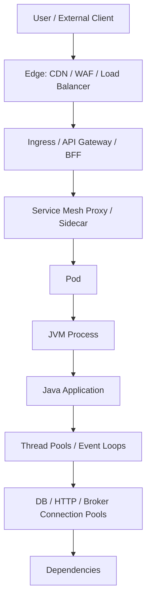

Each layer can:

- accept traffic
- reject traffic
- queue traffic
- retry traffic
- timeout traffic
- mutate headers
- terminate TLS
- enforce policy
- emit telemetry
- hide failure
- amplify failure

A good topology design avoids duplicated, conflicting behavior.

Bad topology:

- gateway retries 3 times
- mesh retries 2 times
- Java client retries 3 times
- database driver retries internally
- consumer retries forever

One failed user request may become dozens of backend attempts.

Good topology:

- one owner for each retry policy
- explicit timeout budget
- consistent correlation propagation
- clear auth boundary
- clear rate limit boundary
- clear fallback boundary

Runtime topology is a contract between application code and platform behavior.

---

## 4. Kubernetes mental model for Java service runtime

Kubernetes is often the default runtime for microservices.

Do not treat it as “just where containers run.”

The minimum mental model:

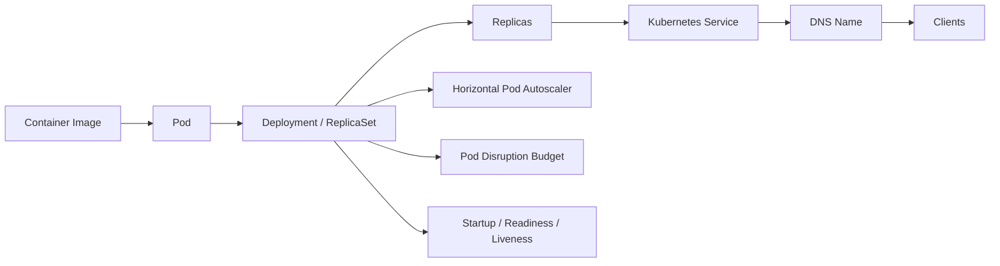

Important runtime units:

| Unit | What it means | Architecture implication |
|---|---|---|
| Container image | Immutable package of application + runtime | Build once, deploy many |
| Container | Running instance of image | Process-level isolation |
| Pod | Smallest deployable Kubernetes workload unit | Scheduling, lifecycle, networking unit |
| Deployment | Desired replica management | Rollout and rollback boundary |
| ReplicaSet | Replica control behind Deployment | Usually not manually designed |
| Service | Stable virtual endpoint over pods | Client does not call pod IP directly |
| Namespace | Administrative and policy boundary | Ownership, RBAC, network policy |
| Node | Machine or VM running pods | Failure and resource contention domain |
| Zone | Datacenter-level failure domain | HA placement boundary |
| Region | Geographic/large-scale failure domain | DR and latency boundary |

The key rule:

> A Java service instance is disposable. The service identity is stable; the instance identity is temporary.

Therefore:

- do not store important state in local memory only
- do not assume a pod will receive the next request from the same user
- do not assume a pod name is stable
- do not assume local disk persists
- do not assume in-memory locks coordinate across replicas
- do not assume scheduler tasks are safe to run on every replica
- do not assume startup order across services

Kubernetes makes instances easy to replace. Architecture must make replacement safe.

---

## 5. Service instance topology

A logical microservice is deployed as multiple instances.

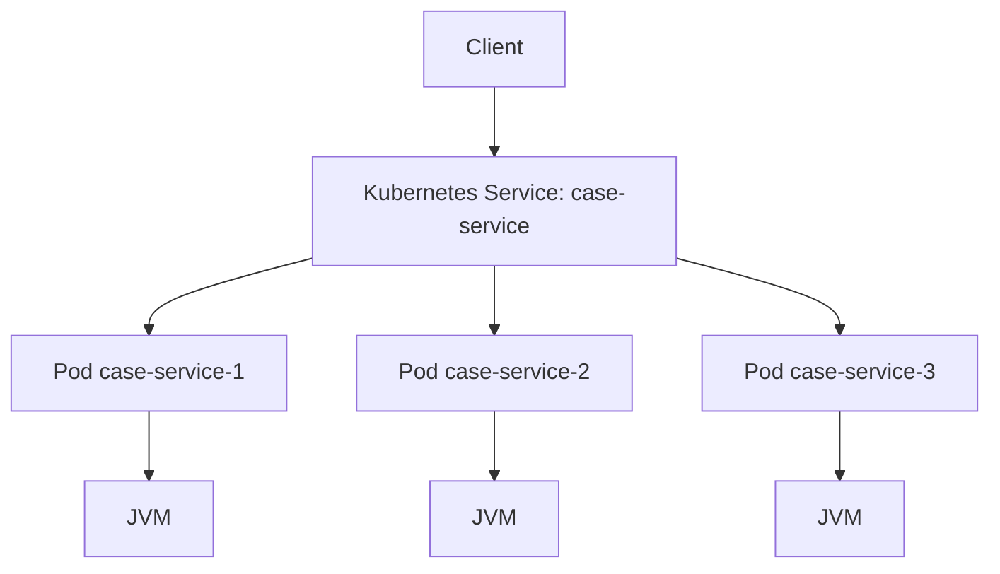

This introduces important design constraints.

### 5.1 Local memory is per instance

An in-memory cache in one pod is not visible to another pod.

Use local cache only for:

- short-lived optimization
- read-through data
- safely stale data
- data that can be rebuilt
- data that does not define correctness

Do not use local memory for:

- distributed locks
- global counters
- idempotency records
- long-lived workflow state
- payment decision state
- authorization truth
- audit truth

### 5.2 Connection pools multiply by replica count

If one pod has:

```yaml
maxPoolSize: 50
```

and you run 20 replicas, the database may see up to 1,000 connections.

The real capacity equation is:

```txt
total_possible_connections = replica_count * max_connections_per_replica
```

This is not theoretical. It is a common production failure mode.

Scaling the application tier can overload the database tier.

Therefore, connection pools are topology settings, not only application settings.

### 5.3 Scheduled jobs multiply by replica count

If every replica runs the same scheduled job, the system may execute it N times.

Bad:

```java
@Scheduled(fixedDelay = 60_000)
void expireCases() {
    expirationService.expireOverdueCases();
}
```

If there are 10 replicas, this runs 10 times unless guarded.

Better options:

- use a separate worker deployment with controlled replica count
- use Kubernetes CronJob
- use database/advisory lock carefully
- use queue-based work leasing
- use workflow engine timers
- make operation idempotent and partitioned

Scheduled work is runtime topology, not just code annotation.

---

## 6. Traffic path topology

A simple request path may cross many components.

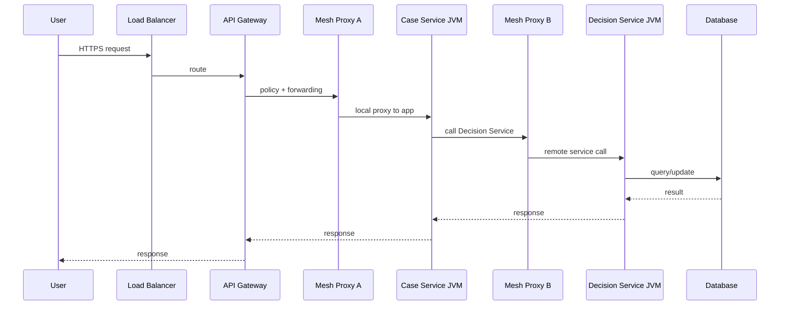

At every hop, latency and failure behavior accumulate.

A topologist asks:

- Where is TLS terminated?
- Where is client identity converted to service identity?
- Where is rate limiting applied?
- Where is request size limited?
- Where is timeout enforced?
- Where is retry performed?
- Where is tracing context propagated?
- Where are headers sanitized?
- Where are errors normalized?
- Where is partial failure handled?
- Where is response caching allowed?

If those answers are scattered or duplicated, runtime behavior becomes unpredictable.

---

## 7. Gateway, BFF, edge, and service mesh: different jobs

Teams often blur these components.

They are not the same.

| Component | Primary job | Should avoid |
|---|---|---|
| Edge load balancer | External entry, TLS, routing, network-level balancing | Business workflow |
| API gateway | API policy, auth integration, routing, quotas, coarse aggregation | Owning domain logic |
| BFF | Client-specific experience composition | Becoming system-of-record |
| Service mesh | Service-to-service transport policy | Owning business fallback semantics |
| Sidecar proxy | Local traffic mediation | Hiding all app failures |
| Application service | Business behavior and semantic error handling | Re-implementing platform routing |

A service mesh can enforce mTLS, retries, timeouts, and telemetry.

But the application still owns:

- domain validation
- idempotency
- compensation
- semantic fallback
- business event emission
- audit event emission
- data privacy decisions
- API contract meaning

The platform can route packets. It cannot understand business meaning unless you encode that meaning explicitly.

---

## 8. Sidecar topology

A sidecar pattern places an auxiliary container next to the application container in the same pod.

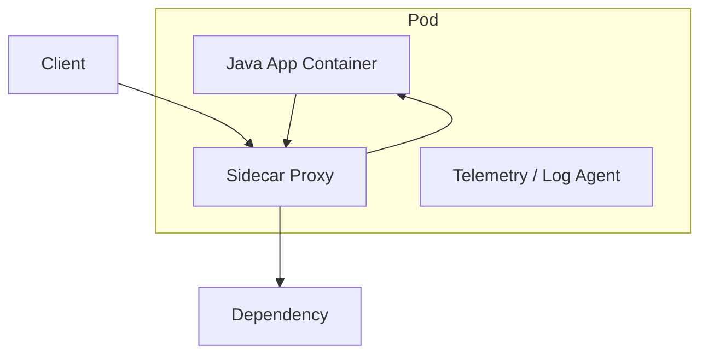

Common sidecars:

- service mesh proxy
- log collector
- telemetry collector
- secrets agent
- config reloader
- local cache/proxy

Benefits:

- common platform concern without embedding in app
- consistent mTLS and routing
- uniform telemetry
- less duplicated application code

Costs:

- more CPU/memory per pod
- more moving parts
- harder local debugging
- failure coupling between app and sidecar
- startup/shutdown sequencing complexity
- hidden latency

Design rule:

> A sidecar should remove infrastructure duplication, not hide business semantics from the application.

Examples:

Good sidecar responsibility:

- mTLS certificate rotation
- service discovery integration
- request telemetry
- transport-level retry under strict budget

Bad sidecar responsibility:

- deciding whether a regulatory decision can be accepted
- silently retrying non-idempotent business commands
- swallowing downstream failure and returning fake success
- logging sensitive payload without application classification

---

## 9. Namespace and ownership topology

A namespace is not just a folder.

It can be used as:

- ownership boundary
- RBAC boundary
- network policy boundary
- quota boundary
- deployment boundary
- naming boundary
- observability boundary

Example namespace model:

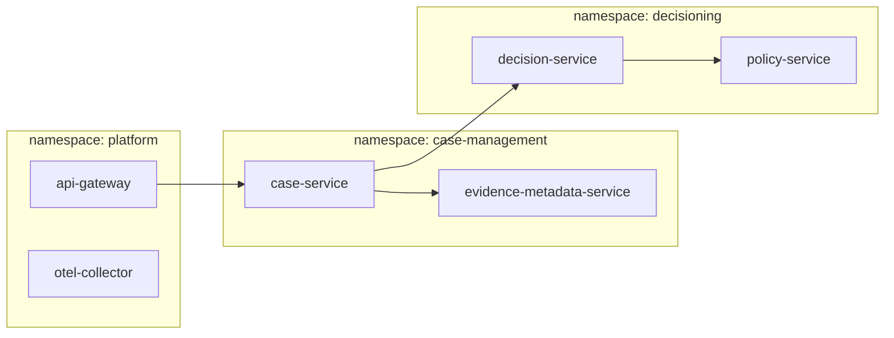

A useful namespace topology answers:

- Which team owns the namespace?
- Which services may call into it?
- Which secrets exist there?
- Which network policies apply?
- Which service accounts exist?
- Which resource quotas apply?
- Which alerts route to which team?
- Which deployment permissions are granted?

Bad namespace topology:

```txt
default
  case-service
  decision-service
  notification-service
  payment-service
  worker-service
  gateway
  postgres
  kafka
  redis
```

This hides ownership and policy boundaries.

A good namespace layout mirrors operational responsibility without creating unnecessary administrative friction.

---

## 10. Node, zone, and failure-domain topology

A service with three replicas is not automatically resilient.

Bad placement:

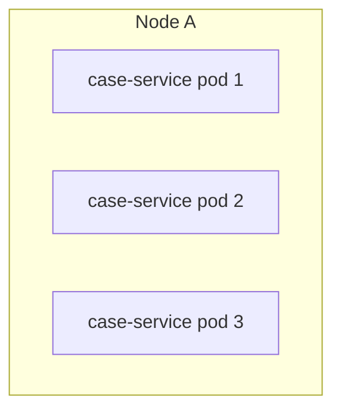

If Node A fails, all replicas disappear.

Better placement:

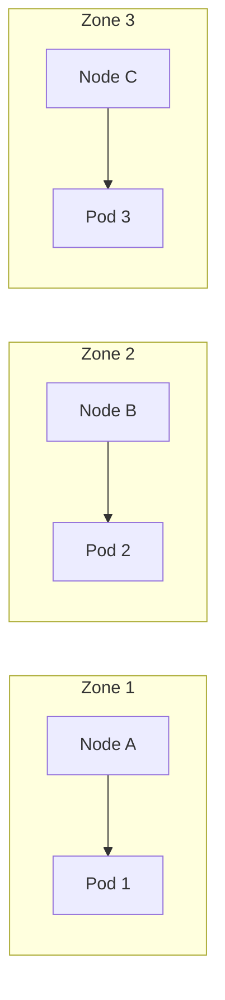

Topology concerns:

- pod anti-affinity
- topology spread constraints
- node taints/tolerations
- resource requests
- disruption budgets
- zone-aware dependencies
- storage locality
- cache locality
- network latency

If a service is critical, ask:

> Can one node fail without service outage?

Then ask:

> Can one zone degrade without full business outage?

Then ask:

> Can one region fail within the required RTO/RPO?

Each question changes the runtime topology.

---

## 11. Region topology

Single-region architecture is simpler.

Multi-region architecture is harder than most diagrams admit.

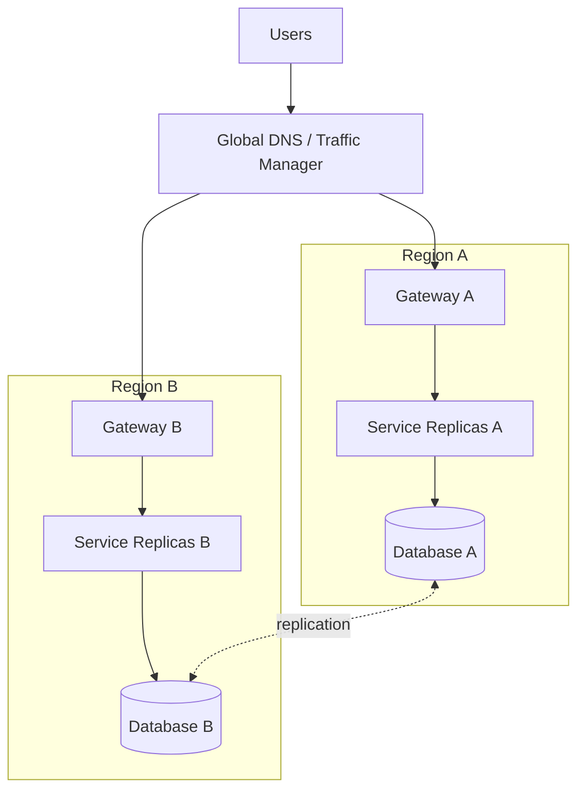

Runtime choices:

| Model | Meaning | Trade-off |
|---|---|---|
| Single region | All traffic in one region | Simpler, limited DR |
| Active-passive | Standby region exists | Easier consistency, failover complexity |
| Active-active | Multiple regions serve live traffic | Lower latency, much harder consistency |
| Cell-based | Isolated cells per tenant/user/domain | Smaller blast radius, more routing complexity |

Do not choose multi-region because it sounds mature.

Choose it because business requirements demand:

- lower latency
- disaster recovery
- data residency
- regulatory isolation
- regional blast-radius control
- continuity during infrastructure failure

Multi-region without data strategy is theater.

The hardest parts are:

- data replication
- conflict resolution
- idempotency across regions
- traffic failover
- cache invalidation
- event ordering
- audit continuity
- operational playbooks

---

## 12. Cell-based topology

Cell-based topology partitions users, tenants, accounts, or business domains into isolated runtime cells.

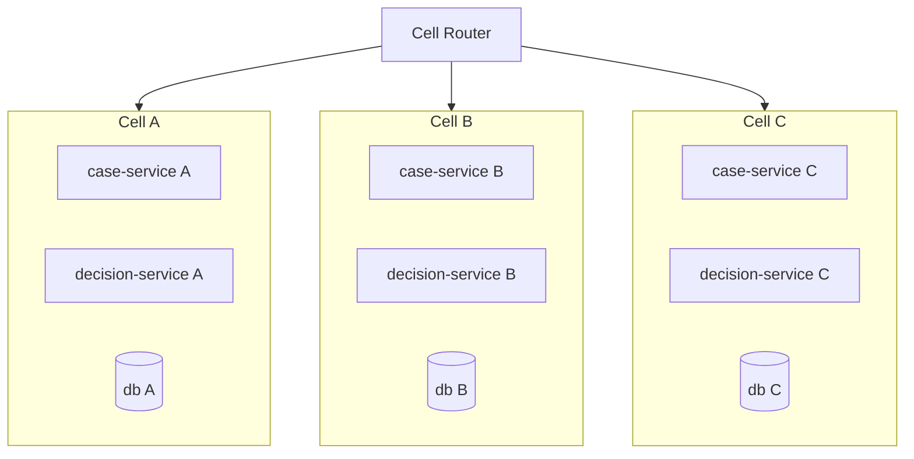

Benefits:

- smaller blast radius
- easier tenant isolation
- safer deployments by cell
- localized overload
- regional/data residency fit

Costs:

- routing complexity
- cross-cell reporting complexity
- capacity fragmentation
- operational duplication
- migration complexity
- harder global workflows

Cell-based topology is useful when:

- tenant isolation matters
- one tenant can overload shared services
- regulatory boundaries differ by tenant/jurisdiction
- blast radius must be explicitly bounded
- large scale makes one shared runtime risky

For regulatory systems, cell boundaries can align with:

- jurisdiction
- regulated entity type
- tenant
- agency
- region
- confidentiality level

The cell key becomes a runtime invariant.

---

## 13. Dependency topology

A service topology is also a dependency graph.

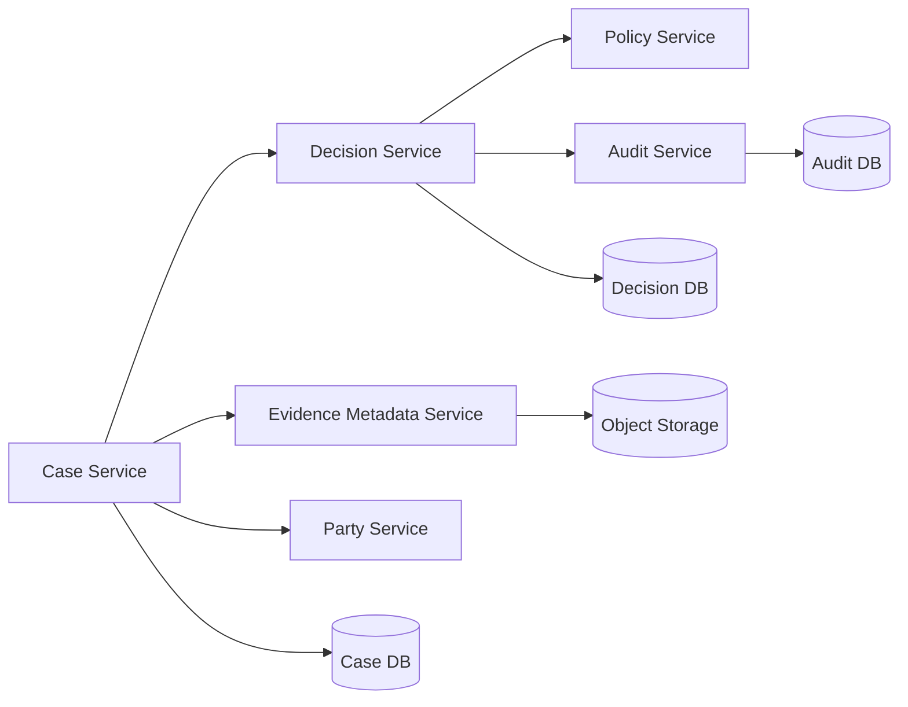

The graph tells you more than a service list.

Ask:

- Which dependencies are synchronous?
- Which dependencies are optional?
- Which dependencies are critical?
- Which edges have retries?
- Which edges have deadlines?
- Which edges carry sensitive data?
- Which edges cross ownership boundaries?
- Which edges cross region boundaries?
- Which edges can create cascade?
- Which edges are used during startup?
- Which edges are used inside transactions?

Dependency topology should be classified.

| Dependency class | Meaning | Expected behavior |
|---|---|---|
| Critical sync | Cannot complete without it | Short deadline, explicit failure |
| Optional sync | Enhances response | Fallback/degraded response allowed |
| Async required | Must happen eventually | Outbox, retry, reconciliation |
| Async optional | Best-effort side effect | Drop/retry policy explicit |
| Startup dependency | Needed to become ready | Fail-fast or delayed readiness |
| Operational dependency | Needed for monitoring/config | Degraded operational mode |

Without classification, teams usually over-retry everything and under-document business impact.

---

## 14. Blast-radius topology

A blast radius is the amount of system or business impact caused by a failure.

Runtime topology should make blast radius visible.

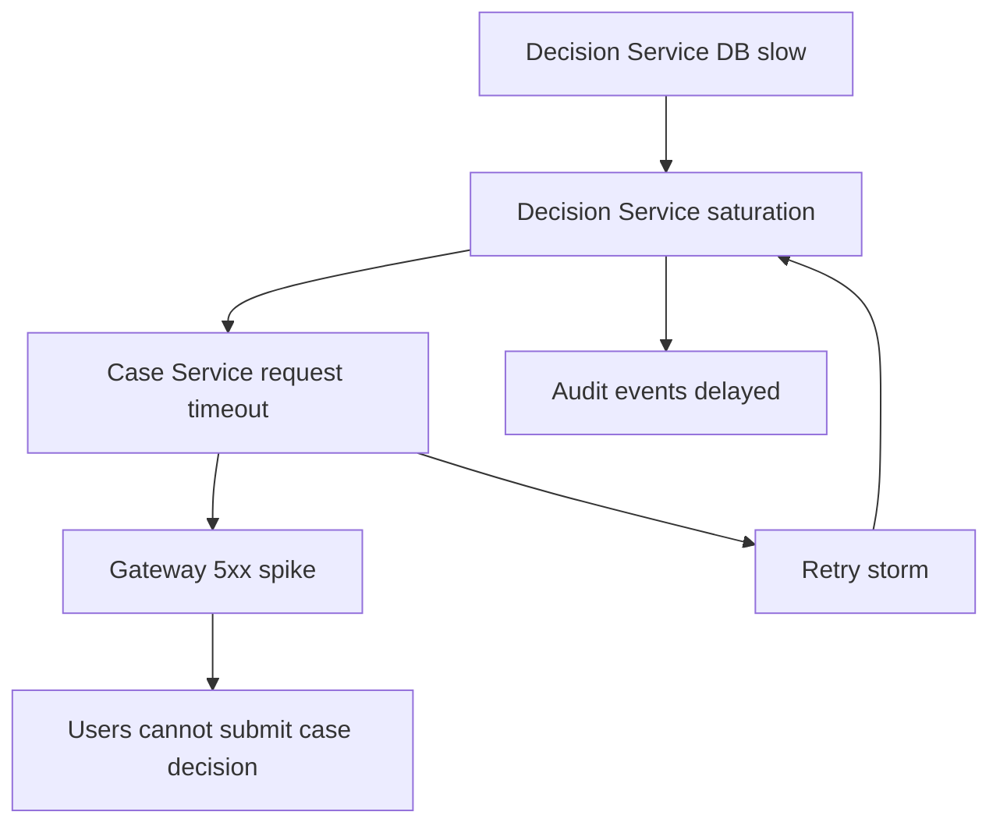

Blast radius questions:

- Does one dependency failure block all user journeys?
- Does one tenant overload affect all tenants?
- Does one queue backlog block all event types?
- Does one database table lock block unrelated operations?
- Does one gateway route failure block all clients?
- Does one region failure require manual data repair?
- Does one misconfigured deployment break all cells?

Containment patterns:

- separate worker pools by priority
- separate queues by workload type
- separate read/write paths
- separate tenant partitions
- separate deployment cells
- separate database pools for critical operations
- rate limit at ingress and dependency client
- reject low-priority traffic during overload
- avoid global shared mutable state

A topology that cannot show blast radius cannot control blast radius.

---

## 15. Runtime identity topology

In microservices, identity exists at several levels.

| Identity | Example | Used for |
|---|---|---|
| User identity | officer-123 | Authorization, audit |
| Client identity | web-portal, mobile-app | API policy |
| Service identity | case-service | Service-to-service auth |
| Workload identity | SPIFFE ID / service account | mTLS, runtime trust |
| Instance identity | pod UID | Debugging, telemetry |
| Request identity | correlation ID | Tracing |
| Business identity | case ID, decision ID | Domain causality |
| Tenant identity | tenant/jurisdiction | Isolation and routing |

Bad topology mixes these.

Example mistake:

- using pod name as business actor
- using service account as end-user identity
- using correlation ID as idempotency key
- using tenant ID from URL without verifying authorization
- using client app identity as permission authority

Good runtime topology preserves identity layers.

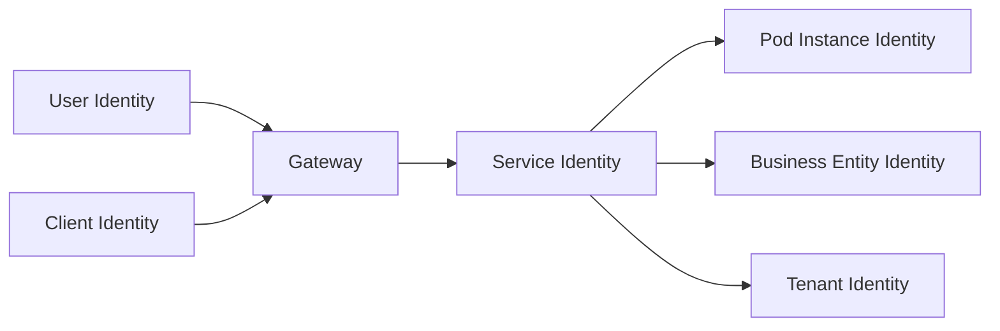

Each identity has different lifecycle and trust semantics.

---

## 16. Runtime metadata contract

Every service should publish runtime metadata.

Example `service.yaml`:

```yaml
service: case-service
owner: team-case-lifecycle
runtime:
  platform: kubernetes
  namespace: case-management
  deployment: case-service
  minReplicas: 3
  maxReplicas: 20
  workloadType: synchronous-api
  language: java
  framework: spring-boot
  jdk: 21
traffic:
  ingress: internal-gateway
  public: false
  protocol: http
  p95LatencyBudgetMs: 300
  timeoutMs: 800
  retryPolicy: no-retry-for-commands
scaling:
  metric: request-concurrency
  target: 80
placement:
  topologySpread: zone
  podDisruptionBudget:
    minAvailable: 2
dependencies:
  - name: decision-service
    mode: sync
    criticality: critical
    timeoutMs: 250
  - name: audit-event-topic
    mode: async
    criticality: required-eventual
security:
  serviceAccount: case-service
  mtls: required
  networkPolicy: restricted
observability:
  traces: required
  metrics: required
  structuredLogs: required
```

This metadata links architecture to runtime.

It enables:

- service catalog
- ownership routing
- incident response
- dependency graph
- policy automation
- deployment review
- capacity planning
- risk review
- compliance evidence

A service without runtime metadata is hard to operate at scale.

---

## 17. Java-specific runtime topology concerns

Java services have runtime characteristics that topology must account for.

### 17.1 JVM process is not just heap

A Java pod uses memory for:

- heap
- metaspace
- code cache
- thread stacks
- direct buffers
- garbage collector structures
- class metadata
- native libraries
- TLS buffers
- agents
- off-heap caches
- Netty buffers
- OS/container overhead

Therefore, memory limit cannot equal `-Xmx`.

### 17.2 Thread pools define concurrency topology

A Java service may have multiple pools:

- servlet/request pool
- async executor
- scheduler pool
- database pool
- HTTP client pool
- broker consumer threads
- Netty event loops
- ForkJoinPool
- workflow worker pool

If these are unbounded or mismatched, topology collapses under load.

Example:

```txt
200 request threads
50 DB connections
500 downstream client concurrency
3 downstream replicas
```

This topology can overload the downstream service.

Thread pools are not implementation details. They are resource topology.

### 17.3 Startup time affects rollout topology

A JVM service may need time for:

- class loading
- dependency injection
- JIT warmup
- connection pool initialization
- cache warmup
- schema check
- config validation
- instrumentation startup
- TLS setup

If readiness turns green too early, traffic hits an unprepared service.

If startup probe is too aggressive, Kubernetes restarts a healthy-but-slow-starting process.

### 17.4 Shutdown is a topology event

During deployment or node drain:

- pod receives termination signal
- readiness should turn false
- traffic should stop arriving
- in-flight requests should finish or timeout
- consumers should stop receiving new messages
- outbox publisher should stop safely
- resources should close
- process should exit before grace period

A service that ignores shutdown creates partial writes, lost telemetry, duplicated work, and client-facing errors.

---

## 18. Runtime topology and deployment strategy

Deployment strategy changes topology temporarily.

Rolling deployment:

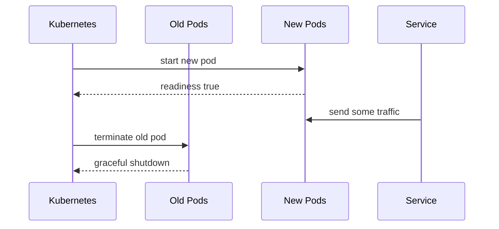

During rollout, both old and new versions may run simultaneously.

This requires:

- backward-compatible API
- backward-compatible events
- compatible database schema
- compatible config
- compatible cache keys
- compatible workflow versions
- compatible feature flags

Runtime topology interacts with versioning.

You do not deploy a single “new system.”

You temporarily operate a mixed-version topology.

That is why expand-contract migration matters.

---

## 19. Topology-aware design examples

### 19.1 Case submission API

User journey:

```txt
Officer submits case -> Case Service validates -> Party Service verifies party -> Audit event emitted
```

Runtime topology decision:

- Case Service has 3+ replicas across zones
- Party verification has 200 ms deadline
- Audit event uses outbox, not sync dependency
- Case submission does not fail if audit broker is briefly down; outbox stores event locally
- idempotency key prevents duplicate submission during retry
- readiness requires database connectivity but not Party Service connectivity

Why?

Party verification is in the request path. Audit broker should not block user submission if local outbox can persist the event.

### 19.2 Decision approval workflow

User journey:

```txt
Senior officer approves decision -> Decision Service records approval -> Notification is sent -> Case status updates
```

Runtime topology decision:

- approval write is local transaction
- notification is async
- case status update is async or workflow-driven
- decision approval emits event through outbox
- consumer idempotency protects duplicate event delivery
- audit trail stores actor, reason, previous state, new state, correlation ID

Why?

Approval is a business decision that must be durable even if notification service is unavailable.

### 19.3 Tenant-specific overload

Problem:

One large tenant floods search requests.

Runtime topology options:

- tenant-aware rate limiting at gateway
- tenant-aware queue partitioning
- tenant-specific read model replicas
- cell-based tenant isolation
- separate worker pool for expensive queries
- query budget per tenant

If topology has no tenant dimension, one tenant can become a global failure.

---

## 20. Runtime topology smells

Watch for these smells.

### 20.1 Invisible topology

Architecture docs show services but not:

- replicas
- zones
- queues
- connection pools
- gateways
- mesh policies
- scaling rules
- probes
- deployment strategy

This is a diagram-only architecture.

### 20.2 One giant shared gateway

All business logic, transformation, and workflow live in gateway.

Result:

- domain ownership becomes unclear
- gateway becomes bottleneck
- service APIs become weak
- deployments become coupled
- incident blast radius grows

### 20.3 Mesh hides app design mistakes

Service mesh retries non-idempotent calls.

Result:

- duplicate commands
- inconsistent state
- hidden latency
- difficult debugging

### 20.4 Replicas without capacity math

Team increases replicas but does not adjust:

- database max connections
- broker partitions
- downstream limits
- cache capacity
- external API quotas

Scaling becomes self-harm.

### 20.5 Readiness lies

Service reports ready even when:

- config is invalid
- DB pool cannot connect
- migration is incompatible
- required local resources are missing
- app is in overload

False readiness routes traffic into broken instances.

### 20.6 Startup depends on the world

Service startup calls every dependency.

Result:

- one dependency outage prevents deployment
- cascading restart failure
- fragile boot order

Readiness should represent ability to serve, but startup should avoid unnecessary remote dependency coupling.

### 20.7 One queue for everything

High-priority and low-priority work share one queue.

Result:

- low-priority backlog delays urgent work
- retry poison blocks normal events
- no prioritization

Separate workload classes when business priority differs.

---

## 21. Runtime topology design checklist

Use this checklist before approving a service design.

### 21.1 Instance and placement

- How many minimum replicas?
- What is the maximum replica count?
- Are replicas spread across nodes/zones?
- Is there a PodDisruptionBudget?
- Can one node fail without outage?
- Can one zone degrade without total outage?
- Are resource requests realistic?
- Are CPU/memory limits understood?

### 21.2 Routing

- What is the external entry point?
- What is the internal service DNS name?
- Is there a gateway or BFF?
- Is there service mesh?
- Who owns retries?
- Who owns timeout?
- Who owns auth?
- Who owns rate limiting?

### 21.3 Dependency graph

- Which dependencies are synchronous?
- Which are asynchronous?
- Which are critical?
- Which are optional?
- Which have fallback?
- Which have timeout and retry budget?
- Which carry sensitive data?
- Which cross ownership boundary?

### 21.4 Scaling

- What signal triggers autoscaling?
- Is the signal close to bottleneck?
- Does scaling increase dependency load safely?
- Are database/broker/external API limits known?
- Is scale-out faster than traffic spike?
- Is scale-down safe for workers?

### 21.5 Lifecycle

- Is startup probe needed?
- When does readiness become true?
- When does readiness become false?
- What happens on SIGTERM?
- Are consumers stopped before shutdown?
- Are in-flight requests drained?
- Is termination grace long enough?

### 21.6 Observability

- Can we identify pod, node, zone, version, and tenant in telemetry?
- Can we see dependency latency by edge?
- Can we see saturation by pool?
- Can we see retry count by caller?
- Can we reconstruct deployment-related regressions?

### 21.7 Blast radius

- What fails if this service is slow?
- What fails if this dependency is down?
- What fails if one tenant floods traffic?
- What fails if one zone dies?
- What fails if one message type poisons a queue?
- What is the emergency lever?

---

## 22. Architecture review artifact: runtime topology card

Use this template for each important service.

```md
# Runtime Topology Card: <service-name>

## Service identity
- Owner:
- Business capability:
- Runtime namespace:
- Service account:
- Public/internal:

## Deployment
- Workload type:
- Min replicas:
- Max replicas:
- Rollout strategy:
- PDB:
- Zone spread:

## Traffic
- Protocol:
- Gateway/BFF:
- Mesh:
- Timeout:
- Retry owner:
- Rate-limit owner:

## Resource profile
- CPU request/limit:
- Memory request/limit:
- JVM heap policy:
- Request concurrency:
- Worker concurrency:
- DB pool:
- HTTP client pool:

## Dependencies
| Dependency | Mode | Criticality | Timeout | Retry | Fallback |
|---|---|---:|---:|---:|---|

## Lifecycle
- Startup probe:
- Readiness rule:
- Liveness rule:
- Shutdown sequence:
- Termination grace:

## Failure model
- Known overload point:
- Critical dependency failure behavior:
- Optional dependency failure behavior:
- Queue backlog behavior:
- Tenant overload behavior:

## Observability
- Key metrics:
- Key logs:
- Key traces:
- Dashboards:
- Runbooks:

## Open risks
- Risk:
- Mitigation:
- Owner:
```

If a team cannot fill this card, the service is not production-ready.

---

## 23. Minimal Kubernetes sketch

This is not a full production manifest. It shows the runtime concepts.

```yaml
apiVersion: apps/v1
kind: Deployment
metadata:
  name: case-service
  namespace: case-management
spec:
  replicas: 3
  strategy:
    type: RollingUpdate
    rollingUpdate:
      maxUnavailable: 0
      maxSurge: 1
  selector:
    matchLabels:
      app: case-service
  template:
    metadata:
      labels:
        app: case-service
        service: case-service
        owner: team-case-lifecycle
    spec:
      serviceAccountName: case-service
      terminationGracePeriodSeconds: 45
      containers:
        - name: app
          image: registry.example.com/case-service:2026.07.05
          ports:
            - containerPort: 8080
          resources:
            requests:
              cpu: "500m"
              memory: "768Mi"
            limits:
              cpu: "1"
              memory: "1Gi"
          startupProbe:
            httpGet:
              path: /actuator/health/liveness
              port: 8080
            failureThreshold: 30
            periodSeconds: 2
          readinessProbe:
            httpGet:
              path: /actuator/health/readiness
              port: 8080
            periodSeconds: 5
            failureThreshold: 2
          livenessProbe:
            httpGet:
              path: /actuator/health/liveness
              port: 8080
            periodSeconds: 10
            failureThreshold: 3
```

Key points:

- `maxUnavailable: 0` avoids reducing available replicas during rollout.
- resource requests communicate scheduling needs.
- memory limit must include more than heap.
- startup probe protects slow startup.
- readiness controls traffic admission.
- liveness should not check deep dependencies.
- termination grace must match shutdown behavior.

---

## 24. Mental model: topology is a set of promises

Runtime topology is not just infrastructure.

It is a set of promises:

- how traffic enters
- how traffic leaves
- how identity is proven
- how instances are replaced
- how failure is contained
- how load is admitted
- how work is scaled
- how telemetry is emitted
- how deployments coexist
- how shutdown preserves correctness
- how blast radius is bounded

The deeper lesson:

> A service is not production-grade because it compiles, has a REST API, and runs in a pod. It is production-grade when its runtime topology preserves its business invariants under deployment, failure, scale, and recovery.

---

## 25. Exercises

### Exercise 1 — Draw the real topology

Pick one service in your system.

Draw:

- gateway
- service mesh/sidecar if any
- pods
- nodes
- zones
- database
- cache
- broker
- sync dependencies
- async dependencies
- telemetry path

Then mark:

- timeout per edge
- retry per edge
- criticality per dependency
- owner per component
- blast radius per failure

### Exercise 2 — Calculate dependency amplification

For a service with:

- 10 replicas
- 100 request threads per replica
- 50 DB connections per replica
- 3 retries per downstream call
- 4 synchronous downstream calls per user request

Calculate:

- maximum DB connections
- maximum in-flight request handling capacity
- possible downstream attempts per user request
- which dependency becomes the first bottleneck

### Exercise 3 — Define runtime topology card

Create a runtime topology card for:

- Case Service
- Decision Service
- Audit Service
- Notification Service

Compare which services need:

- higher availability
- stricter audit
- async processing
- tenant isolation
- lower latency
- stronger shutdown guarantees

### Exercise 4 — Identify hidden shared failure domains

List all shared components:

- gateway
- mesh control plane
- database cluster
- broker cluster
- DNS
- secrets manager
- cache
- observability backend
- CI/CD pipeline
- shared library

For each, answer:

> If this fails, how much of the business stops?

---

## 26. References

- Kubernetes — Pods: https://kubernetes.io/docs/concepts/workloads/pods/
- Kubernetes — Workloads: https://kubernetes.io/docs/concepts/workloads/
- Kubernetes — Pod Lifecycle: https://kubernetes.io/docs/concepts/workloads/pods/pod-lifecycle/
- Kubernetes — Services: https://kubernetes.io/docs/concepts/services-networking/service/
- Kubernetes — Probes: https://kubernetes.io/docs/tasks/configure-pod-container/configure-liveness-readiness-startup-probes/
- Kubernetes — Container Lifecycle Hooks: https://kubernetes.io/docs/concepts/containers/container-lifecycle-hooks/
- Spring Boot — Production-ready Features: https://docs.spring.io/spring-boot/reference/actuator/index.html
- Spring Boot — Kubernetes Probes: https://docs.spring.io/spring-boot/reference/actuator/endpoints.html#actuator.endpoints.kubernetes-probes
- Google SRE — Addressing Cascading Failures: https://sre.google/sre-book/addressing-cascading-failures/
- Google SRE — Handling Overload: https://sre.google/sre-book/handling-overload/
