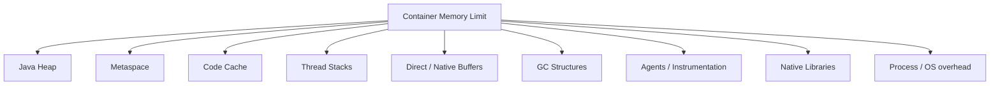
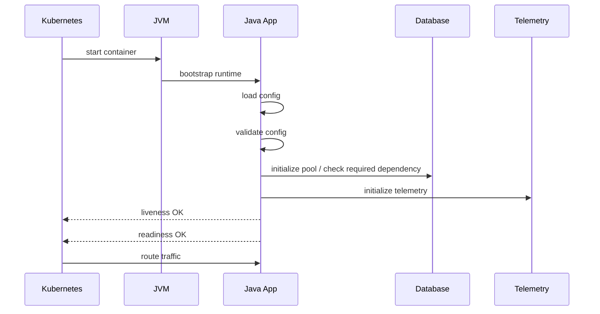
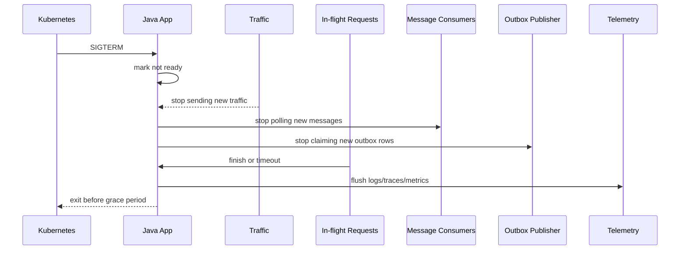

# Part 062 — Container-Ready Java Service Design

## 1. Core idea

A Java service is not container-ready because it has a `Dockerfile`.

It is container-ready when it behaves correctly under container lifecycle constraints:

- immutable image
- externalized configuration
- limited CPU
- limited memory
- ephemeral filesystem
- disposable process
- stdout/stderr logging
- signal-based shutdown
- readiness/liveness probes
- graceful termination
- non-root runtime
- predictable startup
- bounded concurrency
- safe dependency initialization
- observable resource usage

The core rule:

> Container-ready means lifecycle-ready, resource-ready, security-ready, and operations-ready.

Packaging is the smallest part.

The hard part is making the JVM application cooperate with the runtime.

---

## 2. Container-ready is not the same as containerized

Containerized:

```txt
The app runs inside a container.
```

Container-ready:

```txt
The app is designed to be scheduled, killed, restarted, scaled, drained, observed, and constrained by the platform without corrupting business state or causing avoidable outages.
```

A bad containerized Java app:

- starts slowly without startup probe
- reports ready before it can serve
- ignores SIGTERM
- keeps accepting requests during shutdown
- loses in-flight work
- logs to files inside container
- stores uploads on local disk
- assumes unlimited memory
- sets heap equal to container limit
- opens too many DB connections per replica
- runs as root
- embeds environment-specific config in image
- performs schema migration on every startup
- crashes when optional dependency is down

A good container-ready Java app:

- has explicit startup/readiness/liveness behavior
- validates configuration at startup
- does not become ready until required local dependencies are available
- stops readiness before shutdown
- drains traffic
- stops message consumers safely
- flushes telemetry
- uses memory envelope, not heap-only math
- sizes thread and connection pools according to CPU and dependencies
- writes structured logs to stdout
- stores persistent state outside the container
- runs with least privilege
- exposes operational metadata

---

## 3. The container contract

A containerized service should respect these contracts.

| Contract | Meaning | Java implication |
|---|---|---|
| Process contract | One foreground process, exits when app exits | Do not hide JVM behind fragile shell scripts |
| Config contract | Config comes from environment/runtime | Validate config, fail fast on invalid values |
| Resource contract | CPU/memory are bounded | Size heap, pools, and concurrency explicitly |
| Network contract | Network can be delayed/failed | Timeouts, readiness, retry discipline |
| Filesystem contract | Local disk is ephemeral | Do not store durable business state locally |
| Logging contract | Logs go to stdout/stderr | Structured logs, no local log rotation |
| Lifecycle contract | Runtime sends termination signal | Handle SIGTERM, drain, exit in grace period |
| Security contract | Least privilege | Non-root, no unnecessary capabilities |
| Observability contract | Runtime must see health/metrics/traces | Actuator/Micrometer/OpenTelemetry |

These are architectural constraints, not DevOps details.

---

## 4. Image design

The image is the deployable artifact.

It should be:

- immutable
- minimal
- reproducible
- environment-agnostic
- vulnerability-scannable
- traceable to source/build
- free from secrets
- free from environment-specific config

A typical multi-stage Dockerfile:

```dockerfile
# Build stage
FROM eclipse-temurin:21-jdk AS build
WORKDIR /workspace
COPY mvnw pom.xml ./
COPY .mvn .mvn
RUN ./mvnw -q -DskipTests dependency:go-offline
COPY src src
RUN ./mvnw -q -DskipTests package

# Runtime stage
FROM eclipse-temurin:21-jre
WORKDIR /app

RUN groupadd --system app && useradd --system --gid app app
USER app:app

COPY --from=build /workspace/target/case-service.jar /app/app.jar

EXPOSE 8080
ENTRYPOINT ["java", "-jar", "/app/app.jar"]
```

This is still only a starting point.

Production hardening may include:

- pinned base image digest
- SBOM generation
- vulnerability scanning
- non-root user
- read-only root filesystem
- minimal runtime image
- predictable JVM options
- build provenance
- image signing
- dependency verification

The image must not contain:

- database passwords
- API keys
- private certificates
- tenant-specific config
- production URLs hardcoded in code
- log files from build
- local developer settings

Image immutability enables rollout confidence.

---

## 5. JVM memory in containers

A common mistake:

```txt
container memory limit = 1024Mi
-Xmx = 1024m
```

This is unsafe.

The JVM uses memory beyond heap.



If total process memory exceeds the container limit, the container may be killed by the runtime.

This usually appears as:

```txt
OOMKilled
Exit Code 137
```

The service may not get a Java `OutOfMemoryError`.

It may simply disappear.

### 5.1 Memory budget model

Use a budget.

Example:

```txt
container limit:        1024 MiB
heap target:             512 MiB
metaspace/code/native:   160 MiB
thread stacks:           128 MiB
direct buffers:          128 MiB
agents/overhead:          64 MiB
safety margin:            32 MiB
```

This is not a universal formula. It is a thinking model.

You must measure real usage.

### 5.2 Heap percentage

Modern Java is container-aware, but you should still be intentional.

Example JVM options:

```bash
JAVA_TOOL_OPTIONS="
  -XX:MaxRAMPercentage=60
  -XX:InitialRAMPercentage=30
  -XX:+ExitOnOutOfMemoryError
"
```

Why not always set `-Xmx`?

`-Xmx` is explicit and predictable, but percentage-based sizing can work better across environment sizes.

Decision rule:

- use explicit `-Xmx` when you want strict environment-specific control
- use `MaxRAMPercentage` when container limit varies and you have tested envelopes
- never assume heap is the only memory

### 5.3 Thread stacks matter

Every Java thread has a stack.

If you create many threads, memory grows.

Bad:

```java
Executors.newCachedThreadPool();
```

This may create too many threads under load.

Better:

```java
@Bean
ExecutorService caseCommandExecutor() {
    return new ThreadPoolExecutor(
        16,
        32,
        30, TimeUnit.SECONDS,
        new ArrayBlockingQueue<>(500),
        new ThreadPoolExecutor.CallerRunsPolicy()
    );
}
```

Bounded pools are container-friendly.

Unbounded pools are container-hostile.

---

## 6. CPU limits and Java concurrency

CPU in containers is not the same as CPU on your laptop.

Java uses detected CPU count to size internal components such as:

- garbage collector threads
- ForkJoinPool parallelism
- JIT compilation threads
- Netty event loops
- framework executors

If CPU limits are absent or confusing, the JVM may assume more CPU than it effectively receives.

This can cause:

- too many threads
- excessive context switching
- latency spikes
- GC contention
- poor tail latency
- noisy neighbor effects

### 6.1 CPU request vs limit

A common Kubernetes setup:

```yaml
resources:
  requests:
    cpu: "500m"
    memory: "768Mi"
  limits:
    cpu: "1"
    memory: "1Gi"
```

Meaning:

- request influences scheduling and reserved capacity
- limit constrains maximum usage

Architectural implication:

> Thread pools and concurrency should be sized for realistic CPU, not theoretical cluster capacity.

### 6.2 ActiveProcessorCount

For some workloads, you may explicitly control how many processors the JVM considers available:

```bash
-XX:ActiveProcessorCount=2
```

Use this carefully.

It can help align JVM internals with deployment constraints, but it can also underutilize CPU if set incorrectly.

### 6.3 Concurrency budget

Define concurrency from capacity.

```txt
request_concurrency <= CPU_capacity * acceptable_latency / cpu_time_per_request
```

That is not exact queueing theory, but it forces the right question:

> How many requests can this pod handle before latency and GC collapse?

Do not size request threads by default framework values.

Size them by measurement.

---

## 7. Startup behavior

Container startup is part of deployment correctness.

A Java service startup sequence often includes:



Bad startup:

- starts accepting traffic before connection pools are ready
- waits forever for optional dependency
- performs long remote calls without timeout
- performs schema migration in every replica
- hides invalid config until first request
- fails liveness during normal warmup

Good startup:

- validate config early
- initialize required local resources
- apply bounded dependency checks
- expose startup probe separately from readiness
- avoid unnecessary remote startup coupling
- fail fast on unrecoverable misconfiguration
- delay readiness until service can serve

### 7.1 Startup probe

Startup probe protects slow-starting applications.

```yaml
startupProbe:
  httpGet:
    path: /actuator/health/liveness
    port: 8080
  failureThreshold: 30
  periodSeconds: 2
```

This allows up to around 60 seconds before Kubernetes treats startup as failed.

Use it when:

- JVM warmup can be slow
- dependency injection is heavy
- native image is not used
- migration check is slow
- cold cache initialization exists

Do not use startup probe to hide broken startup forever.

---

## 8. Readiness behavior

Readiness answers:

> Should this instance receive traffic now?

It is not the same as “is the process alive?”

A pod may be alive but not ready.

Examples:

- app is starting
- app is shutting down
- DB pool unavailable
- critical local config missing
- service is overloaded
- cache warmup required for safe response
- message consumer paused

Spring Boot exposes availability states that can be mapped to Kubernetes probes.

A readiness check should include only things that determine whether this instance can serve its intended traffic.

### 8.1 Shallow vs deep readiness

Bad readiness:

```txt
Check every downstream service deeply.
```

Why bad?

If one downstream service is down, all upstream pods may become unready, causing traffic collapse.

Better readiness:

- check local process health
- check required local infrastructure
- check database only if this service cannot serve without DB
- do not check optional downstream dependencies deeply
- expose dependency health separately for diagnostics

Example custom readiness logic:

```java
@Component
final class CaseServiceReadiness {
    private final DatabaseHealth databaseHealth;
    private final OverloadSignal overloadSignal;

    ReadinessStatus readiness() {
        if (!databaseHealth.canAcquireConnection()) {
            return ReadinessStatus.notReady("database-pool-unavailable");
        }
        if (overloadSignal.shouldRejectNewTraffic()) {
            return ReadinessStatus.notReady("overloaded");
        }
        return ReadinessStatus.ready();
    }
}
```

The exact implementation depends on framework, but the semantic rule is universal.

---

## 9. Liveness behavior

Liveness answers:

> Should the runtime restart this container?

Liveness must be conservative.

Bad liveness:

- checks database
- checks downstream API
- checks broker
- fails on temporary dependency issue
- fails when one worker is slow
- triggers restart under overload

This can create restart storms.

Good liveness:

- checks whether process is fundamentally alive
- checks event loop deadlock if possible
- checks fatal internal state
- avoids remote dependency checks

If liveness fails, Kubernetes may kill the container.

Therefore:

> Do not make liveness fail for conditions that restart cannot fix.

Dependency outage cannot be fixed by restarting every caller.

---

## 10. Graceful shutdown

Container shutdown is where many correctness bugs hide.

A good shutdown sequence:



Bad shutdown:

- process exits immediately
- readiness stays true until death
- consumers continue claiming messages
- scheduler starts new jobs
- in-flight requests are cut
- outbox event is written but not flushed properly
- telemetry is lost
- database transactions are interrupted unpredictably

### 10.1 Shutdown phases

A practical sequence:

1. Receive termination signal.
2. Mark readiness false.
3. Stop accepting new ingress traffic.
4. Stop polling brokers/queues.
5. Stop schedulers from launching new work.
6. Allow in-flight requests to complete within deadline.
7. Finish or release leased work safely.
8. Flush telemetry.
9. Close pools.
10. Exit before `terminationGracePeriodSeconds`.

### 10.2 Spring Boot graceful shutdown

Spring Boot supports graceful shutdown for embedded web servers.

Example properties:

```properties
server.shutdown=graceful
spring.lifecycle.timeout-per-shutdown-phase=30s
```

This helps stop web traffic gracefully, but it is not enough by itself.

You still need to manage:

- message consumers
- scheduled jobs
- workflow workers
- outbox publishers
- custom executors
- external locks
- telemetry flushing

Graceful shutdown is application-specific.

---

## 11. Message consumers in containers

Consumers need special shutdown behavior.

Bad consumer:

```java
while (true) {
    Message msg = consumer.poll();
    process(msg);
    commit(msg);
}
```

It ignores:

- cancellation
- shutdown deadline
- processing timeout
- retry policy
- idempotency
- partition rebalance
- commit semantics

Better model:

```java
final class ConsumerLifecycle {
    private final AtomicBoolean running = new AtomicBoolean(true);

    void stop() {
        running.set(false);
    }

    void runLoop() {
        while (running.get()) {
            List<Message> messages = pollWithTimeout();
            for (Message message : messages) {
                processWithIdempotency(message);
                commitAfterSuccessfulProcessing(message);
            }
        }
        closeConsumer();
    }
}
```

Consumer shutdown must be coordinated with:

- broker protocol
- partition ownership
- visibility timeout
- lease duration
- idempotency store
- DLQ policy
- pod termination grace

If processing may exceed termination grace, use smaller processing units or lease renewal.

---

## 12. Filesystem behavior

Container local filesystem is ephemeral.

Bad assumptions:

- uploaded evidence file stored in `/tmp` permanently
- generated PDF stored locally for later retrieval
- local cache required for correctness
- log files rotated inside container
- local lock file coordinates workers
- local SQLite file used as shared state

Allowed uses:

- temporary files
- short-lived buffers
- cache that can be rebuilt
- scratch space

Rules:

- durable business state goes to owned database/object storage
- logs go to stdout/stderr
- secrets do not get written to disk unless explicitly controlled
- temp files are cleaned
- filesystem size is bounded
- read-only root filesystem is preferred when possible

Kubernetes can mount volumes, but a mounted volume is a design decision, not a default escape hatch.

---

## 13. Logging in containers

Container logs should go to stdout/stderr.

Bad:

```properties
logging.file.name=/var/log/case-service/app.log
```

Why bad?

- local file may be lost when pod dies
- platform log collector may not see it
- rotation is duplicated
- disk may fill
- operational behavior differs by node

Better:

```properties
logging.structured.format.console=ecs
```

Then include stable fields:

- timestamp
- level
- service
- version
- environment
- trace ID
- span ID
- correlation ID
- tenant ID if allowed
- business entity ID if allowed
- error code
- operation

Container logging is platform integration.

The app produces structured events. The platform ships, indexes, retains, and secures them.

---

## 14. Configuration in containers

Container images must be environment-agnostic.

Bad:

```dockerfile
ENV DATABASE_URL=jdbc:postgresql://prod-db:5432/cases
ENV PAYMENT_API_KEY=secret
```

Better:

```yaml
env:
  - name: DATABASE_URL
    valueFrom:
      secretKeyRef:
        name: case-service-db
        key: url
  - name: FEATURE_DECISION_ESCALATION
    valueFrom:
      configMapKeyRef:
        name: case-service-config
        key: feature.decision-escalation
```

Rules:

- image contains code, not environment truth
- config is supplied by runtime
- secrets are not baked into image
- config is validated at startup
- effective config is observable without leaking secrets
- invalid config fails fast
- feature flags have owner and expiry

Typed configuration example:

```java
@ConfigurationProperties(prefix = "case.dependency.decision")
@Validated
public record DecisionClientProperties(
    @NotBlank URI baseUrl,
    @DurationMin(seconds = 1) Duration timeout,
    @Min(1) int maxConnections
) {}
```

Configuration is a runtime contract.

---

## 15. Database migration and containers

A dangerous pattern:

```txt
Every app container runs schema migration on startup.
```

Why dangerous?

- multiple replicas race
- startup becomes slow
- rollback becomes difficult
- schema lock may block app
- deploy and migration failure combine
- app readiness becomes migration readiness

Safer patterns:

| Pattern | When useful | Risk |
|---|---|---|
| Separate migration job | Controlled deployment | Needs orchestration |
| Expand-contract migration | Backward-compatible rollout | Requires discipline |
| Online schema migration | Large tables | Tooling complexity |
| App-managed migration | Small/internal service | Race/lock risk if careless |

For microservices, the database belongs to one service, but migration still needs deployment choreography.

Container-ready service should not assume it can mutate schema at arbitrary startup time.

---

## 16. Security hardening

Container-ready also means security-ready.

Baseline practices:

- run as non-root
- drop unnecessary capabilities
- avoid privileged containers
- use read-only root filesystem where possible
- do not mount Docker socket
- avoid hostPath unless justified
- avoid shell/debug tools in runtime image if not needed
- restrict egress with network policy
- use service account with minimal RBAC
- scan image dependencies
- rotate secrets
- do not expose admin endpoints publicly

Example pod security context:

```yaml
securityContext:
  runAsNonRoot: true
  runAsUser: 10001
  runAsGroup: 10001
  fsGroup: 10001
  seccompProfile:
    type: RuntimeDefault
containers:
  - name: app
    securityContext:
      allowPrivilegeEscalation: false
      readOnlyRootFilesystem: true
      capabilities:
        drop:
          - ALL
```

Security hardening must be tested.

A read-only root filesystem may break libraries that assume writable directories.

Fix by explicitly mounting writable temp directories:

```yaml
volumeMounts:
  - name: tmp
    mountPath: /tmp
volumes:
  - name: tmp
    emptyDir: {}
```

---

## 17. Network design inside containers

A Java service must assume network calls can fail.

Container networking implications:

- DNS may change
- pod IP is ephemeral
- connections can break during rollout
- sidecar may add latency
- service mesh may reset connections
- NAT and load balancing may affect long-lived connections
- TLS certs may rotate
- idle connections can be closed by intermediaries

Client configuration should include:

- connect timeout
- response/read timeout
- connection pool max size
- connection TTL/idle eviction
- retry policy only for safe operations
- circuit breaker if dependency can overload caller
- metrics per dependency
- trace propagation

Example concept:

```java
record HttpClientPolicy(
    Duration connectTimeout,
    Duration responseTimeout,
    int maxConnections,
    int pendingAcquireMaxCount,
    boolean retrySafeReadsOnly
) {}
```

Network defaults are rarely production-safe.

---

## 18. Resource-aware Spring Boot sketch

Example application properties:

```properties
server.port=8080
server.shutdown=graceful
spring.lifecycle.timeout-per-shutdown-phase=30s

management.endpoints.web.exposure.include=health,info,prometheus
management.endpoint.health.probes.enabled=true
management.health.livenessstate.enabled=true
management.health.readinessstate.enabled=true

logging.structured.format.console=ecs
```

Example Java availability hook:

```java
@Component
final class ShutdownReadinessManager {
    private final ApplicationEventPublisher publisher;

    ShutdownReadinessManager(ApplicationEventPublisher publisher) {
        this.publisher = publisher;
    }

    @PreDestroy
    void markRefusingTraffic() {
        AvailabilityChangeEvent.publish(
            publisher,
            this,
            ReadinessState.REFUSING_TRAFFIC
        );
    }
}
```

This is not the whole shutdown solution, but it shows the idea:

> Make runtime state explicit.

---

## 19. Example production-style Deployment sketch

```yaml
apiVersion: apps/v1
kind: Deployment
metadata:
  name: decision-service
  namespace: decisioning
spec:
  replicas: 3
  strategy:
    type: RollingUpdate
    rollingUpdate:
      maxUnavailable: 0
      maxSurge: 1
  selector:
    matchLabels:
      app: decision-service
  template:
    metadata:
      labels:
        app: decision-service
        service: decision-service
        runtime: java
    spec:
      serviceAccountName: decision-service
      terminationGracePeriodSeconds: 45
      securityContext:
        runAsNonRoot: true
        runAsUser: 10001
        runAsGroup: 10001
        fsGroup: 10001
        seccompProfile:
          type: RuntimeDefault
      containers:
        - name: app
          image: registry.example.com/decision-service:2026.07.05
          imagePullPolicy: IfNotPresent
          ports:
            - name: http
              containerPort: 8080
          env:
            - name: JAVA_TOOL_OPTIONS
              value: >-
                -XX:MaxRAMPercentage=60
                -XX:InitialRAMPercentage=30
                -XX:+ExitOnOutOfMemoryError
            - name: SPRING_PROFILES_ACTIVE
              value: prod
          resources:
            requests:
              cpu: "500m"
              memory: "768Mi"
            limits:
              cpu: "1"
              memory: "1Gi"
          startupProbe:
            httpGet:
              path: /actuator/health/liveness
              port: http
            failureThreshold: 30
            periodSeconds: 2
          readinessProbe:
            httpGet:
              path: /actuator/health/readiness
              port: http
            periodSeconds: 5
            timeoutSeconds: 2
            failureThreshold: 2
          livenessProbe:
            httpGet:
              path: /actuator/health/liveness
              port: http
            periodSeconds: 10
            timeoutSeconds: 2
            failureThreshold: 3
          securityContext:
            allowPrivilegeEscalation: false
            readOnlyRootFilesystem: true
            capabilities:
              drop: ["ALL"]
          volumeMounts:
            - name: tmp
              mountPath: /tmp
      volumes:
        - name: tmp
          emptyDir: {}
```

This manifest expresses architecture assumptions:

- app is disposable
- app is non-root
- root filesystem is read-only
- JVM memory is bounded by percentage
- startup is allowed to be slower than liveness
- readiness controls traffic
- liveness is shallow
- shutdown has a grace period
- temporary disk is explicit

---

## 20. Failure modes specific to containerized Java

### 20.1 OOMKilled without Java stack trace

Symptom:

```txt
Last State: Terminated
Reason: OOMKilled
Exit Code: 137
```

Likely causes:

- heap too large for container limit
- too many threads
- direct buffer leak
- excessive metaspace/class loading
- instrumentation overhead
- large in-memory cache
- unbounded request body buffering
- large JSON payloads

Mitigation:

- lower heap percentage
- inspect native memory
- bound thread pools
- bound request body size
- limit cache size
- monitor RSS, heap, non-heap, direct memory

### 20.2 CPU throttling and latency spikes

Symptom:

- p99 latency spikes
- GC pauses increase
- request queue grows
- CPU throttling metric high

Likely causes:

- CPU limit too low
- too many runnable threads
- GC thread count mismatch
- expensive JSON serialization
- blocking work on event loop
- high allocation rate

Mitigation:

- profile CPU
- tune concurrency
- increase CPU request/limit
- reduce allocation
- separate blocking pools
- inspect GC logs/metrics

### 20.3 Restart loop due to bad liveness

Symptom:

- pods constantly restart during dependency outage
- service never stabilizes

Likely cause:

- liveness checks database/downstream/broker

Mitigation:

- move dependency check to readiness or diagnostic health
- keep liveness shallow
- use startup probe for slow boot

### 20.4 Traffic sent before warmup

Symptom:

- deployment causes initial error spike
- first requests slow
- cache misses overwhelm downstream

Likely cause:

- readiness true too early

Mitigation:

- delay readiness until required warmup finishes
- use startup probe
- pre-warm critical caches carefully
- scale gradually

### 20.5 Grace period too short

Symptom:

- requests fail during rollout
- consumers duplicate messages
- outbox rows stuck
- telemetry missing

Likely cause:

- app needs more time than `terminationGracePeriodSeconds`

Mitigation:

- stop readiness immediately
- stop new work
- shorten work units
- increase grace period
- measure shutdown duration

---

## 21. Container readiness checklist

### 21.1 Image

- Is the image immutable?
- Is the base image pinned or controlled?
- Does the image avoid secrets?
- Does the image avoid environment-specific config?
- Does the runtime image contain only what is needed?
- Is SBOM/vulnerability scanning available?
- Is build provenance traceable?

### 21.2 JVM resources

- Is memory budget explicit?
- Is heap smaller than container limit?
- Are non-heap components monitored?
- Are thread pools bounded?
- Are direct buffers considered?
- Are CPU limits understood?
- Is request concurrency measured?
- Are DB/HTTP/broker pools aligned with replica count?

### 21.3 Lifecycle

- Does the app validate config at startup?
- Is startup probe configured if startup is slow?
- Is readiness meaningful?
- Is liveness shallow?
- Does shutdown mark readiness false?
- Are consumers stopped before termination?
- Are schedulers stopped?
- Are in-flight requests drained?
- Is telemetry flushed?
- Is termination grace tested?

### 21.4 Filesystem and logs

- Are logs written to stdout/stderr?
- Is local disk used only for temp/cache?
- Is durable state externalized?
- Is root filesystem read-only if possible?
- Are temp directories explicit?
- Is log payload redacted?

### 21.5 Security

- Does container run as non-root?
- Are Linux capabilities dropped?
- Is privilege escalation disabled?
- Is service account minimal?
- Are admin endpoints protected?
- Are secrets injected safely?
- Are network policies defined?

### 21.6 Operations

- Are health endpoints exposed only appropriately?
- Are metrics exposed?
- Are traces propagated?
- Are runtime labels consistent?
- Can we diagnose OOMKilled?
- Can we diagnose CPU throttling?
- Can we correlate pod version to incidents?

---

## 22. Java service container contract test

You can test container readiness with scenarios.

### Test 1 — Slow startup

Inject slow startup.

Expected:

- startup probe tolerates it
- readiness stays false
- no traffic arrives until ready
- liveness does not kill prematurely

### Test 2 — Invalid config

Provide invalid required config.

Expected:

- application fails fast
- error is clear
- pod does not report ready
- no partial initialization remains

### Test 3 — Dependency outage

Start app while optional dependency is down.

Expected:

- app starts if dependency is optional
- readiness reflects only required serving capability
- errors are explicit for affected operation
- liveness remains healthy

### Test 4 — SIGTERM during request

Send long request and terminate pod.

Expected:

- readiness turns false
- no new traffic arrives
- request finishes or times out cleanly
- app exits within grace period

### Test 5 — Broker message during shutdown

Terminate pod while consumer is processing.

Expected:

- no new messages are claimed
- current message commits or is safely retried
- idempotency prevents duplicate side effect
- pod exits before grace period

### Test 6 — Memory pressure

Run load test near memory limit.

Expected:

- heap/non-heap metrics visible
- no unbounded growth
- cache limits enforced
- no OOMKilled under expected traffic

---

## 23. Decision matrix: where to put behavior

| Behavior | Application | Container/Kubernetes | Platform/Mesh |
|---|---:|---:|---:|
| Domain validation | yes | no | no |
| Idempotency | yes | no | no |
| Business compensation | yes | no | no |
| Readiness semantics | yes | probes consume it | no |
| Liveness restart | expose shallow signal | yes | no |
| TLS/mTLS transport | maybe | maybe | yes often |
| Retry policy | semantic owner | no | transport only if safe |
| Log shipping | emit stdout | collect | pipeline |
| Secret storage | consume | mount/inject | provide |
| Resource limit | adapt to | enforce | policy |
| Graceful shutdown | implement | signal/grace | drain sometimes |
| Rate limiting | sometimes | no | gateway/mesh often |

This table is important.

Many outages happen because behavior is placed in the wrong layer.

A mesh cannot perform business idempotency.

Kubernetes cannot know whether a partially processed case approval should be retried.

The Java service must own semantic correctness.

---

## 24. Mental model: containers make bad assumptions visible

Containers do not magically make systems reliable.

They expose assumptions:

- “We have infinite memory.”
- “We can write to disk.”
- “Shutdown never interrupts us.”
- “Startup order is fixed.”
- “One instance runs the job.”
- “Threads are free.”
- “DB connections are cheap.”
- “Logs are local files.”
- “A pod is a server.”

Container-ready design replaces those assumptions with explicit contracts.

The deeper lesson:

> A container-ready Java microservice is a well-behaved process under constraint. It starts predictably, serves only when ready, consumes bounded resources, shuts down without corrupting work, exposes useful telemetry, and never depends on instance permanence.

---

## 25. Exercises

### Exercise 1 — Memory envelope

For one Java service, collect:

- container memory limit
- max heap
- metaspace
- direct memory
- thread count
- thread stack size
- RSS
- GC metrics
- OOMKilled history

Then create a memory budget.

### Exercise 2 — Shutdown drill

Run:

```bash
kubectl rollout restart deployment/case-service
```

or terminate one pod during load.

Observe:

- when readiness changes
- whether new traffic stops
- whether in-flight requests finish
- whether consumers stop
- whether logs/traces flush
- whether duplicate work occurs

### Exercise 3 — Probe audit

For each service, classify health checks:

| Check | Startup | Readiness | Liveness | Diagnostic only |
|---|---:|---:|---:|---:|
| Process alive | yes | yes | yes | no |
| DB pool | maybe | maybe | no | yes |
| Downstream API | no | rarely | no | yes |
| Broker reachable | maybe | maybe | no | yes |
| Config valid | yes | yes | no | yes |
| Overload signal | no | yes | no | yes |

### Exercise 4 — Container hardening

Check your deployment:

- non-root user
- no privilege escalation
- dropped capabilities
- read-only root filesystem
- explicit temp volume
- no secrets in image
- safe environment variables
- protected actuator endpoints

### Exercise 5 — Replica multiplication

Given:

- 8 replicas
- 40 DB connections per replica
- 200 HTTP client connections per replica
- 16 consumer threads per replica

Calculate total potential pressure on:

- database
- downstream service
- broker
- CPU
- memory

Then decide whether the topology is safe.

---

## 26. References

- Kubernetes — Pods: https://kubernetes.io/docs/concepts/workloads/pods/
- Kubernetes — Pod Lifecycle: https://kubernetes.io/docs/concepts/workloads/pods/pod-lifecycle/
- Kubernetes — Probes: https://kubernetes.io/docs/tasks/configure-pod-container/configure-liveness-readiness-startup-probes/
- Kubernetes — Container Lifecycle Hooks: https://kubernetes.io/docs/concepts/containers/container-lifecycle-hooks/
- Spring Boot — Actuator: https://docs.spring.io/spring-boot/reference/actuator/index.html
- Spring Boot — Kubernetes Probes: https://docs.spring.io/spring-boot/reference/actuator/endpoints.html#actuator.endpoints.kubernetes-probes
- Spring Boot — Graceful Shutdown: https://docs.spring.io/spring-boot/reference/web/graceful-shutdown.html
- Oracle Java Blog — Java SE support for Docker CPU and memory limits: https://blogs.oracle.com/java/java-se-support-for-docker-cpu-and-memory-limits
- Red Hat Developers — Java 17 container awareness: https://developers.redhat.com/articles/2022/04/19/java-17-whats-new-openjdks-container-awareness
- OpenJDK — cgroups v2 container awareness: https://bugs.openjdk.org/browse/JDK-8230305
- OWASP — Docker Security Cheat Sheet: https://cheatsheetseries.owasp.org/cheatsheets/Docker_Security_Cheat_Sheet.html
