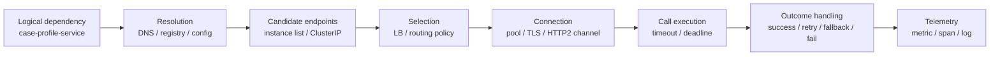
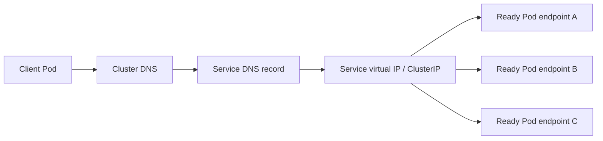
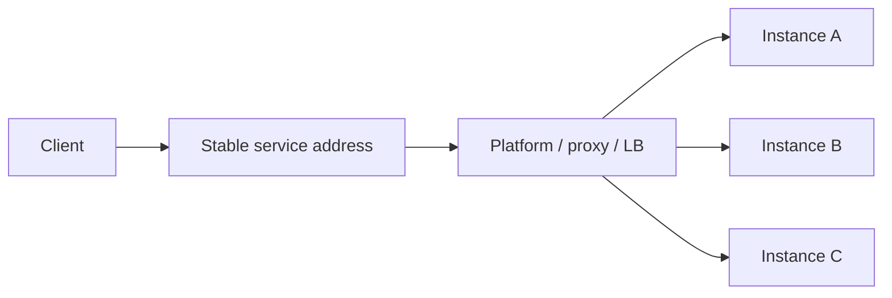
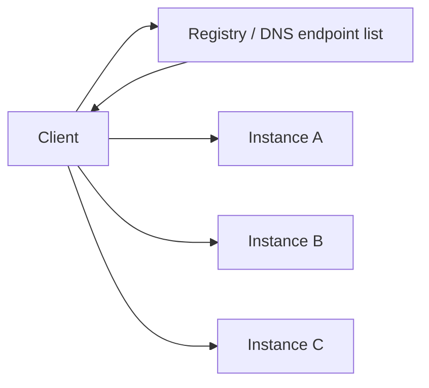
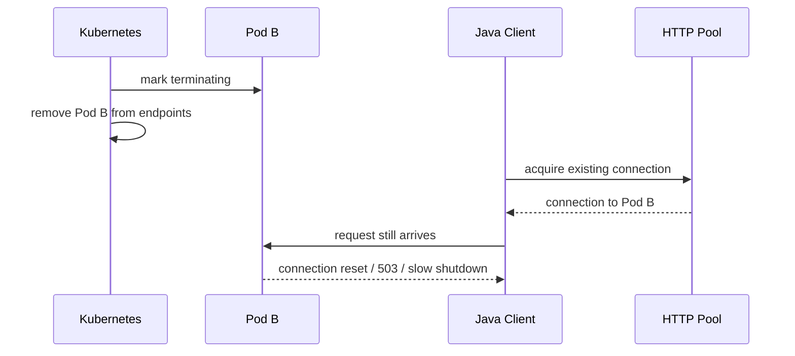
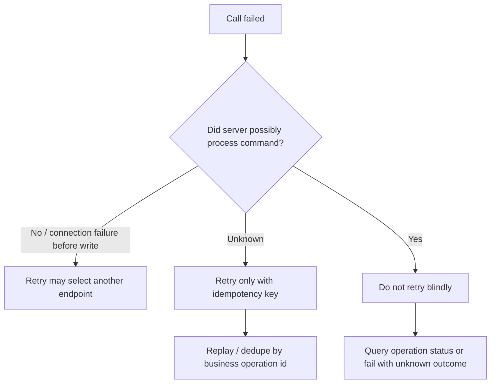
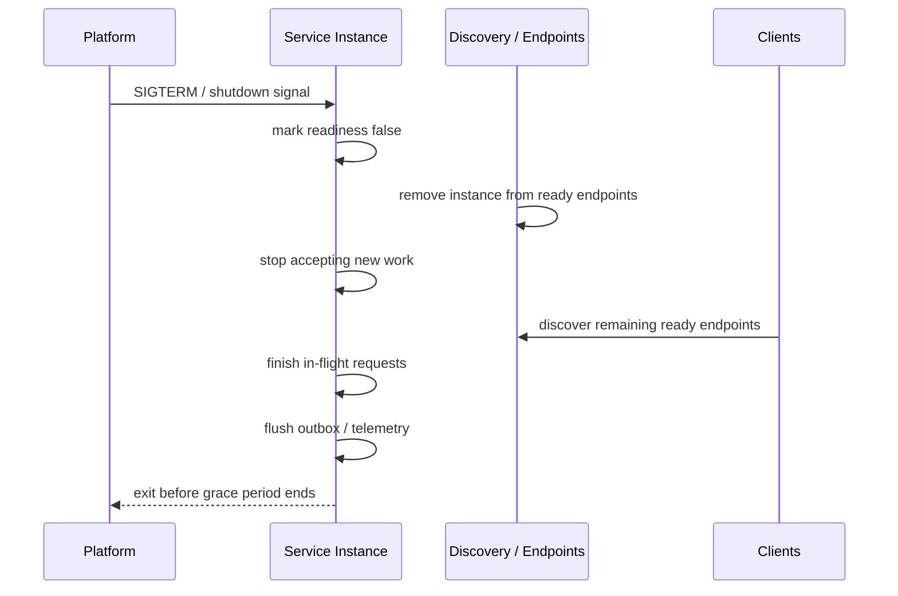

# Part 063 — Service Discovery and Client-Side Behavior

## 1. Core idea

Service discovery is not "how one service gets another service's URL".

That is the shallow explanation.

In a real microservices system, service discovery is the runtime mechanism that answers this question:

> Given a logical dependency, which concrete instance should I call right now, under current topology, health, latency, load, readiness, security, and policy constraints?

That means service discovery is not only a registry concern. It includes:

- naming
- endpoint publication
- endpoint health
- readiness semantics
- DNS behavior
- endpoint caching
- connection pooling
- client-side load balancing
- timeout policy
- retry policy
- stale endpoint handling
- graceful shutdown behavior
- traffic shifting
- observability
- security identity

A weak service discovery design creates failures that look random:

- one pod is removed but clients still call it
- DNS resolves, but connection reuse still hits a draining instance
- load balancer sends traffic to a pod that is alive but not ready
- clients retry against the same bad endpoint
- rolling deployment causes short bursts of 503
- service mesh and application clients both retry
- Java DNS cache hides topology changes
- HTTP connection pools outlive endpoint health
- the registry says "healthy" but the dependency is overloaded

The important rule:

> Discovery returns candidates. Client behavior determines whether those candidates are used safely.

A top-tier engineer does not stop at "use Kubernetes Service" or "use Eureka". They ask: what happens during rollout, overload, DNS cache expiry, endpoint removal, node failure, network partition, certificate rotation, and partial dependency failure?

---

## 2. The discovery pipeline

A runtime call is a pipeline, not a single lookup.



Each stage has a distinct failure mode.

| Stage | Common failure | Architectural control |
|---|---|---|
| Naming | Ambiguous service identity | Stable service names and ownership catalog |
| Resolution | Stale DNS / registry state | TTL discipline, readiness, re-resolution policy |
| Candidate list | Unready or draining endpoint | Readiness gates, endpoint removal, graceful shutdown |
| Selection | Uneven load | Load-balancing policy, connection management |
| Connection | Reused connection to bad instance | Max connection lifetime, idle eviction, channel health |
| Call execution | Slow dependency consumes threads | Deadlines, timeout, concurrency limits |
| Outcome handling | Retry storm | Retry budget, idempotency, backoff, jitter |
| Telemetry | No visibility into selected endpoint | Low-cardinality endpoint metrics and tracing attributes |

Discovery is useful only if the client is disciplined.

---

## 3. Logical dependency vs physical endpoint

A service should not hardcode physical instances.

Bad:

```yaml
caseProfile:
  baseUrl: http://10.12.4.71:8080
```

Better:

```yaml
caseProfile:
  serviceName: case-profile-service
```

But the logical name alone is not enough.

A production-grade dependency contract should define:

```yaml
dependencies:
  case-profile-service:
    protocol: http
    purpose: "Resolve subject profile summary for case intake and review screens"
    criticality: required-for-write
    discovery: kubernetes-dns
    connectTimeout: 250ms
    responseTimeout: 1200ms
    maxConcurrency: 80
    retry:
      enabled: true
      maxAttempts: 2
      retryOn:
        - connect-timeout
        - connection-reset-before-write
        - 503
      backoff: exponential-jitter
    idempotencyRequired: true
    fallback:
      mode: fail-closed
    owner: party-domain-team
```

The dependency contract makes runtime behavior explicit.

Without it, every service invents its own network behavior.

That becomes chaos.

---

## 4. Kubernetes DNS-based discovery

In Kubernetes, a common discovery model is:

```txt
client pod -> DNS name -> Kubernetes Service -> selected backend Pod endpoints
```

Example in-cluster URL:

```txt
http://case-profile-service.case-management.svc.cluster.local:8080
```

Usually the short name is enough inside the same namespace:

```txt
http://case-profile-service:8080
```

A simplified flow:



Important mental model:

> Kubernetes Service discovery gives you a stable service address. It does not automatically make your application-level behavior correct.

Kubernetes can remove unready pods from Service endpoints, but your Java process may still have:

- old DNS cache entries
- old HTTP keep-alive connections
- old HTTP/2 channels
- queued requests
- retries that target the same dependency
- long-running calls during shutdown

So you still need client-side discipline.

---

## 5. ClusterIP Service vs headless Service

Two common patterns:

```txt
ClusterIP Service:
  client resolves stable service name
  traffic goes through service virtual IP / platform load balancing
```

```txt
Headless Service:
  client resolves individual pod endpoints
  client or library decides which endpoint to call
```

### ClusterIP Service

Good default for most Java microservices.

Advantages:

- simple service name
- stable virtual address
- endpoint changes hidden from application
- platform manages routing to ready endpoints
- less application code

Risks:

- client may not know which backend instance was selected
- connection pooling may reduce actual balancing fairness
- platform load balancing does not know business criticality
- retries may still amplify load

### Headless Service

Useful when clients need individual endpoints.

Common examples:

- stateful systems
- peer-aware clients
- databases/queues with special topology
- gRPC client-side balancing in some setups
- custom load-aware routing

Risks:

- more client complexity
- stale endpoint list risk
- endpoint selection responsibility moves to application/client library
- more failure modes during scale/down/rollout

Default rule:

> Use the simplest platform-managed discovery model unless the client has a real reason to understand individual instances.

Do not choose headless discovery because it feels more "microservice-native".

---

## 6. Client-side load balancing vs server-side load balancing

There are two broad models.

### Server-side / platform load balancing



The client calls a stable address. A platform component selects the instance.

Examples:

- Kubernetes Service
- cloud load balancer
- ingress controller
- API gateway
- service mesh proxy

### Client-side load balancing



The client obtains a list of instances and chooses one.

Examples:

- Spring Cloud LoadBalancer
- gRPC name resolver and load-balancing policy
- client library for stateful backend
- custom resolver over service registry

### Decision model

| Question | Prefer platform LB | Prefer client-side LB |
|---|---:|---:|
| Do clients need per-instance awareness? | No | Yes |
| Is simple operational model more important? | Yes | No |
| Is endpoint topology special/stateful? | No | Yes |
| Do you need weighted, locality-aware, or load-aware policy at app level? | Sometimes | Often |
| Can teams safely maintain client behavior? | Not required | Required |
| Is service mesh already standard? | Often | Sometimes |

Client-side load balancing is not automatically better.

It moves correctness into the client.

---

## 7. Service registry is not service discovery by itself

A registry stores or exposes service instance data.

Discovery is the end-to-end behavior using that data.

A registry may provide:

- service name
- instance host/port
- metadata
- health status
- zone/region
- version
- weight
- tags

But the caller still needs to decide:

- which endpoint to select
- whether the endpoint is ready enough for this operation
- how long to wait
- whether to retry
- whether to avoid an instance after failure
- whether to prefer same-zone traffic
- how to react to stale registry data

A minimal abstraction:

```java
public interface ServiceEndpointResolver {
    List<ServiceEndpoint> resolve(ServiceName serviceName);
}

public record ServiceEndpoint(
        String serviceName,
        URI baseUri,
        String zone,
        String version,
        Map<String, String> metadata
) {}
```

A selector is separate:

```java
public interface ServiceEndpointSelector {
    ServiceEndpoint select(List<ServiceEndpoint> endpoints, RequestContext context);
}
```

A call policy is also separate:

```java
public record DependencyCallPolicy(
        Duration connectTimeout,
        Duration responseTimeout,
        int maxAttempts,
        int maxConcurrency,
        boolean retryOnlyIfIdempotent
) {}
```

Why separate them?

Because endpoint resolution, endpoint selection, and call execution are different responsibilities.

Mixing them produces clients that are hard to test and impossible to reason about during incidents.

---

## 8. Naming discipline

Service names become runtime contracts.

Bad names:

```txt
misc-service
common-service
case-api
service-a
party-v2
new-case-service
```

Better names:

```txt
case-command-service
case-query-service
party-profile-service
evidence-metadata-service
regulatory-decision-service
notification-dispatch-service
```

A good runtime service name should communicate:

- business capability
- ownership boundary
- expected usage
- not a temporary implementation detail

Naming smell:

| Smell | Why it hurts |
|---|---|
| `common-service` | Usually hides low-cohesion shared logic |
| `core-service` | Becomes god service |
| `*-v2` | Encodes migration accident into identity |
| `api-service` | Says transport, not capability |
| `data-service` | Often becomes cross-domain database wrapper |
| `integration-service` | Too vague unless scoped to an external system |

A service name appears in:

- DNS
- metrics
- traces
- logs
- ACL policies
- dashboards
- runbooks
- incident timelines
- service catalog
- deployment manifests

Treat it as architecture, not a label.

---

## 9. Readiness is part of discovery

A service instance should not receive traffic just because the process is alive.

A useful readiness check answers:

```txt
Can this instance safely accept normal traffic right now?
```

It does not mean:

```txt
Is every dependency reachable right now?
```

Readiness should consider:

- application startup complete
- configuration validated
- essential local resources initialized
- migration compatibility verified if relevant
- HTTP server listening
- thread/concurrency pool not saturated beyond admission threshold
- graceful shutdown not in progress

Readiness should usually avoid deep dependency checks that cause synchronized outage.

Example bad readiness:

```txt
Service A readiness requires Service B, C, D, database, queue, search, cache all healthy.
```

Why bad?

- one optional dependency outage removes healthy pods from traffic
- readiness checks can become dependency load generators
- cascading readiness failure may remove too much capacity
- Kubernetes may stop routing to all pods even though degraded service is possible

Better:

```txt
Readiness = this instance can process requests according to its advertised mode.
Dependency health = exposed separately as diagnostic health/detail metric.
```

A degraded-ready instance is possible if the contract supports degraded behavior.

---

## 10. Stale endpoint problem

Endpoint state changes faster than many clients realize.

Events:

- pod becomes unready
- pod is terminating
- pod is rescheduled
- node fails
- service scales down
- deployment rolls out
- service mesh sidecar restarts
- DNS answer changes
- certificate rotates

But clients may retain:

- DNS cache
- service registry cache
- TCP connection
- HTTP keep-alive connection
- HTTP/2 multiplexed channel
- gRPC channel
- pooled DB connection
- unresolved async work

So a service can keep calling an endpoint that should no longer receive traffic.



Mitigations:

- readiness goes false before shutdown work begins
- termination grace period is long enough
- server stops accepting new requests during drain
- client response timeout is bounded
- connection max lifetime is bounded
- idle connections are evicted
- retry targets can change endpoint if safe
- caller uses idempotency key for retry-safe commands
- dashboards expose endpoint/removal-related error spikes

The platform and the application must cooperate.

---

## 11. Java DNS caching discipline

Java applications can cache DNS results.

That is normally useful.

But in dynamic infrastructure, unbounded or overly long DNS caching can hide topology changes.

Architectural rule:

> Decide DNS cache TTL intentionally. Do not let it be an accidental JVM/runtime default.

Example runtime option:

```bash
-Dnetworkaddress.cache.ttl=30
-Dnetworkaddress.cache.negative.ttl=5
```

This does not mean every service must use 30 seconds.

The right value depends on:

- discovery mechanism
- DNS TTL
- service mesh/proxy behavior
- rollout frequency
- connection pool lifetime
- expected failover time
- operational tolerance for stale endpoints

DNS TTL alone does not solve stale connections.

You also need connection lifecycle policy.

---

## 12. Connection pooling is part of load balancing

HTTP connection pools are necessary.

Without pooling, services waste time and CPU repeatedly opening TCP/TLS connections.

But connection pools influence load distribution.

Common issue:

```txt
Client resolves service address.
Client opens a small number of persistent connections.
Requests reuse those connections.
Traffic distribution follows existing connections more than endpoint list.
```

This is especially visible with:

- HTTP/2 multiplexing
- long-lived gRPC channels
- low number of client replicas
- high request volume per replica
- uneven pod rollout timing
- connection reuse during scale-up

Useful controls:

- max idle time
- max connection lifetime
- max connections per host
- pending acquire timeout
- idle eviction
- connection health check
- channel reconnect policy
- per-dependency pool sizing

Example Reactor Netty style configuration:

```java
ConnectionProvider provider = ConnectionProvider.builder("case-profile-pool")
        .maxConnections(80)
        .pendingAcquireTimeout(Duration.ofMillis(200))
        .maxIdleTime(Duration.ofSeconds(30))
        .maxLifeTime(Duration.ofMinutes(5))
        .evictInBackground(Duration.ofSeconds(30))
        .build();

HttpClient httpClient = HttpClient.create(provider)
        .option(ChannelOption.CONNECT_TIMEOUT_MILLIS, 250)
        .responseTimeout(Duration.ofMillis(1200));

WebClient client = WebClient.builder()
        .clientConnector(new ReactorClientHttpConnector(httpClient))
        .baseUrl("http://case-profile-service")
        .build();
```

Numbers here are examples, not universal defaults.

The decision belongs to the dependency contract.

---

## 13. Client-side behavior policy

Every dependency needs a policy.

Not every dependency should be treated the same.

Example:

| Dependency | Criticality | Retry | Fallback | Timeout | Notes |
|---|---|---:|---|---:|---|
| `regulatory-decision-service` | write-critical | limited | fail-closed | short | Duplicate decision is unacceptable |
| `party-profile-service` | read-critical | yes | degraded summary | medium | Profile data can be stale for some screens |
| `notification-dispatch-service` | async side-effect | via outbox | queue | async | Do not block primary workflow |
| `audit-event-service` | compliance-critical | durable outbox | fail-safe buffer | async | Losing audit event is unacceptable |
| `search-index-service` | eventually consistent | yes | skip/rebuild | async | Projection can be reconciled |

A dependency call policy should include:

```yaml
clientPolicy:
  timeout:
    connect: 250ms
    response: 1200ms
  concurrency:
    maxInFlight: 80
    pendingAcquireTimeout: 200ms
  retry:
    maxAttempts: 2
    backoff: 100ms..400ms with jitter
    onlyIdempotent: true
  circuitBreaker:
    enabled: true
    failureRateThreshold: 50
    minimumCalls: 50
  fallback:
    mode: degraded-read-only
  telemetry:
    dependencyName: case-profile-service
    recordStatusFamily: true
    recordTimeouts: true
```

The key is not the YAML.

The key is explicitness.

---

## 14. Retry selection and endpoint choice

A retry should not blindly repeat the same failed path.

If failure happened before the request was accepted, trying another endpoint may be safe.

If failure happened after the command may have been processed, retry needs idempotency.



Endpoint selection on retry should consider:

- was the selected endpoint recently failing?
- is the failure endpoint-local or service-wide?
- is the call idempotent?
- is there remaining deadline budget?
- will retry violate concurrency/rate limit?
- is downstream overloaded?

Bad retry:

```txt
Three attempts, no backoff, same endpoint, no idempotency, no deadline.
```

Better retry:

```txt
At most one retry, only for safe failure classes, with jitter, within original deadline, using idempotency for commands, and with metrics.
```

---

## 15. Discovery and graceful shutdown

Graceful shutdown requires coordination between server and discovery.

A safe shutdown flow:



Common mistake:

```txt
Process receives SIGTERM and immediately exits.
```

Better:

- readiness false first
- drain window begins
- server refuses new long-running work
- in-flight requests finish within deadline
- async consumers stop polling
- outbox publisher stops safely
- app exits before platform force-kills it

If clients keep long-lived connections, make sure they handle:

- GOAWAY frames for HTTP/2 where relevant
- connection close
- reset
- retryable failure classification
- endpoint reselection

---

## 16. Service mesh changes discovery, but does not remove client responsibility

A service mesh may provide:

- mTLS
- service identity
- routing
- traffic split
- retries
- timeouts
- circuit breaking
- metrics
- tracing
- policy enforcement

But application still owns:

- business idempotency
- command semantics
- compensation
- fallback correctness
- data consistency
- user-visible error shape
- deadline meaning
- criticality of dependencies
- audit trail
- domain failure response

Dangerous assumption:

```txt
The mesh handles resilience, so application clients can be naive.
```

No.

The mesh can enforce network policy, but it does not know whether `approveCase()` is safe to retry.

The application must encode business semantics.

---

## 17. Java client adapter design

Do not scatter raw `WebClient`, `RestClient`, `HttpClient`, or gRPC stubs across application code.

Use an adapter behind a port.

```java
public interface PartyProfilePort {
    PartyProfileSnapshot getProfile(PartyId partyId, RequestContext context);
}
```

Adapter:

```java
final class HttpPartyProfileAdapter implements PartyProfilePort {
    private final WebClient webClient;
    private final DependencyPolicy policy;

    HttpPartyProfileAdapter(WebClient webClient, DependencyPolicy policy) {
        this.webClient = webClient;
        this.policy = policy;
    }

    @Override
    public PartyProfileSnapshot getProfile(PartyId partyId, RequestContext context) {
        return webClient.get()
                .uri("/internal/parties/{partyId}/profile-summary", partyId.value())
                .header("X-Correlation-Id", context.correlationId())
                .header("X-Deadline-Ms", Long.toString(context.remainingMillis()))
                .retrieve()
                .onStatus(status -> status.value() == 404,
                        response -> Mono.error(new PartyProfileNotFound(partyId)))
                .onStatus(HttpStatusCode::is5xxServerError,
                        response -> Mono.error(new DependencyUnavailable("party-profile-service")))
                .bodyToMono(PartyProfileSnapshotResponse.class)
                .timeout(policy.responseTimeout())
                .map(PartyProfileSnapshotMapper::toDomain)
                .block();
    }
}
```

This adapter is responsible for:

- protocol details
- path construction
- header propagation
- timeout execution
- error translation
- response mapping
- dependency metrics
- trace attributes
- fallback behavior when allowed

Application service should not know HTTP status codes from another service.

---

## 18. Client-side metrics

Dependency metrics should answer:

```txt
Which dependency is slow, failing, saturated, retrying, or returning degraded responses?
```

Useful labels:

- caller service
- dependency service
- operation name
- status family
- failure class
- retry outcome
- fallback outcome
- timeout type

Be careful with high-cardinality labels.

Avoid:

- full URL
- party ID
- case ID
- user ID
- raw exception message
- pod IP in high-volume metric labels

Metric examples:

```txt
dependency_client_requests_total{dependency="party-profile-service",operation="getProfile",outcome="success"}
dependency_client_duration_seconds_bucket{dependency="party-profile-service",operation="getProfile",le="0.5"}
dependency_client_retries_total{dependency="party-profile-service",operation="getProfile",reason="connect_timeout"}
dependency_client_inflight{dependency="party-profile-service",operation="getProfile"}
dependency_client_fallbacks_total{dependency="party-profile-service",operation="getProfile",mode="degraded"}
```

Tracing attributes:

```txt
peer.service = party-profile-service
rpc.system = http
http.request.method = GET
url.template = /internal/parties/{partyId}/profile-summary
dependency.criticality = read-critical
retry.attempt = 0
fallback.mode = none
```

The point is to make runtime behavior diagnosable.

---

## 19. Common anti-patterns

### 19.1 Hardcoded endpoint

```java
private static final String BASE_URL = "http://10.0.14.22:8080";
```

This breaks topology evolution.

### 19.2 Global HTTP client policy

```txt
Every dependency uses same timeout, retry, pool, fallback, and concurrency limit.
```

This ignores dependency criticality.

### 19.3 Deep readiness dependency chain

```txt
Service is unready if any downstream dependency is down.
```

This can turn one dependency failure into system-wide capacity loss.

### 19.4 No connection lifetime

Long-lived connections never rotate, causing uneven load and stale endpoint risk.

### 19.5 Retry without endpoint awareness

Retrying the same failed endpoint without backoff or idempotency is load amplification.

### 19.6 Registry as source of truth for business health

Registry health is not enough. Business operation health must be measured separately.

### 19.7 Discovery hidden in random utility code

If every team writes its own mini client, behavior diverges and incidents become hard to debug.

---

## 20. Architecture review questions

Ask these before approving service-to-service discovery design:

1. What is the logical dependency name?
2. Who owns the called service?
3. How is the dependency resolved at runtime?
4. Is discovery DNS-based, registry-based, mesh-based, or static config?
5. Does the client call a stable service address or individual endpoints?
6. What is the timeout/deadline policy?
7. What is the connection pool policy?
8. What is the DNS/registry cache policy?
9. What happens when a pod becomes unready?
10. What happens during rolling deployment?
11. What happens when the client has stale connections?
12. What happens when the dependency is overloaded?
13. Is retry allowed for this operation?
14. Is retry idempotent at business level?
15. Can retry select a different endpoint?
16. Is fallback allowed?
17. Is the dependency required, optional, or degraded-capable?
18. Are dependency metrics emitted?
19. Are trace attributes meaningful?
20. Is behavior documented in the service catalog?

---

## 21. Mini case study: Case Intake calls Party Profile

Scenario:

```txt
Case Intake Service needs party profile summary while creating a regulatory case.
```

Naive design:

```txt
POST /cases
  -> call Party Profile synchronously
  -> if Party Profile slow, request waits
  -> retry three times
  -> no idempotency key
  -> if timeout, user retries submit
  -> duplicate case risk
```

Better design:

```txt
POST /cases
  -> require idempotency key
  -> create case as Draft/IntakePendingProfile
  -> call Party Profile with short timeout and deadline
  -> if profile unavailable, store profileResolutionPending task
  -> publish CaseProfileResolutionRequested event
  -> let async worker resolve profile later
```

Discovery policy:

```yaml
dependencies:
  party-profile-service:
    discovery: kubernetes-dns
    endpoint: http://party-profile-service.case-management.svc.cluster.local
    timeout:
      connect: 200ms
      response: 800ms
    retry:
      maxAttempts: 2
      onlyIdempotent: true
      backoff: jitter
    fallback:
      mode: pending-resolution
    pool:
      maxConnections: 60
      maxIdleTime: 30s
      maxLifeTime: 5m
```

Business result:

- case creation remains controlled
- profile dependency does not block entire intake process
- duplicate case risk is reduced
- operational dependency is visible
- unresolved profile becomes explicit workflow state

---

## 22. Fitness functions

You can automate parts of discovery discipline.

Examples:

```txt
No service may call raw IP address in production config.
```

```txt
Every HTTP client dependency must define connect timeout and response timeout.
```

```txt
Every synchronous dependency must have dependency metrics.
```

```txt
Every command endpoint called remotely must document idempotency behavior.
```

```txt
Readiness endpoint must not call more than approved local/essential dependencies.
```

```txt
Every service catalog dependency must declare criticality and fallback mode.
```

ArchUnit-ish example:

```java
@AnalyzeClasses(packages = "com.example.caseintake")
class ClientArchitectureRulesTest {

    @ArchTest
    static final ArchRule application_does_not_depend_on_webclient =
            noClasses()
                    .that().resideInAPackage("..application..")
                    .should().dependOnClassesThat().haveSimpleName("WebClient");
}
```

This forces HTTP details into infrastructure adapters.

---

## 23. Practice exercise

Design the dependency policy for this service:

```txt
Enforcement Case Service depends on:
- Party Profile Service
- Evidence Metadata Service
- Decision Rule Service
- Notification Dispatch Service
- Audit Event Service
```

For each dependency, define:

- purpose
- criticality
- discovery mechanism
- timeout
- retry policy
- idempotency requirement
- fallback mode
- connection pool limit
- observability metrics
- shutdown behavior

Then answer:

1. Which dependencies are allowed inside the synchronous user request?
2. Which dependencies should become async/outbox-driven?
3. Which dependency failure should block the business operation?
4. Which dependency failure should create pending workflow state?
5. Which metrics would show discovery or stale endpoint issues?

---

## 24. Summary

Service discovery is not just name lookup.

It is the runtime collaboration between:

- platform topology
- service identity
- readiness state
- endpoint selection
- connection lifecycle
- Java client behavior
- retry semantics
- graceful shutdown
- telemetry

The main lesson:

> A service name gets you to the dependency. Client behavior determines whether calling it is safe.

Strong microservices architecture treats every dependency as an explicit runtime contract.

Weak architecture hides dependency behavior inside framework defaults.

Framework defaults can start a system.

They cannot safely operate a complex distributed system by accident.
