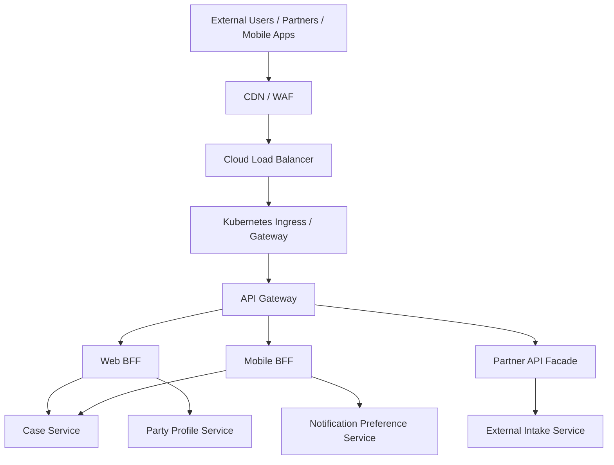
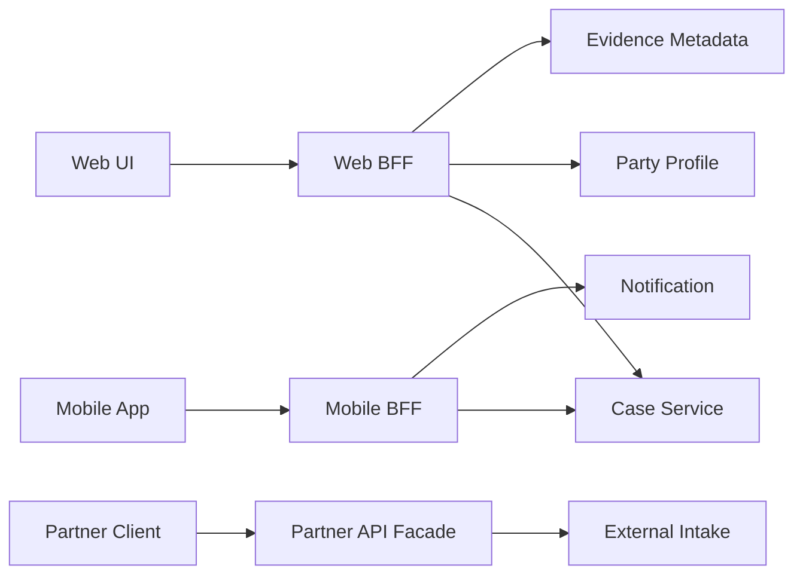
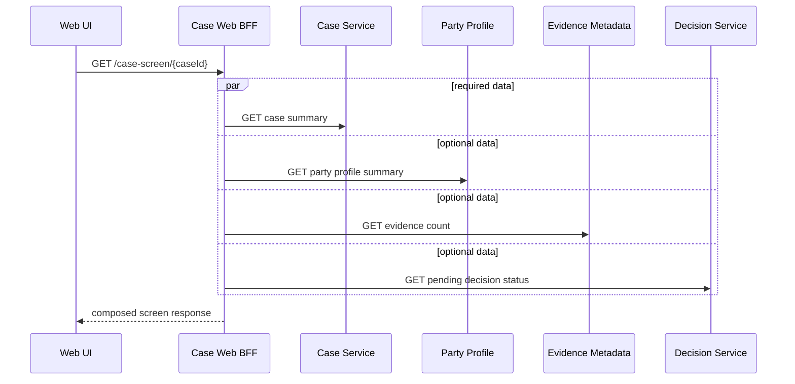
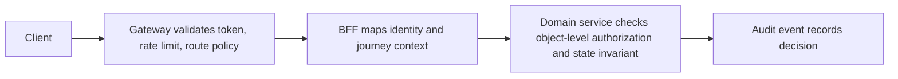
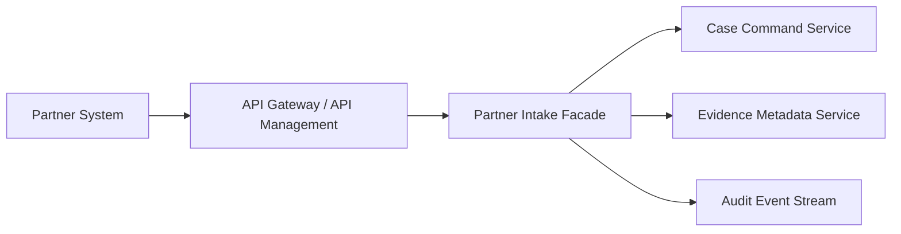

# Part 064 — API Gateway, Edge, and BFF Design

## 1. Core idea

An API gateway is not a place to hide bad service boundaries.

A Backend-for-Frontend is not a dumping ground for UI-specific hacks.

The edge layer exists because external traffic has different concerns from internal service collaboration.

External clients need:

- stable public entry point
- authentication entry
- rate limit and quota
- TLS termination or forwarding policy
- request validation
- routing
- protocol adaptation
- response shaping
- client-specific aggregation
- observability
- abuse protection
- API lifecycle management

Internal services need:

- business capability boundaries
- data ownership
- service-to-service identity
- reliability contracts
- domain-specific APIs
- independent deployability

The edge should protect and adapt.

It should not become the business brain.

The main rule:

> Put edge policy at the edge, client experience adaptation in the BFF, and domain decisions in domain services.

When this rule is violated, the gateway becomes a distributed monolith in disguise.

---

## 2. Terms that must not be confused

| Term | Main responsibility | Should contain business domain logic? |
|---|---|---:|
| Load balancer | Distribute traffic to runtime targets | No |
| Ingress | Route external HTTP/HTTPS traffic into cluster services | No |
| API gateway | Public/internal API entry, routing, cross-cutting edge policy | Minimal, policy only |
| Edge service | Boundary service between outside world and internal platform | Minimal, interface adaptation |
| BFF | Client-specific backend that adapts APIs for one frontend experience | Limited experience orchestration, not domain authority |
| Aggregator | Compose multiple backend responses into one response | No authoritative state mutation |
| Service mesh | Service-to-service traffic management and identity | No business logic |
| Domain service | Own business capability, data, invariant, commands | Yes |

A gateway may implement some aggregator behavior.

A BFF may call an API gateway.

A gateway may run inside Kubernetes behind Ingress.

A service mesh may sit behind gateway.

But responsibilities must remain clear.

---

## 3. Edge topology

A typical topology:



This diagram shows multiple layers.

But not every system needs every layer.

Architecture should be driven by constraints:

- number of client types
- security exposure
- partner integration requirements
- rate limiting needs
- API lifecycle complexity
- aggregation complexity
- team ownership
- latency budget
- regulatory/audit requirements
- deployment topology

Small internal systems may only need:

```txt
Ingress -> Service
```

Large enterprise systems may need:

```txt
CDN/WAF -> API management -> Gateway -> BFF -> Domain Services
```

The wrong architecture is not "too simple" or "too complex".

The wrong architecture puts responsibility in the wrong layer.

---

## 4. What belongs at the gateway

Good gateway responsibilities:

- TLS policy / certificate boundary where appropriate
- host/path routing
- API version routing
- coarse authentication entry
- token validation / identity propagation
- coarse authorization gate where policy is edge-level
- rate limiting
- quota enforcement
- request size limits
- header normalization
- CORS policy
- WAF integration
- request/response compression
- observability enrichment
- correlation ID creation/propagation
- protocol translation when justified
- API key management for partners
- traffic splitting/canary routing
- coarse caching for safe public reads

Bad gateway responsibilities:

- deciding whether a case should be approved
- calculating regulatory risk score
- owning domain entity lifecycle
- writing to multiple service databases
- compensating failed business transactions
- enforcing object-level authorization without domain context
- becoming the only place where validation exists
- hiding breaking service APIs behind ad hoc transformation forever
- joining internal service data for arbitrary reporting
- acting as a shared service SDK over HTTP

The gateway can reject invalid traffic.

It should not become the source of business truth.

---

## 5. Gateway policy vs domain policy

A useful split:

```txt
Gateway policy:
  Can this request enter the system?

Domain policy:
  Is this actor allowed to perform this business action on this object right now?
```

Example:

Gateway can check:

- token exists
- token is valid
- token audience is correct
- client is allowed to call partner API
- request size is within limit
- rate limit not exceeded
- required headers exist

Domain service must check:

- user can access this specific case
- case is in a state where action is allowed
- actor has required role for this workflow step
- tenant owns the requested object
- decision can be made under current policy version
- command does not violate invariant

If object-level authorization is only in the gateway, it will eventually fail.

Why?

Because object-level rules usually need domain state.

The gateway should not own domain state.

---

## 6. BFF mental model

A Backend-for-Frontend is a backend designed for one frontend experience.

It exists because different client experiences often need different API shapes:

- web app wants rich screen composition
- mobile app wants small payloads and fewer round trips
- partner API wants stable public contract
- admin console wants operational commands
- public portal wants stricter exposure and caching



The BFF owns experience composition.

It does not own domain truth.

Good BFF responsibilities:

- screen-shaped query composition
- client-specific DTO shaping
- frontend session support where needed
- feature flag evaluation for UI behavior
- reducing client round trips
- client-specific caching
- anti-corruption for external/partner contract
- protocol adaptation
- response degradation for optional fragments
- user journey telemetry

Bad BFF responsibilities:

- direct database access to domain data
- duplicate business invariant
- write orchestration that should be a workflow/saga
- hidden shared business logic copied across BFFs
- authorization decisions requiring deep domain state
- becoming a "frontend monolith" with all backend behavior

---

## 7. API gateway vs BFF

The API gateway is usually client-neutral or policy-oriented.

The BFF is client-specific.

| Concern | API Gateway | BFF |
|---|---|---|
| Routing | Yes | Sometimes |
| Authentication/token validation | Yes | Sometimes |
| Rate limiting | Yes | Sometimes per journey |
| Client-specific response shape | Rarely | Yes |
| Domain command invariant | No | No |
| Screen composition | No or limited | Yes |
| Partner contract translation | Sometimes | Yes, if partner-specific facade |
| Coarse cache | Yes | Yes |
| Business data ownership | No | No |
| Service aggregation | Limited | Common |
| UX-specific fallback | Rare | Common |

A common topology:

```txt
API Gateway -> BFF -> Domain Services
```

Another valid topology:

```txt
Client -> BFF -> Internal Gateway -> Domain Services
```

Another:

```txt
Partner -> API Management/Gateway -> Partner Facade -> Internal Services
```

Do not argue from labels.

Argue from responsibility.

---

## 8. Edge routing design

Routing should be explicit and boring.

Example route table:

```yaml
routes:
  - id: web-case-bff
    host: app.example.gov
    path: /api/web/cases/**
    destination: web-case-bff
    auth: user-oidc
    rateLimit: user-standard

  - id: mobile-case-bff
    host: mobile-api.example.gov
    path: /api/mobile/cases/**
    destination: mobile-case-bff
    auth: user-oidc
    rateLimit: mobile-standard

  - id: partner-intake-api
    host: partner-api.example.gov
    path: /v1/intake/**
    destination: partner-intake-facade
    auth: partner-mtls-jwt
    rateLimit: partner-contractual
```

Routing smell:

```yaml
path: /**
destination: core-service
```

This says the gateway is hiding an unclear internal architecture.

A route should expose:

- consumer group
- API surface
- authentication mode
- rate limit policy
- destination owner
- version lifecycle
- observability tags
- emergency disable option

---

## 9. API versioning at the edge

Gateway routing is often involved in versioning.

But versioning should not become permanent confusion.

Good edge versioning:

```txt
/v1/partner/case-intake -> partner-intake-facade-v1
/v2/partner/case-intake -> partner-intake-facade-v2
```

Bad edge versioning:

```txt
Gateway silently maps every old field to every new internal service forever.
```

The gateway can help with:

- version route selection
- deprecation headers
- traffic migration
- compatibility windows
- partner-specific contract maintenance
- kill-switch for unsafe old versions

But the lifecycle still needs ownership:

- who owns the public contract?
- how long is compatibility supported?
- how are consumers notified?
- what metrics show remaining v1 usage?
- what is the retirement date?

Example response headers:

```txt
Deprecation: true
Sunset: Wed, 31 Dec 2026 23:59:59 GMT
Link: <https://developer.example.gov/apis/case-intake/v2>; rel="successor-version"
```

---

## 10. Request identity propagation

The edge creates or normalizes request identity.

Common headers:

```txt
X-Request-Id
X-Correlation-Id
traceparent
tracestate
X-Forwarded-For
X-Forwarded-Proto
X-Forwarded-Host
```

Rules:

- accept external correlation ID only if trusted or sanitized
- generate one if missing
- preserve W3C trace context where possible
- do not trust user-controlled forwarding headers unless added by trusted proxy
- log normalized client identity safely
- propagate authenticated subject and workload identity separately
- never encode authorization truth only in arbitrary headers from the outside

Bad:

```txt
Gateway passes X-User-Role from browser to services.
```

Better:

```txt
Gateway validates token, forwards signed/verified identity context, and services enforce domain authorization.
```

Even better in high-assurance systems:

- services validate tokens or mTLS identity themselves
- gateway is not the only trust anchor
- service-to-service authorization is enforced internally

---

## 11. Rate limiting and quota

Rate limiting protects system capacity and business contracts.

It can be applied by:

- IP
- user
- tenant
- client application
- partner
- endpoint
- operation group
- token subject
- API key
- contractual quota bucket

Rate limit types:

| Type | Use |
|---|---|
| Fixed window | Simple, can burst at boundaries |
| Sliding window | Smoother fairness |
| Token bucket | Allows controlled bursts |
| Leaky bucket | Smooth output rate |
| Concurrency limit | Protects in-flight capacity |
| Cost-based limit | Different operations consume different cost |

For microservices, rate limiting should not exist only at the edge.

Use multiple layers:

```txt
Edge rate limit:
  protect public surface and partner contracts

BFF rate limit:
  protect user journey and expensive aggregation

Service concurrency limit:
  protect service instance resources

Dependency limit:
  protect downstream services
```

A common mistake:

```txt
Edge allows 1000 RPS, but one endpoint fans out to 8 services with 2 retries each.
```

Effective downstream load could be far larger than edge traffic.

Rate limit policy must consider fan-out.

---

## 12. Gateway aggregation

Gateway aggregation combines multiple backend calls into one client response.

It can reduce client complexity and round trips.

But it creates fan-out risk.

Example:



Composition contract should classify fragments:

| Fragment | Required? | Timeout | Failure behavior |
|---|---:|---:|---|
| Case summary | Yes | 500ms | fail response |
| Party profile | Usually | 400ms | show partial profile unavailable |
| Evidence count | No | 300ms | show unknown count |
| Pending decision | No | 300ms | hide widget / show stale |

The BFF should make partial failure explicit.

Example response:

```json
{
  "case": {
    "id": "CASE-2026-00019",
    "status": "UNDER_REVIEW"
  },
  "partyProfile": null,
  "evidenceSummary": {
    "count": 12
  },
  "diagnostics": {
    "partial": true,
    "missingFragments": ["partyProfile"],
    "correlationId": "c-019283"
  }
}
```

Do not pretend partial data is complete.

---

## 13. BFF write operations

BFFs often handle commands from UI.

But write orchestration must be controlled.

Acceptable BFF write responsibility:

```txt
Validate request shape -> call one authoritative command endpoint -> map response.
```

Risky BFF write responsibility:

```txt
Call Service A, then Service B, then Service C, then update hidden local state.
```

If a user action requires a multi-step business process, consider:

- domain service command that owns the process
- workflow service
- saga orchestrator
- async command with status polling
- process manager

Bad BFF:

```java
public SubmitCaseResponse submit(SubmitCaseRequest request) {
    caseClient.createCase(request);
    evidenceClient.attachInitialEvidence(request.evidence());
    decisionClient.requestInitialScreening(request.caseId());
    notificationClient.notifySupervisor(request.caseId());
    return new SubmitCaseResponse("OK");
}
```

What happens if `decisionClient` succeeds and `notificationClient` times out?

The BFF now owns a business saga accidentally.

Better:

```java
public SubmitCaseResponse submit(SubmitCaseRequest request) {
    CaseSubmissionResult result = caseCommandClient.submitCase(new SubmitCaseCommand(
            request.idempotencyKey(),
            request.partyId(),
            request.summary(),
            request.evidenceReferences()
    ));

    return SubmitCaseResponse.from(result);
}
```

The authoritative service owns the workflow or emits events.

---

## 14. BFF internal architecture

A BFF still needs good architecture.

Do not let it become a ball of controller code.

Suggested structure:

```txt
com.example.casewebbff
  api/
    CaseScreenController.java
    SubmitCaseController.java
    dto/
  application/
    GetCaseScreenQueryHandler.java
    SubmitCaseUseCase.java
    composition/
      CaseScreenComposer.java
      FragmentPolicy.java
  client/
    casecommand/
    casequery/
    partyprofile/
    evidence/
    decision/
  security/
    IdentityContextMapper.java
  telemetry/
    BffObservationNames.java
  config/
    DependencyPolicies.java
```

The BFF has no domain repository for service-owned data.

It may have:

- short-lived cache
- session store
- user preference cache
- feature exposure config
- response shape mapping
- UI-specific authorization hints

But it should not own authoritative business records.

---

## 15. Java/Spring gateway example

A simple Spring Cloud Gateway-style route intent:

```yaml
spring:
  cloud:
    gateway:
      server:
        webflux:
          routes:
            - id: web-case-bff
              uri: http://web-case-bff
              predicates:
                - Host=app.example.gov
                - Path=/api/web/cases/**
              filters:
                - RemoveRequestHeader=Cookie
                - AddRequestHeader=X-Edge-Route, web-case-bff
```

Real production gateways need more than this:

- authentication
- authorization gate
- CORS
- body size limits
- rate limiting
- timeout
- retry discipline
- response header policy
- trace propagation
- structured access logs
- mTLS or identity propagation
- admin controls
- route ownership metadata

A gateway route should be reviewed like code.

It is production behavior.

---

## 16. Ingress vs API gateway

Kubernetes Ingress commonly handles HTTP/HTTPS routing from outside the cluster to Services.

But Ingress alone is not necessarily a full API management layer.

Ingress concerns:

- external HTTP/HTTPS entry
- host/path routing
- TLS termination depending on controller
- load balancer integration
- controller-specific annotations/features

API gateway concerns:

- API lifecycle
- authentication policy
- rate limit/quota
- request transformation
- tenant/client policy
- developer/partner contract
- API analytics
- cross-cutting resiliency
- edge observability

Sometimes the same product can do both.

Sometimes they are separate.

Do not decide from product names.

Decide from required responsibilities.

---

## 17. Gateway timeout and retry policy

Gateway retry can be dangerous.

A gateway often does not know whether a backend command is safe to retry.

Safe gateway retry candidates:

- idempotent reads
- connection failure before request was sent
- explicitly idempotent command with idempotency key
- retry-aware backend contract

Dangerous gateway retry:

- payment/approval/decision command without idempotency
- POST with side effects and no operation ID
- retry after backend might have processed request
- retry across layered client and mesh retries

A safe policy:

```yaml
edgePolicy:
  timeout: 2s
  retry:
    enabled: true
    maxAttempts: 2
    onlyForMethods:
      - GET
      - HEAD
    onlyForStatus:
      - 502
      - 503
      - 504
    backoff: jitter
```

For command APIs:

```yaml
commandPolicy:
  retryAtGateway: false
  requireIdempotencyKey: true
  backendOwnsRetrySemantics: true
```

Gateway timeout must also fit the end-to-end deadline budget.

If browser timeout is 10s, gateway timeout 30s is meaningless.

---

## 18. Security at the edge

The edge is security-critical because it is exposed.

Controls:

- TLS configuration
- mTLS for partner/integration traffic where required
- JWT/OIDC validation
- API key validation for machine clients where appropriate
- request body size limit
- upload scanning pipeline where relevant
- schema validation for public APIs
- WAF rules
- bot/abuse mitigation
- IP allow/deny lists when justified
- CORS policy
- header sanitization
- rate limiting
- audit/security event logging
- admin endpoint isolation

But remember:

> Edge security is not enough. Internal services must still enforce domain authorization.

Example defense-in-depth:



The gateway can say:

```txt
This authenticated client may call this API family.
```

The domain service says:

```txt
This actor may approve this specific case in this specific state under this policy.
```

---

## 19. Observability at the edge

Edge telemetry should answer:

- who is calling?
- which API route?
- what is the request rate?
- what is rejected before backend?
- what is backend latency?
- what is gateway overhead?
- which client/tenant is consuming quota?
- which version is still used?
- which routes cause fan-out?
- which responses are degraded?

Useful metrics:

```txt
edge_requests_total{route="web-case-bff",status_family="2xx"}
edge_request_duration_seconds_bucket{route="web-case-bff"}
edge_rejections_total{route="partner-intake",reason="rate_limit"}
edge_auth_failures_total{route="partner-intake",reason="invalid_token"}
edge_backend_duration_seconds_bucket{route="web-case-bff",backend="web-case-bff"}
edge_deprecated_api_requests_total{api_version="v1",consumer="partner-x"}
```

Avoid high cardinality:

- raw path with IDs
- full user ID as metric label
- case ID
- request body field values
- raw error message

Structured access log example:

```json
{
  "event": "edge.request.completed",
  "route": "partner-intake-v1",
  "method": "POST",
  "pathTemplate": "/v1/intake/cases",
  "status": 202,
  "durationMs": 183,
  "consumerId": "partner-acme",
  "correlationId": "c-019283",
  "traceId": "4bf92f3577b34da6a3ce929d0e0e4736"
}
```

Access logs are part of audit-adjacent evidence.

Do not log secrets or sensitive payloads.

---

## 20. Partner API facade

Partner APIs need special treatment.

External partners care about:

- stable contract
- predictable versioning
- clear error semantics
- idempotency
- replay safety
- rate limit/quota
- onboarding/offboarding
- auditability
- supportability
- schema compatibility

A partner facade can isolate internal services from partner-specific concerns.



The facade can own:

- public DTO mapping
- partner-specific validation
- idempotency key handling
- partner error code mapping
- callback/webhook protocol
- asynchronous status resource
- public documentation examples

It must not own:

- final regulatory decision
- case lifecycle truth
- evidence truth
- internal workflow state authority

---

## 21. Common anti-patterns

### 21.1 God gateway

Everything flows through one gateway with business logic, data joins, and special cases.

Symptom:

```txt
Changing business process requires gateway deployment.
```

### 21.2 Backend-for-everything

One BFF serves web, mobile, partner, admin, and batch clients.

It becomes a generic backend with client-specific branches everywhere.

### 21.3 Gateway hides service contract chaos

Internal APIs break constantly, and gateway transformations patch over them.

This hides the pain instead of fixing compatibility discipline.

### 21.4 BFF owns distributed transaction

BFF calls several services to complete a command without durable workflow or compensation.

### 21.5 Edge-only authorization

Gateway checks permissions once, then internal services blindly trust all calls.

Object-level authorization eventually fails.

### 21.6 No route ownership

Nobody owns route lifecycle, version retirement, or incident response.

### 21.7 Public API exposes internal service shape

External contract mirrors internal microservice structure.

Now internal refactoring breaks external consumers.

---

## 22. Architecture decision matrix

Use this when deciding edge shape.

| Situation | Recommended shape |
|---|---|
| Single internal web app, low security complexity | Ingress + one BFF may be enough |
| Multiple clients with different UX needs | API gateway + separate BFF per client family |
| Public partner API | API management/gateway + partner facade |
| Heavy screen composition | BFF or query composition service |
| High-volume static/read API | Gateway/CDN caching plus source service contract |
| Complex business workflow command | Domain service/workflow orchestrator, not BFF orchestration |
| Need service-to-service mTLS/retry/telemetry | Service mesh/internal proxy may help |
| Need developer portal/subscription/quota | API management product may be justified |
| Internal event-driven process | Gateway is irrelevant; use messaging/workflow boundary |

---

## 23. Case study: Regulatory case portal

Clients:

- public complainant portal
- investigator web UI
- supervisor dashboard
- partner agency integration
- mobile inspection app

Bad design:

```txt
All clients call Case Service directly.
Case Service exposes endpoints for every screen.
Partner DTOs leak into internal model.
Mobile app receives massive payloads.
Supervisor dashboard causes fan-out from browser.
```

Better design:

```txt
Public Portal -> Public Case BFF -> Case Intake / Evidence Upload / Notification
Investigator Web -> Investigator Case BFF -> Case Query / Party / Evidence / Workflow
Supervisor Dashboard -> Supervisor BFF -> Case Query Read Model / SLA Projection
Partner Agency -> API Gateway -> Partner Intake Facade -> Case Command
Mobile App -> Mobile Inspection BFF -> Inspection Task / Evidence Metadata
```

Boundary logic:

- BFFs own client experience shape
- domain services own commands and invariant
- read models support high-fan-out dashboards
- partner facade protects internal model
- gateway handles public security/rate/version policy

This design is more components than direct calls.

But complexity is placed where it belongs.

---

## 24. Edge/BFF review checklist

Before approving gateway/BFF design, ask:

1. Which clients are served?
2. Is this route public, partner, internal, or admin?
3. Who owns this route?
4. Who owns the destination service?
5. What authentication mode is used?
6. What is checked at the edge?
7. What must still be checked by domain services?
8. Is this a read composition or a write command?
9. Does the BFF call multiple services for one command?
10. Is the operation idempotent?
11. What is the timeout budget?
12. Does gateway retry anything?
13. Are retries safe?
14. What is the rate limit policy?
15. Is fan-out bounded?
16. Is partial response allowed?
17. Are API versions tracked?
18. Is deprecation policy defined?
19. Are sensitive headers sanitized?
20. Are trace/correlation IDs propagated?
21. Are edge rejections observable?
22. Does the public API leak internal model shape?
23. Can this route be disabled during incident?
24. Is route metadata in service catalog?

---

## 25. Fitness functions

Useful automated checks:

```txt
Every public route must declare owner, auth policy, rate limit, and destination.
```

```txt
No route may forward arbitrary external identity headers without normalization.
```

```txt
Every command route exposed externally must require idempotency or documented non-retry policy.
```

```txt
Every deprecated API route must emit version usage metrics.
```

```txt
BFF packages may not depend on persistence adapters for domain-owned databases.
```

```txt
Gateway retry must not be enabled for unsafe methods unless idempotency is enforced.
```

```txt
Every BFF aggregation must classify fragments as required or optional.
```

```txt
Every public route must have request body size limit.
```

The gateway is code.

Treat it like code.

---

## 26. Practice exercise

Design edge architecture for this regulatory platform:

```txt
Clients:
- investigator web app
- supervisor dashboard
- public complainant portal
- mobile inspection app
- partner agency system

Internal services:
- Case Command Service
- Case Query Service
- Party Profile Service
- Evidence Metadata Service
- Workflow Service
- Audit Event Service
- Notification Dispatch Service
```

Create:

1. edge topology diagram
2. route table
3. BFF list
4. partner facade contract
5. timeout policy
6. rate limit policy
7. partial response policy
8. edge observability metrics
9. authorization split between gateway/BFF/domain service
10. anti-patterns you intentionally avoided

Then answer:

- Which clients should not share a BFF?
- Which APIs should be public stable contracts?
- Which screen should use read model instead of fan-out?
- Which commands must avoid BFF orchestration?
- Which failure should degrade UI instead of failing the whole response?

---

## 27. Summary

The edge layer is a boundary between external complexity and internal service architecture.

A good gateway:

- routes clearly
- enforces edge policy
- protects capacity
- propagates identity and telemetry
- supports API lifecycle
- avoids business ownership

A good BFF:

- serves one client experience
- composes reads carefully
- adapts response shape
- handles partial failure honestly
- avoids becoming workflow engine or domain service

The final rule:

> Gateway is for edge policy. BFF is for client experience. Domain service is for business truth.

When those three are separated, microservices remain evolvable.

When they are mixed, the edge becomes the new monolith.
