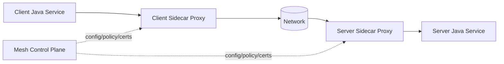
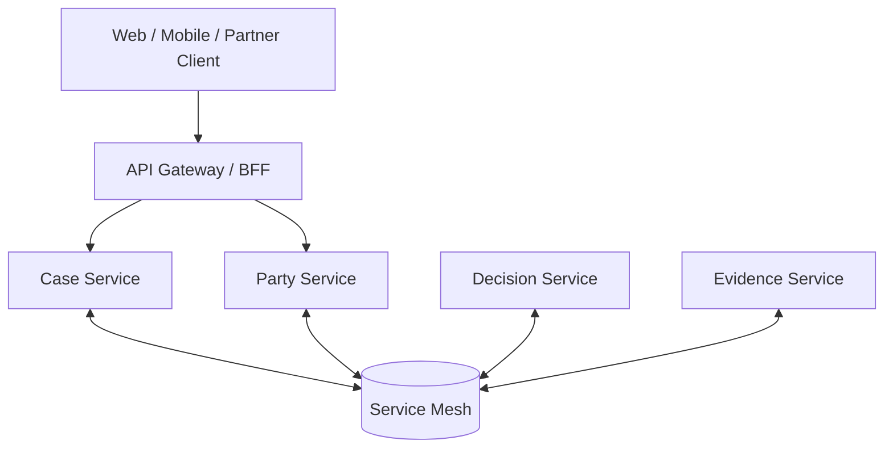
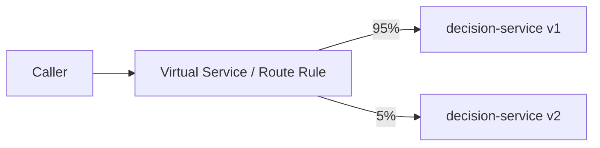
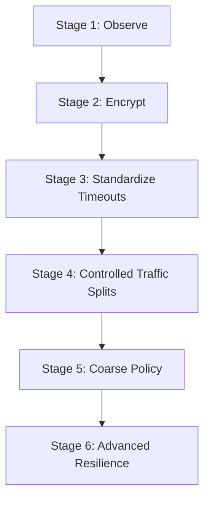
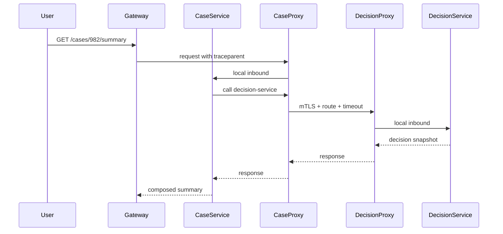

# Part 065 — Service Mesh Pragmatic Usage

## 1. Core Idea

A service mesh is not a replacement for good service design.

A service mesh moves some cross-cutting network behavior out of application code and into the platform layer:

- service-to-service mTLS
- traffic routing
- retry/timeout policy
- circuit breaking / outlier detection
- request telemetry
- identity-aware policy
- traffic split for canary or migration
- connection-level observability

But it cannot understand your business semantics unless you explicitly model them somewhere.

It does not know:

- whether retrying a command is safe
- whether a response can be degraded
- whether a request is high priority
- whether a failure should be compensated
- whether an event is duplicated
- whether a user-visible operation has crossed an SLA
- whether a decision is legally auditable
- whether stale data is acceptable
- whether an external payment/email/regulatory submission has already happened

The pragmatic rule:

> Put transport-level behavior in the mesh. Keep business-level correctness in the application.

If a team adopts service mesh to avoid fixing application contracts, timeout discipline, idempotency, ownership, and observability, the mesh becomes a more expensive way to hide a distributed monolith.

---

## 2. What a Service Mesh Actually Adds

In Kubernetes, services communicate over a dynamic network:

- pods are created and destroyed
- IPs change
- traffic moves through kube-proxy, DNS, ingress, sidecars, gateways, or mesh proxies
- dependencies may be temporarily unavailable
- rollout changes may mix old and new versions
- cross-service calls need identity, encryption, telemetry, and routing

A service mesh typically injects a proxy next to the application process or runs an ambient data-plane model, then controls network behavior through a control plane.

A simplified sidecar model:



From the application point of view, the call may still look like:

```java
CaseSummary summary = caseClient.getCaseSummary(caseId);
```

But the actual runtime path may include:

- local proxy hop
- mTLS handshake / certificate validation
- route matching
- retry policy
- timeout policy
- metrics emission
- trace context forwarding
- load balancing
- outlier detection
- policy check

That additional layer is powerful, but it adds another control surface. A top-level engineer treats the mesh as an architectural component with its own failure modes, not as transparent magic.

---

## 3. Mesh Is Not the Same as API Gateway

A common confusion:

| Concern | API Gateway / Edge | Service Mesh |
|---|---|---|
| Primary traffic | North-south | East-west |
| Typical caller | External client, frontend, partner | Internal service |
| Main responsibility | Edge routing, auth entry point, rate limit, BFF, API product | Service-to-service security, telemetry, traffic policy |
| Business aggregation | Sometimes, carefully | Usually no |
| Identity style | End user, client app, partner | Workload/service identity |
| Main risk | God gateway | Invisible distributed behavior |

A gateway protects and shapes traffic entering the system.

A mesh governs traffic inside the system.

A BFF shapes experience for a client.

A service still owns its own business capability.



The mesh should not become the place where business orchestration hides.

Bad mesh usage:

```text
Gateway calls Service A.
Mesh retries to Service B.
Traffic rule routes 20% to Service C.
A hidden header selects canary behavior.
A proxy-level retry duplicates a non-idempotent command.
Audit trail says only "submit decision failed".
No application knows the actual business state.
```

Good mesh usage:

```text
Application owns command idempotency, business status, and audit outcome.
Mesh owns mTLS, transport timeout, low-level traffic split, and telemetry.
Runbook explains both layers.
```

---

## 4. The Ownership Split

Use this table as the practical design boundary.

| Concern | Mesh can own | Application must own |
|---|---|---|
| mTLS between workloads | Yes | Trust decision based on business identity and authorization |
| Service identity | Workload identity | Mapping workload/action to allowed business capability |
| Timeout | Transport timeout | End-to-end deadline and business timeout semantics |
| Retry | Retry safe transport failures | Idempotency, duplicate detection, unknown outcome handling |
| Circuit breaking | Connection/request outlier control | Fallback business behavior |
| Telemetry | Request metrics, proxy traces | Business outcome, domain event, audit trail |
| Traffic split | Canary routing | Compatibility, migration safety, feature semantics |
| Rate limit | Generic request throttling | Priority, tenant quota, business policy |
| Authorization | Coarse service-to-service policy | Object-level and action-level authorization |
| Encryption | Wire encryption | Data classification, minimization, redaction |
| Failure detection | Endpoint health/outlier detection | Correct degraded mode and compensation |

A useful sentence for architecture reviews:

> The mesh can enforce how packets move; the service must define what the operation means.

---

## 5. Where Service Mesh Is Valuable

### 5.1 Service-to-service mTLS

Without mesh, each service team may implement TLS, cert rotation, trust bundles, and identity validation differently.

With mesh, the platform can standardize:

- workload identity
- mTLS defaults
- certificate rotation
- peer authentication policy
- namespace-level rollout
- service-to-service authorization primitives

This is especially valuable when the organization needs a zero-trust posture.

But mTLS is not authorization by itself.

A request from `case-service` to `decision-service` may be authenticated, but `decision-service` still has to ask:

- Is this calling workload allowed to perform this operation?
- Is the user or system actor authorized?
- Is the specific case accessible?
- Is the decision in a state that allows the transition?
- Is this tenant allowed?
- Is this request traceable?

### 5.2 Uniform telemetry

Mesh-level telemetry can answer:

- Which services call this service?
- What is the request rate?
- What is the success/error rate?
- What is the latency distribution?
- Which dependency is slow?
- Is traffic encrypted?
- Is canary traffic receiving errors?

But application telemetry must answer:

- Which business operation failed?
- Which case lifecycle stage is affected?
- Which tenant is experiencing degradation?
- Which decision state transition failed?
- Which SLA is being violated?
- Which regulatory evidence chain is incomplete?

Mesh telemetry is necessary, not sufficient.

### 5.3 Traffic shaping

Useful mesh-level traffic features:

- percentage-based traffic split
- canary routing
- blue/green switching
- traffic mirroring / shadowing
- fault injection in controlled environments
- route by header for internal testing
- locality-aware routing
- outlier detection

Example canary idea:



The mesh can split traffic.

The application team must still ensure:

- v1 and v2 are API-compatible
- database migrations are expand-contract
- emitted events are backward-compatible
- idempotency semantics did not change
- audit records remain comparable
- rollback does not break in-flight workflow

### 5.4 Platform-level reliability guardrails

Mesh can apply:

- global default timeout
- max request retries
- outlier detection
- connection pool limits
- per-service request limits
- mTLS policy
- telemetry defaults

These guardrails reduce the chance that one under-disciplined service collapses the platform.

But they are guardrails, not correctness.

---

## 6. Where Service Mesh Is Dangerous

### 6.1 Hidden retry amplification

Mesh retries can duplicate non-idempotent operations.

Imagine:

```http
POST /decisions/{decisionId}/approve
```

If the mesh retries this after a transport timeout, the server may process the approval twice or the caller may observe an unknown outcome.

Safe only if the application owns idempotency:

```http
POST /decisions/{decisionId}/approve
Idempotency-Key: approve-case-982-v7
```

And the service stores:

- idempotency key
- request hash
- command outcome
- response replay
- conflict behavior

Mesh retry should not be enabled globally for arbitrary `POST` endpoints.

### 6.2 Timeout layering conflict

A bad design:

```text
User deadline: 2 seconds
Gateway timeout: 60 seconds
Mesh timeout: 15 seconds
Client timeout: 30 seconds
DB timeout: 120 seconds
```

This creates zombie work. The caller gives up, but downstream keeps doing work.

A better design:

```text
User deadline: 2 seconds
Gateway budget: 1900 ms
Service A budget: 1300 ms
Service B budget: 700 ms
DB budget: 300 ms
Mesh per-hop timeout: aligned with caller budget
```

If mesh timeout is longer than application deadline, it is useless.

If mesh timeout is shorter than legitimate application work, it creates false failure.

Deadline must be part of the interaction contract.

### 6.3 Policy drift

Mesh configuration becomes another source of truth.

If route rules, retry rules, circuit breaker rules, and auth policies change independently from code, the production behavior may diverge from the behavior tested in CI.

Symptoms:

- service passes integration tests but fails in cluster
- canary routes unexpected traffic
- retry behavior differs by namespace
- local environment cannot reproduce production failure
- platform policy silently changes latency behavior
- service owner cannot explain traffic path

Mitigation:

- treat mesh policy as versioned artifact
- link mesh policy to service catalog
- validate policy in pre-production
- record ADR for non-default traffic policies
- expose effective policy in runbook
- include mesh config in incident timeline

### 6.4 Observability split-brain

Application dashboard says success.

Mesh dashboard says 5xx.

Possible reasons:

- proxy timeout after app processed request
- app returns 200 with business failure status
- proxy cannot classify domain error
- app emits success before outbox publish fails
- retry hides first failed attempt
- traffic mirror triggers duplicate metrics

Do not assume one telemetry layer is truth.

A production debugging workflow must compare:

- client-side application metrics
- server-side application metrics
- mesh proxy metrics
- gateway metrics
- trace spans
- business outcome metrics
- audit/event state

---

## 7. Pragmatic Mesh Adoption Model

Do not adopt every mesh feature at once.

A safer maturity path:



### Stage 1 — Observe

Start with passive telemetry:

- request rate
- error rate
- latency
- dependency map
- traffic source
- mTLS status if available
- route-level metrics

Goal:

> Learn the actual runtime topology before changing behavior.

### Stage 2 — Encrypt

Enable mTLS gradually:

- namespace by namespace
- service by service
- permissive mode before strict mode
- validate legacy clients
- document exemptions

Goal:

> Standardize service identity and encrypted transport.

### Stage 3 — Standardize Timeouts

Introduce conservative default timeouts.

Do not enable aggressive retries yet.

Goal:

> Prevent infinite waits and zombie requests.

### Stage 4 — Controlled Traffic Splits

Use mesh for canary, dark launch, and migration.

Goal:

> Decouple rollout traffic percentage from deployment event.

### Stage 5 — Coarse Policy

Introduce service-to-service allow rules.

Goal:

> Prevent accidental or unauthorized dependency expansion.

### Stage 6 — Advanced Resilience

Only after understanding the system:

- outlier detection
- retry policy
- circuit breaking
- locality failover
- fault injection
- advanced route selection

Goal:

> Improve reliability without hiding business failure.

---

## 8. Mesh Policy and Java Client Policy Must Be Consistent

A dangerous setup:

```yaml
mesh:
  retries: 3
  perTryTimeout: 500ms
```

```java
webClient.get()
    .uri("/party/{id}", id)
    .retrieve()
    .bodyToMono(PartyDto.class)
    .timeout(Duration.ofSeconds(5))
    .retry(3);
```

Total attempts may become:

```text
Application retry 3 x Mesh retry 3 = up to 9 attempts
```

If the request fans out to 5 dependencies, one user request can generate 45 downstream attempts.

The architecture rule:

> Retry should have a single owner per call path, or the combined budget must be explicitly modeled.

### Retry Ownership Options

| Option | Pros | Cons |
|---|---|---|
| Application-owned retry | Business-aware, idempotency-aware | Requires discipline in every service |
| Mesh-owned retry | Uniform, platform-managed | Can be semantically blind |
| Gateway-owned retry | Useful for safe edge reads | Can hide backend issues |
| No automatic retry | Simple, predictable | Less resilient to transient failure |

Recommended:

- application owns retry for commands
- mesh may own retry for explicitly safe reads
- retry budget is observable
- non-idempotent operations must opt out
- retries must respect caller deadline

---

## 9. Example: Java Service with Mesh-Aware Deadline Discipline

The application should not ignore deadline just because mesh exists.

```java
public final class Deadline {
    private final Instant expiresAt;

    private Deadline(Instant expiresAt) {
        this.expiresAt = expiresAt;
    }

    public static Deadline after(Duration duration, Clock clock) {
        return new Deadline(clock.instant().plus(duration));
    }

    public Duration remaining(Clock clock) {
        Duration remaining = Duration.between(clock.instant(), expiresAt);
        return remaining.isNegative() ? Duration.ZERO : remaining;
    }

    public boolean expired(Clock clock) {
        return !clock.instant().isBefore(expiresAt);
    }
}
```

Application service:

```java
public final class CaseSummaryQueryService {
    private final PartyClient partyClient;
    private final DecisionClient decisionClient;
    private final Clock clock;

    public CaseSummaryView getSummary(CaseId caseId, Deadline deadline) {
        if (deadline.expired(clock)) {
            throw new RequestDeadlineExceeded("No time left before downstream calls");
        }

        Duration downstreamBudget = min(deadline.remaining(clock), Duration.ofMillis(700));

        PartySnapshot party = partyClient.getParty(caseId, downstreamBudget);
        DecisionSnapshot decision = decisionClient.getDecision(caseId, downstreamBudget);

        return CaseSummaryView.from(party, decision);
    }

    private Duration min(Duration left, Duration cap) {
        return left.compareTo(cap) < 0 ? left : cap;
    }
}
```

Client adapter:

```java
public final class PartyHttpClient implements PartyClient {
    private final WebClient webClient;

    @Override
    public PartySnapshot getParty(CaseId caseId, Duration timeout) {
        return webClient.get()
            .uri("/internal/cases/{caseId}/party-snapshot", caseId.value())
            .retrieve()
            .bodyToMono(PartySnapshot.class)
            .timeout(timeout)
            .block();
    }
}
```

Mesh may also enforce a route timeout, but the application remains deadline-aware.

---

## 10. Example: Mesh Route Policy Review

A route policy is architecture, not infrastructure trivia.

Policy example conceptually:

```yaml
apiVersion: networking.istio.io/v1
kind: VirtualService
metadata:
  name: decision-service
spec:
  hosts:
    - decision-service
  http:
    - route:
        - destination:
            host: decision-service
            subset: v1
          weight: 90
        - destination:
            host: decision-service
            subset: v2
          weight: 10
      timeout: 800ms
      retries:
        attempts: 1
        perTryTimeout: 300ms
        retryOn: gateway-error,connect-failure,refused-stream
```

Review questions:

1. Is this endpoint read-only or command-like?
2. Is the endpoint idempotent?
3. Is the total timeout lower than the caller budget?
4. Does the service have application-level timeout too?
5. Are retries counted in metrics?
6. Are retry attempts visible in traces?
7. Does canary version emit compatible events?
8. Does rollback preserve in-flight workflow?
9. Is this policy tested outside production?
10. Is it linked to a service catalog entry?

---

## 11. Service Mesh Capability Map

| Capability | Use it? | Notes |
|---|---:|---|
| mTLS | Yes | Strong default for east-west traffic |
| Workload identity | Yes | Prefer identity over IP trust |
| Dependency telemetry | Yes | Useful for topology and incident diagnosis |
| Traffic splitting | Yes, with rollout discipline | Needs app-level compatibility |
| Timeout | Yes, but align with application budget | Avoid contradictory timeout layers |
| Retry | Carefully | Safe reads only unless idempotency is guaranteed |
| Circuit breaking | Carefully | Must not fight app resilience policy |
| Fault injection | Non-prod or controlled experiments | Needs blast radius controls |
| Authorization | Coarse service-to-service only | Domain/object authorization remains in app |
| Business routing | Usually no | Avoid hidden business logic in route rules |
| Data transformation | No | Belongs in app/API/ACL |
| Workflow orchestration | No | Use workflow engine/application process manager |

---

## 12. Mesh Anti-Patterns

### 12.1 Mesh as Architecture Eraser

Bad thinking:

> We do not need service discipline because the mesh handles microservices.

Reality:

The mesh does not remove:

- bad boundaries
- synchronous chatty calls
- shared database coupling
- non-idempotent commands
- unknown outcome problem
- inconsistent API contracts
- missing audit trail

### 12.2 Retry Everything

Global retry policy is one of the fastest paths to cascading failure.

Retry only when:

- failure is likely transient
- operation is idempotent or safely deduplicated
- retry stays within deadline
- retry budget exists
- downstream is not overloaded
- metrics distinguish original attempts and retries

### 12.3 Mesh as Hidden Authorization Layer

Mesh authorization may say:

```text
case-service can call decision-service
```

It cannot replace:

```text
Investigator A may approve decision D for case C only if:
- investigator belongs to tenant T
- case is assigned to investigator's unit
- decision state is READY_FOR_APPROVAL
- conflict-of-interest policy passes
- approval threshold is satisfied
```

### 12.4 Business Routing in Headers Nobody Owns

Bad:

```text
x-special-routing: high-risk-case
x-decision-policy-version: 2026-beta
```

If these headers affect business behavior, they need:

- contract
- owner
- validation
- tests
- audit
- documentation
- lifecycle

### 12.5 Mesh Config Without Service Owner Review

Changing mesh retry, timeout, or routing can change business outcome.

Platform team and service owner must share responsibility.

---

## 13. Mesh-Aware Observability

A good trace should show both application and proxy behavior.



Metrics you want:

- app request duration
- proxy request duration
- upstream request duration
- retry count
- timeout count
- mTLS success/failure
- route/subset distribution
- outlier ejection count
- service-to-service authorization deny count
- business success/error count

Logs you want:

- service route decision only if business-relevant
- denial reason at coarse level
- correlation ID
- trace ID
- workload identity
- caller service
- target service
- endpoint
- outcome
- retry attempt if visible

Avoid:

- logging full headers with tokens
- logging PII in route labels
- treating mesh metric labels as business dimensions if cardinality explodes

---

## 14. Service Mesh Decision Framework

Adopt service mesh when most of these are true:

- many services communicate internally
- service-to-service security is inconsistent
- dependency telemetry is poor
- platform team can operate the mesh
- teams need standardized traffic policy
- organization can handle extra operational complexity
- service owners agree on policy ownership
- CI/CD can test mesh config
- incident response can debug proxy/application interaction

Do not adopt service mesh just because:

- microservices exist
- architecture diagram looks modern
- teams want to avoid application resilience work
- platform wants uniform control but service owners cannot debug it
- there are only a few services
- existing observability is not understood
- traffic policies are not versioned

---

## 15. Architecture Review Card

Use this before enabling mesh behavior for a service.

```yaml
service: decision-service
mesh_enabled: true

mesh_capabilities:
  mtls: strict
  retries:
    enabled: true
    allowed_endpoints:
      - GET /internal/decisions/{id}/snapshot
    forbidden_endpoints:
      - POST /internal/decisions/{id}/approve
  timeout:
    default: 800ms
    owner: platform + service
  traffic_split:
    enabled: canary-only
    requires_compatibility_review: true

application_guarantees:
  idempotency:
    commands: required
    reads: not_required
  deadline_propagation: required
  trace_context: required
  domain_authorization: required
  audit_event: required_for_commands

observability:
  proxy_metrics_dashboard: link
  app_metrics_dashboard: link
  trace_query: service.name=decision-service
  runbook: link

risks:
  - hidden retry amplification
  - timeout mismatch
  - route policy drift
  - canary compatibility issue

fitness_functions:
  - reject mesh retries for non-idempotent endpoints
  - verify mesh timeout <= application deadline
  - verify mTLS strict in production namespaces
  - verify all traffic policies have owner and ADR
```

---

## 16. Practical Java Rules

1. Do not remove application timeouts because mesh has timeouts.
2. Do not remove idempotency because mesh has retries.
3. Do not remove authorization because mesh has mTLS.
4. Do not remove business metrics because mesh has request metrics.
5. Do not remove audit events because mesh has access logs.
6. Do not put domain routing into mesh headers without a contract.
7. Do not enable retries on commands unless the command is deduplicated.
8. Do not let platform policy silently change application semantics.
9. Do not troubleshoot only the app or only the mesh.
10. Do not treat service mesh as a substitute for service ownership.

---

## 17. Final Mental Model

A service mesh is a **network control plane** for distributed systems.

A Java microservice is a **business capability owner**.

Confusing the two creates invisible architecture.

The mesh should make the platform safer:

- encrypted by default
- observable by default
- time-bounded by default
- routable by default
- policy-aware by default

The application should make the business operation correct:

- idempotent
- authorized
- auditable
- deadline-aware
- semantically explicit
- failure-aware
- compatible across versions

The best architecture is not “everything in the mesh” or “everything in code”.

The best architecture has a clear ownership split.

## References

- Istio Documentation — Traffic Management
- Istio Documentation — Mutual TLS Migration
- Linkerd Documentation — Retries and Timeouts
- Linkerd — What is a service mesh?
- Kubernetes Documentation — Services, Ingress, Probes, Network Policy
- Google SRE — Addressing Cascading Failures
- NIST SP 800-207 — Zero Trust Architecture
