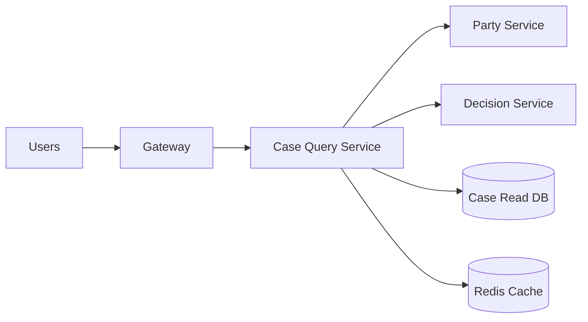
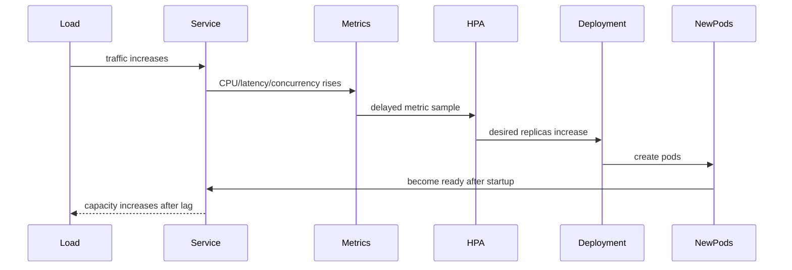
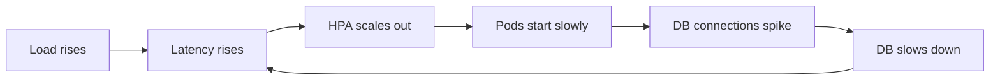

# Part 066 — Horizontal Scaling and Capacity Modeling

## 1. Core Idea

Horizontal scaling means adding more service instances.

Capacity modeling means knowing whether adding instances will actually help.

Many teams confuse the two.

They see high latency and increase replicas.

Sometimes it works.

Often it does not.

Why?

Because replicas only solve a subset of bottlenecks:

- CPU saturation inside service instance
- request concurrency limit per instance
- per-pod queue pressure
- insufficient consumer parallelism
- burst absorption when startup is fast enough

Replicas do not automatically solve:

- database bottleneck
- external API quota
- lock contention
- hot partition
- slow downstream dependency
- thread pool starvation caused by blocking calls
- garbage collection pause
- connection pool exhaustion
- serialized workflow step
- shared cache bottleneck
- Kafka partition limit
- one tenant monopolizing capacity
- global rate limit
- queue backlog with insufficient partitioning
- bad retry policy

A top-level engineer does not ask only:

> How many replicas do we need?

They ask:

> What is the actual limiting resource, what is the required service envelope, and what control loop keeps the system inside that envelope?

---

## 2. Three Quantities You Must Keep Separate

### 2.1 Throughput

Throughput is completed work per unit of time.

Examples:

```text
requests/second
commands/minute
events/second
cases/hour
reports/day
workflow transitions/minute
```

Throughput answers:

> How much work can the system complete?

### 2.2 Concurrency

Concurrency is work in progress.

Examples:

```text
in-flight HTTP requests
active DB transactions
running workflow tasks
consumer records being processed
threads actively blocked on IO
open outbound calls
```

Concurrency answers:

> How many operations exist at the same time?

### 2.3 Latency

Latency is time per operation.

Examples:

```text
p50 = 80 ms
p95 = 350 ms
p99 = 1.2 s
max = 12 s
```

Latency answers:

> How long does one operation take?

The link between them is the most useful first approximation in capacity modeling:

```text
Concurrency ≈ Throughput × Latency
```

This is Little's Law.

Example:

```text
Target throughput: 200 requests/second
p95 latency budget: 250 ms = 0.25 sec

Required concurrent in-flight capacity:
200 × 0.25 = 50 concurrent requests
```

If each Java pod can safely handle 10 concurrent requests for that endpoint, you need at least:

```text
50 / 10 = 5 pods
```

Then add headroom for:

- bursts
- rollout
- zone failure
- uneven load
- GC pauses
- dependency variance
- canary capacity
- metric lag
- autoscaler delay

Maybe production target becomes:

```text
minimum: 6 pods
normal: 8 pods
surge: 12 pods
emergency max: 30 pods
```

---

## 3. The Capacity Envelope

A service does not have a single capacity number.

It has a capacity envelope.

Example:

```yaml
service: case-query-service
endpoint: GET /cases/{id}/summary

latency_budget:
  p95: 300ms
  p99: 800ms

throughput_target:
  normal: 250 rps
  peak: 600 rps
  burst_duration: 5m

instance_capacity:
  safe_rps_per_pod: 60
  max_concurrency_per_pod: 40
  cpu_target: 65%
  memory_limit: 768Mi
  db_connections_per_pod: 8

replica_policy:
  min: 6
  normal: 8
  max: 30
  rollout_max_unavailable: 0
  rollout_max_surge: 25%

bottlenecks:
  database_pool_total_limit: 240
  downstream_decision_service_limit: 1000 rps
  cache_qps_limit: 2000 rps

degradation:
  omit_optional_fragments_after: 250ms
  stale_cache_allowed_for: 60s
```

This is more useful than saying:

> The service scales horizontally.

The envelope defines:

- what “healthy” means
- what “overloaded” means
- what “safe to scale” means
- what “degraded but acceptable” means
- when autoscaling is allowed
- when load shedding is required
- when dependency capacity blocks scaling

---

## 4. Horizontal Scaling Is a Graph Problem

A service can scale only if its dependencies can absorb the additional load.



If `case-query-service` goes from 5 pods to 20 pods:

- DB connections may quadruple
- downstream requests may quadruple
- cache QPS may quadruple
- logs/traces may quadruple
- outbound connection count may quadruple
- retry volume may quadruple

Scaling a node in the graph shifts pressure to connected nodes.

The real question:

> Does the entire dependency path have capacity for the target load?

---

## 5. Per-Pod Capacity Model

A Java pod has finite resources:

```text
CPU
heap
non-heap memory
thread stacks
direct buffers
native memory
file descriptors
network sockets
connection pools
request queue
worker threads
GC budget
```

A simple per-pod model:

```yaml
pod:
  cpu_request: 500m
  cpu_limit: 1000m
  memory_request: 768Mi
  memory_limit: 1Gi

jvm:
  max_heap: 512Mi
  metaspace: 128Mi
  direct_memory: 128Mi
  thread_stack_total_budget: 96Mi
  native_overhead: 128Mi

server:
  max_request_concurrency: 80
  worker_threads: 64
  queue_capacity: 100

database:
  max_pool_size: 8

http_clients:
  decision_service:
    max_connections: 40
    pending_acquire_timeout: 100ms
  party_service:
    max_connections: 30
```

### Why this matters

If you scale to 30 pods:

```text
DB max connections = 30 × 8 = 240
Decision-service outbound max = 30 × 40 = 1200
Party-service outbound max = 30 × 30 = 900
```

If the database can only safely handle 160 connections, `max_pool_size: 8` with `maxReplicas: 30` is invalid.

Horizontal scaling requires multiplication thinking.

---

## 6. CPU-Bound vs IO-Bound Services

### CPU-bound service

Examples:

- heavy JSON transformation
- encryption/signing
- report calculation
- rules evaluation
- compression
- ML inference
- PDF generation

Scaling signal:

- CPU utilization
- CPU throttling
- run queue
- request latency
- GC pressure

Horizontal scaling usually helps until:

- upstream/downstream bottleneck appears
- shared data partition becomes hot
- memory/cache locality is lost
- node CPU is saturated

### IO-bound service

Examples:

- database-heavy query service
- service composition gateway
- external API adapter
- Kafka consumer calling DB
- workflow task handler

Scaling signal:

- in-flight requests
- thread pool saturation
- connection pool saturation
- downstream latency
- queue depth
- consumer lag
- active transactions
- pending acquire count

CPU may be low while latency is high.

For IO-bound Java services, CPU-based autoscaling alone often reacts too late or not at all.

---

## 7. HPA Mental Model

Kubernetes Horizontal Pod Autoscaler adjusts replica count based on observed metrics.

At a simplified level:

```text
desiredReplicas = currentReplicas × currentMetric / targetMetric
```

Example:

```text
current replicas: 4
current CPU utilization: 80%
target CPU utilization: 50%

desired replicas = 4 × 80 / 50 = 6.4 -> 7
```

Important implications:

- HPA is reactive
- metrics are delayed
- pod startup takes time
- readiness takes time
- traffic redistribution takes time
- scaling down should be slower than scaling up
- CPU utilization is not always the right proxy
- missing metrics can affect scale behavior
- scale-up may be limited by cluster capacity
- new pods may not be useful until warm



Autoscaling lag means you need headroom.

If traffic jumps faster than the autoscaler can respond, the service must use:

- queue limit
- load shedding
- degraded response
- priority admission
- pre-warmed capacity
- scheduled scaling
- predictive scaling
- event-driven scaling

---

## 8. Choosing the Right Scaling Signal

### Bad signal

```text
Scale service on average CPU only.
```

This may fail when:

- IO latency grows but CPU stays low
- one pod is hot while average looks fine
- thread pool is exhausted
- DB pool is saturated
- queue is growing
- tail latency is violating SLO
- consumer lag grows
- work is blocked on external dependency

### Better signals by workload

| Workload type | Useful scaling signals |
|---|---|
| CPU-bound HTTP | CPU, p95 latency, in-flight requests |
| IO-bound HTTP | concurrency, pending queue, p95 latency, connection-pool saturation |
| API composition | fan-out latency, downstream saturation, optional-fragment timeout count |
| Kafka consumer | consumer lag, oldest record age, processing duration, partition count |
| Workflow worker | task queue depth, schedule-to-start latency, activity duration |
| Batch job | backlog size, deadline miss risk, worker utilization |
| Tenant-heavy SaaS | per-tenant throughput, noisy-neighbor metric, tenant quota |
| DB-heavy service | DB pool utilization, query latency, active transactions |
| External API adapter | external rate-limit remaining, throttled count, circuit-open count |

CPU is useful, but it is not the universal truth.

---

## 9. Java Threading and Capacity

### Thread-per-request model

Classic servlet service:

```text
one request occupies one server thread while processing
blocking DB call occupies that thread
blocking HTTP call occupies that thread
```

If you have:

```text
max server threads = 200
average latency = 250 ms
```

The rough maximum throughput at full occupancy:

```text
throughput ≈ concurrency / latency
throughput ≈ 200 / 0.25 = 800 rps
```

But full occupancy is unsafe.

Safe target may be 50–70% depending on latency variance.

### Reactive/non-blocking model

Reactive service can handle many concurrent IO operations with fewer threads, but it is not infinite capacity.

It is still limited by:

- event loop saturation
- connection pools
- memory
- backpressure
- downstream capacity
- CPU-bound blocking accidentally placed on event loop
- serialization/deserialization cost

Do not use reactive programming to hide missing capacity modeling.

### Virtual threads

Virtual threads can simplify high-concurrency blocking-style code, but they also do not remove bottlenecks.

They make parked blocking cheaper, but still require:

- connection pool discipline
- concurrency limits
- timeout discipline
- memory awareness
- downstream capacity limits
- backpressure

The architecture rule:

> Cheaper concurrency does not mean unlimited work.

---

## 10. Database Connection Math

This is one of the most common scaling failures.

Assume:

```text
pods = 20
Hikari maxPoolSize = 20
```

Total possible connections:

```text
20 × 20 = 400
```

If DB max connections is 300 and other services use it too, the service can overload the database by scaling.

A safer model:

```yaml
database_capacity:
  total_safe_connections: 240
  reserved_for_admin: 20
  reserved_for_other_services: 100
  available_for_case_service: 120

case_service:
  max_replicas: 20
  db_pool_per_pod: 6

total_case_service_connections: 20 * 6 = 120
```

Design rule:

> `maxReplicas × poolSize` must be lower than the dependency capacity budget.

The same applies to:

- HTTP outbound connection pools
- Redis connections
- Kafka producer/consumer connections
- external API rate limit
- workflow worker slots
- thread pools
- object storage concurrency

---

## 11. Scaling Async Consumers

Async consumers have a different capacity shape.

For Kafka-like processing:

```text
throughput = partitions × effective processing rate per partition
```

Adding more consumer pods beyond partition count may not increase throughput.

Example:

```text
topic partitions: 12
consumer pods: 4
threads per pod: 3
max useful parallelism: 12
```

Scaling to 20 pods does not help if only 12 partitions exist.

Useful metrics:

- consumer lag
- oldest message age
- processing duration
- commit latency
- retry topic depth
- DLQ rate
- partition skew
- poison message count
- downstream saturation
- per-tenant lag

Scaling rule:

> Async scaling is bounded by partitioning, ordering requirements, and downstream capacity.

---

## 12. Scaling Workflow Workers

Workflow workers process tasks from a queue.

Capacity depends on:

- worker count
- worker slots
- activity duration
- retry behavior
- external dependency capacity
- task queue partitioning
- schedule-to-start latency
- timeout policy

Useful capacity model:

```yaml
workflow_worker:
  worker_pods: 10
  activity_slots_per_pod: 20
  total_slots: 200
  average_activity_duration: 2s
  rough_throughput: 100 activities/s
```

But if each activity calls a DB and DB only supports 50 concurrent operations, the 200 slots are unsafe.

Worker capacity must be capped by dependency capacity.

---

## 13. Scaling Policy Examples

### 13.1 HTTP query service

```yaml
apiVersion: autoscaling/v2
kind: HorizontalPodAutoscaler
metadata:
  name: case-query-service
spec:
  scaleTargetRef:
    apiVersion: apps/v1
    kind: Deployment
    name: case-query-service
  minReplicas: 6
  maxReplicas: 30
  metrics:
    - type: Resource
      resource:
        name: cpu
        target:
          type: Utilization
          averageUtilization: 65
    - type: Pods
      pods:
        metric:
          name: http_server_requests_in_flight
        target:
          type: AverageValue
          averageValue: "40"
  behavior:
    scaleUp:
      stabilizationWindowSeconds: 30
      policies:
        - type: Percent
          value: 100
          periodSeconds: 60
    scaleDown:
      stabilizationWindowSeconds: 300
      policies:
        - type: Percent
          value: 25
          periodSeconds: 60
```

Interpretation:

- keep baseline capacity
- scale on CPU and in-flight requests
- scale up quickly but not infinitely
- scale down slowly to avoid oscillation

### 13.2 Consumer worker

```yaml
scaling:
  minReplicas: 4
  maxReplicas: 24
  signal:
    primary: oldest_unprocessed_message_age
    secondary: consumer_lag
    guardrail: db_pool_saturation < 0.75
  scale_out:
    if_oldest_age_exceeds: 60s
  scale_in:
    only_if_oldest_age_below: 10s
    for: 10m
```

Consumer lag alone is not always enough. Oldest message age often maps better to user/business impact.

---

## 14. The Autoscaling Control Loop

Autoscaling is a feedback control system.

A bad control loop oscillates:



A better control loop has:

- stable metric
- bounded scale-up
- slow scale-down
- warmup time
- readiness gate
- dependency guardrails
- max replica cap
- load shedding before collapse
- SLO feedback
- manual override

Autoscaling must be paired with overload protection.

---

## 15. Capacity Testing Method

Do not guess per-pod capacity.

Measure it.

### Step 1 — Define target scenario

```yaml
scenario: case-summary-query
traffic_shape:
  normal: 250 rps
  peak: 600 rps
  burst: 1000 rps for 2 minutes
payload_mix:
  small_case: 70%
  large_case: 25%
  edge_case: 5%
dependencies:
  decision_service_latency_p95: 80ms
  party_service_latency_p95: 100ms
  db_latency_p95: 50ms
```

### Step 2 — Run single-pod test

Find:

- safe RPS per pod
- p95/p99 latency
- CPU saturation point
- memory growth
- GC behavior
- connection pool saturation
- thread pool saturation
- error rate
- timeout rate

### Step 3 — Run multi-pod test

Verify scaling linearly or identify bottleneck.

```text
1 pod: 60 rps
2 pods: 118 rps
4 pods: 230 rps
8 pods: 370 rps
```

This is not linear. Something starts bottlenecking around 4–8 pods.

### Step 4 — Dependency pressure test

Track:

- DB CPU
- DB connections
- downstream latency
- cache QPS
- external API quota
- network saturation
- log/trace pipeline capacity

### Step 5 — Burst test

Measure:

- autoscaler delay
- queue buildup
- latency spike
- dropped requests
- recovery time
- scale-down behavior

### Step 6 — Failure test

Test:

- one downstream slow
- one pod killed
- one zone unavailable
- DB pool exhaustion
- cache unavailable
- retry storm prevention
- HPA under missing metrics

---

## 16. Capacity Review Checklist

### Service instance

- [ ] CPU request and limit are based on measurement
- [ ] Memory limit includes heap + non-heap + native overhead
- [ ] GC behavior is observed under peak
- [ ] server thread/event-loop configuration is explicit
- [ ] request concurrency is bounded
- [ ] queue capacity is bounded
- [ ] graceful shutdown drains in-flight work

### Dependency budget

- [ ] DB pool per pod multiplied by max replicas is safe
- [ ] outbound HTTP pool per pod multiplied by max replicas is safe
- [ ] downstream service can absorb peak call volume
- [ ] external API quota is modeled
- [ ] Kafka partition count matches desired parallelism
- [ ] retry volume is included in capacity calculation

### Autoscaling

- [ ] scaling signal reflects bottleneck
- [ ] min replicas cover normal traffic and rollout
- [ ] max replicas respect dependency limits
- [ ] scale-up behavior is fast enough for traffic shape
- [ ] scale-down behavior prevents oscillation
- [ ] readiness waits for real capacity
- [ ] startup time is measured
- [ ] metric delay is considered

### SLO

- [ ] p95/p99 latency objective exists
- [ ] error budget impact is understood
- [ ] overload mode is defined
- [ ] degraded behavior is acceptable
- [ ] load shedding threshold exists
- [ ] business priority is modeled

---

## 17. Example: Capacity Calculation for Case Summary API

Requirement:

```text
Normal: 300 rps
Peak: 900 rps
p95 latency budget: 300 ms
Each request calls:
- local read DB once
- party-service once
- decision-service once
```

Measured per-pod safe capacity:

```text
safe rps per pod: 75
safe concurrency per pod: 35
DB pool per pod: 6
party outbound pool per pod: 20
decision outbound pool per pod: 20
```

Replica calculation:

```text
normal pods = ceil(300 / 75) = 4
peak pods = ceil(900 / 75) = 12
```

Add headroom:

```text
normal minReplicas: 6
maxReplicas: 18
```

Dependency check:

```text
DB connections at max = 18 × 6 = 108
Party outbound max = 18 × 20 = 360
Decision outbound max = 18 × 20 = 360
```

If DB safe budget for this service is 80 connections, adjust:

```text
maxReplicas <= 80 / 6 = 13
```

Options:

1. reduce DB pool per pod
2. optimize DB calls
3. introduce read model/cache
4. split read workload
5. increase DB capacity
6. cap max replicas and shed load at peak
7. degrade optional fragments

Architecture thinking:

> The service cannot claim 900 rps peak capacity if dependency budgets only support 650 rps.

---

## 18. Horizontal Scaling Failure Modes

### 18.1 Scaling into the database

Symptom:

- more pods increase DB load
- DB latency rises
- pods wait for DB
- HPA sees CPU/concurrency rise
- HPA adds more pods
- DB gets worse

Fix:

- cap max replicas by DB budget
- introduce DB pool backpressure
- reduce per-pod pool size
- optimize query/index/read model
- separate read/write workload
- load shed before DB collapse

### 18.2 Scaling based on wrong metric

Symptom:

- CPU is low
- latency high
- HPA does nothing

Cause:

- service is IO-bound
- blocked threads
- saturated dependency
- connection pool waiting

Fix:

- scale on concurrency/pending queue
- add dependency guardrail
- fail fast on pool acquire timeout
- improve downstream latency

### 18.3 Startup too slow for spikes

Symptom:

- HPA scales out
- pods take 90 seconds to become ready
- traffic spike lasts 60 seconds
- users see errors before capacity arrives

Fix:

- keep higher minReplicas
- warm critical caches
- improve startup
- scheduled scaling
- predictive scaling
- load shed lower-priority traffic

### 18.4 Scaling async workers beyond partition capacity

Symptom:

- more consumers do not reduce lag

Cause:

- topic has too few partitions
- ordering key too hot
- one partition is overloaded
- downstream DB is bottleneck

Fix:

- repartition
- change key design
- split workload
- isolate hot tenant/entity
- reduce per-record processing time
- improve downstream capacity

### 18.5 Scale-down breaks in-flight work

Symptom:

- HPA scales down
- pods terminate
- in-flight requests fail
- consumers duplicate records
- workflow tasks timeout

Fix:

- graceful shutdown
- readiness false before termination
- preStop delay
- drain consumers
- idempotency
- sufficient termination grace period
- slow scale-down stabilization

---

## 19. Capacity Envelope as ADR

Example ADR summary:

```md
# ADR: Capacity Envelope for Case Query Service

## Context

The service composes case summary data from local read DB, party-service, and decision-service.
Peak load during daily operational review can reach 900 rps.

## Decision

We define:
- min replicas: 6
- max replicas: 13
- CPU target: 65%
- in-flight target: 40 per pod
- DB pool per pod: 6
- max DB connections for service: 80
- optional decision fragment timeout: 120ms
- stale party snapshot allowed for 60s

## Consequences

- Service can handle normal traffic with headroom.
- Peak above approximately 650–750 rps may degrade optional fragments.
- HPA will not scale beyond DB-safe budget.
- SLO must be protected by load shedding and degradation, not unlimited replicas.

## Fitness Functions

- fail CI if maxReplicas * dbPoolSize > 80
- alert if p95 > 300ms for 10m
- alert if DB pool utilization > 80%
- alert if degraded response rate > 5%
```

This is the difference between scaling as configuration and scaling as architecture.

---

## 20. Production Metrics for Capacity

### Per service

- request rate
- p50/p95/p99 latency
- error rate
- in-flight requests
- active threads
- queue depth
- rejected requests
- degraded responses
- timeout count
- retry count
- CPU usage
- CPU throttling
- memory usage
- GC pause
- heap after GC
- direct memory if relevant

### Per dependency

- DB pool active/idle/pending
- DB query latency
- DB errors
- outbound connection active/pending
- downstream latency
- downstream errors
- external API quota remaining
- cache hit ratio
- cache latency

### Per autoscaler

- current replicas
- desired replicas
- scaling limited reason
- metric availability
- scale-up event
- scale-down event
- pod startup time
- readiness time
- pending pods
- node capacity issues

### Per queue

- consumer lag
- oldest message age
- processing duration
- retry topic depth
- DLQ rate
- partition skew
- commit latency

---

## 21. Final Mental Model

Horizontal scaling is not a magic multiplier.

It is a controlled way to add parallel capacity to a bottleneck that is actually parallelizable.

A production-grade Java microservice needs:

- measured per-instance capacity
- explicit latency and throughput targets
- dependency capacity budget
- safe replica envelope
- autoscaling signal tied to bottleneck
- load shedding before collapse
- graceful shutdown during scale-down
- observability for saturation
- ADR for capacity decisions
- tests that validate the envelope

The mature question is not:

> Can this service scale?

The mature question is:

> Which part of this service path scales, which part does not, and what happens when demand exceeds the safe envelope?

If you can answer that, you are doing architecture, not just Kubernetes configuration.

## References

- Kubernetes Documentation — Horizontal Pod Autoscaling
- Kubernetes Documentation — Assign CPU and Memory Resources to Containers and Pods
- Kubernetes Documentation — Resource Management for Pods and Containers
- Google SRE — Addressing Cascading Failures
- Google SRE — Handling Overload
- Spring Boot Documentation — Actuator Metrics
- Micrometer Documentation — Application Metrics
