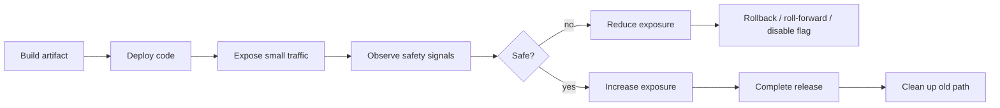
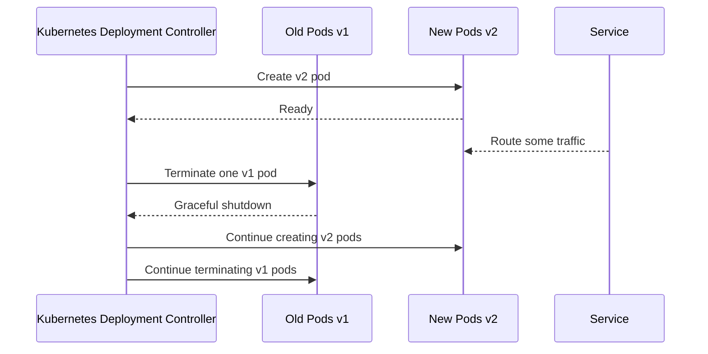
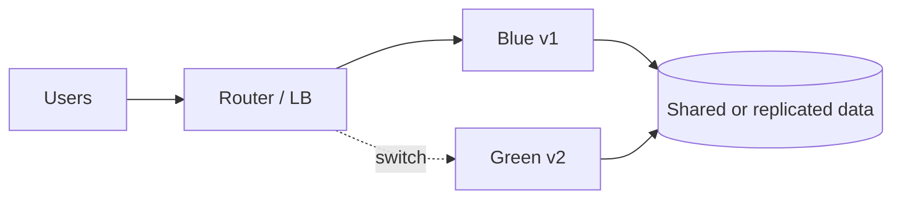
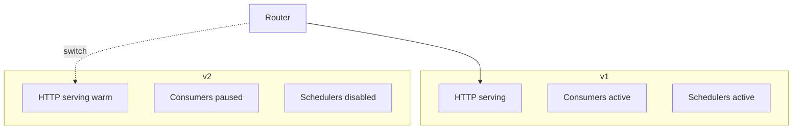
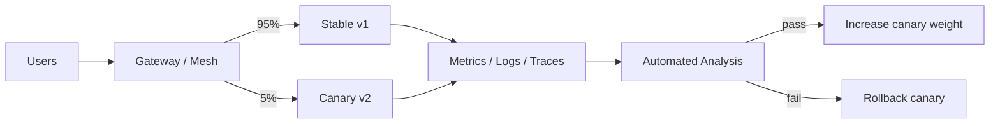
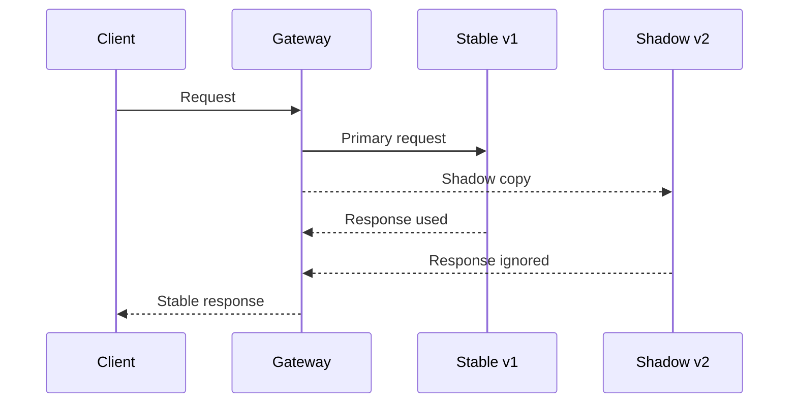
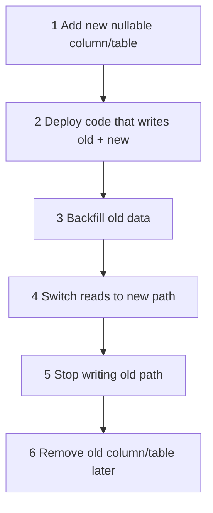
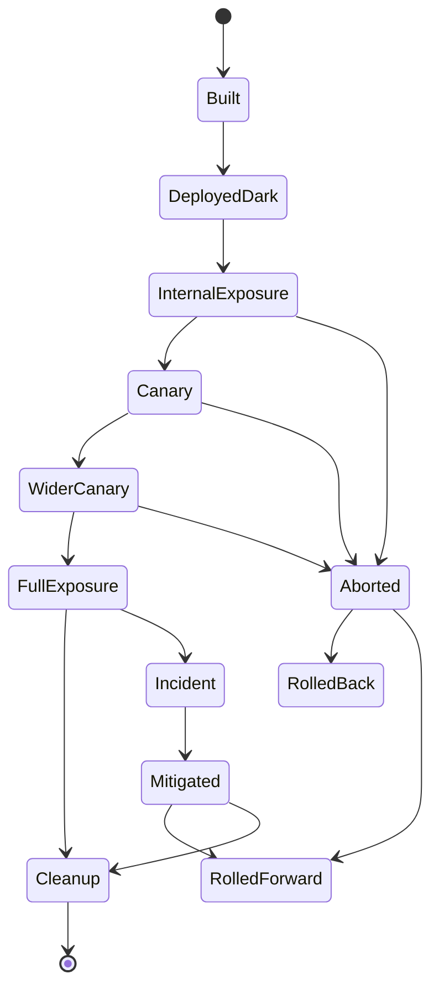
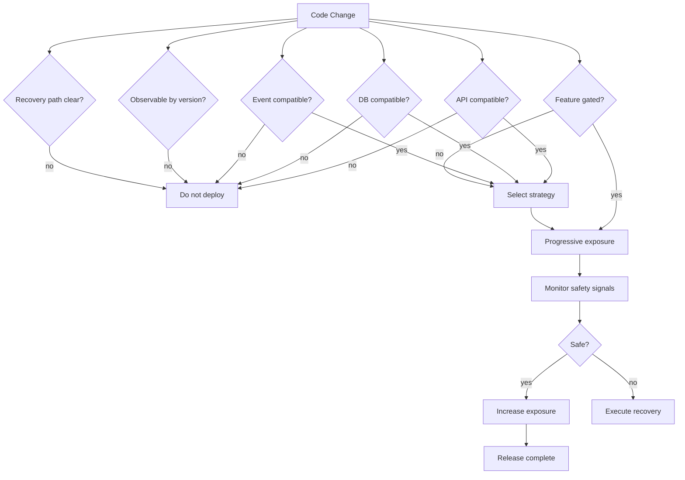

# Part 067 — Deployment Strategies

## 1. Core Idea

Deployment strategy is not only about moving a container image from registry to cluster.

Deployment strategy is the control system for changing production safely.

A weak team asks:

> How do we deploy without downtime?

A stronger team asks:

> How do we expose a change to production gradually, observe its effect, limit blast radius, and recover without corrupting data or breaking consumers?

That distinction matters.

A deployment can be technically successful and architecturally unsafe.

Examples:

- Kubernetes rollout succeeds, but old and new versions cannot coexist.
- Canary traffic looks healthy, but background consumers process incompatible events.
- Blue-green switch works, but database migration is irreversible.
- Rollback starts, but the new version already emitted events old consumers cannot understand.
- Feature flag disables UI behavior, but backend side effects already ran.
- Shadow traffic detects latency, but accidentally triggers writes.

Deployment strategy must therefore be designed together with:

- API compatibility
- database migration
- event schema evolution
- feature flag semantics
- observability
- idempotency
- rollback or roll-forward path
- capacity envelope
- dependency readiness
- operator runbook

Microservices make deployment easier only when services are independently deployable.

Independent deployability does not come from having many repositories.

It comes from compatibility discipline.

---

## 2. Deployment Strategy vs Release Strategy vs Exposure Strategy

These terms are often mixed.

Keep them separate.

| Term | Question | Example |
|---|---|---|
| Deployment | Where is the new code running? | New pods created by Kubernetes Deployment |
| Release | Is the new behavior enabled? | Feature flag turns on new rule for users |
| Exposure | Who receives the new behavior or traffic? | 5% canary traffic, one tenant, internal users |
| Migration | Has dependent state/schema/data moved? | Add nullable column, backfill, switch read path |
| Recovery | How do we return to safe state? | Rollback, roll-forward, disable flag, drain queue |

A top-level engineer does not treat these as one action.

They design them as separate levers.



The safest production changes are not one-way doors.

They are controlled transitions.

---

## 3. Deployment Invariants

Before discussing patterns, define the invariants.

These are the rules every deployment strategy must preserve.

### 3.1 Availability Invariant

During deployment, enough healthy instances must remain available to serve traffic.

This includes:

- request handlers
- async consumers
- scheduler workers
- workflow workers
- dependency clients
- cache warmers

A service is not available merely because the HTTP port is open.

It is available when it can perform its committed work within SLO.

### 3.2 Compatibility Invariant

Old and new versions must coexist during rollout.

This includes:

- API requests
- API responses
- database schema
- events
- cache entries
- scheduled jobs
- background workers
- workflow state
- serialized payloads

If old and new versions cannot coexist, rolling/canary deployment becomes dangerous.

### 3.3 Observability Invariant

You must be able to distinguish behavior by version.

At minimum, telemetry should include:

- `service.name`
- `service.version`
- `deployment.environment`
- `pod.name` or instance id
- route/operation name
- tenant or segment when safe
- canary/stable label
- feature flag state when relevant

Without version-aware observability, canary is theater.

### 3.4 Recovery Invariant

Every deployment must have an explicit recovery path.

Recovery may be:

- rollback to previous image
- roll-forward to patched image
- disable feature flag
- shift traffic back to stable
- stop consumer group
- pause workflow worker
- restore routing rule
- run compensating data repair

A rollback plan that ignores data and events is not a rollback plan.

### 3.5 Data Safety Invariant

New code must not write state that old code cannot safely read unless rollback is no longer allowed.

This is the core rule behind expand-contract migration.

---

## 4. Rolling Deployment

Rolling deployment replaces old instances with new instances gradually.

In Kubernetes, a Deployment with rolling update strategy creates new Pods and removes old Pods while respecting availability constraints such as `maxSurge` and `maxUnavailable`.

Conceptually:



Rolling deployment is the default operational baseline.

It works well when:

- old and new versions are compatible
- startup is predictable
- readiness probes are meaningful
- graceful shutdown is implemented
- schema changes are backward-compatible
- event formats are backward-compatible
- latency/capacity can tolerate mixed versions

It fails when:

- new version requires a schema old version cannot read
- old version emits events new version rejects
- new version changes business invariant abruptly
- two versions run scheduled jobs concurrently
- cache keys change incompatibly
- readiness turns green before warmup is complete
- old pod receives traffic while shutting down

### 4.1 Rolling Deployment Checklist

Before rolling update:

- Can v1 and v2 run at the same time?
- Can v1 read data written by v2?
- Can v2 read data written by v1?
- Can v1 ignore new response/event fields?
- Can v2 tolerate missing old fields?
- Are consumers idempotent?
- Are scheduled jobs singleton-safe?
- Are old pods drained before termination?
- Is readiness tied to actual serving capability?
- Is the rollout observable per version?

Rolling deployment is simple only if compatibility is disciplined.

---

## 5. Blue-Green Deployment

Blue-green deployment runs two complete environments or stacks:

- Blue: current production
- Green: new candidate

Traffic is switched from blue to green when green is ready.



Blue-green is attractive because switching traffic can be fast.

But the hidden difficulty is state.

If blue and green share the same database, then database compatibility becomes the real deployment problem.

If blue and green use separate databases, then synchronization, cutover, and rollback become the real deployment problem.

### 5.1 When Blue-Green Works Well

Blue-green fits when:

- infrastructure can afford duplicate capacity
- traffic can be switched cleanly at gateway/load balancer level
- database migration is backward-compatible
- long-lived sessions are handled
- async consumers are controlled
- background jobs are not duplicated accidentally
- rollback only requires traffic switch, not data reversal

### 5.2 Blue-Green Failure Modes

| Failure Mode | Description | Defense |
|---|---|---|
| Shared DB incompatibility | Green writes data blue cannot read | Expand-contract migration |
| Duplicate workers | Blue and green both run schedulers/consumers | Leader election or traffic-role separation |
| Sticky sessions | Users remain attached to blue | Stateless sessions or session migration |
| Warmup illusion | Green is healthy but cold | Synthetic warmup and readiness gate |
| Rollback trap | Green changes irreversible data | Roll-forward plan or no rollback after point of no return |
| Observability merge | Blue/green metrics mixed | Version/environment labels |

### 5.3 Blue-Green with Role Separation

A common production approach is to separate service roles:

- HTTP serving role
- async consumer role
- scheduler role
- migration role

Do not assume all roles should switch at the same time.



This prevents duplicate side effects during cutover.

---

## 6. Canary Deployment

Canary deployment exposes a small portion of production traffic to the new version.

If safety signals remain healthy, exposure increases.



Canary is useful when:

- traffic can be segmented
- risk is unknown but observable
- new behavior may affect latency/error rate
- feature should be exposed gradually
- rollback should be quick
- automation can decide based on metrics

Canary is weak when:

- service has low traffic
- errors are rare and need large sample size
- impact appears only in async jobs later
- impact is tenant-specific
- impact is data-specific
- canary and stable share mutable state in unsafe ways
- observability cannot separate canary from stable

### 6.1 Canary Safety Signals

Do not analyze only HTTP 5xx.

Use a multi-layer signal set.

| Signal Type | Example |
|---|---|
| Availability | success rate, error rate, timeout rate |
| Latency | p50/p95/p99 by route and dependency |
| Saturation | CPU, heap, GC pause, thread pool, connection pool |
| Business | submission accepted, payment captured, case created |
| Data | validation rejection rate, projection lag, reconciliation mismatch |
| Security | auth failure spike, deny decision spike |
| Dependency | downstream timeout, circuit open, retry count |
| Async | consumer lag, DLQ count, handler failure |

A strong canary analysis compares canary against stable baseline.

It asks:

> Is v2 worse than v1 under similar traffic?

Not merely:

> Is v2 below an arbitrary threshold?

### 6.2 Canary Segmentation

Canary traffic can be selected by:

- random percentage
- internal users
- specific tenant
- specific geography
- specific API route
- specific customer tier
- synthetic traffic
- low-risk workflow path

Random percentage is not always enough.

For enterprise systems, tenant-based or capability-based canary often gives better blast-radius control.

Example:

```yaml
canaryPlan:
  service: case-command-service
  version: 2.17.0
  stages:
    - name: internal-users
      selector: employee=true
      duration: 2h
    - name: pilot-tenant
      selector: tenant=regulator-sandbox
      duration: 1d
    - name: low-risk-case-type
      selector: caseType=advisory
      duration: 1d
    - name: percentage
      weight: 10
      duration: 2h
```

This is more defensible than exposing 10% of all users blindly.

---

## 7. Shadow Traffic

Shadow traffic sends a copy of production traffic to a new version without using its response.



Shadowing is useful for:

- latency testing
- parser compatibility
- dependency call behavior
- CPU/memory behavior
- response comparison
- validation of new read path
- model/scoring comparison

Shadowing is dangerous for writes.

The shadow service must not produce real side effects.

It must not:

- mutate database state
- emit integration events
- call payment/external side-effect APIs
- send emails/SMS
- enqueue real workflow commands
- update caches used by production path

### 7.1 Safe Shadow Design

Use explicit shadow mode.

```java
public enum ExecutionMode {
    PRIMARY,
    SHADOW
}

public final class RequestContext {
    private final ExecutionMode mode;
    private final String correlationId;

    public boolean isShadow() {
        return mode == ExecutionMode.SHADOW;
    }
}
```

Then make side-effect ports enforce it.

```java
public final class EmailNotificationAdapter implements NotificationPort {
    @Override
    public void send(NotificationCommand command, RequestContext context) {
        if (context.isShadow()) {
            throw new IllegalStateException("Shadow execution must not send notifications");
        }
        // send email
    }
}
```

Do not rely on developer memory.

Make illegal side effects fail loudly.

### 7.2 Shadow Comparison

For read-side replacement, compare:

- response shape
- semantic equality
- latency
- dependency calls
- authorization decisions
- redaction behavior
- result ordering
- pagination tokens

Example comparison record:

```json
{
  "comparison_id": "cmp_20260705_00091",
  "operation": "GET /cases/{caseId}/summary",
  "stable_status": 200,
  "shadow_status": 200,
  "semantic_match": false,
  "diff_type": "missing_escalation_flag",
  "stable_latency_ms": 87,
  "shadow_latency_ms": 143,
  "trace_id": "6df4..."
}
```

Shadow traffic should produce evidence, not just confidence.

---

## 8. Feature Flags

Feature flags separate deployment from release.

They allow code to exist in production while behavior remains disabled or selectively enabled.

Feature flags are not only booleans.

They can represent:

- release toggle
- experiment toggle
- permission toggle
- operational kill switch
- migration toggle
- tenant capability toggle
- algorithm version selection
- threshold value

### 8.1 Flag Taxonomy

| Flag Type | Lifetime | Example | Risk |
|---|---:|---|---|
| Release flag | Short | Enable new case summary UI | Stale dead code |
| Experiment flag | Short/medium | Try ranking algorithm B | Biased metrics |
| Ops flag | Long | Disable external enrichment | Misuse as business logic |
| Permission flag | Long | Tenant has advanced workflow | Authorization confusion |
| Migration flag | Short | Read from new projection | Split-brain state |

Each flag needs an owner and removal plan.

A feature flag without expiry becomes hidden architecture.

### 8.2 Backend Flag Discipline

Bad pattern:

```java
if (flags.isEnabled("newFlow")) {
    doNewThing();
} else {
    doOldThing();
}
```

This becomes untestable when repeated everywhere.

Better pattern:

```java
public interface CaseRiskPolicy {
    RiskDecision evaluate(CaseSnapshot snapshot);
}

public final class FlaggedCaseRiskPolicy implements CaseRiskPolicy {
    private final FeatureFlags flags;
    private final CaseRiskPolicy oldPolicy;
    private final CaseRiskPolicy newPolicy;

    @Override
    public RiskDecision evaluate(CaseSnapshot snapshot) {
        if (flags.enabled("risk-policy-v2", snapshot.tenantId())) {
            return newPolicy.evaluate(snapshot);
        }
        return oldPolicy.evaluate(snapshot);
    }
}
```

The flag is localized at a policy boundary.

### 8.3 Feature Flag Failure Modes

| Failure Mode | Explanation | Defense |
|---|---|---|
| Flag drift | Different services evaluate different values | Centralized flag evaluation or propagated decision |
| Flag explosion | Too many combinations | Flag ownership and expiry |
| Untested combinations | Rare combinations fail | Combination testing for critical flows |
| Authorization confusion | Flag treated as permission | Separate feature availability from access control |
| Rollback illusion | Flag disables UI but backend side effects remain | Kill switch at command boundary |
| Stale flag | Old and new paths both live forever | Flag cleanup sprint |

Feature flags are operational power tools.

They require governance.

---

## 9. Database Migration and Deployment

Most deployment strategies fail at the database.

A safe microservice deployment assumes old and new code can run concurrently.

That means schema and data must be compatible across versions.

The common pattern is expand-contract.



### 9.1 Expand-Contract Example

Suppose `case.priority` changes from string to structured value.

Unsafe migration:

```sql
ALTER TABLE cases DROP COLUMN priority;
ALTER TABLE cases ADD COLUMN priority_level INT NOT NULL;
```

This breaks old code.

Safer sequence:

1. Add new nullable columns.
2. Deploy code that writes both old and new fields.
3. Backfill new fields from old data.
4. Verify read parity.
5. Switch reads to new fields.
6. Stop writing old field.
7. Remove old field only after rollback window closes.

```sql
ALTER TABLE cases ADD COLUMN priority_level INT NULL;
ALTER TABLE cases ADD COLUMN priority_reason TEXT NULL;
```

Then in Java:

```java
@Transactional
public void updatePriority(CaseId caseId, Priority priority) {
    CaseRecord record = repository.findForUpdate(caseId);

    record.setPriority(priority.legacyCode());        // old path
    record.setPriorityLevel(priority.level());        // new path
    record.setPriorityReason(priority.reason());      // new path

    repository.save(record);
}
```

This looks redundant.

It is intentionally redundant.

Temporary duplication is the price of safe evolution.

---

## 10. Event Compatibility During Deployment

Events create another deployment axis.

If service v2 emits an event v1 consumers cannot parse, rollback becomes unsafe.

Rules:

- Prefer additive event changes.
- Do not remove fields during compatibility window.
- Do not change field meaning silently.
- Keep event name semantic, not implementation-specific.
- Version only when meaning changes incompatibly.
- Consumers should ignore unknown fields when format supports it.
- Producers should not emit mandatory new fields until consumers are ready.

### 10.1 Event Deployment Sequence

```mermaid
sequenceDiagram
  participant P as Producer
  participant C1 as Consumer A
  participant C2 as Consumer B

  Note over C1,C2: Step 1: Deploy tolerant consumers
  C1->>C1: Can ignore/handle new field
  C2->>C2: Can ignore/handle new field

  Note over P: Step 2: Deploy producer emitting additive field
  P->>C1: Event with old + new field
  P->>C2: Event with old + new field

  Note over P,C1,C2: Step 3: Remove old field only after all consumers migrate
```

Events are not internal implementation details once other services consume them.

They are contracts.

---

## 11. Rollback vs Roll-Forward

Rollback means returning to previous version.

Roll-forward means deploying another version that fixes the problem.

Both are recovery strategies.

Neither is universally better.

### 11.1 When Rollback Is Safe

Rollback is safe when:

- new version did not write incompatible state
- new version did not emit incompatible events
- old version still understands current database schema
- traffic routing can be restored
- old image/config is available
- dependent services do not require the new version

### 11.2 When Rollback Is Unsafe

Rollback may be unsafe when:

- schema migration was destructive
- data was transformed irreversibly
- new version triggered external side effects
- workflow state moved to new format
- events already triggered downstream processing
- security patch must not be reverted

In these cases, prefer roll-forward.

### 11.3 Recovery Decision Matrix

| Situation | Preferred Recovery |
|---|---|
| Pure code regression, no state mutation | Rollback |
| Bad feature behavior behind flag | Disable flag |
| Bad canary metrics before full exposure | Abort canary |
| Incompatible data already written | Roll-forward or data repair |
| External side effect sent | Compensate, do not pretend rollback erases it |
| Security vulnerability in old version | Roll-forward |
| Migration halfway complete | Follow migration runbook |

A rollback button is not a time machine.

---

## 12. Deployment Observability

Every deployment should answer these questions quickly:

- Which version is handling this request?
- Which version emitted this event?
- Which version wrote this database row?
- Which version created this workflow state?
- Which feature flags were active?
- Which canary stage was active?
- Which tenants were exposed?
- Which dependency versions changed?

### 12.1 Required Telemetry Attributes

Use stable attributes in logs, metrics, and traces.

```text
service.name=case-command-service
service.version=2.17.0
deployment.environment=prod
deployment.stage=canary
deployment.ring=pilot-tenant
feature.risk-policy-v2=true
k8s.pod.name=case-command-7b6c9c77d8-x9r2p
```

For business-critical commands, also persist release evidence:

```json
{
  "command_id": "cmd_0192",
  "case_id": "CASE-2026-00018",
  "handled_by_service": "case-command-service",
  "handled_by_version": "2.17.0",
  "deployment_stage": "canary",
  "feature_flags": {
    "risk-policy-v2": true
  },
  "decision_id": "dec_7821"
}
```

This is valuable during incident reconstruction and regulatory review.

---

## 13. Progressive Delivery State Machine

A mature deployment process is a state machine.



Important point:

Not every deployment should jump directly from `Built` to `FullExposure`.

The higher the risk, the more explicit intermediate states you need.

---

## 14. Deployment Strategy Selection Matrix

| Strategy | Best For | Weakness | Required Discipline |
|---|---|---|---|
| Rolling | Normal compatible changes | Mixed-version risk | Backward compatibility |
| Blue-green | Fast switch, infra-level cutover | Duplicate capacity, state complexity | DB compatibility and role control |
| Canary | Gradual traffic exposure | Needs strong metrics/sample size | Version-aware observability |
| Shadow | Read-path validation, latency testing | Write side effects dangerous | Side-effect isolation |
| Feature flag | Separate deploy from release | Flag sprawl | Ownership, expiry, test matrix |
| Ring deployment | Enterprise/tenant rollout | Segment complexity | Tenant-aware routing and support |
| Dark launch | Production runtime validation | Behavior not user-visible | Synthetic/hidden telemetry |

A good platform supports several strategies.

A good architect chooses based on risk.

---

## 15. Java-Specific Deployment Concerns

### 15.1 Startup Time

Java services may have non-trivial startup time due to:

- dependency injection initialization
- class loading
- JIT warmup
- connection pool creation
- schema validation
- cache warmup
- migration checks
- OpenTelemetry instrumentation

Do not mark readiness too early.

### 15.2 Graceful Shutdown

A deployment terminates old pods.

Your service must stop accepting new work before it exits.

Shutdown sequence:

1. Readiness becomes false.
2. Load balancer stops routing new traffic.
3. In-flight requests complete within grace period.
4. Consumers stop polling new messages.
5. Current message handling completes or is safely abandoned.
6. Outbox publisher flushes or checkpoints.
7. Process exits.

### 15.3 Background Workers

HTTP deployment safety is not enough.

For each service role:

- HTTP server
- event consumer
- scheduled task
- workflow worker
- outbox publisher
- projection builder

Define:

- startup readiness
- shutdown behavior
- duplicate-execution safety
- deployment ordering
- version compatibility

### 15.4 JVM Warmup and Canary Metrics

A fresh Java pod may have different latency profile during warmup.

If canary analysis starts immediately after readiness, p99 may look worse due to warmup rather than regression.

Defenses:

- startup probe
- warmup endpoint or synthetic traffic
- canary analysis delay
- compare after stabilization window
- separate cold-start metrics from steady-state metrics

---

## 16. Example: Production Deployment Plan

Scenario:

`case-command-service` introduces new escalation scoring rule.

Risk:

- affects enforcement decisions
- writes decision evidence
- emits `CaseEscalationRecommended`
- depends on new read model field

Deployment plan:

```yaml
change: escalation-score-v2
service: case-command-service
version: 2.18.0
risk: high

preconditions:
  - consumers tolerate new optional event field: score_version
  - database has nullable escalation_score_v2 columns
  - read model backfill complete
  - feature flag default false
  - audit event includes score version

stages:
  - deploy:
      strategy: rolling
      featureFlag: false
  - darkValidation:
      mode: shadow-score-only
      duration: 24h
      compareAgainst: escalation-score-v1
  - internalExposure:
      tenant: internal-sandbox
      featureFlag: true
      duration: 4h
  - pilotTenant:
      tenant: regulator-pilot
      featureFlag: true
      duration: 48h
  - canary:
      traffic: 10%
      duration: 6h
  - fullRelease:
      traffic: 100%

abortCriteria:
  - p95 latency regression > 20%
  - decision mismatch unexplained > 0.5%
  - audit event missing required field
  - DLQ count > 0 for escalation events
  - manual review override spike > 10%

recovery:
  - disable feature flag
  - keep code deployed
  - stop emitting score_version only after consumers confirm safe
  - run reconciliation query for affected cases
```

Notice the release is separated from deployment.

That is deliberate.

---

## 17. Mermaid: Full Deployment Risk Model



---

## 18. Common Anti-Patterns

### 18.1 “Kubernetes Rollout Equals Safe Deployment”

Kubernetes can replace pods.

It cannot guarantee semantic compatibility.

### 18.2 “Rollback Solves Everything”

Rollback does not undo:

- external side effects
- data transformations
- emitted events
- emails sent
- decisions made
- downstream processing

### 18.3 “Feature Flags Everywhere”

Flags scattered through code become hidden architecture.

Localize flags at policy/application boundaries.

### 18.4 “Canary Without Version Labels”

If telemetry does not separate stable and canary, canary analysis is blind.

### 18.5 “Shadow Traffic with Writes Enabled”

Shadow execution must be side-effect safe by construction.

### 18.6 “Migration and Code Deploy in One Step”

If schema migration and code behavior change are coupled into one irreversible operation, recovery becomes fragile.

---

## 19. Architecture Review Checklist

Ask these before approving a deployment-sensitive change.

### Compatibility

- Can old and new versions coexist?
- Are API changes additive?
- Are event changes additive?
- Is database migration expand-contract?
- Can old code read new data?
- Can new code read old data?

### Runtime

- Are readiness/liveness/startup probes correct?
- Is graceful shutdown implemented?
- Are consumers safe during rollout?
- Are scheduled jobs duplicate-safe?
- Are connection pools sized for surge?

### Release Control

- Is behavior behind a flag when needed?
- Is there a staged exposure plan?
- Is tenant/ring selection explicit?
- Is there a rollback or roll-forward plan?
- Is there a point of no return?

### Observability

- Are metrics/logs/traces version-labeled?
- Are business metrics included?
- Are canary/stable compared fairly?
- Are async failures visible?
- Is there a runbook linked to abort criteria?

### Data Safety

- Is migration reversible or forward-fixable?
- Are emitted events compatible?
- Are side effects idempotent?
- Is reconciliation plan ready?
- Is audit evidence preserved?

---

## 20. Practice Exercise

Design a deployment plan for this change:

> `evidence-service` introduces malware scan result classification. The new classification affects whether evidence can be used in an enforcement decision. The service emits `EvidenceScanCompleted`. Existing consumers expect only `clean` or `infected`; new version adds `suspicious`.

Answer these:

1. Is adding `suspicious` compatible?
2. Should the event version change?
3. What should old consumers do?
4. Should deployment be rolling, canary, blue-green, or staged with flags?
5. What telemetry proves the new classification is safe?
6. What is the rollback plan if `suspicious` causes too many blocked cases?
7. What data must be reconciled?
8. What audit evidence is required?

Strong answer:

- Do not emit `suspicious` until all critical consumers tolerate unknown classification or a new event contract is introduced.
- Deploy tolerant consumers first.
- Add classification behind policy flag.
- Shadow classify evidence while still producing old classification.
- Compare decision outcomes.
- Expose to internal/pilot tenant.
- Emit audit event containing classifier version.
- Rollback by disabling policy flag, not necessarily reverting code.
- Reconcile evidence classified during experiment window.

---

## 21. Key Takeaways

- Deployment is code placement; release is behavior exposure.
- Rolling deployment requires mixed-version compatibility.
- Blue-green makes traffic switching easy but state compatibility hard.
- Canary is only useful with version-aware observability and good safety signals.
- Shadow traffic must be side-effect safe by construction.
- Feature flags are architecture, not convenience booleans.
- Rollback is safe only if data/events/side effects remain compatible.
- Expand-contract migration is the default database strategy for safe deployment.
- Deployment strategy must include recovery, not just rollout.

---

## 22. References

- Kubernetes Documentation — Deployments: https://kubernetes.io/docs/concepts/workloads/controllers/deployment/
- Argo Rollouts Documentation: https://argoproj.github.io/rollouts/
- Argo Rollouts Canary Strategy: https://argo-rollouts.readthedocs.io/en/stable/features/canary/
- Microsoft Azure Architecture Center — Gateway Routing / Gateway Patterns: https://learn.microsoft.com/en-us/azure/architecture/patterns/
- Martin Fowler — Feature Toggles: https://martinfowler.com/articles/feature-toggles.html
- OpenTelemetry Documentation: https://opentelemetry.io/docs/
