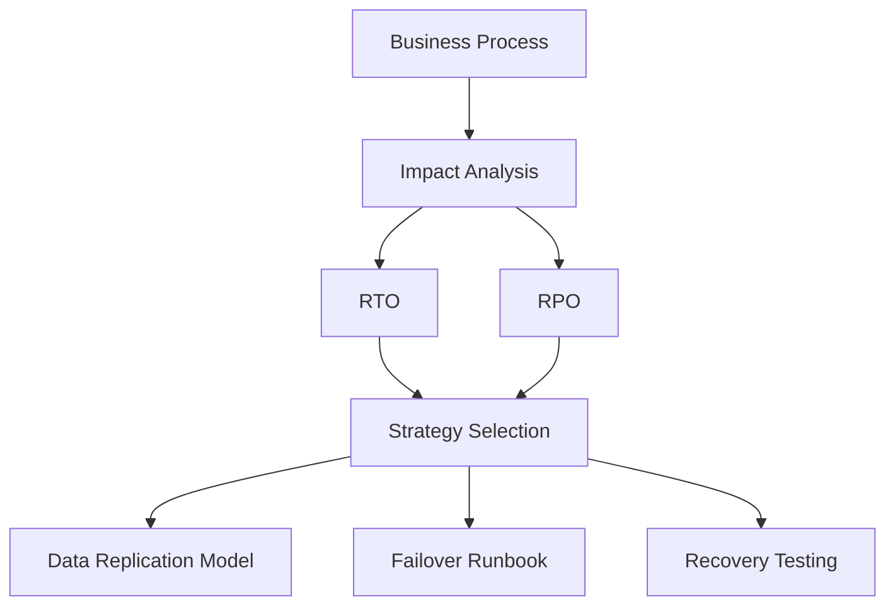
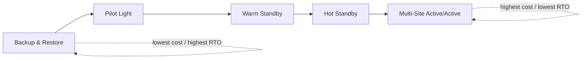
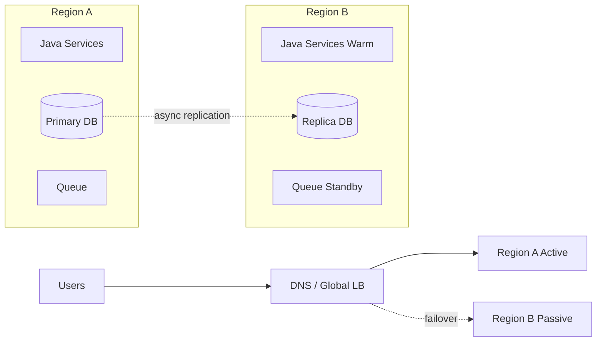
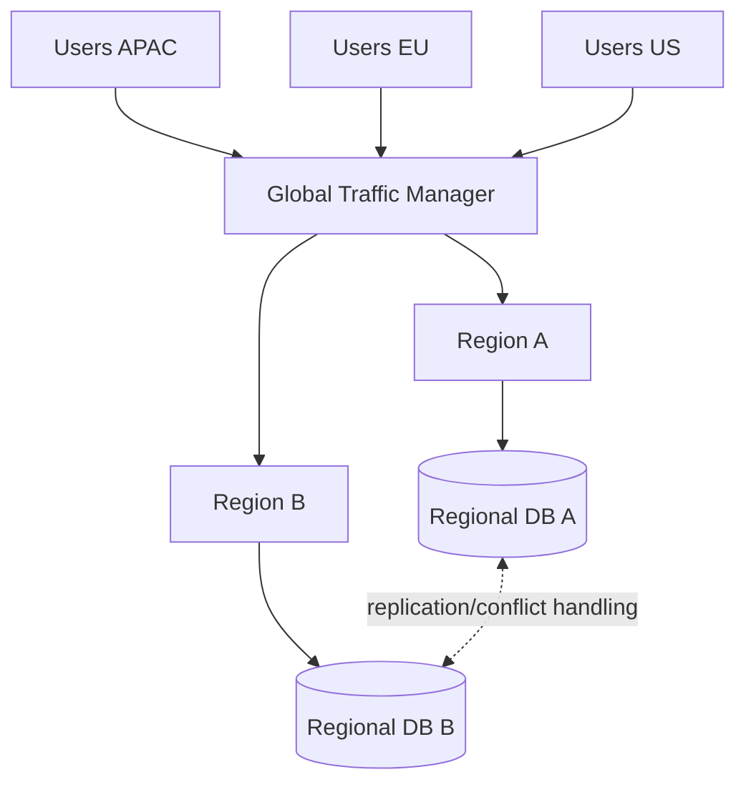
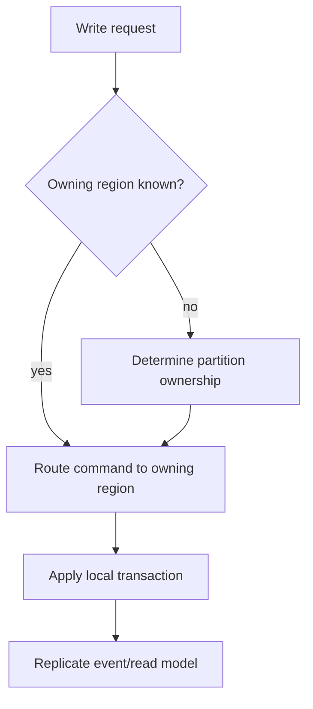
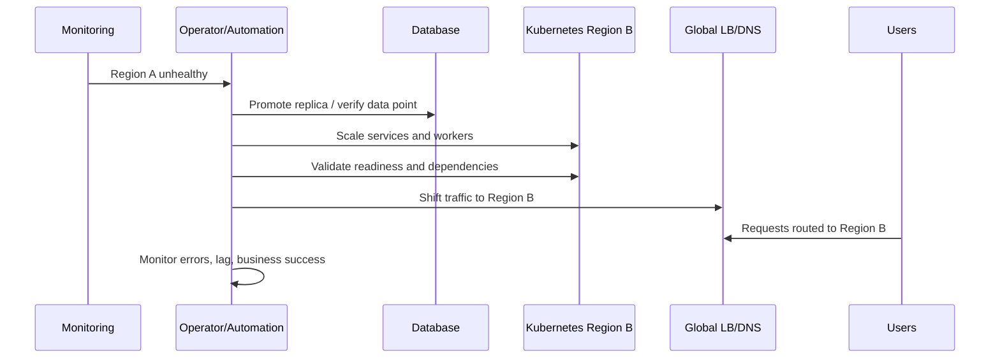
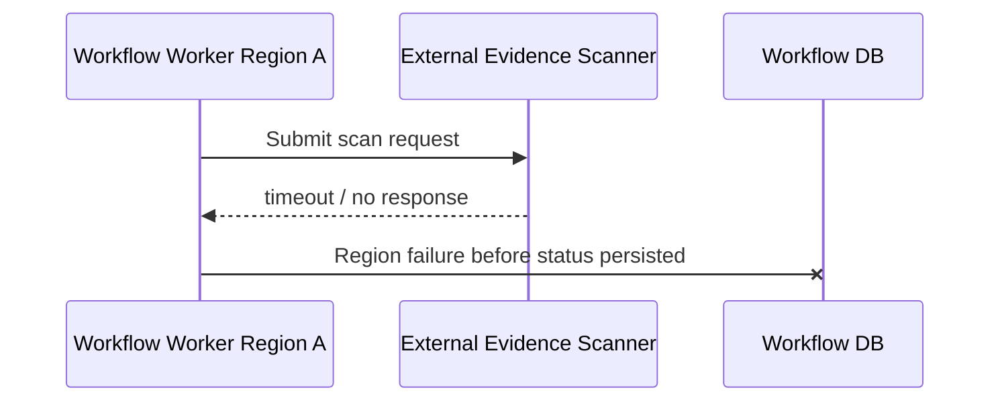
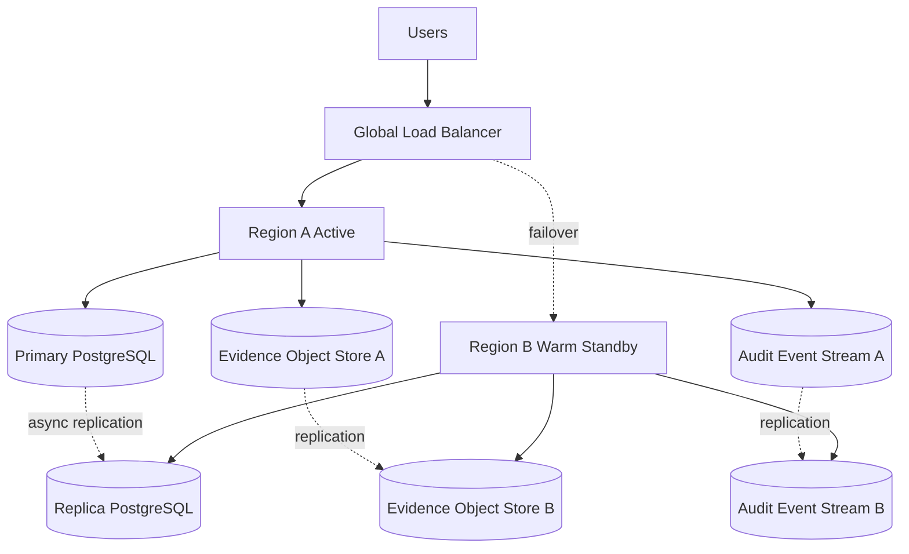

# Part 068 — Multi-Region and Disaster Recovery Design

## 1. Core Idea

Multi-region architecture is not “run the same microservices in two regions.”

That is only deployment topology.

Real multi-region design answers harder questions:

- Which region can accept writes?
- Which data may be lost during disaster?
- How long can the service be unavailable?
- Which users are served from which region?
- What happens to in-flight workflows during failover?
- How do we avoid split brain?
- How do we prove recovery works before disaster?
- Which dependencies are regional, global, or externally owned?
- How do we preserve audit evidence across failure?

Multi-region architecture is primarily a **consistency, ownership, failover, and operations problem**.

The network diagram is the easy part.

---

## 2. DR Vocabulary You Must Know

### 2.1 RTO

Recovery Time Objective.

How long the business can tolerate the system being unavailable after a disaster.

Example:

> Case submission must recover within 30 minutes.

### 2.2 RPO

Recovery Point Objective.

How much data loss the business can tolerate.

Example:

> No more than 5 minutes of submitted case updates may be lost.

### 2.3 MTD

Maximum Tolerable Downtime.

The outer business limit after which impact becomes unacceptable.

### 2.4 Failover

Moving service responsibility from failed region to another region.

### 2.5 Failback

Returning responsibility to the original region after recovery.

Failback is often harder than failover because state may diverge.

### 2.6 Split Brain

Two regions both believe they are primary and accept conflicting writes.

Split brain is one of the most dangerous multi-region failure modes.

### 2.7 Region Isolation

The ability for one region to fail without exhausting resources, corrupting state, or blocking operation in another region.

---

## 3. RTO/RPO Drive Architecture

Never begin with “active-active or active-passive?”

Begin with workload recovery requirements.



A workflow that tolerates 24 hours of recovery and 1 hour of data loss does not need the same architecture as a payment authorization path requiring seconds of recovery and near-zero data loss.

DR design starts with business criticality.

Not cloud features.

---

## 4. Classify Capabilities Before Regions

A microservice system has many capabilities.

They do not all need the same recovery target.

Example regulatory platform:

| Capability | Example | RTO | RPO | Strategy |
|---|---|---:|---:|---|
| Public case intake | Citizen submits case | 30 min | 5 min | Warm standby / active-passive |
| Officer review | Internal review workflow | 4 h | 15 min | Warm standby |
| Audit search | Search historical decisions | 24 h | 1 h | Backup/restore or read replica |
| Notification sending | Email/SMS dispatch | 2 h | 15 min | Queue replay |
| Analytics dashboard | Aggregated reporting | 24 h | 24 h | Rebuild from events/lake |
| Authentication | Login/session | 15 min | Near-zero | Managed global identity or replicated config |

Do not over-engineer every service to the highest criticality.

That is expensive and often less reliable.

---

## 5. DR Strategy Spectrum

Cloud DR usually lives on a spectrum.



### 5.1 Backup and Restore

Data is backed up.

Infrastructure may not be running in secondary region.

Best for:

- low criticality systems
- internal tools
- reporting systems
- long RTO workloads

Risks:

- restore process untested
- infrastructure drift
- backup corruption
- missing secrets/config
- DNS/certificate issues

### 5.2 Pilot Light

Minimal critical infrastructure is running in secondary region.

Application capacity scales up during disaster.

Best for:

- moderate RTO
- cost-sensitive systems
- systems with clear infrastructure automation

Risks:

- scale-up delay
- dependency readiness
- untested traffic cutover

### 5.3 Warm Standby

A smaller but functional version runs in secondary region.

Can serve limited traffic after failover, then scale up.

Best for:

- moderate-low RTO
- business-critical systems
- reasonable cost control

Risks:

- secondary under-capacity
- stale config
- async replication lag

### 5.4 Hot Standby / Active-Passive

Secondary region is fully ready but normally not serving primary traffic.

Best for:

- low RTO
- systems where single writer is important
- controlled failover

Risks:

- expensive idle capacity
- failover automation bugs
- primary/secondary role confusion

### 5.5 Multi-Site Active-Active

Multiple regions serve traffic simultaneously.

Best for:

- very low RTO
- global low-latency serving
- high availability requirements
- read-heavy systems

Risks:

- write conflict
- split brain
- consistency complexity
- operational complexity
- cross-region debugging
- global dependency coupling

Active-active is not the “best” strategy.

It is the most complex strategy.

---

## 6. Active-Passive Architecture

Active-passive means one region is primary for writes and traffic; another region is ready to take over.



### 6.1 Advantages

- simpler write model
- easier to avoid conflict
- easier operational reasoning
- better for strong authority systems
- fits many enterprise/regulatory workloads

### 6.2 Disadvantages

- failover takes time
- passive capacity may be stale or insufficient
- region switch must be rehearsed
- RPO depends on replication lag
- failback requires careful reconciliation

### 6.3 Active-Passive Checklist

- Is secondary infrastructure continuously deployed?
- Are secrets available in secondary region?
- Are certificates valid?
- Is config synchronized?
- Is database replica healthy?
- Is replication lag monitored?
- Are queues replicated or replayable?
- Are object storage buckets replicated?
- Are feature flags synchronized?
- Can workers start safely in secondary?
- Is DNS/global load balancer failover tested?
- Is failback procedure documented?

---

## 7. Active-Active Architecture

Active-active means multiple regions serve production traffic at the same time.



Active-active only works if the data model and business model can tolerate it.

### 7.1 Active-Active Fit

Good candidates:

- read-heavy services
- stateless edge services
- cacheable content
- search/query replicas
- append-only telemetry
- tenant-sharded workloads
- region-local workflows
- services with natural partitioning

Poor candidates:

- single global sequence/invariant
- strongly consistent financial ledger
- human workflow requiring strict global ordering
- regulatory decision authority with one source of truth
- systems with cross-region write conflicts
- services that depend on single-region third-party APIs

### 7.2 Conflict Avoidance Before Conflict Resolution

A mature design tries to avoid conflicts first.

Ways to avoid conflict:

- partition writes by tenant
- partition writes by geography
- partition writes by account/case id
- assign regional authority
- use single global writer for critical aggregate
- use command routing to owning region
- use append-only event model with deterministic merge

Conflict resolution is a last resort.



### 7.3 Active-Active Failure Modes

| Failure Mode | Description | Defense |
|---|---|---|
| Split brain | Multiple regions accept same aggregate writes | Single-writer partition, fencing token, quorum |
| Conflict storm | Same entity updated in multiple regions | Ownership routing |
| Clock-order bug | Last-write-wins loses real decision | Version vector or domain merge rule |
| Global dependency outage | Shared dependency fails all regions | Regional isolation |
| Replication lag surprise | User reads stale data in another region | Staleness contract |
| Failback conflict | Recovered region has divergent state | Reconciliation protocol |

---

## 8. Regional Data Ownership

Data ownership becomes harder across regions.

For each aggregate, define regional authority.

Options:

### 8.1 Single Global Primary

All writes go to one primary region.

Simple consistency.

Higher latency for remote users.

### 8.2 Regional Primary by Tenant

Each tenant has an owning region.

Good for SaaS and regulatory data residency.

```yaml
tenantRouting:
  regulator-id:
    homeRegion: ap-southeast-1
    failoverRegion: ap-southeast-3
    dataResidency: indonesia
    writePolicy: home-region-only
```

### 8.3 Regional Primary by Aggregate

Each aggregate has an owning region.

Example:

- Case ID determines owning region.
- Commands must route to that region.
- Other regions may keep read replicas.

### 8.4 Multi-Writer with Conflict Resolution

Multiple regions can write.

Only safe when domain has explicit merge semantics.

Examples:

- add-only tags
- counters with CRDT-like behavior
- telemetry events
- user preference with acceptable last-writer-wins

Do not use last-writer-wins for regulatory decisions.

It destroys causality.

---

## 9. RPO and Replication Lag

RPO is not a slide value.

It is bounded by actual replication and recovery behavior.

For each data store, measure:

- replication lag
- backup interval
- backup restore time
- transaction log retention
- object replication lag
- queue replay availability
- CDC connector lag
- event broker replication lag
- search index rebuild time

### 9.1 Data Store Recovery Table

| Data Type | Store | Replication | RPO Risk | Recovery Plan |
|---|---|---|---|---|
| Case command state | PostgreSQL | async replica | lag may lose recent writes | WAL replay, reconciliation |
| Audit event | append-only log/object store | cross-region replication | loss unacceptable | dual write via outbox or replicated log |
| Read model | Elasticsearch/OpenSearch | rebuildable | stale index acceptable | rebuild from events |
| Notification queue | broker | not always replicated | duplicate/lost dispatch | idempotent send + outbox |
| Feature flag config | config service | replicated | wrong behavior during failover | cached last-known-good + sync check |

A strong system defines RPO per data class, not only per application.

---

## 10. RTO and Recovery Steps

RTO is consumed by steps.

Example active-passive failover:



RTO includes:

- detection time
- decision time
- database promotion time
- app scale-up time
- cache warmup
- DNS/global routing propagation
- dependency validation
- operator confirmation
- post-failover stabilization

If your target RTO is 15 minutes, the sum of these steps must fit inside 15 minutes.

Hope is not a recovery strategy.

---

## 11. Java Microservices in Multi-Region

### 11.1 Region-Aware Configuration

Every service instance should know:

- current region
- environment
- service version
- region role: active, passive, read-only, degraded
- owning tenant/partition scope
- failover mode

Example:

```java
public enum RegionRole {
    ACTIVE,
    PASSIVE,
    READ_ONLY,
    DEGRADED
}

public record RuntimeRegionContext(
    String region,
    RegionRole role,
    boolean writesAllowed,
    boolean externalSideEffectsAllowed
) {}
```

Use this context at command boundaries.

```java
public final class SubmitCaseHandler {
    private final RuntimeRegionContext region;
    private final CaseRepository repository;

    public CaseId handle(SubmitCaseCommand command) {
        if (!region.writesAllowed()) {
            throw new RegionNotWritableException(region.region());
        }

        CaseAggregate aggregate = CaseAggregate.submit(command);
        repository.save(aggregate);
        return aggregate.id();
    }
}
```

Do not let passive region accidentally accept writes.

### 11.2 Region-Aware Outbox

Outbox events should include region metadata.

```json
{
  "event_id": "evt_01H...",
  "event_type": "CaseSubmitted",
  "aggregate_id": "CASE-2026-00081",
  "aggregate_version": 3,
  "source_region": "ap-southeast-1",
  "service_version": "3.4.1",
  "occurred_at": "2026-07-05T09:41:10Z"
}
```

This helps:

- duplicate detection
- audit reconstruction
- reconciliation
- failover debugging
- regional data lineage

### 11.3 Region-Aware Idempotency

Idempotency key must survive failover.

Bad:

```text
Idempotency stored only in Region A memory/cache.
```

Better:

```text
Idempotency persisted in replicated database/table or partition-owned durable store.
```

During failover, clients may retry commands.

Without replicated idempotency state, Region B may duplicate side effects.

---

## 12. External Dependencies

A Java microservice is not multi-region if its critical dependency is single-region.

Classify dependencies:

| Dependency | Region Model | Risk |
|---|---|---|
| Database | single-primary / replicated / global | write availability and RPO |
| Message broker | regional / replicated | event loss or duplicate replay |
| Object storage | regional / replicated | evidence/document availability |
| Identity provider | global / regional | login failure |
| Payment provider | external global | quota/outage |
| Email/SMS | external | duplicate or delayed notification |
| Feature flag service | global SaaS / self-hosted | wrong flag value during partition |
| Search index | regional rebuildable | stale query |
| KMS/secret store | regional/global | service cannot decrypt/start |

For each critical dependency, define:

- regional failure mode
- timeout
- fallback
- failover behavior
- data consistency expectation
- operational contact
- test method

---

## 13. Data Locality and Regulatory Constraints

Multi-region is not only technical.

Data residency may restrict where data can be stored or processed.

For regulated systems, classify data:

- personal data
- sensitive personal data
- enforcement evidence
- audit event
- decision record
- system telemetry
- anonymized analytics
- derived risk score

Then define movement policy:

```yaml
dataMovementPolicy:
  evidenceBinary:
    allowedRegions: ["id-jakarta"]
    crossRegionReplication: false
    backupRegion: "id-secondary"
  auditEvent:
    allowedRegions: ["id-jakarta", "id-secondary"]
    crossRegionReplication: true
  anonymizedMetric:
    allowedRegions: ["global"]
    crossRegionReplication: true
```

Do not replicate sensitive data globally because it is convenient.

Data movement is architecture.

---

## 14. Multi-Region Workflow Design

Long-running workflows create special problems.

A workflow may be in the middle of:

- waiting for human review
- waiting for external scan
- waiting for SLA timer
- running compensation
- retrying failed dependency
- holding task assignment

During failover, define:

- where workflow state lives
- whether timers move
- whether workers in secondary can resume
- whether external callbacks route to new region
- whether duplicate task execution is possible
- whether human users see consistent state

### 14.1 Workflow Failover Invariant

A workflow step must be either:

1. completed exactly once from business perspective, or
2. safely retryable, or
3. explicitly marked uncertain and reconciled.

Never silently drop uncertain workflow state.

### 14.2 Unknown Outcome Example



After failover, Region B does not know whether scanner accepted the request.

Defenses:

- idempotency key sent to scanner
- external status query API
- reconciliation job
- workflow state `UNKNOWN_EXTERNAL_OUTCOME`
- manual review path when needed

---

## 15. Split Brain Prevention

Split brain is not just a database problem.

It can happen at:

- API command layer
- scheduler layer
- workflow worker layer
- message consumer layer
- leader election layer
- cache lock layer
- database primary layer
- feature flag control plane

### 15.1 Fencing Token

A fencing token is a monotonically increasing authority token.

Only the holder of the latest token may write.

Conceptual example:

```java
public record RegionAuthorityToken(String region, long epoch) {}

public final class AuthorityGuard {
    private final AuthorityStore authorityStore;

    public void assertCurrent(RegionAuthorityToken token) {
        RegionAuthorityToken current = authorityStore.currentToken();
        if (token.epoch() < current.epoch()) {
            throw new StaleRegionAuthorityException(token, current);
        }
    }
}
```

Each write checks authority.

If Region A recovers with an old token, it cannot resume writes accidentally.

### 15.2 Write Gate

At service boundary:

```java
public void assertWritable(Command command) {
    if (!regionContext.writesAllowed()) {
        throw new RegionNotWritableException(regionContext.region());
    }
    authorityGuard.assertCurrent(regionContext.authorityToken());
}
```

This is boring code.

Boring code prevents catastrophic incidents.

---

## 16. Failover Runbook

A failover runbook must be executable under stress.

Template:

```md
# Failover Runbook — case-command-service

## Trigger
- Region A unavailable for > 5 minutes
- Global error budget burn > critical threshold
- Database primary unavailable

## Preconditions
- Region B database replica lag < 60s or accepted RPO exception approved
- Region B secrets valid
- Region B service version compatible
- Region B capacity >= emergency minimum

## Steps
1. Freeze non-critical deployments.
2. Stop Region A write ingress if reachable.
3. Promote Region B database replica.
4. Increment region authority epoch.
5. Enable writes in Region B config.
6. Scale Region B HTTP and worker deployments.
7. Validate readiness and synthetic business transaction.
8. Shift global traffic to Region B.
9. Monitor error rate, latency, backlog, business success.
10. Start reconciliation for uncertain window.

## Abort
- Region B database promotion fails.
- Region B synthetic transaction fails.
- Region B cannot decrypt required secrets.

## Post-Failover
- Declare Region B primary.
- Record RTO/RPO actuals.
- Create incident timeline.
- Start failback planning separately.
```

The runbook must be tested.

An untested runbook is a wish.

---

## 17. Failback Is a Separate Project

Failback means returning from secondary region to original region.

It is not simply reversing failover.

Questions:

- Did Region B accept writes?
- Did Region A miss events?
- Did external callbacks arrive in both regions?
- Did queues diverge?
- Did search indexes diverge?
- Did audit streams remain complete?
- Which region is source of truth now?
- Is Region A stale or corrupted?

Safe failback usually requires:

1. Freeze or reduce writes.
2. Reconcile Region A from Region B.
3. Verify data parity.
4. Restore replication direction.
5. Switch traffic gradually.
6. Keep Region B as fallback during stabilization.
7. Run post-failback validation.

Failback deserves its own runbook and drill.

---

## 18. Observability for Multi-Region

Every signal must be region-aware.

Required dimensions:

- `cloud.region`
- `service.name`
- `service.version`
- `region.role`
- `authority.epoch`
- `tenant.home_region`
- `traffic.source_region`
- `data.source_region`
- `replication.lag`
- `failover.mode`

Dashboards should show:

- regional success rate
- regional p95/p99 latency
- regional saturation
- cross-region dependency latency
- database replication lag
- queue lag per region
- DLQ per region
- synthetic transaction result per region
- global traffic split
- authority token state
- failover readiness score

### 18.1 Failover Readiness Score

Example:

```text
Failover readiness =
  database replica healthy
  AND replication lag < RPO threshold
  AND services deployed successfully in secondary
  AND secrets valid
  AND synthetic transaction passing
  AND capacity >= minimum
  AND runbook last tested < 30 days
```

Show this continuously.

Do not discover readiness during disaster.

---

## 19. DR Testing and GameDays

DR must be tested like code.

Levels:

| Level | Test | Purpose |
|---|---|---|
| L1 | Backup restore test | Prove data can be restored |
| L2 | Service startup in secondary | Prove infra/config/secrets work |
| L3 | Synthetic transaction in secondary | Prove business path works |
| L4 | Controlled traffic failover | Prove routing and capacity |
| L5 | Full regional GameDay | Prove people/process/automation |

A GameDay should define:

- hypothesis
- blast radius
- start/stop conditions
- observability plan
- rollback plan
- expected RTO/RPO
- actual RTO/RPO
- gaps found
- remediation owner

Example hypothesis:

> If Region A database is unavailable, Region B can become primary within 30 minutes with less than 5 minutes of accepted data loss, and case submission can resume for pilot tenants.

Good DR testing produces uncomfortable evidence.

That is the point.

---

## 20. Cost and Complexity Trade-Off

Lower RTO/RPO costs more.

Not only infrastructure cost.

Also:

- engineering complexity
- data model complexity
- operations burden
- testing burden
- observability cost
- incident response complexity
- false failover risk
- developer cognitive load
- compliance review effort

### 20.1 Trade-Off Matrix

| Requirement | Likely Cost |
|---|---|
| RTO 24h / RPO 24h | Backup, restore drills |
| RTO 4h / RPO 1h | Warm standby, automated provisioning |
| RTO 30m / RPO 5m | Replication, failover runbooks, frequent drills |
| RTO < 5m / RPO near-zero | Hot standby, automation, global routing, strong discipline |
| RTO seconds / RPO near-zero | Active-active or strongly replicated platform, high complexity |

Do not promise active-active semantics when the business only needs warm standby.

Do not build warm standby when the business truly needs near-zero downtime.

Architecture is economic judgment under constraints.

---

## 21. Example: Regulatory Case Platform DR Design

System capabilities:

- case intake
- case review
- evidence upload
- evidence scan
- decision approval
- audit search
- notification
- reporting

### 21.1 Capability Recovery Targets

```yaml
capabilities:
  case-intake:
    rto: 30m
    rpo: 5m
    strategy: active-passive-warm-standby
  case-review:
    rto: 4h
    rpo: 15m
    strategy: warm-standby
  evidence-upload:
    rto: 1h
    rpo: 5m
    strategy: replicated-object-storage
  decision-approval:
    rto: 4h
    rpo: 0-5m
    strategy: single-writer-region-with-audit-replication
  audit-search:
    rto: 24h
    rpo: 1h
    strategy: rebuildable-read-model
  reporting:
    rto: 24h
    rpo: 24h
    strategy: rebuild-from-data-lake
```

### 21.2 Architecture Choice

Use active-passive for command services.

Why?

- regulatory decisions require clear authority
- split brain is unacceptable
- data residency matters
- RTO/RPO can be met with warm standby
- active-active would introduce conflict complexity without enough benefit

Use regional read replicas for query services.

Use event/object replication for audit and evidence.

Use rebuildable projections for reporting.

### 21.3 Failover Design



### 21.4 Critical Invariants

- Only active region can accept case-changing commands.
- Passive region can serve limited read-only status page if primary unavailable.
- Audit events are replicated with stronger durability than read models.
- Evidence object replication lag is monitored against RPO.
- Idempotency keys are replicated or deterministic.
- External callbacks include region-independent correlation IDs.
- Failover increments authority epoch.
- Failback requires reconciliation.

---

## 22. Architecture Review Checklist

### Business Requirements

- What is RTO per capability?
- What is RPO per data class?
- Who approved those targets?
- What is maximum tolerable downtime?
- Which workflows need manual continuity plan?

### Data

- Which region owns writes?
- Is replication sync or async?
- What is measured replication lag?
- Which data can be rebuilt?
- Which data cannot be lost?
- How are idempotency keys replicated?
- How are audit records preserved?

### Application

- Are services region-aware?
- Can passive region start without accidental writes?
- Are scheduled jobs region-role aware?
- Are consumers safe after failover?
- Are external callbacks routable to active region?
- Are feature flags available during regional outage?

### Platform

- Is secondary region continuously deployed?
- Are secrets/certificates available?
- Are DNS/global LB rules tested?
- Is capacity sufficient?
- Are dependencies regionalized?
- Are deployment pipelines region-capable?

### Operations

- Is failover runbook tested?
- Is failback runbook tested?
- Are RTO/RPO measured during drills?
- Are operators trained?
- Are audit/compliance stakeholders informed?
- Is there an incident communication plan?

---

## 23. Common Anti-Patterns

### 23.1 “Active-Active by Diagram”

Two regions on a diagram do not mean active-active is safe.

If write ownership is unclear, the diagram hides split brain.

### 23.2 “Backups Without Restore Tests”

A backup that has never been restored is not a recovery capability.

### 23.3 “Same RTO for Everything”

Not every capability needs the same recovery target.

Uniform RTO is usually lazy architecture.

### 23.4 “Failover Without Idempotency”

Clients retry during outage.

If idempotency state is region-local and lost, failover duplicates commands.

### 23.5 “Ignoring External Dependencies”

A multi-region service that depends on a single-region external API is not fully multi-region.

### 23.6 “No Failback Plan”

Failover is only half the story.

Failback is where divergence becomes visible.

### 23.7 “DR Runbook as Documentation Only”

If not practiced, it will fail under pressure.

---

## 24. Practice Exercise

Design DR for this service:

> `evidence-service` stores uploaded enforcement evidence, metadata, malware scan state, and audit events. Evidence must remain inside national jurisdiction. Case workers can tolerate 1 hour of upload downtime but audit loss is unacceptable.

Answer:

1. What is RTO for evidence upload?
2. What is RPO for evidence object binary?
3. What is RPO for audit event?
4. Should evidence binary replicate cross-border?
5. Should metadata database be active-active?
6. How does failover avoid duplicate malware scan requests?
7. How are external callbacks routed after failover?
8. What is rebuildable and what is authoritative?
9. What should the failover runbook validate before traffic shift?
10. What is the failback plan?

Strong direction:

- Use jurisdiction-compliant secondary region.
- Treat audit stream as high-durability replicated append-only record.
- Keep command metadata single-writer active-passive unless strong reason for active-active exists.
- Use idempotency key per evidence upload and scan request.
- Store scanner correlation ID durably.
- Make scan callback region-independent through global callback endpoint or active-region router.
- Rebuild search/read model from metadata and audit events.
- Test object restore and metadata replica promotion regularly.

---

## 25. Key Takeaways

- Multi-region is a consistency and operations design problem, not only topology.
- RTO and RPO must be defined per capability and data class.
- Active-active is powerful but complex; active-passive is often more defensible for authority-heavy systems.
- Avoid write conflicts before trying to resolve them.
- Region-aware services prevent accidental writes during failover.
- Idempotency must survive regional retry and failover.
- Split brain must be prevented at command, database, scheduler, and worker layers.
- Failback is not the reverse of failover; it requires reconciliation.
- DR plans must be tested through restore drills, synthetic transactions, failover drills, and GameDays.
- A recovery plan is real only when actual RTO/RPO have been measured.

---

## 26. References

- AWS Disaster Recovery of Workloads on AWS — Disaster Recovery Options in the Cloud: https://docs.aws.amazon.com/whitepapers/latest/disaster-recovery-workloads-on-aws/disaster-recovery-options-in-the-cloud.html
- AWS Architecture Blog — Multi-Site Active/Active DR Architecture: https://aws.amazon.com/blogs/architecture/disaster-recovery-dr-architecture-on-aws-part-iv-multi-site-active-active/
- Google Cloud Architecture Center — Disaster Recovery Planning Guide: https://docs.cloud.google.com/architecture/dr-scenarios-planning-guide
- Google Cloud Architecture Center — Architecting Disaster Recovery for Cloud Infrastructure Outages: https://docs.cloud.google.com/architecture/disaster-recovery
- Kubernetes Documentation — Multi-cluster Services: https://kubernetes.io/docs/concepts/services-networking/multicluster/
- Google SRE Book — Addressing Cascading Failures: https://sre.google/sre-book/addressing-cascading-failures/
