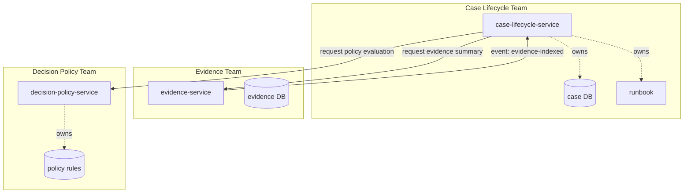
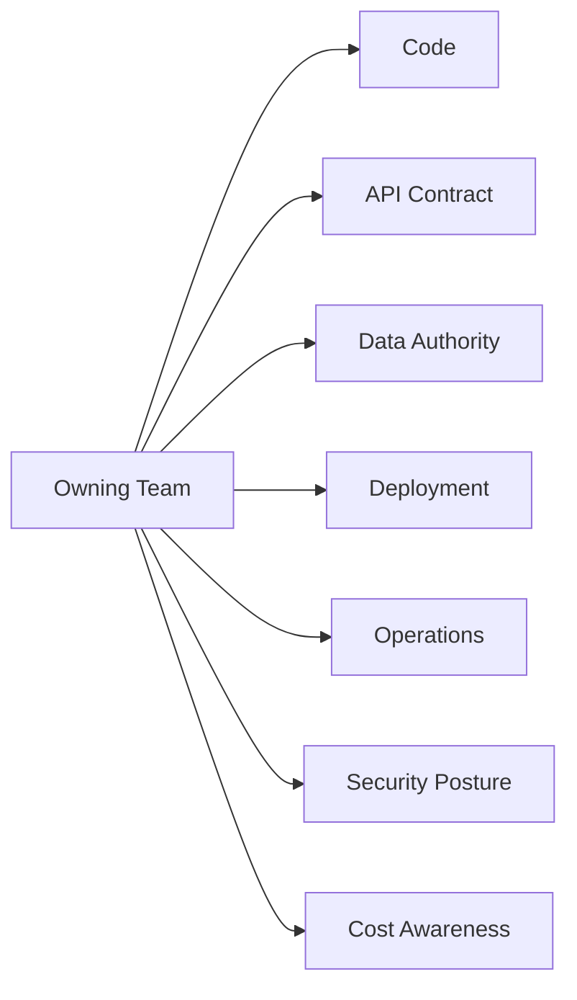
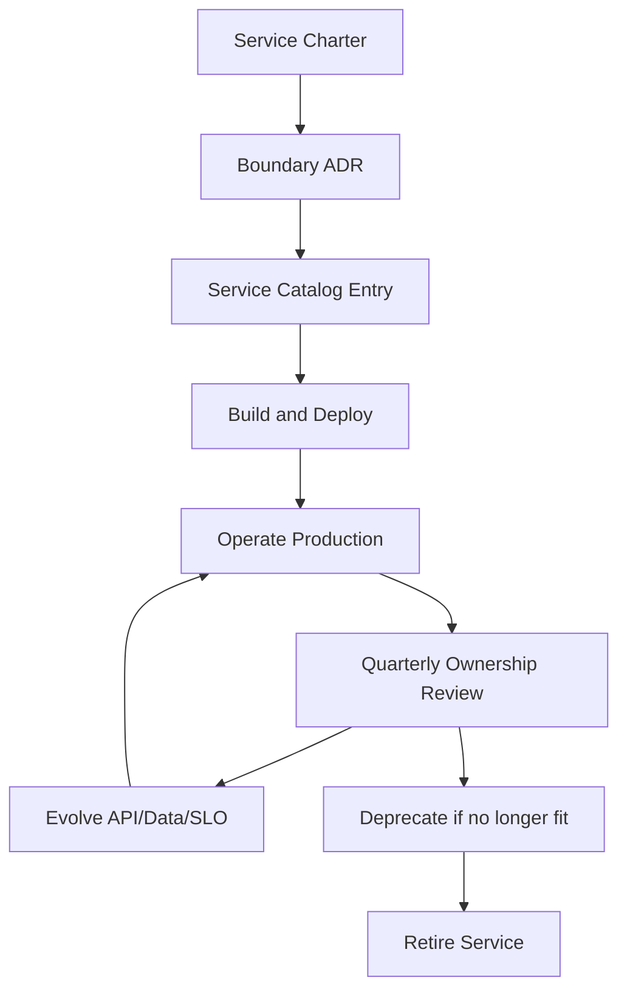
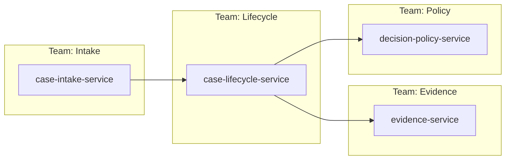

# Part 069 — Team Topology and Service Ownership

## 1. Core Idea

Microservices are not primarily a packaging technique.

They are an **ownership architecture**.

A service boundary is only useful when it maps to a boundary where a team can:

- understand the domain,
- change the code,
- deploy independently,
- operate production,
- own the data contract,
- handle incidents,
- evolve the API,
- retire the service,
- and be accountable for business outcomes.

If no team owns the service end-to-end, the system is not a healthy microservice architecture.

It is only a distributed codebase.

The test is simple:

> When this service fails at 02:00, who has the authority, context, and responsibility to decide what happens next?

If the answer is vague, ownership is broken.

---

## 2. What This Part Is Not

This part is not a generic management chapter.

It is an architecture chapter.

Team topology directly affects:

- service boundary,
- API shape,
- deployment independence,
- incident response,
- data ownership,
- cognitive load,
- platform design,
- governance cost,
- and failure recovery.

A microservice that crosses ownership boundaries too often will become slow to change, hard to debug, and politically expensive.

A service owned by a team that cannot operate it will become fragile.

A service owned by everyone will eventually be owned by no one.

---

## 3. Mental Model: A Service Is a Socio-Technical Unit

A production microservice has two sides.

### 3.1 Technical side

- code repository,
- runtime deployment,
- database/schema,
- API contract,
- event contract,
- metrics,
- logs,
- traces,
- secrets,
- CI/CD pipeline,
- infrastructure manifest,
- test suite,
- runbook.

### 3.2 Social side

- owning team,
- domain experts,
- operational escalation path,
- product owner,
- security contact,
- data steward,
- consumer teams,
- platform support boundary,
- governance reviewers.

Architecture fails when those two sides do not match.

Example:

- Team A owns code.
- Team B owns database.
- Team C owns Kubernetes manifests.
- Team D owns API gateway policy.
- Team E receives alerts.
- Team F approves schema changes.

This is not end-to-end ownership.

It is a distributed bottleneck machine.

---

## 4. Ownership Is Not Just “Who Wrote the Code”

A mature service owner owns the service across its lifecycle.

| Ownership Area | What It Means |
|---|---|
| Business capability | The team understands what business outcome the service supports. |
| Code | The team can safely change the service implementation. |
| API contract | The team owns compatibility, documentation, and consumer communication. |
| Data authority | The team owns write rules, data quality, lineage, and deletion semantics. |
| Runtime | The team owns deployment, capacity, configuration, and runtime behavior. |
| Reliability | The team owns SLOs, alert response, runbooks, and incident learning. |
| Security | The team owns threat model, secrets, identity, and authorization assumptions. |
| Cost | The team understands the service's resource and platform cost profile. |
| Lifecycle | The team owns birth, maturity, deprecation, and retirement. |

A weak ownership model says:

> “The service belongs to the payments team.”

A strong ownership model says:

> “The Payments Capability Team owns the Payment Authorization Service, including API compatibility, payment-state data authority, SLOs, incident response, consumer communication, rollout risk, and deprecation policy.”

That is a different level of accountability.

---

## 5. Ownership Topology Should Match Change Topology

A service boundary should exist where change can happen mostly independently.

Ask:

- Who requests changes to this capability?
- Who understands the business rules?
- Who has authority to resolve conflicting requirements?
- Who receives incident impact?
- Who negotiates API changes with consumers?
- Who can deploy without waiting for another team?

If changes always require three teams to coordinate, the service boundary is probably wrong.

If one team owns five tightly coupled services that always deploy together, those services may be modules, not independent microservices.

If one service contains rules owned by many teams, the service may be a boundary violation.

---

## 6. Mermaid: Ownership Topology vs Runtime Topology



The diagram is not only about calls.

It shows who owns authority.

A good architecture diagram should make both runtime dependency and ownership visible.

---

## 7. Team Types in a Microservices Organization

A healthy Java microservices organization usually contains several team shapes.

The labels matter less than the responsibility boundaries.

### 7.1 Stream-aligned team

A stream-aligned team owns a business value stream or business capability.

Examples:

- Case Intake Team,
- Payment Authorization Team,
- Claims Assessment Team,
- Enforcement Lifecycle Team,
- Customer Onboarding Team.

This team should own services that represent business capability.

It should be able to:

- talk directly to domain experts,
- prioritize feature work,
- own production behavior,
- respond to incidents,
- evolve APIs,
- and deploy independently.

Most business microservices should belong here.

### 7.2 Platform team

A platform team builds internal capabilities that reduce cognitive load for stream-aligned teams.

Examples:

- Java service template,
- CI/CD golden path,
- observability platform,
- secrets platform,
- Kubernetes runtime,
- service catalog,
- deployment automation,
- approved libraries,
- self-service database provisioning.

A platform team should not become a ticket queue for every deployment.

The platform should provide paved roads.

The stream-aligned team should still own the service.

### 7.3 Enabling team

An enabling team helps other teams learn a capability.

Examples:

- helping teams adopt OpenTelemetry,
- improving threat modeling practice,
- teaching resilience testing,
- helping migrate to a new service template,
- improving architecture review quality.

The enabling team should not permanently own the service.

Its job is to increase capability, then move on.

### 7.4 Complicated-subsystem team

Some parts of the system require deep specialist knowledge.

Examples:

- search relevance engine,
- fraud scoring model,
- rules compiler,
- cryptographic signing service,
- high-throughput matching engine,
- domain-specific optimization solver.

A complicated-subsystem team may own such services or components.

But this should be used carefully.

If every service is considered “too complex” for stream-aligned teams, the organization has not reduced cognitive load. It has centralized knowledge.

---

## 8. Service Ownership Patterns

### 8.1 Good pattern: one accountable owning team

One team owns the service end-to-end.

Other teams may contribute, but accountability is clear.



This is the default pattern.

### 8.2 Good pattern: platform-owned platform service

A platform service may be owned by a platform team.

Examples:

- internal identity broker,
- deployment service,
- observability collector,
- service catalog,
- config distribution service.

But platform services should expose a product-like interface.

They need:

- documentation,
- SLOs,
- consumer support channel,
- compatibility policy,
- migration guidance,
- operational transparency.

A platform service without a product interface becomes hidden infrastructure bureaucracy.

### 8.3 Risky pattern: shared service ownership

Two teams “jointly own” one service.

This often means:

- unclear roadmap,
- mixed domain language,
- slow approval,
- ownership gaps,
- alert confusion,
- conflicting priorities.

Shared ownership can work only when responsibility is explicitly split by surface.

Example:

| Surface | Owner |
|---|---|
| Business rules | Team A |
| Runtime platform | Platform Team |
| Database operation | Database Platform Team |
| Incident commander | Team A |
| Product roadmap | Team A |

The service owner remains Team A.

The platform team owns platform capability, not business service behavior.

### 8.4 Bad pattern: orphan service

An orphan service has no active owner.

Symptoms:

- last meaningful commit was years ago,
- alerts route to a generic channel,
- nobody knows the data contract,
- upgrades are risky,
- dependencies are stale,
- consumers are afraid to change it,
- incident mitigation is manual folklore.

An orphan service is a liability.

It needs one of three outcomes:

- assign owner,
- merge into another service,
- retire.

### 8.5 Bad pattern: committee-owned service

A committee-owned service requires approval from many teams for routine change.

This often happens with “central common service” designs.

Examples:

- common customer service,
- common notification service,
- common workflow service,
- common document service,
- common audit service.

Common services are not always bad.

But they must have a clear product boundary.

If every domain change requires changing the common service, it is not common. It is a shared bottleneck.

---

## 9. The Ownership Rule of Thumb

Use this rule:

> The team that owns the business invariant should own the service that enforces it.

Example:

If the rule is:

> “A regulatory case cannot be escalated before minimum evidence requirements are satisfied.”

Then the team responsible for case lifecycle policy should own the service enforcing that invariant.

Not the API platform team.

Not the database team.

Not a generic workflow team.

The workflow platform may provide execution primitives.

The case lifecycle team owns the business rule.

---

## 10. RACI for Service Ownership

RACI is often abused, but it is useful for making ambiguity visible.

For a microservice, define:

- **Responsible**: does the work,
- **Accountable**: owns the outcome,
- **Consulted**: gives input before decisions,
- **Informed**: receives notification.

Example:

| Activity | Owning Team | Platform Team | Security Team | Data Governance | Consumer Team |
|---|---:|---:|---:|---:|---:|
| Change business rule | A/R | C | C | C | I |
| Change API contract | A/R | C | C | I | C |
| Deploy service | A/R | C | I | I | I |
| Respond to incident | A/R | C | C | I | I |
| Rotate service secret | A/R | C | C | I | I |
| Change Kubernetes base template | C | A/R | C | I | I |
| Define SLO | A/R | C | C | C | C |
| Approve data retention policy | R | I | C | A | I |
| Deprecate endpoint | A/R | I | I | I | C |

Important:

There should be exactly one accountable owner for each service.

Multiple consulted stakeholders are normal.

Multiple accountable owners usually means no owner.

---

## 11. Ownership Contract

Every production service should have an ownership contract.

This does not need to be a long document.

It should be discoverable, versioned, and close to the code.

Example:

```yaml
service: case-lifecycle-service
owner:
  team: case-lifecycle-team
  slack: '#team-case-lifecycle'
  escalation: pagerduty-case-lifecycle
  product_owner: case-lifecycle-product-owner
  tech_lead: case-lifecycle-tech-lead

purpose:
  capability: regulatory-case-lifecycle-management
  summary: Owns case lifecycle state transitions, escalation rules, and lifecycle audit evidence.

authority:
  owns_data:
    - case_lifecycle_state
    - case_escalation_history
    - case_assignment_state
  owns_apis:
    - POST /cases/{caseId}/submit
    - POST /cases/{caseId}/escalate
    - GET /cases/{caseId}/lifecycle
  owns_events:
    - CaseSubmitted
    - CaseEscalated
    - CaseClosed

operations:
  tier: tier-1
  slo:
    availability: 99.9
    p95_latency_ms: 300
  runbook: docs/runbooks/case-lifecycle.md
  dashboard: https://observability.example.com/case-lifecycle
  alert_policy: docs/alerts/case-lifecycle-alerts.md

lifecycle:
  state: production
  introduced: 2026-03-01
  last_reviewed: 2026-07-05
  next_review_due: 2026-10-05
```

This contract prevents architectural amnesia.

---

## 12. Service Catalog as Ownership Infrastructure

A service catalog is not a pretty portal.

It is ownership infrastructure.

At minimum, it should answer:

- What does this service do?
- Who owns it?
- What system does it belong to?
- What APIs/events does it expose?
- What data does it own?
- What dependencies does it have?
- What lifecycle state is it in?
- Where are dashboards, logs, traces, runbooks, and alerts?
- What is the escalation path?
- What is the service tier?
- What is the SLO?
- What is the deprecation policy?

If engineers cannot discover this in minutes, the organization does not have real service ownership.

---

## 13. Example: Backstage-style `catalog-info.yaml`

```yaml
apiVersion: backstage.io/v1alpha1
kind: Component
metadata:
  name: case-lifecycle-service
  description: Owns regulatory case lifecycle transitions, escalation, closure, and lifecycle audit events.
  tags:
    - java
    - microservice
    - regulatory
    - tier-1
  annotations:
    github.com/project-slug: example/case-lifecycle-service
    backstage.io/techdocs-ref: dir:.
    pagerduty.com/service-id: PCASE123
spec:
  type: service
  lifecycle: production
  owner: group:case-lifecycle-team
  system: regulatory-case-management
  providesApis:
    - case-lifecycle-rest-api
  consumesApis:
    - evidence-summary-api
    - policy-evaluation-api
  dependsOn:
    - resource:case-lifecycle-postgres
    - component:evidence-service
    - component:decision-policy-service
---
apiVersion: backstage.io/v1alpha1
kind: API
metadata:
  name: case-lifecycle-rest-api
  description: REST API for case lifecycle commands and query views.
spec:
  type: openapi
  lifecycle: production
  owner: group:case-lifecycle-team
  system: regulatory-case-management
  definition:
    $text: ./openapi/case-lifecycle.yaml
```

The catalog is not the source of architectural truth by itself.

It is an index into living truth:

- code,
- documentation,
- contracts,
- telemetry,
- ownership,
- runtime.

---

## 14. Ownership in the Repository

A Java microservice repository should make ownership visible.

Recommended files:

```text
case-lifecycle-service/
  catalog-info.yaml
  OWNERS.md
  CODEOWNERS
  README.md
  docs/
    adr/
    runbooks/
    operations/
    api/
    events/
    security/
  src/main/java/...
  src/test/java/...
  deploy/
  .github/workflows/
```

Example `CODEOWNERS`:

```text
# Default owner
* @org/case-lifecycle-team

# API contract requires API review
/openapi/** @org/case-lifecycle-team @org/api-governance

# Deployment manifests require platform visibility
/deploy/** @org/case-lifecycle-team @org/platform-runtime

# Security-sensitive config requires security review
/deploy/secrets/** @org/case-lifecycle-team @org/security-engineering

# ADRs are owned by the service team, but architecture group is consulted
/docs/adr/** @org/case-lifecycle-team @org/architecture-review
```

Do not use `CODEOWNERS` as a replacement for team accountability.

It is only a routing mechanism.

---

## 15. Ownership and Cognitive Load

Microservices create local autonomy but increase total system complexity.

A team can own only so much.

Cognitive load includes:

- business complexity,
- code complexity,
- runtime complexity,
- operational complexity,
- security complexity,
- data complexity,
- dependency complexity,
- compliance complexity,
- incident complexity,
- migration complexity.

A team that owns too many services will stop owning them deeply.

Symptoms:

- runbooks are stale,
- alerts are ignored,
- upgrades are deferred,
- consumers wait too long,
- service catalog is incomplete,
- team cannot explain failure modes,
- incident response depends on one senior engineer,
- no one knows which service owns a business rule.

Service count is not the only measure.

One high-risk service may consume more cognitive load than ten simple services.

---

## 16. Cognitive Load Budget Example

| Service | Domain Complexity | Runtime Complexity | Operational Criticality | Security/Compliance | Cognitive Load |
|---|---:|---:|---:|---:|---:|
| case-lifecycle-service | High | Medium | High | High | Very high |
| evidence-metadata-service | Medium | Medium | High | High | High |
| notification-template-service | Low | Low | Medium | Medium | Low |
| reference-data-service | Medium | Low | Medium | Medium | Medium |
| document-rendering-service | Low | High | Medium | Medium | Medium-high |

A team owning all of these may be overloaded.

Better options:

- split ownership by capability,
- move common runtime concerns to platform,
- reduce service count by merging low-autonomy services,
- create an enabling engagement,
- improve service template and automation,
- retire unused services.

---

## 17. Platform Team Boundary

A common failure mode:

> “The platform team owns microservices.”

That is wrong.

The platform team owns **platform capabilities**.

The service team owns **service behavior**.

| Concern | Stream-Aligned Team | Platform Team |
|---|---|---|
| Business rule | Owns | Does not own |
| API behavior | Owns | Provides gateway tooling |
| Service code | Owns | Provides template/scaffolding |
| Runtime configuration | Owns service config | Provides config mechanism |
| Deployment pipeline | Owns service pipeline usage | Provides pipeline platform |
| Kubernetes manifests | Owns service-specific intent | Provides base charts/policies |
| Observability instrumentation | Owns semantic telemetry | Provides telemetry platform |
| Incident response | Owns service incident | Supports platform-related incident |
| Secret rotation | Owns service credential usage | Provides secret-management mechanism |
| SLO | Owns user-facing SLO | Provides SLO tooling |
| Cost | Owns service cost decisions | Provides cost visibility/guardrails |

A strong platform team reduces friction without stealing accountability.

---

## 18. Platform as Product

Internal platform capabilities should have product qualities.

A platform capability should define:

- target users,
- supported use cases,
- self-service flow,
- paved-road defaults,
- escape hatch,
- support model,
- SLO,
- compatibility policy,
- deprecation policy,
- documentation,
- examples,
- adoption metrics.

Bad platform:

> “Open a ticket and wait.”

Good platform:

> “Generate a Java service from the template, get CI/CD, logging, metrics, tracing, health checks, deployment manifests, SLO dashboard, and service catalog entry by default.”

The platform should make the right path cheaper than the wrong path.

---

## 19. Service Ownership and On-Call

If a team owns production behavior, it must participate in operational responsibility.

This does not mean every team must run an identical 24/7 pager model.

But it means every production service needs:

- escalation owner,
- incident triage process,
- response expectations,
- runbook,
- alert routing,
- platform escalation path,
- severity definition,
- rollback/mitigation authority,
- post-incident review ownership.

A service that pages nobody is unmanaged risk.

A service that pages the wrong team is organizational debt.

---

## 20. Alert Ownership

Alert ownership should follow mitigation authority.

Ask:

- Who can decide to disable a feature flag?
- Who can scale the service?
- Who can rollback?
- Who can disable a consumer?
- Who can change rate limits?
- Who can repair data?
- Who understands the business impact?

That team should own or be first responder for the alert.

If the platform team receives every service alert, the platform team becomes the bottleneck and loses context.

The platform team should receive alerts for platform capability failures.

Service teams should receive alerts for service behavior failures.

---

## 21. Ownership and Data Authority

Data ownership is one of the clearest tests of service ownership.

For each important data element, define:

- authoritative service,
- owning team,
- allowed writers,
- read exposure method,
- deletion owner,
- retention owner,
- quality owner,
- reconciliation owner,
- privacy owner,
- audit evidence owner.

Example:

| Data | Authoritative Service | Owning Team | Allowed Writers | Exposure |
|---|---|---|---|---|
| case lifecycle state | case-lifecycle-service | Case Lifecycle Team | case-lifecycle-service only | REST/query event |
| evidence metadata | evidence-service | Evidence Team | evidence-service only | API/event/read model |
| policy decision result | decision-policy-service | Decision Policy Team | decision-policy-service only | event/API |
| notification delivery status | notification-service | Messaging Team | notification-service only | event/query API |

If nobody owns data quality, the data will decay.

If multiple services write the same business state, incidents become archaeology.

---

## 22. Ownership and API Compatibility

The API owner must own compatibility.

This includes:

- schema evolution,
- endpoint lifecycle,
- error contract,
- deprecation notice,
- consumer migration,
- backward compatibility tests,
- contract test maintenance,
- release notes,
- production monitoring for deprecated usage.

A service team cannot say:

> “Consumers should just update.”

Microservices only scale when producers and consumers can evolve independently.

That requires compatibility discipline.

---

## 23. Consumer Relationship Model

Every important consumer should be classified.

| Consumer Type | Relationship | Required Discipline |
|---|---|---|
| Internal same team | Direct collaboration | Fast coordination, still versioned. |
| Internal different team | API-as-product | Compatibility, docs, support channel. |
| Platform consumer | Self-service | Strong docs and automation. |
| External partner | Formal contract | Versioning, security, SLA, approval. |
| Regulatory/reporting consumer | Evidence contract | Auditability, lineage, retention. |

Not all consumers require the same process.

But every consumer requires an explicit relationship.

---

## 24. Mermaid: Service Ownership Lifecycle Touchpoints



Ownership is not assigned once.

It must be maintained.

---

## 25. Ownership Review Cadence

Every production service should be periodically reviewed.

Recommended cadence:

| Service Tier | Ownership Review |
|---|---|
| Tier 0 / critical platform | Monthly or after major incident |
| Tier 1 / critical business | Quarterly |
| Tier 2 / important internal | Every 6 months |
| Tier 3 / low-criticality | Annually |
| Deprecated service | Monthly until retired |

Review should answer:

- Is the owner still correct?
- Is the service still needed?
- Is the catalog current?
- Are runbooks current?
- Are SLOs meaningful?
- Are alerts actionable?
- Are dependencies stale?
- Are consumers known?
- Is cost justified?
- Is the service still aligned with business capability?

---

## 26. Java-Specific Ownership Implications

In Java systems, ownership often decays through shared libraries and shared frameworks.

Watch these carefully.

### 26.1 Shared domain library smell

Bad:

```text
common-domain.jar
  Case.java
  Evidence.java
  Decision.java
  EnforcementAction.java
```

This creates shared domain ownership across services.

Better:

- each service owns its own domain model,
- shared library contains only stable technical utilities,
- integration uses explicit contracts,
- shared kernel is rare and governance-heavy.

### 26.2 Platform starter ownership

Spring Boot starters or internal Java libraries can be useful.

But define ownership clearly.

Example:

```text
platform-observability-starter
platform-security-starter
platform-database-starter
platform-http-client-starter
```

Owned by platform team.

Business services consume them.

But business teams still own:

- span naming,
- business metrics,
- authorization decisions,
- transaction boundaries,
- API semantics.

A platform starter should not hide business decisions.

### 26.3 Internal framework risk

A custom internal framework can reduce boilerplate.

It can also create organizational lock-in.

Before building one, ask:

- Does it reduce cognitive load?
- Does it preserve service autonomy?
- Can teams upgrade incrementally?
- Does it support observability and debugging?
- Does it expose escape hatches?
- Does platform own support and compatibility?
- Does it create hidden coupling between services?

Internal frameworks are products.

Treat them that way.

---

## 27. Ownership Metadata Exposed at Runtime

For internal services, consider exposing non-sensitive ownership metadata through actuator/info-style endpoints.

Example:

```json
{
  "service": "case-lifecycle-service",
  "owner": "case-lifecycle-team",
  "tier": "tier-1",
  "lifecycle": "production",
  "version": "2026.07.05.1830",
  "gitCommit": "9f3a21c",
  "runbook": "https://internal.example.com/runbooks/case-lifecycle",
  "dashboard": "https://internal.example.com/dashboards/case-lifecycle"
}
```

This helps during incidents.

Do not expose sensitive details publicly.

Keep external attack surface minimal.

---

## 28. Ownership Smells

### 28.1 “Ask Platform” smell

Every question routes to the platform team.

Usually means service ownership is weak.

### 28.2 “Only one person knows” smell

Critical knowledge sits in one engineer’s head.

This is a bus-factor and incident-response risk.

### 28.3 “Generic shared service” smell

A common service collects unrelated business rules.

Usually becomes a change bottleneck.

### 28.4 “No consumer list” smell

The team cannot identify consumers.

Breaking changes become dangerous.

### 28.5 “No data owner” smell

Nobody owns data quality or correction.

Reporting, audit, and reconciliation degrade.

### 28.6 “Operations by another team” smell

One team builds, another team runs, nobody learns.

The feedback loop is broken.

### 28.7 “Service exists because repo exists” smell

The service no longer maps to an active capability.

It may be a retirement candidate.

---

## 29. Designing Ownership for a Regulatory Case Platform

Suppose we are designing a regulatory enforcement platform.

Possible services:

- case-intake-service,
- case-lifecycle-service,
- evidence-service,
- decision-policy-service,
- enforcement-action-service,
- audit-evidence-service,
- notification-service,
- reporting-read-model-service.

Bad ownership model:

```text
All services owned by Backend Team.
Platform owns deployment.
Database team owns schema.
Ops team owns alerts.
Security owns authorization.
```

This looks organized but creates disconnected responsibility.

Better ownership model:

| Service | Owning Team | Business Authority | Data Authority |
|---|---|---|---|
| case-intake-service | Intake Team | Intake eligibility and submission | intake submission records |
| case-lifecycle-service | Lifecycle Team | case state transitions and SLA | lifecycle state |
| evidence-service | Evidence Team | evidence metadata and retention | evidence metadata |
| decision-policy-service | Policy Team | decision rules and explainability | policy decision result |
| enforcement-action-service | Enforcement Team | action issuance and tracking | enforcement action state |
| audit-evidence-service | Compliance Platform Team | audit event capture and retention | audit evidence store |
| notification-service | Communication Platform Team | delivery mechanics | delivery state |
| reporting-read-model-service | Reporting Team | reporting views | reporting projection |

Note:

`audit-evidence-service` may be platform-like, but its product is compliance evidence.

Its ownership must still be explicit.

---

## 30. Team API

Teams also have APIs.

A team API defines how other teams interact with the team.

For a service-owning team, define:

- support channel,
- consumer onboarding process,
- API change request flow,
- incident escalation path,
- review SLA,
- documentation location,
- office hours,
- deprecation notice period,
- emergency contact,
- ownership escalation.

This reduces random interruptions.

It also makes collaboration predictable.

Example:

```md
# Case Lifecycle Team API

## Owns
- case-lifecycle-service
- case lifecycle state model
- case transition rules
- lifecycle audit events

## Support
- Slack: #team-case-lifecycle-support
- Office hours: Tuesday/Thursday 10:00-11:00
- Incident escalation: PagerDuty service `case-lifecycle`

## API Change Requests
Open an issue using template `api-change-request`.
Include consumer use case, expected traffic, error handling expectation, and required rollout date.

## Deprecation Policy
Minimum 90 days for internal consumers unless security or regulatory emergency.

## Emergency Changes
For Sev-1 production impact, contact incident commander and team on-call.
```

---

## 31. Ownership and Architecture Review

Architecture review should not only inspect diagrams.

It should inspect ownership.

Ask:

1. Who owns the service?
2. Who owns the business invariant?
3. Who owns the data authority?
4. Who owns the API compatibility policy?
5. Who owns incident response?
6. Who owns SLO definition?
7. Who owns deprecation?
8. Who owns cost?
9. Who owns security posture?
10. Who owns runbooks?
11. Who owns consumer communication?
12. Who has authority to make emergency decisions?

If these questions are not answered, the design is incomplete.

---

## 32. Ownership Decision Matrix

Use this matrix when deciding the owner of a service.

| Question | If Yes | Ownership Implication |
|---|---|---|
| Does one team own most business rules? | Yes | That team is likely owner. |
| Does service enforce cross-domain policy? | Yes | Consider policy team or platform-product team. |
| Is service generic runtime capability? | Yes | Platform team may own. |
| Does service require deep specialist knowledge? | Yes | Complicated-subsystem team may own. |
| Does service change with one value stream? | Yes | Stream-aligned team should own. |
| Does service only aggregate views? | Yes | BFF/composition owner depends on user journey. |
| Does service store authoritative business state? | Yes | Owner must own data quality and correction. |
| Does service require 24/7 operational response? | Yes | Owner must support escalation. |
| Does service have many unrelated consumers? | Yes | Treat API as product; maybe platform/service product team. |
| Does no team understand it? | Yes | It is an ownership incident. |

---

## 33. Anti-Pattern: Service per Developer

A common overreaction:

> “Each developer owns a microservice.”

This is usually unhealthy.

Problems:

- no team redundancy,
- poor review quality,
- inconsistent operations,
- single-person failure domain,
- fragmented domain understanding,
- high coordination cost,
- weak platform discipline.

Microservices should map to teams or stable ownership groups, not individual preferences.

Individual stewardship can exist.

Team accountability must remain.

---

## 34. Anti-Pattern: Team per Technical Layer

Layer-based teams create distributed monoliths.

Example:

- API Team,
- Service Team,
- Database Team,
- UI Team,
- DevOps Team,
- QA Team.

Every feature crosses teams.

This makes independent deployment and ownership difficult.

Better:

- team owns a vertical capability,
- platform provides self-service infrastructure,
- specialist teams enable or own truly specialized subsystems.

Microservices are strongest when teams own vertical slices of business behavior.

---

## 35. Architecture Diagram with Ownership Overlay

When reviewing architecture, annotate ownership.



Then ask:

- Are dependencies aligned with team collaboration patterns?
- Which dependency is most operationally risky?
- Which team owns the user journey?
- Which team is paged for partial failure?
- Which dependency crosses a high-friction organizational boundary?

A dependency between services is also a dependency between teams.

---

## 36. Measuring Ownership Health

Track ownership health as part of platform intelligence.

Possible metrics:

| Metric | Meaning |
|---|---|
| Services without owner | Direct ownership risk. |
| Services without runbook | Operational readiness gap. |
| Services without SLO | Reliability ambiguity. |
| Services without recent review | Governance drift. |
| Deprecated services still receiving traffic | Retirement failure. |
| Services with unknown consumers | Compatibility risk. |
| Services with stale dependencies | Security/maintenance risk. |
| Alerts routed to generic channel | Incident ownership gap. |
| Services with one committer in 12 months | Bus-factor risk. |
| Services outside golden path | Platform fragmentation. |

These metrics should not be used to punish teams.

They should reveal system risk.

---

## 37. Ownership Fitness Functions

Automate basic ownership checks.

Examples:

```bash
# Fails CI if service has no catalog file
test -f catalog-info.yaml

# Fails CI if runbook is missing
test -f docs/runbooks/production.md

# Fails CI if owner field is missing
yq '.spec.owner' catalog-info.yaml | grep -v null

# Fails CI if lifecycle is not defined
yq '.spec.lifecycle' catalog-info.yaml | grep -E 'experimental|production|deprecated|retired'
```

More advanced checks:

- API owner must match catalog owner.
- PagerDuty service must exist for tier-1 service.
- Dashboard link must resolve.
- Runbook must be modified within review window.
- Deprecated APIs must publish deprecation date.
- Service must have dependency ownership map.

Governance should be automated where possible.

Manual review should focus on judgment, not checklist archaeology.

---

## 38. Ownership Review Checklist

Use this checklist for every production service.

### Identity

- [ ] Service has one accountable owning team.
- [ ] Service purpose is clear.
- [ ] Business capability is identified.
- [ ] Lifecycle state is defined.
- [ ] Service tier is defined.

### Runtime

- [ ] Deployment owner is clear.
- [ ] Rollback/roll-forward authority is clear.
- [ ] Runtime dashboard exists.
- [ ] Health checks are documented.
- [ ] Capacity owner is clear.

### API and consumers

- [ ] APIs are documented.
- [ ] Consumers are known.
- [ ] Compatibility policy exists.
- [ ] Deprecation policy exists.
- [ ] Support channel exists.

### Data

- [ ] Authoritative data is listed.
- [ ] Allowed writers are defined.
- [ ] Data correction process exists.
- [ ] Retention owner is defined.
- [ ] Privacy-sensitive fields are classified.

### Operations

- [ ] SLO exists.
- [ ] Alerts route to correct owner.
- [ ] Runbook exists.
- [ ] Escalation path exists.
- [ ] Recent incident learnings are reflected.

### Security

- [ ] Threat model exists or risk is accepted.
- [ ] Secrets owner is clear.
- [ ] Authorization assumptions are documented.
- [ ] Access review cadence exists.

### Lifecycle

- [ ] Review date is current.
- [ ] Retirement path is known if service becomes obsolete.
- [ ] Cost ownership exists.

---

## 39. Practical Implementation Plan

If your organization has weak service ownership, do not start by reorganizing everyone.

Start with visibility.

### Step 1: Inventory services

Find all deployed services.

Sources:

- Kubernetes deployments,
- service mesh registry,
- API gateway routes,
- Git repositories,
- CI/CD pipelines,
- DNS entries,
- observability metrics,
- cloud resources.

### Step 2: Assign current owner

Even if imperfect, assign one temporary accountable owner.

Unknown owner is worse.

### Step 3: Add minimum catalog metadata

Required fields:

- service name,
- owner,
- system,
- lifecycle,
- tier,
- repository,
- runbook,
- dashboard,
- pager/escalation,
- APIs/events,
- dependencies.

### Step 4: Identify orphan and high-risk services

Prioritize:

- tier-1 services without owner,
- services with production traffic and no runbook,
- deprecated services with traffic,
- services with stale dependencies,
- services with unknown consumers.

### Step 5: Fix ownership topology gradually

Options:

- assign to correct capability team,
- split service,
- merge service,
- retire service,
- move platform capability to platform team,
- create enabling engagement.

Do not solve ownership with a spreadsheet only.

Ownership must change how work flows.

---

## 40. The Top 1% Engineer's View

A senior engineer sees microservices as code.

A staff-level engineer sees them as runtime systems.

A top-tier architect sees them as socio-technical control points.

They ask:

- Who owns this decision?
- Who can change this safely?
- Who gets paged?
- Who owns the invariant?
- Who owns the data?
- Who can retire this?
- Who pays the complexity cost?
- Which team interaction does this dependency create?

The diagram is not complete until the ownership model is visible.

---

## 41. Exercises

### Exercise 1: Ownership inventory

Pick one production service.

Write:

- owning team,
- service purpose,
- authoritative data,
- APIs/events,
- known consumers,
- SLO,
- runbook,
- alert route,
- lifecycle state,
- cost owner.

If any field is unknown, mark it as architectural risk.

### Exercise 2: Ownership mismatch

Find a service where code owner, data owner, and incident owner differ.

Draw the current model.

Then propose a better ownership model.

### Exercise 3: Platform boundary

Take one responsibility currently handled by a platform team.

Classify it:

- platform capability,
- business service behavior,
- shared governance,
- temporary enabling work.

Then define who should own it long-term.

### Exercise 4: Consumer map

For one API, list all consumers.

For each consumer:

- owning team,
- traffic level,
- criticality,
- contract version,
- migration contact,
- error-handling expectation.

If consumers are unknown, your API compatibility risk is high.

---

## 42. Key Takeaways

- Microservices are ownership architecture, not only deployment units.
- A service without one accountable team is operational debt.
- Ownership includes code, data, API, runtime, security, reliability, cost, and lifecycle.
- Platform teams should reduce cognitive load, not absorb business accountability.
- Team topology must match business capability and change topology.
- A service catalog is ownership infrastructure.
- On-call and alert ownership should follow mitigation authority.
- Shared ownership must be explicit or it becomes no ownership.
- Architecture review should inspect ownership, not only component diagrams.
- Governance should be automated for objective checks and human for judgment.

---

## 43. References

- Team Topologies — Key Concepts: https://teamtopologies.com/key-concepts
- Backstage Software Catalog: https://backstage.io/docs/features/software-catalog/
- AWS Prescriptive Guidance — Service per team pattern: https://docs.aws.amazon.com/prescriptive-guidance/latest/modernization-decomposing-monoliths/service-per-team.html
- Google SRE Book — Production Readiness Review / SRE Engagement Model: https://sre.google/sre-book/evolving-sre-engagement-model/
- Martin Fowler — Microservices: https://martinfowler.com/articles/microservices.html
