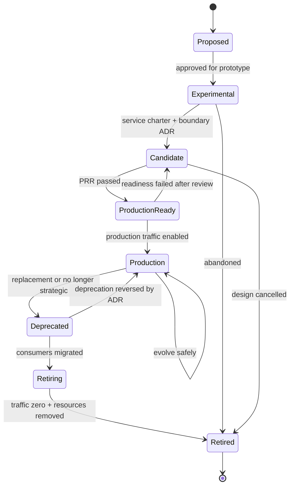
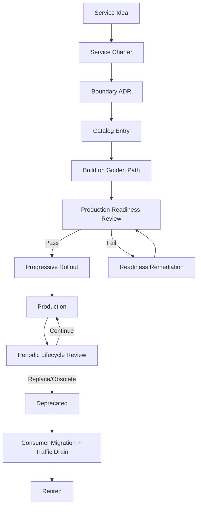
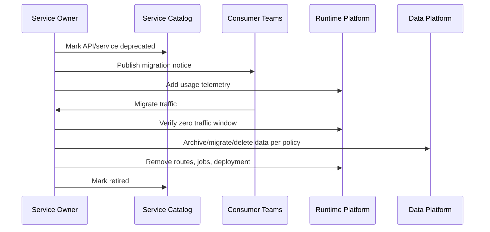
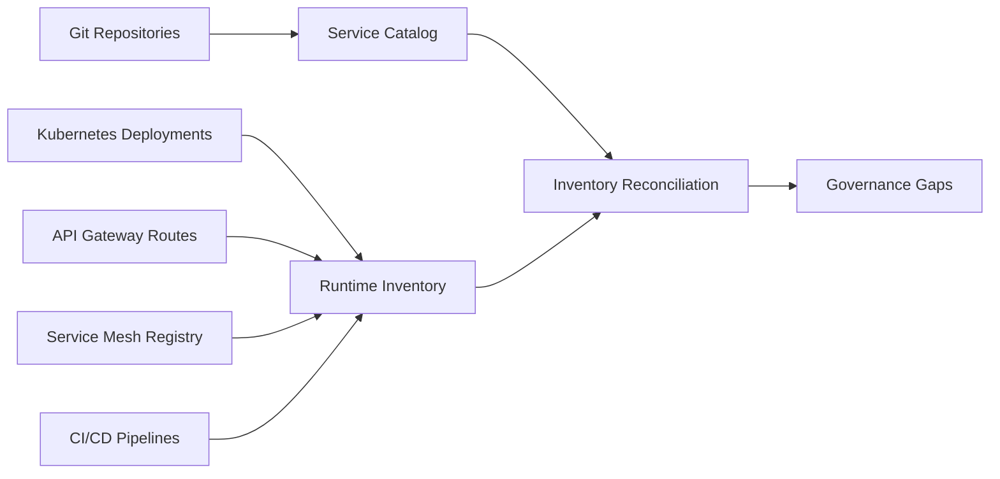

# Part 070 — Service Lifecycle Governance

## 1. Core Idea

A microservice is not done when it is deployed.

It has a lifecycle.

It is proposed, designed, built, launched, operated, evolved, deprecated, and eventually retired.

If this lifecycle is unmanaged, the architecture decays.

Services accumulate.

Owners change.

APIs become stale.

Dependencies drift.

Dashboards rot.

Alerts become noise.

Deprecated endpoints keep receiving traffic.

Security patches are missed.

Data ownership becomes unclear.

Eventually, the organization no longer knows what it runs.

Service lifecycle governance exists to prevent that.

But governance must not become bureaucracy.

The goal is not more approval meetings.

The goal is:

> every service has clear purpose, owner, contract, operational readiness, lifecycle state, risk posture, and retirement path.

---

## 2. Governance Is Not Centralized Control

Bad governance says:

> “Every service change must wait for an architecture committee.”

Good governance says:

> “Teams can move independently because the rules, metadata, guardrails, and readiness expectations are explicit and automated.”

Governance should protect autonomy.

It should answer:

- What is the minimum bar for production?
- Which services are allowed to receive traffic?
- Who owns each service?
- Which services are deprecated?
- Which services have unresolved risk?
- Which APIs are safe to evolve?
- Which services can be retired?
- Which services violate platform/security/reliability policy?
- Which risks require human judgment?

Governance is architecture memory.

Without it, microservices become entropy.

---

## 3. Service Lifecycle State Machine

A service should have an explicit lifecycle state.



Lifecycle states should not be decorative.

Each state must have entry and exit criteria.

---

## 4. Recommended Lifecycle States

### 4.1 Proposed

A service idea exists.

No production commitment yet.

Required evidence:

- problem statement,
- business capability,
- expected owner,
- why existing service/module is insufficient,
- expected consumers,
- initial risk assessment.

Decision:

- proceed to experiment,
- keep inside existing service/module,
- reject,
- revisit later.

### 4.2 Experimental

A prototype or spike is allowed.

Constraints:

- no production traffic,
- no authoritative business data,
- no long-term API commitment,
- clear expiry date.

Purpose:

- validate feasibility,
- test integration assumptions,
- learn domain complexity,
- estimate runtime cost,
- compare alternatives.

### 4.3 Candidate

The service is intended to become production.

Required:

- service charter,
- boundary ADR,
- owner assigned,
- service catalog entry,
- data authority definition,
- API/event contract draft,
- security assumptions,
- initial SLO proposal,
- dependency list,
- rollout plan.

### 4.4 Production-ready

The service has passed readiness review.

It may not yet be receiving full production traffic.

Required:

- CI/CD pipeline,
- deployment manifest,
- health checks,
- telemetry,
- dashboard,
- runbook,
- alert policy,
- rollback/roll-forward plan,
- capacity estimate,
- secret management,
- backup/recovery plan if stateful,
- compatibility policy,
- threat model for relevant risk,
- on-call/escalation route.

### 4.5 Production

The service receives real production traffic or owns production data.

Required:

- active owner,
- SLO tracking,
- operational review cadence,
- incident response ownership,
- dependency maintenance,
- consumer communication,
- security patch process,
- cost visibility.

### 4.6 Deprecated

The service or API is still running, but should not receive new consumers.

Required:

- replacement path,
- consumer inventory,
- migration plan,
- deprecation date,
- final removal target,
- usage telemetry,
- exception process.

### 4.7 Retiring

Traffic is being actively drained.

Required:

- consumers migrated,
- data export/migration completed,
- final backup or retention decision,
- alerts adjusted,
- DNS/routes removed,
- jobs disabled,
- event subscriptions removed,
- documentation updated.

### 4.8 Retired

The service is no longer deployed and no longer part of runtime architecture.

Required:

- production traffic zero,
- compute removed,
- database archived/deleted per policy,
- secrets revoked,
- catalog state changed,
- repository archived or marked read-only,
- dashboards/alerts removed,
- final ADR recorded.

---

## 5. Mermaid: Lifecycle Governance Flow



This is a control loop.

Not a one-time launch checklist.

---

## 6. Service Charter

A service should not be born without a charter.

A charter defines why the service exists.

Template:

```md
# Service Charter: case-lifecycle-service

## Purpose
Own case lifecycle state transitions, escalation rules, closure rules, and lifecycle audit evidence.

## Business Capability
Regulatory case lifecycle management.

## Owning Team
Case Lifecycle Team.

## Why a Separate Service?
The lifecycle state machine changes independently from evidence storage, decision policy, and notification delivery. It owns authoritative lifecycle state and has tier-1 operational importance.

## Non-Goals
- Does not store evidence content.
- Does not own policy rule definitions.
- Does not send notifications directly.
- Does not own reporting projections.

## Authoritative Data
- case lifecycle state
- case lifecycle transition history
- escalation timer state

## APIs
- submit case
- escalate case
- close case
- query lifecycle status

## Events
- CaseSubmitted
- CaseEscalated
- CaseClosed

## Primary Consumers
- case-intake-service
- enforcement-action-service
- reporting-read-model-service

## Reliability Tier
Tier 1.

## Initial SLO Proposal
99.9% successful lifecycle command handling per 30 days.

## Key Risks
- stale policy decision during escalation
- duplicate command handling
- audit evidence loss
- workflow timeout drift
```

A charter prevents accidental services.

---

## 7. Boundary ADR

Before a service becomes a candidate, write a boundary ADR.

Minimum sections:

```md
# ADR: Extract Case Lifecycle Service

## Status
Accepted

## Context
Case lifecycle state transitions are currently implemented inside the case-intake module. Escalation rules, SLA timers, and closure rules now change independently from intake validation.

## Decision
Create `case-lifecycle-service` as the authoritative owner of lifecycle state and transition history.

## Options Considered
1. Keep inside case-intake-service.
2. Extract lifecycle module inside modular monolith.
3. Create independent lifecycle microservice.

## Decision Drivers
- independent release cadence
- authoritative state ownership
- SLA timer ownership
- audit defensibility
- clear team ownership

## Consequences
- Cross-service coordination required with evidence and policy services.
- Need outbox events for lifecycle transitions.
- Need idempotent command handling.
- Need migration plan from old state table.

## Reversal Criteria
If lifecycle rules do not change independently over two quarters and operational cost exceeds value, merge back into case-management module.
```

A good ADR includes reversal criteria.

Architecture decisions should be revisitable.

---

## 8. Service Catalog Metadata

Lifecycle governance depends on metadata.

Minimum required metadata:

```yaml
service: case-lifecycle-service
owner: case-lifecycle-team
system: regulatory-case-management
lifecycle: production
tier: tier-1
language: java
runtime: kubernetes
framework: spring-boot
repository: https://git.example.com/regulatory/case-lifecycle-service

contracts:
  rest:
    - openapi/case-lifecycle.yaml
  events:
    - docs/events/case-submitted.md
    - docs/events/case-escalated.md

operations:
  runbook: docs/runbooks/production.md
  dashboard: https://observability.example.com/d/case-lifecycle
  alerts: docs/alerts/case-lifecycle.md
  pager: pagerduty-case-lifecycle
  slo: docs/slo/case-lifecycle.md

risk:
  threat_model: docs/security/threat-model.md
  data_classification: confidential
  pii: true
  regulatory_impact: high

lifecycle_review:
  last_reviewed: 2026-07-05
  next_review_due: 2026-10-05
  reviewer: architecture-governance
```

Metadata must be versioned.

Prefer storing it with code and ingesting it into a catalog.

---

## 9. Production Readiness Review

Production Readiness Review, or PRR, is not a ceremonial sign-off.

It is a structured risk review before a service receives production responsibility.

It asks:

- Is the service understandable?
- Is the owner clear?
- Can it be deployed safely?
- Can it fail safely?
- Can it be observed?
- Can it be debugged?
- Can it be rolled back or rolled forward?
- Can it protect sensitive data?
- Can it handle expected load?
- Can it recover from dependency failure?
- Can the team operate it?

PRR is not only for new services.

Run PRR when:

- service becomes tier-1,
- service changes data authority,
- service adds public/external API,
- service changes ownership,
- service moves region/cloud/runtime,
- service handles new regulated data,
- service has repeated incidents,
- service is being revived after dormancy.

---

## 10. Production Readiness Checklist

### 10.1 Ownership

- [ ] One accountable team exists.
- [ ] Escalation path exists.
- [ ] Service catalog entry exists.
- [ ] Business capability is documented.
- [ ] Service tier is defined.

### 10.2 Architecture

- [ ] Boundary ADR exists.
- [ ] Data ownership is defined.
- [ ] API/event contracts are documented.
- [ ] Dependency list is complete.
- [ ] Failure model is documented.
- [ ] Consistency model is documented.

### 10.3 Runtime

- [ ] CI/CD pipeline exists.
- [ ] Deployment strategy is defined.
- [ ] Rollback/roll-forward plan exists.
- [ ] Health checks are correct.
- [ ] Resource requests/limits exist.
- [ ] Graceful shutdown works.

### 10.4 Reliability

- [ ] SLO is defined.
- [ ] Alerts are symptom-based and actionable.
- [ ] Timeout policy exists.
- [ ] Retry policy exists.
- [ ] Overload behavior is defined.
- [ ] Dependency failure behavior is defined.
- [ ] Capacity estimate exists.

### 10.5 Observability

- [ ] Structured logs exist.
- [ ] Metrics exist.
- [ ] Distributed tracing exists for critical flows.
- [ ] Dashboards exist.
- [ ] Business events are observable.
- [ ] Correlation IDs propagate.

### 10.6 Security and Privacy

- [ ] Threat model exists or risk is accepted.
- [ ] Secrets are managed safely.
- [ ] Service-to-service identity is defined.
- [ ] Authorization boundary is documented.
- [ ] Sensitive data classification exists.
- [ ] Logs/traces avoid sensitive data leaks.

### 10.7 Data

- [ ] Migration plan exists if stateful.
- [ ] Backup/recovery exists if required.
- [ ] Data retention policy exists.
- [ ] Data correction process exists.
- [ ] Reconciliation strategy exists for async flows.

### 10.8 Operations

- [ ] Runbook exists.
- [ ] Incident response path exists.
- [ ] Known bad states are documented.
- [ ] Emergency levers are documented.
- [ ] Support model is defined.

---

## 11. Java Service Readiness Requirements

For Java microservices, PRR should include language/runtime checks.

### 11.1 JVM memory envelope

Document:

- heap max,
- metaspace expectation,
- direct memory usage,
- thread count,
- connection pools,
- native memory risk,
- container memory limit.

Example:

```yaml
jvm:
  heap_max: 768Mi
  container_memory_limit: 1536Mi
  max_threads: 250
  direct_memory: 128Mi
  expected_connection_pools:
    postgres: 20
    redis: 10
    http_evidence_service: 50
```

### 11.2 Thread and pool design

Document:

- request thread model,
- async executor configuration,
- scheduler jobs,
- HTTP client pool,
- DB pool,
- message consumer concurrency,
- backpressure behavior.

### 11.3 Startup and shutdown

Verify:

- startup probe matches real startup,
- readiness waits until dependencies/config are usable,
- liveness does not kill overloaded-but-recoverable service,
- shutdown drains traffic,
- message consumers stop safely,
- in-flight requests have termination grace.

### 11.4 Configuration validation

Service should fail fast if critical config is invalid.

Example:

```java
@ConfigurationProperties(prefix = "case.lifecycle")
@Validated
public record LifecycleProperties(
    @Min(1) int maxEscalationAttempts,
    @NotNull Duration commandTimeout,
    @NotBlank String policyServiceBaseUrl
) {}
```

### 11.5 Actuator surface

Expose internal operational endpoints safely:

- health,
- info,
- metrics,
- readiness/liveness groups,
- build metadata,
- version.

Do not expose sensitive management endpoints publicly.

---

## 12. Governance Gates

A gate is a condition for moving lifecycle state.

Good gates are:

- explicit,
- automatable where possible,
- risk-based,
- fast,
- owned,
- auditable,
- not arbitrary.

Bad gates are:

- vague,
- manual-only,
- personality-driven,
- one-size-fits-all,
- slow,
- disconnected from production risk.

---

## 13. Example Lifecycle Gates

| Transition | Gate |
|---|---|
| Proposed → Experimental | Problem statement and owner identified. |
| Experimental → Candidate | Service charter and boundary ADR accepted. |
| Candidate → Production-ready | PRR checklist complete. |
| Production-ready → Production | Rollout plan, telemetry, and rollback verified. |
| Production → Deprecated | Replacement path and consumer inventory defined. |
| Deprecated → Retiring | Consumer migration underway and new consumers blocked. |
| Retiring → Retired | Traffic zero, resources removed, data handled. |

Each gate should produce evidence.

Evidence can be:

- catalog metadata,
- ADR,
- CI check result,
- dashboard link,
- runbook,
- threat model,
- load-test report,
- migration plan,
- production traffic metric.

---

## 14. Automating Governance

Automate objective checks.

Examples:

```bash
#!/usr/bin/env bash
set -euo pipefail

required_files=(
  "catalog-info.yaml"
  "README.md"
  "docs/runbooks/production.md"
  "docs/adr"
  "deploy"
)

for f in "${required_files[@]}"; do
  if [ ! -e "$f" ]; then
    echo "Missing required lifecycle artifact: $f"
    exit 1
  fi
done

yq '.spec.owner' catalog-info.yaml | grep -v null >/dev/null
yq '.spec.lifecycle' catalog-info.yaml | grep -E 'experimental|production|deprecated|retired' >/dev/null
```

Java/Spring-specific checks can verify:

- health endpoints enabled,
- structured logging configured,
- OpenTelemetry dependency or Java agent configured,
- dependency versions not vulnerable,
- container memory flags present,
- actuator exposed safely,
- test coverage for critical domain invariants,
- migration scripts validated.

But not everything should be automated.

Human review is needed for:

- service boundary judgment,
- data ownership ambiguity,
- risk acceptance,
- regulatory impact,
- incident learning,
- deprecation exceptions,
- business criticality.

---

## 15. Service Maturity Model

Lifecycle state says where the service is.

Maturity says how healthy it is.

Example maturity levels:

### Level 0 — Unknown

- owner unclear,
- no catalog entry,
- no runbook,
- unknown consumers,
- no SLO.

### Level 1 — Identified

- owner known,
- repository known,
- runtime known,
- basic documentation exists.

### Level 2 — Operable

- runbook exists,
- dashboard exists,
- alerts route correctly,
- deployment pipeline works,
- health checks exist.

### Level 3 — Reliable

- SLO exists,
- error budget tracked,
- failure modes documented,
- capacity model exists,
- incident learnings feed back.

### Level 4 — Evolvable

- compatibility tests exist,
- deprecation policy exists,
- consumers known,
- APIs versioned/evolvable,
- ownership reviews current.

### Level 5 — Continuously Governed

- catalog metadata is complete,
- governance checks automated,
- drift is detected,
- cost/security/reliability posture visible,
- retirement candidates are actively managed.

Do not force every service to Level 5.

Match maturity to risk.

A tier-1 regulatory service needs higher maturity than a low-risk internal utility.

---

## 16. Risk-Based Governance

Not all services need the same bar.

Classify by risk:

| Dimension | Low Risk | High Risk |
|---|---|---|
| Business criticality | Internal helper | Revenue/regulatory core |
| Data sensitivity | Public/reference data | PII/confidential/regulated |
| Traffic | Low | High |
| Consumer exposure | One internal consumer | Many/external consumers |
| Statefulness | Stateless | Authoritative state |
| Failure impact | Local inconvenience | Broad outage/compliance breach |
| Change frequency | Rare | Frequent/high volatility |
| Dependency criticality | Optional | Critical dependency chain |

Governance should scale with risk.

A high-risk service needs stricter readiness and review.

A low-risk service needs lightweight guardrails.

---

## 17. Service Tiering

Define service tier consistently.

Example:

| Tier | Description | Examples | Governance Level |
|---|---|---|---|
| Tier 0 | Platform-critical; failure affects many services | identity, network, cluster control plane | strictest |
| Tier 1 | Critical business/regulatory service | case lifecycle, payment authorization | strict |
| Tier 2 | Important internal service | notification, search, reporting query | moderate |
| Tier 3 | Low-criticality utility | admin helper, internal batch | lightweight |
| Tier 4 | Experimental/non-prod | prototype | minimal |

Tier affects:

- SLO strictness,
- on-call expectation,
- PRR depth,
- dependency review,
- security review,
- DR requirement,
- review cadence,
- change-management expectations.

---

## 18. Lifecycle Review

A lifecycle review is a periodic service health check.

It should be lightweight but real.

### Review inputs

- service catalog metadata,
- traffic metrics,
- SLO/error budget,
- incidents,
- dependency freshness,
- security findings,
- cost trend,
- consumer list,
- deprecated API usage,
- runbook freshness,
- ownership changes.

### Review outputs

- continue as-is,
- remediate risk,
- change tier,
- change owner,
- split/merge service,
- deprecate API,
- retire service,
- schedule deeper architecture review.

---

## 19. Lifecycle Review Template

```md
# Lifecycle Review: case-lifecycle-service

## Metadata
- Date: 2026-07-05
- Owner: Case Lifecycle Team
- Tier: Tier 1
- Lifecycle: Production
- Reviewer: Architecture Governance

## Traffic and Usage
- Average RPS:
- Peak RPS:
- Primary consumers:
- Deprecated endpoint traffic:

## Reliability
- SLO:
- Error budget remaining:
- Incidents since last review:
- Top failure mode:

## Security and Privacy
- Open critical vulnerabilities:
- Secret rotation status:
- Sensitive data classification:
- Access review status:

## Operations
- Runbook current: yes/no
- Dashboard current: yes/no
- Alerts actionable: yes/no
- On-call route verified: yes/no

## Architecture
- Boundary still correct: yes/no
- Data authority still correct: yes/no
- Dependency risk changed: yes/no
- Consumers known: yes/no

## Cost
- Monthly cost trend:
- Cost anomaly:
- Optimization candidate:

## Decisions
- Continue production.
- Remediate stale dependency by 2026-08-01.
- Reassess deprecated endpoint traffic next review.
```

---

## 20. Deprecation Governance

Deprecation is not deletion.

Deprecation is a managed compatibility state.

A deprecated API/service is still operational until removed.

Minimum deprecation plan:

- reason for deprecation,
- replacement path,
- affected consumers,
- deprecation start date,
- migration deadline,
- final removal date,
- compatibility behavior during window,
- support channel,
- telemetry to detect remaining usage,
- exception policy,
- rollback decision if migration fails.

Example:

```yaml
api: GET /cases/{caseId}/legacy-status
status: deprecated
replacement: GET /cases/{caseId}/lifecycle
owner: case-lifecycle-team
deprecated_on: 2026-07-05
removal_not_before: 2026-10-05
remaining_consumers:
  - legacy-portal-service
  - reporting-batch-v1
telemetry:
  metric: http.server.requests{uri="/cases/{caseId}/legacy-status"}
  target: zero traffic for 14 consecutive days
exceptions:
  approval_required_from: architecture-governance
```

Do not deprecate without measuring usage.

Do not remove without migration evidence.

---

## 21. Retirement Governance

A retired service should no longer consume operational attention.

Retirement checklist:

### Traffic

- [ ] API gateway routes removed.
- [ ] DNS entries removed.
- [ ] service mesh routes removed.
- [ ] event subscriptions disabled.
- [ ] scheduled jobs disabled.
- [ ] production traffic zero verified.

### Data

- [ ] data exported or migrated if needed.
- [ ] retention decision recorded.
- [ ] backups handled.
- [ ] database/schema removed or archived.
- [ ] search/index/read models removed.

### Security

- [ ] secrets revoked.
- [ ] service accounts removed.
- [ ] certificates removed.
- [ ] IAM permissions removed.
- [ ] API tokens invalidated.

### Operations

- [ ] alerts removed.
- [ ] dashboards archived or removed.
- [ ] runbook marked retired.
- [ ] catalog lifecycle changed to retired.
- [ ] on-call route removed.

### Code and documentation

- [ ] repository archived or marked read-only.
- [ ] final ADR written.
- [ ] consumers updated.
- [ ] architecture diagrams updated.

Retirement is a security and cost-control activity.

Old services are attack surface.

---

## 22. Mermaid: Deprecation and Retirement Flow



---

## 23. Governance Failure Modes

### 23.1 Checklist theater

Teams fill checklists without reducing risk.

Fix:

- require evidence,
- sample production behavior,
- review incidents,
- automate objective checks,
- keep checklists short and risk-based.

### 23.2 Architecture committee bottleneck

Every small change waits for central approval.

Fix:

- use paved-road standards,
- automate policy,
- reserve human review for high-risk decisions,
- delegate ownership to teams.

### 23.3 Catalog rot

Catalog exists but nobody trusts it.

Fix:

- store metadata near code,
- verify links in CI,
- compare runtime inventory vs catalog,
- make catalog useful during incidents,
- alert on missing owner/runbook.

### 23.4 No retirement culture

New services are easy to create, old services never die.

Fix:

- lifecycle review,
- traffic telemetry,
- deprecation policy,
- retirement OKRs for large migrations,
- cost visibility.

### 23.5 One-size-fits-all governance

Small low-risk services face same process as tier-1 systems.

Fix:

- tier services,
- risk-based gates,
- fast path for low-risk work,
- strict path for high-risk systems.

### 23.6 Ownership drift

Teams reorganize but services stay mapped to old groups.

Fix:

- quarterly ownership review,
- source-control owner updates,
- catalog sync with org directory,
- alert route verification.

---

## 24. Governance as Code

Treat governance rules as executable policy where possible.

Examples:

- every production service must have owner,
- tier-1 service must have pager route,
- stateful service must document backup/recovery,
- public API must have OpenAPI contract,
- deprecated API must have removal date,
- service with PII must have data classification,
- service with production lifecycle must have runbook,
- service must expose readiness/liveness probes,
- service must have structured logs enabled,
- service must publish build/version metadata.

Example policy pseudo-code:

```rego
package service.lifecycle

deny[msg] {
  input.lifecycle == "production"
  not input.owner
  msg := "production service must declare owner"
}

deny[msg] {
  input.lifecycle == "production"
  input.tier == "tier-1"
  not input.operations.pager
  msg := "tier-1 production service must declare pager route"
}

deny[msg] {
  input.lifecycle == "deprecated"
  not input.deprecation.removal_not_before
  msg := "deprecated service/API must declare removal date"
}
```

Governance as code should be transparent.

Teams must know what rule failed and how to fix it.

---

## 25. Golden Path and Lifecycle Governance

The easiest way to enforce lifecycle governance is to make the golden path generate the right artifacts.

A Java microservice template should create:

```text
service-template/
  catalog-info.yaml
  README.md
  OWNERS.md
  CODEOWNERS
  docs/
    adr/0001-service-boundary.md
    runbooks/production.md
    slo/service-slo.md
    security/threat-model.md
    lifecycle/review.md
  openapi/
  deploy/
  src/main/java/
  src/test/java/
  .github/workflows/
```

Default service should already include:

- health endpoints,
- structured logging,
- metrics,
- tracing hooks,
- Dockerfile/container build,
- CI quality checks,
- dependency scanning,
- test setup,
- service catalog metadata,
- runbook skeleton,
- ADR template.

Governance is easier when teams start from a good default.

---

## 26. Example Java Service Lifecycle Metadata Class

A service can include build and lifecycle metadata at runtime.

```java
public record ServiceMetadata(
    String name,
    String owner,
    String lifecycle,
    String tier,
    String version,
    String gitCommit,
    String runbookUrl,
    String dashboardUrl
) {}
```

Spring-style endpoint example:

```java
@RestController
@RequestMapping("/internal/service-metadata")
final class ServiceMetadataController {
    private final ServiceMetadata metadata;

    ServiceMetadataController(ServiceMetadata metadata) {
        this.metadata = metadata;
    }

    @GetMapping
    ServiceMetadata getMetadata() {
        return metadata;
    }
}
```

Expose this only on internal management surface.

It helps incidents and inventory reconciliation.

---

## 27. Runtime Inventory vs Catalog Inventory

A powerful governance check compares what is deployed with what is cataloged.



Possible gaps:

- deployed service missing catalog entry,
- catalog service not deployed anywhere,
- route points to retired service,
- service has owner but no pager route,
- deprecated API still receives traffic,
- service exists in runtime but repo archived,
- service tier changed but SLO not updated.

This is architecture drift detection.

---

## 28. Service Creation Decision Framework

Before creating a new microservice, ask:

1. What business capability does it own?
2. Which team owns it end-to-end?
3. What data will it authoritatively own?
4. What invariant does it enforce?
5. Why is a module insufficient?
6. What consumers need it?
7. What operational tier is expected?
8. What SLO will it need?
9. What dependencies will it add?
10. What is the migration path?
11. What is the retirement path if the assumption is wrong?
12. What complexity does this service add?

If the answer to “why not a module?” is weak, do not create a microservice yet.

---

## 29. Service Retirement Decision Framework

A service may be ready for retirement if:

- traffic is near zero,
- business capability moved elsewhere,
- consumers migrated,
- owner no longer wants to invest,
- service duplicates another capability,
- operational cost exceeds value,
- security risk is high,
- service blocks platform modernization,
- data can be migrated/archived safely,
- replacement is production-ready.

Retirement is not failure.

It is healthy architecture evolution.

---

## 30. Cost Governance

Microservices multiply cost surfaces.

Each service can add:

- compute,
- memory,
- storage,
- database instances,
- network traffic,
- observability ingestion,
- CI/CD minutes,
- security scans,
- operational support,
- engineering cognitive load.

Lifecycle governance should include cost review.

Example fields:

```yaml
cost:
  monthly_estimate_usd: 1450
  owner: case-lifecycle-team
  major_cost_drivers:
    - postgres_primary
    - observability_logs
    - peak_cpu_request
  optimization_candidates:
    - reduce debug log volume
    - right-size memory request
    - archive old lifecycle audit partitions
```

Cost ownership does not mean engineers optimize everything prematurely.

It means cost is visible and intentional.

---

## 31. Security Governance

Lifecycle state should influence security requirements.

| Lifecycle | Security Expectation |
|---|---|
| Experimental | isolated environment, no production secrets/data |
| Candidate | threat model draft, dependency scanning |
| Production-ready | secret management, authz model, logging redaction |
| Production | patch cadence, access review, incident process |
| Deprecated | no new access, monitor remaining usage |
| Retiring | revoke credentials, remove IAM, archive evidence |
| Retired | remove attack surface |

Old services are often more dangerous than new services.

They may run old dependencies, weak config, and forgotten credentials.

---

## 32. Governance and Regulatory Defensibility

For regulated domains, lifecycle governance becomes evidence.

You may need to prove:

- who owned a service at a given time,
- which version handled a business decision,
- which API contract was active,
- when an endpoint was deprecated,
- who approved a boundary decision,
- which data retention policy applied,
- whether a service had known risk,
- how an incident was handled,
- when secrets were rotated,
- when access was reviewed.

Keep governance evidence versioned and queryable.

Do not rely on chat history or tribal memory.

---

## 33. Architecture Governance Board: When Needed

A lightweight architecture review group can help for high-risk decisions.

It should review:

- new tier-1 services,
- new authoritative data owners,
- cross-domain service boundaries,
- externally exposed APIs,
- regulated data flow,
- multi-region active-active design,
- platform-wide patterns,
- major deprecations,
- high-cost services,
- repeated incident patterns.

It should not review:

- every endpoint,
- every refactor,
- every deployment,
- every minor dependency update,
- routine service-owned changes.

The board should be a risk amplifier detector, not a permission machine.

---

## 34. Governance Decision Record

For lifecycle transitions, create short decision records.

Example:

```md
# Lifecycle Decision: case-lifecycle-service to Production

## Date
2026-07-05

## Decision
Approve case-lifecycle-service for production rollout to 10% traffic, then progressive rollout to 100% if SLO burn rate remains within threshold.

## Evidence
- PRR completed: docs/prr/2026-07-05.md
- Runbook: docs/runbooks/production.md
- Dashboard: observability/case-lifecycle
- Load test: docs/perf/load-test-2026-07-03.md
- Threat model: docs/security/threat-model.md
- Rollback plan: docs/deploy/rollback.md

## Conditions
- rollout must use canary
- deprecated old lifecycle endpoint remains for 90 days
- remaining consumers must be tracked weekly

## Owner
Case Lifecycle Team
```

This is enough for traceability.

Do not make lifecycle records so heavy that teams avoid them.

---

## 35. Example: Service Lifecycle in Regulatory Case Management

Suppose a new `decision-policy-service` is proposed.

### Proposed

Problem:

Policy rules are scattered across case lifecycle and enforcement action services.

Risk:

Inconsistent decisions and weak audit explanation.

### Candidate

Charter:

Own policy decision evaluation and explainability.

Boundary ADR:

Policy decisions become authoritative events.

### Production-ready

Readiness needs:

- rule versioning,
- decision audit event,
- deterministic evaluation,
- explainability payload,
- policy data retention,
- rollback plan for bad policy rule,
- latency SLO,
- fallback behavior when policy service unavailable.

### Production

Service receives decision requests from case lifecycle and enforcement services.

### Deprecated scenario

If rules move to a new policy engine, old API is deprecated.

Consumers migrate to new evaluation endpoint.

### Retired

Old rule evaluator is removed after zero traffic and retained decision evidence is archived.

---

## 36. Governance Dashboard

A service governance dashboard should show:

- service count by lifecycle,
- service count by tier,
- services without owners,
- services without runbooks,
- services without SLO,
- deprecated services with traffic,
- retired services still deployed,
- stale catalog entries,
- services with critical vulnerabilities,
- services with expired review dates,
- services with unknown consumers,
- top cost services,
- top incident services.

This dashboard is for architecture health.

It should drive action.

---

## 37. Common Governance Metrics

| Metric | Why It Matters |
|---|---|
| `% production services with owner` | Ownership completeness. |
| `% tier-1 services with SLO` | Reliability governance. |
| `% services with current runbook` | Incident readiness. |
| `% deprecated APIs with zero traffic` | Retirement readiness. |
| `services missing catalog entry` | Inventory drift. |
| `services with stale dependency` | Security/maintenance risk. |
| `services without recent deployment` | Dormancy risk. |
| `services with repeated incidents` | Architecture smell. |
| `cost per service per team` | Cost accountability. |
| `services per team weighted by tier` | Cognitive load signal. |

Metrics should trigger review, not blame.

---

## 38. Governance Anti-Patterns

### 38.1 “Create service first, justify later”

This leads to sprawl.

Require charter and owner first.

### 38.2 “Production means deployed once”

Production means operational responsibility, not deployment success.

### 38.3 “Deprecated forever”

Deprecation without removal date is avoidance.

### 38.4 “Catalog as documentation graveyard”

Catalog must be connected to runtime, ownership, and incidents.

### 38.5 “Architecture review as taste debate”

Review should focus on risk, constraints, evidence, and consequences.

### 38.6 “Governance bypass for urgent work”

Urgent work can use emergency path, but evidence must be backfilled.

### 38.7 “Platform owns lifecycle”

Platform can provide lifecycle tooling.

Service owner owns lifecycle decisions.

---

## 39. Minimum Viable Governance

If starting from chaos, do not implement everything at once.

Minimum viable governance:

1. Inventory every service.
2. Assign one owner.
3. Add lifecycle state.
4. Add tier.
5. Add runbook link.
6. Add dashboard link.
7. Add escalation route.
8. Add API/event contract link.
9. Review tier-1 services first.
10. Create deprecation and retirement process.

That alone will reveal large architecture risk.

---

## 40. Implementation Roadmap

### Month 1: Visibility

- inventory services,
- create catalog schema,
- populate owner/tier/lifecycle,
- identify unknown owners,
- identify tier-1 services.

### Month 2: Readiness

- define PRR template,
- apply to new services,
- review tier-1 services,
- create runbook template,
- ensure alert routing.

### Month 3: Automation

- CI checks for catalog/runbook/owner,
- runtime vs catalog reconciliation,
- stale review detection,
- deprecated traffic dashboard.

### Month 4: Lifecycle cleanup

- identify deprecated/retirement candidates,
- migrate consumers,
- remove orphan services,
- reduce service sprawl.

### Month 5+: Continuous governance

- quarterly lifecycle reviews,
- maturity model adoption,
- platform golden path improvements,
- governance metrics in leadership review.

---

## 41. Architecture Review Questions

For any new service:

1. Why should this be a microservice instead of a module?
2. Which team owns it?
3. What business capability does it own?
4. What data does it authoritatively own?
5. What consumers exist?
6. What lifecycle state is it entering?
7. What tier is it?
8. What SLO applies?
9. What are the top three failure modes?
10. What is the rollout strategy?
11. What is the rollback/roll-forward strategy?
12. What is the retirement plan if the assumption fails?

For any existing service:

1. Is owner still correct?
2. Is service still needed?
3. Are consumers known?
4. Are APIs still compatible?
5. Is runbook current?
6. Are alerts actionable?
7. Has cost changed?
8. Has risk changed?
9. Should lifecycle state change?
10. Should service be split, merged, deprecated, or retired?

---

## 42. The Top 1% Engineer's View

A strong engineer can build a service.

A senior engineer can make it reliable.

A top-tier architect ensures the organization can safely operate, evolve, and retire it.

They do not ask only:

> “Does the service work?”

They ask:

> “Should this service exist?”

> “Who owns it?”

> “What evidence proves it is production-ready?”

> “How will it evolve without lockstep releases?”

> “How will we know when it should die?”

That last question matters.

An architecture that can only add services but cannot retire them is not evolutionary.

It is accumulating debt.

---

## 43. Exercises

### Exercise 1: Lifecycle classification

List ten services in your system.

For each, assign:

- owner,
- lifecycle state,
- tier,
- SLO presence,
- runbook presence,
- consumer visibility,
- retirement candidate yes/no.

### Exercise 2: PRR gap analysis

Pick one production service.

Run the checklist in section 10.

Mark each item:

- present,
- missing,
- stale,
- unknown,
- not applicable.

Convert missing/stale/unknown into risk items.

### Exercise 3: Deprecation plan

Pick one old endpoint.

Write:

- replacement,
- consumers,
- telemetry metric,
- notice date,
- removal date,
- exception process.

### Exercise 4: Runtime vs catalog reconciliation

Compare deployed services with catalog entries.

Find:

- deployed but uncataloged,
- cataloged but not deployed,
- retired but still deployed,
- production but no owner,
- deprecated but still receiving traffic.

### Exercise 5: Governance as code

Write three automated checks for your service template.

Example:

- production services must have owner,
- tier-1 services must have pager route,
- services with PII must have data classification.

---

## 44. Key Takeaways

- Microservices require lifecycle governance because services are born, operated, evolved, deprecated, and retired.
- Governance should preserve autonomy, not centralize every decision.
- Every service needs explicit lifecycle state and entry/exit criteria.
- Production readiness review is a risk review, not a launch ceremony.
- Service catalog metadata is the backbone of lifecycle governance.
- Governance should be automated for objective checks and human for judgment.
- Deprecation requires telemetry, consumer migration, and a removal target.
- Retirement is security, cost, and architecture cleanup.
- Governance must be risk-based; tier-1 services need stricter controls than low-risk utilities.
- An architecture that cannot retire services is accumulating debt.

---

## 45. References

- Google SRE Book — Production Readiness Review / Evolving SRE Engagement Model: https://sre.google/sre-book/evolving-sre-engagement-model/
- Backstage Software Catalog: https://backstage.io/docs/features/software-catalog/
- Backstage Descriptor Format: https://github.com/backstage/backstage/blob/master/docs/features/software-catalog/descriptor-format.md
- AWS Prescriptive Guidance — Service per team pattern: https://docs.aws.amazon.com/prescriptive-guidance/latest/modernization-decomposing-monoliths/service-per-team.html
- Team Topologies — Key Concepts: https://teamtopologies.com/key-concepts
