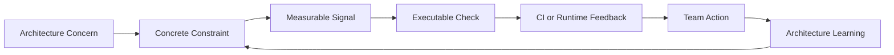
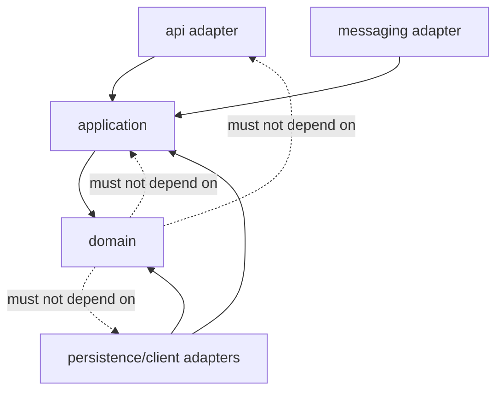
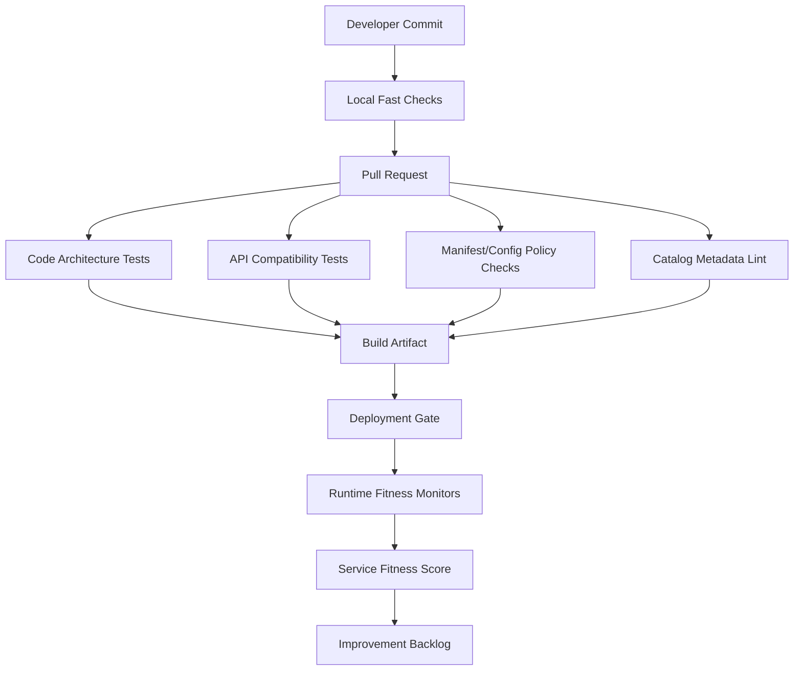

# Part 071 — Architecture Fitness Functions

## 1. Core Idea

Architecture is not protected by diagrams.

Architecture is protected by feedback.

A diagram can show the intended shape of the system:

- service boundaries
- allowed dependencies
- ownership rules
- data authority
- API contracts
- runtime topology
- security posture
- observability requirements

But a diagram does not stop code from drifting.

A developer can still add a forbidden dependency.

A service can still call another service directly instead of going through a contract.

A repository can still bypass a domain invariant.

A controller can still return a raw stack trace.

A new endpoint can still be shipped without telemetry.

A Kubernetes manifest can still deploy a Java service without readiness probes.

A service catalog can still say `owner: case-platform` while the real on-call rotation has moved to another team.

Architecture fitness functions exist to close that gap.

A fitness function is an executable check that answers:

> is the system still aligned with an architectural quality or constraint we care about?

The important word is **executable**.

Not a slide.

Not a review comment that people forget.

Not a policy hidden in a wiki.

A check.

It can run in:

- unit tests
- integration tests
- contract tests
- CI pipeline
- build plugins
- policy engines
- deployment gates
- runtime monitors
- service catalog audits
- SLO checks
- production readiness scans

The goal is not to automate every architecture decision.

The goal is to automate the parts of architecture that should not depend on memory.

---

## 2. Why This Matters in Microservices

Microservices decay faster than monoliths.

A monolith can become messy inside one deployable unit.

A microservice system can become messy across:

- many repositories
- many teams
- many runtime instances
- many databases
- many API contracts
- many queues/topics
- many deployment pipelines
- many cloud resources
- many ownership boundaries

Without feedback, the system slowly becomes a distributed monolith.

The symptoms are familiar:

- every service can call every other service
- shared libraries leak domain rules across boundaries
- teams modify each other's databases
- APIs break consumers unexpectedly
- service startup fails only in production
- dashboards exist but do not answer incident questions
- retries are configured inconsistently
- readiness probes lie
- service owners are unknown
- deprecated endpoints never die
- security rules exist but are not enforced

Architecture fitness functions turn those desired properties into continuous tests.

They make architecture observable and enforceable.

---

## 3. Mental Model

Think of architecture fitness functions as **architecture unit tests at multiple levels**.

Normal unit tests ask:

> does this method behave correctly?

Architecture fitness functions ask:

> does this system still have the shape, constraints, reliability posture, and operating model we intended?

A good architecture fitness function has five parts:

| Part | Question |
|---|---|
| Intent | What quality or constraint are we protecting? |
| Scope | What part of the system is checked? |
| Signal | What measurable evidence proves pass/fail/warn? |
| Enforcement | Where does the check run? |
| Owner | Who maintains and interprets the check? |

Example:

```yaml
fitnessFunction:
  id: ff-java-service-readiness-probe
  intent: "Every production Java service must expose truthful readiness semantics."
  scope: "Kubernetes Deployment manifests for production workloads"
  signal: "readinessProbe exists and points to a dedicated readiness endpoint"
  enforcement: "CI policy check + deployment gate"
  owner: "platform-runtime-team"
```

That is better than writing in a wiki:

> Services should have readiness probes.

Because the executable version can fail a pull request before production is affected.

---

## 4. Architecture Fitness Function Lifecycle

A fitness function also has a lifecycle.



Example:

1. Concern: services are becoming tightly coupled.
2. Constraint: domain packages must not depend on infrastructure packages.
3. Signal: static dependency graph.
4. Executable check: ArchUnit test.
5. Feedback: CI fails on dependency violation.
6. Action: developer moves dependency behind a port.
7. Learning: rule is useful; add exception mechanism only for approved cases.

This is evolutionary architecture in practice.

You do not freeze architecture.

You create feedback loops that allow architecture to evolve safely.

---

## 5. What Fitness Functions Are Not

They are not a replacement for thinking.

They are not a replacement for design reviews.

They are not magic quality gates.

They are not a reason to create a hostile CI pipeline.

They are not all binary.

Some are pass/fail.

Some are warning-only.

Some are score-based.

Some are trend-based.

Some are human-reviewed but evidence-backed.

The mistake is assuming every architecture quality can be reduced to a simple rule.

It cannot.

But many recurring mistakes can be detected automatically.

That is enough to create leverage.

---

## 6. Taxonomy of Fitness Functions

### 6.1 Static Fitness Functions

Static checks inspect artifacts before runtime:

- Java source code
- package dependencies
- compiled bytecode
- Maven dependencies
- OpenAPI specifications
- AsyncAPI specifications
- protobuf definitions
- Kubernetes manifests
- Helm values
- Terraform modules
- Dockerfiles
- service catalog metadata

Examples:

- domain layer must not import Spring Web
- controller must not depend on JPA repository directly
- service must not expose `/internal` endpoint publicly
- no snapshot Maven dependency in production branch
- Kubernetes Deployment must define resource requests and limits
- service catalog must include owner, lifecycle, SLO, and runbook

Static checks are cheap.

Run them early.

Run them often.

### 6.2 Dynamic Fitness Functions

Dynamic checks execute the system or part of it:

- integration tests
- contract tests
- resilience tests
- startup tests
- container tests
- smoke tests
- synthetic probes
- chaos experiments
- load tests
- failover drills

Examples:

- service starts with production-like configuration
- readiness remains false until DB migration is complete
- client respects timeout and deadline policy
- service returns valid Problem Details for validation errors
- consumer deduplicates repeated event delivery
- circuit breaker opens after dependency failures

Dynamic checks are more expensive.

Use them where static checks cannot prove behavior.

### 6.3 Runtime Fitness Functions

Runtime checks observe production or staging behavior:

- SLO compliance
- error budget burn
- latency percentiles
- dependency graph drift
- retry rate
- queue lag
- log schema compliance
- trace propagation success
- service catalog vs runtime inventory mismatch

Examples:

- 99th percentile latency must stay under the SLO threshold
- every inbound request must have trace context
- every service must emit deployment version metadata
- no service may have unknown owner in production
- deprecated endpoint traffic must trend toward zero

Runtime checks are critical because some architecture properties only appear under real traffic.

### 6.4 Socio-Technical Fitness Functions

Some architecture properties are about people and ownership:

- every service has a single accountable owning team
- every service has an on-call rotation
- every production service has a runbook
- every critical dependency has escalation contact
- every service has a retirement owner
- every API has a documented lifecycle policy

These are often checked through service catalog metadata plus runtime inventory.

They are not “soft” just because they involve teams.

A service without owner is a production risk.

---

## 7. Fitness Function Dimensions for Java Microservices

The following catalog is a starting point.

Do not apply every rule blindly.

Use the rules that protect real architectural decisions.

| Dimension | Example Fitness Function | Enforcement |
|---|---|---|
| Boundary | Domain package cannot import infrastructure package | ArchUnit / Spring Modulith |
| API compatibility | OpenAPI changes must be backward compatible | CI contract check |
| Data ownership | Service cannot connect to another service database | config policy + network policy |
| Reliability | Outbound HTTP calls must have timeout | static code scan + integration test |
| Resilience | Retry policy must include bounded attempts and jitter | config policy |
| Observability | Every service must emit trace/log correlation fields | integration test + runtime audit |
| Security | Internal admin endpoints require restricted network/policy | manifest policy |
| Privacy | Sensitive fields must not be logged | logging tests + scanner |
| Operability | Production service must have readiness/liveness/startup probes | Kubernetes policy check |
| Ownership | Service catalog must define owner/on-call/runbook | catalog lint |
| Deployment | Production deployment must define resource requests/limits | manifest policy |
| Governance | ADR must exist for new service boundary | PR template + catalog gate |

---

## 8. Boundary Fitness Functions in Java

The first place to add fitness functions is inside the Java service.

Why?

Because dependency drift starts in code.

A clean architecture diagram means nothing if the code says otherwise.

Suppose the intended dependency direction is:



The domain must not depend on:

- Spring MVC
- JPA annotations, if persistence ignorance is a goal
- HTTP clients
- Kafka clients
- database migration libraries
- controller DTOs
- external API DTOs

### 8.1 ArchUnit Example

```java
package com.acme.caseintake.arch;

import com.tngtech.archunit.core.domain.JavaClasses;
import com.tngtech.archunit.core.importer.ClassFileImporter;
import org.junit.jupiter.api.Test;

import static com.tngtech.archunit.lang.syntax.ArchRuleDefinition.noClasses;

class ArchitectureRulesTest {

    private final JavaClasses classes = new ClassFileImporter()
        .importPackages("com.acme.caseintake");

    @Test
    void domainMustNotDependOnFrameworks() {
        noClasses()
            .that()
            .resideInAPackage("..domain..")
            .should()
            .dependOnClassesThat()
            .resideInAnyPackage(
                "org.springframework..",
                "jakarta.persistence..",
                "org.hibernate..",
                "org.apache.kafka..",
                "com.fasterxml.jackson.."
            )
            .because("domain model must express business rules, not framework integration")
            .check(classes);
    }

    @Test
    void controllersMustNotCallRepositoriesDirectly() {
        noClasses()
            .that()
            .resideInAPackage("..adapter.in.web..")
            .should()
            .dependOnClassesThat()
            .resideInAPackage("..adapter.out.persistence..")
            .because("controllers should go through application use cases")
            .check(classes);
    }
}
```

This is not academic purity.

It protects evolvability.

If controllers directly call repositories, business workflows leak into transport code.

If domain code imports HTTP clients, business rules become integration scripts.

If JPA annotations dominate the domain model, persistence constraints can silently become domain constraints.

### 8.2 Spring Modulith Verification

For modular Spring Boot services or modular monoliths, Spring Modulith can verify module structure.

Example:

```java
package com.acme.enforcement;

import org.junit.jupiter.api.Test;
import org.springframework.modulith.core.ApplicationModules;

class ModuleStructureTest {

    @Test
    void verifiesApplicationModuleBoundaries() {
        ApplicationModules.of(EnforcementApplication.class).verify();
    }
}
```

This verifies whether logical modules follow intended modularity constraints.

This is useful when a service contains several internal capabilities:

```text
com.acme.enforcement
  ├── caseintake
  ├── evidence
  ├── escalation
  ├── decision
  └── sharedkernel
```

The point is not to make every package private forever.

The point is to make module coupling visible.

---

## 9. API Fitness Functions

Microservices communicate through contracts.

If contracts drift, independent deployability dies.

API fitness functions should protect:

- backward compatibility
- error response shape
- idempotency behavior
- pagination rules
- auth requirement metadata
- deprecated endpoint lifecycle
- consumer impact visibility

### 9.1 REST API Compatibility

Example rule:

```yaml
id: ff-openapi-compatible-change
intent: "REST API changes must be backward compatible unless an approved breaking-change ADR exists."
scope: "openapi.yaml"
signal:
  - no removed paths
  - no removed response fields consumed by known clients
  - no narrowed enum without compatibility window
  - no required request field added to existing operation
enforcement: "CI contract check"
owner: "api-platform-team"
```

A common failure:

```diff
 CaseResponse:
   type: object
   properties:
-    status:
-      type: string
+    lifecycleStatus:
+      type: string
```

This looks like a rename.

For consumers, it is a breaking removal plus a new field.

A compatibility-first rollout would be:

```yaml
CaseResponse:
  type: object
  properties:
    status:
      type: string
      deprecated: true
    lifecycleStatus:
      type: string
```

Then remove `status` only after deprecation window and traffic validation.

### 9.2 Error Contract Fitness

Every service should return consistent error shapes.

Example check:

- validation error returns `400`
- authorization failure returns `403`
- unknown resource returns `404`
- conflict returns `409`
- error body follows Problem Details shape
- correlation ID appears in response header and log

Test example:

```java
@Test
void validationErrorUsesProblemDetails() throws Exception {
    mockMvc.perform(post("/cases")
            .contentType("application/json")
            .content("{}"))
        .andExpect(status().isBadRequest())
        .andExpect(jsonPath("$.type").exists())
        .andExpect(jsonPath("$.title").exists())
        .andExpect(jsonPath("$.status").value(400))
        .andExpect(jsonPath("$.traceId").exists());
}
```

---

## 10. Data Ownership Fitness Functions

Data ownership is one of the strongest microservices constraints.

A service should not read or write another service's private database.

A good fitness function can check this at several layers.

### 10.1 Configuration Scan

```yaml
id: ff-no-cross-service-db-connection
intent: "A service must not connect to another service's private database."
scope: "application.yaml, Helm values, runtime secret references"
signal: "datasource host/database name must match approved service ownership metadata"
enforcement: "CI + runtime catalog audit"
owner: "platform-data-governance"
```

Bad smell:

```yaml
spring:
  datasource:
    url: jdbc:postgresql://decision-db.prod:5432/decision
```

inside `case-intake-service`.

Possible exception:

- temporary migration bridge
- read-only reporting replica with approved contract
- explicitly time-boxed strangler phase

But exceptions must have:

- ADR
- owner
- expiry date
- migration plan
- monitoring

### 10.2 Network Policy

Even if configuration is wrong, network should make forbidden connections hard.

```yaml
apiVersion: networking.k8s.io/v1
kind: NetworkPolicy
metadata:
  name: case-intake-egress
spec:
  podSelector:
    matchLabels:
      app: case-intake-service
  policyTypes:
    - Egress
  egress:
    - to:
        - podSelector:
            matchLabels:
              app: case-intake-db
      ports:
        - protocol: TCP
          port: 5432
```

This is an infrastructure-level fitness function.

The architecture rule is data ownership.

The enforcement mechanism is network policy.

---

## 11. Reliability Fitness Functions

Reliability rules should not rely on developer memory.

Common Java microservice reliability checks:

| Rule | Why It Matters |
|---|---|
| Every outbound call has timeout | prevents thread/resource exhaustion |
| Retry attempts are bounded | prevents retry storm |
| Retry only on retry-safe failure | avoids duplicate business side effects |
| Circuit breaker exists for critical remote dependency | prevents cascade |
| Bulkhead/concurrency limit exists for slow dependency | prevents pool exhaustion |
| Queue consumer has bounded processing concurrency | prevents DB overload |
| Idempotency is implemented for retryable commands | prevents duplicate side effects |

### 11.1 Timeout Fitness Function

```yaml
id: ff-outbound-timeout-policy
intent: "All outbound network calls must have explicit timeout and deadline budget."
scope: "Java HTTP/gRPC clients"
signal:
  - connect timeout configured
  - response/read timeout configured
  - request-level deadline propagated
enforcement: "static code scan + integration tests"
owner: "sre-platform"
```

Example Java HTTP client:

```java
@Bean
HttpClient caseDecisionHttpClient() {
    return HttpClient.newBuilder()
        .connectTimeout(Duration.ofMillis(500))
        .version(HttpClient.Version.HTTP_2)
        .build();
}

HttpRequest request = HttpRequest.newBuilder()
    .uri(uri)
    .timeout(Duration.ofMillis(1200))
    .GET()
    .build();
```

Fitness tests can ensure a dependency timeout is lower than the caller's end-to-end budget.

### 11.2 Retry Policy Fitness Function

```yaml
id: ff-retry-policy-safe
intent: "Retries must be bounded, jittered, and only used for retry-safe operations."
scope: "resilience configuration"
signal:
  - maxAttempts <= approved limit
  - waitDuration configured
  - jitter/randomization enabled
  - no retry on 400/401/403/404/409
enforcement: "config lint + integration test"
owner: "sre-platform"
```

Bad retry policy:

```yaml
retry:
  maxAttempts: 10
  waitDuration: 10ms
```

Better policy:

```yaml
retry:
  maxAttempts: 3
  waitDuration: 100ms
  exponentialBackoffMultiplier: 2
  randomizedWait: true
  retryOn:
    - TIMEOUT
    - CONNECTION_RESET
    - HTTP_502
    - HTTP_503
    - HTTP_504
```

---

## 12. Observability Fitness Functions

A service is not production-ready if it cannot explain itself.

Fitness functions should check whether telemetry exists and whether it is useful.

### 12.1 Logging Fitness

```yaml
id: ff-structured-log-schema
intent: "Production logs must be structured and correlated."
scope: "runtime logs"
signal:
  - service.name exists
  - service.version exists
  - environment exists
  - trace_id exists where request context exists
  - event_name exists for business-significant events
  - no forbidden sensitive fields
enforcement: "log pipeline validation + sample integration test"
owner: "observability-platform"
```

### 12.2 Trace Propagation Fitness

```yaml
id: ff-trace-propagation
intent: "Trace context must propagate across synchronous and asynchronous boundaries."
scope: "HTTP, gRPC, messaging"
signal:
  - inbound traceparent accepted
  - outbound call emits child span
  - message header carries trace context
  - logs include trace_id
enforcement: "integration test + runtime trace audit"
owner: "observability-platform"
```

### 12.3 Metrics Fitness

```yaml
id: ff-core-service-metrics
intent: "Every service must emit minimum operational signals."
scope: "metrics endpoint"
signal:
  - request count
  - request duration histogram
  - error count
  - dependency latency
  - JVM memory
  - thread count
  - executor queue depth if applicable
  - consumer lag if applicable
enforcement: "smoke test + dashboard generator"
owner: "sre-platform"
```

---

## 13. Security Fitness Functions

Security rules are some of the best candidates for fitness functions.

They should be explicit, automated, and hard to bypass.

Examples:

| Security Rule | Fitness Signal |
|---|---|
| No public admin endpoint | Ingress/gateway route scan |
| mTLS required for service-to-service traffic | mesh policy scan |
| Secrets must not be in plain Kubernetes manifests | manifest scan |
| Containers must not run as root | securityContext policy |
| Images must be pinned and scanned | image policy |
| API must define auth requirement | OpenAPI metadata scan |
| Sensitive logs forbidden | log schema scan |

### 13.1 OPA/Rego Example for Kubernetes Manifests

```rego
package kubernetes.security

deny[msg] {
  input.kind == "Deployment"
  container := input.spec.template.spec.containers[_]
  not container.securityContext.runAsNonRoot
  msg := sprintf("container %s must run as non-root", [container.name])
}

deny[msg] {
  input.kind == "Deployment"
  container := input.spec.template.spec.containers[_]
  not container.resources.requests.cpu
  msg := sprintf("container %s must define cpu request", [container.name])
}

deny[msg] {
  input.kind == "Deployment"
  container := input.spec.template.spec.containers[_]
  not container.resources.requests.memory
  msg := sprintf("container %s must define memory request", [container.name])
}
```

This is architecture governance as code.

The rule says:

> production workloads must be resource-bounded and not run as root.

The enforcement can run in CI before deployment.

---

## 14. Service Catalog Fitness Functions

A service catalog is not useful if metadata is stale.

Fitness functions can check metadata completeness and runtime consistency.

Example `catalog-info.yaml`:

```yaml
apiVersion: backstage.io/v1alpha1
kind: Component
metadata:
  name: case-intake-service
  description: Handles intake lifecycle for regulatory enforcement cases.
  tags:
    - java
    - microservice
    - enforcement
  annotations:
    runbook: https://internal/runbooks/case-intake
    dashboard: https://internal/dashboards/case-intake
    slo: https://internal/slo/case-intake
spec:
  type: service
  lifecycle: production
  owner: team-case-platform
  system: enforcement-platform
  providesApis:
    - case-intake-api
  consumesApis:
    - party-risk-api
```

Fitness rules:

- production service must have owner
- production service must have runbook
- production service must have dashboard
- production service must have SLO
- owner must map to active team
- runtime deployment must map to catalog component
- deprecated service must have retirement date

Catalog fitness is how you prevent invisible production assets.

---

## 15. Architecture Fitness Function Design Template

Use this template before writing the check.

```yaml
id: ff-
name:
architectureConcern:
qualityAttribute:
constraint:
scope:
signal:
passCondition:
failCondition:
warningCondition:
enforcementPoint:
  - local-test
  - ci
  - deployment-gate
  - runtime-monitor
owner:
exceptionPolicy:
expiryPolicy:
links:
  adr:
  runbook:
  dashboard:
```

Example:

```yaml
id: ff-domain-dependency-direction
name: Domain Dependency Direction
architectureConcern: Domain model must not depend on framework or infrastructure code.
qualityAttribute: maintainability
a constraint: Domain packages may depend only on domain and Java standard library packages.
scope: Java source and bytecode for case-intake-service
signal: ArchUnit dependency graph
passCondition: no forbidden dependency from ..domain.. to adapter/framework packages
failCondition: any forbidden dependency exists
warningCondition: dependency on sharedkernel package grows beyond approved surface
enforcementPoint:
  - local-test
  - ci
owner: team-case-platform
exceptionPolicy: exception requires ADR and expiry date
expiryPolicy: exception must be reviewed every 30 days
links:
  adr: ADR-018-domain-boundary
  runbook: n/a
  dashboard: n/a
```

Note the typo risk above: `a constraint` should be `constraint` in real YAML.

Even the template should be linted.

---

## 16. Fitness Function Enforcement Points

### 16.1 Local Developer Loop

Run fast rules locally:

- formatting
- dependency direction
- module boundary
- unit-level architecture tests
- config validation

Goal:

> catch violations before push.

### 16.2 Pull Request CI

Run standard rules:

- Java architecture tests
- API compatibility checks
- contract tests
- manifest policy checks
- dependency vulnerability checks
- service catalog lint

Goal:

> prevent unsafe changes from merging.

### 16.3 Deployment Gate

Run environment-aware rules:

- production manifest validation
- image policy
- required probes
- resource limits
- secret references
- network policy
- runtime owner mapping

Goal:

> prevent unsafe artifacts from entering production.

### 16.4 Runtime Monitor

Run living rules:

- SLO health
- telemetry completeness
- service inventory drift
- deprecated traffic
- dependency graph drift
- error budget burn

Goal:

> detect architecture drift after deployment.

---

## 17. Binary vs Scored Fitness Functions

Not all checks should fail the build.

### Binary

Use binary pass/fail for rules that are clear and high-confidence:

- no plaintext secret in repo
- no controller directly using repository
- production deployment must have readiness probe
- production service must have owner
- no removed API field without compatibility ADR

### Scored

Use score when quality has gradients:

- service maturity
- observability completeness
- test coverage of critical paths
- dependency risk
- ownership health
- deprecation progress

Example score:

```yaml
service: case-intake-service
fitnessScore:
  boundary: 95
  reliability: 88
  observability: 92
  security: 90
  ownership: 100
  lifecycle: 85
overall: 91
```

Scores should guide improvement.

They should not become vanity metrics.

---

## 18. Exceptions Without Destroying the System

Architecture rules need exceptions.

But exceptions must be visible and temporary.

Bad exception:

> “Ignore this because release is urgent.”

Good exception:

```yaml
exception:
  rule: ff-no-cross-service-db-connection
  service: case-intake-service
  reason: "Temporary read bridge during Decision DB migration."
  approvedBy: "architecture-review-board"
  owner: "team-case-platform"
  expiresOn: "2026-09-30"
  migrationPlan: "ADR-044-decision-db-strangler"
  monitoring:
    metric: "cross_service_db_queries_total"
    alert: "bridge traffic increases after migration freeze"
```

An exception without expiry is a new architecture.

Treat it that way.

---

## 19. Fitness Function Catalog for This Series

The previous parts already implied many rules.

Here is a consolidated catalog.

### 19.1 Boundary

```yaml
- id: ff-service-has-boundary-adr
  check: new service requires boundary ADR
- id: ff-domain-no-framework-dependency
  check: domain package cannot import framework/infrastructure
- id: ff-no-god-gateway
  check: gateway repo cannot contain domain workflow package
- id: ff-no-cross-service-domain-library
  check: shared library cannot contain mutable domain model
```

### 19.2 API

```yaml
- id: ff-openapi-backward-compatible
  check: no breaking REST contract change without approved plan
- id: ff-problem-details-error-contract
  check: error responses follow agreed error shape
- id: ff-idempotent-command-endpoint
  check: retryable command endpoint supports idempotency key
```

### 19.3 Data

```yaml
- id: ff-database-private-to-service
  check: service connects only to owned database
- id: ff-outbox-required-for-integration-events
  check: state change + integration event uses outbox
- id: ff-read-model-staleness-documented
  check: query-side service declares staleness contract
```

### 19.4 Reliability

```yaml
- id: ff-outbound-timeout-required
  check: outbound clients define timeout/deadline
- id: ff-retry-policy-bounded
  check: retry max attempts and backoff are bounded
- id: ff-no-retry-on-business-conflict
  check: no retry on 400/401/403/404/409
- id: ff-critical-dependency-circuit-breaker
  check: critical dependencies have circuit breaker policy
```

### 19.5 Observability

```yaml
- id: ff-structured-logs
  check: service emits structured logs with trace_id
- id: ff-otel-trace-propagation
  check: trace context crosses HTTP/messaging boundaries
- id: ff-core-metrics
  check: service emits RED/USE metrics where applicable
- id: ff-runbook-linked-alert
  check: paging alert references a runbook
```

### 19.6 Security and Privacy

```yaml
- id: ff-no-public-admin-route
  check: admin endpoints are not exposed through public ingress
- id: ff-no-sensitive-log-field
  check: logs do not contain forbidden sensitive fields
- id: ff-container-run-as-non-root
  check: production container runs as non-root
- id: ff-secret-not-plain-manifest
  check: manifests do not contain raw secret values
```

### 19.7 Operations

```yaml
- id: ff-production-service-has-owner
  check: catalog owner maps to active team
- id: ff-production-service-has-runbook
  check: catalog includes runbook link
- id: ff-deprecated-endpoint-traffic-decreasing
  check: deprecated endpoint traffic trends down
- id: ff-service-catalog-runtime-reconciliation
  check: every runtime workload maps to catalog component
```

---

## 20. Example: Full Fitness Function Set for a Java Service

Imagine `case-intake-service`.

Minimum fitness set:

```text
case-intake-service
├── code fitness
│   ├── domain dependency direction
│   ├── controller -> application -> domain flow
│   ├── no direct adapter-to-adapter workflow
│   └── no forbidden shared domain library
├── contract fitness
│   ├── OpenAPI compatibility
│   ├── Problem Details error shape
│   ├── idempotency key for commands
│   └── event schema compatibility
├── data fitness
│   ├── connects only to owned DB
│   ├── outbox required for integration events
│   └── consumer inbox dedupe for subscribed events
├── runtime fitness
│   ├── explicit timeouts
│   ├── bounded retries
│   ├── readiness/liveness/startup probes
│   ├── resource requests/limits
│   └── graceful shutdown signal test
├── observability fitness
│   ├── structured logs
│   ├── trace propagation
│   ├── RED metrics
│   ├── SLO dashboard
│   └── runbook-linked alerts
└── governance fitness
    ├── catalog owner
    ├── lifecycle state
    ├── runbook
    ├── boundary ADR
    └── data classification
```

This becomes the production readiness baseline.

---

## 21. Architecture Fitness Pipeline



The pipeline should be staged.

Do not run expensive tests before cheap checks.

Do not page humans for issues that can be fixed before merge.

Do not block delivery on low-confidence rules.

Start warning-only, measure false positives, then promote to blocking.

---

## 22. How to Introduce Fitness Functions Without Rebellion

Teams resist architecture checks when they feel arbitrary.

Use this rollout model:

### Step 1 — Pick painful recurring failures

Do not start with aesthetic rules.

Start with failures that already hurt:

- production service without readiness probe
- unbounded retry causing overload
- API breaking consumer
- unknown service owner during incident
- logs missing trace ID

### Step 2 — Write rule with examples

Show:

- why the rule exists
- what failure it prevents
- good example
- bad example
- exception process

### Step 3 — Run warning-only

Collect:

- number of violations
- false positives
- unclear cases
- remediation effort

### Step 4 — Fix platform gaps

Sometimes teams violate rules because the platform makes the right thing hard.

If every service lacks trace propagation, provide a starter library or template.

If every service lacks resource limits, fix the Helm chart default.

### Step 5 — Make blocking only when fair

A blocking rule is fair when:

- intent is clear
- implementation path is documented
- exception process exists
- false positives are low
- platform support exists

---

## 23. Bad Fitness Functions

A bad fitness function creates noise or fake confidence.

### 23.1 Too Vague

Bad:

```yaml
rule: Service must be well-designed.
```

Good:

```yaml
rule: Domain package must not import infrastructure adapter package.
```

### 23.2 Too Tool-Centric

Bad:

```yaml
rule: Every service must use Tool X.
```

Better:

```yaml
rule: Every service must emit traces compatible with the organization tracing backend.
```

The quality is observability, not tool usage.

### 23.3 Too Easy to Game

Bad:

```yaml
rule: Test coverage must be above 80%.
```

This can encourage meaningless tests.

Better:

```yaml
rule: Critical command handlers must have invariant tests, idempotency tests, and failure-path tests.
```

### 23.4 Too Late

Bad:

```yaml
rule: Discover missing owner during incident.
```

Good:

```yaml
rule: Production catalog entry must map to active owner and on-call rotation before deployment.
```

### 23.5 Too Strict Too Early

If a new rule finds 500 violations across legacy services, do not instantly fail every build.

Use staged enforcement:

- new services must comply now
- changed services must not worsen
- legacy services get remediation deadline
- high-risk services prioritized first

---

## 24. Fitness Functions and Architecture Review

Fitness functions do not remove architecture review.

They improve it.

Without fitness functions, review asks:

> did you remember all the rules?

With fitness functions, review asks:

> are these the right rules for this system?

That is a better use of senior engineering time.

Review should focus on:

- trade-offs
- exceptions
- risk acceptance
- boundary decisions
- failure modes
- operational model
- evolution path

Fitness functions handle repeatable checks.

Architects handle judgment.

---

## 25. Fitness Function ADR Example

```md
# ADR-071-001: Enforce Java Service Architecture Fitness Functions

## Status
Accepted

## Context
Several Java microservices have drifted from the intended architecture.
Common violations include controllers calling repositories directly,
missing outbound timeouts, missing readiness probes, and stale service catalog metadata.
Manual review catches these inconsistently.

## Decision
We will introduce architecture fitness functions in four layers:

1. Java code architecture tests using ArchUnit or Spring Modulith.
2. API compatibility checks in CI.
3. Kubernetes/config policy checks using policy-as-code.
4. Runtime catalog and observability audits.

New production services must pass the baseline set.
Existing services will first run warning-only, then graduate to blocking for selected high-confidence rules.

## Consequences
Positive:
- architectural drift becomes visible earlier
- production readiness becomes measurable
- teams get faster feedback
- governance becomes less meeting-driven

Negative:
- CI becomes more complex
- false positives are possible
- rule ownership must be maintained
- legacy services need remediation plan

## Exceptions
Exceptions require ADR, owner, expiry date, and monitoring signal.
```

---

## 26. Fitness Function Review Checklist

Before adding a new rule, ask:

- What real failure does this rule prevent?
- Is the rule protecting an architecture decision or just a preference?
- Can it be measured objectively?
- Where should it run: local, CI, deployment, runtime?
- Should it block or warn?
- Who owns false positives?
- How does a team fix the violation?
- Is there a documented exception path?
- Is the rule applicable to all services or only a service class?
- Does the platform provide a golden path for compliance?

If you cannot answer these, the rule is not ready.

---

## 27. Deep Example: Preventing Distributed Monolith Drift

Concern:

> services are becoming independently deployed but tightly coupled in release timing and data access.

Fitness functions:

```yaml
- id: ff-no-cross-service-db-access
  enforcement: config scan + network policy

- id: ff-api-backward-compatible
  enforcement: API diff in CI

- id: ff-no-shared-domain-model-library
  enforcement: Maven dependency scan

- id: ff-consumer-contract-passing
  enforcement: contract test pipeline

- id: ff-deployment-independence-score
  enforcement: runtime/release analytics
```

Deployment independence score could use:

- how often service A must deploy with service B
- how often API changes require coordinated release
- how often rollback of one service requires rollback of another
- how often DB migration requires multiple services to change at once

This is architecture intelligence.

It converts “I feel like we are coupled” into evidence.

---

## 28. Exercise

Take one Java microservice you know.

Create a fitness function set with at least ten checks:

1. two boundary checks
2. two API checks
3. two data ownership checks
4. two reliability checks
5. one observability check
6. one ownership/governance check

For each check, define:

- intent
- signal
- enforcement point
- owner
- exception policy

Then mark each as:

- block now
- warn now, block later
- observe only

The senior-level skill is not writing many checks.

The senior-level skill is choosing the few checks that protect the architecture from the failures your organization actually experiences.

---

## 29. Summary

Architecture fitness functions are executable architecture feedback.

They turn architecture from static intent into continuous evidence.

For Java microservices, they are especially valuable because drift happens across code, contracts, configuration, runtime topology, observability, security, ownership, and lifecycle metadata.

Use them to protect:

- service boundaries
- dependency direction
- API compatibility
- data ownership
- reliability policy
- observability baseline
- security posture
- production readiness
- service ownership
- lifecycle governance

Do not use them as bureaucracy.

Use them as guardrails.

A top-tier engineer does not merely say:

> “This is our architecture.”

They build the feedback system that proves whether the architecture is still true.
