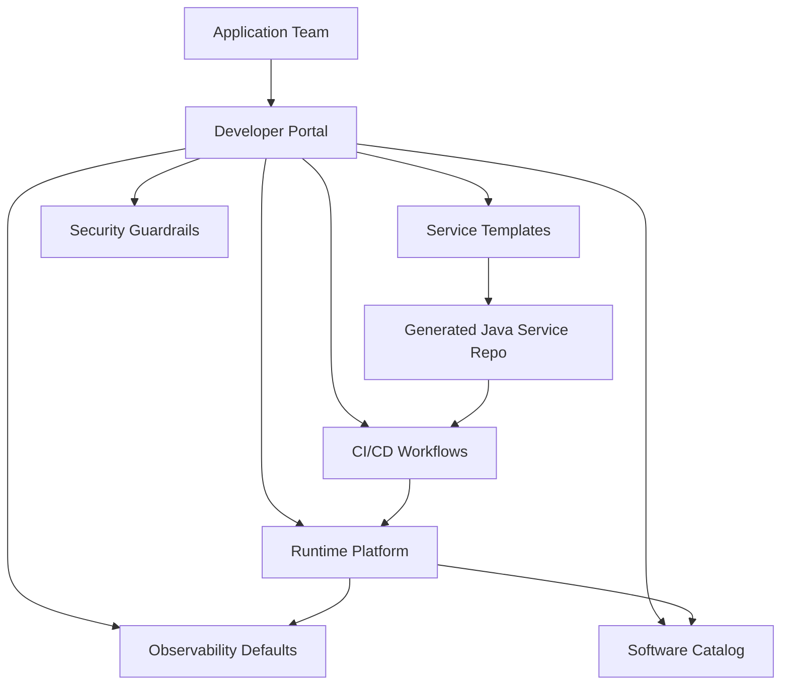
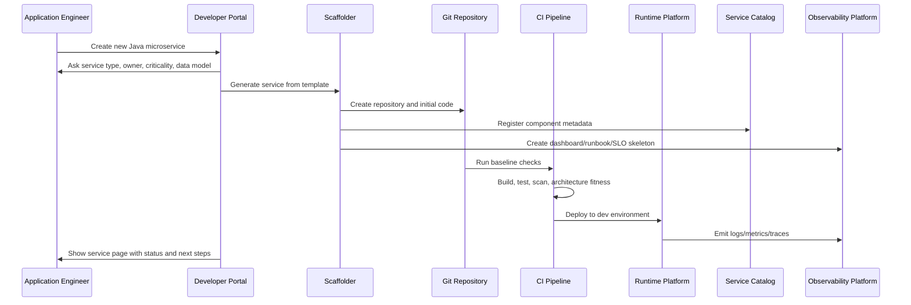
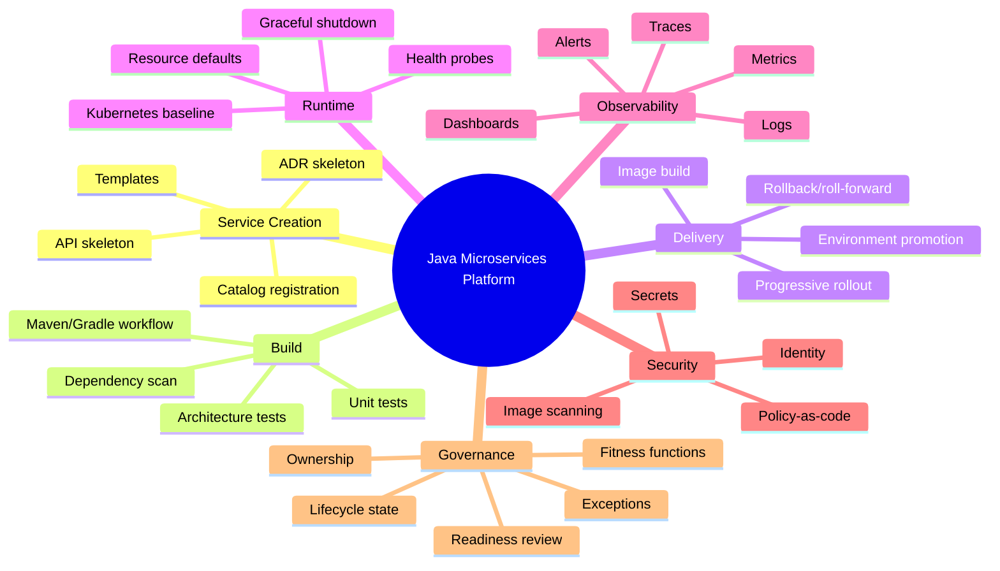
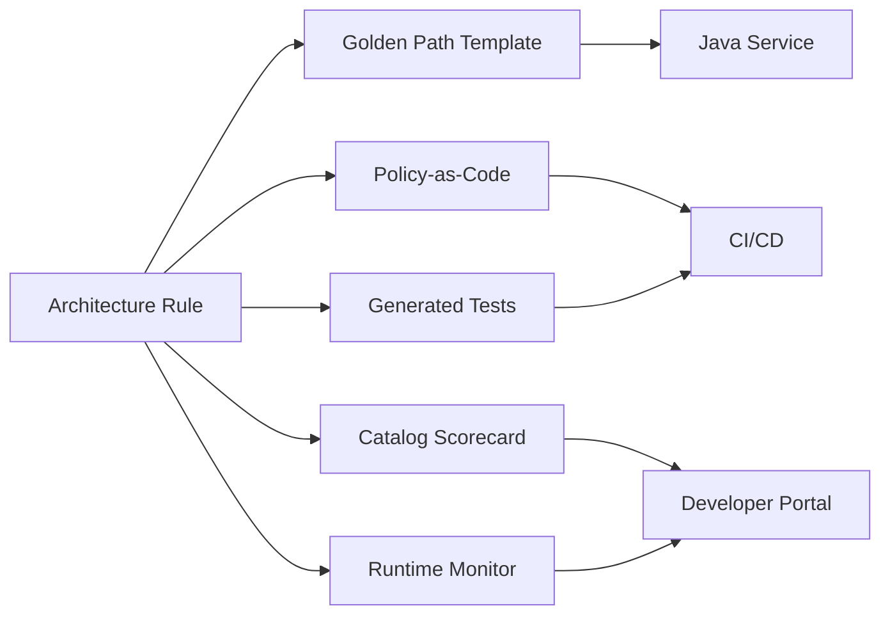

# Part 072 — Platform Engineering for Java Microservices

## 1. Core Idea

Microservices multiply operational responsibility.

Every service needs:

- repository structure
- build pipeline
- artifact packaging
- container image
- configuration model
- secrets integration
- deployment manifest
- health checks
- metrics
- logs
- traces
- dashboards
- alerts
- runbook
- ownership metadata
- API contract lifecycle
- dependency policy
- security baseline
- rollout strategy
- incident response path

If every team invents all of this independently, the organization pays the microservices tax repeatedly.

Platform engineering exists to reduce that tax.

A platform is not merely Kubernetes.

A platform is not merely CI/CD.

A platform is not merely a shared library.

A platform is a product that gives application teams a reliable, self-service way to build, deploy, operate, and evolve services with good defaults and explicit guardrails.

The best platform does not make engineers powerless.

It makes the right thing easy.

---

## 2. Why Platform Engineering Matters for Java Microservices

Java microservices are powerful but heavy enough to need discipline.

A production Java service must care about:

- JVM memory envelope
- thread pools
- connection pools
- startup time
- graceful shutdown
- classpath dependency risk
- observability instrumentation
- runtime configuration
- serialization compatibility
- native image or JVM trade-offs when relevant
- container resource requests/limits
- service discovery and client behavior

If every team has to rediscover this from scratch, quality becomes uneven.

Some teams will set timeouts correctly.

Some will forget.

Some will emit structured logs.

Some will log PII.

Some will publish useful metrics.

Some will expose dashboards that are decorative.

Some will define readiness honestly.

Some will return `200 OK` from health checks while the service cannot serve traffic.

Platform engineering turns these repeated decisions into a paved road.

---

## 3. Platform vs Framework vs Library

These are different.

| Thing | Purpose | Example |
|---|---|---|
| Framework | Helps implement application behavior | Spring Boot, Quarkus, Micronaut |
| Library | Reusable code inside application | shared error handling, tracing helper |
| Platform | Self-service system for delivery and operations | service template, CI, deploy, catalog, observability, policy |
| Golden path | Recommended end-to-end way of doing common work | create Java service -> deploy -> monitor |
| Guardrail | Constraint that prevents unsafe drift | policy check, architecture fitness function |

A platform can include frameworks and libraries.

But a platform is broader.

It coordinates the entire developer journey.

---

## 4. The Platform Engineering Mental Model

A platform should expose a product interface to internal engineering teams.



The application team should not need to know every internal detail to create a production-ready service.

But they must still understand the architecture.

Platform engineering does not remove engineering judgment.

It removes repetitive ceremony.

---

## 5. Golden Path

A golden path is an opinionated, supported route for common engineering tasks.

For Java microservices, the golden path might be:

1. create service from template
2. define service charter
3. generate repository and package structure
4. generate OpenAPI skeleton
5. generate Dockerfile and build pipeline
6. generate deployment manifests
7. register service in catalog
8. configure observability defaults
9. create dashboard and alert skeleton
10. publish runbook template
11. deploy to dev environment
12. run production readiness checks
13. promote through environments

A golden path is not a prison.

Teams can leave it when they need to.

But leaving it should be a conscious decision with known cost.

---

## 6. Paved Road vs Mandated Road

A paved road says:

> here is the fastest, safest, best-supported way to ship a Java microservice.

A mandated road says:

> you must do this because the platform team said so.

The paved road wins when it is genuinely better.

It should provide:

- less boilerplate
- faster onboarding
- fewer production incidents
- easier compliance
- better observability
- safer deployment
- simpler upgrades
- clear documentation
- supported escape hatches

If teams avoid the platform, do not immediately blame the teams.

Ask:

- is the platform slower?
- is it too rigid?
- does it hide too much?
- are error messages bad?
- does it force irrelevant standards?
- does it require tickets for self-service tasks?
- does it solve yesterday's problems but not today's?

A platform is a product.

Measure adoption and satisfaction.

---

## 7. Platform as Product

Internal platforms fail when they are treated as infrastructure projects instead of products.

A product has users.

The users are engineering teams.

A product has journeys.

Examples:

- create a new Java microservice
- add a new API endpoint
- configure a new dependency
- rotate a credential
- deploy a canary
- inspect service health
- debug a production incident
- deprecate an API
- retire a service

A product has feedback.

Platform team should track:

- time to first deploy
- time to production readiness
- number of manual tickets per service
- CI failure clarity
- template adoption rate
- platform escape rate
- incident rate by service generation/version
- upgrade lag
- developer satisfaction
- golden path completion rate

A product has roadmap.

The roadmap should be driven by friction and risk, not platform fashion.

---

## 8. Internal Developer Platform Components

A Java microservices platform usually has these components:

```text
Internal Developer Platform
├── Developer portal
│   ├── service catalog
│   ├── API catalog
│   ├── ownership metadata
│   ├── docs and runbooks
│   └── golden path entry points
├── Scaffolding
│   ├── Java service template
│   ├── worker service template
│   ├── BFF template
│   ├── event consumer template
│   └── library/module template
├── CI/CD workflows
│   ├── build
│   ├── test
│   ├── security scan
│   ├── contract verification
│   ├── image publish
│   └── deployment promotion
├── Runtime platform
│   ├── Kubernetes baseline
│   ├── ingress/gateway
│   ├── service mesh if used
│   ├── secret integration
│   └── autoscaling defaults
├── Observability platform
│   ├── OpenTelemetry instrumentation
│   ├── log pipeline
│   ├── metrics backend
│   ├── tracing backend
│   ├── dashboards
│   └── alert templates
├── Security/compliance guardrails
│   ├── policy-as-code
│   ├── image scanning
│   ├── dependency scanning
│   ├── secret scanning
│   └── audit logging standards
└── Governance automation
    ├── service lifecycle states
    ├── production readiness checks
    ├── architecture fitness functions
    ├── exception tracking
    └── retirement workflow
```

The platform becomes the integration surface between application teams and operational excellence.

---

## 9. The Java Service Template

The service template is one of the highest-leverage platform assets.

It should not be a toy starter project.

It should encode the baseline architecture.

Example generated structure:

```text
case-intake-service/
├── README.md
├── catalog-info.yaml
├── docs/
│   ├── adr/
│   ├── runbook.md
│   ├── api-lifecycle.md
│   └── operational-model.md
├── api/
│   └── openapi.yaml
├── src/
│   ├── main/java/com/acme/caseintake/
│   │   ├── CaseIntakeApplication.java
│   │   ├── api/
│   │   │   ├── web/
│   │   │   └── error/
│   │   ├── application/
│   │   │   ├── command/
│   │   │   ├── query/
│   │   │   └── port/
│   │   ├── domain/
│   │   │   ├── model/
│   │   │   ├── event/
│   │   │   └── policy/
│   │   └── infrastructure/
│   │       ├── persistence/
│   │       ├── client/
│   │       ├── messaging/
│   │       └── config/
│   └── test/java/com/acme/caseintake/
│       ├── arch/
│       ├── contract/
│       ├── application/
│       └── integration/
├── deploy/
│   ├── helm/
│   └── environments/
├── .github/workflows/
│   ├── build.yml
│   ├── contract.yml
│   └── deploy.yml
├── Dockerfile
├── pom.xml
└── service.yaml
```

The generated service should already include:

- health endpoints
- structured logging
- OpenTelemetry instrumentation defaults
- Problem Details error handling
- config validation
- outbound client timeout pattern
- idempotency skeleton
- outbox/inbox skeleton if eventing is selected
- ArchUnit/Spring Modulith architecture tests
- Dockerfile
- deployment manifest
- resource defaults
- service catalog entry
- runbook template
- dashboard template
- SLO template

The template should create a production-shaped service on day one.

---

## 10. Template Options Should Reflect Architecture Choices

A good scaffolder does not ask low-value questions.

Bad questions:

- what is your package name?
- do you want Docker?
- do you want logging?

Those should be defaulted.

Good questions:

- service type: REST API, async worker, BFF, scheduled job, workflow worker
- data ownership: owns database, read-only projection, stateless facade
- collaboration style: REST client, gRPC client, event consumer, workflow worker
- criticality: tier 1, tier 2, tier 3
- tenant model: single-tenant, pooled tenant, silo tenant
- privacy classification: public, internal, confidential, restricted
- expected traffic profile: low, medium, high, bursty
- owner team
- lifecycle state

Example template input:

```yaml
serviceName: case-intake-service
owner: team-case-platform
system: enforcement-platform
serviceType: rest-api
dataOwnership: owns-database
collaboration:
  - publishes-events
  - consumes-events
criticality: tier-1
privacyClassification: restricted
tenancy: pooled
trafficProfile: medium-bursty
```

From this, the platform can generate:

- stricter observability baseline for tier-1 service
- restricted logging defaults for sensitive data
- tenant context propagation hooks
- outbox/inbox schema
- production readiness checklist
- ownership metadata

---

## 11. Backstage-Style Developer Portal

A developer portal can unify platform entry points:

- software catalog
- service templates
- API catalog
- docs
- ownership
- dependency graph
- CI/CD links
- dashboards
- alerts
- runbooks
- scorecards

The portal should answer:

> what exists, who owns it, how healthy is it, how do I change it, and how do I operate it?

Example catalog entry:

```yaml
apiVersion: backstage.io/v1alpha1
kind: Component
metadata:
  name: case-intake-service
  description: Case intake lifecycle service for enforcement platform.
  tags:
    - java
    - microservice
    - tier-1
  annotations:
    github.com/project-slug: acme/case-intake-service
    backstage.io/techdocs-ref: dir:.
    acme.io/runbook: https://internal/runbooks/case-intake
    acme.io/dashboard: https://internal/dashboards/case-intake
    acme.io/slo: https://internal/slo/case-intake
spec:
  type: service
  lifecycle: production
  owner: team-case-platform
  system: enforcement-platform
  providesApis:
    - case-intake-api
  consumesApis:
    - party-risk-api
```

The catalog should not be passive documentation.

It should drive automation:

- owner validation
- lifecycle governance
- scorecards
- dependency visualization
- incident routing
- production readiness checks

---

## 12. Golden Path Flow for New Java Service



This is the ideal.

The developer starts with a working, observable, deployable service.

Not a blank repository.

---

## 13. Guardrails in the Platform

A guardrail is a constraint that protects teams from common failure modes.

Guardrails should be close to where mistakes happen.

| Mistake | Guardrail |
|---|---|
| Service without owner | catalog validation |
| Missing readiness probe | manifest policy |
| Unbounded retries | config lint |
| Direct cross-service DB access | network policy + config audit |
| Missing trace propagation | starter instrumentation + test |
| Logging sensitive fields | log schema validation |
| Breaking API contract | compatibility check |
| Running container as root | admission/policy check |
| No runbook for paging alert | alert rule linter |

Guardrails should have escape hatches.

But escape hatches must be visible and owned.

---

## 14. Platform APIs

A mature platform exposes APIs, not just documentation.

Examples:

```text
Platform APIs
├── create service
├── register service metadata
├── create environment
├── request database
├── request secret binding
├── publish API contract
├── create dashboard
├── create SLO
├── create alert
├── request deployment promotion
├── request exception
└── retire service
```

The internal developer portal is the UI.

The platform APIs are the actual product surface.

Why this matters:

- UI actions can be automated
- teams can integrate workflows
- platform changes are versioned
- audit trails exist
- golden paths become reproducible

---

## 15. Platform Capability Map



This map helps platform teams avoid becoming ticket-driven.

Each capability should have:

- owner
- roadmap
- SLA/SLO if critical
- documentation
- adoption metric
- support model

---

## 16. Java Platform Baseline

Every generated Java service should have a baseline.

### 16.1 Runtime Baseline

- Java LTS version policy
- container image standard
- JVM memory calculation guidance
- resource request/limit defaults
- startup/readiness/liveness endpoints
- graceful shutdown behavior
- environment variable contract
- config validation
- structured logging
- OpenTelemetry integration

### 16.2 Build Baseline

- reproducible build
- dependency lock/version policy
- vulnerability scan
- license check
- unit tests
- architecture tests
- contract tests where applicable
- image scan
- SBOM generation if required

### 16.3 API Baseline

- OpenAPI/protobuf location
- error response standard
- auth metadata
- idempotency convention
- pagination convention
- deprecation convention
- compatibility check

### 16.4 Reliability Baseline

- timeout defaults
- retry policy defaults
- circuit breaker starter
- bulkhead/concurrency control examples
- DB connection pool defaults
- message consumer concurrency defaults
- DLQ convention

### 16.5 Operational Baseline

- dashboard template
- alert template
- runbook template
- SLO template
- incident severity mapping
- owner/on-call metadata

---

## 17. Shared Libraries: Useful but Dangerous

Platform teams often create shared libraries.

This is useful when the library provides cross-cutting infrastructure concerns:

- logging setup
- tracing setup
- error response helper
- config validation utility
- security client
- platform auth integration
- health indicator helper

It becomes dangerous when the library contains domain behavior:

- `CaseStatus` shared across services
- `Customer` mutable model shared across services
- common repository abstractions that hide data ownership
- shared workflow engine that couples lifecycle state machines
- shared DTOs used as API compatibility shortcut

The rule:

> share infrastructure capability, not domain authority.

Even infrastructure libraries should be versioned carefully.

A shared library can accidentally become a distributed monolith release mechanism.

Fitness function:

```yaml
id: ff-no-domain-model-in-platform-library
intent: "Platform shared libraries must not define mutable business domain models."
scope: "platform Java libraries"
signal: "package naming + dependency usage + review tags"
enforcement: "CI scan + architecture review"
owner: "platform-architecture"
```

---

## 18. Service Template as Architecture Contract

A template encodes architectural decisions.

Example decisions:

- package by capability, not technical layer only
- application service coordinates use cases
- domain model owns invariant
- infrastructure adapters implement ports
- controllers do not call repositories
- all outbound clients have timeout
- all commands expose idempotency seam
- all integration events use outbox
- all errors map to standard error contract
- all logs are structured
- all services register catalog metadata

The template is a living artifact.

When architecture changes, update the template.

Then provide migration recipes for existing services.

This is where tools like OpenRewrite-style automated refactoring can become useful, but do not start with automation before the architecture rule is clear.

---

## 19. Platform Scorecards

A scorecard makes service health visible.

Example:

```yaml
service: case-intake-service
scorecard:
  ownership:
    score: 100
    checks:
      - owner_defined
      - on_call_defined
      - runbook_defined
  runtime:
    score: 90
    checks:
      - readiness_probe
      - liveness_probe
      - startup_probe
      - resource_limits
  reliability:
    score: 80
    checks:
      - outbound_timeouts
      - bounded_retries
      - circuit_breaker_for_critical_dependency
  observability:
    score: 95
    checks:
      - structured_logs
      - traces
      - red_metrics
      - slo_dashboard
  security:
    score: 90
    checks:
      - non_root_container
      - no_plaintext_secret
      - vulnerability_scan
```

Scorecards should be used carefully.

They can drive improvement.

They can also become gamified bureaucracy.

A good scorecard:

- shows actionable gaps
- links to remediation
- distinguishes critical and non-critical services
- supports exceptions
- trends over time
- correlates with incidents

A bad scorecard:

- ranks teams publicly without context
- measures irrelevant rules
- hides false positives
- creates shame instead of improvement

---

## 20. Platform and Architecture Fitness Functions

Part 071 explained fitness functions.

The platform is where many fitness functions live.



Example:

Architecture rule:

> every production Java service must support graceful shutdown.

Platform implementation:

- template includes shutdown handler
- deployment manifest includes termination grace period
- readiness turns false during draining
- smoke test verifies shutdown behavior
- scorecard checks lifecycle hook
- runbook explains stuck termination

That is platform leverage.

---

## 21. Platform Operating Model

Platform team responsibilities:

- build and maintain golden paths
- operate shared platform services
- define supported baseline
- provide self-service workflows
- maintain documentation
- manage platform versioning
- collect feedback
- support adoption
- own platform incidents
- publish roadmap

Application team responsibilities:

- own service domain behavior
- own service runtime health
- follow golden path unless exception approved
- maintain service metadata
- respond to service alerts
- keep dependencies updated
- participate in platform feedback

Architecture group responsibilities:

- define cross-cutting architecture principles
- approve high-risk exceptions
- review boundary decisions
- maintain fitness function strategy
- ensure platform guardrails reflect real architecture decisions

The important rule:

> platform team should own the road, not the cargo.

Application teams still own their services.

---

## 22. Avoiding Platform Bottlenecks

A platform can become a bottleneck if every change requires platform team approval.

Bad pattern:

```text
Application team needs a database
  -> open ticket
  -> wait three days
  -> clarify requirement
  -> wait two days
  -> manual provisioning
  -> undocumented access
```

Better pattern:

```text
Application team requests database through portal/API
  -> selects service and environment
  -> policy validates ownership and classification
  -> platform provisions approved resource
  -> secret binding created
  -> catalog updated
  -> audit event recorded
```

Self-service does not mean no control.

It means controls are encoded into the workflow.

---

## 23. Platform Versioning

A platform has versions.

So do templates.

Example:

```yaml
javaServiceTemplate:
  version: 2026.07.0
  java: 21
  springBoot: 3.x
  observability: opentelemetry
  errorContract: problem-details-v1
  deploymentBaseline: k8s-java-v4
```

Every generated service should record the template version.

Why?

Because later you need to answer:

- which services are on old logging baseline?
- which services lack graceful shutdown fix?
- which services still use old dependency version?
- which services were generated before resource default changed?

Template version metadata enables migration planning.

---

## 24. Platform Upgrade Strategy

The platform should not only create new services.

It must help existing services evolve.

Upgrade strategy:

1. publish new baseline
2. define compatibility impact
3. update templates
4. provide migration guide
5. provide automated recipes where possible
6. run scorecard to identify affected services
7. prioritize high-risk services
8. track adoption
9. remove old baseline after deprecation window

Example:

```text
Baseline change:
  structured logging schema v2 required

Migration:
  - add service.version field
  - rename correlationId to trace_id
  - remove userEmail from logs
  - add data_classification field for business events

Fitness:
  - warning-only for 30 days
  - blocking for new services immediately
  - blocking for tier-1 services after 60 days
```

This is how architecture evolves without chaos.

---

## 25. Platform Anti-Patterns

### 25.1 Kubernetes as the Platform

Kubernetes is not the platform.

It is a runtime substrate.

If developers still need to assemble everything manually, there is no platform experience.

### 25.2 Ticket-Driven Platform

If the platform requires tickets for every normal action, it becomes an operations queue.

Self-service should be the default.

Tickets should be for exceptions and unusual risk.

### 25.3 Golden Path Without Escape Hatch

A golden path without escape hatch becomes a cage.

Some services have valid special needs:

- high-throughput streaming
- strict data residency
- special hardware
- unusual latency profile
- regulated isolation

The platform should allow exceptions with evidence.

### 25.4 Too Many Templates

If every team creates its own template, the platform loses leverage.

Prefer fewer templates with meaningful options.

### 25.5 Shared Domain Library

The platform should not centralize business models across service boundaries.

That creates coupling.

### 25.6 Hiding Everything

A platform that hides all infrastructure can make debugging harder.

Engineers still need visibility into:

- deployment status
- logs
- metrics
- traces
- configuration
- resource limits
- dependency health
- rollout history

Abstraction must not remove observability.

---

## 26. Platform Maturity Model

### Level 0 — Manual

- teams create services manually
- inconsistent repositories
- inconsistent deployment
- no standard observability
- tribal knowledge

### Level 1 — Shared Documentation

- wiki standards
- example repos
- manual checklists
- some consistency
- weak enforcement

### Level 2 — Templates

- standard service skeleton
- basic CI
- basic Docker/Kubernetes support
- initial catalog metadata
- still many manual steps

### Level 3 — Golden Path

- self-service scaffolding
- integrated CI/CD
- observability defaults
- policy checks
- production readiness baseline
- scorecards

### Level 4 — Productized Platform

- platform APIs
- strong developer portal
- paved roads for common service types
- lifecycle governance
- upgrade/migration support
- feedback-driven roadmap

### Level 5 — Adaptive Platform

- runtime intelligence feeds governance
- architecture fitness functions evolve continuously
- platform detects drift
- self-service exceptions are tracked
- incident learnings become guardrails
- migration recipes reduce upgrade cost

Most organizations should aim for Level 3 first.

Level 5 without Level 3 becomes theater.

---

## 27. Java Microservice Golden Path Checklist

A generated Java service should include:

### Repository

- standard package structure
- README
- runbook
- ADR folder
- ownership metadata
- service catalog descriptor
- API contract location

### Build

- Maven/Gradle standard
- reproducible build
- unit test workflow
- architecture test workflow
- dependency scan
- image build
- SBOM if required

### Runtime

- container image baseline
- JVM memory guidance
- config validation
- startup/readiness/liveness endpoints
- graceful shutdown
- resource requests/limits
- non-root container

### API

- OpenAPI/protobuf skeleton
- Problem Details error handler
- request validation
- idempotency convention
- API lifecycle doc

### Data

- migration folder if owns DB
- outbox skeleton if publishes events
- inbox/dedup skeleton if consumes events
- data classification metadata

### Integration

- HTTP/gRPC client factory with timeout
- messaging client config
- retry/circuit breaker examples
- trace propagation

### Observability

- structured logging
- OpenTelemetry config
- metrics endpoint
- dashboard template
- alert template
- SLO template

### Governance

- service charter
- production readiness checklist
- architecture fitness tests
- exception process
- lifecycle state

---

## 28. Example: Generated Architecture Test Set

```java
class GeneratedArchitectureRulesTest {

    @Test
    void domainDoesNotDependOnAdapters() {
        // generated ArchUnit rule
    }

    @Test
    void webLayerDoesNotAccessPersistenceDirectly() {
        // generated ArchUnit rule
    }

    @Test
    void applicationLayerDoesNotDependOnTransportDtos() {
        // generated ArchUnit rule
    }

    @Test
    void outboundClientsDeclareTimeouts() {
        // generated config/runtime assertion
    }

    @Test
    void problemDetailsContractIsUsedForErrors() {
        // generated MVC/WebFlux integration test
    }
}
```

Generated tests do two things:

1. teach the architecture
2. enforce the architecture

This is much better than a document nobody reads.

---

## 29. Example: Service Creation Request

```yaml
request:
  kind: CreateJavaService
  metadata:
    name: case-intake-service
    owner: team-case-platform
    system: enforcement-platform
  spec:
    serviceType: rest-api
    criticality: tier-1
    dataOwnership: owns-postgres-database
    publishesEvents: true
    consumesEvents: true
    tenancy: pooled
    privacyClassification: restricted
    apiStyle: rest
    runtime: kubernetes
    observability: standard
```

Platform generated output:

```yaml
output:
  repository: https://git/internal/case-intake-service
  catalogEntry: case-intake-service
  devEnvironment: case-intake-dev
  dashboard: https://internal/dashboards/case-intake-service
  runbook: https://internal/runbooks/case-intake-service
  apiCatalog: case-intake-api
  readinessChecklist: https://internal/readiness/case-intake-service
```

The key is not the YAML.

The key is that service creation becomes reproducible.

---

## 30. Platform Metrics

Platform teams need metrics too.

### 30.1 Developer Experience Metrics

- time to first successful build
- time to first dev deployment
- time to production readiness
- number of manual tickets per service
- template completion success rate
- documentation search success
- support request volume

### 30.2 Reliability Metrics

- incidents by service template version
- percentage of services with valid readiness probes
- percentage of services with SLO dashboard
- percentage of services with trace propagation
- deprecated baseline adoption lag

### 30.3 Governance Metrics

- production services with valid owner
- services with stale lifecycle state
- services missing runbook
- architecture fitness violation trend
- exception count and expired exception count

### 30.4 Platform Health Metrics

- CI platform availability
- deployment platform latency
- portal availability
- template generation success
- policy check false positive rate

If the platform has no metrics, it cannot improve as a product.

---

## 31. Platform Roadmap Heuristic

Prioritize platform work by multiplying:

```text
frequency × pain × risk × automability
```

High-value platform work:

- repeated across many teams
- painful or error-prone
- production/security/compliance relevant
- automatable with clear interface

Low-value platform work:

- rare
- highly specialized
- mostly preference-based
- not linked to risk or friction

Example:

| Request | Frequency | Pain | Risk | Automatable | Priority |
|---|---:|---:|---:|---:|---:|
| generate Java service template | high | high | high | high | very high |
| custom dashboard color theme | low | low | low | high | low |
| credential rotation workflow | medium | high | high | medium | high |
| special GPU worker service | low | high | medium | low | medium |

This prevents platform teams from building impressive but unused systems.

---

## 32. Platform and Regulatory Defensibility

For regulated systems, platform engineering is not only convenience.

It supports evidence.

The platform can automatically capture:

- who owns a service
- who approved production readiness
- which version was deployed
- which artifact digest was deployed
- which policy checks passed
- which exceptions were active
- which API contract changed
- which migration ran
- which secrets were bound
- which runbook existed at deployment time

This creates an evidence chain.

For enforcement lifecycle systems, that matters.

You do not want to reconstruct production decision history from scattered Slack messages.

You want deployment and architecture evidence as a byproduct of the platform.

---

## 33. How to Start Building the Platform

Do not start by building a giant portal.

Start from repeated friction.

### Step 1 — Inventory Current Services

Collect:

- service name
- owner
- runtime
- framework
- Java version
- deployment method
- database ownership
- API contracts
- observability state
- runbook state
- incident history

### Step 2 — Identify Common Service Types

Usually:

- REST API service
- async event consumer
- scheduled worker
- BFF
- workflow worker
- integration facade

### Step 3 — Define Minimum Production Baseline

For each service type:

- required endpoints
- telemetry
- security
- resource model
- deployment model
- catalog metadata
- readiness checklist

### Step 4 — Create One Golden Path

Start with the most common service type.

Usually a Spring Boot REST API service.

Make it excellent.

### Step 5 — Add Fitness Functions

Start with high-confidence checks:

- owner required
- readiness probe required
- non-root container
- outbound timeout
- structured logs
- architecture dependency rule

### Step 6 — Measure Adoption

Ask:

- are teams using it?
- where do they get stuck?
- what do they override?
- which generated defaults cause incidents?
- which docs are unclear?

### Step 7 — Iterate

Treat the platform like software.

Because it is software.

---

## 34. Architecture Review Questions for Platform Engineering

When reviewing a Java microservices platform, ask:

- What service types does the platform support?
- What is the golden path for each?
- How long from service creation to first deployment?
- What production-readiness checks are automatic?
- What is the escape hatch process?
- How are templates versioned?
- How are existing services upgraded?
- How does the catalog stay synchronized with runtime?
- What guardrails are blocking vs warning?
- How does the platform reduce incidents?
- How does the platform reduce cognitive load?
- How does the platform avoid becoming a ticket queue?
- How are platform decisions documented?
- How is platform success measured?

These questions reveal whether the platform is real or just branded infrastructure.

---

## 35. Exercise

Design a golden path for one Java microservice type.

Choose one:

- REST API service
- event consumer service
- workflow worker
- BFF
- integration facade

Define:

1. required inputs from developer
2. generated repository structure
3. generated API or message contract
4. generated CI pipeline
5. generated runtime manifest
6. observability defaults
7. security defaults
8. architecture fitness functions
9. service catalog metadata
10. production readiness checklist

Then identify:

- which steps are self-service
- which require approval
- which are blocking guardrails
- which are warning guardrails
- which escape hatches exist

The goal is to reduce accidental complexity while preserving engineering autonomy.

---

## 36. Summary

Platform engineering is how microservices become sustainable at scale.

Without platform engineering, every team repeatedly solves the same operational problems.

With a strong platform, teams get:

- golden paths
- templates
- self-service workflows
- service catalog
- observability defaults
- security guardrails
- production readiness automation
- lifecycle governance
- upgrade support

The platform should not centralize business logic.

It should centralize repeated operational capability.

It should not remove team ownership.

It should make ownership easier to fulfill.

A top-tier microservices organization does not rely on hero engineers remembering every production rule.

It builds a platform where good architecture is the default path.
