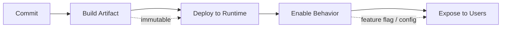
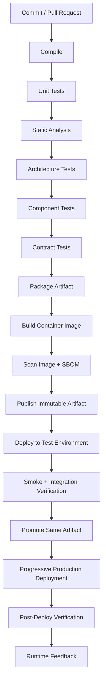
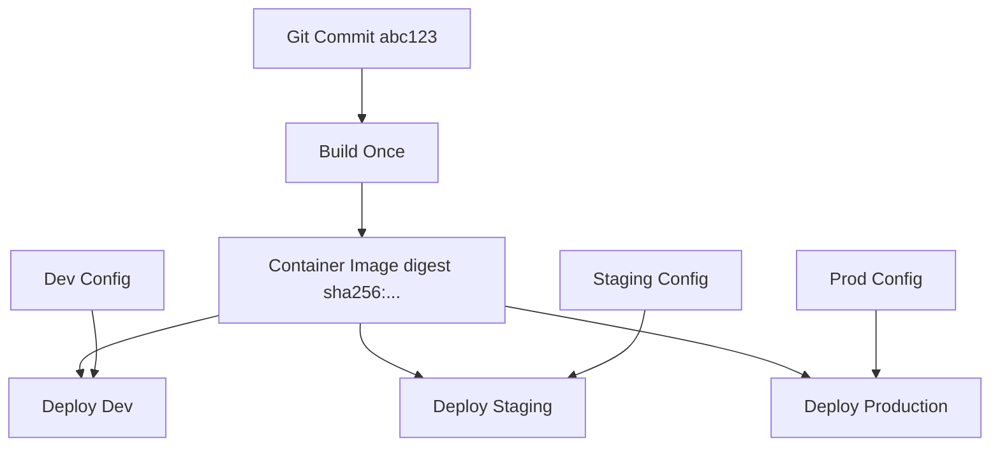
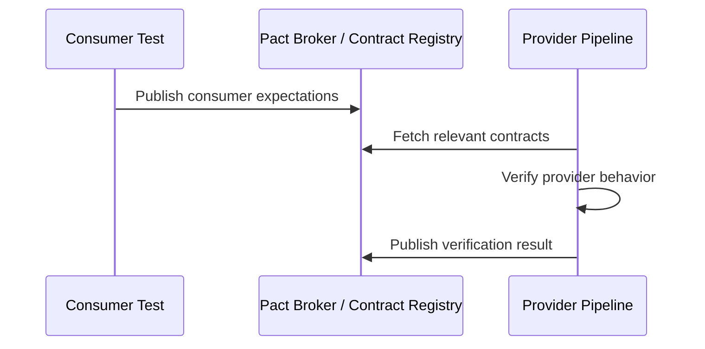
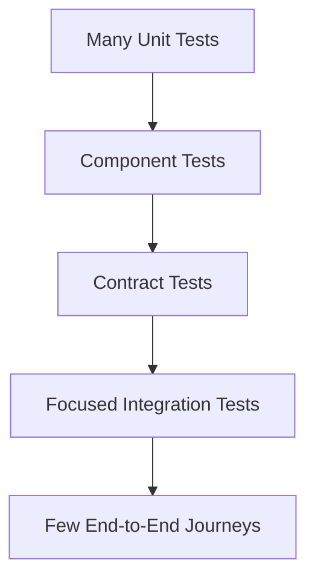
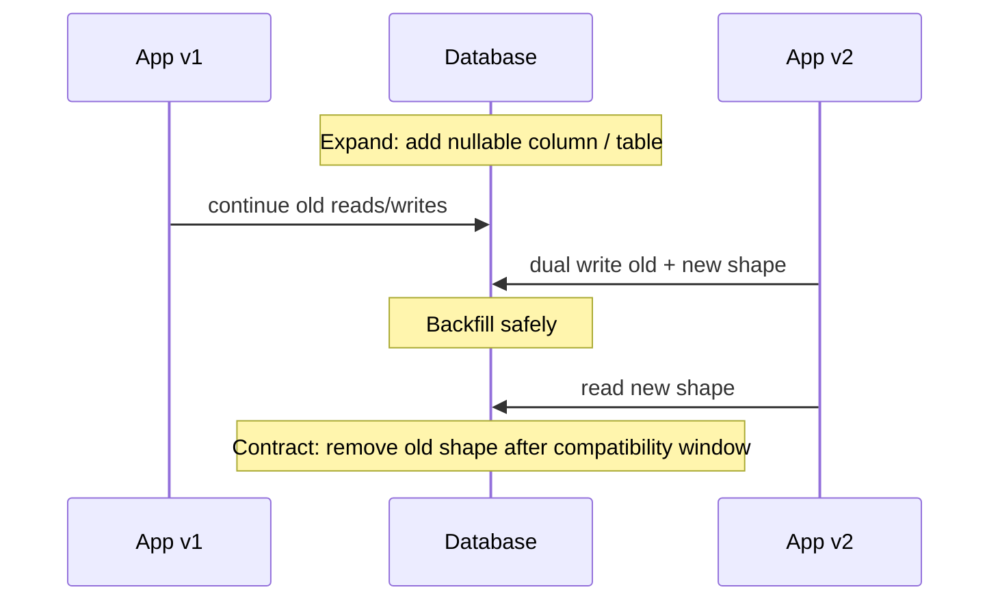
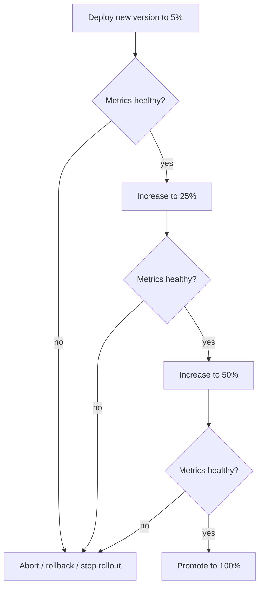

# Part 073 — CI/CD for Independent Deployability

## 1. Core Idea

A microservice is not truly independent just because it has its own repository.

It is independent when the owning team can safely change, verify, deploy, observe, and recover the service without forcing unrelated teams into the same release event.

That requires more than a CI pipeline.

It requires a delivery system that treats every service as a product with a runtime contract.

A production-grade delivery path answers these questions:

- Can this service be built reproducibly?
- Can this artifact be traced back to source, commit, dependency set, and pipeline run?
- Can this change be verified without deploying the whole enterprise?
- Can downstream consumers remain compatible?
- Can upstream providers remain compatible?
- Can this artifact be promoted without rebuilding?
- Can the deployment be stopped if runtime signals become unhealthy?
- Can we roll forward quickly if rollback is unsafe?
- Can we explain what changed during an incident?
- Can we prove that required gates were executed?

For top-tier microservices engineering, CI/CD is not a DevOps checkbox.

It is the mechanism that makes architectural promises executable.

Independent deployability is an architectural property, but CI/CD is where that property either becomes real or collapses into ceremony.

## 2. The Mental Model: Deployment Unit vs Release Unit vs Exposure Unit

Most teams use the word “release” too loosely.

That creates confusion.

Separate these three concepts.

| Concept | Meaning | Example |
|---|---|---|
| Deployment unit | What is installed into runtime | Container image `case-service:1.42.0` deployed to Kubernetes |
| Release unit | What business capability is considered available | “Risk scoring explanation is available to investigators” |
| Exposure unit | Who can see/use the behavior | Internal users, beta tenants, 5% of traffic, one region |

A mature microservices pipeline separates them.

You may deploy code today, release the feature tomorrow, and expose it gradually over a week.

That separation is essential because microservices require compatibility windows. If deployment and release are fused, every deploy becomes a coordination event.



The artifact should be immutable.

The behavior may be conditional.

The exposure may be gradual.

This gives teams operational control without rebuilding or redeploying for every business toggle.

## 3. Independent Deployability Is Not “Deploy Whenever You Want”

A dangerous interpretation of microservices is:

> Every team can deploy anything at any time.

That is not autonomy.

That is unmanaged risk.

Independent deployability means:

> A team can deploy independently because compatibility, safety gates, observability, rollback/roll-forward, and ownership are built into the delivery system.

Independence requires discipline.

A team earns independent deployability by satisfying constraints:

- stable public contract
- backward-compatible changes by default
- automated verification
- owner-approved risk exceptions
- production readiness
- operational telemetry
- safe deployment strategy
- incident response path
- data migration discipline
- consumer communication policy

Without these constraints, independent deployability becomes distributed chaos.

## 4. CI/CD as Architecture Enforcement

A pipeline is not only an automation script.

It is an executable architecture review.

Every architecture rule that can be checked should be checked before production.

Examples:

| Architecture rule | Pipeline check |
|---|---|
| Domain layer must not depend on Spring Web | ArchUnit/static architecture test |
| API change must be backward compatible | OpenAPI diff / contract test |
| Event schema must remain compatible | Schema compatibility check |
| Service must expose health endpoint | Component test / smoke test |
| Service must emit trace IDs | Observability smoke test |
| Container must not run as root | Image policy check |
| Secrets must not be committed | Secret scanning |
| Critical dependency must have timeout | Static config check / integration test |
| New service must have owner metadata | Service catalog validation |
| Release must have rollback/roll-forward plan | Deployment manifest/ADR check |

The more microservices you have, the more you need automation to preserve consistency.

Manual architecture review does not scale linearly with service count.

Executable checks do.

## 5. The Delivery Pipeline Should Be Service-Centric

A Java microservice pipeline should be designed around the service lifecycle.

A typical flow:



The exact tool does not matter as much as the invariants.

The pipeline must:

- build once
- test before deploy
- package immutably
- promote the same artifact
- verify contracts
- verify deployment health
- preserve traceability
- produce evidence
- stop unsafe changes
- expose runtime feedback

## 6. Build Once, Promote the Same Artifact

A common anti-pattern:

```text
build dev artifact
build staging artifact
build production artifact
```

This makes environments incomparable.

If staging passed but production uses a separately built artifact, you did not verify the production artifact.

A stronger model:

```text
source commit -> immutable artifact -> promote artifact across environments
```

Only environment-specific configuration changes.

The artifact does not.



This matters because incident diagnosis depends on artifact identity.

When production fails, you should be able to say:

- exact commit
- exact image digest
- exact dependency set
- exact config version
- exact migration version
- exact contract version
- exact deployment timestamp
- exact pipeline run

If you cannot answer those quickly, your CI/CD system is not production-grade.

## 7. The Java Microservice Build Contract

For a Java microservice, the build contract should be explicit.

A service build should produce:

- compiled classes
- test report
- static analysis report
- dependency vulnerability report
- architecture test report
- contract verification report
- packaged application artifact
- container image
- image digest
- SBOM
- provenance/build metadata
- deployment manifest or release bundle

A service build should not depend on:

- developer machine state
- local Maven cache correctness
- hidden environment variables
- mutable snapshot dependency in production
- unpinned base images
- manually installed tools
- ad-hoc secrets

A build that cannot be reproduced cannot be trusted.

## 8. Repository Structure for Delivery

A service repository should make delivery intent visible.

Example:

```text
case-service/
  pom.xml
  src/
    main/java/...
    test/java/...
  contracts/
    openapi/
    pact/
    events/
  deploy/
    helm/
    kustomize/
  ops/
    dashboards/
    alerts/
    runbooks/
  docs/
    adr/
    service-charter.md
    production-readiness.md
  .github/workflows/
    ci.yml
    release.yml
```

The exact layout varies, but a production-grade repository should expose:

- code
- contracts
- delivery manifests
- operational assets
- decisions
- ownership metadata

If a service repository contains only source code, delivery knowledge is probably scattered elsewhere.

That scattering increases incident recovery time.

## 9. Pipeline Stage 1 — Compile and Dependency Resolution

Compilation is the first contract check.

It verifies internal consistency of the codebase.

For Java services:

- use deterministic Java version
- pin Maven/Gradle wrapper version
- avoid mutable dependency versions for production builds
- fail on dependency convergence issues
- enforce dependency scopes
- run annotation processors consistently
- validate generated code is reproducible

Example Maven command:

```bash
./mvnw -B -V -ntp clean verify
```

Production-grade build logic should avoid hidden behavior.

Bad:

```xml
<version>LATEST</version>
```

Better:

```xml
<version>2.17.3</version>
```

Bad:

```bash
mvn install
```

Better:

```bash
./mvnw -B -V -ntp clean verify
```

The wrapper matters because the pipeline should not depend on a globally installed build tool version.

## 10. Pipeline Stage 2 — Unit Tests

Unit tests verify local behavior without network, database, queue, or container runtime.

For microservices, unit tests should cover:

- domain invariant
- value object validation
- command handler branching
- policy decisions
- mapper edge cases
- retry classifier
- idempotency key generation
- state transition rules

Example domain test:

```java
class CaseAggregateTest {

    @Test
    void cannotEscalateClosedCase() {
        CaseFile caseFile = CaseFile.closed(CaseId.of("CASE-1001"));

        assertThrows(InvalidCaseTransition.class, () ->
            caseFile.escalate(EscalationReason.REGULATORY_DEADLINE)
        );
    }
}
```

Unit tests should be fast enough to run on every commit.

If unit tests require a live database, they are not unit tests.

That does not mean database tests are bad.

It means they belong to another stage with another cost model.

## 11. Pipeline Stage 3 — Static Analysis and Security Scanning

Static analysis catches defects before runtime.

Useful gates:

- compiler warnings as errors where practical
- formatting/linting
- forbidden dependency checks
- dependency vulnerability scanning
- secret scanning
- license policy checks
- code quality threshold
- nullness/error-prone checks when adopted

A mature pipeline distinguishes between:

- hard blockers
- warnings
- risk exceptions
- time-bounded waivers

Not every finding should block every deploy.

But every exception should be explicit.

Example waiver metadata:

```yaml
waiver:
  id: CVE-2026-12345
  service: case-service
  reason: vulnerable code path not reachable; upgrade blocked by provider SDK
  owner: case-platform-team
  expires: 2026-08-15
  approvedBy: security-architecture
```

Waivers without expiration become normalized risk.

## 12. Pipeline Stage 4 — Architecture Tests

Architecture tests verify internal dependency rules.

Example rules:

- API layer may depend on application layer
- application layer may depend on domain ports
- domain layer must not depend on infrastructure
- infrastructure may implement domain ports
- controllers must not call repositories directly
- adapters must not leak external DTOs into domain
- generated API classes must not become domain model

Example using ArchUnit style:

```java
@AnalyzeClasses(packages = "com.example.casefile")
class ArchitectureRulesTest {

    @ArchTest
    static final ArchRule domain_should_not_depend_on_spring =
        noClasses()
            .that().resideInAPackage("..domain..")
            .should().dependOnClassesThat()
            .resideInAnyPackage("org.springframework..", "jakarta.persistence..");

    @ArchTest
    static final ArchRule controllers_should_not_access_repositories =
        noClasses()
            .that().resideInAPackage("..api..")
            .should().dependOnClassesThat()
            .resideInAPackage("..repository..");
}
```

Architecture tests are not academic.

They keep service internals from collapsing into accidental coupling.

## 13. Pipeline Stage 5 — Component Tests

A component test verifies a service from its public boundary while replacing external dependencies with controlled doubles.

For a Java HTTP service:

- start application context
- call HTTP endpoint
- use test database or containerized database
- stub external HTTP services
- verify response
- verify DB state
- verify outbox event

Example:

```java
@SpringBootTest(webEnvironment = SpringBootTest.WebEnvironment.RANDOM_PORT)
@Testcontainers
class RegisterAllegationComponentTest {

    @Autowired TestRestTemplate http;
    @Autowired OutboxRepository outbox;

    @Test
    void registersAllegationAndPublishesIntegrationEvent() {
        var request = new RegisterAllegationRequest(
            "CASE-1001",
            "MISCONDUCT",
            "Evidence summary"
        );

        ResponseEntity<ProblemOrAllegationResponse> response =
            http.postForEntity("/cases/CASE-1001/allegations", request, ProblemOrAllegationResponse.class);

        assertEquals(HttpStatus.CREATED, response.getStatusCode());
        assertThat(outbox.findByAggregateId("CASE-1001"))
            .anyMatch(event -> event.type().equals("AllegationRegistered"));
    }
}
```

Component tests are valuable because they verify the service as a unit of deployment.

They are slower than unit tests but much cheaper than full end-to-end tests.

## 14. Pipeline Stage 6 — Contract Tests

Microservices fail at integration boundaries.

Contract tests protect those boundaries.

You need multiple contract types:

| Contract type | Protects |
|---|---|
| HTTP API contract | Request/response compatibility |
| Event contract | Published event compatibility |
| gRPC/protobuf contract | RPC method/message compatibility |
| Consumer-driven contract | Actual consumer expectations |
| Provider contract verification | Provider does not break consumers |

Consumer-driven contract testing is especially useful when many consumers depend on one provider.

The consumer defines the subset of provider behavior it uses.

The provider verifies those expectations before release.



The important rule:

> A provider cannot safely deploy a breaking change until affected consumers are compatible.

Contract testing turns that rule into an automated gate.

## 15. Pipeline Stage 7 — Integration Tests

Integration tests verify behavior against real dependencies or near-real test environments.

They are expensive.

Use them carefully.

Good integration tests verify:

- database migration correctness
- outbox publisher behavior
- message broker integration
- service mesh/gateway behavior
- external provider adapter behavior
- authentication/authorization integration
- observability wiring

Bad integration tests attempt to cover every business branch end-to-end.

That creates slow, flaky pipelines.

A better test pyramid for microservices:



End-to-end tests should validate critical journeys, not every condition.

## 16. Pipeline Stage 8 — Packaging and Container Image

The container image is the runtime artifact.

It should be:

- small enough to pull quickly
- secure enough for baseline policy
- deterministic enough for traceability
- observable enough for operations
- compatible with container resource limits
- explicit about exposed ports
- non-root where possible
- free of build-time secrets

Example Dockerfile:

```dockerfile
FROM eclipse-temurin:21-jre

WORKDIR /app
COPY target/case-service.jar /app/case-service.jar

USER 10001:10001
EXPOSE 8080

ENTRYPOINT ["java", "-jar", "/app/case-service.jar"]
```

In many enterprise platforms, teams should not hand-roll every Dockerfile.

The platform should provide a golden base image or buildpack path.

The application team still owns application behavior.

The platform team owns hardened runtime baseline.

## 17. Pipeline Stage 9 — SBOM, Provenance, and Artifact Evidence

As systems scale, “what is running?” becomes a security and incident response question.

A mature pipeline should produce evidence:

- software bill of materials
- dependency list
- source commit
- build timestamp
- builder identity
- image digest
- vulnerability scan result
- test result
- signer/provenance metadata
- deployment approval if required

This evidence helps answer:

- Are we affected by a new CVE?
- Which services run library X?
- Which artifact entered production after incident start?
- Which pipeline built this image?
- Was a required scan bypassed?
- Which team owns the risk?

Without evidence, incident response becomes archaeology.

## 18. Pipeline Stage 10 — Deployment Manifest Validation

Before deployment, validate the runtime contract.

For Kubernetes workloads, check:

- resource requests/limits
- readiness/liveness/startup probes
- graceful termination settings
- security context
- network policy expectations
- service account
- config references
- secret references
- autoscaling policy
- pod disruption budget when required
- topology spread constraints when required
- observability annotations
- sidecar configuration if mesh is used

Example policy intent:

```yaml
rules:
  - name: require-readiness-probe
    appliesTo: Deployment
    severity: block
  - name: forbid-root-container
    appliesTo: PodSpec
    severity: block
  - name: require-service-owner-label
    appliesTo: all
    severity: block
  - name: require-resource-requests
    appliesTo: Container
    severity: block
```

Delivery pipelines should fail before unsafe manifests reach the cluster.

## 19. Pipeline Stage 11 — Environment Promotion

A production-grade service usually passes through environments.

Example:

```text
local -> ephemeral preview -> integration -> staging -> production
```

But beware environment theater.

More environments do not automatically mean more safety.

Each environment must have a clear purpose.

| Environment | Purpose |
|---|---|
| Local | developer feedback |
| Preview | PR-level integration check |
| Integration | service collaboration validation |
| Staging | production-like deployment rehearsal |
| Production | real user/runtime verification |

The same artifact should move through these environments.

The difference should be configuration, data, scale, and exposure.

## 20. Ephemeral Environments

Ephemeral environments are created per branch, pull request, or feature.

They are useful when:

- service has complex UI/API integration
- consumer/provider changes need early validation
- database migration needs rehearsal
- gateway routing needs verification
- multiple teams collaborate on a temporary change

But ephemeral environments can become expensive and unreliable.

Use them for high-value integration checks, not as a replacement for modular tests.

Minimum ephemeral environment contract:

```yaml
ephemeralEnvironment:
  ttl: 72h
  owner: case-platform-team
  sourceRef: pull-request-1842
  dataProfile: synthetic-minimal
  externalDependencies: stubbed
  destroyPolicy: automatic
```

Without TTL and ownership, ephemeral environments become zombie infrastructure.

## 21. Pull Request Gate vs Mainline Gate

Not every check belongs in every PR.

PR checks should be fast enough to keep developer flow.

Mainline checks can be deeper.

Release checks can be even deeper.

Example:

| Check | PR | Main | Release |
|---|---:|---:|---:|
| Compile | yes | yes | yes |
| Unit tests | yes | yes | yes |
| Architecture tests | yes | yes | yes |
| Component tests | yes | yes | yes |
| Contract generation | yes | yes | yes |
| Provider contract verification | maybe | yes | yes |
| Image build | maybe | yes | yes |
| Full vulnerability scan | maybe | yes | yes |
| Integration environment deploy | optional | yes | yes |
| Staging deployment | no | optional | yes |
| Production canary | no | no | yes |

The objective is not to maximize checks everywhere.

The objective is to maximize risk reduction per unit of feedback time.

## 22. CI Pipeline Example

Example GitHub Actions-like flow:

```yaml
name: case-service-ci

on:
  pull_request:
  push:
    branches: [main]

jobs:
  verify:
    runs-on: ubuntu-latest
    steps:
      - uses: actions/checkout@v4
      - uses: actions/setup-java@v4
        with:
          distribution: temurin
          java-version: '21'
          cache: maven

      - name: Compile and test
        run: ./mvnw -B -ntp clean verify

      - name: Architecture tests
        run: ./mvnw -B -ntp -Parchitecture-test test

      - name: Contract tests
        run: ./mvnw -B -ntp -Pcontract-test verify

      - name: Build image
        if: github.ref == 'refs/heads/main'
        run: |
          docker build -t registry.example.com/case-service:${GITHUB_SHA} .
          docker push registry.example.com/case-service:${GITHUB_SHA}
```

This is only illustrative.

Real pipelines need secrets handling, signing, scanning, provenance, deployment, and promotion.

## 23. CD Pipeline Example

Example deployment flow:

```yaml
release:
  artifact:
    image: registry.example.com/case-service@sha256:abc123
    commit: abc123
    service: case-service

  gates:
    - contract-verification
    - image-vulnerability-policy
    - manifest-policy
    - migration-dry-run
    - production-readiness-score

  environments:
    - name: staging
      strategy: rolling
      verify:
        - smoke-tests
        - synthetic-journey
        - telemetry-presence

    - name: production
      strategy: canary
      canary:
        steps:
          - weight: 5
            duration: 10m
          - weight: 25
            duration: 20m
          - weight: 50
            duration: 30m
          - weight: 100
        analysis:
          - availability-slo
          - p95-latency
          - error-rate
          - dependency-timeout-rate
          - business-failure-rate
```

The best deployment pipeline is not the one with the most YAML.

It is the one that expresses risk controls clearly.

## 24. Production Verification

Deployment is not complete when Kubernetes accepts a manifest.

Deployment is complete when the service behaves correctly in production.

Post-deploy verification should check:

- pods become ready
- no crash loops
- request traffic succeeds
- latency remains within threshold
- error rate remains within threshold
- dependency failures do not spike
- consumer contract errors do not spike
- business error rate does not spike
- event publishing still works
- consumer lag remains acceptable
- dashboards show expected version
- logs/traces include deployment version

A minimal post-deploy smoke test:

```bash
curl -fsS \
  -H "X-Synthetic-Test: true" \
  https://api.example.com/case-service/internal/smoke/readiness
```

But synthetic tests should not mutate production state unless explicitly designed for safe test tenants/data.

## 25. Rollback vs Roll Forward

Rollback is comforting, but not always safe.

Rollback is easy when:

- code change is stateless
- no database migration occurred
- no event schema changed incompatibly
- no external side effect occurred
- no data written by new version is unreadable by old version

Rollback is risky when:

- migration is destructive
- new version writes new state shape
- consumers already depend on new event fields
- feature changed external provider state
- workflow instances started under new version

Therefore mature delivery systems prefer:

- backward-compatible changes
- expand-contract database migration
- feature flags
- dark launch
- fast roll-forward patches
- compatibility windows

Rollback is still useful for crash-looping code.

But for semantic changes, roll-forward is often safer.

## 26. Database Change Gates

Even though this series has separate database/design material, microservice CI/CD must treat data changes as deployment risks.

Database changes need gates:

- migration syntax check
- migration ordering check
- backward compatibility review
- destructive change detection
- large-table migration risk review
- lock-time estimation
- rollback/roll-forward plan
- application version compatibility matrix

Example expand-contract sequence:



A pipeline should block destructive changes unless they are explicitly approved and scheduled.

## 27. Event Contract Gates

Event-driven systems need compatibility gates too.

A producer should not publish events that break consumers.

Check:

- event name stability
- event version compatibility
- required field changes
- enum changes
- field removal
- type change
- semantic change
- ordering expectation change
- partition key change

Example event compatibility rule:

```yaml
compatibility:
  event: CaseEscalated
  allowed:
    - add_optional_field
    - add_nullable_field
    - add_new_event_type
  forbidden:
    - remove_field
    - rename_field
    - change_field_type
    - change_partition_key
    - change_semantic_meaning_without_new_event
```

The worst event breaking change is not a field removal.

It is a semantic change that keeps the same schema.

Example:

```text
Before: CaseEscalated means case requires supervisor review.
After:  CaseEscalated means case was merely suggested for review.
```

Schema compatibility cannot detect semantic incompatibility.

Humans and ADRs still matter.

## 28. Contract Verification Is Not Full Integration Testing

Contract testing is narrow by design.

It asks:

> Does provider behavior still satisfy consumer expectations?

It does not ask:

> Does the whole business journey work across all services?

That distinction is useful.

A large end-to-end suite is slow and fragile.

A contract suite is targeted and fast.

Use contract tests to protect service autonomy.

Use a few end-to-end synthetic journeys to protect critical user journeys.

Do not invert the ratio.

## 29. Release Evidence Pack

Every production deployment should produce a release evidence pack.

Example:

```yaml
releaseEvidence:
  service: case-service
  version: 1.42.0
  imageDigest: sha256:abc123
  commit: 9f7c2e4
  pipelineRun: https://ci.example.com/runs/9321
  deployedAt: 2026-07-05T13:45:00+07:00
  deployedBy: delivery-bot
  approver: case-platform-team
  changes:
    - ADR-0184-risk-score-explanation
    - PR-1842
  gates:
    unitTests: passed
    componentTests: passed
    contractVerification: passed
    vulnerabilityPolicy: passed
    manifestPolicy: passed
    canaryAnalysis: passed
  rollback:
    strategy: roll-forward-preferred
    previousVersion: 1.41.3
  telemetry:
    dashboard: https://observability.example.com/d/case-service
    traceQuery: service.name="case-service" AND deployment.version="1.42.0"
```

This evidence helps during:

- incident review
- audit
- compliance review
- debugging
- release notes
- rollback decision
- security investigation

If your deployment cannot produce evidence, it is not enterprise-grade.

## 30. Environment Configuration Gates

Configuration is runtime behavior.

The pipeline should validate config before deployment.

Check:

- required properties present
- values within expected range
- timeout budget valid
- retry count within policy
- rate limit sane
- feature flag default safe
- dependency endpoint allowed
- secret reference exists
- tenant config valid
- region config valid
- observability config present

Example config validation:

```java
@ConfigurationProperties(prefix = "case.dependency.decision")
@Validated
public record DecisionClientProperties(
    @NotBlank URI baseUrl,
    @DurationMin(millis = 50) Duration connectTimeout,
    @DurationMax(seconds = 3) Duration responseTimeout,
    @Min(0) @Max(2) int maxRetries
) {}
```

Invalid config should fail before production traffic reaches the service.

## 31. Deployment Gate Design

Not every service needs the same gates.

Use risk-based gates.

High-risk service examples:

- payment
- enforcement decision
- identity
- audit log
- regulatory reporting
- workflow coordinator
- central customer profile

Low-risk service examples:

- internal metadata viewer
- read-only catalog
- non-critical recommendation service

Gate intensity should reflect risk.

Example:

| Gate | Low risk | Medium risk | High risk |
|---|---:|---:|---:|
| Unit/component tests | yes | yes | yes |
| Contract verification | yes | yes | yes |
| Security scan | yes | yes | yes |
| Manual approval | no | conditional | yes for risky change |
| Canary | optional | yes | yes |
| Synthetic transaction | optional | yes | yes |
| Audit evidence check | no | conditional | yes |
| DR impact review | no | conditional | yes |

Too many gates for every service creates bypass culture.

Too few gates for critical services creates incident culture.

## 32. Release Approval Should Be Policy-Based

Manual approval can be useful.

But manual approval without context is weak.

Approvers need evidence:

- what changed
- risk category
- test results
- contract impact
- migration impact
- dependency impact
- rollback/roll-forward plan
- canary plan
- observability plan
- feature flag plan

Better:

```yaml
approvalRequired:
  when:
    - destructiveDatabaseChange: true
    - publicApiBreakingChange: true
    - regulatoryDecisionPathChanged: true
    - auditEventSchemaChanged: true
    - serviceCriticality: tier-0
```

Manual approval should be reserved for judgment calls.

Routine safety should be automated.

## 33. Progressive Delivery

Progressive delivery reduces blast radius.

Patterns:

- rolling deployment
- canary
- blue-green
- shadow traffic
- dark launch
- feature flag exposure

A typical canary:



Canary analysis should include technical and business signals.

Technical:

- error rate
- latency percentile
- saturation
- dependency timeout
- restart rate

Business:

- command failure rate
- validation rejection rate
- payment failure rate
- case escalation completion rate
- workflow stuck count

A deploy can pass HTTP metrics while breaking business semantics.

## 34. Deployment Does Not Replace Feature Flags

Deployment changes what code exists in runtime.

Feature flags change which behavior is active.

Use both.

Example:

```java
public RiskExplanation explainRisk(CaseId caseId) {
    if (flags.isEnabled("risk.explanation.v2", TenantContext.current())) {
        return riskExplanationV2.explain(caseId);
    }
    return riskExplanationV1.explain(caseId);
}
```

Pipeline requirements for feature flags:

- default value explicit
- owner explicit
- expiry explicit
- cleanup issue created
- flag type explicit
- production change audit logged
- unsafe combinations tested

Feature flags without lifecycle management become permanent complexity.

## 35. Trunk-Based Development and Microservices

Independent deployability works best when code integrates frequently.

Long-lived branches delay integration risk.

Microservices do not eliminate merge risk.

They move integration risk to contracts and runtime collaboration.

Practical rules:

- keep main branch releasable
- use short-lived branches
- hide incomplete behavior behind flags
- use branch-by-abstraction for large changes
- keep migrations backward compatible
- run contract tests continuously
- deploy small changes frequently

Small, frequent, reversible changes are easier to reason about than large release bundles.

## 36. Avoiding Pipeline Monoliths

A central pipeline template is useful.

A pipeline monolith is dangerous.

Symptoms:

- every service must use identical stages regardless of risk
- small pipeline changes break dozens of teams
- teams copy-paste YAML and drift silently
- platform team becomes bottleneck for delivery changes
- service-specific checks are hard to add

Better:

- golden pipeline template
- versioned reusable workflows
- service-level extension points
- policy-as-code for mandatory gates
- local service ownership for domain-specific checks

Example:

```yaml
uses: platform/java-service-pipeline@v4
with:
  java-version: 21
  service-tier: tier-1
  contract-tests: true
  deployment-strategy: canary
  requires-audit-evidence: true
custom-stages:
  - name: regulatory-workflow-simulation
    command: ./mvnw -Pworkflow-simulation verify
```

The platform should provide a paved road, not a prison.

## 37. CI/CD Failure Modes

| Failure mode | Symptom | Architectural cause | Countermeasure |
|---|---|---|---|
| Slow pipeline | Teams bypass checks | Tests not layered | Split fast/slow gates |
| Flaky tests | Low trust in pipeline | Environment nondeterminism | Hermetic tests, quarantine policy |
| Rebuild per env | Staging differs from prod | Artifact immutability absent | Build once, promote digest |
| Lockstep release | Many teams deploy together | Breaking contracts | Compatibility windows |
| Rollback fails | Old code cannot read new state | Destructive migration | Expand-contract |
| Silent contract break | Consumer fails after deploy | Provider-only testing | CDC/provider verification |
| Zombie feature flags | Code complexity grows | No lifecycle | Owner/expiry/cleanup gate |
| Manual approval theater | Approvers rubber-stamp | No evidence | Risk-based evidence pack |
| Pipeline sprawl | Every repo differs | No platform golden path | Reusable pipeline templates |
| Unsafe production deploy | Metrics ignored | No runtime verification | Progressive delivery analysis |

## 38. Java Service Pipeline Checklist

Before a Java microservice is considered independently deployable, it should satisfy:

- [ ] build uses pinned Java/build-tool version
- [ ] artifact built once and promoted by digest
- [ ] unit tests cover domain invariant
- [ ] component tests cover service boundary
- [ ] contract tests protect consumers/providers
- [ ] architecture tests protect dependency direction
- [ ] image scan and dependency scan run automatically
- [ ] SBOM/provenance/evidence produced
- [ ] deployment manifest validates probes/resources/security context
- [ ] database migration strategy is backward compatible
- [ ] event/API compatibility checked
- [ ] config validated before startup
- [ ] post-deploy smoke test exists
- [ ] canary or progressive strategy exists for non-trivial risk
- [ ] rollback/roll-forward plan exists
- [ ] deployment version visible in logs/metrics/traces
- [ ] release evidence retained
- [ ] owner and runbook linked in service catalog

## 39. Case Study: Regulatory Case Service Pipeline

Imagine `case-service` owns case lifecycle commands.

A change adds a new command:

```http
POST /cases/{caseId}/escalation-recommendations
```

Risk factors:

- affects investigator workflow
- writes new audit event
- publishes event consumed by notification service
- adds read model field used by dashboard
- requires database migration
- may trigger SLA timer

Pipeline gates:

```yaml
service: case-service
change: escalation-recommendation-command
risk: high
requiredGates:
  - domain-unit-tests
  - component-command-tests
  - audit-event-contract-check
  - notification-consumer-contract-check
  - dashboard-read-model-compatibility-check
  - migration-expand-contract-check
  - workflow-sla-simulation
  - canary-analysis
  - release-evidence-pack
```

A shallow pipeline would only compile and deploy.

A production-grade pipeline understands the business impact of the change.

## 40. CI/CD Design ADR Template

Use an ADR when introducing or changing delivery strategy.

```md
# ADR: Delivery Strategy for Case Service

## Context
Case Service is a tier-1 service. It owns case lifecycle commands and audit-sensitive state changes.

## Decision
Use build-once-promote-by-digest pipeline with component tests, contract verification,
manifest policy checks, migration compatibility checks, and canary deployment for production.

## Alternatives Considered
1. Direct deploy on merge
2. Manual release bundle
3. Shared release train

## Consequences
Positive:
- independent deployment possible
- provider/consumer compatibility checked
- release evidence available for audit

Negative:
- longer pipeline than low-risk services
- requires maintaining contract tests
- requires deployment metadata discipline

## Fitness Functions
- all public API changes run compatibility diff
- all event changes run schema compatibility check
- production deploy must expose deployment.version metric
- canary aborts on SLO burn-rate threshold

## Rollback / Roll-forward
Roll-forward preferred for semantic or migration changes. Rollback allowed for crash-loop or non-data-writing changes.
```

## 41. A Practical Implementation Sequence

Do not try to build a perfect platform overnight.

Sequence it.

### Step 1 — Make builds reproducible

- use wrappers
- pin runtime versions
- build in clean CI
- publish immutable image digest

### Step 2 — Add fast correctness gates

- compile
- unit tests
- component tests
- static checks

### Step 3 — Add contract gates

- HTTP/gRPC contract
- event compatibility
- consumer-driven contracts for critical consumers

### Step 4 — Add deployment verification

- readiness/liveness/startup
- smoke tests
- deployment version telemetry

### Step 5 — Add progressive delivery

- canary or blue-green
- automated analysis
- rollback/roll-forward policy

### Step 6 — Add governance evidence

- SBOM
- provenance
- release evidence
- service catalog linkage

### Step 7 — Optimize developer experience

- reusable pipeline
- service template
- self-service environment
- local pipeline simulation

The order matters.

A sophisticated canary is less useful if the artifact is not immutable.

## 42. What Top Engineers Notice

Average engineers ask:

> Did the pipeline pass?

Strong engineers ask:

> What risk did the pipeline actually reduce?

Average engineers ask:

> Can we deploy this service separately?

Strong engineers ask:

> Can we deploy this service separately without breaking consumers, corrupting data, hiding failure, or losing auditability?

Average engineers ask:

> Can we roll back?

Strong engineers ask:

> Is rollback semantically safe after this migration/event/workflow change, or do we need roll-forward?

CI/CD for microservices is not about speed alone.

It is about safe speed.

## 43. Key Takeaways

- Independent deployability is an architecture property enforced through CI/CD.
- Build once and promote the same immutable artifact.
- Contract verification is central to service autonomy.
- Deployment and release should be separated.
- Progressive delivery reduces blast radius.
- Rollback is not always safe; roll-forward often matters more.
- Pipeline gates should be risk-based, not one-size-fits-all.
- A pipeline should produce evidence, not just artifacts.
- Governance should be executable where possible.
- The best CI/CD system helps teams move faster because it makes unsafe changes visible early.

## References

- Kubernetes Documentation — Deployments and rollout behavior: https://kubernetes.io/docs/concepts/workloads/controllers/deployment/
- Kubernetes Documentation — `kubectl rollout undo`: https://kubernetes.io/docs/reference/kubectl/generated/kubectl_rollout/kubectl_rollout_undo/
- Pact Documentation — Consumer-driven contract testing: https://docs.pact.io/
- Google SRE Book — Release Engineering: https://sre.google/sre-book/release-engineering/
- Martin Fowler — Feature Toggles: https://martinfowler.com/articles/feature-toggles.html
