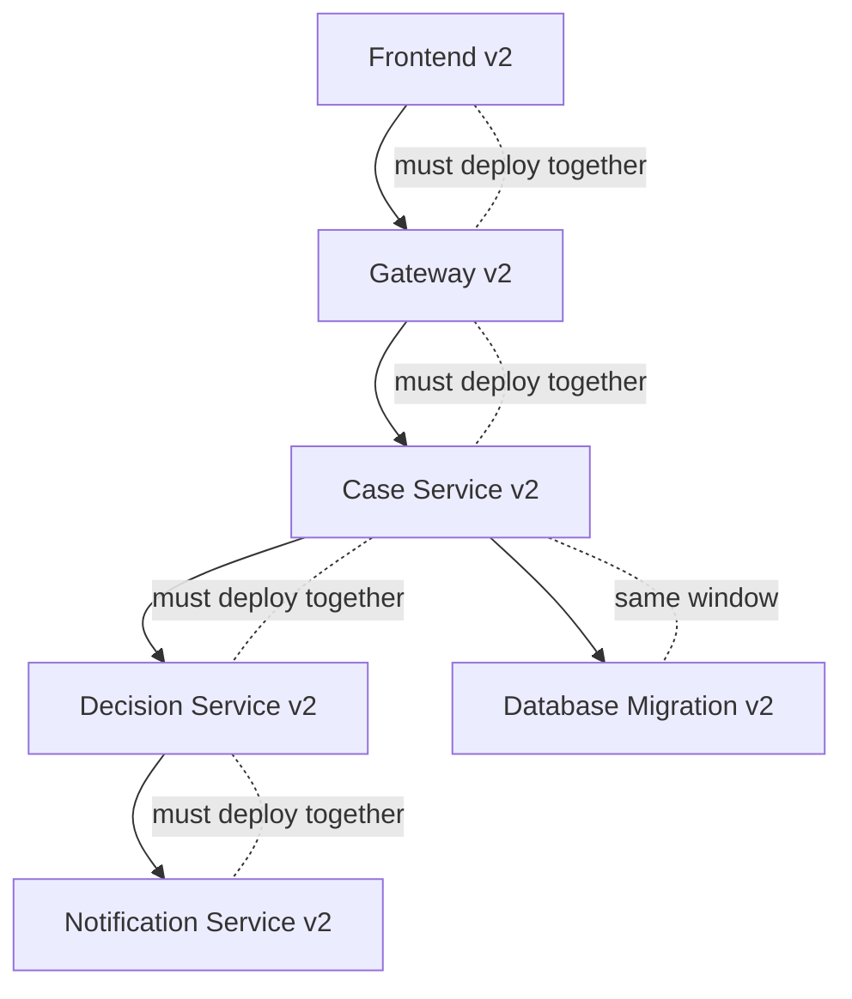
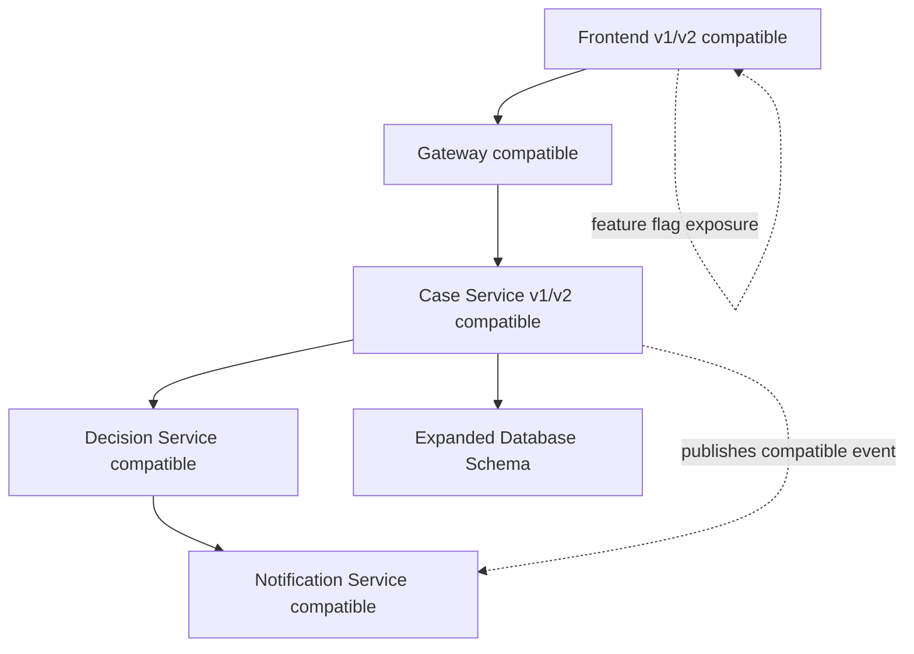
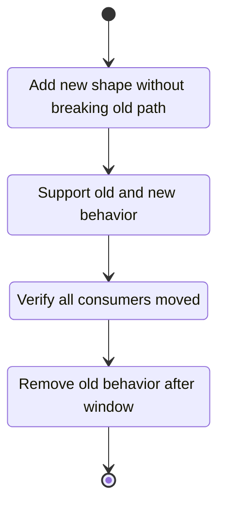
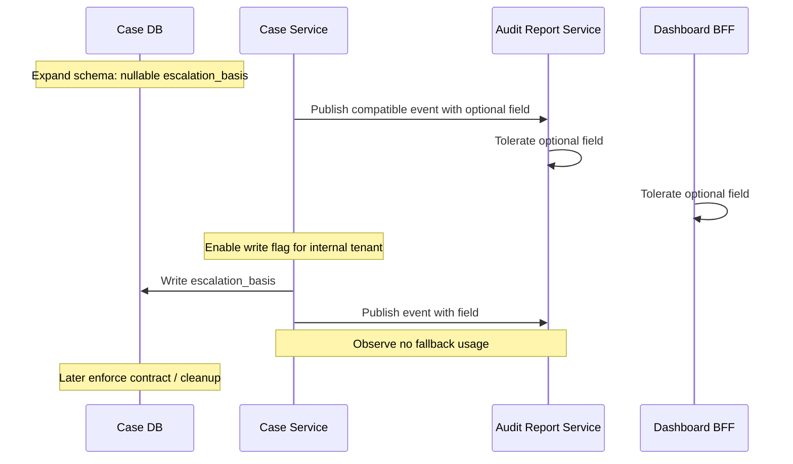

# Part 074 — Release Coordination Without Distributed Lockstep

## 1. Core Idea

Microservices promise independent deployment.

But many organizations accidentally recreate a monolith at release time.

They split code into many services, then require all teams to deploy together because one change touches many contracts, databases, workflows, and clients.

That is a distributed lockstep release.

It looks like microservices.

It behaves like a release-train monolith.

The goal of release coordination is not to remove all coordination.

That is impossible.

The goal is to make coordination explicit, bounded, and compatibility-driven so teams do not need synchronized deployment for every change.

A top-tier microservices organization coordinates through:

- backward-compatible contracts
- expand-contract migrations
- feature flags
- compatibility windows
- consumer-driven verification
- progressive exposure
- runtime observability
- release dependency maps
- clear ownership
- small reversible steps

The main principle:

> Prefer compatibility over coordination.

If you need five teams in a call to deploy a normal feature, the system is not independently deployable.

## 2. What Distributed Lockstep Looks Like

A distributed lockstep release has symptoms:

- several services must deploy in a precise order
- old version of one service cannot talk to new version of another
- database migration must happen at exact same time as code deploy
- frontend must deploy exactly with backend
- event producer and consumer must change together
- rollback requires rolling back multiple services
- one failed deployment blocks unrelated teams
- release windows become large and stressful
- integration testing becomes the only confidence mechanism
- teams delay merging until “release branch” is ready



This is fragile because failure in any node delays the whole release.

A compatibility-first design breaks the chain.



Now services can move independently within a defined compatibility window.

## 3. Coordination Is Not the Enemy

A weak assumption:

> Microservices means teams never coordinate.

Wrong.

Teams still coordinate on:

- business capability design
- public contracts
- data ownership
- security policy
- SLOs
- incident response
- deprecation windows
- cross-service workflows
- customer-facing release timing

The difference is that coordination happens at the design and contract level, not by forcing simultaneous deployments.

Good coordination creates autonomy.

Bad coordination creates waiting.

## 4. The Compatibility Window

A compatibility window is the period where old and new versions can coexist safely.

Example:

```text
Case Service v1 and v2 can both publish CaseEscalated events.
Notification Service v1 and v2 can consume both event shapes.
Dashboard can ignore optional field riskExplanation until it is ready.
```

A compatibility window should be explicit.

```yaml
compatibilityWindow:
  change: add-risk-explanation-to-case-escalation
  starts: 2026-07-05
  ends: 2026-08-05
  producerSupports:
    - CaseEscalated.v1
    - CaseEscalated.v2-compatible
  consumersRequiredByEnd:
    - notification-service
    - dashboard-service
    - audit-report-service
  cleanupAfter:
    - remove dual-write
    - remove fallback parser
    - remove feature flag
```

Without an end date, compatibility code becomes permanent complexity.

## 5. Compatibility-First Release Thinking

Before changing a service, ask:

1. Can old consumers continue working?
2. Can new consumers work before all providers are upgraded?
3. Can old producers and new consumers coexist?
4. Can new producers and old consumers coexist?
5. Can old and new database schema coexist?
6. Can old and new workflow instances coexist?
7. Can old and new event versions coexist?
8. Can we observe which version/path is being used?
9. Can we disable the new behavior without redeploying?
10. Can we clean up temporary compatibility code?

This is release architecture.

## 6. The N/N+1 Rule

A practical compatibility rule:

> Version N and version N+1 must coexist.

For services:

- provider N must support consumer N and N+1 where possible
- consumer N must tolerate provider N and N+1 where possible
- event consumers must ignore unknown optional fields
- producers must not remove fields during compatibility window
- database schema must support old and new code during rollout

For high-criticality systems, you may need N-1/N/N+1 compatibility.

That is more expensive.

Use it intentionally.

## 7. Release Coordination Pattern: Expand-Contract

Expand-contract is the default pattern for schema and contract evolution.

### Step 1 — Expand

Add new capability without removing old behavior.

Examples:

- add nullable column
- add optional JSON field
- add new endpoint
- publish additional event
- add new enum value only if consumers tolerate unknown values
- add new table
- add new read model field

### Step 2 — Migrate

Move producers/consumers gradually.

Examples:

- dual-write old and new field
- backfill historical data
- update consumers to read new field
- monitor new path
- enable behavior gradually

### Step 3 — Contract

Remove old behavior after compatibility window.

Examples:

- stop dual-write
- remove old parser
- drop old column
- remove old endpoint
- remove fallback code
- delete feature flag



The contract phase is not optional.

Without cleanup, every release leaves behind sediment.

## 8. Release Coordination Pattern: Feature Flags

Feature flags decouple deployment from release.

Common flag types:

| Flag type | Purpose | Expected lifetime |
|---|---|---|
| Release flag | hide incomplete feature | short |
| Experiment flag | A/B test behavior | short/medium |
| Ops flag | disable expensive/risky behavior | medium/long |
| Permission flag | enable capability for segment/tenant | long if product concept |
| Migration flag | switch between old/new implementation | short |

Example:

```java
public SubmitDecisionResult submitDecision(SubmitDecisionCommand command) {
    if (flags.enabled("decision.submit.v2", command.tenantId())) {
        return submitDecisionV2.handle(command);
    }
    return submitDecisionV1.handle(command);
}
```

Feature flags require discipline:

```yaml
featureFlag:
  key: decision.submit.v2
  type: release
  owner: decision-platform-team
  created: 2026-07-05
  expires: 2026-08-05
  default: false
  killSwitch: true
  telemetry:
    metric: decision_submit_v2_enabled_total
  cleanupIssue: DEC-1842
```

If a flag has no owner or expiry, it is not a release control.

It is technical debt.

## 9. Release Coordination Pattern: Branch by Abstraction

For large internal changes, long-lived branches are risky.

Branch by abstraction lets you merge small steps while keeping behavior stable.

Example:

```java
public interface RiskCalculator {
    RiskScore calculate(CaseFile caseFile);
}
```

Old implementation:

```java
@Component
class RuleBasedRiskCalculator implements RiskCalculator {
    public RiskScore calculate(CaseFile caseFile) {
        return RiskScore.fromRules(caseFile);
    }
}
```

New implementation:

```java
@Component
class ModelBackedRiskCalculator implements RiskCalculator {
    public RiskScore calculate(CaseFile caseFile) {
        return modelClient.score(caseFile);
    }
}
```

Selection:

```java
@Component
class SwitchingRiskCalculator implements RiskCalculator {
    private final FeatureFlags flags;
    private final RuleBasedRiskCalculator oldCalculator;
    private final ModelBackedRiskCalculator newCalculator;

    public RiskScore calculate(CaseFile caseFile) {
        if (flags.enabled("risk.model.v2", caseFile.tenantId())) {
            return newCalculator.calculate(caseFile);
        }
        return oldCalculator.calculate(caseFile);
    }
}
```

The abstraction creates a safe seam.

Then you can:

- deploy abstraction
- deploy new implementation dark
- compare outputs
- enable for limited tenants
- ramp up
- remove old implementation
- remove flag

## 10. Release Coordination Pattern: Consumer-First Additive Change

When adding a new field to an API response:

1. Provider adds optional field.
2. Old consumers ignore it.
3. New consumers start reading it.
4. Provider later makes stronger guarantees if needed.

Example response:

```json
{
  "caseId": "CASE-1001",
  "status": "UNDER_REVIEW",
  "riskExplanation": {
    "summary": "High risk due to cross-border evidence dependency",
    "generatedAt": "2026-07-05T10:15:00+07:00"
  }
}
```

Adding optional fields is usually safe for tolerant consumers.

But never assume all consumers are tolerant.

Verify.

## 11. Release Coordination Pattern: Provider-First Compatibility

When changing a provider behavior:

1. Provider supports old and new behavior.
2. Consumers migrate one by one.
3. Provider observes consumer usage.
4. Provider deprecates old behavior.
5. Provider removes old behavior after deadline.

Example:

```http
GET /cases/{caseId}/summary
Accept: application/vnd.company.case-summary.v1+json
```

and

```http
GET /cases/{caseId}/summary
Accept: application/vnd.company.case-summary.v2+json
```

Versioning is a last resort.

But when needed, support both versions during migration.

## 12. Release Coordination Pattern: Dual Publish

For event changes, sometimes publish both old and new event types temporarily.

```java
outbox.publish(new CaseEscalatedV1(caseId, reason));
outbox.publish(new CaseEscalatedV2(caseId, reason, riskExplanation));
```

Use dual publish carefully.

Risks:

- consumers may process both accidentally
- event volume doubles
- ordering between versions may be unclear
- cleanup may be forgotten
- audit semantics may become confusing

A safer alternative may be a compatible single event with optional fields.

Choose based on consumer compatibility and semantic clarity.

## 13. Release Coordination Pattern: Dual Read / Dual Write

Dual-write is dangerous across services.

But within one service’s own database migration, controlled dual-write can be useful.

Example:

```java
@Transactional
public void storeDecision(Decision decision) {
    oldDecisionRepository.save(DecisionRow.from(decision));

    if (flags.enabled("decision.storage.v2.write")) {
        newDecisionRepository.save(DecisionDocument.from(decision));
    }
}
```

Dual-read:

```java
public Decision loadDecision(DecisionId id) {
    if (flags.enabled("decision.storage.v2.read")) {
        return newDecisionRepository.find(id)
            .orElseGet(() -> oldDecisionRepository.findRequired(id));
    }
    return oldDecisionRepository.findRequired(id);
}
```

Migration sequence:

1. write old only
2. write old + new
3. backfill new
4. compare old/new reads
5. read new fallback old
6. read new only
7. stop writing old
8. remove old storage

This must be observable.

Track:

- dual-write failure count
- old/new mismatch count
- fallback read count
- backfill lag
- records remaining
- cleanup status

## 14. Release Coordination Pattern: Dark Launch

A dark launch runs new behavior without exposing result to users.

Example:

```java
public RiskScore calculate(CaseFile caseFile) {
    RiskScore oldScore = oldCalculator.calculate(caseFile);

    if (flags.enabled("risk.model.v2.dark")) {
        try {
            RiskScore newScore = newCalculator.calculate(caseFile);
            comparisonRecorder.record(caseFile.id(), oldScore, newScore);
        } catch (Exception e) {
            metrics.counter("risk.model.v2.dark.failure").increment();
            log.warn("Dark risk model failed", e);
        }
    }

    return oldScore;
}
```

Dark launch is useful when:

- output can be compared safely
- side effects can be suppressed
- new path is expensive/risky
- you need production traffic shape

Do not dark-launch irreversible side effects unless isolated.

## 15. Release Coordination Pattern: Shadow Traffic

Shadow traffic duplicates production requests to a new version, but users receive response from old version.

Useful for:

- performance testing
- compatibility testing
- dependency behavior testing
- scale testing

Risks:

- duplicate side effects
- privacy/data exposure
- increased load
- confusing logs/metrics
- external provider calls charged twice

Shadow service must be side-effect safe.

```yaml
shadowTraffic:
  enabled: true
  target: case-service-v2
  sideEffects:
    databaseWrites: disabled
    eventPublishing: disabled
    externalCalls: stubbed
  samplingRate: 0.05
```

## 16. Release Coordination Pattern: Canary Exposure

Canary exposes new behavior to limited traffic.

Canary should be based on stable segmentation:

- percentage of traffic
- specific tenant
- specific region
- internal users
- beta users
- low-risk workflow

Bad canary:

```text
send random 5% of all enforcement decisions through new engine
```

Better:

```text
enable for internal sandbox tenants, then one low-risk region, then 5% read-only journeys, then controlled write journeys
```

The canary unit should match risk.

For regulatory workflows, tenant/region/workflow-stage canary is often safer than random percentage.

## 17. Release Coordination Pattern: Kill Switch

A kill switch disables risky behavior quickly.

It must be:

- easy to find
- owned
- audited
- tested
- safe by default
- observable

Example:

```java
if (opsFlags.disabled("notification.delivery")) {
    outbox.publish(new NotificationSuppressed(caseId, reason));
    return DeliveryResult.suppressed();
}
```

A kill switch should preserve business semantics where possible.

Disabling notification may require:

- recording suppressed notification
- retrying later
- informing operations
- preventing silent compliance breach

A kill switch that simply drops work may create hidden data loss.

## 18. Release Dependency Mapping

Before a multi-service change, create a release dependency map.

Example:

```yaml
change: risk-explanation-in-escalation-flow
owner: case-platform-team
services:
  case-service:
    role: producer
    change: add riskExplanation optional field and audit event
  decision-service:
    role: consumer
    change: read optional riskExplanation when present
  dashboard-service:
    role: consumer
    change: display explanation when available
  notification-service:
    role: consumer
    change: ignore new field
  audit-report-service:
    role: consumer
    change: include new field after backfill
contracts:
  api:
    - GET /cases/{id}/summary additive response field
  events:
    - CaseEscalated add optional riskExplanation
migration:
  strategy: expand-contract
flags:
  - risk.explanation.write
  - risk.explanation.read
  - risk.explanation.display
```

This map prevents accidental hidden dependencies.

It also helps choose rollout order.

## 19. Rollout Order Decision Model

Not all changes have the same safe order.

### Additive response field

Usually provider first.

```text
provider adds optional field -> consumers adopt field -> cleanup docs/contract
```

### New required request field

Usually consumer and provider must handle transition carefully.

Better:

```text
provider accepts both old and new request -> consumers send new field -> provider later requires new field
```

### Event field removal

Usually consumer first.

```text
consumers stop relying on field -> producer stops publishing field -> schema cleanup
```

### Database column rename

Use expand-contract.

```text
add new column -> dual write -> backfill -> read new -> stop old write -> drop old column
```

### Workflow behavior change

Version workflow.

```text
new instances use new workflow version -> old instances finish on old version -> migrate only if explicitly safe
```

## 20. Workflow Versioning

Long-running workflows cannot assume all instances are on the latest code path.

A workflow started last week may still be running after today's deployment.

Rules:

- persist workflow version
- support old workflow version until instances complete or migrate
- avoid changing meaning of existing state
- version timers and compensation logic carefully
- make migration explicit

Example:

```java
public EscalationWorkflow loadWorkflow(WorkflowRecord record) {
    return switch (record.version()) {
        case 1 -> escalationWorkflowV1;
        case 2 -> escalationWorkflowV2;
        default -> throw new UnknownWorkflowVersion(record.version());
    };
}
```

For regulatory systems, workflow versioning is audit-critical.

You may need to explain why a case followed old escalation rules even after new rules were deployed.

The answer is:

```text
The case started under workflow policy v1. It completed under v1 to preserve procedural consistency.
```

or:

```text
The case was explicitly migrated to v2 under migration decision MIG-2026-07-05 with supervisor approval.
```

## 21. API Versioning Without Lockstep

Avoid versioning if additive compatibility is enough.

If versioning is required, design migration windows.

Versioning choices:

- URI version: `/v2/cases`
- media type version: `application/vnd.company.case.v2+json`
- header version: `X-API-Version: 2`
- field-level version: optional field with capability discovery

Each has trade-offs.

The key is not the syntax.

The key is coexistence.

A provider should publish:

```yaml
apiVersionPolicy:
  supported:
    - v1
    - v2
  deprecation:
    v1:
      announced: 2026-07-05
      sunset: 2026-10-05
      consumers:
        - dashboard-service
        - partner-gateway
      telemetry:
        metric: api_requests_total{version="v1"}
```

Deprecation without telemetry is guesswork.

## 22. Event Versioning Without Lockstep

Event evolution should avoid forcing all consumers to deploy immediately.

Rules:

- add optional fields rather than changing existing fields
- never reuse field names with different meaning
- consumers should ignore unknown fields
- producers should publish stable semantics
- breaking semantic changes should use new event type
- consumer usage should be observable
- old event versions should have sunset plan

Example:

```json
{
  "eventId": "evt-1001",
  "eventType": "CaseEscalated",
  "eventVersion": 2,
  "occurredAt": "2026-07-05T12:00:00+07:00",
  "aggregateId": "CASE-1001",
  "payload": {
    "reason": "REGULATORY_DEADLINE",
    "riskExplanation": {
      "summary": "Cross-service evidence dependency"
    }
  }
}
```

If `riskExplanation` is optional, old consumers can ignore it.

If the meaning of `reason` changes, that is not optional evolution.

That is a semantic break.

## 23. Frontend/Backend Coordination

A frontend release often creates lockstep pressure.

Avoid by designing backend capabilities to be discoverable or safely hidden.

Patterns:

- backend supports old and new UI requests
- UI hides feature until backend capability detected
- BFF owns client-specific composition
- feature flag controls UI and backend behavior separately
- read API returns optional field before UI uses it
- write API accepts old/new shape during transition

Example capability response:

```json
{
  "caseId": "CASE-1001",
  "status": "UNDER_REVIEW",
  "capabilities": {
    "canRequestRiskExplanation": true,
    "canEscalate": false
  }
}
```

The frontend should not infer capability from service version.

It should use explicit capability semantics.

## 24. Mobile and External Consumer Problem

External clients may not update quickly.

Mobile apps may live for months.

Partner integrations may take quarters.

For external APIs:

- longer compatibility windows
- explicit deprecation policy
- usage telemetry per consumer
- partner communication
- versioned documentation
- sandbox environment
- migration guide
- sunset headers when appropriate

Internal microservices can often migrate in days/weeks.

External consumers may need months.

Do not use the same deprecation policy for both.

## 25. Contract Registry as Coordination Mechanism

A contract registry reduces coordination meetings.

It should answer:

- which consumers depend on this API/event?
- which contract version do they use?
- did provider verify against consumer expectations?
- which consumers still use deprecated fields?
- who owns each consumer?
- when does support end?

Example:

```yaml
contract:
  provider: case-service
  interaction: CaseEscalated event
  currentVersion: 2
  consumers:
    - service: notification-service
      owner: messaging-team
      verifiedAgainst: 2
      usesDeprecatedFields: false
    - service: audit-report-service
      owner: compliance-data-team
      verifiedAgainst: 1
      usesDeprecatedFields: true
      migrationDue: 2026-08-05
```

This is better than asking in chat:

> Does anyone still use this field?

## 26. Observability for Release Coordination

Release coordination without telemetry is hope.

Track:

- deployment version per request
- feature flag path count
- old/new API version usage
- old/new event version usage
- fallback path count
- compatibility parser usage
- dual-write mismatch
- migration progress
- consumer error rate
- business failure rate
- workflow version count

Example metrics:

```text
api_requests_total{service="case-service", endpoint="case-summary", version="v1"}
api_requests_total{service="case-service", endpoint="case-summary", version="v2"}
feature_flag_evaluations_total{flag="risk.explanation.display", value="true"}
event_published_total{event="CaseEscalated", version="2"}
compatibility_fallback_total{service="decision-service", path="riskExplanationMissing"}
```

You cannot clean up old compatibility code until telemetry proves it is unused.

## 27. Cleanup Is Part of Release

A release is not done when new behavior is enabled.

A release is done when temporary compatibility machinery is removed.

Cleanup items:

- remove old endpoint
- remove old event type
- remove old parser
- remove dual-write
- drop old column
- delete old workflow version only if safe
- remove feature flag
- remove fallback code
- update documentation
- archive ADR/release notes

Create cleanup work at the start.

Example:

```yaml
cleanup:
  required: true
  issue: CASE-2191
  owner: case-platform-team
  due: 2026-08-05
  blockers:
    - dashboard-service migrated to event v2
    - audit-report-service no longer reads v1
    - api_requests_total{version="v1"} == 0 for 14 days
```

If cleanup is optional, it will be skipped.

## 28. Release Coordination Document Template

For cross-service changes, write a lightweight release coordination doc.

```md
# Release Coordination: Risk Explanation in Case Escalation

## Goal
Expose risk explanation to investigators during escalation review.

## Services Involved
- case-service: owns escalation event and case read model
- decision-service: computes risk explanation
- dashboard-bff: displays explanation
- audit-report-service: includes explanation in regulatory export

## Contracts Changed
- CaseEscalated event: add optional riskExplanation
- GET /cases/{id}/summary: add optional riskExplanation

## Rollout Strategy
1. case-service expands schema and supports optional field
2. decision-service exposes explanation API
3. case-service dark-launches explanation fetch
4. dashboard-bff displays field behind flag
5. audit-report-service migrates report projection
6. enable feature per tenant
7. remove fallback after 30-day compatibility window

## Compatibility Window
2026-07-05 to 2026-08-05

## Observability
- risk_explanation_fetch_total
- risk_explanation_fetch_failure_total
- case_summary_v1_usage_total
- case_summary_v2_usage_total
- compatibility_fallback_total

## Rollback / Roll-forward
Disable display flag first. Disable fetch flag if dependency causes latency. Roll forward for schema issues.

## Cleanup
CASE-2191 by 2026-08-05.
```

The document should clarify sequence and ownership.

It should not become a giant governance ritual.

## 29. Multi-Service Change Example

Scenario:

A new regulatory rule requires every escalated case to include a machine-readable `escalationBasis` field.

Naive lockstep plan:

```text
Deploy case-service, decision-service, notification-service, dashboard-service, audit-report-service, and database migration in one maintenance window.
```

Better plan:

### Step 1 — Expand provider and storage

- add nullable `escalation_basis` column
- add optional field to API/event
- old consumers ignore field

### Step 2 — Deploy consumers that tolerate field

- update audit-report-service parser
- update notification-service parser
- update dashboard-service model

### Step 3 — Start writing field behind flag

- enable for internal tenant
- compare audit output
- monitor missing basis count

### Step 4 — Make field required at business layer

- reject new escalation command if basis missing
- existing old data remains valid

### Step 5 — Cleanup

- remove fallback after all consumers migrated
- enforce DB constraint later if safe



No single synchronized release is required.

## 30. Handling Breaking Changes Honestly

Sometimes a breaking change is unavoidable.

Examples:

- legal requirement forces field removal
- security vulnerability requires disabling endpoint
- external provider deprecates API
- corrupted semantics must be corrected
- data classification changes make previous payload illegal

When breaking change is unavoidable:

1. identify affected consumers
2. publish timeline
3. provide migration path
4. support compatibility if legally/technically possible
5. instrument usage
6. create escalation path
7. require explicit approval
8. document consequences

Do not hide breaking changes behind “minor refactor”.

Breaking changes are business events.

## 31. Release Calendar vs Release Train

A release calendar is not the same as a release train.

Release calendar:

- communicates important dates
- highlights risky windows
- avoids known blackout periods
- helps support teams prepare

Release train:

- bundles unrelated changes
- forces teams to wait
- creates large integration events
- increases blast radius

Microservices can still use calendars.

They should avoid unnecessary trains.

For high-regulation systems, planned windows may still exist.

The architecture goal is to make routine releases safe enough that not every change needs a heavyweight window.

## 32. Avoiding Human Chat as the Source of Truth

A bad coordination model:

```text
“Who still uses this field?”
“Ask in Slack.”
```

Better:

- contract registry
- service catalog ownership
- API usage telemetry
- event consumer registration
- deprecation dashboard
- release coordination document
- ADR links
- automated compatibility checks

Chat is useful for communication.

It should not be the system of record.

## 33. Release Risk Matrix

Use a matrix to decide coordination intensity.

| Change type | Coordination need | Safe default |
|---|---|---|
| Internal refactor | low | normal deploy |
| Add optional response field | low/medium | provider first |
| Add new endpoint | low | deploy provider anytime |
| Remove endpoint | high | deprecate + telemetry + deadline |
| Add optional event field | medium | compatibility check |
| Change event meaning | high | new event type |
| Add nullable column | low/medium | expand |
| Drop column | high | contract after telemetry |
| Change workflow rule | high | version workflow |
| Change auth policy | high | staged rollout + audit |
| Change audit event | high | consumer review + evidence |
| Change timeout/retry policy | medium/high | canary and dependency monitor |

## 34. Release Anti-Patterns

### Anti-pattern: Big Bang Multi-Service Deploy

All services deploy in one window.

Problem:

- high blast radius
- hard rollback
- unclear root cause
- teams wait on each other

Countermeasure:

- compatibility-first sequence
- deploy independent steps
- use flags and contract gates

### Anti-pattern: Version Flag Forever

`if (v2)` remains forever.

Problem:

- two systems in one codebase
- test matrix grows
- bugs hide in old path

Countermeasure:

- expiry
- cleanup issue
- telemetry-based removal

### Anti-pattern: Consumer Surprise

Provider changes behavior without knowing consumers.

Problem:

- downstream failure
- incident after provider deploy

Countermeasure:

- contract registry
- consumer-driven contracts
- usage telemetry

### Anti-pattern: Schema Lockstep

Application and database must deploy at exact same time.

Problem:

- rollback unsafe
- deployment window risky

Countermeasure:

- expand-contract
- dual-read/write carefully

### Anti-pattern: Semantic Compatibility Lie

Schema remains compatible but meaning changes.

Problem:

- tests pass
- business behavior breaks

Countermeasure:

- semantic contract review
- ADR
- consumer examples

## 35. Java Design for Compatibility

Code should be structured for compatibility.

### Use tolerant readers

```java
public record CaseEscalatedEvent(
    String eventId,
    String caseId,
    String reason,
    Optional<RiskExplanation> riskExplanation
) {}
```

### Avoid exhaustive enum assumptions for external contracts

Bad:

```java
switch (externalStatus) {
    case "OPEN" -> ...;
    case "CLOSED" -> ...;
    default -> throw new IllegalArgumentException("Unknown status");
}
```

Better:

```java
switch (externalStatus) {
    case "OPEN" -> handleOpen();
    case "CLOSED" -> handleClosed();
    default -> handleUnknownExternalStatus(externalStatus);
}
```

For domain-internal enums, strictness may be good.

For external contracts, tolerant handling is often safer.

### Make fallback paths observable

```java
if (event.riskExplanation().isEmpty()) {
    metrics.counter("case_escalated_risk_explanation_missing_total").increment();
    return RiskExplanation.unavailable("producer did not provide field");
}
```

Silent fallback prevents cleanup.

Observable fallback enables migration.

## 36. Testing Compatibility

Compatibility needs tests.

Test old and new combinations:

| Producer | Consumer | Expected |
|---|---|---|
| old | old | works |
| old | new | works with fallback |
| new | old | works if additive/tolerant |
| new | new | full behavior |

Example event compatibility test:

```java
@Test
void newConsumerCanReadOldCaseEscalatedEvent() throws Exception {
    String oldEventJson = """
        {
          "eventId": "evt-1",
          "eventType": "CaseEscalated",
          "eventVersion": 1,
          "aggregateId": "CASE-1001",
          "payload": {
            "reason": "REGULATORY_DEADLINE"
          }
        }
        """;

    CaseEscalatedEvent event = parser.parse(oldEventJson);

    assertEquals("CASE-1001", event.caseId().value());
    assertTrue(event.riskExplanation().isEmpty());
}
```

Example provider compatibility test:

```java
@Test
void providerStillAcceptsOldRequestShapeDuringCompatibilityWindow() {
    var oldRequest = Map.of("reason", "REGULATORY_DEADLINE");

    ResponseEntity<String> response = http.postForEntity(
        "/cases/CASE-1001/escalations",
        oldRequest,
        String.class
    );

    assertThat(response.getStatusCode()).isEqualTo(HttpStatus.ACCEPTED);
}
```

## 37. Release Coordination Fitness Functions

Make release safety executable.

Examples:

- all deprecated endpoints must expose usage metrics
- all feature flags must have owner and expiry
- public API removal requires deprecation record
- event schema breaking change requires ADR
- database drop migration requires zero usage evidence
- all tier-1 deploys require canary analysis
- all workflow rule changes require workflow versioning note
- all contract changes require consumer impact list

Example policy:

```rego
package release.flags

deny[msg] {
  input.kind == "FeatureFlag"
  not input.spec.owner
  msg := sprintf("feature flag %s has no owner", [input.metadata.name])
}

deny[msg] {
  input.kind == "FeatureFlag"
  not input.spec.expiresAt
  msg := sprintf("feature flag %s has no expiry", [input.metadata.name])
}
```

Governance should block dangerous omissions, not require ceremonial meetings for every change.

## 38. Release Coordination Checklist

Before approving a cross-service release, answer:

- [ ] What behavior changes?
- [ ] Which services are producers?
- [ ] Which services are consumers?
- [ ] Which API/event/database/workflow contracts change?
- [ ] Is the change additive or breaking?
- [ ] Can old and new versions coexist?
- [ ] What is the compatibility window?
- [ ] What feature flags or migration flags are needed?
- [ ] What telemetry proves migration progress?
- [ ] What is the safe rollout order?
- [ ] What is the rollback/roll-forward plan?
- [ ] What happens to in-flight workflow instances?
- [ ] What cleanup will remove temporary compatibility code?
- [ ] Who owns cleanup?
- [ ] What date does cleanup expire?
- [ ] What evidence is required for audit/compliance?

## 39. What Top Engineers Notice

Average engineers ask:

> Which services need to deploy together?

Strong engineers ask:

> How can we change the contracts so they do not need to deploy together?

Average engineers ask:

> Is the schema valid?

Strong engineers ask:

> Is the meaning still compatible for every consumer?

Average engineers ask:

> Can we add a feature flag?

Strong engineers ask:

> Who owns the flag, how is it observed, when is it removed, and what combinations are unsafe?

Average engineers ask:

> When is the release done?

Strong engineers ask:

> When is the old path removed and the compatibility window closed?

## 40. Final Mental Model

Microservices do not remove coordination.

They change the unit of coordination.

Weak systems coordinate deployment timing.

Strong systems coordinate contracts, compatibility, and ownership.

Weak systems rely on release meetings.

Strong systems rely on compatibility windows, automated verification, telemetry, and cleanup discipline.

Weak systems ask teams to move together.

Strong systems let teams move independently because the architecture is designed for coexistence.

That is the difference between a distributed monolith and an independently deployable microservice ecosystem.

## 41. Key Takeaways

- Distributed lockstep is a microservices failure mode.
- The default strategy should be compatibility-first.
- Expand-contract is the safest default for schema/contract evolution.
- Feature flags decouple deployment from release but require lifecycle discipline.
- Consumer/provider sequencing should be explicit.
- Workflow versioning is mandatory for long-running business processes.
- Telemetry is required to prove migration and cleanup readiness.
- Cleanup is part of release, not optional maintenance.
- Contract registry and service catalog reduce coordination by chat.
- The best release coordination minimizes synchronized deployment by maximizing coexistence.

## References

- Martin Fowler — Feature Toggles: https://martinfowler.com/articles/feature-toggles.html
- Martin Fowler — Feature Flag: https://martinfowler.com/bliki/FeatureFlag.html
- Pact Documentation — Consumer-driven contract testing: https://docs.pact.io/
- Kubernetes Documentation — Deployments and rollout behavior: https://kubernetes.io/docs/concepts/workloads/controllers/deployment/
- Google SRE Book — Release Engineering: https://sre.google/sre-book/release-engineering/
