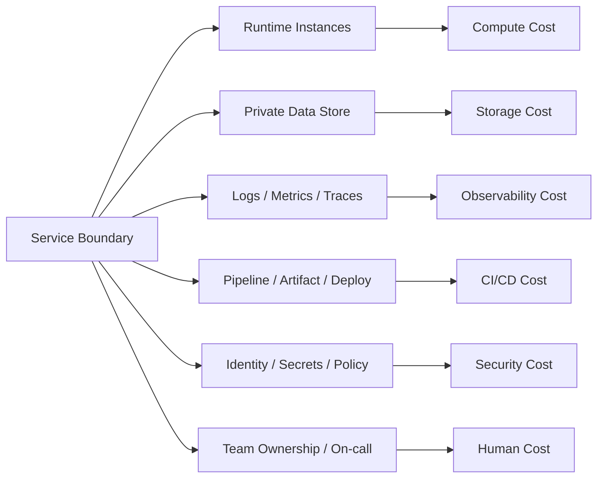
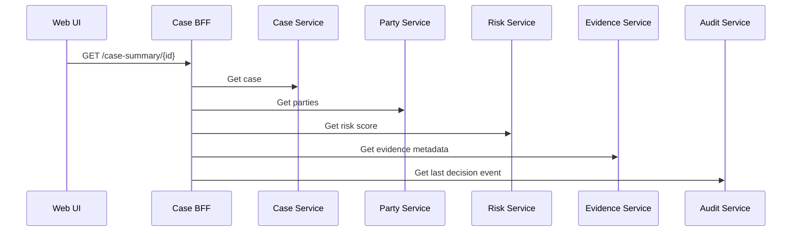
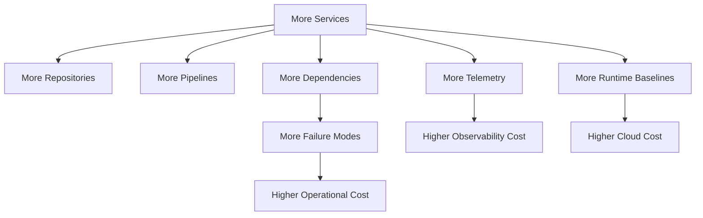
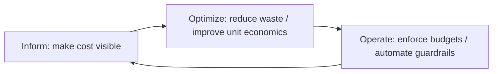
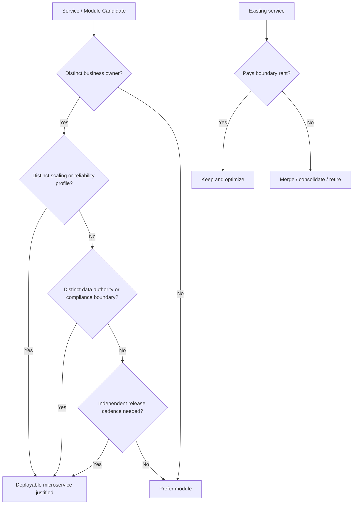

# Part 075 — Cost-Aware Microservices Architecture

## 1. Core Idea

Microservices are not free modularity.

Every service creates a permanent cost surface:

- runtime cost,
- storage cost,
- network cost,
- observability cost,
- security cost,
- CI/CD cost,
- operational cost,
- cognitive cost,
- ownership cost.

A weak architect treats cost as a finance topic.

A strong architect treats cost as an architecture signal.

Cost tells you where boundaries are too small, where fan-out is too high, where telemetry is too noisy, where data duplication is uncontrolled, and where the platform is charging every team a tax for each additional service.

The point of cost-aware architecture is not to make the system cheap at all cost.

The point is to make cost proportional to business value.

A service that protects a critical decision, isolates regulatory risk, and improves independent deployment may be worth its cost.

A service that exists only because someone converted one table into one REST API is usually not.

## 2. The Mental Model: Cost Follows Coupling and Runtime Shape

A microservice is an architectural boundary, but it is also a cost center.



A service boundary should be justified by at least one of these forces:

| Force | Meaning | Cost justification |
|---|---|---|
| Independent deployability | Can change without lockstep release | Worth paying runtime/platform cost |
| Business ownership | One team owns policy and outcome | Worth paying team/on-call cost |
| Data authority | Owns critical write model | Worth paying storage/replication cost |
| Reliability isolation | Failure should not spread | Worth paying redundancy/isolation cost |
| Scale independence | Load profile differs from neighbors | Worth paying dedicated scaling cost |
| Compliance isolation | Different audit/privacy/security posture | Worth paying control overhead |

If a service has none of these, its cost is probably architectural waste.

## 3. The Cost Equation of a Microservice

Do not start with monthly cloud bill.

Start with unit economics.

A useful simplified model:

```text
service_cost = fixed_baseline_cost
             + traffic_variable_cost
             + data_variable_cost
             + observability_variable_cost
             + change_delivery_cost
             + operational_risk_cost
```

Then normalize it:

```text
cost_per_business_operation = service_cost / successful_business_operations
cost_per_tenant             = service_cost / active_tenants
cost_per_case               = service_cost / completed_cases
cost_per_decision           = service_cost / finalized_decisions
cost_per_api_call           = service_cost / accepted_requests
```

For a regulatory case-management system, `cost_per_case_decision` is often more meaningful than `cost_per_request`.

Why?

Because users do not care how many internal service calls were needed.

They care that a case was created, assessed, escalated, decided, audited, and recoverable.

## 4. Cost Taxonomy for Java Microservices

### 4.1 Fixed Baseline Cost

Every service usually has minimum baseline cost even when traffic is low:

- at least one or more pods,
- JVM heap and native memory,
- sidecar proxy if service mesh is used,
- database/schema/connection pool,
- CI pipeline,
- logs/metrics/traces,
- dashboards,
- alerts,
- backup/retention,
- security scan,
- owner/on-call overhead.

A small service with low traffic can still be expensive because the baseline dominates.

```text
low_traffic_service_cost ≈ fixed_baseline_cost
high_traffic_service_cost ≈ fixed_baseline_cost + variable_cost
```

This is why nanoservices are dangerous.

They multiply fixed baseline cost faster than they create business value.

### 4.2 Compute Cost

Compute cost is driven by:

- CPU requested,
- CPU used,
- memory requested,
- memory used,
- number of replicas,
- overprovisioning ratio,
- startup latency,
- GC behavior,
- thread count,
- workload shape.

In Java, memory is not only heap.

A containerized Java service consumes:

```text
container_memory ≈ heap
                 + metaspace
                 + thread_stacks
                 + direct_buffers
                 + code_cache
                 + GC/native overhead
                 + agents
                 + sidecar overhead if colocated at pod level
```

A common failure mode:

```text
-Xmx = container limit
```

That leaves no room for non-heap memory.

The service is then killed by the container runtime even though heap usage looks fine.

A cost-aware Java service defines memory envelope explicitly:

```yaml
runtime:
  java:
    heapMax: 768Mi
    expectedNonHeap: 256Mi
    threadStackBudget: 128Mi
    nativeBudget: 128Mi
  container:
    memoryRequest: 1.25Gi
    memoryLimit: 1.5Gi
```

### 4.3 Network Cost

Microservices convert local function calls into network calls.

Network cost appears as:

- request latency,
- bandwidth,
- cross-zone traffic,
- cross-region traffic,
- load balancer processing,
- service mesh proxy overhead,
- retry amplification,
- duplicate payload transfer.

A design with fan-out can be operationally correct but economically bad.



One user request becomes five backend calls.

At low traffic, this may be acceptable.

At high traffic, this can dominate latency, connection pool pressure, trace volume, and network cost.

### 4.4 Storage Cost

Microservices duplicate data intentionally.

That duplication is not automatically bad.

It is bad when it is uncontrolled.

Cost drivers:

- private service databases,
- materialized read models,
- event retention,
- audit logs,
- search indexes,
- object storage,
- backup retention,
- point-in-time recovery,
- multi-region replication,
- dead-letter queues,
- historical snapshots.

A cost-aware service has explicit retention classes:

| Data class | Example | Retention | Storage tier | Owner |
|---|---|---:|---|---|
| Operational write model | Current case state | Active + legal window | Hot DB | Case Service |
| Audit event | Decision trail | Regulatory retention | WORM/archive capable | Audit Service |
| Search projection | Case search index | Rebuildable | Search cluster | Search Service |
| DLQ payload | Failed integration events | Short retention | Queue/object store | Source service |
| Debug logs | Structured app logs | Short | Log platform | Platform/team |

The key distinction:

```text
rebuildable data should not be priced like source-of-truth data.
```

### 4.5 Observability Cost

Observability is necessary.

Unbounded observability is expensive.

Cost drivers:

- log volume,
- trace volume,
- metric cardinality,
- number of dashboards,
- retention duration,
- indexing policy,
- payload size,
- high-cardinality labels,
- debug logs left enabled,
- stack traces repeated for known failures.

Bad metric:

```text
http.server.requests{userId="123",caseId="C-9912",tenantId="T-44",path="/cases/C-9912/evidence/E-123"}
```

Better metric:

```text
http.server.requests{tenantTier="enterprise",operation="attachEvidence",status="success"}
```

Put unique IDs in logs/traces, not metrics labels.

A cost-aware telemetry policy says:

| Signal | Use for | Cardinality rule | Retention |
|---|---|---|---|
| Metrics | Alerting/SLO/trends | Low cardinality | Medium/long |
| Logs | Detailed event evidence | Controlled fields | Short/medium |
| Traces | Causal debugging | Sampled | Short |
| Audit events | Compliance reconstruction | Stable schema | Long/legal |

Audit events are not debug logs.

Do not store regulatory evidence in best-effort observability pipelines.

## 5. Service-Sprawl Economics

A single microservice is cheap to create.

A fleet of microservices is expensive to own.

The dangerous part is nonlinear growth.



A fleet of 10 services can be manageable.

A fleet of 300 services requires platform engineering, catalog governance, ownership discipline, automated policy, and cost allocation.

Without those, cost growth becomes invisible until it is already political.

## 6. Cost-Aware Boundary Design

Cost-aware does not mean “merge everything.”

It means every split must pay rent.

### 6.1 Split When Cost Buys a Capability

Split a service when the split buys something valuable:

- different team ownership,
- different release cadence,
- different scale profile,
- stronger data authority,
- blast-radius reduction,
- compliance isolation,
- domain language isolation,
- workflow ownership clarity.

### 6.2 Do Not Split for Cosmetic Reasons

Do not split because:

- every table “deserves” a service,
- every aggregate “deserves” a deployable unit,
- the diagram looks cleaner,
- one class became large,
- the team wants to use a new framework,
- the monolith feels boring,
- the service name sounds like a noun.

### 6.3 The Boundary Rent Test

Ask:

```text
What recurring cost does this service introduce?
What recurring risk does it remove?
What business capability does it protect?
Who owns it?
What would break if it were a module instead?
```

If the answer is weak, keep it as a module.

## 7. Unit Economics for Microservices

Cost needs a denominator.

Otherwise every bill is just a number.

Useful denominators:

| Domain | Useful unit cost |
|---|---|
| API platform | Cost per accepted request |
| Case management | Cost per active case / completed case |
| Enforcement workflow | Cost per decision / escalation |
| Notification system | Cost per delivered notification |
| Reporting | Cost per generated report |
| Search | Cost per search request / indexed document |
| Tenant SaaS | Cost per tenant / tenant tier |
| Messaging | Cost per processed event |

Example service scorecard:

```yaml
service: case-decision-service
owner: enforcement-platform-team
businessUnit: regulatory-operations
monthlyCost:
  compute: 1800
  database: 950
  observability: 600
  messaging: 220
  storage: 300
  ciCd: 120
businessVolume:
  finalizedDecisions: 48000
  activeCases: 125000
unitEconomics:
  costPerFinalizedDecision: 0.082
  costPerActiveCase: 0.032
signals:
  p95DecisionCommandLatencyMs: 180
  errorRate: 0.0012
  auditCompleteness: 0.99999
review:
  owner: architecture-review-board
  nextReview: 2026-08-01
```

The exact currency does not matter in the model.

The discipline matters.

## 8. Java-Specific Cost Drivers

### 8.1 JVM Baseline Memory

Java is excellent for long-running services, but each service has baseline memory cost.

A fleet with many small Java services can become memory-heavy.

Typical drivers:

- Spring application context size,
- reflection metadata,
- dependency graph size,
- loaded classes,
- proxy generation,
- JSON serializers,
- metrics/tracing agents,
- logging appenders,
- thread pools,
- database connection pools.

Tuning is useful, but the first architecture question is simpler:

```text
Should this be a separate JVM process at all?
```

### 8.2 Thread Pools and Connection Pools

Every service often defines:

- HTTP server worker pool,
- async executor,
- scheduler pool,
- DB pool,
- HTTP client pool,
- Kafka consumer threads,
- workflow worker threads.

Each pool is a capacity decision.

Each pool can waste memory or overload a dependency.

Bad:

```yaml
services:
  all:
    dbPoolSize: 100
```

Better:

```yaml
service: case-query-service
capacity:
  replicas: 8
  dbPoolSizePerReplica: 12
  totalDbConnections: 96
  dbMaxAllowedConnectionsForService: 120
  rationale: "p95 query latency target under peak fan-out, bounded by reporting DB capacity"
```

A cost-aware service calculates total fleet pressure, not only per-pod config.

### 8.3 Serialization and Payload Size

Large JSON payloads cost:

- CPU serialization,
- memory allocation,
- network bandwidth,
- log/tracing payload risk,
- client parsing time.

Cost-aware API design prefers:

- explicit fields,
- pagination,
- projection endpoints,
- compression where appropriate,
- binary protocols only when justified,
- avoiding “return the aggregate graph” endpoints.

### 8.4 Logging in Hot Paths

A single extra log line in a high-QPS endpoint can become expensive.

Bad:

```java
log.info("Loaded case {} with payload {}", caseId, fullCaseDto);
```

Better:

```java
log.info("case.loaded caseId={} status={} partyCount={} evidenceCount={}",
    caseId.value(),
    caseStatus,
    partyCount,
    evidenceCount);
```

Do not log full payloads in hot paths.

Do not log sensitive data.

Do not log IDs as metrics labels.

## 9. Cost-Aware Observability Design

Telemetry must be designed like an API.

### 9.1 Logs

Log only events that answer operational questions:

- What happened?
- Which operation?
- Which tenant/tier?
- Which correlation ID?
- Which outcome?
- Which dependency failed?
- Was the command accepted, rejected, retried, compensated, or completed?

Control volume by:

- sampling repetitive successful events,
- using metrics for high-volume counters,
- using traces for causal path,
- using audit events for formal evidence,
- using log levels consistently,
- expiring debug logs.

### 9.2 Metrics

Metrics should be cheap, bounded, and alertable.

Use bounded dimensions:

```java
Counter.builder("case_decision_commands_total")
    .tag("outcome", outcome.name())
    .tag("tenant_tier", tenantTier.name())
    .tag("decision_type", decisionType.name())
    .register(meterRegistry)
    .increment();
```

Avoid unbounded dimensions:

```java
// Do not do this.
Counter.builder("case_decision_commands_total")
    .tag("case_id", caseId.value())
    .tag("user_id", userId.value())
    .register(meterRegistry)
    .increment();
```

### 9.3 Traces

Trace sampling should be policy-driven:

- sample errors heavily,
- sample rare workflows heavily,
- sample high-volume success paths lightly,
- always retain traces for critical regulatory decisions if permitted by privacy policy,
- never put sensitive payloads into span attributes.

## 10. Cost-Aware Data Duplication

Data duplication is part of microservices.

The problem is uncontrolled duplication.

Classify duplicated data:

| Duplication type | Valid use | Risk | Control |
|---|---|---|---|
| Snapshot in event | Consumer autonomy | Stale data | Schema/version policy |
| Read model | Query performance | Drift | Rebuild/reconciliation |
| Search index | User search | Privacy leak | Redaction/index policy |
| Cache | Latency reduction | Invalidation bug | TTL/version/tenant scoping |
| Analytics copy | Reporting | Semantic mismatch | Data product contract |
| Audit copy | Evidence | Retention/legal exposure | Formal retention policy |

A cost-aware duplication decision includes:

```text
Why duplicate?
Who owns copy?
How stale can it be?
Can it be rebuilt?
How long is it retained?
What privacy classification applies?
What is the deletion/correction workflow?
What is the monthly storage/indexing cost?
```

## 11. Architecture Patterns That Reduce Cost Without Breaking Boundaries

### 11.1 Modular Monolith Before Microservice

If a boundary is not ready for independent ownership, keep it as a module.

Use package boundaries, ArchUnit, Spring Modulith, or build modules to enforce structure.

This avoids paying network/runtime/platform cost before the boundary earns it.

### 11.2 BFF Instead of Chatty UI

A BFF can reduce client-side fan-out and repeated payload transfer.

But a BFF should own experience composition, not core business rules.

### 11.3 Materialized View Instead of Repeated Fan-Out

If the same query repeatedly fans out to many services, build a read model.

Trade-off:

- lower request-time cost,
- higher storage/projection complexity,
- staleness contract required.

### 11.4 Event-Carried State Transfer for Expensive Lookups

If every consumer calls the source service after receiving an event, the event may be too thin.

Thin event:

```json
{
  "eventType": "CaseEscalated",
  "caseId": "C-1001"
}
```

Useful event-carried snapshot:

```json
{
  "eventType": "CaseEscalated",
  "caseId": "C-1001",
  "tenantId": "T-8",
  "riskLevel": "HIGH",
  "escalationReason": "SLA_BREACH",
  "occurredAt": "2026-07-05T09:20:00Z"
}
```

Do not dump the whole aggregate.

Carry enough state to avoid unnecessary synchronous coupling.

### 11.5 Tiered Retention

Keep hot data hot only while it is needed.

Example:

```yaml
retention:
  applicationLogs:
    hotSearchable: 14d
    coldArchive: 90d
  traces:
    default: 7d
    errorTraces: 30d
  auditEvents:
    immutableRetention: 7y
  readModelSnapshots:
    retention: 30d
    rebuildable: true
```

### 11.6 Adaptive Sampling

Telemetry should adapt to signal value.

- During normal operation: sample successes.
- During incidents: increase sampling for affected services.
- For critical workflows: always capture minimal causal evidence.
- For privacy-sensitive flows: capture metadata, not payload.

## 12. FinOps Loop for Microservices

Use a continuous loop:



### 12.1 Inform

Make service cost visible:

- cost by service,
- cost by team,
- cost by tenant tier,
- cost by environment,
- cost by business operation,
- cost by telemetry type,
- cost by dependency.

### 12.2 Optimize

Improve the cost/value ratio:

- right-size CPU/memory,
- reduce overprovisioning,
- remove idle services,
- tune log retention,
- reduce high-cardinality metrics,
- consolidate weak boundaries,
- reduce fan-out,
- use read models where justified,
- remove duplicate pipelines/resources.

### 12.3 Operate

Turn optimization into routine:

- cost budgets in service catalog,
- alert on anomalous cost growth,
- enforce resource request policies,
- require expiry on expensive debug telemetry,
- review service cost during architecture review,
- include cost in ADR consequences,
- make cost visible to owning teams.

## 13. Service Cost Contract

Every production service should have a cost contract.

Example:

```yaml
apiVersion: platform.company.com/v1
kind: ServiceCostContract
metadata:
  service: case-decision-service
  owner: enforcement-platform-team
spec:
  businessUnit: regulatory-operations
  environment: production
  tier: critical
  costAllocation:
    tags:
      service: case-decision-service
      team: enforcement-platform-team
      domain: case-decision
      environment: prod
  unitEconomics:
    primaryUnit: finalized_decision
    secondaryUnits:
      - active_case
      - decision_command
  budgets:
    monthlySoftLimit: 4200
    monthlyHardReviewThreshold: 5500
    observabilityPercentLimit: 25
  runtimeEnvelope:
    replicas:
      min: 4
      max: 20
    cpuRequestPerReplica: 500m
    memoryRequestPerReplica: 1280Mi
    maxDbConnectionsPerReplica: 12
  telemetry:
    logRetentionDays: 14
    traceRetentionDays: 7
    auditRetentionYears: 7
    metricCardinalityPolicy: bounded
  review:
    cadence: quarterly
    requiredWhen:
      - monthly_cost_growth_gt_20_percent
      - observability_cost_gt_30_percent
      - replica_count_doubles
      - new_cross_region_dependency
```

## 14. Cost Signals in Architecture Review

Add these questions to review:

### 14.1 Boundary Cost

- What cost does this service add permanently?
- Why is a separate deployable service justified?
- Could this be a module for now?
- What independent scaling or ownership does it need?

### 14.2 Runtime Cost

- What is the minimum replica count?
- What is the memory envelope per replica?
- What is the CPU envelope per request?
- What is the sidecar/platform overhead?
- What is idle baseline cost?

### 14.3 Data Cost

- What data is source of truth?
- What data is duplicated?
- What data is rebuildable?
- What retention policy applies?
- What storage tier is used?

### 14.4 Observability Cost

- What logs are emitted on the hot path?
- What metrics have high cardinality risk?
- What traces are sampled?
- What telemetry must be retained for audit?
- What telemetry is sensitive?

### 14.5 Dependency Cost

- How many downstream calls per user operation?
- Are calls cross-zone or cross-region?
- Do retries multiply traffic?
- Could event-carried state reduce lookups?
- Would a read model reduce fan-out?

## 15. Cost Anti-Patterns

### 15.1 One Table, One Service

This creates maximum runtime cost with minimum domain value.

A table is not a business capability.

### 15.2 Debug Logging as Observability Strategy

Debug logs are expensive, noisy, and usually not structured enough for diagnosis.

Use metrics and traces for repeated signals.

Use logs for meaningful events.

Use audit events for formal evidence.

### 15.3 Infinite Retention by Accident

If retention is not explicit, it often becomes “forever.”

Forever is expensive and risky.

### 15.4 Autoscaling Without Dependency Budget

Scaling one service can overload its database, queue, or downstream service.

Autoscaling must be constrained by dependency capacity.

### 15.5 Service Mesh as Free Abstraction

Mesh features have cost:

- proxy CPU,
- proxy memory,
- latency,
- config complexity,
- policy debugging,
- telemetry duplication.

Use mesh where it reduces more risk than it adds.

### 15.6 Cost Optimization Without SLO Awareness

Reducing replicas may save money and violate latency/reliability.

Cost optimization must respect SLO and risk tier.

## 16. Decision Model: Keep, Split, Merge, or Retire

Use this decision model:



## 17. Example: Cost Review of `case-note-service`

A team proposes a separate `case-note-service`.

Claim:

> Notes are important, so they deserve a service.

Review:

| Question | Finding |
|---|---|
| Separate owner? | Same team as Case Service |
| Separate data authority? | Notes only exist inside case lifecycle |
| Separate scale profile? | Same traffic as case details |
| Separate compliance profile? | Same retention/privacy as case |
| Independent release? | Rarely |
| High fan-out impact? | Yes, every case detail page calls notes |

Decision:

```text
Keep notes as a module inside Case Service for now.
Expose notes through Case API.
Extract only if note policy, retention, ownership, or scale diverges.
```

This saves runtime cost and avoids unnecessary fan-out.

## 18. Example: Cost Review of `audit-evidence-service`

A team proposes a separate `audit-evidence-service`.

Review:

| Question | Finding |
|---|---|
| Separate owner? | Compliance/platform team |
| Separate retention? | 7+ years, immutable |
| Separate security? | Stronger access control |
| Separate data authority? | Formal evidence chain |
| Separate scale profile? | Append-heavy, query-rare |
| Independent lifecycle? | Yes |

Decision:

```text
Separate service is justified.
Boundary cost buys compliance isolation and evidence integrity.
```

Not all extra services are waste.

Cost-aware architecture distinguishes expensive value from expensive noise.

## 19. Cost-Aware Architecture Decision Record Template

```md
# ADR: Cost-Aware Boundary Decision for <Service>

## Context
What business capability or problem is being addressed?

## Options
1. Keep as module
2. Extract as microservice
3. Merge with existing service
4. Use shared platform capability

## Cost Surface
- Compute:
- Storage:
- Network:
- Observability:
- CI/CD:
- Operational ownership:
- Security/compliance:

## Value Surface
- Independent deployability:
- Reliability isolation:
- Business ownership:
- Data authority:
- Compliance isolation:
- Scale independence:

## Unit Economics
Primary business unit:
Expected volume:
Expected monthly cost:
Expected cost per unit:

## Risks
Cost risks:
Reliability risks:
Operational risks:
Security/privacy risks:

## Decision
Chosen option and why.

## Guardrails
- Budget thresholds
- Telemetry cardinality limits
- Runtime envelope
- Retention policy
- Review trigger

## Revisit Criteria
When should this decision be reviewed?
```

## 20. Checklist

Before approving a new service, verify:

- [ ] The service owns a business capability, not merely a table.
- [ ] The service has an explicit owner.
- [ ] The service has a runtime cost estimate.
- [ ] The service has a data ownership and retention policy.
- [ ] The service has bounded observability cardinality.
- [ ] The service has a unit economics metric.
- [ ] The service has SLO-aware scaling assumptions.
- [ ] The service has a cost allocation tag strategy.
- [ ] The service does not introduce unnecessary fan-out.
- [ ] The service has a review trigger for cost growth.
- [ ] The service boundary pays its rent.

## 21. Exercises

1. Take one service from your current architecture. Write its cost contract.
2. Identify one high-fan-out user journey. Estimate backend calls per request.
3. Find one metric with high-cardinality risk. Redesign its labels.
4. Identify one duplicate data store. Classify it as source-of-truth, projection, cache, search index, or audit evidence.
5. Pick one low-traffic service. Decide whether it should remain separate, become a module, or be retired.

## 22. Final Mental Model

Cost is not the enemy of architecture.

Cost is feedback.

It reveals whether boundaries are earning their keep.

A top-level engineer does not optimize only for the cheapest system.

They optimize for the best ratio between business value, reliability, security, operability, evolvability, and cost.

In microservices, every boundary must pay rent.

If it cannot, it is probably not a service.

It is probably just a module wearing a network port.

## References

- FinOps Foundation — FinOps Framework and phases: https://www.finops.org/framework/
- AWS Well-Architected Framework — Cost Optimization Pillar: https://docs.aws.amazon.com/wellarchitected/latest/cost-optimization-pillar/welcome.html
- Google SRE — Monitoring Distributed Systems: https://sre.google/sre-book/monitoring-distributed-systems/
- Kubernetes — Resource Management for Pods and Containers: https://kubernetes.io/docs/concepts/configuration/manage-resources-containers/
- OpenTelemetry — Observability Concepts: https://opentelemetry.io/docs/concepts/
