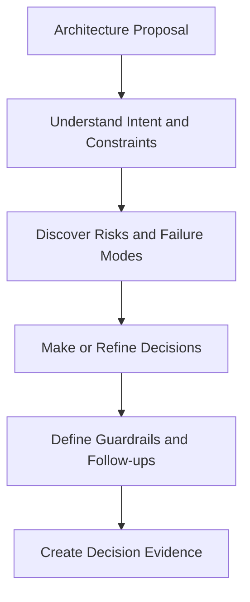
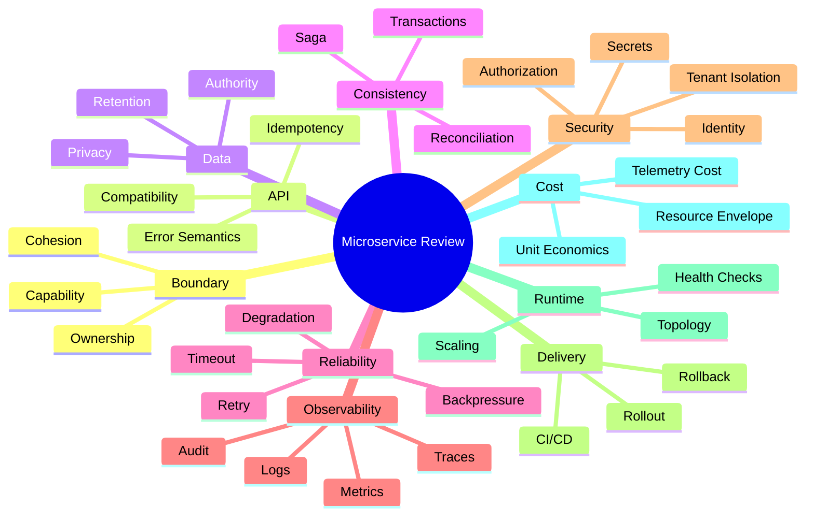
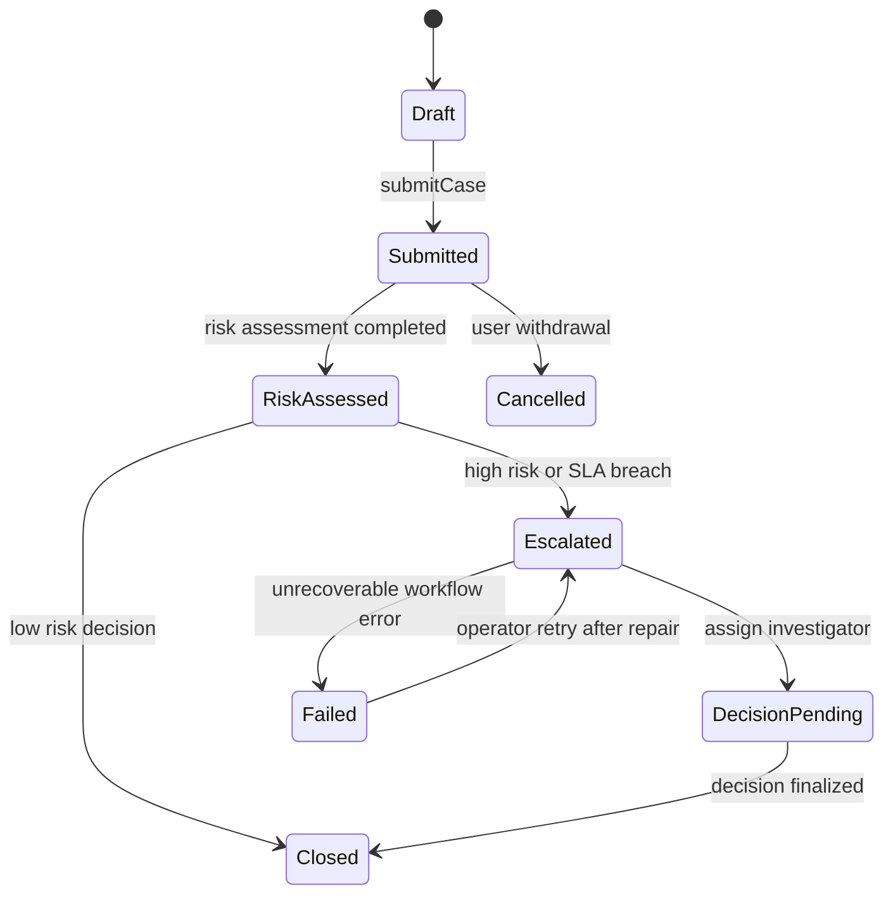
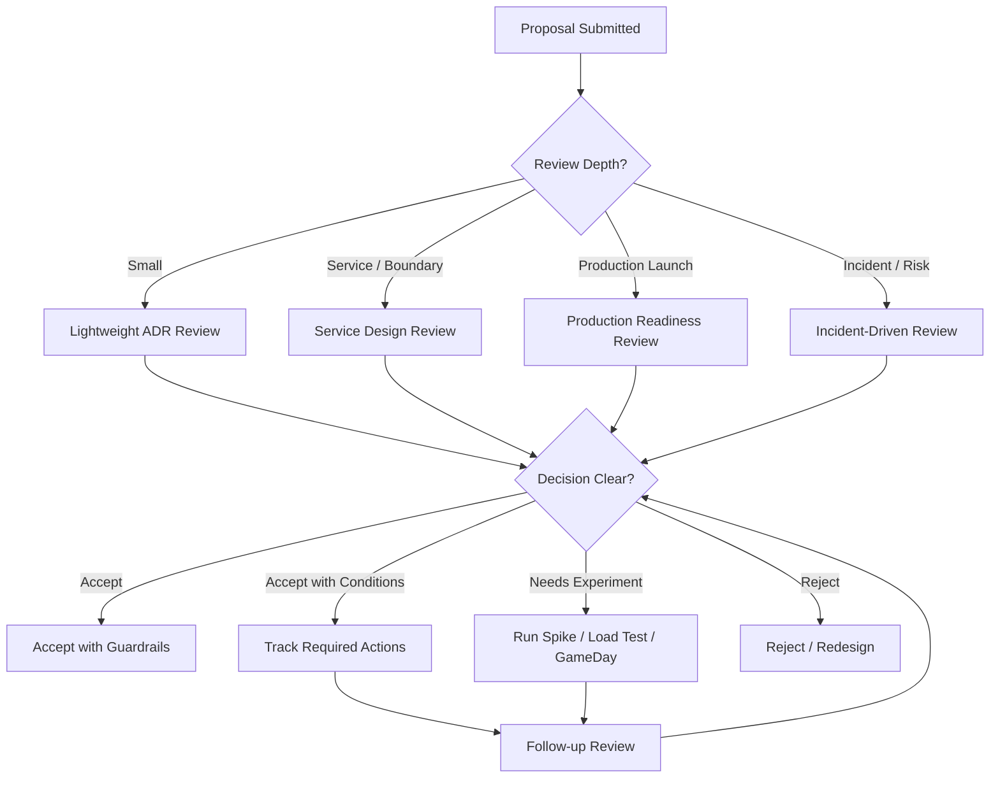

# Part 076 — Architecture Review for Microservices

## 1. Core Idea

Architecture review is not a meeting where senior engineers approve diagrams.

Architecture review is a risk-discovery mechanism.

It should answer:

```text
What are we building?
Why is this the right shape?
What can go wrong?
How will we know?
What will we do when it goes wrong?
Who owns the consequences?
```

Weak reviews focus on templates.

Strong reviews expose assumptions, force trade-offs into the open, and convert architectural risk into explicit decisions, guardrails, experiments, and follow-up actions.

For microservices, review matters because a small design mistake can multiply across:

- service boundaries,
- API contracts,
- event contracts,
- data ownership,
- consistency windows,
- deployment sequencing,
- runtime topology,
- observability,
- security,
- cost,
- team ownership.

A bad monolith design usually hurts one deployable unit.

A bad microservices design can create an organization-wide failure mode.

## 2. What Architecture Review Is Not

It is not:

- diagram approval,
- seniority theater,
- cloud checklist bureaucracy,
- tool selection debate,
- style policing,
- a one-time gate,
- a replacement for ownership,
- a place to hide weak requirements behind jargon.

If the review does not change decisions, reduce risk, or create learning, it is ceremony.

## 3. The Review Mental Model

Architecture review has four jobs.



The output is not “approved.”

The output is:

- accepted decisions,
- rejected alternatives,
- known risks,
- assumptions to validate,
- required experiments,
- production-readiness gaps,
- ownership commitments,
- review triggers.

## 4. Review Types

Not every change deserves the same review depth.

### 4.1 Lightweight ADR Review

Use for:

- small boundary decision,
- library choice with limited blast radius,
- non-critical API change,
- internal module restructuring,
- one-service deployment change.

Output:

- short ADR,
- risk note,
- rollback plan if needed.

### 4.2 Service Design Review

Use for:

- new microservice,
- service extraction,
- new public/internal API,
- new event stream,
- new database ownership,
- new cross-service workflow.

Output:

- service charter,
- boundary ADR,
- data ownership decision,
- collaboration model,
- reliability design,
- observability plan,
- security/privacy assessment.

### 4.3 Production Readiness Review

Use before:

- first production launch,
- critical-path onboarding,
- high-volume release,
- new regional deployment,
- new tenant tier,
- compliance-sensitive workflow.

Output:

- readiness decision,
- go/no-go risks,
- operational gaps,
- runbook links,
- SLO and alert readiness,
- rollback/roll-forward plan.

### 4.4 Incident-Driven Architecture Review

Use after:

- repeated incident,
- cascading failure,
- data inconsistency,
- security finding,
- major cost spike,
- failed deployment,
- migration rollback.

Output:

- design correction,
- resilience improvement,
- fitness function,
- runbook update,
- ownership clarification.

## 5. Inputs Required for a Serious Review

A review without inputs becomes opinion exchange.

Minimum review pack:

| Artifact | Purpose |
|---|---|
| Problem statement | Why this change exists |
| Business capability map | Which domain capability is affected |
| Service charter | Owner, purpose, SLO, data authority |
| Context diagram | Upstream/downstream and users |
| Sequence diagrams | Key flows and failure paths |
| API/event contract | Integration surface |
| Data ownership model | Source of truth, copies, retention |
| Consistency model | Transaction boundary, saga, staleness |
| Runtime topology | Pods, regions, gateways, mesh, queues |
| Failure model | Timeouts, retries, overload, degradation |
| Observability plan | Logs, metrics, traces, audit evidence |
| Security/privacy model | Identity, authorization, sensitive data flow |
| Deployment plan | Rollout, rollback, compatibility |
| Cost model | Runtime, storage, observability, unit economics |
| ADRs | Decisions and alternatives |
| Runbook draft | Operational response |

Do not demand 60 pages.

Demand the right evidence.

## 6. Architecture Review Pack Template

```md
# Architecture Review Pack: <Service or Change Name>

## 1. Summary
What is being built and why?

## 2. Business Capability
Which capability owns this behavior?
What user/business outcome changes?

## 3. Scope
In scope:
Out of scope:
Non-goals:

## 4. Current State
Existing services:
Existing data owners:
Current pain points:
Current incident/cost/change drivers:

## 5. Proposed Design
Service boundary:
APIs:
Events:
Data ownership:
Workflow/process model:
Runtime topology:

## 6. Alternatives Considered
Option A:
Option B:
Option C:
Rejected options and reasons:

## 7. Critical Decisions
Decision:
Rationale:
Trade-off:
Consequence:
Revisit trigger:

## 8. Failure Model
Expected failures:
Timeout policy:
Retry policy:
Backpressure/load shedding:
Fallback/degradation:
Recovery path:

## 9. Consistency Model
Local transaction boundary:
Cross-service process:
Saga/workflow:
Idempotency:
Reconciliation:

## 10. Security and Privacy
Identity model:
Authorization boundary:
Sensitive data:
Tenant isolation:
Audit evidence:

## 11. Observability
SLI/SLO:
Metrics:
Logs:
Traces:
Audit events:
Dashboards:
Alerts:
Runbooks:

## 12. Deployment and Migration
Compatibility plan:
Feature flags:
Expand-contract steps:
Rollback/roll-forward:
Data migration:
Cutover criteria:

## 13. Cost and Capacity
Expected traffic:
Capacity envelope:
Resource requests:
Storage and retention:
Telemetry cost:
Unit economics:

## 14. Risks and Open Questions
Risk register:
Assumptions:
Experiments required:
Follow-up actions:
```

## 7. Review Dimensions

A microservices review should cover at least ten dimensions.



## 8. Boundary Review

Ask:

- What business capability does this service own?
- What policy decisions belong here?
- Which data can only this service mutate?
- Which team owns this service end-to-end?
- Can this service be deployed independently?
- Does this boundary reduce or increase coordination?
- Is this a bounded context or just a CRUD wrapper?
- What would happen if this stayed a module?

Red flags:

- service named after a database table,
- no clear owner,
- shared database writes,
- many services needed for every tiny use case,
- business rules split across gateway/BFF/service/database,
- service exists only to match an org chart that no longer exists.

## 9. API and Contract Review

Ask:

- What is the API contract promising?
- Which changes are backward-compatible?
- Which changes are breaking?
- Is the endpoint resource-oriented, command-oriented, or query-oriented?
- Are errors stable and machine-readable?
- Are commands idempotent or protected by idempotency keys?
- Are pagination and filtering bounded?
- Is the API exposing internal model accidentally?
- Is deprecation policy defined?

Failure-mode question:

```text
If a consumer retries this request after timeout, can the business side effect happen twice?
```

If the answer is “maybe”, the API design is not ready.

## 10. Event and Messaging Review

Ask:

- Is this a domain event, integration event, command, or notification?
- Who owns the event schema?
- Is event meaning stable?
- Does the event carry enough state?
- What is the ordering requirement?
- What is the deduplication key?
- What is the consumer idempotency strategy?
- What is the DLQ policy?
- Can consumers rebuild projections?
- Is sensitive data being broadcast too widely?

Red flags:

- event name is technical, not domain-level,
- event has no versioning strategy,
- consumers depend on event fields that were not part of contract,
- event contains full internal aggregate payload,
- every consumer calls back synchronously after receiving the event,
- no replay/reconciliation strategy.

## 11. Data Ownership Review

Ask:

- Which service owns the write model?
- Which data is source of truth?
- Which data is a copy?
- Which copies are rebuildable?
- Which service enforces invariants?
- What is the transaction boundary?
- What is the retention policy?
- What is the deletion/correction workflow?
- Are reports joining across service databases directly?

Red flags:

- multiple services write the same table,
- shared schema used as integration contract,
- read models treated as source of truth,
- no owner for duplicated data,
- no reconciliation strategy,
- database migration requires multi-service lockstep release.

## 12. Consistency and Workflow Review

Ask:

- Which operation must be immediately consistent?
- Which operation can be eventually consistent?
- What is the user-visible consistency promise?
- Is there a saga or workflow?
- What is the pivot point?
- What are compensating actions?
- What happens on timeout?
- What happens on duplicate message?
- What happens on late event?
- Can the process be reconstructed from events/state?

Mermaid example for review:



Reviewers should ask:

```text
Who owns each state transition?
Which transition is local?
Which transition crosses service boundary?
Which transition needs audit evidence?
Which transition is retry-safe?
```

## 13. Reliability Review

Ask:

- What are critical downstream dependencies?
- What are optional dependencies?
- What are timeout values?
- Are deadlines propagated?
- Which calls are retried?
- Is retry safe?
- Is there backoff and jitter?
- Is there a retry budget?
- What is the circuit breaker policy?
- What is the load shedding policy?
- What is the degraded mode?
- Can failure cascade?

Red flags:

- no timeout on outbound call,
- retries at every layer,
- remote call inside database transaction,
- health check depends on optional dependency,
- all dependencies treated as critical,
- no way to shed load,
- fallback silently returns incorrect business answer.

## 14. Observability Review

Ask:

- What are the SLIs?
- What metrics indicate user impact?
- What logs explain state transitions?
- What trace spans show causal flow?
- What audit events are formal evidence?
- Can we correlate request, command, event, workflow, and audit record?
- Are metric labels bounded?
- Are logs structured?
- Are sensitive fields redacted?
- Is there a runbook for each page-worthy alert?

Red flags:

- only CPU/memory dashboard,
- no business metrics,
- high-cardinality labels,
- logs contain PII,
- no correlation ID,
- no trace propagation through async messaging,
- no alert tied to SLO.

## 15. Security and Privacy Review

Ask:

- What identity is used for user calls?
- What identity is used for service-to-service calls?
- Is authorization checked at object level?
- Is tenant boundary enforced everywhere?
- Are secrets rotated safely?
- Is sensitive data minimized?
- Are events leaking sensitive fields?
- Are logs/traces/DLQ/search indexes redacted?
- Is break-glass access audited?
- Does the service have least privilege to dependencies?

Red flags:

- gateway-only authorization,
- trusting internal network,
- tenant ID accepted from client without validation,
- secrets in config repository,
- broad database privileges,
- sensitive payload in event bus,
- security logging mixed with debug logs.

## 16. Runtime and Deployment Review

Ask:

- What is the minimum/maximum replica count?
- What is the startup behavior?
- What is the graceful shutdown behavior?
- Are readiness and liveness meaningful?
- What is the deployment strategy?
- What is rollback vs roll-forward plan?
- Is database migration expand-contract safe?
- Are contracts compatible during rollout?
- Can old and new versions coexist?
- What happens if only half the fleet updates?

Red flags:

- schema migration requires all services down,
- rollback cannot work after data migration,
- no readiness delay for warmup,
- consumers lose messages during shutdown,
- canary has no success metric,
- feature flag has no owner or expiry.

## 17. Cost Review

Ask:

- What is the service's fixed baseline cost?
- What is variable cost per business operation?
- What is observability cost percentage?
- What is storage retention cost?
- What is cross-zone/cross-region traffic?
- What is the fan-out cost of major user journeys?
- Does the service boundary pay rent?
- What cost growth triggers review?

Red flags:

- no cost allocation tags,
- all logs retained forever,
- high-cardinality metrics,
- separate service with no ownership/scaling/compliance reason,
- autoscaling configured without dependency budget.

## 18. Risk Register

A good review creates a risk register.

Example:

| ID | Risk | Impact | Likelihood | Detection | Owner | Mitigation | Status |
|---|---|---:|---:|---|---|---|---|
| R1 | Duplicate case escalation command after timeout | High | Medium | Idempotency metric + audit reconciliation | Case team | Idempotency key store + command status endpoint | Open |
| R2 | Reporting read model becomes stale during event backlog | Medium | Medium | Projection lag SLI | Reporting team | Watermark in UI + backlog alert | Open |
| R3 | New audit event contains sensitive data | High | Low | Schema privacy review | Compliance platform | Redaction policy + event field classification | Open |
| R4 | DB pool overload after HPA scale-out | High | Medium | DB connection dashboard | Platform/team | Max replicas bound + pool budget | Open |

Use risk as an engineering object.

Not as a paragraph at the end.

## 19. Risk Scoring Model

Simple scoring is enough.

```text
risk_score = impact * likelihood * weak_detection_factor
```

Where:

| Score | Meaning |
|---:|---|
| 1 | Low |
| 2 | Moderate |
| 3 | High |
| 4 | Critical |

Weak detection factor:

| Detection quality | Factor |
|---|---:|
| Strong automatic detection | 1 |
| Dashboard/manual detection | 2 |
| User complaint only | 3 |
| No detection path | 4 |

A risk with high impact and no detection path must block launch or require explicit executive/business acceptance.

## 20. Failure-Mode Review

Do not review only happy path.

Use a failure-mode table.

| Failure | Expected behavior | Signal | Mitigation | Owner |
|---|---|---|---|---|
| Downstream timeout | Return accepted + async retry or fail fast | timeout counter, trace span | deadline + retry budget | Service team |
| Duplicate command | Return original result | idempotency replay counter | idempotency key store | API team |
| Message poison | Stop retry storm, DLQ | DLQ depth, oldest age | bounded retry + DLQ runbook | Event owner |
| Projection lag | Show stale warning | projection lag gauge | watermark + catch-up worker | Query team |
| DB saturation | Shed low-priority traffic | DB wait time, pool usage | bulkhead + load shedding | Service owner |
| Partial regional outage | Fail over or degrade | region health SLI | DR runbook | Platform/team |

Reviewers should ask:

```text
How does this fail?
How does it recover?
How do we know?
Who gets paged?
What can they safely do?
```

## 21. Architecture Review Flow



## 22. Review Outcomes

Avoid vague outcomes.

Use explicit outcome categories:

| Outcome | Meaning |
|---|---|
| Accepted | Design can proceed; risks are acceptable |
| Accepted with conditions | Must complete named actions before launch |
| Experiment required | Assumption must be validated before decision |
| Redesign required | Core decision is unsafe or unjustified |
| Deferred | Decision depends on missing business/technical input |
| Rejected | Proposal violates hard constraint |

Each condition must have:

- owner,
- due date or launch gate,
- evidence required,
- review mechanism.

## 23. Example Review: New `case-escalation-service`

Proposal:

> Extract escalation logic from Case Service into `case-escalation-service`.

### 23.1 Claimed Motivation

- escalation policy changes frequently,
- investigators need independent workflow iteration,
- escalation has SLA timers,
- escalation audit evidence is compliance-sensitive.

### 23.2 Review Findings

| Dimension | Finding |
|---|---|
| Boundary | Reasonable; escalation has distinct lifecycle and policy |
| Ownership | Needs explicit owner; currently split between Case and Workflow team |
| Data | Escalation state source-of-truth unclear |
| Consistency | Case status and escalation status can diverge |
| API | Commands need idempotency key and expected version |
| Events | `CaseEscalated` event needs stable semantics |
| Reliability | SLA timer must survive restart and redeploy |
| Observability | Need workflow state metrics and stuck escalation alert |
| Security | Escalation reason may contain sensitive details |
| Cost | Separate service justified if workflow ownership is real |

### 23.3 Decision

Accepted with conditions.

Conditions:

1. Escalation service owns escalation lifecycle state.
2. Case service owns case summary state and consumes escalation events.
3. Commands require idempotency key.
4. Workflow state transition must emit audit event.
5. `escalation_stuck_total` and `escalation_timer_lag_seconds` metrics required before launch.
6. ADR required for compensation when case is withdrawn during escalation.

## 24. Example Review Questions by Role

### Architect

- Is the boundary aligned with business capability?
- What alternative was rejected and why?
- What are the consequences of this decision?
- What failure mode crosses service boundary?

### Service Owner

- Can your team operate this service at 03:00?
- What alert pages you?
- What runbook do you follow?
- What dependency can take you down?

### Security Engineer

- Where is authorization enforced?
- What secrets are used?
- What data is sensitive?
- What is tenant isolation strategy?

### SRE / Platform Engineer

- What are the SLOs?
- What is the capacity envelope?
- How does rollout work?
- What does degraded mode look like?

### Product / Domain Owner

- What business outcome changes?
- What consistency delay is acceptable?
- What compensation is acceptable?
- What audit evidence is required?

## 25. Hard Constraints vs Soft Preferences

Architecture reviews fail when preferences are treated like laws and laws are treated like suggestions.

Hard constraints:

- no shared writes to another service database,
- no PII in logs/traces,
- no outbound call without timeout,
- no command endpoint without idempotency strategy when retries are possible,
- no production launch without owner/on-call/runbook,
- no breaking API change without compatibility/migration plan,
- no service without cost allocation tags.

Soft preferences:

- preferred framework,
- preferred package layout,
- preferred naming convention,
- preferred observability library,
- preferred CI tool.

Be strict on invariants.

Be flexible on implementation details.

## 26. Review Smells

### 26.1 The Beautiful Diagram Smell

The diagram is clean but no failure path is shown.

Fix:

- add failure sequence diagram,
- add timeout/retry policy,
- add degraded mode.

### 26.2 The “We’ll Add Observability Later” Smell

If observability is added later, diagnosis is added after the incident.

Fix:

- require telemetry plan before launch,
- define SLI and runbook early.

### 26.3 The “It’s Internal” Smell

Internal APIs still become contracts.

Fix:

- apply compatibility discipline,
- document lifecycle,
- track consumers.

### 26.4 The “Database Knows the Truth” Smell

The database is used as integration layer.

Fix:

- identify data owner,
- expose API/event/read model,
- stop cross-service writes.

### 26.5 The “Just Retry” Smell

Retry is proposed as universal failure handling.

Fix:

- classify retryable failures,
- add idempotency,
- set retry budget,
- add backoff/jitter,
- define unknown-outcome behavior.

### 26.6 The “Platform Will Solve It” Smell

Mesh, Kubernetes, gateway, or framework is expected to solve business correctness.

Fix:

- separate platform responsibility from application responsibility,
- keep domain invariants in service/application/domain layer.

## 27. Architecture Review Checklist

### Boundary

- [ ] Service maps to business capability.
- [ ] Owner is clear.
- [ ] Data authority is clear.
- [ ] Boundary ADR exists.
- [ ] Module vs service alternative was considered.

### API / Event

- [ ] Contract is documented.
- [ ] Compatibility strategy exists.
- [ ] Idempotency is defined where needed.
- [ ] Error semantics are stable.
- [ ] Consumers are known or discoverable.

### Data / Consistency

- [ ] Source of truth is explicit.
- [ ] Transaction boundary is explicit.
- [ ] Cross-service consistency model is explicit.
- [ ] Reconciliation path exists.
- [ ] Retention and deletion are defined.

### Reliability

- [ ] Timeouts exist.
- [ ] Retries are safe and bounded.
- [ ] Backpressure/load shedding is considered.
- [ ] Degraded mode is defined.
- [ ] Cascading failure risk is assessed.

### Observability

- [ ] SLI/SLO defined.
- [ ] Logs are structured.
- [ ] Metrics have bounded cardinality.
- [ ] Traces propagate across boundaries.
- [ ] Alerts link to runbooks.

### Security / Privacy

- [ ] Identity model is defined.
- [ ] Authorization boundary is defined.
- [ ] Tenant isolation is defined.
- [ ] Sensitive data flow is mapped.
- [ ] Secrets and rotation are defined.

### Delivery / Runtime

- [ ] CI/CD gates are defined.
- [ ] Deployment strategy is defined.
- [ ] Rollback/roll-forward plan exists.
- [ ] Health probes are meaningful.
- [ ] Capacity envelope is defined.

### Cost / Governance

- [ ] Cost model exists.
- [ ] Cost allocation tags exist.
- [ ] Service catalog entry exists.
- [ ] Lifecycle owner exists.
- [ ] Review triggers exist.

## 28. Architecture Review as Code

Not every review item should remain manual.

Automate invariants.

Examples:

| Invariant | Automation |
|---|---|
| No package dependency from domain to adapter | ArchUnit test |
| No forbidden dependency | build rule |
| API breaking change detected | contract compatibility check |
| No high-cardinality metric label names | static telemetry lint |
| Kubernetes resource requests required | policy-as-code |
| Required service catalog metadata | CI check |
| No public endpoint without auth annotation/policy | static/security scan |
| No missing timeout in HTTP client config | config lint/test |

Example ArchUnit-style boundary test:

```java
@AnalyzeClasses(packages = "com.acme.caseworkflow")
class ArchitectureRulesTest {

    @ArchTest
    static final ArchRule domain_must_not_depend_on_adapters =
        noClasses()
            .that().resideInAPackage("..domain..")
            .should().dependOnClassesThat().resideInAnyPackage(
                "..adapter..",
                "..infrastructure..",
                "org.springframework.."
            );

    @ArchTest
    static final ArchRule application_must_not_call_web_controllers =
        noClasses()
            .that().resideInAPackage("..application..")
            .should().dependOnClassesThat().resideInAPackage("..api..");
}
```

Manual review should focus on judgment.

Automation should enforce repeated rules.

## 29. Review Cadence

Recommended cadence:

| Trigger | Review type |
|---|---|
| New service | Service design review |
| New data owner | Boundary/data review |
| New public API/event | Contract review |
| New critical workflow | Workflow/reliability review |
| Pre-production launch | Production readiness review |
| Major incident | Incident-driven architecture review |
| Monthly cost spike | Cost architecture review |
| Quarterly service maturity | Lifecycle governance review |
| Service retirement | Decommission review |

Review should be event-driven, not purely calendar-driven.

## 30. How to Run the Review Meeting

Keep it tight.

### 30.1 Before the Meeting

- submit review pack,
- identify decision needed,
- assign reviewers by dimension,
- mark known open questions,
- share diagrams and ADRs.

### 30.2 During the Meeting

Suggested agenda:

1. Problem and constraints.
2. Proposed design.
3. Alternatives rejected.
4. Boundary/data/API review.
5. Failure-mode walkthrough.
6. Security/privacy review.
7. Operability/cost review.
8. Risk register.
9. Decision and conditions.

### 30.3 After the Meeting

- publish ADR,
- update service catalog,
- create follow-up tickets,
- attach runbook/dashboard links,
- define review triggers,
- convert repeatable checks into automation.

## 31. Final Mental Model

Architecture review is not about proving that a design is perfect.

Distributed systems are never perfect.

Architecture review is about making risk explicit before production makes it expensive.

The best reviews are not adversarial.

They are rigorous.

They ask hard questions early, while change is still cheap.

A top-level engineer uses review to protect three things:

1. The business outcome.
2. The operational integrity of the system.
3. The future ability to change safely.

If a review cannot explain boundary, data ownership, failure behavior, observability, security, deployment, cost, and ownership, the design is not ready.

Not because it is bad.

Because it is still invisible.

Architecture review makes the invisible parts visible.

## 32. Exercises

1. Pick one service you know. Build a one-page review pack for it.
2. Write a risk register with at least five risks.
3. Draw a happy-path and failure-path sequence diagram for one critical operation.
4. Identify three review checklist items that can be automated.
5. Take a past incident and turn it into an incident-driven architecture review.

## References

- AWS Well-Architected Framework: https://docs.aws.amazon.com/wellarchitected/latest/framework/welcome.html
- AWS Well-Architected Framework — The Pillars: https://docs.aws.amazon.com/wellarchitected/latest/framework/the-pillars-of-the-framework.html
- Azure Well-Architected Framework: https://learn.microsoft.com/en-us/azure/well-architected/
- Google SRE — Production Readiness Reviews: https://sre.google/sre-book/evolving-sre-engagement-model/
- Cognitect — Documenting Architecture Decisions: https://www.cognitect.com/blog/2011/11/15/documenting-architecture-decisions
