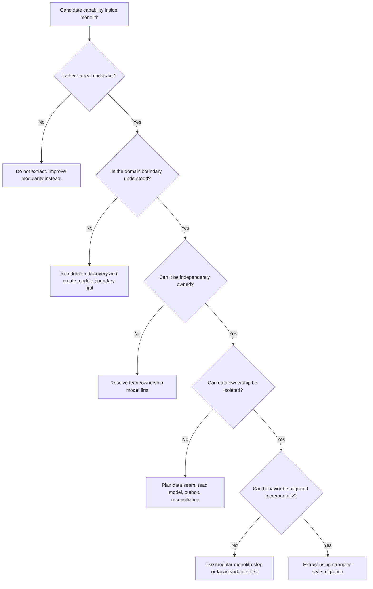
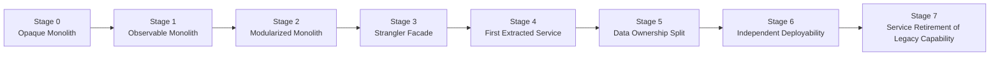
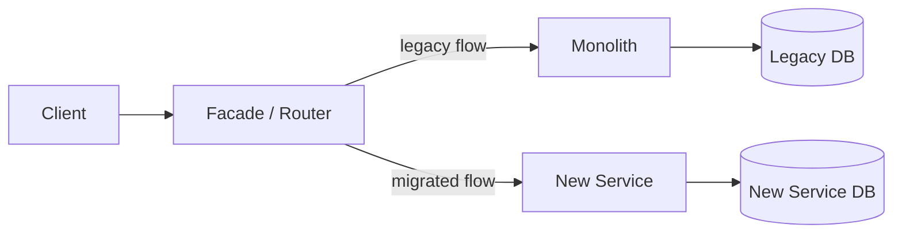
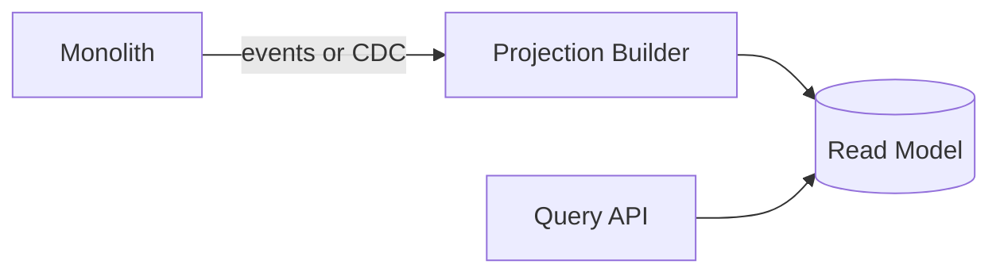
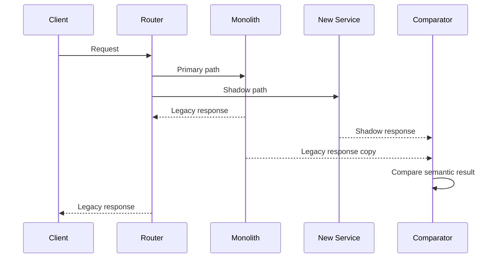
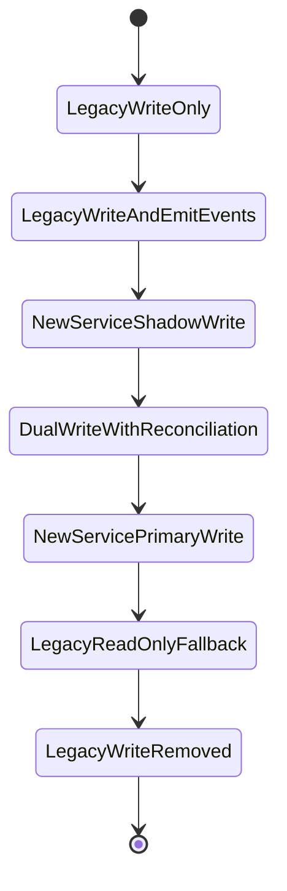
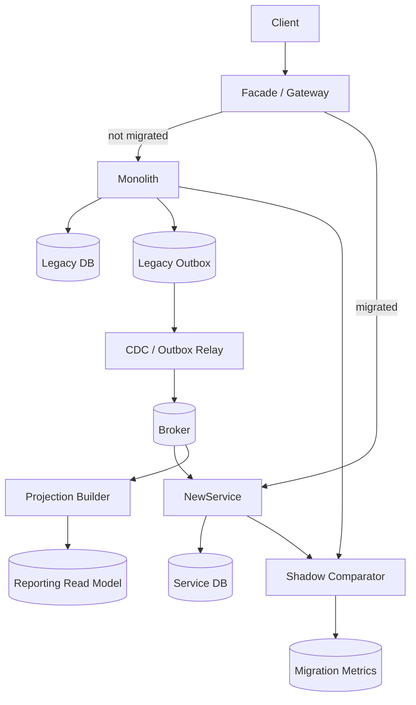
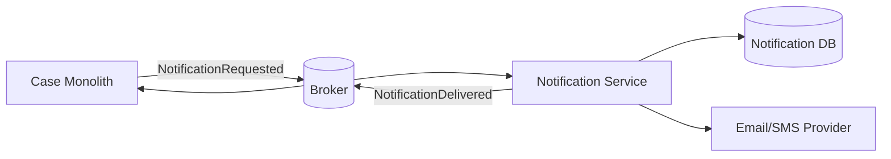

# Part 077 — Monolith to Microservices Decision Framework

## 1. Core Idea

Moving from a monolith to microservices is not a refactoring project.

It is a **business capability migration under production constraints**.

The wrong framing is:

```text
The monolith is old.
Microservices are modern.
Therefore, split the monolith.
```

The stronger framing is:

```text
Which business capabilities need independent change, scale, ownership, reliability, security, or compliance boundaries?
Which parts of the current system prevent that?
What is the lowest-risk migration path that improves those constraints without destroying production stability?
```

Microservices are justified when distribution buys something concrete:

- independent deployability,
- independent team ownership,
- independent scaling,
- fault isolation,
- security isolation,
- regulatory isolation,
- data ownership clarity,
- faster business experimentation,
- different operational profiles,
- different technology/runtime constraints.

If the split does not buy one of those, the migration is probably architecture theater.

A mature engineer does not ask:

```text
How do we break the monolith into services?
```

They ask:

```text
Which change forces are trapped inside the monolith, and what is the safest sequence for releasing them?
```

That is the difference between modernization and self-inflicted distributed complexity.

## 2. The Primary Rule

Do not migrate because the architecture looks old.

Migrate because a measurable constraint is blocking business or engineering outcomes.

Examples:

| Constraint | Symptom | Possible architectural response |
|---|---|---|
| Release coupling | One team cannot ship without coordinating ten teams | Modularization, service extraction, release decoupling |
| Scaling mismatch | One hot capability forces the whole application to scale | Extract high-throughput capability |
| Failure blast radius | One unstable workflow takes down unrelated journeys | Isolate runtime and dependency boundary |
| Ownership conflict | Many teams edit same package/schema/table | Split by business capability or bounded context |
| Compliance isolation | Sensitive evidence/PII mixed with low-risk data | Separate authority, access, audit boundary |
| Technology mismatch | One capability needs streaming/low latency/special runtime | Isolate specialized runtime |
| Data authority confusion | No one knows who owns a record or transition | Establish source-of-truth service boundary |

If you cannot name the constraint, you cannot justify the split.

## 3. Migration Is a Portfolio of Risks

A monolith-to-microservices migration usually creates several risk categories at once:

| Risk | What can go wrong |
|---|---|
| Functional risk | New service behavior differs from legacy behavior |
| Data risk | Data is duplicated, stale, inconsistent, or corrupted |
| Operational risk | More deployables, more dashboards, more failure modes |
| Delivery risk | Teams spend months migrating but ship little business value |
| Security risk | Data flows widen and authorization boundaries become unclear |
| Performance risk | Local calls become network calls and latency increases |
| Reliability risk | New remote dependencies create cascading failure paths |
| Organizational risk | Ownership is unclear after extraction |
| Cost risk | New runtime, observability, and infrastructure costs explode |
| Reversibility risk | The migration cannot be rolled back safely |

A migration plan that only lists target services is incomplete.

A strong migration plan includes:

```text
Target capability
Current constraint
Proposed seam
Data movement strategy
Compatibility strategy
Cutover strategy
Rollback strategy
Observability strategy
Ownership transition
Risk register
Exit criteria
```

## 4. Migration Decision Tree

Use the following mental decision tree before extracting a service.



The decision tree intentionally puts **module boundary before service boundary**.

A poor modular boundary inside a monolith becomes a worse distributed boundary outside it.

## 5. The Hidden Trap: Migration Without Modularization

Many teams try to jump from:

```text
Big ball of mud monolith
```

straight to:

```text
Microservices
```

That jump often fails.

The healthier path is frequently:

```text
Big ball of mud
  -> observable monolith
  -> modular monolith
  -> extracted service
  -> independently owned service ecosystem
```

Why?

Because extracting a service requires knowing:

- what behavior belongs together,
- which data is authoritative,
- which invariants must stay local,
- which callers depend on it,
- which transactions cross it,
- which side effects it emits,
- which team owns it,
- which failure mode is acceptable.

If the monolith cannot answer these questions internally, the new service will not answer them externally.

## 6. Modernization Stages

Think in stages, not in a big-bang rewrite.



### Stage 0 — Opaque Monolith

You do not know enough yet.

Symptoms:

- unclear request flows,
- unknown database coupling,
- no reliable logs/traces,
- unclear module ownership,
- no automated regression suite,
- manual deploys,
- production behavior depends on hidden side effects.

Do not extract yet.

First add observability and characterization tests around high-risk behavior.

### Stage 1 — Observable Monolith

You can answer:

- Which endpoints are used?
- Which tables are touched?
- Which business flows dominate traffic?
- Which jobs mutate data?
- Which integrations are called?
- Which flows fail most often?
- Which flows have the highest business impact?

This stage creates a **migration map**.

### Stage 2 — Modularized Monolith

You create internal boundaries before network boundaries.

Typical moves:

- package-by-capability,
- explicit module APIs,
- dependency rules,
- internal event abstraction,
- anti-corruption layer around legacy subsystems,
- repository ownership per module,
- transaction boundary documentation,
- architectural fitness tests.

The goal is not purity.

The goal is to make extraction mechanically possible.

### Stage 3 — Strangler Facade

You put a routing layer in front of the legacy capability.

The facade may route by:

- endpoint,
- tenant,
- user cohort,
- feature flag,
- region,
- request type,
- read vs write,
- command type,
- workflow state.

Initially most traffic still goes to the monolith.

Gradually, selected flows route to new services.

### Stage 4 — First Extracted Service

Pick a capability that is valuable but not existentially risky.

Bad first extraction candidates:

- central shared transaction engine,
- most complex write path,
- most ambiguous ownership area,
- highest regulatory risk area,
- heavily coupled reporting query,
- everything-at-once user profile service.

Good first extraction candidates:

- clear domain language,
- stable API surface,
- independent data subset,
- low-to-medium write complexity,
- measurable business value,
- good observability,
- strong fallback or rollback path.

### Stage 5 — Data Ownership Split

This is usually harder than moving code.

You need to decide:

- Which service becomes source of truth?
- What remains in the monolith temporarily?
- How is data copied?
- How are writes coordinated?
- Which reads tolerate staleness?
- How are mismatches detected?
- What is the rollback path?

### Stage 6 — Independent Deployability

A service is not fully extracted if it still needs coordinated deployment with the monolith for every change.

Independent deployability requires:

- compatible API evolution,
- compatible event evolution,
- independent pipeline,
- independent runtime config,
- independent database migration discipline,
- clear SLO and alert ownership,
- runbook,
- production support ownership.

### Stage 7 — Legacy Retirement

The migration is not done when the new service works.

It is done when the old path is removed.

Retirement tasks:

- remove routes,
- remove feature flags,
- remove duplicate writes,
- archive old tables,
- remove legacy code,
- update service catalog,
- update data lineage,
- update runbooks,
- delete unused dashboards/alerts,
- close ADR follow-ups.

Unretired migration scaffolding becomes permanent complexity.

## 7. When Not to Split

A mature architect says “no” often.

Do not split when:

- the boundary is not understood,
- the team cannot own the service operationally,
- the data model is highly entangled and no migration seam exists,
- the expected change rate is low,
- the main pain is code organization, not deployability,
- the service would be mostly CRUD over shared database tables,
- the new service would require synchronous calls back to the monolith for every operation,
- the extracted service cannot be tested independently,
- the organization cannot support more deployables,
- the reliability/cost trade-off is negative,
- the migration exists mainly because of technology preference.

A modular monolith is often a better intermediate target.

## 8. Migration Intent Taxonomy

Different migration intents produce different extraction strategies.

### 8.1 Release Decoupling

Goal:

```text
Allow one team to change a capability without blocking others.
```

Best first step:

- module boundary,
- contract tests,
- ownership cleanup,
- CI pipeline ownership,
- eventually service extraction.

Do not begin with infrastructure.

Begin with ownership and boundary clarity.

### 8.2 Scaling Isolation

Goal:

```text
Scale hot capability without scaling the entire monolith.
```

Best first step:

- measure traffic,
- identify bottleneck,
- isolate read path if possible,
- introduce cache/read model,
- extract high-throughput path only when source-of-truth rules are clear.

A scaling extraction is usually justified by capacity data.

### 8.3 Reliability Isolation

Goal:

```text
Prevent one unstable capability from taking down unrelated journeys.
```

Best first step:

- dependency graph,
- failure-mode analysis,
- bulkhead inside monolith if possible,
- isolate runtime/process,
- add circuit breaker/degraded behavior.

Reliability extraction must prove blast radius reduction.

### 8.4 Security or Compliance Isolation

Goal:

```text
Reduce access surface and improve auditability around sensitive behavior/data.
```

Best first step:

- data classification,
- actor/action/resource policy map,
- audit event model,
- access boundary,
- separate source-of-truth if required.

Do not duplicate sensitive data casually.

### 8.5 Domain Evolution

Goal:

```text
Allow a business capability to evolve its model independently.
```

Best first step:

- bounded context mapping,
- language separation,
- anti-corruption layer,
- published language/API,
- data ownership split.

This is the most DDD-aligned extraction.

### 8.6 Technology Isolation

Goal:

```text
Use a different runtime, storage model, protocol, or performance profile for one capability.
```

Best first step:

- define why the current stack fails,
- prove capability boundary,
- create adapter/facade,
- avoid technology-driven service sprawl.

Technology alone is rarely enough.

## 9. Candidate Extraction Scoring Model

Score each candidate from 1 to 5.

| Dimension | 1 | 5 |
|---|---|---|
| Boundary clarity | Ambiguous | Clear bounded context |
| Business value | Low | High |
| Change pressure | Rarely changes | Changes frequently |
| Ownership clarity | Many teams conflict | One accountable team |
| Data separability | Deep shared schema | Isolatable data authority |
| Transaction complexity | Many cross-module ACID assumptions | Localizable transaction boundary |
| Runtime isolation value | Low | High |
| Failure isolation value | Low | High |
| Migration reversibility | Hard rollback | Safe rollback/canary |
| Observability readiness | Opaque | Measured/traced/tested |
| API stability | Unknown | Stable contract candidate |
| Compliance benefit | None | Strong isolation/audit value |

Interpretation:

```text
High value + high clarity + high reversibility = good first candidate.
High value + low clarity = discovery/refactoring first.
Low value + high complexity = do not extract.
```

Example:

| Candidate | Boundary | Value | Data separability | Reversibility | Verdict |
|---|---:|---:|---:|---:|---|
| Notification delivery | 4 | 4 | 4 | 5 | Good first extraction |
| Case decision engine | 3 | 5 | 2 | 2 | Needs discovery and modularization first |
| User preferences read API | 4 | 3 | 4 | 5 | Good read-side extraction |
| Global reporting query | 2 | 3 | 1 | 2 | Build reporting read model, not CRUD service |
| Shared party master data | 3 | 5 | 2 | 2 | Requires data authority strategy first |

## 10. Migration Patterns

### 10.1 Strangler Fig

The strangler pattern gradually replaces legacy behavior by routing selected flows to new implementation.



Useful when:

- behavior can be routed incrementally,
- client contracts can remain stable,
- legacy and new system can coexist,
- rollback path matters,
- traffic can be shifted gradually.

Danger:

- facade becomes god gateway,
- dual writes become permanent,
- data consistency is under-designed,
- old code is never retired.

### 10.2 Branch by Abstraction

Create an internal abstraction around old behavior, then replace implementation behind it.

```text
Caller -> CapabilityPort -> LegacyImplementation
Caller -> CapabilityPort -> NewImplementation
```

Useful when:

- traffic cannot easily be routed externally,
- behavior is internal to monolith,
- you need tests around abstraction,
- you want to reduce invasive changes.

### 10.3 Extract Read Side First

Move query/read behavior before write authority.



Useful when:

- reads are high-volume,
- reporting causes coupling,
- write path is risky,
- staleness is acceptable.

Danger:

- read model accidentally becomes source of truth,
- projection staleness is not communicated,
- authorization is weaker than source system.

### 10.4 Extract Peripheral Capability First

Examples:

- notification,
- document generation,
- file scanning,
- email delivery,
- audit event export,
- search indexing,
- report generation.

Useful because these often have clearer side-effect boundaries.

Danger:

- teams mistake peripheral extraction for core modernization progress.

### 10.5 Modularize Before Extracting

The safest migration step is often inside the monolith.

```text
com.company.caseapp
  caseintake
  caseassessment
  decision
  notification
  reporting
```

Add module boundaries, dependency checks, and explicit APIs.

Extraction becomes an implementation detail later.

### 10.6 Parallel Run and Compare

Run new implementation alongside old behavior and compare outputs.



Useful when:

- behavior is deterministic enough to compare,
- business risk is high,
- you need confidence before cutover.

Danger:

- shadow path performs side effects,
- comparison rules are superficial,
- data freshness differs and creates false mismatch.

## 11. Data Migration Strategies

Code migration is visible.

Data migration is where many modernizations fail.

### 11.1 Data Remains in Monolith Temporarily

New service calls monolith for data.

Useful for early extraction.

Problem:

- service is not autonomous,
- monolith remains source of truth,
- latency/reliability depend on monolith.

Use only as transitional state.

### 11.2 New Service Owns New Data Only

Old records remain in monolith, new records go to new service.

Useful when new business flow can start fresh.

Problem:

- query/reporting complexity,
- user experience across old/new records,
- policy consistency.

### 11.3 Copy Data Through Events or CDC

Monolith publishes change events or CDC stream feeds new service/read model.

Useful for read models and gradual migration.

Problem:

- ordering,
- schema drift,
- replay,
- reconciliation,
- sensitive data leakage.

### 11.4 Dual Write

Both monolith and service write related data.

Avoid if possible.

If unavoidable, treat it as a temporary risk with:

- idempotency,
- outbox,
- reconciliation,
- owner,
- expiry date,
- metrics,
- rollback plan.

### 11.5 Service Becomes Source of Truth

The target end state.

Requires:

- write routing,
- data migration,
- legacy access decommissioning,
- contract ownership,
- audit trail,
- data lineage update.

## 12. Write Path Migration Sequence

For a sensitive write path, use expand-contract thinking.



Each state needs exit criteria.

Example exit criteria:

```text
Shadow mismatch rate < 0.1% for 14 days
No critical reconciliation gap
P95 latency within agreed budget
Rollback route tested
Audit record equivalence verified
Support runbook approved
```

## 13. Monolith Extraction Architecture

A typical extraction architecture has several temporary components.



The important point:

Temporary migration components must have retirement plans.

A strangler facade without retirement becomes a new legacy layer.

## 14. Java-Specific Migration Concerns

### 14.1 Framework Coupling

Legacy Java systems often hide business logic in:

- Spring controllers,
- JSF backing beans,
- Struts actions,
- servlet filters,
- EJB session beans,
- scheduled jobs,
- Hibernate entity listeners,
- database triggers,
- stored procedures,
- XML configuration,
- AOP interceptors.

Do not extract only the visible class.

Extract the actual behavior path.

### 14.2 Transaction Coupling

A `@Transactional` method may imply:

- multiple repository writes,
- lazy-loaded relations,
- entity callbacks,
- audit writes,
- domain events emitted after commit,
- cache invalidation,
- search index update,
- outbound integration.

Before extraction, map the transaction closure.

```text
Command -> Application Service -> Repositories -> Tables -> Side Effects -> Events -> Jobs
```

### 14.3 ORM Coupling

Hibernate/JPA can blur boundaries through:

- lazy loading,
- bidirectional relationships,
- cascade operations,
- shared entity graphs,
- implicit dirty checking,
- global session behavior,
- entity inheritance,
- second-level cache,
- transaction-scoped persistence context.

A class diagram is not enough.

You need runtime access data.

### 14.4 Batch Job Coupling

Legacy batch jobs often mutate data outside request paths.

If you extract a service but forget batch jobs, the monolith still owns the data in practice.

Inventory:

- cron jobs,
- Spring Batch jobs,
- Quartz jobs,
- database scheduled jobs,
- file import jobs,
- reconciliation scripts,
- manual admin scripts.

### 14.5 Hidden Database Logic

The Java code may not be the full system.

Check:

- triggers,
- stored procedures,
- views,
- materialized views,
- constraints,
- scheduled DB jobs,
- replication rules,
- ad-hoc admin updates,
- BI/reporting direct access.

A service extraction that ignores database logic is incomplete.

## 15. Migration Fitness Functions

Add executable checks before and during migration.

Examples:

```text
No new dependency from legacy module to extracted module internals.
No direct SQL access to extracted service-owned tables.
No endpoint route without owner metadata.
No event without schema version and producer owner.
No migration flag without expiry date.
No dual-write path without reconciliation metric.
No new service without SLO, runbook, and on-call owner.
```

Example ArchUnit-style rule:

```java
@AnalyzeClasses(packages = "com.acme.caseapp")
class ModernizationArchitectureTest {

    @ArchTest
    static final ArchRule assessment_must_not_depend_on_decision_internals =
        noClasses()
            .that().resideInAPackage("..caseassessment..")
            .should().dependOnClassesThat()
            .resideInAPackage("..decision.internal..");
}
```

Example migration flag metadata:

```yaml
migrationFlags:
  - name: route-case-assessment-to-new-service
    owner: case-platform-team
    purpose: strangler-routing
    introduced: 2026-07-05
    expiry: 2026-10-05
    rollback: route-100-percent-to-monolith
    metrics:
      - migration.route.new_service.percent
      - migration.shadow.mismatch.rate
      - migration.reconciliation.gap.count
```

## 16. Migration Observability

During migration, normal service metrics are not enough.

Add migration-specific telemetry:

| Metric | Why it matters |
|---|---|
| Route percentage | Confirms actual traffic split |
| Shadow mismatch rate | Detects semantic drift |
| Reconciliation gap count | Detects data divergence |
| Legacy fallback rate | Detects new service instability |
| Dual-write failure count | Detects consistency risk |
| Cutover error rate | Detects user impact |
| Rollback success time | Confirms reversibility |
| Old-path traffic count | Confirms retirement readiness |

Example log event:

```json
{
  "event": "migration.route_decision",
  "capability": "case-assessment",
  "route": "new-service",
  "reason": "tenant-cohort-enabled",
  "tenant_id": "tenant-42",
  "case_id": "CASE-2026-000177",
  "flag": "route-case-assessment-to-new-service",
  "legacy_fallback_enabled": true,
  "trace_id": "4bf92f3577b34da6a3ce929d0e0e4736"
}
```

## 17. Example: Regulatory Case Management Migration

Assume a monolith contains:

- case intake,
- party management,
- allegation assessment,
- evidence indexing,
- enforcement decision,
- notification,
- reporting,
- audit trail,
- workflow escalation.

### 17.1 Poor Extraction Plan

```text
Create CaseService, PartyService, EvidenceService, DecisionService, NotificationService.
Move tables gradually.
```

This plan is weak because it does not answer:

- who owns case lifecycle state,
- whether party data is master data or case-scoped data,
- how evidence access policy is enforced,
- how decision audit is reconstructed,
- how workflow state crosses service boundaries,
- how reports are generated without direct joins,
- how old and new flows coexist.

### 17.2 Better First Candidate: Notification

Why:

- clear side-effect boundary,
- lower domain authority risk,
- can be called async,
- can support idempotency key,
- can maintain delivery status,
- can be retried independently,
- can be observed separately.

Possible design:



Benefits:

- removes external provider coupling,
- improves retry and delivery audit,
- gives team migration practice,
- avoids immediately splitting core case state.

### 17.3 More Complex Candidate: Enforcement Decision

This may be strategically important but riskier.

Questions:

- Is decision state independent from case state?
- Which team owns decision policy?
- Is decision reversible?
- Does decision require evidence snapshot?
- How is audit trail reconstructed?
- What happens if case facts change after decision?
- Is workflow engine involved?
- Does decision need human approval?

This may require:

- domain discovery,
- decision record model,
- evidence snapshot boundary,
- audit event model,
- workflow orchestration,
- read model for case overview,
- compatibility with legacy case screen.

## 18. Migration Decision Record Template

Use an ADR-like document for each extraction.

```md
# ADR: Extract <Capability> from <Monolith>

## Status
Proposed | Accepted | In Progress | Completed | Superseded

## Context
What constraint are we addressing?
What pain is measurable?
Why now?

## Candidate Capability
Business capability:
Current modules/packages:
Current data/tables:
Current callers:
Current jobs:
Current integrations:

## Decision
We will extract <capability> using <migration pattern>.

## Alternatives Considered
1. Keep in monolith and modularize
2. Extract read side only
3. Extract full service
4. Rewrite subsystem

## Boundary
Owned commands:
Owned queries:
Owned data:
Published events:
Consumed events:
Forbidden responsibilities:

## Migration Plan
Stage 1:
Stage 2:
Stage 3:
Cutover:
Retirement:

## Data Strategy
Source of truth:
Copy/sync mechanism:
Reconciliation:
Rollback:

## Compatibility Strategy
API compatibility:
Event compatibility:
Database migration compatibility:
Consumer migration:

## Failure Model
What can fail?
How is fallback handled?
How do we detect divergence?
How do we stop bad rollout?

## Observability
Metrics:
Logs:
Traces:
Dashboards:
Alerts:

## Ownership
Team:
On-call:
Runbook:
Service catalog entry:

## Consequences
Benefits:
Costs:
Risks:
Follow-up cleanup:
```

## 19. Cutover Readiness Checklist

Before shifting production traffic, verify:

- [ ] Capability boundary is documented.
- [ ] Owner team is assigned.
- [ ] Service catalog entry exists.
- [ ] API/event contracts are versioned.
- [ ] Data authority is explicit.
- [ ] Migration flag has owner and expiry.
- [ ] Shadow/parallel comparison has run.
- [ ] Reconciliation process exists.
- [ ] Rollback route is tested.
- [ ] Legacy path can still serve traffic if needed.
- [ ] New service has SLO and alerts.
- [ ] Runbook is approved.
- [ ] On-call team can diagnose common failures.
- [ ] Security review is complete.
- [ ] Audit evidence is equivalent or better.
- [ ] Cost impact is understood.
- [ ] Retirement task list exists.

## 20. Common Anti-Patterns

### 20.1 Entity Extraction

```text
We have a Customer table, therefore create CustomerService.
```

This often creates chatty services and shared data ownership confusion.

Prefer capability extraction.

### 20.2 Big-Bang Rewrite

```text
Build new system for 18 months, then switch over.
```

Risk:

- behavior mismatch,
- scope creep,
- late integration failure,
- no production feedback,
- business changes before completion.

Prefer incremental coexistence.

### 20.3 Permanent Dual Write

Dual write is a temporary migration smell.

If it becomes permanent, ownership is unclear.

### 20.4 Service Without Retirement

If old code remains active forever, migration only increased complexity.

### 20.5 Infrastructure-First Migration

```text
Set up Kubernetes, service mesh, gateway, observability, platform.
Then maybe decide boundaries.
```

Infrastructure does not discover domain boundaries.

### 20.6 API Wrapper Around Monolith

A thin service that only forwards calls to monolith is not an extracted capability.

It may be useful as a transitional facade, but not as an end state.

### 20.7 Migration Without Business Value

If migration consumes engineering capacity but does not improve delivery, reliability, scale, compliance, or cost, it is waste.

## 21. Practical Migration Roadmap

A pragmatic sequence:

```text
1. Instrument monolith.
2. Identify high-change/high-pain capabilities.
3. Build capability map.
4. Score extraction candidates.
5. Modularize inside monolith.
6. Add architecture fitness functions.
7. Introduce strangler facade or branch-by-abstraction.
8. Extract low-risk capability.
9. Add migration observability and reconciliation.
10. Shift traffic gradually.
11. Retire old path.
12. Repeat with harder capability.
```

Do not begin with the hardest core capability unless external pressure forces it.

Build migration muscle first.

## 22. Final Mental Model

A monolith-to-microservices migration is not a journey from bad to good.

It is a journey from one set of trade-offs to another.

The monolith gave you:

- local transactions,
- simple deployment topology,
- easier debugging,
- shared memory/model assumptions,
- fewer runtime dependencies.

Microservices can give you:

- independent deployability,
- independent ownership,
- isolated scaling,
- clearer data authority,
- resilience boundaries,
- domain autonomy.

But only if the migration is designed around real constraints.

The top-level rule:

```text
Do not distribute confusion.
First reveal it.
Then contain it.
Then migrate it.
Then retire the old path.
```

## 23. References

- Martin Fowler — Strangler Fig Application.
- Martin Fowler — How to break a monolith into microservices.
- Microsoft Azure Architecture Center — Strangler Fig pattern.
- AWS Prescriptive Guidance — Strangler fig pattern.
- Martin Fowler — Branch by Abstraction.
- Martin Fowler — MonolithFirst.
- Chris Richardson — Microservice migration and database-per-service patterns.
- Michael Feathers — Working Effectively with Legacy Code.
