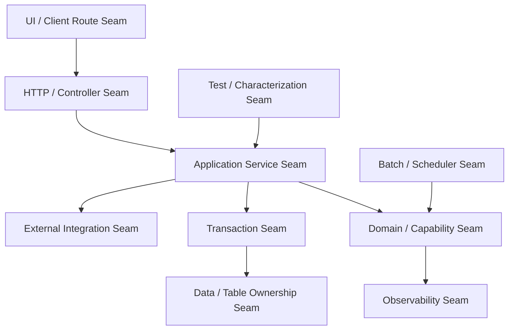
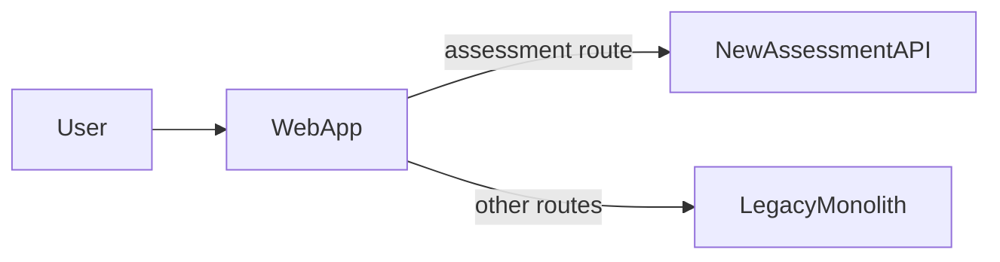
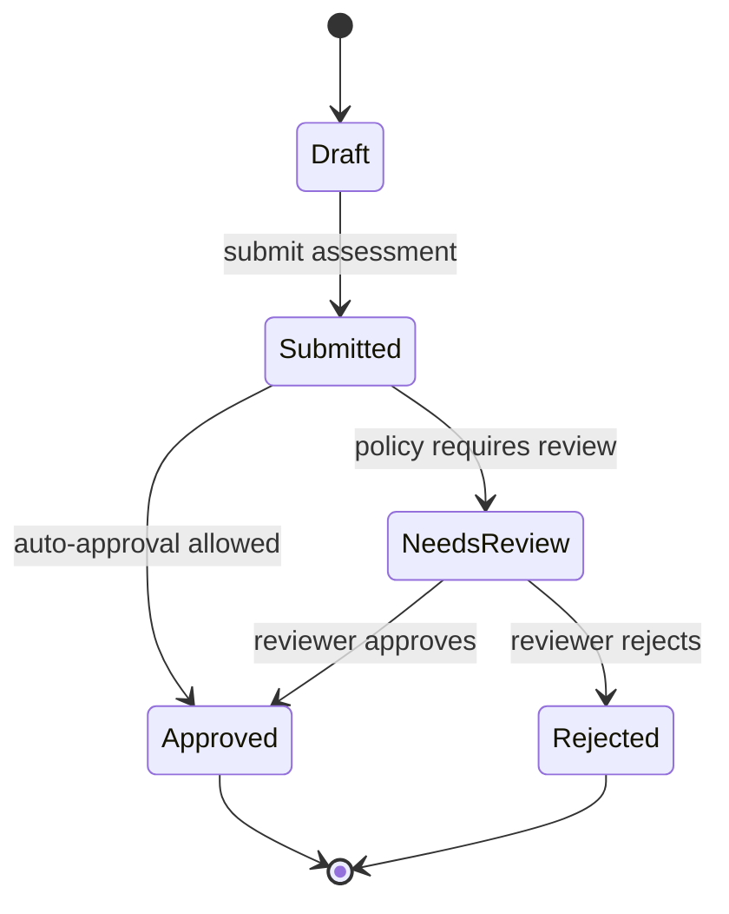
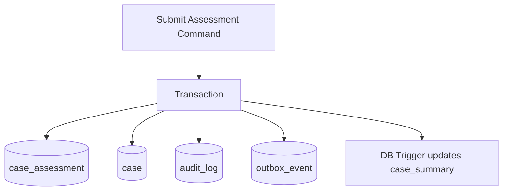
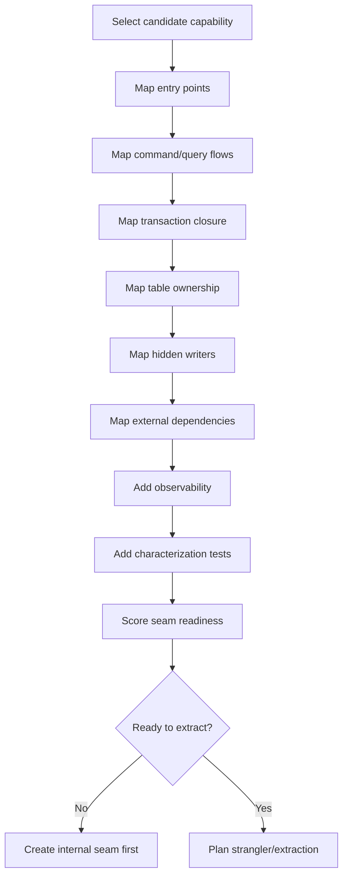

# Part 078 — Identifying Seams in Legacy Java Systems

## 1. Core Idea

A seam is a place where you can change, observe, intercept, replace, or redirect behavior without rewriting the entire system.

In legacy Java modernization, seams are more important than services.

A team that cannot identify seams will usually extract the wrong thing.

The weak approach:

```text
Find classes.
Move classes into new service.
Expose REST API.
```

The strong approach:

```text
Find behavior boundaries.
Find dependency boundaries.
Find transaction boundaries.
Find data authority boundaries.
Find routing boundaries.
Find test boundaries.
Create seams where none exist.
Extract only after the seam is safe.
```

A seam is not always a clean interface.

It can be:

- an HTTP endpoint,
- a controller method,
- a package boundary,
- a database table boundary,
- a transaction boundary,
- a batch job boundary,
- a message topic,
- a feature flag,
- a facade,
- an adapter,
- a stored procedure boundary,
- a UI route,
- a scheduled workflow step,
- a domain event,
- a test harness,
- a proxy route,
- a module API.

The point is not elegance.

The point is controlled change.

## 2. Why Seam Discovery Comes Before Service Extraction

A microservice boundary is expensive.

It adds:

- network calls,
- independent deployment,
- data ownership rules,
- observability requirements,
- failure handling,
- security boundaries,
- versioning,
- operational ownership.

Before paying that cost, prove that the behavior can be separated.

Seam discovery answers:

```text
Can this behavior be observed?
Can this behavior be tested?
Can this behavior be isolated?
Can this behavior be routed?
Can this behavior be replaced?
Can this behavior be rolled back?
Can this behavior own its data?
```

If the answer is no, extraction is premature.

## 3. The Seam Map

A legacy Java application can be mapped through multiple seam layers.



Do not look for only one seam.

A safe extraction often requires several seams aligned.

Example:

```text
A route seam without a data seam creates data coupling.
A data seam without a test seam creates behavior risk.
A transaction seam without observability creates unknown outcome risk.
A module seam without ownership seam creates organizational conflict.
```

## 4. Seam Inventory Template

Use this table for each candidate capability.

| Seam type | Evidence | Risk | Action |
|---|---|---|---|
| API seam | `/cases/{id}/assessment` endpoint | Many callers | Add contract tests |
| Application seam | `AssessmentService` method | Calls decision package directly | Introduce port |
| Transaction seam | One transaction updates case + assessment + audit | Cross-domain write | Split audit via outbox |
| Data seam | `case_assessment` table mostly isolated | FK to `case` | Replace FK with reference ID boundary |
| Batch seam | Nightly reassessment job updates same rows | Hidden writer | Move job behind same port |
| Integration seam | Calls external registry | Timeout risk | Introduce client adapter |
| Observability seam | Logs missing command ID | Debug risk | Add structured log/trace |
| Test seam | No tests around scoring rules | Regression risk | Add characterization tests |

A seam without evidence is just an assumption.

## 5. Source Types for Seam Discovery

Use both static and runtime evidence.

### 5.1 Static Evidence

Collect from:

- package dependencies,
- class dependencies,
- method call graph,
- Maven modules,
- Spring bean graph,
- JPA entity relationships,
- SQL queries,
- repository interfaces,
- database schema,
- stored procedures,
- scheduled job definitions,
- controller routes,
- message listeners,
- configuration files,
- feature flags,
- code ownership files,
- Git commit history.

Static evidence tells you what can happen.

### 5.2 Runtime Evidence

Collect from:

- access logs,
- distributed traces,
- SQL statement logs,
- APM call graphs,
- production traffic profiles,
- message consumption metrics,
- batch job history,
- error logs,
- slow query logs,
- audit logs,
- user journey analytics,
- incident timelines.

Runtime evidence tells you what actually happens.

### 5.3 Human Evidence

Collect from:

- domain experts,
- support teams,
- operations teams,
- compliance teams,
- DBAs,
- product owners,
- long-tenured engineers,
- incident commanders,
- customer support transcripts.

Human evidence tells you why behavior exists.

A top-tier modernization effort combines all three.

## 6. Seam Type 1 — UI Route Seam

A UI route seam exists when a user journey can be routed to different backend behavior.

Example:

```text
/cases/{caseId}/assessment
/cases/{caseId}/evidence
/cases/{caseId}/decision
```

Useful for strangler migration because you can route one page/journey at a time.



Good signs:

- route maps to clear user journey,
- user journey has clear ownership,
- data needed by route can be isolated or composed,
- rollback can route back to legacy.

Bad signs:

- route depends on huge shared session state,
- UI screen mixes unrelated capabilities,
- many hidden AJAX calls hit legacy endpoints,
- server-side rendering and business logic are tangled.

Java legacy examples:

- JSF backing bean with business logic,
- Struts action class with direct DAO calls,
- JSP reading session attributes mutated by services,
- Spring MVC controller returning server-rendered template.

Refactoring move:

```text
Extract view model builder behind a port.
Separate screen composition from business mutation.
Move command behavior behind explicit application service.
```

## 7. Seam Type 2 — HTTP/API Seam

An HTTP/API seam exists when external callers already interact through a stable endpoint.

Example:

```java
@RestController
@RequestMapping("/api/case-assessments")
class CaseAssessmentController {

    private final CaseAssessmentUseCase useCase;

    @PostMapping("/{caseId}/submit")
    ResponseEntity<AssessmentResponse> submit(
            @PathVariable String caseId,
            @RequestBody SubmitAssessmentRequest request) {
        return ResponseEntity.accepted().body(useCase.submit(caseId, request));
    }
}
```

Good API seam:

- endpoint expresses business intent,
- request/response contract is stable,
- caller identity is known,
- validation boundary is clear,
- error semantics are documented,
- idempotency is possible,
- route can be proxied.

Weak API seam:

- endpoint exposes database entity shape,
- caller depends on undocumented fields,
- endpoint returns giant aggregate graph,
- endpoint requires shared session,
- endpoint performs many unrelated side effects,
- no contract tests exist.

Extraction move:

```text
Put a facade/proxy in front of API.
Add contract tests.
Route selected endpoint/cohort to new service.
Keep response semantics compatible during migration.
```

## 8. Seam Type 3 — Application Service Seam

An application service seam exists when a use case is already coordinated from one method/class.

Good example:

```java
public final class SubmitAssessmentHandler {

    private final CaseAssessmentRepository assessments;
    private final CaseRepository cases;
    private final AuditEventPort auditEvents;
    private final Clock clock;

    @Transactional
    public SubmitAssessmentResult handle(SubmitAssessmentCommand command) {
        CaseRecord caseRecord = cases.getForUpdate(command.caseId());
        CaseAssessment assessment = assessments.getForUpdate(command.assessmentId());

        assessment.submit(command.officerId(), clock.instant());

        assessments.save(assessment);
        auditEvents.record(AuditEvent.assessmentSubmitted(command.caseId(), command.officerId()));

        return SubmitAssessmentResult.accepted(assessment.id());
    }
}
```

This is a useful seam because orchestration is explicit.

Bad example:

```java
@PostMapping("/submit")
public String submit(HttpServletRequest request) {
    var conn = dataSource.getConnection();
    // validation, DB writes, external calls, audit, notification, and view rendering here
    return "assessmentSubmitted";
}
```

This has no seam.

Create one by extracting command handling.

### 8.1 Application Seam Refactoring

Step-by-step:

```text
1. Identify one use case.
2. Create command object.
3. Move orchestration into handler/service.
4. Hide external calls behind ports.
5. Hide persistence behind repositories.
6. Add characterization tests.
7. Add structured logging around command lifecycle.
8. Make controller thin.
```

A thin controller is not the goal by itself.

It is a sign that a use-case seam exists.

## 9. Seam Type 4 — Domain Seam

A domain seam exists when a group of behavior protects a coherent set of business invariants.

Example invariant:

```text
An enforcement decision cannot be finalized unless:
- case is in ASSESSMENT_COMPLETED state,
- required evidence snapshot exists,
- officer has decision authority,
- decision reason is recorded,
- audit event is emitted.
```

If these rules live together, you may have a domain seam.

If they are scattered across controllers, SQL triggers, and UI validation, you do not yet have one.

### 9.1 Domain Seam Discovery Questions

Ask:

- Which commands change this domain state?
- Which states exist?
- Which transitions are legal?
- Which invariants must never be violated?
- Which data must be loaded together to check invariants?
- Which language does the domain use?
- Which team/business role owns the rules?
- Which events are produced when state changes?
- Which external systems should not leak into the domain language?

### 9.2 Domain Seam Diagram



A state machine is often a strong seam detector.

If a lifecycle can be named, owned, and guarded, it may be a service candidate.

## 10. Seam Type 5 — Transaction Seam

A transaction seam is where atomicity starts and ends.

In legacy Java, transaction seams are often hidden by:

- `@Transactional` on broad service methods,
- EJB container-managed transactions,
- programmatic transaction templates,
- Open Session in View,
- stored procedure transactions,
- batch chunk transactions,
- database triggers.

### 10.1 Transaction Closure

For each candidate command, map:

```text
Command
  -> tables read
  -> rows locked
  -> tables written
  -> triggers fired
  -> events emitted
  -> cache invalidated
  -> external calls made
  -> audit records written
  -> batch jobs affected
```

Example:



Extraction is risky when one transaction updates multiple future service-owned areas.

### 10.2 Creating a Transaction Seam

Options:

- split command into local transaction + event,
- move audit write to outbox-driven consumer,
- replace cross-table update with projection,
- introduce optimistic locking,
- remove external call from transaction,
- isolate batch update behind same application service,
- create command status table for async flow.

Bad sign:

```text
The new service cannot perform its command without a distributed transaction with the monolith.
```

That means the seam is not ready.

## 11. Seam Type 6 — Data Seam

A data seam exists when data authority can be separated.

Look for:

- tables mostly written by one capability,
- clear lifecycle ownership,
- low FK entanglement,
- few shared writes,
- stable reference IDs,
- clear read-only consumers,
- natural event stream,
- rebuildable read models.

Bad data seam signs:

- table is written by many modules,
- stored procedures mutate it indirectly,
- reporting joins depend on it everywhere,
- no one knows source of truth,
- many nullable columns belong to different business concepts,
- table represents multiple lifecycles.

### 11.1 Table Ownership Map

Create a matrix:

| Table | Writers | Readers | Lifecycle owner | Candidate service | Risk |
|---|---|---|---|---|---|
| `case` | intake, assessment, decision, batch | everyone | unclear | none yet | high |
| `case_assessment` | assessment module | decision, reporting | assessment | assessment-service | medium |
| `notification_log` | notification module | support, reporting | notification | notification-service | low |
| `audit_log` | many modules | compliance | audit platform | audit-service/read model | high |

Data seams often reveal that entity names are misleading.

The `case` table may contain multiple lifecycles, not one clean aggregate.

### 11.2 Foreign Key Entanglement

Foreign keys are not bad inside one boundary.

They become migration constraints across boundaries.

Options:

- keep FK inside same service-owned schema,
- replace cross-boundary FK with reference ID,
- enforce referential validity through command/API checks,
- use snapshot for historical evidence,
- create read model for composition,
- keep monolith-owned table until boundary matures.

## 12. Seam Type 7 — Batch and Scheduler Seam

Legacy batch jobs are common hidden writers.

Examples:

```text
Recalculate case risk score nightly.
Close expired tasks.
Escalate overdue cases.
Sync party data from external registry.
Generate regulatory report.
Archive old evidence.
```

If a batch job writes data for a candidate service, that service does not fully own the data yet.

### 12.1 Batch Seam Discovery

Inventory:

- job name,
- schedule,
- owner,
- input tables/files,
- output tables/files,
- transaction model,
- retry behavior,
- idempotency,
- failure handling,
- downstream impact,
- manual rerun process.

### 12.2 Batch Refactoring Pattern

Before extraction:

```text
Batch Job -> Direct SQL writes
```

After seam creation:

```text
Batch Job -> Application Port -> Domain/Application Service -> Repository
```

Eventually:

```text
Scheduler -> Message/Command -> Extracted Service Worker
```

This prevents direct data mutation outside service authority.

## 13. Seam Type 8 — External Integration Seam

External systems often contaminate domain logic.

Examples:

- identity provider,
- payment provider,
- external registry,
- document storage,
- email/SMS provider,
- government data exchange,
- search engine,
- reporting warehouse.

A clean integration seam hides protocol, vendor vocabulary, timeout behavior, and error mapping.

```java
public interface PartyRegistryPort {
    PartyRegistrySnapshot lookup(PartyRegistryId id);
}

public final class HttpPartyRegistryAdapter implements PartyRegistryPort {
    private final WebClient webClient;

    @Override
    public PartyRegistrySnapshot lookup(PartyRegistryId id) {
        try {
            return webClient.get()
                .uri("/parties/{id}", id.value())
                .retrieve()
                .bodyToMono(ExternalPartyDto.class)
                .timeout(Duration.ofSeconds(2))
                .map(PartyRegistryTranslator::toDomainSnapshot)
                .block();
        } catch (WebClientResponseException.NotFound notFound) {
            throw new PartyNotFoundInRegistry(id);
        } catch (RuntimeException failure) {
            throw new PartyRegistryUnavailable(id, failure);
        }
    }
}
```

This seam lets you:

- test domain without external system,
- change provider,
- add circuit breaker,
- add cache,
- translate error semantics,
- extract service later.

## 14. Seam Type 9 — Event Seam

An event seam exists when behavior can be described as meaningful business facts.

Examples:

```text
CaseSubmitted
AssessmentCompleted
DecisionFinalized
EvidenceAttached
NotificationDeliveryFailed
DeadlineExpired
```

An event seam is useful for:

- decoupling side effects,
- building read models,
- feeding new services,
- auditing lifecycle changes,
- migrating consumers gradually.

Bad event seam signs:

- event names are technical CRUD changes,
- payload exposes internal table schema,
- event producer does not own semantic meaning,
- event has no ID/version/time/source,
- consumers infer business meaning from optional fields,
- no replay or dedupe strategy exists.

### 14.1 Event Extraction Pattern

Step 1: internal domain event.

```java
public record AssessmentCompleted(
    AssessmentId assessmentId,
    CaseId caseId,
    OfficerId completedBy,
    Instant completedAt
) implements DomainEvent {}
```

Step 2: persist via outbox in same transaction.

```java
@Transactional
public void completeAssessment(CompleteAssessmentCommand command) {
    var assessment = assessments.getForUpdate(command.assessmentId());
    assessment.complete(command.officerId(), clock.instant());

    assessments.save(assessment);
    outbox.append(IntegrationEvent.from(assessment.pullDomainEvents()));
}
```

Step 3: publish integration event.

```json
{
  "event_id": "evt-2026-0001",
  "event_type": "case.assessment.completed.v1",
  "occurred_at": "2026-07-05T10:30:00Z",
  "producer": "case-monolith",
  "aggregate_id": "assessment-123",
  "payload": {
    "case_id": "CASE-2026-000177",
    "assessment_id": "ASM-123",
    "completed_by": "officer-42"
  }
}
```

Now new services can consume behavior without direct database access.

## 15. Seam Type 10 — Observability Seam

You cannot safely extract what you cannot observe.

An observability seam lets you see behavior before replacing it.

Add:

- command ID,
- correlation ID,
- trace ID,
- business entity ID,
- lifecycle state,
- dependency timing,
- decision result,
- error category,
- route decision,
- migration cohort.

Example structured log:

```json
{
  "event": "assessment.completed",
  "case_id": "CASE-2026-000177",
  "assessment_id": "ASM-123",
  "actor_id": "officer-42",
  "previous_state": "SUBMITTED",
  "new_state": "COMPLETED",
  "duration_ms": 184,
  "trace_id": "4bf92f3577b34da6a3ce929d0e0e4736"
}
```

If a candidate flow cannot emit stable telemetry, migration risk is high.

## 16. Seam Type 11 — Test Seam

A test seam lets you verify behavior before changing it.

Legacy code often lacks tests.

Do not wait for perfect unit tests.

Start with characterization tests.

A characterization test captures current behavior, including awkward edge cases, so that migration can detect accidental behavior drift.

### 16.1 Characterization Test Strategy

```text
1. Select high-value command/query.
2. Capture input fixtures from production-like examples.
3. Execute legacy path in controlled test environment.
4. Assert observable outputs and side effects.
5. Add edge cases discovered from incidents/support tickets.
6. Use same tests against new implementation.
```

Example:

```java
@Test
void submittingAssessmentCreatesAuditRecordAndTransitionsState() {
    var fixture = CaseAssessmentFixture.submittedAssessment();
    database.insert(fixture);

    legacyAssessmentApi.submit(fixture.caseId(), officer("officer-42"));

    assertThat(database.assessment(fixture.assessmentId()).state())
        .isEqualTo("COMPLETED");

    assertThat(database.auditEventsFor(fixture.caseId()))
        .anyMatch(event -> event.type().equals("ASSESSMENT_COMPLETED"));
}
```

This is not beautiful.

It is useful.

## 17. Seam Type 12 — Ownership Seam

A technical seam without ownership is fragile.

Ask:

- Which team owns the capability?
- Which team handles incidents?
- Which team approves schema changes?
- Which team owns SLOs?
- Which team owns regulatory evidence?
- Which team owns runbook updates?
- Which team deprecates old path?

A service boundary should align with an ownership seam.

If three teams must approve every change, independent deployability is not real.

## 18. Legacy Java Discovery Workflow

Use a repeatable workflow.



## 19. Practical Discovery Commands

These are examples, not universal truth.

### 19.1 Find Spring Controllers

```bash
grep -R "@RestController\|@Controller" src/main/java
```

### 19.2 Find Transaction Boundaries

```bash
grep -R "@Transactional" src/main/java
```

### 19.3 Find Scheduled Jobs

```bash
grep -R "@Scheduled\|Quartz\|JobLauncher\|SpringBatch" src/main/java src/main/resources
```

### 19.4 Find Direct SQL

```bash
grep -R "createNativeQuery\|JdbcTemplate\|prepareStatement\|SELECT \|UPDATE \|DELETE " src/main/java
```

### 19.5 Find Cross-Package Coupling

Use tools such as `jdeps`, ArchUnit, or build scans.

Example:

```bash
jdeps --recursive --multi-release 21 target/case-monolith.jar
```

### 19.6 Find Database Writers

SQL examples:

```sql
select
    table_name,
    trigger_name
from information_schema.triggers
where trigger_schema = 'public';
```

```sql
select
    routine_name,
    routine_type
from information_schema.routines
where routine_schema = 'public';
```

These commands do not replace thinking.

They reveal where to inspect.

## 20. Seam Readiness Scorecard

Score from 1 to 5.

| Dimension | Question |
|---|---|
| Entry point clarity | Do we know how behavior starts? |
| Domain clarity | Do we know the business capability/invariants? |
| Transaction clarity | Do we know atomic write boundary? |
| Data ownership clarity | Do we know source of truth? |
| Hidden writer inventory | Do we know jobs/triggers/scripts that mutate data? |
| Dependency isolation | Are external systems behind ports/adapters? |
| Testability | Can behavior be verified before/after migration? |
| Observability | Can we compare legacy and new behavior? |
| Routing ability | Can traffic be shifted gradually? |
| Rollback ability | Can we route back safely? |
| Ownership clarity | Does one team own the extracted capability? |
| Retirement path | Do we know how to remove old behavior? |

Interpretation:

```text
Average < 3: do not extract; create seams first.
Average 3-4: extract only low-risk/read-side/peripheral flows.
Average > 4: candidate is ready for controlled extraction.
```

## 21. Example: Assessment Capability Seam Discovery

Candidate:

```text
Case Assessment
```

### 21.1 Entry Points

- `/cases/{id}/assessment` UI page,
- `/api/cases/{id}/assessment/submit` endpoint,
- nightly reassessment job,
- admin correction screen,
- CSV import process.

### 21.2 Data

- `case_assessment`,
- `case_assessment_answer`,
- `case_risk_score`,
- `case_summary`,
- `audit_log`,
- `workflow_task`.

### 21.3 Hidden Writers

- nightly risk recalculation,
- DB trigger updates `case_summary`,
- support script updates `case_assessment.status`,
- workflow engine changes task state after assessment submission.

### 21.4 External Dependencies

- party registry lookup,
- evidence metadata service,
- notification provider,
- identity/role service.

### 21.5 Seam Risk

| Seam | Status | Risk |
|---|---|---|
| API | Clear submit endpoint | medium |
| Domain | Assessment state machine exists informally | medium |
| Transaction | Updates assessment + case summary + audit + workflow | high |
| Data | Assessment tables separable; summary/audit shared | medium/high |
| Batch | Nightly job writes assessment score | high |
| Observability | Logs weak; no command ID | high |
| Test | Few tests | high |
| Ownership | Assessment team exists | low |

Verdict:

```text
Do not extract immediately.
First create application service seam, move batch behind same port, add outbox for audit/workflow side effects, add characterization tests, and add structured observability.
```

## 22. Refactoring Toward a Seam

Before:

```java
@Service
public class CaseService {

    @Transactional
    public void submitAssessment(String caseId, Map<String, Object> answers) {
        CaseEntity caseEntity = caseRepository.findById(caseId).orElseThrow();
        AssessmentEntity assessment = caseEntity.getAssessment();

        assessment.setAnswers(answers);
        assessment.setStatus("COMPLETED");
        caseEntity.setStatus("ASSESSMENT_COMPLETED");

        auditRepository.save(new AuditEntity(caseId, "ASSESSMENT_COMPLETED"));
        notificationClient.send(caseEntity.getOwnerEmail(), "Assessment completed");
    }
}
```

Problems:

- case and assessment lifecycle mixed,
- external notification inside transaction,
- audit storage coupled,
- raw answer map leaks representation,
- no domain state transition,
- no idempotency,
- no event seam.

After seam creation:

```java
public record SubmitAssessmentCommand(
    CaseId caseId,
    AssessmentId assessmentId,
    OfficerId officerId,
    AssessmentAnswers answers,
    IdempotencyKey idempotencyKey
) {}

public final class SubmitAssessmentHandler {

    private final AssessmentRepository assessments;
    private final CaseStatusPort caseStatus;
    private final OutboxPort outbox;
    private final IdempotencyPort idempotency;
    private final Clock clock;

    @Transactional
    public SubmitAssessmentResult handle(SubmitAssessmentCommand command) {
        return idempotency.execute(command.idempotencyKey(), () -> {
            var assessment = assessments.getForUpdate(command.assessmentId());

            assessment.submit(command.officerId(), command.answers(), clock.instant());

            assessments.save(assessment);
            outbox.append(AssessmentCompletedEvent.from(assessment));

            return SubmitAssessmentResult.completed(assessment.id());
        });
    }
}
```

Now extraction is easier because:

- command boundary is explicit,
- domain transition is local,
- side effects are event-driven,
- idempotency is explicit,
- external effects are not inside DB transaction,
- tests can target handler/domain behavior.

## 23. Seams and Anti-Corruption Layers

Sometimes the seam should not expose legacy model directly.

Use an anti-corruption layer when:

- legacy names differ from domain language,
- legacy enum values are misleading,
- legacy data shape is overloaded,
- external system exposes vendor-specific meaning,
- new service must not inherit old schema assumptions.

Example:

```java
final class LegacyAssessmentTranslator {

    AssessmentSnapshot toSnapshot(LegacyAssessmentRow row) {
        return new AssessmentSnapshot(
            new AssessmentId(row.assessmentUuid()),
            new CaseId(row.caseReference()),
            translateStatus(row.statusCode()),
            translateRisk(row.riskBucket()),
            row.lastUpdatedAt()
        );
    }

    private AssessmentStatus translateStatus(String statusCode) {
        return switch (statusCode) {
            case "N" -> AssessmentStatus.DRAFT;
            case "S" -> AssessmentStatus.SUBMITTED;
            case "C" -> AssessmentStatus.COMPLETED;
            case "X" -> AssessmentStatus.CANCELLED;
            default -> throw new UnknownLegacyAssessmentStatus(statusCode);
        };
    }
}
```

A translator is not boilerplate.

It is a semantic firewall.

## 24. Seams and Feature Flags

A routing seam can be controlled by feature flags.

Example:

```java
public AssessmentResponse submit(SubmitAssessmentRequest request) {
    if (migrationFlags.isEnabled("assessment-service-write", request.tenantId())) {
        return newAssessmentClient.submit(request);
    }

    return legacyAssessmentHandler.submit(request);
}
```

Use flags for:

- tenant-based rollout,
- user cohort rollout,
- read vs write split,
- fallback route,
- shadow execution,
- emergency disable.

Flag requirements:

- owner,
- purpose,
- expiry,
- metrics,
- rollback behavior,
- audit log for changes.

A migration flag without expiry becomes legacy configuration.

## 25. Seams and Rollback

A seam is not production-ready unless it supports rollback.

Rollback questions:

- Can traffic be routed back?
- Is data still compatible with old path?
- Have new writes changed state old code cannot understand?
- Are events duplicated if rollback occurs?
- Can idempotency prevent duplicate side effects?
- Can support team identify which path handled a request?

If rollback is impossible, you need stronger pre-cutover validation.

## 26. Common Seam Discovery Mistakes

### 26.1 Confusing Class Boundary with Business Boundary

A package named `case` does not mean it is a bounded context.

Check behavior, data, state, ownership.

### 26.2 Ignoring Batch Jobs

Request paths are not the whole system.

Batch jobs may be the real owner of important data transitions.

### 26.3 Trusting Database Schema Names

A table named `customer` may contain:

- applicant,
- suspect,
- representative,
- reporting party,
- organization,
- contact person.

Names drift.

Behavior reveals meaning.

### 26.4 Extracting Read Model as Source of Truth

A projection is not authority unless explicitly designed as authority.

### 26.5 Creating Interfaces Everywhere

Interfaces do not automatically create seams.

A useful seam changes the cost/risk of future change.

### 26.6 Forgetting Manual Operations

Support scripts, admin screens, and manual DB updates are part of the system.

If they mutate extracted data, they must be migrated or blocked.

## 27. Seam Creation Roadmap

A practical order:

```text
1. Pick one business capability.
2. Map all entry points.
3. Add command/query naming.
4. Move orchestration into application service.
5. Put external dependencies behind ports.
6. Identify transaction closure.
7. Introduce outbox for side effects.
8. Inventory database writers.
9. Add characterization tests.
10. Add structured observability.
11. Add routing seam or branch-by-abstraction.
12. Run shadow/parallel comparison.
13. Extract only when rollback path is credible.
```

This roadmap may feel slower than moving code.

It is faster than recovering from a broken extraction.

## 28. Final Mental Model

Legacy modernization is not primarily about old code.

It is about hidden coupling.

Seams reveal coupling.

Good seams let you:

- see behavior,
- test behavior,
- isolate behavior,
- route behavior,
- replace behavior,
- rollback behavior,
- eventually retire behavior.

The strongest modernization principle:

```text
Never extract what you cannot first observe, test, and route.
```

A microservice extracted without seams is just legacy code with network latency.

## 29. References

- Martin Fowler — Legacy Seam.
- Michael Feathers — Working Effectively with Legacy Code.
- Martin Fowler — Strangler Fig Application.
- Microsoft Azure Architecture Center — Strangler Fig pattern.
- AWS Prescriptive Guidance — Strangler fig pattern.
- Martin Fowler — Branch by Abstraction.
- Spring Framework documentation — transaction management and web controllers.
- Kubernetes documentation — service routing and workload operations.
