# Part 079 — Strangler Fig Implementation in Java

## 1. Core Idea

The Strangler Fig pattern is not a rewrite pattern.

It is a **traffic, capability, and ownership migration pattern**.

The weak version says:

```text
Build new service.
Switch users to new service.
Delete old code.
```

The production version says:

```text
Wrap the legacy system.
Intercept a narrow capability.
Route selected traffic to the new implementation.
Compare old and new behavior.
Move reads first when possible.
Move writes only after authority is clear.
Cut over gradually.
Keep rollback cheap.
Decommission only after evidence says it is safe.
```

A strangler migration is successful when the old system becomes smaller **without the business noticing instability**.

It is not successful merely because a new microservice exists.

## 2. Mental Model

Think of the legacy system as a large tree trunk.

You do not cut it with one swing.

You grow a new system around it and redirect living behavior piece by piece.

In software terms:

- the legacy system continues to serve existing behavior,
- a routing layer decides whether old or new handles a request,
- a new service owns one capability at a time,
- migration progress is measured by removed responsibility, not created repositories,
- the final state is decommissioned legacy functionality, not permanent duplication.

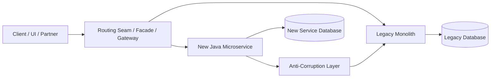

The router is the strangler vine.

The new service is not allowed to become a thin remote wrapper around the monolith forever.

## 3. What Strangler Fig Is Good For

Use it when:

- the legacy system is too large to rewrite safely,
- business cannot tolerate a long freeze,
- there are identifiable seams,
- new and old behavior can coexist for a while,
- traffic can be routed by capability, user group, tenant, region, feature flag, or endpoint,
- rollback must be possible,
- extraction can be validated with real traffic.

Avoid it when:

- there is no stable routing seam,
- the legacy system cannot coexist with a replacement,
- data ownership cannot be separated even conceptually,
- business demands behavior changes and migration at the same time,
- the team cannot invest in observability and reconciliation,
- the new service only forwards every call back to the monolith.

The dangerous assumption is this:

```text
Incremental migration is automatically safe.
```

It is not.

Incremental migration is safe only when each increment has:

- a narrow scope,
- clear authority,
- explicit rollback,
- measurable correctness,
- operational visibility,
- clean ownership transfer.

## 4. The Four Implementation Layers

A real strangler implementation usually has four layers.

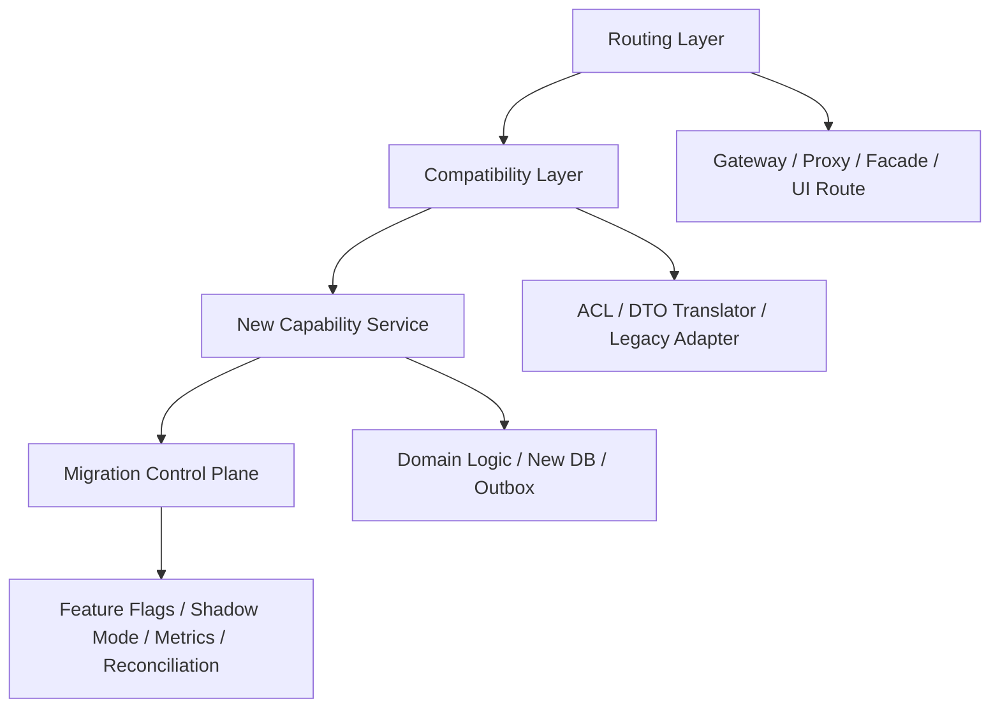

### 4.1 Routing Layer

Decides old vs new.

Can exist at:

- API gateway,
- reverse proxy,
- BFF,
- application facade,
- controller endpoint,
- UI route,
- batch scheduler,
- message consumer,
- database wrapper service.

### 4.2 Compatibility Layer

Hides semantic mismatch.

It translates:

- legacy status codes,
- legacy IDs,
- legacy enum values,
- legacy date/time assumptions,
- legacy error model,
- legacy validation rules,
- legacy null semantics,
- legacy permission model,
- legacy workflow states.

This is where the Anti-Corruption Layer from Part 013 becomes practical.

### 4.3 New Capability Service

Owns the extracted behavior.

It should eventually own:

- command handling,
- business rules,
- local data,
- events,
- observability,
- runbook,
- SLO,
- lifecycle ownership.

### 4.4 Migration Control Plane

Controls rollout.

It includes:

- feature flags,
- routing rules,
- kill switch,
- shadow traffic percentage,
- tenant allowlist,
- reconciliation dashboard,
- rollout metrics,
- rollback procedure,
- migration state record.

Do not hide migration control in scattered `if` statements.

Treat it as a temporary but explicit subsystem.

## 5. The Strangler Loop

The migration loop is repeatable.

```text
1. Select one capability.
2. Define routing seam.
3. Define compatibility contract.
4. Build new implementation behind seam.
5. Run shadow or read-only comparison.
6. Enable for internal users.
7. Enable for low-risk cohort.
8. Expand traffic.
9. Freeze legacy behavior for that capability.
10. Remove old code path.
11. Update service catalog and ownership records.
```

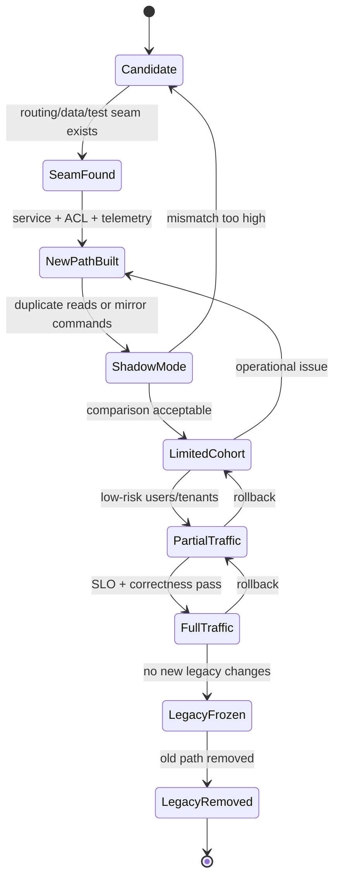

The most important state is not `FullTraffic`.

The most important state is `LegacyRemoved`.

Many organizations create new services but never remove the old responsibility.

That is not modernization.

That is duplication.

## 6. Selecting the First Capability

The first extracted capability should not be the hardest one.

It should be small enough to finish and important enough to teach the organization how migration works.

Good first candidates:

- read-heavy capability with clear API seam,
- narrow admin workflow,
- reporting/query capability,
- notification capability,
- file metadata capability,
- reference data capability,
- a bounded business action with low write complexity.

Bad first candidates:

- central transaction coordinator,
- high-volume write path with unclear ownership,
- process with many hidden side effects,
- feature with unstable business rule,
- capability whose correctness cannot be measured,
- code path that touches every core table.

Use this scoring model:

| Dimension | Good Candidate | Bad Candidate |
|---|---|---|
| Boundary clarity | Business capability is named clearly | Capability is a vague technical layer |
| Routing seam | Endpoint/route/job/topic can be isolated | Traffic cannot be separated |
| Data authority | Owner table/entity is identifiable | Data is written by many flows |
| Side effects | Known and enumerable | Hidden triggers, jobs, integrations |
| Correctness oracle | Old/new can be compared | No reliable comparison possible |
| Rollback | Old path can resume | Migration causes irreversible change |
| Business risk | Low to moderate | Core money/legal/safety path |
| Team ownership | One team can own it | Many teams must coordinate constantly |

A good strangler candidate has a clear **exit condition**.

Example:

```text
The Case Search capability is migrated when:
- all query traffic is served by case-query-service,
- projection lag stays below 30 seconds at p95,
- search result mismatch is below approved threshold,
- the monolith endpoint is blocked from external clients,
- legacy search SQL is deleted,
- service catalog owner is updated.
```

## 7. Routing Split Options

### 7.1 Edge Gateway Routing

Best when external endpoints map cleanly to capabilities.

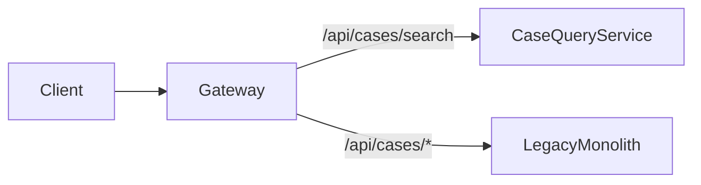

Example Spring Cloud Gateway style route:

```yaml
spring:
  cloud:
    gateway:
      routes:
        - id: case-search-new
          uri: http://case-query-service:8080
          predicates:
            - Path=/api/cases/search
          filters:
            - AddRequestHeader=X-Migration-Route,case-search-new

        - id: legacy-cases
          uri: http://legacy-monolith:8080
          predicates:
            - Path=/api/cases/**
          filters:
            - AddRequestHeader=X-Migration-Route,legacy-cases
```

The rule is simple:

```text
Gateway routing can split traffic.
It must not become the business logic owner.
```

### 7.2 Cohort-Based Routing

Useful when behavior must be enabled gradually.

Cohorts can be:

- internal users,
- specific tenants,
- region,
- partner,
- user percentage,
- account type,
- feature flag allowlist,
- low-risk case category.

Example routing decision:

```java
public final class MigrationRouteDecider {
    private final MigrationFlagClient flags;

    public Route decide(RequestContext ctx, Capability capability) {
        if (flags.isKillSwitchEnabled(capability)) {
            return Route.LEGACY;
        }

        if (flags.isTenantEnabled(capability, ctx.tenantId())) {
            return Route.NEW_SERVICE;
        }

        if (flags.isInternalUser(ctx.userId())) {
            return Route.NEW_SERVICE;
        }

        return Route.LEGACY;
    }
}
```

Keep route decisions observable.

Every migrated request should emit:

```json
{
  "event": "migration.route_decision",
  "capability": "case-search",
  "route": "NEW_SERVICE",
  "tenant_id": "tenant-17",
  "request_id": "req-123",
  "reason": "tenant_allowlist"
}
```

### 7.3 Application Facade Routing

Best when external API cannot change yet.

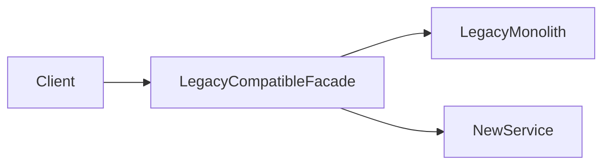

The facade keeps the old contract stable but redirects implementation.

Example:

```java
@RestController
@RequestMapping("/legacy/api/cases")
public class LegacyCompatibleCaseController {
    private final MigrationRouteDecider routeDecider;
    private final LegacyCaseClient legacy;
    private final NewCaseCommandClient modern;
    private final LegacyCaseResponseMapper responseMapper;

    @PostMapping("/{caseId}/assign")
    ResponseEntity<LegacyAssignResponse> assign(
            @PathVariable String caseId,
            @RequestBody LegacyAssignRequest request,
            RequestContext ctx
    ) {
        Route route = routeDecider.decide(ctx, Capability.CASE_ASSIGNMENT);

        if (route == Route.NEW_SERVICE) {
            AssignCaseResult result = modern.assign(new AssignCaseCommand(
                    CaseId.fromLegacy(caseId),
                    OfficerId.fromLegacy(request.officerCode()),
                    ctx.actor()
            ));

            return ResponseEntity.ok(responseMapper.toLegacy(result));
        }

        return ResponseEntity.ok(legacy.assign(caseId, request));
    }
}
```

The facade can be temporary.

But temporary code often lives longer than expected.

So it still needs:

- owner,
- tests,
- telemetry,
- deletion ticket,
- expiry date,
- production runbook.

### 7.4 UI Routing

Best when a user journey can be moved page by page.

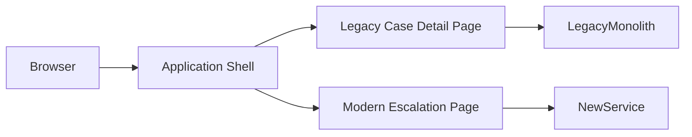

UI route split is useful when backend seams are poor.

But be careful:

- users may cross from modern to legacy flow,
- session and identity must be consistent,
- navigation must not leak inconsistent state,
- authorization must be enforced server-side,
- telemetry must preserve journey context.

### 7.5 Message Consumer Routing

Best for async workloads.

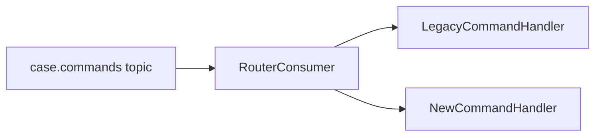

The router must preserve idempotency and ordering rules.

Example:

```java
public final class MigratingCommandConsumer {
    private final RouteDecider decider;
    private final LegacyCommandAdapter legacy;
    private final ModernCommandHandler modern;
    private final Inbox inbox;

    public void onMessage(CommandEnvelope envelope) {
        if (!inbox.tryStart(envelope.messageId())) {
            return;
        }

        try {
            Route route = decider.decide(envelope.context(), envelope.capability());
            if (route == Route.NEW_SERVICE) {
                modern.handle(envelope.toDomainCommand());
            } else {
                legacy.forward(envelope);
            }
            inbox.markCompleted(envelope.messageId());
        } catch (Exception ex) {
            inbox.markFailed(envelope.messageId(), ex);
            throw ex;
        }
    }
}
```

Do not route duplicate messages inconsistently.

The same command identity must resolve to the same target during the retry window.

## 8. Proxy Layer Design

A strangler proxy is not just a network proxy.

It is a **migration policy enforcement point**.

Responsibilities:

- route by capability,
- preserve contract compatibility,
- attach migration metadata,
- enforce timeout and retry policy,
- log route decisions,
- support kill switch,
- support shadow comparison,
- prevent accidental fallback on unsafe writes,
- expose migration metrics.

Non-responsibilities:

- business rule ownership,
- domain state mutation,
- long-running workflow coordination,
- permanent data transformation layer,
- authorization rule duplication unless explicitly designed.

A proxy can safely route reads before writes.

Writes require deeper controls.

## 9. Shadow Traffic and Parallel Run

Shadow traffic means sending a copy of production traffic to the new path without allowing the new path to affect user-visible state.

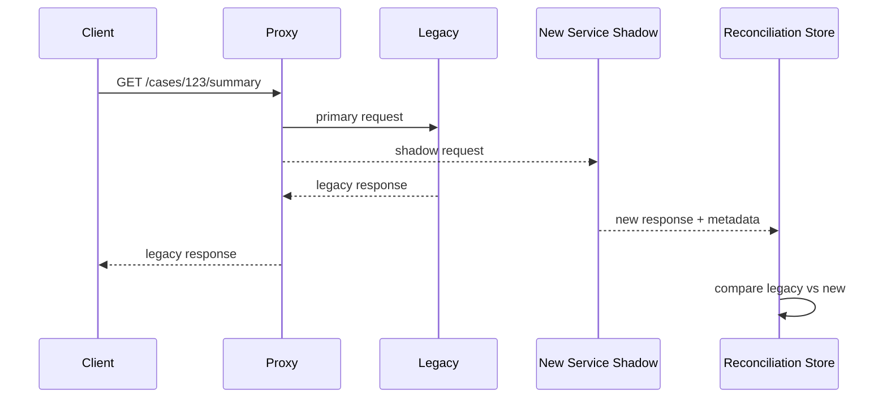

Shadow mode is useful for:

- query migration,
- calculation migration,
- validation rule migration,
- read model migration,
- scoring engine migration,
- eligibility checks.

Shadow mode is dangerous for:

- commands with side effects,
- payment/external notification,
- irreversible state changes,
- audit event creation,
- rate-limited external APIs,
- systems where duplicate calls change state.

For writes, use one of these:

| Technique | Meaning | Risk |
|---|---|---|
| Dry-run command | New service validates and simulates result | Might miss persistence issues |
| Side-effect disabled mode | New path executes without external effect | Requires careful isolation |
| Intent comparison | Compare intended state transition, not actual write | Needs domain-level comparator |
| Replay from audit log | Feed historical commands into new service | Historical data may be incomplete |
| Limited cohort | New path becomes primary for small group | User-visible risk exists |

## 10. Comparison Strategy

Old and new systems rarely return byte-identical output.

You need a semantic comparator.

Example:

```java
public final class CaseSummaryComparator {
    public ComparisonResult compare(LegacyCaseSummary legacy, ModernCaseSummary modern) {
        ComparisonResult result = new ComparisonResult();

        result.expectEqual("caseId", legacy.caseNumber(), modern.caseId().value());
        result.expectEquivalent("status", normalizeStatus(legacy.status()), modern.status());
        result.expectDateEqual("openedDate", legacy.openedDate(), modern.openedAt().toLocalDate());
        result.expectApproximatelyEqual("riskScore", legacy.riskScore(), modern.riskScore(), 0.01);

        result.ignore("legacyFormattedAddress");
        result.ignoreIfMissing("newDerivedPriorityReason");

        return result;
    }
}
```

Comparison should classify mismatch severity.

| Severity | Meaning | Action |
|---|---|---|
| Cosmetic | Formatting/order/field casing | Do not block migration |
| Expected divergence | New model intentionally differs | Document mapping rule |
| Data freshness | Projection lag or timing issue | Check staleness budget |
| Business mismatch | Different decision/result | Block rollout |
| Security mismatch | New path exposes too much/too little | Block rollout immediately |
| Audit mismatch | Evidence chain differs | Block regulated flows |

Do not allow a high mismatch volume to be normalized as “legacy is messy”.

Some legacy mess is still business truth.

## 11. Controlled Extraction: One Capability Example

Assume a legacy enforcement case system has a `Case Assignment` capability.

Legacy behavior:

```text
POST /legacy/cases/{caseNo}/assign
- validates case status
- validates officer active
- updates CASE_TABLE.ASSIGNED_OFFICER
- inserts ACTIVITY_LOG row
- sends internal notification
- triggers nightly SLA job through shared table flag
```

A naive extraction creates `case-assignment-service` and calls legacy SQL.

That is not extraction.

A controlled extraction finds responsibilities:

| Responsibility | Future Owner |
|---|---|
| Assignment command validation | Case Assignment Service |
| Officer status | Officer Directory Service or ACL |
| Case status authority | Case Service or legacy adapter during migration |
| Assignment state | Case Assignment Service DB after cutover |
| Activity log | Audit/Event pipeline |
| Notification | Notification Service |
| SLA trigger | Workflow/SLA Service |

Now define migration stages.

### Stage 1 — Wrap Legacy

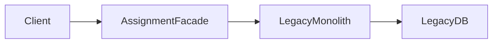

The facade adds observability and stable API without changing behavior.

### Stage 2 — Build Modern Dry-Run

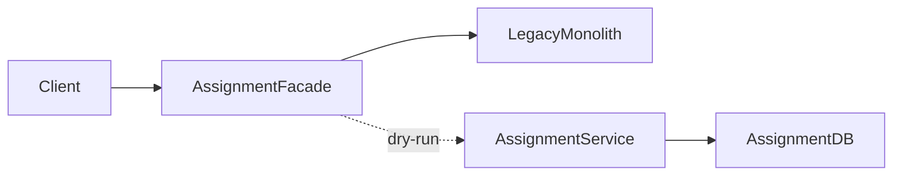

New service evaluates command but does not own outcome.

### Stage 3 — Limited Primary Writes

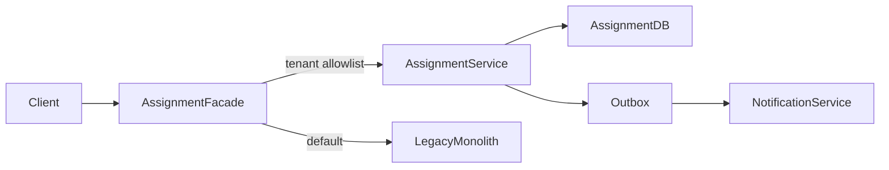

### Stage 4 — Full Cutover

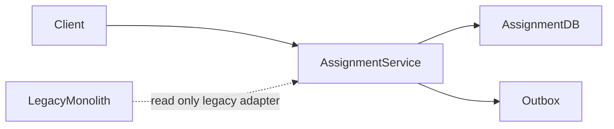

### Stage 5 — Remove Legacy Write Path

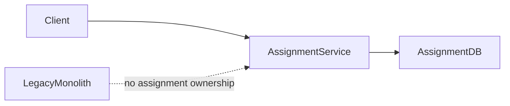

The service is extracted only when old write authority is removed.

## 12. The Migration Facade Pattern

The facade is often the best first seam.

```java
public interface CaseAssignmentPort {
    AssignmentResult assign(AssignCaseCommand command);
}
```

Legacy adapter:

```java
@Component
final class LegacyCaseAssignmentAdapter implements CaseAssignmentPort {
    private final LegacyCaseHttpClient client;
    private final LegacyAssignmentMapper mapper;

    @Override
    public AssignmentResult assign(AssignCaseCommand command) {
        LegacyAssignRequest request = mapper.toLegacy(command);
        LegacyAssignResponse response = client.assign(command.caseId().legacyValue(), request);
        return mapper.toDomain(response);
    }
}
```

Modern adapter:

```java
@Component
final class ModernCaseAssignmentAdapter implements CaseAssignmentPort {
    private final CaseAssignmentApplicationService service;

    @Override
    public AssignmentResult assign(AssignCaseCommand command) {
        return service.assign(command);
    }
}
```

Router:

```java
@Component
final class MigratingCaseAssignmentPort implements CaseAssignmentPort {
    private final MigrationRouteDecider routeDecider;
    private final LegacyCaseAssignmentAdapter legacy;
    private final ModernCaseAssignmentAdapter modern;
    private final MigrationTelemetry telemetry;

    @Override
    public AssignmentResult assign(AssignCaseCommand command) {
        Route route = routeDecider.decide(command.context(), Capability.CASE_ASSIGNMENT);
        telemetry.routeDecision(command.commandId(), route, Capability.CASE_ASSIGNMENT);

        return switch (route) {
            case LEGACY -> legacy.assign(command);
            case NEW_SERVICE -> modern.assign(command);
        };
    }
}
```

The rest of the application depends on `CaseAssignmentPort`, not on legacy details.

## 13. Feature Flags Are Migration Controls, Not Random If Statements

A migration flag must have metadata.

```yaml
migrationFlags:
  case-assignment-v2:
    owner: case-platform-team
    capability: case-assignment
    status: cohort-rollout
    createdAt: 2026-07-05
    expiresAt: 2026-09-30
    killSwitch: false
    cohorts:
      tenants:
        - regulator-alpha
        - internal-demo
      regions:
        - jakarta
    rollbackTarget: legacy
    correctnessDashboard: /dashboards/case-assignment-migration
```

Every flag needs:

- owner,
- expiry date,
- target removal date,
- rollback semantics,
- dashboard,
- documentation,
- test coverage,
- cleanup ticket.

A flag without cleanup becomes permanent complexity.

## 14. Handling Writes Safely

Writes are harder because they create authority.

Before moving a write, answer:

```text
Who owns the state after the write?
Can the old system still write the same state?
How are duplicates handled?
Can the command be retried safely?
What happens if new service succeeds but legacy observer fails?
What happens if legacy succeeds but new observer fails?
What is the audit truth?
How do we reconcile old and new state?
How do we rollback user-visible behavior?
```

A common mistake is dual-write without ownership.

```java
// Dangerous: two authorities, unclear rollback, partial failure risk.
legacy.assign(command);
modern.assign(command);
```

If you must run two paths, choose one primary authority.

```java
AssignmentResult result = modern.assign(command);   // primary authority
legacyProjectionUpdater.updateBestEffort(result);   // compatibility projection, not authority
```

Or:

```java
AssignmentResult result = legacy.assign(command);   // primary authority during migration
modernDryRun.compareIntent(command, result);         // no user-visible authority yet
```

Never pretend both are equally authoritative.

## 15. Data During Strangler Migration

Data migration deserves its own part, but at the strangler layer the key choices are:

| Mode | Meaning | Use When |
|---|---|---|
| Legacy as source of truth | New service reads legacy through ACL | Early stage |
| New read model from legacy events/CDC | New service owns query shape, not command truth | Read extraction |
| New service as command owner | New DB becomes write authority | Cutover stage |
| Legacy compatibility projection | Legacy can still read new-owned data temporarily | Transitional coexistence |
| Full ownership | Legacy no longer reads/writes capability data | Final state |

Do not mix these modes implicitly.

Document the current data authority stage.

## 16. Identity and ID Mapping

Legacy systems often have identity assumptions:

- numeric sequence IDs,
- case numbers with embedded meaning,
- composite keys,
- tenant encoded in ID,
- database-generated IDs,
- mutable business identifiers,
- external reference numbers.

A new service should not blindly inherit every legacy identity flaw.

But during migration, it must map identities reliably.

Example:

```java
public record LegacyIdMapping(
        String legacySystem,
        String legacyId,
        String modernType,
        UUID modernId,
        Instant createdAt
) {}
```

Rules:

- never infer mapping from formatting alone,
- persist mapping if IDs are long-lived,
- make mapping idempotent,
- include mapping in reconciliation,
- expose modern ID internally,
- support legacy ID at compatibility edge only.

## 17. Session, Authentication, and Authorization During Migration

A strangler route changes the execution path, not the security contract.

Things that must remain consistent:

- user identity,
- tenant identity,
- permissions,
- delegated authority,
- service-to-service identity,
- audit actor,
- impersonation markers,
- session expiration behavior.

The new service should not trust the legacy system merely because the call came through it.

```text
Legacy-authenticated request ≠ trusted domain command.
```

At the seam, translate identity into explicit command context.

```java
public record CommandContext(
        UserId actor,
        TenantId tenant,
        Set<Permission> permissions,
        String requestId,
        String traceId,
        Instant requestedAt,
        boolean impersonated
) {}
```

The context must be included in audit and telemetry.

## 18. Rollback Design

Rollback is not a button.

Rollback is a predesigned state transition.

For read routes, rollback usually means:

```text
route traffic back to legacy
keep new service running in shadow mode
investigate mismatch
```

For write routes, rollback is harder:

```text
stop new writes
ensure legacy can read/update affected records
reconcile writes already handled by new service
decide whether to compensate or preserve state
communicate operational impact
```

Every migration stage needs a rollback matrix.

| Stage | Rollback Action | Data Risk | Required Evidence |
|---|---|---|---|
| Facade only | Route back to legacy | Low | Gateway logs |
| Shadow read | Stop shadowing | Low | Comparison dashboard |
| New read primary | Route reads back | Medium | Projection lag/mismatch |
| Dry-run write | Disable dry-run | Low | Dry-run error rate |
| Limited write primary | Disable cohort | High | Reconciliation report |
| Full write primary | Emergency fallback or freeze | Very high | Data authority decision |

A rollback that corrupts data is not rollback.

It is another incident.

## 19. Observability Requirements

A strangler migration without observability is a blindfolded rewrite.

Required metrics:

- route decision count by capability and route,
- legacy latency vs new latency,
- mismatch rate,
- mismatch severity,
- rollback count,
- cohort traffic percentage,
- new service error rate,
- legacy fallback count,
- shadow execution failure count,
- reconciliation backlog,
- projection lag,
- stale read count,
- command duplicate count,
- compensation count.

Required logs:

```json
{
  "event": "migration.route_decision",
  "capability": "case-assignment",
  "route": "NEW_SERVICE",
  "cohort": "tenant-allowlist",
  "tenant_id": "regulator-alpha",
  "request_id": "req-778",
  "trace_id": "trace-91",
  "actor_id": "user-88"
}
```

Required traces:

```text
client request
  -> gateway/facade route decision
  -> legacy or new service
  -> ACL translation
  -> DB / message broker / external dependency
  -> reconciliation event
```

Required dashboards:

- migration overview,
- capability-specific correctness,
- latency comparison,
- error comparison,
- cohort rollout,
- reconciliation backlog,
- rollback readiness.

## 20. Testing Strategy

Testing must prove coexistence.

| Test Type | Purpose |
|---|---|
| Characterization test | Capture legacy behavior before replacement |
| Contract test | Preserve external API behavior |
| Mapping test | Verify legacy-modern translation |
| Comparator test | Verify semantic diff rules |
| Shadow test | Verify shadow path has no side effect |
| Idempotency test | Verify retry-safe command behavior |
| Rollback test | Verify route can return to legacy |
| Reconciliation test | Verify old/new state comparison |
| Load test | Verify proxy and new service capacity |
| Security test | Verify authorization is not weakened |

Example characterization test:

```java
@Test
void legacyAssignmentReturnsExpectedStatusForOpenCase() {
    LegacyAssignResponse response = legacyClient.assign("CASE-2026-001", new LegacyAssignRequest("OFFICER-7"));

    assertThat(response.status()).isEqualTo("ASSIGNED");
    assertThat(response.message()).contains("assigned successfully");
}
```

Example comparator test:

```java
@Test
void equivalentLegacyAndModernCaseSummaryShouldPass() {
    LegacyCaseSummary legacy = new LegacyCaseSummary("CASE-1", "IN_REVIEW", LocalDate.of(2026, 7, 5), 0.82);
    ModernCaseSummary modern = new ModernCaseSummary(new CaseId("CASE-1"), CaseStatus.UNDER_REVIEW, Instant.parse("2026-07-05T02:00:00Z"), 0.821);

    ComparisonResult result = comparator.compare(legacy, modern);

    assertThat(result.hasBlockingMismatch()).isFalse();
}
```

## 21. Common Failure Modes

### 21.1 Permanent Proxy

The proxy becomes a new monolith.

Symptoms:

- business rules accumulate in gateway/facade,
- every new service needs proxy changes,
- no old code is deleted,
- routing config becomes unreadable,
- ownership is unclear.

Fix:

- move business rules into services,
- give every route an expiry,
- track decommission progress,
- require deletion as part of done.

### 21.2 Dual Authority

Both old and new systems can modify the same business state.

Symptoms:

- last-write-wins bugs,
- reconciliation noise,
- inconsistent audit trail,
- support team cannot identify source of truth,
- rollback becomes impossible.

Fix:

- declare one authority per capability state,
- block old writes after cutover,
- use compatibility projection instead of dual authority,
- monitor forbidden legacy writes.

### 21.3 Shadow Traffic With Side Effects

Shadow path changes state.

Symptoms:

- duplicate notifications,
- duplicate audit events,
- external API rate-limit spikes,
- test users receive production emails,
- payment or workflow duplication.

Fix:

- enforce dry-run mode,
- disable side-effect adapters,
- use fake external ports,
- gate outbox publication,
- add tests proving no side effects.

### 21.4 Incomplete Semantic Mapping

New service preserves field names but not meaning.

Symptoms:

- status mismatch,
- invalid state transition,
- different permission outcome,
- wrong SLA calculation,
- audit reconstruction fails.

Fix:

- document legacy semantics,
- implement ACL translation explicitly,
- add domain-level comparator,
- use business review for high-impact mapping.

### 21.5 No Exit Criteria

The migration never ends.

Symptoms:

- legacy and new implementations both live for years,
- support must understand both,
- migration flags never removed,
- cost increases,
- architecture becomes more complex than before.

Fix:

- define done as old path removed,
- create decommission stories,
- block new legacy changes,
- measure capability retirement.

## 22. Production Rollout Plan Template

```md
# Capability Migration Plan: <capability>

## Scope
- Capability:
- Current legacy path:
- New service:
- Owner:
- Business owner:

## Current Behavior
- Endpoints:
- Jobs:
- Tables:
- Integrations:
- Side effects:
- Audit events:

## Target Behavior
- New API:
- New data owner:
- Events produced:
- Dependencies:
- SLO:

## Routing Strategy
- Routing seam:
- Cohort rule:
- Kill switch:
- Rollback target:

## Data Strategy
- Current source of truth:
- Target source of truth:
- Sync mechanism:
- Reconciliation:

## Validation
- Characterization tests:
- Contract tests:
- Shadow comparison:
- Security validation:
- Load test:

## Rollout Stages
1. Facade only
2. Shadow mode
3. Internal cohort
4. Tenant allowlist
5. 25% traffic
6. 50% traffic
7. 100% traffic
8. Legacy removal

## Rollback
- Read rollback:
- Write rollback:
- Data reconciliation:
- Communication path:

## Decommission
- Legacy code removal:
- Legacy table/write removal:
- Route removal:
- Flag removal:
- Documentation update:
```

## 23. Architecture Review Checklist

Before approving a strangler extraction, ask:

- What exact capability is being migrated?
- What is outside scope?
- What seam routes traffic?
- Who owns the new service?
- What is the old source of truth?
- What is the target source of truth?
- Which side effects exist?
- Which side effects are duplicated in shadow mode?
- How is identity propagated?
- How is authorization enforced?
- How is audit preserved?
- What is the comparison oracle?
- What mismatch threshold blocks rollout?
- How are retries and idempotency handled?
- What happens during timeout?
- What happens during partial failure?
- What is the rollback action per rollout stage?
- What is the decommission date?
- What code will be deleted?
- What metric proves migration progress?

## 24. Top 1% Mental Model

A junior implementation asks:

```text
How do we replace this endpoint with a new service?
```

A senior implementation asks:

```text
What capability are we moving?
Where is the routing seam?
Who owns truth during each stage?
How do old and new coexist?
What evidence proves equivalence?
How do we rollback safely?
How do we delete old responsibility?
```

A top-tier architect asks one more question:

```text
After this extraction, is the system simpler than before?
```

If the answer is no, the migration is not done.

## 25. Summary

Strangler Fig in Java microservices is an implementation discipline:

- wrap legacy before replacing it,
- route by capability,
- keep compatibility at the edge,
- compare old and new behavior semantically,
- move reads before writes when possible,
- declare one authority for writes,
- design rollback before rollout,
- treat migration flags as governed runtime controls,
- measure decommission, not just service creation.

The next part goes deeper into the hardest part of strangler migration: database decomposition without breaking production.
