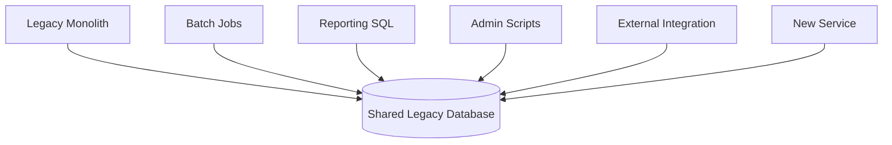
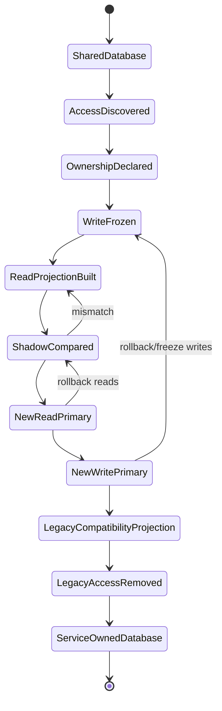
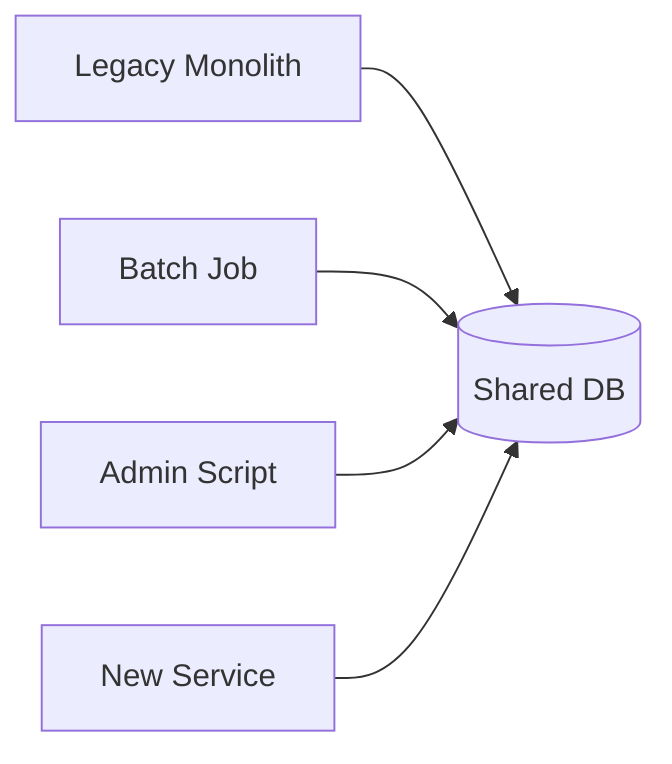
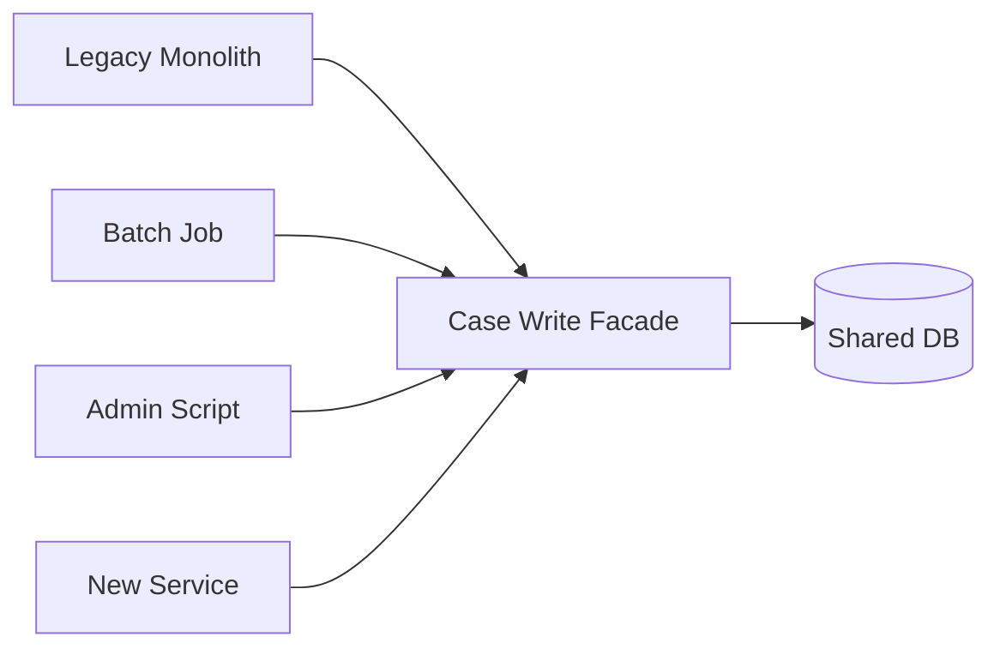
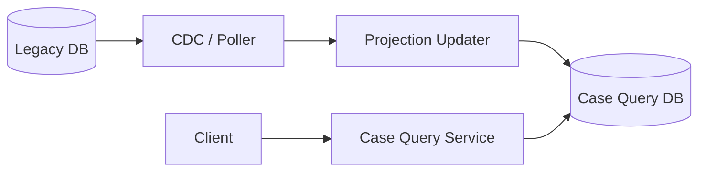
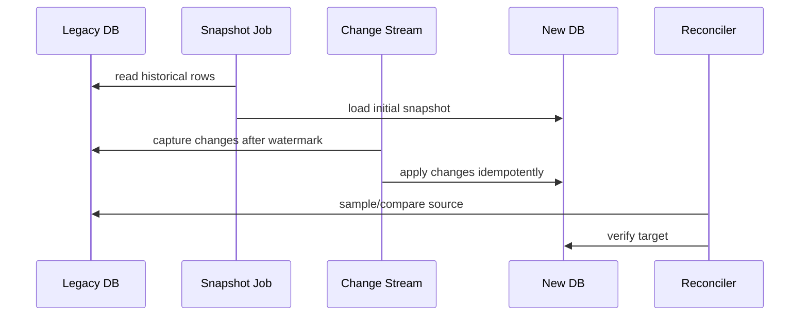
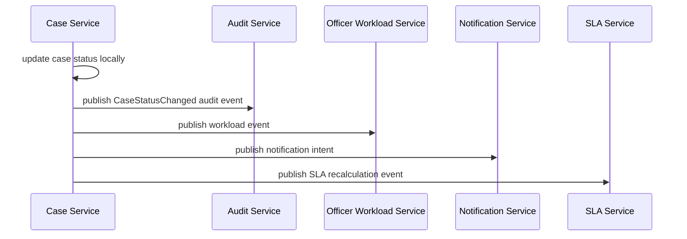
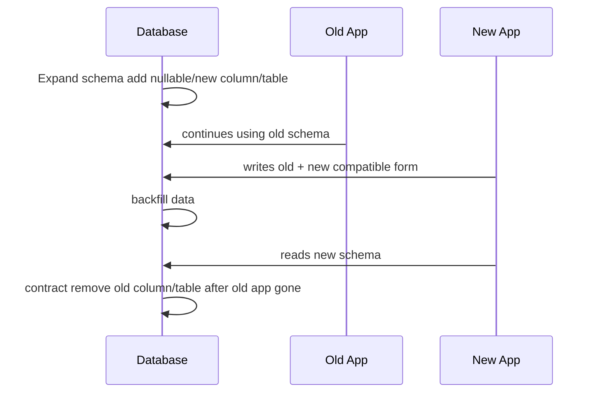

# Part 080 — Database Decomposition Without Breaking Production

## 1. Core Idea

Database decomposition is not “split tables into databases”.

It is **moving data authority** from a shared persistence model into service-owned persistence without breaking existing behavior.

The weak approach:

```text
Create new database.
Copy tables.
Point new service to copied tables.
```

The production approach:

```text
Identify data ownership.
Classify reads and writes.
Freeze unsafe schema coupling.
Create compatibility boundaries.
Move reads with projections when possible.
Move writes only when authority is explicit.
Reconcile continuously.
Cut over gradually.
Remove old access.
```

A microservice database split is complete only when:

```text
The owning service is the only writer of its owned state,
other services cannot bypass it through SQL,
and legacy access is either removed or converted into a compatibility API/projection.
```

## 2. Why Database Decomposition Is Harder Than Service Extraction

Code can be moved.

Data authority must be negotiated.

A legacy database often contains:

- shared tables,
- hidden foreign keys,
- triggers,
- stored procedures,
- batch jobs,
- reporting queries,
- ad-hoc admin scripts,
- integration tables,
- denormalized columns,
- audit tables,
- materialized views,
- vendor-specific behavior,
- data quality assumptions,
- implicit business rules.

A table is rarely just storage.

It is often an integration surface.



This is why database decomposition must start with access discovery.

## 3. The Ownership Question

Before moving any table, answer:

```text
Which service owns the right to change this fact?
```

Not:

```text
Which service reads this table most often?
```

Not:

```text
Which service was created first?
```

Not:

```text
Which team wants the table?
```

Ownership means:

- defines invariants,
- validates changes,
- controls writes,
- publishes changes,
- explains audit trail,
- handles correction,
- owns data quality,
- owns lifecycle and retention,
- owns schema evolution.

Example:

| Data | Likely Owner | Why |
|---|---|---|
| Case status | Case Lifecycle Service | Owns state transition invariant |
| Assigned officer | Case Assignment Service | Owns assignment policy |
| Officer profile | Officer Directory Service | Owns officer identity/profile |
| Evidence metadata | Evidence Service | Owns evidence lifecycle |
| Audit event | Audit Service/Event Store | Owns immutable evidence chain |
| SLA due date | SLA/Workflow Service | Owns timer and escalation rule |
| Case search document | Query/Search Service | Owns read model, not source fact |

If ownership is unclear, database decomposition is premature.

## 4. The Decomposition State Machine

Database decomposition should be staged.



The critical state is `LegacyAccessRemoved`.

Without access removal, the database is still shared in practice.

## 5. Step 1 — Discover All Database Access

You cannot decompose what you cannot see.

Build an access inventory.

Sources:

- application code,
- SQL logs,
- database audit logs,
- connection users,
- stored procedures,
- triggers,
- views,
- ETL jobs,
- BI/reporting tools,
- cron jobs,
- admin scripts,
- vendor connectors,
- CDC consumers,
- manual support runbooks,
- database grants,
- query history,
- schema migration history.

Access inventory format:

| Accessor | Type | Tables | Operation | Frequency | Owner | Risk |
|---|---|---|---|---|---|---|
| Legacy Monolith | App | CASE | read/write | high | legacy team | critical |
| Nightly SLA Job | Batch | CASE, SLA_RULE | read/write | daily | ops | high |
| BI Dashboard | Report | CASE, OFFICER | read | hourly | analytics | medium |
| Admin Script | Manual | CASE | write | rare | support | high |
| External Bridge | Integration | CASE_EXPORT | read/write | hourly | integration team | medium |

Do not accept “only the monolith uses this table” without evidence.

## 6. Step 2 — Classify Table Roles

Not every table should become a service database table.

Classify first.

| Table Role | Meaning | Migration Treatment |
|---|---|---|
| Entity authority table | Stores source fact | Move to owning service |
| Relationship table | Encodes cross-entity relationship | Re-evaluate domain ownership |
| Lookup/reference table | Shared code list | Move to reference service or config/data product |
| Audit table | Evidence chain | Move carefully; preserve immutability |
| Integration table | File/API/batch exchange | Replace with API/event/queue |
| Reporting table | Query convenience | Replace with read model/data platform |
| Cache table | Derived data | Rebuild from source |
| Workflow table | Process state/timer | Move to workflow owner |
| Technical table | Locks, sessions, temp | Usually not business-owned |

The same table can contain multiple responsibilities.

That is a smell.

Example:

```text
CASE table contains:
- case identity
- lifecycle status
- assigned officer
- SLA due date
- reporting flags
- external export status
- audit-like columns
```

This is not one ownership decision.

It is several ownership decisions trapped in one table.

## 7. Step 3 — Break Write Coupling Before Physical Split

Physical split before write control creates chaos.

First, restrict writes.



Move toward:



Even before the database is split, the facade creates a control point.

A write facade can enforce:

- validation,
- authorization,
- idempotency,
- audit,
- route decision,
- deprecation warnings,
- metrics,
- future redirection.

It is not the final architecture.

It is a migration scaffold.

## 8. Step 4 — Create Database Access Barriers

If every service can still connect with the same database user, ownership is fictional.

Use barriers:

- separate database users per application,
- least-privilege grants,
- read-only users for reporting,
- revoke direct table writes,
- expose views for compatibility,
- block new dependencies on legacy schema,
- monitor denied access,
- fail builds when forbidden SQL appears,
- label tables with owner metadata.

Example PostgreSQL-style policy:

```sql
-- Legacy app can read/write during transition.
GRANT SELECT, INSERT, UPDATE ON legacy.case TO legacy_app;

-- New query service can read only from controlled projection/source view.
GRANT SELECT ON legacy.v_case_projection_source TO case_query_service;

-- Reporting cannot write.
GRANT SELECT ON legacy.v_case_reporting TO reporting_reader;

-- No direct access for random app user.
REVOKE ALL ON legacy.case FROM app_default;
```

This is not enough by itself.

But without it, engineers will bypass service APIs under pressure.

## 9. Step 5 — Move Reads First When Possible

Reads are easier than writes because they do not define authority.

Read migration options:

| Option | Description | Use When |
|---|---|---|
| API composition | Call owning services and combine response | Low volume, fresh data needed |
| Read model projection | Build denormalized query store | High read volume, accepted staleness |
| CDC-fed read model | Capture legacy changes into new projection | Legacy is source during migration |
| Materialized export | Periodic rebuild | Reporting/analytics, not live workflow |
| Compatibility view | DB view for legacy consumers | Transitional, not final |

Example read model flow:



Read projection must expose staleness.

```json
{
  "caseId": "CASE-2026-001",
  "status": "UNDER_REVIEW",
  "assignedOfficer": "OFFICER-7",
  "projection": {
    "source": "legacy-case-db",
    "sourceVersion": 882991,
    "updatedAt": "2026-07-05T10:12:22Z",
    "lagSeconds": 4
  }
}
```

If business cannot tolerate stale reads, you need a stronger strategy.

Do not hide staleness.

## 10. Step 6 — Build a Snapshot + Stream Migration

For many migrations, a read model or new database needs initial data plus continuous changes.



Rules:

- snapshot must record a watermark,
- stream must start before or at the watermark,
- updates must be idempotent,
- delete semantics must be explicit,
- ordering must be handled per aggregate/entity,
- failed records must go to repair queue,
- reconciliation must be continuous.

A target table needs source metadata.

```sql
CREATE TABLE case_projection (
    case_id              text PRIMARY KEY,
    status               text NOT NULL,
    assigned_officer_id  text,
    opened_at            timestamptz NOT NULL,
    updated_at           timestamptz NOT NULL,
    source_system        text NOT NULL,
    source_position      text NOT NULL,
    source_updated_at    timestamptz NOT NULL,
    projection_updated_at timestamptz NOT NULL
);
```

Java projection update must be version-aware.

```java
public final class CaseProjectionUpdater {
    private final CaseProjectionRepository repository;

    public void apply(LegacyCaseChanged change) {
        repository.upsertIfNewer(
                change.caseId(),
                change.sourcePosition(),
                current -> current == null || change.isAfter(current.sourcePosition()),
                current -> CaseProjection.from(change)
        );
    }
}
```

## 11. Step 7 — Reconcile Before Trusting

Reconciliation is not optional.

It is the migration correctness loop.

Reconciliation dimensions:

| Dimension | Example |
|---|---|
| Count | source rows vs target rows |
| Identity | each source ID has target mapping |
| Field equality | important fields match |
| Semantic equality | legacy status maps to modern status |
| Freshness | target within accepted lag |
| Completeness | no missing required relation |
| Security | no unauthorized field exposed |
| Audit | event trail reconstructs change |
| Deletes | deleted/closed/archived rows handled correctly |

Example reconciliation record:

```json
{
  "reconciliationRunId": "rec-2026-07-05-001",
  "entityType": "CaseAssignment",
  "sourceCount": 120034,
  "targetCount": 120034,
  "blockingMismatchCount": 3,
  "nonBlockingMismatchCount": 88,
  "maxLagSeconds": 12,
  "status": "FAILED_BLOCKING_MISMATCH"
}
```

Reconciliation result should affect rollout.

```text
If blocking mismatch > threshold:
  stop rollout
  keep old source primary
  open migration incident
  repair target
```

## 12. Step 8 — Move Write Authority

A service owns data only when it owns writes.

Write migration options:

### 12.1 Big Switch Write Cutover

All writes switch at once.

Use only when:

- write volume is low,
- downtime window is acceptable,
- data owner is clear,
- rollback is easy,
- legacy write path can be disabled.

### 12.2 Cohort-Based Write Cutover

Move writes for selected tenants/users/regions.

Use when:

- data can be partitioned by cohort,
- old and new can coexist without cross-cohort conflict,
- support team can identify which path owns a record.

### 12.3 Capability-Based Write Cutover

Move one command type at a time.

Example:

```text
case creation remains legacy
case assignment moves to new service
case closure remains legacy
case escalation moves later
```

Use when:

- commands touch separate state slices,
- invariants are well understood,
- data model can separate ownership.

### 12.4 Write Facade Route

All callers write through a facade that routes old vs new.

Use when:

- many callers exist,
- direct writes must be centralized before cutover,
- compatibility is needed.

## 13. Dual-Write Risk

Dual-write is the most dangerous migration shortcut.

```java
@Transactional
public void assign(AssignCaseCommand command) {
    legacyRepository.assign(command.caseId(), command.officerId());
    newServiceClient.assign(command);
}
```

This code can fail in many ways:

| Failure | Result |
|---|---|
| Legacy succeeds, new fails | Inconsistent systems |
| New succeeds, legacy fails | Inconsistent systems |
| Timeout after new succeeds | Unknown outcome |
| Retry repeats command | Duplicate side effect |
| Transaction rollback cannot rollback remote call | False atomicity |
| Latency spike in one system | User path slows down |
| Validation differs | Two truths |

Safer alternatives:

| Alternative | Meaning |
|---|---|
| Outbox | Commit local write and publish event reliably |
| CDC | Capture source changes and update target |
| Command routing | Only one system handles command |
| Compatibility projection | Secondary system receives derived copy |
| Saga/workflow | Explicitly model multi-step change |
| Reconciliation repair | Detect and repair mismatches |

If dual-write is unavoidable temporarily, constrain it:

- make one side authoritative,
- make the secondary idempotent,
- persist operation ID,
- capture both outcomes,
- run reconciliation,
- keep duration short,
- block permanent product features on top of temporary dual-write.

## 14. Transaction Splitting

Legacy systems often rely on one database transaction across many concerns.

Example:

```text
begin transaction
  update case status
  insert audit row
  update officer workload
  insert notification row
  update SLA due date
commit
```

After decomposition, this becomes multiple owned changes.



The important question:

```text
Which changes are invariant-critical and must be inside the same local transaction?
Which changes are derived side effects and can be eventually consistent?
```

Do not distribute one legacy transaction blindly.

Re-classify responsibilities.

## 15. Foreign Keys Across Service Boundaries

A foreign key is a local database integrity mechanism.

Across services, it becomes coupling.

Legacy design:

```sql
ALTER TABLE case_assignment
ADD CONSTRAINT fk_case_assignment_officer
FOREIGN KEY (officer_id) REFERENCES officer(id);
```

After decomposition:

```text
Case Assignment Service stores officer_id as external reference.
Officer Directory Service owns officer profile and existence.
Assignment command validates officer availability through API/cache/policy.
Events update local officer reference snapshot if needed.
```

Use local constraints for local invariants.

Use service contracts and domain validation for cross-service references.

A reference snapshot can be useful:

```sql
CREATE TABLE officer_reference_snapshot (
    officer_id text PRIMARY KEY,
    display_name text NOT NULL,
    active boolean NOT NULL,
    source_version text NOT NULL,
    updated_at timestamptz NOT NULL
);
```

But the snapshot is not the owner.

## 16. Breaking Joins

Shared databases encourage cross-domain joins.

```sql
SELECT c.case_no, c.status, o.name, e.file_count
FROM case c
JOIN officer o ON o.id = c.officer_id
JOIN evidence_summary e ON e.case_id = c.id
WHERE c.status = 'UNDER_REVIEW';
```

After decomposition, choose a query strategy.

| Strategy | Use When |
|---|---|
| API composition | small result set, fresh data needed |
| Denormalized read model | high-volume query, accepted staleness |
| Search index | user search/filtering |
| Data warehouse/lakehouse | analytics/reporting |
| Cached reference snapshot | small reference data |

Do not replace a single SQL join with 10,000 remote calls.

That creates a latency disaster.

## 17. Handling Legacy Reports

Reporting is often the hidden blocker.

Legacy reports may join everything.

Do not let reporting force all services back into one shared database.

Migration options:

- export service-owned events to data platform,
- create reporting read models,
- use CDC from legacy during transition,
- provide governed datasets/data products,
- create semantic metric definitions,
- retire direct reporting SQL,
- maintain compatibility views only temporarily.

Report migration plan:

```text
1. Inventory reports.
2. Rank by business criticality.
3. Identify source facts.
4. Define semantic owner per metric/field.
5. Build read model or data product.
6. Validate output against legacy report.
7. Move report consumers.
8. Remove direct SQL access.
```

## 18. Expand-Contract for Schema Migration

Even inside one database, schema changes must be backward-compatible while multiple app versions run.

Expand-contract flow:



Rules:

- add before using,
- backfill before requiring,
- read new only after data is complete enough,
- write both only during transition,
- remove only after all readers/writers are migrated,
- make rollback explicit.

Bad migration:

```sql
ALTER TABLE case DROP COLUMN status;
```

Safe staged migration:

```sql
ALTER TABLE case ADD COLUMN lifecycle_status text;

-- application writes both status and lifecycle_status
-- backfill old rows
-- update readers to lifecycle_status
-- stop writes to status
-- verify no reads of status
-- drop status in later release
```

## 19. Java Repository During Migration

Keep migration complexity out of domain model.

Bad:

```java
public class Case {
    public void assign(OfficerId officerId) {
        if (MigrationFlags.useNewSchema()) {
            this.assignmentV2 = officerId.value();
        } else {
            this.assignedOfficerLegacyColumn = officerId.value();
        }
    }
}
```

Better:

```java
public interface CaseAssignmentRepository {
    Optional<CaseAssignment> findByCaseId(CaseId caseId);
    void save(CaseAssignment assignment);
}
```

Migration-aware adapter:

```java
@Repository
final class MigratingCaseAssignmentRepository implements CaseAssignmentRepository {
    private final LegacyAssignmentDao legacy;
    private final ModernAssignmentDao modern;
    private final AssignmentMigrationMode mode;

    @Override
    public Optional<CaseAssignment> findByCaseId(CaseId caseId) {
        return switch (mode.readMode()) {
            case LEGACY_PRIMARY -> legacy.find(caseId).map(LegacyAssignmentMapper::toDomain);
            case MODERN_PRIMARY -> modern.find(caseId);
            case COMPARE -> compareRead(caseId);
        };
    }

    @Override
    public void save(CaseAssignment assignment) {
        switch (mode.writeMode()) {
            case LEGACY_PRIMARY -> legacy.save(LegacyAssignmentMapper.toLegacy(assignment));
            case MODERN_PRIMARY -> modern.save(assignment);
            case FORBIDDEN_DUAL_AUTHORITY -> throw new IllegalStateException("dual authority is forbidden");
        }
    }

    private Optional<CaseAssignment> compareRead(CaseId caseId) {
        Optional<CaseAssignment> legacyValue = legacy.find(caseId).map(LegacyAssignmentMapper::toDomain);
        Optional<CaseAssignment> modernValue = modern.find(caseId);
        // emit comparison metric/log here
        return modernValue.or(() -> legacyValue);
    }
}
```

Domain model remains clean.

Migration mode belongs to infrastructure/application boundary.

## 20. Compatibility Views

A compatibility view can protect legacy consumers while ownership moves.

Example:

```sql
CREATE VIEW legacy.v_case_assignment AS
SELECT
    case_id AS case_no,
    officer_id AS assigned_officer,
    assigned_at AS assignment_date,
    assigned_by AS assignment_user
FROM case_assignment.assignment;
```

Use views carefully.

They are useful for:

- read-only compatibility,
- report transition,
- blocking direct table dependency,
- hiding schema movement.

They are dangerous when:

- they become permanent ownership bypass,
- they expose too much data,
- they are writable without clear semantics,
- they hide stale data,
- they block decommission.

Every compatibility view needs an owner and removal date.

## 21. Preventing New Coupling During Migration

During migration, developers may add new dependencies to old schema because “it is still there”.

Prevent this with:

- code search checks,
- SQL lint rules,
- database grant restrictions,
- schema owner metadata,
- architecture tests,
- CI policy,
- pull request review checklist,
- service catalog dependency declaration,
- runtime query audit.

Example ArchUnit-style rule idea:

```java
@AnalyzeClasses(packages = "com.acme.caseplatform")
class DatabaseBoundaryRules {

    @ArchTest
    static final ArchRule onlyPersistenceAdaptersAccessJdbc = classes()
            .that().resideOutsideOfPackage("..infrastructure.persistence..")
            .should().notDependOnClassesThat().resideInAnyPackage(
                    "org.springframework.jdbc..",
                    "javax.sql.."
            );
}
```

For SQL strings, complement this with static scanning and runtime DB audit.

## 22. Deleting Legacy Access

Decomposition is not done until old access is removed.

Deletion steps:

```text
1. Mark legacy table/column access deprecated.
2. Add runtime warnings for old access path.
3. Block new writes through grants/policy.
4. Move remaining readers to API/view/read model.
5. Verify no production query access over defined window.
6. Remove legacy code path.
7. Revoke grants.
8. Drop compatibility view/table/column after retention window.
9. Update service catalog.
10. Close migration ADR.
```

Evidence to collect:

- zero legacy writes for N days,
- zero legacy reads from non-approved users,
- reconciliation pass,
- dashboard screenshot/export,
- support approval,
- business owner approval for behavior parity,
- rollback window expired,
- retention/compliance confirmed.

## 23. Data Repair and Correction

Migration will uncover bad data.

Bad data is not automatically a migration bug.

It may be legacy reality.

You need a correction workflow.

Correction categories:

| Category | Example | Treatment |
|---|---|---|
| Format inconsistency | invalid date string | normalize or quarantine |
| Referential gap | officer_id missing | repair from source or mark unknown |
| Duplicate identity | same case mapped twice | manual review |
| Impossible state | CLOSED case with active assignment | business decision |
| Missing audit | no actor for old change | preserve unknown actor marker |
| Privacy issue | sensitive note in public field | redact and classify |

Do not silently “fix” regulated data unless correction itself is auditable.

Correction event example:

```json
{
  "eventType": "DataCorrectionApplied",
  "entityType": "CaseAssignment",
  "entityId": "CASE-2026-001",
  "field": "assignedOfficerId",
  "oldValueHash": "sha256:...",
  "newValueHash": "sha256:...",
  "reason": "legacy referential gap repaired from officer directory",
  "approvedBy": "data-steward-17",
  "appliedAt": "2026-07-05T12:00:00Z"
}
```

## 24. Cutover Runbook

```md
# Database Cutover Runbook: <capability>

## Pre-checks
- Source access inventory reviewed
- Owner declared
- New schema deployed
- Snapshot loaded
- CDC/stream running
- Projection lag within threshold
- Reconciliation passed
- Feature flag ready
- Rollback tested
- Support team briefed

## Freeze Window
- Freeze schema changes on legacy tables
- Freeze new consumers of old tables
- Announce cutover window

## Cutover Steps
1. Enable read primary to new model for internal cohort
2. Monitor mismatch and latency
3. Enable read primary for all users
4. Enable write primary for low-risk cohort
5. Reconcile written records
6. Expand write cohort
7. Disable legacy writes
8. Revoke direct write grants
9. Enable compatibility projection for legacy reads
10. Monitor for forbidden access

## Rollback
- Read rollback: route reads to legacy
- Write rollback: freeze new writes, assess state, compensate/reconcile
- Grant rollback: temporary restore only with incident approval

## Post-checks
- Zero blocking mismatches
- Zero forbidden legacy writes
- Projection lag stable
- Error budget acceptable
- Audit evidence complete
```

## 25. Production Metrics

Required metrics:

- legacy read count by table/user,
- legacy write count by table/user,
- forbidden SQL access count,
- projection lag,
- CDC lag,
- snapshot progress,
- reconciliation mismatch count,
- blocking mismatch count,
- duplicate event count,
- idempotency conflict count,
- correction queue depth,
- cutover cohort percentage,
- write authority route count,
- old schema dependency count.

Important alerts:

- unexpected legacy writes after freeze,
- CDC lag beyond staleness contract,
- reconciliation blocking mismatch,
- projection updater failure,
- dual authority detected,
- compatibility view used by unknown consumer,
- data repair queue growth.

## 26. Architecture Review Checklist

Before database decomposition:

- Who owns each business fact?
- Which tables mix multiple ownership concerns?
- Who currently reads each table?
- Who currently writes each table?
- Which stored procedures/triggers encode business behavior?
- Which reports depend on direct SQL?
- Which jobs write outside the application?
- Which fields are source facts vs derived fields?
- Which foreign keys cross future service boundaries?
- Which joins must be replaced?
- What is the read migration strategy?
- What is the write migration strategy?
- What is the reconciliation strategy?
- What is the rollback strategy?
- How are schema changes made backward-compatible?
- How are database grants enforced?
- How will forbidden access be detected?
- What is the decommission plan?
- What evidence proves legacy access can be removed?

## 27. Common Anti-Patterns

### 27.1 Copy Table, Declare Victory

Copying tables without moving authority creates duplicated data, not microservice ownership.

### 27.2 Shared Database With Service Names

Multiple services still use one schema, but tables are prefixed by service name.

This is cosmetic isolation.

### 27.3 Dual Write Forever

Temporary dual-write becomes permanent.

Every failure becomes a reconciliation problem.

### 27.4 Reporting Blocks Ownership

Operational services stay coupled because BI reports need joins.

Fix with data products/read models, not shared operational writes.

### 27.5 Decomposition Without Grants

Teams promise not to access each other’s tables.

Under incident pressure, someone bypasses the API.

Enforce ownership technically.

### 27.6 Ignoring Stored Procedures and Triggers

The code moves but the business rule remains in the database.

The result is split-brain logic.

### 27.7 No Data Correction Workflow

Bad legacy records are either ignored or silently fixed.

Both are dangerous in regulated systems.

## 28. Top 1% Mental Model

A weak database migration asks:

```text
How do we split this schema?
```

A strong migration asks:

```text
Which business facts need separate owners?
Which writes must be stopped first?
Which reads can tolerate staleness?
Which joins are actually user journeys?
Which reports are operational dependencies?
Which data defects must be made explicit?
How do we prove old and new agree?
How do we remove old access?
```

The highest-level mental model:

```text
Database decomposition is not a storage operation.
It is a controlled transfer of business authority.
```

## 29. Summary

To decompose a database without breaking production:

- discover all access before moving anything,
- classify tables by business role,
- declare ownership per business fact,
- restrict writes before physical split,
- move reads through projections/API composition when possible,
- use snapshot + stream carefully,
- reconcile continuously,
- avoid dual-write unless tightly constrained,
- split transactions by invariant and side effect,
- replace cross-boundary foreign keys with service contracts/reference snapshots,
- break joins with read models or data products,
- enforce grants and architecture rules,
- delete old access before declaring success.

The next part continues migration strategy by covering legacy integration patterns: facade service, ACL, batch bridge, event bridge, and sync-to-async transition.
