# Part 081 — Legacy Integration Patterns

## 1. Core Idea

Legacy integration is not “connect the new service to the old system”.

It is the controlled design of a **coexistence boundary** while authority, traffic, data, and user journeys move from old implementation to new implementation.

A weak migration asks:

```text
How can the new service call the legacy system?
```

A strong migration asks:

```text
Which semantic boundary must protect the new model?
Which interaction must stay synchronous?
Which interaction can become asynchronous?
Which data must be copied, projected, translated, or left behind?
Which failure mode must not cross the boundary?
How do we remove this integration later?
```

The most dangerous migration integration is one that works today but becomes permanent technical debt tomorrow.

The job is not to build a bridge.

The job is to build a bridge with a demolition plan.

---

## 2. Why Legacy Integration Is Harder Than New Service Integration

A modern microservice usually has a clear contract:

- API specification,
- event schema,
- owner,
- SLO,
- versioning policy,
- runtime telemetry,
- change management,
- deployment pipeline.

A legacy system often has hidden contracts:

- implicit database invariants,
- stored procedure side effects,
- batch jobs,
- reports reading internal tables,
- UI workflow assumptions,
- cron timing assumptions,
- manual operations,
- undocumented error codes,
- shared mutable state,
- direct table access by many applications.

The integration is therefore not between two technologies.

It is between two **semantic worlds**.

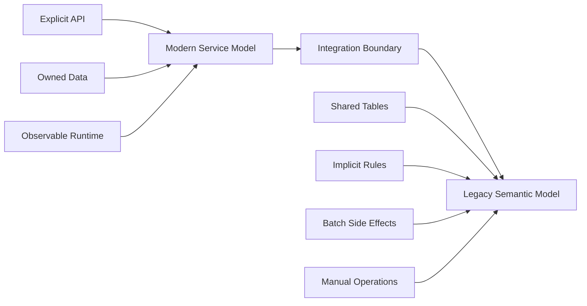

A top-level engineer treats every legacy integration as a risk boundary.

---

## 3. The Integration Pattern Map

The common patterns are:

| Pattern | Use When | Main Benefit | Main Risk |
|---|---|---|---|
| Facade Service | You need a stable modern API over old behavior | Hides legacy complexity | Can become god facade |
| Anti-Corruption Layer | Legacy semantics differ from new domain | Protects new model | Translation can hide business loss |
| Batch Bridge | Legacy only supports batch/file/db extract | Low disruption | Latency, reconciliation, duplicate handling |
| Event Bridge | You need legacy state changes as events | Enables async modernization | Event quality and ordering risk |
| Sync-to-Async Transition | Old process is synchronous, new process should be durable/async | Improves resilience and decoupling | User experience and consistency change |
| Database Adapter | Temporary wrapper around old tables/procedures | Enables controlled migration | Can freeze legacy schema into new domain |
| Proxy/Routing Layer | You are strangling endpoints gradually | Incremental cutover | Routing bugs and split-brain behavior |
| Replication/Projection Bridge | New service needs read-only view of old data | Reduces direct dependency | Staleness and source-of-truth confusion |

No pattern is good by itself.

A pattern is good only when it matches:

- ownership direction,
- data authority,
- latency tolerance,
- failure tolerance,
- migration stage,
- removal strategy.

---

## 4. The Coexistence Boundary Mental Model

A coexistence boundary has five responsibilities.

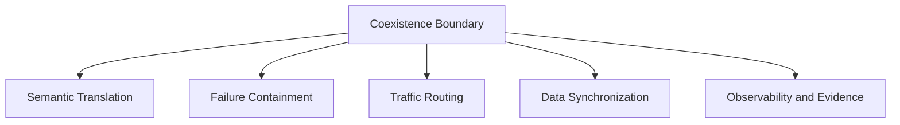

### 4.1 Semantic Translation

The boundary translates business meaning, not just fields.

Bad translation:

```text
legacy_status = "P"
modern_status = "P"
```

Better translation:

```text
legacy_status = "P" means:
- case has passed intake validation,
- but supervisor has not accepted ownership,
- and SLA clock has not started.

modern_status = PENDING_SUPERVISOR_ACCEPTANCE
```

### 4.2 Failure Containment

The legacy system may be slow, fragile, or unavailable.

The boundary must decide:

- timeout,
- retry,
- fallback,
- circuit breaker,
- queuing,
- compensation,
- manual recovery.

### 4.3 Traffic Routing

During strangler migration, routing can depend on:

- endpoint,
- tenant,
- user cohort,
- feature flag,
- case type,
- region,
- regulatory program,
- data migration status.

### 4.4 Data Synchronization

The boundary must define:

- source of truth,
- write authority,
- replication direction,
- lag tolerance,
- reconciliation method,
- conflict handling.

### 4.5 Observability and Evidence

Every integration boundary must emit enough evidence to answer:

```text
What crossed the boundary?
Who initiated it?
Which source data was used?
How was it translated?
Was the downstream call accepted?
Was the result reconciled?
```

---

## 5. Pattern 1 — Facade Service

A facade service exposes a modern API while hiding legacy complexity behind it.

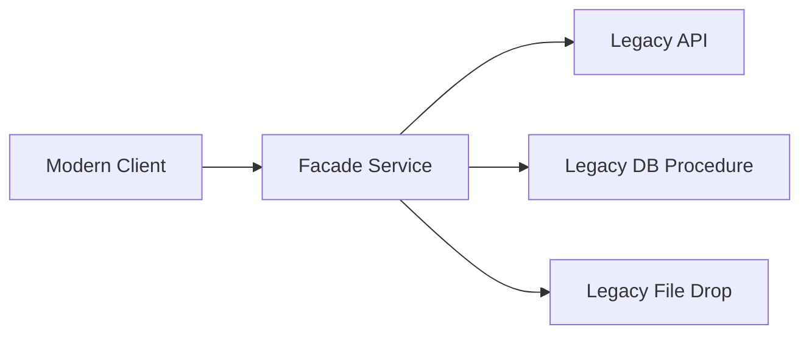

The facade is useful when:

- clients need a stable API before the legacy system is replaced,
- legacy access is inconsistent,
- multiple legacy entry points implement one business capability,
- you want to centralize translation and observability,
- you need to reduce direct legacy dependency from many consumers.

The facade is dangerous when:

- it accumulates business logic from many domains,
- it becomes the new monolith,
- it owns no clear capability,
- it hides legacy behavior without creating migration pressure,
- teams add shortcuts because “it is only temporary”.

### 5.1 Facade Responsibility Boundary

A facade may own:

- request normalization,
- routing to legacy/new implementation,
- response translation,
- legacy error mapping,
- correlation ID propagation,
- timeout and circuit breaker policy,
- migration telemetry.

A facade should not own:

- deep business policy,
- duplicated domain rules,
- long-term data authority,
- cross-domain orchestration that belongs in workflow,
- UI-specific composition for every frontend.

### 5.2 Java Sketch

```java
@RestController
@RequestMapping("/cases")
final class CaseFacadeController {
    private final CaseMigrationRouter router;

    CaseFacadeController(CaseMigrationRouter router) {
        this.router = router;
    }

    @PostMapping("/{caseId}/accept")
    ResponseEntity<AcceptCaseResponse> accept(
            @PathVariable String caseId,
            @RequestHeader("Idempotency-Key") String idempotencyKey,
            @RequestBody AcceptCaseRequest request
    ) {
        AcceptCaseResult result = router.acceptCase(
                new AcceptCaseCommand(caseId, request.supervisorId(), idempotencyKey)
        );

        return switch (result.status()) {
            case ACCEPTED -> ResponseEntity.ok(new AcceptCaseResponse(result.caseId(), "ACCEPTED"));
            case ALREADY_ACCEPTED -> ResponseEntity.ok(new AcceptCaseResponse(result.caseId(), "ALREADY_ACCEPTED"));
            case REJECTED_BY_POLICY -> ResponseEntity.unprocessableEntity().body(
                    new AcceptCaseResponse(result.caseId(), "REJECTED_BY_POLICY")
            );
        };
    }
}
```

The controller does not know whether the request goes to old or new implementation.

```java
final class CaseMigrationRouter {
    private final MigrationCohortPolicy cohortPolicy;
    private final LegacyCaseGateway legacyGateway;
    private final ModernCaseClient modernClient;
    private final MigrationEvidenceRecorder evidenceRecorder;

    AcceptCaseResult acceptCase(AcceptCaseCommand command) {
        Route route = cohortPolicy.routeFor(command.caseId());

        long started = System.nanoTime();
        try {
            AcceptCaseResult result = switch (route.target()) {
                case LEGACY -> legacyGateway.acceptCase(command);
                case MODERN -> modernClient.acceptCase(command);
            };

            evidenceRecorder.recordSuccess(command, route, result, elapsedMs(started));
            return result;
        } catch (RuntimeException ex) {
            evidenceRecorder.recordFailure(command, route, ex, elapsedMs(started));
            throw ex;
        }
    }

    private long elapsedMs(long started) {
        return (System.nanoTime() - started) / 1_000_000;
    }
}
```

This style keeps the facade thin but observable.

---

## 6. Facade Smells

A facade is drifting into danger when:

- it has more domain rules than the target services,
- every team edits the same facade repo,
- it has no retirement date,
- it owns many unrelated endpoints,
- routing rules are not testable,
- the facade writes to both old and new systems without reconciliation,
- consumers depend on facade-specific quirks,
- the facade returns legacy error codes directly,
- monitoring only shows facade success but not downstream divergence.

The rule:

```text
A migration facade is a temporary control point.
A permanent facade must have a clear product/domain responsibility.
```

---

## 7. Pattern 2 — Anti-Corruption Layer

An anti-corruption layer protects the modern domain from legacy semantics.

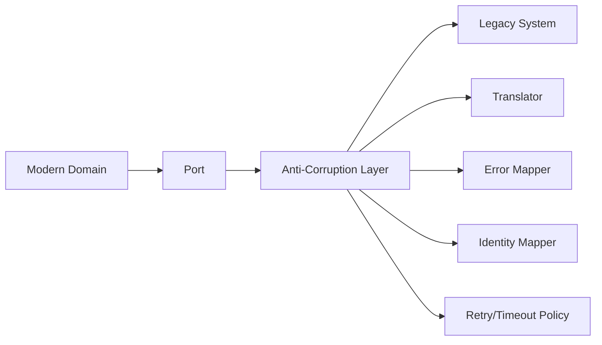

Use ACL when:

- legacy names do not match modern language,
- legacy status codes are overloaded,
- legacy APIs expose implementation detail,
- legacy data has invalid states,
- legacy operations have hidden side effects,
- modern service must not inherit legacy coupling.

### 7.1 Port First

The modern service defines what it needs in its own language.

```java
interface CaseHistoryPort {
    CaseHistorySnapshot loadHistory(CaseId caseId);
}
```

The legacy adapter implements the port.

```java
final class LegacyCaseHistoryAdapter implements CaseHistoryPort {
    private final LegacyCaseClient legacyClient;
    private final LegacyCaseHistoryTranslator translator;

    @Override
    public CaseHistorySnapshot loadHistory(CaseId caseId) {
        LegacyCaseHistoryDto dto = legacyClient.fetchHistory(caseId.value());
        return translator.toModernSnapshot(dto);
    }
}
```

The domain never sees `LegacyCaseHistoryDto`.

That is the point.

### 7.2 Semantic Translation Example

```java
final class LegacyCaseHistoryTranslator {
    CaseHistorySnapshot toModernSnapshot(LegacyCaseHistoryDto dto) {
        List<CaseEventFact> facts = dto.rows().stream()
                .map(this::translateRow)
                .toList();

        return new CaseHistorySnapshot(
                new CaseId(dto.caseNumber()),
                facts,
                sourceVersion(dto.extractVersion()),
                Instant.parse(dto.extractedAt())
        );
    }

    private CaseEventFact translateRow(LegacyCaseHistoryRow row) {
        return switch (row.eventCode()) {
            case "OPN" -> new CaseOpened(row.actor(), row.occurredAt());
            case "ASN" -> new CaseAssigned(row.actor(), row.occurredAt(), row.assignee());
            case "ESC" -> new CaseEscalated(row.actor(), row.occurredAt(), row.reason());
            case "CLS" -> new CaseClosed(row.actor(), row.occurredAt(), row.closureReason());
            default -> new UnknownLegacyFact(row.eventCode(), row.rawPayload(), row.occurredAt());
        };
    }

    private SourceVersion sourceVersion(String value) {
        return new SourceVersion(value == null ? "unknown" : value);
    }
}
```

Notice `UnknownLegacyFact`.

Do not silently drop unknown legacy meanings.

Unknown semantics must become evidence.

---

## 8. ACL Design Rules

### Rule 1 — Translate at the Boundary

Do not spread legacy translation across controllers, services, repositories, and UI.

### Rule 2 — Preserve Source Evidence

A translated object should carry:

- source system,
- source ID,
- source version,
- extraction time,
- translation warnings.

### Rule 3 — Separate Technical Error from Business Meaning

Legacy HTTP 500 may mean:

- system unavailable,
- validation failure hidden behind generic error,
- lock timeout,
- duplicate request,
- permission failure.

Your ACL must not flatten all of these into `RuntimeException`.

### Rule 4 — Translation Must Be Tested as Contract

Translator tests are not low-value mapper tests when the translation carries business meaning.

```java
@Test
void translatesLegacyEscalationIntoModernEscalationFact() {
    LegacyCaseHistoryRow row = new LegacyCaseHistoryRow(
            "ESC",
            "supervisor-17",
            "2026-07-05T10:15:00Z",
            "RISK_THRESHOLD_EXCEEDED",
            null,
            Map.of("legacyPriority", "H")
    );

    CaseEventFact fact = translator.translateRow(row);

    assertThat(fact).isInstanceOf(CaseEscalated.class);
    CaseEscalated escalated = (CaseEscalated) fact;
    assertThat(escalated.reason()).isEqualTo("RISK_THRESHOLD_EXCEEDED");
}
```

### Rule 5 — ACL Must Not Become a Junk Drawer

The ACL protects one boundary.

It is not the place for every migration hack.

---

## 9. Pattern 3 — Batch Bridge

A batch bridge moves information between legacy and modern systems through files, tables, scheduled exports, or batch APIs.

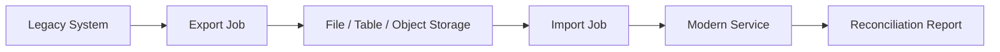

Batch bridges are useful when:

- the legacy system cannot expose reliable APIs,
- the process is naturally periodic,
- the data volume is large,
- operational risk must be minimized,
- the organization already trusts batch reconciliation.

Batch bridges are risky when:

- users expect immediate consistency,
- the file format has weak schema control,
- duplicate files are possible,
- late files are possible,
- partial file processing is not tracked,
- reconciliation is manual and inconsistent.

### 9.1 Batch Bridge Contract

Every batch bridge needs a contract.

```yaml
bridge: legacy-case-daily-export
sourceSystem: legacy-case-core
targetService: case-read-model-service
frequency: daily
expectedArrivalTime: "02:00 Asia/Jakarta"
maxAcceptableDelay: PT2H
schemaVersion: 4
filePattern: cases_YYYYMMDD_v4.csv
idempotencyKey: source_file_name + source_record_id + source_record_version
sourceOfTruth: legacy-case-core
failurePolicy:
  missingFile: page-data-ops-after-2h
  malformedRecord: quarantine-record-continue-file
  schemaMismatch: stop-import-page-owner
reconciliation:
  countCheck: true
  checksumCheck: true
  businessSampleCheck: true
retirementCondition:
  - all consumers moved to modern case service
  - legacy export disabled for 30 days without incident
```

A batch file without an operational contract is not integration.

It is a recurring incident generator.

### 9.2 Import State Machine

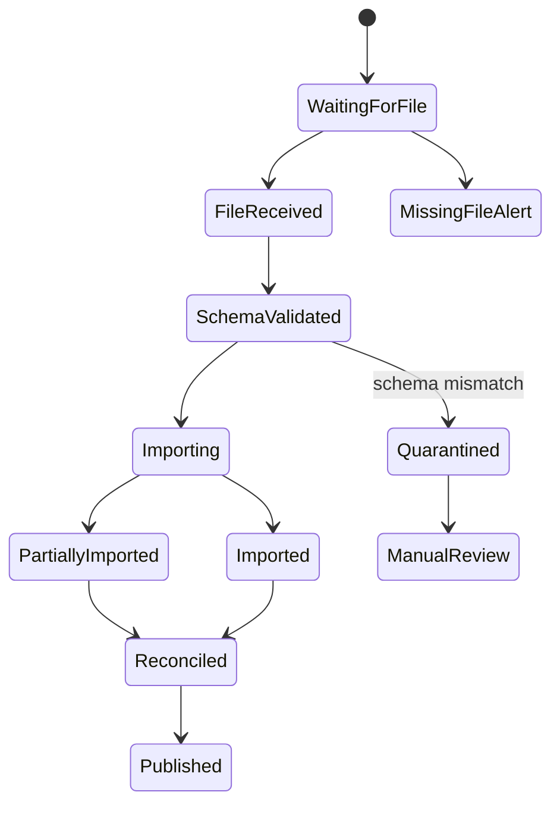

The state machine matters because batch integration fails in many partial ways.

### 9.3 Java Batch Import Skeleton

```java
final class LegacyCaseBatchImporter {
    private final ImportLedger ledger;
    private final LegacyCaseFileParser parser;
    private final CaseProjectionWriter writer;
    private final QuarantineStore quarantineStore;

    void importFile(BatchFile file) {
        ImportRun run = ledger.start(file.name(), file.checksum(), file.schemaVersion());

        try (Stream<LegacyCaseRecord> records = parser.parse(file)) {
            records.forEach(record -> importRecord(run, record));
            ledger.markImported(run.id());
        } catch (SchemaMismatchException ex) {
            ledger.markQuarantined(run.id(), ex.getMessage());
            throw ex;
        } catch (RuntimeException ex) {
            ledger.markFailed(run.id(), ex.getMessage());
            throw ex;
        }
    }

    private void importRecord(ImportRun run, LegacyCaseRecord record) {
        ImportRecordKey key = ImportRecordKey.of(run.sourceFile(), record.sourceRecordId(), record.version());

        if (ledger.wasRecordProcessed(key)) {
            return;
        }

        try {
            writer.upsert(record.toProjection());
            ledger.markRecordProcessed(key);
        } catch (InvalidLegacyRecordException ex) {
            quarantineStore.store(run.id(), record, ex.reason());
            ledger.markRecordQuarantined(key, ex.reason());
        }
    }
}
```

The importer must be idempotent.

Batch replays are normal.

---

## 10. Batch Bridge Failure Modes

| Failure | Symptom | Defense |
|---|---|---|
| Missing file | Consumer sees stale data | Arrival SLA + alert |
| Duplicate file | Counts double | Import ledger + file checksum |
| Partial file | Half data loaded | atomic run state + reconciliation |
| Malformed record | Import stops or corrupts data | quarantine bad record |
| Schema drift | Parser breaks silently | versioned schema + fail closed |
| Late file | Old data overwrites newer | source version guard |
| Reordered extracts | Newer state overwritten | high-watermark check |
| Manual re-upload | duplicate processing | idempotency key |

Batch integration succeeds when it is boring.

Boring requires ledger, reconciliation, and alerting.

---

## 11. Pattern 4 — Event Bridge

An event bridge converts changes in one system into events consumed by another system.

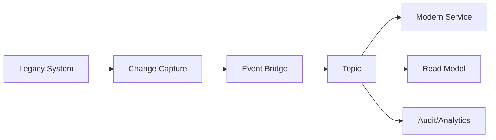

Change capture may come from:

- database CDC,
- application hooks,
- legacy message queue,
- transaction log,
- scheduled delta extraction,
- trigger table,
- domain event added to legacy code.

Event bridge is useful when:

- modern services need near-real-time updates,
- many consumers need the same changes,
- direct polling would create load,
- the migration path is event-driven.

Event bridge is risky when:

- database-level changes do not map to domain facts,
- events are emitted before business transaction is complete,
- ordering is misunderstood,
- event payload leaks sensitive legacy columns,
- consumers treat bridge events as authoritative forever.

### 11.1 CDC Event vs Domain Event

A CDC event says:

```text
row case_table.case_status changed from P to A
```

A domain event says:

```text
CaseAcceptedBySupervisor
```

These are not the same.

CDC is implementation-level evidence.

Domain event is business-level fact.

A bridge can translate CDC into domain-like integration events, but this translation must be explicit and tested.

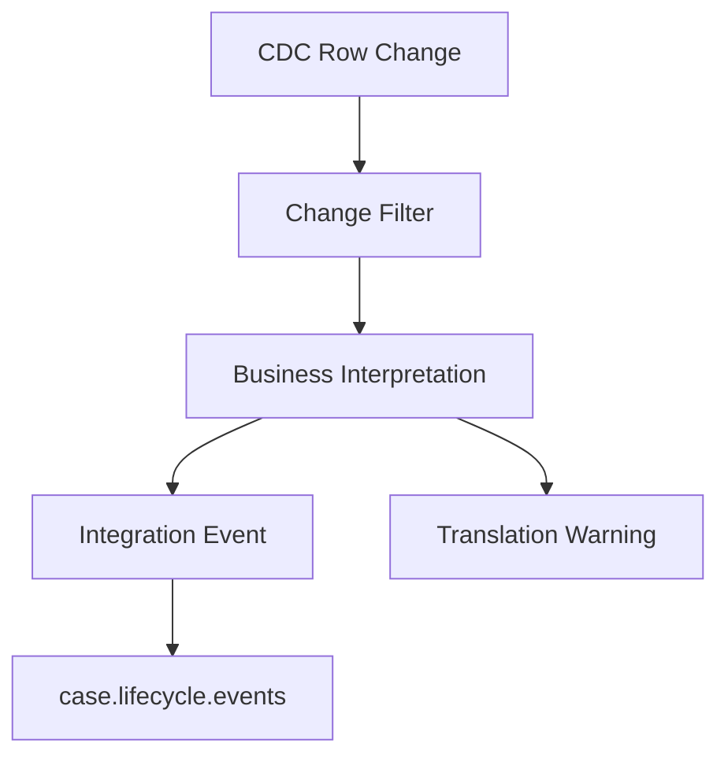

### 11.2 Event Envelope

```json
{
  "eventId": "01J2M4Q5YJ7Z8R9A0B1C2D3E4F",
  "eventType": "legacy.case.accepted.v1",
  "occurredAt": "2026-07-05T10:15:00Z",
  "observedAt": "2026-07-05T10:15:03Z",
  "sourceSystem": "legacy-case-core",
  "sourceEntity": "case",
  "sourceId": "CASE-2026-991",
  "sourceVersion": "984221",
  "correlationId": "corr-7721",
  "payload": {
    "caseId": "CASE-2026-991",
    "acceptedBy": "supervisor-17",
    "acceptedAt": "2026-07-05T10:15:00Z"
  },
  "translation": {
    "method": "cdc-status-transition",
    "fromStatus": "P",
    "toStatus": "A",
    "warnings": []
  }
}
```

The fields `observedAt` and `occurredAt` are different for a reason.

Legacy event bridges often observe changes after they happened.

### 11.3 Java Event Bridge Skeleton

```java
final class LegacyCaseChangeHandler {
    private final LegacyCaseEventTranslator translator;
    private final EventPublisher publisher;
    private final BridgeLedger ledger;

    void handle(ChangeRecord change) {
        BridgeKey key = BridgeKey.of(change.sourceTable(), change.primaryKey(), change.logPosition());

        if (ledger.wasPublished(key)) {
            return;
        }

        Optional<IntegrationEvent> event = translator.translate(change);
        if (event.isEmpty()) {
            ledger.markIgnored(key, "not-business-relevant");
            return;
        }

        publisher.publish(event.get());
        ledger.markPublished(key, event.get().eventId());
    }
}
```

The ledger prevents duplicate publish after crash/restart.

The translator prevents table-change noise from polluting domain topics.

---

## 12. Event Bridge Design Rules

### Rule 1 — Do Not Publish Every Row Change

Consumers need facts, not database chatter.

### Rule 2 — Include Source Position

An event bridge should preserve:

- transaction log position,
- source version,
- source timestamp,
- extraction timestamp,
- translation method.

### Rule 3 — Treat Deletions Explicitly

Deletion may mean:

- actual deletion,
- soft deletion,
- privacy erasure,
- archival,
- migration cleanup,
- business cancellation.

Do not turn all of them into `EntityDeleted`.

### Rule 4 — Make Event Consumer Idempotent

Bridge duplicates are normal during restart, reprocessing, or failover.

### Rule 5 — Plan Bridge Retirement

If a bridge lives forever, it becomes part of the target architecture.

That is acceptable only if it has a real owner and SLO.

---

## 13. Pattern 5 — Sync-to-Async Transition

Legacy systems often expose synchronous operations:

```text
POST /legacy/cases/{id}/close
wait...
return success/failure
```

A modern service may need asynchronous durable workflow:

```text
POST /cases/{id}/close-requests
return 202 Accepted + operationId
process validation, notification, audit, downstream updates asynchronously
```

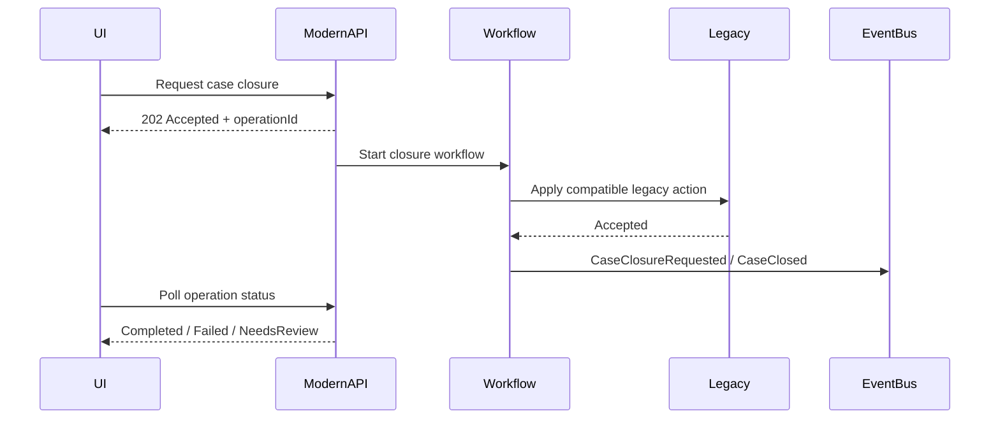

This pattern is useful when:

- the operation has long-running side effects,
- user experience can tolerate pending state,
- retries must be durable,
- downstream systems are unreliable,
- business needs visibility into progress.

It is risky when:

- the old UI expects immediate final state,
- users do not understand pending state,
- compensation is unclear,
- operation status is not observable,
- duplicate requests are not controlled.

### 13.1 Operation Resource

A sync-to-async transition usually needs an operation resource.

```http
POST /cases/CASE-2026-991/closure-requests
Idempotency-Key: close-CASE-2026-991-v7

HTTP/1.1 202 Accepted
Location: /operations/op-778899

{
  "operationId": "op-778899",
  "status": "PENDING",
  "submittedAt": "2026-07-05T10:15:00Z"
}
```

Then:

```http
GET /operations/op-778899

{
  "operationId": "op-778899",
  "status": "COMPLETED",
  "result": {
    "caseId": "CASE-2026-991",
    "caseStatus": "CLOSED"
  }
}
```

### 13.2 Java Command Handler

```java
final class RequestCaseClosureHandler {
    private final OperationRepository operations;
    private final WorkflowStarter workflowStarter;
    private final IdempotencyStore idempotencyStore;

    OperationId handle(RequestCaseClosureCommand command) {
        return idempotencyStore.getOrCreate(
                command.idempotencyKey(),
                command.requestHash(),
                () -> createOperation(command)
        );
    }

    private OperationId createOperation(RequestCaseClosureCommand command) {
        Operation operation = Operation.pending(
                OperationType.CASE_CLOSURE,
                command.caseId(),
                command.requestedBy()
        );

        operations.save(operation);
        workflowStarter.start("case-closure", operation.id(), command.caseId());
        return operation.id();
    }
}
```

The user-visible contract changes from “done now” to “accepted for processing”.

That is not an implementation detail.

It is product behavior.

---

## 14. Pattern 6 — Database Adapter

A database adapter wraps legacy tables or stored procedures behind a port.

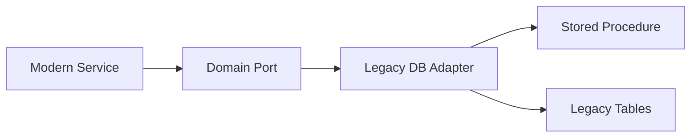

This is sometimes necessary.

But it is also dangerous.

Direct database integration bypasses:

- legacy application validation,
- security model,
- audit hooks,
- cache invalidation,
- workflow side effects,
- trigger assumptions.

Use a database adapter only when:

- no reliable API exists,
- access is read-only or tightly constrained,
- stored procedures are the official integration surface,
- database owner approves contract,
- observability and rollback are in place,
- there is a plan to replace it.

### 14.1 Adapter Rule

The adapter must expose modern capability language.

Bad:

```java
interface LegacyCaseTableDao {
    List<Map<String, Object>> selectFromCaseTable(String caseNo);
}
```

Better:

```java
interface LegacyCaseLookupPort {
    Optional<LegacyCaseSnapshot> findSnapshot(CaseId caseId);
}
```

The database adapter is an implementation detail.

Do not leak table names upward.

---

## 15. Pattern 7 — Replication / Projection Bridge

A replication bridge copies legacy data into a modern read model.

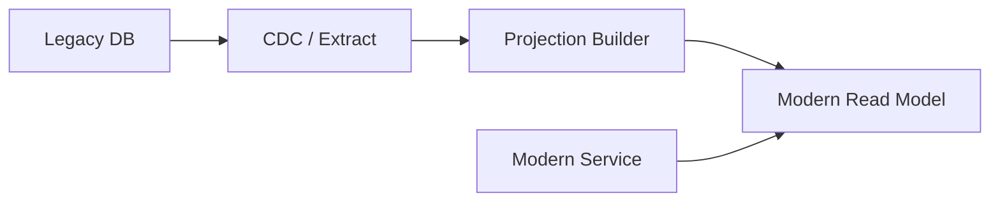

Use it for:

- read-heavy queries,
- UI lookup data,
- reports,
- search indexing,
- migration comparison,
- reducing runtime dependency on legacy.

Do not use it for:

- write authority,
- synchronous command validation that needs fresh state,
- security decisions unless staleness is acceptable,
- regulatory decisions unless evidence and freshness are explicit.

### 15.1 Staleness Contract

Every projection bridge needs a staleness contract.

```yaml
projection: legacy-case-summary
sourceSystem: legacy-case-core
sourceType: cdc
maxLag: PT60S
consumerUseCases:
  - case-search
  - intake-dashboard
notAllowedFor:
  - final-enforcement-decision
  - legal-deadline-calculation
freshnessIndicator:
  field: sourceObservedAt
  exposeToUi: true
rebuildable: true
reconciliationFrequency: hourly
```

If consumers do not know the freshness boundary, they will misuse the projection.

---

## 16. Pattern 8 — Legacy Event Interception

Sometimes you cannot modify legacy internals easily, but you can intercept at a boundary:

- UI action,
- API gateway,
- message queue,
- database trigger,
- report generation step,
- integration middleware.

This can produce migration signals.

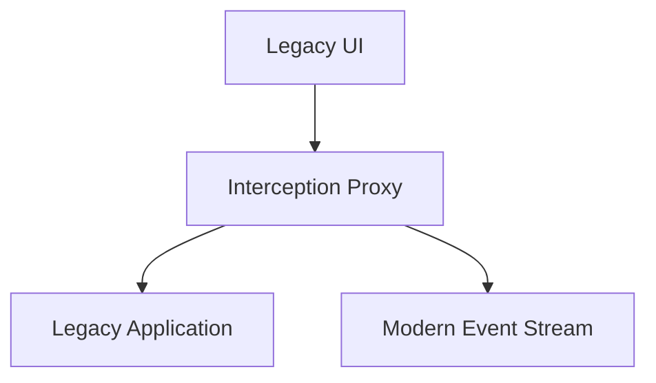

Use interception carefully.

It is good for:

- observation,
- shadow testing,
- migration routing,
- audit enhancement,
- duplicate feed creation.

It is risky for:

- changing business behavior silently,
- capturing incomplete context,
- privacy leakage,
- bypassing official authorization,
- creating hidden dependency on UI shape.

---

## 17. Integration Pattern Selection Matrix

Ask these questions.

| Question | If Yes | Likely Pattern |
|---|---|---|
| Do consumers need a modern API immediately? | Yes | Facade Service |
| Is legacy language different from target domain? | Yes | ACL |
| Does legacy only produce files/extracts? | Yes | Batch Bridge |
| Do many consumers need legacy changes? | Yes | Event Bridge |
| Is user operation long-running? | Yes | Sync-to-Async |
| Is data needed for read-only query? | Yes | Projection Bridge |
| Is endpoint migration gradual? | Yes | Proxy/Routing Layer |
| Is direct DB unavoidable? | Yes, with approval | Database Adapter |

Now add risk modifiers.

| Risk Modifier | Design Response |
|---|---|
| High regulatory impact | Preserve source evidence and translation audit |
| High latency sensitivity | Avoid runtime legacy dependency; use projection |
| High consistency need | Keep synchronous authority or redesign invariant |
| High legacy fragility | Add queue/async bridge/circuit breaker |
| High data sensitivity | Minimize payload, redact logs, classify events |
| High migration duration | Treat bridge as productized component |

---

## 18. Integration Architecture Example

Consider a regulatory case platform being extracted from a legacy case-management system.

Legacy has:

- case master table,
- assignment stored procedure,
- nightly case status export,
- old UI,
- legal deadline calculation batch,
- manual supervisor override screen.

Target has:

- Case Service,
- Assignment Service,
- Deadline Service,
- Evidence Service,
- Audit Service,
- Search Service.

A realistic coexistence architecture:

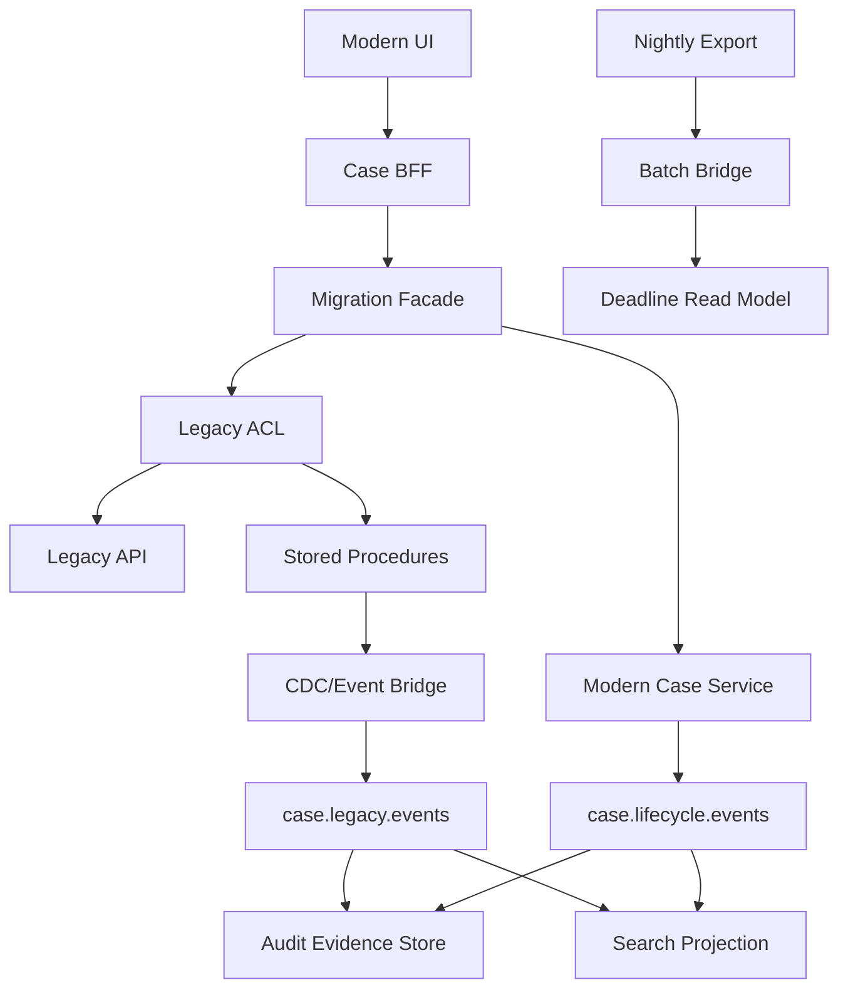

The architecture is not one pattern.

It is a controlled composition of patterns.

---

## 19. The Integration Contract Card

Every legacy integration should have a card.

```yaml
integration: legacy-case-assignment-acl
pattern:
  - anti-corruption-layer
  - stored-procedure-adapter
sourceSystem: legacy-case-core
targetService: assignment-service
owner: case-modernization-team
legacyOwner: legacy-platform-team
purpose: assign migrated and non-migrated cases consistently during extraction
businessCapability: case-assignment
interactionMode: synchronous
sourceOfTruth:
  assignmentBeforeCutover: legacy-case-core
  assignmentAfterCutover: assignment-service
idempotency:
  key: assignment_request_id
  duplicateBehavior: return-existing-result
timeoutPolicy:
  connectTimeout: PT1S
  responseTimeout: PT3S
  retries: 0
failureBehavior:
  legacyUnavailable: return-503-and-do-not-queue
  unknownOutcome: record-pending-verification
observability:
  metrics:
    - legacy_acl_latency_ms
    - legacy_acl_error_total
    - assignment_translation_warning_total
  logs:
    - correlation_id
    - case_id
    - source_version
    - translation_warning
retirement:
  condition: 100 percent assignment write authority moved to assignment-service
  cleanup: remove stored procedure grants and facade route
```

This card prevents the integration from becoming invisible.

---

## 20. Error Translation

Legacy error translation must preserve meaning.

| Legacy Signal | Modern Meaning | Response |
|---|---|---|
| `ORA-00054 resource busy` | transient lock contention | retry only if idempotent |
| `ERR_DUP_ASSIGNMENT` | idempotent duplicate | return existing assignment |
| HTTP 500 + text “case closed” | business validation failure | map to 409/422 depending command semantics |
| timeout after submit | unknown outcome | record pending verification |
| malformed XML | provider contract failure | fail closed and alert |
| connection refused | dependency unavailable | circuit breaker / 503 |

Do not translate everything to “legacy error”.

That destroys recoverability.

---

## 21. Unknown Outcome Handling

Unknown outcome happens when you do not know whether the legacy action committed.

Example:

```text
Modern service calls legacy AssignCase.
Network timeout occurs.
Legacy may have assigned the case.
Modern service does not know.
```

Incorrect response:

```text
Retry blindly.
```

Correct response:

```text
If request has idempotency key and legacy supports duplicate-safe behavior, retry.
Otherwise mark operation PENDING_VERIFICATION and reconcile.
```

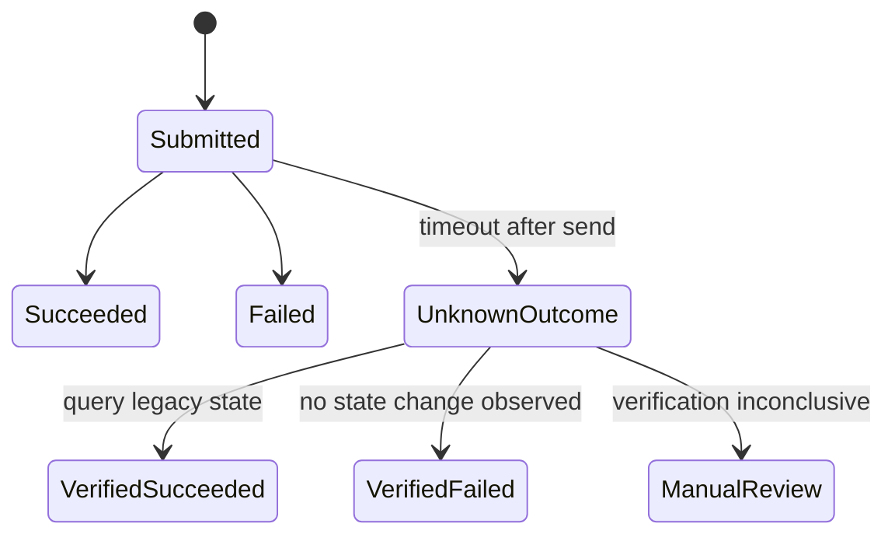

Unknown outcome is one of the most important integration states.

Ignoring it causes duplicate side effects.

---

## 22. Security Boundary

Legacy integrations often punch holes through modern security.

Common mistakes:

- shared database credentials,
- one superuser account for all calls,
- no actor propagation,
- no tenant propagation,
- secrets copied into batch scripts,
- sensitive payloads in logs,
- ACL bypasses modern authorization,
- event bridge publishes restricted fields.

Minimum security contract:

```yaml
security:
  serviceIdentity: spiffe://prod/case-modernization/legacy-acl
  actorPropagation: required
  tenantPropagation: required
  authorizationModel: modern-policy-before-legacy-call
  credentialType: short-lived
  credentialRotation: monthly
  dataClassification: restricted
  loggingPolicy: redact-pii
  auditEvent: required
```

Legacy integration is not exempt from zero-trust thinking.

---

## 23. Observability Boundary

Each integration needs metrics.

| Metric | Meaning |
|---|---|
| `legacy_integration_request_total` | traffic volume by integration/operation/result |
| `legacy_integration_latency_ms` | downstream latency distribution |
| `legacy_integration_timeout_total` | timeout frequency |
| `legacy_translation_warning_total` | semantic mismatch count |
| `legacy_unknown_outcome_total` | operation uncertainty count |
| `legacy_batch_lag_seconds` | freshness of batch data |
| `legacy_event_bridge_lag_seconds` | CDC/event lag |
| `legacy_reconciliation_mismatch_total` | divergence between old and new |
| `legacy_quarantine_record_total` | invalid/malformed records |

Observability is not optional because migration correctness is not self-evident.

---

## 24. Testing Strategy

Integration patterns require specific tests.

### 24.1 Translator Tests

Verify semantic mapping.

### 24.2 Contract Tests

Verify legacy API/file/event assumptions.

### 24.3 Replay Tests

Verify duplicate batch/event processing does not duplicate business outcomes.

### 24.4 Fault Injection Tests

Simulate:

- timeout,
- malformed response,
- duplicate response,
- late event,
- missing file,
- partial file,
- out-of-order change,
- legacy unavailable,
- unknown outcome.

### 24.5 Reconciliation Tests

Compare legacy and modern outcomes for known sample cases.

### 24.6 Retirement Tests

Verify consumers no longer depend on the bridge before removal.

---

## 25. Migration Bridge Lifecycle

A bridge has lifecycle states.

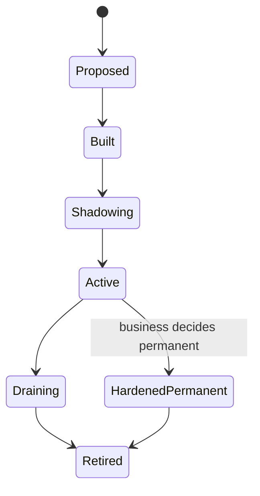

### Proposed

The bridge has a purpose and expected removal condition.

### Built

The bridge exists but is not relied on for production traffic.

### Shadowing

It observes or duplicates traffic for comparison.

### Active

It carries production behavior.

### Draining

Traffic is being removed.

### Retired

Code, credentials, topics, jobs, database grants, and runbooks are removed.

### Hardened Permanent

A temporary bridge became permanent.

This is acceptable only if it receives:

- owner,
- SLO,
- on-call,
- capacity plan,
- security review,
- lifecycle review.

---

## 26. Legacy Integration Anti-Patterns

### 26.1 The Eternal Temporary Adapter

A temporary adapter with no owner, no SLO, and no retirement plan.

### 26.2 The Shared Database Escape Hatch

New service reads/writes old tables directly because it is faster.

### 26.3 The Semantic Copy-Paste

Modern API exposes legacy status codes, column names, and workflows.

### 26.4 The Invisible Batch Job

Business-critical file exchange exists, but no one monitors freshness or reconciliation.

### 26.5 The Event Soup Bridge

Every row change becomes an event and consumers are forced to infer meaning.

### 26.6 The God Migration Facade

All legacy/new routing, orchestration, business logic, UI composition, and data repair end up in one service.

### 26.7 The No-Rollback Cutover

Traffic moves to new service but the bridge cannot route back safely.

### 26.8 The Dual-Write Trap

New code writes old and new systems without ledger, idempotency, or reconciliation.

---

## 27. Practical Review Checklist

Before approving a legacy integration, ask:

```text
1. What business capability does this integration support?
2. Is this bridge temporary or permanent?
3. Who owns it?
4. What source is authoritative before cutover?
5. What source is authoritative after cutover?
6. What semantics are translated?
7. Are unknown legacy states preserved as warnings/evidence?
8. What is the timeout/retry/circuit-breaker policy?
9. Is the operation idempotent?
10. What happens on unknown outcome?
11. How is actor/tenant/security context propagated?
12. What sensitive fields cross the boundary?
13. What metrics prove bridge health?
14. What reconciliation proves bridge correctness?
15. How do we remove the bridge?
```

If you cannot answer these, the integration is not production-ready.

---

## 28. Design Exercise

You are extracting a `Decision Service` from a legacy enforcement system.

Legacy behavior:

- decisions are stored in `DECISION_HEADER` and `DECISION_REASON` tables,
- decision approval is done by stored procedure `APPROVE_DECISION`,
- a nightly job sends approved decisions to the reporting warehouse,
- legal officers use old UI for appeals,
- modern case service needs to know when a decision is approved.

Design:

1. The facade or ACL boundary.
2. Whether approval should stay sync or move async.
3. Whether reporting should use batch bridge, event bridge, or both.
4. How modern case service receives approval facts.
5. How unknown outcome is handled if stored procedure times out.
6. How sensitive decision reasons are protected.
7. The retirement condition for each bridge.

A strong answer will not pick one pattern.

It will compose patterns with explicit authority and exit criteria.

---

## 29. Summary

Legacy integration in Java microservices is about coexistence under control.

Use:

- facade service to present stable modern entry point,
- ACL to protect modern domain language,
- batch bridge for low-disruption periodic exchange,
- event bridge for near-real-time change propagation,
- sync-to-async transition for durable long-running behavior,
- database adapter only as constrained temporary boundary,
- projection bridge for stale-tolerant reads,
- event interception for observation/routing when direct change is hard.

The core rules:

```text
Protect semantics.
Contain failure.
Preserve evidence.
Measure divergence.
Design retirement.
```

The next part covers migration observability and cutover readiness: shadow comparison, reconciliation, cutover metrics, and rollback criteria.
