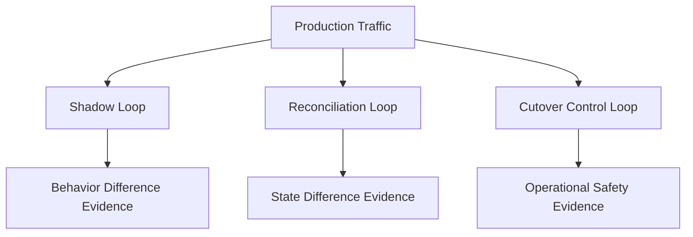
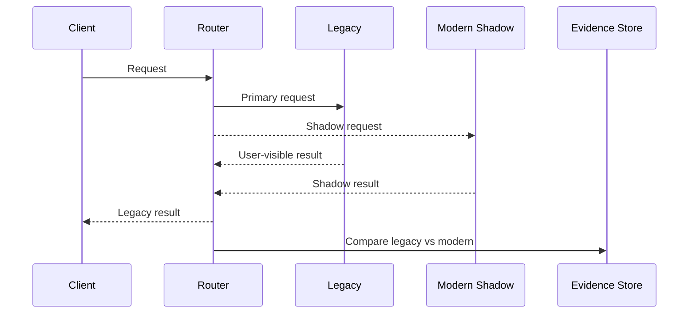
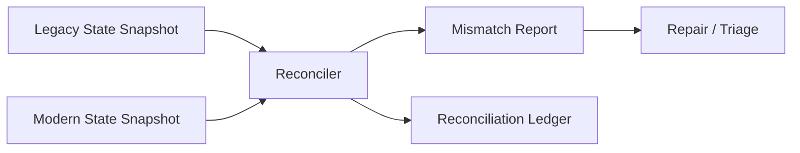
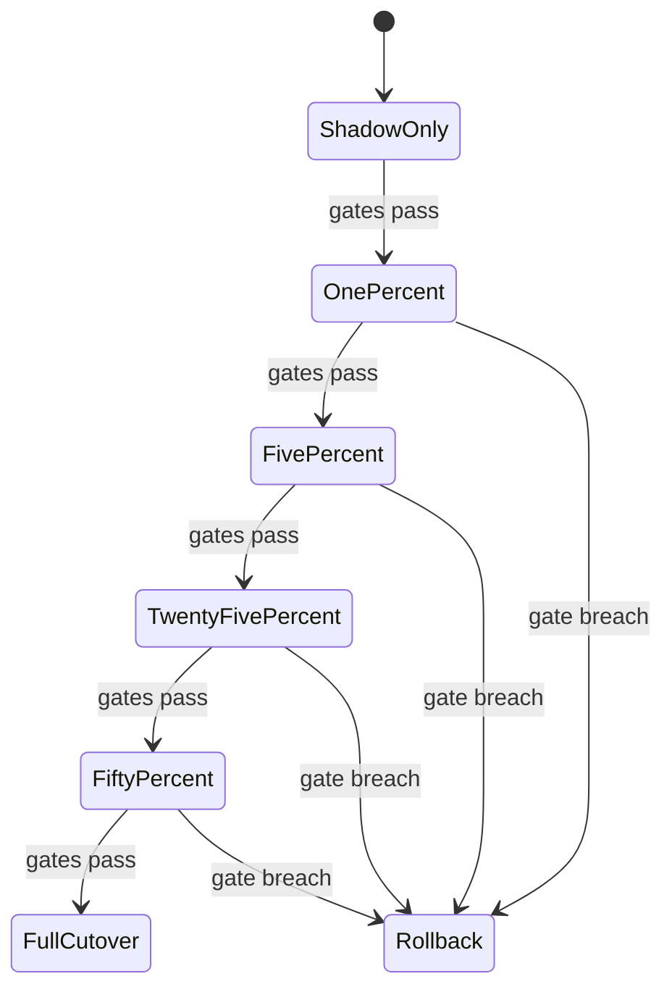
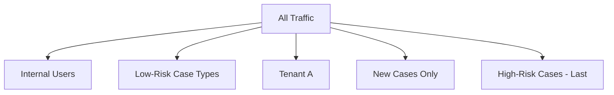
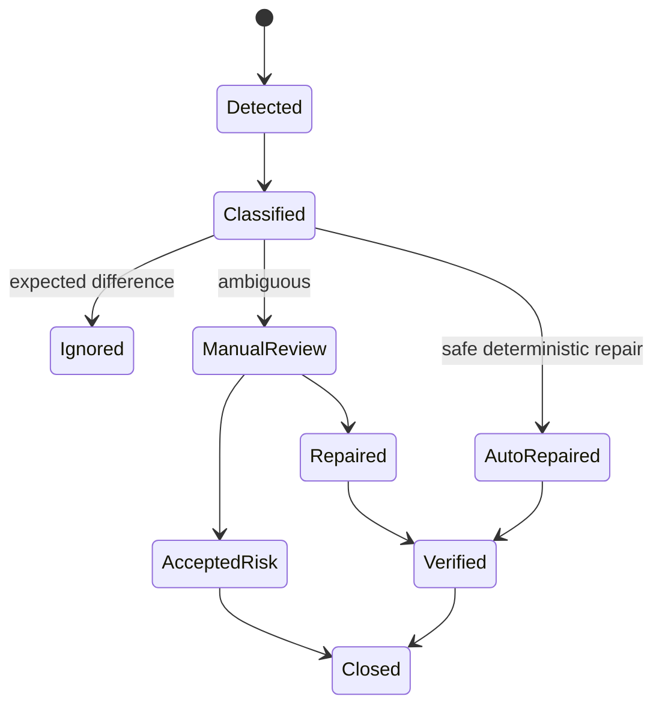
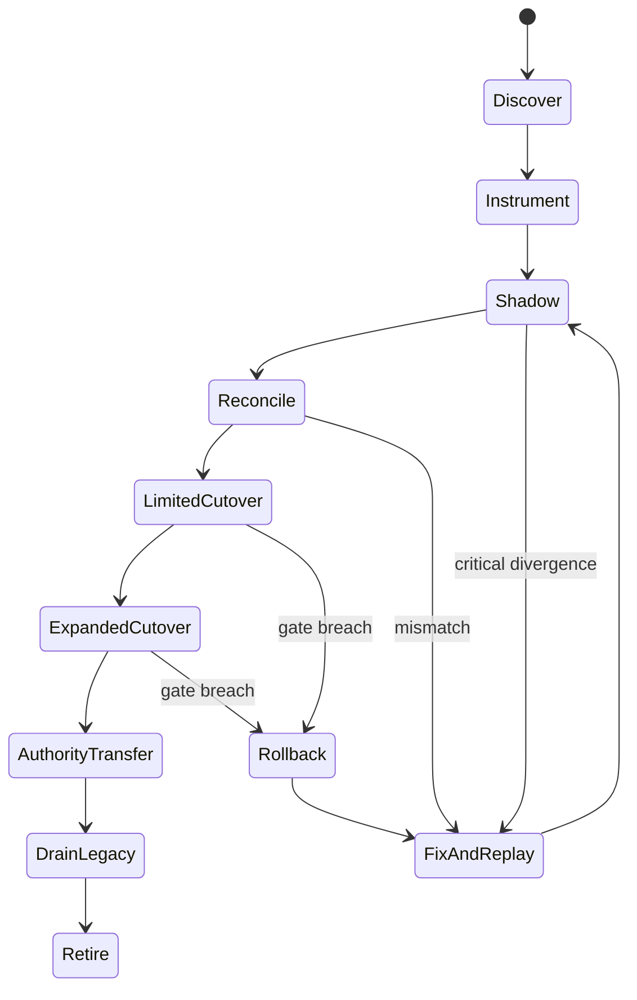

# Part 082 — Migration Observability and Cutover Readiness

## 1. Core Idea

A migration is not ready because the new service works in staging.

A migration is ready when production evidence shows that the new path can carry real traffic with acceptable correctness, latency, failure behavior, security, and rollback safety.

The weak question:

```text
Did QA pass?
```

The strong question:

```text
What evidence proves that the new implementation behaves acceptably for real production traffic, real data, real timing, real dependencies, real failures, and real users?
```

Migration observability is the discipline of proving readiness before, during, and after cutover.

Cutover readiness is not confidence.

It is evidence.

---

## 2. Why Normal Monitoring Is Not Enough

Normal monitoring asks:

- Is the service up?
- Is latency acceptable?
- Are errors increasing?
- Is CPU saturated?

Migration observability asks additional questions:

- Does old behavior match new behavior?
- Which cases diverge?
- Is divergence acceptable or dangerous?
- Is data freshness within contract?
- Are migrated cohorts behaving differently?
- Can we route back safely?
- Are old and new audit trails reconstructable?
- Are consumers already using the new authority?
- Did any hidden legacy consumer break?

A migration can have green health checks and still be wrong.

Example:

```text
New Decision Service returns HTTP 200.
Latency is good.
CPU is fine.
But 0.4 percent of legal deadline calculations differ from legacy because the new model interprets "business day" differently for holiday exceptions.
```

That is a migration failure, not an uptime failure.

---

## 3. The Three Evidence Loops

Migration observability has three loops.



### 3.1 Shadow Loop

Run old and new logic side-by-side, but only one result is user-visible.

### 3.2 Reconciliation Loop

Compare old and new state or outputs after processing.

### 3.3 Cutover Control Loop

Use metrics, gates, flags, routing, rollback, and runbooks to control traffic movement.

All three are needed.

Shadowing without reconciliation misses state drift.

Reconciliation without shadowing misses request-time behavior.

Cutover without control loop turns migration into gambling.

---

## 4. Migration Observability Architecture

A practical migration setup looks like this.

```mermaid
graph TD
    Client[Client / UI / API Consumer] --> Router[Migration Router]

    Router -->|primary| Legacy[Legacy Path]
    Router -->|shadow| Modern[Modern Path]

    Legacy --> LegacyResult[Legacy Result]
    Modern --> ModernResult[Modern Result]

    LegacyResult --> Comparator[Shadow Comparator]
    ModernResult --> Comparator

    LegacyDB[Legacy State] --> Reconciler[State Reconciler]
    ModernDB[Modern State] --> Reconciler

    Comparator --> Evidence[Migration Evidence Store]
    Reconciler --> Evidence
    Router --> Metrics[Cutover Metrics]
    Evidence --> Dashboard[Migration Dashboard]
    Evidence --> Gates[Cutover Gates]
```



The important design point:

```text
Migration telemetry is separate from normal service telemetry.
```

Normal telemetry tells you if each service is healthy.

Migration telemetry tells you if the migration is correct.

---

## 5. Shadow Comparison

Shadow comparison means real production input is sent to the new implementation, but the response is not used for the user-facing result.



Shadowing is useful when:

- the operation is read-only,
- the operation can be simulated safely,
- side effects can be disabled,
- output comparison is meaningful,
- traffic shape in production matters.

Shadowing is dangerous when:

- the new path has side effects,
- the shadow call mutates data,
- external systems are charged/notified twice,
- shadow traffic overloads dependencies,
- sensitive data is copied without privacy review.

### 5.1 Shadow-Safe Operation Classification

| Operation Type | Shadow Strategy |
|---|---|
| Pure query | send to both, compare response |
| Query with audit read log | disable or isolate shadow audit |
| Command with side effects | use dry-run mode or do not shadow directly |
| External notification | never double-send; use simulation adapter |
| Payment/legal action | shadow only through deterministic replay/sandbox |
| Workflow action | create shadow workflow in isolated namespace |

The first rule of shadowing:

```text
A shadow request must not create a real duplicate business effect.
```

---

## 6. Designing Comparable Outputs

Legacy and modern outputs may not be byte-identical.

A useful comparator separates:

- exact match fields,
- normalized fields,
- ignored fields,
- tolerance-based fields,
- order-insensitive collections,
- derived fields,
- redacted/sensitive fields,
- known intentional differences.

Example comparator config:

```yaml
comparison: case-summary-v3
identity:
  key: caseId
fields:
  caseId:
    mode: exact
  status:
    mode: semantic-map
    mapping:
      legacy.P: PENDING_SUPERVISOR_ACCEPTANCE
      legacy.A: ACCEPTED
  assignedOfficer:
    mode: exact
  lastUpdatedAt:
    mode: tolerance
    maxDifference: PT5S
  notes:
    mode: ignored
    reason: free-text formatting differs and not user-visible in target screen
  legalDeadline:
    mode: exact
    severity: critical
  riskScore:
    mode: tolerance
    maxDifference: 0.001
    severity: warning
```

A comparator without explicit tolerance rules produces noise.

A comparator with too many ignored fields hides correctness problems.

---

## 7. Java Shadow Comparator Sketch

```java
record ComparisonResult(
        String comparisonName,
        String entityId,
        boolean equivalent,
        List<FieldDifference> differences,
        Instant comparedAt
) {}

record FieldDifference(
        String field,
        Object legacyValue,
        Object modernValue,
        Severity severity,
        String reason
) {}

enum Severity {
    INFO,
    WARNING,
    CRITICAL
}
```

```java
final class CaseSummaryComparator {
    ComparisonResult compare(LegacyCaseSummary legacy, ModernCaseSummary modern) {
        List<FieldDifference> diffs = new ArrayList<>();

        compareExact(diffs, "caseId", legacy.caseNo(), modern.caseId(), Severity.CRITICAL);
        compareMappedStatus(diffs, legacy.statusCode(), modern.status());
        compareExact(diffs, "assignedOfficer", legacy.officerId(), modern.assignedOfficerId(), Severity.CRITICAL);
        compareInstantTolerance(diffs, "lastUpdatedAt", legacy.updatedAt(), modern.updatedAt(), Duration.ofSeconds(5));
        compareExact(diffs, "legalDeadline", legacy.deadlineDate(), modern.legalDeadline(), Severity.CRITICAL);

        boolean equivalent = diffs.stream().noneMatch(d -> d.severity() == Severity.CRITICAL);

        return new ComparisonResult(
                "case-summary-v3",
                modern.caseId(),
                equivalent,
                diffs,
                Instant.now()
        );
    }

    private void compareExact(List<FieldDifference> diffs, String field, Object left, Object right, Severity severity) {
        if (!Objects.equals(left, right)) {
            diffs.add(new FieldDifference(field, left, right, severity, "exact mismatch"));
        }
    }

    private void compareMappedStatus(List<FieldDifference> diffs, String legacyStatus, CaseStatus modernStatus) {
        CaseStatus mapped = switch (legacyStatus) {
            case "P" -> CaseStatus.PENDING_SUPERVISOR_ACCEPTANCE;
            case "A" -> CaseStatus.ACCEPTED;
            case "C" -> CaseStatus.CLOSED;
            default -> CaseStatus.UNKNOWN_LEGACY_STATUS;
        };

        if (mapped != modernStatus) {
            diffs.add(new FieldDifference("status", legacyStatus, modernStatus, Severity.CRITICAL, "semantic status mismatch"));
        }
    }

    private void compareInstantTolerance(
            List<FieldDifference> diffs,
            String field,
            Instant left,
            Instant right,
            Duration tolerance
    ) {
        Duration delta = Duration.between(left, right).abs();
        if (delta.compareTo(tolerance) > 0) {
            diffs.add(new FieldDifference(field, left, right, Severity.WARNING, "timestamp outside tolerance"));
        }
    }
}
```

The comparator is production code.

Treat it like any other correctness-critical component.

---

## 8. Shadow Comparison Metrics

Minimum metrics:

| Metric | Meaning |
|---|---|
| `migration_shadow_request_total` | number of shadowed requests |
| `migration_shadow_success_total` | shadow path completed |
| `migration_shadow_failure_total` | shadow path failed technically |
| `migration_comparison_total` | comparisons produced |
| `migration_equivalent_total` | outputs equivalent |
| `migration_difference_total` | output differences |
| `migration_critical_difference_total` | differences blocking cutover |
| `migration_comparison_latency_ms` | comparator overhead |
| `migration_shadow_lag_ms` | time between primary and shadow completion |

Useful dimensions:

- route,
- operation,
- cohort,
- tenant,
- case type,
- service version,
- comparator version,
- severity.

Avoid high-cardinality labels like raw `caseId` in metrics.

Put entity IDs in logs/evidence store, not metric labels.

---

## 9. Shadow Evidence Store

Metrics show trends.

Evidence store supports investigation.

```sql
CREATE TABLE migration_comparison_result (
    comparison_id       UUID PRIMARY KEY,
    comparison_name     TEXT NOT NULL,
    comparator_version  TEXT NOT NULL,
    entity_type         TEXT NOT NULL,
    entity_id           TEXT NOT NULL,
    operation           TEXT NOT NULL,
    cohort              TEXT NOT NULL,
    equivalent          BOOLEAN NOT NULL,
    max_severity        TEXT NOT NULL,
    legacy_hash         TEXT,
    modern_hash         TEXT,
    difference_count    INTEGER NOT NULL,
    compared_at         TIMESTAMPTZ NOT NULL,
    correlation_id      TEXT NOT NULL,
    trace_id            TEXT
);

CREATE TABLE migration_comparison_difference (
    comparison_id   UUID NOT NULL REFERENCES migration_comparison_result(comparison_id),
    field_path      TEXT NOT NULL,
    severity        TEXT NOT NULL,
    legacy_value    TEXT,
    modern_value    TEXT,
    reason          TEXT NOT NULL
);
```

Do not store sensitive full payloads unless required and approved.

Often hashes plus selected redacted differences are enough.

---

## 10. Reconciliation

Reconciliation compares state after processing.

Shadow compares behavior at request time.

Reconciliation compares resulting facts.



Reconciliation is essential for:

- data migration,
- event bridge validation,
- batch bridge validation,
- dual-read/dual-write validation,
- cutover safety,
- audit defensibility.

### 10.1 Reconciliation Types

| Type | Purpose |
|---|---|
| Count reconciliation | validate high-level completeness |
| Checksum reconciliation | detect bulk divergence |
| Key reconciliation | find missing/extra entities |
| Field reconciliation | compare business-critical fields |
| State-machine reconciliation | compare lifecycle state |
| Event sequence reconciliation | compare event order/facts |
| Financial/legal aggregate reconciliation | compare derived regulated outputs |
| Sample-based reconciliation | manual/targeted assurance |

Do not rely only on counts.

Two systems can have the same row count and different business meaning.

---

## 11. Reconciliation Contract

```yaml
reconciliation: case-migration-state-v2
legacySource:
  type: snapshot-query
  freshness: PT5M
modernSource:
  type: read-model-query
  freshness: PT1M
scope:
  cohort: migrated-cases-phase-3
  entityType: case
identity:
  legacyKey: case_no
  modernKey: case_id
criticalFields:
  - status
  - assigned_officer
  - legal_deadline
  - enforcement_program
warningFields:
  - last_updated_at
  - risk_score
ignoredFields:
  - display_label
  - legacy_free_text_notes
frequency: PT15M
cutoverGate:
  maxCriticalMismatchRate: 0.001
  maxUnreconciledAge: PT1H
  requiredConsecutivePasses: 12
```

The contract turns reconciliation from ad hoc SQL into an operating control.

---

## 12. Reconciler Sketch

```java
final class CaseStateReconciler {
    private final LegacyCaseSnapshotReader legacyReader;
    private final ModernCaseSnapshotReader modernReader;
    private final ReconciliationLedger ledger;
    private final CaseStateComparator comparator;

    void run(ReconciliationScope scope) {
        Stream<CaseKey> keys = legacyReader.findKeys(scope);

        keys.forEach(key -> {
            Optional<LegacyCaseSnapshot> legacy = legacyReader.find(key);
            Optional<ModernCaseSnapshot> modern = modernReader.find(key.toModernCaseId());

            ReconciliationResult result = comparator.compare(key, legacy, modern);
            ledger.record(result);
        });
    }
}
```

The comparator handles missing/extra cases.

```java
final class CaseStateComparator {
    ReconciliationResult compare(
            CaseKey key,
            Optional<LegacyCaseSnapshot> legacy,
            Optional<ModernCaseSnapshot> modern
    ) {
        if (legacy.isEmpty() && modern.isEmpty()) {
            return ReconciliationResult.invalid(key, "missing in both sources");
        }
        if (legacy.isPresent() && modern.isEmpty()) {
            return ReconciliationResult.critical(key, "missing in modern");
        }
        if (legacy.isEmpty()) {
            return ReconciliationResult.warning(key, "extra in modern");
        }

        List<ReconciliationDifference> diffs = compareFields(legacy.get(), modern.get());
        return ReconciliationResult.of(key, diffs);
    }
}
```

---

## 13. Migration Dashboard

A migration dashboard should answer readiness questions.

Do not create a generic service dashboard and call it migration dashboard.

### 13.1 Readiness Panel

- percentage traffic migrated,
- active cohorts,
- cutover stage,
- current route table version,
- rollback route version,
- feature flag state,
- owner/on-call.

### 13.2 Correctness Panel

- shadow equivalence rate,
- critical mismatch count,
- mismatch by field,
- mismatch by cohort,
- reconciliation pass/fail history,
- oldest unreconciled entity,
- unknown outcome count.

### 13.3 Reliability Panel

- old vs new latency percentiles,
- old vs new error rate,
- new dependency saturation,
- queue lag,
- event bridge lag,
- retry/circuit-breaker/load-shed counts.

### 13.4 Data Freshness Panel

- projection lag,
- CDC lag,
- batch arrival status,
- import run status,
- high-watermark position.

### 13.5 Cutover Gate Panel

- gate status,
- failed gate reason,
- required consecutive passing windows,
- exception approvals,
- rollback criteria breached.

---

## 14. Cutover Readiness Gates

A cutover gate is an explicit condition that must pass before increasing traffic.



### 14.1 Example Gate Set

```yaml
cutoverStage: phase-3-five-percent
trafficTarget: 5
requiredWindow: PT2H
gates:
  correctness:
    criticalShadowMismatchRate: "<= 0.001"
    reconciliationCriticalMismatchRate: "<= 0.001"
    unknownOutcomeCount: "<= 3"
  reliability:
    p95LatencyIncrease: "<= 20%"
    errorRateIncrease: "<= 0.1%"
    circuitBreakerOpenCount: "== 0"
  dataFreshness:
    cdcLag: "<= PT30S"
    projectionLag: "<= PT60S"
  operations:
    runbookReviewed: true
    rollbackTestedWithin: P7D
    onCallPresent: true
  security:
    deniedAccessSpike: false
    piiLeakScanPassed: true
```

A gate must be measurable.

If it cannot be measured, it is an opinion.

---

## 15. Cohort-Based Cutover

Do not cut over all traffic at once unless the risk is tiny.

Cohorts can be based on:

- tenant,
- region,
- business unit,
- case type,
- user group,
- regulatory program,
- low-risk entity type,
- newly created records only,
- migrated data readiness,
- synthetic/internal users first.



Good cohort selection minimizes blast radius and increases learning.

Bad cohort selection creates false confidence.

Example bad selection:

```text
Migrate only new simple cases.
Then assume old complex cases are safe.
```

New simple cases prove very little about old complex cases.

---

## 16. Routing Control

Routing control must be deterministic, observable, and reversible.

```java
record RouteDecision(
        String routeVersion,
        String entityId,
        String cohort,
        Target target,
        String reason
) {}

enum Target {
    LEGACY,
    MODERN,
    DUAL_READ_COMPARE,
    SHADOW_ONLY
}
```

```java
final class MigrationRoutePolicy {
    RouteDecision decide(MigrationRequest request) {
        if (request.hasEmergencyLegacyOverride()) {
            return legacy(request, "emergency override");
        }

        if (!request.entityMigrationState().isDataReady()) {
            return legacy(request, "data not migrated");
        }

        if (request.cohort().equals("phase-3-low-risk") && flags.phase3Enabled()) {
            return modern(request, "phase 3 cohort enabled");
        }

        return legacy(request, "default fallback");
    }
}
```

Every request should log the route decision.

```json
{
  "event": "migration.route_decision",
  "routeVersion": "case-routing-2026-07-05.3",
  "entityId": "CASE-2026-991",
  "cohort": "phase-3-low-risk",
  "target": "MODERN",
  "reason": "phase 3 cohort enabled",
  "correlationId": "corr-7721"
}
```

This is critical for debugging and rollback.

---

## 17. Rollback Criteria

Rollback criteria must be written before cutover.

A team under incident pressure should not debate what “bad enough” means.

### 17.1 Example Rollback Matrix

| Signal | Threshold | Action |
|---|---:|---|
| Critical mismatch rate | > 0.1% for 10 min | pause traffic increase |
| Critical mismatch rate | > 0.5% for 5 min | rollback cohort |
| New path p95 latency | > 2x legacy for 15 min | rollback cohort |
| Error rate increase | > 0.5% absolute for 10 min | rollback cohort |
| Unknown outcome count | > 10 in 30 min | freeze cutover and triage |
| Data freshness lag | > 5 min for critical read model | rollback read traffic |
| Security deny spike | unexplained | freeze and security review |
| Audit event missing | any critical command | immediate freeze |

Rollback criteria should distinguish:

- pause,
- freeze,
- rollback cohort,
- global rollback,
- manual repair,
- incident declaration.

---

## 18. Rollback Is Not Always Possible

Many teams say “we can rollback” when they mean “we can redeploy old code”.

That is not enough.

Rollback may be blocked by:

- irreversible data migration,
- new writes not understood by legacy,
- external notifications already sent,
- event consumers already reacted,
- schema contract changed,
- old code cannot read new state,
- users observed new workflow state,
- audit/legal effects already committed.

Therefore, rollback strategy must be explicit.

| Migration Type | Safer Strategy |
|---|---|
| Read path migration | route reads back to legacy |
| Write path migration | use compatibility writes or roll-forward |
| Schema migration | expand-contract with rollback window |
| Workflow migration | versioned workflow and compensation |
| Event migration | consumer compatibility and replay plan |
| External side effect | compensation, not rollback |

Sometimes the correct strategy is not rollback.

It is roll-forward with controlled repair.

---

## 19. Cutover Runbook

A cutover runbook must be boring and executable.

```markdown
# Cutover Runbook: Case Summary Read Path Phase 3

## Scope
Move 5% low-risk case summary reads from legacy facade to modern case-summary service.

## Preconditions
- Shadow equivalence rate >= 99.95% for 24h.
- Critical mismatch rate <= 0.05% for 24h.
- Reconciliation passed 12 consecutive windows.
- Rollback route tested within 7 days.
- On-call owners present.

## Steps
1. Confirm current route version.
2. Confirm legacy and modern dashboards healthy.
3. Enable feature flag `case_summary_phase_3` for cohort.
4. Verify route decision logs show 5% traffic to modern.
5. Monitor gates for 30 minutes.
6. Record gate status and evidence link.

## Pause Criteria
- Warning mismatch increases above baseline.
- Projection lag above 60s.

## Rollback Criteria
- Critical mismatch > 0.5% for 5 min.
- p95 latency > 2x legacy for 15 min.
- Any missing audit event for critical command.

## Rollback Steps
1. Disable feature flag.
2. Confirm route decisions return LEGACY.
3. Confirm modern traffic drains.
4. Preserve evidence.
5. Open incident if user impact occurred.

## Post-Cutover
- Keep reconciliation active for 7 days.
- Review mismatch backlog daily.
- Decide next cohort after 24h stable.
```

The runbook is part of the architecture.

---

## 20. Data Repair and Triage Workflow

Migration produces mismatches.

Not all mismatches are equal.



Mismatch classification:

| Classification | Meaning | Action |
|---|---|---|
| Expected Difference | known intentional difference | record exception |
| Comparator Bug | comparison logic wrong | fix comparator and replay |
| Legacy Data Quality | old system has bad state | quarantine or preserve as legacy fact |
| Modern Translation Bug | new system misinterprets old semantics | fix translator and replay |
| Event Lag | state will converge | monitor freshness window |
| Lost Event | modern missed change | replay from source position |
| Business Rule Difference | new behavior differs materially | product/domain decision |
| Security Difference | access outcome differs | stop cutover |

A mismatch backlog is not merely a bug list.

It is migration risk inventory.

---

## 21. Migration Evidence for Regulatory Domains

For regulated systems, cutover evidence may need to prove:

- who approved the migration,
- what data moved,
- when authority changed,
- which validation passed,
- which mismatches were accepted,
- why accepted mismatches were safe,
- whether audit records were preserved,
- how rollback/repair would work,
- how user impact was assessed.

A cutover evidence packet can contain:

```yaml
cutoverEvidence:
  migration: case-summary-read-path-phase-3
  approvedBy:
    - architecture-review-board
    - service-owner
    - domain-owner
    - security-owner
  scope:
    cohort: low-risk-case-types
    traffic: 5%
  readinessEvidence:
    shadowWindow: PT24H
    shadowEquivalenceRate: 99.97%
    criticalMismatchRate: 0.03%
    reconciliationPasses: 16
  riskExceptions:
    - field: display_label
      reason: formatting intentionally changed
      approvedBy: product-owner
  rollbackEvidence:
    routeRollbackTest: passed
    testedAt: 2026-07-03T10:00:00Z
  auditEvidence:
    auditCompletenessCheck: passed
    missingCriticalAuditEvents: 0
```

This is how migration becomes defensible.

---

## 22. Observability for Hidden Legacy Consumers

Hidden consumers are one of the biggest cutover risks.

Examples:

- Excel export job,
- reporting tool,
- batch script,
- old admin screen,
- partner integration,
- direct DB query,
- downstream stored procedure,
- manual data correction process.

Before removing legacy access, monitor:

- database query logs,
- API access logs,
- file downloads,
- batch job schedules,
- service account usage,
- network connections,
- report execution logs.

Create a consumer inventory.

```yaml
legacyConsumer:
  id: warehouse-nightly-case-report
  type: batch-sql-reader
  owner: analytics-platform
  dataUsed:
    - case_header.status
    - case_header.assigned_officer
    - case_deadline.deadline_date
  replacementPath: reporting-data-product-v2
  migrationStatus: validated
  lastObservedLegacyAccess: 2026-07-01T02:15:00Z
  removalApproved: false
```

Unknown consumers turn migrations into outages.

---

## 23. The Cutover State Machine



Do not skip states.

Skipping instrumentation or reconciliation only moves risk later, where it is more expensive.

---

## 24. Migration Metrics Naming Example

Use stable metric names.

```text
migration_route_decision_total{migration="case-summary", target="modern", cohort="phase-3"}
migration_shadow_comparison_total{migration="case-summary", result="equivalent"}
migration_shadow_difference_total{migration="case-summary", severity="critical", field="status"}
migration_reconciliation_run_total{migration="case-state", result="passed"}
migration_reconciliation_mismatch_total{migration="case-state", severity="critical"}
migration_cutover_gate_status{migration="case-summary", gate="critical_mismatch_rate"}
migration_projection_lag_seconds{projection="case-summary"}
migration_unknown_outcome_total{operation="approve-decision"}
```

Keep entity IDs out of metric labels.

Use logs/evidence tables for entity-level inspection.

---

## 25. Migration Log Events

Recommended structured events:

```json
{
  "event": "migration.shadow_difference_detected",
  "migration": "case-summary",
  "comparatorVersion": "v3",
  "entityType": "case",
  "entityId": "CASE-2026-991",
  "field": "legalDeadline",
  "severity": "CRITICAL",
  "legacyValueHash": "sha256:...",
  "modernValueHash": "sha256:...",
  "reason": "exact mismatch",
  "correlationId": "corr-7721",
  "traceId": "0af7651916cd43dd8448eb211c80319c"
}
```

```json
{
  "event": "migration.cutover_gate_failed",
  "migration": "case-summary",
  "stage": "phase-3-five-percent",
  "gate": "critical_mismatch_rate",
  "threshold": "<=0.001",
  "actual": "0.0042",
  "action": "ROLLBACK_COHORT",
  "routeVersion": "case-routing-2026-07-05.3"
}
```

Logs should provide enough context for diagnosis without leaking sensitive payloads.

---

## 26. Testing Cutover Mechanics

Cutover mechanics must be tested before real cutover.

Test:

- enable flag,
- disable flag,
- route one cohort,
- route back to legacy,
- drain modern requests,
- preserve idempotency after rollback,
- handle in-flight requests,
- recover from route config push failure,
- recover from partially applied routing change,
- compare dashboard gates,
- execute runbook from scratch.

A rollback that has never been tested is a wish.

---

## 27. Handling In-Flight Requests

During cutover or rollback, requests may already be in progress.

Design choices:

| Scenario | Safer Handling |
|---|---|
| Read request in-flight | allow completion; route new reads to selected target |
| Idempotent command in-flight | complete or retry via idempotency key |
| Non-idempotent command in-flight | block rollback until outcome known or mark pending verification |
| Async workflow in-flight | pin workflow to original version |
| Event publication in-flight | publish with versioned schema and dedupe key |
| Batch import in-flight | finish run or abort before publish marker |

For commands, routing must account for entity state.

Do not send step 1 of a command to modern and step 2 to legacy without a deliberate protocol.

---

## 28. Cutover Decision Record

Each major cutover should have a decision record.

```markdown
# CDR-014: Cut over Case Summary Read Path Phase 3

## Context
Legacy case summary API is being strangled by modern case-summary service.
Phase 1 and 2 cohorts are stable.

## Scope
Move low-risk regulatory program cases from legacy to modern for read path only.

## Evidence
- 24h shadow comparison, 99.97% equivalent.
- Critical mismatch rate 0.03%, all classified and accepted/fixed.
- 16 consecutive reconciliation passes.
- p95 latency modern 22% lower than legacy.
- Projection lag p99 below 40s.
- Rollback tested on 2026-07-03.

## Decision
Proceed with 5% traffic cutover for phase-3 cohort.

## Constraints
- No write authority transfer.
- Legal deadline field remains critical gate.
- Keep shadow comparison for 7 days after cutover.

## Rollback Criteria
See runbook CASE-MIGRATION-RB-003.

## Consequences
- Modern service becomes user-visible for selected cohort.
- Legacy remains source of truth until authority transfer phase.
```

Cutover decision records prevent institutional memory loss.

---

## 29. Common Failure Modes

### 29.1 Shadow Path Has Side Effects

A shadow call accidentally sends notifications or writes audit records.

Defense:

- dry-run mode,
- simulation adapter,
- isolated namespace,
- side-effect guard tests.

### 29.2 Comparator Produces Too Much Noise

Teams ignore mismatch alerts because many are harmless formatting differences.

Defense:

- explicit field modes,
- severity classification,
- expected-difference registry.

### 29.3 Reconciliation Is Too Late

Mismatch discovered days after cutover.

Defense:

- frequent reconciliation during migration,
- high-watermark monitoring,
- oldest-unreconciled-age metric.

### 29.4 Rollback Breaks Because Writes Moved

Reads can route back, but new writes created state legacy cannot understand.

Defense:

- write compatibility plan,
- expand-contract migration,
- roll-forward strategy,
- command pinning.

### 29.5 Hidden Consumer Breaks

Old report or batch job still reads legacy table after schema/authority change.

Defense:

- access logging,
- consumer inventory,
- grants removal rehearsal,
- shadow report comparison.

### 29.6 Green Dashboard, Wrong Business Result

Service metrics are green but domain output differs.

Defense:

- migration correctness metrics,
- semantic comparison,
- domain-level reconciliation.

---

## 30. Production Cutover Checklist

```text
Scope and Authority
[ ] What path is being cut over: read, write, workflow, event, report?
[ ] Is source of truth changing?
[ ] Is write authority changing?
[ ] Which cohorts are included?
[ ] Which cohorts are excluded?

Shadow and Reconciliation
[ ] Shadow comparison executed on representative production traffic?
[ ] Comparator rules reviewed by domain owner?
[ ] Critical mismatches below threshold?
[ ] Reconciliation passed required windows?
[ ] Unknown outcome handling verified?

Operational Readiness
[ ] Dashboard ready?
[ ] Alerts configured?
[ ] Runbook reviewed?
[ ] On-call present?
[ ] Rollback tested?
[ ] In-flight request behavior defined?

Security and Audit
[ ] Actor/tenant propagation verified?
[ ] Sensitive data not leaked in shadow/evidence/logs?
[ ] Critical audit events complete?
[ ] Access policy equivalent or stricter?

Dependency and Capacity
[ ] Modern dependencies sized for traffic?
[ ] Shadow traffic not overloading downstream?
[ ] Queue/CDC/projection lag within contract?
[ ] Legacy fallback capacity available?

Post-Cutover
[ ] Shadow/reconciliation continues after cutover?
[ ] Mismatch triage owner assigned?
[ ] Next cohort criteria defined?
[ ] Retirement criteria updated?
```

A checklist is not bureaucracy when it captures failure modes.

---

## 31. Design Exercise

You are migrating the approval read path for enforcement decisions.

Legacy returns:

```json
{
  "decisionNo": "D-2026-111",
  "status": "A",
  "approvedBy": "USR017",
  "approvedDt": "2026-07-05",
  "reasonCodes": ["R3", "R9"],
  "legalDeadline": "2026-08-05"
}
```

Modern returns:

```json
{
  "decisionId": "D-2026-111",
  "state": "APPROVED",
  "approvedByUserId": "user-17",
  "approvedAt": "2026-07-05T00:00:00+07:00",
  "reasons": ["INSUFFICIENT_CONTROLS", "REPEAT_VIOLATION"],
  "appealDeadline": "2026-08-05"
}
```

Design:

1. Comparator mapping rules.
2. Fields that must be exact.
3. Fields that need semantic mapping.
4. Fields with tolerance.
5. Critical mismatch threshold.
6. Evidence schema.
7. Cutover gates.
8. Rollback criteria.
9. Post-cutover reconciliation window.

A strong answer explains why each field has its comparison mode.

---

## 32. Summary

Migration observability is the difference between controlled modernization and production gambling.

To prove cutover readiness:

- shadow real production traffic safely,
- compare behavior semantically,
- reconcile state continuously,
- store evidence for investigation,
- track migration-specific metrics,
- cut over by cohort,
- enforce measurable gates,
- define rollback criteria before cutover,
- test rollback mechanics,
- manage mismatch triage,
- preserve regulatory evidence,
- keep reconciliation after cutover,
- retire legacy only after hidden consumers are removed.

The core rule:

```text
Do not ask whether the team feels ready.
Ask what production evidence proves readiness.
```

This closes Phase 11 on migration, refactoring, and legacy integration.

The next part begins Phase 12: advanced architecture patterns, starting with event sourcing in microservices.
