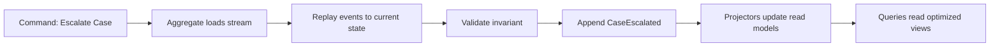
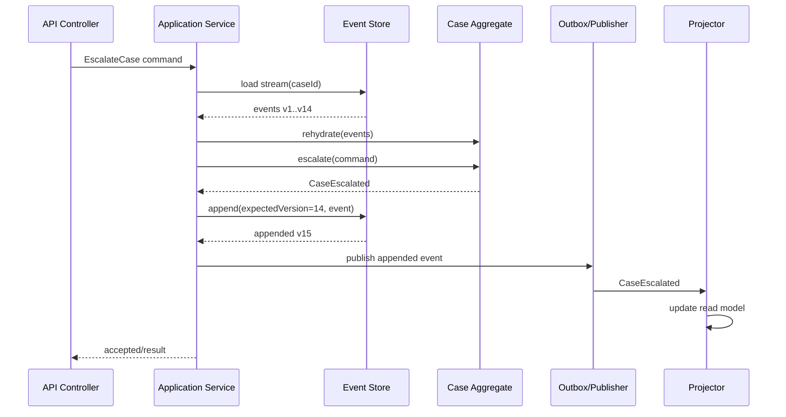
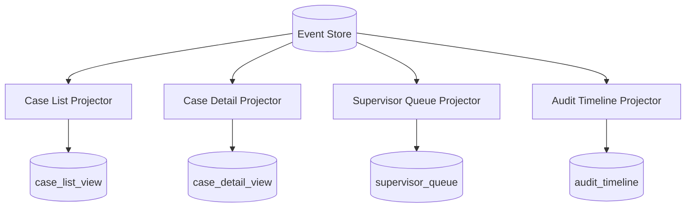
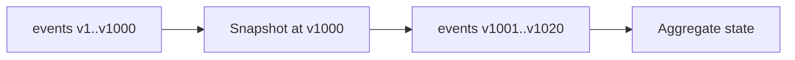
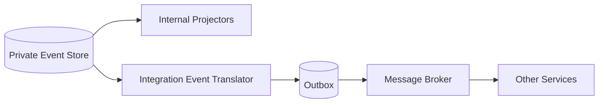
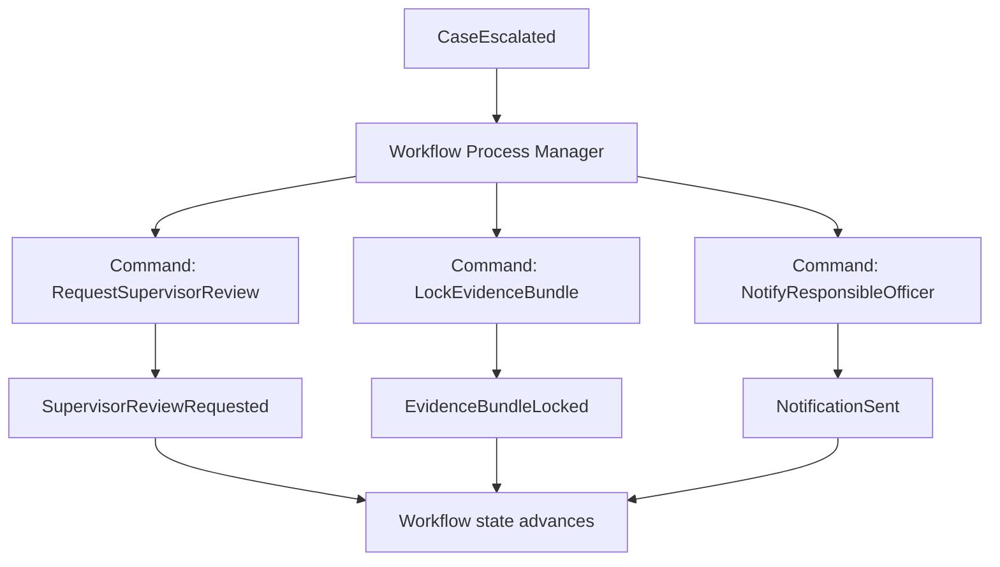

# Part 083 — Event Sourcing in Microservices

## 1. Core Idea

Event sourcing is not "using Kafka".

Event sourcing is not "publishing domain events".

Event sourcing is not "saving an audit log beside normal tables".

Event sourcing means the durable source of truth for a business object is the ordered sequence of facts that happened to it. Current state is derived by replaying those facts.

Weak model:

```text
case.status = "ESCALATED"
```

Stronger event-sourced model:

```text
CaseRegistered
EvidenceSubmitted
RiskScoreCalculated
SupervisorReviewRequested
CaseEscalated
```

The state is not primary. The history is primary.

That single shift changes almost everything:

- persistence model
- aggregate design
- query model
- audit strategy
- schema evolution
- privacy controls
- migration strategy
- debugging model
- operational burden

Event sourcing is powerful when the history has first-class business meaning. It is expensive when the system only needs latest state.

The top-level rule:

```text
Use event sourcing when losing the sequence of decisions would destroy business meaning.
Do not use it merely because the architecture is event-driven.
```

## 2. Event Sourcing vs Similar Ideas

### 2.1 Event Notification

Event notification says:

```text
Something changed. Go ask the owner if you need details.
```

Example:

```json
{
  "eventType": "CaseEscalated",
  "caseId": "CASE-2026-00091"
}
```

The event notifies consumers, but the authoritative state may still be stored in relational tables.

### 2.2 Event-Carried State Transfer

Event-carried state transfer says:

```text
Something changed, and here is enough state for consumers to update their local read model.
```

Example:

```json
{
  "eventType": "CaseEscalated",
  "caseId": "CASE-2026-00091",
  "newStatus": "ESCALATED",
  "escalationLevel": "REGIONAL_SUPERVISOR",
  "occurredAt": "2026-07-05T10:15:30Z"
}
```

Still not necessarily event sourcing. The source of truth may remain a normal table.

### 2.3 Audit Logging

Audit logging says:

```text
Record who did what for evidence, security, compliance, and diagnostics.
```

The audit log may not be replayable. It may not contain enough information to rebuild state. It may include human-readable text, security events, or access logs.

### 2.4 Event Sourcing

Event sourcing says:

```text
The authoritative write model is the event stream.
State is derived from events.
```

A database table may exist, but if it is a projection, cache, or read model, it can be rebuilt from the stream.

### 2.5 Quick Comparison

| Concept | Source of truth | Replayable? | Used for current state? | Typical risk |
|---|---:|---:|---:|---|
| Audit log | Normal DB + audit table | Usually no | No | Missing business semantics |
| Domain event publication | Normal DB | Sometimes | No | Event/data drift |
| Event-carried state transfer | Normal DB | Sometimes | Consumer read models | Oversharing data |
| Transactional outbox | Normal DB + outbox | Outbox usually transient | No | Poller/CDC complexity |
| Event sourcing | Event stream | Yes | Yes | Evolution/privacy/complexity |

## 3. When Event Sourcing Is Justified

Event sourcing is justified when at least several of these are true:

1. **History is the domain**
   - financial ledger
   - regulatory case lifecycle
   - enforcement decision trail
   - insurance claim lifecycle
   - workflow state machine
   - order fulfillment lifecycle

2. **Business must reconstruct why state exists**
   - who made the decision
   - which evidence existed at the time
   - which policy version applied
   - which override was used
   - which timer expired

3. **State transitions are more important than fields**
   - submitted → under review → escalated → remediated
   - draft → approved → published → revoked
   - opened → assigned → breached → resolved

4. **Multiple read models are derived from the same facts**
   - operational view
   - audit view
   - compliance view
   - analytics view
   - timeline view

5. **The system needs deterministic rebuild capability**
   - projection rebuild
   - bug correction
   - replay to new read model
   - forensic reconstruction

6. **Append-only semantics are aligned with business integrity**
   - correcting event, not overwriting state
   - reversal event, not delete row
   - superseding decision, not mutate original evidence

Event sourcing is usually not justified when:

- CRUD state is enough
- history has low value
- queries are simple and dominant
- team lacks operational maturity
- schema changes frequently without strong governance
- privacy deletion requirements are strict and not well-modeled
- the system cannot tolerate projection lag
- developers expect normal SQL debugging over latest tables

A blunt rule:

```text
If nobody in the business asks "how did this state come to exist?", event sourcing is probably overkill.
```

## 4. Mental Model: Event Stream as Business Ledger

Think of an event-sourced aggregate like a ledger.

You do not edit yesterday's ledger entry. You append today's correction.



A command is an intent.

An event is a fact.

A projection is a query-optimized interpretation of facts.

A snapshot is a performance optimization, not truth.

A stream is a consistency boundary.

## 5. Command vs Event vs Projection

### 5.1 Command

A command asks the system to do something.

```json
{
  "commandId": "cmd-721",
  "commandType": "EscalateCase",
  "caseId": "CASE-2026-00091",
  "requestedBy": "user-117",
  "reason": "Evidence indicates systemic violation",
  "expectedVersion": 14
}
```

Command properties:

- imperative name
- may be rejected
- carries intent
- may include idempotency key
- should identify actor and causation
- should target one aggregate or workflow boundary when possible

### 5.2 Event

An event states that something already happened.

```json
{
  "eventId": "evt-991",
  "eventType": "CaseEscalated",
  "aggregateId": "CASE-2026-00091",
  "aggregateType": "Case",
  "streamVersion": 15,
  "occurredAt": "2026-07-05T10:15:30Z",
  "actorId": "user-117",
  "causationId": "cmd-721",
  "correlationId": "corr-882",
  "payload": {
    "fromStatus": "UNDER_REVIEW",
    "toStatus": "ESCALATED",
    "escalationLevel": "REGIONAL_SUPERVISOR",
    "reasonCode": "SYSTEMIC_RISK"
  }
}
```

Event properties:

- past-tense name
- immutable once stored
- accepted fact
- belongs to a stream
- has stable schema/version
- may be public or private
- must be replayable by the owning service

### 5.3 Projection

A projection is a read model built from events.

```sql
case_id              status       escalation_level        last_updated_at
CASE-2026-00091      ESCALATED    REGIONAL_SUPERVISOR     2026-07-05T10:15:30Z
```

Projection properties:

- derived
- rebuildable
- query-optimized
- may be stale
- not the write authority
- may serve one use case only

## 6. Stream Design

The hardest event sourcing decision is not the event store technology. It is stream boundary.

A stream should usually represent one aggregate instance.

Examples:

```text
case-CASE-2026-00091
investigation-INV-2026-00311
enforcement-decision-DEC-2026-00077
party-PARTY-991
```

A stream is a unit of:

- ordering
- optimistic concurrency
- replay
- snapshotting
- append authorization
- correction
- retention policy

Bad stream design causes permanent pain.

### 6.1 Stream-per-Entity Smell

If every database row becomes a stream, you likely copied the table model into events.

Bad:

```text
case-title-CASE-1
case-status-CASE-1
case-assignee-CASE-1
case-priority-CASE-1
```

Better:

```text
case-CASE-1
```

Events should represent meaningful state transitions, not field edits.

### 6.2 Giant Stream Smell

If one stream holds all events for an entire tenant or process, replay and concurrency become painful.

Bad:

```text
tenant-TENANT-1-all-events
```

Symptoms:

- too many writers compete for one stream
- replay becomes huge
- unrelated changes conflict
- snapshots become mandatory early
- correction becomes risky

### 6.3 Cross-Aggregate Event Smell

An event should not pretend to atomically update multiple aggregates unless the aggregate boundary actually includes them.

Bad:

```text
CaseAndPartyAndInvoiceUpdated
```

Better:

```text
CaseEscalated
PartyRiskFlagRaised
InvoiceReviewRequested
```

If a business process crosses aggregate/service boundaries, model it as a saga/workflow/process manager.

## 7. Aggregate Design with Event Sourcing

An event-sourced aggregate has two sides:

1. apply historical events to reconstruct state
2. handle commands to produce new events

The aggregate does not save itself. It returns facts.

```java
public final class CaseAggregate {
    private CaseId id;
    private CaseStatus status;
    private long version;
    private boolean supervisorReviewOpen;
    private final List<DomainEvent> changes = new ArrayList<>();

    public static CaseAggregate rehydrate(List<StoredEvent> history) {
        CaseAggregate aggregate = new CaseAggregate();
        for (StoredEvent event : history) {
            aggregate.apply(event.toDomainEvent());
            aggregate.version = event.streamVersion();
        }
        return aggregate;
    }

    public void escalate(EscalateCase command) {
        if (status != CaseStatus.UNDER_REVIEW) {
            throw new DomainRuleViolation("Only under-review cases can be escalated");
        }
        if (supervisorReviewOpen) {
            throw new DomainRuleViolation("Cannot escalate while supervisor review is open");
        }

        recordThat(new CaseEscalated(
            command.caseId(),
            command.reasonCode(),
            command.requestedBy(),
            command.occurredAt()
        ));
    }

    private void recordThat(DomainEvent event) {
        apply(event);
        changes.add(event);
    }

    private void apply(DomainEvent event) {
        switch (event) {
            case CaseRegistered e -> {
                this.id = e.caseId();
                this.status = CaseStatus.REGISTERED;
            }
            case CaseMovedToReview e -> this.status = CaseStatus.UNDER_REVIEW;
            case SupervisorReviewRequested e -> this.supervisorReviewOpen = true;
            case SupervisorReviewCompleted e -> this.supervisorReviewOpen = false;
            case CaseEscalated e -> this.status = CaseStatus.ESCALATED;
            default -> throw new IllegalArgumentException("Unsupported event " + event.getClass());
        }
    }

    public List<DomainEvent> changes() {
        return List.copyOf(changes);
    }

    public long version() {
        return version;
    }
}
```

Important discipline:

```text
apply(event) mutates state from fact.
handle(command) validates intent and records new fact.
```

Do not put external calls inside aggregate command handling.

Bad:

```java
public void escalate(EscalateCase command) {
    riskClient.recalculate(...); // wrong boundary
    emailClient.send(...);       // wrong boundary
    recordThat(new CaseEscalated(...));
}
```

Better:

```text
Aggregate emits CaseEscalated.
Application service appends event.
Projector/process manager reacts.
External side effects are handled through outbox/consumer/inbox.
```

## 8. Application Service Flow



Java application service sketch:

```java
public final class EscalateCaseHandler {
    private final EventStore eventStore;
    private final EventMetadataFactory metadataFactory;

    public EscalateCaseResult handle(EscalateCase command) {
        StreamName stream = StreamName.of("case-" + command.caseId().value());

        EventStream history = eventStore.load(stream);
        CaseAggregate aggregate = CaseAggregate.rehydrate(history.events());

        aggregate.escalate(command);

        List<NewEvent> newEvents = aggregate.changes().stream()
            .map(event -> NewEvent.from(event, metadataFactory.from(command)))
            .toList();

        AppendResult result = eventStore.append(
            stream,
            ExpectedVersion.exact(history.version()),
            newEvents
        );

        return new EscalateCaseResult(command.caseId(), result.nextVersion());
    }
}
```

Key constraints:

- load stream before decision
- validate against replayed state
- append with expected version
- publish only after durable append
- handle optimistic concurrency explicitly
- never update projection as part of source-of-truth transaction unless projection is local and rebuildable

## 9. Optimistic Concurrency

Event sourcing usually uses stream version as optimistic lock.

Command says:

```text
I made this decision based on version 14.
Append only if stream is still version 14.
```

If stream is now version 15, the command must be rejected or retried by reloading state.

```java
try {
    eventStore.append(stream, ExpectedVersion.exact(command.expectedVersion()), events);
} catch (WrongExpectedVersionException conflict) {
    throw new ConcurrentModification("Case changed before escalation was committed", conflict);
}
```

Decision model:

| Conflict type | Example | Handling |
|---|---|---|
| harmless duplicate | same command retried | return original response via idempotency record |
| stale command | user edited old version | return 409 and ask client to refresh |
| commutative command | add comment | append after reload if invariant still holds |
| invariant conflict | close case vs escalate case | reject one command |
| workflow race | timeout fired while user completed task | deterministic state machine rule |

Do not blindly retry all conflicts. A conflict means the decision basis changed.

## 10. Event Store Model

At minimum, an event store record needs:

```sql
CREATE TABLE event_store (
    global_position      BIGSERIAL PRIMARY KEY,
    stream_name          TEXT NOT NULL,
    stream_version       BIGINT NOT NULL,
    event_id             UUID NOT NULL UNIQUE,
    event_type           TEXT NOT NULL,
    event_schema_version INTEGER NOT NULL,
    occurred_at          TIMESTAMPTZ NOT NULL,
    recorded_at          TIMESTAMPTZ NOT NULL DEFAULT now(),
    actor_id             TEXT,
    tenant_id            TEXT,
    correlation_id        TEXT,
    causation_id          TEXT,
    payload              JSONB NOT NULL,
    metadata             JSONB NOT NULL DEFAULT '{}'::jsonb,
    UNIQUE(stream_name, stream_version)
);

CREATE INDEX idx_event_store_stream
    ON event_store(stream_name, stream_version);

CREATE INDEX idx_event_store_global_position
    ON event_store(global_position);

CREATE INDEX idx_event_store_type_position
    ON event_store(event_type, global_position);
```

This is not a full production event store, but it shows the shape.

Important fields:

- `stream_name`: aggregate stream
- `stream_version`: ordering inside stream
- `global_position`: global ordering for projection catch-up
- `event_id`: dedupe identity
- `event_type`: dispatch key
- `event_schema_version`: evolution signal
- `correlation_id`: user journey/request/process
- `causation_id`: previous command/event
- `recorded_at`: when persisted
- `occurred_at`: when business fact happened

Do not use only `occurred_at` for ordering. Clocks lie. Use event-store position for processing order.

## 11. Append Semantics

The append operation must be atomic.

Pseudo-code:

```java
public AppendResult append(StreamName stream,
                           ExpectedVersion expectedVersion,
                           List<NewEvent> newEvents) {
    return transaction.execute(() -> {
        long currentVersion = lockAndGetCurrentVersion(stream);
        expectedVersion.verify(currentVersion);

        long next = currentVersion;
        for (NewEvent event : newEvents) {
            next++;
            insertEvent(stream, next, event);
        }
        return new AppendResult(stream, next);
    });
}
```

You need to guarantee:

- no duplicate event id
- no version gaps inside stream
- no two events with same stream version
- expected version conflict is explicit
- append is all-or-nothing
- readers can detect their last consumed position

If using a dedicated event store, the platform handles much of this. If using relational storage, you must design it carefully.

## 12. Event Naming

Use past-tense domain language.

Good:

```text
CaseRegistered
CaseAcceptedForReview
EvidenceSubmitted
SupervisorReviewRequested
SupervisorReviewCompleted
CaseEscalated
CaseClosed
```

Bad:

```text
CaseUpdated
StatusChanged
DBRowModified
SaveCaseCalled
CaseEvent
```

Why `StatusChanged` is weak:

- does not explain business meaning
- may hide several different transitions
- weak audit evidence
- poor consumer semantics
- hard to evolve without ambiguity

Better:

```text
CaseMovedToReview
CaseEscalated
CaseResolvedWithoutAction
CaseReopenedDueToAppeal
```

The event name is part of the domain model.

## 13. Event Payload Design

A good event payload contains enough information to replay aggregate state and support relevant downstream meaning without leaking unnecessary sensitive data.

Example:

```json
{
  "caseId": "CASE-2026-00091",
  "fromStatus": "UNDER_REVIEW",
  "toStatus": "ESCALATED",
  "escalationLevel": "REGIONAL_SUPERVISOR",
  "reasonCode": "SYSTEMIC_RISK",
  "policyVersion": "ENF-POLICY-2026.04",
  "decisionSnapshot": {
    "riskBand": "HIGH",
    "evidenceCount": 14
  }
}
```

Design rules:

1. Include stable identifiers.
2. Include decision facts needed for replay.
3. Include policy/version references if later interpretation can change.
4. Avoid free-text as the only business meaning.
5. Avoid dumping the entire aggregate.
6. Avoid unnecessary PII.
7. Avoid references to mutable external state unless replay semantics are clear.

The question is:

```text
Can I understand and rebuild the business state from this event 3 years later?
```

If the answer is no, the event may be too thin.

If the event contains everything from every table, it is too fat.

## 14. Metadata Design

Separate domain payload from operational metadata.

```json
{
  "eventId": "evt-991",
  "eventType": "CaseEscalated",
  "streamName": "case-CASE-2026-00091",
  "streamVersion": 15,
  "eventSchemaVersion": 2,
  "metadata": {
    "tenantId": "tenant-a",
    "actorId": "user-117",
    "actorType": "HUMAN_USER",
    "correlationId": "corr-882",
    "causationId": "cmd-721",
    "requestId": "req-551",
    "sourceService": "case-command-service",
    "sourceVersion": "2026.07.05-1421",
    "traceparent": "00-..."
  },
  "payload": {
    "caseId": "CASE-2026-00091",
    "reasonCode": "SYSTEMIC_RISK"
  }
}
```

Metadata is how events remain diagnosable.

Do not rely on logs alone to reconstruct causality.

## 15. Projections

An event-sourced system usually needs projections because replaying streams on every query is too expensive and too awkward.

Projection examples:

- case list view
- case detail view
- supervisor work queue
- overdue case report
- case timeline
- regulatory evidence report
- audit search index

Projection flow:



Projection record should usually include:

```sql
CREATE TABLE case_list_view (
    case_id              TEXT PRIMARY KEY,
    status               TEXT NOT NULL,
    priority             TEXT NOT NULL,
    assigned_team_id      TEXT,
    last_event_position   BIGINT NOT NULL,
    last_event_id         UUID NOT NULL,
    last_updated_at       TIMESTAMPTZ NOT NULL
);
```

The `last_event_position` matters because it supports:

- idempotency
- replay progress
- catch-up visibility
- projection lag metrics
- rebuild verification

## 16. Projector Design

A projector is not a domain aggregate. It is an event consumer that builds a read model.

```java
public final class CaseListProjector {
    private final CaseListViewRepository repository;
    private final ProjectionCheckpointStore checkpointStore;

    public void handle(StoredEvent stored) {
        if (checkpointStore.alreadyProcessed("case-list", stored.globalPosition())) {
            return;
        }

        switch (stored.event()) {
            case CaseRegistered e -> repository.insert(new CaseListRow(
                e.caseId(), "REGISTERED", e.priority(), null, stored.globalPosition()
            ));
            case CaseMovedToReview e -> repository.updateStatus(
                e.caseId(), "UNDER_REVIEW", stored.globalPosition()
            );
            case CaseAssigned e -> repository.updateAssignee(
                e.caseId(), e.teamId(), stored.globalPosition()
            );
            case CaseEscalated e -> repository.updateStatusAndPriority(
                e.caseId(), "ESCALATED", "HIGH", stored.globalPosition()
            );
            default -> { /* irrelevant event */ }
        }

        checkpointStore.markProcessed("case-list", stored.globalPosition());
    }
}
```

Projection rules:

- idempotent handling
- checkpoint progress
- tolerate irrelevant events
- fail visibly on unknown required event
- expose lag metric
- support rebuild
- support poison-event handling
- do not mutate source of truth

## 17. Projection Lag and User Experience

Event-sourced systems often have write/read separation. A command may succeed before the read model catches up.

You need a user-visible consistency contract.

Options:

1. Return command result only

```json
{
  "caseId": "CASE-2026-00091",
  "acceptedVersion": 15
}
```

2. Return expected read-model version

```json
{
  "caseId": "CASE-2026-00091",
  "acceptedVersion": 15,
  "readModelCatchupToken": "case-list@global-position-802711"
}
```

3. Block until local projection catches up, bounded by deadline

```text
Append event.
Wait up to 300ms for projection >= event position.
Return fresh view if ready, otherwise return 202 with catch-up token.
```

4. Query from aggregate stream for immediate detail page

Useful for one aggregate but not list/search queries.

Bad UX:

```text
User escalates a case.
System says success.
List still shows UNDER_REVIEW.
User clicks again.
Duplicate command happens.
```

Good UX:

```text
System says escalation accepted.
Screen marks row as pending refresh until projection catches up.
Duplicate command is idempotently ignored.
```

## 18. Snapshotting

Snapshotting speeds up aggregate rehydration.

Snapshot is not truth. It is a cached derived state at a stream version.



Snapshot record:

```sql
CREATE TABLE aggregate_snapshot (
    stream_name       TEXT PRIMARY KEY,
    stream_version    BIGINT NOT NULL,
    aggregate_type    TEXT NOT NULL,
    schema_version    INTEGER NOT NULL,
    payload           JSONB NOT NULL,
    created_at        TIMESTAMPTZ NOT NULL DEFAULT now()
);
```

Use snapshots when:

- streams are large
- aggregate replay is expensive
- command latency is affected
- event compaction is not allowed

Avoid snapshots when:

- streams are small
- snapshot schema changes frequently
- snapshots hide poor stream boundaries
- team thinks snapshot replaces event evolution governance

Snapshot invalidation rules must be explicit.

## 19. Schema Evolution

Events are immutable, but event schemas evolve.

You need a strategy before production, not after five versions exist.

Common tactics:

### 19.1 Additive Change

Add optional field with safe default.

```json
{
  "eventType": "CaseEscalated",
  "schemaVersion": 2,
  "payload": {
    "caseId": "CASE-1",
    "reasonCode": "SYSTEMIC_RISK",
    "policyVersion": "ENF-POLICY-2026.04"
  }
}
```

Older consumers ignore unknown field. New consumers default if missing.

### 19.2 Upcasting

Convert old event representation to current domain event at read time.

```java
public final class CaseEscalatedUpcaster implements EventUpcaster {
    public boolean supports(StoredEvent event) {
        return event.type().equals("CaseEscalated") && event.schemaVersion() == 1;
    }

    public StoredEvent upcast(StoredEvent old) {
        JsonNode payload = old.payload();
        ObjectNode upgraded = payload.deepCopy();
        upgraded.put("policyVersion", "UNKNOWN_PRE_2026");
        return old.withPayload(upgraded).withSchemaVersion(2);
    }
}
```

### 19.3 Copy-and-Transform

Create a new stream or migrated event set.

Use carefully. It changes operational and audit semantics.

### 19.4 In-Place Transformation

Dangerous for audit-heavy systems because it mutates historical record.

Only acceptable when:

- legally allowed
- fully recorded
- old raw copy retained if required
- migration has sign-off
- checksums/evidence chain are preserved

### 19.5 Superseding Event

Append a correction event.

```text
CaseEscalated
CaseEscalationReasonCorrected
```

Good for audit-sensitive systems because it preserves original fact and correction trail.

## 20. Versioning Rules

Stable rules:

1. Never rename an event casually.
2. Never change event meaning without changing type/version.
3. Prefer additive payload changes.
4. Do not remove fields until all consumers and replayers are safe.
5. Do not use event type as Java class name only; persist stable type names.
6. Keep upcasters tested with real historical samples.
7. Monitor unknown event count.
8. Document event lifecycle in catalog.

Event schema should be treated like a public contract if events leave the owning service.

Private event stream schema can evolve faster, but projections and replayers still depend on it.

## 21. Public vs Private Events

A common mistake is exposing internal event-sourcing events directly as integration events.

Internal event:

```text
CaseRiskBandRecomputed
```

May be too detailed, too unstable, or too sensitive for external consumers.

Integration event:

```text
CaseRiskProfileChanged
```

May be stable, minimized, and consumer-oriented.

Architecture:



Rule:

```text
Your event store is not automatically your integration event bus.
```

The translator protects external consumers from internal stream evolution and protects the owning service from public contract lock-in.

## 22. Event Sourcing and Microservice Boundaries

Each service should own its own event store or stream namespace.

Bad:

```text
One global enterprise event store where every service appends every event to shared streams.
```

Risks:

- unclear ownership
- schema governance bottleneck
- cross-service stream coupling
- impossible retention policy
- difficult privacy enforcement
- large blast radius

Better:

```text
Case Service owns case streams.
Evidence Service owns evidence streams.
Decision Service owns decision streams.
Workflow Service owns process instance streams.
Each publishes integration events intentionally.
```

## 23. Multi-Aggregate Processes

Event sourcing does not remove the need for sagas/workflows.

Example regulatory process:



Do not make one aggregate coordinate everything.

Bad:

```text
CaseAggregate calls EvidenceService, DecisionService, NotificationService.
```

Good:

```text
CaseAggregate emits CaseEscalated.
Workflow consumes it and issues commands to other boundaries.
Each boundary owns its local stream and invariants.
```

## 24. Deletion and Privacy

Event sourcing collides with privacy if not designed.

Events are append-only, but privacy law may require deletion, erasure, minimization, or restricted processing.

Patterns:

### 24.1 Do Not Store Sensitive Data in Events Unless Necessary

Store references or tokens instead of raw PII.

Bad:

```json
{
  "eventType": "PartyRegistered",
  "payload": {
    "fullName": "...",
    "passportNumber": "...",
    "homeAddress": "..."
  }
}
```

Better when replay permits:

```json
{
  "eventType": "PartyRegistered",
  "payload": {
    "partyId": "PARTY-991",
    "identityProfileRef": "profile-abc"
  }
}
```

### 24.2 Crypto-Shredding

Encrypt sensitive event fields with subject-specific keys, then destroy keys when erasure is required.

Trade-off:

- raw event remains
- sensitive content becomes unreadable
- replay may lose fields
- projections must handle redacted values

### 24.3 Redaction Event

Append a redaction fact.

```text
PartyPersonalDataRedacted
```

Projectors remove or mask affected fields.

### 24.4 Mutable Privacy Envelope

Keep event fact immutable but store sensitive details outside the immutable event stream in a privacy-controlled store.

```text
Event: EvidenceSubmitted(evidenceId, evidenceType, submittedBy)
Sensitive content: evidence vault keyed by evidenceId
```

### 24.5 Retention-Aware Streams

Different aggregate/event classes may require different retention policies.

Do not discover this after production.

Privacy review questions:

```text
Which event fields are personal data?
Which fields are special-category or highly sensitive?
Can replay work after redaction?
Can audit work after redaction?
Who can access raw events?
Are DLQ/search/logs duplicating sensitive event payloads?
```

## 25. Security Model

Event store access is powerful.

Attackers who can read event store may reconstruct the full business history.

Attackers who can append events can rewrite reality forward.

Controls:

- append authorization by service identity
- no broad read access to raw event store
- immutable append API
- event payload validation
- tenant isolation
- encryption at rest
- field-level encryption for sensitive fields
- audit read access
- projection least privilege
- admin tool approval
- event replay job authorization
- tamper-evident hash chain for regulated systems

Tamper-evident hash sketch:

```text
hash(v15) = SHA256(hash(v14) + eventId + streamName + streamVersion + payloadHash + metadataHash)
```

This does not prevent tampering by itself, but it makes tampering detectable if hashes are protected.

## 26. Observability

Event sourcing needs its own metrics.

Minimum metrics:

| Metric | Meaning |
|---|---|
| append latency | write path performance |
| append conflict rate | concurrency pressure |
| stream load latency | command decision delay |
| events per stream percentile | snapshot need / boundary smell |
| projection lag by projector | read model staleness |
| projector error count | broken projection/event evolution |
| unknown event type count | schema rollout bug |
| upcaster error count | historical compatibility problem |
| replay duration | recovery/rebuild readiness |
| DLQ age | unresolved broken event handling |
| event store disk growth | cost/retention planning |

Add trace spans:

```text
POST /cases/{id}/escalations
  load_stream case-CASE-1
  rehydrate CaseAggregate
  handle EscalateCase
  append_events case-CASE-1 expected=14 actual=14
  publish_outbox CaseEscalated
```

Add event metadata:

- correlation id
- causation id
- command id
- actor id
- tenant id
- source version
- trace context

Without causality metadata, event sourcing gives you history but not necessarily explanation.

## 27. Rebuild and Replay

Projection rebuild is a first-class operation.

Rebuild modes:

1. **Full rebuild**
   - delete projection
   - replay all events
   - swap new projection in

2. **Blue-green projection rebuild**
   - build new projection table/index beside old one
   - compare counts/checksums
   - switch read endpoint

3. **Targeted stream replay**
   - replay one aggregate stream
   - fix one projection record

4. **Point-in-time replay**
   - rebuild view as of event position/time
   - useful for audit and forensic reconstruction

Rebuild checklist:

```text
Can the projector process historical versions?
Are upcasters tested?
Can rebuild run without exhausting DB/broker?
Can rebuild be paused/resumed?
Is projection swap atomic?
Are users protected from partial rebuild results?
Can sensitive data redaction still apply during replay?
```

If a projection cannot be rebuilt, it is not really a projection. It is another source of truth.

## 28. Testing Strategy

### 28.1 Aggregate Given-When-Then

```java
@Test
void escalatesUnderReviewCase() {
    given(
        new CaseRegistered(caseId, Priority.NORMAL),
        new CaseMovedToReview(caseId)
    ).when(
        new EscalateCase(caseId, ReasonCode.SYSTEMIC_RISK, officerId)
    ).then(
        new CaseEscalated(caseId, ReasonCode.SYSTEMIC_RISK, officerId)
    );
}
```

### 28.2 Replay Compatibility Test

Use real historical event samples.

```java
@Test
void canReplayHistoricalCaseStreams() {
    List<StoredEvent> sample = historicalSamples.load("case-streams-2025-q4.jsonl");
    for (StoredEvent event : sample) {
        CaseAggregate.rehydrate(List.of(event));
    }
}
```

### 28.3 Upcaster Test

```java
@Test
void upcastsCaseEscalatedV1ToV2() {
    StoredEvent old = sample("CaseEscalated-v1.json");
    StoredEvent upgraded = upcaster.upcast(old);

    assertThat(upgraded.schemaVersion()).isEqualTo(2);
    assertThat(upgraded.payload().get("policyVersion").asText()).isEqualTo("UNKNOWN_PRE_2026");
}
```

### 28.4 Projection Idempotency Test

```java
@Test
void projectorCanHandleDuplicateEvent() {
    projector.handle(caseEscalatedV15);
    projector.handle(caseEscalatedV15);

    assertThat(viewRepository.find(caseId).status()).isEqualTo("ESCALATED");
    assertThat(viewRepository.find(caseId).lastEventPosition()).isEqualTo(802711L);
}
```

### 28.5 Rebuild Test

```text
Build projection from fixture stream.
Compare expected read model.
Drop projection.
Rebuild again.
Compare same checksum.
```

## 29. Failure Modes

| Failure mode | Cause | Prevention |
|---|---|---|
| event type too generic | field-change thinking | use domain transition names |
| event payload too thin | only id published | include replay-critical facts |
| event payload too fat | dump aggregate | minimize and classify data |
| projection becomes authority | manual updates to read model | make projection rebuildable |
| schema evolution breaks replay | old events unsupported | upcasters + historical samples |
| privacy incident | PII copied into immutable stream | minimization + encryption/redaction |
| global stream bottleneck | wrong stream boundary | stream per aggregate/process |
| command conflict ignored | append without expected version | optimistic concurrency |
| public consumers depend on private events | no integration translation | published integration events |
| replay melts production DB | unbounded rebuild | throttled rebuild + blue-green projection |
| audit loses causality | missing metadata | correlation/causation/actor metadata |

## 30. Architecture Decision Matrix

Use event sourcing when the score is high.

| Question | Low | High |
|---|---|---|
| Does history have business value? | Latest state enough | History is core evidence |
| Are transitions domain-rich? | CRUD fields | Meaningful lifecycle |
| Need reconstructability? | Rare | Frequent/audit-critical |
| Query model diversity? | One simple view | Many views/search/reporting |
| Team maturity? | Basic CRUD only | Strong DDD/ops/testing |
| Schema governance? | Ad hoc | Contracted/versioned |
| Privacy complexity? | High unmanaged PII | Classified/minimized/designed |
| Operational capacity? | No replay tooling | Replay/projection observability ready |

Recommendation:

```text
0–3 high signals: avoid event sourcing.
4–6 high signals: consider local event sourcing for selected aggregates.
7–8 high signals: event sourcing may be a good fit, but still require ADR and operational plan.
```

## 31. ADR Template

```md
# ADR: Use Event Sourcing for <Aggregate/Service>

## Context
- Domain lifecycle:
- Audit/reconstruction requirement:
- Query/read model requirement:
- Expected event volume:
- Retention/privacy requirement:

## Decision
We will / will not use event sourcing for ...

## Stream Boundary
- Aggregate stream:
- Expected max events per stream:
- Snapshot policy:

## Event Model
- Initial event types:
- Public vs private events:
- Integration event translation:

## Consistency Model
- Command concurrency:
- Projection lag contract:
- User-visible read-after-write behavior:

## Schema Evolution
- Event versioning:
- Upcasting:
- Historical sample tests:

## Privacy/Security
- Sensitive fields:
- Redaction/erasure approach:
- Raw event access control:

## Operations
- Projection rebuild:
- Monitoring:
- DLQ:
- Replay tooling:

## Alternatives Rejected
- Normal relational state + audit log:
- Outbox + projections only:
- CQRS without event sourcing:

## Consequences
- Benefits:
- Costs:
- New failure modes:
```

## 32. Minimal Production Checklist

Before shipping event sourcing to production:

```text
[ ] Stream boundary documented.
[ ] Event names are domain facts, not CRUD updates.
[ ] Append uses optimistic concurrency.
[ ] Event store append is atomic.
[ ] Event metadata includes actor/correlation/causation/tenant.
[ ] Projection lag is measured.
[ ] Projectors are idempotent.
[ ] Projection rebuild has been tested.
[ ] Historical event samples are stored for replay tests.
[ ] Event schema evolution strategy exists.
[ ] Upcasters are tested.
[ ] Sensitive fields are classified.
[ ] Privacy/redaction model is documented.
[ ] Raw event access is restricted.
[ ] Public integration events are separated from private stream events.
[ ] Replay tooling is safe and throttled.
[ ] Runbook covers projection failure and replay.
```

## 33. Practical Java Package Structure

```text
com.example.casecommand
  api
    CaseCommandController.java
    EscalateCaseRequest.java
    CaseCommandErrorMapper.java
  application
    EscalateCaseHandler.java
    RegisterCaseHandler.java
    CommandMetadataFactory.java
  domain
    CaseAggregate.java
    CaseStatus.java
    events
      CaseRegistered.java
      CaseMovedToReview.java
      CaseEscalated.java
    commands
      EscalateCase.java
    rules
      CaseEscalationPolicy.java
  infrastructure
    eventstore
      EventStore.java
      JdbcEventStore.java
      StoredEvent.java
      ExpectedVersion.java
      EventSerializer.java
      EventUpcasterChain.java
    projection
      CaseListProjector.java
      ProjectionCheckpointStore.java
    outbox
      IntegrationEventPublisher.java
```

Notice the direction:

```text
domain does not depend on infrastructure.
application coordinates domain + ports.
infrastructure implements event store/projection/publishing.
```

## 34. End-to-End Example: Escalation Timeline

Events:

```text
v1  CaseRegistered
v2  EvidenceSubmitted
v3  EvidenceSubmitted
v4  CaseMovedToReview
v5  RiskScoreCalculated
v6  SupervisorReviewRequested
v7  SupervisorReviewCompleted
v8  CaseEscalated
```

Derived state:

```json
{
  "caseId": "CASE-2026-00091",
  "status": "ESCALATED",
  "evidenceCount": 2,
  "riskBand": "HIGH",
  "supervisorReviewOpen": false
}
```

Audit explanation:

```text
The case was escalated because the high-risk score was calculated after two evidence submissions, supervisor review completed, and escalation policy ENF-POLICY-2026.04 allowed regional supervisor escalation.
```

This explanation is why event sourcing can be valuable in regulatory systems.

## 35. Final Mental Model

Event sourcing is not a persistence trick.

It is a commitment to treating business history as the durable model.

That commitment is worth it when:

- decisions must be reconstructed
- lifecycle transitions are meaningful
- state without history is insufficient
- audit trail must explain, not merely record
- multiple read models derive from same facts

It is not worth it when:

- CRUD state is enough
- history is low-value
- team cannot operate projections/replay/evolution
- privacy requirements are not designed
- event schemas will be changed casually

A senior architect does not ask:

```text
Can we implement event sourcing?
```

They ask:

```text
Is the business history valuable enough to pay for event sourcing forever?
```

## References

- Martin Fowler — Event Sourcing: https://martinfowler.com/eaaDev/EventSourcing.html
- Martin Fowler — CQRS: https://martinfowler.com/bliki/CQRS.html
- Azure Architecture Center — Event Sourcing Pattern: https://learn.microsoft.com/en-us/azure/architecture/patterns/event-sourcing
- Azure Architecture Center — CQRS Pattern: https://learn.microsoft.com/en-us/azure/architecture/patterns/cqrs
- microservices.io — Event Sourcing Pattern: https://microservices.io/patterns/data/event-sourcing.html
- microservices.io — CQRS Pattern: https://microservices.io/patterns/data/cqrs.html
