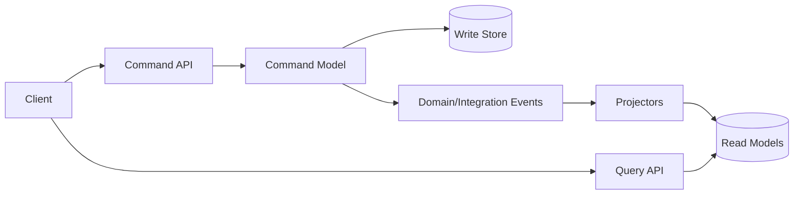
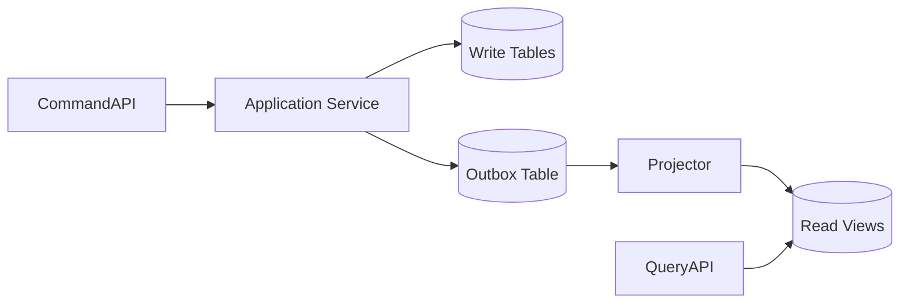
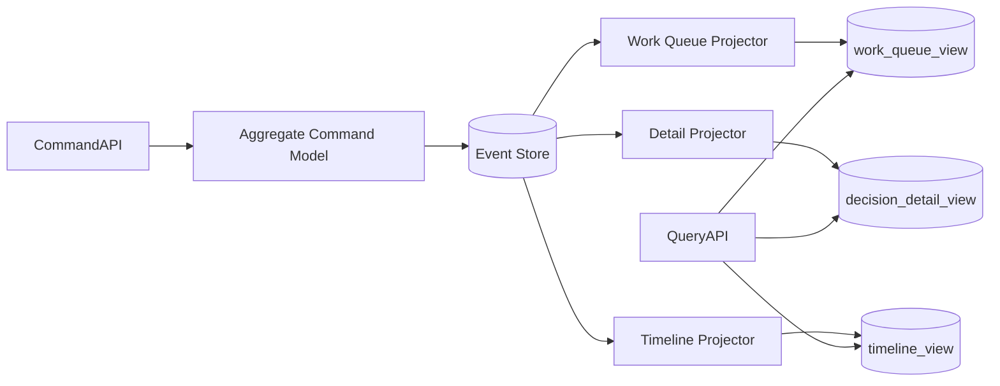
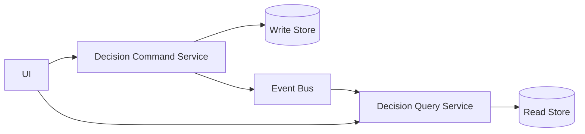
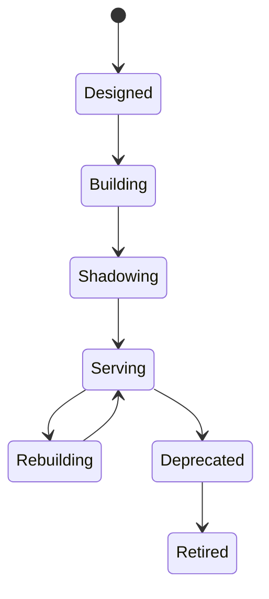
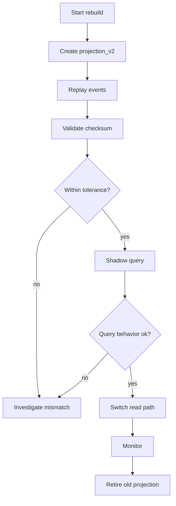

# Part 084 — CQRS Beyond the Diagram

## 1. Core Idea

CQRS means Command Query Responsibility Segregation.

The basic idea is simple:

```text
Use one model to change state.
Use another model to read state.
```

That is all.

CQRS does not automatically mean:

- event sourcing
- Kafka
- two databases
- eventual consistency everywhere
- one service for commands and one service for queries
- hexagonal architecture
- DDD
- sagas
- asynchronous APIs

Those things may appear near CQRS, but they are not CQRS itself.

The dangerous version of CQRS is the diagram version:

```text
Command Service -> Event Bus -> Read Service
```

The production version asks harder questions:

```text
Which command model protects invariants?
Which query model serves which user journey?
How stale may each query be?
How is projection lag measured?
Can read models be rebuilt?
Who owns authorization on the query side?
What happens when projection fails?
Can the system explain why command success is not visible yet?
```

CQRS is useful when the write model and read model want different shapes, different performance, different consistency, or different ownership. It is harmful when used as architecture decoration.

## 2. Why CQRS Exists

A single CRUD model often tries to satisfy two incompatible jobs:

1. enforce business rules during writes
2. serve convenient, fast, rich reads

Those jobs pull the model in different directions.

Write model wants:

- invariant protection
- transaction boundary
- validation
- authorization
- lifecycle rules
- minimal mutation surface
- consistency
- command intent

Read model wants:

- denormalized shape
- joins/materialized data
- sorting/filtering/search
- pagination
- low latency
- client-specific fields
- aggregation
- report-friendly schema

When one model does both, you get compromise:

```text
Domain aggregate grows query helpers.
Repository exposes ad hoc joins.
API returns persistence entities.
Write transaction includes read concerns.
Read endpoint leaks internal write schema.
Every UI request forces domain model contortion.
```

CQRS separates the responsibilities so each side can be optimized honestly.

## 3. Basic CQRS Topology



But topology varies.

CQRS can be implemented:

- inside one process
- inside one service with two packages
- inside one service with separate write/read stores
- across two deployable services
- with synchronous projection update
- with asynchronous event projection
- with event sourcing
- without event sourcing

The pattern is responsibility separation, not a prescribed deployment diagram.

## 4. Command Model

The command model handles intent.

Example command:

```json
{
  "commandId": "cmd-9001",
  "type": "ApproveEnforcementDecision",
  "decisionId": "DEC-2026-00112",
  "approvedBy": "user-117",
  "expectedVersion": 8,
  "reason": "Meets statutory threshold"
}
```

Command model responsibilities:

- parse intent
- authenticate and authorize mutation
- validate command shape
- load required state
- enforce invariant
- execute local transaction
- append outbox/event if needed
- return command result
- record audit evidence

Command model should not optimize for list screens.

Bad command model smell:

```java
public class EnforcementDecision {
    private String caseTitle;
    private String partyName;
    private String officerDisplayName;
    private String latestEvidenceSummary;
    private List<TimelineRow> timeline;
    private List<SearchFacet> facets;

    public void approve(...) { ... }
}
```

This aggregate is polluted by query concerns.

Better:

```java
public final class EnforcementDecision {
    private DecisionId id;
    private DecisionStatus status;
    private PolicyVersion policyVersion;
    private long version;

    public DecisionApproved approve(ApproveDecision command, ApprovalPolicy policy) {
        if (status != DecisionStatus.READY_FOR_APPROVAL) {
            throw new DomainRuleViolation("Decision is not ready for approval");
        }
        policy.verifyApproval(command, this);
        return new DecisionApproved(id, command.approvedBy(), policyVersion, command.reason());
    }
}
```

The write model contains what it needs to protect correctness, not what every screen wants to display.

## 5. Query Model

The query model serves reads.

Example read model:

```sql
CREATE TABLE decision_work_queue_view (
    decision_id          TEXT PRIMARY KEY,
    case_id              TEXT NOT NULL,
    case_title           TEXT NOT NULL,
    party_display_name   TEXT NOT NULL,
    status               TEXT NOT NULL,
    risk_band            TEXT NOT NULL,
    assigned_team_id      TEXT NOT NULL,
    due_at               TIMESTAMPTZ,
    days_until_due        INTEGER,
    last_activity_at      TIMESTAMPTZ,
    projection_position   BIGINT NOT NULL,
    updated_at            TIMESTAMPTZ NOT NULL
);
```

This view is not trying to be a normalized domain model. It is shaped for a work queue.

Query model responsibilities:

- fast retrieval
- filtering/sorting/search
- client/user-journey shape
- staleness metadata
- read-side authorization
- pagination stability
- observability of freshness

Query model should not enforce write invariants.

Bad:

```java
if (decisionWorkQueueRow.status().equals("READY")) {
    jdbc.update("update decision_work_queue_view set status='APPROVED' ...");
}
```

That mutates the projection and bypasses the authority.

Good:

```text
Query API shows READY.
User sends ApproveDecision command.
Command model validates and commits.
Projector updates view.
```

## 6. CQRS Without Event Sourcing

CQRS can use a normal relational write model and outbox.



This is often the pragmatic starting point.

Write transaction:

```text
update decision table
insert decision_approval audit row
insert outbox event DecisionApproved
commit
```

Projector:

```text
read outbox/broker event
update decision_work_queue_view
update decision_detail_view
checkpoint event position
```

Advantages:

- easier for teams used to relational modeling
- lower conceptual load than event sourcing
- good fit when current state is source of truth
- still allows optimized read models

Costs:

- historical reconstruction depends on audit/outbox quality
- projections may drift if outbox missing
- write schema and event schema both need governance

## 7. CQRS With Event Sourcing

CQRS is commonly paired with event sourcing because event streams feed projections naturally.



Use this when:

- historical facts are source of truth
- multiple read models must be rebuilt
- audit/reconstruction is core
- write model is lifecycle/event-heavy

Do not use it merely because CQRS sounds incomplete without event sourcing.

CQRS can be valuable even if the write side is plain SQL.

## 8. CQRS Inside One Java Service

Start simple.

```text
com.example.enforcement
  command
    api
    application
    domain
    persistence
  query
    api
    projection
    model
    persistence
  shared
    ids
    errors
    telemetry
```

One deployable service, two internal models.

Advantages:

- simpler deployment
- shared ownership
- easier transaction/outbox integration
- less distributed failure
- good stepping stone

Rules:

- command package cannot depend on query package
- query package cannot mutate command tables
- read model is derived/rebuildable
- API distinguishes command endpoints from query endpoints
- tests verify dependency direction

ArchUnit-style rule:

```java
@AnalyzeClasses(packages = "com.example.enforcement")
class CqrsArchitectureTest {
    @ArchTest
    static final ArchRule commandDoesNotDependOnQuery = noClasses()
        .that().resideInAPackage("..command..")
        .should().dependOnClassesThat().resideInAPackage("..query..");

    @ArchTest
    static final ArchRule queryDoesNotUseCommandRepositories = noClasses()
        .that().resideInAPackage("..query..")
        .should().dependOnClassesThat().resideInAPackage("..command.persistence..");
}
```

## 9. CQRS Across Services

Sometimes command and query are separate deployable services.



Use separate deployables when:

- query load is massive and independent
- read model needs different runtime/storage/search technology
- query consumers have different SLOs
- read team ownership is distinct and justified
- command side must be isolated from expensive reads

Avoid separate deployables when:

- team cannot operate more services
- query model is simple
- staleness is unacceptable and hard to explain
- authorization logic would be duplicated badly
- deployment independence is fake

A separate query service is not automatically better architecture. It is another operational unit.

## 10. Command API Design

Commands should express intent.

Bad CRUD-style mutation:

```http
PATCH /decisions/DEC-1
{
  "status": "APPROVED"
}
```

Better task-oriented command:

```http
POST /decisions/DEC-1/approval-requests
Idempotency-Key: cmd-9001
If-Match: "version-8"

{
  "reason": "Meets statutory threshold",
  "policyVersion": "ENF-POLICY-2026.04"
}
```

Response options:

Synchronous local commit:

```http
200 OK
{
  "decisionId": "DEC-1",
  "status": "APPROVED",
  "version": 9
}
```

Asynchronous command accepted:

```http
202 Accepted
{
  "commandId": "cmd-9001",
  "statusUrl": "/commands/cmd-9001",
  "expectedReadModelPosition": 802711
}
```

Command API should define:

- idempotency behavior
- optimistic concurrency behavior
- validation errors
- domain rejection errors
- command status if async
- audit metadata
- expected read freshness if relevant

## 11. Query API Design

Query endpoints should match user tasks.

Example work queue:

```http
GET /decision-work-queue?teamId=TEAM-7&status=READY_FOR_APPROVAL&sort=dueAt&pageSize=50&pageToken=...
```

Response:

```json
{
  "items": [
    {
      "decisionId": "DEC-2026-00112",
      "caseId": "CASE-2026-00091",
      "caseTitle": "Regional enforcement review",
      "partyDisplayName": "Acme Trading Ltd",
      "riskBand": "HIGH",
      "dueAt": "2026-07-07T09:00:00Z",
      "status": "READY_FOR_APPROVAL"
    }
  ],
  "page": {
    "nextPageToken": "..."
  },
  "freshness": {
    "projectionPosition": 802700,
    "lagSeconds": 2,
    "asOf": "2026-07-05T10:15:32Z"
  }
}
```

Query API should define:

- filters
- stable sort
- pagination semantics
- stale-read contract
- field-level authorization
- response freshness metadata
- maximum page size
- caching behavior
- partial-data behavior

## 12. Consistency Contracts

CQRS forces you to be honest about read-after-write behavior.

### 12.1 Strong Read-After-Write

Command response only returns after read model catches up.

Good for:

- low-volume admin command
- local projection
- user expects immediate screen update

Bad for:

- high-latency projectors
- remote query service
- many projections
- global fan-out

### 12.2 Bounded Staleness

Query may lag but within an SLO.

```text
Decision work queue must reflect command events within 5 seconds at p99.
```

This requires metrics.

### 12.3 Explicit Pending State

UI treats command success and query visibility separately.

```text
Approval submitted.
Work queue update pending.
```

### 12.4 Catch-Up Token

Command response returns a position/version. Query can indicate whether it has caught up.

```json
{
  "decisionId": "DEC-1",
  "committedPosition": 802711
}
```

Query response:

```json
{
  "freshness": {
    "projectionPosition": 802711,
    "caughtUpToRequestedPosition": true
  }
}
```

### 12.5 Command-Side Read for One Aggregate

For immediate detail view, you can sometimes read from write model/aggregate after command.

Use carefully. Do not bypass query model for complex lists/search.

## 13. Projection Lifecycle

Read models have a lifecycle.



Lifecycle states:

| State | Meaning |
|---|---|
| Designed | query shape and source events defined |
| Building | projector under development |
| Shadowing | projection built but not serving users |
| Serving | production read path |
| Rebuilding | projection being rebuilt or migrated |
| Deprecated | consumers moving away |
| Retired | projection removed |

Read model governance matters because stale projections become hidden sources of truth.

## 14. Projection Implementation Pattern

```java
public final class DecisionWorkQueueProjector {
    private final DecisionWorkQueueRepository repository;
    private final ProjectionCheckpointStore checkpointStore;

    public void on(EventEnvelope envelope) {
        if (checkpointStore.hasProcessed("decision-work-queue", envelope.position())) {
            return;
        }

        switch (envelope.event()) {
            case DecisionDrafted e -> repository.insertDraft(e.decisionId(), e.caseId(), envelope.position());
            case DecisionMarkedReady e -> repository.markReady(e.decisionId(), e.dueAt(), envelope.position());
            case DecisionApproved e -> repository.removeFromQueue(e.decisionId(), envelope.position());
            case DecisionRejected e -> repository.removeFromQueue(e.decisionId(), envelope.position());
            case CaseRiskBandChanged e -> repository.updateRiskBand(e.caseId(), e.riskBand(), envelope.position());
            default -> { }
        }

        checkpointStore.markProcessed("decision-work-queue", envelope.position());
    }
}
```

Important:

- checkpoint update must be transactional with projection update where possible
- duplicate events must be safe
- event ordering assumptions must be documented
- unknown event handling must be explicit
- poison event handling must not silently skip required facts

## 15. Checkpointing

Checkpointing records how far a projection has processed.

```sql
CREATE TABLE projection_checkpoint (
    projection_name       TEXT PRIMARY KEY,
    last_position         BIGINT NOT NULL,
    updated_at            TIMESTAMPTZ NOT NULL
);
```

For partitioned streams:

```sql
CREATE TABLE projection_checkpoint (
    projection_name       TEXT NOT NULL,
    partition_id          TEXT NOT NULL,
    last_offset           BIGINT NOT NULL,
    updated_at            TIMESTAMPTZ NOT NULL,
    PRIMARY KEY(projection_name, partition_id)
);
```

Checkpoint rules:

- update after successful projection mutation
- do not mark processed before side effect is durable
- store enough information to resume
- expose lag metric
- support replay from checkpoint or from zero

## 16. Rebuildability

A read model is production-grade only if it can be rebuilt.

Rebuild process:

```text
1. Create new projection table/index with version suffix.
2. Replay source events/messages into new projection.
3. Compare counts/checksums/sample rows.
4. Run shadow queries against new projection.
5. Switch query API to new projection.
6. Keep old projection temporarily for rollback.
7. Retire old projection after confidence window.
```

Mermaid:



If rebuild requires manual SQL surgery every time, the architecture is not mature.

## 17. Read Model Storage Choices

CQRS allows different storage per query model.

| Need | Possible storage | Risk |
|---|---|---|
| simple lookup | relational table | schema drift |
| work queue | relational + indexes | stale priority/due fields |
| full-text search | search index | eventual consistency/search lag |
| timeline | append-friendly table/document | large records |
| analytics | warehouse/lakehouse | operational/analytical confusion |
| graph navigation | graph database | query semantics split |
| cache-like view | Redis | data loss/rebuild expectation |

Do not choose storage because it is fashionable. Choose based on query shape, SLO, update pattern, rebuild complexity, and operational maturity.

## 18. Authorization in CQRS

A dangerous assumption:

```text
Authorization is enforced on command side, so query side is safe.
```

Wrong.

Read models expose data. Query side needs authorization too.

Authorization questions:

```text
Can this user see this row?
Can this user see this field?
Can this user see this tenant?
Can this user see historical/redacted data?
Can this user search by this attribute?
Can this user export results?
```

Projection may include security fields:

```sql
CREATE TABLE decision_work_queue_view (
    decision_id        TEXT PRIMARY KEY,
    tenant_id          TEXT NOT NULL,
    assigned_team_id   TEXT NOT NULL,
    visibility_scope   TEXT NOT NULL,
    sensitivity_level   TEXT NOT NULL,
    status             TEXT NOT NULL,
    due_at             TIMESTAMPTZ
);
```

Query filter:

```sql
SELECT *
FROM decision_work_queue_view
WHERE tenant_id = :tenantId
  AND assigned_team_id = ANY(:userTeamIds)
  AND sensitivity_level <= :maxSensitivity
ORDER BY due_at ASC
LIMIT :limit;
```

Security must be projected intentionally, not bolted on after the read model leaks data.

## 19. CQRS and API Composition

CQRS and API Composition solve related but different problems.

API Composition:

```text
At request time, call several services and combine response.
```

CQRS read model:

```text
Before request time, consume changes and build query-optimized view.
```

Comparison:

| Concern | API Composition | CQRS Read Model |
|---|---|---|
| freshness | high if dependencies available | possibly stale |
| latency | fan-out dependent | usually fast |
| availability | depends on downstream calls | can serve cached/materialized view |
| complexity | runtime composition | projection lifecycle |
| data duplication | low | intentional duplication |
| failure mode | dependency failure at query time | projection lag/drift |
| best for | low volume, few services | high volume, complex query/search/list |

Decision rule:

```text
If query is rare, simple, and freshness-critical, use composition.
If query is frequent, expensive, user-facing, and shape-specific, use read model.
```

## 20. CQRS and Reporting

Do not confuse operational CQRS read models with analytics/reporting.

Operational read model:

- supports application screen/API
- low latency
- small bounded query
- strict authorization
- near-real-time
- owned by service or product area

Analytical model:

- supports trends and reports
- larger scans
- historical aggregation
- warehouse/lakehouse
- analytical governance
- data quality rules

Bad:

```text
BI dashboard queries production read model with huge date range.
```

Good:

```text
Operational read model serves UI.
Data product/warehouse serves analytics.
Both are sourced from contracted events/CDC with lineage.
```

## 21. Event Ordering and Idempotency

Read models often assume order.

If events arrive out of order, projection may regress state.

Use version guard:

```java
public void markReady(DecisionMarkedReady event, long streamVersion) {
    repository.updateIfNewer(
        event.decisionId(),
        row -> row.status("READY_FOR_APPROVAL"),
        streamVersion
    );
}
```

SQL sketch:

```sql
UPDATE decision_detail_view
SET status = :status,
    source_version = :sourceVersion
WHERE decision_id = :decisionId
  AND source_version < :sourceVersion;
```

But global projections that combine multiple sources need more careful logic.

Example:

```text
DecisionMarkedReady from Decision Service
CaseRiskBandChanged from Case Service
PartyNameCorrected from Party Service
```

There may be no single global version. You need per-source watermark.

```sql
decision_source_version
case_source_version
party_source_version
```

Idempotency rule:

```text
A projection must produce the same read model if the same event is processed twice.
```

## 22. Projection Drift

Projection drift means the read model no longer matches source truth.

Causes:

- projector bug
- missed event
- skipped poison event
- manual projection update
- schema change without projector update
- out-of-order event handling bug
- partial replay
- bad checkpoint
- external enrichment changed

Detection:

- count reconciliation
- checksum reconciliation
- sampled source-vs-read comparison
- synthetic event replay
- shadow projection
- stale row detector
- per-projection lag alert

Drift remediation:

```text
pause serving if unsafe
fix projector
rebuild projection
compare checksums
switch read path
record incident evidence
```

Never fix drift by manually editing read rows without recording why. That creates a hidden source of truth.

## 23. Query Freshness Metrics

Expose freshness to operators and sometimes consumers.

Metrics:

```text
projection_lag_seconds{projection="decision-work-queue"}
projection_lag_events{projection="decision-work-queue"}
projection_last_processed_position{projection="decision-work-queue"}
projection_error_total{projection="decision-work-queue", eventType="DecisionApproved"}
projection_rebuild_duration_seconds{projection="decision-work-queue"}
query_latency_seconds{endpoint="decision-work-queue"}
query_result_stale_total{endpoint="decision-work-queue"}
```

SLO example:

```text
99% of DecisionApproved events are visible in decision_detail_view within 3 seconds over 30 days.
```

Alert example:

```text
Page if projection lag > 60 seconds for 10 minutes for a user-facing read model.
Ticket if projection lag > 10 seconds for 30 minutes for non-critical read model.
```

## 24. Java Implementation: Command Side

```java
@RestController
@RequestMapping("/decisions/{decisionId}")
public final class DecisionCommandController {
    private final ApproveDecisionHandler handler;

    @PostMapping("/approval-requests")
    public ResponseEntity<ApproveDecisionResponse> approve(
        @PathVariable String decisionId,
        @RequestHeader("Idempotency-Key") String idempotencyKey,
        @RequestHeader("If-Match") String ifMatch,
        @RequestBody ApproveDecisionRequest request,
        Principal principal
    ) {
        ApproveDecision command = new ApproveDecision(
            new DecisionId(decisionId),
            new UserId(principal.getName()),
            request.reason(),
            ExpectedVersion.fromIfMatch(ifMatch),
            new IdempotencyKey(idempotencyKey)
        );

        ApproveDecisionResult result = handler.handle(command);
        return ResponseEntity.ok(new ApproveDecisionResponse(
            result.decisionId().value(),
            result.newVersion(),
            result.committedPosition()
        ));
    }
}
```

Handler:

```java
public final class ApproveDecisionHandler {
    private final DecisionRepository repository;
    private final Outbox outbox;
    private final TransactionTemplate tx;
    private final IdempotencyStore idempotencyStore;

    public ApproveDecisionResult handle(ApproveDecision command) {
        return idempotencyStore.execute(command.idempotencyKey(), () ->
            tx.execute(status -> {
                EnforcementDecision decision = repository.getForUpdate(command.decisionId());
                decision.assertVersion(command.expectedVersion());

                DecisionApproved event = decision.approve(command);

                repository.save(decision);
                long position = outbox.append(event, Metadata.from(command));

                return new ApproveDecisionResult(decision.id(), decision.version(), position);
            })
        );
    }
}
```

## 25. Java Implementation: Query Side

```java
@RestController
@RequestMapping("/decision-work-queue")
public final class DecisionWorkQueueController {
    private final DecisionWorkQueueQueryService queryService;

    @GetMapping
    public WorkQueueResponse search(
        @RequestParam String teamId,
        @RequestParam Optional<String> status,
        @RequestParam Optional<String> pageToken,
        @RequestParam(defaultValue = "50") int pageSize,
        Principal principal
    ) {
        WorkQueueQuery query = new WorkQueueQuery(
            new TeamId(teamId),
            status.map(DecisionStatus::valueOf),
            PageRequest.from(pageToken, pageSize),
            UserContext.from(principal)
        );

        return queryService.search(query);
    }
}
```

Query service:

```java
public final class DecisionWorkQueueQueryService {
    private final DecisionWorkQueueRepository repository;
    private final QueryAuthorizer authorizer;
    private final ProjectionFreshnessService freshnessService;

    public WorkQueueResponse search(WorkQueueQuery query) {
        authorizer.assertCanViewTeamQueue(query.user(), query.teamId());

        Page<DecisionWorkQueueRow> rows = repository.search(
            query.teamId(),
            query.status(),
            query.page()
        );

        ProjectionFreshness freshness = freshnessService.get("decision-work-queue");

        return WorkQueueResponse.from(rows, freshness);
    }
}
```

The query service does not call command repositories.

## 26. CQRS and Transactions

Command side owns transactions.

Read side normally updates projections in separate transactions.

Command transaction:

```text
validate command
update write store
insert outbox event
commit
```

Projection transaction:

```text
read event
upsert read model
update checkpoint
commit
```

Do not stretch one transaction across write model and every read model if projections are independent. That recreates a distributed monolith inside one database.

Exception:

A local synchronous projection may be updated in same transaction if:

- it is inside same service/store
- it is critical for immediate read-after-write
- it is rebuildable
- it does not trigger remote side effects
- it does not create lock contention

## 27. CQRS Failure Modes

| Failure mode | Cause | Prevention |
|---|---|---|
| CQRS everywhere | cargo cult | apply decision matrix |
| query model becomes source of truth | manual writes/read-side mutation | read-only projection discipline |
| stale data surprises users | no consistency contract | freshness metadata/pending UI |
| projection silently stops | weak monitoring | lag/error alerts |
| authorization missing on read side | command-only security thinking | query-side auth design |
| too many read models | per-screen over-fragmentation | query model lifecycle governance |
| read model cannot rebuild | hidden manual fixes | rebuild tests/checkpoints |
| event schema breaks projector | no contract tests | schema compatibility tests |
| synchronous CQRS too slow | all projections in command transaction | async projections/deadline budget |
| separate query service too early | architecture inflation | start in one deployable |

## 28. Decision Matrix

Use CQRS when:

| Signal | Low | High |
|---|---|---|
| query complexity | simple by-id reads | complex list/search/report views |
| read/write asymmetry | similar load | reads dominate writes |
| model mismatch | same shape works | write/read shapes conflict |
| performance need | normal CRUD ok | denormalized/indexed view needed |
| consistency tolerance | must be immediate | bounded staleness acceptable |
| read model rebuild | not needed | valuable/expected |
| team maturity | low | can operate projection lag/rebuild |
| storage specialization | none | search/cache/reporting read store needed |

Recommendation:

```text
Use plain CRUD when write/read model fit is good.
Use internal CQRS when read and write responsibilities are diverging.
Use separate read model when query performance/shape demands it.
Use separate query service only when deployment/scale/ownership justify it.
Use event sourcing only when event history should be source of truth.
```

## 29. CQRS Anti-Patterns

### 29.1 Two Services for Every Entity

Bad:

```text
CaseCommandService
CaseQueryService
PartyCommandService
PartyQueryService
EvidenceCommandService
EvidenceQueryService
```

This creates service sprawl without proven benefit.

Start with internal separation. Extract only when runtime/ownership evidence demands it.

### 29.2 Read Model as Public Database

Bad:

```text
Every team directly queries decision_work_queue_view.
```

The read model becomes a shared database contract.

Better:

```text
Expose query API or published data product.
Keep read store private to owning service/query service.
```

### 29.3 Event Soup

Bad:

```text
Every field change emits event.
Every read model listens to everything.
Nobody owns semantics.
```

Better:

```text
Events represent domain facts.
Read models subscribe to relevant facts.
Event catalog documents meaning and owner.
```

### 29.4 Fake Eventual Consistency

Bad:

```text
It will be eventually consistent.
No lag metric.
No user explanation.
No reconciliation.
No retry handling.
```

Better:

```text
Projection lag SLO.
Freshness metadata.
Retry-safe projectors.
Rebuild runbook.
```

### 29.5 Duplicated Authorization Logic Without Policy Ownership

Bad:

```text
Command service and query service implement separate hard-coded authorization rules.
```

Better:

```text
Shared policy decision model or policy service/library with versioned tests.
Projected visibility fields.
Query-side enforcement.
```

## 30. Architecture Review Checklist

```text
[ ] Why is CQRS needed here?
[ ] What pain exists in the unified model?
[ ] What is the command model responsible for?
[ ] What invariants does the command model protect?
[ ] What query journeys does the read model serve?
[ ] What is the freshness/staleness contract?
[ ] Is read-after-write behavior documented?
[ ] How are read models built?
[ ] Are projectors idempotent?
[ ] Is projection lag measured?
[ ] Can read models be rebuilt?
[ ] Who owns query-side authorization?
[ ] Are sensitive fields minimized in read models?
[ ] How are event/schema changes tested?
[ ] What happens when projection fails?
[ ] Is CQRS internal or separate deployable? Why?
[ ] Is API composition a simpler alternative?
[ ] Is event sourcing necessary, or is outbox enough?
```

## 31. ADR Template

```md
# ADR: Apply CQRS for <Capability/Use Case>

## Context
- Current model pain:
- Query workload:
- Write invariants:
- Performance/SLO requirement:
- Consistency requirement:

## Decision
We will apply CQRS by separating ...

## Command Model
- Command endpoints:
- Invariants:
- Transaction boundary:
- Idempotency/concurrency:

## Query Model
- Query endpoints:
- Read models:
- Storage:
- Filters/sorting/pagination:
- Authorization:

## Projection Model
- Source events/outbox/CDC:
- Projectors:
- Checkpointing:
- Rebuild strategy:
- Lag SLO:

## Consistency Contract
- Read-after-write behavior:
- Bounded staleness:
- UX handling:

## Alternatives Rejected
- CRUD model:
- API composition:
- Reporting warehouse:
- Event sourcing:

## Consequences
- Benefits:
- Added complexity:
- Operational burden:
- New failure modes:
```

## 32. Practical Rule of Thumb

CQRS is not an architecture badge.

Use it when it removes real tension:

```text
The write model is becoming too strict for queries.
The read model is becoming too denormalized for writes.
The same model cannot satisfy correctness and query performance cleanly.
```

Do not use it when:

```text
The team only needs simple CRUD.
The read model would be copied blindly from write tables.
No one can define staleness tolerance.
No one will operate projection lag and rebuild.
```

The mature CQRS mindset:

```text
Commands protect truth.
Queries serve experience.
Projections connect them with explicit consistency and operational contracts.
```

## 33. Final Mental Model

A senior engineer does not ask:

```text
Should we use CQRS because microservices do CQRS?
```

They ask:

```text
Where are reads and writes pulling the model in different directions?
What is the cheapest separation that resolves the tension?
Can the team operate the consistency gap introduced by that separation?
```

CQRS is valuable when it makes responsibility sharper.

CQRS is harmful when it makes a simple system distributed, stale, and harder to reason about without a compensating benefit.

## References

- Martin Fowler — CQRS: https://martinfowler.com/bliki/CQRS.html
- Martin Fowler — Event Sourcing: https://martinfowler.com/eaaDev/EventSourcing.html
- Azure Architecture Center — CQRS Pattern: https://learn.microsoft.com/en-us/azure/architecture/patterns/cqrs
- Azure Architecture Center — Event Sourcing Pattern: https://learn.microsoft.com/en-us/azure/architecture/patterns/event-sourcing
- microservices.io — CQRS Pattern: https://microservices.io/patterns/data/cqrs.html
- microservices.io — Event Sourcing Pattern: https://microservices.io/patterns/data/event-sourcing.html
