# Part 085 — Workflow Engine as Service Coordinator

> Target utama part ini: kamu bisa membedakan kapan proses lintas service cukup dikelola dengan event choreography, kapan butuh orchestrator ringan, dan kapan butuh workflow engine durable seperti Camunda/Temporal-style runtime.

Microservices memaksa kita memecah ownership. Tetapi bisnis sering berjalan sebagai **proses panjang**: submit case, validate evidence, assign investigator, wait for response, escalate after SLA, request approval, issue decision, notify affected parties, open appeal window, close case.

Kalau proses seperti ini disebar menjadi puluhan event handler tanpa model proses eksplisit, sistem terlihat "decoupled" di diagram, tetapi sulit dijawab saat produksi:

- case ini sedang di step mana?
- siapa yang sedang menunggu siapa?
- timer SLA mana yang aktif?
- retry ini aman atau akan menggandakan side effect?
- compensation apa yang sudah dijalankan?
- keputusan mana yang membuat workflow masuk state ini?
- bagaimana membuktikan ke auditor bahwa proses berjalan sesuai policy?

Workflow engine bukan jawaban untuk semua integrasi. Tetapi untuk **long-running, stateful, auditable, cross-service business process**, workflow engine sering lebih jujur daripada menyembunyikan state process di callback, message handler, database flag, dan cron job.

---

## 1. Mental Model

### 1.1 Service owns capability, workflow owns process state

Service boundary tetap berdasarkan capability dan data authority. Workflow engine tidak boleh menjadi "god service" yang mengambil alih domain ownership.

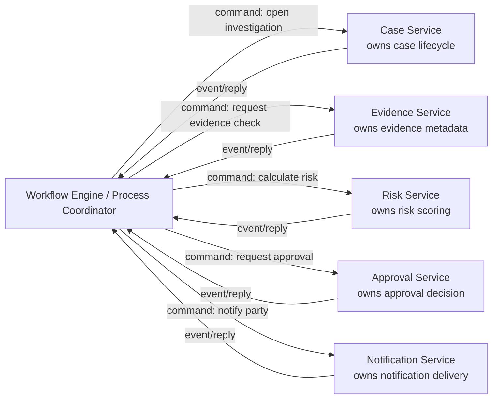

Rule:

- **Service owns business capability.**
- **Workflow owns sequencing.**
- **Domain service owns domain invariant.**
- **Workflow should not directly mutate another service database.**
- **Workflow should not become the only place where business rules live.**

A good workflow says:

> "After evidence is accepted, request risk scoring. If risk is high, request senior approval. If no approval after 3 business days, escalate."

A bad workflow says:

> "Set `case.status = REVIEWING`, insert evidence row, update risk_score column, set approval_state, and send email."

The first coordinates capabilities. The second bypasses ownership.

---

## 2. Why Workflow Engines Exist

A distributed business process needs several hard things:

| Problem | Hidden implementation without workflow engine | Workflow engine responsibility |
|---|---|---|
| Durable state | Status columns, scheduled jobs, adhoc tables | Persist workflow state and execution history |
| Timer | Cron polling, delayed queue, scheduler table | Durable timers |
| Retry | Manual retry loops | Retry policy per activity/task |
| Human wait | "pending" flags everywhere | User task / signal / external event wait |
| Visibility | Manual admin screens | Process instance / workflow execution view |
| Compensation | Adhoc recovery scripts | Explicit compensation path |
| Versioning | Conditional code branches | Process/workflow versioning strategy |
| Audit | Logs reconstructed after the fact | Execution history plus domain audit events |

Temporal describes workflow execution as durable, reliable, scalable function execution. Camunda models a process in BPMN, deploys it as process definition, and executes it as process instance. Those are different programming models, but both solve the same category: **durable coordination over time**.

---

## 3. When You Need a Workflow Engine

Use a workflow engine when at least several of these are true:

1. The process lasts longer than one request.
2. The process crosses multiple services or external systems.
3. The process waits for humans, timers, or external callbacks.
4. The process needs visible state for operations/support.
5. The process has SLA/escalation rules.
6. The process has compensation or rollback-like business action.
7. The process needs audit evidence.
8. The process evolves frequently.
9. Restarting the coordinator must not lose progress.
10. Business stakeholders need to understand the process shape.

Examples:

- regulatory enforcement lifecycle
- loan approval
- insurance claim handling
- account onboarding with KYC/AML
- order fulfillment with payment, stock, shipping, cancellation
- incident response workflow
- entitlement provisioning
- complaint handling
- legal hold / evidence preservation
- data subject request processing

---

## 4. When You Probably Do Not Need a Workflow Engine

Do not add a workflow engine only because the architecture diagram looks impressive.

Avoid workflow engine when:

- the process is a simple local transaction
- a single service owns the full lifecycle
- no durable timer/wait is needed
- the process is just ETL or streaming transformation
- the process has no business state that support/ops need to inspect
- the team cannot operate the engine
- the engine would become a centralized bottleneck for every trivial use case

Bad fit:

```text
User clicks "update profile" -> Profile Service validates -> save -> return 200
```

Good fit:

```text
User submits enforcement case -> evidence validation -> investigator assignment ->
party response window -> automatic escalation -> supervisor approval -> final decision
```

---

## 5. Workflow Engine vs Saga vs State Machine

These terms overlap but are not identical.

| Concept | What it is | Scope | Example |
|---|---|---|---|
| State machine | Explicit allowed states/transitions | Often inside one domain | Case moves Draft -> Submitted -> UnderReview |
| Saga | Distributed transaction pattern using local transactions and compensation | Cross-service consistency | Reserve funds, reserve stock, confirm order |
| Workflow | Durable process execution over time | Business process coordination | Investigation process with timers and human tasks |
| Process manager | Custom coordinator that reacts to events and sends commands | Lightweight workflow | OrderProcessManager listens and commands |
| BPMN workflow engine | Visual process model runtime | Human-readable orchestration | Camunda process diagram |
| Durable code workflow | Workflow as deterministic code | Developer-centric orchestration | Temporal workflow class/method |

A workflow engine can implement saga behavior, but not all workflows are sagas. Some workflows mainly coordinate human tasks, timers, and approvals.

---

## 6. Orchestration vs Choreography Revisited

### 6.1 Choreography

Each service reacts to events and publishes next events.

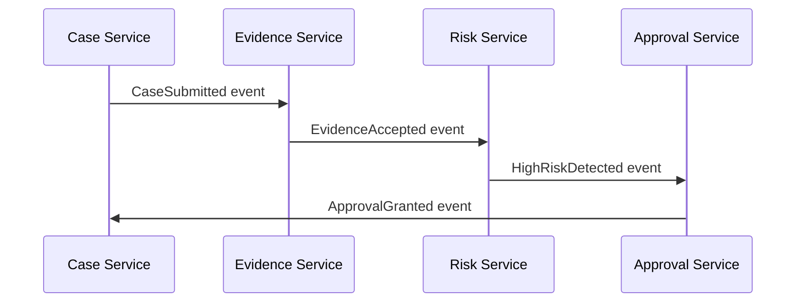

Strength:

- no central coordinator
- services stay autonomous
- works well for simple propagation

Weakness:

- process state is implicit
- hard to answer "where is the case stuck?"
- failure path becomes scattered
- new process branch requires many services to change

### 6.2 Orchestration

A coordinator owns the process sequence.

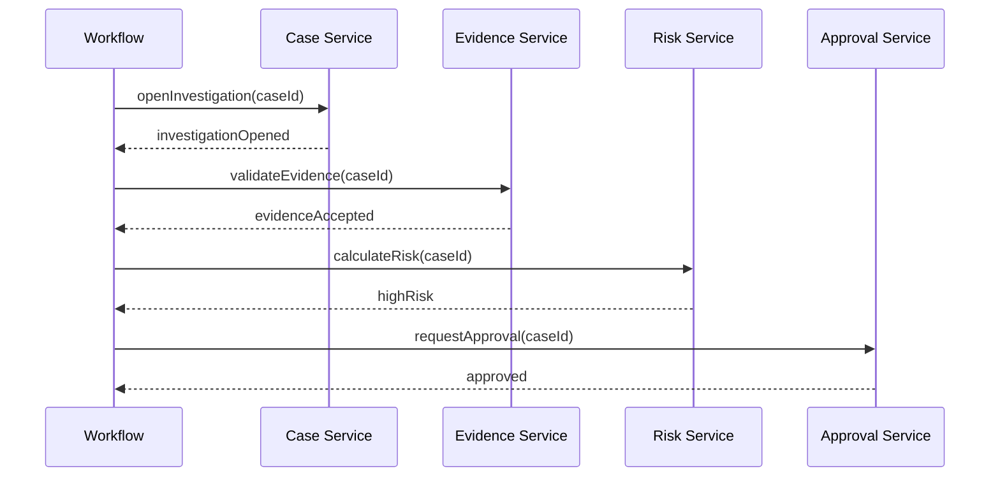

Strength:

- process state explicit
- easier SLA/timer handling
- easier operational visibility
- easier process versioning
- failure and compensation can be modeled centrally

Weakness:

- coordinator can become god service
- too much logic can move out of domain services
- engine/runtime becomes operational dependency
- teams may over-centralize ownership

### 6.3 Rule of thumb

Use choreography for **facts propagation**.

Use orchestration for **process responsibility**.

---

## 7. Workflow Boundary Design

A workflow boundary should be based on a **business process instance**, not a technical request.

Examples:

| Workflow | Natural business key | Completion condition |
|---|---|---|
| EnforcementCaseReviewWorkflow | `caseId` | case approved/rejected/closed |
| EvidenceRequestWorkflow | `evidenceRequestId` | evidence accepted/expired/cancelled |
| ComplaintResolutionWorkflow | `complaintId` | complaint resolved/escalated |
| DataSubjectRequestWorkflow | `requestId` | request fulfilled/rejected/expired |
| AccountOnboardingWorkflow | `onboardingId` | account activated/rejected |

Good workflow boundary:

```text
One workflow instance = one long-running business process.
```

Bad workflow boundary:

```text
One workflow instance = every HTTP request.
```

---

## 8. The Coordinator Must Not Own Other Services' Truth

A workflow can store process state:

```text
case review started
evidence validation requested
risk scoring completed
supervisor approval pending
escalation timer active
```

But it should not become the source of truth for:

```text
case official status
evidence metadata
risk score authority
approval decision
notification delivery status
```

Those belong to capability services.

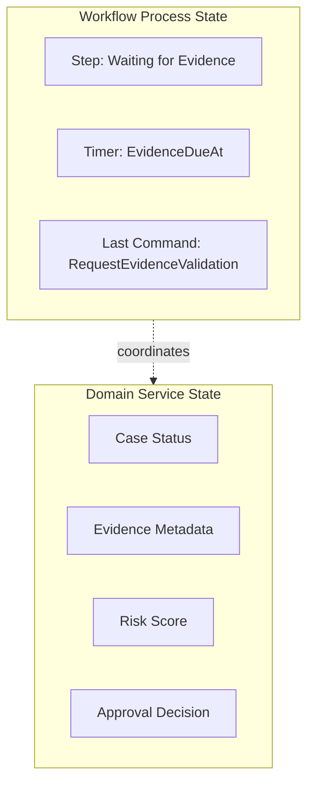

The workflow state is **coordination truth**.

The service state is **domain truth**.

---

## 9. Command, Reply, and Event Design

A workflow should interact with services using explicit commands and replies/events.

Example command:

```json
{
  "commandId": "cmd-2026-00001",
  "workflowId": "case-review-CASE-123",
  "caseId": "CASE-123",
  "requestedBy": "workflow:case-review",
  "expectedCaseVersion": 17,
  "reason": "Evidence accepted; start supervisor review"
}
```

Example reply:

```json
{
  "commandId": "cmd-2026-00001",
  "caseId": "CASE-123",
  "result": "ACCEPTED",
  "newCaseVersion": 18,
  "occurredAt": "2026-07-05T10:15:30Z"
}
```

Important fields:

| Field | Why it matters |
|---|---|
| `commandId` | idempotency and correlation |
| `workflowId` | traceability |
| `businessKey` | support/debug lookup |
| `expectedVersion` | optimistic concurrency |
| `reason` | audit explanation |
| `requestedBy` | actor attribution |
| `occurredAt` | timeline reconstruction |

---

## 10. Workflow State Machine

A workflow engine persists execution state, but you still need to understand the business state machine.

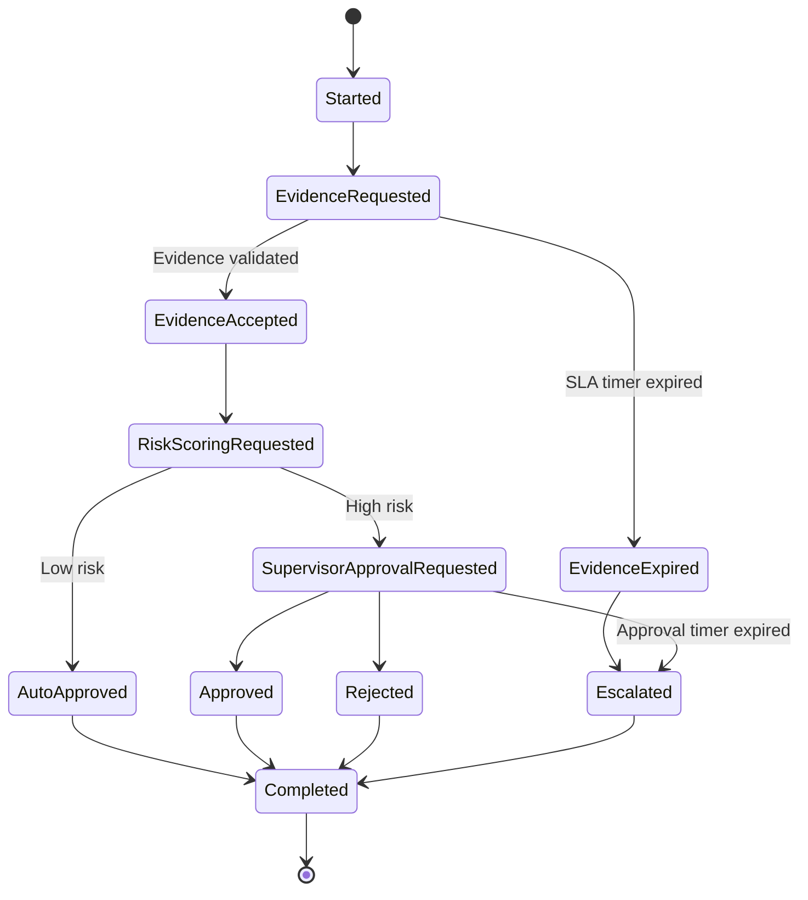

This diagram is not decoration. It answers:

- which transitions are legal?
- which timers exist?
- which states require human action?
- which states require compensation?
- which states are terminal?
- which states must appear in audit evidence?

---

## 11. Timer and SLA Design

Timers are where homegrown workflow systems often fail.

A timer is not merely `sleep(3 days)`.

A production timer must define:

| Timer field | Example |
|---|---|
| Name | `party_response_due` |
| Start condition | `notice_sent` |
| Duration | `14 calendar days` |
| Calendar | business days? holidays? timezone? |
| Pause rule | pause during legal hold? |
| Extension rule | supervisor can extend once |
| Expiry action | escalate to supervisor |
| Audit event | `PARTY_RESPONSE_WINDOW_EXPIRED` |
| Override permission | compliance manager only |

Mermaid timer flow:

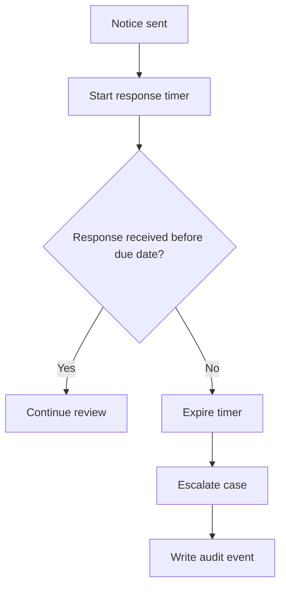

Do not hide SLA semantics in cron names.

Bad:

```text
CaseSlaCronJob runs every hour and updates stale cases.
```

Good:

```text
Workflow waits until responseDueAt, then emits PartyResponseWindowExpired and requests escalation.
```

---

## 12. Human Task Design

Human task is not just "assign to user".

A human task has a lifecycle:

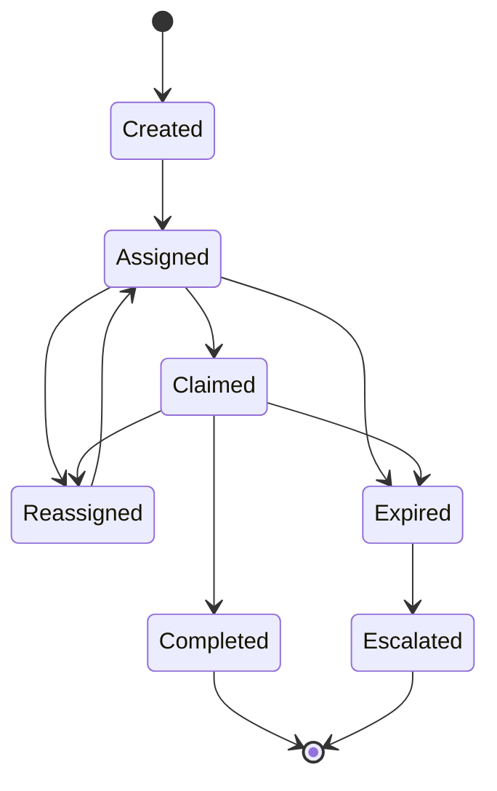

Human task contract:

| Concern | Required decision |
|---|---|
| Assignment | person, group, role, queue |
| Claiming | exclusive or collaborative |
| Deadline | due date, reminder, escalation |
| Authorization | who can view/claim/complete |
| Input | what data is needed |
| Output | decision, comment, attachment, reason |
| Audit | actor, time, decision basis |
| Reassignment | who can reassign and why |
| Cancellation | what happens if process no longer needs it |

Never let human task completion mutate domain state directly from UI unless it passes through domain service command.

```text
UI -> Task Service -> Workflow signal -> Domain command -> Domain service validates invariant
```

---

## 13. Workflow Engine as System of Coordination, Not System of Record

A regulatory case platform may have:

- Case Service as system of record for case lifecycle
- Evidence Service as system of record for evidence metadata
- Decision Service as system of record for regulatory decisions
- Workflow Engine as system of coordination for process execution

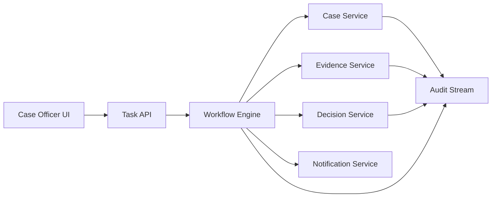

Audit should include both:

- workflow execution events
- domain decision events

Otherwise the audit trail either knows process order but not business facts, or business facts but not process reasoning.

---

## 14. Java Implementation Model: Framework-Neutral Port

Define a workflow-facing port in the application/domain boundary.

```java
public interface CaseReviewProcess {
    ProcessId startReview(StartCaseReviewCommand command);

    void onEvidenceAccepted(EvidenceAcceptedSignal signal);

    void onRiskScoreCalculated(RiskScoreCalculatedSignal signal);

    void onSupervisorDecision(SupervisorDecisionSignal signal);

    ProcessView getProcess(ProcessId processId);
}
```

The port does not mention Temporal, Camunda, Zeebe, BPMN, or workflow vendor types. Those belong to adapter layer.

---

## 15. Java Workflow Command Objects

```java
public record StartCaseReviewCommand(
        String commandId,
        String caseId,
        String submittedBy,
        Instant submittedAt,
        int expectedCaseVersion
) {
    public StartCaseReviewCommand {
        if (commandId == null || commandId.isBlank()) {
            throw new IllegalArgumentException("commandId is required");
        }
        if (caseId == null || caseId.isBlank()) {
            throw new IllegalArgumentException("caseId is required");
        }
    }
}
```

Why command object?

- stable audit shape
- validation at boundary
- testable workflow trigger
- command ID for idempotency
- clear business intent

---

## 16. Temporal-Style Durable Code Workflow

Temporal-style systems express workflow as code. The workflow function must be deterministic because execution can be replayed from history.

Conceptual example:

```java
public class CaseReviewWorkflowImpl implements CaseReviewWorkflow {

    private final CaseActivities caseActivities =
            Workflow.newActivityStub(CaseActivities.class, activityOptions());

    private final EvidenceActivities evidenceActivities =
            Workflow.newActivityStub(EvidenceActivities.class, activityOptions());

    private final ApprovalActivities approvalActivities =
            Workflow.newActivityStub(ApprovalActivities.class, activityOptions());

    @Override
    public void run(CaseReviewInput input) {
        caseActivities.markReviewStarted(input.caseId(), input.commandId());

        EvidenceResult evidence =
                evidenceActivities.validateEvidence(input.caseId());

        if (!evidence.accepted()) {
            caseActivities.markEvidenceRejected(input.caseId(), evidence.reason());
            return;
        }

        RiskResult risk = caseActivities.calculateRisk(input.caseId());

        if (risk.level() == RiskLevel.HIGH) {
            ApprovalResult approval =
                    approvalActivities.requestSupervisorApproval(input.caseId());

            if (approval.approved()) {
                caseActivities.approveCase(input.caseId(), approval.reason());
            } else {
                caseActivities.rejectCase(input.caseId(), approval.reason());
            }
        } else {
            caseActivities.autoApproveLowRiskCase(input.caseId());
        }
    }
}
```

Important discipline:

- Workflow code coordinates.
- Activity code performs side effects.
- Domain service still validates invariant.
- Activity commands must be idempotent.
- Workflow code should not call random non-deterministic APIs directly.
- Timers and retries belong to workflow/activity options.

---

## 17. BPMN/Camunda-Style Process Model

BPMN-style systems express workflow as visual process definition and implement service tasks using workers.

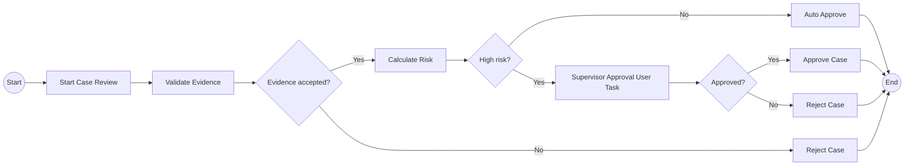

BPMN is useful when:

- business/process analysts need shared visualization
- human tasks and gateways matter
- audit/process instance view is important
- process changes are reviewed separately from service code
- process language helps governance

But BPMN does not remove need for domain boundaries. A service task should call a capability API, not directly change database rows owned by another service.

---

## 18. Worker / Activity Boundary

Worker code must be boring, deterministic in responsibility, and idempotent.

```java
@Component
public class CaseReviewWorker {

    private final CaseClient caseClient;
    private final IdempotencyStore idempotencyStore;

    public CaseReviewWorker(CaseClient caseClient, IdempotencyStore idempotencyStore) {
        this.caseClient = caseClient;
        this.idempotencyStore = idempotencyStore;
    }

    public void startReview(StartReviewJob job) {
        String commandId = job.commandId();

        idempotencyStore.executeOnce(commandId, () -> {
            caseClient.startReview(new StartReviewRequest(
                    commandId,
                    job.caseId(),
                    job.expectedVersion(),
                    "workflow:case-review"
            ));
        });
    }
}
```

Worker principles:

- one job = one clear side effect
- command ID is required
- external call timeout is explicit
- retry-safe by design
- no hidden transaction spanning workflow engine and service database
- telemetry includes workflow instance ID and job/activity name

---

## 19. Idempotency in Workflow Activities

Workflow engines retry. Therefore every activity must be retry-safe.

Bad activity:

```java
void sendNotice(String caseId) {
    emailClient.send("party@example.com", "Notice", "...");
}
```

If the worker crashes after email is sent but before workflow engine records completion, retry can send duplicate notice.

Better activity:

```java
void sendNotice(SendNoticeCommand command) {
    noticeService.sendOnce(
            command.noticeId(),
            command.caseId(),
            command.recipient(),
            command.template()
    );
}
```

The domain/integration service must own idempotency:

```text
noticeId unique
if already sent -> return previous result
if in progress -> reject or wait
if failed retryable -> retry
if failed permanent -> return permanent failure
```

Workflow engine retry is not a substitute for business idempotency.

---

## 20. Compensation Design

Compensation is not database rollback. It is a business action.

Example:

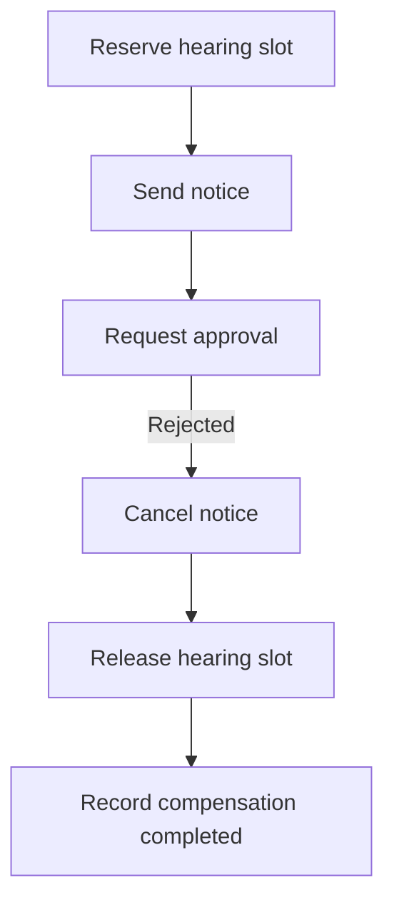

Compensation card:

| Field | Example |
|---|---|
| Original action | `SendNoticeToParty` |
| Compensation | `CancelNoticeAndSendCorrection` |
| Legal meaning | "Notice withdrawn before effective date" |
| Idempotency key | `noticeId` |
| Deadline | before notice effective date |
| Manual fallback | compliance officer review |
| Audit event | `NOTICE_WITHDRAWN` |
| Residual risk | recipient may already have seen notice |

Compensation must be designed with domain people, not only developers.

---

## 21. Workflow Versioning

Long-running workflows can run for days/months. Code and process definitions evolve while old instances are still active.

Problems:

- new workflow code changes branch condition
- task name changes while old jobs exist
- payload shape changes
- timer semantics change
- compensation behavior changes
- old instances need old rules

Versioning strategies:

| Strategy | Use when | Risk |
|---|---|---|
| Keep old workflow definition active | BPMN-style process versioning | more operational complexity |
| Patch/version marker in code | Temporal-style durable code | code clutter |
| Migrate instance | business allows explicit migration | migration bugs |
| Let old instances finish | limited duration workflows | slower cleanup |
| Terminate/restart | low-value process only | data/audit risk |

A workflow versioning ADR must answer:

```text
Which process version applies to already-started cases?
Which version applies to new cases?
Can an in-flight case be migrated?
Who approves migration?
How is audit history preserved?
```

---

## 22. Workflow Data Design

Do not put all domain data into workflow variables/history.

Store:

- business key
- process step
- correlation IDs
- command IDs
- minimal decision outputs
- timer deadlines
- retry/compensation state
- human task IDs
- references to domain records

Avoid storing:

- large evidence documents
- full customer/person profile
- highly sensitive fields
- mutable snapshots that become stale
- large search/reporting payloads

Good:

```json
{
  "caseId": "CASE-123",
  "riskScoreId": "RISK-991",
  "approvalRequestId": "APR-555",
  "responseDueAt": "2026-07-19T17:00:00+07:00"
}
```

Bad:

```json
{
  "case": { "...full case snapshot..." },
  "party": { "...PII..." },
  "evidence": [ "...large documents..." ]
}
```

Workflow engine storage is not your data lake.

---

## 23. Workflow Observability

A workflow needs telemetry at three levels:

### 23.1 Process level

- process started/completed/failed
- step entered/exited
- active state count
- timer count
- stuck workflow count
- retry count
- compensation count
- escalation count

### 23.2 Service call level

- command latency
- command success/failure
- timeout
- retry
- unknown outcome
- dependency saturation

### 23.3 Business level

- cases waiting evidence
- approvals overdue
- escalation rate
- average case age
- SLA compliance
- manual override rate

Example metric names:

```text
workflow_instance_started_total{workflow="case-review"}
workflow_step_duration_seconds{workflow="case-review", step="supervisor-approval"}
workflow_activity_retry_total{activity="request-approval"}
workflow_timer_expired_total{timer="party-response-due"}
workflow_compensation_total{workflow="case-review", reason="approval-rejected"}
```

---

## 24. Workflow Audit Model

Workflow history helps, but regulatory audit usually needs domain-level audit events too.

Minimum audit events:

```text
CASE_REVIEW_STARTED
EVIDENCE_VALIDATION_REQUESTED
EVIDENCE_ACCEPTED
RISK_SCORING_REQUESTED
RISK_SCORE_RECORDED
SUPERVISOR_APPROVAL_REQUESTED
SUPERVISOR_APPROVAL_GRANTED
CASE_DECISION_ISSUED
NOTICE_SENT
CASE_REVIEW_COMPLETED
```

Each event should include:

- event ID
- case ID
- workflow instance ID
- actor or system actor
- command ID
- reason
- policy version
- timestamp
- source service
- trace ID
- previous state
- new state

---

## 25. Workflow Engine Operational Risks

| Risk | Symptom | Prevention |
|---|---|---|
| God workflow | all business rules move into workflow | keep invariants in domain services |
| Engine lock-in | business logic tied to vendor SDK | isolate workflow adapter |
| Hidden side effects | activity retries duplicate actions | idempotent command design |
| Stuck workflows | process waits forever | timers, watchdog metrics |
| Unbounded history | workflow history grows too large | continue-as-new / subprocess / partition |
| Poor versioning | old instances fail after deploy | version markers/process versions |
| PII leakage | sensitive data stored in workflow variables | store references/minimal data |
| No ownership | nobody owns workflow failures | workflow owner in service catalog |
| Over-orchestration | every event becomes a workflow | use decision framework |

---

## 26. Architecture Decision: Engine or No Engine?

Decision matrix:

| Question | Low score | High score |
|---|---|---|
| Duration | seconds | days/months |
| Human task | none | many |
| Timer/SLA | none | business critical |
| Cross-service | one service | many services |
| Audit | low | strict |
| Process visibility | not needed | support/ops need it |
| Compensation | none | explicit |
| Versioning | trivial | complex |
| External callback | none | many |
| Business process ownership | unclear | explicit |

Rule:

```text
If score is high in duration + visibility + timer + audit,
a workflow engine is often justified.
```

---

## 27. Recommended Architecture Template

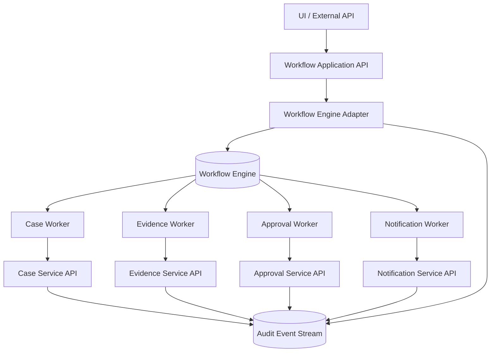

Architecture notes:

- UI does not directly mutate workflow engine internals.
- Application API validates command and starts/signals workflow.
- Workers call service APIs using idempotent commands.
- Domain services remain source of truth.
- Audit event stream receives both workflow and domain events.
- Workflow engine operational dashboard is not the only support view.

---

## 28. Testing Workflow-Based Systems

Test layers:

| Layer | Test |
|---|---|
| Domain service | invariant/unit/component tests |
| Worker/activity | idempotency, timeout, error translation |
| Workflow logic | happy path, timeout, compensation, signal order |
| Contract | workflow command/reply shape |
| Integration | engine + workers + stub services |
| Chaos | worker crash, duplicate command, delayed callback |
| Versioning | old instance after new deploy |
| Audit | reconstruct business timeline |

Important failure tests:

1. Worker crashes after side effect but before completion.
2. Activity times out while domain service actually completed.
3. Signal arrives before workflow reaches wait state.
4. Duplicate external callback arrives.
5. Timer fires while manual completion happens concurrently.
6. Workflow code is deployed while old instance is running.
7. Compensation fails.
8. Domain service rejects command due to invariant violation.
9. Approval task is completed by unauthorized actor.
10. Audit event publication is delayed.

---

## 29. Mini Case Study: Enforcement Escalation Workflow

### 29.1 Business process

A submitted case enters preliminary review. Evidence must be validated within 2 business days. High-risk cases require supervisor approval. If approval is not completed within 1 business day, the case escalates.

### 29.2 Workflow state

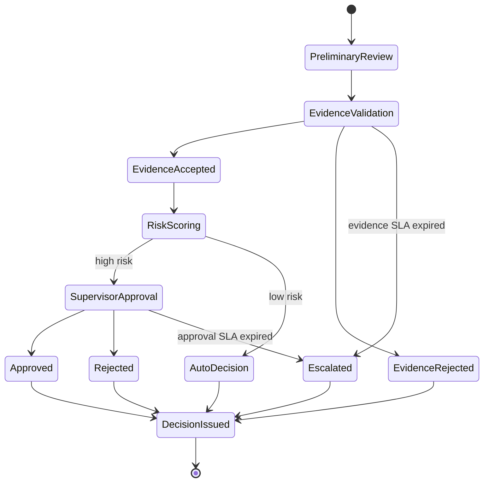

### 29.3 Workflow command set

```text
StartPreliminaryReview
RequestEvidenceValidation
RequestRiskScoring
RequestSupervisorApproval
EscalateCase
IssueDecision
```

### 29.4 Domain events

```text
CaseReviewStarted
EvidenceValidationCompleted
RiskScoreCalculated
SupervisorApprovalGranted
SupervisorApprovalRejected
CaseEscalated
CaseDecisionIssued
```

### 29.5 Review point

The workflow decides **sequence**. The Case Service decides whether `EscalateCase` is legal in current case state.

---

## 30. Workflow Design Checklist

Before approving workflow architecture, answer:

- What business process does one workflow instance represent?
- What is the business key?
- Which service owns each domain state?
- Which state is coordination-only?
- Which commands are sent by workflow?
- Are commands idempotent?
- What are the timer semantics?
- What are the human tasks?
- What are compensation actions?
- What is the workflow versioning strategy?
- What data is stored in workflow variables/history?
- What data must not be stored?
- How is workflow state observable?
- How is audit evidence produced?
- What happens if a worker crashes after side effect?
- What happens if a signal arrives twice?
- What happens if process definition changes mid-flight?
- Who owns workflow incidents?
- What is rollback/failover strategy for workflow runtime?

---

## 31. Common Anti-Patterns

### Anti-pattern 1: Workflow as God Service

Symptoms:

- workflow directly updates multiple databases
- domain rules live in BPMN gateways only
- services become dumb CRUD endpoints
- all business changes require central workflow team

Fix:

- move invariants back to domain services
- workflow sends commands, services validate
- define ownership per command

### Anti-pattern 2: Event Soup Disguised as Choreography

Symptoms:

- no explicit owner for process
- hundreds of event handlers
- no one can answer "where is the case?"
- support uses database queries to infer state

Fix:

- introduce process manager/workflow for high-value processes
- make process state visible
- define business process owner

### Anti-pattern 3: Non-Idempotent Activities

Symptoms:

- duplicate emails
- duplicate payments
- duplicate case assignments
- manual cleanup after retries

Fix:

- command ID everywhere
- idempotency store
- side-effect service returns previous result

### Anti-pattern 4: Workflow Stores Everything

Symptoms:

- PII in workflow variables
- huge payload history
- stale snapshots
- hard deletion/privacy issues

Fix:

- store references
- minimize process variables
- use domain services/read models for data

### Anti-pattern 5: No Versioning Plan

Symptoms:

- old running workflows fail after deploy
- process changes break in-flight cases
- support cannot know which rule applied

Fix:

- version workflow definitions
- preserve policy/process version in audit
- test old instances across deployments

---

## 32. Engineer-Level Summary

Workflow engine is not a magic distributed transaction manager. It is a **durable process coordinator**.

Use it when the business process has long duration, timers, human tasks, compensation, audit needs, and support visibility requirements.

Do not let it steal domain ownership.

A strong design has this invariant:

```text
Workflow owns the process.
Services own the truth.
Audit owns the evidence.
Telemetry owns the diagnosis.
```

If you keep that invariant, workflow engine can make microservices more understandable instead of more centralized.
