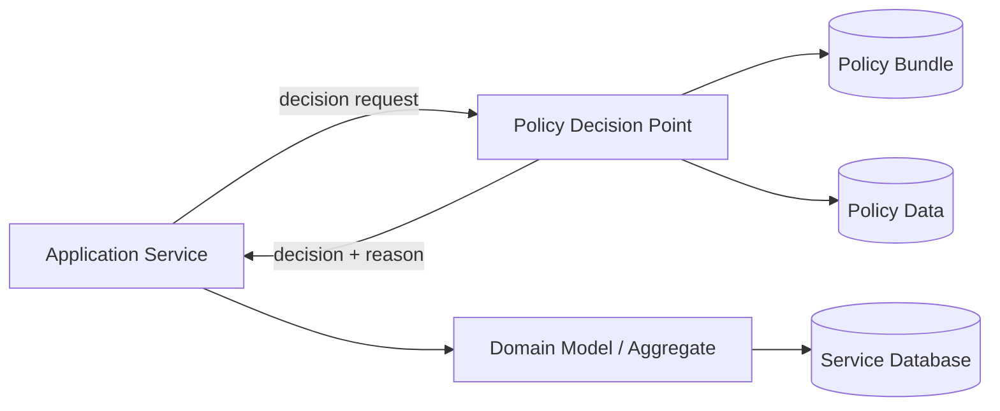
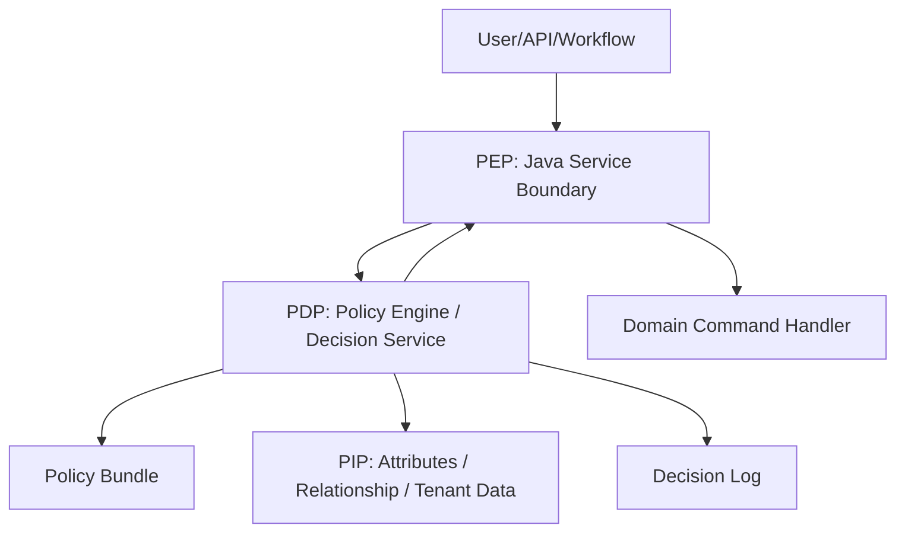
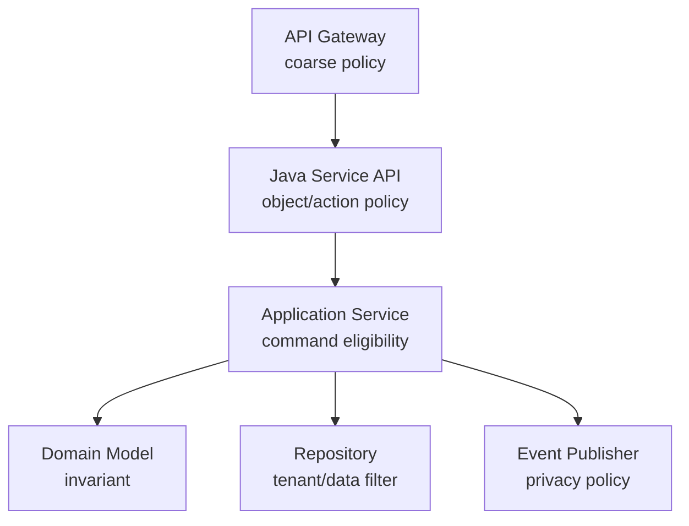
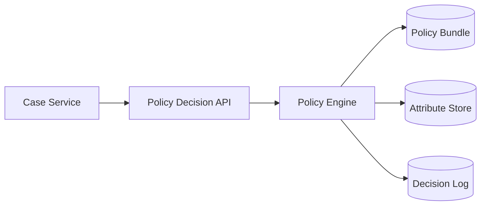
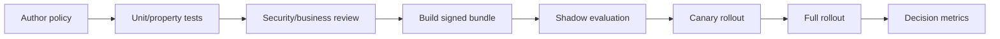
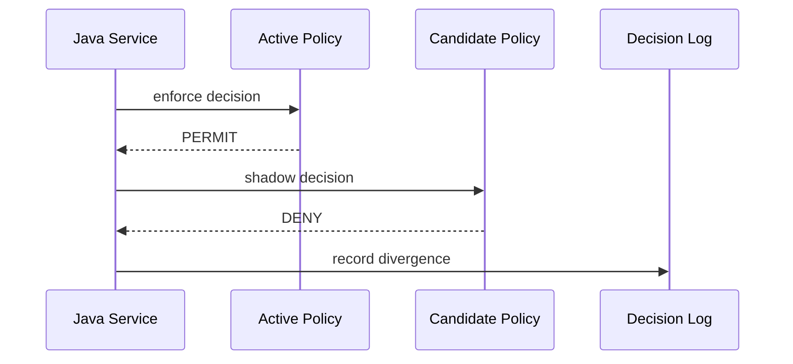
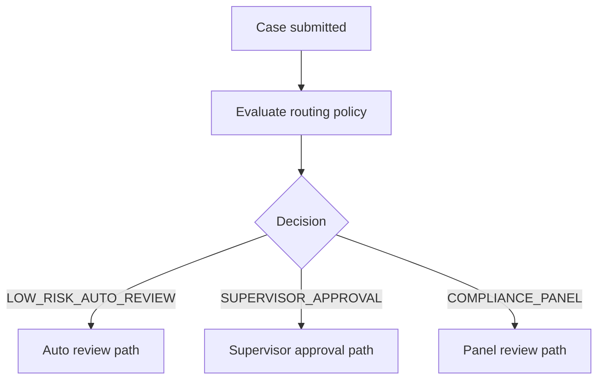
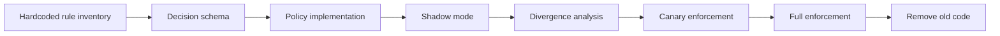
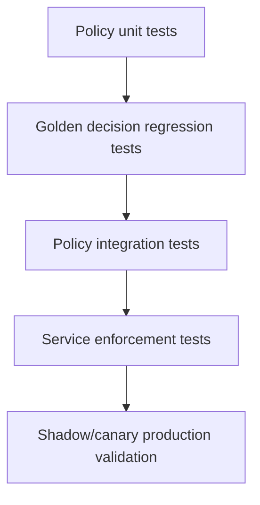

# Part 086 — Policy-Driven Microservices

> Target utama part ini: kamu bisa mendesain microservices yang memisahkan policy decision dari application flow tanpa membuat rule engine menjadi black box, performance bottleneck, atau sumber keputusan yang tidak bisa diaudit.

Banyak sistem enterprise tidak gagal karena kurang controller, kurang entity, atau kurang database table. Mereka gagal karena aturan bisnis dan compliance tersebar di banyak tempat:

- `if user.role == "SUPERVISOR"` di controller
- `if case.amount > 1000000` di service
- `if tenant.region == "EU"` di repository
- `if document.type == "CONFIDENTIAL"` di frontend
- `if riskScore > 80` di workflow gateway
- SQL view dengan implicit filtering
- cron job yang menjalankan exception rule
- manual override tanpa policy version

Akibatnya, saat policy berubah, engineer harus mencari rule di seluruh codebase. Saat auditor bertanya kenapa keputusan dibuat, tim menjawab dari log dan asumsi. Saat security incident terjadi, tidak jelas rule mana yang aktif pada waktu itu.

Policy-driven architecture mencoba membuat aturan eksplisit, versioned, testable, observable, dan enforceable.

---

## 1. Mental Model

Policy adalah aturan keputusan. Policy-driven microservice memisahkan:

```text
Application asks: "Can/should this action happen?"
Policy answers: "Permit/deny/obligate/explain, based on input + policy + data."
Domain service enforces: "Apply decision safely within invariant."
```



Important distinction:

- **Policy decision**: evaluate rule.
- **Policy enforcement**: actually block/allow/modify behavior.
- **Domain invariant**: truth that must remain valid regardless of policy engine.
- **Audit evidence**: proof of which policy produced which decision.

---

## 2. What Counts as Policy?

Policy is not only authorization.

Examples:

| Policy category | Example |
|---|---|
| Authorization | Who may view confidential evidence? |
| Data access | Which fields must be masked for this role/tenant? |
| Workflow routing | Which approval path applies for high-risk case? |
| Escalation | When must a case escalate? |
| Retention | How long should evidence metadata be retained? |
| Notification | Which parties must receive notice? |
| Privacy | Is this data processing purpose allowed? |
| Risk | Does this case require enhanced review? |
| Tenant policy | Which feature/config applies to this tenant? |
| Deployment/governance | Is this service allowed to deploy without readiness score? |
| API contract | Is this request above tenant rate/resource limit? |

If rule changes frequently, must be explained, or is owned by compliance/business/security, it may be a policy candidate.

---

## 3. Policy vs Business Logic vs Configuration

Do not externalize everything.

| Concern | Should live in | Example |
|---|---|---|
| Core invariant | Domain model | A closed case cannot be edited |
| Technical config | Config system | HTTP timeout, pool size |
| Frequently changing decision rule | Policy | High-risk case requires supervisor approval |
| UI preference | UI/config | Default table page size |
| Security access rule | Policy/authorization | Investigator may see assigned case only |
| Complex domain behavior | Domain service | Calculate legally valid decision transition |
| Deployment guardrail | CI/platform policy | Service must define owner/SLO |

Rule of thumb:

```text
Policy decides whether/which path.
Domain logic performs business behavior safely.
Configuration tunes runtime behavior.
```

Bad externalization:

```text
Move all domain logic into YAML.
```

Good externalization:

```text
Move eligibility/permission/routing decision into versioned policy,
but keep invariant and state transition in Java domain model.
```

---

## 4. Policy Architecture Vocabulary

| Term | Meaning |
|---|---|
| PEP | Policy Enforcement Point: where decision is enforced |
| PDP | Policy Decision Point: where decision is evaluated |
| PAP | Policy Administration Point: where policy is authored/managed |
| PIP | Policy Information Point: source of attributes/data used by policy |
| Policy bundle | Versioned set of policies/data |
| Decision log | Record of input, decision, policy version, reason |
| Obligation | Extra action required if decision is allowed |
| Advice | Non-mandatory guidance attached to decision |



---

## 5. Policy Decision Shape

A production decision should not be just `true` or `false`.

```json
{
  "decisionId": "dec-2026-0000001",
  "effect": "PERMIT",
  "policySet": "case-access",
  "policyVersion": "2026.07.05-1",
  "matchedRules": [
    "assigned-investigator-can-view-case",
    "confidential-evidence-mask-fields"
  ],
  "obligations": [
    {
      "type": "MASK_FIELDS",
      "fields": ["party.nationalId", "evidence.sourceIdentity"]
    }
  ],
  "reason": "User is assigned investigator for the case; confidential fields must be masked.",
  "expiresAt": "2026-07-05T10:20:00Z"
}
```

Minimum decision fields:

| Field | Why it matters |
|---|---|
| `decisionId` | traceability |
| `effect` | permit/deny/not-applicable/indeterminate |
| `policyVersion` | audit |
| `matchedRules` | explainability |
| `obligations` | enforcement beyond allow/deny |
| `reason` | human/operator understanding |
| `inputHash` | privacy-preserving audit |
| `expiresAt` | safe caching window |

---

## 6. Policy Enforcement Points in Microservices

Enforcement happens in multiple places. Do not rely on only one.

| Layer | Enforcement role |
|---|---|
| API gateway | coarse authentication, rate limit, route-level policy |
| BFF | UI-specific field visibility |
| Service API | object/action-level authorization |
| Application service | command eligibility |
| Domain model | invariant regardless of caller |
| Repository/query | tenant/data filtering |
| Event publisher | sensitive data minimization |
| Workflow | routing/escalation decision |
| CI/CD | governance policy |



Strong architecture uses layered enforcement with clear responsibility.

---

## 7. Authorization Policy vs Domain Policy

Do not mix these blindly.

### Authorization policy

Question:

```text
Is this actor allowed to do this action on this resource?
```

Example:

```text
Can investigator U123 view case CASE-9?
```

### Domain policy

Question:

```text
According to business/regulatory rule, should this process follow this path?
```

Example:

```text
Does case CASE-9 require supervisor approval?
```

Both can use policy engines, but they have different ownership:

| Policy | Owner |
|---|---|
| Authorization | Security/platform/app owner |
| Privacy | Data protection/compliance/security |
| Workflow routing | Business/process owner |
| Risk threshold | Risk/compliance/business |
| Domain invariant | Engineering/domain owner, often not externalized |

---

## 8. OPA/Rego Mental Model

Open Policy Agent evaluates input against policies and data to produce decisions. Rego is domain-agnostic and designed for expressing rules as code.

Example Rego-style policy:

```rego
package case.access

default allow := false

allow if {
  input.action == "VIEW_CASE"
  input.user.id == data.case_assignments[input.resource.case_id].investigator_id
}

mask_fields contains "party.nationalId" if {
  input.action == "VIEW_CASE"
  input.resource.classification == "CONFIDENTIAL"
  not input.user.roles[_] == "COMPLIANCE_MANAGER"
}
```

Example input:

```json
{
  "action": "VIEW_CASE",
  "user": {
    "id": "U123",
    "roles": ["INVESTIGATOR"]
  },
  "resource": {
    "case_id": "CASE-9",
    "classification": "CONFIDENTIAL"
  },
  "tenant": {
    "id": "tenant-a",
    "region": "ID"
  }
}
```

OPA-style fit:

- Kubernetes/admission control
- CI/CD guardrails
- API authorization
- data filtering decisions
- infrastructure policy
- general-purpose policy decisions

Risk:

- Rego has a learning curve
- policy/data versioning must be disciplined
- decision input must be stable
- performance/caching must be designed

---

## 9. Cedar Mental Model

Cedar is a policy language for authorization decisions. It is used by Amazon Verified Permissions and designed around principals, actions, resources, and context.

Conceptual Cedar-style policy:

```cedar
permit(
  principal in Role::"Investigator",
  action == Action::"ViewCase",
  resource
)
when {
  resource.assignedInvestigator == principal &&
  resource.classification != "Sealed"
};
```

Cedar-style fit:

- fine-grained authorization
- RBAC/ABAC/ReBAC-like access control
- application authorization separated from code
- policy validation and analyzability as a design concern

Risk:

- less suitable as a general-purpose business rule language
- authorization model must be designed carefully
- relationship/context loading still matters

---

## 10. Policy Engine Choice

| Need | Candidate |
|---|---|
| General-purpose policy-as-code | OPA/Rego |
| Kubernetes/platform governance | OPA Gatekeeper/Kyverno-style policy |
| Fine-grained application authorization | Cedar / OPA / Zanzibar-style systems |
| Business decision tables | DMN / rules engine |
| Workflow routing | Workflow engine + policy decision |
| Simple static config | Typed config/feature flag |
| High-performance in-process authz | Embedded policy engine/cache |
| Relationship-heavy permission | ReBAC graph/authorization service |

Do not choose tool first. Choose decision type first.

---

## 11. Policy Decision Service Pattern

A decision service wraps policy evaluation and provides stable APIs.



Decision service responsibilities:

- expose stable decision API
- load policy bundle
- load/reference policy data
- normalize inputs
- evaluate policy
- return decision with reasons/obligations
- write decision log
- expose metrics
- support version selection
- support dry-run/shadow mode

Avoid this if low-latency local enforcement is required and the service can safely embed policy bundles. But even embedded engines need versioning and decision logs.

---

## 12. In-Process vs Sidecar vs Remote PDP

| Model | Strength | Weakness |
|---|---|---|
| In-process library | low latency, simple runtime | language coupling, rollout complexity |
| Sidecar PDP | local network latency, centralized engine model | sidecar operations, resource overhead |
| Remote decision service | central management, consistent logging | network dependency, availability risk |
| Hybrid | local cached decision + central bundle/log | more moving parts |

Decision rule:

```text
Security-critical hot path often needs local/sidecar evaluation.
Complex enterprise governance can use remote PDP if fail behavior is explicit.
```

---

## 13. Fail-Open vs Fail-Closed

Every policy integration needs explicit failure behavior.

| Decision type | Default failure |
|---|---|
| Confidential data access | fail closed |
| Payment release | fail closed |
| Case decision issuance | fail closed or manual review |
| Non-sensitive recommendation | fail open/degraded |
| Logging redaction | fail closed/redact more |
| Feature eligibility | fail closed or default disabled |
| Deployment guardrail | fail closed with emergency override |

Bad code:

```java
try {
    return policyClient.allow(request);
} catch (Exception e) {
    return true;
}
```

Better:

```java
try {
    return policyClient.decide(request);
} catch (PolicyUnavailableException e) {
    if (request.isSensitiveAction()) {
        return Decision.deny("POLICY_UNAVAILABLE_FAIL_CLOSED");
    }
    return Decision.degraded("POLICY_UNAVAILABLE_DEFAULT_POLICY");
}
```

---

## 14. Java Policy Client Interface

```java
public interface PolicyDecisionClient {
    Decision decide(DecisionRequest request);
}
```

```java
public record DecisionRequest(
        String decisionId,
        String policySet,
        String action,
        Actor actor,
        ResourceRef resource,
        Map<String, Object> context,
        String requestedPolicyVersion
) {}
```

```java
public record Decision(
        String decisionId,
        DecisionEffect effect,
        String policySet,
        String policyVersion,
        List<String> matchedRules,
        List<Obligation> obligations,
        String reason,
        Instant expiresAt
) {
    public boolean permitted() {
        return effect == DecisionEffect.PERMIT;
    }
}
```

```java
public enum DecisionEffect {
    PERMIT,
    DENY,
    NOT_APPLICABLE,
    INDETERMINATE,
    DEGRADED
}
```

---

## 15. Enforcement in Application Service

```java
public final class ViewCaseHandler {

    private final PolicyDecisionClient policy;
    private final CaseRepository cases;
    private final CaseViewMapper mapper;

    public CaseView handle(ViewCaseQuery query) {
        CaseRecord record = cases.findById(query.caseId())
                .orElseThrow(() -> new NotFoundException("Case not found"));

        Decision decision = policy.decide(new DecisionRequest(
                query.decisionId(),
                "case-access",
                "VIEW_CASE",
                Actor.from(query.user()),
                ResourceRef.caseRecord(record.id(), record.classification()),
                Map.of(
                        "tenantId", query.tenantId(),
                        "assignedInvestigatorId", record.assignedInvestigatorId()
                ),
                null
        ));

        if (!decision.permitted()) {
            throw new ForbiddenException(decision.reason());
        }

        CaseView view = mapper.toView(record);

        for (Obligation obligation : decision.obligations()) {
            view = applyObligation(view, obligation);
        }

        return view;
    }
}
```

Enforcement must happen after enough resource context is known. For object-level authorization, checking only role before loading resource is usually insufficient.

---

## 16. Field Masking as Obligation

Policy should not directly mutate view objects. It returns obligation; service enforces.

```java
private CaseView applyObligation(CaseView view, Obligation obligation) {
    if (obligation.type().equals("MASK_FIELDS")) {
        return view.mask(obligation.fields());
    }
    throw new UnsupportedOperationException("Unsupported obligation: " + obligation.type());
}
```

Policy decides:

```text
nationalId must be masked
```

Service enforces:

```text
remove/mask the actual field from response
```

This keeps policy engine from becoming DTO serialization engine.

---

## 17. Policy Input Design

Policy decisions are only as good as input.

Bad input:

```json
{
  "user": "U123",
  "case": "CASE-9"
}
```

Good input:

```json
{
  "action": "VIEW_CASE",
  "actor": {
    "id": "U123",
    "type": "USER",
    "roles": ["INVESTIGATOR"],
    "organizationUnit": "OU-7",
    "clearance": "NORMAL"
  },
  "resource": {
    "type": "CASE",
    "id": "CASE-9",
    "tenantId": "tenant-a",
    "classification": "CONFIDENTIAL",
    "assignedInvestigatorId": "U123",
    "status": "UNDER_REVIEW"
  },
  "environment": {
    "time": "2026-07-05T10:00:00Z",
    "channel": "INTERNAL_PORTAL",
    "ipRisk": "LOW"
  },
  "purpose": "CASE_REVIEW"
}
```

Input design rules:

- stable names
- no huge object graphs
- no unnecessary PII
- include resource attributes needed for object-level decisions
- include tenant/context
- include purpose where privacy matters
- include policy version when replaying historical decision

---

## 18. Policy Data: Push vs Pull

Policy engines need attributes.

Options:

| Model | Description | Risk |
|---|---|---|
| Push all context in request | service sends complete attributes | large payload, stale data |
| PDP pulls data | decision service queries attribute stores | latency, coupling |
| Preloaded policy data | bundle includes reference data | staleness |
| Hybrid | request has resource facts, PDP has reference data | complexity |

Rule:

```text
The service that owns resource truth should provide resource attributes,
or expose a stable attribute API. Avoid direct database reads by central policy service.
```

Direct database reads from PDP into every service DB recreate shared database coupling.

---

## 19. Policy Versioning

Policy changes are production changes.

Version dimensions:

| Version | Example |
|---|---|
| Policy bundle version | `case-access:2026.07.05-1` |
| Policy data version | role assignment snapshot/version |
| Decision schema version | request/response shape |
| Domain model version | resource attribute semantics |
| Legal/regulatory policy version | regulation/rule reference |
| Workflow policy version | process routing version |

A decision log must record policy version. Without it, replaying "why was this denied?" months later becomes guesswork.

---

## 20. Policy Deployment Strategy

Treat policy like code:



Policy rollout gates:

- syntax validation
- unit tests
- regression tests against golden decision set
- conflict detection
- performance test
- shadow comparison
- canary by tenant/service/action
- rollback bundle available
- decision log enabled

---

## 21. Golden Decision Tests

Policy needs tests that read like business examples.

```json
{
  "name": "assigned investigator can view non-sealed case",
  "input": {
    "action": "VIEW_CASE",
    "actor": {"id": "U123", "roles": ["INVESTIGATOR"]},
    "resource": {
      "id": "CASE-9",
      "assignedInvestigatorId": "U123",
      "classification": "CONFIDENTIAL"
    }
  },
  "expected": {
    "effect": "PERMIT",
    "obligations": ["MASK_FIELDS"]
  }
}
```

Also test:

- negative cases
- missing attributes
- tenant mismatch
- emergency override
- sealed/confidential classification
- expired delegation
- role conflict
- policy data stale
- unauthorized workflow/system actor
- obligation correctness

---

## 22. Shadow Policy Evaluation

Shadow mode evaluates new policy without enforcing it.



Shadow mode is valuable for:

- policy migration
- risk threshold change
- authorization refactoring
- tenant-specific policy rollout
- replacing embedded if-statements

Metric:

```text
policy_shadow_divergence_total{policy_set="case-access", action="VIEW_CASE"}
```

Divergence is not always wrong. It means human review is needed before enforcement.

---

## 23. Policy Observability

Metrics:

```text
policy_decision_total{policy_set, action, effect}
policy_decision_duration_seconds{policy_set}
policy_decision_error_total{policy_set, reason}
policy_decision_cache_hit_total{policy_set}
policy_shadow_divergence_total{policy_set}
policy_bundle_version{policy_set, version}
policy_obligation_total{type}
```

Logs should include:

- decision ID
- trace ID
- actor ID or hashed actor ID
- resource type and ID if allowed
- action
- effect
- policy version
- matched rule
- reason code
- fail-open/fail-closed mode
- latency

Be careful: policy logs can leak sensitive access patterns. Apply data classification and redaction.

---

## 24. Decision Logging for Audit

Decision log should be tamper-resistant enough for your risk level.

Decision log fields:

```json
{
  "decisionId": "dec-2026-0000001",
  "traceId": "trace-abc",
  "timestamp": "2026-07-05T10:00:00Z",
  "service": "case-service",
  "policySet": "case-access",
  "policyVersion": "2026.07.05-1",
  "action": "VIEW_CASE",
  "actorRef": "user:U123",
  "resourceRef": "case:CASE-9",
  "inputHash": "sha256:...",
  "effect": "PERMIT",
  "matchedRules": ["assigned-investigator-can-view-case"],
  "obligations": ["MASK_FIELDS"],
  "reasonCode": "ASSIGNED_INVESTIGATOR"
}
```

Avoid storing full raw input if it contains PII. Store normalized/minimized input or hash + references.

---

## 25. Policy Caching

Policy decisions are tempting to cache, but caching can violate security.

Cache only when:

- decision has explicit TTL
- input hash is part of cache key
- policy version is part of cache key
- actor/resource attributes are stable enough
- revocation latency is acceptable
- failover behavior is defined

Cache key:

```text
policySet + policyVersion + action + actorId + resourceId + inputHash
```

Never cache:

- emergency revocation-sensitive decisions without short TTL
- high-risk privileged access without revocation strategy
- decisions missing resource attributes
- decisions whose obligations depend on mutable data not included in key

---

## 26. Policy and Domain Invariants

Policy can permit an action. Domain model can still reject it.

Example:

```text
Policy says supervisor may approve case.
Domain says this case cannot be approved because mandatory evidence is missing.
```

Java domain model:

```java
public void approve(ApprovalCommand command) {
    if (status != CaseStatus.UNDER_REVIEW) {
        throw new DomainRuleViolation("Only cases under review can be approved");
    }
    if (!evidenceChecklist.complete()) {
        throw new DomainRuleViolation("Mandatory evidence is incomplete");
    }
    this.status = CaseStatus.APPROVED;
    this.approvedBy = command.actorId();
    this.approvedAt = command.at();
}
```

Policy answers **may this actor attempt approval?**

Domain answers **is approval valid for this case state?**

Do not replace domain model with policy engine.

---

## 27. Policy-Driven Workflow Routing

Workflow can call policy decision for route selection.



Decision response:

```json
{
  "effect": "PERMIT",
  "route": "SUPERVISOR_APPROVAL",
  "policyVersion": "risk-routing:2026.07.05-1",
  "matchedRules": ["high-risk-score-requires-supervisor"],
  "reason": "Risk score 86 exceeds threshold 80"
}
```

Workflow audit must store `policyVersion` and `matchedRules`.

---

## 28. Policy as Data Product

For enterprise microservices, policy itself becomes a product:

- owner
- version
- documentation
- test suite
- changelog
- compatibility contract
- rollback
- consumer list
- decision schema
- support channel
- SLO
- audit report

Service catalog entry:

```yaml
apiVersion: internal.platform/v1
kind: PolicySet
metadata:
  name: case-access
spec:
  owner: security-platform
  businessOwner: compliance-office
  decisionApi: /policy/case-access/decide
  currentVersion: 2026.07.05-1
  consumers:
    - case-service
    - case-bff
    - evidence-service
  enforcementMode: enforce
  failMode: fail-closed
  auditRequired: true
  slo:
    p95LatencyMs: 20
    availability: 99.95
```

---

## 29. Policy Authoring Governance

Questions before policy goes live:

- Who owns the policy?
- Who approves changes?
- Who can emergency override?
- How are tests reviewed?
- How is policy rolled back?
- What is the audit retention?
- What happens if policy engine is unavailable?
- What is the maximum decision latency?
- Which services enforce it?
- Which decisions are cached?
- Which obligations are supported?
- How are conflicts resolved?
- Are policy changes linked to regulation/business change request?

---

## 30. Policy Conflict and Priority

Real policy sets can conflict.

Example:

```text
Rule A: assigned investigator may view case.
Rule B: sealed case may only be viewed by compliance manager.
```

If assigned investigator is not compliance manager, what wins?

You need conflict model:

| Model | Meaning |
|---|---|
| deny-overrides | any deny wins |
| permit-overrides | any permit wins |
| priority order | explicit priority |
| specificity | more specific rule wins |
| obligation-driven | permit with stricter obligations |
| manual review | indeterminate conflict |

Security-sensitive systems usually prefer deny-overrides unless business process demands otherwise.

---

## 31. Policy Performance

Policy can become hot path.

Performance design:

- keep decision input minimal
- avoid remote attribute fetch on every request
- cache stable reference data
- cache decisions safely
- use sidecar/in-process where latency critical
- precompute relationship indexes if needed
- measure p50/p95/p99 latency
- set timeout and fail mode
- avoid high-cardinality logs/metrics
- load test policy bundles

Latency budget example:

```text
End-to-end API p95 budget: 200 ms
Policy decision p95 budget: 15 ms
Policy timeout: 50 ms
Fail behavior: deny confidential access, degrade non-sensitive recommendation
```

---

## 32. Policy and Privacy

Policy input can be sensitive.

Privacy rules:

- do not send full records if only classification is needed
- avoid raw personal identifiers when stable references/hashes work
- do not log full policy input by default
- classify policy data
- redact decision logs
- define retention
- restrict access to decision logs
- include purpose in input for privacy decisions
- test for sensitive data leakage

Example purpose-aware policy:

```json
{
  "action": "EXPORT_CASE_DATA",
  "purpose": "REGULATORY_REPORTING",
  "resource": {
    "caseId": "CASE-9",
    "containsPII": true,
    "region": "EU"
  }
}
```

---

## 33. Policy Migration from Hardcoded If Statements

Migration strategy:

1. Inventory existing rules.
2. Classify rule type: authorization, routing, privacy, invariant, config.
3. Do not externalize invariants first.
4. Define decision schema.
5. Implement policy client behind interface.
6. Run hardcoded and policy decision in parallel.
7. Log divergence.
8. Fix input/policy mismatch.
9. Enable canary enforcement.
10. Remove old branches after stability window.



---

## 34. Policy Testing Pyramid



Test categories:

| Test | Purpose |
|---|---|
| Unit | rule logic correctness |
| Golden decision | prevent behavior regression |
| Property | broad invariants, e.g. sealed case never visible |
| Schema | input/decision contract |
| Performance | latency and memory |
| Integration | service enforces obligations |
| Shadow | compare old/new policies |
| Audit | decision log contains required evidence |

Property example:

```text
For all resources where classification = SEALED,
if actor does not have COMPLIANCE_MANAGER role,
decision must not be PERMIT.
```

---

## 35. Failure Mode Table

| Failure | Impact | Design response |
|---|---|---|
| PDP unavailable | authorization path blocked | fail-mode per action |
| Policy bundle corrupt | bad decisions | signed bundles, validation |
| Missing attribute | false permit/deny | schema validation, indeterminate |
| Stale attribute | wrong access | TTL, version, revocation |
| Policy conflict | inconsistent decisions | explicit conflict algorithm |
| Obligation ignored | data leakage | enforcement tests |
| Decision log disabled | no audit | fail deployment/readiness |
| Cache stale | revoked user still allowed | short TTL/revocation event |
| Policy rollback missing | prolonged outage | bundle rollback |
| Over-general rule | privilege escalation | negative tests/property tests |

---

## 36. Mini Case Study: Case Access and Escalation Policy

### 36.1 Access policy

Rules:

- assigned investigator can view case
- supervisor can view cases in their unit
- compliance manager can view sealed cases
- confidential evidence fields must be masked unless compliance manager
- external reviewer can view only redacted case summary

### 36.2 Workflow routing policy

Rules:

- risk score >= 80 requires supervisor approval
- case involving politically exposed person requires compliance panel
- missing mandatory evidence blocks decision issuance
- response overdue triggers escalation
- urgent safety risk triggers immediate escalation

### 36.3 Decision records

For every case decision:

```text
who attempted action
which resource
which policy allowed/denied/routed
which version
which rules matched
which obligations were enforced
which domain invariant accepted/rejected
```

This is how policy-driven architecture supports regulatory defensibility.

---

## 37. Architecture Review Checklist

Before approving policy-driven design, answer:

- What decision is being externalized?
- Is it authorization, routing, privacy, governance, or domain invariant?
- Why should it not stay as Java code?
- Who owns the policy?
- What is the decision schema?
- What attributes are required?
- Who owns those attributes?
- Is direct DB access avoided?
- Where is PEP?
- Where is PDP?
- What is fail-open/fail-closed behavior?
- What is policy versioning strategy?
- What is rollout strategy?
- What is decision log shape?
- What obligations can be returned?
- Are obligations tested?
- What is cache strategy?
- What is performance budget?
- How is policy tested?
- How is conflict resolved?
- How are policy changes approved?
- How can policy be rolled back?
- How is historical decision explained?

---

## 38. Common Anti-Patterns

### Anti-pattern 1: Policy Engine as Magic Business Brain

Symptoms:

- all business logic moved to Rego/YAML
- domain model becomes anemic
- policy authors accidentally break invariants
- engineers cannot reason about state transitions

Fix:

- keep invariants in domain model
- externalize decisions, not core behavior
- define policy/domain boundary

### Anti-pattern 2: Boolean Authorization

Symptoms:

- decision is only true/false
- no reason, version, obligation
- impossible audit reconstruction

Fix:

- return structured decision
- include matched rules and policy version
- log decision ID

### Anti-pattern 3: Central PDP Reads Every Database

Symptoms:

- policy service has credentials to all service databases
- shared data coupling returns
- service ownership is bypassed

Fix:

- use attribute APIs or service-provided context
- preload reference data only when appropriate
- define PIP ownership

### Anti-pattern 4: Fail Open by Accident

Symptoms:

- catch exception then allow
- policy timeout grants access
- PDP outage becomes security incident

Fix:

- explicit fail mode per action
- fail closed for sensitive access
- run GameDay for PDP outage

### Anti-pattern 5: No Policy Tests

Symptoms:

- rule changes break access silently
- manual review only
- production is first real test

Fix:

- golden decision suite
- property tests
- shadow/canary evaluation

### Anti-pattern 6: Obligations Ignored

Symptoms:

- policy returns mask field but service forgets to apply it
- data leakage despite correct decision

Fix:

- typed obligations
- enforcement tests
- deny unsupported obligations

---

## 39. Engineer-Level Summary

Policy-driven microservices are not about replacing Java with rules. They are about making important decisions explicit, versioned, testable, observable, and auditable.

Strong invariant:

```text
Policy decides.
Service enforces.
Domain protects invariants.
Audit records evidence.
```

Use policy-as-code when decisions change often, need non-engineering governance, or require strong explanation. Do not externalize stable core domain behavior only to look "configurable".

The best policy architecture is boring in production:

- clear input
- clear decision
- clear enforcement
- clear version
- clear audit
- clear rollback
