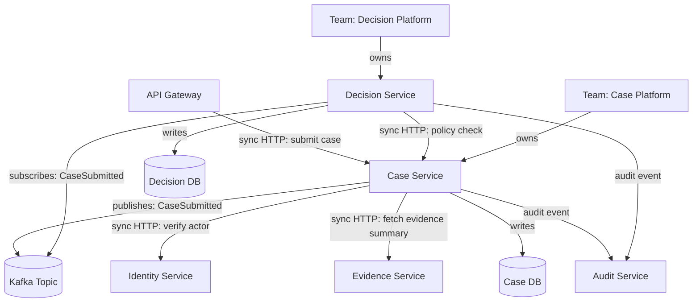
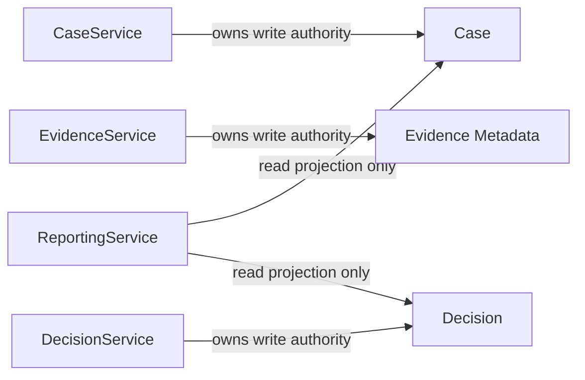
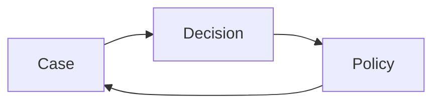
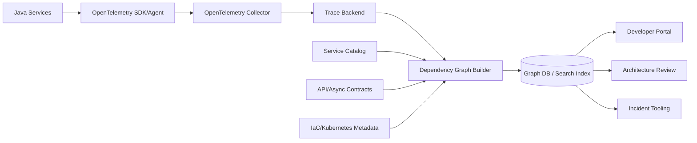
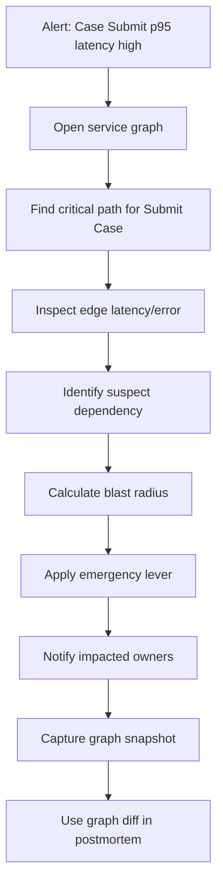

# Part 087 — Graph of Services and Dependency Intelligence

> Top 1% engineer tidak hanya melihat daftar service. Mereka melihat **graph**: siapa bergantung pada siapa, dependency mana yang kritikal, edge mana yang sinkron, data mana yang authoritative, tim mana yang owner, dan failure apa yang bisa menjalar ketika satu node bermasalah.

Microservices membuat organisasi mampu memecah ownership dan delivery. Tetapi setelah jumlah service melewati puluhan, sistem tidak lagi bisa dipahami dengan daftar repository, diagram statis, atau ingatan senior engineer.

Yang dibutuhkan adalah **dependency intelligence**: kemampuan membaca, mengukur, dan mengoperasikan hubungan antar service sebagai graph yang hidup.

Di part ini kita membahas:

- service graph sebagai model arsitektur runtime dan socio-technical;
- jenis graph yang perlu dibedakan;
- data source untuk membangun graph secara otomatis;
- algoritma sederhana untuk impact analysis;
- cara memodelkan blast radius, ownership, dependency criticality, dan risk propagation;
- implementasi Java sederhana untuk dependency graph;
- bagaimana graph dipakai dalam review arsitektur, incident response, migration, dan platform governance.

---

## 1. Masalah: microservices tidak gagal sebagai service tunggal

Service jarang gagal sendirian. Yang terjadi di production biasanya seperti ini:

1. `Identity Service` latency naik.
2. `Case Service`, `Decision Service`, dan `Notification Service` melakukan retry.
3. Thread pool di beberapa service penuh.
4. API Gateway mulai timeout.
5. User melihat error pada flow yang tampaknya tidak berhubungan.
6. Tim incident bingung karena setiap service dashboard terlihat “hampir normal” sampai semuanya sudah terlambat.

Masalahnya bukan hanya observability per-service. Masalahnya adalah kita tidak punya model eksplisit tentang **hubungan antar service**.

Diagram kotak-panah manual membantu onboarding, tetapi gagal untuk operasi harian karena:

- cepat basi;
- tidak punya metadata operational;
- tidak bisa ditanyakan secara programatik;
- tidak membedakan sync dependency, async dependency, data authority, ownership, dan deployment dependency;
- tidak bisa menghitung blast radius;
- tidak bisa dipakai sebagai gate otomatis.

Graph menyelesaikan ini dengan menjadikan hubungan antar service sebagai data.

---

## 2. Mental model: architecture as graph, not picture

Graph terdiri dari:

- **node**: service, API, database, topic, queue, workflow, team, runtime workload, tenant, external provider;
- **edge**: `calls`, `publishes`, `subscribes`, `owns`, `reads`, `writes`, `deploys-with`, `depends-on`, `runs-on`, `exposes`, `protects`;
- **metadata**: protocol, sync/async, criticality, SLO, owner, environment, region, retry policy, timeout, data classification, authentication mode, version, last-seen timestamp.

Bentuk sederhananya:



Diagram ini masih terlihat seperti diagram biasa. Bedanya: jika dibuat sebagai graph data, kita bisa bertanya:

- service apa saja yang terdampak jika `Identity Service` lambat?
- flow mana yang punya synchronous fan-out paling tinggi?
- dependency mana yang tidak punya timeout eksplisit?
- service mana yang dimiliki tim tanpa on-call?
- database mana yang dibaca langsung oleh lebih dari satu service?
- event mana yang punya banyak consumer tetapi tidak punya schema compatibility check?
- apakah ada dependency cycle antar bounded context?
- service mana yang menjadi single point of failure?

Jawaban ini tidak bisa didapat dari README statis.

---

## 3. Jangan campur semua graph menjadi satu

Kesalahan umum adalah membuat “service dependency graph” tunggal dan menganggap itu cukup. Dalam sistem nyata, ada beberapa graph berbeda.

### 3.1 Logical capability graph

Menjawab: **capability bisnis mana bergantung pada capability lain?**

Contoh:

- Case Intake bergantung pada Identity Verification;
- Enforcement Decision bergantung pada Case Assessment;
- Notification bergantung pada Decision Outcome.

Graph ini stabil dan cocok untuk architecture review.

### 3.2 Runtime call graph

Menjawab: **service mana memanggil service lain di runtime?**

Contoh edge:

- `case-service -> identity-service`, sync HTTP;
- `decision-service -> policy-service`, gRPC;
- `case-service -> audit-topic`, async publish.

Graph ini berubah berdasarkan deployment, feature flag, traffic path, dan runtime behavior.

### 3.3 API contract graph

Menjawab: **consumer mana bergantung pada provider contract apa?**

Edge penting:

- consumer endpoint;
- provider API operation;
- contract version;
- compatibility status;
- deprecation date.

Graph ini penting untuk release coordination.

### 3.4 Data authority graph

Menjawab: **service mana authoritative untuk data apa?**

Contoh:



Graph ini dipakai untuk mencegah shared-database coupling.

### 3.5 Ownership graph

Menjawab: **tim mana bertanggung jawab atas service dan dependency?**

Contoh edge:

- team owns service;
- service owns repository;
- team owns on-call rotation;
- service depends on platform capability;
- service has escalation path.

### 3.6 Deployment graph

Menjawab: **unit apa yang harus dideploy bersama?**

Jika terlalu banyak service harus release lockstep, architecture smell-nya kuat: mungkin ada contract coupling, schema coupling, atau workflow versioning yang buruk.

### 3.7 Failure propagation graph

Menjawab: **kegagalan node/edge mana bisa menjalar ke mana?**

Ini bukan sekadar call graph. Async dependency belum tentu memblokir immediate user response. Optional dependency belum tentu menggagalkan request. Dependency dengan fallback mungkin hanya menyebabkan degraded response.

Edge harus punya semantic:

```yaml
edge:
  from: case-service
  to: identity-service
  type: sync-http
  criticality: required
  timeout_ms: 300
  retry_policy: bounded-exponential-jitter
  fallback: deny-sensitive-action
  failure_effect: fail-closed
```

Tanpa semantic edge, graph bisa menyesatkan.

---

## 4. Data source untuk membangun dependency graph

Dependency intelligence tidak boleh bergantung pada input manual saja. Manual catalog berguna, tetapi harus diverifikasi terhadap runtime.

### 4.1 Service catalog

Service catalog menyimpan metadata deklaratif:

```yaml
apiVersion: backstage.io/v1alpha1
kind: Component
metadata:
  name: case-service
  description: Owns case lifecycle and case state transitions
  tags:
    - java
    - spring-boot
    - regulatory
spec:
  type: service
  lifecycle: production
  owner: team-case-platform
  system: enforcement-case-management
  providesApis:
    - case-command-api
    - case-query-api
  consumesApis:
    - identity-verification-api
    - evidence-summary-api
  dependsOn:
    - resource:default/case-db
    - resource:default/kafka-main
```

Catalog bagus untuk ownership, lifecycle, deklarasi API, dan dokumen arsitektur. Tetapi catalog tidak cukup untuk runtime truth.

### 4.2 Distributed tracing

Tracing memberi observed call graph:

- service A memanggil service B;
- endpoint mana yang memanggil endpoint mana;
- latency edge;
- error rate edge;
- fan-out;
- critical path;
- dependency yang tidak tercatat di catalog.

Tracing sangat berguna untuk menemukan hidden dependency.

### 4.3 Metrics

Metrics memberi sinyal kuantitatif:

- request rate per edge;
- error rate per dependency;
- latency percentile per dependency;
- saturation;
- queue depth;
- consumer lag;
- retry count;
- timeout count.

### 4.4 Logs

Logs memberi semantic event:

- dependency call failed because permission denied;
- fallback used;
- event rejected due to stale version;
- compensation started;
- policy decision denied.

### 4.5 API specs and contract registry

OpenAPI/protobuf/AsyncAPI/Pact-like contracts memberi declared contract graph:

- provider operation;
- consumer expectation;
- version compatibility;
- breaking-change risk;
- deprecated endpoint.

### 4.6 Infrastructure as Code

IaC memberi deployment/runtime graph:

- Kubernetes service;
- deployment;
- ingress;
- service account;
- network policy;
- secret dependency;
- database binding;
- topic/queue provisioning.

### 4.7 Source code scanning

Static analysis bisa menemukan:

- HTTP client base URL;
- Feign/WebClient/gRPC stub usage;
- Kafka topic names;
- database table access;
- package boundary violation;
- forbidden dependency.

Tetapi static analysis sering tidak tahu runtime config dan feature flags.

### 4.8 CI/CD metadata

Pipeline memberi:

- build artifact;
- deployment frequency;
- rollback frequency;
- last successful deployment;
- owner approval;
- environment promotion;
- change failure signal.

---

## 5. Graph schema minimal yang berguna

Model yang terlalu besar sulit dipakai. Mulai dari schema kecil tetapi tajam.

### 5.1 Node

```java
public record ServiceNode(
    String name,
    String ownerTeam,
    String lifecycle,
    String runtime,
    Criticality criticality,
    Set<String> tags
) {}

enum Criticality {
    LOW, MEDIUM, HIGH, CRITICAL
}
```

### 5.2 Edge

```java
public record DependencyEdge(
    String from,
    String to,
    DependencyType type,
    DependencyCriticality criticality,
    boolean synchronous,
    int timeoutMillis,
    boolean hasRetry,
    boolean hasFallback,
    String ownerNote
) {}

enum DependencyType {
    HTTP,
    GRPC,
    EVENT_PUBLISH,
    EVENT_SUBSCRIBE,
    DATABASE_WRITE,
    DATABASE_READ,
    CACHE,
    EXTERNAL_API,
    WORKFLOW_ACTIVITY,
    DEPLOYMENT
}

enum DependencyCriticality {
    REQUIRED,
    OPTIONAL,
    DEGRADED_ALLOWED,
    AUDIT_REQUIRED
}
```

### 5.3 Edge semantic lebih penting daripada edge existence

`A -> B` saja tidak cukup.

Yang penting:

- apakah edge synchronous?
- apakah edge blocking user response?
- apakah failure B menyebabkan A fail?
- apakah A punya fallback?
- apakah retry A memperburuk B?
- apakah edge membawa PII?
- apakah edge punya timeout?
- apakah edge melewati region?
- apakah edge punya owner yang jelas?

---

## 6. Impact analysis sederhana di Java

Kita mulai dari graph traversal sederhana.

```java
import java.util.*;

public final class ServiceGraph {
    private final Map<String, List<DependencyEdge>> outgoing = new HashMap<>();
    private final Map<String, List<DependencyEdge>> incoming = new HashMap<>();

    public void addEdge(DependencyEdge edge) {
        outgoing.computeIfAbsent(edge.from(), ignored -> new ArrayList<>()).add(edge);
        incoming.computeIfAbsent(edge.to(), ignored -> new ArrayList<>()).add(edge);
    }

    public Set<String> upstreamOf(String service) {
        return traverse(service, incoming);
    }

    public Set<String> downstreamOf(String service) {
        return traverse(service, outgoing);
    }

    private Set<String> traverse(String start, Map<String, List<DependencyEdge>> graph) {
        Set<String> visited = new LinkedHashSet<>();
        Deque<String> stack = new ArrayDeque<>();
        stack.push(start);

        while (!stack.isEmpty()) {
            String current = stack.pop();
            for (DependencyEdge edge : graph.getOrDefault(current, List.of())) {
                String next = edge.from().equals(current) ? edge.to() : edge.from();
                if (visited.add(next)) {
                    stack.push(next);
                }
            }
        }
        return visited;
    }
}
```

Pemakaian:

```java
var graph = new ServiceGraph();

graph.addEdge(new DependencyEdge(
    "case-service",
    "identity-service",
    DependencyType.HTTP,
    DependencyCriticality.REQUIRED,
    true,
    300,
    true,
    false,
    "Case submission must verify actor identity"
));

graph.addEdge(new DependencyEdge(
    "decision-service",
    "case-service",
    DependencyType.HTTP,
    DependencyCriticality.REQUIRED,
    true,
    500,
    true,
    false,
    "Decision needs case snapshot"
));

System.out.println(graph.upstreamOf("identity-service"));
// service yang berpotensi terdampak jika identity-service rusak
```

Ini masih primitif, tetapi cukup untuk menunjukkan fondasi: dependency bisa dianalisis secara programatik.

---

## 7. Blast radius analysis

Blast radius adalah estimasi dampak jika node atau edge gagal.

Untuk node `identity-service`, pertanyaan blast radius:

- service mana yang punya synchronous required dependency ke identity?
- user journey mana yang gagal?
- apakah ada fallback?
- apakah fallback fail-open atau fail-closed?
- apakah audit tetap tercatat?
- apakah retry dari consumer akan memperparah overload?
- apakah ada cache yang bisa memperpanjang availability?
- tenant mana yang terdampak?
- region mana yang terdampak?

### 7.1 Blast radius matrix

| Failure Target | Direct Consumers | Transitive Consumers | Critical Flows | Degraded Mode | Max Acceptable Duration |
|---|---:|---:|---|---|---:|
| identity-service | 8 | 19 | login, submit case, approve decision | deny sensitive actions | 5 minutes |
| audit-service | 14 | 27 | all regulated actions | block or buffer depending event type | 1 minute for required audit |
| evidence-service | 5 | 11 | evidence review | allow case view without evidence preview | 30 minutes |
| notification-service | 9 | 9 | outbound notification | queue and delay | 4 hours |

Blast radius tidak selalu berarti semua downstream gagal total. Yang dicari adalah **failure effect**.

### 7.2 Edge-level blast radius

Node bisa sehat, tetapi edge rusak:

- DNS failure antara namespace;
- mTLS certificate mismatch;
- incompatible API version;
- network policy terlalu ketat;
- topic ACL salah;
- database credential expired;
- retry policy berubah.

Karena itu graph harus punya edge metadata.

---

## 8. Dependency criticality taxonomy

Tidak semua dependency sama.

### 8.1 Required dependency

Jika dependency gagal, flow utama gagal.

Contoh:

- submit case butuh actor authorization;
- approve decision butuh policy decision;
- record regulated action butuh durable audit.

### 8.2 Optional dependency

Jika dependency gagal, flow tetap bisa lanjut tanpa data tambahan.

Contoh:

- recommendation widget;
- enrichment non-critical;
- UI hint.

### 8.3 Degradable dependency

Jika dependency gagal, response bisa turun kualitas.

Contoh:

- evidence preview tidak tersedia, tetapi metadata masih tampil;
- dashboard memakai cached summary;
- notification delayed.

### 8.4 Async dependency

Producer tidak menunggu consumer selesai, tetapi failure bisa muncul nanti.

Contoh:

- audit event queue backlog;
- reporting projection lag;
- notification delivery delayed.

Async edge tidak boleh diabaikan. Ia hanya menggeser failure dari request time ke processing time.

### 8.5 Control-plane dependency

Dependency hanya dibutuhkan untuk config, deployment, or policy update.

Contoh:

- feature flag service;
- config service;
- service catalog;
- policy bundle distribution.

Kegagalan control-plane sering tidak langsung terlihat, tetapi bisa menghambat recovery.

---

## 9. Graph queries yang bernilai tinggi

Dependency intelligence harus menghasilkan query yang langsung berguna.

### 9.1 Hidden dependency query

> Tampilkan runtime dependency yang muncul di tracing tetapi tidak ada di service catalog.

Nilai: menemukan coupling liar.

### 9.2 Missing timeout query

> Tampilkan synchronous edge tanpa timeout eksplisit.

Nilai: mencegah thread exhaustion dan cascading failure.

### 9.3 Retry amplification query

> Tampilkan chain dependency dengan retry di lebih dari satu layer.

Nilai: mencegah retry storm.

### 9.4 Shared database query

> Tampilkan database/table yang dibaca/ditulis oleh lebih dari satu service.

Nilai: menemukan distributed monolith.

### 9.5 Ownership gap query

> Tampilkan production service tanpa owner, on-call, runbook, atau SLO.

Nilai: operational governance.

### 9.6 Cycle query

> Tampilkan dependency cycle antar service atau bounded context.

Nilai: release coupling dan failure coupling.

### 9.7 Critical path query

> Untuk user journey `Submit Case`, tampilkan critical path runtime beserta p95 latency tiap edge.

Nilai: performance diagnosis.

### 9.8 Security propagation query

> Tampilkan semua path yang membawa PII dari service asal ke consumer/reporting/logging.

Nilai: privacy dan compliance.

---

## 10. Detecting cycles

Dependency cycle membuat service sulit diubah dan sulit dipulihkan.

Contoh buruk:



Cycle tidak selalu ilegal, tetapi harus dicurigai.

### 10.1 Jenis cycle

| Cycle | Risiko |
|---|---|
| Runtime sync cycle | deadlock logical, timeout amplification, cascading failure |
| API contract cycle | lockstep release |
| Data ownership cycle | unclear authority |
| Team ownership cycle | coordination bottleneck |
| Event cycle | event storm, infinite reaction |

### 10.2 Cycle breaking strategy

- ubah synchronous call menjadi event/projection;
- pindahkan capability ke service yang benar;
- buat published snapshot;
- buat policy service murni tanpa callback ke domain owner;
- gunakan workflow coordinator;
- pecah read dependency dari command dependency.

---

## 11. Runtime dependency graph dari OpenTelemetry

Tracing dapat menghasilkan observed dependency graph.

Span menyediakan informasi operasi antar sistem. Dengan semantic attributes yang konsisten, kita bisa mengelompokkan edge:

- service name;
- peer service;
- HTTP route;
- RPC method;
- DB system;
- messaging destination;
- status/error;
- duration.

Pipeline sederhana:



Important rule: runtime graph harus diberi **last seen**.

```yaml
edge:
  from: case-service
  to: identity-service
  observed:
    first_seen: 2026-06-01T10:12:00Z
    last_seen: 2026-07-05T08:00:00Z
    request_rate_per_minute: 1240
    p95_latency_ms: 78
    error_rate: 0.002
```

Edge yang tidak terlihat selama 90 hari mungkin sudah mati. Edge yang tiba-tiba muncul harus direview.

---

## 12. Ownership graph dan socio-technical risk

Service dependency juga dependency antar tim.

Jika `case-service` owned by `Team A`, `decision-service` owned by `Team B`, dan `policy-service` owned by `Team C`, maka setiap perubahan flow enforcement bisa butuh koordinasi tiga tim.

Ini bukan buruk secara otomatis. Tetapi graph harus menunjukkan cost koordinasi.

### 12.1 Team dependency smell

- satu user journey melewati terlalu banyak team boundary;
- service kritikal dimiliki tim tanpa on-call;
- banyak service dimiliki “platform team” padahal capability bisnis;
- no clear escalation path;
- shared service menjadi bottleneck approval;
- ownership berbeda antara repository, runtime, dan data.

### 12.2 Ownership edge metadata

```yaml
ownership:
  service: case-service
  owner_team: team-case-platform
  runtime_oncall: case-platform-oncall
  product_owner: enforcement-product
  escalation:
    primary: '#case-platform-alerts'
    secondary: '#regulatory-platform-incident'
  review_required_for:
    - api-breaking-change
    - data-authority-change
    - audit-contract-change
```

---

## 13. Dependency intelligence dalam incident response

Saat incident, graph membantu menjawab cepat:

- siapa terkena dampak?
- siapa owner dependency?
- apakah dependency required atau optional?
- flow mana harus dimatikan dulu?
- edge mana punya retry storm?
- apakah ada degraded mode?
- apakah ada emergency lever?

Incident workflow:



Graph snapshot penting untuk postmortem karena dependency mungkin berubah setelah incident.

---

## 14. Dependency intelligence dalam architecture review

Review service baru harus menjawab:

1. Node baru apa yang ditambahkan?
2. Edge baru apa yang dibuat?
3. Apakah edge sync atau async?
4. Apakah dependency required, optional, atau degradable?
5. Siapa owner provider?
6. Apakah provider punya SLO yang cukup?
7. Apakah timeout/retry/fallback jelas?
8. Apakah ada data authority yang dilanggar?
9. Apakah ada cycle baru?
10. Apakah blast radius meningkat?
11. Apakah service catalog diperbarui?
12. Apakah runtime telemetry akan membuktikan edge ini?

### Architecture review graph diff

```diff
+ service: evidence-assessment-service
+ edge: evidence-assessment-service -> evidence-service [sync-http, required, timeout=500ms]
+ edge: evidence-assessment-service -> policy-service [sync-grpc, required, timeout=300ms]
+ edge: evidence-assessment-service -> audit-topic [async-publish, audit-required]
- direct table read: evidence_assessment -> evidence_db.evidence_metadata
```

Graph diff lebih konkret daripada slide arsitektur.

---

## 15. Graph intelligence as platform guardrail

Dependency graph bisa dipakai sebagai automated guardrail.

Contoh policy:

- production service wajib punya owner;
- sync dependency wajib punya timeout;
- external API dependency wajib punya circuit breaker atau bulkhead;
- service tidak boleh direct read database service lain;
- dependency cycle antar bounded context harus direview;
- service yang expose PII wajib punya privacy metadata;
- audit-required flow wajib publish audit event;
- deprecated API tidak boleh punya consumer baru.

OPA/Rego-style pseudo-policy:

```rego
deny[msg] {
  edge := input.edges[_]
  edge.type == "sync-http"
  not edge.timeout_ms
  msg := sprintf("sync dependency %s -> %s has no timeout", [edge.from, edge.to])
}

deny[msg] {
  edge := input.edges[_]
  edge.type == "database-read"
  edge.from != edge.owner_service
  msg := sprintf("%s reads private database owned by %s", [edge.from, edge.owner_service])
}
```

---

## 16. Graph storage options

Tidak harus langsung memakai graph database.

| Option | Cocok untuk | Trade-off |
|---|---|---|
| YAML + generated docs | awal maturity | sulit query kompleks |
| relational tables | governance sederhana | recursive query bisa kompleks |
| search index | portal/search | graph traversal terbatas |
| graph database | dependency intelligence serius | operasional tambahan |
| observability backend service map | runtime view | biasanya kurang ownership/data semantics |

Mulai dari format sederhana, lalu evolve.

Minimal table model:

```sql
service_node(id, name, owner_team, lifecycle, criticality, last_seen_at)
dependency_edge(id, from_service, to_service, type, criticality, synchronous, timeout_ms, last_seen_at)
service_api(id, provider_service, api_name, version, lifecycle)
service_owner(service_id, team_id, oncall_rotation)
```

---

## 17. Common anti-patterns

### 17.1 Pretty graph, no action

Graph hanya dipakai untuk visualisasi. Tidak ada query, policy, review, atau incident workflow.

### 17.2 One graph to rule them all

Runtime call graph dicampur dengan ownership graph dan data graph tanpa edge semantics.

### 17.3 Manual catalog without runtime verification

Catalog terlihat rapi, tetapi tracing menunjukkan dependency liar yang tidak tercatat.

### 17.4 Runtime graph without ownership

Tracing menunjukkan service A memanggil service B, tetapi incident tetap lambat karena tidak ada owner/escalation.

### 17.5 No edge criticality

Semua dependency dianggap sama. Padahal optional widget dependency berbeda dari audit-required dependency.

### 17.6 No historical graph

Tidak ada snapshot dependency sebelum/selama/sesudah incident. Postmortem kehilangan evidence.

### 17.7 Graph ignored in CI/CD

Service baru bisa menambah sync dependency kritikal tanpa review otomatis.

---

## 18. Practical implementation roadmap

### Level 1 — Manual catalog

- daftar service;
- owner;
- repository;
- lifecycle;
- APIs provided/consumed;
- databases/topics owned.

### Level 2 — Runtime verification

- OpenTelemetry traces;
- dependency extraction;
- last-seen edge;
- mismatch between catalog and runtime.

### Level 3 — Risk metadata

- criticality;
- timeout/retry/fallback;
- data classification;
- SLO;
- escalation path.

### Level 4 — Automated checks

- no owner = fail;
- no timeout on sync edge = fail;
- direct DB access = fail;
- new critical dependency = approval required.

### Level 5 — Incident integration

- alert opens relevant dependency graph;
- blast radius generated;
- impacted owners notified;
- runbook linked;
- graph snapshot attached to incident.

### Level 6 — Architecture intelligence

- trend analysis;
- coupling score;
- service sprawl score;
- critical path latency;
- migration candidate discovery;
- organizational bottleneck detection.

---

## 19. Review checklist

Gunakan checklist ini saat meninjau graph sebuah service.

### Node

- Apakah service punya owner jelas?
- Apakah service punya lifecycle state?
- Apakah criticality didefinisikan?
- Apakah runtime environment jelas?
- Apakah data authority jelas?
- Apakah API surface terdaftar?

### Edge

- Apakah semua sync dependency punya timeout?
- Apakah retry policy bounded dan punya jitter?
- Apakah fallback/degraded behavior jelas?
- Apakah edge criticality didefinisikan?
- Apakah edge membawa PII/sensitive data?
- Apakah edge punya observed runtime signal?
- Apakah ada hidden dependency?

### Graph

- Apakah ada cycle?
- Apakah ada single point of failure?
- Apakah fan-out terlalu besar?
- Apakah blast radius diketahui?
- Apakah critical path user journey diketahui?
- Apakah service sprawl meningkat tanpa ownership?

---

## 20. Latihan desain

Ambil domain enforcement lifecycle:

- Case Intake
- Evidence Management
- Case Assessment
- Decisioning
- Notification
- Audit
- Reporting
- Identity
- Policy

Buat graph dengan node dan edge berikut:

1. sync call;
2. async event;
3. data ownership;
4. team ownership;
5. audit edge;
6. privacy edge;
7. workflow edge.

Lalu jawab:

- jika `Policy Service` down, flow mana gagal?
- jika `Audit Service` down, action mana harus diblokir?
- jika `Notification Service` lag 2 jam, apakah user journey gagal?
- jika `Case Service` mengubah event schema, consumer mana terkena?
- service mana yang menjadi central bottleneck?
- dependency mana yang bisa diubah menjadi read model?

---

## 21. Key takeaways

- Microservices harus dibaca sebagai graph, bukan daftar service.
- Graph yang berguna membedakan logical, runtime, API, data, ownership, deployment, dan failure graph.
- Edge semantic lebih penting daripada sekadar panah.
- Dependency intelligence menghubungkan architecture review, incident response, release governance, security, privacy, dan cost.
- Service catalog harus diverifikasi oleh runtime telemetry.
- Graph paling bernilai ketika bisa ditanyakan: blast radius, hidden dependency, missing timeout, retry amplification, cycle, ownership gap, dan data authority violation.

---

## References

- Backstage Software Catalog — centralized ownership and metadata for software ecosystem: https://backstage.io/docs/features/software-catalog/
- Backstage Catalog Graph — relations between entities such as ownership, grouping, APIs, and dependencies: https://backstage.io/api/next/modules/_backstage_plugin-catalog-graph.html
- OpenTelemetry Semantic Conventions — common names for operations/data across telemetry: https://opentelemetry.io/docs/concepts/semantic-conventions/
- OpenTelemetry Service Semantic Conventions — service as logical component producing telemetry: https://opentelemetry.io/docs/specs/semconv/resource/service/
- OpenTelemetry Trace Semantic Conventions — spans represent operations in and between systems: https://opentelemetry.io/docs/specs/semconv/general/trace/
