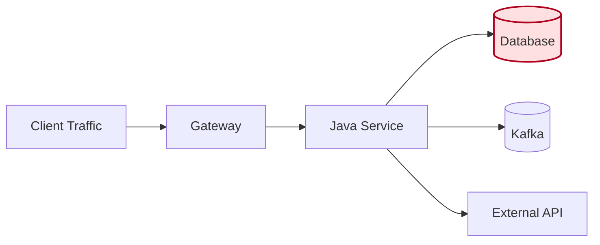
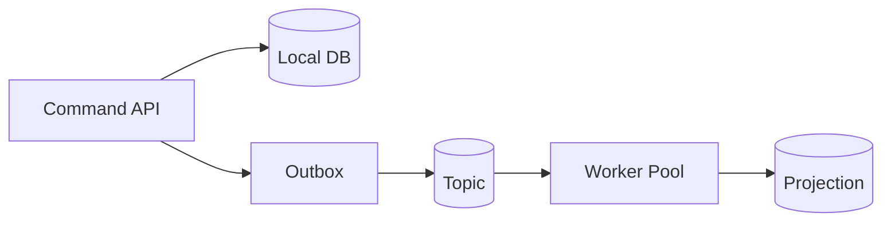
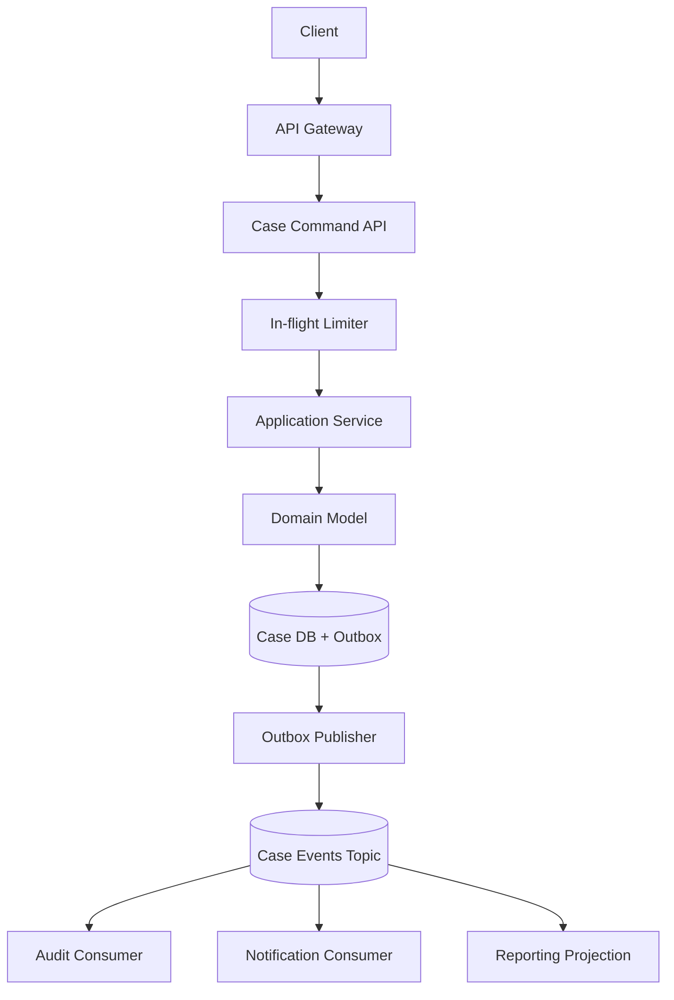

# Part 088 — High-Throughput Java Microservices

> High throughput bukan berarti “pakai async di mana-mana”. High throughput berarti sistem mampu menyelesaikan banyak unit kerja per waktu dengan latency, resource, failure rate, dan cost yang masih berada dalam boundary yang diterima bisnis.

Java modern memberi banyak pilihan untuk membangun microservice throughput tinggi:

- platform threads;
- virtual threads;
- reactive/event-loop model;
- asynchronous messaging;
- batching;
- queue-based workers;
- optimized database access;
- JVM tuning;
- native image untuk kasus tertentu;
- autoscaling dan capacity modeling.

Tetapi pilihan yang salah bisa membuat sistem lebih cepat di benchmark lokal dan lebih rapuh di production.

Di part ini kita membahas mental model dan desain praktis untuk high-throughput Java microservices.

---

## 1. Definisi throughput yang benar

Throughput adalah jumlah pekerjaan selesai per unit waktu.

Contoh:

- request per second;
- command processed per second;
- messages consumed per second;
- decisions evaluated per second;
- cases indexed per minute;
- audit events persisted per second.

Throughput bukan:

- jumlah thread;
- jumlah pod;
- jumlah CPU;
- jumlah koneksi database;
- response cepat untuk satu request lokal;
- benchmark synthetic tanpa dependency nyata.

Sebuah service throughput tinggi jika:

1. mampu memproses volume target;
2. latency percentile masih dalam SLO;
3. error rate rendah;
4. resource usage stabil;
5. backlog tidak tumbuh tanpa batas;
6. downstream tidak dihancurkan oleh traffic;
7. graceful degradation tetap bekerja saat overload.

---

## 2. Mental model: throughput, latency, concurrency

Tiga konsep ini sering tertukar.

### 2.1 Throughput

Berapa banyak pekerjaan selesai per waktu.

```text
throughput = completed_work / time
```

### 2.2 Latency

Berapa lama satu unit kerja selesai.

```text
latency = completion_time - start_time
```

### 2.3 Concurrency

Berapa banyak pekerjaan aktif dalam waktu bersamaan.

Little's Law memberi intuisi:

```text
concurrency ≈ throughput × latency
```

Jika service menangani 1.000 request/detik dan latency rata-rata 200 ms:

```text
concurrency ≈ 1000 × 0.2 = 200 in-flight requests
```

Jika latency naik ke 2 detik pada throughput yang sama:

```text
concurrency ≈ 1000 × 2 = 2000 in-flight requests
```

Artinya latency spike bisa membuat thread, memory, connection pool, queue, dan request context meledak.

---

## 3. Throughput selalu dibatasi bottleneck

Service throughput tidak ditentukan oleh framework tercepat. Ia dibatasi oleh bottleneck paling sempit.

Kemungkinan bottleneck:

- CPU;
- memory allocation/GC;
- database connection pool;
- database lock/query plan;
- remote dependency latency;
- network bandwidth;
- serialization/deserialization;
- Kafka consumer lag;
- thread pool;
- event loop blocking;
- rate limit external provider;
- downstream SLO;
- audit storage;
- cache miss storm.

Mermaid view:



Jika database hanya mampu 300 write/sec, service tidak akan sehat pada 2.000 command/sec walaupun Java layer mampu menerima 20.000 HTTP request/sec.

Top 1% engineer mencari bottleneck, bukan hanya mengganti framework.

---

## 4. Workload taxonomy

Sebelum memilih concurrency model, klasifikasikan workload.

| Workload | Karakter | Model umum |
|---|---|---|
| CPU-bound | parsing berat, crypto, rules engine, compression | bounded pool sesuai CPU |
| I/O-bound blocking | DB call, HTTP call, file/network I/O | virtual threads atau async I/O |
| I/O-bound non-blocking | high fan-out, streaming | reactive/event loop |
| Queue worker | event/message processing | bounded consumer concurrency |
| Batch | large scan/write | chunking, checkpoint, backpressure |
| Workflow activity | durable step dengan retry/timeout | worker pool + idempotency |
| Low-latency API | small fast operation | minimal allocation, tight dependency budget |

Tidak ada satu model terbaik untuk semua.

---

## 5. Java concurrency models

### 5.1 Platform thread per request

Model klasik servlet/container:

```text
1 request ≈ 1 platform thread while processing
```

Kelebihan:

- mudah dipahami;
- debugging sederhana;
- kompatibel dengan banyak library blocking;
- stack trace familiar.

Kelemahan:

- platform thread mahal;
- blocking I/O menahan OS thread;
- thread pool penuh menyebabkan queueing/timeout;
- high concurrency sulit jika banyak remote call lambat.

Cocok untuk:

- throughput sedang;
- dependency cepat;
- tim butuh simplicity;
- service tidak membutuhkan ratusan ribu concurrent wait.

### 5.2 Virtual threads

Virtual threads adalah thread ringan di Java modern. Mereka memungkinkan gaya imperative/blocking tetap dipakai, tetapi blocking operation tidak selalu mengikat OS thread selama menunggu I/O.

Mental model:

```text
many virtual threads multiplexed over fewer carrier platform threads
```

Kelebihan:

- coding model sederhana;
- cocok untuk I/O-bound service;
- stack trace tetap natural;
- mengurangi tekanan pada platform thread;
- bagus untuk service yang melakukan banyak blocking wait.

Batasan:

- tidak membuat CPU lebih cepat;
- tidak memperbesar database capacity;
- tidak menghilangkan kebutuhan timeout/backpressure;
- blocking library yang pinning/monopolizing tetap bisa bermasalah;
- terlalu banyak concurrent request bisa tetap menghabiskan memory, connection pool, atau downstream capacity.

Contoh Java:

```java
try (var executor = java.util.concurrent.Executors.newVirtualThreadPerTaskExecutor()) {
    var futures = customerIds.stream()
        .map(id -> executor.submit(() -> fetchCustomerRisk(id)))
        .toList();

    for (var future : futures) {
        RiskScore score = future.get();
        // combine result
    }
}
```

Jangan membaca ini sebagai izin untuk membuat fan-out tanpa batas. Tetap butuh concurrency limiter.

```java
public final class BoundedRemoteClient {
    private final Semaphore permits;
    private final ExternalRiskClient client;

    public BoundedRemoteClient(int maxConcurrentCalls, ExternalRiskClient client) {
        this.permits = new Semaphore(maxConcurrentCalls);
        this.client = client;
    }

    public RiskScore fetch(String subjectId) throws InterruptedException {
        if (!permits.tryAcquire(100, TimeUnit.MILLISECONDS)) {
            throw new OverloadedDependencyException("risk-client concurrency limit reached");
        }
        try {
            return client.fetch(subjectId);
        } finally {
            permits.release();
        }
    }
}
```

Virtual thread menyelesaikan sebagian masalah thread scalability, bukan masalah resource governance.

### 5.3 Reactive/event-loop model

Reactive/event-loop memakai sedikit thread untuk menangani banyak I/O non-blocking.

Kelebihan:

- bagus untuk high-concurrency I/O;
- efisien jika pipeline non-blocking end-to-end;
- cocok untuk streaming;
- bagus ketika backpressure eksplisit.

Kelemahan:

- debugging lebih sulit;
- blocking call bisa merusak event loop;
- cognitive load lebih tinggi;
- stack trace tidak selalu natural;
- tidak semua library cocok.

Contoh konsep:

```java
Mono<DecisionView> view = caseClient.fetchCase(caseId)
    .zipWith(evidenceClient.fetchSummary(caseId))
    .zipWith(policyClient.evaluate(caseId))
    .map(tuple -> DecisionView.from(tuple));
```

Reactive cocok jika stack benar-benar non-blocking. Jika pipeline reactive tetapi isinya JDBC blocking di event loop, hasilnya buruk.

### 5.4 Queue-based worker model

Untuk throughput tinggi yang tidak harus synchronous, queue sering lebih sehat.



Kelebihan:

- menyerap burst;
- bisa scale consumer;
- retry dan DLQ lebih eksplisit;
- user response tidak menunggu semua work selesai.

Risiko:

- backlog tersembunyi;
- ordering;
- duplicate processing;
- poison message;
- delayed consistency;
- operational complexity.

---

## 6. Throughput design starts from budget

Jangan mulai dari “pakai virtual threads” atau “pakai WebFlux”. Mulai dari budget.

Contoh service: `case-command-service`

Target:

```yaml
user_journey: submit_case
peak_rps: 1200
p95_latency_budget_ms: 400
p99_latency_budget_ms: 900
error_budget: 99.9% monthly
max_db_write_tps: 900
max_identity_rps: 1500
max_audit_publish_lag_ms: 1000
```

Budget breakdown:

| Step | Budget p95 |
|---|---:|
| gateway/auth overhead | 30 ms |
| request validation | 10 ms |
| domain rule | 20 ms |
| identity dependency | 80 ms |
| DB transaction | 120 ms |
| outbox write | included in DB tx |
| response serialization | 10 ms |
| buffer | 130 ms |

Jika identity dependency p95 naik ke 300 ms, seluruh service p95 tidak mungkin tetap 400 ms kecuali fallback, cache, async split, atau flow redesign.

---

## 7. Concurrency limiter before thread pool explosion

High throughput service harus punya batas eksplisit.

Tanpa batas:

- semua request diterima;
- thread/virtual thread menumpuk;
- DB pool penuh;
- retry naik;
- latency naik;
- timeout naik;
- service tampak hidup tetapi tidak berguna.

Dengan admission control:

- request ditolak cepat;
- system tetap stabil;
- caller bisa retry sesuai budget;
- SLO lebih mudah dipertahankan.

Contoh guard sederhana:

```java
public final class InFlightLimiter {
    private final Semaphore permits;

    public InFlightLimiter(int maxInFlight) {
        this.permits = new Semaphore(maxInFlight);
    }

    public <T> T execute(Callable<T> task) throws Exception {
        if (!permits.tryAcquire()) {
            throw new TooManyRequestsException("service is saturated");
        }
        try {
            return task.call();
        } finally {
            permits.release();
        }
    }
}
```

HTTP mapping:

```text
TooManyRequestsException -> 429 Too Many Requests
include Retry-After only if you can estimate safe retry time
```

---

## 8. Database pool sizing is capacity policy

Database connection pool sering menjadi bottleneck atau amplifier.

Pool terlalu kecil:

- request menunggu koneksi;
- latency naik;
- thread menumpuk.

Pool terlalu besar:

- database overload;
- lock contention;
- context switching;
- query performance turun;
- semua pod bersama-sama menghancurkan DB.

Pool size harus dihitung secara sistemik:

```text
total_db_connections = replicas × pool_size_per_replica
```

Jika database aman di 300 koneksi dan ada 20 replica:

```text
pool_size_per_replica <= 15
```

Tetapi jangan langsung pakai 15. Sisakan margin untuk admin, migration, workers, reporting, dan failover.

### Rule praktis

- bounded pool;
- short transaction;
- no remote call inside transaction;
- statement timeout;
- lock timeout;
- query plan monitoring;
- pool wait metric;
- database saturation metric;
- per-endpoint DB usage metric.

Java/Hikari-style config mental model:

```yaml
spring.datasource.hikari:
  maximum-pool-size: 12
  minimum-idle: 2
  connection-timeout: 250ms
  validation-timeout: 100ms
  leak-detection-threshold: 5s
```

Angka di atas bukan template universal. Ia harus diturunkan dari capacity DB, replica count, latency budget, dan workload.

---

## 9. High-throughput API design

### 9.1 Avoid chatty operations

Lebih baik satu command intent-revealing daripada banyak endpoint kecil yang harus dipanggil berurutan.

Buruk:

```text
POST /cases
POST /cases/{id}/parties
POST /cases/{id}/allegations
POST /cases/{id}/evidence-links
POST /cases/{id}/submit
```

Jika user action bisnis sebenarnya “submit case package”, pertimbangkan:

```text
POST /case-submissions
```

Dengan body command yang atomic secara bisnis.

### 9.2 Use async boundary for slow side effects

Jangan membuat response user menunggu semua side effect:

- audit event publish harus durable, tetapi consumer audit processing bisa async;
- notification bisa async;
- reporting projection bisa async;
- search indexing bisa async.

### 9.3 Use pagination and streaming carefully

Pagination buruk bisa membunuh DB.

Prefer:

- cursor/keyset pagination untuk dataset besar;
- bounded page size;
- indexed sort;
- no unbounded export through synchronous API;
- async export job untuk data besar.

### 9.4 Avoid synchronous fan-out explosion

Jika satu endpoint memanggil 12 service sinkron, throughput dan latency akan buruk.

Mitigasi:

- read model/materialized view;
- BFF caching;
- async projection;
- parallel fan-out dengan deadline;
- optional fragments;
- degrade response.

---

## 10. Serialization and payload cost

Pada throughput tinggi, JSON parsing bisa signifikan.

Optimisasi:

- batasi payload field;
- hindari deeply nested object yang tidak perlu;
- gunakan DTO spesifik per use case;
- kompresi hanya jika network bottleneck dan CPU cukup;
- streaming parse untuk payload besar;
- binary protocol untuk internal high-volume path jika justified;
- hindari logging full payload.

Trade-off:

| Choice | Kelebihan | Biaya |
|---|---|---|
| JSON | readable, ecosystem luas | CPU/payload lebih besar |
| Protobuf/gRPC | compact, schema kuat | tooling/evolution discipline |
| Avro | bagus untuk event/data pipeline | schema registry discipline |
| Plain text/log-like | cepat untuk kasus tertentu | contract semantics lemah |

---

## 11. JVM and GC boundary

JVM tuning penting, tetapi bukan langkah pertama.

Urutan yang benar:

1. pahami workload;
2. ukur bottleneck;
3. kurangi allocation yang jelas buruk;
4. benar-kan pool/timeout/backpressure;
5. baru tuning JVM.

### 11.1 Metrics JVM wajib

- heap used/committed/max;
- non-heap/metaspace;
- allocation rate;
- GC pause;
- GC frequency;
- thread count;
- virtual thread count jika tersedia;
- direct buffer memory;
- class loading;
- CPU process/system;
- safepoint pause;
- container memory limit.

### 11.2 Allocation discipline

High-throughput Java service sering mati pelan-pelan karena allocation rate.

Sumber allocation:

- mapping DTO berlapis;
- JSON parsing besar;
- logging string concatenation;
- exception sebagai control flow;
- unnecessary collection copy;
- huge response aggregation;
- unbounded cache;
- request-scoped object terlalu banyak.

Contoh buruk:

```java
logger.info("payload=" + objectMapper.writeValueAsString(request));
```

Lebih sehat:

```java
logger.info("case submission received caseId={} partyCount={} evidenceCount={}",
    command.caseId(),
    command.parties().size(),
    command.evidenceRefs().size()
);
```

### 11.3 Container memory

Memory Java di container bukan hanya heap.

```text
total memory = heap + metaspace + thread stacks + direct buffers + code cache + native + agents + safety margin
```

Jika container limit 512 MiB dan heap diset 480 MiB, service kemungkinan tidak stabil.

---

## 12. CPU-bound service design

CPU-bound workload tidak terbantu banyak oleh virtual threads.

Contoh CPU-bound:

- cryptographic verification;
- large rules evaluation;
- PDF/image processing;
- compression;
- ML inference CPU;
- complex scoring.

Design rule:

- bound concurrency near CPU core count;
- separate CPU-heavy worker from request API;
- use queue if processing long;
- measure CPU saturation;
- avoid stealing event-loop thread;
- consider specialized infrastructure.

Java example:

```java
int cores = Runtime.getRuntime().availableProcessors();
ExecutorService cpuPool = Executors.newFixedThreadPool(Math.max(2, cores));
```

Do not use unbounded virtual threads for CPU-heavy tasks. You will create scheduling contention, not throughput.

---

## 13. I/O-bound service design

I/O-bound service spends most time waiting.

Options:

- platform threads with bounded pool;
- virtual threads;
- reactive non-blocking stack;
- async messaging.

### 13.1 Virtual-thread style

Good for blocking-style code:

```java
public DecisionView getDecisionView(String caseId) {
    try (var executor = Executors.newVirtualThreadPerTaskExecutor()) {
        Future<CaseSnapshot> caseFuture = executor.submit(() -> caseClient.fetch(caseId));
        Future<EvidenceSummary> evidenceFuture = executor.submit(() -> evidenceClient.fetch(caseId));
        Future<PolicyResult> policyFuture = executor.submit(() -> policyClient.evaluate(caseId));

        return DecisionView.combine(
            caseFuture.get(250, TimeUnit.MILLISECONDS),
            evidenceFuture.get(250, TimeUnit.MILLISECONDS),
            policyFuture.get(250, TimeUnit.MILLISECONDS)
        );
    } catch (TimeoutException e) {
        throw new GatewayTimeoutException("decision view dependencies exceeded deadline", e);
    } catch (Exception e) {
        throw new DependencyFailureException("failed to build decision view", e);
    }
}
```

Masalah contoh di atas: executor dibuat per request. Dalam production, gunakan lifecycle-managed executor atau structured concurrency saat tersedia dan sesuai baseline Java yang dipakai.

### 13.2 Reactive style

Good for non-blocking end-to-end:

```java
Mono<DecisionView> result = Mono.zip(
        caseClient.fetch(caseId),
        evidenceClient.fetch(caseId),
        policyClient.evaluate(caseId)
    )
    .timeout(Duration.ofMillis(250))
    .map(tuple -> DecisionView.combine(tuple.getT1(), tuple.getT2(), tuple.getT3()));
```

Kunci reactive: jangan blocking di event loop.

---

## 14. Messaging throughput

Kafka/Rabbit/SQS-style processing butuh mental model berbeda.

Throughput worker dipengaruhi oleh:

- partition count;
- consumer group size;
- max poll records/batch size;
- processing time per message;
- DB writes per message;
- retry strategy;
- DLQ handling;
- ordering requirement;
- idempotency store;
- commit strategy;
- downstream capacity.

### 14.1 Consumer concurrency

```text
max parallelism per topic ≈ partition count
```

Jika topic punya 12 partition, 50 consumer instance tidak akan memberi 50x parallelism untuk satu consumer group. Banyak consumer akan idle.

### 14.2 Batch processing

Batching bisa menaikkan throughput tetapi menambah latency dan failure complexity.

Rule:

- batch size bounded;
- batch time bounded;
- partial failure strategy jelas;
- idempotency per item;
- checkpoint/offset commit hati-hati;
- observe oldest message age, bukan hanya lag count.

### 14.3 DLQ is not throughput solution

DLQ menyelamatkan pipeline dari poison message, tetapi DLQ yang tumbuh adalah incident.

---

## 15. Caching for throughput

Cache bisa meningkatkan throughput dan menurunkan latency, tetapi juga bisa membuat correctness kacau.

Jenis cache:

- local in-memory cache;
- distributed cache;
- CDN/edge cache;
- read model cache;
- request coalescing cache;
- negative cache.

Caching bagus untuk:

- reference data;
- expensive but stable lookup;
- feature/config/policy bundle;
- public-ish read data;
- computed summaries.

Caching berbahaya untuk:

- authorization decision tanpa invalidation jelas;
- tenant-sensitive data tanpa tenant key;
- privacy-sensitive data tanpa lifecycle;
- workflow state yang harus immediate;
- data dengan strict freshness.

Cache key harus mencakup:

```text
tenant + subject + purpose + version + locale + policy-context
```

Bukan hanya `id`.

---

## 16. High-throughput without destroying downstream

Service cepat yang menghancurkan downstream bukan service bagus.

Setiap dependency harus punya:

- timeout;
- concurrency limit;
- retry budget;
- circuit breaker;
- rate limit;
- fallback/degraded mode jika sesuai;
- metric per dependency.

Dependency budget example:

```yaml
dependency: policy-service
max_concurrent_calls_per_pod: 50
timeout_ms: 250
max_retry_attempts: 1
retry_on:
  - connection-reset
  - 503
no_retry_on:
  - 400
  - 401
  - 403
  - business-denied
fallback: fail-closed
```

---

## 17. Benchmarking that does not lie

Benchmark lokal sering bohong karena:

- tidak ada real DB latency;
- tidak ada TLS;
- tidak ada serialization cost;
- tidak ada connection pool contention;
- tidak ada downstream rate limit;
- tidak ada GC warmup;
- tidak ada noisy neighbor;
- tidak ada production payload distribution;
- hanya mengukur average latency;
- tidak mengukur backlog dan saturation.

Benchmark yang lebih berguna:

1. warm up JVM;
2. gunakan payload realistis;
3. gunakan dependency realistis atau controlled emulator;
4. ukur p50/p95/p99;
5. ukur error rate;
6. ukur CPU, memory, GC, thread, pool wait;
7. ukur DB p95 dan lock wait;
8. ukur downstream errors;
9. jalankan sustained test;
10. jalankan spike test;
11. jalankan soak test;
12. jalankan failure injection.

### Load test result card

```yaml
service: case-command-service
version: 2.18.0
scenario: submit-case-peak
rps: 1200
duration: 45m
p50_ms: 82
p95_ms: 210
p99_ms: 620
error_rate: 0.04%
cpu_avg: 68%
heap_used_p95: 410MiB
gc_pause_p99_ms: 35
db_pool_wait_p95_ms: 12
identity_p95_ms: 70
audit_publish_lag_p95_ms: 180
conclusion: pass
bottleneck: db write p99 during spike
next_action: optimize insert path and measure lock wait
```

---

## 18. Performance architecture review

Review high-throughput service dengan pertanyaan berikut.

### Workload

- Apakah workload CPU-bound atau I/O-bound?
- Apakah throughput target jelas?
- Apakah latency budget jelas?
- Apakah peak, average, dan burst berbeda?
- Apakah traffic tenant-specific?

### Concurrency

- Apa concurrency model?
- Apa batas in-flight request?
- Apa batas per dependency?
- Apa thread/virtual thread/event loop risk?
- Apakah blocking call ada di event loop?

### Data

- Apakah query punya index?
- Apakah transaksi pendek?
- Apakah pool size dihitung terhadap replica?
- Apakah write path bisa menerima peak?
- Apakah read model diperlukan?

### Failure

- Apa yang terjadi saat downstream lambat?
- Apakah retry bounded?
- Apakah backlog punya limit?
- Apakah overload ditolak cepat?
- Apakah degraded mode valid secara bisnis?

### Observability

- Apakah metric throughput/latency/error/saturation ada?
- Apakah p95/p99 per endpoint dan dependency tersedia?
- Apakah pool wait terlihat?
- Apakah queue lag dan oldest age terlihat?
- Apakah GC/allocation terlihat?

---

## 19. Anti-patterns

### 19.1 Thread count as throughput strategy

Menambah thread tanpa menghitung DB/downstream capacity hanya memindahkan bottleneck.

### 19.2 Virtual threads as magic scaling

Virtual threads meningkatkan scalability untuk banyak waiting tasks, bukan mempercepat CPU atau database.

### 19.3 Reactive cargo cult

Reactive stack dengan blocking call internal sering lebih buruk daripada imperative service yang jelas.

### 19.4 Unbounded queues

Unbounded queue memberi ilusi stabil sampai memory penuh dan latency tidak terkendali.

### 19.5 p50-driven optimization

User production menderita di p95/p99, bukan average demo.

### 19.6 Pool too large

Pool besar bisa menghancurkan dependency.

### 19.7 Cache without correctness model

Cache bisa mempercepat jawaban yang salah.

### 19.8 Benchmark without failure

Throughput saat semua dependency sehat tidak cukup. Sistem harus diuji saat dependency lambat dan error.

---

## 20. Decision matrix: choosing the model

| Situation | Prefer | Why |
|---|---|---|
| Simple CRUD-ish API, moderate RPS | platform threads / servlet | simplicity |
| I/O-bound blocking dependencies, high concurrency | virtual threads | simpler code, better thread scalability |
| streaming/high fan-out non-blocking | reactive | explicit backpressure, event-loop efficiency |
| slow side effects | async messaging | decouple user response from processing |
| CPU-heavy work | bounded CPU pool / separate worker | avoid oversubscription |
| reporting/export large data | async job + pagination/projection | avoid synchronous long request |
| strict low latency | minimal dependency path | reduce fan-out and allocation |

---

## 21. Example architecture: high-throughput case submission



Design properties:

- synchronous path minimal;
- DB transaction local;
- outbox ensures durable event publication;
- audit required event is stored transactionally;
- notification/reporting async;
- API bounded by in-flight limiter;
- DB pool bounded;
- outbox publisher has backpressure;
- consumers idempotent;
- metrics per stage.

---

## 22. Key takeaways

- Throughput, latency, and concurrency are linked. You cannot tune one blindly.
- Bottleneck determines throughput. Framework choice is rarely the first bottleneck.
- Virtual threads are powerful for I/O-bound Java services, but still need timeouts, limits, and downstream capacity control.
- Reactive is powerful when the whole path is non-blocking and the team can handle the model.
- CPU-bound workloads need bounded parallelism, not unlimited concurrency.
- Database pool sizing is architecture policy, not config trivia.
- High-throughput systems must reject, degrade, buffer, or backpressure intentionally.
- Measure p95/p99, saturation, pool wait, queue oldest age, GC, and dependency latency.
- A fast service that overloads its dependencies is not production-grade.

---

## References

- JEP 444 Virtual Threads — virtual threads are lightweight threads for high-throughput concurrent applications: https://openjdk.org/jeps/444
- Oracle Java 21 Virtual Threads documentation: https://docs.oracle.com/en/java/javase/21/core/virtual-threads.html
- Reactive Streams — asynchronous stream processing with non-blocking backpressure: https://www.reactive-streams.org/
- Spring WebFlux reference — reactive-stack web framework and WebClient model: https://docs.spring.io/spring-framework/reference/web/webflux.html
- Google SRE — monitoring distributed systems and golden signals: https://sre.google/sre-book/monitoring-distributed-systems/
