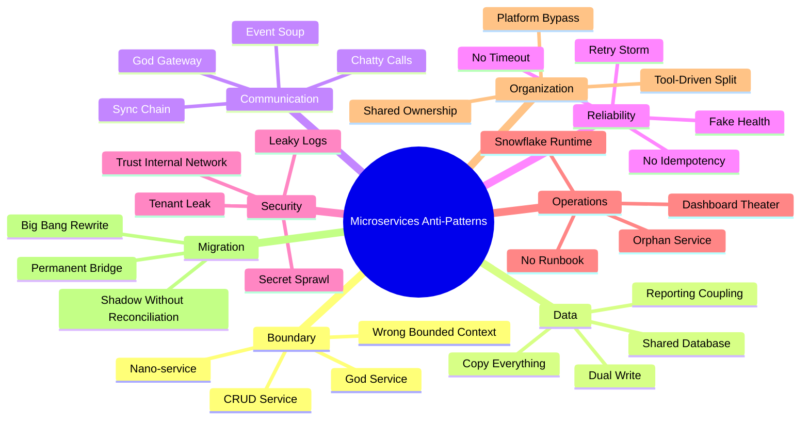
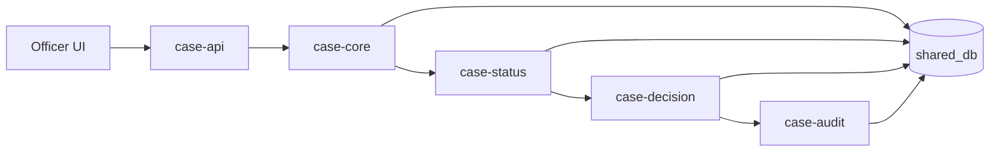
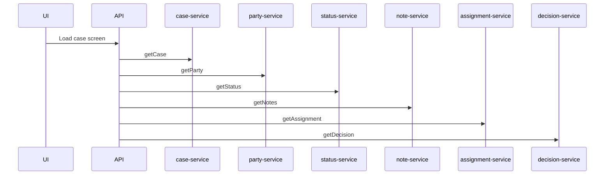
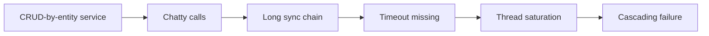
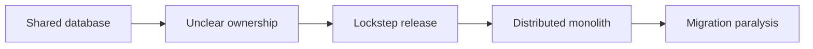
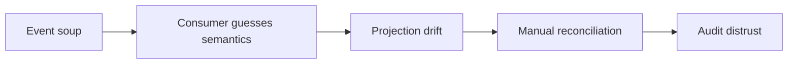
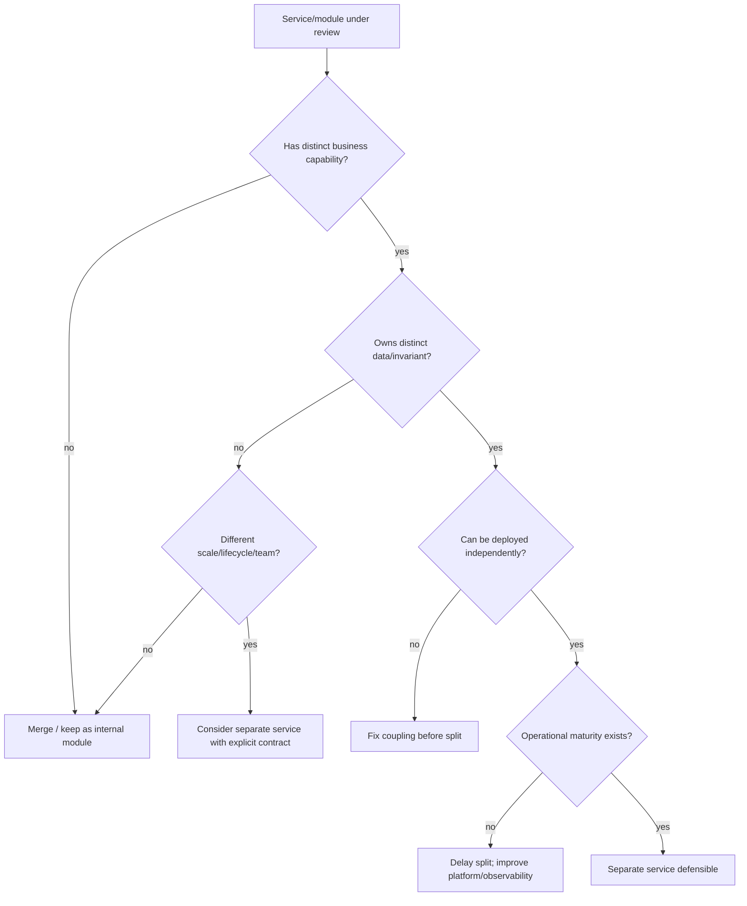

# Part 090 — Microservices Architecture Anti-Patterns

> Anti-pattern adalah solusi yang terlihat benar di permukaan, sering terasa produktif di awal, tetapi menghasilkan coupling, risk, cost, atau fragility yang semakin mahal ketika sistem tumbuh.

Microservices punya banyak anti-pattern karena ia menggoda engineer untuk memecah sesuatu yang belum dipahami.

Service bisa terlihat modern:

- containerized;
- punya REST API;
- deploy di Kubernetes;
- punya pipeline;
- punya dashboard;
- punya Kafka topic;
- punya service mesh;
- punya tracing.

Tetapi tetap bisa menjadi distributed monolith.

Part ini adalah katalog smell dan anti-pattern yang harus bisa dikenali sebelum terlambat.

---

## 1. Mental model: anti-pattern bukan dosa, tapi signal

Jangan membaca anti-pattern sebagai hinaan. Baca sebagai diagnostic signal.

Pertanyaan senior engineer:

1. Smell apa yang terlihat?
2. Evidence apa yang mendukung?
3. Consequence apa yang sudah terjadi atau akan terjadi?
4. Apakah anti-pattern ini temporary migration compromise atau desain permanen?
5. Apa remediation paling kecil dengan risiko terkendali?
6. Apa fitness function untuk mencegah regresi?

Anti-pattern yang sengaja dan sementara bisa diterima.

Anti-pattern yang tidak disadari dan tidak punya exit plan berbahaya.

---

## 2. Taxonomy anti-pattern



Anti-pattern jarang berdiri sendiri. Biasanya satu smell memicu smell lain.

Contoh:

- CRUD service → chatty calls → long sync chain → retry storm → cascading failure.
- shared database → unclear ownership → independent deployment gagal → distributed monolith.
- no owner → stale docs → bad AI context → wrong generated change.

---

## 3. Anti-pattern 1 — Nano-service

### Smell

Service terlalu kecil sampai overhead-nya lebih besar dari value-nya.

Contoh:

- `case-status-service` hanya menyimpan enum status;
- `case-comment-service` hanya wrapper satu table;
- `case-number-generator-service` dipanggil sync oleh semua workflow;
- satu aggregate dipecah menjadi banyak service kecil.

### Mengapa terlihat menarik

- terasa “pure microservices”;
- tiap service terlihat sederhana;
- deployment terlihat independen;
- team merasa decomposition sudah dilakukan.

### Failure mode

- latency naik karena banyak network hop;
- transaction menjadi saga tanpa alasan bisnis;
- debugging sulit;
- ownership overhead tinggi;
- observability cost naik;
- endpoint menjadi chatty;
- perubahan kecil butuh banyak repository.

### Detection

- service punya kurang dari satu meaningful capability;
- satu user action selalu memanggil 5+ service kecil;
- service tidak punya lifecycle/invariant sendiri;
- tidak ada team yang menganggap service itu product;
- deployment independen tidak pernah benar-benar digunakan.

### Correction

- merge kembali menjadi module;
- gabungkan service berdasarkan capability;
- pertahankan internal modularity;
- hanya split ketika ada ownership/scale/lifecycle pressure nyata.

---

## 4. Anti-pattern 2 — Distributed monolith

### Smell

Banyak service, tetapi harus dirilis bersama, gagal bersama, dan berubah bersama.



### Mengapa terlihat menarik

- terlihat seperti microservices;
- tim bisa mengklaim sudah modern;
- deployment pipeline banyak;
- diagram terlihat modular.

### Failure mode

- release harus lockstep;
- database schema change memecahkan banyak service;
- satu dependency lambat membuat semua lambat;
- satu service down memutus seluruh workflow;
- ownership kabur.

### Detection

- shared database;
- synchronous chain panjang;
- semua service deploy pada window yang sama;
- API change membutuhkan banyak PR serentak;
- satu service tidak bisa dites tanpa semua service lain;
- tidak ada bounded context jelas.

### Correction

- identifikasi capability boundary;
- putus shared database;
- definisikan source of truth;
- ubah chatty sync menjadi coarse-grained command/query;
- gunakan expand-contract;
- mulai dari high-value seam, bukan big bang.

---

## 5. Anti-pattern 3 — Shared database

### Smell

Beberapa service membaca dan menulis database/schema/table yang sama.

Contoh:

```text
case-service      -> case_db.case
workflow-service  -> case_db.case_state_transition
report-service    -> case_db.case
decision-service  -> case_db.case_decision
```

Jika semua hanya read untuk migration sementara, risikonya lebih rendah. Jika banyak writer, source of truth rusak.

### Mengapa terlihat menarik

- cepat;
- tidak perlu API;
- query mudah;
- reporting gampang;
- legacy compatibility terjaga.

### Failure mode

- tidak ada data owner;
- schema migration berisiko tinggi;
- independent deployment gagal;
- business invariant tersebar di SQL;
- audit sulit direkonstruksi;
- service saling mengubah state tanpa kontrak.

### Detection

- lebih dari satu service punya DB credentials ke schema sama;
- grant write tersebar;
- migration butuh approval banyak tim;
- table comment tidak menunjukkan owner;
- domain event tidak ada karena semua membaca table langsung.

### Correction

- jadikan DB private implementation detail;
- pilih single writer;
- expose API/event/read model;
- buat database access inventory;
- cabut grant bertahap;
- gunakan projection untuk reporting.

---

## 6. Anti-pattern 4 — CRUD-by-entity service

### Smell

Service dibuat berdasarkan nama entity/table, bukan capability.

Contoh:

- `case-service`;
- `case-status-service`;
- `case-comment-service`;
- `case-attachment-service`;
- `case-history-service`;
- `case-assignment-service`.

Entity bukan otomatis service.

### Mengapa terlihat menarik

- mudah dipetakan dari ERD;
- controller bisa digenerate;
- backlog terlihat cepat bergerak;
- “single responsibility” disalahpahami.

### Failure mode

- user journey jadi chatty;
- invariant lintas entity tidak punya owner;
- transaction boundary kacau;
- API menjadi CRUD generik;
- business process tersebar.

### Detection

- service name sama dengan table name;
- endpoint dominan `/create`, `/update`, `/delete`;
- tidak ada business command;
- domain language tidak muncul di API;
- service tidak punya lifecycle/business policy sendiri.

### Correction

- decomposition by business capability;
- identifikasi aggregate dan invariant;
- buat task-oriented command API;
- gabungkan entity yang berubah bersama;
- pisahkan read model jika query butuh denormalisasi.

---

## 7. Anti-pattern 5 — God service

### Smell

Satu service menjadi pusat semua rule, workflow, integration, dan state.

Contoh:

- `core-service`;
- `orchestrator-service` yang tahu semua detail domain;
- `case-platform-service` yang menjadi tempat semua fitur baru.

### Mengapa terlihat menarik

- cepat menambahkan fitur;
- satu tempat untuk business logic;
- mudah dipanggil consumer;
- menghindari distributed transaction.

### Failure mode

- deployment risk tinggi;
- cognitive load besar;
- ownership blur;
- boundary sulit diekstrak;
- satu service menjadi bottleneck organisasi dan runtime.

### Detection

- semua tim sering mengubah service yang sama;
- package structure menjadi campuran domain;
- service punya terlalu banyak database/table;
- incident impact luas;
- SLO terlalu banyak user journey.

### Correction

- capability map;
- internal modularization dulu;
- extract berdasarkan lifecycle/invariant;
- pisahkan supporting capability;
- buat ownership internal sebelum service extraction.

---

## 8. Anti-pattern 6 — God gateway

### Smell

API gateway/BFF memuat business logic, authorization domain rule, workflow, aggregation berat, dan data transformation kompleks.

### Mengapa terlihat menarik

- frontend cepat;
- gateway sudah menjadi entry point;
- semua data bisa digabung di sana;
- satu tempat untuk cross-cutting concerns.

### Failure mode

- gateway menjadi monolith baru;
- domain rule duplikat;
- service owner kehilangan control;
- gateway deploy mempengaruhi semua client;
- security policy kabur.

### Detection

- gateway punya database sendiri untuk domain state;
- gateway memutuskan business transition;
- gateway tahu terlalu banyak internal API;
- gateway punya banyak conditional flow per tenant/product;
- gateway punya test domain lebih banyak dari edge test.

### Correction

- gateway owns edge concerns;
- BFF owns client experience;
- domain service owns business rule;
- aggregation harus punya failure contract;
- complex workflow pindah ke application/workflow service.

---

## 9. Anti-pattern 7 — Chatty mesh

### Smell

Satu user action menghasilkan banyak remote call kecil.



### Mengapa terlihat menarik

- tiap service punya endpoint kecil;
- reuse tinggi;
- data selalu “fresh”;
- tidak perlu read model.

### Failure mode

- latency fan-out;
- partial failure visible ke user;
- retry amplification;
- observability sulit;
- gateway/BFF menjadi orchestrator berat.

### Detection

- p95 user journey = sum banyak dependency;
- endpoint granular dipanggil dalam loop;
- trace punya banyak span kecil;
- fan-out > 5 untuk screen umum;
- tidak ada staleness contract.

### Correction

- coarse-grained query API;
- BFF aggregation dengan failure policy;
- materialized read model;
- caching dengan explicit freshness;
- reduce remote call in loops.

---

## 10. Anti-pattern 8 — Event soup

### Smell

Banyak event dipublish tanpa ownership, semantics, schema lifecycle, consumer contract, atau ordering model.

### Mengapa terlihat menarik

- async terlihat scalable;
- producer tidak perlu tahu consumer;
- integration terasa loose-coupled;
- mudah menambahkan consumer.

### Failure mode

- consumer menebak makna event;
- event menjadi data dump;
- breaking change tidak terdeteksi;
- duplicate/out-of-order merusak read model;
- DLQ tidak ditangani;
- audit trail ambigu.

### Detection

- event name generik: `DataChanged`, `Updated`, `NotificationEvent`;
- event payload sama dengan DB row;
- topic tidak punya owner;
- schema registry tidak dipakai;
- consumer tidak idempotent;
- tidak ada causation/correlation ID.

### Correction

- domain event vs integration event;
- event envelope stable;
- schema evolution policy;
- owner dan consumer registry;
- idempotent consumer;
- DLQ/replay/reconciliation plan.

---

## 11. Anti-pattern 9 — Synchronous saga

### Smell

Distributed business transaction dimodelkan sebagai chain synchronous calls panjang, tetapi disebut saga.

```text
A -> B -> C -> D -> E
```

Jika D gagal, A mencoba rollback B dan C dengan HTTP call. Ini bukan saga yang kuat. Ini distributed transaction manual dengan failure mode lebih buruk.

### Mengapa terlihat menarik

- mudah dipahami;
- terasa seperti transaction biasa;
- response langsung ke user;
- tidak perlu workflow state.

### Failure mode

- timeout di tengah meninggalkan unknown outcome;
- compensation gagal;
- user menunggu lama;
- retry menyebabkan duplicate side effect;
- observability buruk.

### Detection

- business transaction lintas 3+ service via HTTP;
- compensation dipanggil sync dari request thread;
- tidak ada saga state;
- tidak ada idempotency key;
- tidak ada timeout policy.

### Correction

- durable saga state;
- orchestration/workflow untuk proses panjang;
- async command/reply;
- compensation sebagai business action;
- status endpoint untuk progress;
- idempotency per step.

---

## 12. Anti-pattern 10 — RPC without deadlines

### Smell

Service memanggil dependency tanpa timeout/deadline jelas.

### Mengapa terlihat menarik

- default client “works locally”;
- engineer menghindari failure handling;
- timeout dianggap operational concern.

### Failure mode

- thread pool habis;
- connection pool habis;
- request menumpuk;
- cascading failure;
- retry memperburuk overload.

### Detection

- HTTP/gRPC clients tidak punya timeout;
- timeout sama untuk semua dependency;
- no cancellation;
- p99 latency naik saat dependency lambat;
- thread dump penuh waiting IO.

### Correction

- define end-to-end deadline;
- split connect/read/write/request timeout;
- propagate deadline;
- enforce client library defaults;
- alert on timeout rate.

---

## 13. Anti-pattern 11 — Retry storm by default

### Smell

Semua failure di-retry tanpa memahami idempotency, overload, atau budget.

### Mengapa terlihat menarik

- transient failure sering sembuh;
- retry membuat demo lebih stabil;
- library mudah dikonfigurasi.

### Failure mode

- load multiplier;
- duplicate side effect;
- downstream makin overload;
- request latency melebar;
- incident makin panjang.

### Detection

- retry ada di gateway, mesh, client, SDK sekaligus;
- max attempts tinggi;
- no jitter;
- retry untuk 4xx/business error;
- no retry budget metric.

### Correction

- retry only safe/idempotent operations;
- cap attempts;
- exponential backoff + jitter;
- retry budget;
- circuit breaker/load shedding;
- avoid layered retries.

---

## 14. Anti-pattern 12 — Global transaction fantasy

### Smell

Team berusaha membuat ACID lintas service tanpa menerima distributed trade-off.

### Mengapa terlihat menarik

- menjaga model monolith;
- “semua harus consistent sekarang”; 
- business tidak diberi consistency language;
- developer ingin rollback sederhana.

### Failure mode

- coupling tinggi;
- availability turun;
- transaction coordinator menjadi critical dependency;
- lock contention lintas service;
- rollback tidak cocok dengan side effect eksternal.

### Detection

- proposal memakai 2PC untuk service independen;
- service harus share transaction context;
- remote call inside DB transaction;
- business process tidak punya state model;
- compensation tidak didefinisikan.

### Correction

- local transaction per service;
- outbox/inbox;
- saga/workflow;
- explicit consistency window;
- business compensation;
- reconciliation.

---

## 15. Anti-pattern 13 — Copy everything everywhere

### Smell

Setiap service menyimpan salinan besar dari data service lain “agar tidak perlu call”.

### Mengapa terlihat menarik

- query cepat;
- dependency runtime berkurang;
- reporting gampang.

### Failure mode

- stale data tidak terkendali;
- privacy risk;
- update propagation sulit;
- storage cost naik;
- consumer tidak tahu authoritative source.

### Detection

- banyak table snapshot tanpa staleness contract;
- no data lineage;
- no deletion propagation;
- sensitive data tersebar;
- conflict resolution tidak ada.

### Correction

- snapshot minimal;
- classify reference vs copied fact;
- define freshness/staleness;
- use projection owner;
- data minimization;
- deletion/privacy workflow.

---

## 16. Anti-pattern 14 — Fake health

### Smell

`/health` hijau, tetapi service tidak bisa melayani user journey.

### Mengapa terlihat menarik

- easy endpoint;
- Kubernetes butuh probe;
- dashboard terlihat hijau.

### Failure mode

- traffic dikirim ke pod yang tidak ready;
- incident terlambat terdeteksi;
- liveness restart loop;
- dependency failure disembunyikan.

### Detection

- health hanya return 200;
- readiness tidak mempertimbangkan critical dependency;
- liveness melakukan deep check;
- overload tetap ready;
- no startup probe untuk slow startup.

### Correction

- define startup/liveness/readiness semantics;
- readiness for traffic acceptance;
- liveness only unrecoverable stuck process;
- health groups;
- synthetic transaction for user journey.

---

## 17. Anti-pattern 15 — Dashboard theater

### Smell

Banyak dashboard, sedikit diagnosis.

### Mengapa terlihat menarik

- observability terlihat mature;
- management melihat grafik;
- team merasa aman.

### Failure mode

- alert noise;
- incident debugging tetap manual;
- no SLO;
- metric cardinality cost tinggi;
- dashboard tidak menjawab “user impact”.

### Detection

- dashboard tidak punya owner;
- tidak ada runbook link;
- tidak ada p95/p99/error budget;
- metric label unbounded;
- no business metric.

### Correction

- SLO-based dashboard;
- RED/USE metrics;
- runbook-linked alert;
- trace/log/metric correlation;
- delete unused dashboard.

---

## 18. Anti-pattern 16 — Log everything, structure nothing

### Smell

Log sangat banyak tetapi tidak bisa dipakai diagnosis.

### Mengapa terlihat menarik

- “kalau ada masalah, kita cari di log”;
- debug cepat saat development;
- murah di awal.

### Failure mode

- cost tinggi;
- PII leakage;
- search sulit;
- no correlation;
- noise saat incident.

### Detection

- no JSON schema;
- no correlationId/traceId;
- stack trace berulang;
- sensitive payload logged;
- log level tidak konsisten.

### Correction

- structured logs;
- stable event names;
- redaction;
- sampling;
- correlation/causation ID;
- log only decision-relevant events.

---

## 19. Anti-pattern 17 — Trust internal network

### Smell

Service menganggap request internal otomatis trusted.

### Mengapa terlihat menarik

- simple;
- semua service di cluster yang sama;
- gateway sudah auth.

### Failure mode

- lateral movement;
- confused deputy;
- missing object-level authorization;
- tenant data leak;
- admin endpoint exposed internally.

### Detection

- no service identity;
- no mTLS;
- internal endpoint bypass authorization;
- trust header dari caller;
- no network policy.

### Correction

- zero trust service-to-service;
- workload identity;
- mTLS;
- object/action authorization;
- network policy;
- deny by default.

---

## 20. Anti-pattern 18 — Tenant leak

### Smell

Tenant isolation hanya “field biasa”, tidak menjadi boundary desain.

### Mengapa terlihat menarik

- mudah implement;
- cukup tambah `tenant_id`;
- single DB lebih murah.

### Failure mode

- cross-tenant data exposure;
- cache leak;
- background job salah tenant;
- metrics/logs bocor;
- noisy neighbor.

### Detection

- query tanpa tenant predicate;
- cache key tidak include tenant;
- message tidak membawa tenant context;
- logs tidak punya tenant classification;
- admin API lintas tenant tanpa policy.

### Correction

- tenant context as first-class;
- repository guard;
- cache key policy;
- tenant-aware messaging;
- isolation tests;
- noisy neighbor limits.

---

## 21. Anti-pattern 19 — Workflow hidden in cron

### Smell

Business process panjang disembunyikan di scheduled job, DB polling, dan status flag.

### Mengapa terlihat menarik

- cepat;
- tidak perlu workflow engine;
- mudah deploy;
- cocok untuk batch awal.

### Failure mode

- state tidak terlihat;
- retry tidak terkendali;
- compensation tidak jelas;
- SLA sulit dipantau;
- audit trail tidak lengkap;
- duplicate processing.

### Detection

- cron job mengubah business state besar;
- no workflow instance ID;
- status enum terlalu banyak;
- manual DB update saat stuck;
- no runbook for stuck process.

### Correction

- explicit state machine;
- workflow table or engine;
- idempotent step;
- timer/SLA metrics;
- compensation and retry policy;
- operational visibility.

---

## 22. Anti-pattern 20 — Orphan service

### Smell

Service berjalan di production tetapi tidak punya owner jelas.

### Mengapa terlihat menarik

- service “sudah stabil”;
- team lama pindah;
- tidak ada yang mau mengambil ownership.

### Failure mode

- vulnerability tidak diperbaiki;
- dependency usang;
- incident escalates nowhere;
- docs stale;
- cost terus berjalan;
- breaking change tidak punya reviewer.

### Detection

- service catalog owner kosong;
- CODEOWNERS tidak valid;
- runbook tidak ada;
- last deployment sangat lama;
- on-call tidak tahu service.

### Correction

- assign owner or retire;
- classify lifecycle state;
- production readiness review;
- dependency update;
- deprecation plan;
- service catalog reconciliation.

---

## 23. Anti-pattern 21 — Permanent migration bridge

### Smell

Temporary integration bridge menjadi permanen.

### Mengapa terlihat menarik

- migration belum selesai;
- bridge menyelamatkan compatibility;
- semua takut cutover final.

### Failure mode

- double maintenance;
- duplicated logic;
- hidden data path;
- inconsistent behavior;
- migration never ends.

### Detection

- bridge tidak punya expiry;
- no migration owner;
- traffic masih lewat old path setelah window selesai;
- no cutover metrics;
- no decommission checklist.

### Correction

- define bridge lifecycle;
- add traffic metrics;
- cohort rollout;
- reconciliation;
- cutover gate;
- deletion milestone.

---

## 24. Anti-pattern 22 — Tool-driven architecture

### Smell

Architecture dipilih karena tool sedang populer, bukan karena constraint sistem.

Contoh:

- semua service harus reactive;
- semua komunikasi harus Kafka;
- semua workflow harus choreography;
- semua service harus pakai service mesh;
- semua domain harus event sourced;
- semua deployment harus multi-region active-active.

### Mengapa terlihat menarik

- terlihat modern;
- hiring/branding bagus;
- demo menarik;
- vendor docs meyakinkan.

### Failure mode

- complexity tidak justified;
- team tidak siap mengoperasikan;
- debugging sulit;
- cost tinggi;
- business problem tetap tidak selesai.

### Detection

- ADR tidak menjelaskan rejected alternatives;
- tool disebut sebelum problem;
- tidak ada skill readiness;
- tidak ada rollback strategy;
- production constraints tidak dibahas.

### Correction

- start from forces/constraints;
- define decision criteria;
- run spike with exit criteria;
- review operational cost;
- prefer boring solution when sufficient.

---

## 25. Anti-pattern 23 — AI-generated architecture without guardrails

### Smell

AI dipakai membuat service, API, atau integration tanpa context pack, source citation, fitness function, dan human ownership.

### Mengapa terlihat menarik

- sangat cepat;
- output terlihat rapi;
- bisa membuat banyak boilerplate;
- memberi rasa produktivitas tinggi.

### Failure mode

- wrong boundary;
- hidden coupling;
- insecure code;
- hallucinated dependency;
- no idempotency;
- no audit trail;
- generated docs tidak sesuai runtime.

### Detection

- PR besar tanpa ADR;
- generated service tanpa owner;
- no tests for invariant/failure;
- no architecture rule;
- AI output tidak cite source.

### Correction

- require context pack;
- use AI as draft/review only;
- enforce CI/fitness function;
- require CODEOWNERS;
- limit agent permissions;
- create ADR for new service.

---

## 26. Anti-pattern chains

Anti-pattern paling berbahaya adalah chain.

### 26.1 CRUD chain



### 26.2 Data chain



### 26.3 Event chain



Senior review should identify the chain, not only the local smell.

---

## 27. Smell detection questions

Use these in architecture review.

### Boundary

- Can this service be explained as a business capability?
- Does it own meaningful invariants?
- Can it deploy independently without coordinated release?
- Is it too small to justify operational overhead?
- Is it too broad for one team to own?

### Data

- Who is the writer of each table/entity?
- Is database access private?
- Are read models owned and rebuildable?
- Is data duplication intentional and documented?
- Is PII copied only when necessary?

### Communication

- How many hops for critical user journey?
- Are calls coarse-grained?
- Are timeouts/deadlines defined?
- Are events semantically named?
- Are consumers registered?

### Reliability

- What happens when dependency is slow?
- What happens when dependency is down?
- Are retries bounded and safe?
- Is idempotency implemented?
- Can the service degrade gracefully?

### Operations

- Who owns the service?
- Where is the runbook?
- What SLO does it support?
- What alert pages a human?
- Can production behavior be explained from telemetry?

---

## 28. Anti-pattern review scorecard

| Dimension | Green | Yellow | Red |
|---|---|---|---|
| Boundary | capability-owned | mixed responsibility | CRUD/entity split |
| Data | single writer | temporary shared read | shared write DB |
| Release | independent | coordinated sometimes | lockstep required |
| Communication | coarse-grained | some fan-out | chatty mesh |
| Reliability | timeout/retry/idempotent | partial policy | default/unbounded |
| Observability | SLO + traces + runbook | dashboard only | no useful signal |
| Security | zero-trust + object auth | gateway-only auth | internal trust |
| Ownership | clear owner/on-call | shared owner | orphan |
| Migration | exit plan | unclear timing | permanent bridge |
| Cost | unit cost known | cost estimated | cost invisible |

Use this scorecard for initial triage, not as mechanical truth.

---

## 29. Remediation strategy

Do not fix all anti-patterns at once.

Use risk-based remediation.

### Step 1 — Stabilize

- add timeout;
- cap retries;
- add health/readiness semantics;
- add runbook;
- assign owner;
- add observability.

### Step 2 — Make ownership visible

- service catalog;
- data owner table;
- dependency graph;
- event consumer registry;
- ADR.

### Step 3 — Reduce coupling

- remove remote calls inside transaction;
- coarse-grain API;
- introduce read model;
- break shared database write path;
- define compatibility window.

### Step 4 — Migrate safely

- expand-contract;
- shadow compare;
- reconcile;
- cohort rollout;
- cutover gate;
- retire temporary bridge.

### Step 5 — Prevent regression

- architecture fitness function;
- CI policy;
- CODEOWNERS;
- production readiness review;
- service lifecycle governance.

---

## 30. Example remediation: shared database to owned data

Initial state:

```text
case-service writes case_db.case
workflow-service writes case_db.case_state_transition
decision-service writes case_db.case_decision
report-service reads all tables directly
```

Target:

```text
case-service owns case lifecycle
workflow-service owns orchestration state only
decision-service owns decision lifecycle
reporting-service owns reporting projection
```

Migration:

1. inventory database grants;
2. identify writers;
3. define owner per table;
4. expose missing API/event;
5. introduce outbox events;
6. build reporting projection;
7. switch readers;
8. switch writers;
9. remove old grants;
10. add fitness check for forbidden DB access.

---

## 31. Example fitness function: prevent shared DB regression

```yaml
architecturePolicy:
  databases:
    case_db:
      ownerService: case-service
      allowedWriters:
        - case-service
      allowedReaders:
        - case-service
        - migration-shadow-reader
      expiryForExceptions: 2026-09-30
```

CI/platform check:

```text
Fail deployment if service outside allowedWriters uses write credentials to case_db.
Warn if exception expiry is within 14 days.
Fail if exception is expired.
```

---

## 32. Example fitness function: no remote call inside transaction

```java
class ForbiddenTransactionRemoteCallRuleTest {

    // Pseudo-rule: implementation depends on static analysis strategy.
    // The point is architectural: remote clients must not be invoked
    // from methods annotated as transactional application mutation boundary.

    @Test
    void transactionalMethodsShouldNotDependOnHttpClientAdapters() {
        // Use ArchUnit/custom bytecode/source analysis in real implementation.
    }
}
```

Why:

- DB locks are held while waiting remote network;
- timeout leaves ambiguous state;
- retries can duplicate side effects;
- cascading failure becomes more likely.

---

## 33. Decision tree: split, merge, or keep?



This decision tree prevents “split because microservices”.

---

## 34. Anti-pattern remediation prioritization

Prioritize by:

1. user impact;
2. incident frequency;
3. regulatory/security risk;
4. release bottleneck;
5. cost burn;
6. team cognitive load;
7. migration dependency.

High-priority examples:

- shared write database on regulated audit data;
- no timeout on tier-1 dependency;
- tenant leak risk;
- orphan service with public API;
- retry storm in gateway;
- workflow hidden in cron for SLA-critical process.

Lower priority examples:

- slightly imperfect package structure;
- non-critical dashboard duplication;
- temporary migration bridge with clear expiry;
- internal module that might become service later.

---

## 35. Anti-pattern vs trade-off

Not every ugly thing is wrong.

| Situation | Could be acceptable if... |
|---|---|
| Shared database read | temporary, read-only, owner known, expiry exists |
| God service | early monolith phase, modular internally, split pressure not proven |
| Sync call | low latency, critical consistency, timeout defined |
| Denormalized copy | staleness contract and privacy policy exist |
| Gateway aggregation | view-specific, no domain decision, failure policy exists |
| Cron workflow | small non-critical batch, idempotent, observable |
| Service mesh retry | coordinated with app retry, budgeted, observed |

Architecture maturity is not about purity. It is about knowing which compromise exists and owning its consequences.

---

## 36. Architecture review prompt for anti-patterns

Use this when reviewing a design:

```text
Review this microservices design for anti-patterns.
Do not give generic advice.
For each suspected anti-pattern, include:
- name
- evidence from the design
- why it is risky
- what would confirm or falsify it
- smallest safe remediation
- whether it can be accepted temporarily
- required exit condition if accepted

Focus on boundary, data ownership, communication, reliability, observability, security, ownership, migration, and cost.
```

---

## 37. Senior engineer heuristics

A mature engineer recognizes these signals quickly:

- “We need all services deployed together” → distributed monolith risk.
- “Just read the table directly” → data ownership violation.
- “Internal calls do not need auth” → zero-trust violation.
- “Kafka solves coupling” → event soup risk.
- “Retry fixes transient failures” → retry storm risk.
- “Gateway can handle that logic” → god gateway risk.
- “This service is simple, no runbook needed” → orphan/operability risk.
- “We will remove the bridge later” → permanent migration bridge risk.
- “AI generated the structure” → governance risk.
- “Dashboard is green” → fake health/dashboard theater risk.

---

## 38. Latihan

### Latihan 1 — Smell mapping

Ambil desain berikut:

```text
officer-ui -> gateway -> case-service -> party-service -> address-service -> region-service
case-service, decision-service, workflow-service all write case_db
all events published to topic `case-updates`
```

Identifikasi minimal 5 anti-pattern dan remediation terkecil.

### Latihan 2 — Shared database exit plan

Buat exit plan 6 langkah untuk menghapus write access `workflow-service` ke `case_db`.

### Latihan 3 — Chatty API redesign

Ubah API berikut menjadi query model yang lebih sehat:

```text
GET /cases/{id}
GET /cases/{id}/status
GET /cases/{id}/assignment
GET /cases/{id}/party
GET /cases/{id}/decision
GET /cases/{id}/latest-evidence
```

Tentukan staleness contract.

### Latihan 4 — Anti-pattern exception ADR

Buat ADR untuk menerima temporary shared read database selama migration. Wajib mencakup:

- reason;
- owner;
- expiry;
- allowed queries;
- monitoring;
- exit plan;
- fitness function.

---

## 39. Ringkasan

Microservices anti-pattern muncul ketika sistem terlihat terdistribusi, tetapi ownership, data, lifecycle, dan failure boundary belum benar.

Anti-pattern paling mahal biasanya bukan karena teknologi salah, tetapi karena keputusan tidak eksplisit:

- service tanpa capability;
- data tanpa owner;
- API tanpa contract;
- event tanpa semantics;
- retry tanpa budget;
- health tanpa makna;
- service tanpa owner;
- migration tanpa exit;
- AI tanpa guardrail.

Top-level engineer tidak hanya hafal daftar anti-pattern. Ia bisa melihat chain of consequences:

> boundary salah → data ownership kabur → release lockstep → runtime coupling → incident sulit → governance mahal.

Tujuan part ini adalah memberi radar. Ketika radar kuat, pattern tidak lagi dipilih karena trend. Pattern dipilih karena cocok dengan force, constraint, dan risiko nyata sistem.

---

## Referensi

- Martin Fowler — Microservices: https://martinfowler.com/articles/microservices.html
- Martin Fowler — Monolith First: https://martinfowler.com/bliki/MonolithFirst.html
- Martin Fowler — How to break a Monolith into Microservices: https://martinfowler.com/articles/break-monolith-into-microservices.html
- Chris Richardson — Database per Service: https://microservices.io/patterns/data/database-per-service.html
- AWS Prescriptive Guidance — Decomposing monoliths into microservices: https://docs.aws.amazon.com/prescriptive-guidance/latest/modernization-decomposing-monoliths/welcome.html
- Azure Architecture Center — Strangler Fig pattern: https://learn.microsoft.com/en-us/azure/architecture/patterns/strangler-fig
- OWASP API Security Project: https://owasp.org/www-project-api-security/
